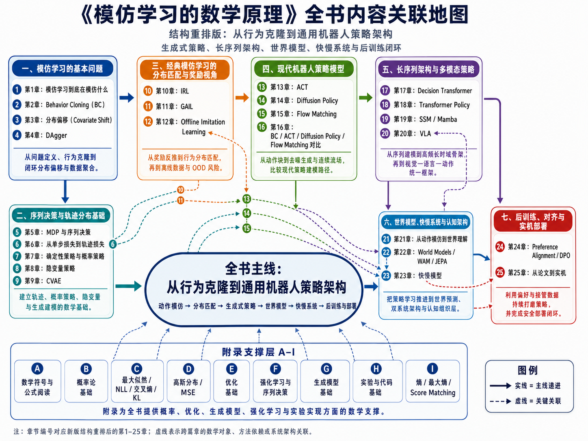

# 《模仿学习的数学原理》工程扩展版说明

本版本是在“结构重排版（第1–25章含附录）”基础上新增 **第八篇：工程落地与可信评估** 后形成的工程扩展版。

本轮进一步补入一条全书级阅读主线：

> **视觉引导机械臂抓取与放置任务**。

这条主线不是新增一个独立项目教程，而是作为全书统一例子：读者在学习状态、观测、动作、轨迹、策略、BC、DAgger、ACT、Diffusion Policy、VLA、World Model、Sim-to-Real、OPE 和数据闭环时，都可以回到同一台机械臂、同一批遥操作示范、同一个“从抓取到放置”的连续控制任务中理解公式。

## 写作缘起

本书的写作受到赵世钰老师《强化学习的数学原理》的重要启发。赵老师的这本书给我很大触动：它并不是简单罗列强化学习算法，而是从基本概念、数学结构和问题动机出发，逐步引出 Bellman 方程、动态规划、蒙特卡洛方法、时序差分、值函数近似和策略梯度等内容。更难得的是，它在保持数学严谨性的同时，非常重视读者的理解路径：公式不是为了显示复杂，而是为了回答“这个问题为什么这样定义”“这个算法为什么这样设计”“它为什么能够工作”。

在学习和使用模仿学习相关方法时，我发现模仿学习同样需要这样一本面向工程读者、但又不回避数学原理的教材。Behavior Cloning、DAgger、IRL、GAIL、ACT、Diffusion Policy、VLA 等方法看似分散，但它们背后都围绕同一个核心问题展开：如何从专家示范中学习一个能够闭环执行的策略。本书希望借鉴《强化学习的数学原理》的写作精神，以“数学清楚、动机清楚、工程含义清楚”为原则，从专家示范、观测、动作、轨迹和策略函数出发，逐步展开模仿学习的核心问题、经典方法和现代机器人应用。

因此，这本《模仿学习的数学原理》不是对某一本书的复刻，而是一次面向模仿学习与机器人策略学习方向的再组织：既希望保留数学推导的清晰性，也希望让具有工程背景的读者能够把每一个公式落回真实任务中理解。尤其在本书中，我们以视觉引导机械臂抓取与放置作为贯穿主线，希望读者不仅知道算法名称，更能理解这些方法为什么出现、解决什么问题、在真实系统中会遇到哪些限制。

## 版权声明

Copyright (c) 2026 冯凯。保留所有权利。

本书由冯凯发起并确定整体框架，正文在该框架下使用 GPT 辅助书写，并使用 Gemini 3.5 Flash 与 Opus 4.6 辅助校对。主题选择、结构设计、内容审定、发布维护与最终责任由冯凯承担。

完整说明见本书中的《版权声明与 AI 协作说明》。

## 本版结构

- 正文：8 篇，29 章
- 附录：A–I，共 9 个
- 新增导读：第八篇导读
- 新增章节：第26–29章
- 新增主线：视觉引导机械臂抓取与放置任务

## 全书主线：视觉引导机械臂抓取与放置

为了避免全书变成“模仿学习主题百科”，本版把一个机器人操作任务作为统一叙事中心：

```text
人类通过遥操作示范机械臂完成抓取与放置
→ 系统记录图像、本体状态、夹爪状态和专家动作
→ 策略模型从示范数据中学习观测到动作的映射
→ 策略闭环控制机械臂执行任务
→ 失败、接管、回放、重训和评估形成数据闭环
```

这条主线按三层展开：

1. **Toy 版：二维夹爪接近任务**  
   用于解释状态、观测、动作、轨迹、BC、分布偏移和 DAgger。

2. **Standard 版：6DoF 机械臂抓取与放置**  
   用于解释连续动作回归、多模态动作、隐变量、CVAE、ACT、Diffusion Policy 和 Flow Matching。

3. **Advanced 版：语言条件下的多物体长时序操作**  
   用于解释 Transformer Policy、SSM / Mamba、VLA、World Model、快慢模型、偏好对齐、Sim-to-Real、OPE 和数据闭环。

后续章节修订时，每章都会尽量回答同一个问题：

> 本章的数学概念，在机械臂抓取与放置任务中到底解决了哪一种具体失败？

## 第八篇新增内容

1. **第26章 Sim-to-Real：从理想仿真到真实硬件**  
   补充观测噪声、动力学扰动、时延、状态估计、安全集、安全投影和鲁棒目标。

2. **第27章 离线策略评估 OPE：不上实机，如何判断策略是否值得部署**  
   补充重要性采样、Per-decision IS、模型化评估、Doubly Robust、连续动作 OPE 和置信区间。

3. **第28章 C4 与 ADR：机器人学习系统的工程架构设计**  
   补充 C4 Context / Container / Component 视角、快慢模型系统部署、延迟预算、降级模式和 ADR 模板。

4. **第29章 数据闭环与后训练平台：从接管、回放到持续改进**  
   补充失败数据、接管数据、偏好数据、优先级采样、版本管理、影子模式、灰度部署和回滚。

## 推荐阅读入口

- `全书导读_新版布局说明.md`
- `全书章节目录_新版布局.md`
- `全书机械臂抓取主线改造方案.md`
- `导读/08_第八篇_工程落地与可信评估.md`
- `全书数学知识地图_新版布局.md`
- `全书统一术语表.md`


## 全书内容关联地图（新版29章）

本次打包已使用新的全书内容关联地图：




## 本轮审校修复

已根据审校意见修复章节重排后的图片编号、公式索引编号、第10章导语逻辑、章节导读格式，并对第15、19、22、24章做了适度内容补强。详见 `全书问题修复报告.md`。
