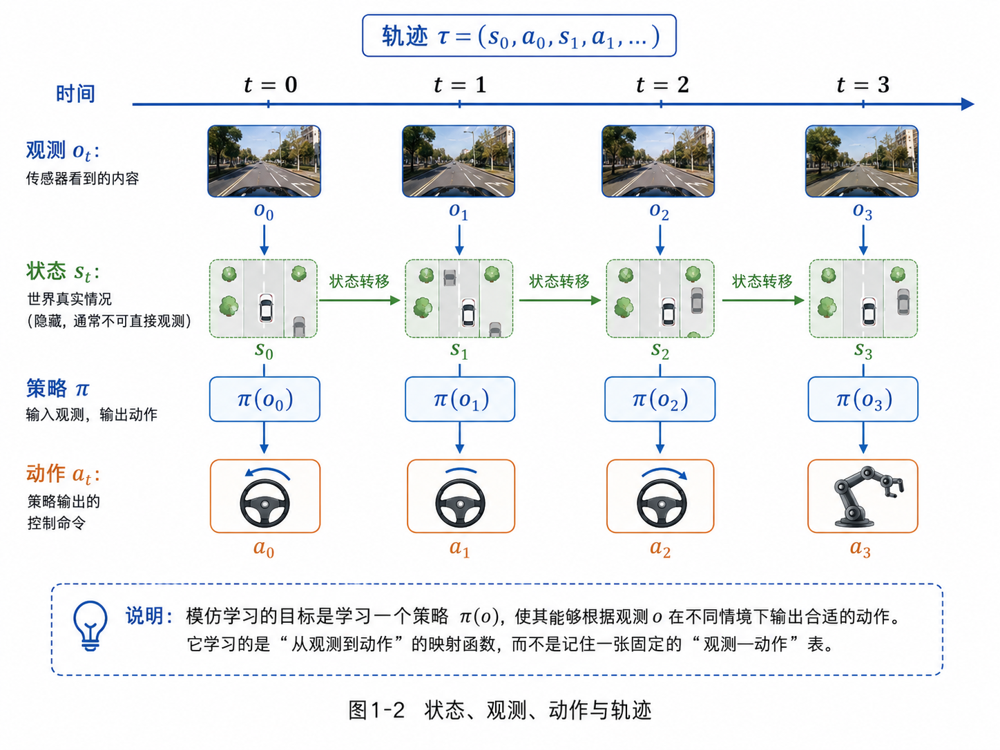
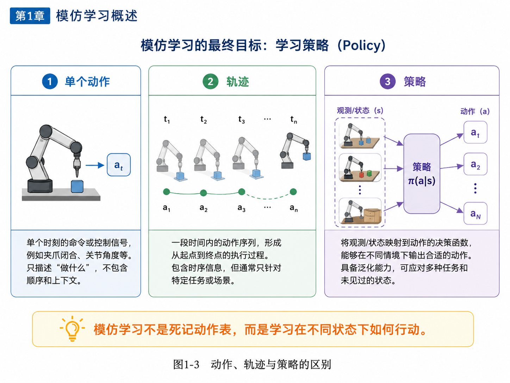

# 第1章：模仿学习到底在模仿什么

> **新版布局位置**：本章属于 **第一篇：模仿学习的基本问题**。本章编号、公式编号与交叉引用已按新版八篇结构统一调整。
>
> **本章一句话导读**：
> 机器人做模仿学习，不是在背动作答案，而是在学习一个“看到什么，就该怎么做”的决策规律。说得更学术一点：它学的不是一张动作表，而是一个可以闭环执行的策略函数。
>
> **机械臂主线更新说明**：
> 本章按照《全书机械臂抓取主线改造方案》完成第一轮主线增强：以 **视觉引导机械臂抓取与放置任务** 作为全书第一主线，用二维点机器人作为数学简化版，用自动驾驶 / 泊车作为辅助类比。后续所有公式解释都优先落回机械臂任务中的观测、动作、轨迹和策略。

---

## 1. 本章开场：机器人不是看一遍就能“悟道”

很多人第一次听到“模仿学习”这个词，脑海里都会自动播放一个很顺滑的画面：

```text
人类示范一次抓取
→ 机器人认真看完
→ 机器人点点头：我会了
→ 下一次自己稳稳抓起来
```

现实通常没有这么浪漫。

为了让本书后面的数学不飘在空中，我们从一个贯穿全书的具体任务开始。

桌面上放着一个杯子、积木、轴承套或小零件。机械臂有 6 个自由度，末端装着夹爪。它能看到顶部相机图像、侧视相机图像，也能读到自己的关节角、末端位姿和夹爪开合状态。人类专家通过遥操作设备示范若干次：

```text
接近目标物体
→ 调整末端姿态
→ 闭合夹爪
→ 抬起物体
→ 移动到目标槽位或容器上方
→ 放下物体
```

我们把这些示范记录下来，希望训练一个模型，让机械臂以后在新的物体位置、新的初始姿态、小遮挡、小光照变化下，也能完成抓取与放置。

问题来了：

> **机器人到底要模仿什么？**

它是在模仿某一帧的动作吗？

不够。因为同一个杯子移动 5 厘米，原来那一帧动作就不能照搬。

它是在背一整条轨迹吗？

也不够。因为真实执行时，每次初始位置、物体角度、相机噪声、夹爪接触状态都可能不一样。

它是在学习专家的“意图”吗？

这句话听起来很高级，但如果不落到数学对象上，很容易变成玄学。

本章要给出一个更清楚的回答：

> **模仿学习最终要学的是一个策略：一个从当前观测到动作的决策规律。**

这个策略可能很简单，只是一个小神经网络；也可能很复杂，是 ACT、Diffusion Policy、Flow Matching 或 VLA。但不管模型形式怎么变，核心问题都没有变：

```text
现在机器人看到了什么？
它应该输出什么动作？
这个动作会把机器人带到什么新状态？
下一步又该怎么办？
```

所以，本章要回答一个看似简单、其实贯穿全书的问题：

> **模仿学习到底在模仿什么？**

---

## 2. 本章要解决的核心问题

本章主要解决 6 个问题：

1. 模仿学习中的“示范数据”到底长什么样？
2. 在机械臂抓取与放置任务中，什么是状态、观测、动作和轨迹？
3. 为什么机器人不是在模仿单个动作，也不是在背一条固定轨迹？
4. 为什么说模仿学习的核心对象是策略 <span class="math">\(\pi_\theta(a\mid o)\)</span>？
5. 为什么真实机器人任务中，训练数据只是有限示范，而不是覆盖所有情况的动作表？
6. 为什么这个问题会自然引出第2章的 Behavior Cloning？

---

## 3. 主线定位与统一例子

为了让本书不变成一组孤立知识点，后续章节会反复回到同一个主线任务：

> **视觉引导机械臂抓取与放置任务。**

它是本书的第一主线。除此之外，本书还会使用两个辅助层次：

- **数学简化版：二维夹爪 / 二维点机器人任务**。当我们只想看清状态、动作、轨迹、分布偏移、误差累积这些数学结构时，可以先把机械臂简化成二维平面上的一个点或夹爪。
- **工程类比例子：自动驾驶 / 泊车**。这些例子只用于帮助有自动驾驶背景的读者建立类比，不再与机械臂主线并列竞争叙事中心。

也就是说，本书的例子优先级是：

```text
第一主线：视觉引导机械臂抓取与放置
数学简化版：二维夹爪 / 二维点机器人
工程类比：自动驾驶 / 泊车
```

本章与后续章节的关系如下：

- **承接前文**：全书从“专家演示”进入模仿学习问题定义。
- **本章推进**：把状态、观测、动作、轨迹、策略这些对象先摆到桌面上。
- **铺垫后文**：为第2章把模仿学习写成监督学习与最大似然问题做准备。
- **公式阅读抓手**：看见 <span class="math">\(D\)</span>、<span class="math">\(\tau\)</span>、<span class="math">\(s_t\)</span>、<span class="math">\(o_t\)</span>、<span class="math">\(a_t\)</span>、<span class="math">\(\pi_\theta\)</span> 时，先问它在机械臂抓取与放置任务中对应什么。
- **建议同步回看**：附录 A、B、F。

---

## 4. 先从直觉说起：模仿学习像什么？

如果用最朴素的话来讲，模仿学习就是：

> **给机器人看一批专家示范，让它学会在相似情境下做出相似决策。**

这里有三个关键词：

- **专家**：会做这件事的人或系统；
- **示范**：专家在任务中的行为记录；
- **学习**：从这些记录里总结出一个可泛化的决策规律。

放到机械臂抓取与放置任务里，这三个词非常具体。

### 4.1 专家是谁？

专家可以是人类遥操作员，也可以是一个高质量传统控制系统，也可以是仿真中规划器生成的成功轨迹。

在本书主线中，我们先假设专家是人类遥操作员。他通过手柄、VR 设备或示教器控制机械臂完成任务。

### 4.2 示范是什么？

示范不是一句“把杯子抓起来”，而是一段带时间顺序的数据：

```text
第 1 帧：相机看到桌面，夹爪在左上方，专家让末端向目标靠近
第 2 帧：夹爪更接近物体，专家继续调整姿态
第 3 帧：夹爪对准物体，专家让夹爪闭合
第 4 帧：物体被抓住，专家让机械臂抬起
...
```

每一帧都有观测，每一帧也有专家动作。

### 4.3 学习是什么？

学习不是把每一帧动作记下来，而是从很多示范里总结一个规律：

```text
如果目标在左前方，末端应该向左前方靠近；
如果夹爪快接触物体，应该减速并调整姿态；
如果物体已经抓住，下一步应该抬起而不是继续夹；
如果目标槽位在右侧，放置阶段要向右移动并降低高度。
```

也就是说：

> 模仿学习不是“复制一个动作”，而是“学习一种做决策的方式”。

自动驾驶和泊车也类似：老司机不是背诵固定方向盘角，而是根据当前道路、车身姿态和障碍物不断调整动作。但本书后续会优先把这个思想落到机械臂操作任务上。

---

## 5. 模仿学习的基本流程

从工程角度看，一个最基本的模仿学习系统，通常包含四步：

1. **专家示范**：由人类或已有系统完成任务；
2. **记录数据**：保存观测、状态、动作、任务条件等信息；
3. **策略学习**：训练一个模型，从输入映射到动作；
4. **闭环执行**：让机器人自己运行，并观察它是否真的完成任务。

下面这张图把这个过程画出来了。


**图1-1 说明**：

- 左边是专家示范，在主线任务中就是人类遥操作机械臂抓取与放置；
- 中间是示范数据 <span class="math">\(D\)</span> 或轨迹 <span class="math">\(\tau\)</span>；
- 再后面是策略学习，学出一个参数化策略；
- 右边是闭环执行，也就是学到的策略自己控制机械臂。

这个流程看着很顺，但里面其实藏着后续全书的大坑：

- 记录什么数据才够？
- 学的是动作、轨迹，还是策略？
- 训练时看到的是专家数据，执行时看到的是自己制造出来的新状态，这会不会出问题？
- 同一个观测下如果存在多种合理抓法，模型应该学哪一种？
- 如果仿真里能抓，实机因为摩擦、标定、光照不同失败了怎么办？

别急，后面章节会逐个拆雷。本章先把最基础的对象讲清楚。

---

## 6. 什么是示范数据？

### 6.1 最简单的数据形式：观测—动作对

在很多模仿学习任务里，最直接的数据形式是：

<div class="math">\[
D = \{(o_t, a_t)\}_{t=1}^{N} \tag{1.1}\]</div>

### 公式拆解：<span class="math">\(D = \{(o_t, a_t)\}_{t=1}^{N}\)</span>

**这个公式要解决什么问题？**

它想回答：“专家示范数据到底怎么表示？”
在机器学习里，我们不能只说“我有很多示范”，我们要把示范变成可以训练模型的数据结构。

**符号解释**

- <span class="math">\(D\)</span>：demonstration dataset，专家示范数据集；
- <span class="math">\(o_t\)</span>：第 <span class="math">\(t\)</span> 个时刻的观测，通常来自传感器；
- <span class="math">\(a_t\)</span>：专家在观测 <span class="math">\(o_t\)</span> 下采取的动作；
- <span class="math">\((o_t,a_t)\)</span>：一个训练样本，意思是“看到 <span class="math">\(o_t\)</span>，专家做了 <span class="math">\(a_t\)</span>”；
- <span class="math">\(N\)</span>：样本数量；
- <span class="math">\(\{ \cdot \}_{t=1}^{N}\)</span>：从第 1 个样本到第 <span class="math">\(N\)</span> 个样本组成的集合。

**直觉理解**

这就像整理老师傅的操作录像时，把每一帧都整理成一条记录：

```text
这时看到了什么 → 老师傅做了什么
```

它的风格非常像监督学习：

```text
输入 x → 标签 y
```

只不过在模仿学习里，输入变成了观测 <span class="math">\(o_t\)</span>，标签变成了专家动作 <span class="math">\(a_t\)</span>。

**工程含义**

在机械臂抓取与放置中，观测可以写成：

<div class="math">\[
o_t = (I_t^{top}, I_t^{side}, q_t, e_t, g_t, h_t) \tag{1.2}\]</div>

其中：

- <span class="math">\(I_t^{top}\)</span>：顶部相机图像；
- <span class="math">\(I_t^{side}\)</span>：侧视相机图像；
- <span class="math">\(q_t\)</span>：机械臂关节状态；
- <span class="math">\(e_t\)</span>：末端执行器位姿；
- <span class="math">\(g_t\)</span>：夹爪开合状态；
- <span class="math">\(h_t\)</span>：可选历史信息，例如过去若干帧观测或动作。

动作可以写成：

<div class="math">\[
a_t = (\Delta x_t, \Delta r_t, u_t^g) \tag{1.3}\]</div>

其中：

- <span class="math">\(\Delta x_t\)</span>：末端位置增量；
- <span class="math">\(\Delta r_t\)</span>：末端姿态增量；
- <span class="math">\(u_t^g\)</span>：夹爪控制命令，例如打开、闭合或连续开合量。

这就是后续 BC、ACT、Diffusion Policy 等章节会反复使用的基本数据对象。

**常见误解**

不要把 <span class="math">\(D\)</span> 理解成“完美覆盖所有情况的秘籍大全”。

它只是专家在有限场景里留下的数据。真实执行时，机器人可能会遇到数据里从没出现过的情况。这正是后面分布偏移问题的源头。

---

### 6.2 更完整的数据形式：轨迹

如果我们不只是关心单个时刻，而是关心整个执行过程，就会把数据写成轨迹：

<div class="math">\[
\tau_i = (o_1^i, a_1^i, o_2^i, a_2^i, \dots, o_T^i, a_T^i) \tag{1.4}\]</div>

多条轨迹组成数据集：

<div class="math">\[
D = \{\tau_i\}_{i=1}^{M} \tag{1.5}\]</div>

### 公式拆解：<span class="math">\(\tau_i = (o_1^i, a_1^i, \dots, o_T^i, a_T^i)\)</span>

**这个公式要解决什么问题？**

它想表示一次完整任务执行过程。单个 <span class="math">\((o_t,a_t)\)</span> 像一张照片，轨迹 <span class="math">\(\tau\)</span> 像一段视频。

**符号解释**

- <span class="math">\(\tau_i\)</span>：第 <span class="math">\(i\)</span> 条专家轨迹；
- <span class="math">\(o_t^i\)</span>：第 <span class="math">\(i\)</span> 条轨迹第 <span class="math">\(t\)</span> 个时刻的观测；
- <span class="math">\(a_t^i\)</span>：对应的专家动作；
- <span class="math">\(T\)</span>：轨迹长度；
- <span class="math">\(M\)</span>：示范轨迹条数。

**直觉理解**

如果一条机械臂抓取轨迹是一次“剧情回放”，那么：

- <span class="math">\(o_1\)</span>：机械臂还没动，物体在桌上，夹爪在初始位置；
- <span class="math">\(a_1\)</span>：专家让末端向物体靠近；
- <span class="math">\(o_2\)</span>：夹爪位置变了，相机图像也变了；
- <span class="math">\(a_2\)</span>：专家继续调整姿态；
- 最后 <span class="math">\(o_T\)</span>：物体被成功放进槽位，或者机器人优雅地夹住空气。

**工程含义**

轨迹提醒我们：机器人任务不是一次性判断，而是一连串相互影响的决策。当前动作会改变未来观测，未来观测又会影响后续动作。

这也是为什么模仿学习不能只按普通监督学习理解。普通图像分类错一张图，最多是一条样本错了；机器人控制错一步，后面可能整条轨迹都开始跑偏。

**常见误解**

不要把轨迹理解成“固定动作脚本”。

模仿学习最终要学的是策略，而不是把某条轨迹照抄一遍。轨迹是训练材料，不是最终产品。

---

## 7. 状态、观测、动作：三兄弟长得像，但千万别认错

很多初学者一开始最容易混淆的，就是状态、观测和动作。它们确实关系很近，但职责完全不同。

### 7.1 状态 <span class="math">\(s_t\)</span>：世界真实情况

状态（state）指的是 **环境在某个时刻的真实情况**。

在机械臂抓取与放置中，一个较完整的状态可以写成：

<div class="math">\[
s_t = (x_t^{obj}, x_t^{ee}, q_t, c_t) \tag{1.6}\]</div>

其中：

- <span class="math">\(x_t^{obj}\)</span>：物体真实位姿；
- <span class="math">\(x_t^{ee}\)</span>：末端执行器真实位姿；
- <span class="math">\(q_t\)</span>：机械臂关节状态；
- <span class="math">\(c_t\)</span>：接触状态，例如是否抓住物体、是否碰撞、是否放入槽位。

**注意**：状态通常是“理论上最完整”的描述，但在现实系统里，往往不能被直接完整观测。

比如物体是否已经被夹稳，可能只从图像看不出来；夹爪内部的接触力也不一定有传感器直接测到。

### 7.2 观测 <span class="math">\(o_t\)</span>：传感器看到的内容

观测（observation）指的是传感器真正拿到的信息。它是状态的一个“投影”或者“带噪版本”。

在机械臂任务里，观测可能包括：

- 顶部 RGB 图像；
- 侧视 RGB-D 图像；
- 机械臂关节角；
- 末端位姿估计；
- 夹爪开合量；
- 最近几帧历史信息。

观测不一定完整，也不一定干净。

同样一个杯子，摄像头可能因为反光、遮挡、运动模糊，看到的是一个“像杯子但也可能像别的东西”的区域。工程上这很常见，学术上这叫现实很不配合。

### 7.3 动作 <span class="math">\(a_t\)</span>：系统发出的控制命令

动作（action）是策略最终输出的控制量。

在不同系统里，它可以是：

- 机械臂关节速度；
- 末端执行器位姿增量；
- 夹爪开合命令；
- 移动机器人底盘速度；
- 方向盘角度、油门和刹车指令。

本书机械臂主线中，最常用的动作表示是：

```text
末端位姿增量 + 夹爪控制命令
```

也就是前面写过的：

<div class="math">\[
a_t = (\Delta x_t, \Delta r_t, u_t^g)
\]</div>

最朴素的决策过程可以写成：

```text
先看到观测 o_t
→ 再根据它做决策
→ 最后输出动作 a_t
```

这就是后面要讲的“策略”的基础。

下面这张图，把“时间—观测—状态—动作—轨迹”的关系串起来了。



**图1-2 说明**：

- 顶部是时间轴；
- 每个时刻都有观测 <span class="math">\(o_t\)</span>、状态 <span class="math">\(s_t\)</span>、动作 <span class="math">\(a_t\)</span>；
- 环境会随着动作发生状态转移；
- 一串这样的时刻连起来，就构成轨迹 <span class="math">\(\tau\)</span>。

这张图有一个特别重要的信息：

> **机器人做任务，不是做一次判断，而是在一个连续演化的系统里不断观察、决策、执行。**

这也是为什么后面我们会说：模仿学习虽然看起来像监督学习，但本质上活在一个序列决策世界里。

---

## 8. 模仿学习真正学的对象：策略

现在来到本章最关键的一步。

很多人会问：

> 既然示范数据里有动作，那模仿学习学的不就是动作吗？

答案是：**不完全是。**

动作只是结果，真正要学的是“从状态或观测到动作的映射关系”。这个映射关系就叫 **策略（policy）**。

### 8.1 策略的数学形式

在真实机器人任务中，我们通常直接基于观测做决策，所以最常见的写法是：

<div class="math">\[
\pi_\theta(a\mid o) \tag{1.7}\]</div>

如果能拿到完整状态，也可以写成：

<div class="math">\[
\pi_\theta(a\mid s) \tag{1.8}\]</div>

如果策略一次输出未来一段动作块，可以写成：

<div class="math">\[
\pi_\theta(A_t \mid o_{\le t}, a_{<t}, c) \tag{1.9}\]</div>

其中 <span class="math">\(A_t=(a_t,a_{t+1},\dots,a_{t+H-1})\)</span> 是未来一段动作，<span class="math">\(c\)</span> 是任务条件，例如“抓红色杯子”或“把轴承套放入左侧槽位”。

### 公式拆解：<span class="math">\(\pi_\theta(a\mid o)\)</span>

**这个公式要解决什么问题？**

它想表示：在当前观测 <span class="math">\(o\)</span> 下，机器人应该如何选择动作 <span class="math">\(a\)</span>。

**符号解释**

- <span class="math">\(\pi\)</span>：policy，策略；
- <span class="math">\(\theta\)</span>：策略模型的参数，比如神经网络权重；
- <span class="math">\(o\)</span>：观测；
- <span class="math">\(s\)</span>：状态；
- <span class="math">\(a\)</span>：动作；
- <span class="math">\(\pi_\theta(a\mid o)\)</span>：给定观测 <span class="math">\(o\)</span> 时，策略选择动作 <span class="math">\(a\)</span> 的规则或概率。

**直觉理解**

如果先不谈概率，你可以把策略理解成一个函数：

```text
现在看到什么 → 现在该做什么
```

如果谈概率，策略就是：

```text
现在看到什么 → 各个动作分别有多大可能被选中
```

比如机械臂看到物体在夹爪右前方，策略可能给“末端向右前方靠近”较高概率，给“夹爪立刻闭合”较低概率。

**工程含义**

在机器人系统里，策略可能是：

- 一个小型 MLP；
- 一个 CNN + MLP；
- 一个 Transformer；
- 一个 ACT 模型；
- 一个 Diffusion Policy；
- 一个 VLA 模型中的动作生成头。

模型形态可以变，但“输入当前情况，输出动作决策”这个核心对象不变。

**常见误解**

<span class="math">\(\pi_\theta(a\mid o)\)</span> 不等于“死记一张表”。

真实世界里的观测空间非常大，查表法会被组合爆炸按在地上摩擦。策略真正有价值的地方，是希望它能对没见过但相似的状态做出合理动作。

---

### 8.2 为什么不是学一张动作表？

因为真实世界不会乖乖把每一种情况都提前列好。

想象一下，如果你想用“查表法”解决机械臂抓取问题，你需要准备一张表：

- 杯子在左上角怎么办；
- 杯子在右下角怎么办；
- 杯子稍微转了 15 度怎么办；
- 杯子被遮挡一半怎么办；
- 杯子前面还有个勺子怎么办；
- 夹爪已经偏了 2 厘米怎么办；
- 物体被夹住但有滑落风险怎么办；
- 槽位因为托盘变形偏了一点怎么办。

这个表会迅速膨胀到比你的人生烦恼还多。

所以真正有用的不是记住每一种情况，而是学会一个泛化规则：

> 遇到新情况，也能根据相似经验做出合适动作。

下面这张图，对“动作、轨迹、策略”的区别做了一个更直观的对比。



**图1-3 说明**：

- **单个动作**：某一时刻的控制命令；
- **轨迹**：一段时间内观测和动作变化的序列；
- **策略**：一个能在多种不同情境下输出动作的决策规律。

所以，虽然模仿学习的训练数据里装的是动作，最终目标却是学出策略。

---

## 9. 一个更完整的视角：模仿学习在学专家行为分布

如果再往数学上走半步，我们可以把模仿学习理解成：

> 让学习到的策略 <span class="math">\(\pi_\theta\)</span> 在给定观测下，尽可能像专家策略 <span class="math">\(\pi_E\)</span> 那样行动。

其中：

- <span class="math">\(\pi_E\)</span>：专家策略（expert policy）；
- <span class="math">\(\pi_\theta\)</span>：我们要学习的策略。

理想情况下，我们希望：

<div class="math">\[
\pi_\theta(a\mid o) \approx \pi_E(a\mid o) \tag{1.10}\]</div>

### 公式拆解：<span class="math">\(\pi_\theta(a\mid o) \approx \pi_E(a\mid o)\)</span>

**这个公式要解决什么问题？**

它想表达模仿学习的基本目标：让学习策略尽量像专家策略。

**符号解释**

- <span class="math">\(\pi_E\)</span>：专家策略，来自人类专家、已有控制器或高性能系统；
- <span class="math">\(\pi_\theta\)</span>：我们训练出来的策略；
- <span class="math">\(a\mid o\)</span>：在观测 <span class="math">\(o\)</span> 条件下选择动作 <span class="math">\(a\)</span>；
- <span class="math">\(\approx\)</span>：近似，不是完全相等。

**直觉理解**

这条公式在说：

> 同样看到一个情况，专家倾向于怎么做，模型也应该倾向于怎么做。

它不是说模型要复制专家每一次手抖，而是要学专家行为背后的稳定规律。

**工程含义**

在机械臂抓取与放置中：

- 专家在夹爪离物体较远时，会快速接近；
- 专家在快接触物体时，会减速并调整姿态；
- 专家在夹住物体后，会抬起而不是继续向下压；
- 专家在接近槽位时，会小心降低高度并释放夹爪。

模型要学的是这些条件化决策规律，而不是把某一次示范里的偶然抖动也当成圣旨。

**常见误解**

<span class="math">\(\approx\)</span> 不代表数据集上每一帧都要一模一样。

真实系统里，专家动作本身可能有噪声，也可能存在多种合理动作。比如同一个杯子可以从左侧接近，也可以从右侧接近；同一个轴承套可以先微调姿态再夹，也可以先接近再旋转末端。后面讲概率策略、CVAE、ACT、Diffusion Policy 时，我们会专门处理“一个观测不止一个正确动作”的问题。

---

## 10. 回到机械臂抓取与放置主线

到这里，我们可以把本章概念全部落回主线任务。

### 10.1 本章概念在主线任务中对应什么？

在视觉引导机械臂抓取与放置任务中：

| 概念 | 机械臂任务中的含义 |
|---|---|
| 观测 <span class="math">\(o_t\)</span> | 顶部图像、侧视图像、关节状态、末端位姿、夹爪状态、历史窗口 |
| 状态 <span class="math">\(s_t\)</span> | 物体真实位姿、末端真实位姿、接触状态、是否抓稳、是否碰撞 |
| 动作 <span class="math">\(a_t\)</span> | 末端位姿增量、关节速度、夹爪开合命令 |
| 轨迹 <span class="math">\(\tau\)</span> | 一次完整抓取与放置示范 |
| 策略 <span class="math">\(\pi_\theta\)</span> | 从当前观测到动作或动作分布的模型 |
| 专家策略 <span class="math">\(\pi_E\)</span> | 人类遥操作员或高质量控制系统的行为规律 |

### 10.2 如果误解本章问题，会出现什么失败？

如果把模仿学习理解成“记动作表”，机械臂会很快遇到麻烦：

- 物体位置稍微变了，动作表就对不上；
- 夹爪偏离专家轨迹后，不知道如何纠正；
- 同一个观测下有多种合理抓法时，模型可能学成一个错误的平均动作；
- 训练时看起来像专家，上机闭环后却越走越偏。

### 10.3 本章如何引出第2章？

既然我们已经知道目标是学策略，下一个自然问题就是：

> 能不能直接把专家动作当标签，用监督学习训练这个策略？

这就是 Behavior Cloning。

第2章会先给出最朴素、最常用、也最容易翻车的答案。

---

## 11. 工程类比：自动驾驶和泊车为什么只是辅助例子？

本书作者和很多读者可能熟悉自动驾驶或泊车，所以这些例子仍然有价值。

自动驾驶中：

- 观测可能是前视图像、车速、历史轨迹；
- 动作可能是方向盘角、油门、刹车；
- 策略要学的是“当前道路和车辆状态下该如何控制车辆”。

泊车中：

- 观测可能是鱼眼图像、车位检测结果、车辆姿态；
- 动作可能是方向盘角和速度控制；
- 策略要学的是“如何根据车位入口、车身姿态和障碍物逐步修正”。

这些例子和机械臂抓取有共同结构：

```text
观测 → 动作 → 新观测 → 新动作 → 完整轨迹
```

但从本章开始，它们只作为辅助类比。全书主线会优先回到机械臂抓取与放置，因为这个任务更适合串联连续动作、多模态动作、动作块、生成式策略、语言条件、世界模型、Sim-to-Real 和数据闭环。

---

## 12. 常见误区

### 误区 1：模仿学习就是监督学习，没什么特别的

只说一半对。

从训练损失看，很多模仿学习方法确实可以写成监督学习；但从问题本质看，它面对的是 **连续交互、状态转移、闭环执行**，这和普通图像分类不是一个世界。

机械臂预测错一次动作，不是“这一帧错了就结束”，而是会改变下一帧观测，让后面所有决策都站在一个更糟糕的位置上。

### 误区 2：有了很多动作标签，就等于学会了任务

不对。

你拿到的是很多“在某些时刻做了什么”，但真正要学的是“在不同情境下为什么这么做，以及接下来还应该怎么做”。

如果数据里没有覆盖夹爪偏离、物体滑动、遮挡变化、放置误差，模型上机后仍然可能失败。

### 误区 3：状态和观测差不多，可以混着说

不建议。

在数学上它们往往是不同对象：

- 状态是环境真实情况；
- 观测是传感器拿到的信息。

一开始不区分，后面讲 POMDP、history window、state estimation、World Model、Sim-to-Real 的时候会越讲越乱。

### 误区 4：模仿学习就是记住专家轨迹

也不对。

记住轨迹只能解决“高度重复”的固定场景，一旦初始条件变一点、物体位置偏一点、相机角度晃一点，纯记忆型方法就容易翻车。

轨迹是训练材料，不是最终能力。最终能力是策略。

### 误区 5：策略一定是确定性的

不一定。

有些任务里，一个观测下可能有多个合理动作。比如抓杯子可以从左边抓，也可以从右边抓；轴承套可以从外侧夹，也可以先调整姿态再夹。后面我们会看到：

- 确定性策略；
- 概率策略；
- 多模态动作分布；
- CVAE、ACT、Diffusion Policy 等生成式策略。

这些方法的出现，正是因为“一个观测只有一个标准答案”很多时候并不成立。

---

## 13. 本章核心概念回顾

本章最重要的不是公式多，而是把后续全书会反复出现的基本对象摆正。

| 概念 | 符号 | 直觉理解 | 机械臂主线例子 |
|---|---|---|---|
| 观测 | <span class="math">\(o_t\)</span> | 传感器看到的内容 | 顶部图像、侧视图像、关节读数、夹爪状态 |
| 状态 | <span class="math">\(s_t\)</span> | 世界真实情况 | 物体真实位姿、末端真实位姿、接触状态 |
| 动作 | <span class="math">\(a_t\)</span> | 系统输出的控制命令 | 末端位姿增量、关节速度、夹爪命令 |
| 动作块 | <span class="math">\(A_t\)</span> | 一段未来动作 | 接近、对准、闭合夹爪的一小段动作序列 |
| 轨迹 | <span class="math">\(\tau\)</span> | 一次完整执行过程 | 一次抓取并放置到槽位 |
| 数据集 | <span class="math">\(D\)</span> | 多条示范轨迹或样本 | 多次遥操作示范记录 |
| 策略 | <span class="math">\(\pi_\theta\)</span> | 从状态/观测到动作的决策规则 | 神经网络策略、ACT、Diffusion Policy、VLA 动作头 |
| 专家策略 | <span class="math">\(\pi_E\)</span> | 专家如何行动 | 人类遥操作员、已有控制器 |

---

## 14. 本章公式索引

| 公式 | 位置 | 作用 | 需要掌握到什么程度 |
|---|---|---|---|
| <span class="math">\(D=\{(o_t,a_t)\}_{t=1}^{N}\)</span> | 第6节 | 表示专家示范数据集 | 理解每个样本是“观测—动作”对 |
| <span class="math">\(o_t=(I_t^{top},I_t^{side},q_t,e_t,g_t,h_t)\)</span> | 第6节 | 表示机械臂任务观测 | 理解观测可以由多种传感器和本体信息组成 |
| <span class="math">\(a_t=(\Delta x_t,\Delta r_t,u_t^g)\)</span> | 第6节 | 表示机械臂动作 | 理解动作可以是末端位姿增量和夹爪命令 |
| <span class="math">\(\tau_i=(o_1^i,a_1^i,\dots,o_T^i,a_T^i)\)</span> | 第6节 | 表示完整轨迹 | 理解轨迹是按时间组织的观测—动作序列 |
| <span class="math">\(D=\{\tau_i\}_{i=1}^{M}\)</span> | 第6节 | 表示多条专家轨迹组成的数据集 | 理解数据集既可以看成样本集合，也可以看成轨迹集合 |
| <span class="math">\(s_t=(x_t^{obj},x_t^{ee},q_t,c_t)\)</span> | 第7节 | 表示真实状态 | 理解状态比观测更完整，但常常不可直接获得 |
| <span class="math">\(\pi_\theta(a\mid o)\)</span> | 第8节 | 表示基于观测的策略 | 理解它是给定观测下的动作决策规则或概率 |
| <span class="math">\(\pi_\theta(a\mid s)\)</span> | 第8节 | 表示基于状态的策略 | 理解完整状态可得时的策略写法 |
| <span class="math">\(\pi_\theta(A_t\mid o_{\le t},a_{<t},c)\)</span> | 第8节 | 表示带历史和条件的动作块策略 | 理解后续 ACT、Transformer Policy、VLA 会用到类似思想 |
| <span class="math">\(\pi_\theta(a\mid o)\approx\pi_E(a\mid o)\)</span> | 第9节 | 表示模仿学习目标 | 理解学习策略要接近专家策略 |

---

## 15. 建议阅读的附录条目

本章涉及的公式还不复杂，但建议读者提前阅读以下附录，为后续章节做准备：

- **附录 A：数学符号与公式阅读方法**
  - A.1 为什么技术书里的公式看起来吓人？
  - A.2 如何阅读一个机器学习公式？
  - A.3 常用符号表

- **附录 B：概率论最小生存包**
  - B.1 什么是随机变量？
  - B.2 什么是概率分布？
  - B.3 条件概率：为什么 <span class="math">\(\pi(a\mid o)\)</span> 里有一个竖线？

- **附录 F：强化学习与序列决策基础**
  - F.1 MDP 是什么？
  - F.2 策略是什么？
  - F.3 状态、动作、转移的基本关系

如果你现在暂时不看附录，也不影响阅读本章；但从第2章开始，最大似然、负对数似然、交叉熵、MSE 会陆续登场，概率统计基础就不能再靠“感觉差不多”硬扛了。

---

## 16. 思考题

1. 请用你自己的话解释：状态、观测、动作三者有什么区别？
2. 在视觉引导机械臂抓取与放置任务中，哪些量更适合看成状态？哪些量更适合看成观测？
3. 为什么说模仿学习最终学的是策略，而不是一张“观测—动作表”？
4. 一条机械臂专家轨迹 <span class="math">\(\tau\)</span> 和一个策略 <span class="math">\(\pi_\theta\)</span> 有什么区别？
5. 如果机械臂在执行时夹爪偏离专家轨迹 2 厘米，为什么这可能导致后续连续错误？
6. 你能否举一个“同一个观测下存在多个合理动作”的机械臂例子？这对策略建模意味着什么？
7. 为什么本书要把二维夹爪任务作为数学简化版，而不是直接从复杂 VLA 开始？
8. 自动驾驶或泊车中的“观测—动作—轨迹—策略”结构，和机械臂抓取有什么相同点与不同点？

---

## 17. 本章配图清单

- 图1-1：模仿学习基本流程
- 图1-2：状态、观测、动作与轨迹
- 图1-3：动作、轨迹与策略的区别

---

> **给下一章留个钩子**：
> 现在我们已经知道模仿学习想学的是策略。那下一个自然问题就是：
>
> **如果我直接拿机械臂遥操作数据做监督学习，去拟合这个策略，会发生什么？**
>
> 这就是 Behavior Cloning 的故事。它很朴素，也很危险——像极了很多机器学习方法的青春期。

## 推荐阅读与深入材料

### 阅读目的

本章的核心是帮读者从“模仿动作”升级为“模仿状态—动作—轨迹分布”。推荐阅读重点不是追逐最新模型，而是建立 learning from demonstration / imitation learning 的基本视角，尤其是理解机器人示范数据为什么不等于动作表。

### 推荐材料

1. **Argall et al., 2009, “A Survey of Robot Learning from Demonstration”**
   - 类型：A 类基础综述。
   - 阅读目的：理解机器人领域最早把“示教—学习—执行”系统化拆开的方式。
   - 重点看：demonstration 的来源、状态/动作表示、泛化问题、评价方式。
   - 对应本章：帮助解释“专家轨迹不是动作表，而是状态条件下的行为样本”。

2. **Hussein et al., 2017, “Imitation Learning: A Survey of Learning Methods”**
   - 类型：A/B 类综述。
   - 链接：https://arxiv.org/abs/1709.04905
   - 阅读目的：建立 BC、IRL、GAIL 等方法的整体地图。
   - 重点看：不同模仿学习方法如何定义数据、损失和交互。
   - 对应本章：适合放在全书导读或第1章末尾，作为全书方法地图入口。

3. **Schaal, 1999, “Is Imitation Learning the Route to Humanoid Robots?”**
   - 类型：B 类历史材料。
   - 阅读目的：理解为什么机器人模仿从一开始就不只是监督学习问题，而包含身体约束、环境反馈和动作生成。
   - 重点看：imitation、motor control、humanoid robotics 的关系。

### 阅读提示

读这些材料时，不要急着分辨“哪个算法更强”。更重要的是问三个问题：专家给了什么？学习器学到了什么？部署时状态分布是否还和数据中一样？这三个问题会贯穿第2–4章。

---
