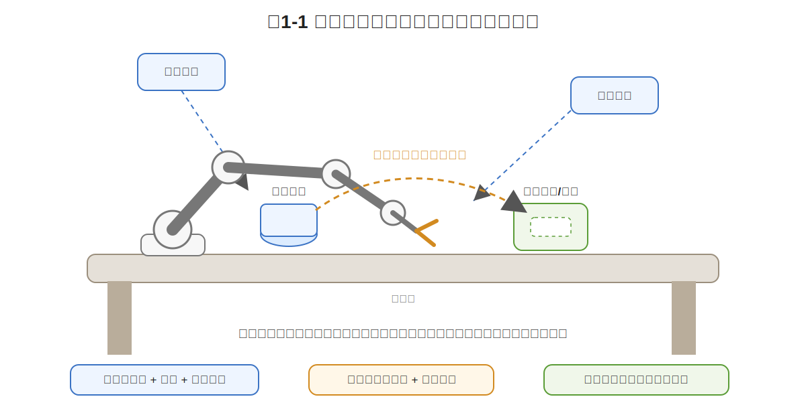
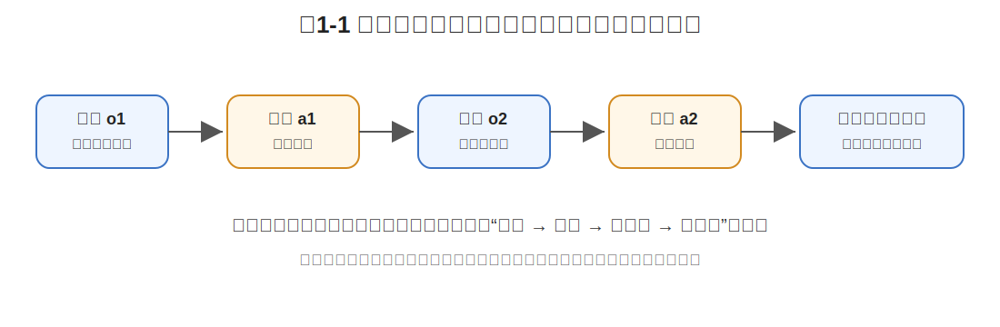
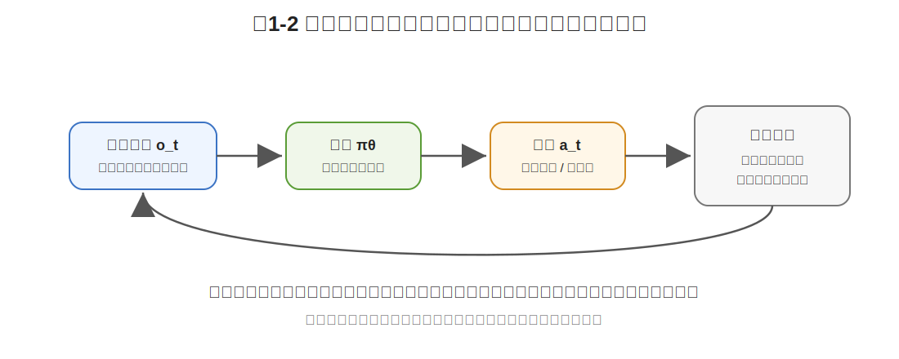
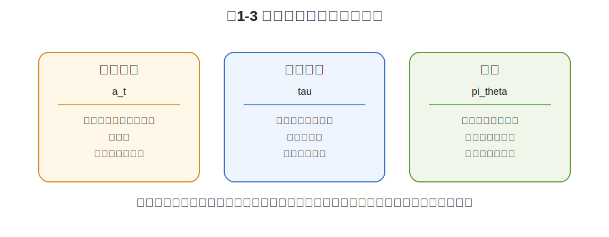

# 第1章 从专家示范到策略学习：模仿学习问题的起点

> **本章一句话导读**：
> 模仿学习表面上是在学专家动作，数据上依赖专家轨迹，数学上真正要学的是一个策略：一个能根据当前观测不断选择动作、并在闭环中推进任务的条件化决策规律。

在进入具体任务之前，我们先说明：什么是模仿学习，为什么要学习模仿学习。

> **定义 1.1：模仿学习**
>
> 模仿学习（Imitation Learning）研究的是这样一类问题：给定一批专家示范数据，学习一个可以执行任务的策略，使学习到的策略在相似情境下能够产生接近专家的行为。

这个定义里有三个关键词：**专家**、**示范数据**、**策略**。

> **定义 1.2：专家**
>
> 专家（expert）是能够完成目标任务并产生高质量行为数据的行为来源。专家可以是人类遥操作员、成熟控制系统、规划器，也可以是仿真环境中生成高质量轨迹的程序。

> **定义 1.3：示范数据**
>
> 示范数据（demonstration data）是专家执行任务时被记录下来的数据。它通常包含每个时刻机器人看到的内容、机器人自身状态、专家采取的动作，以及这些信息随时间变化形成的完整执行过程。

为什么这件事重要？因为很多真实任务很难手写奖励，也很难承受大量在线试错。机械臂抓取、自动驾驶、泊车、机器人装配、双臂操作等任务，都存在一个共同困难：我们知道“好的行为”长什么样，也能收集专家示范，但很难把每个细节都写成规则或奖励函数。模仿学习提供了一条更直接的路径：先从专家数据中学会一个可执行的策略，再逐步处理分布偏移、多模态动作、长时序决策、仿真到现实迁移等问题。

因此，本章不是急着介绍某个算法，而是先把模仿学习最基本的问题定义清楚：专家给了什么？机器人看到了什么？机器人能做什么？轨迹和策略有什么区别？为什么说模仿学习最终要学的是策略，而不是一张动作表？

> **符号显示说明**：
>
> 为保证 mdBook 稳定显示，本章不使用行内 MathJax，也不使用希腊字母上下标写法。所有符号统一采用 ASCII 文本形式，例如 `s_t`、`o_t`、`a_t`、`tau`、`pi_theta(a_t | o_t)`。后续章节如果 mdBook 数学渲染配置稳定，可以再恢复标准 LaTeX 形式。

---

## 1.1 从机械臂示范任务出发

我们先不要急着写算法。

先看一个具体任务。

桌面上放着一个杯子、积木、轴承套或者其他小零件。旁边有一台 6DoF 机械臂，末端装着夹爪。机械臂上方有一个顶部相机，侧面还有一个侧视相机。系统还能读到机械臂自己的关节角、末端执行器位姿和夹爪开合状态。



**图1-1 说明**：这是本书贯穿始终的主线任务。机械臂通过顶部相机、侧视相机和自身本体状态获得观测，根据策略输出末端运动和夹爪命令，最终把桌面上的物体抓起并放到目标槽位或容器中。

现在，我们请一位人类专家通过遥操作设备来示范这个任务：

```text
接近目标物体
→ 对准抓取位置
→ 调整末端姿态
→ 闭合夹爪
→ 抬起物体
→ 移动到目标槽位或容器上方
→ 放下物体
```

这个过程看起来像一个简单的“抓取—放置”动作，但如果展开看，它其实是一串连续决策。

专家不是只在最后一刻做一个动作，而是在每个时刻都根据当前画面和机械臂状态不断调整：

```text
离物体还远，就快一点靠近；
快接触物体了，就慢一点并调整姿态；
夹爪对准了，才闭合；
物体抓稳了，再抬起；
接近槽位时，再降低高度并释放。
```

我们把专家示范记录下来，得到一批数据。然后希望训练一个模型，让机械臂以后在新的物体位置、新的初始姿态、小遮挡、小光照变化、小标定误差下，也能完成抓取与放置。

这就是本书接下来反复使用的主线任务：

> **视觉引导机械臂抓取与放置任务。**

后面讲 Behavior Cloning、DAgger、MDP、轨迹分布、隐变量策略、ACT、Diffusion Policy、Flow Matching、VLA、World Model、Sim-to-Real、OPE 和数据闭环时，我们都会不断回到这个任务。

本章只解决第一个问题：

> **我们到底要让机器人模仿什么？**

这个问题看似简单，但如果回答得不清楚，后面的所有公式都会变成空中楼阁。

---

## 1.2 动作：单步决策的局限

最直观的想法是：专家做了什么，机器人就照着做什么。

比如在某一帧里，专家看到杯子在画面右前方，于是让机械臂末端向右前方移动 2 厘米。我们可以把这条记录写成一句话：

```text
看到这一帧图像 → 向右前方移动 2 厘米
```

这里第一次出现了“动作”这个概念，需要正式定义。

> **定义 1.4：动作**
>
> 动作（action）是机器人或智能体在某一时刻向环境发出的控制命令。动作会改变机器人自身状态，也可能改变环境状态。

在机械臂抓取与放置任务中，动作可以是末端向某个方向移动一点、末端姿态旋转一点，或者夹爪打开和闭合。

单个动作看起来很像监督学习里的标签：输入是一帧图像，标签是专家动作。但问题马上来了。

如果下一次杯子移动了 5 厘米呢？如果机械臂的初始位置不同呢？如果相机安装角度略有变化呢？如果夹爪已经偏离专家轨迹呢？

这时，原来那一帧动作就不能直接照搬了。

更麻烦的是，同一个时刻的“正确动作”也不一定只有一个。机械臂抓杯子可以从左侧接近，也可以从右侧接近；抓轴承套可以先调整末端姿态再夹，也可以先接近后微调。

所以，单个动作不是模仿学习真正要学的对象。

一个动作只是专家在某个具体情境下做出的一个结果。它告诉我们：

> 在这个时刻，专家这样做过。

但它没有告诉我们：

> 换一个相似但不完全相同的时刻，机器人应该如何决策。

这就是本节结论：

> **模仿学习不能只模仿单个动作。单个动作太局部，不足以支撑机器人在变化环境中完成任务。**

---

## 1.3 轨迹：专家行为的时间结构

既然单个动作不够，那我们能不能把整条专家过程背下来？

比如专家完成了一次完整操作：

```text
第 1 步：末端向前移动
第 2 步：末端向右移动
第 3 步：末端下降
第 4 步：夹爪闭合
第 5 步：末端上升
第 6 步：移动到槽位
第 7 步：夹爪打开
```

这看起来比单个动作完整多了。

但它仍然不够。

原因很简单：真实世界每次都不完全一样。

- 物体初始位置可能不同；
- 物体姿态可能不同；
- 机械臂初始关节角可能不同；
- 相机图像可能受光照影响；
- 夹爪接触物体后可能产生轻微滑动；
- 托盘或槽位可能有一点变形；
- 模型执行到中间时可能已经偏离原轨迹。

一条固定轨迹像一段脚本。脚本在舞台完全一样时很好用，但真实机器人执行任务时，舞台每天都在变。

这里需要正式定义“轨迹”。

> **定义 1.5：轨迹**
>
> 轨迹（trajectory）是一次任务执行过程中，按时间顺序记录下来的观测和动作序列。它描述的是专家或机器人从任务开始到任务结束的完整行为过程。

本书用下面的 ASCII 形式表示一条轨迹：

```text
Formula (1.1): trajectory

tau = (o_1, a_1, o_2, a_2, ..., o_T, a_T)
```

这个公式读作：一条轨迹 `tau`，由一连串按时间排列的观测和动作组成。

其中：

- `tau` 表示一条轨迹；
- `o_t` 表示第 `t` 个时刻机器人看到的观测；
- `a_t` 表示专家在这个时刻采取的动作；
- `T` 表示轨迹长度。

如果我们收集了很多条专家示范，就得到一个示范数据集。

```text
Formula (1.2): demonstration dataset

D = {tau_i | i = 1, 2, ..., N}
```

这个公式读作：数据集 `D` 由第 1 条到第 `N` 条专家轨迹组成。

这两个公式的作用不是把问题复杂化，而是把一句模糊的话说清楚：

> 我们给机器人的不是一句“学会抓取”，而是一批按时间组织的观测—动作序列。



**图1-2 说明**：轨迹不是单个动作，而是一段按时间组织的“观测 → 动作 → 新观测 → 新动作”过程。轨迹是训练材料，最终要学习的是能根据新观测继续决策的策略。

这一节的关键结论是：

> **轨迹比单个动作更完整，但轨迹仍然只是训练材料。机器人最终不能只背轨迹，而要学会根据当前情况做决策。**

这就引出下一层问题：机器人每一步到底根据什么做决定？

---

## 1.4 观测与状态：策略输入从哪里来

专家在操作机械臂时，并不是闭着眼睛执行动作脚本。

他每一步都会看当前情况：物体在哪里，夹爪在哪里，夹爪有没有对准，物体有没有被抓住，目标槽位在哪里。

机器人也是一样。它每一步做动作之前，都需要某种输入。

这个输入叫观测。

> **定义 1.6：观测**
>
> 观测（observation）是机器人在某一时刻通过传感器和自身读数实际获得的信息。观测是策略直接看到的输入。

在视觉引导机械臂抓取与放置任务中，一个比较完整的观测可以写成：

```text
Formula (1.3): observation in the robot manipulation task

o_t = (I_top_t, I_side_t, q_t, e_t, g_t, h_t)
```

这个公式读作：时刻 `t` 的观测 `o_t`，由顶部图像、侧视图像、关节状态、末端位姿、夹爪状态和历史信息组成。

其中：

- `I_top_t`：顶部相机图像；
- `I_side_t`：侧视相机图像；
- `q_t`：机械臂关节角或关节状态；
- `e_t`：末端执行器位姿；
- `g_t`：夹爪开合状态；
- `h_t`：历史信息，例如过去几帧观测或动作。

不要被这个公式吓到。它的意思非常朴素：

```text
机器人做决定之前，需要先知道自己现在看到了什么、自己在哪里、夹爪是什么状态、刚刚发生了什么。
```

这里还需要定义一个容易混淆的概念：状态。

> **定义 1.7：状态**
>
> 状态（state）是环境和机器人在某一时刻的真实情况。状态可以包含物体真实位姿、机械臂真实关节状态、接触状态、是否抓稳等信息。

状态和观测的区别非常重要。

状态是“世界真实是什么”。观测是“机器人实际看到了什么”。

比如真实状态里可能包含：物体精确 6D 位姿、夹爪与物体的真实接触力、物体是否已经被夹稳、槽位真实几何形变。但机器人未必能完整看到这些。相机可能有遮挡，接触力可能没有传感器，物体是否已经夹稳可能只能间接判断。

因此，在很多真实机器人任务中，策略真正拿到的是观测 `o_t`，不是完整状态 `s_t`。

这也是为什么后续会出现历史窗口、Transformer Policy、World Model 等方法：它们都在某种程度上试图弥补“观测不完整”的问题。

---

## 1.5 动作空间：策略输出到哪里去

有了观测，还需要知道机器人能输出什么。

这个输出是动作。所有可能动作组成一个动作空间。

> **定义 1.8：动作空间**
>
> 动作空间（action space）是机器人在任务中允许输出的所有动作的集合。动作空间决定了策略能够控制什么，以及以什么形式控制。

在机械臂抓取与放置任务中，动作空间可以有很多选择：

```text
关节角位置命令
关节速度命令
末端执行器位姿增量
夹爪打开/闭合命令
```

为了贯穿本书，我们常用一个比较直观的动作表示：

```text
Formula (1.4): action in the robot manipulation task

a_t = (Delta_x_t, Delta_r_t, u_gripper_t)
```

这个公式读作：时刻 `t` 的动作 `a_t`，由末端位置增量、末端姿态增量和夹爪控制命令组成。

其中：

- `Delta_x_t`：末端位置增量，比如向前、向右、向下移动多少；
- `Delta_r_t`：末端姿态增量，比如末端绕某个方向旋转多少；
- `u_gripper_t`：夹爪控制命令，比如打开、闭合或连续开合量。

这个动作不是普通监督学习里的“标签”那么简单。

普通图像分类中，模型输出“猫”还是“狗”，不会改变下一张训练图片。但机器人控制中，动作一旦执行，就会改变世界：

```text
动作 a_t 执行
→ 机械臂位置变了
→ 相机看到的新画面变了
→ 夹爪和物体的相对位置变了
→ 下一步决策面对的是一个新观测 o_(t+1)
```

这句话非常重要。

它意味着模仿学习虽然常常从监督学习开始，但它天然不是一个静态预测问题，而是一个闭环决策问题。



**图1-3 说明**：普通监督学习的预测通常不改变下一条样本；机器人动作会改变下一时刻观测。因此，行为克隆看起来像监督学习，但部署时是闭环控制问题。

如果第一个动作稍微偏了一点，下一时刻观测就不再和专家轨迹完全一样。这个小偏差可能在后续动作中被放大。第 3 章讲“分布偏移”时，会专门分析这个问题。

本节先记住一句话：

> **动作不是静态标签，而是会改变下一时刻观测的控制命令。**

---

## 1.6 示范数据集：从样本到轨迹集合

现在我们已经有了几个基本对象：

```text
观测 o_t：机器人当前看到什么
动作 a_t：专家当前做什么
轨迹 tau：一段完整示范过程
```

把观测和动作按时间排起来，就得到一条轨迹。

把很多条轨迹收集起来，就得到示范数据集。

> **定义 1.9：观测—动作样本**
>
> 观测—动作样本是一个二元组 `(o_t, a_t)`，表示专家在观测 `o_t` 下采取了动作 `a_t`。它是行为克隆中最常用的训练样本形式。

> **定义 1.10：示范数据集**
>
> 示范数据集是多条专家轨迹或多个观测—动作样本组成的集合。它是模仿学习算法的主要输入。

在训练模型时，我们常常会把轨迹拆成很多观测—动作对：

```text
(o_1, a_1), (o_2, a_2), ..., (o_T, a_T)
```

这就产生了一个非常自然的想法：

> 既然每一帧都有输入和标签，那我能不能直接做监督学习？

这正是第 2 章 Behavior Cloning 要做的事情。

不过在第 1 章，我们先不急着写损失函数。我们只需要明确三件事：

1. 专家数据可以被看成很多观测—动作对；
2. 这些观测—动作对并不是彼此独立的普通样本，而是来自一条条时间轨迹；
3. 每个动作都会影响后面的观测，所以轨迹结构不能被完全忽略。

这也是为什么后续全书会反复在两个视角之间切换：

| 视角 | 看数据的方式 | 好处 | 风险 |
|---|---|---|---|
| 监督学习视角 | 把轨迹拆成 `(o_t, a_t)` | 简单、好训练、工程上常用 | 容易忽略闭环误差 |
| 序列决策视角 | 把数据看成轨迹 `tau` | 能看到动作对未来的影响 | 数学和工程都更复杂 |

第 2 章会先从最简单的监督学习视角开始，第 3–6 章再逐步把闭环和序列决策问题拉回来。

---

## 1.7 策略函数：模仿学习的核心对象

现在我们可以回答最关键的问题了。

前面已经排除了两个不够完整的答案：

```text
不是只学单个动作；
也不是背一整条固定轨迹。
```

那么，模仿学习真正要学什么？

答案是：策略。

> **定义 1.11：策略**
>
> 策略（policy）是从当前输入到动作的决策规则。在基于观测的机器人任务中，策略可以理解为从观测到动作的映射；如果策略带有随机性，也可以理解为给定观测后对动作的概率分布。

用本书统一的 ASCII 形式写，策略可以表示为：

```text
Formula (1.5): policy based on observation

pi_theta(a_t | o_t)
```

这个公式读作：参数为 `theta` 的策略 `pi_theta`，在看到观测 `o_t` 时，对动作 `a_t` 的选择规则或概率。

这个公式是本章最重要的公式。

### 公式拆解：策略 `pi_theta(a_t | o_t)`

**这个公式要解决什么问题？**

它想表示：当机器人看到当前观测 `o_t` 时，策略如何选择动作 `a_t`。

**符号解释**

- `pi`：policy，策略；
- `theta`：策略模型参数，比如神经网络权重；
- `o_t`：当前观测；
- `a_t`：当前动作；
- `pi_theta(a_t | o_t)`：给定观测时，策略选择某个动作的规则或概率。

**直觉理解**

如果先不谈概率，可以把策略看成一个函数：

```text
现在看到什么 → 现在该做什么
```

如果谈概率，可以把策略看成一个条件分布：

```text
现在看到什么 → 各个动作分别有多大可能被选中
```

比如在机械臂抓取中：

- 如果物体在右前方，策略倾向于让末端向右前方靠近；
- 如果夹爪快接触物体，策略倾向于减速并调整姿态；
- 如果已经抓住物体，策略倾向于抬起并移动到槽位；
- 如果接近槽位，策略倾向于降低高度并释放夹爪。

### 策略、动作、轨迹三者的区别

这一点非常关键。



**图1-4 说明**：动作只是某一时刻的控制结果；轨迹是一段专家示范过程，是训练材料；策略能够根据不同观测选择动作，才是模仿学习最终要学的能力。

可以这样理解：

| 对象 | 它是什么 | 它的问题 | 它在本书中的地位 |
|---|---|---|---|
| 动作 | 某一时刻专家做了什么 | 太局部 | 训练标签的一部分 |
| 轨迹 | 专家完成一次任务的过程 | 不能原样照搬到所有情况 | 训练材料 |
| 策略 | 看到不同观测时如何选择动作 | 需要从有限数据中学出来 | 模仿学习真正目标 |

这就是本章的核心结论：

> **模仿学习最终学的是策略，不是动作表，也不是固定轨迹脚本。**

---

## 1.8 专家策略：学习目标从哪里来

既然我们真正要学的是策略，那专家也可以被看成有一个策略。

> **定义 1.12：专家策略**
>
> 专家策略（expert policy）是专家在任务中根据当前状态或观测选择动作的决策规则。专家策略通常不能被我们直接看到，我们只能通过专家示范数据间接观察它产生的行为。

> **定义 1.13：学习策略**
>
> 学习策略（learned policy）是由模仿学习算法从示范数据中训练得到的策略。它的目标是在相似情境下产生接近专家的行为。

专家策略可以理解为：

```text
专家看到观测 o_t 后，会倾向于采取动作 a_t。
```

学习策略可以理解为：

```text
模型看到观测 o_t 后，也会输出动作 a_t。
```

为了不在第 1 章引入太多公式，我们先用一句话表达模仿学习目标：

> 同样看到一个情况，专家倾向于怎么做，模型也应该倾向于怎么做。

如果用公式表达，就是让学习策略接近专家策略：

```text
Formula (1.6): imitation objective at the policy level

pi_theta(a_t | o_t) is close to pi_E(a_t | o_t)
```

这个公式读作：学习策略 `pi_theta` 在观测 `o_t` 下的动作选择，应当尽量接近专家策略 `pi_E`。

其中：

- `pi_E` 是专家策略；
- `pi_theta` 是我们训练出来的策略；
- `is close to` 表示接近，不是完全相等。

这条公式不要理解成“模型必须复制专家每一次手抖”。

专家示范里可能有噪声，也可能存在多种合理动作。比如同一个杯子可以从左边抓，也可以从右边抓；同一个轴承套可以先微调姿态再夹，也可以先靠近后旋转末端。

所以更准确地说，模型要学的是专家行为背后的稳定规律，而不是机械复制每一帧数值。

这一点会在后面逐步展开：

- 第2章：如果直接拟合专家动作，就是 Behavior Cloning；
- 第3章：如果只在专家数据上拟合，上机后会遇到分布偏移；
- 第7章：如果同一个观测下有多种合理动作，就需要概率策略；
- 第8–9章：如果要表示不同动作风格，可以引入隐变量和 CVAE；
- 第13–15章：如果要生成连续动作序列，就会进入 ACT、Diffusion Policy 和 Flow Matching。

---

## 1.9 闭环执行：为什么模仿学习不同于普通监督学习

看到这里，你可能会说：

```text
输入 o_t
标签 a_t
训练模型 pi_theta
```

这不就是监督学习吗？

从训练形式上看，确实很像。

但机器人模仿学习和普通监督学习有一个关键区别：

> **机器人策略的输出会改变下一时刻的输入。**

这里需要正式定义闭环执行。

> **定义 1.14：闭环执行**
>
> 闭环执行（closed-loop execution）是指策略根据当前观测输出动作，动作改变环境和机器人状态，新的状态又产生新的观测，策略再根据新观测继续输出动作的循环过程。

普通图像分类里，模型把一张猫图预测成狗，下一张图片不会因为这个错误发生变化。

但机械臂不一样。

如果模型在第 1 秒让夹爪偏了 2 厘米，那么第 2 秒看到的图像就已经和专家示范不同；第 2 秒如果继续输出不合适的动作，第 3 秒会偏得更厉害；最后可能夹住空气，或者撞到物体边缘。

这就是闭环控制和静态预测的差别。

可以用下面的对比来记：

| 问题类型 | 模型预测是否改变下一次输入？ | 典型例子 |
|---|---|---|
| 普通监督学习 | 通常不会 | 图像分类、离线回归 |
| 机器人模仿学习 | 会 | 机械臂控制、自动驾驶、泊车 |

这也是为什么 Behavior Cloning 虽然从形式上像监督学习，但它并不等价于普通监督学习。

本章先不展开分布偏移的数学分析，只埋下一个关键伏笔：

> **训练时看到的是专家走出来的观测，执行时看到的是模型自己走出来的观测。**

第 3 章会专门讨论这句话为什么危险。

---

## 1.10 本章总结：从动作模仿到策略学习

现在我们可以给出一个分层回答。

| 层次 | 看起来在模仿什么 | 实际含义 | 是否足够 |
|---|---|---|---|
| 单步动作 | 专家这一帧怎么动 | 某个具体情境下的控制结果 | 不够，太局部 |
| 整条轨迹 | 专家完整操作过程 | 一段按时间组织的示范材料 | 不够，不能照搬所有情况 |
| 策略 | 专家如何根据观测选择动作 | 条件化决策规律 | 第1章核心答案 |
| 行为分布 | 专家在闭环中访问了哪些状态并采取哪些动作 | 更高层的分布匹配视角 | 后续 IRL / GAIL / OPE 铺垫 |

所以，本章最终答案是：

> **模仿学习表面上模仿动作，数据上使用轨迹，数学上学习策略，更深一层是在让学习策略诱导出的行为分布尽量接近专家。**

但对初学者来说，第一步先抓住策略就够了：

```text
模仿学习不是背动作；
不是背轨迹；
而是学习一个“观测 → 动作”的策略。
```

---

## 1.11 本章公式索引

本章公式不多，但每个都很重要。

| 公式编号 | 公式含义 | 需要掌握到什么程度 |
|---|---|---|
| (1.1) | `tau = (o_1, a_1, o_2, a_2, ..., o_T, a_T)` | 理解轨迹是按时间组织的观测—动作序列 |
| (1.2) | `D = {tau_i | i = 1, 2, ..., N}` | 理解数据集由多条示范轨迹组成 |
| (1.3) | `o_t = (I_top_t, I_side_t, q_t, e_t, g_t, h_t)` | 理解观测来自图像、本体状态、夹爪状态和历史信息 |
| (1.4) | `a_t = (Delta_x_t, Delta_r_t, u_gripper_t)` | 理解动作是末端运动和夹爪控制命令 |
| (1.5) | `pi_theta(a_t | o_t)` | 理解策略是从观测到动作的条件化决策规律 |
| (1.6) | `pi_theta(a_t | o_t) is close to pi_E(a_t | o_t)` | 理解学习策略要接近专家策略，但不是机械复制每一帧 |

如果你只记一个公式，请记住：

```text
pi_theta(a_t | o_t)
```

因为它是后面所有章节的出发点。

---

## 1.12 本章定义索引

本章第一次出现的重要概念都已经给出正式定义：

| 编号 | 概念 | 一句话含义 |
|---|---|---|
| 定义 1.1 | 模仿学习 | 从专家示范中学习可执行策略 |
| 定义 1.2 | 专家 | 能够提供高质量行为数据的来源 |
| 定义 1.3 | 示范数据 | 专家执行任务时被记录下来的数据 |
| 定义 1.4 | 动作 | 机器人在某一时刻发出的控制命令 |
| 定义 1.5 | 轨迹 | 按时间组织的观测和动作序列 |
| 定义 1.6 | 观测 | 机器人实际获得的输入信息 |
| 定义 1.7 | 状态 | 环境和机器人在某一时刻的真实情况 |
| 定义 1.8 | 动作空间 | 机器人允许输出的所有动作的集合 |
| 定义 1.9 | 观测—动作样本 | 一个 `(o_t, a_t)` 训练样本 |
| 定义 1.10 | 示范数据集 | 多条专家轨迹或多个样本组成的集合 |
| 定义 1.11 | 策略 | 从观测到动作的决策规则 |
| 定义 1.12 | 专家策略 | 专家根据状态或观测选择动作的规则 |
| 定义 1.13 | 学习策略 | 从示范数据中训练得到的策略 |
| 定义 1.14 | 闭环执行 | 观测、动作、环境变化不断循环的执行过程 |

---

## 1.13 本章要点回顾

本章不是从算法开始，而是从一个机械臂抓取与放置任务开始。

我们一步步追问：

```text
只模仿一个动作够不够？
→ 不够，因为动作太局部。

背下一整条轨迹够不够？
→ 不够，因为真实执行条件会变化。

机器人每一步根据什么做决定？
→ 根据观测 o_t。

机器人每一步能做什么？
→ 输出动作 a_t。

真正要学的是什么？
→ 策略 pi_theta(a_t | o_t)。
```

所以，本章最重要的结论是：

> **专家轨迹是训练材料，专家动作是局部标签，策略才是模仿学习真正想学到的能力。**

下一章，我们会尝试用最直接的方法训练这个策略：

```text
把专家动作当标签，做监督学习。
```

这就是 Behavior Cloning。它朴素、好用，也非常容易翻车。

---

## 1.14 建议阅读的附录条目

本章公式不多，但它们会在后续反复出现。建议读者提前阅读以下附录：

- **附录 A：数学符号与公式阅读方法**
  - A.1 为什么技术书里的公式看起来吓人？
  - A.2 如何阅读一个机器学习公式？
  - A.3 常用符号表

- **附录 B：概率论最小生存包**
  - B.1 什么是随机变量？
  - B.2 什么是概率分布？
  - B.3 条件概率：为什么 `pi(a | o)` 里有一个竖线？

- **附录 F：强化学习与序列决策基础**
  - F.1 MDP 是什么？
  - F.2 策略是什么？
  - F.3 状态、动作、转移的基本关系

如果现在暂时不读附录，也不影响理解本章。但从第 2 章开始，最大似然、负对数似然、MSE 和分布偏移会陆续出现，概率统计基础就不能再靠“感觉差不多”硬扛了。

---

## 1.15 思考题

1. 为什么单个专家动作不足以代表模仿学习真正要学的能力？
2. 一条专家轨迹和一个策略有什么区别？
3. 在机械臂抓取与放置任务中，哪些信息可以作为观测 `o_t`？哪些信息更像真实状态但未必能直接观测？
4. 为什么动作 `a_t` 不是普通监督学习里的静态标签？
5. 请用自己的话解释 `pi_theta(a_t | o_t)` 的含义。
6. 如果机械臂第 1 秒偏离专家轨迹 2 厘米，为什么这可能影响后续所有决策？
7. 请举一个“同一个观测下存在多种合理动作”的机械臂例子。
8. 自动驾驶或泊车中的“观测—动作—轨迹—策略”结构，和机械臂抓取有什么相同点与不同点？

---

## 1.16 本章配图清单

本章包含四张例图：

- 图1-1：视觉引导机械臂抓取与放置任务总览；
- 图1-2：一条机械臂示范轨迹中的观测—动作序列；
- 图1-3：动作执行改变下一时刻观测的闭环结构；
- 图1-4：动作、轨迹、策略三者区别。

这些图不是章节总结图，而是服务于概念逐步展开的过程图。

---

## 推荐阅读与深入材料

### 阅读目的

本章的核心是帮读者从“模仿动作”升级为“学习策略”。推荐阅读重点不是追逐最新模型，而是建立 learning from demonstration / imitation learning 的基本视角：专家给了什么，学习器学到了什么，部署时状态分布是否还和数据中一样。

### 推荐材料

1. **Argall et al., 2009, “A Survey of Robot Learning from Demonstration”**
   - 类型：A 类基础综述。
   - 阅读目的：理解机器人领域最早把“示教—学习—执行”系统化拆开的方式。
   - 重点看：demonstration 的来源、状态/动作表示、泛化问题、评价方式。
   - 对应本章：帮助解释“专家轨迹不是动作表，而是状态条件下的行为样本”。

2. **Hussein et al., 2017, “Imitation Learning: A Survey of Learning Methods”**
   - 类型：A/B 类综述。
   - 链接：https://arxiv.org/abs/1709.04905
   - 阅读目的：建立 BC、IRL、GAIL 等方法的整体地图。
   - 重点看：不同模仿学习方法如何定义数据、损失和交互。
   - 对应本章：适合放在全书导读或第1章末尾，作为全书方法地图入口。

3. **Schaal, 1999, “Is Imitation Learning the Route to Humanoid Robots?”**
   - 类型：B 类历史材料。
   - 阅读目的：理解为什么机器人模仿从一开始就不只是监督学习问题，而包含身体约束、环境反馈和动作生成。
   - 重点看：imitation、motor control、humanoid robotics 的关系。

### 阅读提示

读这些材料时，不要急着分辨“哪个算法更强”。更重要的是问三个问题：

```text
专家给了什么？
学习器学到了什么？
部署时状态分布是否还和数据中一样？
```

这三个问题会贯穿第 2–4 章。

---
