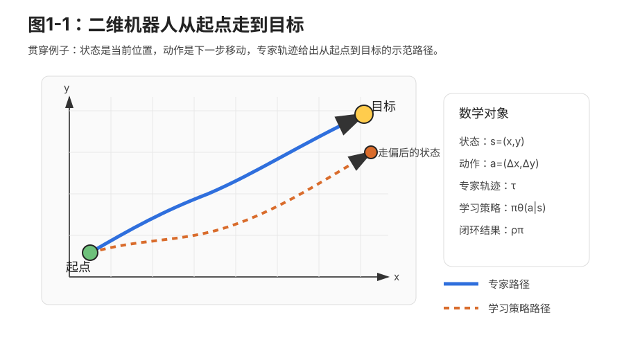
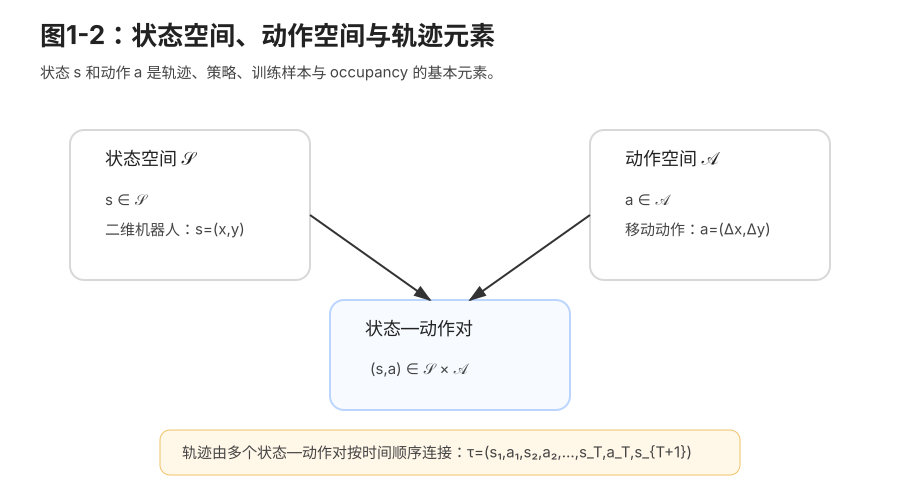
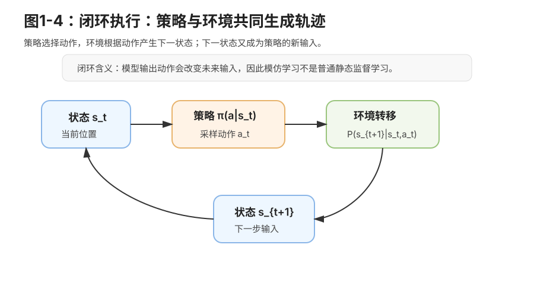

# 第1章：从专家轨迹到执行分布

> **本章一句话导读**：
> 模仿学习不是把专家轨迹背下来，也不是只在单个状态上预测专家动作，而是要从有限专家示范中学习一个能闭环执行的策略，并让这个策略诱导出的状态—动作分布接近专家分布。

---

## 1. 一个贯穿例子：二维机器人从起点走到目标

先看一个最小例子。

平面上有一个二维机器人。它从起点出发，要移动到目标点。每一步，机器人观察自己的当前位置，并选择一个移动动作。专家已经演示过若干条从起点到目标的路径。



在这个例子中，可以先把问题理解为：

```text
专家给出了一些路径；
模型要学会在当前位置选择下一步动作；
模型执行动作后，下一步位置会发生变化；
如果模型某一步走偏，后续看到的位置也会跟专家路径不同。
```

这个例子会贯穿第一篇。

在第1章中，它用于解释状态、动作、轨迹、策略、环境转移和执行分布；在第2章中，它用于解释如何把专家轨迹拆成 Behavior Cloning 的训练样本；在第3章中，它用于解释为什么 BC 策略第一步走偏后，会进入专家数据没有覆盖的位置，以及 DAgger 为什么要收集这些走偏状态。

本章要完成的数学对象升级是：

```text
专家轨迹
→ 策略
→ 闭环执行
→ 轨迹分布
→ 状态访问分布
→ 状态—动作占用分布
→ 模仿学习总目标
```

读完本章，二维机器人例子中的“路径”和“动作”会被抽象成一套通用数学对象。后续所有模仿学习方法都会在这套对象上展开。

---

## 2. 状态空间与动作空间

二维机器人例子中，最基本的两个对象是：机器人当前在哪里，以及机器人下一步怎么移动。数学上，它们分别对应状态和动作。



### 2.1 状态空间

**定义 1.1：状态空间**

状态空间记为 $\mathcal{S}$。其中每个元素 $s\in\mathcal{S}$ 表示系统在某一时刻的状态。

在二维机器人例子中，如果机器人位置为 $(x,y)$，可以令：

**公式 (1.1)：二维机器人状态**

$$
s=(x,y)\in\mathcal{S}\subseteq\mathbb{R}^2
$$

在真实机器人任务中，状态可以包含机械臂关节角、末端位姿、夹爪开合状态、物体位姿、接触状态等信息。在自动驾驶任务中，状态可以包含车辆位置、速度、周围障碍物、车道结构等信息。

第一篇统一使用 $s$ 表示状态。真实系统中，模型常常只能获得观测 $o$，而不是完整状态 $s$。例如，相机图像不直接给出物体真实三维位姿，传感器也可能存在噪声和遮挡。本章暂时使用 $s$ 表示用于决策的状态信息；后续涉及视觉输入、历史信息和多模态上下文时，会再引入 $o_t$、$h_t$ 和 $c_t$。

### 2.2 动作空间

**定义 1.2：动作空间**

动作空间记为 $\mathcal{A}$。其中每个元素 $a\in\mathcal{A}$ 表示策略在某一状态下可以采取的控制动作。

在二维机器人例子中，动作可以是一个二维位移或速度向量：

**公式 (1.2)：二维机器人动作**

$$
a=(\Delta x,\Delta y)\in\mathcal{A}\subseteq\mathbb{R}^2
$$

动作空间可以是离散的，也可以是连续的。离散动作包括“上、下、左、右”等有限选项；连续动作包括二维速度、末端位姿增量、方向盘角度等实值控制量。

后续章节主要关注机器人连续动作，但本章的主线不依赖动作空间是否连续。

### 2.3 状态—动作对

状态和动作共同组成状态—动作对 $(s,a)$。模仿学习中的训练样本、损失函数和执行分布，最终都会落在状态—动作对上。

当 $s\in\mathcal{S}$ 且 $a\in\mathcal{A}$ 时，状态—动作对属于乘积空间：

**公式 (1.3)：状态—动作空间**

$$
(s,a)\in\mathcal{S}\times\mathcal{A}
$$

在二维机器人例子中，一个状态—动作对可以表示：机器人位于 $(x,y)$，专家建议它下一步移动 $(\Delta x,\Delta y)$。

状态空间和动作空间确定以后，就可以定义专家轨迹。

---

## 3. 专家轨迹与专家数据集

专家演示不是一个抽象函数，而是一条条实际执行出来的路径。在二维机器人例子中，一条专家演示就是从起点到目标的一段状态—动作序列。

### 3.1 专家轨迹

**定义 1.3：专家轨迹**

一条专家轨迹是专家完成任务时产生的一段状态—动作序列，记为 $\tau$。

**公式 (1.4)：专家轨迹**

$$
\tau=(s_1,a_1,s_2,a_2,\dots,s_T,a_T,s_{T+1})
$$

其中，$s_t\in\mathcal{S}$ 是第 $t$ 个时刻的状态，$a_t\in\mathcal{A}$ 是专家在 $s_t$ 下采取的动作，$T$ 是动作步数。

轨迹末尾保留 $s_{T+1}$，表示最后一个动作 $a_T$ 执行后仍会产生下一状态。这个写法强调了模仿学习的时间结构：动作不是孤立标签，而会推进系统状态。

### 3.2 专家数据集

**定义 1.4：专家数据集**

专家数据集是多条专家轨迹组成的有限集合，记为 $D_E$。

**公式 (1.5)：专家数据集**

$$
D_E=\{\tau_i\}_{i=1}^{N}
$$

其中，$N$ 是专家轨迹条数。

在二维机器人例子中，$D_E$ 可以包含多条专家从不同起点或轻微扰动起点走向目标的路径。这些路径告诉模型：在专家经历过的位置附近，专家通常会朝哪个方向移动。

但是，专家数据集不是专家策略本身。它只是专家在有限场景下留下的样本。这一点会带来第4节的问题。

---

## 4. 为什么有限轨迹不是专家策略

专家轨迹只覆盖了状态空间中的一部分区域。在二维机器人例子中，专家通常沿着较好的路径走向目标；如果机器人走到远离专家路径的位置，专家数据中未必出现过这些位置。

这说明：有限轨迹不能直接等同于专家策略。

**论断 1.1：有限专家轨迹不能唯一确定专家策略**

给定有限专家数据集 $D_E$，通常存在多个不同策略，它们在 $D_E$ 覆盖到的状态上表现一致，但在未覆盖状态上行为不同。因此，仅凭 $D_E$ 不能唯一确定专家策略 $\pi_E$。

> **直觉框：二维机器人例子**
>
> 如果专家路径都经过走廊中间，数据中没有出现“机器人撞到墙边”的状态，那么仅凭这些轨迹，无法判断专家在墙边会选择向左、向右还是后退。多个策略可以在专家路径附近完全一致，却在墙边状态给出不同动作。

**证明**

设专家数据中出现过的状态集合为：

**公式 (1.6)：数据覆盖状态集合**

$$
\mathcal{S}_D=\{s_i\mid (s_i,a_i)\in D_E\}
$$

这里的 $(s_i,a_i)$ 表示从专家轨迹中拆出的状态—动作样本。

构造两个策略 $\pi_1$ 和 $\pi_2$。它们在数据覆盖到的状态上完全一致：

**公式 (1.7)：数据覆盖状态上的一致性**

$$
\pi_1(\cdot\mid s)=\pi_2(\cdot\mid s),\quad \forall s\in\mathcal{S}_D
$$

同时，取一个未覆盖状态 $s'\notin\mathcal{S}_D$，令两个策略在该状态上不同：

**公式 (1.8)：未覆盖状态上的不可识别性**

$$
\pi_1(\cdot\mid s')\neq \pi_2(\cdot\mid s')
$$

由于 $s'$ 不属于 $\mathcal{S}_D$，数据集 $D_E$ 中没有任何样本能够区分 $\pi_1$ 和 $\pi_2$ 在 $s'$ 上谁更接近专家。因此，有限数据不能唯一确定专家策略在整个状态空间上的行为。

> **边界框：这个论断不等于“不能泛化”**
>
> 这个论断不意味着模仿学习无法泛化。它说明的是：泛化能力必须来自额外因素，例如模型结构、归纳偏置、数据覆盖、环境约束、闭环评估和后续数据收集，而不是来自有限轨迹本身的唯一确定性。

有限轨迹不是策略，因此模仿学习真正要学的是一个能在状态空间中给出动作的决策规则。

---

## 5. 策略：从状态到动作分布

在二维机器人例子中，策略回答的问题是：给定当前位置，机器人下一步应该朝哪个方向移动。


### 5.1 策略的数学定义

**定义 1.5：策略**

策略是一个从状态到动作分布的映射。概率策略记为：

**公式 (1.9)：概率策略**

$$
\pi(a\mid s),\quad s\in\mathcal{S},\ a\in\mathcal{A}
$$

等价地，策略可以写成集合映射：

**公式 (1.10)：策略作为到动作分布的映射**

$$
\pi:\mathcal{S}\rightarrow\Delta(\mathcal{A})
$$

其中，$\Delta(\mathcal{A})$ 表示动作空间 $\mathcal{A}$ 上的概率分布集合。

这一定义允许同一个状态对应多个可能动作。对于机器人任务，这很重要：同一观测下可能存在多种合理抓取姿态、多条可行接近路径，或者不同但都能成功的放置动作。

### 5.2 专家策略与学习策略

专家背后的决策规则记为 $\pi_E$。学习模型的策略记为 $\pi_\theta$，其中 $\theta$ 是模型参数。

**公式 (1.11)：学习策略**

$$
\pi_\theta(a\mid s)
$$

如果策略是确定性的，也可以写成：

**公式 (1.12)：确定性策略**

$$
\hat a=f_\theta(s)
$$

确定性策略可以看成概率策略的特殊情况：给定状态 $s$ 时，动作分布集中在 $f_\theta(s)$ 附近。

本书后续优先使用概率策略写法 $\pi_\theta(a\mid s)$。这种写法能自然连接最大似然、负对数似然、概率策略、隐变量策略、Diffusion Policy 和 Flow Matching。

策略定义完成后，还缺少一个对象：动作如何改变下一状态。这就是环境转移。

---

## 6. 环境转移：动作如何改变下一状态

在二维机器人例子中，如果机器人当前位置是 $(x_t,y_t)$，动作为 $(\Delta x_t,\Delta y_t)$，那么下一位置通常会接近：

$$
(x_{t+1},y_{t+1})=(x_t+\Delta x_t,y_t+\Delta y_t)
$$

真实系统中还可能有噪声、约束和障碍物，因此下一状态通常用概率分布表示。



**定义 1.6：环境转移**

环境转移描述在当前状态 $s\in\mathcal{S}$ 下执行动作 $a\in\mathcal{A}$ 后，下一状态 $s'\in\mathcal{S}$ 如何产生。

**公式 (1.13)：环境转移分布**

$$
P(s'\mid s,a)
$$

也可以写成采样形式：

**公式 (1.14)：下一状态采样**

$$
s_{t+1}\sim P(\cdot\mid s_t,a_t)
$$

策略在状态 $s_t$ 下选择动作：

**公式 (1.15)：策略动作采样**

$$
a_t\sim\pi(a\mid s_t)
$$

动作再通过环境转移影响下一状态：

$$
s_{t+1}\sim P(\cdot\mid s_t,a_t)
$$

两者连在一起，形成最小闭环链路：

$$
s_t\rightarrow a_t\rightarrow s_{t+1}
$$

普通监督学习中的预测通常不会改变下一条输入样本，而策略的动作会改变未来状态。这是模仿学习不能直接等同于普通监督学习的根本原因。

环境转移定义完成后，可以推导策略执行后产生整条轨迹的概率。

---

## 7. 轨迹分布的推导

在二维机器人例子中，同一个策略从同一个起点出发，可能因为动作采样、环境噪声或初始状态不同，产生不同路径。因此，策略不是只产生一条轨迹，而是诱导一个轨迹分布。

**定义 1.7：初始状态分布**

初始状态分布记为 $p_0(s_1)$，表示任务开始时状态 $s_1$ 的分布。

给定 $p_0$、策略 $\pi$ 和环境转移 $P$，策略诱导出的轨迹分布为：

**公式 (1.16)：策略诱导轨迹分布**

$$
p_\pi(\tau)=p_0(s_1)\prod_{t=1}^{T}\pi(a_t\mid s_t)P(s_{t+1}\mid s_t,a_t)
$$

> **推导框：轨迹分布为什么是连乘形式**
>
> 轨迹 $\tau$ 由初始状态、每一步动作和每一步下一状态组成：
>
> $$
> \tau=(s_1,a_1,s_2,a_2,\dots,s_T,a_T,s_{T+1})
> $$
>
> 第一步，初始状态由 $p_0$ 给出：
>
> $$
> s_1\sim p_0(s_1)
> $$
>
> 第二步，在第 $t$ 个状态，动作由策略给出：
>
> $$
> a_t\sim\pi(a_t\mid s_t)
> $$
>
> 第三步，动作执行后，下一状态由环境转移给出：
>
> $$
> s_{t+1}\sim P(s_{t+1}\mid s_t,a_t)
> $$
>
> 在马尔可夫假设下，下一状态只依赖当前状态和当前动作，动作只由当前状态通过策略产生。因此，整条轨迹的概率可以写成初始状态概率与每个时间步的策略项、转移项的乘积：
>
> $$
> p_\pi(\tau)=p_0(s_1)\prod_{t=1}^{T}\pi(a_t\mid s_t)P(s_{t+1}\mid s_t,a_t)
> $$

这个公式说明：改变策略 $\pi$ 不仅会改变每一步动作分布 $\pi(a_t\mid s_t)$，还会通过环境转移 $P(s_{t+1}\mid s_t,a_t)$ 改变后续状态分布。

轨迹分布描述整条路径的概率。为了比较专家和学习策略，还需要进一步关注策略经常会到哪些状态。

---

## 8. 状态访问分布的推导

在二维机器人例子中，如果专家路径集中在走廊中间，而学习策略经常走到墙边，那么即使它在专家路径附近动作预测很准，也可能闭环失败。这个差异需要用状态访问分布描述。

**定义 1.8：状态访问分布**

状态访问分布 $d_\pi(s)$ 描述策略 $\pi$ 闭环执行时访问状态 $s$ 的频率或概率权重。

一种常见的折扣定义是：

**公式 (1.17)：折扣状态访问分布**

$$
d_\pi(s)=(1-\gamma)\sum_{t=1}^{\infty}\gamma^{t-1}\Pr_\pi(s_t=s)
$$

其中，$\gamma\in(0,1)$ 是折扣因子，$\Pr_\pi(s_t=s)$ 表示策略 $\pi$ 执行到第 $t$ 步时处在状态 $s$ 的概率。

也可以用递推关系理解 $d_\pi$。

**公式 (1.18)：策略诱导状态分布递推**

$$
d_\pi(s')=(1-\gamma)d_0(s')+\gamma\sum_s d_\pi(s)\sum_a\pi(a\mid s)P(s'\mid s,a)
$$

> **推导框：状态访问分布递推从哪里来**
>
> 状态 $s'$ 的访问来源可以分为两部分。
>
> 第一部分来自初始状态分布。如果系统一开始就在 $s'$，其贡献为：
>
> $$
> (1-\gamma)d_0(s')
> $$
>
> 第二部分来自过去某个状态 $s$。如果策略访问了状态 $s$，在 $s$ 下选择动作 $a$，再由环境转移到 $s'$，这一条路径的概率贡献为：
>
> $$
> d_\pi(s)\pi(a\mid s)P(s'\mid s,a)
> $$
>
> 对所有可能的动作 $a$ 求和，得到从状态 $s$ 转移到 $s'$ 的总贡献：
>
> $$
> d_\pi(s)\sum_a\pi(a\mid s)P(s'\mid s,a)
> $$
>
> 再对所有可能的前一状态 $s$ 求和，并乘以折扣因子 $\gamma$，得到后续访问贡献：
>
> $$
> \gamma\sum_s d_\pi(s)\sum_a\pi(a\mid s)P(s'\mid s,a)
> $$
>
> 把初始贡献和后续转移贡献相加，就得到公式 (1.18)。

> **边界框：有限时域与连续空间**
>
> 这里采用折扣访问分布写法，并用求和表示状态和动作空间。连续状态或连续动作时，求和会替换成积分；有限时域任务中，也可以使用时间平均访问分布。不同写法的细节不同，但核心结论一致：$d_\pi$ 由策略和环境转移共同决定。

状态访问分布描述“会到哪里”。模仿学习还需要描述“在那里会做什么”。这就引出状态—动作占用分布。

---

## 9. occupancy 的推导

**定义 1.9：状态—动作占用分布**

状态—动作占用分布，也称 occupancy measure，记为 $\rho_\pi(s,a)$，表示策略 $\pi$ 闭环执行后在状态—动作对上的联合分布。


**公式 (1.19)：状态—动作占用分布**

$$
\rho_\pi(s,a)=d_\pi(s)\pi(a\mid s)
$$

> **推导框：为什么 occupancy 是 $d_\pi(s)\pi(a\mid s)$**
>
> 状态—动作对 $(s,a)$ 同时发生，包含两个条件：策略执行过程中访问到状态 $s$，并且在状态 $s$ 下选择动作 $a$。
>
> 状态 $s$ 被访问的概率权重由 $d_\pi(s)$ 给出；在已访问状态 $s$ 的条件下，选择动作 $a$ 的概率由 $\pi(a\mid s)$ 给出。
>
> 根据联合概率的乘法分解：
>
> $$
> \Pr(s,a)=\Pr(s)\Pr(a\mid s)
> $$
>
> 对应到策略执行分布，就是：
>
> $$
> \rho_\pi(s,a)=d_\pi(s)\pi(a\mid s)
> $$

这个公式同时包含两个信息：$d_\pi(s)$ 描述策略会到哪里，$\pi(a\mid s)$ 描述策略在那里会做什么。

专家策略也诱导出专家占用分布：

**公式 (1.20)：专家状态—动作占用分布**

$$
\rho_E(s,a)=d_E(s)\pi_E(a\mid s)
$$

这里 $d_E$ 是专家执行时访问到的状态分布，$\pi_E$ 是专家策略。

在二维机器人例子中，$\rho_E$ 描述专家通常会经过哪些位置，并且在这些位置采取什么移动动作。$\rho_\pi$ 描述学习策略自己执行时会经过哪些位置，并且在那里采取什么动作。

这两个分布是模仿学习真正想比较的对象。

---

## 10. 模仿学习总目标

有了 $\rho_\pi$ 和 $\rho_E$，模仿学习的总目标可以写成：


**公式 (1.21)：模仿学习的分布匹配目标**

$$
\min_\pi D(\rho_\pi,\rho_E)
$$

其中，$D(\cdot,\cdot)$ 表示某种分布距离。

这里暂时不规定 $D$ 的具体形式。它可以是 KL、JS、Wasserstein，也可以由判别器隐式估计。第一篇只需要建立一个母题：模仿学习的核心不是单步动作拟合，而是执行分布匹配。

**论断 1.2：单步动作拟合不是完整的模仿学习目标**

如果一个方法只约束专家访问状态上的动作预测误差，而不约束学习策略诱导出的状态访问分布 $d_\pi$，它就不能直接保证 $\rho_\pi\approx\rho_E$。

**证明**

由公式 (1.19)：

$$
\rho_\pi(s,a)=d_\pi(s)\pi(a\mid s)
$$

可以看到，$\rho_\pi$ 同时依赖 $d_\pi(s)$ 和 $\pi(a\mid s)$。

即使某个策略在专家访问状态上动作预测很准，也只是说明在 $s\sim d_E$ 的区域中，$\pi(a\mid s)$ 接近专家动作。它并不自动推出：

$$
d_\pi(s)=d_E(s)
$$

因此，也不能自动推出：

$$
\rho_\pi(s,a)=\rho_E(s,a)
$$

完整的执行分布匹配必须同时关心“会到哪里”和“会做什么”。

> **边界框：什么时候单步动作拟合可能够用**
>
> 如果任务很短、专家数据覆盖非常充分，或者系统具有强稳定性和自恢复能力，单步动作拟合可能已经足够好。但对于长时序、接触丰富、状态偏离后难以恢复的任务，仅靠专家分布上的动作拟合通常不够。

到这里，本章完成了对象升级：从有限专家轨迹出发，定义策略、闭环执行、轨迹分布、状态访问分布和状态—动作占用分布，最后得到模仿学习总目标。

---

## 11. 本章留下的问题：如何训练策略？

本章建立了模仿学习的核心比较对象：

$$
\rho_\pi\quad\text{and}\quad\rho_E
$$

也给出了总目标：

$$
\min_\pi D(\rho_\pi,\rho_E)
$$

但这个目标还没有告诉我们如何训练一个参数化策略 $\pi_\theta$。

现实中，手里只有有限专家轨迹：

$$
D_E=\{\tau_i\}_{i=1}^{N}
$$

最直接的想法是：把专家轨迹拆成许多状态—动作样本，在每个专家状态上让模型输出接近专家动作。

这就是第2章要讨论的 Behavior Cloning。

第2章将回答：

```text
如何把专家轨迹变成监督学习样本？
BC 的训练目标如何从最大似然和 NLL 推导出来？
BC 到底近似了什么，又没有保证什么？
```

---

## 12. 读完本章，你应该能判断什么

读完本章后，你应该能判断：

1. 二维机器人例子中，状态空间 $\mathcal{S}$ 和动作空间 $\mathcal{A}$ 分别表示什么。
2. 专家数据 $D_E$ 为什么不等于专家策略 $\pi_E$。
3. 策略 $\pi_\theta(a\mid s)$ 和普通监督学习预测器有什么不同。
4. 环境转移 $P(s'\mid s,a)$ 为什么是闭环执行的关键对象。
5. 轨迹分布 $p_\pi(\tau)$ 如何由初始状态、策略和环境转移推导得到。
6. 状态访问分布 $d_\pi$ 的递推式来自哪些概率来源。
7. 状态—动作占用分布 $\rho_\pi$ 为什么等于 $d_\pi(s)\pi(a\mid s)$。
8. 为什么模仿学习总目标可以写成 $\min_\pi D(\rho_\pi,\rho_E)$。
9. 为什么本章之后自然要进入 Behavior Cloning。

---

## 13. 实践提示

> **实践提示：如果你要用代码验证本章思想，可以做什么？**

可以构造一个二维 toy environment。

专家从左下角走到右上角。状态是二维位置，动作是上下左右或连续速度。收集若干条专家轨迹后，做三件事：

1. 画出专家访问过的状态点，近似得到 $d_E$。
2. 让一个随机策略或未训练策略 rollout，画出它访问到的状态点，近似得到 $d_\pi$。
3. 比较两者覆盖区域，看策略不同如何改变状态访问分布。

这个小实验能直观看到：策略不是只改变动作，它会改变自己未来进入哪些状态。

---

## 14. 本章公式索引

- **公式 (1.1)：二维机器人状态**  
  用贯穿例子定义状态 $s=(x,y)$。

- **公式 (1.2)：二维机器人动作**  
  用贯穿例子定义动作 $a=(\Delta x,\Delta y)$。

- **公式 (1.3)：状态—动作空间**  
  定义状态—动作对所属的乘积空间 $\mathcal{S}\times\mathcal{A}$。

- **公式 (1.4)：专家轨迹**  
  定义一条专家示范轨迹。

- **公式 (1.5)：专家数据集**  
  定义多条专家轨迹组成的有限集合 $D_E$。

- **公式 (1.6)：数据覆盖状态集合**  
  表示专家数据实际覆盖到的状态集合。

- **公式 (1.7)：数据覆盖状态上的一致性**  
  说明不同策略可以在数据覆盖区域上表现一致。

- **公式 (1.8)：未覆盖状态上的不可识别性**  
  说明有限数据无法决定未覆盖状态上的专家行为。

- **公式 (1.9)：概率策略**  
  定义状态到动作分布的基本策略写法。

- **公式 (1.10)：策略作为到动作分布的映射**  
  给出策略的集合映射形式 $\pi:\mathcal{S}\rightarrow\Delta(\mathcal{A})$。

- **公式 (1.11)：学习策略**  
  定义参数化学习策略 $\pi_\theta(a\mid s)$。

- **公式 (1.12)：确定性策略**  
  给出确定性动作回归写法 $\hat a=f_\theta(s)$。

- **公式 (1.13)：环境转移分布**  
  定义状态和动作如何决定下一状态分布。

- **公式 (1.14)：下一状态采样**  
  用采样形式表示环境转移。

- **公式 (1.15)：策略动作采样**  
  表示策略在状态下产生动作。

- **公式 (1.16)：策略诱导轨迹分布**  
  说明轨迹由初始状态、策略和环境转移共同生成。

- **公式 (1.17)：折扣状态访问分布**  
  定义策略执行时访问状态的折扣分布。

- **公式 (1.18)：策略诱导状态分布递推**  
  说明状态访问分布如何由策略和环境转移共同决定。

- **公式 (1.19)：状态—动作占用分布**  
  定义学习策略诱导出的执行分布 $\rho_\pi$。

- **公式 (1.20)：专家状态—动作占用分布**  
  定义专家执行分布 $\rho_E$。

- **公式 (1.21)：模仿学习的分布匹配目标**  
  给出第一篇和全书的核心母题。

---

## 15. 本章定义索引

- **状态空间 $\mathcal{S}$**：系统可能状态的集合。
- **动作空间 $\mathcal{A}$**：策略可选择动作的集合。
- **状态—动作对 $(s,a)$**：策略学习和执行分布分析中的基本样本单位。
- **专家轨迹 $\tau$**：专家完成任务时记录到的状态—动作序列。
- **专家数据集 $D_E$**：多条专家轨迹组成的有限样本集合。
- **策略 $\pi$**：从状态到动作分布的映射。
- **专家策略 $\pi_E$**：专家背后的决策规则。
- **学习策略 $\pi_\theta$**：模型要学习的参数化策略。
- **环境转移 $P(s'\mid s,a)$**：状态和动作如何决定下一状态的概率规律。
- **轨迹分布 $p_\pi(\tau)$**：某个策略闭环执行后产生整条轨迹的概率分布。
- **状态访问分布 $d_\pi$**：某个策略执行过程中会访问哪些状态的分布。
- **状态—动作占用分布 $\rho_\pi$**：策略在状态和动作上的联合执行分布。
- **执行分布匹配**：让学习策略诱导出的状态—动作分布接近专家分布。

---

## 16. 思考题

1. 在二维机器人例子中，如果状态只包含当前位置，不包含目标点，会产生什么问题？
2. 为什么有限专家轨迹不能唯一确定专家策略？请用“走到墙边”的状态举例。
3. 在公式 (1.16) 中，如果只改变策略 $\pi$，为什么后续状态分布也会改变？
4. 公式 (1.18) 中，状态 $s'$ 的访问概率由哪两部分组成？
5. 为什么 $\rho_\pi(s,a)=d_\pi(s)\pi(a\mid s)$ 同时包含“会到哪里”和“会做什么”？
6. 如果一个模型在专家状态上动作预测很准，它一定能保证 $\rho_{\pi_\theta}\approx\rho_E$ 吗？为什么？

---

## 17. 本章图片索引

- **图1-1：二维机器人从起点走到目标**  
  文件：`assets/figures/ch01/图1-1_二维机器人从起点走到目标.svg`  
  作用：建立第一篇贯穿 toy example，用于解释状态、动作、专家路径和学习策略路径。

- **图1-2：状态空间、动作空间与轨迹元素**  
  文件：`assets/figures/ch01/图1-2_状态空间动作空间与轨迹元素.svg`  
  作用：展示 $s\in\mathcal{S}$、$a\in\mathcal{A}$ 与 $(s,a)\in\mathcal{S}\times\mathcal{A}$ 的关系。

- **图1-3：从专家轨迹到学习策略**  
  文件：`assets/figures/ch01/图1-3_从专家轨迹到学习策略.svg`  
  作用：说明 $D_E$ 只是有限轨迹样本，$\pi_\theta(a\mid s)$ 才是要学习的决策规则。

- **图1-4：闭环执行：策略与环境共同生成轨迹**  
  文件：`assets/figures/ch01/图1-4_闭环执行策略与环境共同生成轨迹.svg`  
  作用：展示 $s_t\rightarrow a_t\rightarrow s_{t+1}$ 的闭环链路。

- **图1-5：状态访问分布 $d_\pi$ 与占用分布 $\rho_\pi$**  
  文件：`assets/figures/ch01/图1-5_状态访问分布与占用分布.svg`  
  作用：说明 $d_\pi(s)$ 描述“会到哪里”，$\pi(a\mid s)$ 描述“会做什么”，二者合成 $\rho_\pi(s,a)$。

- **图1-6：模仿学习总目标 $\rho_\pi\approx\rho_E$**  
  文件：`assets/figures/ch01/图1-6_模仿学习总目标.svg`  
  作用：对比专家 occupancy 与学习策略 occupancy，并指向 $\min_\pi D(\rho_\pi,\rho_E)$。

---

## 18. 推荐阅读：重点看什么

- **DAgger 原论文**：先不看证明细节，重点看它为什么从 BC 的分布问题出发。
- **GAIL 论文**：这里只需知道 GAIL 会在后面更显式地做 occupancy matching。
- **任意一个简单 imitation learning toy project**：重点看 rollout 后状态分布如何变化，而不只是看训练误差。
