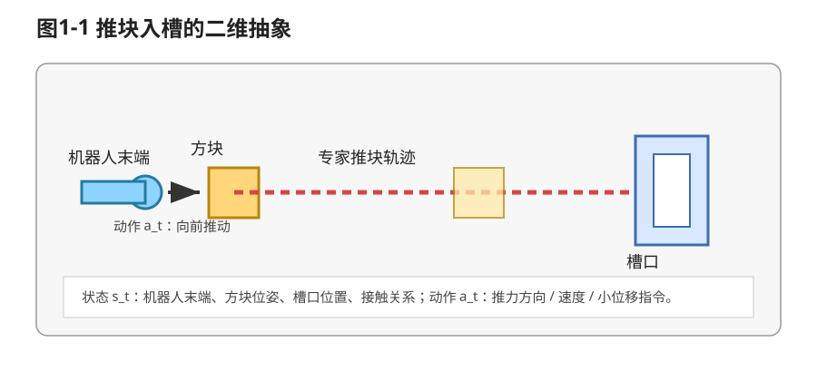
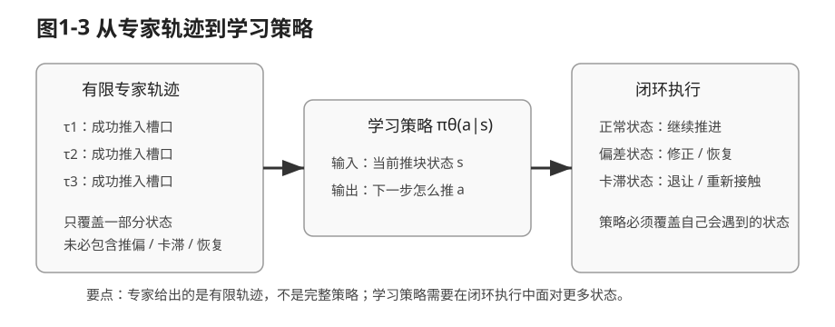
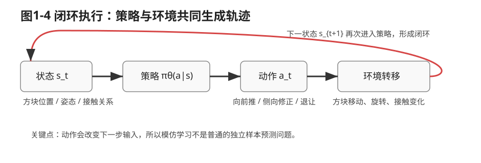
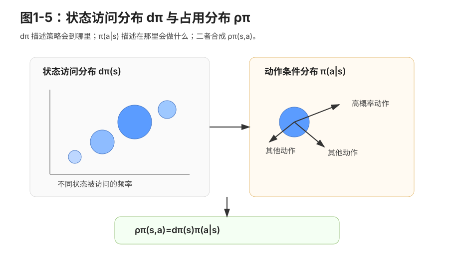
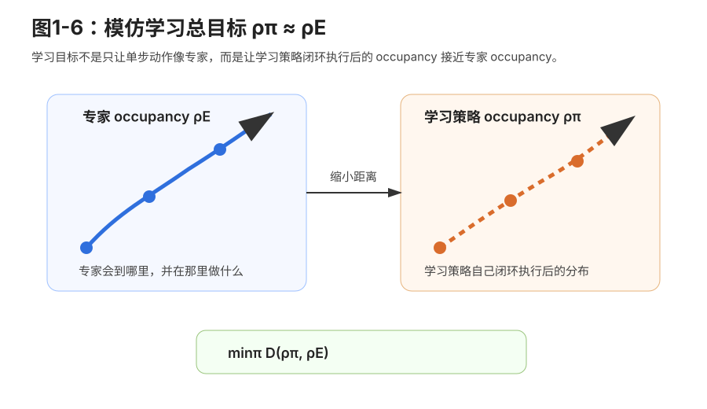

# 第1章：从专家轨迹到执行分布

> **本章一句话导读**：本章用“推块入槽”作为全书贯穿例子，说明专家给我们的不是完整策略，而是有限轨迹；模仿学习真正要学习的是一个能闭环执行的策略，并理解这个策略会把方块推到哪些状态、在那里做什么。

---

## 1. 本章要解决的核心问题

如果只看数据格式，模仿学习很像监督学习：专家在状态 $s$ 下采取动作 $a$，模型也学习输出这个动作。

但推块入槽不是离线答题。机器人每推一下，方块位置、姿态和接触关系都会改变；下一步输入也会随之改变。如果第一下稍微推偏，方块可能来到专家轨迹里很少出现的位置，后续动作就不再是普通监督学习里的独立样本预测。

所以，本章要回答：

```text
专家轨迹是什么？
策略是什么？
策略闭环执行后诱导出的分布是什么？
为什么这些对象会贯穿后续 BC、DAgger、动作块、生成式策略和世界模型？
```

本章的对象升级是：

```text
推块入槽的专家轨迹
→ 推块策略
→ 状态访问分布
→ 状态—动作执行分布
→ 执行分布匹配目标
```

---

## 2. 贯穿全书的例子：推块入槽

先固定一个全书都会反复使用的最小任务。

桌面上有一个方块、一个槽口和一个机器人末端。专家的任务是把方块推入槽口。这个任务看起来简单，却包含模仿学习最核心的困难：动作会改变状态，状态变化又会影响后续动作。

在这个例子中，可以把状态 $s_t$ 理解为：

```text
机器人末端位置；
方块位置与姿态；
槽口位置与方向；
方块是否接近槽口边缘；
当前是否发生接触或卡滞。
```

动作 $a_t$ 可以理解为机器人下一步的推力方向、末端速度或小位移指令。



专家轨迹记录的是一次次成功推入槽口的过程。比如：

```text
先靠近方块；
再从合适方向接触方块；
然后沿槽口方向稳定推进；
最后微调，让方块进入槽内。
```

这个例子后续会这样使用：

```text
第1章：专家轨迹不是完整策略。
第2章：BC 学“专家状态下应该怎么推”。
第3章：如果模型推偏，状态分布会离开专家轨迹。
第二篇：同一状态下可能有多种合理推法，需要动作分布和动作块。
第四篇：ACT / Diffusion / Flow 学的是一段连续推块动作，而不是只学一步。
第五篇：VLA 把视觉、语言指令和动作统一起来，例如“把方块推入左侧槽口”。
第六篇：世界模型预测“这样推下去会不会卡住、会不会入槽”。
```

因此，推块入槽不是一个孤立例子，而是本书的主线任务。

---

## 3. 专家给出的是什么：成功轨迹，而不是完整策略

**定义 1.1：状态与动作**

状态空间和动作空间分别记为：

$$\mathcal{S},\quad \mathcal{A}$$

在时刻 $t$，系统状态和动作分别满足：

$$s_t\in\mathcal{S},\quad a_t\in\mathcal{A}$$

在推块入槽中，$s_t$ 不只是机器人自己的位置，也包括方块和槽口的关系；$a_t$ 不是抽象标签，而是会真正改变方块位置和接触关系的控制指令。

**定义 1.2：专家轨迹**

专家轨迹是专家完成任务时产生的一段状态—动作序列，记为 $\tau$。

**公式 (1.1)：专家轨迹**

$$\tau=(s_1,a_1,s_2,a_2,\dots,s_T,a_T,s_{T+1})$$

其中，$T$ 是动作步数。轨迹末尾保留 $s_{T+1}$，是为了强调：最后一个动作执行后仍然会产生下一状态。

多条专家轨迹组成专家数据集，记为：

$$\mathcal{D}_E=\left\{\tau_i\right\}_{i=1}^{N}$$

其中，$N$ 是轨迹条数。

在推块入槽任务中，$\mathcal{D}_E$ 通常记录的是专家成功推入槽口的若干次过程。它可能覆盖了很多正常推进状态，却不一定覆盖所有偏差状态，例如：

```text
方块被推歪；
方块贴到槽口边缘；
方块轻微旋转后卡住；
机器人末端接触点偏离理想位置。
```

> **边界框：轨迹不是策略**
>
> 专家轨迹只告诉我们专家在有限状态上做了什么。它没有告诉我们：如果方块被模型推到槽口边缘，专家会如何恢复。这个缺口会贯穿第一篇，并在第3章引出 DAgger。

---

## 4. 为什么有限轨迹不能唯一确定专家策略

假设专家轨迹都很顺利：方块从中间区域被推向槽口，几乎没有明显偏斜。数据中从未出现“方块卡在槽口左边缘”的状态。

这时至少可以构造两个策略：

```text
策略 A：在正常轨迹附近和专家一样推；方块卡到左边缘时，先向右轻推再推进。
策略 B：在正常轨迹附近和专家一样推；方块卡到左边缘时，继续向前用力推。
```

如果专家数据从未覆盖左边缘卡滞状态，两个策略在训练数据上看起来都像专家，但闭环执行结果可能完全不同。策略 A 可能恢复，策略 B 可能越推越卡。

**命题 1.1：有限专家轨迹不能唯一确定专家策略**

给定有限专家数据集，通常存在多个策略，它们在数据覆盖到的状态上表现一致，但在未覆盖状态上行为不同。因此，仅凭专家数据集不能唯一确定专家在整个状态空间上的行为。

**证明思路**

设专家数据覆盖到的状态集合为：

$$\mathcal{S}_D$$

只要存在某个未覆盖状态：

$$s'\notin\mathcal{S}_D$$

就可以构造两个策略 $\pi_1$ 和 $\pi_2$。它们在所有数据覆盖状态上给出相同动作分布：

$$s\in\mathcal{S}_D$$

但在未覆盖状态 $s'$ 上给出不同动作分布。由于数据中没有 $s'$，训练数据无法区分这两个策略谁更像专家。

在推块入槽中，$s'$ 就可以是“方块卡在槽口边缘”的状态。专家成功轨迹没有覆盖它，并不代表这个状态部署时不会出现。

这不是说模仿学习不能泛化，而是说泛化必须来自模型结构、环境约束、数据覆盖、闭环评估或后续数据收集，不能只依赖有限轨迹本身的唯一确定性。

---

## 5. 策略：从状态到动作分布



**定义 1.3：策略**

策略是从状态到动作分布的映射。专家策略记为 $\pi_E$，学习策略记为 $\pi_\theta$。

**公式 (1.2)：概率策略**

$$\pi_\theta(a\mid s)$$

读法是：在状态 $s$ 下，学习策略选择动作 $a$ 的概率或概率密度。

在推块入槽中，公式 (1.2) 回答的是：给定当前方块、槽口和机器人末端的关系，下一步应该往哪个方向推、推多大、是否需要先调整接触点。

如果策略是确定性的，也可以写成：

$$\hat a=f_\theta(s)$$

本书优先使用概率策略写法，因为它可以自然连接最大似然、负对数似然、隐变量策略、Diffusion Policy 和 Flow Matching。

> **直觉框：为什么策略要写成分布**
>
> 同一个状态下不一定只有一个合理动作。方块略微偏斜时，可以先向左修正，也可以先向后退一点重新接触；两种动作都可能合理。写成概率策略，是为了给“多个可行推法”留下数学位置。第二篇会专门讨论这个问题。

---

## 6. 闭环执行：推一下，状态就变了

策略不是一次性预测器。机器人执行动作后，方块会移动、旋转或卡住，环境会产生下一状态。



一次推块闭环执行可以理解为：

```text
当前状态 s_t：方块和槽口的相对关系
→ 策略产生动作 a_t：下一步怎么推
→ 方块发生位移、旋转或接触变化
→ 得到下一状态 s_{t+1}
→ 策略继续在新状态上决策
```

因此，策略误差不是孤立错误。一次小小的推偏会影响方块下一步的位置和姿态；这个新状态又会成为下一次决策的输入。这就是模仿学习和普通监督学习最重要的差别。

在普通图像分类中，模型把一张猫图识别错，不会改变下一张输入图片。但在推块入槽中，模型把方块推歪，下一步输入就真的变了。

---

## 7. 执行分布：策略到底把方块推到哪里、在那里做什么

**定义 1.4：状态访问分布**

状态访问分布 $d_\pi(s)$ 描述策略 $\pi$ 闭环执行时访问状态 $s$ 的频率或概率权重。

在推块入槽中，状态访问分布描述的是：这个策略执行后，方块经常出现在槽口正前方、槽口边缘、偏斜状态，还是卡滞状态。

**定义 1.5：状态—动作执行分布**

状态—动作执行分布，也称 occupancy，记为 $\rho_\pi(s,a)$，表示策略 $\pi$ 闭环执行后在状态—动作对上的联合分布。



**公式 (1.3)：策略诱导的执行分布**

$$\rho_\pi(s,a)=d_\pi(s)\pi(a\mid s)$$

这个公式是本章最重要的对象升级。它把推块策略的行为拆成两部分：

```text
d_π(s)：方块会被推到哪些状态；
π(a|s)：在这些状态下，策略会怎么推。
```

专家策略也会诱导出专家执行分布。一个学习策略即使在专家成功轨迹附近动作很准，只要它自己执行时经常把方块推到槽口边缘或卡滞区域，学习策略的执行分布仍然可能和专家执行分布差很多。

> **边界框：不同文献中的 occupancy 写法**
>
> 有些文献使用折扣访问分布，有些使用有限时域平均访问频率，有些在连续空间中使用密度。具体归一化可以不同。本书第一篇只抓住共同点：公式 (1.3) 同时包含“到哪里”和“做什么”。

---

## 8. 模仿学习的抽象目标：匹配推块执行分布

有了执行分布，模仿学习最抽象的目标可以写成：让学习策略闭环执行后的状态—动作分布接近专家。



**定义 1.6：执行分布匹配**

执行分布匹配指让学习策略诱导出的状态—动作分布 $\rho_\pi$ 接近专家状态—动作分布 $\rho_E$。

**公式 (1.4)：模仿学习分布匹配目标**

$$\min_\pi D(\rho_\pi,\rho_E)$$

其中，$D$ 表示某种分布差异度量。这里暂时不规定 $D$ 的具体形式。第三篇讨论 IRL 和 GAIL 时，会再次回到这个目标。

在推块入槽中，公式 (1.4) 的含义是：学习策略不只是要在专家状态上输出相似动作，还要让自己闭环执行后的“方块位置—推法”整体分布接近专家。

---

## 9. 关键命题：单步动作拟合不是完整目标

**命题 1.2：专家状态上的动作拟合不能直接保证执行分布匹配**

如果一个方法只约束专家访问状态上的动作预测误差，而不约束学习策略诱导出的状态访问分布，那么它就不能直接保证学习策略执行分布接近专家执行分布：

$$\rho_\pi\approx\rho_E$$

**证明思路**

由公式 (1.3) 可知，执行分布由两部分共同决定：状态访问分布和动作条件分布。

这两部分分别是：

$$d_\pi(s),\quad \pi(a\mid s)$$

单步动作拟合主要约束专家状态附近的动作条件分布。但如果学习策略闭环执行后的状态访问分布与专家状态访问分布不同，那么即使动作在专家状态上拟合得很好，也不能推出学习策略执行分布接近专家执行分布。

回到推块入槽：模型可能在“方块正对槽口”这些专家状态上推得很好，但一旦它自己把方块推到槽口左边缘，学习策略的状态访问分布就偏离了专家状态访问分布。此时问题不再只是“动作预测准不准”，而是“模型是否进入了专家数据没有覆盖的区域”。

> **边界框：什么时候单步拟合可能够用**
>
> 如果推块距离很短、槽口很宽、方块不容易卡住，或者系统有很强自恢复能力，单步动作拟合可能已经足够。对于窄槽口、接触敏感、偏离后难以恢复的任务，只靠专家分布上的动作拟合通常不够。

---

## 10. 这个例子如何引出后续章节

本章建立了四个后文反复使用的对象：

```text
专家轨迹 τ；
策略 πθ(a|s)；
执行分布 ρπ(s,a)；
分布匹配目标 minπ D(ρπ,ρE)。
```

它们会在推块入槽例子中不断升级：

```text
第2章：BC 把成功推块轨迹拆成状态—动作样本。
第3章：BC 推偏后进入新状态，导致分布偏移；DAgger 补偏差状态标签。
第二篇：同一方块状态可能有多种合理推法，引出动作分布、动作块和隐变量策略。
第四篇：现代策略一次生成一段推块动作，而不是只预测一步。
第五篇：多模态策略把图像、语言和动作统一起来，例如“把红色方块推入左侧槽口”。
第六篇：世界模型预测候选推法的后果，例如是否会卡住、是否会入槽。
```

因此，推块入槽会作为全书的主线例子：每当出现新数学对象，都要问它如何解释这个任务中的一个新问题。

---

## 11. 读完本章，你应该能判断什么

读完本章后，你应该能判断：

1. 为什么专家给出的是有限推块轨迹，而不是完整专家策略。
2. 为什么推块策略要写成公式 (1.2) 的形式。
3. 为什么一次推偏会改变下一步状态。
4. 公式 (1.3) 中，状态访问分布和动作条件分布分别对应“方块会到哪里”和“在那里怎么推”。
5. 为什么公式 (1.4) 比单步动作拟合更接近模仿学习的完整目标。
6. 为什么这个例子能自然连接后续 BC、DAgger、动作块、生成式策略和世界模型。

---

## 12. 实践提示

可以构造一个二维推块 toy environment。专家从方块后方接触，把方块推入槽口。收集几条专家成功轨迹后，画出专家访问状态近似分布；再让一个弱策略 rollout，画出它访问到的状态近似分布。

建议特别记录三类状态：

```text
正常推进状态；
轻微偏斜但可恢复状态；
槽口边缘卡滞状态。
```

比较这些状态在专家轨迹和学习策略 rollout 中的出现频率，就能直观看到：策略不仅决定动作，也决定自己未来会面对哪些状态。

---

## 13. 本章公式索引

| 编号 | 名称 | 类型 | 作用 |
|---|---|---|---|
| (1.1) | 专家轨迹 | A | 定义专家示范提供的基本时间序列对象 |
| (1.2) | 概率策略 | A | 定义状态到动作分布的决策规则 |
| (1.3) | 策略诱导的执行分布 | A | 定义闭环执行后的状态—动作联合分布 |
| (1.4) | 模仿学习分布匹配目标 | A | 给出全书第一条主线目标 |

---

## 14. 本章定义索引

- **状态空间**：记为 $\mathcal{S}$，表示系统可能状态的集合，在推块入槽中包含机器人、方块、槽口和接触关系。
- **动作空间**：记为 $\mathcal{A}$，表示策略可以选择的动作集合，在推块入槽中可以是推力方向、速度或小位移。
- **专家轨迹**：记为 $\tau$，表示专家完成推块入槽时记录到的状态—动作序列。
- **专家数据集**：记为 $\mathcal{D}_E$，表示多条专家推块轨迹组成的有限集合。
- **策略**：记为 $\pi_\theta(a\mid s)$，表示给定状态后产生动作分布的决策规则。
- **状态访问分布**：记为 $d_\pi(s)$，表示策略闭环执行时访问状态的分布。
- **状态—动作执行分布**：记为 $\rho_\pi(s,a)$，表示策略闭环执行后在状态—动作对上的联合分布。
- **执行分布匹配**：让学习策略诱导出的执行分布接近专家分布。

---

## 15. 思考题

1. 为什么几条成功推块轨迹不能唯一确定专家策略？
2. 如果一个策略在“方块正对槽口”状态下动作预测很准，为什么闭环执行时仍可能失败？
3. 公式 (1.3) 中，状态访问分布与动作条件分布在推块入槽中分别对应什么？
4. 公式 (1.4) 为什么没有指定 $D$ 的具体形式？
5. 在推块入槽例子中，哪些状态最可能不在专家成功轨迹里？
6. 如果要让这个例子支撑后续 Diffusion Policy 或 Flow Matching，你觉得动作应该是一小步，还是一段动作块？为什么？

---

## 16. 配图清单

- **图1-1：推块入槽的二维抽象**：建立全书贯穿任务。
- **图1-3：从专家轨迹到学习策略**：说明轨迹不是策略。
- **图1-4：闭环执行：策略与环境共同生成轨迹**：展示动作如何改变下一状态。
- **图1-5：状态访问分布与占用分布**：解释公式 (1.3)。
- **图1-6：模仿学习总目标**：对比专家执行分布与学习策略执行分布。

---

## 17. 推荐阅读：重点看什么

- **DAgger 原论文**：先看它为什么要收集学习策略访问到的状态。用推块入槽理解，就是补充“方块被模型推偏后”的专家标签。
- **GAIL 论文**：暂时不必深究对抗训练，先看它如何把公式 (1.4) 具体化为 occupancy matching。
- **任意 imitation learning toy project**：重点观察 rollout 后状态分布如何变化，而不只是看训练误差是否下降。
