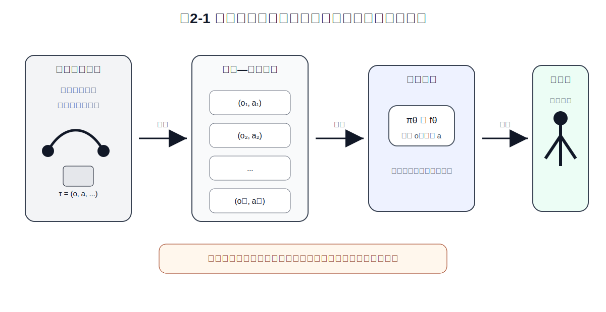
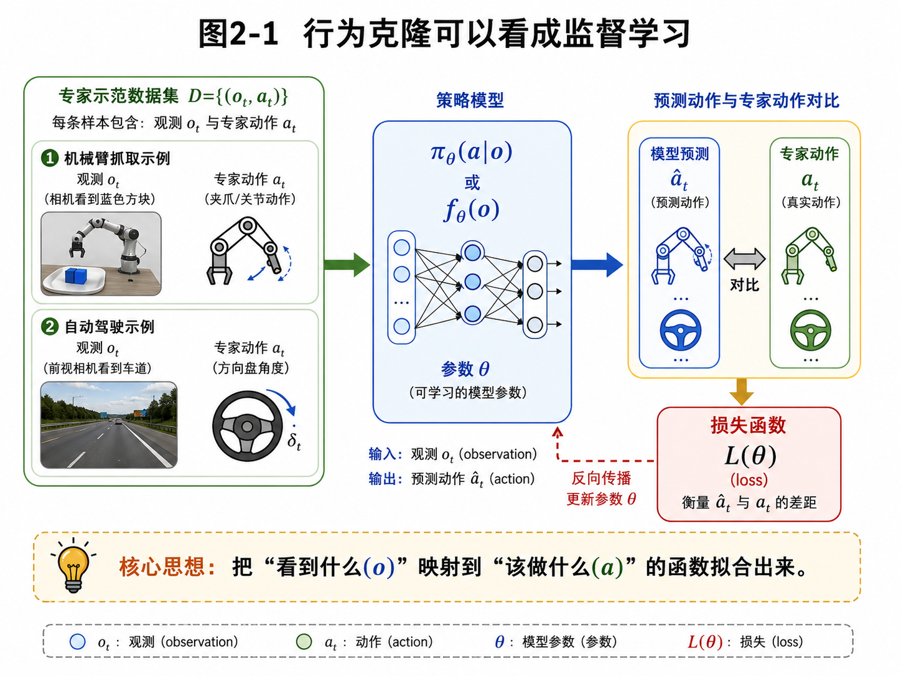
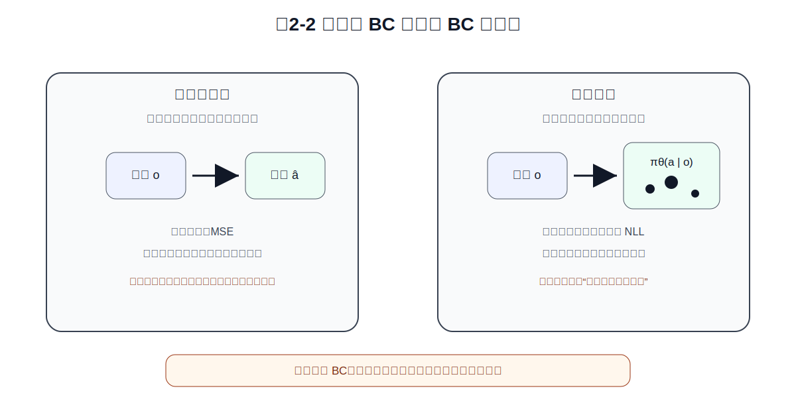
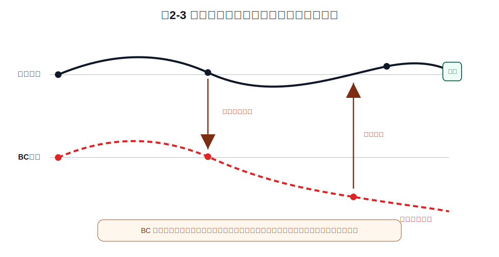

# 第2章 Behavior Cloning：从专家样本到监督学习策略

> **本章一句话导读**：
> Behavior Cloning 把第 1 章定义出的“学习策略”问题，暂时转化成一个监督学习问题：给定专家示范中的观测—动作样本，让模型在同样观测下输出尽量接近专家的动作。它是模仿学习最朴素、最常用的起点，也是最容易在闭环执行中暴露问题的方法。

第 1 章回答了一个基础问题：模仿学习到底在模仿什么？结论是：模仿学习不是简单背动作，也不是背一条固定轨迹，而是要学习一个策略 $\pi_\theta(a_t \mid o_t)$。这个策略看到当前观测 $o_t$，就要决定当前动作 $a_t$。

现在问题来了：既然我们已经有了专家示范数据，里面包含大量观测—动作样本 $(o_t, a_t)$，最直接的学习方法是什么？

最直接的答案就是 Behavior Cloning。

---

## 2.1 从专家轨迹到监督学习样本

第一章中，我们已经定义了几个对象：

```text
观测 o_t：机器人当前看到什么；
动作 a_t：专家当前做什么；
轨迹 tau：一段完整专家示范；
策略 pi_theta：从观测到动作的决策规则。
```

如果把机械臂抓取与放置任务放进这个框架里：

- $o_t$：顶部相机图像、侧视相机图像、关节角、末端位姿、夹爪状态；
- $a_t$：专家遥操作产生的末端位置增量、末端姿态增量、夹爪开合命令；
- $\tau$：一次完整的抓取与放置过程；
- $\pi_\theta$：希望训练出来的策略模型。

现在把专家轨迹拆成很多样本：

$$(o_1, a_1), (o_2, a_2), \dots, (o_N, a_N)$$

于是，一个自然想法出现了：既然每个观测都有专家动作作为标签，为什么不直接做监督学习？



**图2-1 说明**：Behavior Cloning 先把专家轨迹拆成观测—动作样本，再训练一个策略模型，使模型在给定观测时输出接近专家动作的预测。训练阶段像监督学习，部署阶段却要闭环控制机械臂。

---

## 2.2 行为克隆的基本定义

> **定义 2.1：行为克隆**
>
> 行为克隆（Behavior Cloning, BC）是指把专家示范中的观测—动作样本看作监督学习数据，训练一个策略模型，使其在给定观测时输出接近专家动作的动作。

BC 不显式学习奖励函数，也不问专家为什么这么做。它只做一件非常直接的事：

```text
专家在这个观测下这样做；
模型以后看到类似观测，也尽量这样做。
```

放到机械臂任务里，BC 就是：

```text
专家遥操作时，系统记录每一帧图像、本体状态和专家控制命令；
训练时，模型输入同样的观测，输出一个动作预测；
损失函数惩罚预测动作和专家动作之间的差距。
```



**图2-2 说明**：这张旧图保留为补充图，用来强调 Behavior Cloning 的监督学习视角：专家数据提供输入观测和目标动作，策略模型通过损失函数拟合专家动作。

---

## 2.3 行为克隆训练集

> **定义 2.2：行为克隆训练集**
>
> 行为克隆训练集是从专家示范轨迹中抽取或整理出来的观测—动作样本集合。每个样本包含一个观测 $o_i$ 和专家在该观测下采取的动作 $a_i$。

**公式 (2.1)：行为克隆训练集**

$$\mathcal{D}_{BC} = \{(o_i, a_i)\}_{i=1}^{N}$$

其中：

- $\mathcal{D}_{BC}$：用于行为克隆训练的数据集；
- $o_i$：第 $i$ 个训练样本中的观测；
- $a_i$：专家在观测 $o_i$ 下采取的动作；
- $N$：训练样本总数。

这个公式完成了一个重要转化：

```text
原始专家轨迹 tau
→ 拆成许多观测—动作样本 (o_i, a_i)
→ 用监督学习方式训练策略
```

但这里也埋下了风险：轨迹被拆成样本后，时间结构被弱化了。模型训练时看到的是一个个样本，部署时却要连续执行很多步。

---

## 2.4 模型形式：确定性策略与随机策略

BC 常见有两种模型形式：确定性策略和随机策略。

> **定义 2.3：确定性策略**
>
> 确定性策略（deterministic policy）是指给定一个观测 $o$，模型输出一个确定动作 $\hat a$ 的策略。

**公式 (2.2)：确定性 BC 策略**

$$\hat a_i = f_\theta(o_i)$$

确定性策略适合动作比较稳定、专家在同一类观测下通常只会选择一种动作的场景。例如机械臂末端需要沿某个方向微调，专家动作比较连续、单峰，这时可以直接回归末端运动增量。

但是，如果同一个观测附近存在多种合理动作，确定性策略可能会把多个动作平均掉。比如抓杯子可以从左侧接近，也可以从右侧接近。如果数据里两种方式都有，MSE 回归可能学出一个“从中间硬怼过去”的平均动作。

> **定义 2.4：随机策略**
>
> 随机策略（stochastic policy）是指给定一个观测 $o$，模型输出一个动作分布 $\pi_\theta(a \mid o)$ 的策略。动作不是唯一确定值，而是从这个分布中选择或采样。

**公式 (2.3)：随机 BC 策略**

$$\pi_\theta(a_i \mid o_i)$$



**图2-3 说明**：确定性 BC 直接输出一个动作，常配合 MSE 损失；概率 BC 输出动作分布，常配合负对数似然。前者简单直接，后者更适合表达多种合理动作。

---

## 2.5 连续动作下的 MSE 损失

机械臂控制中，动作常常是连续值。例如：末端向前移动 2 cm、末端绕 z 轴旋转 3 度、夹爪闭合到 60%。连续动作下，最常见的 BC 损失是均方误差，也就是 MSE。

> **定义 2.5：均方误差损失**
>
> 均方误差损失（Mean Squared Error, MSE）衡量模型预测动作和专家动作之间的平方距离。距离越大，损失越大。

**公式 (2.4)：连续动作下的行为克隆 MSE 损失**

$$\mathcal{L}_{MSE}(\theta) = \frac{1}{N}\sum_{i=1}^{N}\lVert f_\theta(o_i) - a_i\rVert^2$$

### 公式拆解：MSE 到底在惩罚什么？

**动机**：如果专家末端动作是向右移动 2 cm，而模型预测向右移动 1.8 cm，这个错误应该比较小；如果模型预测向左移动 2 cm，错误应该比较大。

**直觉**：MSE 就是在惩罚“预测动作离专家动作有多远”。

**机械臂含义**：位置预测偏了，夹爪可能对不准物体；姿态预测偏了，抓取角度可能不稳定；夹爪命令偏了，可能提前闭合或没有夹紧。

**常见误解**：MSE 小不等于策略好。MSE 只说明模型在专家数据分布上的单步动作接近专家，不说明它在自己执行产生的新观测上也能稳定工作。

---

## 2.6 概率策略下的负对数似然

如果策略输出的是动作分布，就不能简单用一个预测动作和专家动作做距离比较。更自然的想法是：专家采取的动作，模型应该给它高概率。

> **定义 2.6：负对数似然损失**
>
> 负对数似然损失（Negative Log-Likelihood, NLL）是最大化专家动作概率的等价最小化形式。模型给专家动作的概率越高，负对数似然越小。

**公式 (2.5)：概率策略下的行为克隆 NLL 损失**

$$\mathcal{L}_{NLL}(\theta) = -\frac{1}{N}\sum_{i=1}^{N}\log \pi_\theta(a_i \mid o_i)$$

### 公式拆解：为什么要有负号？

如果模型给专家动作的概率很高，例如 $0.9$，那么 $\log 0.9$ 接近 $0$，加负号后损失较小。如果模型给专家动作的概率很低，例如 $0.01$，那么 $\log 0.01$ 是一个很大的负数，加负号后损失就很大。

所以 NLL 的直觉是：

```text
专家动作概率越高，损失越小；
专家动作概率越低，损失越大。
```

---

## 2.7 MSE 是固定方差高斯策略的 NLL 特例

MSE 不只是工程上的“距离回归”，也可以从概率建模角度解释。

假设专家动作在给定观测下服从高斯分布：

**公式 (2.6)：固定方差高斯动作模型**

$$\pi_\theta(a \mid o) = \mathcal{N}\left(a; f_\theta(o), \sigma^2 I\right)$$

其中：

- $f_\theta(o)$ 是高斯分布的均值；
- $\sigma^2 I$ 是固定各向同性协方差；
- $a$ 是连续动作。

这个分布的负对数似然为：

**公式 (2.7)：高斯 NLL 与 MSE 的关系**

$$-\log \pi_\theta(a \mid o) = \frac{1}{2\sigma^2}\lVert a - f_\theta(o)\rVert^2 + C$$

其中 $C$ 是与 $\theta$ 无关的常数。

因此，在固定 $\sigma$ 的情况下，最小化 NLL 等价于最小化 MSE：

$$\arg\min_{\theta}\left[-\log \pi_\theta(a \mid o)\right] = \arg\min_{\theta}\lVert a - f_\theta(o)\rVert^2$$

这给 MSE 一个更深的解释：

> **MSE 可以看成固定方差高斯动作模型下的最大似然训练。**

这也解释了为什么简单 MSE 面对多模态动作时会出问题：它隐含了“给定观测下动作集中在一个均值附近”的假设。

---

## 2.8 经验风险最小化：BC 的统一训练目标

MSE 和 NLL 看起来不同，但都可以放进经验风险最小化框架。

> **定义 2.7：经验风险**
>
> 经验风险是在有限训练数据集上计算出来的平均损失。行为克隆训练的目标，就是让策略在专家示范数据上的经验风险尽量小。

**公式 (2.8)：行为克隆的统一经验风险目标**

$$\theta^* = \arg\min_{\theta}\frac{1}{N}\sum_{i=1}^{N}\ell\left(\pi_\theta(\cdot \mid o_i), a_i\right)$$

如果是确定性连续动作，$\ell$ 可以是 MSE：

$$\ell\left(\pi_\theta(\cdot \mid o_i), a_i\right) = \lVert f_\theta(o_i) - a_i\rVert^2$$

如果是概率策略，$\ell$ 可以是 NLL：

$$\ell\left(\pi_\theta(\cdot \mid o_i), a_i\right) = -\log \pi_\theta(a_i \mid o_i)$$

---

## 2.9 BC 的专家分布目标

有限样本上的经验风险是训练代码里的常见形式。但从数学上看，它是在用有限样本近似一个更理想的目标。

专家轨迹来自专家策略 $\pi_E$。如果专家在环境中闭环执行，会诱导出专家观测分布：

$$d^{\pi_E}(o)$$

BC 的理想目标可以写成：

**公式 (2.9)：BC 的专家分布目标**

$$\min_{\theta}\; \mathbb{E}_{\substack{o \sim d^{\pi_E} \\ a_E \sim \pi_E(\cdot \mid o)}}\left[\ell\left(\pi_\theta(\cdot \mid o), a_E\right)\right]$$

这个公式读作：从专家经常访问到的观测分布中取一个观测 $o$；再从专家策略在该观测下给出的动作分布中取专家动作 $a_E$；让学习策略在该观测下的输出接近专家动作。

这里有一个关键点：

> **BC 优化的是专家分布 $d^{\pi_E}$ 上的单步模仿损失。**

它并没有直接优化学习策略自己执行时访问到的分布 $d^{\pi_\theta}$ 上的表现。这为第 3 章分布偏移埋下核心伏笔。

---

## 2.10 专家动作标签与专家策略不要混淆

为了避免符号混乱，建议区分两个对象：

| 对象 | 符号 | 含义 |
|---|---|---|
| 专家策略 | $\pi_E(a \mid o)$ | 专家在观测 $o$ 下选择动作的规律 |
| 专家动作标签 | $a_E$ | 数据中记录到的某一次专家动作 |

如果专家策略是随机的，可以写成：

$$a_E \sim \pi_E(\cdot \mid o)$$

如果为了初学者理解，也可以简单说：

```text
a_E 是专家在观测 o 下给出的动作标签。
```

但不建议长期写成 $a_E = \pi_E(o)$，除非明确说明这里假设专家策略是确定性的。

---

## 2.11 机械臂任务中的 BC 训练流程

把公式落回机械臂任务，BC 的工程流程通常是：

```text
1. 采集专家示范
   人类通过遥操作设备控制机械臂完成抓取与放置。

2. 记录观测和动作
   观测包括图像、本体状态、夹爪状态；动作包括末端位姿增量、关节命令或夹爪命令。

3. 整理训练样本
   从轨迹中提取 (o_i, a_i)，并做时间同步、滤波、归一化和数据清洗。

4. 训练策略网络
   输入 o_i，输出预测动作或动作分布。

5. 计算损失并优化
   连续动作常用 MSE，概率策略常用 NLL。

6. 离线评估
   检查验证集误差、动作分布、异常样本和可视化回放。

7. 小心上机闭环测试
   从低速、安全区域、短 horizon 开始，逐步扩大测试范围。
```

这里有一个工程化的点：BC 的训练代码往往不难，真正难的是数据。时间戳不同步、夹爪延迟、专家犹豫和撤回、失败示范混入成功示范、物体位置覆盖不足，都会影响最终效果。

---

## 2.12 为什么训练误差小，不代表上机成功

BC 最大的误区是：验证集误差很小，所以策略应该能上机成功。这个推理在普通监督学习里有时成立，但在机器人闭环执行里很危险。

原因是：训练数据来自专家轨迹，执行数据来自模型自己走出来的轨迹。

训练时，模型看到的是专家访问过的观测：

$$o_i \sim d^{\pi_E}(o)$$

执行时，模型看到的是自己策略诱导出来的观测：

$$o_i \sim d^{\pi_\theta}(o)$$

如果 $d^{\pi_E}(o)$ 和 $d^{\pi_\theta}(o)$ 差得很远，模型就会遇到训练集中没有见过的观测。



**图2-4 说明**：BC 在训练时只学习专家轨迹附近的观测。一旦执行时出现小偏差，策略会进入专家数据没有覆盖的区域，误差可能逐步累积，最终导致机械臂抓取失败。

这就是第 3 章要重点讨论的分布偏移。

---

## 2.13 本章总结：BC 是起点，不是终点

Behavior Cloning 做了一件朴素的事：

```text
把专家示范拆成观测—动作样本；
把专家动作当作监督学习标签；
训练一个策略模型去拟合专家动作。
```

它的优点明显：数据格式简单、训练过程稳定、工程实现容易、可以直接使用成熟监督学习工具链。

但它的局限也明显：它主要优化专家数据上的单步损失，弱化了轨迹结构，没有主动修正自己执行时产生的偏差，容易在闭环执行中遇到专家数据没有覆盖的观测，多模态动作下简单 MSE 可能学出平均动作。

本章最重要的数学结论是：

> **BC 是专家分布上的单步监督学习；MSE 是固定方差高斯策略下的负对数似然特例；这两点共同说明 BC 简单有效，但也为分布偏移和多模态动作问题埋下伏笔。**

---

## 2.14 本章公式索引

### 公式 (2.1)：行为克隆训练集

$$\mathcal{D}_{BC} = \{(o_i, a_i)\}_{i=1}^{N}$$

### 公式 (2.2)：确定性 BC 策略

$$\hat a_i = f_\theta(o_i)$$

### 公式 (2.3)：随机 BC 策略

$$\pi_\theta(a_i \mid o_i)$$

### 公式 (2.4)：连续动作下的行为克隆 MSE 损失

$$\mathcal{L}_{MSE}(\theta) = \frac{1}{N}\sum_{i=1}^{N}\lVert f_\theta(o_i) - a_i\rVert^2$$

### 公式 (2.5)：概率策略下的行为克隆 NLL 损失

$$\mathcal{L}_{NLL}(\theta) = -\frac{1}{N}\sum_{i=1}^{N}\log \pi_\theta(a_i \mid o_i)$$

### 公式 (2.6)：固定方差高斯动作模型

$$\pi_\theta(a \mid o) = \mathcal{N}\left(a; f_\theta(o), \sigma^2 I\right)$$

### 公式 (2.7)：高斯 NLL 与 MSE 的关系

$$-\log \pi_\theta(a \mid o) = \frac{1}{2\sigma^2}\lVert a - f_\theta(o)\rVert^2 + C$$

### 公式 (2.8)：行为克隆的统一经验风险目标

$$\theta^* = \arg\min_{\theta}\frac{1}{N}\sum_{i=1}^{N}\ell\left(\pi_\theta(\cdot \mid o_i), a_i\right)$$

### 公式 (2.9)：BC 的专家分布目标

$$\min_{\theta}\; \mathbb{E}_{\substack{o \sim d^{\pi_E} \\ a_E \sim \pi_E(\cdot \mid o)}}\left[\ell\left(\pi_\theta(\cdot \mid o), a_E\right)\right]$$

---

## 2.15 建议阅读的附录条目

- **附录 B：概率论最小生存包**：理解条件概率 $\pi_\theta(a \mid o)$、概率分布和对数概率。
- **附录 C：最大似然、负对数似然、交叉熵与 KL 散度**：深入理解为什么 NLL 可以作为概率策略的训练损失。
- **附录 D：高斯分布、MSE 与连续动作回归**：理解为什么 MSE 可以看作高斯 NLL 的特例。
- **附录 F：强化学习与序列决策基础**：理解为什么 BC 虽然训练像监督学习，但部署时仍然是序列决策问题。

---

## 2.16 思考题

1. 为什么 Behavior Cloning 可以看成监督学习？这个说法在哪些地方成立，在哪些地方又不完整？
2. 在机械臂抓取与放置任务中，一个 BC 样本 $(o_i, a_i)$ 可以包含哪些信息？
3. 确定性策略 $f_\theta(o)$ 和随机策略 $\pi_\theta(a \mid o)$ 的区别是什么？
4. 为什么连续动作下常用 MSE？MSE 在多模态动作场景下可能出现什么问题？
5. 为什么说 MSE 可以看成固定方差高斯策略的 NLL 特例？
6. 请用自己的话解释负对数似然 $-\log \pi_\theta(a_i \mid o_i)$ 的含义。
7. BC 的专家分布目标和有限样本经验风险之间是什么关系？
8. 专家动作标签 $a_E$ 和专家策略 $\pi_E(a \mid o)$ 有什么区别？
9. 为什么验证集单步误差小，不一定代表机械臂闭环执行成功？
10. 第 3 章要讨论的“分布偏移”和本章 BC 的训练目标有什么关系？

---

## 2.17 本章配图清单

- 图2-1：行为克隆训练流程：专家轨迹到监督学习策略；
- 图2-2：行为克隆的监督学习视角；
- 图2-3：确定性 BC 与概率 BC 的区别；
- 图2-4：训练误差小，不代表闭环执行一定成功。
