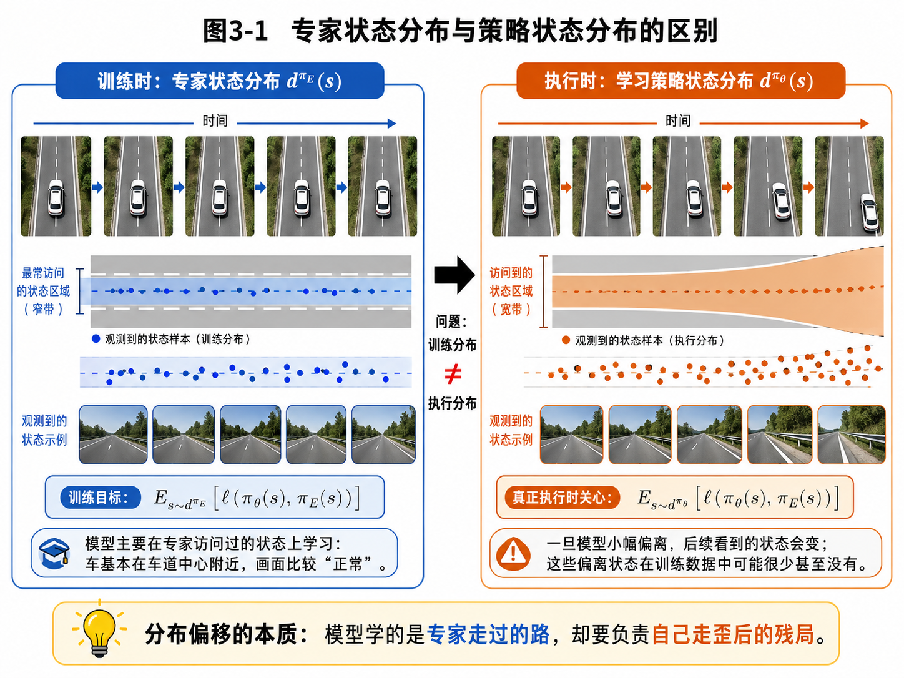
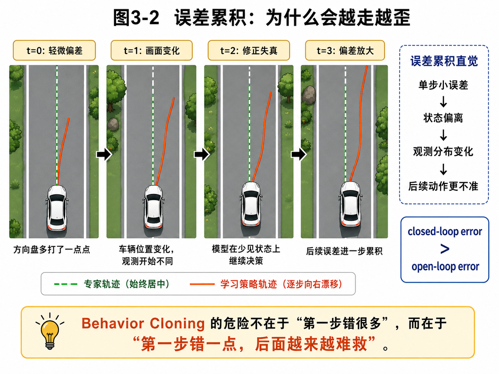
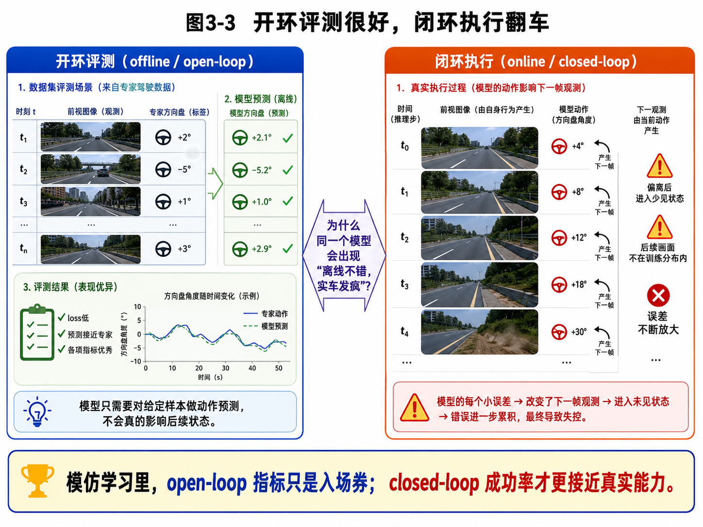

# 第3章：分布偏移：为什么 Behavior Cloning 会越走越歪

> **新版布局位置**：本章属于 **第一篇：模仿学习的基本问题**。本章编号、公式编号与交叉引用已按新版八篇结构统一调整。

> **本章一句话导读**：
> Behavior Cloning 最大的问题，不是“单步预测不准”，而是“它训练时学的是专家走过的路，执行时却要面对自己走偏后的新局面”。这就是模仿学习里最经典、也最不讲武德的问题：**distribution shift（分布偏移）**。

---

## 1. 本章开场：为什么离线评测像学霸，闭环执行像迷路？

假设你训练了一个车道保持模型。

在离线评测里，它表现很好：

- 给定前视图像，预测的方向盘角度和专家几乎重合；
- loss 很低；
- 曲线很好看；
- 你甚至开始怀疑自己是不是已经摸到了“端到端驾驶”的真谛。

然后你把它放到闭环环境里，让它自己开。

结果往往是这样的：

- 第一步还挺像样；
- 第二步稍微偏一点；
- 第三步画面已经和训练集不太一样；
- 第四步模型开始在陌生状态上做决策；
- 第五步你开始认真思考，保险到底包不包算法自信。

这背后的核心矛盾不是：

> “模型到底会不会模仿专家？”

而是：

> **模型训练时看到的状态分布，和它执行时真正访问到的状态分布，根本不是一回事。**

这就是本章的主题。

---

## 2. 本章要解决的核心问题

本章主要解决 6 个问题：

1. 什么是模仿学习里的分布偏移？
2. 为什么 Behavior Cloning 在训练时优化的是专家状态分布，而不是自己执行时的状态分布？
3. 什么是 \\(d^{\pi\_E}(s)\\) 和 \\(d^{\pi\_\theta}(s)\\)？
4. 为什么单步小误差会演化成闭环大问题？
5. 为什么 open-loop 指标往往比 closed-loop 表现乐观？
6. 分布偏移在机器人、自动驾驶和泊车任务中具体怎么体现？

---

### 主线定位与统一例子

为了让本章不变成孤立知识点，读本章时请始终把公式落回两个统一例子：

- **二维点机器人跟随专家轨迹**：状态可写成位置/速度，动作可写成二维控制量，适合观察状态分布、轨迹分布和误差累积。
- **机械臂末端运动/抓取轨迹模仿**：观测包含图像或本体状态，动作包含末端位姿增量或关节控制量，适合理解连续动作、多模态动作、动作块和实机闭环。

- **承接前文**：承接第2章：BC 在静态数据上很自然，但闭环执行会改变自己看到的状态。
- **本章推进**：把错误累积、covariate shift 和 d^pi(s) 讲成同一个问题。
- **铺垫后文**：为第4章 DAgger 为什么要让策略自己跑起来收集数据做准备。
- **公式阅读抓手**：一看到 d^{pi_E} 和 d^{pi_theta}，就要想到训练时与部署时的状态访问分布。
- **建议同步回看**：附录 B、F。

## 3. 先从直觉说起：训练时学的是“正常画面”，执行时可能看到“事故前一秒画面”

Behavior Cloning 的训练方式很朴素：

- 从专家那里收集一堆数据；
- 数据里大多数状态都是专家访问过的“正常状态”；
- 模型学会在这些状态下输出与专家相似的动作。

问题在于，专家通常很少犯错。

于是训练集里常见的是：

- 车大致在车道中心；
- 机械臂大致朝着物体正常靠近；
- 泊车车辆姿态大致在合理修正区间内；
- 双臂操作里末端位姿通常没有离谱漂移。

但模型一旦自己执行，它就可能：

- 方向盘多打一丢丢；
- 机械臂末端偏 2 厘米；
- 车身进入一个示范中很少出现的姿态；
- 下一帧看到一个训练时没怎么见过的画面。

于是事情开始出现质变：

> **模型不是在“原来的状态上继续预测”，而是在“自己制造出来的新状态上继续决策”。**

这就是为什么很多 BC 模型会出现一种很熟悉的现象：

> 离线看着像天才，闭环一跑像刚拿证的新手。

---

## 4. 状态分布：为什么要引入 \\(d^\pi(s)\\)？

要把这个问题讲清楚，我们需要一个重要数学对象：**状态分布（state distribution）**。

### 4.1 状态分布的直觉含义

给定一个策略 \\(\pi\\)，让它在环境中运行，你就会发现：

- 有些状态会经常访问到；
- 有些状态几乎从不访问到；
- 还有一些状态只要一出事就突然出现，比如快撞墙时的姿态、车已经偏到边线附近时的画面。

于是我们用 \\(d^\pi(s)\\) 表示：

> **当系统按照策略 \\(\pi\\) 执行时，它会访问到哪些状态，以及这些状态大致有多常见。**

请注意，这里不必一上来把它当成某种严格推导出来的神秘分布。对本章来说，你可以先把它理解为：

> “策略 \\(\pi\\) 在环境里跑起来之后，状态出现的经验分布。”

更详细的概率论解释，会在附录里展开。

### 4.2 专家状态分布与学习策略状态分布

在模仿学习里，我们至少关心两种状态分布：

1. **专家状态分布**

\[
 d^{\pi_E}(s) \tag{3.1}\]

这里：

- \\(\pi\_E\\) 是专家策略；
- \\(d^{\pi\_E}(s)\\) 表示专家运行时访问到的状态分布。

2. **学习策略状态分布**

\[
 d^{\pi_\theta}(s) \tag{3.2}\]

这里：

- \\(\pi\_\theta\\) 是我们训练得到的策略；
- \\(d^{\pi\_\theta}(s)\\) 表示模型自己执行时访问到的状态分布。

下面这张图很关键，它把这两者的区别画出来了。

**图3-1 说明**：
- 左边是训练阶段的专家状态分布：车大多数时间都在车道中心附近，所以数据集中常见的是“正常画面”；
- 右边是执行阶段的学习策略状态分布：只要模型有一点偏差，后续访问的状态区域就会变宽，甚至进入训练数据中很少见的状态；
- 中间那句“训练分布 \\(\neq\\) 执行分布”，就是本章的灵魂所在。

---

## 5. Behavior Cloning 到底优化了什么？

现在，我们正式把第2章的 BC 目标，放到本章的分布视角下重新看一遍。

### 5.1 训练时的目标

Behavior Cloning 通常在专家数据上最小化某种单步损失。抽象写法是：

\[
\mathcal{L}_{\mathrm{BC}}(\theta)
=
\mathbb{E}_{s \sim d^{\pi_E}}\big[\, \ell\big(\pi_\theta(s), \pi_E(s)\big) \,\big] \tag{3.3}\]

如果你更习惯用观测 \\(o\\) 而不是状态 \\(s\\)，也完全可以写成：

\[
\mathcal{L}_{\mathrm{BC}}(\theta)
=
\mathbb{E}_{o \sim d^{\pi_E}}\big[\, \ell\big(\pi_\theta(o), \pi_E(o)\big) \,\big] \tag{3.4}\]

这里为了突出“状态分布”这个概念，我们先使用 \\(s\\)。

#### 公式拆解：训练目标为什么长这样？

公式：

\[
\mathcal{L}_{\mathrm{BC}}(\theta)
=
\mathbb{E}_{s \sim d^{\pi_E}}\big[\, \ell\big(\pi_\theta(s), \pi_E(s)\big) \,\big] \tag{3.5}\]

**它要解决的问题**：
给定专家访问过的状态，希望模型在这些状态上尽量做出和专家相似的动作。

**符号解释**：
- \\(\mathcal{L}\_{\mathrm{BC}}(\theta)\\)：行为克隆的总体训练损失；
- \\(\theta\\)：模型参数；
- \\(s \sim d^{\pi\_E}\\)：状态 \\(s\\) 来自专家状态分布；
- \\(\pi\_\theta(s)\\)：学习策略在状态 \\(s\\) 下的输出；
- \\(\pi\_E(s)\\)：专家在状态 \\(s\\) 下的动作或决策；
- \\(\ell(\cdot,\cdot)\\)：比较二者差异的损失函数，例如交叉熵、MSE 或负对数似然。

**直觉理解**：
这就是在说：

> “请在专家常走的路上，尽量学得像专家。”

**机器人案例**：
在车道保持任务里，训练数据中的图像大多对应“车在车道中心附近”的状态，所以模型主要在这些画面上学会模仿方向盘操作。

**常见误解**：
很多人看到这个目标，会误以为“既然 loss 很低，说明模型整体就很好”。其实这个式子只保证：

> 在专家访问过的状态上，模型单步预测可能不错。

它并没有自动保证闭环执行时也好。

---

### 5.2 真正执行时关心的目标

但一旦模型自己执行，我们真正关心的其实是：

\[
\mathbb{E}_{s \sim d^{\pi_\theta}}\big[\, \ell\big(\pi_\theta(s), \pi_E(s)\big) \,\big] \tag{3.6}\]

请仔细看，这个式子和前一个式子的区别只有一个地方：

- 前者是 \\(s \sim d^{\pi\_E}\\)；
- 现在变成了 \\(s \sim d^{\pi\_\theta}\\)。

但就是这一个变化，足以让事情从“看着挺稳”变成“闭环翻车”。

#### 公式拆解：为什么真正关心的是这个量？

公式：

\[
\mathbb{E}_{s \sim d^{\pi_\theta}}\big[\, \ell\big(\pi_\theta(s), \pi_E(s)\big) \,\big] \tag{3.7}\]

**它要解决的问题**：
评估模型在“它自己真正会遇到的状态”上，决策是否还接近专家。

**符号解释**：
- \\(d^{\pi\_\theta}(s)\\)：模型自己执行时产生的状态分布；
- 其余符号与上式相同。

**直觉理解**：
这句话其实在问：

> “当模型不再活在专家给它安排好的舒服环境里，而是要自己开、自己走、自己纠错时，它还像不像专家？”

**工程意义**：
这比训练集损失更接近真实系统表现。因为实车、实机、真实闭环控制，看重的从来不是“你在老师给的样本上答得好不好”，而是“你自己跑起来稳不稳”。

**常见误解**：
有些人把训练目标和执行目标混在一起讲，好像差不多。其实差很多，差到足以决定一个方法能不能在真实系统里站住脚。

---

## 6. 分布偏移的本质：训练分布和执行分布不一致

现在，我们可以给出本章最核心的定义了。

> **分布偏移（distribution shift / covariate shift）**：
> 指训练时模型看到的数据分布，与执行时模型真正遇到的数据分布不一致。

在模仿学习里，它具体表现为：

\[
 d^{\pi_E}(s) \neq d^{\pi_\theta}(s) \tag{3.8}\]

这条式子很短，但它的威力很大。

#### 公式拆解：为什么这条“不等号”这么吓人？

公式：

\[
 d^{\pi_E}(s) \neq d^{\pi_\theta}(s) \tag{3.9}\]

**它要解决的问题**：
说明训练数据覆盖的状态集合，与模型自己执行时访问的状态集合不一致。

**符号解释**：
- \\(d^{\pi\_E}(s)\\)：专家状态分布；
- \\(d^{\pi\_\theta}(s)\\)：学习策略状态分布；
- \\(\neq\\)：表示两者并不相同。

**直觉理解**：
专家开车时，基本一直在正道上；模型开车时，可能很快就开到了“正道边上”，后面看到的世界已经不是专家示范里那个世界了。

**机器人案例**：
在机械臂抓取里，专家末端通常会对准目标逐步靠近；模型如果稍微偏一点，下一帧视觉观测中目标相对位置就变了，它接下来是在“偏了之后的世界”里继续决策。

**常见误解**：
分布偏移不是数据集太小才会发生。就算数据集很大，只要数据主要来自专家“正常运行区间”，而模型执行时会进入“异常偏离区间”，问题仍然存在。

---

## 7. 误差累积：为什么会“越走越歪”？

分布偏移一旦出现，最可怕的后果就是 **compounding error（误差累积）**。

### 7.1 误差累积的链条

它通常按下面这个顺序发生：

1. 第一步动作有一个小误差；
2. 小误差让系统进入一个稍微偏离的状态；
3. 偏离状态对应的观测发生变化；
4. 模型在这个较少见的新状态上继续预测；
5. 因为这个状态训练中见得少，预测更容易出错；
6. 新错误让后续状态继续偏离；
7. 误差进一步放大。

听起来像多米诺骨牌，对吧？

对，闭环系统就是这么记仇。你前面欠它一点，后面它连本带利还给你。

下面这张图专门把这个过程画出来了。

**图3-2 说明**：
- 绿色虚线表示专家轨迹，始终比较稳定；
- 橙红色曲线表示学习策略轨迹，从轻微偏差开始，逐步向右漂移；
- 右侧那条因果链“单步小误差 → 状态偏离 → 观测分布变化 → 后续动作更不准”，就是误差累积的核心机制。

### 7.2 一个经典但要谨慎理解的结论

在模仿学习文献中，常会出现一个经典结论：

> 如果在专家状态分布下，每一步的平均错误率是 \\(\varepsilon\\)，那么在长度为 \\(T\\) 的轨迹上，闭环累计误差在最坏情况下可能增长到 **\\(O(T^2 \varepsilon)\\)** 量级。

我们把这个结论写出来：

\[
\text{worst-case cumulative error} = O(T^2 \varepsilon) \tag{3.10}\]

#### 公式拆解：这个 \\(O(T^2 \varepsilon)\\) 到底在说什么？

**它要解决的问题**：
说明“单步误差很小”并不自动意味着“整条轨迹误差也小”。

**符号解释**：
- \\(T\\)：轨迹长度或决策步数；
- \\(\varepsilon\\)：在训练分布或专家状态分布上的单步平均误差；
- \\(O(T^2 \varepsilon)\\)：表示在最坏情况下，总体误差可能随 \\(T^2\\) 级别增长。

**直觉理解**：
如果你把每一步的小错误看成轻微偏航，那么越往后，系统越可能跑到更陌生的位置，而每一步错误都在给后面“加难度”。于是轨迹越长，坏事越有机会滚雪球。

**工程意义**：
这解释了为什么长时域任务尤其脆弱：
- 长时间车道保持；
- 长轨迹泊车；
- 多步操作和装配；
- 双臂长序列 manipulation。

**重要提醒**：
这个结论是一个最坏情形的理论量级，不是说所有系统都会精确地按 \\(T^2\\) 增长。你可以把它理解为一个警钟：

> “不要因为单步 loss 好看，就对长时闭环行为过于乐观。”

---

## 8. 开环评测 vs 闭环执行：为什么一个模型会出现“两副面孔”？

Behavior Cloning 最容易制造的一种幻觉就是：

> **开环评测看起来很棒。**

为什么？因为开环评测只做这样一件事：

- 给你一条数据里的观测；
- 让模型预测动作；
- 再把预测动作和专家动作比一下。

在这个过程中，模型的动作 **不会真正影响下一帧观测**。

也就是说，模型活在一个很舒服的世界里：

- 每一帧输入都还是专家轨迹里的“标准题”；
- 它不需要为自己上一帧的错误负责；
- 它也不会真的把系统带去一个未见状态。

而闭环执行就完全不同：

- 你这一帧的动作，会影响下一帧的状态；
- 下一帧状态会影响下一帧观测；
- 下一帧观测又决定你下一步动作。

一句话概括：

> 开环评测是在做题；闭环执行是在过日子。做题和过日子，从来不是一回事。

下面这张图对这个差异做了直接对比。

**图3-3 说明**：
- 左边开环评测中，模型只是在固定样本上做动作预测，所以 loss 很容易很好看；
- 右边闭环执行中，模型的动作会改变下一帧观测，从而进入少见状态，误差开始放大；
- 所以在模仿学习里，open-loop 指标是重要的，但通常只能算“入场券”，不是最终能力证明。

---

## 9. 工程案例：分布偏移在真实系统里长什么样？

### 9.1 自动驾驶车道保持

**训练时**：
- 大多数数据来自正常行驶；
- 车辆靠近车道中心；
- 前视图像构图比较稳定。

**执行时**：
- 模型方向盘多打一两度；
- 车辆偏向一侧；
- 画面中的车道线位置变了；
- 模型在这个“偏过一点”的新画面上做下一次预测；
- 如果它没学过怎么从偏差中恢复，事情就会继续恶化。

### 9.2 机械臂抓取

**训练时**：
- 遥操作员通常会把机械臂稳定地引导到目标附近；
- 目标在图像中的位置和姿态变化相对温和。

**执行时**：
- 机械臂靠近路径稍偏；
- 目标在图像中的相对位置改变；
- 甚至产生部分遮挡或不同视角；
- 模型在“自己制造的陌生视觉关系”上继续控制，容易越修越乱。

### 9.3 泊车入位

这个场景你肯定会有共鸣。

**训练时**：
- 专家驾驶轨迹往往比较平顺；
- 车辆姿态大多处在合理入位区域；
- 极端偏姿态、过晚修正、边界快撞上的样本通常并不多。

**执行时**：
- 某一步方向盘修正过头；
- 车身姿态进入一个示范中不常见的位置；
- 下一步感知、几何关系、车位入口相对位置都变化；
- 如果策略不具备恢复能力，就会变成“用错误修正错误”，最后越修越悬。

这也是为什么很多真实系统不能只靠“端到端模仿动作”，还需要：

- 规则约束；
- 安全边界；
- 轨迹检查；
- 回退机制；
- 人工接管；
- 数据闭环补齐恢复样本。

---

## 10. 常见误区

### 误区 1：分布偏移就是数据不够多

不完全对。

数据少会加剧问题，但问题的根源不是单纯“样本数少”，而是：

> 训练数据主要来自专家正常状态，而执行时模型会访问到自己偏离后的状态。

### 误区 2：只要训练 loss 很低，就说明分布偏移不严重

不对。

训练 loss 低只能说明：

> 在专家数据上，模型单步拟合得不错。

它并不能说明：
- 模型能恢复偏差；
- 模型在未见状态上稳定；
- 闭环轨迹不会漂移。

### 误区 3：分布偏移只在自动驾驶里明显

也不对。

只要任务是闭环序列决策，分布偏移就可能出现：
- 机械臂抓取；
- 双臂操作；
- 移动机器人导航；
- 泊车；
- 甚至一些游戏控制任务。

### 误区 4：单步小误差无所谓，系统会自己纠正

这要看系统有没有学到“恢复策略”。

如果训练数据里几乎没有恢复动作，模型很可能根本不知道该怎么从偏差中回来。它不是不想救，而是它不会救。

### 误区 5：分布偏移说明 BC 完全不能用

也不对。

BC 仍然是非常重要的起点。但你必须知道它的边界：

- 如果场景分布窄、任务时长短、状态扰动小，BC 可能很好用；
- 如果任务长时、闭环强、恢复能力要求高，单纯 BC 往往不够。

这也正是下一章要讲 DAgger 的动机：

> 既然模型会进入自己访问到的状态，那就让训练数据也覆盖这些状态。

---

## 11. 本章小结

本章的核心结论可以压缩成 8 句话：

1. Behavior Cloning 训练时主要在专家状态分布上学习；
2. 专家状态分布记作 \\(d^{\pi\_E}(s)\\)；
3. 学习策略执行时访问的状态分布记作 \\(d^{\pi\_\theta}(s)\\)；
4. 分布偏移的本质是：

\[
 d^{\pi_E}(s) \neq d^{\pi_\theta}(s) \tag{3.11}\]

5. BC 优化的往往是：

\[
\mathbb{E}_{s\sim d^{\pi_E}}[\ell(\pi_\theta(s),\pi_E(s))] \tag{3.12}\]

6. 但真正执行时更关心的是：

\[
\mathbb{E}_{s\sim d^{\pi_\theta}}[\ell(\pi_\theta(s),\pi_E(s))] \tag{3.13}\]

7. 单步小误差会通过“状态偏离 → 观测变化 → 后续更难预测”的链条累积；
8. 因此 open-loop 指标通常比 closed-loop 表现乐观，闭环成功率才更接近真实能力。

所以，分布偏移不是模仿学习里的一个小细节，而是一个核心矛盾。

下一章我们要讲的 DAgger，本质上就是在回答：

> **既然模型自己执行时会访问到新的状态，那我们能不能把这些状态也纳入训练？**

这就是“让老师坐副驾”的思路。

---

## 12. 本章核心概念回顾

本章需要记住的核心概念有：

- **状态分布 \\(d^\pi(s)\\)**：策略 \\(\pi\\) 运行时访问状态的分布；
- **专家状态分布 \\(d^{\pi\_E}(s)\\)**：专家访问到的状态分布；
- **学习策略状态分布 \\(d^{\pi\_\theta}(s)\\)**：模型自己执行时访问到的状态分布；
- **分布偏移**：训练分布与执行分布不一致；
- **误差累积**：小误差通过闭环状态转移逐步放大；
- **open-loop 评测**：模型动作不影响后续输入；
- **closed-loop 执行**：模型动作会改变后续状态和观测。

如果你只记一句话，请记这句：

> 模型训练时学的是专家走过的路，执行时却必须处理自己走偏后的世界。

---

## 13. 本章公式索引

1. **Behavior Cloning 在专家分布上的训练目标**

\[
\mathcal{L}_{\mathrm{BC}}(\theta)
=
\mathbb{E}_{s \sim d^{\pi_E}}\big[\, \ell\big(\pi_\theta(s), \pi_E(s)\big) \,\big] \tag{3.14}\]

2. **真正执行时更关心的闭环目标**

\[
\mathbb{E}_{s \sim d^{\pi_\theta}}\big[\, \ell\big(\pi_\theta(s), \pi_E(s)\big) \,\big] \tag{3.15}\]

3. **分布偏移的核心表达**

\[
 d^{\pi_E}(s) \neq d^{\pi_\theta}(s) \tag{3.16}\]

4. **误差累积的经典最坏情形量级**

\[
\text{worst-case cumulative error} = O(T^2 \varepsilon) \tag{3.17}\]

---

## 14. 建议阅读的附录条目

为了更好理解本章公式，建议配套阅读：

- **附录 A：数学符号与阅读方法**
  - 尤其是如何阅读期望、分布和优化目标。

- **附录 B：概率论最小生存包**
  - 重点看：条件概率、分布、期望的基础解释。

- **附录 F：强化学习与序列决策基础**
  - 重点看：MDP、策略、状态分布 \\(d^\pi(s)\\)、occupancy measure 的直觉。

如果你对 \\(O(T^2\varepsilon)\\) 这样的量级表达还不熟，可以顺带结合附录 A 中的“大 O 记号解释”阅读。

---

## 15. 思考题

1. 为什么说 Behavior Cloning 训练时主要学习的是专家状态分布，而不是学习策略自己的状态分布？
2. 请用你自己的话解释：\\(d^{\pi\_E}(s)\\) 和 \\(d^{\pi\_\theta}(s)\\) 分别表示什么？
3. 为什么单步误差很小，闭环执行仍然可能失败？
4. 你能否举一个机械臂任务中的分布偏移例子？尽量说明“偏差 → 新观测 → 更大偏差”的链条。
5. 为什么 open-loop loss 和 closed-loop success rate 不能互相替代？

---

## 16. 本章配图清单

- 图3-1：专家状态分布与策略状态分布的区别
- 图3-2：误差累积：为什么会越走越歪
- 图3-3：开环评测很好，闭环执行翻车

---

> **给下一章留个钩子**：
> 既然分布偏移的根源在于：模型执行时会访问到训练时没覆盖好的状态，
> 那么最自然的想法就是：
> **能不能让训练数据也包含这些“模型自己会访问到的状态”？**
> 这正是第4章 DAgger 的核心思想。它的潜台词很接地气：
> **别只在标准答案上学，得在你快跑偏的时候，也让老师教你一把。**

## 参考文献与推荐深入阅读

### 参考文献

- Stéphane Ross, Geoffrey J. Gordon, and J. Andrew Bagnell, “A Reduction of Imitation Learning and Structured Prediction to No-Regret Online Learning,” AISTATS 2011. <https://proceedings.mlr.press/v15/ross11a.html>
- Stéphane Ross and J. Andrew Bagnell, “Efficient Reductions for Imitation Learning,” AISTATS 2010.
- Alexandre Dadashi et al., “Primal Wasserstein Imitation Learning,” ICLR 2021. 可作为分布匹配视角的延伸阅读。

### 推荐深入阅读

- 优先精读 DAgger 论文中关于 covariate shift 和 compounding error 的部分。
- 读离线 RL 综述中关于 distribution shift / extrapolation error 的讨论，理解它和 BC 问题的共性。
- 做一个小实验：只在专家状态训练 BC，再在闭环 rollout 中统计访问状态偏移，通常比只看训练 loss 更有启发。
