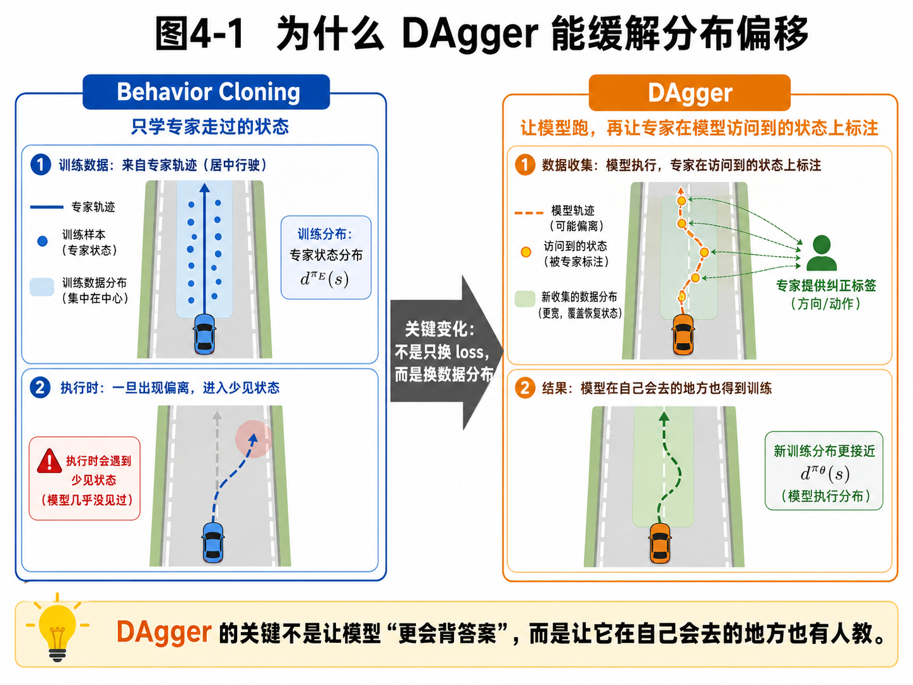
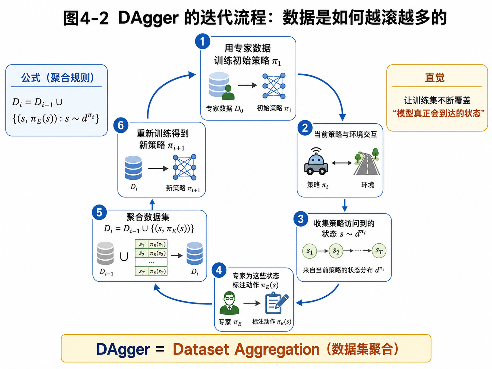
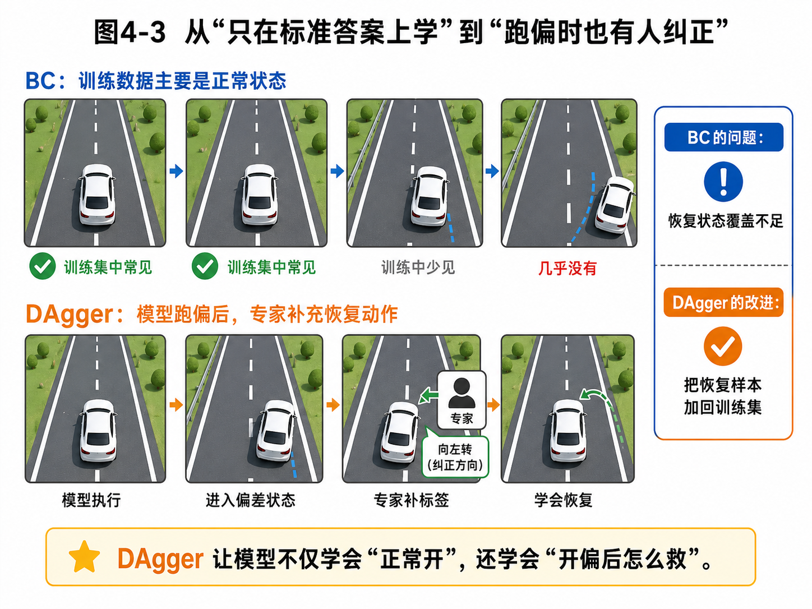

# 第4章：DAgger：让老师坐副驾，专治模型越走越歪

> **新版布局位置**：本章属于 **第一篇：模仿学习的基本问题**。本章编号、公式编号与交叉引用已按新版八篇结构统一调整。


> **本章一句话导读**：
> 第3章我们发现，Behavior Cloning 的核心问题不是 loss 写错了，而是训练数据只覆盖了专家走过的状态。DAgger 的思路非常直接：**既然模型执行时会去到自己的状态，那就让专家在这些状态上继续教它。**

---

## 1. 本章开场：只刷原题不够，还得练“做错后的补救题”

想象一个很典型的学习场景。

老师给学生一大堆标准题，学生把这些题刷得很熟。考试一开始，前两道题都做得不错。然后第三道题稍微变了一下，学生做偏了。接着第四道题又建立在第三道题的结果之上，于是他越做越偏，最后整张卷子变成了“从一个错误出发，稳定地扩散错误”。

Behavior Cloning 就有点像这样。

它的问题不是：

> “学生没有认真学习标准题。”

而是：

> **学生几乎没练过“做偏之后怎么救回来”。**

DAgger 的思路就很像一个认真负责的老师突然坐到了学生旁边，说：

- 你先自己做；
- 做对了很好；
- 做偏了也别慌；
- 我就在你做偏的那个状态上，继续告诉你正确动作是什么；
- 然后把这些“补救题”也加入训练集，下次你再遇到类似局面，就不会只会发呆了。

这就是 DAgger（Dataset Aggregation，数据集聚合）最核心的直觉。

---

## 2. 本章要解决的核心问题

本章主要解决 7 个问题：

1. DAgger 为什么能缓解 Behavior Cloning 的分布偏移问题？
2. DAgger 的核心变化是什么：loss 变了，还是数据分布变了？
3. DAgger 的算法流程是什么？
4. 数据集聚合公式 <span class="math">\\(D\_i = D\_{i-1} \cup \{(s, \pi\_E(s)) : s \sim d^{\pi\_i}\}\\)</span> 应该怎么理解？
5. 为什么说 DAgger 的本质是“让训练集逐步覆盖模型自己会到达的状态”？
6. DAgger 在机械臂、自动驾驶、泊车任务中怎么理解？
7. DAgger 的代价和局限是什么？

---


### 主线定位与统一例子

为了让本章不变成孤立知识点，读本章时请始终把公式落回两个统一例子：

- **二维点机器人跟随专家轨迹**：状态可写成位置/速度，动作可写成二维控制量，适合观察状态分布、轨迹分布和误差累积。
- **机械臂末端运动/抓取轨迹模仿**：观测包含图像或本体状态，动作包含末端位姿增量或关节控制量，适合理解连续动作、多模态动作、动作块和实机闭环。

- **承接前文**：承接第3章的分布偏移问题。
- **本章推进**：说明 DAgger 不是普通扩数据，而是在策略自己会到达的状态上重新获得专家监督。
- **铺垫后文**：为第5章把这些状态、动作、转移统一放进 MDP 语言做准备。
- **公式阅读抓手**：聚合数据集 D_i 的意义是改变训练分布，而不只是增加样本数。
- **建议同步回看**：附录 E、F。

## 3. 先从直觉说起：DAgger 不只是“再采点数据”，而是“在模型会去的地方继续教学”

第3章已经告诉我们：

- Behavior Cloning 主要在专家状态分布 <span class="math">\\(d^{\pi\_E}(s)\\)</span> 上训练；
- 但执行时真正遇到的是模型自己的状态分布 <span class="math">\\(d^{\pi\_\theta}(s)\\)</span>；
- 二者不一致，就会出现分布偏移。

DAgger 的关键想法非常朴素：

> **既然模型执行时会访问到新的状态，那就不要回避这些状态，而是直接把它们收集起来，让专家为这些状态补上正确动作。**

这句话里有两个关键词：

1. **模型自己访问到的状态**：不是只看专家轨迹，而是让当前策略真的跑起来；
2. **专家补标签**：专家不一定亲自接管执行，但会对模型访问到的状态给出“如果是我，此时该怎么做”的标注。

所以 DAgger 的重点不是：

- 换一个更 fancy 的网络；
- 换一个更花哨的 loss；
- 往模型里塞更多“高级模块”。

它真正做的事是：

> **让训练分布逐步逼近模型执行时真正会遇到的分布。**

下面这张图，先把 BC 和 DAgger 的核心差异直观看一遍。



**图4-1 说明**：
- 左边是 Behavior Cloning：训练集主要集中在专家的正常状态上，一旦执行时出现偏离，模型就进入自己不熟的状态区间；
- 右边是 DAgger：让模型自己跑，专家在模型访问到的状态上继续标注，于是训练集开始覆盖恢复状态、偏离状态和纠正状态；
- 中间那句“关键变化：不是只换 loss，而是换数据分布”是本章的核心。

---

## 4. DAgger 的数学对象：它到底在往训练集里加什么？

### 4.1 基本记号

我们沿用前几章的记号：

- <span class="math">\\(\pi\_E\\)</span>：专家策略；
- <span class="math">\\(\pi\_i\\)</span>：第 <span class="math">\\(i\\)</span> 轮训练或执行时的学习策略；
- <span class="math">\\(D\_i\\)</span>：第 <span class="math">\\(i\\)</span> 轮之后的数据集。

初始时，我们通常先有一个专家示范数据集：

<div class="math">\[
D_0 \tag{4.1}\]</div>

用它训练出初始策略 <span class="math">\\(\pi\_1\\)</span>。

然后，DAgger 的核心更新规则是：

<div class="math">\[
D_i = D_{i-1} \cup \{(s, \pi_E(s)) : s \sim d^{\pi_i}\} \tag{4.2}\]</div>

这就是 DAgger 最著名的一条公式。

### 4.2 公式拆解：为什么聚合规则长这样？

公式：

<div class="math">\[
D_i = D_{i-1} \cup \{(s, \pi_E(s)) : s \sim d^{\pi_i}\} \tag{4.3}\]</div>

**它要解决的问题**：
让训练集不再只包含专家过去访问过的状态，而是逐步加入“当前策略自己会访问到的状态”，并给这些状态配上专家动作标签。

**符号解释**：
- <span class="math">\\(D\_{i-1}\\)</span>：上一轮已经有的数据集；
- <span class="math">\\(\cup\\)</span>：集合并集，表示把新数据加进去；
- <span class="math">\\(s \sim d^{\pi\_i}\\)</span>：状态 <span class="math">\\(s\\)</span> 是由当前策略 <span class="math">\\(\pi\_i\\)</span> 执行时访问到的；
- <span class="math">\\(\pi\_E(s)\\)</span>：专家在状态 <span class="math">\\(s\\)</span> 下给出的正确动作；
- <span class="math">\\(\{(s, \pi\_E(s)) : s \sim d^{\pi\_i}\}\\)</span>：本轮新收集到的、并由专家标注好的状态—动作对。

**直觉理解**：
这条公式不是在说“多收点数据”，而是在说：

> “收模型真正会遇到的数据，并且让专家告诉它在这些状态下怎么做。”

**机器人案例**：
比如在泊车任务中，模型某一轮执行时把车头偏左了，于是进入一个示范里不太常见的姿态。DAgger 就会把这个偏左姿态记下来，再让专家给出“此时应该怎样打方向修回来”的动作，然后把这条恢复样本加入训练集。

**常见误解**：
有人会以为 DAgger 就是“多采样 + 重新训练”。但关键不是“多”，而是“采样位置变了”——你采的是模型自己会去的状态，而不是继续采一堆专家完美轨迹。

---

## 5. DAgger 的算法流程：一轮一轮把训练集往执行分布上推

一个典型的 DAgger 过程大致如下：

1. 使用初始专家数据 <span class="math">\\(D\_0\\)</span> 训练一个初始策略 <span class="math">\\(\pi\_1\\)</span>；
2. 让当前策略 <span class="math">\\(\pi\_i\\)</span> 与环境交互；
3. 收集它访问到的状态 <span class="math">\\(s \sim d^{\pi\_i}\\)</span>；
4. 让专家为这些状态标注动作 <span class="math">\\(\pi\_E(s)\\)</span>；
5. 把新样本聚合到旧数据集里，得到 <span class="math">\\(D\_i\\)</span>；
6. 用聚合后的数据重新训练，得到新策略 <span class="math">\\(\pi\_{i+1}\\)</span>；
7. 重复上述过程。

下面这张图，把整个循环画得比较清楚。



**图4-2 说明**：
- 第 1 步：用专家数据训练初始策略；
- 第 2–4 步：让当前策略执行，并由专家在它访问到的状态上标注动作；
- 第 5 步：做数据集聚合；
- 第 6 步：重新训练出新策略；
- 这个循环的核心效果是：训练集越来越接近模型真正会访问到的状态空间。

### 5.1 Python 风格伪代码

```python
# initial expert dataset D0
D = D0.copy()
pi = train_policy(D)

for i in range(num_rounds):
    visited_states = rollout_states(policy=pi, env=env)
    new_data = []

    for s in visited_states:
        a_star = expert_label(s)   # pi_E(s)
        new_data.append((s, a_star))

    D.extend(new_data)
    pi = train_policy(D)
```

这段代码的朴素程度，甚至会让你怀疑：

> “就这？”

是的，算法主干确实就这么直。DAgger 最牛的地方不在于代码看起来复杂，而在于它准确地抓住了 BC 的核心矛盾：**训练分布和执行分布不一致。**

---

## 6. DAgger 与 Behavior Cloning 的根本差别：它教的是“恢复能力”

很多时候，你可以把 DAgger 理解成：

> **Behavior Cloning + 在偏差状态上的补课机制**

Behavior Cloning 主要教会模型：

- 在正常状态下怎么做；
- 在标准题里怎么答。

DAgger 额外教会模型：

- 跑偏了怎么办；
- 进入恢复状态后该怎么救；
- 哪怕不在专家最常走的中心轨道上，也能找到回来的动作。

下面这张图，用一个非常具体的车道保持例子，把这种差别画出来了。



**图4-3 说明**：
- 上排是 BC：训练数据主要是正常状态，模型对恢复状态几乎没经验；
- 下排是 DAgger：模型先自己执行，一旦进入偏差状态，专家就补上纠正动作标签；
- 结果是：模型不只学会“正常开”，还学会“开偏后怎么救”。

这也是为什么 DAgger 看起来没改网络结构，却经常能显著改善闭环表现。

---

## 7. 一个常见补充：为什么有的 DAgger 会混合专家与学习策略？

在一些版本的 DAgger 讲法中，你会看到这样的混合策略写法：

<div class="math">\[
\pi_i = \beta_i \pi_E + (1-\beta_i) \hat\pi_i \tag{4.4}\]</div>

其中：

- <span class="math">\\(\hat\pi\_i\\)</span> 表示当前学习到的策略；
- <span class="math">\\(\pi\_E\\)</span> 是专家策略；
- <span class="math">\\(\beta\_i \in [0,1]\\)</span> 是混合系数。

### 7.1 公式拆解：混合策略在干什么？

公式：

<div class="math">\[
\pi_i = \beta_i \pi_E + (1-\beta_i) \hat\pi_i \tag{4.5}\]</div>

**它要解决的问题**：
在早期训练阶段，如果学习策略太不靠谱，完全放它自己乱跑可能会太危险、太低效，或者收集到一堆质量很差的状态。因此可以让专家以一定概率接管或混入执行。

**符号解释**：
- <span class="math">\\(\beta\_i\\)</span>：第 <span class="math">\\(i\\)</span> 轮专家占比；
- <span class="math">\\(1-\beta\_i\\)</span>：学习策略占比；
- <span class="math">\\(\pi\_i\\)</span>：用于本轮数据收集的行为策略；
- <span class="math">\\(\hat\pi\_i\\)</span>：当前学习到的策略。

**直觉理解**：
这就像老师一开始会扶着你骑自行车，后面慢慢松手：

- 早期 <span class="math">\\(\beta\_i\\)</span> 大一点，老师多扶你；
- 后期 <span class="math">\\(\beta\_i\\)</span> 小一点，让你自己骑。

**工程意义**：
在真实机器人系统里，这种混合往往很有必要，因为完全让一个不成熟策略自由发挥，代价可能不是“多摔几次”，而是“多撞几次”。

**常见误解**：
并不是每个实践版本都必须显式写出这个混合式子，但它很好地表达了 DAgger 的一个常见工程策略：**从专家主导，逐步过渡到模型主导。**

---

## 8. 为什么 DAgger 在理论上更合理？一句人话版 no-regret 直觉

原始 DAgger 论文的重要贡献之一，是把这个问题和在线学习（online learning）里的 no-regret 分析联系起来。我们这里不做过重的理论推导，只讲一条最重要的人话版结论：

> 如果你每一轮都在“当前会访问到的状态分布”上学得还不错，那么随着数据集不断聚合，最终学到的策略在闭环执行中也更有可能表现稳定。

也就是说，DAgger 的理论优势不在于它会神奇地消灭所有错误，而在于：

- 它训练的分布更加接近执行分布；
- 它在不断缩小“你学的地方”和“你会去的地方”之间的差距。

这比单纯在专家分布上追求极低 loss，要更符合闭环任务的本质。

---

## 9. 工程实践案例

### 9.1 自动驾驶：车道保持与恢复样本补齐

**BC 的问题**：
- 训练时大多是居中行驶样本；
- 一旦执行时偏向边线，模型缺少恢复经验。

**DAgger 的改进**：
- 让当前策略自己开；
- 收集偏向边线、进入恢复姿态的状态；
- 由专家给出“如何打方向回正”的动作；
- 把这些恢复样本加回训练集。

这样模型学到的不只是“正常开”，还有“偏了以后怎么救”。

### 9.2 机械臂抓取：末端偏差恢复

**BC 的问题**：
- 示范中的末端路径通常比较平顺；
- 模型一旦靠近路径偏了，视觉关系、接近角度、遮挡关系都会变化。

**DAgger 的改进**：
- 让当前机械臂策略自己执行；
- 收集那些“末端已偏、目标相对位置异常”的状态；
- 由专家给出恢复动作，比如左移、抬高、重新对准；
- 重新训练后，模型更有机会学到纠偏能力。

### 9.3 泊车：从“正常入位”到“偏姿态修正”

这个例子最适合你。

**BC 的问题**：
- 示范数据里通常以成功、平顺、姿态合理的轨迹为主；
- 真执行时，车辆姿态可能更偏、入口角度可能更差、修正时机可能更晚。

**DAgger 的改进**：
- 让当前策略自己倒；
- 记录那些“已偏离但仍可恢复”的中间姿态；
- 由专家或高质量控制器给出修正动作；
- 训练集开始覆盖“纠偏阶段”，于是模型对真实闭环更有韧性。

这类场景特别能体现 DAgger 的价值，因为很多任务不是“是否会开局”，而是“开局一旦不完美，后面还能不能救回来”。

---

## 10. DAgger 的代价与局限

DAgger 很好，但它绝不是“没有副作用的神药”。

### 10.1 需要专家在线或准在线标注

这是它最现实的门槛。

你必须有一个专家，能对模型访问到的状态给出动作标签。这个专家可以是：

- 人类操作员；
- 一个高质量控制器；
- 某种强基线系统；
- 离线回放中的人工修正。

但无论如何，这都意味着额外成本。

### 10.2 数据收集过程可能昂贵或危险

如果任务是：

- 实车驾驶；
- 真实机械臂装配；
- 容易损坏设备的操作任务；

那“让当前不成熟策略自己跑”本身就有风险。因此工程上往往需要：

- 安全边界；
- 人工接管；
- 混合策略；
- 仿真先行；
- 只收集可控偏差状态而非彻底放飞自我。

### 10.3 数据集会越滚越大

DAgger 的名字就决定了这件事：Dataset Aggregation。

数据集越滚越大，通常意味着：

- 训练时间更长；
- 数据管理更复杂；
- 不同轮次数据的质量不完全一致；
- 有时还需要样本重加权或筛选。

### 10.4 它不能替代所有更高级方法

DAgger 缓解的是分布偏移问题，但它不自动解决：

- 多模态动作问题；
- 长时序规划问题；
- 概率不确定性表达问题；
- 世界模型与任务理解问题。

也就是说，它是一个非常关键的修正，但不是万能补丁。

---

## 11. 常见误区

### 误区 1：DAgger 只是“多采集几轮数据”

不对。

它的核心不是“多几轮”，而是：

> 训练样本的来源从“专家走过的状态”扩展到“模型自己会访问到的状态”。

### 误区 2：DAgger 的关键是 loss 更高级

也不对。

DAgger 最本质的变化是数据分布，而不是损失函数花样。它当然可以搭配各种模型和 loss，但它的灵魂在数据采样机制上。

### 误区 3：DAgger 一定比 BC 好

也不能这么绝对。

如果：
- 任务短；
- 分布很窄；
- 扰动小；
- 恢复状态几乎不会出现；

那简单 BC 可能已经足够，DAgger 的额外成本不一定值得。

### 误区 4：DAgger 就能彻底消灭分布偏移

不现实。

它是在**缓解**问题，不是宣布问题永远消失。尤其当：
- 模型能力有限；
- 专家标签质量一般；
- 偏差状态极端复杂；

你依然可能遇到闭环失败。

### 误区 5：只要有 DAgger，就不需要安全机制

这是最危险的误区之一。

在真实系统里，DAgger 收集数据的过程本身就可能有风险，所以通常必须配套：

- 约束；
- 人工接管；
- 仿真验证；
- 回滚策略；
- 安全监控。

---

## 12. 本章小结

本章可以压缩成 8 句话：

1. DAgger 的全称是 Dataset Aggregation；
2. 它的目标是缓解 Behavior Cloning 的分布偏移问题；
3. 它的关键变化不是只换 loss，而是换训练数据分布；
4. 每一轮它都会收集当前策略访问到的状态 <span class="math">\\(s \sim d^{\pi\_i}\\)</span>；
5. 专家会为这些状态标注动作 <span class="math">\\(\pi\_E(s)\\)</span>；
6. 新样本按下式并入数据集：

<div class="math">\[
D_i = D_{i-1} \cup \{(s, \pi_E(s)) : s \sim d^{\pi_i}\} \tag{4.6}\]</div>

7. 这样训练集会逐步覆盖模型真实会遇到的状态；
8. 因而模型不仅学会“正常做”，还更有机会学会“做偏以后怎么救”。

如果说第3章是在告诉你“问题出在哪”，那么第4章就是在告诉你：

> **一个最经典、最直接、最有操作性的解决思路是什么。**

下一章开始，我们会继续往更深的数学地基走，讨论模仿学习为什么本质上活在一个**序列决策**世界里。

---

## 13. 本章核心概念回顾

本章需要记住的核心概念有：

- **DAgger**：Dataset Aggregation，数据集聚合；
- **当前策略 <span class="math">\\(\pi\_i\\)</span>**：第 <span class="math">\\(i\\)</span> 轮用于交互和收集状态的策略；
- **专家策略 <span class="math">\\(\pi\_E\\)</span>**：提供正确动作标签的策略；
- **聚合数据集 <span class="math">\\(D\_i\\)</span>**：包含历史数据与本轮新标注样本的数据集；
- **状态分布 <span class="math">\\(d^{\pi\_i}(s)\\)</span>**：当前策略运行时访问到的状态分布；
- **恢复样本**：模型跑偏后，由专家给出的纠正动作样本；
- **混合策略**：用专家与学习策略混合执行，以安全地收集数据。

如果你只记一句话，请记这句：

> DAgger 的关键不是让模型更会背专家答案，而是让它在自己真的会去的地方，也继续受到专家指导。

---

## 14. 本章公式索引

1. **DAgger 的数据集聚合规则**

<div class="math">\[
D_i = D_{i-1} \cup \{(s, \pi_E(s)) : s \sim d^{\pi_i}\} \tag{4.7}\]</div>

2. **一个常见的混合策略写法**

<div class="math">\[
\pi_i = \beta_i \pi_E + (1-\beta_i) \hat\pi_i \tag{4.8}\]</div>

---

## 15. 建议阅读的附录条目

为了更好理解本章公式，建议配套阅读：

- **附录 A：数学符号与阅读方法**
  - 尤其是集合记号、并集、条件表达式的阅读。

- **附录 B：概率论最小生存包**
  - 重点看：期望与分布的基本直觉。

- **附录 F：强化学习与序列决策基础**
  - 重点看：策略、状态分布 <span class="math">\\(d^\pi(s)\\)</span>、为什么闭环执行会改变状态分布。

如果你对 no-regret 还不熟，不必焦虑。本章只要求你先抓住它的人话版直觉：**在当前会访问到的状态上反复学，最终会比只在专家分布上学更合理。**

---

## 16. 思考题

1. 为什么说 DAgger 的关键变化不是换 loss，而是换数据分布？
2. 你能否用自己的话解释公式 <span class="math">\\(D\_i = D\_{i-1} \cup \{(s, \pi\_E(s)) : s \sim d^{\pi\_i}\}\\)</span>？
3. 为什么 DAgger 特别适合缓解“恢复状态覆盖不足”的问题？
4. 在泊车或机械臂任务中，什么样的状态可以被看作“恢复样本”？
5. DAgger 在真实系统里最现实的成本和风险是什么？

---

## 17. 本章配图清单

- 图4-1：为什么 DAgger 能缓解分布偏移
- 图4-2：DAgger 的迭代流程：数据如何越滚越多
- 图4-3：从只在标准答案上学到跑偏时也有人纠正

---

> **给下一章留个钩子**：
> 到这里为止，我们已经从“模仿学习是什么”讲到“BC 为什么会翻车”，再讲到“DAgger 怎么补救分布偏移”。
> 但还有一个更底层的问题必须正面回答：
> **为什么这些问题会如此顽固？为什么机器人学习不是普通的静态监督学习，而是一个序列决策问题？**
> 这就是下一章——**模仿学习中的序列决策问题**——要真正搭起来的数学地基。
