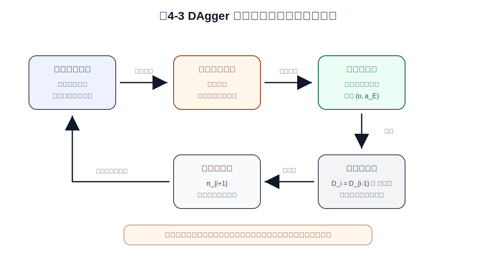

# 第4章 DAgger：用交互数据修正策略分布

> **本章一句话导读**：
> 第 3 章指出，Behavior Cloning 的核心问题是训练在专家分布上，执行却在学习策略自己的分布上。DAgger 的解决思路很直接：让当前策略自己跑起来，收集它实际会遇到的状态，再让专家在这些状态上补动作标签，并不断把这些数据聚合回训练集。

第 2 章讲 Behavior Cloning，第 3 章讲分布偏移。现在我们已经知道：BC 的问题不是“完全不会学”，而是它主要在专家分布 $d^{\pi_E}(o)$ 上学动作，部署时却要在学习策略自己诱导出的分布 $d^{\pi_\theta}(o)$ 上连续决策。

这就像一个学生只刷标准题，考试时一旦某一步做偏，后面题目全都变形了。学生不是没有刷题，而是几乎没练过“做偏以后怎么救回来”。

DAgger 的思路就是：

```text
让学生自己做题；
做偏了也不要跳过；
就在做偏的地方让老师指出正确做法；
再把这些“补救题”加入训练集。
```

放到机械臂抓取与放置任务中，就是：

```text
让当前策略控制机械臂；
记录它实际访问到的观测；
如果末端偏了、遮挡变了、目标相对位置异常，也不要丢掉；
让专家在这些观测上给出正确动作；
把这些新样本加入训练集，重新训练策略。
```

这就是 DAgger 的核心：**不是简单增加数据量，而是改变训练数据来自哪里。**

---

## 4.1 从分布偏移到 DAgger：问题到底要怎么补

第 3 章的核心公式是：

$$
d^{\pi_E}(o) \neq d^{\pi_\theta}(o)
$$

它说明：专家看到的观测分布，和模型自己执行后看到的观测分布，可能并不一样。

BC 的训练数据主要来自专家分布。模型执行时一旦偏离，就会进入训练数据里少见的观测区域。比如机械臂原本应该对准轴承套中心，但当前策略让末端偏右了 2 厘米。下一帧图像中的目标相对位置、夹爪遮挡关系和接近角度都变了。

这时有两种处理方式。

第一种是继续收集更多专家完美示范。这样当然有帮助，但它仍然可能主要覆盖“专家正常执行时的状态”。

第二种是直接面对模型会犯的错：

```text
模型会偏到哪里，就收哪里；
模型会在哪些观测下犹豫，就标哪里；
模型在哪些状态下容易继续错，就让专家在这些状态上给动作标签。
```

DAgger 选择的是第二种。

---

## 4.2 DAgger 的基本定义

> **定义 4.1：DAgger**
>
> DAgger（Dataset Aggregation，数据集聚合）是一种交互式模仿学习方法。它让当前学习策略在环境中执行，收集该策略实际访问到的状态或观测，再由专家为这些状态或观测提供动作标签，并把新样本聚合到训练集中反复训练。

这个定义里有四个关键词：

```text
当前学习策略
实际访问到的状态或观测
专家动作标签
数据集聚合
```

它和普通 BC 最大的区别不是损失函数，而是数据来源。

BC 通常使用专家示范数据：

```text
专家怎么走，就学专家走过的状态。
```

DAgger 会让当前策略自己执行：

```text
模型自己会走到哪里，就在那里请专家继续教。
```


**图4-1 说明**：Behavior Cloning 的训练数据主要覆盖专家正常状态；DAgger 则让学习策略自己执行，并在模型实际访问到的偏离状态、恢复状态和纠正状态上继续获得专家监督。核心变化不是换一个损失函数，而是把训练数据推向学习策略真实会遇到的分布。

---

## 4.3 DAgger 的核心数学对象

为了写清楚 DAgger，需要先定义几个对象。

> **定义 4.2：第 $i$ 轮学习策略**
>
> 第 $i$ 轮学习策略 $\pi_i$ 是 DAgger 第 $i$ 次迭代中，用于执行、收集数据或训练得到的当前策略。

> **定义 4.3：聚合数据集**
>
> 聚合数据集 $D_i$ 是 DAgger 第 $i$ 轮结束后得到的训练集。它包含初始专家数据，以及前面各轮从当前策略访问分布中收集并由专家标注的新样本。

> **定义 4.4：专家动作标签**
>
> 专家动作标签 $a_E$ 是专家在某个观测 $o$ 或状态 $s$ 下给出的动作监督信号。训练时模型直接拟合的是这个标签，而不是抽象地拟合“专家策略”本身。

初始时，我们通常有一个专家示范数据集：

**公式 (4.1)：初始专家数据集**

$$
D_0 = \{(o_j, a^E_j)\}_{j=1}^{N_0}
$$

这个公式读作：初始数据集 $D_0$ 由 $N_0$ 个专家示范样本组成，每个样本包含观测 $o_j$ 和专家动作标签 $a^E_j$。

其中：

- $D_0$：初始专家数据集；
- $o_j$：第 $j$ 个专家示范观测；
- $a^E_j$：专家在观测 $o_j$ 下给出的动作标签；
- $N_0$：初始样本数量。

用 $D_0$ 可以训练出一个初始策略。之后 DAgger 不再只依赖专家示范，而是进入迭代过程。

---

## 4.4 数据集聚合公式：DAgger 到底在往数据里加什么

DAgger 的核心更新可以写成下面的形式。

**公式 (4.2)：DAgger 的数据集聚合规则**

$$
D_i = D_{i-1} \cup \{(o, a_E) \mid o \sim d^{\pi_i}(o),\ a_E = \pi_E(o)\}
$$

这个公式读作：第 $i$ 轮数据集 $D_i$，等于上一轮数据集 $D_{i-1}$，再加上当前策略 $\pi_i$ 执行时访问到的观测 $o$，以及专家在这些观测上给出的动作标签 $a_E$。

其中：

- $D_i$：第 $i$ 轮之后的聚合数据集；
- $D_{i-1}$：上一轮已有数据集；
- $\cup$：并集，这里可以理解为“把新样本加入旧数据集”；
- $o \sim d^{\pi_i}(o)$：观测 $o$ 来自当前策略 $\pi_i$ 执行时诱导出的观测分布；
- $a_E$：专家动作标签；
- $a_E = \pi_E(o)$：专家在观测 $o$ 下给出的动作。

### 公式拆解：为什么聚合规则长这样？

**动机**：第 3 章的问题是，BC 没有在学习策略自己会遇到的分布上训练。DAgger 就直接让当前策略执行，收集它实际遇到的观测。

**直觉**：这条公式不是说“多收点数据”，而是在说：“收模型真正会遇到的数据，并让专家告诉它在这些观测下应该怎么做。”

**机械臂含义**：如果当前机械臂策略靠近目标时偏右，图像中目标相对夹爪的位置已经异常。DAgger 会记录这个异常观测，并让专家给出“向左修正、重新对准、减速靠近”等动作标签，然后把它加入训练集。

**常见误解**：DAgger 不是简单的数据增强，也不是换了一个更高级的 loss。它的关键是采样分布变了：新数据来自 $d^{\pi_i}(o)$，也就是当前策略自己执行时会遇到的分布。

---

## 4.5 DAgger 的算法流程

> **定义 4.5：交互式标注**
>
> 交互式标注是指让当前策略在环境中执行，并在它访问到的状态或观测上请求专家给出动作标签的过程。

一个典型 DAgger 流程如下：

```text
1. 收集初始专家数据 D_0。
2. 用 D_0 训练初始策略 pi_1。
3. 让当前策略 pi_i 在环境中执行。
4. 记录它访问到的观测 o。
5. 让专家为这些观测给出动作标签 a_E。
6. 把新样本 (o, a_E) 加入旧数据集，得到 D_i。
7. 用 D_i 重新训练策略，得到 pi_{i+1}。
8. 重复执行、标注、聚合、再训练。
```


**图4-2 说明**：DAgger 从初始专家数据开始，训练初始策略；然后让当前策略执行，收集它访问到的状态或观测；专家为这些状态补动作标签；新数据被聚合回训练集，再训练出下一轮策略。这个过程会让训练集逐步覆盖学习策略真实会遇到的分布。

---

## 4.6 DAgger 在机械臂任务中的数据闭环

把 DAgger 放回本书主线任务，可以得到一个非常清楚的工程闭环。

```text
当前策略控制机械臂
→ 机械臂进入真实访问状态
→ 其中一部分状态偏离专家轨迹
→ 记录这些偏离观测
→ 专家给出恢复动作标签
→ 新样本加入训练集
→ 重新训练策略
→ 下一轮策略更会处理偏离状态
```



**图4-3 说明**：DAgger 在机械臂任务中的价值，是把“模型自己造成的偏离状态”变成训练数据。专家不只是演示完美轨迹，还会在模型实际遇到的异常观测上给出纠正动作，从而让策略学会恢复。

这和只增加专家完美轨迹不同。

如果继续采集专家完美轨迹，数据可能还是集中在正常路径附近；如果采集 DAgger 数据，数据会包含更多：

- 末端偏离目标后的观测；
- 夹爪遮挡目标后的观测；
- 接近角度不理想时的观测；
- 快要抓空但仍可恢复的观测；
- 专家给出的纠偏动作。

这些样本对闭环执行非常关键，因为它们教模型“偏了以后怎么救”。

---

## 4.7 混合策略：从专家主导逐步过渡到模型主导

真实系统里，完全让一个刚训练出来的策略自由执行，可能很危险。机械臂可能撞桌子，自动驾驶可能压线，泊车可能擦碰。

因此，DAgger 实践中常会引入混合策略。

> **定义 4.6：混合策略**
>
> 混合策略是指在数据收集阶段，以一定比例使用专家策略，以另一部分比例使用当前学习策略，从而在安全性和暴露模型分布之间取得平衡。

**公式 (4.3)：DAgger 中的混合执行策略**

$$
\pi^{mix}_i = \beta_i \pi_E + (1-\beta_i)\pi_i
$$

这个公式读作：第 $i$ 轮用于执行和收集数据的混合策略 $\pi^{mix}_i$，由专家策略 $\pi_E$ 和当前学习策略 $\pi_i$ 按比例混合得到。

其中：

- $\pi^{mix}_i$：第 $i$ 轮混合执行策略；
- $\beta_i$：专家策略占比；
- $1-\beta_i$：学习策略占比；
- $\pi_E$：专家策略；
- $\pi_i$：当前学习策略。

### 公式拆解：混合策略为什么有用？

**动机**：早期学习策略可能很不稳定，完全让它自由执行会带来风险。混合策略让专家先多参与，后面逐步降低专家比例。

**直觉**：像老师教学生骑自行车。一开始老师扶得多，后面慢慢松手。

**机械臂含义**：在机械臂抓取中，可以先让专家或安全控制器更多介入，避免策略一开始就撞到桌面或夹爪错误闭合。随着模型变稳，再逐步增加模型自主执行比例。

**常见误解**：混合策略不是 DAgger 的唯一实现方式，但它表达了一个重要工程原则：交互式数据采集必须考虑安全和成本。

---

## 4.8 DAgger 的训练目标

DAgger 的损失函数本身可以和 BC 很像。关键变化在数据集。

> **定义 4.7：DAgger 训练目标**
>
> DAgger 训练目标是在聚合数据集 $D_i$ 上训练策略，使学习策略在专家标注过的观测上输出接近专家动作标签的动作。

**公式 (4.4)：DAgger 在聚合数据集上的训练目标**

$$
\theta_i^* = \arg\min_\theta
\frac{1}{|D_i|}\sum_{(o,a_E)\in D_i}
\ell\left(\pi_\theta(o), a_E\right)
$$

这个公式读作：在第 $i$ 轮聚合数据集 $D_i$ 上，寻找参数 $\theta$，使学习策略输出 $\pi_\theta(o)$ 和专家动作标签 $a_E$ 之间的平均损失最小。

其中：

- $\theta_i^*$：第 $i$ 轮训练后得到的最优参数；
- $D_i$：第 $i$ 轮聚合数据集；
- $|D_i|$：数据集中的样本数；
- $(o,a_E)$：聚合数据集中的观测—专家动作标签样本；
- $\ell(\pi_\theta(o), a_E)$：策略输出与专家动作标签之间的损失。

这条公式说明：DAgger 不一定需要发明新损失。它可以继续使用 MSE、NLL 或其他监督学习损失。真正变化的是：训练集从 $D_0$ 变成了不断扩大的 $D_i$，而 $D_i$ 包含了学习策略自己访问到的状态。

---

## 4.9 为什么 DAgger 能缓解分布偏移

现在可以把第 3 章和第 4 章接起来。

第 3 章说 BC 的问题是：

$$
d^{\pi_E}(o) \neq d^{\pi_\theta}(o)
$$

DAgger 的做法是：

```text
让当前策略 pi_i 执行；
收集 o ~ d^{pi_i}(o)；
让专家给标签 a_E；
把 (o, a_E) 加入 D_i；
再训练下一轮策略。
```

因此，DAgger 不是直接让 $d^{\pi_i}(o)$ 一下子等于 $d^{\pi_E}(o)$。它做的是更实际的事情：

> **让训练数据逐步覆盖学习策略自己会访问到的分布。**

这就是它比纯 BC 更适合闭环任务的原因。

用机械臂语言说，BC 主要教模型“正常靠近时怎么抓”；DAgger 进一步教模型“靠歪以后怎么修回来”。

---

## 4.10 工程中的 DAgger 怎么落地

### 4.10.1 机械臂抓取与放置

DAgger 在机械臂任务中可以这样实施：

```text
1. 用专家遥操作数据训练初始策略。
2. 让策略在低速、安全区域执行。
3. 记录策略实际访问到的观测。
4. 对偏离状态、接近失败状态、遮挡状态进行专家标注。
5. 把这些恢复样本加入训练集。
6. 重新训练策略。
7. 逐步扩大测试范围。
```

关键是不要只收成功轨迹。很多有价值的数据恰恰来自“还没失败，但已经偏了”的中间状态。

### 4.10.2 自动驾驶车道保持

BC 训练数据通常以正常行驶为主。DAgger 可以让当前模型在安全环境或仿真中运行，收集偏向车道边缘、角度偏差较大、需要回正的状态，再由专家给出修正方向盘动作。

这样模型学到的不只是“居中时怎么开”，还有“偏离后怎么回正”。

### 4.10.3 泊车入位

泊车任务也很适合用 DAgger 思想理解。

BC 的数据常常集中在成功、平顺、姿态合理的入位轨迹；真实执行时，车辆可能进入入口角度更差、修正时机更晚、车身姿态更偏的状态。

DAgger 的价值是收集这些“已偏离但仍可恢复”的中间状态，并让专家或高质量控制器给出修正动作。这样训练集开始覆盖纠偏阶段。

---

## 4.11 DAgger 的代价与局限

DAgger 很有价值，但它不是没有代价。

### 4.11.1 需要专家在线或准在线标注

DAgger 需要专家对模型访问到的状态给动作标签。专家可以是人类操作员、高质量控制器、规划器、强基线系统，也可以是离线回放中的人工修正。

但无论哪种形式，都会增加标注成本。

### 4.11.2 数据收集可能昂贵或危险

让不成熟策略自己跑，本身就有风险。

在机械臂中，可能撞桌子、夹错物体或损坏夹具；在自动驾驶和泊车中，可能涉及安全边界。因此工程上通常需要：

- 仿真先行；
- 低速测试；
- 安全区域；
- 人工接管；
- 混合策略；
- 规则约束和回退机制。

### 4.11.3 数据集会越滚越大

DAgger 的名字就是 Dataset Aggregation。数据集不断聚合，会带来训练时间增加、数据版本管理复杂、样本质量不一致、轮次权重如何设置等问题。

### 4.11.4 它不能解决所有模仿学习问题

DAgger 主要缓解分布偏移。它不自动解决：

- 多模态动作；
- 长时序规划；
- 稀疏任务目标；
- 不确定性表达；
- 世界模型与任务理解；
- 复杂接触和力控问题。

所以，DAgger 是关键修正，不是万能补丁。

---

## 4.12 常见误区

### 误区 1：DAgger 只是多采几轮数据

不对。

DAgger 的关键不是“多”，而是采样分布变了。它收集的是当前策略自己会访问到的状态，而不是继续只收专家完美轨迹。

### 误区 2：DAgger 的关键是换了更高级的 loss

不对。

DAgger 的损失可以和 BC 一样。它的灵魂在数据采样机制和数据集聚合上。

### 误区 3：DAgger 一定比 BC 划算

不一定。

如果任务很短、环境扰动小、执行分布和专家分布差异不大，BC 可能已经够用。DAgger 的额外交互和标注成本不一定值得。

### 误区 4：DAgger 能彻底消灭分布偏移

不现实。

DAgger 是缓解分布偏移，不是让问题永远消失。模型能力、专家标签质量、偏离状态复杂度和安全约束都会影响最终效果。

---

## 4.13 本章总结：DAgger 的关键是把训练数据推向执行分布

现在可以总结本章。

第 3 章指出：

```text
BC 训练在专家分布上，执行在学习策略分布上。
```

第 4 章的 DAgger 给出一个经典解决思路：

```text
让学习策略自己执行；
收集它实际访问到的观测；
让专家在这些观测上给动作标签；
把新样本聚合进训练集；
反复训练，让训练集逐步覆盖执行分布。
```

本章最核心的公式是：

$$
D_i = D_{i-1} \cup \{(o, a_E) \mid o \sim d^{\pi_i}(o),\ a_E = \pi_E(o)\}
$$

它说明：DAgger 的关键不是换 loss，而是换数据来源。

如果说第 3 章告诉我们“BC 为什么会越走越歪”，那么第 4 章就告诉我们：

> **让模型在自己会走到的地方继续接受专家教学。**

下一章开始，我们会进入更底层的序列决策语言，用 MDP 来统一描述状态、动作、转移和策略。

---

## 4.14 本章公式索引

为避免复杂公式在 Markdown 表格中渲染不稳定，本章公式索引采用逐条独立公式块。

### 公式 (4.1)：初始专家数据集

$$
D_0 = \{(o_j, a^E_j)\}_{j=1}^{N_0}
$$

- **含义**：DAgger 从初始专家示范数据开始。
- **需要掌握到什么程度**：理解 $D_0$ 是初始 BC 阶段的数据来源。

### 公式 (4.2)：DAgger 的数据集聚合规则

$$
D_i = D_{i-1} \cup \{(o, a_E) \mid o \sim d^{\pi_i}(o),\ a_E = \pi_E(o)\}
$$

- **含义**：把当前策略访问到的观测和专家动作标签加入训练集。
- **需要掌握到什么程度**：这是本章核心公式，需要理解新数据来自当前策略分布，而不是继续只来自专家分布。

### 公式 (4.3)：DAgger 中的混合执行策略

$$
\pi^{mix}_i = \beta_i \pi_E + (1-\beta_i)\pi_i
$$

- **含义**：数据收集时用专家和学习策略混合执行。
- **需要掌握到什么程度**：理解它是为了兼顾安全和暴露模型分布。

### 公式 (4.4)：DAgger 在聚合数据集上的训练目标

$$
\theta_i^* = \arg\min_\theta
\frac{1}{|D_i|}\sum_{(o,a_E)\in D_i}
\ell\left(\pi_\theta(o), a_E\right)
$$

- **含义**：在聚合数据集 $D_i$ 上重新训练策略。
- **需要掌握到什么程度**：理解 DAgger 的 loss 可以和 BC 类似，核心差异在数据集 $D_i$ 的来源。

---

## 4.15 本章定义索引

| 编号 | 概念 | 一句话含义 |
|---|---|---|
| 定义 4.1 | DAgger | 让学习策略执行并聚合专家标注数据的交互式模仿学习方法 |
| 定义 4.2 | 第 $i$ 轮学习策略 | 第 $i$ 轮用于执行、收集数据或训练得到的当前策略 |
| 定义 4.3 | 聚合数据集 | 包含初始专家数据和各轮新标注样本的数据集 |
| 定义 4.4 | 专家动作标签 | 专家在某个观测或状态下给出的监督动作 |
| 定义 4.5 | 交互式标注 | 当前策略执行后由专家为访问状态补动作标签 |
| 定义 4.6 | 混合策略 | 数据收集时按比例混合专家策略和学习策略 |
| 定义 4.7 | DAgger 训练目标 | 在聚合数据集上训练策略以拟合专家动作标签 |

---

## 4.16 本章要点回顾

本章沿着第 3 章继续往下走：

```text
第3章：BC 的训练分布和执行分布不一致。
第4章：DAgger 让训练数据逐步覆盖学习策略会访问的分布。
```

核心结论如下：

```text
DAgger 的全称是 Dataset Aggregation。
它不是简单多采数据，而是采模型自己会遇到的数据。
每一轮让当前策略 pi_i 执行。
收集 o ~ d^{pi_i}(o)。
专家为这些观测给出动作标签 a_E。
新样本并入 D_i。
再训练得到更适合闭环执行的新策略。
```

记住本章最重要的一句话：

> **DAgger 的关键不是换 loss，而是把训练数据从专家分布推向学习策略真实会遇到的执行分布。**

---

## 4.17 建议阅读的附录条目

建议同步阅读以下附录：

- **附录 B：概率论最小生存包**
  - 用来理解 $o \sim d^{\pi_i}(o)$、数据分布和期望。

- **附录 F：强化学习与序列决策基础**
  - 用来理解策略、状态转移、闭环执行和轨迹分布。

- **附录 C：最大似然、负对数似然、交叉熵与 KL 散度**
  - 用来理解 DAgger 训练目标中 $\ell(\pi_\theta(o), a_E)$ 可以采用哪些监督学习损失。

---

## 4.18 思考题

1. DAgger 和 Behavior Cloning 的核心区别是什么？是 loss 变了，还是数据来源变了？
2. 为什么 DAgger 要让当前策略 $\pi_i$ 自己执行，而不是继续只收专家完美示范？
3. 请用机械臂抓取例子解释公式 $D_i = D_{i-1} \cup \{(o, a_E) \mid o \sim d^{\pi_i}(o), a_E = \pi_E(o)\}$。
4. 什么是专家动作标签 $a_E$？为什么训练时更推荐写 $a_E$，而不是直接把专家动作写成 $\pi_E(o)$？
5. 混合策略 $\pi^{mix}_i = \beta_i\pi_E + (1-\beta_i)\pi_i$ 在工程上解决什么问题？
6. DAgger 为什么不能完全替代安全边界、人工接管和仿真验证？
7. 在泊车任务中，哪些“已偏离但仍可恢复”的状态适合用 DAgger 思想补数据？
8. 如果数据集 $D_i$ 越滚越大，工程上需要考虑哪些数据管理问题？

---

## 4.19 本章配图清单

本章包含三张概念图：

- 图4-1：为什么 DAgger 能缓解分布偏移；
- 图4-2：DAgger 的迭代流程：数据如何越滚越多；
- 图4-3：DAgger 在机械臂任务中的数据闭环。

其中图4-1和图4-2复用已有图片，图4-3为本次新增图片。三张图分别服务于 DAgger 的问题动机、算法流程和机械臂工程闭环。

---

## 推荐阅读与深入材料

### 阅读目的

本章推荐阅读的目标，是理解 DAgger 如何从理论和工程上缓解 Behavior Cloning 的分布偏移问题。

### 推荐材料

1. **Ross, Gordon, and Bagnell, 2011, “A Reduction of Imitation Learning and Structured Prediction to No-Regret Online Learning”**
   - 类型：DAgger 原始经典论文。
   - 阅读目的：理解 DAgger 的理论来源、数据聚合过程和 no-regret 直觉。
   - 重点看：DAgger 算法流程、聚合数据集、$O(T\varepsilon)$ 与 BC 的 $O(T^2\varepsilon)$ 对比。
   - 对应本章：直接支撑本章 DAgger 公式和分布修正思想。

2. **Ross and Bagnell, 2010, “Efficient Reductions for Imitation Learning”**
   - 类型：模仿学习 reduction 理论基础。
   - 阅读目的：理解为什么模仿学习可以被转化为在线学习或结构化预测问题。
   - 重点看：训练分布和执行分布不一致如何进入理论分析。
   - 对应本章：帮助理解 DAgger 为什么不是普通数据增强。

3. **Codevilla et al., 2018, “End-to-end Driving via Conditional Imitation Learning”**
   - 类型：自动驾驶模仿学习工程论文。
   - 阅读目的：理解模仿学习在复杂闭环驾驶任务中的数据、命令条件和评测问题。
   - 重点看：条件输入、闭环驾驶评估、数据覆盖。
   - 对应本章：可作为 DAgger 思想在驾驶类任务中的工程背景阅读。

### 阅读提示

读这些材料时，重点问三个问题：

```text
训练样本来自专家分布，还是学习策略分布？
专家是在完美轨迹上示范，还是在模型偏离状态上补标签？
算法如何降低训练分布和执行分布之间的差距？
```

这些问题会帮助你把 DAgger 和第 3 章的分布偏移真正连起来。

---
