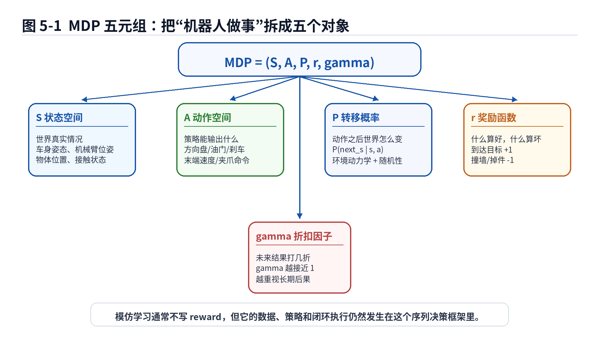
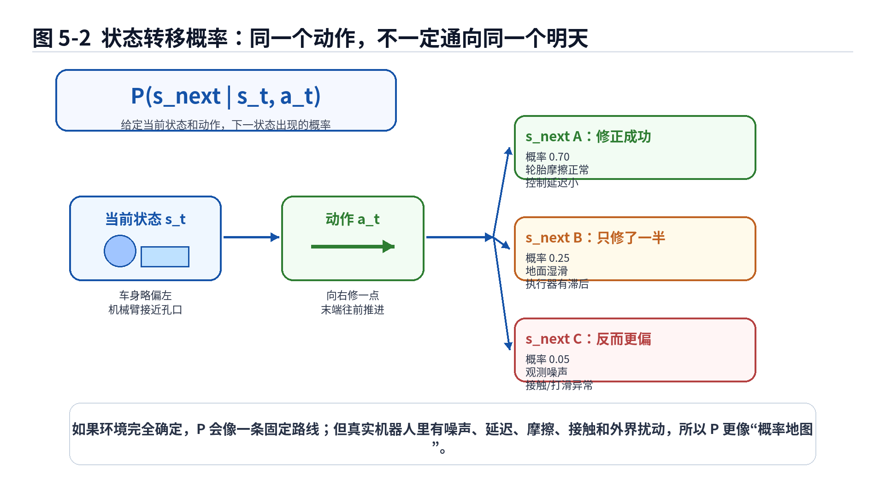
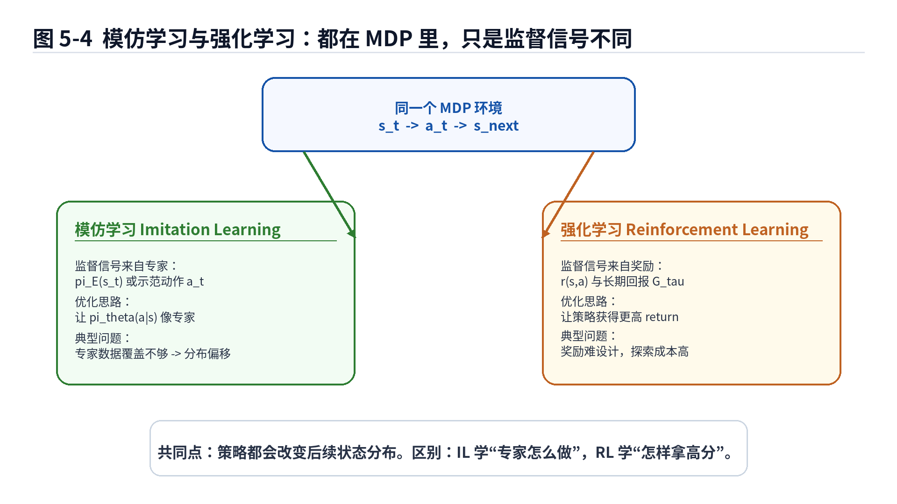
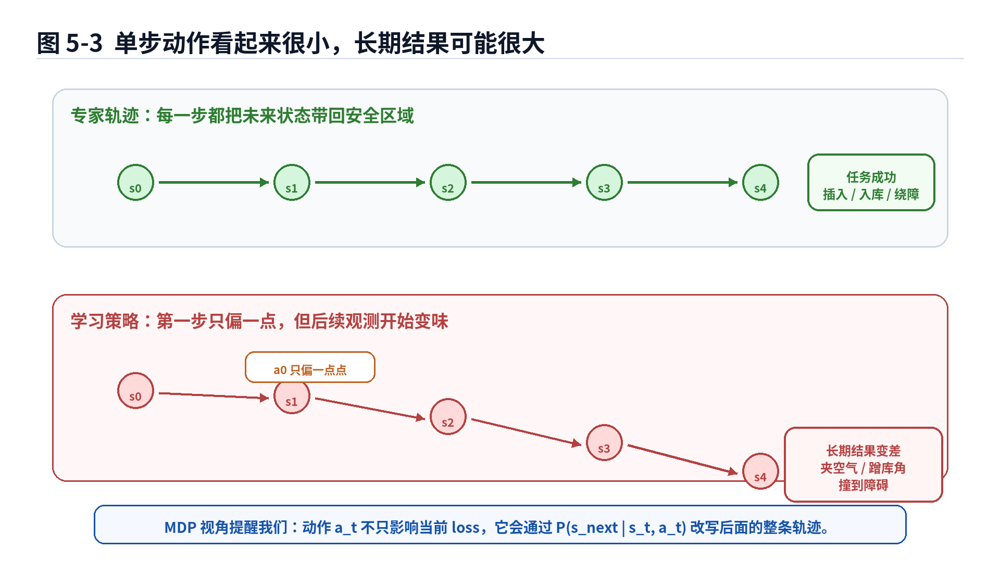

# 第5章：MDP：模仿学习虽然不要 reward，但也逃不出序列决策

> **新版布局位置**：本章属于 **第二篇：序列决策与轨迹分布基础**。本章编号、公式编号与交叉引用已按新版八篇结构统一调整。


> **本章一句话导读**：
> Behavior Cloning 和 DAgger 看起来都在学专家动作，好像只要把 “观测到动作”的映射拟合好就行。但机器人不是静态表格里的样本，它活在时间里。当前动作会改变下一刻状态，下一刻状态又会影响后续动作。这个“动作会改写未来”的框架，就是 MDP。

---

## 1. 本章开场：机器人不是在做选择题，而是在写连续剧

前几章我们一直在围绕一个问题打转：

> 给定专家示范数据，如何训练一个策略，让它在看到某个状态或观测时，输出像专家一样的动作？

第2章讲 Behavior Cloning 时，这个问题看起来很像监督学习。输入一张图，输出一个动作；输入一个状态，输出一个控制量。训练时算 loss，反向传播，更新参数。流程干净得像刚拖过地的实验室。

第3章马上泼了一盆现实冷水：训练时看到的是专家状态分布，执行时看到的是模型自己制造出来的状态分布。模型一步走偏，后面看到的画面就变了。

第4章的 DAgger 则像老师坐副驾：既然模型会去到自己制造的新状态，那就让专家在这些状态上继续标注。

但是这里还有一个更底层的问题没有正式说清楚：

> 为什么一个动作会影响后面的状态？
> 为什么一个单步预测错误会沿时间传播？
> 为什么模仿学习明明不需要显式设计 reward，却仍然必须理解序列决策？

答案是：机器人任务天然可以放在 **MDP（Markov Decision Process，马尔可夫决策过程）** 里理解。

这听起来像一个很学术的名字。不要被它吓到。MDP 本质上只是在说一件非常朴素的事：

> 系统现在处在某个状态；
> 策略选择一个动作；
> 环境根据这个动作进入下一个状态；
> 这个过程一遍一遍发生，最后形成一条轨迹。

如果用生活化一点的话说，MDP 就像连续剧：

- 当前剧情是状态；
- 主角做的选择是动作；
- 下一集怎么发展是状态转移；
- 编剧心中的“好结局/坏结局”是 reward；
- 是否重视长期铺垫，是 discount factor。

机器人不是在做一张独立选择题，而是在写一部会被自己前一步选择影响的连续剧。遗憾的是，它一旦写崩，编剧通常不会主动出来救场。

---

## 2. 本章要解决的核心问题

本章主要解决 7 个问题：

1. 什么是 MDP？为什么它是理解模仿学习和强化学习的共同地基？
2. MDP 五元组 <span class="math">\\((\mathcal{S}, \mathcal{A}, P, r, \gamma)\\)</span> 分别表示什么？
3. 状态转移概率 <span class="math">\\(P(s\_{t+1}\mid s\_t,a\_t)\\)</span> 到底在说什么？
4. 模仿学习为什么可以没有显式 reward，但不能没有序列决策视角？
5. return <span class="math">\\(G(\tau)=\sum\_t \gamma^t r(s\_t,a\_t)\\)</span> 为什么描述的是长期结果，而不是单步打分？
6. MDP 如何解释分布偏移、DAgger 和后续 GAIL / IRL / Offline RL？
7. 工程里把任务写成 MDP 时，最容易在哪些地方写得太理想？

---


### 主线定位与统一例子

为了让本章不变成孤立知识点，读本章时请始终把公式落回两个统一例子：

- **二维点机器人跟随专家轨迹**：状态可写成位置/速度，动作可写成二维控制量，适合观察状态分布、轨迹分布和误差累积。
- **机械臂末端运动/抓取轨迹模仿**：观测包含图像或本体状态，动作包含末端位姿增量或关节控制量，适合理解连续动作、多模态动作、动作块和实机闭环。

- **承接前文**：承接前面单步监督与分布偏移讨论。
- **本章推进**：把模仿学习放回 MDP，说明策略、环境转移和轨迹如何共同决定结果。
- **铺垫后文**：为第6章从单步 loss 升级到轨迹层目标做准备。
- **公式阅读抓手**：轨迹分布 p_pi(tau) 同时由初始状态、策略和环境转移决定。
- **建议同步回看**：附录 F。

## 3. 直觉解释：MDP 先别急着写公式

在写公式前，我们先用几个真实任务把 MDP 的直觉说清楚。

### 3.1 自动泊车：你不是在预测方向盘角，而是在改写车身姿态

假设车辆正在倒车入库。某一刻，车辆状态包括：

- 车身位置；
- 车身朝向；
- 与车位线、库角、障碍物的相对关系；
- 当前速度；
- 轮胎转角。

策略在这一刻输出一个动作，比如：

- 方向盘角；
- 加速度；
- 制动；
- 换挡或保持。

这个动作不会只影响当前这一帧的 loss。它会改变下一刻车身姿态。下一刻姿态又会决定模型看到什么画面，再决定下一次动作。于是，一个看起来很小的方向盘误差，可能在 5 秒后变成“车尾离库角只剩一点点距离”。

泊车里的很多失败不是某一帧突然失败，而是前面一串小错误合伙创业，最后做大做强。

### 3.2 机械臂插孔：动作和接触状态一起改变未来

机械臂插孔也是类似的。

当前状态可能包括：

- 末端执行器位姿；
- 插头和孔的相对位置；
- 是否已经接触；
- 接触力方向；
- 夹爪是否打滑。

当前动作可能是末端速度或位姿增量。动作如果稍微偏一点，就可能导致：

- 下一刻接触点变了；
- 摩擦力方向变了；
- 插头卡住；
- 力控进入保护模式。

所以，在插孔任务里，一个动作不是“孤立预测值”，而是会改变下一刻物理关系的干预。

这也是为什么很多机器人论文视频看起来很丝滑，真实工厂里却要面对夹具间隙、零件毛刺、工装变形和相机支架跳广场舞。MDP 里的 <span class="math">\\(P\\)</span> 在论文里可能很温柔，到了现场就会开始暴露自己的脾气。

### 3.3 移动机器人绕障：左绕和右绕都可能对，但后续状态完全不同

移动机器人遇到一个障碍物，可以左绕，也可以右绕。两种动作在当前时刻可能都“合理”。但是一旦选了左绕，后续状态就进入左侧路线；一旦选了右绕，后续状态就进入右侧路线。

这提醒我们：

> 一个动作不仅是当前答案，也是对未来状态分布的一次投票。

这句话非常重要。后面讲概率策略、多模态动作、CVAE、ACT 和 Diffusion Policy 时，我们会反复用到它。

---

## 4. 数学建模：MDP 五元组到底是什么？

MDP 通常写成一个五元组：

<div class="math">\[
\mathcal{M} = (\mathcal{S}, \mathcal{A}, P, r, \gamma) \tag{5.1}\]</div>

这条公式是本章的入口。它看起来像把五个符号硬塞进括号里，但其实每个符号都对应机器人任务里的一个基本对象。



**图5-1 说明**：

- <span class="math">\\(\mathcal{S}\\)</span> 表示状态空间，也就是环境可能处于哪些真实情况；
- <span class="math">\\(\mathcal{A}\\)</span> 表示动作空间，也就是策略能输出哪些控制命令；
- <span class="math">\\(P\\)</span> 表示状态转移规律，描述动作如何改变世界；
- <span class="math">\\(r\\)</span> 表示奖励函数，用来评价某个状态—动作是否好；
- <span class="math">\\(\gamma\\)</span> 表示折扣因子，用来控制未来奖励的重要程度；
- 模仿学习虽然不一定显式使用 reward，但它的策略执行仍然在这个五元组描述的世界里发生。

### 公式拆解：MDP 五元组

公式：

<div class="math">\[
\mathcal{M} = (\mathcal{S}, \mathcal{A}, P, r, \gamma) \tag{5.2}\]</div>

**它要解决的问题**：
把一个“机器人在环境中连续做决策”的任务，拆成几个可以讨论、建模和分析的数学对象。

**符号解释**：

- <span class="math">\\(\mathcal{M}\\)</span>：一个具体的 MDP，也就是一个序列决策任务；
- <span class="math">\\(\mathcal{S}\\)</span>：state space，状态空间，包含系统可能处于的所有状态；
- <span class="math">\\(\mathcal{A}\\)</span>：action space，动作空间，包含策略可以选择的所有动作；
- <span class="math">\\(P\\)</span>：transition probability，状态转移概率，描述 <span class="math">\\((s\_t,a\_t)\\)</span> 之后可能到达哪些 <span class="math">\\(s\_{t+1}\\)</span>；
- <span class="math">\\(r\\)</span>：reward function，奖励函数，描述某个状态—动作带来的即时好坏；
- <span class="math">\\(\gamma\\)</span>：discount factor，折扣因子，控制未来奖励在当前目标中的权重。

**直觉理解**：
MDP 就是在问：

```text
现在在哪里？       -> state
能做什么？         -> action
做完会去哪？       -> transition
这样做好不好？     -> reward
未来有多重要？     -> discount
```

把这几个问题合起来，就构成一个序列决策任务。

**机器人 / 自动驾驶案例**：
在自动泊车中：

- <span class="math">\\(\mathcal{S}\\)</span>：车身位姿、车速、障碍物、车位线、与库角距离等可能状态；
- <span class="math">\\(\mathcal{A}\\)</span>：方向盘角、加速度、制动、挡位等动作；
- <span class="math">\\(P\\)</span>：车辆动力学、轮胎地面摩擦、控制延迟、执行器响应；
- <span class="math">\\(r\\)</span>：是否靠近目标车位、是否碰撞、是否姿态合适；
- <span class="math">\\(\gamma\\)</span>：是否重视长期入库结果，而不是只看下一帧是否舒服。

在机械臂抓取中：

- <span class="math">\\(\mathcal{S}\\)</span>：物体位姿、机械臂关节状态、夹爪开合、接触状态；
- <span class="math">\\(\mathcal{A}\\)</span>：末端速度、关节速度、夹爪开合命令；
- <span class="math">\\(P\\)</span>：物体是否移动、夹爪是否打滑、接触后是否发生偏转；
- <span class="math">\\(r\\)</span>：是否抓稳、是否掉落、是否碰撞；
- <span class="math">\\(\gamma\\)</span>：是否愿意为了最终成功，接受当前一小步看起来不那么直接的动作。

**常见误解**：
不要把 MDP 理解成“只有强化学习才需要的东西”。强化学习通常显式优化 reward；模仿学习通常不直接设计 reward，但它的轨迹、状态分布、闭环执行和误差累积，仍然发生在 MDP 描述的序列决策系统里。

---

## 5. 状态空间 <span class="math">\\(\mathcal{S}\\)</span>：机器人真正处在什么情况里？

状态 <span class="math">\\(s\_t\\)</span> 是环境在第 <span class="math">\\(t\\)</span> 个时刻的真实情况。

这里要特别区分两个词：

- **状态 state**：世界真实是什么样；
- **观测 observation**：传感器或模型实际看到了什么。

在很多理论公式里，我们先写状态 <span class="math">\\(s\_t\\)</span>，因为它更干净。但真实机器人里，模型通常拿不到完整状态，只能拿到观测 <span class="math">\\(o\_t\\)</span>。

比如泊车任务：

- 真实状态包括车辆精确位姿、轮胎角、障碍物真实位置、地面摩擦、控制延迟；
- 模型观测可能只是环视图像、IPM 特征、检测结果、历史轨迹和部分车身信号。

再比如机械臂插孔：

- 真实状态包括孔位、插头姿态、接触点、摩擦力、微小形变；
- 模型观测可能只是相机图像、机器人本体状态和力传感器读数。

所以，理论里写 <span class="math">\\(s\_t\\)</span> 时，工程师心里要自动翻译一句：

> “我们希望模型掌握的是状态，但它真正拿到的往往只是有噪声、有遮挡、有延迟的观测。”

这也是为什么后面很多现代策略会使用历史窗口、多视角图像、Transformer、action chunk、diffusion 等结构：它们不是为了炫技，而是在努力从不完整观测中恢复出足够做决策的信息。

---

## 6. 动作空间 <span class="math">\\(\mathcal{A}\\)</span>：策略到底能控制什么？

动作 <span class="math">\\(a\_t\\)</span> 是策略在第 <span class="math">\\(t\\)</span> 个时刻输出的控制命令。

动作空间可以是离散的，也可以是连续的。

### 6.1 离散动作

例如移动机器人：

<div class="math">\[
\mathcal{A} = \{\text{前进}, \text{后退}, \text{左转}, \text{右转}, \text{停止}\} \tag{5.3}\]</div>

这类动作更像分类问题。策略可以输出每个动作的概率。

### 6.2 连续动作

机械臂和自动驾驶里更常见的是连续动作，例如：

<div class="math">\[
a_t = [v_x, v_y, v_z, \omega_x, \omega_y, \omega_z, g] \tag{5.4}\]</div>

这里可能表示：

- 末端线速度；
- 末端角速度；
- 夹爪开合命令。

自动驾驶中也可以写成：

<div class="math">\[
a_t = [\delta_t, \alpha_t, b_t] \tag{5.5}\]</div>

其中：

- <span class="math">\\(\delta\_t\\)</span>：方向盘或前轮转角；
- <span class="math">\\(\alpha\_t\\)</span>：油门或加速度；
- <span class="math">\\(b\_t\\)</span>：制动。

动作空间的选择非常工程化。你让策略输出关节力矩、关节速度、末端位姿增量，或者输出更高层的 waypoint，都会改变学习难度和安全边界。

一个很常见的误区是：

> “动作越底层，模型越智能。”

不一定。动作越底层，模型承担的控制责任越重，对数据量、闭环稳定性、延迟和安全保护的要求也越高。很多工程系统更愿意让策略输出中高层动作，再交给传统控制器、轨迹规划器或安全模块执行。模型不需要什么都亲自干，聪明的打工人也会用工具。

---

## 7. 状态转移概率 <span class="math">\\(P(s\_{t+1}\mid s\_t,a\_t)\\)</span>：动作如何改变世界

MDP 中最关键、也最容易被初学者忽略的对象，是状态转移概率：

<div class="math">\[
P(s_{t+1}\mid s_t,a_t) \tag{5.6}\]</div>

这个式子描述：

> 当系统处于状态 <span class="math">\\(s\_t\\)</span>，执行动作 <span class="math">\\(a\_t\\)</span> 后，下一刻进入状态 <span class="math">\\(s\_{t+1}\\)</span> 的概率。

它是 MDP 的“物理世界接口”。没有它，策略输出动作之后，世界怎么变就没法说清楚。



**图5-2 说明**：

- 左侧是当前状态 <span class="math">\\(s\_t\\)</span> 和动作 <span class="math">\\(a\_t\\)</span>；
- 右侧展示同一个动作之后可能出现的多个下一状态；
- 在确定环境里，下一状态可能几乎固定；
- 在真实机器人环境里，噪声、接触、摩擦、延迟和扰动会让下一状态呈现概率性；
- 因此 <span class="math">\\(P(s\_{t+1}\mid s\_t,a\_t)\\)</span> 更像一张概率地图，而不是一条死板路线。

### 公式拆解：状态转移概率

公式：

<div class="math">\[
P(s_{t+1}\mid s_t,a_t) \tag{5.7}\]</div>

**它要解决的问题**：
描述“当前状态 + 当前动作”会如何影响下一时刻状态。

**符号解释**：

- <span class="math">\\(P\\)</span>：概率分布或转移规律；
- <span class="math">\\(s\_t\\)</span>：第 <span class="math">\\(t\\)</span> 个时刻的状态；
- <span class="math">\\(a\_t\\)</span>：第 <span class="math">\\(t\\)</span> 个时刻执行的动作；
- <span class="math">\\(s\_{t+1}\\)</span>：下一时刻状态；
- <span class="math">\\(\mid\\)</span>：条件符号，读作“在……条件下”；
- <span class="math">\\(P(s\_{t+1}\mid s\_t,a\_t)\\)</span>：在已知 <span class="math">\\(s\_t\\)</span> 和 <span class="math">\\(a\_t\\)</span> 的条件下，下一状态为 <span class="math">\\(s\_{t+1}\\)</span> 的概率。

**直觉理解**：
它在说：

> “如果现在是这个局面，并且我做了这个动作，那么下一步世界可能变成什么样？”

如果环境非常确定，比如一个理想仿真器里的小车，给定状态和动作后，下一状态几乎固定。
如果环境有随机性，比如真实机械臂接触、物体打滑、传感器噪声、控制延迟，那么同一个动作可能导致不同结果。

**机器人 / 自动驾驶案例**：
在自动泊车里，同样的方向盘角和速度，在不同地面摩擦、不同控制延迟、不同轮胎状态下，下一刻车身位姿可能略有不同。
在机械臂抓取里，同样的夹爪闭合动作，可能抓稳，也可能把物体推走，还可能因为物体表面油污导致打滑。

**常见误解**：
不要以为 <span class="math">\\(P\\)</span> 一定要被显式写出来、精确估计出来，模仿学习才成立。很多深度模仿学习方法并不会显式建模 <span class="math">\\(P\\)</span>，但 <span class="math">\\(P\\)</span> 仍然在环境里真实存在。你不写它，它也会用闭环结果提醒你：“兄弟，我在。”

---

## 8. Markov 性：为什么只看当前状态就够？真的够吗？

MDP 里的 M 是 Markov。Markov 性的核心假设是：

<div class="math">\[
P(s_{t+1}\mid s_0,a_0,\dots,s_t,a_t)
=
P(s_{t+1}\mid s_t,a_t) \tag{5.8}\]</div>

这个式子看起来长，但它表达的意思很朴素：

> 如果当前状态 <span class="math">\\(s\_t\\)</span> 已经包含了预测未来所需要的全部信息，那么过去发生过什么，就不需要再单独拿出来考虑。

### 公式拆解：Markov 性

公式：

<div class="math">\[
P(s_{t+1}\mid s_0,a_0,\dots,s_t,a_t)
=
P(s_{t+1}\mid s_t,a_t) \tag{5.9}\]</div>

**它要解决的问题**：
让序列决策问题可以被简化。否则下一状态要依赖全部历史，公式和学习都会变得非常难处理。

**符号解释**：

- 左边表示：下一状态依赖从初始时刻到当前时刻的所有状态和动作历史；
- 右边表示：下一状态只依赖当前状态 <span class="math">\\(s\_t\\)</span> 和当前动作 <span class="math">\\(a\_t\\)</span>；
- 等号表示：如果 <span class="math">\\(s\_t\\)</span> 足够完整，那么历史信息已经被压缩进当前状态里。

**直觉理解**：
如果你知道一辆车当前的完整位置、速度、加速度、轮胎角、环境状态和控制器内部状态，那么预测下一刻车辆状态时，就不必把十秒前方向盘怎么打的全部展开。

**工程含义**：
真实机器人里，模型常常看不到完整状态，只看到观测 <span class="math">\\(o\_t\\)</span>。这时仅凭当前一帧可能不满足 Markov 性。例如：

- 单帧图像看不出物体速度；
- 单帧相机图像看不出夹爪是否刚刚打滑；
- 单帧泊车环视图不一定能反映控制延迟和历史轨迹；
- 单帧折衣服图像看不出布料内部张力状态。

所以工程里经常会引入历史观测：

<div class="math">\[
h_t = (o_{t-k}, a_{t-k}, \dots, o_t) \tag{5.10}\]</div>

把一个历史窗口 <span class="math">\\(h\_t\\)</span> 当成策略输入。它的目的不是为了让模型记忆力显得很强，而是为了弥补单帧观测的信息不足。

**常见误解**：
Markov 性不是在说“历史不重要”。它是在说：如果当前状态已经包含了历史造成的全部影响，那么历史可以不再显式出现。真实机器人里，当前观测通常不够完整，所以历史窗口、RNN、Transformer、状态估计器才会很重要。

---

## 9. 策略 <span class="math">\\(\pi\\)</span>：在 MDP 里，模仿学习真正学的还是策略

MDP 描述环境，策略描述智能体怎么行动。

在状态 <span class="math">\\(s\_t\\)</span> 下，策略可以输出动作：

<div class="math">\[
a_t \sim \pi_\theta(a_t\mid s_t) \tag{5.11}\]</div>

如果是确定性策略，也可以写成：

<div class="math">\[
a_t = f_\theta(s_t) \tag{5.12}\]</div>

第1章我们已经讲过策略，第2章讲 BC 时也一直在训练 <span class="math">\\(\pi\_\theta\\)</span>。现在把它放进 MDP，你会发现策略不只是“输入输出函数”，它还是状态分布的制造者。

原因是：

1. <span class="math">\\(\pi\_\theta\\)</span> 在 <span class="math">\\(s\_t\\)</span> 下选出动作 <span class="math">\\(a\_t\\)</span>；
2. 环境通过 <span class="math">\\(P(s\_{t+1}\mid s\_t,a\_t)\\)</span> 进入下一状态；
3. 下一状态又成为策略下一次输入；
4. 如此循环，形成整条轨迹。

这就是为什么第3章会出现 <span class="math">\\(d^{\pi\_\theta}(s)\\)</span>。状态分布不是天上掉下来的，而是策略和环境一起滚出来的。

---

## 10. 轨迹分布：一条轨迹是怎么被策略和环境共同生成的？

为了把“策略会改写未来”写得更清楚，我们可以引入轨迹分布。

一条轨迹写作：

<div class="math">\[
\tau = (s_0,a_0,s_1,a_1,\dots,s_T) \tag{5.13}\]</div>

如果初始状态分布是 <span class="math">\\(p(s\_0)\\)</span>，策略是 <span class="math">\\(\pi\\)</span>，环境转移是 <span class="math">\\(P\\)</span>，那么轨迹出现的概率可以写成：

<div class="math">\[
p_\pi(\tau)
=
p(s_0)
\prod_{t=0}^{T-1}
\pi(a_t\mid s_t)
P(s_{t+1}\mid s_t,a_t) \tag{5.14}\]</div>

这个公式会在后面很多地方反复出现。它是理解 rollout、trajectory loss、GAIL、Offline RL 和 Decision Transformer 的地基之一。

### 公式拆解：轨迹分布

公式：

<div class="math">\[
p_\pi(\tau)
=
p(s_0)
\prod_{t=0}^{T-1}
\pi(a_t\mid s_t)
P(s_{t+1}\mid s_t,a_t) \tag{5.15}\]</div>

**它要解决的问题**：
描述一整条轨迹 <span class="math">\\(\tau\\)</span> 是如何由初始状态、策略和环境转移共同产生的。

**符号解释**：

- <span class="math">\\(p\_\pi(\tau)\\)</span>：在策略 <span class="math">\\(\pi\\)</span> 下生成轨迹 <span class="math">\\(\tau\\)</span> 的概率；
- <span class="math">\\(p(s\_0)\\)</span>：初始状态分布，表示任务开始时可能处在哪些状态；
- <span class="math">\\(\prod\_{t=0}^{T-1}\\)</span>：从第 0 步到第 <span class="math">\\(T-1\\)</span> 步，把每一步概率连乘；
- <span class="math">\\(\pi(a\_t\mid s\_t)\\)</span>：策略在状态 <span class="math">\\(s\_t\\)</span> 下选择动作 <span class="math">\\(a\_t\\)</span> 的概率；
- <span class="math">\\(P(s\_{t+1}\mid s\_t,a\_t)\\)</span>：环境在当前状态和动作下转移到下一状态的概率；
- <span class="math">\\(T\\)</span>：轨迹长度。

**直觉理解**：
一条轨迹不是单靠策略生成的，也不是单靠环境生成的，而是两者合伙生成的：

```text
初始状态给开局；
策略负责每一步选择动作；
环境负责每个动作之后怎么变；
两者一来一回，就形成轨迹。
```

**机器人 / 自动驾驶案例**：
自动泊车里，初始状态 <span class="math">\\(p(s\_0)\\)</span> 可能是车辆在车位附近的不同起始位姿；策略 <span class="math">\\(\pi\\)</span> 输出方向盘和速度；环境转移 <span class="math">\\(P\\)</span> 由车辆运动学、地面、控制延迟和障碍物关系决定。最后得到的 <span class="math">\\(\tau\\)</span> 就是一整次泊车过程。

机械臂抓取里，初始状态可能是物体摆放不同；策略输出末端动作；环境转移包含物体运动、接触和夹爪闭合结果。最后轨迹可能通向成功抓取，也可能通向“夹爪认真地夹住了空气”。

**常见误解**：
不要把 <span class="math">\\(p\_\pi(\tau)\\)</span> 理解成“我们必须真的算出每条轨迹概率”。很多方法并不会显式计算它。但这个公式帮助我们理解：不同策略会诱导不同轨迹分布，而模仿学习的闭环表现取决于策略实际诱导出的轨迹分布。

---

## 11. Reward 与 return：模仿学习可以不写 reward，但 reward 解释了“长期好坏”

MDP 中有 reward 函数：

<div class="math">\[
r(s_t,a_t) \tag{5.16}\]</div>

它表示在状态 <span class="math">\\(s\_t\\)</span> 执行动作 <span class="math">\\(a\_t\\)</span> 得到的即时奖励。

比如：

- 机械臂成功抓住物体：奖励高；
- 机械臂碰撞桌面：奖励低；
- 泊车车身更接近目标位姿：奖励略高；
- 刮蹭障碍物：奖励很低；
- 移动机器人绕开障碍：奖励高；
- 原地转圈半小时：奖励可能低到让人开始怀疑人生。

但很多任务不是只看单步奖励，而是看整条轨迹的长期结果。于是我们定义 return。

为了避免和 MDP 五元组里的奖励函数 <span class="math">\\(r\\)</span> 混淆，本书正文中更推荐把一条轨迹的累计回报写成 <span class="math">\\(G(\tau)\\)</span>：

<div class="math">\[
G(\tau)
=
\sum_{t=0}^{T}
\gamma^t r(s_t,a_t) \tag{5.17}\]</div>

有些教材也会把它写作 <span class="math">\\(R(\tau)\\)</span>，意思是整条轨迹的 return。后续我们会根据上下文说明。

### 公式拆解：折扣累计回报

公式：

<div class="math">\[
G(\tau)
=
\sum_{t=0}^{T}
\gamma^t r(s_t,a_t) \tag{5.18}\]</div>

**它要解决的问题**：
把一条轨迹中每一步的即时奖励，合成一个整体分数，用来衡量这条轨迹长期上好不好。

**符号解释**：

- <span class="math">\\(G(\tau)\\)</span>：轨迹 <span class="math">\\(\tau\\)</span> 的累计回报；
- <span class="math">\\(\sum\_{t=0}^{T}\\)</span>：从第 0 步到第 <span class="math">\\(T\\)</span> 步，把每一步贡献加起来；
- <span class="math">\\(\gamma\\)</span>：折扣因子，通常在 <span class="math">\\([0,1]\\)</span> 之间；
- <span class="math">\\(\gamma^t\\)</span>：第 <span class="math">\\(t\\)</span> 步奖励的折扣权重；
- <span class="math">\\(r(s\_t,a\_t)\\)</span>：第 <span class="math">\\(t\\)</span> 步的即时奖励。

**直觉理解**：
这像给一整段任务过程打总分。每一步都有小分，最后加起来得到整条轨迹分数。<span class="math">\\(\gamma\\)</span> 控制未来奖励是否打折：

- <span class="math">\\(\gamma\\)</span> 小：更重视眼前；
- <span class="math">\\(\gamma\\)</span> 接近 1：更重视长期结果。

**机器人 / 自动驾驶案例**：
在泊车中，如果只看当前一帧“离目标近了一点”，可能会鼓励车辆用很危险的方式靠近；但如果看整条轨迹 return，就会同时考虑最终是否停正、是否安全、是否平顺、是否碰撞。

在机械臂插孔中，某一步动作可能让插头稍微远离孔口，但它可能是在调整角度，为后续顺利插入做准备。如果只看单步奖励，很容易误判；看整条 return 才更接近任务成功。

**常见误解**：
不要把 reward 理解成“每一步都必须人工写一个完美评分器”。真实机器人任务中，reward 往往很难设计，这也是为什么模仿学习有价值：它可以直接从专家行为中学习，而不是先手写一个让人头秃的奖励函数。

---

## 12. 强化学习目标：为什么 RL 喜欢最大化长期 return？

强化学习通常希望找到一个策略 <span class="math">\\(\pi\\)</span>，让它生成的轨迹长期回报尽可能高。可以写成：

<div class="math">\[
J(\pi)
=
\mathbb{E}_{\tau\sim p_\pi(\tau)}[G(\tau)] \tag{5.19}\]</div>

强化学习的目标是：

<div class="math">\[
\pi^* = \arg\max_\pi J(\pi) \tag{5.20}\]</div>

这两条公式不是本书此处要深入推导的重点，但它们非常重要，因为它们揭示了模仿学习和强化学习的共同地基。

### 公式拆解：RL 的长期目标

公式：

<div class="math">\[
J(\pi)
=
\mathbb{E}_{\tau\sim p_\pi(\tau)}[G(\tau)] \tag{5.21}\]</div>

**它要解决的问题**：
评价一个策略整体上好不好，不是看某一步动作像不像，而是看它在环境中 rollout 出来的轨迹平均 return 高不高。

**符号解释**：

- <span class="math">\\(J(\pi)\\)</span>：策略 <span class="math">\\(\pi\\)</span> 的性能目标；
- <span class="math">\\(\mathbb{E}[\cdot]\\)</span>：期望，可以理解为对很多可能轨迹取平均；
- <span class="math">\\(\tau\sim p\_\pi(\tau)\\)</span>：轨迹 <span class="math">\\(\tau\\)</span> 是由策略 <span class="math">\\(\pi\\)</span> 与环境交互生成的；
- <span class="math">\\(G(\tau)\\)</span>：这条轨迹的累计回报。

**直觉理解**：
一个策略不是跑一次成功就算强，也不是某一步动作漂亮就算强。它要在各种可能初始状态、噪声和扰动下，平均得到好的长期结果。

**机器人 / 自动驾驶案例**：
在移动机器人绕障中，某个策略偶尔能绕过去不代表稳定可靠；我们关心的是它在不同障碍布局、不同起点、不同噪声下的平均成功表现。

**常见误解**：
RL 不是“只要写了 reward 就能自动学会”。如果 reward 稀疏、探索成本高、安全风险大，RL 可能会在学会之前先把仿真环境撞成抽象艺术。真实机器人上更不能随便探索，这也是模仿学习经常作为起点的重要原因。

---

## 13. 模仿学习与强化学习：同一个 MDP，不同的监督信号

现在我们可以正式回答本章标题里的问题：

> 模仿学习虽然不要 reward，为什么也逃不出序列决策？

因为模仿学习和强化学习面对的是同一个底层问题：

- 环境有状态；
- 策略会选择动作；
- 动作会改变未来状态；
- 状态和动作滚成轨迹；
- 轨迹决定任务成败。

区别主要在监督信号。

强化学习问：

> 哪些动作能让长期 return 更高？

模仿学习问：

> 专家在这些状态下会怎么做？



**图5-4 说明**：

- 模仿学习和强化学习都运行在同一个 MDP 环境中；
- 模仿学习的监督信号来自专家动作或专家策略；
- 强化学习的监督信号来自 reward 和长期 return；
- 两者共同面对策略诱导状态分布、rollout、闭环执行和长期结果；
- 因此，模仿学习不能只当成普通监督学习来理解，它需要 MDP 视角。

从这个角度看，Behavior Cloning 的训练目标：

<div class="math">\[
\mathcal{L}_{\mathrm{BC}}(\theta)
=
-\mathbb{E}_{(s,a)\sim \mathcal{D}}
[\log \pi_\theta(a\mid s)] \tag{5.22}\]</div>

关注的是专家数据中的状态—动作对。

强化学习目标：

<div class="math">\[
J(\pi)
=
\mathbb{E}_{\tau\sim p_\pi(\tau)}[G(\tau)] \tag{5.23}\]</div>

关注的是策略自己生成的轨迹长期回报。

二者差异很清楚：

- BC 学专家动作；
- RL 优化长期奖励；
- DAgger 介于两者之间：仍然学专家动作，但开始让数据覆盖当前策略会访问到的状态；
- GAIL / IRL 会进一步把专家行为和 occupancy、reward、distribution matching 联系起来。

所以第5章是一个地基章。没有 MDP，后面的 GAIL、IRL、Offline RL、Decision Transformer 都会像空中楼阁，楼很漂亮，但你不知道它为什么站得住。

---

## 14. 单步动作与长期结果：为什么 MDP 视角能解释第3章的分布偏移？

第3章讲分布偏移时，我们说：

<div class="math">\[
d^{\pi_E}(s) \neq d^{\pi_\theta}(s) \tag{5.24}\]</div>

现在有了 MDP，我们可以把这个问题看得更深一点。

状态分布 <span class="math">\\(d^\pi(s)\\)</span> 是怎么来的？不是凭空来的，而是由以下两件事共同决定：

1. 策略 <span class="math">\\(\pi(a\mid s)\\)</span>：在每个状态下选择什么动作；
2. 环境转移 <span class="math">\\(P(s'\mid s,a)\\)</span>：动作之后状态怎么变。

如果策略从专家 <span class="math">\\(\pi\_E\\)</span> 换成学习策略 <span class="math">\\(\pi\_\theta\\)</span>，哪怕动作只差一点点，后续状态分布也可能慢慢不同。



**图5-3 说明**：

- 上方绿色轨迹表示专家每一步都把系统带回安全区域；
- 下方红色轨迹表示学习策略第一步只偏了一点，但通过状态转移逐渐进入不同状态区域；
- MDP 视角强调：动作不是静态标签，它会通过 <span class="math">\\(P(s\_{t+1}\mid s\_t,a\_t)\\)</span> 改写后续状态；
- 因此 open-loop 单步 loss 很低，不一定代表 closed-loop 长期结果可靠。

这也解释了为什么 DAgger 有效。DAgger 不是凭空魔法，它是在改变训练数据分布，使训练数据逐步覆盖 <span class="math">\\(\pi\_i\\)</span> 在 MDP 里真实 rollout 会访问到的状态。

换句话说：

> BC 只在专家轨迹上教学生；
> DAgger 让学生真的上路，然后老师在学生会跑偏的地方继续教；
> MDP 则解释了为什么“跑偏”会发生，以及为什么它会沿时间传播。

---

## 15. 算法流程：如何把一个机器人任务整理成 MDP 问题？

MDP 本身不是一个具体算法，而是一个建模框架。面对一个机器人任务，我们可以按下面流程整理。

### 15.1 建模步骤

1. **定义状态或观测**
   决定策略需要看到什么信息：图像、点云、关节角、速度、历史动作、力传感器、任务指令等。

2. **定义动作空间**
   决定策略输出什么：关节速度、末端位姿增量、夹爪命令、轨迹 waypoint、控制参考量等。

3. **理解状态转移**
   不一定要手写完整 <span class="math">\\(P\\)</span>，但要知道动作之后世界如何变化：动力学、接触、延迟、噪声、执行器约束。

4. **明确任务成功标准**
   即使模仿学习不直接使用 reward，也要知道什么算成功，什么算失败。

5. **选择训练信号**
   是用专家动作做 BC？用 DAgger 收集恢复样本？还是后续引入 reward、preference、offline RL？

6. **设计闭环评测**
   不能只看 open-loop loss，要看 rollout 成功率、安全指标、恢复能力、鲁棒性和失败模式。

### 15.2 Python 风格伪代码：MDP 中的 rollout

```python
# env follows an MDP-like interface
# state: s_t
# action: a_t
# transition: s_{t+1} = env.step(a_t)

s = env.reset()
trajectory = []

for t in range(max_steps):
    a = policy.act(s)               # a_t ~ pi_theta(a | s_t)
    next_s, reward, done, info = env.step(a)  # transition P(s_{t+1} | s_t, a_t)

    trajectory.append({
        "state": s,
        "action": a,
        "reward": reward,
        "next_state": next_s,
    })

    s = next_s
    if done:
        break
```

这段伪代码很普通，但它已经把 MDP 的核心对象都串起来了：

- `state` 对应 <span class="math">\\(s\_t\\)</span>；
- `action` 对应 <span class="math">\\(a\_t\\)</span>；
- `env.step(a)` 对应状态转移；
- `reward` 对应 <span class="math">\\(r(s\_t,a\_t)\\)</span>；
- `trajectory` 对应 <span class="math">\\(\tau\\)</span>。

### 15.3 Python 风格伪代码：模仿学习在 MDP 中训练

```python
# expert dataset collected from trajectories in an MDP
# D = [(s_t, a_t^expert), ...]

D = load_expert_dataset()
policy = PolicyNetwork()

for batch in dataloader(D):
    s, a_expert = batch
    action_dist = policy(s)                    # pi_theta(a | s)
    loss = negative_log_likelihood(action_dist, a_expert)
    loss.backward()
    optimizer.step()
```

这段代码看起来还是监督学习，但现在我们知道它背后的含义：这些样本来自 MDP 中专家轨迹。训练时只是在专家访问过的状态上拟合动作；执行时策略会通过环境转移生成自己的新轨迹。

这就是“看起来是监督学习，骨子里是序列决策”的原因。

---

## 16. 工程实践案例

### 16.1 案例一：机械臂插孔任务

机械臂插孔任务非常适合用 MDP 视角理解。

**状态 / 观测**：

- 相机图像；
- 末端位姿；
- 插头与孔的相对估计；
- 力传感器读数；
- 历史动作。

**动作**：

- 末端位姿增量；
- 末端速度；
- 姿态微调；
- 插入力控制参数。

**状态转移**：

- 如果对齐得好，插头会进入孔；
- 如果角度偏，可能卡住；
- 如果用力太大，可能触发保护；
- 如果工件有变形，下一状态会和理想模型不同。

**为什么模仿学习有用**：
人类操作员可以通过示教展示：接近、找正、轻微摆动、插入、修正等动作模式。BC 可以先学一个初始策略，ACT 或 Diffusion Policy 后续可以学更平滑、更长时间尺度的动作片段。

**为什么 MDP 视角重要**：
插孔不是每一步都“朝目标方向走”就行。有时需要先退一点、摆一点、绕一点，才能让后续接触状态变好。单步动作看起来不直接，但长期结果更好。

### 16.2 案例二：自动泊车

自动泊车同样是典型序列决策问题。

**状态 / 观测**：

- 环视图像；
- IPM 特征；
- 车位线和障碍物；
- 车身位姿；
- 速度和轮胎角；
- 历史轨迹。

**动作**：

- 方向盘角；
- 加速度；
- 制动；
- 挡位；
- 或更高层轨迹控制量。

**状态转移**：

- 车辆运动学；
- 控制延迟；
- 轮胎地面摩擦；
- 障碍物变化；
- 传感器误差。

**为什么 BC 容易出问题**：
专家数据大多来自正常泊车轨迹，模型执行时如果第一把方向略偏，后续进入的车身姿态可能在数据里很少出现。此时模型并不是“不会预测”，而是进入了训练时没学过的状态区域。

**为什么 DAgger 有启发**：
如果可以在仿真或 shadow mode 中收集模型失败状态，再由专家或规则控制器给出纠正动作，就能增强恢复能力。

### 16.3 案例三：双臂折衣服

双臂折衣服看起来是操作任务，其实对 MDP 更敏感。

衣服是柔性物体，状态包含：

- 布料形状；
- 褶皱；
- 张力；
- 接触点；
- 双臂相对位姿。

这些状态很多看不完整，也很难精确建模。单步动作稍微不同，后续布料形状可能完全变化。于是折衣服任务里，历史信息、多视角观测、动作块和生成式策略会特别重要。

这类任务提醒我们：MDP 理论很干净，但真实世界经常是部分可观测、接触复杂、状态维度高、转移规律难写。模型要在这种世界里打工，不能只靠几条漂亮公式。

---

## 17. 方法边界与工程风险

MDP 是强大的建模框架，但工程里使用它时要警惕几个风险。

### 17.1 风险一：状态写得太理想

理论里写 <span class="math">\\(s\_t\\)</span> 很轻松，工程里拿到完整 <span class="math">\\(s\_t\\)</span> 很困难。

例如机械臂抓取中，真实状态包含物体质心、摩擦系数、接触状态、夹爪是否打滑。但相机可能只能看到表面。你在论文里把状态写得完整，不代表系统真的观测得到。

### 17.2 风险二：动作空间选得太底层

如果策略直接输出关节力矩或低层控制量，学习空间很大，安全风险也大。很多工程系统会选择更高层、更受限的动作表示，例如末端位姿增量、轨迹 waypoint 或控制器参考值。

动作空间不是越自由越好。自由度太高，模型可能会用一种你不愿意在客户现场展示的方式表达创造力。

### 17.3 风险三：转移规律被忽略

很多模仿学习项目只盯着训练 loss，没有认真分析动作执行后的状态变化。例如：

- 控制延迟会让动作滞后；
- 相机帧率和控制频率不同步；
- 机械臂末端命令被控制器平滑；
- 车辆执行器存在死区；
- 接触任务中微小误差会被放大。

这些都属于 <span class="math">\\(P\\)</span> 的现实部分。如果忽略它们，模型在离线数据里很乖，实机上可能就开始表演行为艺术。

### 17.4 风险四：reward 难设计，不代表任务目标可以不定义

模仿学习不一定需要手写 reward，但工程项目必须定义成功标准。否则你无法评价策略，也无法分析失败。

至少要定义：

- 成功率；
- 安全边界；
- 任务完成时间；
- 碰撞率；
- 恢复能力；
- 人工接管率；
- 异常退出条件。

不写 reward 可以，不定义目标不行。前者是方法选择，后者是项目管理事故。

---

## 18. 常见误区

### 误区一：MDP 是强化学习专属概念，模仿学习不用管

不对。模仿学习可以不直接优化 reward，但策略执行仍然会经过状态、动作、状态转移和轨迹。分布偏移、误差累积、闭环评测都离不开 MDP 视角。

### 误区二：只要 BC loss 低，说明策略在 MDP 中表现好

不对。BC loss 低只说明模型在专家数据中的样本上预测得像。它不保证模型自己 rollout 时访问到的状态仍然在训练分布内。

### 误区三：Markov 性表示历史没有用

不对。Markov 性表示“如果当前状态足够完整，历史可以被压缩进当前状态”。真实机器人中观测往往不完整，所以历史非常有用。

### 误区四：reward 很难设计，所以不需要考虑任务目标

不对。reward 难设计是事实，但任务成功标准必须清楚。没有成功标准，你连模型是在进步还是在用更优雅的姿势失败都判断不了。

### 误区五：转移概率只是理论符号，工程中没意义

不对。控制延迟、执行器误差、物理接触、摩擦、打滑、传感器噪声，都是转移规律的一部分。你不显式建模它们，它们也会通过闭环失败找你聊天。

---

## 19. 本章小结

本章我们补上了模仿学习的序列决策地基。

核心概念回顾如下：

1. **MDP 五元组** <span class="math">\\((\mathcal{S},\mathcal{A},P,r,\gamma)\\)</span> 用来描述序列决策任务；
2. **状态空间** 描述系统可能处在的真实情况；
3. **动作空间** 描述策略能输出的控制命令；
4. **状态转移概率** <span class="math">\\(P(s\_{t+1}\mid s\_t,a\_t)\\)</span> 描述动作如何改变世界；
5. **Markov 性** 表示如果当前状态足够完整，未来只依赖当前状态和动作；
6. **轨迹分布** <span class="math">\\(p\_\pi(\tau)\\)</span> 表示策略和环境共同生成轨迹的概率；
7. **return** <span class="math">\\(G(\tau)\\)</span> 衡量整条轨迹的长期结果；
8. **模仿学习和强化学习共享 MDP 地基**，区别在于监督信号来自专家动作还是 reward。

本章最重要的一句话是：

> 模仿学习训练时看起来像监督学习，但执行时一定是序列决策。

理解这句话，后面再看 trajectory loss、概率策略、CVAE、ACT、Diffusion Policy、GAIL、Offline RL，就不会觉得它们是一堆突然冒出来的新名词，而会看到一条连续的技术主线：

> 如何让策略在 MDP 中生成更可靠、更接近专家、更能完成任务的轨迹。

---

## 20. 本章公式索引

| 公式 | 名称 | 作用 |
|---|---|---|
| <span class="math">\\(\mathcal{M}=(\mathcal{S},\mathcal{A},P,r,\gamma)\\)</span> | MDP 五元组 | 描述序列决策任务的基本对象 |
| <span class="math">\\(P(s\_{t+1}\mid s\_t,a\_t)\\)</span> | 状态转移概率 | 描述当前状态和动作如何影响下一状态 |
| <span class="math">\\(P(s\_{t+1}\mid s\_0,a\_0,\dots,s\_t,a\_t)=P(s\_{t+1}\mid s\_t,a\_t)\\)</span> | Markov 性 | 表示当前状态足够完整时，历史可被压缩进当前状态 |
| <span class="math">\\(a\_t\sim \pi\_\theta(a\_t\mid s\_t)\\)</span> | 概率策略 | 表示策略在当前状态下采样动作 |
| <span class="math">\\(a\_t=f\_\theta(s\_t)\\)</span> | 确定性策略 | 表示策略直接输出一个动作 |
| <span class="math">\\(\tau=(s\_0,a\_0,s\_1,a\_1,\dots,s\_T)\\)</span> | 轨迹 | 表示一次完整任务执行过程 |
| <span class="math">\\(p\_\pi(\tau)=p(s\_0)\prod\_{t=0}^{T-1}\pi(a\_t\mid s\_t)P(s\_{t+1}\mid s\_t,a\_t)\\)</span> | 轨迹分布 | 描述策略和环境如何共同生成轨迹 |
| <span class="math">\\(r(s\_t,a\_t)\\)</span> | 即时奖励 | 衡量某一步状态—动作的好坏 |
| <span class="math">\\(G(\tau)=\sum\_{t=0}^{T}\gamma^t r(s\_t,a\_t)\\)</span> | 折扣累计回报 | 衡量整条轨迹的长期结果 |
| <span class="math">\\(J(\pi)=\mathbb{E}\_{\tau\sim p\_\pi(\tau)}[G(\tau)]\\)</span> | RL 性能目标 | 衡量策略生成轨迹的平均长期回报 |
| <span class="math">\\(d^{\pi\_E}(s)\neq d^{\pi\_\theta}(s)\\)</span> | 专家与学习策略状态分布差异 | 解释分布偏移的 MDP 根源 |

---

## 21. 建议阅读的附录条目

建议配合阅读以下附录：

1. **附录 A：数学符号与公式阅读方法**
   用来复习 <span class="math">\\(\arg\max\\)</span>、<span class="math">\\(\mathbb{E}\\)</span>、<span class="math">\\(\prod\\)</span>、条件符号 <span class="math">\\(\mid\\)</span> 等基础符号。

2. **附录 B：条件概率、分布与期望**
   用来理解 <span class="math">\\(P(s\_{t+1}\mid s\_t,a\_t)\\)</span>、<span class="math">\\(\tau\sim p\_\pi(\tau)\\)</span>、<span class="math">\\(\mathbb{E}[\cdot]\\)</span> 的概率含义。

3. **附录 F：强化学习与序列决策基础**
   重点阅读 MDP、rollout、trajectory distribution、policy-induced distribution、return 与 discount factor。

4. **附录 E：优化基础**
   如果想进一步理解 <span class="math">\\(\arg\max\_\pi J(\pi)\\)</span> 与后续策略优化目标，可以提前阅读。

---

## 22. 思考题

1. 在一个机械臂抓取任务中，分别写出你认为的 <span class="math">\\(\mathcal{S}\\)</span>、<span class="math">\\(\mathcal{A}\\)</span>、<span class="math">\\(P\\)</span>、<span class="math">\\(r\\)</span>、<span class="math">\\(\gamma\\)</span>。哪些状态是真实存在但难以观测的？
2. 自动泊车任务中，如果策略输出方向盘角和速度，<span class="math">\\(P(s\_{t+1}\mid s\_t,a\_t)\\)</span> 可能受到哪些工程因素影响？至少列出 5 个。
3. 为什么说 Behavior Cloning 的训练目标只约束专家数据上的动作相似，而不直接约束策略 rollout 后的长期 return？
4. 请用 MDP 视角解释 DAgger 为什么要收集 <span class="math">\\(s\sim d^{\pi\_i}\\)</span> 上的专家标注，而不是继续收集更多完美专家轨迹。
5. 如果一个任务的 reward 很难设计，是否意味着不需要定义任务成功标准？为什么？
6. 单帧图像作为策略输入时，哪些任务可能不满足 Markov 性？你会如何通过历史窗口或状态估计缓解？
7. 试比较机械臂插孔和移动机器人绕障：二者的状态转移 <span class="math">\\(P\\)</span> 哪些部分更确定，哪些部分更随机？

---

## 23. 本章配图清单

本章新增 4 张概念讲解图：

1. **图5-1 MDP 五元组结构图**：解释 <span class="math">\\((\mathcal{S},\mathcal{A},P,r,\gamma)\\)</span> 分别对应什么；
2. **图5-2 状态转移概率不是一条死路**：解释 <span class="math">\\(P(s\_{t+1}\mid s\_t,a\_t)\\)</span> 的概率含义；
3. **图5-3 单步动作和长期结果的区别**：解释动作如何通过状态转移影响整条轨迹；
4. **图5-4 模仿学习与强化学习的关系**：说明二者共享 MDP 地基，但监督信号不同。
