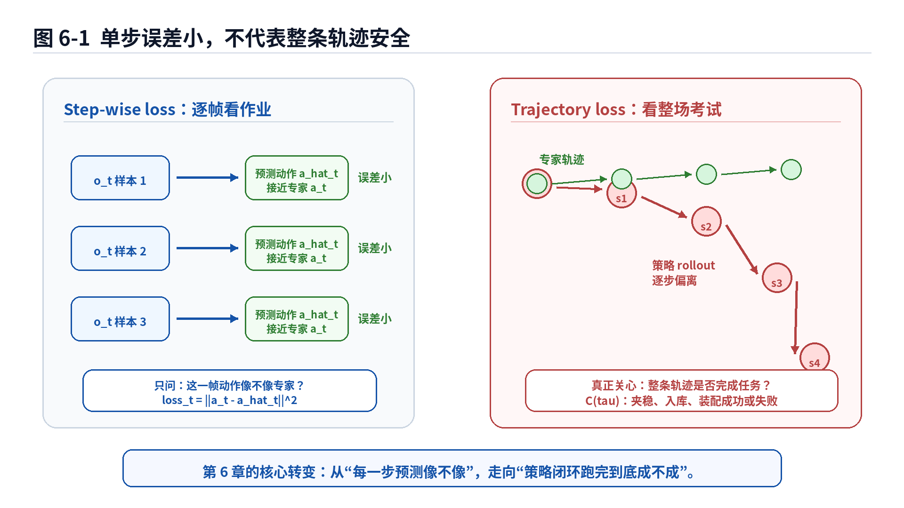
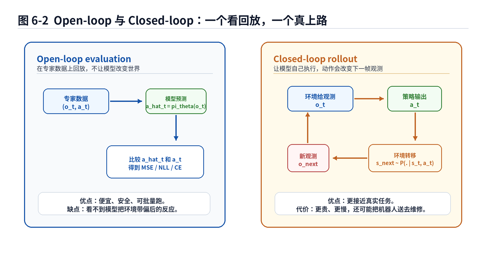
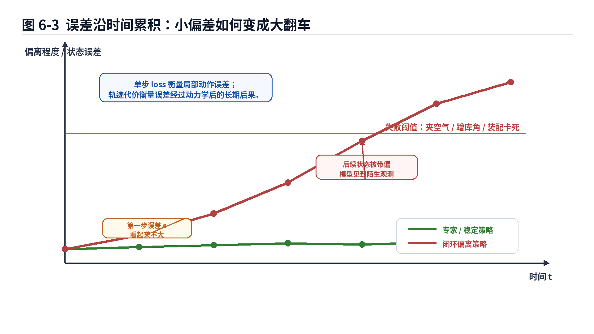
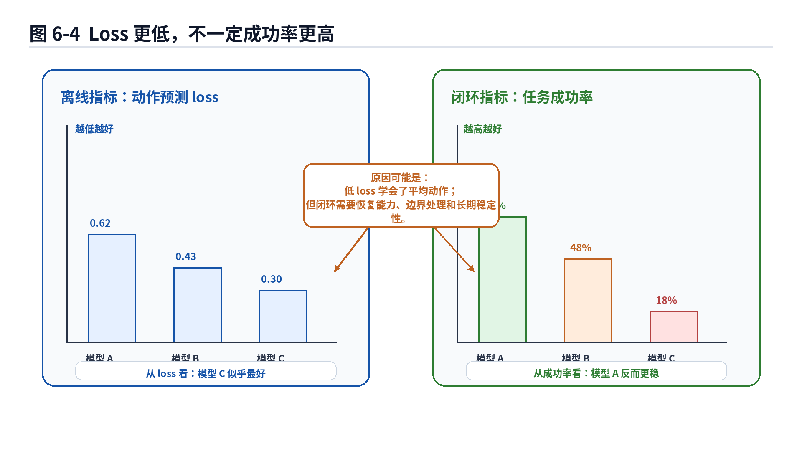

# 第6章：从单步损失到轨迹损失：别只盯着眼前那一小步

> **新版布局位置**：本章属于 **第二篇：序列决策与轨迹分布基础**。本章编号、公式编号与交叉引用已按新版八篇结构统一调整。


> **本章一句话导读**：  
> 单步动作预测像不像专家，只能说明模型在“逐帧批改作业”里表现不错；但机器人真正面对的是一整条闭环轨迹。一个动作误差也许很小，经过状态转移、观测变化和后续动作放大之后，最后可能变成夹空气、蹭库角、插孔卡死。本章要把评价尺度从 step-level loss 推到 trajectory-level objective。

---

## 1. 本章开场：考试不是只看第一道选择题

前面几章，我们已经经历了一条非常典型的模仿学习成长路线。

第2章讲 Behavior Cloning 时，我们把模仿学习写成监督学习：给定观测或状态，预测专家动作。损失函数可以是 MSE，也可以是负对数似然。这个视角很朴素，也很适合入门。

第3章说，事情没有这么老实。模型训练时面对的是专家走过的状态，执行时面对的是自己走出来的状态。训练集像驾校考场，闭环执行像早高峰路口，二者之间差着一个不写文档的真实世界。

第4章的 DAgger 给出一种思路：既然模型会去到自己的状态分布里，那就让专家在这些状态上继续标注。

第5章补上了 MDP 视角：机器人不是在做独立样本预测，而是在序列决策系统里行动。动作会改变状态，状态会影响后续动作，最后形成轨迹。

现在轮到本章回答一个更直接的问题：

> 如果机器人真正执行的是一条轨迹，为什么我们训练和评价时还经常只看单步 loss？

这就像评价一个司机，只看他某一帧方向盘角和老司机差多少，却不看他 20 秒后有没有把车倒进车位。方向盘角误差可能只有几度，但车尾可能已经开始和库角进行亲密社交。

再比如机械臂抓取。每一帧末端速度都和专家很接近，open-loop MSE 很漂亮。结果闭环执行时，夹爪最后距离物体差 2 厘米，优雅地夹住了空气。空气当然很配合，但客户通常不为“夹空气成功率”买单。

所以，本章的核心是：

> 单步动作损失是局部指标；轨迹损失和任务成功率才更接近机器人真正要完成的事情。

---

## 2. 本章要解决的核心问题

本章主要解决 8 个问题：

1. 什么是 step-wise loss？它为什么在 Behavior Cloning 中很自然？
2. 单步 loss 为什么不能完全代表任务成功？
3. 什么是 trajectory loss 或 trajectory cost？
4. 轨迹分布 $p_\pi(\tau)$ 为什么一定要带上策略 $\pi$？
5. 期望轨迹代价

$$
J(\pi)=\mathbb E_{\tau\sim p_\pi(\tau)}[C(\tau)] \tag{6.1}$$

到底在评价什么？
6. open-loop evaluation 和 closed-loop evaluation 的区别是什么？
7. 为什么 loss 和 success rate 经常不一致？
8. 工程里如何把 step-level 指标、trajectory-level 指标和安全指标组合起来？

本章不是要否定单步损失。单步损失仍然重要，它便宜、稳定、容易批量计算，是训练初始策略的好工具。问题在于：

> 不能把单步 loss 当成机器人能力的最终体检报告。

它更像体检中的一项血常规。指标很好当然值得高兴，但不能据此宣布自己已经可以参加铁人三项。

---


### 主线定位与统一例子

为了让本章不变成孤立知识点，读本章时请始终把公式落回两个统一例子：

- **二维点机器人跟随专家轨迹**：状态可写成位置/速度，动作可写成二维控制量，适合观察状态分布、轨迹分布和误差累积。
- **机械臂末端运动/抓取轨迹模仿**：观测包含图像或本体状态，动作包含末端位姿增量或关节控制量，适合理解连续动作、多模态动作、动作块和实机闭环。

- **承接前文**：承接第5章的轨迹分布。
- **本章推进**：说明 open-loop 单步损失与 closed-loop 轨迹代价为什么不是一回事。
- **铺垫后文**：为第7章讨论确定性/概率策略，以及为什么动作分布表达很重要做准备。
- **公式阅读抓手**：凡是期望写成 E_{tau~p_pi}，都意味着策略要为自己诱导出来的轨迹负责。
- **建议同步回看**：附录 B、F、H。

## 3. 直觉解释：先不写公式，先看“局部正确”和“全局成功”的区别

### 3.1 单步正确：这一帧动作像专家

在 Behavior Cloning 里，我们常见的数据形式是：

$$
\mathcal D=\{(o_t,a_t)\}_{t=1}^{N} \tag{6.2}$$

其中 $o_t$ 是第 $t$ 个时刻的观测，$a_t$ 是专家在这个观测下采取的动作。模型输出预测动作：

$$
\hat a_t=\pi_\theta(o_t) \tag{6.3}$$

如果动作是连续量，我们可以计算 MSE：

$$
\ell_t(\theta)=\|a_t-\hat a_t\|^2 \tag{6.4}$$

这个指标问的是：

> 在专家数据里的这一帧，模型预测的动作和专家动作差多少？

这是一个非常合理的问题。它让模型学会“在专家见过的状态上，尽量像专家一样做”。

但它没有问另一个更残酷的问题：

> 如果模型自己执行这个动作，下一帧还会不会处在专家熟悉的状态里？

这就是单步损失的边界。

### 3.2 轨迹成功：整件事最后成没成

真实机器人任务通常不是“一步就结束”。抓取、插孔、泊车、绕障、折衣服、开抽屉，都需要连续动作。

一条轨迹可以写成：

$$
\tau=(s_0,a_0,s_1,a_1,\dots,s_T) \tag{6.5}$$

现在我们关心的不只是某个 $a_t$ 是否接近专家，而是整条轨迹的结果：

- 抓取是否抓稳；
- 物体是否放入目标区域；
- 车辆是否入库且没有碰撞；
- 插头是否插入孔中；
- 任务是否在规定时间内完成；
- 中间是否触发安全保护；
- 是否需要人工接管。

这些指标不是单帧动作误差能完整表达的。它们更像轨迹层面的结果。

### 3.3 为什么局部动作像专家，整体仍然会失败？

原因至少有四类。

第一，**误差会改变后续观测**。模型第一步只偏一点，下一步看到的画面就可能变了。后面每一步都在新画面上继续决策，于是偏差开始滚雪球。

第二，**同一个单步动作误差在不同状态下后果不同**。机械臂远离物体时，末端偏 2 毫米可能没事；插孔接触瞬间偏 2 毫米，可能直接卡住。泊车远距离时方向盘差一点影响有限，临近库角时差一点可能变成刮蹭。

第三，**任务成功常常由关键时刻决定**。一个策略前 90% 的动作都很像专家，最后 10% 没处理好接触、对齐或收尾，任务仍然失败。工程里经常见到这种策略：前半段像熟练工，最后一步像临时工第一次上岗。

第四，**低 loss 可能学到平均动作**。当一个状态下存在多个合理动作时，用 MSE 追求平均值，可能得到一个谁都不想要的中间动作。这个问题第7章会重点展开，本章先把它放在评价尺度里理解。



**图6-1 说明**：

- 左侧表示 step-wise loss：在专家数据上逐帧比较预测动作和专家动作；
- 右侧表示 trajectory loss：让策略闭环执行，看整条轨迹是否完成任务；
- 单步误差衡量的是局部动作相似性，轨迹误差衡量的是动作经过环境转移后的长期后果；
- 这张图不是说单步 loss 没用，而是提醒它不是最终任务指标。

---

## 4. 数学建模：从单步样本到整条轨迹

现在我们正式把问题写成数学形式。

### 4.1 单步损失：把每个时间步当成一个样本

单步损失通常写成：

$$
\mathcal L_{\mathrm{step}}(\theta)
=
\mathbb E_{(o,a)\sim\mathcal D}
[
\ell(\pi_\theta(o),a)
] \tag{6.6}$$

这个式子很像第2章的 Behavior Cloning 目标。它表示：从专家数据集 $\mathcal D$ 里抽取观测—动作对 $(o,a)$，让策略输出 $\pi_\theta(o)$ 尽量接近专家动作 $a$。

如果是连续动作，$\ell$ 可以是 MSE：

$$
\ell(\pi_\theta(o),a)
=
\|\pi_\theta(o)-a\|^2 \tag{6.7}$$

如果是离散动作，$\ell$ 可以是交叉熵或负对数似然：

$$
\ell(\pi_\theta(o),a)
=
-
\log \pi_\theta(a\mid o) \tag{6.8}$$

这些损失的共同特点是：

> 它们都在专家数据分布上逐样本计算。

它们不需要让模型真的控制机器人，也不需要模拟环境转移。这是优点，也是盲区。

### 公式拆解：单步监督损失

公式：

$$
\mathcal L_{\mathrm{step}}(\theta)
=
\mathbb E_{(o,a)\sim\mathcal D}
[
\ell(\pi_\theta(o),a)
] \tag{6.9}$$

**它要解决的问题**：  
衡量模型在专家数据集中的每个观测—动作样本上，动作预测是否接近专家。

**符号解释**：

- $\mathcal L_{\mathrm{step}}(\theta)$：单步监督损失，参数为 $\theta$ 的策略需要最小化它；
- $\theta$：模型参数；
- $(o,a)\sim\mathcal D$：从专家数据集 $\mathcal D$ 中抽取一个观测—动作样本；
- $o$：观测，可以是图像、状态估计、历史窗口或传感器特征；
- $a$：专家动作；
- $\pi_\theta(o)$：模型看到观测 $o$ 后输出的动作；
- $\ell(\pi_\theta(o),a)$：单个样本上的误差，例如 MSE 或负对数似然；
- $\mathbb E$：对数据集中样本求平均，附录 B 会详细解释期望的含义。

**直觉理解**：  
这个公式就像老师批改作业：每道题单独看，模型答案和标准答案越接近，分数越高。

**机器人 / 自动驾驶案例**：  
在自动泊车中，$o$ 可以是环视图像和车身信号，$a$ 可以是专家方向盘角。单步损失衡量模型在每一帧预测的方向盘角是否像专家。

在机械臂抓取中，$o$ 可以是多视角图像和机械臂关节状态，$a$ 可以是末端位姿增量。单步损失衡量模型输出的末端动作是否接近人类遥操作数据。

**常见误解**：  
不要把 $\mathcal L_{\mathrm{step}}$ 理解成“任务失败风险”。它只是专家数据上的动作相似性指标。模型在这个指标上很好，仍然可能在闭环 rollout 中失败。

### 4.2 轨迹分布：策略不是预测一帧，而是在生成一条路

第5章已经介绍过轨迹分布。这里我们重新使用它，因为 trajectory loss 离不开这个概念。

在 MDP 中，一条轨迹为：

$$
\tau=(s_0,a_0,s_1,a_1,\dots,s_T) \tag{6.10}$$

当策略 $\pi$ 与环境交互时，轨迹不是固定的，而是由初始状态、策略动作和环境转移共同生成。轨迹分布可以写成：

$$
p_\pi(\tau)
=
p(s_0)
\prod_{t=0}^{T-1}
\pi(a_t\mid s_t)
P(s_{t+1}\mid s_t,a_t) \tag{6.11}$$

这条公式在第5章出现过。本章我们强调它的评价含义：

> 你评价一个策略时，不能只评价专家数据里的样本；你还要评价它自己会生成哪些轨迹。

如果策略不同，$p_\pi(\tau)$ 就会不同。专家策略 $\pi_E$ 生成的轨迹分布可能集中在成功区域，学习策略 $\pi_\theta$ 生成的轨迹分布可能一开始接近专家，后来逐渐漂移到失败区域。

### 公式拆解：策略诱导的轨迹分布

公式：

$$
p_\pi(\tau)
=
p(s_0)
\prod_{t=0}^{T-1}
\pi(a_t\mid s_t)
P(s_{t+1}\mid s_t,a_t) \tag{6.12}$$

**它要解决的问题**：  
描述某个策略 $\pi$ 在环境中闭环执行时，会以多大概率生成某条轨迹 $\tau$。

**符号解释**：

- $p_\pi(\tau)$：策略 $\pi$ 诱导的轨迹分布；
- $\tau$：一条完整轨迹；
- $p(s_0)$：初始状态分布，例如机器人起始位姿或车辆起始姿态的分布；
- $\prod_{t=0}^{T-1}$：把每个时间步的概率因子连乘起来；
- $\pi(a_t\mid s_t)$：策略在状态 $s_t$ 下选择动作 $a_t$ 的概率；
- $P(s_{t+1}\mid s_t,a_t)$：环境在当前状态和动作下转移到下一状态的概率；
- $T$：轨迹长度。

**直觉理解**：  
一条轨迹能不能出现，取决于三件事：任务从哪里开始、策略每一步怎么选、环境每一步怎么变。三者合起来，才决定机器人最后会走到哪条路上。

**机器人 / 自动驾驶案例**：  
泊车策略如果第一把方向偏大，就会把车辆带到一个新的车身姿态，后续环视图像和距离关系都会变化。于是 $\pi_\theta$ 生成的轨迹分布，可能逐渐偏离专家轨迹分布。

机械臂插孔中，策略动作会影响接触状态。接触状态一旦变化，后续的观测和力反馈也变化。轨迹分布就不只是动作序列，而是动作和物理接触共同演化的结果。

**常见误解**：  
不要把 $p_\pi(\tau)$ 看成数据集中已有轨迹的频率统计。它描述的是策略真正执行时可能生成的轨迹分布。训练数据是过去，rollout 是现在，二者可能长得像，也可能只是远房亲戚。

### 4.3 轨迹代价：给整条轨迹打分

有了轨迹 $\tau$，我们可以定义一个轨迹代价 $C(\tau)$。

$$
C(\tau)
:
\text{trajectory}
\rightarrow
\mathbb R \tag{6.13}$$

它把一条完整轨迹映射成一个实数。这个实数越大，通常表示代价越高；也可以反过来定义为 reward 或 score。本书为了和“损失”概念保持一致，优先用 cost 的说法。

例如机械臂抓取中，可以定义：

$$
C(\tau)
=
\lambda_1\,\mathbf 1[\text{grasp failed}]
+
\lambda_2\,\text{collision}(\tau)
+
\lambda_3\,\text{time}(\tau)
+
\lambda_4\,\text{final error}(\tau) \tag{6.14}$$

这个式子看起来比单步 MSE 更工程化，因为它直接把任务失败、碰撞、耗时和最终误差放到一起。

泊车任务也类似：

$$
C(\tau)
=
\lambda_1\,\mathbf 1[\text{collision}]
+
\lambda_2\,\mathbf 1[\text{parking failed}]
+
\lambda_3\,d_{\mathrm{final}}
+
\lambda_4\,\psi_{\mathrm{final}}
+
\lambda_5\,T \tag{6.15}$$

其中 $d_{\mathrm{final}}$ 可以表示最终位置误差，$\psi_{\mathrm{final}}$ 可以表示最终角度误差，$T$ 表示任务耗时。

这类轨迹代价没有单步 loss 那么优雅，但它更接近工程真实目标。真实客户不会问“你的第 142 帧 MSE 是多少”，他们更关心“有没有撞、有没有成、有没有超时、有没有吓人”。

### 公式拆解：轨迹代价函数

公式：

$$
C(\tau)
=
\lambda_1\,\mathbf 1[\text{failure}]
+
\lambda_2\,\text{safety\_cost}(\tau)
+
\lambda_3\,\text{final\_error}(\tau)
+
\lambda_4\,\text{time}(\tau) \tag{6.16}$$

**它要解决的问题**：  
把整条轨迹的任务表现转换成一个可以比较的数值。

**符号解释**：

- $C(\tau)$：轨迹 $\tau$ 的代价；
- $\mathbf 1[\text{failure}]$：指示函数，如果任务失败则为 1，否则为 0；
- $\text{safety\_cost}(\tau)$：安全代价，例如碰撞、越界、超力、接管；
- $\text{final\_error}(\tau)$：最终误差，例如末端位姿误差、停车位姿误差、物体摆放误差；
- $\text{time}(\tau)$：完成任务所需时间或步数；
- $\lambda_1,\lambda_2,\lambda_3,\lambda_4$：权重，用来平衡不同代价项的重要性。

**直觉理解**：  
轨迹代价像工程验收表：任务失败要扣分，碰撞要扣分，最后位置偏差要扣分，动作太慢也要扣分。它不是问“每一步像不像专家”，而是问“整件事交付得怎么样”。

**机器人 / 自动驾驶案例**：  
在抓取任务中，轨迹代价可以把抓取失败、碰撞、抓取时间、物体最终偏差放在一起。在泊车任务中，轨迹代价可以把碰撞、压线、最终居中误差、车身角度误差和泊车时间放在一起。

**常见误解**：  
轨迹代价不是天然唯一的。不同项目会定义不同的 $C(\tau)$。这不是数学不严谨，而是任务目标本身需要工程定义。关键是：定义必须清楚，不能一边不定义目标，一边要求模型“智能一点”。

---

## 5. 核心公式拆解：期望轨迹代价 $J(\pi)$

现在来到本章最重要的公式。

如果一个策略 $\pi$ 在环境中会生成不同轨迹，而每条轨迹都有代价 $C(\tau)$，那么我们可以定义策略的期望轨迹代价：

$$
J(\pi)
=
\mathbb E_{\tau\sim p_\pi(\tau)}
[
C(\tau)
] \tag{6.17}$$

这就是本章的核心评价目标。

### 公式拆解：期望轨迹代价

公式：

$$
J(\pi)
=
\mathbb E_{\tau\sim p_\pi(\tau)}
[
C(\tau)
] \tag{6.18}$$

**它要解决的问题**：  
评价一个策略在真实闭环执行中，平均会产生多高的轨迹代价。

**符号解释**：

- $J(\pi)$：策略 $\pi$ 的期望轨迹代价；
- $\pi$：被评价的策略，可以是专家策略，也可以是学习策略；
- $\tau$：一条完整轨迹；
- $\tau\sim p_\pi(\tau)$：轨迹不是固定给定的，而是由策略 $\pi$ 与环境交互生成；
- $p_\pi(\tau)$：策略诱导的轨迹分布；
- $C(\tau)$：整条轨迹的代价；
- $\mathbb E[\cdot]$：对策略可能生成的所有轨迹求平均。

**直觉理解**：  
如果让同一个策略跑很多次任务，每次起点、噪声、接触状态、观测误差可能略有不同。每次都会得到一个轨迹代价 $C(\tau)$。$J(\pi)$ 就是这些代价的平均水平。

**机器人 / 自动驾驶案例**：  
在泊车中，让策略从不同起始姿态、不同车位、不同障碍物位置开始 rollout。每次记录是否成功、是否碰撞、最终位姿误差和耗时。把这些轨迹代价平均，就得到 $J(\pi)$ 的估计。

在机械臂抓取中，让策略面对不同物体位置、不同轻微遮挡、不同抓取起点。每次记录抓取是否成功、是否碰撞、是否掉落、耗时和最终摆放误差。平均之后就是策略级别的评价。

**常见误解**：  
不要把 $J(\pi)$ 和训练 loss 混为一谈。$\mathcal L_{\mathrm{step}}$ 在数据集样本上计算；$J(\pi)$ 在策略自己生成的轨迹上计算。一个看回放，一个真上路。

### 5.1 为什么期望里必须写 $\tau\sim p_\pi(\tau)$？

这一点非常关键。

如果我们只写：

$$
\mathbb E_{\tau\sim \mathcal D}[C(\tau)] \tag{6.19}$$

那评价的是专家数据集中已有轨迹的代价。这对分析数据质量很有用，但不能直接说明学习策略执行时会怎样。

学习策略真正执行时，轨迹来自 $p_{\pi_\theta}(\tau)$：

$$
J(\pi_\theta)
=
\mathbb E_{\tau\sim p_{\pi_\theta}(\tau)}[C(\tau)] \tag{6.20}$$

这句话背后的工程含义是：

> 策略好不好，要看它自己闭环跑出来的轨迹，而不只是看专家轨迹上它答题答得多像。

第3章的分布偏移可以在这里重新理解：

$$
p_{\pi_E}(\tau)
\neq
p_{\pi_\theta}(\tau) \tag{6.21}$$

专家轨迹分布和学习策略轨迹分布不一样，单步训练 loss 就可能低估闭环风险。

### 5.2 从优化角度看：我们真正想最小化什么？

理想情况下，我们希望找到：

$$
\pi^*
=
\arg\min_\pi J(\pi)
=
\arg\min_\pi
\mathbb E_{\tau\sim p_\pi(\tau)}[C(\tau)] \tag{6.22}$$

这表示：在所有候选策略中，找到期望轨迹代价最低的策略。

但是直接优化这个目标很难，原因包括：

1. 真实环境不能无限试错；
2. $C(\tau)$ 可能是稀疏的，比如只有成功或失败；
3. 轨迹代价可能不可导；
4. 真实机器人 rollout 成本高，还有安全风险；
5. 环境转移 $P(s_{t+1}\mid s_t,a_t)$ 通常未知且复杂。

于是，Behavior Cloning 使用单步监督损失作为替代目标：

$$
\min_\theta \mathcal L_{\mathrm{step}}(\theta) \tag{6.23}$$

这个替代目标便宜、稳定、容易训练，但它不等价于直接最小化 $J(\pi_\theta)$。这就是本章最核心的张力：

> 我们训练时常用单步 surrogate loss，部署时真正面对的是轨迹级 objective。

### 公式拆解：理想轨迹优化目标

公式：

$$
\pi^*
=
\arg\min_\pi
\mathbb E_{\tau\sim p_\pi(\tau)}[C(\tau)] \tag{6.24}$$

**它要解决的问题**：  
在所有策略中，寻找闭环执行时平均轨迹代价最低的策略。

**符号解释**：

- $\pi^*$：最优策略；
- $\arg\min_\pi$：在策略空间中寻找使目标最小的策略；
- $\mathbb E_{\tau\sim p_\pi(\tau)}$：对策略 $\pi$ 自己生成的轨迹取平均；
- $C(\tau)$：轨迹代价。

**直觉理解**：  
这就像不再逐题看答案，而是直接看学生完成整场考试的平均扣分。机器人学习里，这个“整场考试”就是一次任务 rollout。

**机器人 / 自动驾驶案例**：  
泊车策略的理想目标不是让每帧方向盘角都像专家，而是让车辆在不同初始状态下稳定、安全、舒适地完成入库。

机械臂插孔策略的理想目标不是每帧末端位姿增量都像专家，而是能在存在微小偏差、接触扰动和观测噪声时完成插入。

**常见误解**：  
这个公式不是说训练时一定要直接优化 $J(\pi)$。很多时候我们做不到直接优化它。本章要强调的是：即使训练使用单步损失，评价和方法设计也必须知道真正目标在轨迹层面。

---

## 6. Open-loop evaluation：便宜、安全，但可能太客气

Open-loop evaluation 指的是：在固定数据集上评估策略，不让策略的动作影响后续观测。

具体流程通常是：

1. 取专家数据中的观测 $o_t$；
2. 输入模型得到预测动作 $\hat a_t$；
3. 与专家动作 $a_t$ 比较；
4. 计算 MSE、NLL、分类准确率等指标；
5. 对所有样本求平均。

它的经验估计形式可以写成：

$$
\hat{\mathcal L}_{\mathrm{open}}(\theta)
=
\frac{1}{N}
\sum_{i=1}^{N}
\ell(\pi_\theta(o_i),a_i) \tag{6.25}$$

### 公式拆解：开环经验损失

公式：

$$
\hat{\mathcal L}_{\mathrm{open}}(\theta)
=
\frac{1}{N}
\sum_{i=1}^{N}
\ell(\pi_\theta(o_i),a_i) \tag{6.26}$$

**它要解决的问题**：  
在一个有限验证集上估计模型的单步动作预测误差。

**符号解释**：

- $\hat{\mathcal L}_{\mathrm{open}}(\theta)$：开环验证损失的经验估计；
- $N$：验证样本数量；
- $o_i$：第 $i$ 个验证观测；
- $a_i$：对应专家动作；
- $\pi_\theta(o_i)$：模型预测动作；
- $\ell$：单样本误差函数；
- $\frac{1}{N}\sum$：对验证集样本求平均。

**直觉理解**：  
open-loop 像看录像答题。模型看到的是专家走过的画面，不会因为自己的动作让下一帧画面发生变化。

**机器人 / 自动驾驶案例**：  
在自动驾驶方向盘角预测中，open-loop 评估会把真实驾驶数据中的图像输入模型，看预测转角和人类转角差多少。模型预测错了，也不会真的让车偏离车道，因为数据回放还会继续播放人类轨迹。

**常见误解**：  
不要把 open-loop loss 低理解成闭环能力强。它说明模型在专家数据分布上会答题，但不说明它犯错后会不会自救。

### 6.1 Open-loop 的优点

open-loop 评估有很多优点，不然它不会这么常用。

第一，它便宜。只需要数据集，不需要实机，不需要仿真环境，也不需要每次把机械臂从奇怪姿势里救回来。

第二，它安全。模型预测再离谱，也只是硬盘里多一个数字，不会把夹爪伸进不该伸的地方。

第三，它可重复。固定验证集上，不同模型可以公平比较。

第四，它适合快速迭代。特征、网络结构、batch size、学习率、数据增强，都可以先用 open-loop 指标做初筛。

### 6.2 Open-loop 的盲区

open-loop 最大的问题是：

> 它不给模型犯错后继续执行的机会。

听起来像是在保护模型，但也正因为保护得太好，它看不到闭环里的真实风险。

例如自动泊车数据回放中，模型某一帧预测方向盘角偏大。但下一帧输入仍然来自人类专家轨迹，而不是模型偏大动作导致的新车身姿态。于是错误没有进入后续观测，也不会被放大。

机械臂抓取也是一样。模型某一步预测末端偏了 1 厘米，但数据回放下一帧仍然给它专家轨迹中的观测，而不是“末端已经偏了 1 厘米之后”的真实观测。

所以 open-loop 评估很像一位温柔的老师：学生做错题后，下一题仍然给他标准世界线。真实机器人环境没这么温柔，它会让错误变成下一题的题干。

---

## 7. Closed-loop evaluation：让策略自己承担后果

Closed-loop evaluation 指的是：让策略在环境中真实或仿真执行，动作会影响后续状态和观测。

流程通常是：

1. 从初始状态 $s_0$ 开始；
2. 策略根据观测输出动作 $a_t$；
3. 环境根据 $P(s_{t+1}\mid s_t,a_t)$ 转移；
4. 策略看到新观测继续动作；
5. 直到任务结束或达到最大步数；
6. 根据整条轨迹计算成功率、碰撞率、最终误差、轨迹代价。

如果执行 $M$ 次 rollout，我们可以估计：

$$
\hat J(\pi)
=
\frac{1}{M}
\sum_{m=1}^{M}
C(\tau^{(m)})
,
\quad
\tau^{(m)}\sim p_\pi(\tau) \tag{6.27}$$

### 公式拆解：闭环轨迹代价估计

公式：

$$
\hat J(\pi)
=
\frac{1}{M}
\sum_{m=1}^{M}
C(\tau^{(m)})
,
\quad
\tau^{(m)}\sim p_\pi(\tau) \tag{6.28}$$

**它要解决的问题**：  
用有限次闭环 rollout 来估计策略的平均轨迹代价。

**符号解释**：

- $\hat J(\pi)$：对真实期望轨迹代价 $J(\pi)$ 的经验估计；
- $M$：rollout 次数；
- $m$：第 $m$ 次 rollout 的编号；
- $\tau^{(m)}$：第 $m$ 次执行得到的轨迹；
- $\tau^{(m)}\sim p_\pi(\tau)$：这条轨迹由策略 $\pi$ 与环境交互生成；
- $C(\tau^{(m)})$：第 $m$ 条轨迹的代价；
- $\frac{1}{M}\sum$：对多次 rollout 的结果求平均。

**直觉理解**：  
让策略真正跑很多次任务，每次记录扣分，最后取平均。这个平均值越低，说明策略总体越稳。

**机器人 / 自动驾驶案例**：  
在仿真泊车中，可以从 100 个不同初始姿态开始，让策略完成泊车。每次记录碰撞、入库成功、最终位姿误差和耗时。平均之后得到闭环评估结果。

在机械臂抓取中，可以让策略面对不同物体摆放位置执行 50 次抓取。每次记录是否抓起、是否掉落、是否碰撞。平均之后得到成功率和轨迹代价。

**常见误解**：  
闭环评估不是只跑一个 demo 视频。一个视频只能说明“这一次跑成了”。策略评价需要覆盖不同初始状态、不同扰动、不同物体和不同失败边界。



**图6-2 说明**：

- open-loop 在专家数据上回放，模型动作不会影响后续观测；
- closed-loop 让策略自己执行，动作会通过环境转移改变下一状态；
- open-loop 适合快速、安全、低成本筛选模型；
- closed-loop 更接近真实任务，但成本更高，也更需要安全保护和实验设计。

### 7.1 闭环评估常用指标

闭环评估不应只看一个数字。常见指标包括：

1. **任务成功率**：任务是否完成；
2. **失败类型分布**：失败是碰撞、超时、抓空、掉落、卡死，还是人工接管；
3. **碰撞率 / 越界率**：安全风险；
4. **最终误差**：最终位置、姿态、目标偏差；
5. **任务完成时间**：是否高效；
6. **动作平滑性**：动作是否抖动；
7. **恢复能力**：偏离后能否回到可完成状态；
8. **鲁棒性**：面对扰动、噪声、遮挡、位置变化是否稳定。

一个模型如果成功率高但动作剧烈、频繁擦边、对初始姿态极其敏感，也不能算工程上可靠。真实客户通常不喜欢“虽然没撞，但看起来每一秒都想撞”的系统。

### 7.2 任务成功率的数学写法

我们可以用一个成功指示函数表示任务是否成功：

$$
S(\tau)=\mathbf 1[\text{task success}] \tag{6.29}$$

策略的成功率可以写成：

$$
\mathrm{Success}(\pi)
=
\mathbb E_{\tau\sim p_\pi(\tau)}[S(\tau)] \tag{6.30}$$

如果执行 $M$ 次 rollout，经验成功率为：

$$
\widehat{\mathrm{Success}}(\pi)
=
\frac{1}{M}
\sum_{m=1}^{M}
S(\tau^{(m)}) \tag{6.31}$$

### 公式拆解：任务成功率

公式：

$$
\mathrm{Success}(\pi)
=
\mathbb E_{\tau\sim p_\pi(\tau)}[S(\tau)] \tag{6.32}$$

**它要解决的问题**：  
衡量策略闭环执行时完成任务的概率或平均成功水平。

**符号解释**：

- $\mathrm{Success}(\pi)$：策略 $\pi$ 的任务成功率；
- $S(\tau)$：成功指示函数，成功为 1，失败为 0；
- $\tau\sim p_\pi(\tau)$：轨迹来自策略 $\pi$ 的闭环执行；
- $\mathbb E$：对策略可能产生的轨迹求平均。

**直觉理解**：  
让策略执行很多次任务，统计其中成功的比例。

**机器人 / 自动驾驶案例**：  
泊车中，成功可以定义为：无碰撞、停入车位、最终位置误差和角度误差在阈值内。机械臂抓取中，成功可以定义为：抓起物体、保持稳定、放到目标区域。

**常见误解**：  
成功率看似简单，但成功标准必须写清楚。否则不同人会拿不同尺子量同一个模型，最后争论的不是算法，而是验收口径。

---

## 8. 误差沿时间累积：为什么小错会变成大事故

现在我们把第3章的分布偏移、第5章的 MDP 和本章的轨迹损失放在一起看。

假设在某个时间步，策略动作和专家动作存在小误差：

$$
\delta_t
=
\pi_\theta(s_t)-\pi_E(s_t) \tag{6.33}$$

这个误差本身只是动作空间里的差异。但因为环境会转移：

$$
s_{t+1}\sim P(\cdot\mid s_t,a_t) \tag{6.34}$$

所以动作误差会通过状态转移影响下一状态。下一状态变化后，策略输入也变化，后续动作继续受到影响。

我们可以用一种直觉化的表达描述这种传播：

$$
\text{small action error}
\rightarrow
\text{state deviation}
\rightarrow
\text{new observation}
\rightarrow
\text{larger policy error}
\rightarrow
\text{trajectory failure} \tag{6.35}$$

这不是严格的定理，而是工程上经常出现的链条。



**图6-3 说明**：

- 初始小误差可能不会立刻导致失败；
- 但小误差会改变后续状态，使策略逐渐进入陌生区域；
- 当偏离超过任务安全阈值后，局部误差就变成轨迹失败；
- 这也是为什么 closed-loop evaluation 比 open-loop evaluation 更能暴露风险。

### 8.1 一个更具体的泊车例子

泊车前 2 秒，方向盘角预测偏大一点，车辆姿态开始偏离专家轨迹。此时 open-loop 评估不会看到后果，因为下一帧仍然播放专家数据。

但闭环执行里，车身已经发生偏转。环视图像中的车位线角度、障碍物相对位置、可行空间都变了。模型接下来要在这个新状态上继续预测。如果训练数据没有覆盖这种偏离状态，模型可能继续给出不合适动作。

于是，最初的一点方向盘误差，会变成：

```text
方向盘偏大
  -> 车尾偏离
  -> 环视图像变化
  -> 模型进入陌生输入区域
  -> 后续动作更不稳定
  -> 需要急修正或碰撞风险上升
```

这就是轨迹尺度的问题。

### 8.2 一个更具体的机械臂例子

机械臂抓取时，末端在接近物体阶段偏差很小，看起来问题不大。但当夹爪接近物体边缘时，这个偏差可能导致夹爪接触到错误位置。

接触点一变，物体可能轻微移动，下一帧图像中的物体位置变了。如果策略没有学过这种“被自己碰歪后的物体”，它可能继续按照原计划闭合夹爪，最后夹空或夹偏。

这就是为什么抓取任务里，恢复动作和失败状态数据非常重要。一个策略不是只要会走专家路线，还要知道自己走偏后怎么回来。

---

## 9. 为什么 loss 和 success rate 经常不一致？

在实际实验中，工程师经常遇到一种让人头疼的现象：

> validation loss 降了，closed-loop success rate 没涨；  
> 甚至 loss 更低的模型，实机成功率更差。

这不是玄学，也不一定是实验室风水问题。常见原因包括以下几类。

### 9.1 原因一：单步误差没有区分关键时刻

在一个长轨迹中，不同时间步的重要性不同。

例如抓取任务中：

- 远距离接近阶段：动作误差稍大可能还能补回来；
- 接触前 0.5 秒：动作误差可能决定夹爪是否对准；
- 闭合夹爪瞬间：动作误差可能决定是否抓住；
- 抬起阶段：姿态误差可能决定是否掉落。

普通平均 MSE 把所有样本平均起来，可能会让大量不关键帧淹没关键帧。结果 loss 看起来不错，关键阶段却没有学好。

### 9.2 原因二：多模态动作被平均

同一个状态下可能有多个合理动作。

例如移动机器人绕障，可以左绕，也可以右绕。机械臂抓杯子，可以从左侧抓，也可以从右侧抓。泊车也可能有不同修正路径。

如果数据中两种动作都存在，而模型用 MSE 学一个确定性输出，它可能预测两个动作的平均值。平均值在数学上降低了平方误差，却在物理上可能不是一个好动作。

这就是第7章要展开的概率策略与多模态动作问题。本章先记住一句话：

> loss 更低，有时只是模型更会讨好平均指标，不代表它更会完成任务。

### 9.3 原因三：open-loop 不暴露恢复能力

一个策略在专家轨迹上预测得很好，但它可能不会处理失败边界。

例如泊车模型只见过标准入库轨迹，没有见过车身已经偏离后的纠正动作。open-loop 上它表现很好，因为验证集也多是标准轨迹。闭环时一旦偏离，它就进入陌生区域。

恢复能力通常需要：

- 偏离状态数据；
- 失败恢复轨迹；
- DAgger 式补标；
- 仿真扰动；
- 人工接管数据；
- 更好的闭环评估。

### 9.4 原因四：模型输出动作需要经过控制系统

策略输出动作只是系统的一部分。真实执行时还会经过：

- 控制器限幅；
- 轨迹平滑；
- 低层伺服；
- 延迟；
- 通信周期；
- 执行器死区；
- 安全保护逻辑。

所以，即使模型输出动作和专家动作很接近，执行到物理系统中后，结果也可能不同。

自动驾驶和泊车系统里，这一点尤其明显。模型输出的是目标轨迹、曲率、加速度，最终由控制器执行。控制器带来的延迟、限幅和舒适性约束，都会影响最终轨迹。

### 9.5 原因五：成功率本身是非连续、稀疏、带阈值的

成功率通常是 0/1 指标。只要最终误差过阈值，就从成功变失败。两个轨迹的 MSE 可能差不多，但一个刚好在阈值内，一个刚好在阈值外，成功率就完全不同。

这使得 loss 和 success rate 之间不一定平滑对应。



**图6-4 说明**：

- 左侧表示离线动作预测 loss，模型 C 的 loss 最低；
- 右侧表示闭环任务成功率，模型 A 反而更高；
- 原因可能是关键帧、恢复能力、多模态动作、控制延迟和任务阈值共同影响；
- 因此模型选择不能只看 validation loss，需要结合闭环指标。

---

## 10. 算法流程：如何把单步训练和轨迹评估放到同一套实验里

这一章讲的是评价尺度，但工程上需要落成流程。一个比较稳妥的模仿学习实验流程可以分成 7 步。

### 10.1 第一步：定义任务成功标准

先不要急着训练模型，先写清楚任务到底怎么算成功。

例如机械臂抓取：

- 夹爪是否抓住物体；
- 抬起后是否稳定；
- 是否碰撞；
- 是否放到目标区域；
- 是否在规定时间内完成。

例如泊车：

- 是否无碰撞；
- 是否停入目标车位；
- 最终位置误差是否在阈值内；
- 最终角度误差是否在阈值内；
- 是否超时；
- 是否触发人工接管或安全退出。

任务标准不清，后面所有 loss 和 success rate 都会变成“看起来很专业的争吵素材”。

### 10.2 第二步：收集专家数据并训练单步模型

用专家示范数据训练 BC baseline：

$$
\min_\theta
\hat{\mathcal L}_{\mathrm{open}}(\theta) \tag{6.36}$$

这一步仍然重要。不要因为本章强调轨迹损失，就把单步训练扔掉。没有一个基本可用的单步策略，闭环 rollout 很可能只是“让机器人用昂贵方式随机试错”。

### 10.3 第三步：open-loop 验证，筛掉明显不靠谱模型

在验证集上计算：

- MSE / MAE；
- NLL；
- 分类准确率；
- 关键阶段子集 loss；
- 不同场景分桶指标。

这里特别建议不要只看全局平均 loss，要按场景和阶段切分。例如：

- 抓取接近阶段；
- 接触前阶段；
- 夹爪闭合阶段；
- 抬起阶段；
- 放置阶段。

泊车也可以按：

- 搜索车位；
- 起始倒车；
- 入库中段；
- 临近障碍物；
- 最终修正。

### 10.4 第四步：仿真或受控环境 closed-loop rollout

通过仿真、数字孪生、台架或低风险实机环境，让策略闭环执行。

记录每次 rollout 的：

- 初始条件；
- 观测序列；
- 动作序列；
- 状态估计；
- 成功 / 失败；
- 失败类型；
- 关键时刻截图或传感器日志；
- 人工接管点。

这一步不是为了拍一个最好看的 demo，而是为了暴露模型在哪些状态上会失败。

### 10.5 第五步：计算轨迹级指标

对每条轨迹 $\tau^{(m)}$ 计算：

$$
C(\tau^{(m)}),
\quad
S(\tau^{(m)}),
\quad
\text{final\_error}(\tau^{(m)}),
\quad
\text{safety\_cost}(\tau^{(m)}) \tag{6.37}$$

再统计：

$$
\hat J(\pi)=\frac{1}{M}\sum_{m=1}^{M}C(\tau^{(m)}) \tag{6.38}$$

和：

$$
\widehat{\mathrm{Success}}(\pi)
=
\frac{1}{M}\sum_{m=1}^{M}S(\tau^{(m)}) \tag{6.39}$$

### 10.6 第六步：分析失败状态，而不是只盯平均数

平均成功率能告诉你模型总体水平，但不能告诉你下一步怎么改。

更有价值的是失败聚类：

- 失败是否集中在某些初始姿态；
- 是否集中在某类物体；
- 是否集中在接触阶段；
- 是否集中在低光照、遮挡、反光、相机抖动；
- 是否集中在动作限幅或控制延迟场景；
- 是否存在某些状态专家数据没有覆盖。

这一步会把你带回第3章和第4章：分布偏移在哪里，是否需要 DAgger 或失败恢复数据。

### 10.7 第七步：用轨迹评估反哺数据和训练

轨迹评估不是最后一步，而是下一轮数据闭环的开始。

你可以根据失败分析做：

- 补采失败状态专家动作；
- 增加扰动数据；
- 对关键阶段加权；
- 改动作表示；
- 加历史窗口；
- 使用 action chunk；
- 使用概率策略或生成式策略；
- 增加安全约束和 fallback。

模仿学习项目不是“训练一次模型，然后祈祷它懂事”。更现实的流程是：

```text
训练单步策略
  -> 开环验证
  -> 闭环 rollout
  -> 失败分析
  -> 补数据 / 改目标 / 改模型
  -> 再 rollout
```

这套循环，才是从单步 loss 走向轨迹能力的工程路径。

---

## 11. Python 风格伪代码

下面给出一段伪代码，展示如何同时组织 open-loop 和 closed-loop 评估。这里不是完整可运行代码，而是帮助读者理解实验结构。

```python
class ImitationPolicy:
    def __init__(self, model):
        self.model = model

    def act(self, obs):
        # 输入观测，输出动作
        return self.model(obs)


def open_loop_eval(policy, dataloader, loss_fn):
    total_loss = 0.0
    total_count = 0

    for batch in dataloader:
        obs = batch["obs"]
        expert_action = batch["action"]

        pred_action = policy.act(obs)
        loss = loss_fn(pred_action, expert_action)

        total_loss += loss.item() * len(obs)
        total_count += len(obs)

    return total_loss / max(total_count, 1)


def rollout(env, policy, max_steps):
    obs = env.reset()
    trajectory = []

    for t in range(max_steps):
        action = policy.act(obs)
        next_obs, info = env.step(action)

        trajectory.append({
            "obs": obs,
            "action": action,
            "info": info,
        })

        obs = next_obs

        if info.get("done", False):
            break

    return trajectory


def compute_trajectory_cost(trajectory):
    failed = trajectory[-1]["info"].get("failed", False)
    success = trajectory[-1]["info"].get("success", False)
    collision = any(step["info"].get("collision", False) for step in trajectory)
    final_error = trajectory[-1]["info"].get("final_error", 0.0)
    time_cost = len(trajectory)

    cost = 0.0
    cost += 100.0 if failed else 0.0
    cost += 200.0 if collision else 0.0
    cost += 10.0 * final_error
    cost += 0.1 * time_cost

    return cost, success


def closed_loop_eval(policy, env_factory, num_rollouts, max_steps):
    costs = []
    successes = []

    for _ in range(num_rollouts):
        env = env_factory()
        traj = rollout(env, policy, max_steps)
        cost, success = compute_trajectory_cost(traj)
        costs.append(cost)
        successes.append(float(success))

    mean_cost = sum(costs) / max(len(costs), 1)
    success_rate = sum(successes) / max(len(successes), 1)

    return {
        "mean_trajectory_cost": mean_cost,
        "success_rate": success_rate,
    }
```

这段伪代码体现了一个重要结构：

- `open_loop_eval` 只在数据集上比较动作；
- `rollout` 让策略动作影响环境；
- `compute_trajectory_cost` 给整条轨迹打分；
- `closed_loop_eval` 多次 rollout 后统计平均代价和成功率。

工程实现时，还需要补充日志系统、异常保护、随机种子、场景分桶、失败截图、人工接管标记等内容。伪代码是骨架，真实系统还要长出肌肉和安全帽。

---

## 12. 工程实践案例

### 12.1 案例一：抓取任务中每步误差小，但最后夹空气

假设我们训练一个机械臂抓取策略。专家数据来自遥操作，动作是末端位姿增量：

$$
a_t=(\Delta x,\Delta y,\Delta z,\Delta \phi,\Delta \theta,\Delta \psi, g) \tag{6.40}$$

其中 $g$ 表示夹爪开合命令。

open-loop 验证中，模型每一帧的末端位姿增量都和专家接近，MSE 很低。看起来很有希望。

闭环执行时，模型在接近阶段有一点点偏差。前几步问题不大，但接近物体边缘时，这个偏差导致夹爪没有对准物体中心。闭合夹爪时，夹爪只碰到了物体边缘，物体被推开。后续抬起动作虽然仍然“像专家”，但手里已经没有东西了。

这个失败说明：

- 单步动作误差小，不代表关键时刻对齐正确；
- 最终抓取成功依赖整条轨迹中的空间关系；
- 需要记录失败轨迹，分析偏差从哪里开始；
- 可能需要关键阶段加权、闭环纠正、视觉伺服或 action chunk。

### 12.2 案例二：泊车前半段像老司机，最后 30 厘米翻车

泊车任务中，模型在大部分阶段的方向盘角预测都很接近专家。open-loop loss 很漂亮。

但闭环测试发现：车辆前半段倒车路径很好，临近库角和最终居中时经常出现过度修正。最后 30 厘米，车身角度误差略大，模型开始打方向补偿。由于控制延迟和轮胎角变化，车辆响应滞后，最终要么停得歪，要么触发安全退出。

这里的问题不是“模型完全不会泊车”，而是轨迹后段关键阶段没有学稳。

工程上可以考虑：

- 按阶段统计 loss，而不是只看全局平均；
- 对最终修正阶段增加数据；
- 增加控制延迟建模；
- 把动作输出从瞬时方向盘角改成短时轨迹；
- 在闭环评估中单独统计最终 1 米内的失败类型。

这也解释了为什么第13章会讲 ACT：有时候一次预测一个 action chunk，比每帧贪心预测动作更稳定。

### 12.3 案例三：装配任务中局部动作合理，全局任务失败

装配任务常常比抓取更考验轨迹级评价。

例如把一个轴套放入治具槽口。模型每一步动作都看起来合理：接近、下降、微调、释放。但治具存在轻微变形，槽口位置有偏差，相机支架还可能受上一道工序震动影响。

如果策略只学专家标准轨迹，没有学会在接触或卡顿时微调，那么它可能会把工件轻轻放到槽口边缘，姿态看起来差一点点，最后就是放不进去。

这个任务中，单步 loss 很难反映：

- 接触是否顺畅；
- 工件是否被槽口导入；
- 力是否异常；
- 是否出现卡顿；
- 释放时是否稳定。

因此，轨迹代价必须包含装配成功、最终姿态、接触异常、超力保护和耗时等指标。

---

## 13. 方法边界与工程风险

从单步损失走向轨迹损失，是必要的，但它也带来新的困难。

### 13.1 风险一：轨迹代价难定义

单步 MSE 很好写，轨迹代价就复杂得多。

抓取失败怎么定义？夹住 1 秒算成功，还是抬起 10 厘米算成功？物体轻微滑动算失败吗？泊车最终偏 5 厘米算成功，偏 8 厘米算失败，阈值从哪里来？

这些问题不是数学能单独回答的，需要结合产品、场景、安全和验收标准。

### 13.2 风险二：轨迹代价可能不可导

成功率、碰撞、人工接管、超时，很多都是离散事件。它们非常重要，但不适合直接作为神经网络的反向传播损失。

这也是为什么训练时常用单步 loss、NLL、denoising loss 等可优化目标，而评估时再看 success rate 和 trajectory cost。

训练目标和评估目标不完全一致，是机器人学习里的常态。关键是要知道它们不一致，并设计实验去弥补。

### 13.3 风险三：闭环 rollout 成本高

真实机器人评估很贵。

机械臂一次失败可能要人工复位，物体要重新摆放，夹具要检查，甚至设备要维修。自动驾驶和泊车测试还涉及安全员、场地、车辆状态和风险控制。

所以工程上通常会分层评估：

```text
离线 open-loop
  -> 仿真 closed-loop
  -> 台架 / 受控实机
  -> 小范围真实场景
  -> 更大规模验证
```

每一层都筛掉一部分风险，而不是直接把模型扔到真实环境里让它自由发挥。

### 13.4 风险四：仿真轨迹代价可能和真实世界不一致

仿真能降低成本，但仿真中的 $P$ 不等于真实世界的 $P$。

例如：

- 摩擦模型不准；
- 接触模型不准；
- 相机噪声不准；
- 执行器延迟不准；
- 工件变形不准；
- 人类示教风格和仿真控制器不一致。

因此，仿真成功率高不代表实机成功率高。仿真是筛选工具，不是工程验收的最终法官。

### 13.5 风险五：指标会被模型“钻空子”

如果轨迹代价设计得不好，模型可能优化出奇怪行为。

例如只惩罚碰撞、不惩罚超时，机器人可能慢到让人怀疑它在思考人生。只奖励最终位置、不惩罚路径安全，车辆可能用一种让乘客心率上升的方式完成泊车。

所以轨迹代价需要包含任务成功、安全、效率、平滑性和边界条件。机器人不是只要到终点就行，中间不能像在拍惊悚片。

---

## 14. 常见误区

### 误区一：open-loop loss 低，就可以直接上实机

不对。open-loop loss 只说明模型在专家数据上预测动作接近专家。上实机之前还需要闭环仿真、受控实机、失败分析和安全保护。

### 误区二：trajectory loss 更真实，所以单步 loss 没用了

不对。单步 loss 仍然是训练和快速筛选的重要工具。轨迹指标更接近任务目标，但通常更贵、更慢、更难直接优化。二者应该配合使用。

### 误区三：成功率是唯一重要指标

不对。成功率很重要，但还要看失败类型、安全边界、动作平滑、完成时间、鲁棒性和人工接管率。一个策略成功率高但动作危险，也不能直接部署。

### 误区四：跑成一个 demo 就说明策略可靠

不对。一个 demo 只是一个样本。策略可靠性需要覆盖不同初始状态、不同扰动、不同场景和不同失败边界。

### 误区五：闭环评估只需要最后统计成功或失败

不对。只看成功或失败很难指导改进。必须保存轨迹日志，定位失败从哪个状态开始、哪个动作引发、是否进入训练数据未覆盖区域。

### 误区六：轨迹代价越复杂越好

不对。轨迹代价需要覆盖关键目标，但过于复杂会带来调参困难和解释困难。好的指标不是项越多越专业，而是能准确反映任务验收和安全边界。

---

## 15. 本章小结

本章从单步损失走向轨迹损失，核心是把评价尺度从“动作像不像专家”提升到“任务闭环成不成”。

核心概念回顾如下：

1. **step-wise loss** 衡量专家数据中单个样本上的动作预测误差；
2. **trajectory** 表示策略与环境交互形成的完整状态—动作序列；
3. **trajectory cost** $C(\tau)$ 给整条轨迹打分；
4. **expected trajectory cost** $J(\pi)=\mathbb E_{\tau\sim p_\pi(\tau)}[C(\tau)]$ 衡量策略闭环执行的平均代价；
5. **open-loop evaluation** 在专家数据上回放，便宜、安全、适合快速筛选；
6. **closed-loop evaluation** 让策略动作影响环境，更接近真实任务；
7. **success rate** 是轨迹级指标，但需要清晰成功标准；
8. validation loss 和 success rate 不一致，是模仿学习中的常见现象，不应被简单忽略。

本章最重要的一句话是：

> 单步 loss 是训练策略的局部温度计，轨迹指标才是任务能力的体检报告。

理解这句话之后，第7章的概率策略就更自然了。因为一旦我们开始关心整条轨迹，就会发现同一个状态下并不总是只有一个“标准动作”。很多任务存在多种合理路径。用确定性 MSE 追一个平均动作，可能会在 open-loop 上好看，在 closed-loop 里尴尬。下一章我们就正式进入这个问题：确定性策略与概率策略。

---

## 16. 本章公式索引

| 公式 | 名称 | 作用 |
|---|---|---|
| $\mathcal D=\{(o_t,a_t)\}_{t=1}^{N}$ | 专家数据集 | 表示观测—动作样本集合 |
| $\hat a_t=\pi_\theta(o_t)$ | 模型动作预测 | 表示策略根据观测输出动作 |
| $\ell_t(\theta)=\|a_t-\hat a_t\|^2$ | 单步 MSE | 衡量连续动作预测误差 |
| $\mathcal L_{\mathrm{step}}(\theta)=\mathbb E_{(o,a)\sim\mathcal D}[\ell(\pi_\theta(o),a)]$ | 单步监督损失 | 在专家数据上平均单步误差 |
| $\ell(\pi_\theta(o),a)=-\log \pi_\theta(a\mid o)$ | 单步 NLL | 离散或概率策略中的负对数似然损失 |
| $\tau=(s_0,a_0,s_1,a_1,\dots,s_T)$ | 轨迹 | 表示一次完整闭环执行过程 |
| $p_\pi(\tau)=p(s_0)\prod_{t=0}^{T-1}\pi(a_t\mid s_t)P(s_{t+1}\mid s_t,a_t)$ | 策略诱导轨迹分布 | 描述策略和环境如何生成轨迹 |
| $C(\tau)$ | 轨迹代价 | 给整条轨迹打分 |
| $J(\pi)=\mathbb E_{\tau\sim p_\pi(\tau)}[C(\tau)]$ | 期望轨迹代价 | 衡量策略闭环执行平均代价 |
| $\pi^*=\arg\min_\pi \mathbb E_{\tau\sim p_\pi(\tau)}[C(\tau)]$ | 理想轨迹优化目标 | 寻找平均轨迹代价最低的策略 |
| $\hat{\mathcal L}_{\mathrm{open}}(\theta)=\frac{1}{N}\sum_{i=1}^{N}\ell(\pi_\theta(o_i),a_i)$ | 开环经验损失 | 在有限验证集上估计单步预测误差 |
| $\hat J(\pi)=\frac{1}{M}\sum_{m=1}^{M}C(\tau^{(m)})$ | 闭环轨迹代价估计 | 用多次 rollout 估计策略平均代价 |
| $S(\tau)=\mathbf 1[\text{task success}]$ | 成功指示函数 | 表示一条轨迹是否成功 |
| $\mathrm{Success}(\pi)=\mathbb E_{\tau\sim p_\pi(\tau)}[S(\tau)]$ | 任务成功率 | 衡量策略闭环执行成功概率 |
| $\widehat{\mathrm{Success}}(\pi)=\frac{1}{M}\sum_{m=1}^{M}S(\tau^{(m)})$ | 经验成功率 | 用多次 rollout 统计成功比例 |
| $\delta_t=\pi_\theta(s_t)-\pi_E(s_t)$ | 单步动作偏差 | 描述学习策略与专家策略的动作差异 |

---

## 17. 建议阅读的附录条目

建议配合阅读以下附录：

1. **附录 A：数学符号与公式阅读方法**  
   用来复习 $\mathbb E$、$\sum$、$\prod$、$\arg\min$、指示函数 $\mathbf 1[\cdot]$ 等符号。

2. **附录 B：概率论最小生存包**  
   重点阅读期望、从分布中采样、经验平均与真实期望的关系。本章中的 $\mathbb E_{\tau\sim p_\pi(\tau)}[\cdot]$ 需要这些基础。

3. **附录 F：强化学习与序列决策基础**  
   重点阅读 trajectory distribution、rollout、open-loop 与 closed-loop、策略诱导分布。本章是附录 F 的直接应用。

4. **附录 H：实验与代码基础**  
   重点阅读 open-loop 评估、closed-loop rollout、成功率、误差、稳定性指标和实验记录模板。

5. **附录 E：优化基础**  
   如果想理解为什么训练时常用可导 surrogate loss，而评估时使用不可导任务指标，可以阅读损失函数和梯度下降部分。

---

## 18. 思考题

1. 在一个机械臂抓取任务中，请分别定义一个 step-wise loss 和一个 trajectory cost。二者分别能反映什么，不能反映什么？
2. 自动泊车任务中，为什么方向盘角预测 MSE 低，不一定代表闭环泊车成功率高？请结合车辆状态转移解释。
3. 如果一个抓取策略 open-loop loss 很低，但闭环总是夹空，你会优先检查哪些数据和日志？至少列出 5 项。
4. 请写出你理解中的 $J(\pi)=\mathbb E_{\tau\sim p_\pi(\tau)}[C(\tau)]$。其中 $p_\pi(\tau)$ 为什么必须带策略下标？
5. 在装配任务中，哪些失败无法通过单步动作 MSE 体现？请设计 3 个轨迹级指标。
6. 为什么成功率不能作为唯一评估指标？请举一个“成功率高但工程上不能接受”的例子。
7. 如果实机 closed-loop rollout 成本很高，你会如何设计从 open-loop 到仿真再到实机的分层评估流程？
8. loss 和 success rate 不一致时，你会如何判断是模型问题、数据问题、动作表示问题，还是控制系统问题？

---

## 19. 本章配图清单

本章新增 4 张概念讲解图：

1. **图6-1 单步误差与轨迹误差对比**：解释 step-wise loss 与 trajectory loss 的评价对象不同；
2. **图6-2 open-loop 与 closed-loop 评测对比**：说明回放评估和闭环执行的区别；
3. **图6-3 误差沿时间累积图**：解释小动作误差如何通过状态转移变成轨迹失败；
4. **图6-4 成功率与 loss 不一致示意图**：说明 validation loss 与 closed-loop success rate 可能出现不一致。
