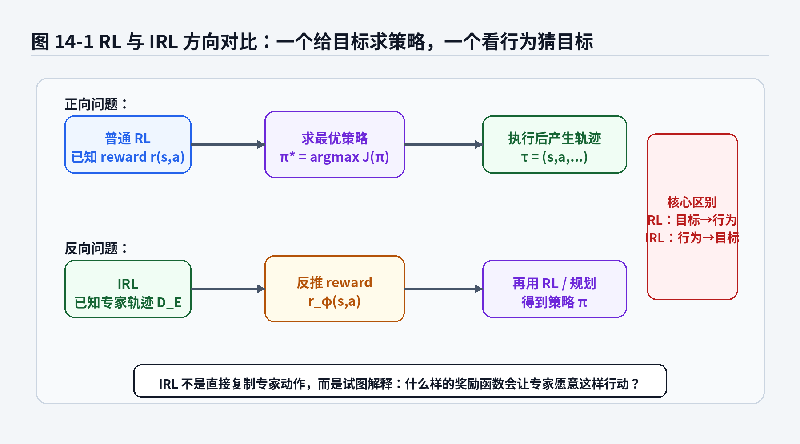
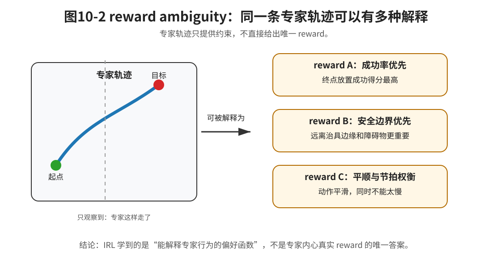

# 第7章：IRL：专家到底在优化什么

> **本章一句话导读**：第一、二篇已经说明，模仿学习不能只看单步动作误差，还要看策略在闭环中诱导出的轨迹分布。本章把问题再推进一步：专家为什么偏好这些轨迹？IRL 试图从专家轨迹中反推出 reward，但 reward ambiguity 决定了这件事不是寻找唯一标准答案，而是在学习一种能够解释专家行为的偏好结构。

---

## 1. 本章要解决的核心问题

前面六章已经完成了两次对象升级。

第一篇说明：BC 在专家数据分布上训练，但部署后策略会进入自己诱导出的状态分布，因此会出现分布偏移和误差累积。

第二篇说明：动作不一定只有一个标准答案。策略可以输出动作分布，也可以通过隐变量表达多种动作模式。到第6章 CVAE 时，我们已经知道，同一个状态下向左绕、向右绕、先调整姿态再接近，都可能是合理动作。

这些内容留下了一个更深的问题：

> 如果专家行为不是唯一动作标签，那么专家到底在优化什么？

在机械臂抓取、放置或插入任务中，一条示教轨迹背后通常不只是“每一步动作应该是什么”，还隐含了很多偏好：接近工件时不要太快，夹爪闭合前姿态要对齐，放入治具时宁愿慢一点也不要硬插，避免碰撞、划伤、卡死，并在成功率、节拍、动作平顺性之间做权衡。

BC 只问：

> 当前状态下，专家动作是什么？

IRL，Inverse Reinforcement Learning，逆强化学习，问的是：

> 什么样的 reward 会让专家愿意这样做？

这就是本章的核心转变：

```text
专家做了什么
→ 专家为什么这样做
→ 什么 reward 能解释专家行为
```

但这条路一开始就有一个大坑：同一批专家轨迹，往往可以被很多 reward 解释。这就是本章的主角：**reward ambiguity**。



**图7-1 说明**：

- 普通 RL 的方向是：给定 reward，求一个能最大化回报的策略；
- IRL 的方向反过来：给定专家轨迹，反推什么 reward 能解释专家行为；
- IRL 得到 reward 后，通常还要通过 RL、规划或策略优化得到策略；
- 这意味着 IRL 不是单纯的监督学习，而是夹在“行为解释”和“策略学习”之间的一座桥。

---

## 2. 统一贯穿例子：二维机器人为什么绕开障碍物

为了让本章不变成抽象公式堆叠，我们继续使用前文的二维机器人例子。

机器人从起点走到目标，中间有一个障碍物。专家示教中，有些轨迹从左边绕，有些轨迹从右边绕。第5章已经说明，如果用 MSE 做点估计，可能会学到两条路径中间的平均动作，而这个平均动作可能正好撞向障碍物。第6章进一步说明，隐变量策略可以表达“左绕”和“右绕”两种模式。

现在换一个角度看这件事。

专家为什么绕开障碍物？

可能是因为：

```text
离目标越近越好；
离障碍物越远越好；
路径越短越好；
动作越平滑越好；
不要进入危险区域；
允许左绕和右绕两种安全模式。
```

这些都不是单步动作标签，而是轨迹级偏好。IRL 的价值就在这里：它尝试把这些偏好压缩成一个 reward，让专家轨迹在这个 reward 下显得合理。

> **直觉框：IRL 不是让动作更像专家，而是让偏好更像专家**
>
> BC 关心“这一步动作是否接近专家”。IRL 关心“一整段行为是否体现了专家偏好”。在机器人任务里，后者更接近“为什么老师傅会这么走”。

---

## 3. 本章核心定义

**定义 7.1：奖励函数 reward**

奖励函数 $r(s,a)$ 是一个把状态—动作对映射为标量的函数，用于描述在状态 $s$ 下执行动作 $a$ 的好坏、偏好或任务价值。

reward 和前文的 loss 要分清楚。BC 的 loss 是训练时最小化的对象，例如动作误差、负对数似然或 ELBO。它回答的是：模型输出和专家标签有多接近？reward 是行为执行时希望最大化的对象。它回答的是：一段行为是否符合任务偏好？

**定义 7.2：轨迹回报**

轨迹回报 $R(\tau)$ 是一条轨迹上即时 reward 的折扣累计，用于评价整段行为的质量。

直观地说，轨迹回报回答的是：这一次完整抓取、移动、放置或绕障过程总体好不好。它比单步动作误差更接近真实工程关心的任务质量。

**定义 7.3：reward ambiguity**

reward ambiguity 指同一批专家轨迹可能被多个不同 reward 解释，专家行为通常不能唯一确定 reward。

这个定义是本章的关键。IRL 学到的 reward 不是专家内心真实目标的唯一答案，而是一种能够解释专家行为的偏好函数。

**定义 7.4：特征期望 feature expectation**

特征期望 $\mu(\pi)$ 是策略 $\pi$ 在闭环执行诱导出的轨迹分布下，对轨迹特征 $F(\tau)$ 的平均统计。

这里最重要的是“闭环执行诱导出的轨迹分布”。feature expectation 不是单条轨迹上的一个数，而是一批 rollout 后的平均行为统计。

---

## 4. 从轨迹回报到 IRL 问题

普通 RL 的问题是：reward 已知，要求策略。沿用第一篇已经建立的轨迹分布写法，策略 $\pi$ 和环境闭环交互会诱导出轨迹分布 $p_\pi(\tau)$。如果 reward 已知，策略的目标可以写成“最大化轨迹分布下的期望回报”。

本章首先定义一条轨迹的回报。

**公式 (7.1)：轨迹回报**

$$
R(\tau)=\sum_{t=0}^{T}\gamma^t r(s_t,a_t)
$$

这个公式把单步 reward 累计成整段轨迹的评价。

其中：

- $\tau$ 表示一条轨迹；
- $r(s_t,a_t)$ 表示第 $t$ 步状态—动作对的即时 reward；
- $\gamma$ 表示折扣因子；
- $T$ 表示轨迹 horizon。

有了轨迹回报以后，普通 RL 可以理解为：

```text
给定 reward
→ 评价轨迹好坏
→ 寻找高回报策略
```

IRL 的方向反过来。我们手里没有 reward，只有专家轨迹数据 $\mathcal{D}_E$。IRL 想学习一个 reward，使专家轨迹在这个 reward 下显得合理。

这里的“合理”不等于专家绝对最优，也不等于世界上只有一条正确轨迹。更稳妥的理解是：

> 专家轨迹应该比随机轨迹、失败轨迹、危险轨迹或低质量轨迹更容易被某个 reward 解释。

所以，IRL 的核心不是“把专家动作当标签”，而是“用 reward 解释专家轨迹为什么值得偏好”。

---

## 5. reward ambiguity：为什么专家轨迹不能唯一决定 reward

IRL 听起来很诱人：看专家怎么做，然后反推出专家的目标函数。

但数学上，这件事通常是不适定的。

### 5.1 直观例子

假设机械臂专家在放置工件时走了一条平滑轨迹。你可以用很多 reward 解释它：

- 奖励末端离目标越来越近；
- 惩罚速度突变；
- 惩罚离治具边缘太近；
- 惩罚接触力过大；
- 奖励最终放置成功；
- 同时考虑节拍、能耗和安全距离。

只看这条轨迹，很难判断专家真正最在意哪一个因素。



**图7-2 说明**：同一条专家轨迹既可以被“成功率优先”的 reward 解释，也可以被“安全边界优先”或“平顺与节拍权衡”的 reward 解释。专家轨迹只提供约束，不提供唯一真相。

### 5.2 命题 7.1：专家行为不能唯一确定 reward

> **命题 7.1：reward ambiguity**
>
> 给定有限专家轨迹数据 $\mathcal{D}_E$，通常不存在唯一的 reward $r(s,a)$ 能被这些轨迹确定。多个不同 reward 可能诱导出相同或近似相同的专家最优行为。

**证明思路**：

只要说明存在不同 reward，它们对轨迹排序或最优行为没有本质影响，就可以说明 reward 不是唯一的。

**公式 (7.2)：reward 等价变换的简单例子**

$$
r'(s,a)=\alpha r(s,a)+c,\quad \alpha>0
$$

这里的 $r'(s,a)$ 和 $r(s,a)$ 明显不是同一个函数，但在很多固定 horizon 的轨迹排序问题中，它们会给出相同的最优轨迹集合。

> **推导框：为什么正比例缩放不改变轨迹排序**
>
> 如果把公式 (7.2) 中的常数项先忽略，只看 $r'(s,a)=\alpha r(s,a)$，那么对任意轨迹 $\tau$ 有：
>
> $$
> R'(\tau)=\alpha R(\tau)
> $$
>
> 当 $\alpha>0$ 时，任意两条轨迹的大小关系不会改变。因此，如果轨迹 $\tau_1$ 在 $R$ 下优于 $\tau_2$，它在 $R'$ 下仍然优于 $\tau_2$。

这个例子只是 reward ambiguity 的一个简单来源。更一般地说，有限专家轨迹只对 reward 施加有限约束，在未覆盖的状态、未出现的动作和未观察到的失败轨迹上，reward 可以有大量自由度。

> **边界框：reward ambiguity 不等于 IRL 没有意义**
>
> reward 不唯一，不代表 IRL 没有价值。它说明 IRL 学到的 reward 应被理解为“能够解释专家行为的偏好模型”，而不是“专家内心真实目标的唯一答案”。

---

## 6. 线性 reward 与 feature expectation

经典 IRL 中常见的一种简化是假设 reward 是特征的线性组合。

**公式 (7.3)：线性 reward**

$$
r_w(s,a)=w^{\top}f(s,a)
$$

其中：

- $f(s,a)$ 是状态—动作特征；
- $w$ 是特征权重；
- $r_w(s,a)$ 是由权重 $w$ 定义的 reward。

在线性 reward 下，IRL 不再直接学习任意复杂函数，而是学习哪些特征更重要。

例如二维绕障任务中，$f(s,a)$ 可以包含：

```text
到目标距离；
到障碍物距离；
动作幅度；
动作变化量；
是否进入危险区域。
```

如果专家总是远离障碍物，IRL 可能会把“靠近障碍物”对应的特征权重学成负数。如果专家愿意绕远一点换安全，IRL 可能学到安全距离权重大于路径长度权重。

为了比较策略和专家，需要把单步特征提升到轨迹统计。

**公式 (7.4)：特征期望**

$$
\mu(\pi)=\mathbb{E}_{\tau\sim p_\pi(\tau)}[F(\tau)]
$$

其中，$F(\tau)$ 表示整条轨迹上的累计特征。

这个公式的重点不是某条轨迹，而是一批闭环执行轨迹的平均统计。IRL 常常希望学习到的策略在这些统计上接近专家。

---

## 7. maximum entropy IRL：为什么要给轨迹一个概率

如果只说“专家轨迹应该是最优的”，问题仍然太硬。真实专家不一定每次都走同一条轨迹，也可能有多种合理路线。

MaxEnt IRL 的思路是：高 reward 轨迹更可能出现，但低 reward 轨迹不是绝对不可能。这样就能保留行为多样性。

**公式 (7.5)：最大熵轨迹分布**

$$
p_w(\tau)=\frac{1}{Z(w)}\exp(R_w(\tau))
$$

其中：

- $p_w(\tau)$ 是在 reward 参数 $w$ 下轨迹 $\tau$ 的概率；
- $R_w(\tau)$ 是由 reward $r_w$ 累计得到的轨迹回报；
- $Z(w)$ 是归一化项，使所有轨迹概率加和为 1。

这个公式可以这样读：

```text
回报越高的轨迹，概率越大；
回报较低的轨迹，概率较小；
但不强行规定只有一条唯一正确轨迹。
```

> **边界框：MaxEnt IRL 的简化假设**
>
> 本章写法强调 reward 对轨迹概率的影响，省略了动力学基准项和更严格的概率路径推导。读者先把它理解为“用概率描述专家偏好”的入口即可。

---

## 8. MaxEnt IRL 的最大似然与梯度

给定专家轨迹数据，MaxEnt IRL 可以通过最大化专家轨迹的对数似然来学习 $w$。

在第10章原编号版本中，这部分曾被展开成较多中间式。按全书公式目录的规则，这里只保留主线结论：梯度方向由“专家特征期望”和“模型特征期望”的差决定。

**公式 (7.6)：MaxEnt IRL 梯度形式**

$$
\nabla_w\bar{\mathcal{L}}(w)=\mu_E-\mu_w
$$

其中：

- $\mu_E$ 是专家轨迹的特征期望；
- $\mu_w$ 是当前 reward 参数 $w$ 下模型诱导出的特征期望；
- $\bar{\mathcal{L}}(w)$ 表示平均专家轨迹对数似然。

这个公式可以直观理解为：

```text
专家比模型更常出现的特征 → 增大权重；
模型比专家更常出现的特征 → 减小权重。
```

### 命题 7.2：MaxEnt IRL 的学习方向是特征统计匹配

> **命题 7.2：MaxEnt IRL 梯度的含义**
>
> 在 MaxEnt IRL 的线性 reward 假设下，最大化专家轨迹似然的梯度可以写成专家特征期望与模型特征期望之差。因此，学习 reward 的过程可以理解为推动模型轨迹统计接近专家轨迹统计。

**证明思路**：

从公式 (7.5) 出发，对专家轨迹对数概率关于 $w$ 求导。$R_w(\tau)$ 的导数给出专家轨迹特征；归一化项 $Z(w)$ 的导数给出当前模型分布下的特征期望。两者相减，就得到公式 (7.6)。

这个结果非常重要，因为它把 IRL 和下一章 GAIL 接起来了：IRL 虽然表面在学 reward，但背后也在比较专家行为统计和模型行为统计。第8章会进一步问：如果显式恢复 reward 很难，能不能直接匹配状态—动作访问分布？

---

## 9. 适用边界与常见误区

| 常见误区 | 更准确的理解 |
|---|---|
| IRL 能恢复专家真实 reward | 通常不能唯一恢复，只能学习能解释专家行为的 reward |
| reward ambiguity 说明 IRL 没意义 | 它说明 IRL 的输出要谨慎解释，而不是否定 IRL |
| reward 学出来以后策略自然就好 | 通常还需要 RL、规划或策略优化，且可能受模型误差影响 |
| MaxEnt 只是数学技巧 | 它让多种专家行为可以同时有概率，不强迫唯一最优轨迹 |
| 特征越多越好 | 特征设计会影响 reward 可解释性和泛化，错误特征会导致错误偏好 |

---

## 10. 与上一章和下一章的关系

### 10.1 与第6章 CVAE 的关系

第6章解决的是：同一个状态下可能存在多种合理动作，策略如何表达多峰动作分布。

本章继续追问：这些动作模式背后是否有更高层的偏好结构？例如左绕和右绕都是合理的，不是因为动作标签唯一，而是因为它们都满足避障、安全、到达目标等轨迹级偏好。

### 10.2 与第8章 GAIL 的关系

本章说明了 IRL 的价值，也暴露了两个困难：reward 不唯一，求解通常昂贵。

第8章 GAIL 会换一个问题：既然显式恢复 reward 很难，能不能直接让策略诱导出的 occupancy measure 接近专家？

```text
第7章：从专家轨迹反推 reward
→ 第8章：绕开显式 reward，直接匹配行为分布
```

---

## 11. 读完本章，你应该能判断什么

| 工程现象 | 应该想到的 IRL 判断 |
|---|---|
| 专家轨迹不唯一，但都能成功 | 可能存在共同的轨迹级偏好，而不是唯一动作标签 |
| 同一状态下专家动作不一致 | 先区分多峰动作分布和更高层 reward 偏好 |
| 想从示教中学“安全、平顺、效率” | 可以考虑 reward / feature / trajectory-level preference 视角 |
| 学到的 reward 看起来能解释数据，但泛化不好 | 可能存在 reward ambiguity 或特征覆盖不足 |
| reward 学出来后策略仍失败 | IRL 还需要后续策略优化，且优化分布可能偏离专家数据 |
| 想把 IRL 直接上真实机器人 | 要评估采样、规划、RL 求解和安全边界成本 |

---

## 12. 实践提示

如果要做一个小实验来理解 IRL，不建议一开始就上复杂机械臂。可以先用二维导航或网格世界：

```text
1. 设计几个特征：到目标距离、到障碍物距离、动作幅度。
2. 采集几条专家绕障轨迹。
3. 假设 reward 是这些特征的线性组合。
4. 观察不同权重是否都能解释同一批专家轨迹。
5. 再比较专家特征期望和模型特征期望。
```

这个实验的目的不是追求 SOTA，而是亲手看到 reward ambiguity 和 feature expectation 为什么是 IRL 的核心。

---

## 13. 本章公式索引

### 公式 (7.1)：轨迹回报

$$
R(\tau)=\sum_{t=0}^{T}\gamma^t r(s_t,a_t)
$$

- **含义**：把单步 reward 累计成轨迹级评价。
- **需要掌握到什么程度**：理解 IRL 讨论的是轨迹级偏好，不只是单步动作标签。

### 公式 (7.2)：reward 等价变换的简单例子

$$
r'(s,a)=\alpha r(s,a)+c,\quad \alpha>0
$$

- **含义**：展示不同 reward 可能诱导相同或近似相同的行为排序。
- **需要掌握到什么程度**：理解 reward ambiguity 的基本来源。

### 公式 (7.3)：线性 reward

$$
r_w(s,a)=w^{\top}f(s,a)
$$

- **含义**：用特征权重描述 reward。
- **需要掌握到什么程度**：理解经典 IRL 常把 reward 学习转化为特征权重学习。

### 公式 (7.4)：特征期望

$$
\mu(\pi)=\mathbb{E}_{\tau\sim p_\pi(\tau)}[F(\tau)]
$$

- **含义**：策略闭环执行后在轨迹特征上的平均统计。
- **需要掌握到什么程度**：理解 IRL 不只比较单步动作，而是在比较轨迹统计。

### 公式 (7.5)：最大熵轨迹分布

$$
p_w(\tau)=\frac{1}{Z(w)}\exp(R_w(\tau))
$$

- **含义**：高 reward 轨迹概率更高，但不强制唯一最优。
- **需要掌握到什么程度**：理解 MaxEnt IRL 如何容纳多种合理专家行为。

### 公式 (7.6)：MaxEnt IRL 梯度形式

$$
\nabla_w\bar{\mathcal{L}}(w)=\mu_E-\mu_w
$$

- **含义**：学习方向是专家特征期望减模型特征期望。
- **需要掌握到什么程度**：理解 IRL 背后仍然在做行为统计匹配。

---

## 14. 本章定义索引

| 编号 | 概念 | 一句话含义 |
|---|---|---|
| 定义 7.1 | reward | 状态—动作对上的偏好或任务价值 |
| 定义 7.2 | 轨迹回报 | 一条轨迹上即时 reward 的折扣累计 |
| 定义 7.3 | reward ambiguity | 同一批专家轨迹可能被多个 reward 解释 |
| 定义 7.4 | feature expectation | 策略闭环执行后轨迹特征的平均统计 |

---

## 15. 思考题

1. 为什么同一批专家轨迹通常不能唯一确定 reward？
2. 第5章的多峰动作问题和本章的 reward ambiguity 有什么区别？
3. 如果两个 reward 对专家轨迹排序完全一样，它们在部署到新场景时一定等价吗？为什么？
4. 为什么 MaxEnt IRL 不强行要求专家只有一条唯一最优轨迹？
5. 如果特征 $f(s,a)$ 设计得不好，IRL 可能学出什么错误偏好？
6. 公式 (7.6) 为什么能把 IRL 和下一章 GAIL 的分布匹配思想连接起来？

---

## 16. 配图清单

| 图号 | 文件 | 作用 |
|---|---|---|
| 图7-1 | `图10-1_RL与IRL方向对比图.png` | 说明 RL 与 IRL 的方向差异 |
| 图7-2 | `图10-2_reward_ambiguity示例图.svg` | 展示同一专家轨迹可以被多个 reward 解释 |

---

## 17. 推荐阅读：重点看什么

- **Ng and Russell, Algorithms for Inverse Reinforcement Learning**：重点看 IRL 为什么不是普通监督学习，以及 reward ambiguity 为什么天然存在。
- **Ziebart et al., Maximum Entropy Inverse Reinforcement Learning**：重点看 MaxEnt 轨迹分布和特征期望匹配，不必一开始深陷全部推导细节。
- **第5章 MSE 与多峰陷阱**：复习为什么同一状态下可以有多个合理动作。
- **第6章 CVAE**：复习隐变量策略如何表达多种动作模式。
- **附录 F：强化学习与序列决策基础**：复习 reward、return、policy 和轨迹分布。
- **附录 I：熵、最大熵与 Score Matching**：用于理解 MaxEnt IRL 为什么引入熵。

---

## 18. 本章小结：为什么下一章是 GAIL

本章完成了三件事。

第一，它把模仿学习从“动作像不像专家”推进到了“专家轨迹背后有什么偏好”。

第二，它说明了 reward ambiguity：专家轨迹不能唯一决定 reward，IRL 学到的是一种解释专家行为的偏好模型，而不是唯一真相。

第三，它通过 feature expectation 和 MaxEnt IRL 梯度说明，IRL 背后仍然在比较专家和模型的行为统计。

因此，下一章自然要问：如果显式恢复 reward 有歧义、求解又昂贵，能不能直接匹配专家和策略的状态—动作访问分布？这就是第8章 GAIL 的主题。
