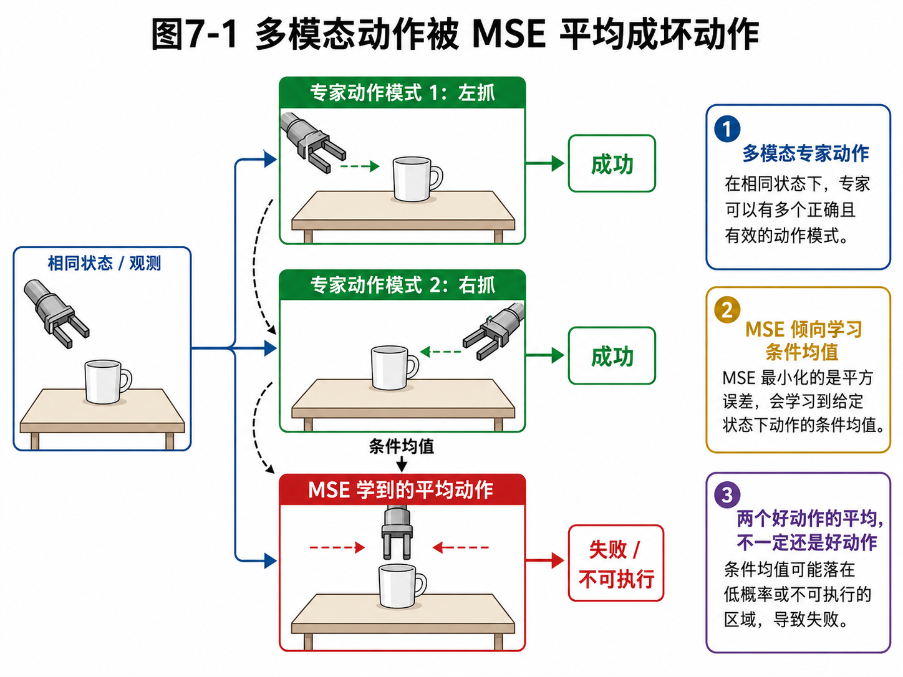

# 第7章 确定性策略与概率策略：机器人不要只会一个标准答案

> **本章一句话导读**：
> 第6章说明了单步 loss 不能代表整条轨迹成功。本章继续追问一个更细的问题：如果同一个状态下本来就有多个合理动作，策略还应该只输出一个“标准答案”吗？确定性策略简单、稳定、好部署；概率策略则能表达不确定性和多种合理动作模式。理解二者的区别，是进入隐变量策略、CVAE、ACT 和 Diffusion Policy 的关键前置知识。

第6章把评价尺度从单步动作误差推进到轨迹级目标。但即使我们暂时只看单步动作，也会遇到一个新的问题：

> **同一个状态下，专家动作未必只有一个正确答案。**

比如：

- 同一个杯子，可以从左边抓，也可以从右边抓；
- 同一个障碍物，可以左绕，也可以右绕；
- 同一个泊车状态，可以一把入库，也可以先多退一点再修正；
- 同一个抽屉把手，可以快拉，也可以慢拉，甚至可以先轻碰确认接触再拉。

这些动作不是“一个对、其他错”。它们可能都是合理答案。

问题来了：如果一个状态下有多个正确动作，而我们硬要模型输出一个确定动作，再用 MSE 去监督它，会发生什么？

答案经常很尴尬：模型会学出一个“平均动作”。

平均动作听起来很中庸，像一个不想得罪任何专家的老好人。但在机器人里，中庸不一定安全。左绕和右绕平均一下，可能正好撞上障碍物；左抓和右抓平均一下，可能正好伸到杯子中间尴尬地戳空气。

---

## 7.1 本章公式主线

本章承接第6章的轨迹目标：

```text
第6章：单步 loss 不等于轨迹成功
→ 但即使只看当前状态，专家动作也可能有多个合理答案
→ 确定性策略 a=f_theta(s) 只能输出一个动作
→ MSE 目标 min_f E[||A-f(S)||^2]
→ MSE 的最优预测是条件均值 f*(s)=E[A|S=s]
→ 多模态动作下，条件均值可能落在两个合理动作模式中间
→ 概率策略 pi_theta(a|s) 建模条件动作分布
→ 混合分布和隐变量策略可以表达多个动作模式
→ 第8章引入隐变量 z，用它表示隐藏动作模式
```

本章最重要的判断是：

> **一旦任务存在多个合理动作，策略就不能只被理解成“函数输出一个动作”，更应该被理解成“条件动作分布”。**

---

## 7.2 一个状态，为什么会有多个正确动作

### 7.2.1 杯子抓取：左抓、右抓、上抓都可能对

假设桌上有一个杯子，机器人要把它拿起来。

如果夹爪从左边靠近，能抓；从右边靠近，也能抓；如果杯子口朝上，顶部抓取也可能能抓。

这三个动作在动作空间里可能相距很远。左抓的末端位姿和右抓的末端位姿不是一个小扰动关系，而是两个不同模式。

如果数据里一半专家左抓，一半专家右抓，而你用 MSE 训练一个确定性策略，模型可能输出一个中间位姿。这个中间位姿可能既不是左抓，也不是右抓，而是夹爪停在杯子正前方，像在和杯子进行一场尴尬的面试。

### 7.2.2 绕障任务：左绕和右绕都是路，中间不是路

移动机器人前方有一个障碍物，左边可以过，右边也可以过。

人类专家 A 喜欢左绕，人类专家 B 喜欢右绕。两条轨迹都能成功。但如果模型学了两条轨迹的平均，它可能正好往障碍物中心走。

这就是多模态动作里最经典的坑：

> **两个好答案的平均，不一定还是好答案。**

### 7.2.3 泊车任务：一把入库和多把修正不是同一种风格

自动泊车中，同一个车身姿态下，老司机可能有不同策略。有的人喜欢大角度一把修正，有的人喜欢保守地多揉两把。

只看某一帧，两个专家动作可能差别很大；但从整条轨迹看，它们都能把车停进去。

如果模型试图用一个确定动作覆盖所有示教风格，就会把不同策略揉成“混合口味”。混合口味在奶茶里可能还行，在泊车轨迹里可能就是车尾蹭线。

---

## 7.3 确定性策略：给定状态，直接输出一个动作

> **定义 7.1：确定性策略**
>
> 确定性策略是指给定状态或观测后，策略直接输出一个确定动作的决策规则。

**公式 (7.1)：基于状态的确定性策略**

$$
a=f_\theta(s)
$$

如果使用观测而非完整状态，也可以写成：

**公式 (7.2)：基于观测的确定性策略**

$$
a=f_\theta(o)
$$

这两个公式读作：给定当前状态 $s$ 或观测 $o$，由参数 $\theta$ 控制的函数 $f_\theta$ 输出动作 $a$。

确定性策略像一个非常果断的司机。看到当前状态，它直接说：“方向盘打 12 度。”

它的优点很明显：

- 简单；
- 推理快；
- 输出稳定；
- 容易接控制器；
- 容易做限幅、滤波和安全检查。

很多工程系统喜欢确定性策略。例如泊车策略输出转角和速度，机械臂策略输出末端位姿增量，工业抓取策略输出一个抓取位姿。

但确定性策略最大的风险是：它默认“当前输入对应一个标准动作”。如果任务本身接近单峰，这个假设没问题。例如固定工位、固定零件、固定夹具、固定抓取位姿，确定性策略可能足够。

但如果同一个输入下存在多个合理动作，确定性策略就容易把不同动作模式压成一个点。

这正是 MSE 平均动作问题的来源。

---

## 7.4 概率策略：给定状态，输出动作分布

> **定义 7.2：概率策略**
>
> 概率策略是指给定状态或观测后，不直接输出唯一动作，而是输出一个动作概率分布，再从该分布中选择或采样动作。

**公式 (7.3)：基于状态的概率策略**

$$
a\sim \pi_\theta(a\mid s)
$$

如果输入是观测，也可以写成：

**公式 (7.4)：基于观测的概率策略**

$$
a\sim \pi_\theta(a\mid o)
$$

这个公式读作：动作 $a$ 从策略 $\pi_\theta$ 给出的条件动作分布中采样得到。

其中：

- $\pi_\theta(a\mid s)$：在状态 $s$ 下动作 $a$ 的概率或概率密度；
- $\pi_\theta(a\mid o)$：在观测 $o$ 下动作 $a$ 的概率或概率密度；
- $\theta$：策略参数；
- $\sim$：表示“从分布中采样”。

概率策略不是随机乱动。它表达的是：

```text
在当前状态下，哪些动作合理？
这些动作各自有多大可能？
模型对动作选择有多确定？
是否存在多个动作模式？
```

在机器人里，概率策略可以表示多个可行抓取方向、多条绕障路径、多种入库风格、不同速度和安全裕度，以及当前观测不确定时的动作不确定性。

---

## 7.5 多模态动作分布

> **定义 7.3：多模态动作分布**
>
> 多模态动作分布指在同一个状态或观测条件下，专家动作不是集中在一个峰值附近，而是分布在多个相距较远的合理动作模式上。

假设在同一个状态 $s$ 下，有两个专家动作模式：左抓 $a_L$ 和右抓 $a_R$。

如果动作分布集中在一个模式附近，确定性策略或单峰高斯策略可能够用。

但如果动作分布有多个峰，并且这些峰之间距离较远，确定性策略就会被迫把多个模式压缩成一个动作。



**图7-1 说明**：这张图想说明的问题是：为什么两个合理动作模式的平均不一定合理。图中左抓和右抓都是可执行动作，MSE 训练的确定性策略倾向于输出平均动作。读者要记住的是：平均动作可能不属于任何真实可执行模式，这正是后续需要概率策略、隐变量策略和生成式策略的重要原因。

---

## 7.6 命题 7.1：MSE 下确定性策略的最优预测是条件均值

这是本章最关键的数学结论。

> **命题 7.1：MSE 下确定性策略的最优预测是条件均值**
>
> 设 $S$ 表示状态或观测条件，$A$ 表示专家动作。如果使用确定性函数 $f(S)$ 预测动作，并最小化均方误差：
>
> $$
> \mathbb{E}\left[\lVert A-f(S)\rVert^2\right]
> $$
>
> 那么对每个给定条件 $S=s$，最优预测满足：
>
> $$
> f^*(s)=\mathbb{E}[A\mid S=s]
> $$

**证明思路**：

全局 MSE 可以按条件 $S=s$ 分解。对某个固定 $s$，我们只需要找一个动作 $u$，使它到条件动作分布 $A\mid S=s$ 的平均平方距离最小。这个最优 $u$ 就是条件均值。

**证明**：

先看固定条件 $S=s$ 下的局部目标。令模型在这个条件下输出 $u$，需要最小化：

$$
F(u)=\mathbb{E}\left[\lVert A-u\rVert^2\mid S=s\right]
$$

把平方项展开：

$$
\lVert A-u\rVert^2 = (A-u)^T(A-u)
$$

继续展开：

$$
(A-u)^T(A-u)=A^TA-2u^TA+u^Tu
$$

对条件分布取期望：

$$
F(u)=\mathbb{E}[A^TA\mid S=s]-2u^T\mathbb{E}[A\mid S=s]+u^Tu
$$

其中 $\mathbb{E}[A^TA\mid S=s]$ 与 $u$ 无关，是常数。对 $u$ 求梯度：

$$
\nabla_u F(u)=-2\mathbb{E}[A\mid S=s]+2u
$$

令梯度为 0：

$$
-2\mathbb{E}[A\mid S=s]+2u=0
$$

得到：

$$
u=\mathbb{E}[A\mid S=s]
$$

因此，固定条件 $s$ 下的最优确定性预测是条件均值。于是：

$$
f^*(s)=\mathbb{E}[A\mid S=s]
$$

**这个命题告诉我们什么？**

MSE 不是在学习“某一个专家动作模式”，而是在学习条件动作分布的均值。如果条件动作分布是单峰的，均值通常合理；如果条件动作分布是多峰的，均值可能落在多个模式之间，变成不可执行动作。

**机械臂例子**：

如果在同一观测下，一半专家从左侧抓，一半专家从右侧抓，MSE 的最优预测可能是左抓和右抓的中间动作。这个中间动作既不是左抓，也不是右抓，可能直接撞向物体中心。

**常见误解**：

这个命题不是说 MSE 永远不能用。它说明的是：当条件动作分布有多个相距较远的合理模式时，用确定性 MSE 会有结构性平均风险。

---

## 7.7 条件均值为什么会破坏多模态动作

假设在状态 $s$ 下有两个同样合理的动作：

$$
A=\begin{cases}
a_L, & \text{概率为 } 0.5 \\
a_R, & \text{概率为 } 0.5
\end{cases}
$$

根据命题 7.1，MSE 下的最优预测是：

$$
f^*(s)=\mathbb{E}[A\mid S=s]=0.5a_L+0.5a_R
$$

如果 $a_L$ 和 $a_R$ 是两个相距很远的动作模式，这个平均值可能并不接近任何一个可执行动作。

在几何上，它可能落在两个动作峰之间；在机器人控制上，它可能变成“中间路线”。而中间路线经常不是保守路线，而是危险路线。

所以，多模态动作问题不是简单靠“更多数据”就一定能解决。如果训练目标仍然强制输出一个均值动作，更多左抓和右抓样本只会让均值更稳定地落在中间。

---

## 7.8 高斯策略：最常见的连续概率策略

> **定义 7.4：高斯策略**
>
> 高斯策略是一类常见的连续动作概率策略。它用高斯分布表示在给定状态或观测下动作的概率密度。

**公式 (7.5)：高斯策略**

$$
\pi_\theta(a\mid s)=\mathcal{N}(a;\mu_\theta(s),\Sigma_\theta(s))
$$

这个公式读作：在状态 $s$ 下，动作 $a$ 服从均值为 $\mu_\theta(s)$、协方差为 $\Sigma_\theta(s)$ 的高斯分布。

高斯策略适合表达：

- 动作只有一个主要模式；
- 动作围绕一个均值有小范围扰动；
- 观测噪声导致动作不确定；
- 控制量是连续的；
- 需要输出均值和不确定性。

例如机械臂末端沿某个方向接近物体，合理动作大多集中在一个方向附近，只是速度和姿态有轻微差异。此时高斯策略可能够用。

但单峰高斯不擅长表达多个相距很远的动作模式。比如左抓和右抓两个模式，中间区域反而不可取。用一个高斯去覆盖这两个峰，往往会让均值落在中间，并给中间坏动作较高概率。

所以高斯策略比确定性策略更灵活，但它仍然可能不够表达复杂多模态。

---

## 7.9 混合分布：用多个峰表达多个动作模式

> **定义 7.5：混合动作分布**
>
> 混合动作分布用多个子分布共同表示条件动作分布，每个子分布可以对应一种动作模式。

**公式 (7.6)：混合动作分布**

$$
\pi_\theta(a\mid s)=\sum_{k=1}^{K}\alpha_k(s)p_k(a\mid s)
$$

这个公式读作：在状态 $s$ 下，动作分布由 $K$ 个子分布加权组成。

其中：

- $K$：动作模式数量；
- $\alpha_k(s)$：第 $k$ 个模式的权重，表示该模式在状态 $s$ 下有多重要；
- $p_k(a\mid s)$：第 $k$ 个动作模式对应的子分布；
- $\sum_{k=1}^{K}\alpha_k(s)p_k(a\mid s)$：把多个模式组合成总的动作分布。

如果 $K=2$，可以粗略理解为：

```text
一个模式负责左抓，另一个模式负责右抓。
```

混合分布比单峰高斯更适合表达多模态，但也带来新的工程问题：

- 模式数量 $K$ 怎么选？
- 模式是否会坍缩到一起？
- 每个模式是否真的对应有意义的动作？
- 推理时选哪个模式？
- 是否需要安全模块过滤候选动作？

这些问题会自然引出第8章的隐变量策略。

---

## 7.10 工程中的策略选择

工程上不应该机械地认为“概率策略一定比确定性策略高级”。更合理的判断方式是看任务结构。

| 任务结构 | 更适合的策略形式 | 原因 |
|---|---|---|
| 单峰、动作标签一致 | 确定性策略 | 简单、稳定、容易部署 |
| 轻微动作噪声 | 单峰高斯策略 | 能表达局部不确定性 |
| 多个相距较远的动作模式 | 混合分布、隐变量策略、生成式策略 | 能保留多个可行模式 |
| 需要生成多个候选动作 | 概率策略或生成式策略 | 可配合安全模块筛选 |
| 部署安全要求高 | 确定性输出或采样后筛选 | 不能把随机性直接交给执行器 |

概率策略的输出不一定要直接随机执行。工程系统中更常见的是：

```text
生成多个候选动作
→ 用碰撞检测、规则约束、价值评分或安全模块筛选
→ 执行最安全、最可控的候选
```

策略负责表达可能性，系统负责提供边界。

---

## 7.11 工程中的常见误解

| 常见误解 | 正确认识 |
|---|---|
| MSE 小就是动作合理 | 多模态下均值动作可能不可执行 |
| 概率策略只是为了随机性 | 概率策略是为了表达多个合理动作模式和不确定性 |
| 确定性策略一定不好 | 单峰、短 horizon、低歧义任务中仍然有效 |
| 多模态问题只要加数据就能解决 | 如果训练目标仍强制输出一个均值动作，问题可能仍存在 |
| 采样动作可以直接上执行器 | 真实部署通常需要安全筛选、限幅和平滑 |
| 高斯策略就能表达所有概率策略 | 单峰高斯难以表达多个相距较远的模式 |

---

## 7.12 读完本章，你应该能判断什么

读完本章后，你应该能形成以下判断：

1. **判断确定性策略是否足够**：如果同一输入基本只有一个正确动作，确定性策略可能够用。
2. **判断多模态动作风险**：如果数据中存在左抓/右抓、左绕/右绕、多种泊车风格，MSE 可能学出平均坏动作。
3. **判断 MSE 的隐含目标**：MSE 下确定性策略学习的是条件均值，而不是某个具体动作模式。
4. **判断概率策略的价值**：概率策略不是随机乱动，而是表达条件动作分布。
5. **判断高斯策略的边界**：单峰高斯适合局部扰动，不适合多个相距很远的模式。
6. **判断是否需要隐变量或生成式策略**：如果动作模式背后存在风格、意图、阶段或路径选择，隐变量策略更自然。

---

## 7.13 本章小结

本章完成了第二篇的第二次视角升级：从“轨迹目标”推进到“条件动作分布”。

核心结论是：

```text
确定性策略简单稳定，但默认每个输入只有一个标准动作；
MSE 下确定性策略的最优预测是条件均值；
多模态动作下，条件均值可能不是任何一个可执行动作；
概率策略通过 pi(a|s) 表达多个合理动作；
混合分布和隐变量策略可以进一步组织这些动作模式。
```

第6章说明了单步 loss 不等于轨迹级成功。本章进一步说明：即使只看某个状态下的动作，专家也未必只有一个正确答案。

概率策略说明动作不一定只有一个标准答案。但如果我们希望模型不仅知道“动作有多个模式”，还要能区分这些模式背后的风格、意图或阶段，就需要引入一个新的数学容器：隐变量 $z$。这就是第8章的主题。

---

## 7.14 本章公式索引

### 公式 (7.1)：基于状态的确定性策略

$$
a=f_\theta(s)
$$

- **含义**：给定状态，策略直接输出一个动作。
- **需要掌握到什么程度**：理解它简单稳定，但不擅长表达多个动作模式。

### 公式 (7.3)：基于状态的概率策略

$$
a\sim \pi_\theta(a\mid s)
$$

- **含义**：给定状态，策略输出动作分布。
- **需要掌握到什么程度**：理解策略可以建模条件动作分布，而不是只输出一个点。

### 公式 (7.5)：高斯策略

$$
\pi_\theta(a\mid s)=\mathcal{N}(a;\mu_\theta(s),\Sigma_\theta(s))
$$

- **含义**：用高斯分布表达连续动作策略。
- **需要掌握到什么程度**：理解单峰高斯适合局部扰动，但多模态能力有限。

### 公式 (7.6)：混合动作分布

$$
\pi_\theta(a\mid s)=\sum_{k=1}^{K}\alpha_k(s)p_k(a\mid s)
$$

- **含义**：用多个子分布加权表达多个动作模式。
- **需要掌握到什么程度**：理解它为隐变量策略和生成式策略铺垫。

### 命题 7.1：MSE 条件均值结论

$$
f^*(s)=\mathbb{E}[A\mid S=s]
$$

- **含义**：MSE 下确定性策略的最优预测是条件动作均值。
- **需要掌握到什么程度**：理解多模态动作下均值可能是坏动作。

---

## 7.15 本章定义索引

| 编号 | 概念 | 一句话含义 |
|---|---|---|
| 定义 7.1 | 确定性策略 | 给定状态或观测后直接输出一个确定动作 |
| 定义 7.2 | 概率策略 | 给定状态或观测后输出动作分布 |
| 定义 7.3 | 多模态动作分布 | 同一条件下存在多个相距较远的合理动作模式 |
| 定义 7.4 | 高斯策略 | 用高斯分布表示连续动作概率策略 |
| 定义 7.5 | 混合动作分布 | 用多个子分布共同表达多个动作模式 |

---

## 7.16 建议阅读的附录条目

- **附录 B：概率论最小生存包**：理解条件分布、期望和采样。
- **附录 C：最大似然、负对数似然、交叉熵与 KL 散度**：理解概率策略训练的基础。
- **附录 D：高斯分布、MSE 与连续动作回归**：理解 MSE 和高斯策略之间的关系。
- **附录 G：生成模型基础**：为第8章隐变量和第9章 CVAE 做准备。

---

## 7.17 思考题

1. 为什么同一个状态下可能有多个合理动作？
2. 确定性策略适合哪些任务？不适合哪些任务？
3. 为什么概率策略不是随机乱动？
4. 请用自己的话解释命题 7.1：为什么 MSE 会学到条件均值？
5. 为什么两个好动作的平均不一定是好动作？
6. 单峰高斯策略为什么难以表达左抓/右抓这类多模态？
7. 混合分布相比单峰高斯解决了什么问题？又带来什么新问题？
8. 为什么真实部署时不应该把采样动作直接交给执行器？
9. 如果你的数据来自多个专家，你会如何判断是否存在多模态动作？
10. 第8章为什么要引入隐变量 $z$？

---

## 7.18 本章配图清单

- 图7-1：多模态动作被 MSE 平均成坏动作。