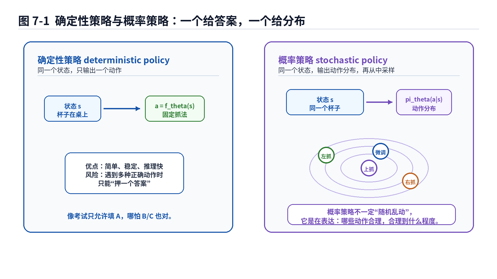
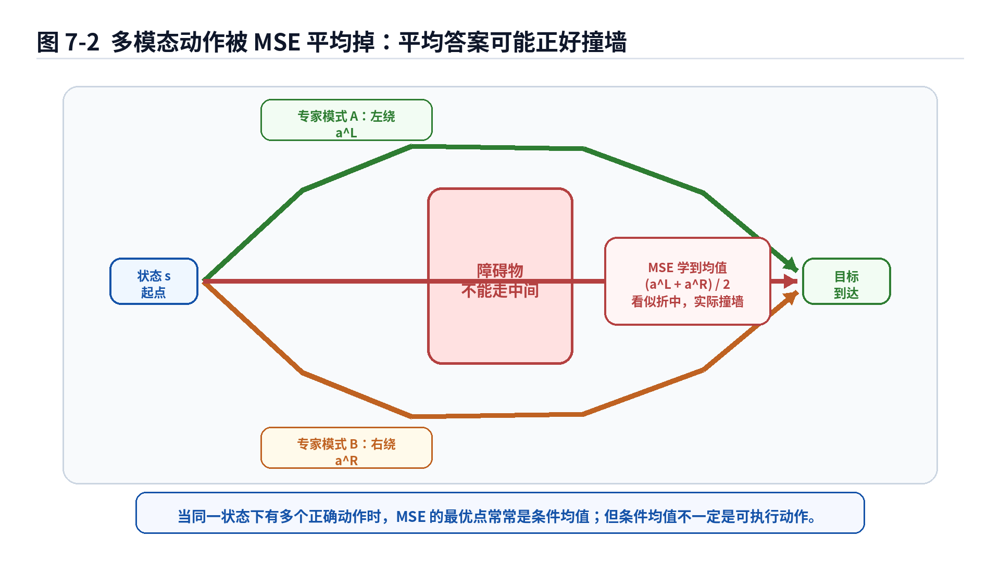
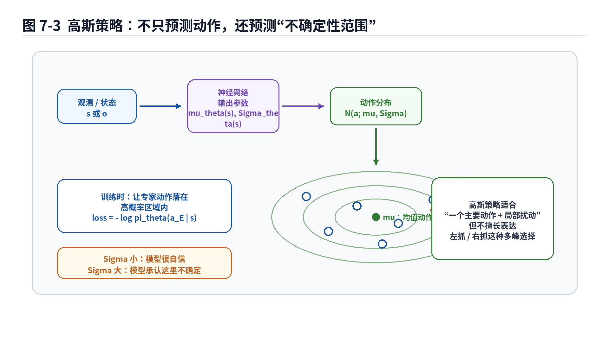
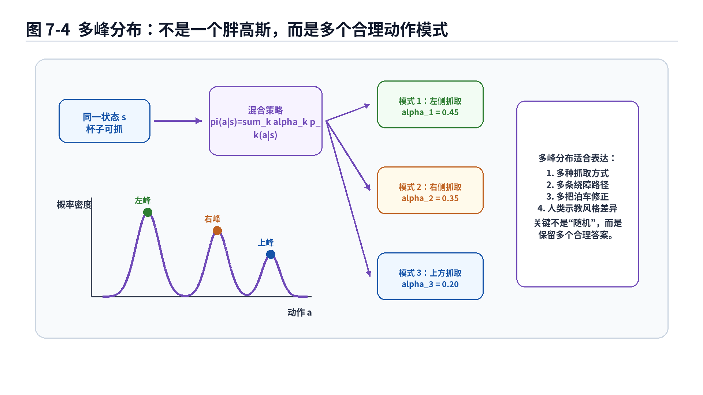

# 第7章：确定性策略与概率策略：机器人不要只会一个标准答案

> **新版布局位置**：本章属于 **第二篇：序列决策与轨迹分布基础**。本章编号、公式编号与交叉引用已按新版八篇结构统一调整。


> **本章一句话导读**：本章说明为什么机器人策略不应只输出一个“标准答案”，而要用概率策略表达动作不确定性与多模态选择。


> 本章继续遵守 v2.0 总控文档：公式不空降，概率概念不默认读者已经熟练掌握，所有重要公式都按照“动机—符号—直觉—工程含义—常见误解”拆开讲。本章是从 Behavior Cloning 走向 CVAE、ACT、Diffusion Policy 的关键过渡章：我们要承认一个事实——同一个状态下，正确动作不一定只有一个。

---

## 1. 本章开场：标准答案崇拜，是机器人学习里的温柔陷阱

前几章我们一直在讲 Behavior Cloning、分布偏移、DAgger、MDP、轨迹损失。到这里，读者可能已经形成一个很自然的想法：

> 给定状态，专家做了什么动作，模型就学什么动作。

这句话在很多简单场景里没问题。比如机械臂在固定工位上抓一个完全定位好的零件，末端位姿几乎就是唯一答案；再比如泊车控制器在某个确定车身姿态下输出一个转角，如果专家数据非常一致，直接回归也能跑得像回事。

但机器人世界里经常不是这样。

同一个杯子，可以从左边抓，也可以从右边抓；同一个障碍物，可以左绕，也可以右绕；同一个泊车状态，可以一把入库，也可以先多退一点再修正；同一个抽屉把手，可以快拉，也可以慢拉，甚至可以先轻碰确认接触再拉。

这些动作不是“一个对、其他错”。它们可能都是合理答案。

问题来了：如果一个状态下有多个正确动作，而我们硬要模型输出一个确定动作，再用 MSE 去监督它，会发生什么？

答案经常很尴尬：模型会学出一个“平均动作”。

平均动作听起来很中庸，像一个不想得罪任何专家的老好人。但在机器人里，中庸不一定安全。左绕和右绕平均一下，可能正好撞上障碍物；左抓和右抓平均一下，可能正好伸到杯子中间尴尬地戳空气；一把入库和多把修正平均一下，可能变成一种谁都不会这么开的奇怪轨迹。

所以本章要从一个非常朴素但非常重要的问题开始：

> 策略到底应该输出一个动作，还是输出一个动作分布？

这就是确定性策略和概率策略的区别。

---

## 2. 本章要解决的核心问题

本章围绕 7 个问题展开：

1. 什么是确定性策略？为什么它简单、直接、工程上常见？
2. 什么是概率策略？为什么它不是“随机乱动”，而是在表达动作的不确定性和多种可能性？
3. 为什么 MSE 在多模态动作数据上容易学出平均动作？
4. 高斯策略适合表达什么，不适合表达什么？
5. 熵为什么可以描述策略的“分散程度”？
6. mixture distribution 为什么比单峰高斯更适合表达多种动作模式？
7. 这些概念如何为后面的 CVAE、ACT、Diffusion Policy 铺路？

本章你会看到这些公式：

<div class="math">\[
a=f_\theta(s) \tag{7.1}\]</div>

<div class="math">\[
a\sim \pi_\theta(a\mid s) \tag{7.2}\]</div>

<div class="math">\[
\pi_\theta(a\mid s)=\mathcal{N}(a;\mu_\theta(s),\Sigma_\theta(s)) \tag{7.3}\]</div>

<div class="math">\[
H(\pi(\cdot\mid s))=-\mathbb{E}_{a\sim\pi(\cdot\mid s)}[\log \pi(a\mid s)] \tag{7.4}\]</div>

<div class="math">\[
\pi_\theta(a\mid s)=\sum_{k=1}^{K}\alpha_k(s)\,p_k(a\mid s) \tag{7.5}\]</div>

不要被这些符号吓到。本章的目标不是把你培养成概率论考试选手，而是让你明白：

> 一旦任务存在多个合理动作，策略就不能只被理解成“函数输出一个动作”，更应该被理解成“条件动作分布”。

---


### 主线定位与统一例子

为了让本章不变成孤立知识点，读本章时请始终把公式落回两个统一例子：

- **二维点机器人跟随专家轨迹**：状态可写成位置/速度，动作可写成二维控制量，适合观察状态分布、轨迹分布和误差累积。
- **机械臂末端运动/抓取轨迹模仿**：观测包含图像或本体状态，动作包含末端位姿增量或关节控制量，适合理解连续动作、多模态动作、动作块和实机闭环。

- **承接前文**：承接第6章：同一轨迹目标下，单步动作并不一定只有一个正确答案。
- **本章推进**：解释确定性策略、概率策略、多模态动作与 MSE 平均化问题。
- **铺垫后文**：为第8章引入隐变量表达动作风格做准备。
- **公式阅读抓手**：MSE 学到的是条件均值；概率策略学的是条件分布。
- **建议同步回看**：附录 C、D、I。

## 3. 先从直觉说起：一个状态，为什么会有多个正确动作？

### 3.1 杯子抓取：左抓、右抓、上抓都可能对

假设桌上有一个杯子，机器人要把它拿起来。如果夹爪从左边靠近，能抓；从右边靠近，也能抓；如果杯子口朝上，顶部抓取也可能能抓。

这三个动作在动作空间里可能相距很远。左抓的末端位姿和右抓的末端位姿不是一个小扰动关系，而是两个不同模式。

如果数据里一半专家左抓，一半专家右抓，而你用 MSE 训练一个确定性策略，模型可能输出一个中间位姿。这个中间位姿可能既不是左抓，也不是右抓，而是夹爪停在杯子正前方，像在和杯子进行一场尴尬的面试。

### 3.2 绕障任务：左绕和右绕都是路，中间不是路

移动机器人前方有一个障碍物，左边可以过，右边也可以过。

人类专家 A 喜欢左绕，人类专家 B 喜欢右绕。两条轨迹都能成功。但如果模型学了两条轨迹的平均，它可能正好往障碍物中心走。

这就是多模态动作里最经典的坑：

> 两个好答案的平均，不一定还是好答案。

### 3.3 泊车任务：一把入库和多把修正不是同一种风格

自动泊车中，同一个车身姿态下，老司机可能有不同策略。有的人喜欢大角度一把修正，有的人喜欢保守地多揉两把。只看某一帧，两个专家动作可能差别很大；但从整条轨迹看，它们都能把车停进去。

如果模型试图用一个确定动作覆盖所有示教风格，就会把不同策略揉成“混合口味”。混合口味在奶茶里可能还行，在泊车轨迹里可能就是车尾蹭线。

---

## 4. 确定性策略：给定状态，直接输出一个动作

确定性策略的数学形式很简单：

<div class="math">\[
a=f_\theta(s) \tag{7.6}\]</div>

或者在使用观测而非完整状态时写成：

<div class="math">\[
a=f_\theta(o) \tag{7.7}\]</div>

这里的意思是：给定当前状态或观测，策略网络直接输出一个动作。

### 公式拆解：<span class="math">\\(a=f\_\theta(s)\\)</span>

**1. 动机：为什么要这样写？**

这是最接近普通监督学习的写法。我们有输入 <span class="math">\\(s\\)</span>，有标签动作 <span class="math">\\(a\\)</span>，训练一个函数 <span class="math">\\(f\_\theta\\)</span>，让它输出的动作尽量接近专家动作。

这和图像分类里的“输入图片，输出类别”很像，只不过这里的输出不是猫狗分类，而是机械臂末端速度、关节角、车辆转角、油门刹车等动作。

**2. 符号解释**

- <span class="math">\\(s\\)</span>：状态。可以是真实系统状态，也可以是经过编码后的观测特征。
- <span class="math">\\(a\\)</span>：动作。可以是离散动作，也可以是连续控制量。
- <span class="math">\\(f\_\theta\\)</span>：由参数 <span class="math">\\(\theta\\)</span> 控制的函数，通常是神经网络。
- <span class="math">\\(a=f\_\theta(s)\\)</span>：表示状态 <span class="math">\\(s\\)</span> 一旦确定，输出动作也确定。

**3. 直觉解释**

确定性策略像一个非常果断的司机。看到当前状态，它直接说：“方向盘打 12 度。”

它不说：“有 60% 概率打 12 度，有 40% 概率打 -8 度。”

所以确定性策略的优点很明显：简单、快、容易部署、输出稳定。

**4. 工程含义**

很多工程系统喜欢确定性策略，因为它好接控制器。比如：

- 自动驾驶横向控制输出目标曲率；
- 泊车策略输出转角和速度；
- 机械臂策略输出末端位姿增量；
- 工业抓取策略输出一个抓取位姿。

部署时，确定性策略也比较容易做安全限制。输出动作越界，就 clamp；输出速度过大，就限幅；输出轨迹不平滑，就加滤波。

**5. 常见误解**

误解一：确定性策略一定低级。

不是。对于单峰、稳定、强约束任务，确定性策略可能非常好用。比如固定工装上的规则零件抓取，如果环境变化小、动作模式唯一，用确定性策略反而干净利落。

误解二：确定性策略不能处理复杂任务。

也不是。复杂任务中仍然可以使用确定性策略，只是它在多模态动作、示教风格差异、不确定性表达方面能力有限。

误解三：确定性策略输出稳定，所以一定安全。

稳定不等于安全。如果稳定地输出一个平均错误动作，那就是非常稳定地翻车。



---

## 5. 确定性策略如何训练？MSE 又登场了

对连续动作来说，确定性策略最常见的训练方式是 MSE：

<div class="math">\[
\mathcal{L}_{\mathrm{MSE}}(\theta)
=
\mathbb{E}_{(s,a)\sim\mathcal{D}}
\left[
\|a-f_\theta(s)\|^2
\right] \tag{7.8}\]</div>

如果是有限数据集，也可以写成经验平均：

<div class="math">\[
\hat{\mathcal{L}}_{\mathrm{MSE}}(\theta)
=
\frac{1}{N}
\sum_{i=1}^{N}
\|a_i-f_\theta(s_i)\|^2 \tag{7.9}\]</div>

### 公式拆解：确定性 BC 的 MSE 损失

**1. 动机：为什么用 MSE？**

因为它简单、可导、优化稳定，而且对连续动作很自然。专家动作是 <span class="math">\\(a\\)</span>，模型动作是 <span class="math">\\(f\_\theta(s)\\)</span>，二者差得越远，惩罚越大。

**2. 符号解释**

- <span class="math">\\(\mathcal{D}\\)</span>：专家数据集。
- <span class="math">\\((s,a)\sim\mathcal{D}\\)</span>：从专家数据集中取一个状态—动作样本。
- <span class="math">\\(f\_\theta(s)\\)</span>：模型预测动作。
- <span class="math">\\(\|a-f\_\theta(s)\|^2\\)</span>：动作向量之间的平方误差。
- <span class="math">\\(\mathbb{E}[\cdot]\\)</span>：对数据分布取平均。

**3. 直觉解释**

MSE 就像问：模型这次交的作业和标准答案差几厘米、几度、几个控制量单位？差得越多，扣分越狠。

对于单一答案任务，这个逻辑很合理。

**4. 工程含义**

MSE 很适合作为 baseline。它能快速告诉你：数据是否对齐，动作尺度是否正常，网络是否能学到基本映射。

如果一个任务用 MSE 都完全学不动，先别急着上 Diffusion Policy。可能是数据、动作定义、归一化、延迟补偿、坐标系、控制接口出了问题。很多时候，高级模型救不了低级数据管线。

**5. 常见误解**

MSE 的问题不是“数学错了”，而是它隐含了一个很强的假设：在同一个状态下，专家动作应该集中在一个均值附近。

如果这个假设不成立，MSE 仍然会诚实地优化，只是优化出来的东西可能不是你想要的策略。

---

## 6. MSE 的隐藏结论：它喜欢条件均值

这一节非常重要。我们要解释为什么 MSE 容易把多模态动作平均掉。

假设在某个固定状态 <span class="math">\\(s\\)</span> 下，专家动作不是唯一的，而是来自一个条件分布 <span class="math">\\(p(a\mid s)\\)</span>。如果我们用一个确定性动作 <span class="math">\\(\hat a\\)</span> 去代表这个状态下的所有专家动作，MSE 目标是：

<div class="math">\[
\hat a^*(s)
=
\arg\min_{\hat a}
\mathbb{E}_{a\sim p(a\mid s)}
\left[
\|a-\hat a\|^2
\right] \tag{7.10}\]</div>

这个目标的最优解是条件均值：

<div class="math">\[
\hat a^*(s)=\mathbb{E}[a\mid s] \tag{7.11}\]</div>

这句话值得慢慢拆。

### 公式拆解：MSE 为什么会学条件均值？

**1. 动机：我们到底在问什么？**

我们先固定一个状态 <span class="math">\\(s\\)</span>，不要让问题被神经网络、数据集、batch、优化器搞复杂。只问一个简单问题：

> 如果这个状态下专家动作有很多种，而模型只能输出一个动作，哪个动作让平均平方误差最小？

答案就是条件均值。

**2. 符号解释**

- <span class="math">\\(p(a\mid s)\\)</span>：状态 <span class="math">\\(s\\)</span> 下专家动作的条件分布。
- <span class="math">\\(\hat a\\)</span>：模型准备用来代表所有动作的单个输出。
- <span class="math">\\(\mathbb{E}\_{a\sim p(a\mid s)}[\cdot]\\)</span>：对这个状态下可能出现的专家动作取平均。
- <span class="math">\\(\hat a^*(s)\\)</span>：让平均 MSE 最小的动作。
- <span class="math">\\(\mathbb{E}[a\mid s]\\)</span>：在状态 <span class="math">\\(s\\)</span> 下专家动作的平均值。

**3. 推导直觉：为什么是平均值？**

一维情况下更容易看。假设动作是一个数，损失为：

<div class="math">\[
L(\hat a)=\mathbb{E}[(a-\hat a)^2] \tag{7.12}\]</div>

把它对 <span class="math">\\(\hat a\\)</span> 求导：

<div class="math">\[
\frac{dL}{d\hat a}
=
\mathbb{E}[2(\hat a-a)] \tag{7.13}\]</div>

令导数为 0：

<div class="math">\[
\mathbb{E}[2(\hat a-a)]=0 \tag{7.14}\]</div>

也就是：

<div class="math">\[
\hat a-\mathbb{E}[a]=0 \tag{7.15}\]</div>

所以：

<div class="math">\[
\hat a=\mathbb{E}[a] \tag{7.16}\]</div>

多维动作时结论类似，只是每个维度都取均值。

**4. 工程含义**

这解释了为什么在多模态示教数据上，MSE 有时会学出“平均动作”。

如果左绕动作是 <span class="math">\\(a^L\\)</span>，右绕动作是 <span class="math">\\(a^R\\)</span>，两者各占一半，那么 MSE 喜欢的动作接近：

<div class="math">\[
\frac{1}{2}a^L+\frac{1}{2}a^R \tag{7.17}\]</div>

问题是，这个动作可能既不是左绕，也不是右绕。

**5. 常见误解**

误解一：平均动作一定不好。

不是。如果动作分布本来就是单峰的，比如专家动作都围绕同一个抓取位姿小范围扰动，均值可能非常好。

误解二：MSE 一定不能用于机器人。

也不是。MSE 是非常重要的 baseline。问题在于你要知道它适合什么分布，不适合什么分布。

误解三：模型学平均动作说明模型太笨。

很多时候不是模型笨，而是损失函数在认真执行你的指令。你让它最小化 MSE，它就给你条件均值。它不是背叛了你，它只是太听话。



---

## 7. 概率策略：输出的不是一个动作，而是动作分布

概率策略的写法是：

<div class="math">\[
a\sim \pi_\theta(a\mid s) \tag{7.18}\]</div>

这表示：给定状态 <span class="math">\\(s\\)</span>，策略不是直接给一个确定动作，而是给出一个动作分布 <span class="math">\\(\pi\_\theta(a\mid s)\\)</span>，动作 <span class="math">\\(a\\)</span> 是从这个分布中采样得到的。

### 公式拆解：<span class="math">\\(a\sim\pi\_\theta(a\mid s)\\)</span>

**1. 动机：为什么需要概率策略？**

因为现实任务中，动作可能有不确定性，也可能有多个合理模式。概率策略允许模型表达：

- 哪些动作更可能是专家会做的；
- 哪些动作也合理但概率低一些；
- 当前状态下模型有多自信；
- 数据里是否存在多种示教风格。

**2. 符号解释**

- <span class="math">\\(\pi\_\theta(a\mid s)\\)</span>：给定状态 <span class="math">\\(s\\)</span> 时，动作 <span class="math">\\(a\\)</span> 的条件概率分布。
- <span class="math">\\(a\sim\pi\_\theta(a\mid s)\\)</span>：动作不是直接等于某个函数输出，而是从分布中采样。
- <span class="math">\\(\theta\\)</span>：控制这个分布形状的模型参数。

**3. 直觉解释**

确定性策略像是说：

> 当前状态下，动作就是这个。

概率策略像是说：

> 当前状态下，左抓概率高，右抓也可以，上抓概率低；如果要执行，可以按某种规则从这些可能动作中选一个。

这不是机器人“摇骰子瞎动”。它是在描述动作空间里的合理区域。

**4. 工程含义**

概率策略带来几个好处：

1. 可以表达多种动作可能性；
2. 可以用 NLL 训练，让专家动作落在高概率区域；
3. 可以在推理时采样多个候选动作，再用安全检查或代价函数筛选；
4. 可以表示模型不确定性，辅助 fallback 或人工接管。

**5. 常见误解**

误解一：概率策略上线会随机，随机就不安全。

概率策略不等于部署时必须随便采样。工程上可以取均值、取最大概率模式、采样多个候选再筛选，或者在高风险场景关闭采样。

误解二：概率策略只属于强化学习。

不是。模仿学习中也可以学习 <span class="math">\\(\pi\_\theta(a\mid s)\\)</span>，例如用最大似然训练条件动作分布。

误解三：概率策略一定比确定性策略好。

也不是。概率策略表达能力更强，但训练、推理、评估和安全验证都更复杂。表达能力不是免费的午餐，最多算一顿自助餐，吃多了也会撑。

---

## 8. 概率策略如何训练？从“拟合动作”到“提高专家动作概率”

对于概率策略，常见训练目标是最大似然：

<div class="math">\[
\theta^*
=
\arg\max_\theta
\sum_{i=1}^{N}
\log \pi_\theta(a_i\mid s_i) \tag{7.19}\]</div>

等价地，也可以最小化负对数似然：

<div class="math">\[
\mathcal{L}_{\mathrm{NLL}}(\theta)
=
-
\frac{1}{N}
\sum_{i=1}^{N}
\log \pi_\theta(a_i\mid s_i) \tag{7.20}\]</div>

这和第2章 Behavior Cloning 的最大似然视角完全衔接。

### 公式拆解：概率策略的 NLL 损失

**1. 动机：为什么不再直接算动作差？**

因为概率策略的输出不是一个动作点，而是一整个分布。我们要问的问题不再是：

> 预测动作离专家动作有多远？

而是：

> 模型给专家动作分配了多高概率？

如果专家动作在模型分布中概率高，说明模型认为这个动作合理；如果概率低，说明模型没有学会这个状态下的专家行为。

**2. 符号解释**

- <span class="math">\\(\pi\_\theta(a\_i\mid s\_i)\\)</span>：模型在状态 <span class="math">\\(s\_i\\)</span> 下给专家动作 <span class="math">\\(a\_i\\)</span> 分配的概率密度或概率。
- <span class="math">\\(\log \pi\_\theta(a\_i\mid s\_i)\\)</span>：对数概率。
- 负号 <span class="math">\\(-\\)</span>：把“最大化概率”变成“最小化损失”。
- <span class="math">\\(\frac{1}{N}\sum\_i\\)</span>：对数据集样本取平均。

**3. 直觉解释**

NLL 像是在问模型：

> 专家这一步动作，你之前押了多少筹码？

如果模型把专家动作放在高概率区域，惩罚小；如果模型认为专家动作几乎不可能，惩罚大。

**4. 工程含义**

概率策略训练时，我们不一定要求模型只输出专家动作本身，而是要求专家动作在它的分布里“说得通”。这为多模态动作留下空间。

例如左抓和右抓都出现过，模型可以学成两个峰，而不是把它们平均成一个中间动作。

**5. 常见误解**

概率密度不是普通概率。对于连续动作，<span class="math">\\(\pi\_\theta(a\mid s)\\)</span> 常常是概率密度，不是“某个点的概率”。这部分如果不熟，可以配合附录 B 和附录 D 阅读。

---

## 9. 高斯策略：最常见的概率策略入门款

连续控制中，最常见的概率策略是高斯策略：

<div class="math">\[
\pi_\theta(a\mid s)
=
\mathcal{N}(a;\mu_\theta(s),\Sigma_\theta(s)) \tag{7.21}\]</div>

意思是：给定状态 <span class="math">\\(s\\)</span>，动作 <span class="math">\\(a\\)</span> 服从一个高斯分布。这个高斯分布的均值 <span class="math">\\(\mu\_\theta(s)\\)</span> 和协方差 <span class="math">\\(\Sigma\_\theta(s)\\)</span> 由神经网络输出。

### 公式拆解：高斯策略

**1. 动机：为什么用高斯分布？**

因为很多连续动作可以被理解为“一个主要动作 + 一些局部扰动”。比如机械臂末端位置主要应该去某个点附近，但允许几毫米误差；车辆转角主要应该在某个值附近，但允许小范围变化。

这种情况下，高斯分布非常自然。

**2. 符号解释**

- <span class="math">\\(\mathcal{N}(a;\mu,\Sigma)\\)</span>：以 <span class="math">\\(\mu\\)</span> 为均值、<span class="math">\\(\Sigma\\)</span> 为协方差的高斯分布。
- <span class="math">\\(\mu\_\theta(s)\\)</span>：网络预测的平均动作。
- <span class="math">\\(\Sigma\_\theta(s)\\)</span>：网络预测的不确定性范围。
- <span class="math">\\(a\\)</span>：实际动作。

如果为了简化，也常写成对角高斯：

<div class="math">\[
\pi_\theta(a\mid s)
=
\mathcal{N}(a;\mu_\theta(s),\mathrm{diag}(\sigma_\theta^2(s))) \tag{7.22}\]</div>

这里 <span class="math">\\(\sigma\_\theta(s)\\)</span> 表示每个动作维度的标准差。

**3. 直觉解释**

高斯策略不是只说“动作应该是多少”，而是说：

> 动作大概在这个均值附近，偏离一点可以接受，偏离太远就不太像专家。

均值 <span class="math">\\(\mu\\)</span> 是中心，协方差 <span class="math">\\(\Sigma\\)</span> 是不确定性范围。

**4. 工程含义**

高斯策略可以表达局部不确定性。比如：

- 抓取位姿附近允许小范围扰动；
- 车辆转角输出存在合理波动；
- 遥操作数据中人手动作有噪声；
- 同一动作维度在不同状态下不确定性不同。

如果模型预测 <span class="math">\\(\sigma\\)</span> 很大，可能表示这个状态下数据分散、动作不确定，或者模型自己没把握。工程上可以把它作为风险信号。

**5. 常见误解**

误解一：高斯策略就解决多模态了。

不完全。单个高斯本质上是单峰分布。它适合“一个主要答案附近有扰动”的情况，不擅长“左抓和右抓两个相距很远的答案”。

误解二：<span class="math">\\(\Sigma\\)</span> 越大越好，能覆盖所有专家动作。

如果为了覆盖多个峰而把一个高斯撑得很胖，模型会把很多不合理动作也纳入高概率区域。这像是为了让所有学生都及格，把满分线改成 300 分，确实宽容，但没什么区分度。



---

## 10. 高斯 NLL 与 MSE 的关系：老朋友又换了件衣服

在第2章我们讲过，MSE 可以从高斯负对数似然中推出来。这里再用概率策略视角看一次。

假设动作分布是固定方差的高斯：

<div class="math">\[
\pi_\theta(a\mid s)
=
\mathcal{N}(a;\mu_\theta(s),\sigma^2 I) \tag{7.23}\]</div>

它的负对数似然可以写成：

<div class="math">\[
-
\log \pi_\theta(a\mid s)
=
\frac{1}{2\sigma^2}
\|a-\mu_\theta(s)\|^2
+
\mathrm{const} \tag{7.24}\]</div>

### 公式拆解：固定方差高斯 NLL 为什么等价于 MSE？

**1. 动机：为什么要重新讲？**

因为这能说明 MSE 其实不是凭空来的。它对应一个概率假设：专家动作围绕均值动作呈单峰高斯分布，并且方差固定。

**2. 符号解释**

- <span class="math">\\(\mu\_\theta(s)\\)</span>：模型预测的高斯均值。
- <span class="math">\\(\sigma^2 I\\)</span>：固定各向同性方差。
- <span class="math">\\(\|a-\mu\_\theta(s)\|^2\\)</span>：专家动作和均值动作之间的平方距离。
- <span class="math">\\(\mathrm{const}\\)</span>：与 <span class="math">\\(\theta\\)</span> 无关的常数，优化时可以忽略。

**3. 直觉解释**

如果你假设专家动作就是在某个中心点附近加高斯噪声，那么训练模型就等价于把中心点拉向专家动作平均位置。

这正是 MSE 做的事。

**4. 工程含义**

当动作分布近似单峰时，MSE 是非常合理的；当动作分布多峰时，固定方差高斯 NLL 和 MSE 会遇到类似问题：它们都倾向于用一个中心解释多个模式。

**5. 常见误解**

不要把“高斯 NLL 能推出 MSE”理解成“MSE 是天然正确的”。它只是说明：MSE 对应了一种概率建模假设。假设成立，MSE 很好；假设不成立，MSE 会暴露问题。

---

## 11. 熵：策略到底有多“分散”？

概率策略还有一个重要概念：熵。

给定状态 <span class="math">\\(s\\)</span>，策略分布的熵可以写成：

<div class="math">\[
H(\pi(\cdot\mid s))
=
-
\mathbb{E}_{a\sim\pi(\cdot\mid s)}
[
\log \pi(a\mid s)
] \tag{7.25}\]</div>

熵可以粗略理解为：分布有多分散、多不确定。

### 公式拆解：策略熵 <span class="math">\\(H(\pi(\cdot\mid s))\\)</span>

**1. 动机：为什么要关心熵？**

因为概率策略不仅关心“哪个动作最可能”，还关心“动作选择有多集中”。

如果一个策略几乎只给一个动作高概率，它的熵低；如果它给很多动作都分配了可观概率，它的熵高。

**2. 符号解释**

- <span class="math">\\(H(\pi(\cdot\mid s))\\)</span>：在状态 <span class="math">\\(s\\)</span> 下策略分布的熵。
- <span class="math">\\(a\sim\pi(\cdot\mid s)\\)</span>：从当前策略分布采样动作。
- <span class="math">\\(\log \pi(a\mid s)\\)</span>：动作的对数概率。
- 负号 <span class="math">\\(-\\)</span>：因为概率小于 1 时 <span class="math">\\(\log\\)</span> 常为负，加负号后熵为正。

**3. 直觉解释**

低熵策略像一个很固执的人：这个状态我就这么干。

高熵策略像一个更开放的人：这个状态有几种做法都可以。

但高熵不一定更好。高熵可能表示合理多样，也可能表示模型没学明白，开始“摆烂式随机”。

**4. 工程含义**

熵在机器人策略中有几种用途：

1. 表达探索程度；
2. 衡量策略不确定性；
3. 在训练中作为正则项，避免策略过早塌缩；
4. 在部署中作为风险指标，高熵状态可能需要更保守执行或触发 fallback。

**5. 常见误解**

误解一：熵越大越好。

不是。装配任务快插进去时，你不希望策略“灵感很多”。你希望它稳定、精准、低熵。

误解二：熵越小越好。

也不是。在多解任务里，过早低熵可能表示模型把多个合理模式硬压成一个，泛化能力下降。

所以熵不是好坏本身，而是一个信号。你要结合任务阶段、状态风险和动作空间理解它。

---

## 12. 多模态动作：正确答案不是一座山，而是一片群山

多模态动作的核心是：条件动作分布 <span class="math">\\(p(a\mid s)\\)</span> 不是单峰的。

单峰分布像一座山，山顶代表最可能动作；多峰分布像一片群山，每个山峰代表一种动作模式。

比如同一个抓取状态：

- 峰 1：左侧抓取；
- 峰 2：右侧抓取；
- 峰 3：上方抓取。

同一个绕障状态：

- 峰 1：左绕；
- 峰 2：右绕。

同一个泊车状态：

- 峰 1：大角度一把修正；
- 峰 2：小角度多把修正。

这时用一个高斯去拟合就很吃力。你要么把高斯放在中间，得到一个没人要的平均动作；要么把高斯方差撑大，让它勉强覆盖所有模式，但也把很多危险动作一起覆盖了。

---

## 13. 混合分布：用多个模式表达多个答案

一种更自然的建模方式是混合分布：

<div class="math">\[
\pi_\theta(a\mid s)
=
\sum_{k=1}^{K}
\alpha_k(s)\,p_k(a\mid s) \tag{7.26}\]</div>

这里，每个 <span class="math">\\(p\_k(a\mid s)\\)</span> 表示一种动作模式，<span class="math">\\(\alpha\_k(s)\\)</span> 表示这种模式的权重。

### 公式拆解：mixture distribution

**1. 动机：为什么需要 mixture？**

因为一个单峰分布不适合表达多个相距很远的动作模式。混合分布允许策略说：

> 当前状态下，有 K 种可能做法。每种做法内部有自己的局部分布，不同做法之间由权重决定。

**2. 符号解释**

- <span class="math">\\(K\\)</span>：模式数量。
- <span class="math">\\(\alpha\_k(s)\\)</span>：第 <span class="math">\\(k\\)</span> 个模式在状态 <span class="math">\\(s\\)</span> 下的权重。
- <span class="math">\\(p\_k(a\mid s)\\)</span>：第 <span class="math">\\(k\\)</span> 个动作模式的条件分布。
- <span class="math">\\(\sum\_{k=1}^{K}\alpha\_k(s)=1\\)</span>：权重加起来为 1。
- <span class="math">\\(\alpha\_k(s)\ge 0\\)</span>：每个权重非负。

如果 <span class="math">\\(p\_k\\)</span> 都是高斯分布，就得到高斯混合模型形式：

<div class="math">\[
\pi_\theta(a\mid s)
=
\sum_{k=1}^{K}
\alpha_k(s)
\mathcal{N}(a;\mu_k(s),\Sigma_k(s)) \tag{7.27}\]</div>

**3. 直觉解释**

混合分布像一个专家委员会。

第一个专家说“左抓比较好”，第二个专家说“右抓也行”，第三个专家说“上抓有点风险但不是不可能”。最终策略不是把三个人的动作平均成一个奇怪姿势，而是保留三个候选模式，并给每个模式一个权重。

**4. 工程含义**

混合分布可以用于：

- 多候选抓取位姿生成；
- 多轨迹预测；
- 自动驾驶多模态轨迹规划；
- 机器人动作候选生成后再用碰撞检测、代价函数或控制器筛选。

**5. 常见误解**

误解一：只要用了 mixture，就不会平均了。

不一定。如果训练不稳定、模式数量不合适、数据标注混乱，mixture 也可能模式塌缩，最后多个分量都学成差不多的东西。

误解二：模式数量越多越好。

模式数量太少表达不够，太多会训练困难、推理成本高、选择逻辑复杂。工程上要结合任务和数据，而不是像点奶茶小料一样越多越开心。



---

## 14. 概率策略推理时到底怎么用？不是只能随机采样

很多人一听概率策略，就担心部署时机器人会随机乱动。这个担心有道理，但不完整。

概率策略在推理时有多种用法。

### 14.1 取均值动作

如果策略是高斯分布，可以直接取均值：

<div class="math">\[
a=\mu_\theta(s) \tag{7.28}\]</div>

这时部署行为接近确定性策略，但训练时仍然利用了概率建模。

适合场景：动作分布单峰，主要需要表达噪声和不确定性。

### 14.2 采样一个动作

可以直接采样：

<div class="math">\[
a\sim \pi_\theta(a\mid s) \tag{7.29}\]</div>

适合仿真探索、数据增强、生成候选动作，或者低风险环境。

实机高风险任务中，通常不会裸采样后直接执行。

### 14.3 采样多个候选，再筛选

更工程化的做法是：

<div class="math">\[
a^{(1)},a^{(2)},\dots,a^{(M)}\sim \pi_\theta(a\mid s) \tag{7.30}\]</div>

然后用安全约束或代价函数选择：

<div class="math">\[
a^*=\arg\min_{a^{(m)}} C_{\mathrm{safe}}(s,a^{(m)}) \tag{7.31}\]</div>

这里 <span class="math">\\(C\_{\mathrm{safe}}\\)</span> 可以包含碰撞风险、动作平滑性、关节限位、任务目标距离等。

### 公式拆解：多候选采样与筛选

**1. 动机：为什么要采多个？**

因为概率策略能生成多个合理动作，但真实执行时通常只能选一个。采多个候选，再用工程约束筛选，可以把学习模型的生成能力和传统安全检查结合起来。

**2. 符号解释**

- <span class="math">\\(a^{(m)}\\)</span>：第 <span class="math">\\(m\\)</span> 个候选动作。
- <span class="math">\\(M\\)</span>：候选数量。
- <span class="math">\\(C\_{\mathrm{safe}}(s,a)\\)</span>：安全或任务代价函数。
- <span class="math">\\(a^*\\)</span>：最终选择执行的动作。

**3. 直觉解释**

这就像让模型先给出几套方案，然后让工程安全员审核。模型负责想象，安全员负责泼冷水。两者都需要，否则要么没有创造力，要么没有刹车。

**4. 工程含义**

在真实机器人中，这种方式很常见：

- 抓取生成多个候选抓姿，再做碰撞检测；
- 自动驾驶预测多条轨迹，再由规划模块筛选；
- 机械臂生成多个动作块，再由控制器检查可达性；
- Diffusion Policy 生成动作序列后，通过 receding horizon 执行前几步并持续重规划。

**5. 常见误解**

概率策略不是在替代所有规则和控制器。它更常见的角色是生成候选、表达分布、提供不确定性；真正执行前仍然要经过任务约束、动力学约束和安全约束。

---

## 15. 这和后面的 CVAE、ACT、Diffusion Policy 有什么关系？

本章不是孤立章节。它是后面几章的入口。

### 15.1 CVAE：用隐变量表达多种动作模式

第8章和第9章会讲隐变量与 CVAE。它们要解决的问题就是：

> 同一个状态下，动作模式不止一个，能不能引入一个隐变量 <span class="math">\\(z\\)</span>，让 <span class="math">\\(z\\)</span> 控制动作风格？

你可以把 <span class="math">\\(z\\)</span> 理解为“左抓/右抓/上抓”的风格旋钮。

### 15.2 ACT：不只多模态，还要预测动作块

ACT 不只是输出单步动作，而是输出一段 action chunk。动作块本身也可能多模态。比如开抽屉时，不同人可能有不同的起手方式、拉动节奏和微调动作。

如果动作块也存在多个合理模式，那么确定性 MSE 的平均问题会更明显。

### 15.3 Diffusion Policy：把动作生成看成条件生成问题

Diffusion Policy 更进一步：它不把策略看成简单回归，而是把动作序列生成看成条件去噪。它天然适合表达复杂连续动作分布，尤其是多模态分布。

所以，本章的核心思想可以概括为一句话：

> 从“预测一个动作”走向“建模动作分布”，是现代模仿学习从 BC 走向生成式策略的关键一步。

---

## 16. 算法流程：如何判断你的任务是否需要概率策略？

在工程中，不要为了显得高级就上概率策略。可以按下面流程判断。

### 16.1 第一步：检查同状态附近动作是否分散

把数据按相似状态聚类，观察同一类状态下专家动作是否集中。

如果动作集中，确定性策略可能足够。

如果动作分成多个远离的簇，说明多模态明显。

### 16.2 第二步：检查 MSE 预测是否落在低密度区域

训练一个确定性 BC baseline，然后可视化预测动作与专家动作分布的位置。

如果模型输出经常落在两个专家模式中间，而这个中间动作在数据中很少出现，就要警惕平均动作问题。

### 16.3 第三步：做 closed-loop 失败分析

如果 open-loop MSE 不差，但 closed-loop 总在关键多解位置失败，比如抓取路线选择、绕障方向、泊车最后修正，就说明动作分布建模可能不足。

### 16.4 第四步：先试简单概率模型

不要一上来就把系统改成复杂生成模型。可以先试：

1. 高斯策略；
2. mixture density network；
3. 多候选动作预测；
4. CVAE；
5. Diffusion Policy。

从简单到复杂，逐步验证。

### 16.5 第五步：推理端加筛选和安全约束

概率策略生成候选后，要有筛选机制。尤其是真实机器人，不要让模型采样一个动作就直接上电执行。

---

## 17. Python 风格伪代码

下面给出几个极简伪代码，帮助你把本章公式落到实现思维上。

### 17.1 确定性策略训练

```python
# D = [(s_i, a_i)]
# model outputs a_hat = f_theta(s)

for batch in dataloader:
    s, a_expert = batch
    a_hat = model(s)
    loss = mse(a_hat, a_expert)
    loss.backward()
    optimizer.step()
```

这个版本非常直接，适合单峰动作任务和 baseline。

### 17.2 高斯策略训练

```python
# model outputs mean and log_std
# pi_theta(a | s) = Normal(mean, std)

for batch in dataloader:
    s, a_expert = batch
    mean, log_std = model(s)
    std = exp(log_std)
    dist = Normal(mean, std)
    loss = -dist.log_prob(a_expert).sum(dim=-1).mean()
    loss.backward()
    optimizer.step()
```

这里训练目标不是动作距离，而是专家动作的负对数似然。

### 17.3 多候选采样与筛选

```python
# sample M candidate actions from policy
# choose the safest / lowest-cost one

candidates = []
for m in range(M):
    a_m = policy.sample(s)
    if is_valid(a_m):
        candidates.append(a_m)

costs = [safe_cost(s, a) for a in candidates]
a_exec = candidates[argmin(costs)]
robot.execute(a_exec)
```

真实工程里，`is_valid` 和 `safe_cost` 往往比策略网络更像系统能否落地的关键。

---

## 18. 工程实践案例

### 18.1 案例一：同一个杯子左抓和右抓都可以

如果你的抓取数据来自不同操作员，有人喜欢左侧抓，有人喜欢右侧抓。确定性 MSE 可能输出杯子正中间的抓取位姿。

解决思路不是简单调大学习率，也不是换一个更大的 backbone，而是承认动作是多模态的：

- 用多候选抓取头；
- 用 mixture density network；
- 用 CVAE 生成不同风格抓取；
- 用 Diffusion Policy 生成动作序列；
- 最后用碰撞检测、夹爪可达性和抓取评分筛选。

### 18.2 案例二：绕障可以左绕也可以右绕

移动机器人或自动驾驶低速绕障时，左绕和右绕都可能成功。MSE 平均出来的路径可能贴着障碍物中心走。

这类任务中，多模态轨迹预测非常重要。自动驾驶轨迹预测领域很早就意识到这个问题：不能只预测一条平均轨迹，而要预测多条候选轨迹及其概率。

机器人操作中的动作生成也类似。你不希望策略只给一个平均动作，而希望它保留多个可行模式。

### 18.3 案例三：泊车可以一把入库，也可以多把修正

泊车任务中，同一初始姿态下有多种策略。有人大角度切入，有人小角度多次修正。只要最终车身居中、姿态合理、没有碰撞，都可以算成功。

如果训练数据混合了多种驾驶风格，确定性策略可能在关键时刻输出折中动作，导致既不像一把入库，也不像多把修正。

工程上可以考虑：

- 按驾驶风格聚类；
- 引入高层模式变量；
- 用轨迹级评估而不是只看单步转角 MSE；
- 推理时让策略生成多个轨迹候选，再交给安全约束筛选。

---

## 19. 方法边界与工程风险

### 19.1 风险一：概率策略表达了多样性，也增加了验证难度

确定性策略只要验证一个输出，概率策略可能产生很多输出。你不能只验证一次采样成功，就说模型可靠。

需要关注：

- 多次采样结果是否稳定；
- 低概率动作是否危险；
- 分布尾部是否会采到不可执行动作；
- 安全筛选是否覆盖所有候选。

### 19.2 风险二：高熵可能是多样性，也可能是模型迷茫

策略熵高不一定代表模型聪明，可能只是它不知道该怎么做。

在关键状态，比如机械臂接触瞬间、泊车贴边瞬间、插孔即将进入瞬间，过高熵反而危险。

### 19.3 风险三：多模态不是数据混乱的遮羞布

有些数据看起来多模态，其实是因为：

- 坐标系没对齐；
- 时间戳不同步；
- 专家动作延迟；
- 控制频率不一致；
- 操作员水平差异太大；
- 数据里混入失败样本但没有标注。

这类问题不能靠概率模型“优雅地包容”。该清洗数据还是要清洗。模型不是垃圾桶，虽然很多项目喜欢这么用它。

### 19.4 风险四：采样策略需要安全兜底

概率策略推理时如果采样动作，必须有安全机制。尤其是真实机械臂、车辆和移动机器人中，动作采样不能绕过限位、碰撞检测和 emergency stop。

### 19.5 风险五：多峰建模可能出现模式塌缩

mixture、CVAE、Diffusion Policy 都可能出现“看起来很高级，实际只输出一种模式”的情况。评估时要检查输出多样性，而不是只看平均 loss。

---

## 20. 常见误区

### 误区一：概率策略就是随机策略，上实机不安全

概率策略描述的是动作分布，部署时可以采样、取均值、取最大概率模式、生成候选再筛选。安全与否取决于推理策略和安全约束，不是概率形式本身决定的。

### 误区二：只要动作多模态，就必须用 Diffusion Policy

不一定。可以先从多候选头、mixture density network、CVAE 等较简单方法试起。Diffusion Policy 表达能力强，但推理成本、训练复杂度和系统集成成本也更高。

### 误区三：MSE 学平均动作，所以 MSE 没用了

MSE 仍然是非常重要的 baseline。它简单、稳定、容易排查系统问题。正确姿势是知道它的假设和边界，而不是把它扔进技术垃圾桶。

### 误区四：高斯策略可以表达所有不确定性

单个高斯主要表达单峰不确定性。多峰动作需要 mixture、隐变量模型、扩散模型等更强表达。

### 误区五：多样性越高越好

机器人不是写诗，不能为了多样性而多样性。任务关键阶段往往需要低熵、稳定和安全。多样性要服务于任务成功，而不是服务于论文图好看。

---

## 21. 本章小结

本章完成了一个非常重要的观念转变：

> 策略不一定只是一个从状态到动作的函数，它也可以是一个从状态到动作分布的映射。

我们讲了：

1. 确定性策略 <span class="math">\\(a=f\_\theta(s)\\)</span> 简单、直接、易部署，但难以表达多种正确动作；
2. MSE 在单峰动作分布上合理，但在多模态动作上容易学出条件均值；
3. 条件均值不一定是可执行动作，两个好动作的平均可能正好是坏动作；
4. 概率策略 <span class="math">\\(a\sim\pi\_\theta(a\mid s)\\)</span> 可以表达动作分布；
5. 高斯策略适合表达单峰局部不确定性；
6. 熵可以描述策略分布的分散程度，但高熵不一定好，低熵也不一定好；
7. mixture distribution 可以表达多个动作模式；
8. 概率策略推理时可以采样、取均值、取最大概率模式或采样多个候选再筛选；
9. 这些概念是理解 CVAE、ACT 和 Diffusion Policy 的基础。

本章最重要的一句话是：

> 在多模态任务里，平均答案可能不是中庸，而是事故现场。

下一章我们会继续往前走：如果一个状态下有多种动作风格，能不能引入一个隐藏变量 <span class="math">\\(z\\)</span>，让模型先选择“风格”，再生成动作？这就是隐变量策略。

---

## 22. 本章公式索引

| 公式 | 名称 | 作用 |
|---|---|---|
| <span class="math">\\(a=f\_\theta(s)\\)</span> | 确定性策略 | 给定状态直接输出一个动作 |
| <span class="math">\\(a=f\_\theta(o)\\)</span> | 基于观测的确定性策略 | 给定观测直接输出动作 |
| <span class="math">\\(\mathcal{L}\_{\mathrm{MSE}}(\theta)=\mathbb{E}\_{(s,a)\sim\mathcal{D}}[\|a-f\_\theta(s)\|^2]\\)</span> | 确定性 BC 的 MSE 损失 | 训练连续动作回归策略 |
| <span class="math">\\(\hat{\mathcal{L}}\_{\mathrm{MSE}}=\frac{1}{N}\sum\_i\|a\_i-f\_\theta(s\_i)\|^2\\)</span> | 经验 MSE | 有限数据集上的 MSE 估计 |
| <span class="math">\\(\hat a^*(s)=\arg\min\_{\hat a}\mathbb{E}\_{a\sim p(a\mid s)}[\|a-\hat a\|^2]\\)</span> | 固定状态下的 MSE 最优动作 | 说明模型只能输出一个动作时优化什么 |
| <span class="math">\\(\hat a^*(s)=\mathbb{E}[a\mid s]\\)</span> | 条件均值结论 | 解释 MSE 为什么会平均多模态动作 |
| <span class="math">\\(a\sim\pi\_\theta(a\mid s)\\)</span> | 概率策略 | 给定状态输出动作分布并采样动作 |
| <span class="math">\\(\theta^*=\arg\max\_\theta\sum\_i\log\pi\_\theta(a\_i\mid s\_i)\\)</span> | 概率策略最大似然 | 让专家动作在模型分布中概率更高 |
| <span class="math">\\(\mathcal{L}\_{\mathrm{NLL}}=-\frac{1}{N}\sum\_i\log\pi\_\theta(a\_i\mid s\_i)\\)</span> | 负对数似然 | 概率策略训练目标 |
| <span class="math">\\(\pi\_\theta(a\mid s)=\mathcal{N}(a;\mu\_\theta(s),\Sigma\_\theta(s))\\)</span> | 高斯策略 | 用高斯分布表达连续动作策略 |
| <span class="math">\\(\pi\_\theta(a\mid s)=\mathcal{N}(a;\mu\_\theta(s),\mathrm{diag}(\sigma\_\theta^2(s)))\\)</span> | 对角高斯策略 | 工程中常用的简化高斯策略 |
| <span class="math">\\(-\log\pi\_\theta(a\mid s)=\frac{1}{2\sigma^2}\|a-\mu\_\theta(s)\|^2+\mathrm{const}\\)</span> | 固定方差高斯 NLL | 说明 MSE 与高斯 NLL 的关系 |
| <span class="math">\\(H(\pi(\cdot\mid s))=-\mathbb{E}\_{a\sim\pi(\cdot\mid s)}[\log\pi(a\mid s)]\\)</span> | 策略熵 | 衡量动作分布的分散程度 |
| <span class="math">\\(\pi\_\theta(a\mid s)=\sum\_{k=1}^{K}\alpha\_k(s)p\_k(a\mid s)\\)</span> | 混合分布策略 | 表达多个动作模式 |
| <span class="math">\\(\sum\_{k=1}^{K}\alpha\_k(s)=1,\;\alpha\_k(s)\ge 0\\)</span> | mixture 权重约束 | 保证模式权重是合法概率 |
| <span class="math">\\(a^{(1)},\dots,a^{(M)}\sim\pi\_\theta(a\mid s)\\)</span> | 多候选采样 | 从概率策略中生成多个候选动作 |
| <span class="math">\\(a^*=\arg\min\_{a^{(m)}}C\_{\mathrm{safe}}(s,a^{(m)})\\)</span> | 候选筛选 | 用安全代价从候选动作中选择执行动作 |

---

## 23. 建议阅读的附录条目

建议配合阅读以下附录：

1. **附录 A：数学符号与公式阅读方法**
   重点复习 <span class="math">\\(\arg\min\\)</span>、<span class="math">\\(\arg\max\\)</span>、<span class="math">\\(\sum\\)</span>、<span class="math">\\(\mathbb{E}\\)</span>、函数映射和条件符号。

2. **附录 B：概率论最小生存包**
   重点阅读条件概率、条件分布、从分布中采样、期望、概率密度与概率的区别。本章的 <span class="math">\\(\pi\_\theta(a\mid s)\\)</span> 和 <span class="math">\\(a\sim\pi\_\theta(a\mid s)\\)</span> 都依赖这些基础。

3. **附录 C：最大似然、负对数似然、交叉熵与 KL**
   重点阅读最大似然和 NLL。本章的概率策略训练目标直接使用 NLL。

4. **附录 D：高斯分布、MSE 与连续动作回归**
   重点阅读高斯分布、均值、方差、协方差，以及 MSE 与高斯 NLL 的关系。

5. **附录 F：MDP、策略与 rollout 基础**
   重点阅读 deterministic policy、stochastic policy、policy-induced trajectory distribution，以及策略采样如何影响闭环轨迹。

6. **附录 G：隐变量与生成模型基础**
   为第8章和第9章做准备，重点理解为什么多模态分布通常需要隐变量或生成模型表达。

---

## 24. 思考题

1. 请举一个你熟悉的机器人或自动驾驶任务，说明同一个状态下为什么可能存在多个正确动作。
2. 为什么两个成功动作的平均不一定成功？请分别用抓取、绕障、泊车三个场景解释。
3. 在一维动作情况下，尝试自己推导 <span class="math">\\(\arg\min\_{\hat a}\mathbb{E}[(a-\hat a)^2]=\mathbb{E}[a]\\)</span>。
4. MSE 什么时候是合理的？什么时候容易出问题？请从动作分布是否单峰的角度回答。
5. 高斯策略中的 <span class="math">\\(\mu\_\theta(s)\\)</span> 和 <span class="math">\\(\Sigma\_\theta(s)\\)</span> 分别表达什么？如果 <span class="math">\\(\Sigma\\)</span> 很大，可能有哪些原因？
6. 熵高一定表示策略好吗？请举一个高熵反而危险的机器人任务阶段。
7. 如果一个抓取策略能生成多个候选抓姿，你会设计哪些规则筛选最终抓姿？至少列出 5 个。
8. mixture distribution 和单个高斯相比，为什么更适合表达左抓/右抓这种动作模式？
9. 如果一个模型在 open-loop 上 MSE 很低，但 closed-loop 总输出平均动作，你会如何验证是不是多模态问题？
10. 概率策略在实机部署时应该有哪些安全兜底？请结合机械臂或泊车任务回答。

---

## 25. 本章配图清单

本章新增 4 张概念讲解图：

1. **图7-1 确定性策略与概率策略对比**：解释一个策略输出动作点，另一个策略输出动作分布；
2. **图7-2 多模态动作被 MSE 平均掉的示意图**：说明左绕和右绕的平均可能正好撞上障碍物；
3. **图7-3 高斯策略示意图**：解释均值、协方差、专家动作概率和 NLL 的关系；
4. **图7-4 多峰分布动作选择图**：展示 mixture distribution 如何保留多个合理动作模式。

---

## 参考文献与推荐深入阅读

### 参考文献

- Richard S. Sutton and Andrew G. Barto, *Reinforcement Learning: An Introduction, 2nd Edition*, MIT Press, 2018.
- Christopher M. Bishop, “Mixture Density Networks,” 1994. <https://publications.aston.ac.uk/id/eprint/373/>
- Tuomas Haarnoja et al., “Soft Actor-Critic: Off-Policy Maximum Entropy Deep Reinforcement Learning with a Stochastic Actor,” ICML 2018. <https://arxiv.org/abs/1801.01290>

### 推荐深入阅读

- 读 Mixture Density Networks，理解“同一个输入对应多个合理输出”为什么不能只用单高斯回归。
- 读 Soft Actor-Critic 的最大熵动机，帮助理解概率策略和探索/多样性的关系。
- 对连续控制任务，建议比较 deterministic policy、Gaussian policy、mixture policy 在动作分布表达能力上的差异。
