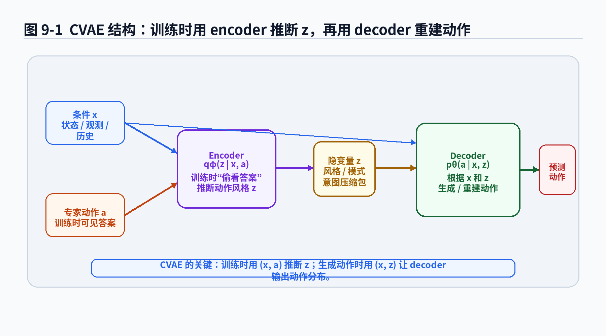
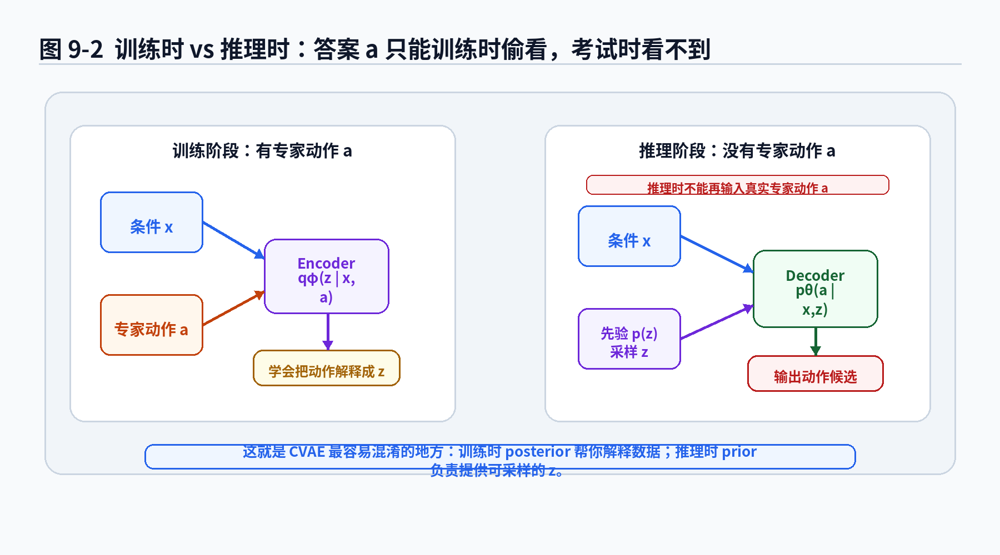
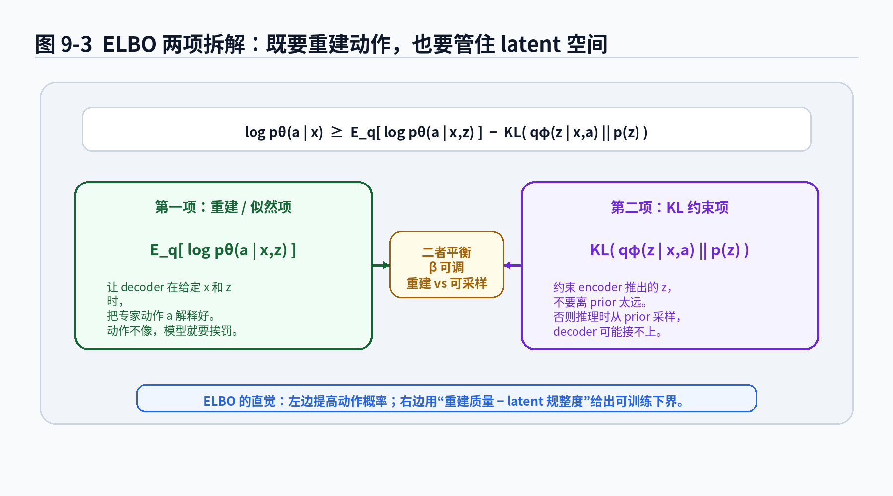
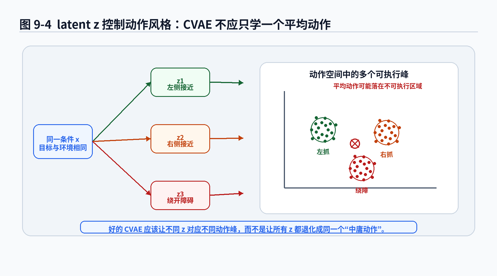

# 第9章：CVAE：训练时偷看答案，推理时假装自己懂了

> **新版布局位置**：本章属于 **第二篇：序列决策与轨迹分布基础**。本章编号、公式编号与交叉引用已按新版八篇结构统一调整。


> **本章一句话导读**：本章用 CVAE 解释如何在训练时借助专家动作学习隐变量分布，并在推理时生成多样化动作。


> 本章继续遵守 v2.0 总控文档：先讲动机，再给公式；公式不仅写出来，还要拆开解释每个符号、直觉、工程含义和常见误解。第8章我们已经知道，隐变量 <span class="math">\\(z\\)</span> 可以表示动作背后的隐藏风格。本章要回答一个更现实的问题：训练数据里没有标注 <span class="math">\\(z\\)</span>，模型到底怎么学会它？CVAE 的答案很有意思：训练时让 encoder 偷看专家动作，推理时再让 decoder 假装自己已经懂了。

---

## 1. 本章开场：为什么需要 CVAE？

第7章我们讲了确定性策略和概率策略。第8章我们进一步引入隐变量，说明同一个状态下的多种合理动作可以写成：

<div class="math">\[
z\sim p(z),
\quad
 a\sim p_\theta(a\mid x,z) \tag{9.1}\]</div>

这里我先把条件统一写成 <span class="math">\\(x\\)</span>，而不是只写 <span class="math">\\(s\\)</span> 或 <span class="math">\\(o\\)</span>。原因很简单：在现代模仿学习里，输入不一定只是一个状态。它可能是：

- 当前图像观测 <span class="math">\\(o\_t\\)</span>；
- 机器人关节状态 <span class="math">\\(q\_t\\)</span>；
- 历史观测 <span class="math">\\(o\_{t-k:t}\\)</span>；
- 语言指令；
- 目标图像；
- 任务 ID；
- 多相机视觉特征；
- 甚至是 Transformer 编码后的一串 token。

所以本章用 <span class="math">\\(x\\)</span> 表示“策略生成动作时能看到的条件信息”。在简单任务中，你可以把 <span class="math">\\(x\\)</span> 理解成状态 <span class="math">\\(s\\)</span>；在机器人论文里，你可以把 <span class="math">\\(x\\)</span> 理解成 observation、state history 或 context。

第8章留下了一个坑：如果 <span class="math">\\(z\\)</span> 没有标注，训练时怎么知道某个动作对应哪个风格？

比如同一个杯子状态下，示教数据里有三种成功动作：

- 从左侧抓；
- 从右侧抓；
- 绕开障碍后抓。

我们希望模型学到：这些动作不是一锅粥，而是对应不同 latent <span class="math">\\(z\\)</span>。问题是，数据集里通常只有 <span class="math">\\((x,a)\\)</span>，没有 <span class="math">\\((x,a,z)\\)</span>。

这就像老师给了你很多解题答案，但没有告诉你每道题用了哪种解法套路。你知道有人用了代数法，有人用了几何法，有人直接背公式，但卷子上只写了最后答案。模型如果只看答案，很容易学成平均答案；如果想学套路，就要反推出答案背后的隐藏原因。

CVAE，就是为这个问题设计的一类模型。

它的核心套路是：

> 训练时，用 encoder 看着 <span class="math">\\(x\\)</span> 和真实动作 <span class="math">\\(a\\)</span>，推断一个可能的 <span class="math">\\(z\\)</span>；再让 decoder 根据 <span class="math">\\(x\\)</span> 和 <span class="math">\\(z\\)</span> 重建动作 <span class="math">\\(a\\)</span>。推理时，真实动作 <span class="math">\\(a\\)</span> 不存在，模型只能从 prior 里采样 <span class="math">\\(z\\)</span>，再让 decoder 生成动作。

这句话听起来像学生时代的真实写照：平时做题可以看答案解析，考试时只能靠自己脑补。

---

## 2. 本章要解决的核心问题

本章围绕 9 个问题展开：

1. VAE 和 CVAE 的区别是什么？为什么模仿学习里更常用 CVAE？
2. CVAE 中的 encoder <span class="math">\\(q\_\phi(z\mid x,a)\\)</span> 到底在干什么？
3. decoder <span class="math">\\(p\_\theta(a\mid x,z)\\)</span> 为什么可以看成 latent-conditioned policy？
4. 为什么训练时可以输入真实动作 <span class="math">\\(a\\)</span>，推理时却不能？
5. 为什么 <span class="math">\\(\log p\_\theta(a\mid x)\\)</span> 直接优化很困难？
6. ELBO 是怎么来的？它的两项分别是什么意思？
7. KL 散度在 CVAE 中到底管什么？
8. CVAE 为什么能缓解多模态动作的平均问题？
9. CVAE 在机器人模仿学习中有哪些常见坑？

本章你会看到这些公式：

<div class="math">\[
q_\phi(z\mid x,a) \tag{9.2}\]</div>

<div class="math">\[
p_\theta(a\mid x,z) \tag{9.3}\]</div>

<div class="math">\[
p_\theta(a\mid x)=\int p_\theta(a\mid x,z)p(z)dz \tag{9.4}\]</div>

<div class="math">\[
\log p_\theta(a\mid x)
\ge
\mathbb{E}_{z\sim q_\phi(z\mid x,a)}
[
\log p_\theta(a\mid x,z)
]
-
D_{\mathrm{KL}}
(
q_\phi(z\mid x,a)
\|p(z)
) \tag{9.5}\]</div>

以及实践中经常出现的损失形式：

<div class="math">\[
\mathcal{L}_{\mathrm{CVAE}}
=
\underbrace{-\mathbb{E}_{z\sim q_\phi(z\mid x,a)}
[
\log p_\theta(a\mid x,z)
]}_{\text{重建损失 / 负对数似然}}
+
\beta
\underbrace{D_{\mathrm{KL}}(q_\phi(z\mid x,a)\|p(z))}_{\text{latent 约束}} \tag{9.6}\]</div>

先不要被公式吓到。本章会一层一层拆。CVAE 的数学并不是为了把读者送走，而是为了解决一个非常朴素的工程问题：

> 训练数据中的动作有多种合理模式，但这些模式没有标签，怎么办？

---


### 主线定位与统一例子

为了让本章不变成孤立知识点，读本章时请始终把公式落回两个统一例子：

- **二维点机器人跟随专家轨迹**：状态可写成位置/速度，动作可写成二维控制量，适合观察状态分布、轨迹分布和误差累积。
- **机械臂末端运动/抓取轨迹模仿**：观测包含图像或本体状态，动作包含末端位姿增量或关节控制量，适合理解连续动作、多模态动作、动作块和实机闭环。

- **承接前文**：承接第8章隐变量策略。
- **本章推进**：说明 CVAE 如何用近似后验解决隐变量训练中的积分困难。
- **铺垫后文**：为第13章 ACT 使用 CVAE 建模 action chunk 做准备。
- **公式阅读抓手**：训练时的 q_phi(z|x,a) 可以看答案，推理时只能从 prior 或 learned prior 采样。
- **建议同步回看**：附录 B、G、I。

## 3. 从 VAE 到 CVAE：多了一个“条件”

### 3.1 VAE 在做什么？

VAE，全称 Variational Autoencoder，直译叫变分自编码器。名字听起来像机器学习系的黑话联合体，但直觉很简单：

> 用一个隐藏变量 <span class="math">\\(z\\)</span> 解释数据 <span class="math">\\(a\\)</span>，再从 <span class="math">\\(z\\)</span> 生成 <span class="math">\\(a\\)</span>。

如果没有条件 <span class="math">\\(x\\)</span>，普通 VAE 的生成过程可以写成：

<div class="math">\[
z\sim p(z) \tag{9.7}\]</div>

<div class="math">\[
a\sim p_\theta(a\mid z) \tag{9.8}\]</div>

这里 <span class="math">\\(a\\)</span> 可以是图片、语音、轨迹、动作片段。普通 VAE 关心的是：如何用 latent <span class="math">\\(z\\)</span> 表达数据的主要变化因素。

比如生成手写数字时，<span class="math">\\(z\\)</span> 可以控制数字粗细、倾斜角度、书写风格。生成机器人动作时，<span class="math">\\(z\\)</span> 可以控制接近方向、速度风格、抓取姿态。

但模仿学习不是无条件生成动作。机器人不是闭着眼睛随机挥手。它必须根据当前观测、任务目标和自身状态来行动。所以我们需要条件。

### 3.2 CVAE 多了条件 x

CVAE，全称 Conditional Variational Autoencoder。比 VAE 多了一个条件 <span class="math">\\(x\\)</span>。生成过程变成：

<div class="math">\[
z\sim p(z) \tag{9.9}\]</div>

<div class="math">\[
a\sim p_\theta(a\mid x,z) \tag{9.10}\]</div>

这里 <span class="math">\\(x\\)</span> 是条件，<span class="math">\\(z\\)</span> 是隐藏模式，<span class="math">\\(a\\)</span> 是动作。

在模仿学习中，<span class="math">\\(x\\)</span> 通常表示机器人执行策略时能看到的信息，<span class="math">\\(a\\)</span> 表示专家动作。于是 CVAE 可以被理解为：

> 在同一个条件 <span class="math">\\(x\\)</span> 下，先采样一个动作风格 <span class="math">\\(z\\)</span>，再生成对应动作 <span class="math">\\(a\\)</span>。

这正好匹配第8章的问题：同一个状态下，正确动作不止一个。

### 公式拆解：<span class="math">\\(a\sim p\_\theta(a\mid x,z)\\)</span>

**1. 这个公式要解决什么问题？**

它要表达：动作不是只由条件 <span class="math">\\(x\\)</span> 决定，还受到隐藏风格 <span class="math">\\(z\\)</span> 的影响。

如果 <span class="math">\\(x\\)</span> 是“杯子在桌面中央，机械臂在正前方”，<span class="math">\\(z\\)</span> 可以决定从左侧抓还是从右侧抓。没有 <span class="math">\\(z\\)</span>，模型可能把左右动作平均；有了 <span class="math">\\(z\\)</span>，模型可以把它们分成不同模式。

**2. 符号解释**

- <span class="math">\\(a\\)</span>：专家动作，可以是单步动作，也可以是 action chunk；
- <span class="math">\\(x\\)</span>：条件输入，可以是状态、观测、历史、任务目标或它们的编码；
- <span class="math">\\(z\\)</span>：隐变量，表示动作背后的风格、意图或模式；
- <span class="math">\\(p\_\theta(a\mid x,z)\\)</span>：decoder 定义的动作条件分布；
- <span class="math">\\(\theta\\)</span>：decoder 或整体生成模型的参数。

**3. 直觉解释**

<span class="math">\\(x\\)</span> 像题目，<span class="math">\\(z\\)</span> 像解题套路，<span class="math">\\(a\\)</span> 像最终答案。同一道题可以用不同套路得到不同但合理的答案。

机器人里也是这样：同一个物体，同一个目标，不同 <span class="math">\\(z\\)</span> 可以生成不同抓取路径。

**4. 工程含义**

在实现中，decoder 往往是一个神经网络：

<div class="math">\[
\hat a=f_\theta(x,z) \tag{9.11}\]</div>

如果把输出分布设成高斯：

<div class="math">\[
p_\theta(a\mid x,z)=\mathcal{N}(a;\mu_\theta(x,z),\Sigma) \tag{9.12}\]</div>

那么 decoder 输出的是均值 <span class="math">\\(\mu\_\theta(x,z)\\)</span>，训练时可以用 MSE 或高斯 NLL。这里 MSE 不是随便来的，它对应固定方差高斯分布下的负对数似然。这个关系在前面章节讲过，附录 D 还会继续补基础。

**5. 常见误解**

不要把 <span class="math">\\(z\\)</span> 理解成“噪声”。它虽然常常从高斯分布采样，但目标不是给动作加随机扰动，而是让模型表达不同模式。随机性只是表面现象，模式结构才是重点。



**图9-1 说明**：
- encoder 使用 <span class="math">\\((x,a)\\)</span> 推断 <span class="math">\\(z\\)</span>，这是训练阶段才有的操作；
- decoder 使用 <span class="math">\\((x,z)\\)</span> 生成动作；
- CVAE 的关键不是多了一个网络，而是多了一个“训练时推断 latent、推理时采样 latent”的机制。

---

## 4. encoder：训练时偷看答案的人

### 4.1 为什么需要 encoder？

第8章我们写过边缘动作分布：

<div class="math">\[
p_\theta(a\mid x)=\int p_\theta(a\mid x,z)p(z)dz \tag{9.13}\]</div>

这表示：要知道动作 <span class="math">\\(a\\)</span> 在条件 <span class="math">\\(x\\)</span> 下的概率，需要把所有可能 <span class="math">\\(z\\)</span> 的贡献都加起来。

这个想法很美，但训练时很麻烦。因为 <span class="math">\\(z\\)</span> 没有标签，我们不知道某个专家动作 <span class="math">\\(a\\)</span> 应该对应哪个 <span class="math">\\(z\\)</span>。

直接对所有 <span class="math">\\(z\\)</span> 积分通常不好算。尤其当 <span class="math">\\(p\_\theta(a\mid x,z)\\)</span> 是神经网络定义的复杂分布时，这个积分没有一个简单的封闭形式。你不能像算小学加法一样把它一行算完。

于是 CVAE 引入一个 encoder：

<div class="math">\[
q_\phi(z\mid x,a) \tag{9.14}\]</div>

它的作用是：训练时看着条件 <span class="math">\\(x\\)</span> 和真实动作 <span class="math">\\(a\\)</span>，猜测这个动作可能来自哪个 latent <span class="math">\\(z\\)</span>。

这就是本章标题里说的“偷看答案”。

### 4.2 encoder 为什么写成 q 而不是 p？

你会看到 encoder 常写成：

<div class="math">\[
q_\phi(z\mid x,a) \tag{9.15}\]</div>

而不是 <span class="math">\\(p\_\theta(z\mid x,a)\\)</span>。这不是作者为了让读者多背一个字母。

在生成模型里，真正的后验分布应该是：

<div class="math">\[
p_\theta(z\mid x,a)
=
\frac{p_\theta(a\mid x,z)p(z)}{p_\theta(a\mid x)} \tag{9.16}\]</div>

但这个后验通常不好算，因为分母 <span class="math">\\(p\_\theta(a\mid x)\\)</span> 里面有积分：

<div class="math">\[
p_\theta(a\mid x)=\int p_\theta(a\mid x,z)p(z)dz \tag{9.17}\]</div>

所以我们用一个可训练的近似分布 <span class="math">\\(q\_\phi(z\mid x,a)\\)</span> 去接近真实后验 <span class="math">\\(p\_\theta(z\mid x,a)\\)</span>。这里的 <span class="math">\\(q\\)</span> 可以理解为 approximate posterior，也就是“近似后验”。

### 公式拆解：<span class="math">\\(q\_\phi(z\mid x,a)\\)</span>

**1. 这个公式要解决什么问题？**

它要解决“训练时不知道专家动作对应哪个 latent”的问题。

如果专家动作是从左侧抓，encoder 应该把它映射到某个能表示“左侧抓”的 latent 区域；如果专家动作是从右侧抓，encoder 应该映射到另一个区域。

**2. 符号解释**

- <span class="math">\\(q\\)</span>：近似后验分布，不是真实生成模型本身，而是为了训练引入的推断网络；
- <span class="math">\\(\phi\\)</span>：encoder 参数；
- <span class="math">\\(z\\)</span>：隐变量；
- <span class="math">\\(x\\)</span>：条件输入；
- <span class="math">\\(a\\)</span>：训练数据中的真实专家动作；
- <span class="math">\\(q\_\phi(z\mid x,a)\\)</span>：给定条件和专家动作后，encoder 认为 <span class="math">\\(z\\)</span> 应该如何分布。

**3. 直觉解释**

encoder 像一个事后分析员。看到“当前状态”和“专家做出的动作”之后，它反推：这个动作大概属于哪种风格。

这就像看司机倒车入库录像。你看到车的位置和司机打方向的方式，大概能判断这是“一把切入派”还是“慢慢修正派”。这个判断不一定完美，但可以帮助模型把数据中的多种模式分开。

**4. 工程含义**

实际实现中，encoder 往往输出高斯分布的参数：

<div class="math">\[
q_\phi(z\mid x,a)=\mathcal{N}(z;\mu_\phi(x,a),\mathrm{diag}(\sigma_\phi^2(x,a))) \tag{9.18}\]</div>

也就是说，encoder 不只是输出一个 <span class="math">\\(z\\)</span>，而是输出 <span class="math">\\(z\\)</span> 的均值和方差。然后通过重参数化技巧采样：

<div class="math">\[
z=\mu_\phi(x,a)+\sigma_\phi(x,a)\odot \epsilon,
\quad
\epsilon\sim\mathcal{N}(0,I) \tag{9.19}\]</div>

这个公式后面会拆。它的作用是让采样过程也能参与反向传播。否则“随机采样”这一步会像在计算图里挖了个洞，梯度过不去。

**5. 常见误解**

encoder 不是部署时必须一直使用的策略模块。推理时没有真实动作 <span class="math">\\(a\\)</span>，所以通常不能使用 <span class="math">\\(q\_\phi(z\mid x,a)\\)</span>。如果有人把真实动作输入 encoder 后再说模型效果很好，那相当于考试时把答案小抄塞进模型里，评测就失真了。

---

## 5. decoder：真正负责生成动作的人

encoder 负责训练时推断 latent，decoder 才是真正生成动作的模块。

CVAE decoder 写成：

<div class="math">\[
p_\theta(a\mid x,z) \tag{9.20}\]</div>

它接收条件 <span class="math">\\(x\\)</span> 和 latent <span class="math">\\(z\\)</span>，输出动作分布。

在机器人模仿学习中，decoder 可以是：

- MLP：输入低维状态和 <span class="math">\\(z\\)</span>，输出连续动作；
- CNN + MLP：输入图像特征和 <span class="math">\\(z\\)</span>，输出动作；
- Transformer decoder：输入观测 token、状态 token 和 <span class="math">\\(z\\)</span>，输出 action chunk；
- diffusion decoder 的前置条件模块：把 <span class="math">\\(z\\)</span> 作为风格条件之一。

从策略角度看，它就是一个 latent-conditioned policy：

<div class="math">\[
\pi_\theta(a\mid x,z)=p_\theta(a\mid x,z) \tag{9.21}\]</div>

### 5.1 decoder 输出单步动作还是动作序列？

CVAE 本身不限制 <span class="math">\\(a\\)</span> 是什么。它可以是单步动作：

<div class="math">\[
a_t \tag{9.22}\]</div>

也可以是动作块：

<div class="math">\[
a_{t:t+H}=(a_t,a_{t+1},\dots,a_{t+H}) \tag{9.23}\]</div>

这点非常重要。第13章 ACT 会把 CVAE 和 action chunk 结合起来，让模型一次预测未来一小段动作。此时 decoder 不是输出一步，而是输出一串动作：

<div class="math">\[
p_\theta(a_{t:t+H}\mid x_t,z) \tag{9.24}\]</div>

如果 <span class="math">\\(z\\)</span> 控制的是整段动作风格，它就不应该每一步乱跳。比如一个插孔动作片段里，<span class="math">\\(z\\)</span> 可以表示“从左上方接近后微调”，而不是第一步左上、第二步右下、第三步开始灵魂出窍。

### 5.2 decoder 的输出分布与 loss

如果动作是连续变量，常见做法是假设：

<div class="math">\[
p_\theta(a\mid x,z)=\mathcal{N}(a;\mu_\theta(x,z),\sigma^2I) \tag{9.25}\]</div>

那么负对数似然为：

<div class="math">\[
-\log p_\theta(a\mid x,z)
=
\frac{1}{2\sigma^2}\|a-\mu_\theta(x,z)\|^2+C \tag{9.26}\]</div>

其中 <span class="math">\\(C\\)</span> 是和 <span class="math">\\(\theta\\)</span> 无关的常数。

这说明，在固定方差高斯假设下，重建损失可以写成 MSE：

<div class="math">\[
\mathcal{L}_{\mathrm{rec}}
=
\|a-\hat a\|^2 \tag{9.27}\]</div>

但注意：这里的 MSE 是在给定 <span class="math">\\(z\\)</span> 后使用的。也就是说，模型不是用一个动作去平均所有模式，而是希望每个 <span class="math">\\(z\\)</span> 下重建对应模式的动作。

这和最朴素 BC 的 MSE 有本质区别。BC 是：

<div class="math">\[
\hat a=f_\theta(x) \tag{9.28}\]</div>

CVAE 是：

<div class="math">\[
\hat a=f_\theta(x,z) \tag{9.29}\]</div>

前者没有风格旋钮，只能硬抗多模态；后者至少给了模型分模式表达的机会。

---

## 6. 训练时和推理时：CVAE 最容易混淆的地方

CVAE 最容易让初学者迷糊的地方是：训练时和推理时的输入不同。

训练时：

<div class="math">\[
z\sim q_\phi(z\mid x,a) \tag{9.30}\]</div>

<div class="math">\[
\hat a\sim p_\theta(a\mid x,z) \tag{9.31}\]</div>

推理时：

<div class="math">\[
z\sim p(z) \tag{9.32}\]</div>

<div class="math">\[
\hat a\sim p_\theta(a\mid x,z) \tag{9.33}\]</div>

差别在第一步。

训练时有专家动作 <span class="math">\\(a\\)</span>，所以 encoder 可以用 <span class="math">\\((x,a)\\)</span> 推断 <span class="math">\\(z\\)</span>。推理时机器人还没有动作答案，它要自己生成动作，所以不能把真实 <span class="math">\\(a\\)</span> 输入 encoder。

这件事一定要想清楚，否则很容易做出“训练时看起来很强，部署时突然掉链子”的系统。



**图9-2 说明**：
- 训练时，encoder 可以看到专家动作 <span class="math">\\(a\\)</span>，并推断对应 latent；
- 推理时，真实动作不可见，只能从 prior <span class="math">\\(p(z)\\)</span> 采样或使用某个默认 latent；
- 如果训练时 posterior 和推理时 prior 对不上，模型就会出现 train-test mismatch。

### 6.1 为什么推理时不能用 encoder？

因为 encoder 的输入是 <span class="math">\\((x,a)\\)</span>。推理时 <span class="math">\\(a\\)</span> 正是我们要求模型生成的东西。

如果你在推理时还输入真实 <span class="math">\\(a\\)</span>，那就像自动驾驶评测时提前告诉模型“老司机接下来要往左打 12 度方向盘”。模型当然表现好，但这不是能力，这是剧透。

在真实系统中，推理时可用的通常是：

- 当前观测 <span class="math">\\(x\\)</span>；
- 从 prior 采样的 <span class="math">\\(z\\)</span>；
- 或者人为选择的某个 <span class="math">\\(z\\)</span>；
- 或者从历史信息中预测出的 <span class="math">\\(z\\)</span>。

但不能使用当前时刻专家动作作为输入。

### 6.2 prior 和 posterior 为什么必须对齐？

训练时 <span class="math">\\(z\\)</span> 来自：

<div class="math">\[
q_\phi(z\mid x,a) \tag{9.34}\]</div>

推理时 <span class="math">\\(z\\)</span> 来自：

<div class="math">\[
p(z) \tag{9.35}\]</div>

如果这两个分布差太远，decoder 会遇到一个很尴尬的问题：训练时吃的是 encoder 精心准备的 latent，推理时吃的是 prior 随机采样的 latent。就像一个餐馆厨师平时只用特供食材练菜，正式开业时突然换成市场随机菜，味道自然可能不稳定。

KL 项就是为了减少这个问题。

---

## 7. 为什么不能直接最大化 <span class="math">\\(\log p\_\theta(a\mid x)\\)</span>？

从最大似然角度，我们希望让专家动作在模型下概率更高：

<div class="math">\[
\theta^*=\arg\max_\theta \sum_i \log p_\theta(a_i\mid x_i) \tag{9.36}\]</div>

其中：

<div class="math">\[
p_\theta(a\mid x)=\int p_\theta(a\mid x,z)p(z)dz \tag{9.37}\]</div>

于是单个样本的 log likelihood 是：

<div class="math">\[
\log p_\theta(a\mid x)
=
\log \int p_\theta(a\mid x,z)p(z)dz \tag{9.38}\]</div>

问题来了：这个积分通常不好算。

如果 <span class="math">\\(z\\)</span> 是低维离散变量，或许还能枚举；如果 <span class="math">\\(z\\)</span> 是连续变量，而且 decoder 是神经网络，这个积分往往无法直接解析计算。即使可以 Monte Carlo 采样，也可能方差很大，训练不稳定。

所以 CVAE 不直接优化 <span class="math">\\(\log p\_\theta(a\mid x)\\)</span>，而是优化它的一个下界：ELBO。

ELBO 的全称是 Evidence Lower Bound。名字很学术，但你可以先记住：

> 它是 <span class="math">\\(\log p\_\theta(a\mid x)\\)</span> 的一个可训练下界。我们提高这个下界，间接提高数据 likelihood。

### 公式拆解：<span class="math">\\(p\_\theta(a\mid x)=\int p\_\theta(a\mid x,z)p(z)dz\\)</span>

**1. 这个公式要解决什么问题？**

它定义了在不知道 <span class="math">\\(z\\)</span> 的情况下，动作 <span class="math">\\(a\\)</span> 的总概率。

因为训练数据里没有 <span class="math">\\(z\\)</span>，所以要把所有可能的 <span class="math">\\(z\\)</span> 都考虑进来。

**2. 符号解释**

- <span class="math">\\(p(z)\\)</span>：prior，表示生成动作前 latent 的分布；
- <span class="math">\\(p\_\theta(a\mid x,z)\\)</span>：给定条件和 latent 后的动作分布；
- <span class="math">\\(\int dz\\)</span>：对连续 latent 的所有取值做积分；
- <span class="math">\\(p\_\theta(a\mid x)\\)</span>：边缘动作分布，不显式指定 <span class="math">\\(z\\)</span>。

**3. 直觉解释**

同一个动作 <span class="math">\\(a\\)</span> 可以从不同 <span class="math">\\(z\\)</span> 生成。总概率就是把每个 <span class="math">\\(z\\)</span> 的贡献加起来。

如果某个 <span class="math">\\(z\\)</span> 很常见，<span class="math">\\(p(z)\\)</span> 大；如果某个 <span class="math">\\(z\\)</span> 下 decoder 很容易生成 <span class="math">\\(a\\)</span>，<span class="math">\\(p\_\theta(a\mid x,z)\\)</span> 大。两者相乘后再积分，就是这个动作的总概率。

**4. 工程含义**

这个公式告诉我们：CVAE 不是只学习 <span class="math">\\(q\_\phi(z\mid x,a)\\)</span>，真正的生成目标仍然是 <span class="math">\\(p\_\theta(a\mid x)\\)</span>。encoder 是训练助手，不是最终目标本身。

**5. 常见误解**

边缘概率不是把所有动作平均。它是在概率层面对不同 latent 模式加权。平均动作是一个点，边缘分布是一整个分布。两者差别很大。

---

## 8. ELBO 是怎么来的？一步一步拆

这一节是本章的数学核心。我们要从 <span class="math">\\(\log p\_\theta(a\mid x)\\)</span> 推到 ELBO。

先写出边缘 likelihood：

<div class="math">\[
\log p_\theta(a\mid x)
=
\log \int p_\theta(a,z\mid x)dz \tag{9.39}\]</div>

这里联合概率可以拆成：

<div class="math">\[
p_\theta(a,z\mid x)=p_\theta(a\mid x,z)p(z) \tag{9.40}\]</div>

于是：

<div class="math">\[
\log p_\theta(a\mid x)
=
\log \int p_\theta(a\mid x,z)p(z)dz \tag{9.41}\]</div>

现在我们引入一个可采样、可训练的分布 <span class="math">\\(q\_\phi(z\mid x,a)\\)</span>。只要在 <span class="math">\\(q\_\phi(z\mid x,a)>0\\)</span> 的地方处理，我们可以在积分里乘以又除以它：

<div class="math">\[
\log p_\theta(a\mid x)
=
\log \int q_\phi(z\mid x,a)
\frac{p_\theta(a\mid x,z)p(z)}{q_\phi(z\mid x,a)}dz \tag{9.42}\]</div>

这个式子没有改变数值，因为 <span class="math">\\(q\\)</span> 被乘上又除掉。它的意义是：把原来的积分写成对 <span class="math">\\(q\\)</span> 的期望。

根据期望定义：

<div class="math">\[
\int q_\phi(z\mid x,a) f(z)dz
=
\mathbb{E}_{z\sim q_\phi(z\mid x,a)}[f(z)] \tag{9.43}\]</div>

所以：

<div class="math">\[
\log p_\theta(a\mid x)
=
\log
\mathbb{E}_{z\sim q_\phi(z\mid x,a)}
\left[
\frac{p_\theta(a\mid x,z)p(z)}{q_\phi(z\mid x,a)}
\right] \tag{9.44}\]</div>

接下来使用 Jensen 不等式。因为 <span class="math">\\(\log\\)</span> 是凹函数，对于随机变量 <span class="math">\\(Y\\)</span>，有：

<div class="math">\[
\log \mathbb{E}[Y]
\ge
\mathbb{E}[\log Y] \tag{9.45}\]</div>

把

<div class="math">\[
Y=\frac{p_\theta(a\mid x,z)p(z)}{q_\phi(z\mid x,a)} \tag{9.46}\]</div>

代进去，得到：

<div class="math">\[
\log p_\theta(a\mid x)
\ge
\mathbb{E}_{z\sim q_\phi(z\mid x,a)}
\left[
\log
\frac{p_\theta(a\mid x,z)p(z)}{q_\phi(z\mid x,a)}
\right] \tag{9.47}\]</div>

把 log 展开：

<div class="math">\[
\mathbb{E}_q
[
\log p_\theta(a\mid x,z)
+
\log p(z)
-
\log q_\phi(z\mid x,a)
] \tag{9.48}\]</div>

也就是：

<div class="math">\[
\mathbb{E}_q[
\log p_\theta(a\mid x,z)
]
-
\mathbb{E}_q
[
\log q_\phi(z\mid x,a)-\log p(z)] \tag{9.49}\]</div>

第二项正是 KL 散度：

<div class="math">\[
D_{\mathrm{KL}}(q_\phi(z\mid x,a)\|p(z))
=
\mathbb{E}_{q_\phi}
\left[
\log\frac{q_\phi(z\mid x,a)}{p(z)}
\right] \tag{9.50}\]</div>

所以得到 ELBO：

<div class="math">\[
\log p_\theta(a\mid x)
\ge
\mathbb{E}_{z\sim q_\phi(z\mid x,a)}
[
\log p_\theta(a\mid x,z)
]
-
D_{\mathrm{KL}}
(
q_\phi(z\mid x,a)
\|p(z)
) \tag{9.51}\]</div>

这就是 CVAE 的核心公式。

### 公式拆解：CVAE ELBO

<div class="math">\[
\mathcal{L}_{\mathrm{ELBO}}
=
\mathbb{E}_{q_\phi(z\mid x,a)}[
\log p_\theta(a\mid x,z)
]
-
D_{\mathrm{KL}}(q_\phi(z\mid x,a)\|p(z)) \tag{9.52}\]</div>

**1. 这个公式要解决什么问题？**

它要解决边缘 likelihood <span class="math">\\(\log p\_\theta(a\mid x)\\)</span> 难以直接优化的问题。ELBO 给了一个可以用采样和神经网络训练的下界。

**2. 第一项是什么意思？**

<div class="math">\[
\mathbb{E}_{q_\phi(z\mid x,a)}[
\log p_\theta(a\mid x,z)] \tag{9.53}\]</div>

这项要求：从 encoder 推断出的 latent <span class="math">\\(z\\)</span> 出发，decoder 要能重建专家动作 <span class="math">\\(a\\)</span>。

如果重建得好，这一项大；如果动作预测离专家很远，这一项小。

从工程角度看，这就是重建项、动作拟合项、BC-like 项。

**3. 第二项是什么意思？**

<div class="math">\[
D_{\mathrm{KL}}(q_\phi(z\mid x,a)\|p(z)) \tag{9.54}\]</div>

这项要求 encoder 产生的 latent 分布不要离 prior 太远。

如果 encoder 产生的 <span class="math">\\(z\\)</span> 分布非常奇怪，而 prior 是标准高斯，那么推理时从标准高斯采样的 <span class="math">\\(z\\)</span> 可能根本不是 decoder 训练时见过的区域。KL 项就是为了把训练时的 posterior 和推理时的 prior 拉近。

**4. 为什么是减 KL？**

ELBO 中 KL 是惩罚项。我们最大化 ELBO，所以 KL 越大越不好。换成最小化损失时，就变成加 KL：

<div class="math">\[
\mathcal{L}_{\mathrm{CVAE}}
=
-\mathbb{E}_q[
\log p_\theta(a\mid x,z)]
+
D_{\mathrm{KL}}(q_\phi(z\mid x,a)\|p(z)) \tag{9.55}\]</div>

**5. 工程含义**

CVAE 训练一直在做一个平衡：

- latent 太自由：重建很好，但 prior 采样失效；
- latent 管得太死：prior 对齐很好，但 <span class="math">\\(z\\)</span> 没信息，模型退化成普通 BC；
- 两者平衡好：既能表达多模态，又能在推理时稳定采样。



**图9-3 说明**：
- ELBO 第一项鼓励 decoder 重建动作；
- KL 项约束 posterior 不要远离 prior；
- 两项之间存在张力，实际训练中常用 <span class="math">\\(\beta\\)</span> 或 KL annealing 调节。

---

## 9. 从最大化 ELBO 到最小化训练损失

论文里常写最大化 ELBO，代码里通常写最小化 loss。两者只差一个负号。

最大化：

<div class="math">\[
\max_{\theta,\phi}
\mathbb{E}_q[
\log p_\theta(a\mid x,z)]
-
D_{\mathrm{KL}}(q_\phi(z\mid x,a)\|p(z)) \tag{9.56}\]</div>

等价于最小化：

<div class="math">\[
\mathcal{L}_{\mathrm{CVAE}}
=
-
\mathbb{E}_q[
\log p_\theta(a\mid x,z)]
+
D_{\mathrm{KL}}(q_\phi(z\mid x,a)\|p(z)) \tag{9.57}\]</div>

实践中经常写成：

<div class="math">\[
\mathcal{L}_{\mathrm{CVAE}}
=
\mathcal{L}_{\mathrm{rec}}
+
\beta \mathcal{L}_{\mathrm{KL}} \tag{9.58}\]</div>

其中：

<div class="math">\[
\mathcal{L}_{\mathrm{rec}}
=-\mathbb{E}_{z\sim q_\phi(z\mid x,a)}[
\log p_\theta(a\mid x,z)] \tag{9.59}\]</div>

<div class="math">\[
\mathcal{L}_{\mathrm{KL}}
=D_{\mathrm{KL}}(q_\phi(z\mid x,a)\|p(z)) \tag{9.60}\]</div>

<span class="math">\\(\beta\\)</span> 是一个权重。它像一个音量旋钮，用来控制 KL 项说话多大声。

### 9.1 beta 太小会怎样？

如果 <span class="math">\\(\beta\\)</span> 太小，KL 约束弱，encoder 可以随心所欲地把每个动作编码到很偏的 latent 区域。训练重建可能很好，但推理时从 <span class="math">\\(p(z)\\)</span> 采样会跑偏。

这叫“训练时风光无限，推理时原形毕露”。

### 9.2 beta 太大会怎样？

如果 <span class="math">\\(\beta\\)</span> 太大，encoder 被迫非常接近 prior，<span class="math">\\(z\\)</span> 里装不下有用信息。decoder 只能主要依赖 <span class="math">\\(x\\)</span>，模型容易退化成普通 BC。

这时候不同 <span class="math">\\(z\\)</span> 生成的动作差不多，多模态表达消失。这就是常说的 latent collapse 或 posterior collapse 的风险之一。

### 9.3 KL annealing 的直觉

实际训练中，有时会让 <span class="math">\\(\beta\\)</span> 从小逐渐变大：

<div class="math">\[
\beta_t:\;0\rightarrow 1 \tag{9.61}\]</div>

这叫 KL annealing。直觉是：先让模型学会重建动作，再逐渐要求 latent 分布规整。

就像训练新人：刚开始先让他把活干出来，不要一上来就让他写流程文档、填周报、对齐 OKR。等基本能力有了，再逐渐加强规范。

---

## 10. 重参数化技巧：让随机采样也能反向传播

CVAE 训练时需要从 encoder 分布采样：

<div class="math">\[
z\sim q_\phi(z\mid x,a) \tag{9.62}\]</div>

如果 <span class="math">\\(q\_\phi\\)</span> 是高斯分布：

<div class="math">\[
q_\phi(z\mid x,a)=\mathcal{N}(z;\mu_\phi(x,a),\mathrm{diag}(\sigma_\phi^2(x,a))) \tag{9.63}\]</div>

直接采样 <span class="math">\\(z\\)</span> 会让梯度传播变得麻烦。因为采样操作本身不是普通确定性函数。

重参数化技巧把采样写成：

<div class="math">\[
\epsilon\sim\mathcal{N}(0,I) \tag{9.64}\]</div>

<div class="math">\[
z=\mu_\phi(x,a)+\sigma_\phi(x,a)\odot\epsilon \tag{9.65}\]</div>

这样，随机性由 <span class="math">\\(\epsilon\\)</span> 提供，而 <span class="math">\\(\mu\_\phi\\)</span> 和 <span class="math">\\(\sigma\_\phi\\)</span> 是神经网络输出，可以接受梯度。

### 公式拆解：<span class="math">\\(z=\mu+\sigma\odot\epsilon\\)</span>

**1. 这个公式要解决什么问题？**

它要让“从分布中采样”这件事可以嵌入神经网络训练流程，让梯度能够更新 encoder 参数。

**2. 符号解释**

- <span class="math">\\(\mu\_\phi(x,a)\\)</span>：encoder 输出的 latent 均值；
- <span class="math">\\(\sigma\_\phi(x,a)\\)</span>：encoder 输出的 latent 标准差；
- <span class="math">\\(\epsilon\sim\mathcal{N}(0,I)\\)</span>：与模型参数无关的标准高斯噪声；
- <span class="math">\\(\odot\\)</span>：逐元素乘法；
- <span class="math">\\(z\\)</span>：最终采样得到的 latent。

**3. 直觉解释**

不要让网络直接“从一个会变的分布里随机抽样”，而是让它输出分布的位置和尺度，再把固定噪声搬过去、拉伸一下。

<span class="math">\\(\epsilon\\)</span> 像一团标准噪声，<span class="math">\\(\mu\\)</span> 决定把它搬到哪里，<span class="math">\\(\sigma\\)</span> 决定把它拉多宽。

**4. 工程含义**

PyTorch 中常见写法是：

```python
mu, logvar = encoder(x, a)
std = torch.exp(0.5 * logvar)
eps = torch.randn_like(std)
z = mu + std * eps
```

注意这里经常输出 <span class="math">\\(\log \sigma^2\\)</span>，也就是 `logvar`。原因是方差必须为正，而直接预测方差可能出现负数；预测 logvar 再指数化更稳定。

**5. 常见误解**

重参数化技巧不是为了让模型更随机，而是为了让随机 latent 可以被梯度训练。它是训练技术，不是机器人动作多样性的全部来源。

---

## 11. KL 散度在 CVAE 中到底管什么？

前面我们已经看到 KL 项：

<div class="math">\[
D_{\mathrm{KL}}(q_\phi(z\mid x,a)\|p(z)) \tag{9.66}\]</div>

它经常被误解成“让 latent 更像正态分布”。这句话不算错，但太粗糙。

更准确地说，它有三层作用。

### 11.1 作用一：让训练时 latent 和推理时 latent 对齐

训练时 decoder 看到的 <span class="math">\\(z\\)</span> 来自 posterior：

<div class="math">\[
z\sim q_\phi(z\mid x,a) \tag{9.67}\]</div>

推理时 decoder 看到的 <span class="math">\\(z\\)</span> 来自 prior：

<div class="math">\[
z\sim p(z) \tag{9.68}\]</div>

KL 项让 <span class="math">\\(q\_\phi\\)</span> 不要离 <span class="math">\\(p(z)\\)</span> 太远。这样推理时从 <span class="math">\\(p(z)\\)</span> 采样，decoder 才不至于一脸懵。

### 11.2 作用二：压缩动作信息，避免 latent 变成记忆小抄

如果没有 KL，encoder 可能把动作 <span class="math">\\(a\\)</span> 几乎完整地塞进 <span class="math">\\(z\\)</span>。那 decoder 重建当然很好，但这不是学会了动作模式，而是学会了把答案藏进 latent。

这在训练集上很香，在推理时很惨。因为推理时没有 <span class="math">\\(a\\)</span>，也就没有那张小抄。

KL 相当于限制小抄大小：你可以传递风格信息，但不能把整份答案原封不动塞进去。

### 11.3 作用三：让 latent 空间可采样

一个好 latent 空间应该满足：从 prior 中采样到的 <span class="math">\\(z\\)</span>，大多能生成合理动作。

如果训练时 latent 分布散落在很多奇怪角落，prior 采样就会很危险。KL 项把这些区域往 prior 分布附近拉，让 latent 空间更连续、更可采样。

### 11.4 KL 的高斯闭式形式

当：

<div class="math">\[
q_\phi(z\mid x,a)=\mathcal{N}(\mu,\mathrm{diag}(\sigma^2)) \tag{9.69}\]</div>

<div class="math">\[
p(z)=\mathcal{N}(0,I) \tag{9.70}\]</div>

KL 有常用闭式形式：

<div class="math">\[
D_{\mathrm{KL}}(q\|p)
=
\frac{1}{2}\sum_j
(
\mu_j^2+\sigma_j^2-\log\sigma_j^2-1
) \tag{9.71}\]</div>

### 公式拆解：高斯 KL 闭式形式

**1. 这个公式要解决什么问题？**

它让我们不用采样估计 KL，可以直接根据 encoder 输出的 <span class="math">\\(\mu\\)</span> 和 <span class="math">\\(\sigma\\)</span> 计算 KL 损失。

**2. 符号解释**

- <span class="math">\\(j\\)</span>：latent 的第 <span class="math">\\(j\\)</span> 个维度；
- <span class="math">\\(\mu\_j\\)</span>：第 <span class="math">\\(j\\)</span> 维均值；
- <span class="math">\\(\sigma\_j^2\\)</span>：第 <span class="math">\\(j\\)</span> 维方差；
- <span class="math">\\(\log\sigma\_j^2\\)</span>：方差的对数；
- <span class="math">\\(\sum\_j\\)</span>：对所有 latent 维度求和。

**3. 直觉解释**

如果 <span class="math">\\(q\\)</span> 和标准正态 <span class="math">\\(p\\)</span> 一样，那么 <span class="math">\\(\mu\_j=0\\)</span>，<span class="math">\\(\sigma\_j^2=1\\)</span>。代入每一维：

<div class="math">\[
0^2+1-\log 1-1=0 \tag{9.72}\]</div>

KL 为 0。

如果均值远离 0，或者方差远离 1，KL 就变大。也就是说，KL 惩罚 posterior 偏离标准高斯。

**4. 工程含义**

在代码里，常见写法是：

```python
kl = -0.5 * torch.sum(1 + logvar - mu.pow(2) - logvar.exp(), dim=-1)
```

这和上面的公式等价，只是写法换了一下。

**5. 常见误解**

KL 越小不一定越好。如果 KL 接近 0，可能表示 <span class="math">\\(q\\)</span> 完全贴着 prior，latent 没有携带动作信息。训练时要同时看重建质量、多样性、KL 数值和闭环表现。

---

## 12. CVAE 如何缓解多模态动作平均问题？

现在回到最初的问题：为什么 CVAE 对多模态动作有用？

普通 BC 学的是：

<div class="math">\[
\hat a=f_\theta(x) \tag{9.73}\]</div>

如果同一个 <span class="math">\\(x\\)</span> 对应多个动作峰，MSE 会倾向于预测平均动作。

CVAE 学的是：

<div class="math">\[
\hat a=f_\theta(x,z) \tag{9.74}\]</div>

同一个 <span class="math">\\(x\\)</span>，不同 <span class="math">\\(z\\)</span> 可以生成不同动作：

<div class="math">\[
\hat a_1=f_\theta(x,z_1) \tag{9.75}\]</div>

<div class="math">\[
\hat a_2=f_\theta(x,z_2) \tag{9.76}\]</div>

<div class="math">\[
\hat a_3=f_\theta(x,z_3) \tag{9.77}\]</div>

如果训练得好，<span class="math">\\(z\_1,z\_2,z\_3\\)</span> 分别对应不同动作模式。模型不需要用一个点去讨好所有数据，而是可以用不同 latent 去解释不同示教。



**图9-4 说明**：
- 同一条件 <span class="math">\\(x\\)</span> 下，不同 <span class="math">\\(z\\)</span> 可以生成不同动作峰；
- CVAE 的目标不是让所有动作取平均，而是把多种模式保留下来；
- 如果所有 <span class="math">\\(z\\)</span> 输出几乎一样，说明 latent 可能被忽略。

### 12.1 一个抓取例子

假设训练数据中，同一个物体有两类抓法：左抓和右抓。

普通 BC 用 MSE 时，可能输出中间抓法。中间抓法既不像左抓，也不像右抓，夹爪可能正好撞到物体或抓不到稳定点。

CVAE 中，encoder 在训练时看到专家动作：

- 左抓动作会被编码到某些 <span class="math">\\(z\\)</span> 区域；
- 右抓动作会被编码到另一些 <span class="math">\\(z\\)</span> 区域。

decoder 学会：

- 给定左抓 latent，输出左抓动作；
- 给定右抓 latent，输出右抓动作。

推理时，从 prior 中采样多个 <span class="math">\\(z\\)</span>，可以得到多个候选动作，再通过碰撞检测、抓取评分器或规则筛选选择一个安全动作。

### 12.2 一个自动泊车例子

泊车中，同一个相对位姿下，不同司机可能有不同入库风格：

- 大角度快速切入；
- 小角度保守修正；
- 先拉开距离再切入；
- 多次微调。

如果只用单步 MSE，模型可能输出一个折中方向盘角度。这个折中动作在 open-loop 上可能 loss 不大，但闭环里不一定形成稳定轨迹。

CVAE 可以把不同入库风格放进 latent 中。推理时可以固定一个偏保守的 <span class="math">\\(z\\)</span>，也可以采样多个候选轨迹后用规则选择安全且舒适的方案。

当然，车上部署不能随便采样“激进风格”。CVAE 提供了表达能力，不代表安全边界可以退休。安全边界一旦退休，事故报告就要上岗。

---

## 13. 条件 prior：为什么有时 prior 也要看 x？

到目前为止，我们写的是简单 prior：

<div class="math">\[
p(z)=\mathcal{N}(0,I) \tag{9.78}\]</div>

这表示 latent 的先验不依赖条件 <span class="math">\\(x\\)</span>。但在一些任务中，不同状态下合理风格本身就不同。

比如：

- 空旷环境下可以快速接近；
- 障碍物很近时更应该保守；
- 目标物体偏左时左侧抓可能更自然；
- 车位很窄时激进入库风格不应出现。

这时可以使用条件 prior：

<div class="math">\[
p_\psi(z\mid x) \tag{9.79}\]</div>

ELBO 也相应变成：

<div class="math">\[
\log p_\theta(a\mid x)
\ge
\mathbb{E}_{q_\phi(z\mid x,a)}[
\log p_\theta(a\mid x,z)]
-
D_{\mathrm{KL}}(q_\phi(z\mid x,a)\|p_\psi(z\mid x)) \tag{9.80}\]</div>

### 13.1 条件 prior 的直觉

普通 prior 像是“无论什么场景，都从同一个风格池里抽样”。条件 prior 则是“先看场景，再决定哪些风格更合理”。

在机器人任务里，这通常更符合实际。比如靠近易碎物体时，prior 应该更偏向稳健风格；在宽阔空间里，可以允许更快速的接近动作。

### 13.2 条件 prior 的代价

条件 prior 更灵活，但也更复杂：

- 多一个网络 <span class="math">\\(p\_\psi(z\mid x)\\)</span>；
- 训练稳定性更需要关注；
- posterior 和 conditional prior 的对齐更难诊断；
- 如果数据偏，prior 可能学到不安全偏好。

所以工程上不一定一上来就用复杂 prior。小任务可以先从标准高斯 prior 开始，把问题跑通，再考虑条件 prior。

---

## 14. CVAE 在 ACT 中的角色预告

第13章会讲 ACT。这里先埋一个钩子。

ACT 处理的是双臂精细操作，往往不是预测一步动作，而是预测动作块：

<div class="math">\[
a_{t:t+H} \tag{9.81}\]</div>

ACT 中的 CVAE 思路可以理解为：

- encoder 在训练时读取一段专家动作，压缩成 latent <span class="math">\\(z\\)</span>；
- decoder 根据当前观测、机器人状态和 <span class="math">\\(z\\)</span>，预测未来一段 action chunk；
- 推理时没有专家动作片段，只能使用 prior 或默认 latent。

这和本章完全一致，只是 <span class="math">\\(a\\)</span> 从单步动作变成了动作序列：

<div class="math">\[
q_\phi(z\mid x,a_{t:t+H}) \tag{9.82}\]</div>

<div class="math">\[
p_\theta(a_{t:t+H}\mid x,z) \tag{9.83}\]</div>

为什么这有用？因为双臂操作里，很多动作差异不是单步差异，而是整段动作风格差异。

比如拉拉链：

- 先固定左手，再右手拉；
- 先右手调整角度，再双手协同；
- 一次性拉到底；
- 分段拉、边拉边修正。

这些模式用单步动作很难表达，用 action chunk 加 latent 更自然。

---

## 15. 机器人工程中的使用方式

### 15.1 用 CVAE 生成多个候选动作

一个常见用法是：对同一个 <span class="math">\\(x\\)</span>，采样多个 <span class="math">\\(z\\)</span>：

<div class="math">\[
z^{(m)}\sim p(z),\quad m=1,2,\dots,M \tag{9.84}\]</div>

生成多个候选动作：

<div class="math">\[
a^{(m)}\sim p_\theta(a\mid x,z^{(m)}) \tag{9.85}\]</div>

然后用一个评分或安全模块选择：

<div class="math">\[
a^*=\arg\min_{a^{(m)}} C_{\mathrm{safe}}(x,a^{(m)}) \tag{9.86}\]</div>

这里 <span class="math">\\(C\_{\mathrm{safe}}\\)</span> 可以包含：

- 碰撞风险；
- 关节限位；
- 速度和加速度约束；
- 目标距离；
- 轨迹平滑性；
- 抓取稳定性；
- 控制器可跟踪性；
- 任务成功评分。

CVAE 本身负责给出多样候选，安全模块负责不让机器人把“多样性”理解成“花式作死”。

### 15.2 用 latent 表达操作风格

在一些任务里，可以人为控制 <span class="math">\\(z\\)</span>：

- 固定 <span class="math">\\(z\\)</span>，让策略行为更稳定；
- 插值 <span class="math">\\(z\\)</span>，观察动作风格变化；
- 聚类 <span class="math">\\(z\\)</span>，分析数据中的示教模式；
- 为不同任务阶段选择不同 latent。

但要注意，latent 的可解释性需要实验证明。不要看到二维投影上有几团点，就立刻给每一团起名字叫“聪明”“保守”“优雅”。模型没有同意，人类不要单方面官宣。

### 15.3 open-loop loss 不够，还要看 closed-loop

CVAE 训练 loss 低，只说明模型在训练分布上能重建动作。它不保证闭环成功。

必须检查：

- 多次采样动作是否真的多样；
- 候选动作是否可执行；
- rollout 中是否累积误差；
- 采样 latent 是否导致动作抖动；
- 长时程任务中风格是否一致；
- 失败状态下是否有恢复能力。

第6章已经讲过：机器人活在闭环里。CVAE 也逃不出这个现实。

---

## 16. 常见误区

### 误区一：CVAE 一定比 BC 好

不一定。如果任务本身近似单峰，数据量又不大，CVAE 可能增加训练难度，甚至不如简单 BC 稳定。

CVAE 的优势主要在多模态动作、动作风格差异、动作块生成等场景。

### 误区二：encoder 推出来的 z 就是真实风格标签

不是。<span class="math">\\(z\\)</span> 是模型为了优化目标学出的 latent 表示。它可能对应真实风格，也可能混入数据采集偏差、操作者习惯、外参误差或时间延迟。

要判断 <span class="math">\\(z\\)</span> 是否有意义，需要做干预实验和可视化分析。

### 误区三：KL 越小越好

KL 太小可能表示 posterior 贴近 prior，但也可能表示 latent 没有携带信息。此时模型退化成普通条件生成器，不再表达多模态。

### 误区四：重建 loss 低就说明多模态学好了

重建 loss 低可能是 encoder 把答案藏进 latent，也可能是数据本身容易拟合。要检查推理时从 prior 采样是否仍能生成多样且合理的动作。

### 误区五：推理时可以继续用 q(z|x,a)

真实部署时没有专家动作 <span class="math">\\(a\\)</span>。如果评测时使用真实 <span class="math">\\(a\\)</span> 输入 encoder，相当于信息泄漏。这个实验结果不能代表实际策略能力。

### 误区六：采样越多越安全

采样更多候选只增加选择机会，不自动增加安全性。如果筛选器不可靠，采样更多只会更快找到一个看起来新颖、实际上危险的动作。

### 误区七：latent 维度越大越好

高维 latent 表达能力更强，但更容易过拟合、collapse 或学习脏模式。选择 latent 维度要结合任务复杂度、数据量和闭环评测。

---

## 17. 方法边界与工程风险

### 17.1 posterior collapse

posterior collapse 指的是模型忽略 latent。表现为：

- KL 很小；
- 不同 <span class="math">\\(z\\)</span> 输出动作几乎一样；
- latent 插值没有明显变化；
- 多次采样没有多样性；
- decoder 主要依赖 <span class="math">\\(x\\)</span>。

这通常发生在 decoder 太强、KL 太重、数据多模态不明显或训练设置不合理时。

### 17.2 prior mismatch

prior mismatch 指训练时 posterior 和推理时 prior 对不上。表现为：

- 训练重建很好；
- 推理采样动作质量差；
- 从 prior 采样时动作不稳定；
- 某些 latent 区域生成无意义动作。

排查方法包括：可视化 posterior 分布、从 prior 采样检查动作、对比 posterior sample 和 prior sample 的生成质量。

### 17.3 mode dropping

CVAE 也可能丢模式。比如数据里有左抓和右抓，但模型只学会左抓。原因可能是：

- 数据不平衡；
- KL 约束过强；
- latent 维度不足；
- decoder 偏向高频模式；
- 训练目标没有鼓励覆盖低频成功动作。

在机器人里，低频模式不一定不重要。有时低频模式正是异常场景下的救命动作。

### 17.4 latent 学到脏因素

如果数据里混有失败轨迹、标定错误、控制延迟，CVAE 可能把这些差异也编码进 <span class="math">\\(z\\)</span>。模型不会自动知道哪些差异叫“风格”，哪些差异叫“事故前兆”。

所以使用 CVAE 前，数据清洗和标签质量仍然重要。生成模型不是洗衣机，不能把脏数据倒进去，出来就是香喷喷的策略。

### 17.5 安全筛选不能省

CVAE 能生成多个候选动作，但真实机器人执行前仍要经过安全检查。尤其是机械臂和车辆任务，必须关注：

- 碰撞；
- 关节限位；
- 控制频率；
- 动作平滑性；
- 任务约束；
- 人机安全；
- fallback 策略。

CVAE 提供“可能性”，工程系统必须提供“边界”。

---

## 18. 本章小结

本章把第8章的隐变量思想推进到了可训练模型：CVAE。

第8章告诉我们，动作分布可以通过 latent <span class="math">\\(z\\)</span> 建模：

<div class="math">\[
z\sim p(z),
\quad
 a\sim p_\theta(a\mid x,z) \tag{9.87}\]</div>

本章进一步说明：训练数据没有 <span class="math">\\(z\\)</span> 标签，所以需要 encoder：

<div class="math">\[
q_\phi(z\mid x,a) \tag{9.88}\]</div>

它在训练时看着条件 <span class="math">\\(x\\)</span> 和真实动作 <span class="math">\\(a\\)</span>，近似推断动作背后的 latent。decoder 则负责在给定 <span class="math">\\(x\\)</span> 和 <span class="math">\\(z\\)</span> 时生成动作：

<div class="math">\[
p_\theta(a\mid x,z) \tag{9.89}\]</div>

由于边缘 likelihood：

<div class="math">\[
\log p_\theta(a\mid x)=\log\int p_\theta(a\mid x,z)p(z)dz \tag{9.90}\]</div>

通常不好直接优化，我们使用 ELBO：

<div class="math">\[
\log p_\theta(a\mid x)
\ge
\mathbb{E}_{q_\phi(z\mid x,a)}[
\log p_\theta(a\mid x,z)]
-
D_{\mathrm{KL}}(q_\phi(z\mid x,a)\|p(z)) \tag{9.91}\]</div>

本章最重要的几句话是：

1. CVAE 的 encoder 是训练时的推断工具，不是推理时的动作生成入口；
2. decoder 才是根据 <span class="math">\\((x,z)\\)</span> 生成动作的策略主体；
3. ELBO 由重建项和 KL 项组成，一个负责动作像不像，一个负责 latent 能不能采样；
4. 训练时 posterior 和推理时 prior 必须对齐，否则部署会翻车；
5. CVAE 可以缓解多模态动作平均问题，但不自动保证闭环成功；
6. 机器人系统中，CVAE 生成的多样候选动作必须经过安全筛选；
7. CVAE 是 ACT 的重要前置知识，因为 ACT 会把 latent 与 action chunk 结合起来。

下一章我们进入 ACT。那一章会把本章的 CVAE 结构放进更真实的机器人操作场景里：不是一步一步预测动作，而是一次预测一个动作小套餐。机器人也需要套餐，不然每一步都重新纠结，执行起来就像一个选择困难症患者在流水线上打工。

---

## 19. 本章公式索引

| 公式 | 名称 | 作用 |
|---|---|---|
| <span class="math">\\(x\\)</span> | 条件输入 | 表示状态、观测、历史、任务目标或其编码 |
| <span class="math">\\(z\sim p(z)\\)</span> | latent prior 采样 | 推理时从先验中采样隐藏模式 |
| <span class="math">\\(p(z)=\mathcal{N}(0,I)\\)</span> | 标准高斯 prior | 常见连续 latent 先验 |
| <span class="math">\\(a\sim p\_\theta(a\mid x,z)\\)</span> | 条件动作生成 | 给定条件和 latent 生成动作 |
| <span class="math">\\(p\_\theta(a\mid x,z)\\)</span> | decoder / latent-conditioned policy | CVAE 中真正负责动作生成的分布 |
| <span class="math">\\(q\_\phi(z\mid x,a)\\)</span> | encoder / approximate posterior | 训练时根据条件和专家动作推断 latent |
| <span class="math">\\(p\_\theta(z\mid x,a)=\frac{p\_\theta(a\mid x,z)p(z)}{p\_\theta(a\mid x)}\\)</span> | 真实后验 | 理论上看到动作后反推 latent 的分布 |
| <span class="math">\\(p\_\theta(a\mid x)=\int p\_\theta(a\mid x,z)p(z)dz\\)</span> | 边缘 likelihood | 不知道 latent 时的动作总概率 |
| <span class="math">\\(\log p\_\theta(a\mid x)\\)</span> | 条件 log likelihood | 最大似然训练想要提高的目标 |
| <span class="math">\\(\log p\_\theta(a\mid x)\ge \mathbb{E}\_q[\log p\_\theta(a\mid x,z)]-D\_{\mathrm{KL}}(q\|p)\\)</span> | CVAE ELBO | 条件 log likelihood 的可训练下界 |
| <span class="math">\\(\mathcal{L}\_{\mathrm{CVAE}}=-\mathbb{E}\_q[\log p\_\theta(a\mid x,z)]+D\_{\mathrm{KL}}(q\|p)\\)</span> | CVAE 损失 | 最小化形式的训练目标 |
| <span class="math">\\(\mathcal{L}\_{\mathrm{CVAE}}=\mathcal{L}\_{\mathrm{rec}}+\beta\mathcal{L}\_{\mathrm{KL}}\\)</span> | 加权 CVAE 损失 | 实践中调节重建与 KL 的平衡 |
| <span class="math">\\(q\_\phi(z\mid x,a)=\mathcal{N}(z;\mu\_\phi,\mathrm{diag}(\sigma\_\phi^2))\\)</span> | 高斯 encoder | encoder 输出 latent 均值与方差 |
| <span class="math">\\(z=\mu\_\phi(x,a)+\sigma\_\phi(x,a)\odot\epsilon\\)</span> | 重参数化技巧 | 让采样 latent 可反向传播 |
| <span class="math">\\(\epsilon\sim\mathcal{N}(0,I)\\)</span> | 标准噪声 | 重参数化中的参数无关随机源 |
| <span class="math">\\(D\_{\mathrm{KL}}(q\|p)=\frac12\sum\_j(\mu\_j^2+\sigma\_j^2-\log\sigma\_j^2-1)\\)</span> | 高斯 KL 闭式形式 | 直接计算 posterior 与标准高斯 prior 的差异 |
| <span class="math">\\(p\_\psi(z\mid x)\\)</span> | 条件 prior | 让 prior 根据条件 <span class="math">\\(x\\)</span> 调整 latent 分布 |
| <span class="math">\\(p\_\theta(a\_{t:t+H}\mid x\_t,z)\\)</span> | 动作块生成 | ACT 中 CVAE decoder 的典型形式 |
| <span class="math">\\(a^*=\arg\min\_{a^{(m)}}C\_{\mathrm{safe}}(x,a^{(m)})\\)</span> | 候选动作安全筛选 | 从多个 CVAE 采样动作中选择可执行动作 |

---

## 20. 建议阅读的附录条目

建议配合阅读以下附录：

1. **附录 A：数学符号与公式阅读方法**
   重点复习 <span class="math">\\(\int\\)</span>、<span class="math">\\(\mathbb{E}\\)</span>、<span class="math">\\(\arg\max\\)</span>、<span class="math">\\(\arg\min\\)</span>、条件符号 <span class="math">\\(\mid\\)</span>、采样符号 <span class="math">\\(\sim\\)</span>。ELBO 推导中这些符号会连续出现。

2. **附录 B：概率论最小生存包**
   重点阅读联合概率、条件概率、边缘概率、贝叶斯公式、期望。本章的 <span class="math">\\(p\_\theta(a\mid x)=\int p\_\theta(a\mid x,z)p(z)dz\\)</span> 和 posterior 推断都依赖这些基础。

3. **附录 C：最大似然、负对数似然、交叉熵与 KL**
   重点阅读最大似然、NLL 和 KL 散度。CVAE 的训练目标本质上仍然和最大似然有关，只是通过 ELBO 间接优化。

4. **附录 D：高斯分布与连续变量基础**
   重点阅读标准高斯、对角协方差、高斯 NLL、MSE 与高斯似然的关系。本章 encoder 和 prior 通常都用高斯。

5. **附录 E：优化基础与重参数化直觉**
   重点阅读梯度、随机梯度、可微计算图和重参数化技巧。<span class="math">\\(z=\mu+\sigma\odot\epsilon\\)</span> 是理解 CVAE 训练的关键。

6. **附录 G：隐变量、VAE、CVAE 与 ELBO**
   重点阅读 latent variable model、approximate posterior、ELBO、Jensen 不等式和 KL annealing。本章是附录 G 的正文应用版。

7. **附录 H：训练、评测与 rollout 基础**
   重点阅读 open-loop loss、closed-loop success rate、多候选动作评测和部署安全检查。CVAE 训练好不代表闭环成功。

---

## 21. 思考题

1. 用自己的话解释 VAE 和 CVAE 的区别。为什么机器人模仿学习通常需要条件 <span class="math">\\(x\\)</span>？
2. 为什么 CVAE 的 encoder 写成 <span class="math">\\(q\_\phi(z\mid x,a)\\)</span>，而不是只写 <span class="math">\\(q\_\phi(z\mid x)\\)</span>？
3. 推理时为什么不能使用真实动作 <span class="math">\\(a\\)</span> 输入 encoder？如果这么做，评测会出现什么问题？
4. 用抓取任务解释 <span class="math">\\(p\_\theta(a\mid x,z)\\)</span> 中 <span class="math">\\(x\\)</span>、<span class="math">\\(z\\)</span>、<span class="math">\\(a\\)</span> 分别是什么。
5. 为什么 <span class="math">\\(p\_\theta(a\mid x)=\int p\_\theta(a\mid x,z)p(z)dz\\)</span> 通常不好直接优化？
6. 请按照本章推导，用自己的话解释 ELBO 是如何从 <span class="math">\\(\log p\_\theta(a\mid x)\\)</span> 得到的。
7. ELBO 中的重建项和 KL 项分别在约束什么？如果只保留重建项，会有什么风险？
8. <span class="math">\\(\beta\\)</span> 太小和太大分别可能导致什么问题？请结合 posterior collapse 和 prior mismatch 解释。
9. 为什么重参数化技巧能帮助梯度传播？请解释 <span class="math">\\(z=\mu+\sigma\odot\epsilon\\)</span> 的直觉。
10. 如果你在一个机械臂抓取任务中使用 CVAE，如何检查 latent <span class="math">\\(z\\)</span> 是否真的学到了不同抓取模式？
11. 如果从 prior 采样 20 个 <span class="math">\\(z\\)</span>，decoder 输出的动作几乎一样，你会怀疑什么问题？
12. 如果训练时 reconstruction loss 很低，但推理采样动作质量很差，你会从哪些方面排查？
13. 在自动泊车任务中，你认为 CVAE 适合表达哪些多模态行为？哪些行为不应该交给随机采样决定？
14. CVAE 生成多个候选动作后，你会设计哪些安全筛选指标？至少列出 8 个。
15. 为什么说 CVAE 是 ACT 的前置知识？action chunk 与 latent 结合后，解决的是什么问题？

---

## 22. 本章配图清单

本章新增 4 张概念讲解图：

1. **图9-1 CVAE encoder-decoder 结构图**：解释训练时 encoder 如何利用 <span class="math">\\((x,a)\\)</span> 推断 <span class="math">\\(z\\)</span>，decoder 如何用 <span class="math">\\((x,z)\\)</span> 生成动作；
2. **图9-2 训练时和推理时输入差异图**：说明真实动作 <span class="math">\\(a\\)</span> 只能训练时可见，推理时只能从 prior 采样 latent；
3. **图9-3 ELBO 两项含义拆解图**：把 ELBO 拆成重建项和 KL 约束项，说明二者的工程含义；
4. **图9-4 latent z 控制动作风格示意图**：展示同一条件 <span class="math">\\(x\\)</span> 下，不同 <span class="math">\\(z\\)</span> 对应不同动作峰，避免平均动作。

---

## 参考文献与推荐深入阅读

### 参考文献

- Kihyuk Sohn, Honglak Lee, and Xinchen Yan, “Learning Structured Output Representation using Deep Conditional Generative Models,” NeurIPS 2015. <https://arxiv.org/abs/1506.05770>
- Diederik P. Kingma and Max Welling, “Auto-Encoding Variational Bayes,” arXiv:1312.6114, 2013.
- Tianhe Yu et al., “One-Shot Imitation from Observing Humans via Domain-Adaptive Meta-Learning,” RSS 2018.

### 推荐深入阅读

- 先掌握 VAE 的 ELBO，再看 CVAE 如何把条件变量加入 encoder 和 decoder。
- 阅读结构化输出 CVAE 论文时，重点看它如何处理一个输入对应多个输出的问题。
- 对工程实现，建议重点检查 posterior collapse、KL 权重、采样温度和动作反归一化。
