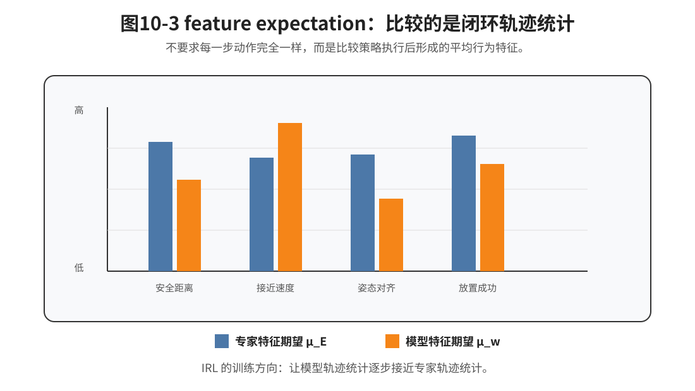
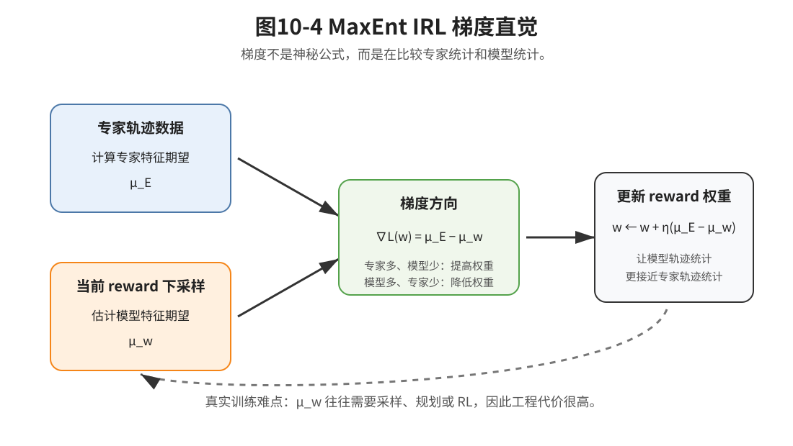

# 第10章：IRL：专家到底在优化什么

> **本章一句话导读**：第二篇已经说明策略会诱导轨迹分布，单步动作损失不能完全代表闭环任务成功。本章继续追问：专家为什么选择这些轨迹？IRL 试图从专家轨迹中反推出 reward，但 reward ambiguity 决定了这件事不是“找标准答案”，而是在学习一种能解释专家行为的偏好结构。

---

## 1. 从第二篇留下的问题出发

前面几章已经把模仿学习从“监督学习式动作拟合”推进到了“闭环序列决策”。

第一篇说明：BC 在专家数据分布上训练，但部署后策略会进入自己诱导出来的状态分布，因此会出现分布偏移和误差累积。

第二篇进一步说明：策略不是被动预测器。策略输出动作，动作改变环境，环境再返回新的状态或观测。于是策略会诱导出轨迹分布 $p_\pi(\tau)$，真正的任务成功也往往是轨迹级目标，而不是某一步动作误差。

到第9章 CVAE 时，我们又看到一个新问题：专家动作可能是多模态的。同一个状态下，向左绕、向右绕、先调整姿态再抓取，都可能是合理动作。动作不是唯一标准答案。

于是第10章要追问一个更深的问题：

> 如果专家行为不是简单的单步标签，那么专家到底在优化什么？

在机械臂抓取与放置任务中，老师傅的一条轨迹背后可能包含很多隐式偏好：

- 接近工件时不要太快；
- 夹爪闭合前姿态要对齐；
- 放入治具时宁愿慢一点，也不要硬插；
- 避免碰撞、划伤、卡死；
- 在成功率、节拍、动作平顺性之间做权衡。

BC 只问：

> 这个状态下专家动作是什么？

IRL，Inverse Reinforcement Learning，逆强化学习，问的是：

> 什么样的 reward 会让专家愿意这样做？

这就是本章的核心转变：

```text
从“专家做了什么”
→ 到“专家为什么这样做”
→ 到“什么 reward 能解释专家行为”
```

但这条路一开始就有一个大坑：同一批专家轨迹，往往可以被很多 reward 解释。这就是本章必须讲清楚的 **reward ambiguity**。


**图10-1 说明**：

- 普通 RL 的方向是：给定 reward，求一个能最大化回报的策略；
- IRL 的方向反过来：给定专家轨迹，反推什么 reward 能解释专家行为；
- IRL 得到 reward 后，通常还要通过 RL、规划或策略优化得到策略；
- 这意味着 IRL 不是单纯的监督学习，而是夹在“行为解释”和“策略学习”之间的一座桥。

---

## 2. 本章在全书数学主线中的位置

本章承接第二篇的轨迹分布主线，也承接第9章关于多模态专家动作的讨论。它不是孤立介绍 IRL 算法，而是把“动作像不像专家”推进为“专家行为背后是否存在可解释的偏好”。

```text
第二篇：策略闭环执行会诱导轨迹分布
第9章：同一状态下可能存在多种合理专家动作
第10章：IRL 追问这些专家行为背后的 reward 或偏好结构
第11章：GAIL 将绕开显式 reward，直接匹配 occupancy measure
第12章：Offline IL 将讨论离线数据覆盖与 OOD 风险
```

本章要解决的不是“IRL 有哪些算法变体”，而是以下四个问题：

1. reward 如何把单步状态—动作关系提升到轨迹级偏好？
2. 为什么从专家轨迹反推 reward 是不唯一的？
3. feature expectation 为什么能表达专家偏好？
4. maximum entropy IRL 为什么会得到“专家特征期望 - 模型特征期望”的梯度？

---

## 3. 本章核心定义

> **定义 10.1：奖励函数 reward**
>
> 奖励函数 $r(s,a)$ 是一个把状态—动作对映射为标量的函数，用于描述在状态 $s$ 下执行动作 $a$ 的好坏、偏好或任务价值。

这个定义里有两个关键词。

第一，reward 是一个 **标量函数**。它不是直接输出动作，而是给状态—动作打分。第二，reward 表达的是 **偏好**。在机械臂任务里，它可以把安全距离、动作平顺性、接触力、最终放置成功等因素压缩成一个可比较的分数。

这里要区分 reward 和前面章节反复出现的 loss。BC 的 loss 是训练时最小化的对象，例如动作误差、负对数似然或 ELBO。它回答的是：模型输出和专家标签有多接近？reward 是行为执行时希望最大化的对象。它回答的是：一段行为是否符合任务偏好？所以，loss 更偏“训练信号”，reward 更偏“行为偏好”。IRL 的问题不是直接最小化专家动作误差，而是从专家轨迹中学习一个可以解释专家行为的 reward。

> **定义 10.2：轨迹回报**
>
> 轨迹回报 $R(\tau)$ 是一条轨迹上即时 reward 的折扣累计，用于评价整段行为的质量。

直观地说，轨迹回报回答的是：这一次完整抓取、移动、放置过程总体好不好。它比单步动作误差更接近真实工程关心的任务质量。

> **定义 10.3：特征期望 feature expectation**
>
> 特征期望 $\mu(\pi)$ 是策略 $\pi$ 在闭环执行诱导出的轨迹分布下，对轨迹特征 $F(\tau)$ 的平均统计。

这里最重要的是“闭环执行诱导出的轨迹分布”。feature expectation 不是单条轨迹上的一个数，而是一批 rollout 后的平均行为统计。机械臂策略不一定每一步都和专家一模一样，但如果它在安全距离、姿态误差、接近速度、最终成功率等统计上接近专家，就说明它可能已经学到了一部分专家偏好。

> **定义 10.4：reward ambiguity**
>
> reward ambiguity 指同一批专家轨迹可能被多个不同 reward 解释，专家行为通常不能唯一确定 reward。

这个定义是本章的关键。IRL 学到的 reward 不是专家内心真实目标的唯一答案，而是一种能解释专家行为的偏好函数。

---

## 4. RL 与 IRL 的方向差异

普通 RL 的问题是：reward 已知，要求策略。

**公式 (10.1)：普通 RL 的方向**

$$r(s,a) \longrightarrow \pi^*$$

它的目标通常写成：

**公式 (10.2)：策略的期望回报目标**

$$
\begin{aligned}
J(\pi) &= \mathbb{E}_{\tau \sim p_\pi(\tau)}
\left[
\sum_{t=0}^{T}\gamma^t r(s_t,a_t)
\right]
\end{aligned}
$$

这里：

- $J(\pi)$ 是策略 $\pi$ 的期望回报；
- $p_\pi(\tau)$ 是策略 $\pi$ 和环境闭环交互诱导出的轨迹分布；
- $r(s_t,a_t)$ 是第 $t$ 步的即时奖励；
- $\gamma$ 是折扣因子；
- 求期望表示策略可能产生多条不同轨迹。

在这个设定下，最优策略可以写成：

**公式 (10.3)：最优策略定义**

$$\pi^* = \arg\max_\pi J(\pi)$$

IRL 的方向反过来。我们手里没有 reward，只有专家轨迹数据：

**公式 (10.4)：专家轨迹数据集**

$$\mathcal{D}_E = \{\tau_i^E\}_{i=1}^{N}$$

每条轨迹可以写成：

**公式 (10.5)：专家轨迹形式**

$$\tau_i^E = (s_0^i,a_0^i,s_1^i,a_1^i,\dots,s_T^i,a_T^i)$$

IRL 想学习一个 reward：

**公式 (10.6)：IRL 的方向**

$$\mathcal{D}_E \longrightarrow r(s,a)$$

让专家轨迹在这个 reward 下显得合理。

这里的“合理”很重要。它不等于专家绝对最优，也不等于世界上只有一条正确轨迹。现代 IRL 更常见的理解是：专家轨迹比随机轨迹、失败轨迹、低质量轨迹更可能来自某个高 reward 行为分布。

---

## 5. reward ambiguity：为什么专家轨迹不能唯一决定 reward

IRL 听起来很诱人：看专家怎么做，然后反推出专家的目标函数。

但数学上，这件事通常是不适定的。

### 5.1 直观例子

假设机械臂专家在放置工件时走了一条平滑轨迹。你可以用很多 reward 解释它：

- 奖励末端离目标越来越近；
- 惩罚速度突变；
- 惩罚离治具边缘太近；
- 惩罚接触力过大；
- 奖励最终放置成功；
- 同时考虑节拍、能耗和安全距离。

只看这条轨迹，很难判断专家真正最在意哪一个因素。


**图10-2 说明**：同一条专家轨迹既可以被“成功率优先”的 reward 解释，也可以被“安全边界优先”或“平顺与节拍权衡”的 reward 解释。专家轨迹只提供约束，不提供唯一真相。

### 5.2 命题 10.1：专家行为不能唯一确定 reward

> **命题 10.1：reward ambiguity**
>
> 给定有限专家轨迹数据 $\mathcal{D}_E$，通常不存在唯一的 reward $r(s,a)$ 能被这些轨迹确定。多个不同 reward 可能诱导出相同或近似相同的专家最优行为。

**证明思路**：

只要说明存在不同 reward，它们对轨迹排序或最优策略没有本质影响，就可以说明 reward 不是唯一的。

**证明**：

假设某个 reward $r(s,a)$ 可以解释专家行为。先考虑正比例缩放。

**公式 (10.7)：reward 正比例缩放**

$$r'(s,a) = \alpha r(s,a),\quad \alpha>0$$

对于任意一条轨迹 $\tau$，原 reward 下的回报是：

**公式 (10.8)：原 reward 下的轨迹回报**

$$R(\tau) = \sum_{t=0}^{T}\gamma^t r(s_t,a_t)$$

新 reward 下的回报是：

**公式 (10.9)：缩放后的轨迹回报**

$$
\begin{aligned}
R'(\tau) &= \sum_{t=0}^{T}\gamma^t r'(s_t,a_t) \\
&= \alpha\sum_{t=0}^{T}\gamma^t r(s_t,a_t) \\
&= \alpha R(\tau)
\end{aligned}
$$

因为 $\alpha>0$，所以如果轨迹 $\tau_1$ 的回报大于轨迹 $\tau_2$，那么缩放后仍然有：

**公式 (10.10)：正比例缩放不改变轨迹排序**

$$R(\tau_1)>R(\tau_2)\quad \Rightarrow \quad R'(\tau_1)>R'(\tau_2)$$

轨迹排序没有变，最优轨迹集合也不会因为正比例缩放而改变。

再考虑固定长度任务中的常数平移。

**公式 (10.11)：reward 常数平移**

$$r'(s,a) = r(s,a)+c$$

如果每条轨迹长度都是 $T+1$，且固定 horizon 与折扣因子相同，那么多出的项与轨迹内容无关：

**公式 (10.12)：平移后的轨迹回报**

$$R'(\tau)=R(\tau)+c\sum_{t=0}^{T}\gamma^t$$

由于所有轨迹都加上同一个常数，轨迹之间的排序仍然不变。

因此，仅凭专家轨迹，至少无法区分 $r(s,a)$、$\alpha r(s,a)$ 和 $r(s,a)+c$ 这类 reward。更复杂的 reward shaping 还会带来更多等价或近似等价的解释。

**适用边界**：

上面的正比例缩放结论主要说的是：在基于 $\arg\max$ 的最优行为或轨迹排序比较中，正比例缩放不改变最优轨迹集合。但在 maximum entropy 轨迹概率模型中，缩放 reward 会改变分布的尖锐程度。

例如 $p_w(\tau) \propto \exp(R_w(\tau))$。如果把所有回报乘上一个较大的正数，高 reward 轨迹的概率会更集中；如果缩放系数较小，轨迹分布会更平缓。因此这里的结论不是说“缩放前后所有概率模型完全等价”，而是说明：只看有限专家行为，reward 仍然不是唯一的。

还要注意，缩放和平移只是最容易写清楚的例子。真实任务中的 reward ambiguity 往往更复杂。同一条专家轨迹可能既可以解释为“专家更重视成功率”，也可以解释为“专家更重视安全距离”，还可以解释为“专家在平顺性和节拍之间做了折中”。这些 reward 在语义上已经不同，但仍然可能解释同一批专家轨迹。所以 reward ambiguity 的本质不是公式上差一个常数或缩放系数，而是：有限专家行为通常不足以唯一反推出专家真正关心的所有偏好。

**这个命题告诉我们什么？**

IRL 学到的 reward 不是“专家内心真实目标”的唯一答案。它更像一种可以解释专家行为的偏好函数。

**常见误解**：

不要把 IRL 理解成“把专家脑子里的真实 reward 解码出来”。专家轨迹只提供约束，不提供唯一真相。

---

## 6. 线性 reward 与 feature expectation

既然 reward 不唯一，为什么还要学 reward？

因为即使 reward 不是唯一的，它仍然可以作为行为偏好的压缩描述。为了让问题可学习，经典 IRL 常常从线性 reward 开始：

**公式 (10.13)：线性 reward**

$$r_w(s,a)=w^T f(s,a)$$

这里：

- $f(s,a)$ 是特征函数；
- $w$ 是特征权重；
- $w^T f(s,a)$ 表示把多个特征加权求和。

在这个写法里，通常可以这样理解：$f(s,a)$ 是人设计的特征，负责描述任务中哪些因素值得关注；$w$ 是 IRL 要学习的权重，负责判断这些因素各自有多重要。因此，经典线性 IRL 并不是完全自动发现 reward。它依赖工程师先提供一组有意义的特征。如果特征里没有包含“碰撞风险”或“接触力过大”，那么无论怎么学习 $w$，模型也很难把这些偏好学出来。

在机械臂任务中，$f(s,a)$ 可以包含：

- 末端到目标的距离；
- 姿态误差；
- 速度或加速度大小；
- 是否接近碰撞边界；
- 接触力是否过大；
- 是否最终放置成功。

$w$ 则表示这些因素的重要程度。比如安全距离权重大，说明策略更保守；节拍权重大，说明策略更追求速度；姿态误差权重大，说明策略更重视放置精度。

### 6.1 轨迹特征

如果单步 reward 是线性特征组合，那么一条轨迹的累计特征可以写成：

**公式 (10.14)：轨迹特征**

$$F(\tau)=\sum_{t=0}^{T}\gamma^t f(s_t,a_t)$$

对应的轨迹回报为：

**公式 (10.15)：线性 reward 下的轨迹回报**

$$R_w(\tau)=\sum_{t=0}^{T}\gamma^t r_w(s_t,a_t)$$

把 $r_w(s,a)=w^T f(s,a)$ 代入：

**公式 (10.16)：轨迹回报与轨迹特征的关系**

$$
\begin{aligned}
R_w(\tau) &= \sum_{t=0}^{T}\gamma^t w^T f(s_t,a_t) \\
&= w^T\sum_{t=0}^{T}\gamma^t f(s_t,a_t) \\
&= w^T F(\tau)
\end{aligned}
$$

这说明：在线性 reward 下，一条轨迹的得分就是权重 $w$ 和轨迹特征 $F(\tau)$ 的内积。

### 6.2 命题 10.2：线性 reward 下，策略比较可以转化为特征期望比较

> **命题 10.2：线性 reward 与特征期望**
>
> 如果 reward 写成 $r_w(s,a)=w^T f(s,a)$，那么一个策略在该 reward 下的期望回报可以写成 $w^T\mu(\pi)$。其中 $\mu(\pi)$ 是策略 $\pi$ 诱导轨迹分布下的特征期望。

**证明思路**：

先把轨迹回报写成 $w^T F(\tau)$，再对策略诱导的轨迹分布求期望。

**证明**：

定义策略 $\pi$ 的特征期望：

**公式 (10.17)：策略特征期望**

$$\mu(\pi)=\mathbb{E}_{\tau \sim p_\pi(\tau)}[F(\tau)]$$

策略的期望回报为：

**公式 (10.18)：线性 reward 下的策略期望回报**

$$
\begin{aligned}
J_w(\pi) &= \mathbb{E}_{\tau \sim p_\pi(\tau)}[R_w(\tau)] \\
&= \mathbb{E}_{\tau \sim p_\pi(\tau)}[w^T F(\tau)] \\
&= w^T\mathbb{E}_{\tau \sim p_\pi(\tau)}[F(\tau)] \\
&= w^T\mu(\pi)
\end{aligned}
$$

这就证明了：线性 reward 下，比较两个策略的期望回报，可以转化为比较它们的特征期望。



**图10-3 说明**：feature expectation 比较的不是某一步动作是否完全相同，而是策略闭环执行后形成的统计量是否接近专家，例如安全距离、接近速度、姿态对齐和放置成功率。

**这个命题告诉我们什么？**

如果专家策略和学习策略的特征期望接近，那么在很多线性 reward 下，它们的表现也会接近。

工程上，这句话非常重要。机械臂策略不一定每一步都和专家动作完全一致，但如果它在一批轨迹上的安全距离、姿态误差、速度平滑性、最终成功率等统计量接近专家，那么它可能已经学到了专家的某些行为偏好。

**常见误解**：

feature expectation 不是单条轨迹上的某个特征值，而是策略在闭环执行中诱导出的轨迹分布统计。它已经比单步动作 loss 更接近“整体行为”。

---

## 7. maximum entropy IRL：为什么要给轨迹一个概率

前面讲到，专家不一定唯一最优，人类也不总是走同一条轨迹。因此我们不希望模型只认为“最高 reward 的轨迹才可能出现”。

maximum entropy IRL 的想法是：

> reward 越高的轨迹越可能出现，但不是只有最高 reward 轨迹才可能出现。

于是引入轨迹概率模型：

**公式 (10.19)：最大熵轨迹分布**

$$p_w(\tau)=\frac{1}{Z(w)}\exp(R_w(\tau))$$

为什么这里用 $\exp(R_w(\tau))$？可以先把它理解成轨迹级 softmax。普通 softmax 会把一个分数变成概率，分数越大，概率越大；这里也是一样，只不过被打分的对象不是类别，而是一整条轨迹。使用指数形式还有一个好处：即使 reward 是负数，$\exp(R_w(\tau))$ 仍然是正数，可以作为未归一化概率权重。然后再通过 $Z(w)$ 归一化，得到合法概率分布。更深的原因来自最大熵原理：在满足专家特征统计约束的前提下，选择额外假设最少、熵最大的轨迹分布，会得到这种指数形式。本章先使用这个结论，完整直觉可以结合附录 I 阅读。

其中配分函数为：

**公式 (10.20)：配分函数**

$$Z(w)=\sum_{\tau}\exp(R_w(\tau))$$

如果轨迹空间是连续的，可以把求和理解成对所有可能轨迹的积分。本章用求和写法，是为了让推导更直观。

从工程角度看，$Z(w)$ 最大的问题不是定义，而是计算。它要求把所有可能轨迹的 $\exp(R_w(\tau))$ 加起来。在小型离散 MDP 中，可以通过动态规划类方法处理；但在连续状态、连续动作、长 horizon 的机器人任务中，几乎不可能直接枚举所有轨迹。因此，真实 IRL 方法通常需要近似估计，例如采样、规划、动态规划近似或与 RL 过程交替进行。这也是 IRL 在工程上比 BC 更重的原因之一。

**简化假设说明**：

严格来说，$p_w(\tau)$ 应该定义在环境动力学允许的可行轨迹集合上。更完整的轨迹概率通常还会包含初始状态分布、环境转移概率和策略动作概率，例如 $p(s_0)$、$P(s_{t+1}\mid s_t,a_t)$ 和 $\pi(a_t\mid s_t)$ 等因素。

本章为了突出 reward 与轨迹概率之间的关系，采用了简化写法：把环境动力学和可行轨迹约束看成背景，只保留 $\exp(R_w(\tau))$ 对轨迹概率的影响。读者需要记住：这里不是说所有数学上写出来的轨迹都可行，而是在可行轨迹集合中，高 reward 轨迹更可能出现。

这个公式可以这样读：

- $R_w(\tau)$ 越大，$\exp(R_w(\tau))$ 越大；
- 高 reward 轨迹概率更高；
- $Z(w)$ 负责把所有轨迹概率归一化；
- 不是最高 reward 的轨迹，仍然可以有非零概率。

这和机械臂示教很接近。同一个抓取任务，专家今天可以从左侧接近，明天可以从右侧接近；两条轨迹都合理，只是 reward 和概率可能不同。

---

## 8. maximum entropy IRL 的最大似然目标

有了轨迹概率模型后，就可以用专家轨迹做最大似然。

专家数据为：

**公式 (10.21)：专家轨迹数据集**

$$\mathcal{D}_E=\{\tau_i^E\}_{i=1}^{N}$$

最大似然目标是让专家轨迹在模型 $p_w(\tau)$ 下概率尽量大：

**公式 (10.22)：专家轨迹 log likelihood**

$$\mathcal{L}(w)=\sum_{i=1}^{N}\log p_w(\tau_i^E)$$

把 $p_w(\tau)$ 代入：

**公式 (10.23)：MaxEnt IRL 最大似然目标展开**

$$
\begin{aligned}
\mathcal{L}(w) &= \sum_{i=1}^{N}\log \frac{1}{Z(w)}\exp(R_w(\tau_i^E)) \\
&= \sum_{i=1}^{N}R_w(\tau_i^E)-N\log Z(w)
\end{aligned}
$$

这一步很关键。

第一项 $\sum_i R_w(\tau_i^E)$ 会鼓励专家轨迹得高分。

第二项 $N\log Z(w)$ 会惩罚“所有轨迹都被打高分”。如果没有这个归一化项，最简单的做法就是把所有 reward 都无限放大，模型就失去了区分能力。

所以 MaxEnt IRL 不是简单地说“专家轨迹 reward 越高越好”，而是说：

> 专家轨迹应该比其他可能轨迹更值得解释，但 reward 不能无约束地把所有轨迹都抬高。

---

## 9. 命题 10.3：MaxEnt IRL 梯度等于专家特征期望减模型特征期望

> **命题 10.3：MaxEnt IRL 的梯度形式**
>
> 在线性 reward $R_w(\tau)=w^T F(\tau)$ 下，maximum entropy IRL 的平均 log likelihood 梯度可以写成专家特征期望减模型特征期望。

为了让表达更清楚，定义专家特征期望：

**公式 (10.24)：专家特征期望**

$$\mu_E=\frac{1}{N}\sum_{i=1}^{N}F(\tau_i^E)$$

模型特征期望为：

**公式 (10.25)：模型特征期望**

$$\mu_w=\mathbb{E}_{\tau \sim p_w(\tau)}[F(\tau)]$$

平均 log likelihood 为：

**公式 (10.26)：平均 log likelihood**

$$\bar{\mathcal{L}}(w)=\frac{1}{N}\mathcal{L}(w)$$

那么有：

**公式 (10.27)：MaxEnt IRL 梯度形式**

$$\nabla_w \bar{\mathcal{L}}(w)=\mu_E-\mu_w$$

**证明思路**：

先对专家轨迹回报项求梯度，再对 $\log Z(w)$ 求梯度。难点只在 $\log Z(w)$ 这一项。

**证明**：

由式 (10.23) 得到：

**公式 (10.28)：平均 log likelihood 展开**

$$\bar{\mathcal{L}}(w)=\frac{1}{N}\sum_{i=1}^{N}R_w(\tau_i^E)-\log Z(w)$$

因为 $R_w(\tau)=w^T F(\tau)$，所以：

**公式 (10.29)：线性轨迹回报的梯度**

$$\nabla_w R_w(\tau)=F(\tau)$$

第一项的梯度为：

**公式 (10.30)：专家轨迹回报项的梯度**

$$\nabla_w \frac{1}{N}\sum_{i=1}^{N}R_w(\tau_i^E)=\frac{1}{N}\sum_{i=1}^{N}F(\tau_i^E)=\mu_E$$

接下来处理 $\log Z(w)$。

由配分函数定义：

**公式 (10.31)：线性 reward 下的配分函数**

$$Z(w)=\sum_{\tau}\exp(w^T F(\tau))$$

对 $Z(w)$ 求梯度：

**公式 (10.32)：配分函数的梯度**

$$\nabla_w Z(w)=\sum_{\tau}\exp(w^T F(\tau))F(\tau)$$

因此：

**公式 (10.33)：log 配分函数的梯度**

$$
\begin{aligned}
\nabla_w \log Z(w) &= \frac{1}{Z(w)}\nabla_w Z(w) \\
&= \frac{1}{Z(w)}\sum_{\tau}\exp(w^T F(\tau))F(\tau) \\
&= \sum_{\tau}\frac{\exp(w^T F(\tau))}{Z(w)}F(\tau) \\
&= \sum_{\tau}p_w(\tau)F(\tau) \\
&= \mathbb{E}_{\tau \sim p_w(\tau)}[F(\tau)] \\
&= \mu_w
\end{aligned}
$$

于是：

**公式 (10.34)：MaxEnt IRL 梯度结论**

$$\nabla_w \bar{\mathcal{L}}(w)=\mu_E-\mu_w$$

证明完成。

这里的 $\mu_E$ 和 $\mu_w$ 难度完全不同。$\mu_E$ 来自专家数据，通常只需要把专家轨迹中的特征统计出来即可。$\mu_w$ 来自当前 reward 诱导的模型轨迹分布。也就是说，每当 reward 权重 $w$ 改变，模型认为“哪些轨迹更可能”也会改变。为了估计新的 $\mu_w$，往往需要重新采样轨迹、重新规划，甚至重新做一轮策略优化。所以 IRL 的训练不是简单地算一次专家统计，而是一个 reward 学习与轨迹分布估计不断交替的过程。



**图10-4 说明**：MaxEnt IRL 的梯度可以理解成专家特征期望和模型特征期望之间的差。专家中常见、模型中不足的特征会被提高权重；模型中过度出现、专家中不常见的特征会被降低权重。

**这个命题告诉我们什么？**

MaxEnt IRL 的学习方向非常直观：

```text
如果专家轨迹中某些特征出现得更多，
而当前模型生成的轨迹中这些特征出现得更少，
就提高这些特征对应的 reward 权重。

如果当前模型过度偏好某些专家并不常见的特征，
就降低这些特征对应的 reward 权重。
```

换句话说，IRL 并不是神秘地“读懂专家内心”。它在做一件很朴素的事：让模型分布下的特征统计，逐渐接近专家数据里的特征统计。

**工程含义**：

在机械臂任务里，如果专家轨迹经常保持较大安全距离，而模型轨迹总是贴着治具边缘走，那么梯度会推动 reward 更重视安全距离。

如果专家轨迹接近目标时动作更慢，而模型轨迹总是高速冲过去，那么梯度会推动 reward 更重视接近阶段的速度控制。

**常见误解**：

不要把式 (10.34) 理解成“只要算一下专家统计和模型统计就能轻松训练 IRL”。真正困难的是模型特征期望 $\mu_w$ 通常需要从当前 reward 下采样、规划或做 RL，代价很高，而且在真实机器人中并不容易。

---

## 10. IRL 与 GAIL 的关系

到这里，本章已经说明了 IRL 的核心逻辑：

```text
专家轨迹
→ 假设存在隐藏 reward
→ 用 reward 给轨迹分配概率
→ 通过最大似然学习 reward
→ 梯度推动模型特征期望接近专家特征期望
```

但这也暴露了两个困难。

第一，reward ambiguity。专家轨迹不能唯一决定 reward，学到的 reward 只是可解释偏好之一。

第二，求解代价。MaxEnt IRL 需要估计模型分布下的特征期望 $\mu_w$，这通常意味着要在当前 reward 下进行采样、规划或策略优化。

于是第11章 GAIL 会换一个角度：

> 既然显式恢复 reward 很难，能不能直接让策略产生的状态—动作访问分布接近专家？

这里要避免一个误解：GAIL 不是简单否定 IRL，也不是说 reward 这个概念完全消失了。GAIL 更像是继承了 IRL 的分布匹配思想，但不再显式恢复一个可解释的 reward 函数。它通过判别器比较专家和策略的 occupancy measure，并把判别器信号转化为策略优化信号。因此，GAIL 可以理解为：绕开显式 reward 恢复，直接推动策略分布接近专家分布。

这就引出 occupancy measure：

**公式 (10.35)：occupancy measure 记号**

$$\rho_\pi(s,a)$$

它表示策略 $\pi$ 在闭环执行时，有多经常访问状态 $s$ 并执行动作 $a$。

IRL 试图先学 reward，再通过 reward 得到策略。GAIL 则更像是直接比较专家和学习策略的行为分布。

```text
IRL：专家轨迹 → reward → 策略
GAIL：专家状态—动作分布 ↔ 策略状态—动作分布
```

这就是第10章自然引出第11章的原因。

---

## 11. IRL 在工程中的价值与限制

### 11.1 IRL 的价值

IRL 的价值不在于它能一键替代 BC、ACT 或 Diffusion Policy，而在于它提供了一个更高层的解释视角。

它可以帮助工程师回答：

- 专家是不是在隐式惩罚危险边界？
- 专家是不是更重视平顺性，而不是最短时间？
- 不同专家风格是否对应不同 reward 权重？
- 某个失败策略到底违背了哪些任务偏好？
- 手写 reward 时，哪些项可能遗漏了？

### 11.2 IRL 的限制

真实工程里，很少把 IRL 当成万能方案，原因包括：

1. **reward 不唯一**：学到的 reward 只是解释之一；
2. **特征依赖强**：线性 reward 依赖特征设计，深度 reward 又更难解释和训练；
3. **需要环境交互或采样**：估计模型特征期望常常很贵；
4. **真实机器人试错成本高**：不能为了估计 reward 就频繁撞夹具、刮工件；
5. **上线风险大**：学到的 reward 如果在 OOD 状态下泛化错误，可能诱导危险策略。

因此，在很多机器人项目中，IRL 更适合承担三类角色：

```text
第一，帮助理解专家行为背后的偏好；
第二，辅助设计 reward、评价指标和安全约束；
第三，为 GAIL、Offline IL、后训练和策略评估提供分布与偏好视角。
```

---

## 12. 读完本章，你应该能判断什么

| 工程现象 | 应该想到的 IRL 判断 |
|---|---|
| 专家动作看起来不唯一，但都能完成任务 | 专家可能在优化同一组偏好，而不是输出唯一动作标签 |
| 学到一个 reward 后，发现另一种 reward 也能解释专家 | 这是 reward ambiguity，不是代码一定错了 |
| BC 单步误差低，但轨迹整体不安全 | 可能缺少对安全、平顺、边界等轨迹级偏好的建模 |
| 专家轨迹整体更保守，模型轨迹更激进 | 可以从特征期望角度比较安全距离、速度、接触力等统计差异 |
| MaxEnt IRL 推导中出现 $Z(w)$ | 它不是装饰项，而是让轨迹概率归一化，防止所有 reward 无限制变大 |
| IRL 训练需要不断采样当前模型轨迹 | 这是为了估计模型特征期望 $\mu_w$，也是工程成本来源 |
| 想直接把 IRL reward 上线控制机器人 | 必须谨慎，因为 reward 可能在未覆盖状态下泛化错误 |

---

## 13. 本章常见误解

| 常见误解 | 正确认识 |
|---|---|
| IRL 能恢复专家真实 reward | IRL 只能学习能解释专家行为的 reward，通常不唯一 |
| reward ambiguity 是小问题 | 它是 IRL 的核心困难之一 |
| 线性 reward 太简单，没有价值 | 线性 reward 的价值在于让 feature expectation 推导清楚，帮助理解 IRL 本质 |
| feature expectation 是单条轨迹特征 | 它是策略诱导轨迹分布下的平均特征统计 |
| MaxEnt IRL 只是加了一个熵技巧 | 它用概率方式表达专家不是唯一最优，并得到清晰的特征匹配梯度 |
| 梯度 $\mu_E-\mu_w$ 很容易算 | 专家特征容易算，模型特征通常需要采样、规划或 RL，工程代价很高 |
| IRL 比 BC 一定更适合机器人 | IRL 更解释性，但训练和部署成本更高，不能替代强 baseline |
| reward 缩放完全没有影响 | 缩放不改变 argmax 排序，但会影响 MaxEnt 概率分布的尖锐程度 |
| GAIL 完全不需要 reward 概念 | GAIL 绕开显式 reward 恢复，但判别器信号仍会转化为策略优化信号 |

---

## 14. 本章公式主线回顾

本章公式主线如下：

```text
第二篇已有轨迹分布 p_pi(tau)
→ 引入 reward r(s,a)
→ 一条轨迹的回报 R(tau)=sum_t gamma^t r(s_t,a_t)
→ IRL 希望找到 reward，使专家策略在该 reward 下表现得合理
→ 但 reward 不唯一，出现 reward ambiguity
→ 为了让 reward 可学习，常用线性 reward r_w(s,a)=w^T f(s,a)
→ 线性 reward 下，策略比较可以转化为 feature expectation 比较
→ MaxEnt IRL 用 p_w(tau) ∝ exp(R_w(tau)) 描述专家轨迹概率
→ 最大似然梯度变成 expert feature expectation - model feature expectation
→ 第11章自然转向：既然 reward 难恢复，能不能直接匹配 occupancy measure？
```

回看这一章时，不要只把公式当成 IRL 的技术细节。更重要的是看清楚：reward、feature expectation 和 maximum entropy 这三个对象，是怎样一步步把“模仿动作”推进到“解释专家偏好”的。

---

## 15. 本章公式索引

### 公式 (10.2)：策略的期望回报目标

$$
\begin{aligned}
J(\pi) &= \mathbb{E}_{\tau \sim p_\pi(\tau)}
\left[
\sum_{t=0}^{T}\gamma^t r(s_t,a_t)
\right]
\end{aligned}
$$

- **含义**：策略的好坏不是由某一步动作误差决定，而是由闭环执行诱导出的轨迹分布上的累计 reward 决定。
- **需要掌握到什么程度**：理解 $p_\pi(\tau)$ 是策略和环境交互产生的轨迹分布，这是 IRL 从“动作标签”转向“轨迹偏好”的前提。

### 公式 (10.13)：线性 reward

$$r_w(s,a)=w^T f(s,a)$$

- **含义**：把状态—动作特征加权求和，得到即时 reward。
- **需要掌握到什么程度**：理解 $w$ 表示偏好权重，$f(s,a)$ 表示任务相关特征；线性 reward 是 feature expectation 推导成立的关键前提。

### 公式 (10.17)：策略特征期望

$$\mu(\pi)=\mathbb{E}_{\tau \sim p_\pi(\tau)}[F(\tau)]$$

- **含义**：策略闭环执行后，在轨迹分布上平均访问到的特征统计。
- **需要掌握到什么程度**：理解它不是单条轨迹特征，而是一批 rollout 的统计量；它比单步动作 loss 更接近整体行为质量。

### 公式 (10.19)：最大熵轨迹分布

$$p_w(\tau)=\frac{1}{Z(w)}\exp(R_w(\tau))$$

- **含义**：reward 越高的轨迹概率越大，但不是只有最高 reward 轨迹才有概率。
- **需要掌握到什么程度**：理解这是简化写法，真实轨迹概率还受初始状态、动力学和可行轨迹集合约束；本章重点看 reward 如何影响轨迹概率。

### 公式 (10.27)：MaxEnt IRL 梯度形式

$$\nabla_w \bar{\mathcal{L}}(w)=\mu_E-\mu_w$$

- **含义**：学习 reward 的方向，是让模型特征期望接近专家特征期望。
- **需要掌握到什么程度**：理解专家特征期望容易从数据算，模型特征期望通常需要采样、规划或 RL，因此这是 IRL 的工程成本来源。

### 其他公式

- 公式 (10.1)：普通 RL 的方向：给定 reward 求策略。
- 公式 (10.3)：最优策略定义。
- 公式 (10.4)：专家轨迹数据集。
- 公式 (10.5)：专家轨迹形式。
- 公式 (10.6)：IRL 的方向：从专家数据反推 reward。
- 公式 (10.7)—(10.12)：reward ambiguity 的缩放与平移说明。
- 公式 (10.14)—(10.16)：轨迹特征与线性轨迹回报。
- 公式 (10.18)：线性 reward 下的策略期望回报。
- 公式 (10.20)—(10.23)：maximum entropy IRL 的配分函数与最大似然目标。
- 公式 (10.24)—(10.34)：MaxEnt IRL 梯度完整推导。
- 公式 (10.35)：occupancy measure，为第11章铺垫。

---

## 16. 本章定义索引

| 编号 | 概念 | 一句话含义 |
|---|---|---|
| 定义 10.1 | 奖励函数 reward | 把状态—动作对映射为标量，用于表达偏好或任务价值 |
| 定义 10.2 | 轨迹回报 | 一条轨迹上即时 reward 的折扣累计，用于评价整段行为质量 |
| 定义 10.3 | 特征期望 | 策略诱导轨迹分布下的平均轨迹特征统计 |
| 定义 10.4 | reward ambiguity | 同一批专家轨迹可能被多个不同 reward 解释 |

---

## 17. 建议阅读的附录条目

- 附录 B：概率论最小生存包。建议复习随机变量、概率分布、期望和条件概率，用来理解 $p_\pi(\tau)$、$p_w(\tau)$ 和 $\mathbb{E}[\cdot]$。
- 附录 C：最大似然、负对数似然、交叉熵与 KL 散度。建议结合本章第8节理解为什么要最大化专家轨迹 likelihood。
- 附录 F：强化学习与序列决策基础。建议复习 MDP、回报、策略和轨迹分布，用来理解 IRL 为什么学到 reward 后还常常需要策略优化。
- 附录 I：熵、最大熵与 Score Matching。建议用于理解 maximum entropy 为什么会出现在 IRL 中，以及为什么会得到指数形式的轨迹分布。

---

## 18. 思考题

1. 如果专家轨迹全部成功，但没有任何失败轨迹，为什么仍然很难唯一确定 reward？
2. 在机械臂放置任务中，如果专家动作更慢但更稳定，你会设计哪些特征来表达这种偏好？
3. 为什么 feature expectation 比单步动作误差更接近“整体行为质量”？它又有什么局限？
4. 在 MaxEnt IRL 中，为什么 $Z(w)$ 不能简单删掉？如果删掉，会导致什么训练问题？
5. 如果一个学到的 reward 在线下回放中解释得很好，但上线后诱导策略贴近危险边界，可能说明训练数据或 reward 泛化出了什么问题？
6. 第11章 GAIL 试图绕开显式 reward，直接匹配 occupancy measure。你认为它解决了 reward ambiguity 吗？还是绕开了其中一部分问题？

---

## 19. 本章配图清单

| 图号 | 文件 | 作用 |
|---|---|---|
| 图10-1 | `图10-1_RL与IRL方向对比图.png` | 对比 RL 与 IRL 的问题方向 |
| 图10-2 | `图10-2_reward_ambiguity示例图.svg` | 说明同一条专家轨迹可以被多种 reward 解释 |
| 图10-3 | `图10-3_feature_expectation对比图.svg` | 说明 feature expectation 比较的是闭环轨迹统计 |
| 图10-4 | `图10-4_MaxEnt_IRL梯度直觉图.svg` | 解释 $\mu_E-\mu_w$ 作为 MaxEnt IRL 梯度的工程直觉 |

---

## 20. 本章小结：为什么下一章是 GAIL

本章完成了三件事。

第一，它把模仿学习从“专家动作标签”推进到了“专家偏好解释”。reward $r(s,a)$ 让我们可以讨论专家为什么偏好某些轨迹。

第二，它说明了 reward ambiguity。专家轨迹不能唯一确定 reward，IRL 学到的是一种可解释偏好，不是专家内心真实目标的唯一答案。

第三，它推导了 feature expectation 和 MaxEnt IRL 梯度。这个推导告诉我们：IRL 的核心不是玄学，而是让模型分布下的特征统计接近专家特征统计。

但问题也随之出现：如果 reward 难以唯一恢复，估计模型特征期望又需要昂贵的采样或策略优化，那么能不能绕开显式 reward，直接比较专家和策略的行为分布？

这就自然进入第11章：GAIL。
