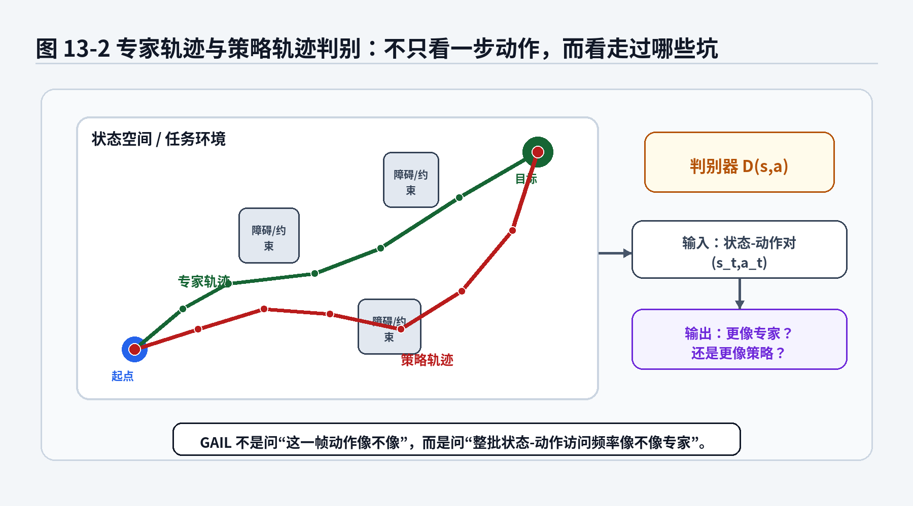
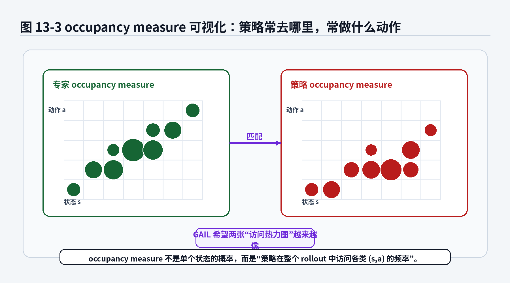
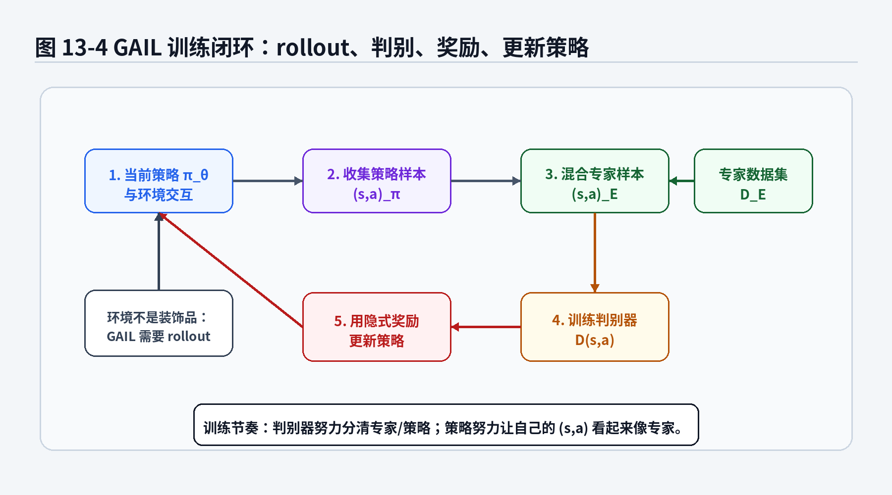

# 第11章：GAIL：从判别器里偷一个奖励函数

> **新版布局位置**：本章属于 **第三篇：经典模仿学习的分布匹配与奖励视角**。本章编号、公式编号与交叉引用已按新版八篇结构统一调整。


> **本章一句话导读**：本章用判别器和 occupancy measure 解释 GAIL 如何绕过显式 reward，直接匹配专家与策略的行为分布。


> 前面几章，我们一直在问：给定观测，模型应该输出什么动作？BC 输出单步动作，ACT 输出动作块，Diffusion Policy 从噪声里生成动作块。第11章开始，我们换一个问法：如果不直接盯着专家每一步动作，而是比较“专家通常走到哪些状态、做哪些动作”，能不能也学出一个像专家的策略？GAIL 的回答是：可以。它把判别器请进训练现场，让判别器分辨专家轨迹和策略轨迹，再把判别器的反馈当作一种隐式奖励，逼着策略越来越像专家。

---

## 1. 本章开场：从“模仿动作”到“混进专家队伍”

到第16章为止，我们的主线基本是这样的：

> 专家在某个观测下做了动作，模型也要学着做类似动作。

这条路线很自然，也很工程友好。你采集遥操作数据，得到一堆 \$o_t,a_t\$，然后训练模型从 \$o_t\$ 预测 \$a_t\$。

可是，真实行为有时不是靠单步动作相似就能描述的。

想象一个移动机器人在仓库里绕过障碍去取货。专家可能不是每一步都和某个固定动作完全一致，而是整体上表现出一种习惯：

- 不贴着障碍物边缘走；
- 不突然大幅转向；
- 在狭窄通道里提前减速；
- 接近目标时姿态逐渐对齐；
- 遇到动态障碍时宁愿绕远，也不硬挤。

如果只做 BC，我们会问：

> 在这个状态下，专家动作是多少？

而 GAIL 更像是在问：

> 你这整套行为，看起来像不像专家干的？

这两个问题的味道完全不同。

BC 像老师批改填空题：这一空应该填多少，你填错了就扣分。GAIL 像门卫看工牌和气质：你走路姿态、出入路线、操作习惯都不像老员工，那你大概率不是本厂老师傅。

这就是 GAIL 的核心转变：

> 不再只比较单个动作，而是匹配专家策略和学习策略在状态—动作空间中的整体访问分布。

这个“整体访问分布”就是本章最重要的数学对象：

<div class="math">\[
\rho_\pi(s,a) \tag{11.1}\]</div>

它叫 **occupancy measure**，可以先粗略理解为：

> 策略 \$\pi\$ 在闭环执行时，有多经常访问状态 \$s\$，并在该状态下执行动作 \$a\$。

如果学习策略和专家策略的 \$\rho_\pi(s,a)\$ 很接近，那么它们不只是单步动作像，而是整个行为分布像。GAIL 就是围绕这个想法展开的。


**图11-1 说明**：
- 普通 GAN 让生成图片的分布越来越像真实图片；
- GAIL 让策略 rollout 产生的状态—动作分布越来越像专家轨迹；
- 判别器不是直接输出动作，而是判断某个 \$(s,a)\$ 更像来自专家还是来自当前策略；
- 策略再利用判别器反馈更新自己，好让下一轮 rollout 更难被识别出来。

---

## 2. 本章要解决的核心问题

本章围绕以下 16 个问题展开：

1. 为什么从第11章开始，我们要从“动作监督学习”转向“行为分布匹配”？
2. occupancy measure \$\rho_\pi(s,a)\$ 到底表示什么？
3. 为什么 occupancy measure 比单步动作更接近闭环行为？
4. GAIL 为什么长得像 GAN？
5. GAIL 中的判别器 \$D(s,a)\$ 在分辨什么？
6. GAIL 的 min-max 目标为什么是一个对抗训练目标？
7. 判别器输出如何变成策略更新时的隐式奖励？
8. 熵正则 \$H(\pi)\$ 在 GAIL 中为什么重要？
9. GAIL 和 Behavior Cloning 的根本区别是什么？
10. GAIL 和 ACT / Diffusion Policy 的关系是什么？
11. 为什么 GAIL 通常需要环境交互或仿真 rollout？
12. 为什么 GAIL 在真实机器人上不一定好用？
13. GAIL 适合哪些任务，不适合哪些任务？
14. GAIL 训练为什么可能不稳定？
15. 工程上如何给 GAIL 设计安全边界和调试指标？
16. GAIL 如何把我们带向下一章 IRL：专家到底在优化什么？

本章会反复使用以下符号：

- 状态：\$s\$；
- 动作：\$a\$；
- 学习策略：\$\pi_\theta(a|s)\$；
- 专家策略：\$\pi_E(a|s)\$；
- 策略诱导的状态—动作访问分布：\$\rho_\pi(s,a)\$；
- 判别器：\$D_\omega(s,a)\$；
- 策略熵：\$H(\pi)\$；
- 折扣因子：\$\gamma\$；
- GAIL 目标：\$\min_\pi\max_D\$ 的对抗优化。

这里先提醒一句：GAIL 的公式容易因为“判别器输出的是专家概率还是策略概率”而出现符号差异。本章采用和目录中一致的约定：

> \$D(s,a)\$ 表示判别器认为 \$(s,a)\$ 来自当前策略 \$\pi\$ 的概率。

在这个约定下，策略样本标签是 1，专家样本标签是 0。如果你读到某些论文或代码中把 \$D(s,a)\$ 定义成“来自专家的概率”，那么 \$\log D\$、\$\log(1-D)\$ 和奖励表达式会对调。不要被符号吓到，先看它到底在给谁贴标签。

---


### 主线定位与统一例子

为了让本章不变成孤立知识点，读本章时请始终把公式落回两个统一例子：

- **二维点机器人跟随专家轨迹**：状态可写成位置/速度，动作可写成二维控制量，适合观察状态分布、轨迹分布和误差累积。
- **机械臂末端运动/抓取轨迹模仿**：观测包含图像或本体状态，动作包含末端位姿增量或关节控制量，适合理解连续动作、多模态动作、动作块和实机闭环。

- **承接前文**：承接第6章轨迹分布和第16章策略表达。
- **本章推进**：从判别器角度解释如何直接匹配专家与策略的 occupancy measure。
- **铺垫后文**：第10章会回到 IRL，补上“奖励/偏好”视角，帮助理解 GAIL 背后的另一条历史线。
- **公式阅读抓手**：GAIL 的判别器区分的是专家与策略产生的状态-动作占用，而不只是某个单步动作是否像。
- **建议同步回看**：附录 C、F、I。

## 3. 直觉解释：GAIL 到底想干什么

### 3.1 BC 的问题：只看局部作业，没看整体行为

BC 的训练数据通常是：

<div class="math">\[
\mathcal{D}_E=\{(s_i,a_i)\}_{i=1}^N \tag{11.2}\]</div>

训练目标是让模型在这些专家状态上输出专家动作。

这当然有用。第2章到第16章已经证明，BC 是模仿学习最重要的 baseline，没有之一。很多真实项目如果 BC 都跑不起来，直接上更复杂方法通常不是升级，而是把 bug 包装成研究方向。

但 BC 有一个限制：

> 它主要比较专家数据中出现过的单步输入输出关系。

假设专家开车过弯，会提前减速、轻打方向、保持车身姿态平顺。BC 可以学习每个时刻的动作，但它不一定直接关心：

- 整段轨迹是否平顺；
- 是否经常进入危险边界；
- 是否整体遵循某种驾驶风格；
- 是否在闭环执行中访问了专家从不访问的状态。

第3章讲过，一旦策略开始闭环执行，它看到的状态分布可能不再是专家数据里的状态分布。BC 在专家状态上像专家，不代表它在自己制造出来的状态上还能像专家。

GAIL 的想法是：

> 既然闭环执行时真正重要的是策略访问哪些状态、执行哪些动作，那我们就直接匹配这件事。

### 3.2 GAIL 的问题：你这行为分布像不像专家？

GAIL 不只拿专家数据训练一个 \$s\to a\$ 的监督模型。它会让当前策略 \$\pi_\theta\$ 在环境里 rollout，产生自己的状态—动作样本：

<div class="math">\[
(s_0,a_0),(s_1,a_1),\dots,(s_T,a_T) \tag{11.3}\]</div>

然后，把这些策略样本和专家样本混在一起，交给判别器：

<div class="math">\[
D_\omega(s,a) \tag{11.4}\]</div>

判别器的任务是分辨：

> 这个 \$(s,a)\$ 是专家做出来的，还是当前策略做出来的？

如果判别器很容易分辨，说明学习策略和专家差得远。比如专家总是绕开障碍，策略总往障碍边缘蹭；专家接近目标时平滑减速，策略一脚油门一脚刹车，像刚拿驾照又喝了三杯咖啡。

如果判别器分不清，说明策略产生的状态—动作对和专家越来越像。

于是 GAIL 形成了一个对抗过程：

- 判别器努力变聪明：分清专家样本和策略样本；
- 策略努力变像专家：让判别器分不出来。

这就是 GAIL 名字里的 adversarial。

### 3.3 判别器不是奖励函数，但可以“临时冒充”奖励函数

强化学习通常需要 reward。问题是模仿学习场景里，我们只有专家演示，没有人工设计好的奖励函数。

GAIL 的妙处在于：

> 判别器虽然不是传统意义上的 reward，但它告诉我们“当前策略行为离专家有多远”。

如果某些 \$(s,a)\$ 很容易被判别器识别为策略样本，说明这些行为不像专家；如果某些 \$(s,a)\$ 能骗过判别器，说明它们更像专家。于是我们可以把判别器输出转换成策略更新时的奖励信号。

这有点像公司没有明确 KPI，但有个很会挑刺的老师傅站在旁边：

- 你这么操作，一看就是新手；
- 这个绕行路线还行，有点老师傅味道；
- 这个急停太猛，别说专家了，连设备都想报警。

老师傅没有写出完整 reward 公式，但他的判断会塑造你的行为。GAIL 的判别器就扮演了这个角色。



**图11-2 说明**：
- 专家轨迹和策略轨迹可能都能到目标，但访问的中间状态和动作习惯不同；
- 判别器输入的是状态—动作对 \$(s,a)\$，输出它更像专家还是更像策略；
- GAIL 关心的是整体行为分布，而不是单步动作是否逐帧重合；
- 如果策略经常访问专家不会访问的危险区域，判别器会更容易把它识别出来。

---

## 4. occupancy measure：策略在世界里留下的脚印

### 4.1 先用人话理解 occupancy measure

occupancy measure 是本章的数学主角。这个词看起来有点抽象，可以拆开理解。

occupancy 有“占用、访问、停留”的意思。measure 可以理解为“度量”或“分布式计数”。放到模仿学习里，occupancy measure 关心的是：

> 一个策略在执行过程中，多经常出现在某个状态，并在那个状态下做某个动作。

如果我们只看状态，就是状态访问分布；如果同时看状态和动作，就是状态—动作访问分布。

举一个仓库机器人导航例子。专家策略通常会：

- 高频访问通道中间区域；
- 低频访问靠近货架边缘的区域；
- 在转角处做小角度转向；
- 很少做急转或原地乱转。

一个坏策略可能会：

- 经常贴着障碍物走；
- 在通道边缘左右摇摆；
- 到目标附近才突然大幅修正；
- 偶尔进入专家从不进入的危险区域。

这两个策略即使在某些单步状态上动作接近，它们的整体 occupancy measure 也会不同。

### 4.2 轨迹、策略和 occupancy measure 的关系

第5章我们讲过，策略 \$\pi\$ 不是孤零零的函数。策略放进环境后，会诱导出一批轨迹：

<div class="math">\[
\tau=(s_0,a_0,s_1,a_1,\dots,s_T,a_T) \tag{11.5}\]</div>

这些轨迹会告诉我们策略真正访问了哪些地方。occupancy measure 就是把许多 rollout 中的访问情况统计起来。

如果某个 \$(s,a)\$ 经常出现在策略 rollout 中，那么 \$\rho_\pi(s,a)\$ 就大；如果从来不出现，\$\rho_\pi(s,a)\$ 就接近 0。

这和第3章的分布偏移关系很紧：

- BC 训练时主要看到专家诱导的分布 \$\rho_{\pi_E}(s,a)\$；
- 策略执行时访问的是自己诱导的分布 \$\rho_{\pi_\theta}(s,a)\$；
- 如果两者差异很大，闭环就容易出问题。

GAIL 的目标就是让这两个分布接近：

<div class="math">\[
\rho_{\pi_\theta}(s,a) \approx \rho_{\pi_E}(s,a) \tag{11.6}\]</div>

### 4.3 occupancy measure 的一个常见定义

在折扣无限时域 MDP 中，常见的 discounted occupancy measure 可以写成：

<div class="math">\[
\rho_\pi(s,a)
=
\sum_{t=0}^{\infty}
\gamma^t
P(s_t=s,a_t=a|\pi) \tag{11.7}\]</div>

有些教材或论文会在前面乘上 \$(1-\gamma)\$，写成归一化版本：

<div class="math">\[
\rho_\pi(s,a)
=
(1-\gamma)
\sum_{t=0}^{\infty}
\gamma^t
P(s_t=s,a_t=a|\pi) \tag{11.8}\]</div>

两种写法表达的是同一个核心思想：

> 按时间折扣统计策略访问某个状态—动作对的频率。

是否乘 \$(1-\gamma)\$ 主要影响归一化尺度，不改变我们在本章需要掌握的直觉。

### 公式拆解：occupancy measure 到底在数什么？

公式：

<div class="math">\[
\rho_\pi(s,a)
=
\sum_{t=0}^{\infty}
\gamma^t
P(s_t=s,a_t=a|\pi) \tag{11.9}\]</div>

它要解决的问题：

我们想描述一个策略在闭环执行中整体上会访问哪些状态—动作对，而不是只描述某一个时刻的动作预测误差。

符号解释：

- \$\rho_\pi(s,a)\$：策略 \$\pi\$ 的状态—动作访问度量；
- \$s\$：某个状态；
- \$a\$：某个动作；
- \$t\$：时间步；
- \$\gamma\$：折扣因子，通常满足 \$0<\gamma<1\$；
- \$P(s_t=s,a_t=a|\pi)\$：在策略 \$\pi\$ 控制下，第 \$t\$ 步访问状态 \$s\$ 并执行动作 \$a\$ 的概率；
- \$\sum_{t=0}^{\infty}\$：把所有时间步上的访问概率累加起来；
- \$\gamma^t\$：越靠后的时间步权重越小。

直觉理解：

这个式子像是在给策略做“行动热力图”。如果策略经常在某类状态下执行某类动作，对应位置的热度就高；如果策略很少访问，对应位置的热度就低。

工程含义：

在机器人任务中，单步动作误差低不一定代表行为安全。一个策略可能在训练集状态上动作接近专家，但闭环时经常进入专家没有访问过的边界区域。occupancy measure 可以表达这种整体行为差异。

常见误解：

不要把 \$\rho_\pi(s,a)\$ 简单理解为“某一个状态下动作的概率”。它不是单步条件策略 \$\pi(a|s)\$，而是策略和环境交互后形成的整体访问分布。\$\pi(a|s)\$ 只描述“在状态 \$s\$ 下怎么选动作”；\$\rho_\pi(s,a)\$ 还包含“这个策略会不会经常来到状态 \$s\$”。



**图11-3 说明**：
- 每个格子可以理解为某类状态—动作对；
- 颜色或圆点越大，表示策略越经常访问该状态—动作组合；
- GAIL 希望专家和策略的访问热力图越来越像；
- 这比只比较单个 \$a_t\$ 更接近闭环执行时的行为质量。

---

## 5. 判别器：GAIL 里的“行为鉴定师”

### 5.1 判别器输入和输出

GAIL 的判别器写作：

<div class="math">\[
D_\omega(s,a) \tag{11.10}\]</div>

其中：

- \$\omega\$：判别器参数；
- 输入 \$(s,a)\$：一个状态—动作对；
- 输出：一个 0 到 1 之间的数。

按照本章约定：

<div class="math">\[
D_\omega(s,a)\approx 1 \tag{11.11}\]</div>

表示判别器认为这个 \$(s,a)\$ 更像来自当前策略；

<div class="math">\[
D_\omega(s,a)\approx 0 \tag{11.12}\]</div>

表示判别器认为这个 \$(s,a)\$ 更像来自专家。

这和普通二分类很像。不同之处在于，这个二分类器不是最后目的。我们不是为了得到一个很会挑毛病的判别器，然后把它挂墙上当荣誉证书。判别器的真正价值在于给策略提供训练信号。

### 5.2 判别器目标：分清专家和策略

在本章约定下，判别器希望最大化：

<div class="math">\[
\mathcal{L}_D(\omega)
=
\mathbb{E}_{(s,a)\sim \rho_{\pi}}
[\log D_\omega(s,a)]
+
\mathbb{E}_{(s,a)\sim \rho_{\pi_E}}
[\log(1-D_\omega(s,a))] \tag{11.13}\]</div>

这个式子看起来像普通二分类的对数似然。

第一项：

<div class="math">\[
\mathbb{E}_{(s,a)\sim \rho_{\pi}}
[\log D_\omega(s,a)] \tag{11.14}\]</div>

意思是：对当前策略产生的样本，希望 \$D_\omega(s,a)\$ 越接近 1 越好。

第二项：

<div class="math">\[
\mathbb{E}_{(s,a)\sim \rho_{\pi_E}}
[\log(1-D_\omega(s,a))] \tag{11.15}\]</div>

意思是：对专家样本，希望 \$D_\omega(s,a)\$ 越接近 0 越好。

如果判别器做得好，它就像一个经验丰富的质检员：看一眼动作习惯，就知道“这不像老员工干的”。

### 公式拆解：判别器为什么是交叉熵二分类？

公式：

<div class="math">\[
\max_\omega
\mathbb{E}_{\rho_{\pi}}
[\log D_\omega(s,a)]
+
\mathbb{E}_{\rho_{\pi_E}}
[\log(1-D_\omega(s,a))] \tag{11.16}\]</div>

它要解决的问题：

训练一个判别器，让它区分状态—动作对来自当前策略还是专家策略。

符号解释：

- \$\max_\omega\$：调整判别器参数，让分类目标变大；
- \$\rho_\pi\$：当前策略产生的状态—动作分布；
- \$\rho_{\pi_E}\$：专家产生的状态—动作分布；
- \$D_\omega(s,a)\$：判别器认为样本来自当前策略的概率；
- \$\log D_\omega(s,a)\$：当策略样本被判断为策略样本时获得较高值；
- \$\log(1-D_\omega(s,a))\$：当专家样本被判断为专家样本时获得较高值。

直觉理解：

判别器做的事情和二分类类似：策略样本标 1，专家样本标 0。它越能区分两类样本，目标值越高。

工程含义：

如果判别器准确率长期接近 50%，有两种可能：策略已经非常像专家，判别器分不出来；也可能是判别器太弱、数据太噪、训练没收敛。所以不能只看判别器准确率，需要同时看 rollout 成功率、轨迹质量、安全指标和状态覆盖。

常见误解：

不要以为判别器越强越好。判别器如果过强，很快把策略样本全部识别出来，给策略的梯度信号可能变差；判别器如果太弱，又无法提供有效反馈。对抗训练的难点就在这里：两个学生互相卷，一个太强或太弱都不舒服。

### 5.3 最优判别器长什么样

为了理解 GAIL 在匹配什么，我们可以看固定策略 \$\pi\$ 时，最优判别器大概会是什么形状。

对于某个具体的状态—动作对 \$(s,a)\$，判别器面对两种“样本来源密度”：

- 当前策略的访问密度：\$\rho_\pi(s,a)\$；
- 专家策略的访问密度：\$\rho_{\pi_E}(s,a)\$。

在本章约定下，最优判别器可以写成：

<div class="math">\[
D^*(s,a)
=
\frac{\rho_\pi(s,a)}
{\rho_\pi(s,a)+\rho_{\pi_E}(s,a)} \tag{11.17}\]</div>

这个公式的意思很朴素：

- 如果某个 \$(s,a)\$ 几乎只由当前策略访问，\$\rho_\pi\$ 大、\$\rho_{\pi_E}\$ 小，那么 \$D^*(s,a)\$ 接近 1；
- 如果某个 \$(s,a)\$ 几乎只由专家访问，\$\rho_\pi\$ 小、\$\rho_{\pi_E}\$ 大，那么 \$D^*(s,a)\$ 接近 0；
- 如果两者访问频率差不多，判别器就会犹豫，输出接近中间值。

### 公式拆解：最优判别器为什么反映两个 occupancy measure 的相对大小？

公式：

<div class="math">\[
D^*(s,a)
=
\frac{\rho_\pi(s,a)}
{\rho_\pi(s,a)+\rho_{\pi_E}(s,a)} \tag{11.18}\]</div>

它要解决的问题：

当策略固定时，判别器最合理的分类概率应该由“这个状态—动作对更常来自谁”决定。

符号解释：

- 分子 \$\rho_\pi(s,a)\$：当前策略访问该状态—动作对的强度；
- 分母 \$\rho_\pi(s,a)+\rho_{\pi_E}(s,a)\$：当前策略和专家策略访问强度之和；
- 比值：当前策略访问强度在总访问强度中的占比。

直觉理解：

如果你在工厂门口观察一类操作姿态，发现 90% 都是新员工做出来的，10% 是老师傅做出来的，那么看到这种姿态时，你自然会更倾向判断它来自新员工。判别器就是在做类似判断。

工程含义：

判别器真正比较的是状态—动作分布的重叠情况。策略越像专家，两者 occupancy measure 越接近，判别器越难区分。

常见误解：

这个公式不是要求我们显式计算 \$\rho_\pi\$ 和 \$\rho_{\pi_E}\$。真实高维机器人任务里，直接精确计算它们通常不现实。GAIL 用判别器绕开了显式密度估计，通过样本训练来间接比较两个分布。

---

## 6. GAIL 目标：策略和判别器互相“斗法”

### 6.1 完整目标

GAIL 的经典目标可以写成：

<div class="math">\[
\min_\pi \max_D
\mathbb{E}_{\pi}[\log D(s,a)]
+
\mathbb{E}_{\pi_E}[\log(1-D(s,a))]
-
\lambda H(\pi) \tag{11.19}\]</div>

这个式子就是目录里给出的核心公式。本章仍然采用：\$D(s,a)\$ 表示“来自当前策略”的概率。

我们先把它拆成三块。

第一块：

<div class="math">\[
\max_D
\mathbb{E}_{\pi}[\log D(s,a)]
+
\mathbb{E}_{\pi_E}[\log(1-D(s,a))] \tag{11.20}\]</div>

这是判别器任务：分清策略样本和专家样本。

第二块：

<div class="math">\[
\min_\pi
\mathbb{E}_{\pi}[\log D(s,a)] \tag{11.21}\]</div>

这是策略任务：让自己产生的样本不容易被判别器识别为策略样本。因为 \$D(s,a)\$ 越小，判别器越认为它像专家；策略最小化 \$\log D(s,a)\$，就会推动自己往专家分布靠近。

第三块：

<div class="math">\[
-\lambda H(\pi) \tag{11.22}\]</div>

由于整体对 \$\pi\$ 是最小化，减去熵项等价于鼓励策略保持一定随机性，避免过早坍缩到单一动作模式。

### 公式拆解：GAIL min-max 目标在优化什么？

公式：

<div class="math">\[
\min_\pi \max_D
\mathbb{E}_{\pi}[\log D(s,a)]
+
\mathbb{E}_{\pi_E}[\log(1-D(s,a))]
-
\lambda H(\pi) \tag{11.23}\]</div>

它要解决的问题：

在没有显式 reward 的情况下，通过对抗训练让学习策略的 occupancy measure 接近专家策略的 occupancy measure。

符号解释：

- \$\min_\pi\$：优化策略，让策略行为更像专家；
- \$\max_D\$：优化判别器，让它更擅长区分策略样本和专家样本；
- \$\mathbb{E}_\pi[\log D(s,a)]\$：对当前策略 rollout 得到的样本取平均；
- \$\mathbb{E}_{\pi_E}[\log(1-D(s,a))]\$：对专家样本取平均；
- \$H(\pi)\$：策略熵，描述策略随机性；
- \$\lambda\$：熵正则强度。

直觉理解：

判别器像考官，策略像考生。考官不断升级题目，试图区分“真专家”和“假专家”；策略不断调整行为，试图混进专家队伍。最终目标不是让判别器永远赢，而是让策略行为越来越像专家，使判别器分不清。

工程含义：

GAIL 不是普通监督学习。它需要策略和环境交互，产生新的 rollout，再训练判别器，再更新策略。这个闭环训练方式让它能关注策略访问的状态分布，但也带来训练成本、稳定性和安全问题。

常见误解：

GAIL 不是“用 GAN 生成动作序列”这么简单。它的生成者不是直接输出图片的 generator，而是一个会和环境交互的 policy。policy 的输出经过环境动力学，形成轨迹和 occupancy measure。环境这一步不能随便忽略，否则就把 GAIL 理解成了普通序列生成器。

### 6.2 为什么这个目标会逼近 occupancy matching

如果判别器足够强，它会根据 \$\rho_\pi\$ 和 \$\rho_{\pi_E}\$ 的差异来分类。策略为了骗过判别器，就必须让自己产生的 \$(s,a)\$ 分布接近专家。

换句话说，GAIL 实际上在推动：

<div class="math">\[
\rho_\pi(s,a)
\rightarrow
\rho_{\pi_E}(s,a) \tag{11.24}\]</div>

这就是它和 BC 的关键区别。

BC 学的是：

<div class="math">\[
\pi_\theta(a|s)
\approx
\pi_E(a|s)
\quad
\text{on expert states} \tag{11.25}\]</div>

GAIL 更关注：

<div class="math">\[
\rho_{\pi_\theta}(s,a)
\approx
\rho_{\pi_E}(s,a)
\quad
\text{under rollout} \tag{11.26}\]</div>

第一个式子偏向“专家状态上的动作匹配”，第二个式子偏向“闭环执行中的访问分布匹配”。这就是 GAIL 在数学视角上的升级。

### 6.3 GAIL 和 JS divergence 的关系

在 GAN 里，如果判别器达到最优，生成器的训练和分布之间的 Jensen-Shannon divergence 有关系。GAIL 也有类似直觉：通过判别器区分两个 occupancy measure，策略更新会推动两者距离变小。

你不需要在第一次学习 GAIL 时把所有 divergence 推导背下来，但要记住一个方向：

> 判别器越能区分两个分布，说明它们差异越大；策略越能骗过判别器，说明它们越来越接近。

这也是为什么本章建议配合附录 C 阅读交叉熵、KL 和对抗目标。分布距离不是口号，背后有概率分类和密度比估计的数学关系。

---

## 7. 隐式奖励：从判别器输出到策略更新

### 7.1 GAIL 为什么还需要 RL 算法

GAIL 的策略不是直接通过监督学习更新。它需要在环境中 rollout，得到状态转移，然后根据判别器反馈更新策略。

这就带来一个问题：

> 判别器输出 \$D(s,a)\$，怎么变成强化学习里的 reward？

按照本章约定，\$D(s,a)\$ 越大，越像当前策略；\$D(s,a)\$ 越小，越像专家。策略希望自己的样本看起来像专家，所以可以使用类似下面的隐式奖励：

<div class="math">\[
r_D(s,a)
=
-\log D(s,a) \tag{11.27}\]</div>

如果 \$D(s,a)\$ 很小，判别器认为这个样本像专家，那么：

<div class="math">\[
-\log D(s,a) \tag{11.28}\]</div>

会比较大，策略得到较高奖励。

如果 \$D(s,a)\$ 很大，判别器认为这个样本像当前策略而不像专家，那么 \$ -\log D(s,a)\$ 较小，策略得到较低奖励。

有些实现会使用：

<div class="math">\[
r_D(s,a)=\log(1-D(s,a)) \tag{11.29}\]</div>

或其他等价、近似、稳定化后的形式。你需要关注的是符号约定和优化方向，而不是死记某一个奖励表达式。只要定义变了，公式也会跟着变。

### 公式拆解：为什么 \$r_D(s,a)=-\log D(s,a)\$ 可以当隐式奖励？

公式：

<div class="math">\[
r_D(s,a)
=
-\log D(s,a) \tag{11.30}\]</div>

它要解决的问题：

把判别器对“像不像专家”的判断转换成策略优化时可使用的奖励信号。

符号解释：

- \$r_D(s,a)\$：由判别器构造出的隐式奖励；
- \$D(s,a)\$：判别器认为该样本来自当前策略的概率；
- \$\log D(s,a)\$：对判别器输出取对数；
- 前面的负号：让“更像专家”的样本获得更高奖励。

直觉理解：

如果判别器看了一个 \$(s,a)\$ 后说：“这不像你这个菜鸟策略做的，更像专家。”那么 \$D(s,a)\$ 小，\$-\log D(s,a)\$ 大，策略就会被鼓励重复这类行为。

工程含义：

这类 reward 不是人工定义的任务奖励，而是从专家数据和当前策略差异中学出来的训练信号。它能减少手写 reward 的负担，但也可能学到专家数据中的偏差和判别器的漏洞。

常见误解：

不要把 \$r_D\$ 当成真实世界的业务目标。判别器奖励只是在当前专家数据、当前策略样本和当前训练阶段下形成的相对信号。如果专家数据覆盖不足，判别器可能把某些未见过但安全的行为误判为坏，也可能把某些看起来像专家但任务失败的行为给高分。

### 7.2 策略优化目标

有了隐式奖励后，策略可以用强化学习方法更新。一个简化写法是：

<div class="math">\[
\max_\pi
\mathbb{E}_{\tau\sim\pi}
\left[
\sum_{t=0}^{T}
\gamma^t r_D(s_t,a_t)
\right]
+
\lambda H(\pi) \tag{11.31}\]</div>

这个式子表示：策略希望在 rollout 中获得更高的判别器奖励，同时保持一定熵。

这里有一个关键点：

> GAIL 通常需要一个可交互环境，因为策略更新依赖自己 rollout 出来的状态—动作样本。

如果你只有离线数据，不能让策略和环境交互，就会遇到第12章要讨论的 offline imitation / offline RL 问题。

---

## 8. 熵正则：别让策略只学会一种僵硬姿势

### 8.1 为什么需要 \$H(\pi)\$

GAIL 目标里有一个熵项：

<div class="math">\[
H(\pi) \tag{11.32}\]</div>

熵可以理解为策略的随机性或多样性。对于离散动作，策略熵常写成：

<div class="math">\[
H(\pi(\cdot|s))
=
-\sum_a \pi(a|s)\log \pi(a|s) \tag{11.33}\]</div>

如果一个策略在某个状态下总是选择同一个动作，熵低；如果它会在多个合理动作之间分配概率，熵高。

在 GAIL 中加入熵正则，主要有两个作用：

1. 防止策略过早坍缩到单一行为模式；
2. 鼓励探索，让策略有机会发现更多能骗过判别器的专家式行为。

如果没有熵正则，策略可能学到一种局部投机行为：在某些状态下反复做一个能暂时骗过判别器的动作，但整体任务并不好。这就像学生背了几句标准答案，面试官一追问就露馅。

### 8.2 熵正则不是让机器人乱动

看到“鼓励随机性”，很多工程师会本能紧张：

> 机器人还嫌不够乱吗？为什么还鼓励它随机？

这里要区分训练探索和部署执行。

训练阶段的熵正则，是为了避免策略在早期陷入很窄的动作模式；部署阶段可以采用更确定性的动作输出，也可以叠加安全约束、动作平滑和规则控制器。

换句话说，熵正则不是让机器人在产线现场自由发挥。真实机器人自由发挥，通常不是智能涌现，而是工伤报告的开头。

### 公式拆解：策略熵在 GAIL 里起什么作用？

公式：

<div class="math">\[
H(\pi(\cdot|s))
=
-\sum_a \pi(a|s)\log \pi(a|s) \tag{11.34}\]</div>

它要解决的问题：

度量策略在状态 \$s\$ 下的动作选择多样性，并在训练中鼓励策略不要过早变得过于确定。

符号解释：

- \$H(\pi(\cdot|s))\$：状态 \$s\$ 下策略分布的熵；
- \$\pi(a|s)\$：状态 \$s\$ 下选择动作 \$a\$ 的概率；
- \$\log \pi(a|s)\$：概率的对数；
- \$\sum_a\$：对所有离散动作求和。

直觉理解：

如果策略只把概率放在一个动作上，熵低；如果策略在多个动作上都有概率，熵高。熵越高，策略越“愿意试试别的合理选择”。

工程含义：

在仿真训练中，适当熵正则可以改善探索；在真实系统部署中，需要将随机性和安全控制分开处理，不能把训练期探索直接搬到实机控制。

常见误解：

熵正则不是越大越好。熵太小，策略可能过早僵化；熵太大，策略可能长期不收敛，动作像在抽盲盒。它是一个需要调节的训练超参数。

---

## 9. GAIL 的训练流程

### 9.1 整体流程

GAIL 的训练循环大致如下：

1. 准备专家轨迹数据；
2. 用当前策略 \$\pi_\theta\$ 在环境中 rollout；
3. 收集策略产生的 \$(s,a)\$ 样本；
4. 用专家样本和策略样本训练判别器；
5. 根据判别器输出构造隐式奖励；
6. 用 RL 算法更新策略；
7. 重复以上过程，直到策略行为接近专家或达到训练预算。

这和 BC 很不一样。BC 通常只需要静态数据集；GAIL 需要不断生成当前策略的数据。它不是拿旧作业反复刷题，而是每隔一段时间出去实习一轮，然后回来被判别器批改。



**图11-4 说明**：
- 当前策略先在环境中 rollout，产生自己的状态—动作样本；
- 判别器同时看专家样本和策略样本，学习区分二者；
- 判别器输出被转换成隐式奖励；
- 策略用强化学习方法更新；
- 更新后的策略再次 rollout，形成闭环训练。

### 9.2 伪代码

下面给出一个简化版 GAIL 训练伪代码。它不是完整工程代码，但可以帮助你把公式和流程对上。

```python
# expert_buffer: 专家轨迹中的 (s, a)
# policy:        当前策略 pi_theta
# discriminator: 判别器 D_omega
# env:           可交互环境或仿真器

for iteration in range(num_iterations):
    # 1. 用当前策略收集 rollout
    policy_buffer = []
    for episode in range(num_rollouts):
        s = env.reset()
        done = False
        while not done:
            a = policy.sample_action(s)
            s_next, _, done, info = env.step(a)
            policy_buffer.append((s, a))
            s = s_next

    # 2. 训练判别器：策略样本标 1，专家样本标 0
    for _ in range(num_disc_steps):
        s_pi, a_pi = sample_batch(policy_buffer)
        s_e, a_e = sample_batch(expert_buffer)

        d_pi = discriminator(s_pi, a_pi)
        d_e = discriminator(s_e, a_e)

        loss_d = -(
            log(d_pi).mean()
            + log(1.0 - d_e).mean()
        )
        update(discriminator, loss_d)

    # 3. 用判别器构造隐式奖励
    #    本章约定 D(s,a) 越小说明越像专家
    rewards = []
    for s, a in policy_buffer:
        d = discriminator(s, a)
        r = -log(d)
        rewards.append(r)

    # 4. 用 RL 算法更新策略
    update_policy_with_rl(policy, policy_buffer, rewards)
```

这段伪代码里有几个工程点值得注意：

- 判别器训练和策略更新通常交替进行；
- 判别器不要训练到完全碾压策略，否则策略可能拿不到有效梯度；
- policy_buffer 来自当前策略，不能长期不更新；
- reward 的表达式要和判别器标签约定一致；
- 真实工程中还要处理 episode 终止、动作约束、归一化、并行采样、优势估计、策略更新稳定性等问题。

### 9.3 GAIL 为什么比 BC 更贵

BC 的训练成本主要来自离线数据训练。GAIL 额外多了几件事：

1. 需要环境 rollout；
2. 需要训练判别器；
3. 需要 RL 更新策略；
4. 需要处理对抗训练稳定性；
5. 需要监控策略在环境中的安全行为。

这也是为什么 GAIL 更常在仿真环境、游戏环境、低风险机器人仿真任务中出现。真实机械臂或自动驾驶系统里，如果没有可靠仿真器和安全边界，直接让 GAIL 在线探索，基本等于让新员工闭着眼开叉车，还美其名曰“自监督成长”。

---

## 10. GAIL、BC、ACT、Diffusion Policy 的关系

### 10.1 BC：专家状态上的动作监督

BC 的基本目标是：

<div class="math">\[
\min_\theta
\mathbb{E}_{(s,a)\sim\mathcal{D}_E}
[\ell(\pi_\theta(s),a)] \tag{11.35}\]</div>

它依赖专家数据中的状态—动作对，训练稳定，工程上好落地。

但它主要在专家访问到的状态上学习。如果闭环执行偏离专家状态分布，就会遇到第3章讲过的分布偏移。

### 10.2 ACT / Diffusion Policy：更强的动作分布建模

ACT 和 Diffusion Policy 仍然主要围绕专家动作数据建模，只是建模对象更强：

- ACT 建模动作块 \$A_t=a_{t:t+H-1}\$；
- Diffusion Policy 建模条件动作块生成分布；
- 它们更擅长处理多模态动作、连续轨迹和局部时间结构。

但它们仍然需要面对闭环执行问题。生成动作块很漂亮，不代表 rollout 的 occupancy measure 自动匹配专家。

### 10.3 GAIL：直接匹配闭环访问分布

GAIL 的关注点不同：

<div class="math">\[
\rho_{\pi_\theta}(s,a)
\approx
\rho_{\pi_E}(s,a) \tag{11.36}\]</div>

它通过环境 rollout 和判别器反馈，让策略在闭环中访问的状态—动作分布接近专家。

可以这样理解四者：

- BC：把专家动作当监督标签；
- ACT：把专家未来一小段动作当监督标签；
- Diffusion Policy：把专家动作块当条件生成样本；
- GAIL：把专家和策略的闭环访问分布当匹配目标。

这不是谁彻底替代谁，而是不同层面的工具。真实工程里，你可能先用 BC 或 ACT 初始化策略，再用 GAIL 类方法在仿真中做分布匹配微调。反过来，如果没有可靠仿真器，GAIL 可能连上场资格都没有。

---

## 11. 工程案例：GAIL 适合在哪里发挥

### 11.1 仿真驾驶策略：让轨迹分布像人类驾驶

自动驾驶或仿真驾驶环境中，专家驾驶轨迹不仅包含动作，还包含风格：

- 跟车距离；
- 换道时机；
- 转弯速度；
- 对障碍物的避让习惯；
- 舒适性和安全边界。

如果手写 reward，很容易陷入“奖励工程地狱”：安全、效率、舒适、规则、礼让，每项权重都像在开家庭会议，谁都觉得自己重要。

GAIL 的吸引力在于：直接用专家轨迹训练判别器，让策略学出类似人类驾驶的 occupancy measure。它不需要你手写完整 reward，但需要环境能支持策略 rollout，并且需要非常严格的安全评估。

在自动驾驶真实工程中，GAIL 通常不会直接替代规则安全系统。更合理的位置是：在仿真环境里研究策略学习、轨迹分布匹配、驾驶风格学习，或作为复杂规划策略的一部分进行离线验证。

### 11.2 移动机器人导航：不只到达终点，还要像专家那样走

移动机器人导航任务里，终点到达只是最低要求。专家路径可能体现了很多隐含偏好：

- 远离障碍；
- 避开人群；
- 选择宽通道；
- 转弯半径平滑；
- 不穿越危险区域。

这些偏好有时难以完整写成 reward。GAIL 可以通过专家轨迹学习这些行为分布，让机器人不只是“能到”，还更像专家那样到。

但真实部署时要小心：

- 专家轨迹是否覆盖足够多场景；
- 仿真和真实环境差异是否可控；
- 判别器是否学到了环境外观偏差而不是行为规律；
- 策略是否会利用判别器漏洞做投机动作。

### 11.3 机械臂轨迹级模仿：动作像，接触过程也要像

机械臂操作中，很多任务不是单步动作能描述的。例如：

- 插孔；
- 推动物体沿轨道运动；
- 拧动旋钮；
- 把工件精准摆入治具；
- 双臂协作搬运柔性物体。

这些任务关心的不只是最终位姿，还包括接触过程、力控节奏、逼近路径和误差修正方式。

如果有高质量仿真器，GAIL 可以用于学习轨迹级行为分布。例如专家在插孔任务中会先轻微接触、搜索、对齐，再插入；策略如果直接硬插，即使某些时刻动作接近，整体 occupancy measure 也会暴露差异。

不过，机械臂真实接触任务对仿真精度很敏感。摩擦、间隙、材料变形、传感器噪声都会影响 rollout。GAIL 在这种任务上的关键不是公式，而是仿真可信度和安全约束。

### 11.4 泊车任务：从动作模仿到驾驶风格匹配

泊车是一个很适合理解 occupancy measure 的例子。老司机倒车入库不是只会输出方向盘角度，而是有一套隐含风格：

- 什么时候开始打方向；
- 什么时候回正；
- 车身姿态如何逐步对齐；
- 离障碍物保留多少安全距离；
- 失败时如何重新调整。

BC 可以学习某个状态下的控制量；ACT 可以学习一小段控制序列；Diffusion Policy 可以生成多模态泊车轨迹。GAIL 则会问：学习策略在闭环中访问的车身姿态、位置、方向盘动作组合，是否像专家？

如果策略经常进入专家不会进入的危险姿态，例如车尾过近障碍物、车身角度过大、修正次数异常多，occupancy measure 会和专家不同。判别器有机会捕捉这种差异。

当然，真实车辆不能随便在线探索。泊车场景中更现实的方式是：先在仿真或离线评测环境中做研究，再用规则安全边界、轨迹可行性检查和低速控制器兜底。

---

## 12. GAIL 的优势与边界

### 12.1 优势一：减少手写 reward 的压力

手写 reward 是强化学习里最容易让人怀疑人生的事情之一。

你想让机器人走得快，reward 加速度；结果它贴着障碍冲过去。你想让它安全，罚距离太近；结果它站在原地思考人生。你想让它平滑，再罚 jerk；结果它像退休干部散步，任务永远做不完。

GAIL 不要求你手写完整 reward，而是从专家轨迹和策略轨迹的差异中学习隐式奖励。这对复杂行为很有吸引力。

### 12.2 优势二：关注闭环分布

BC 的训练样本来自专家数据；GAIL 会收集当前策略 rollout。它天然关注策略实际访问的状态—动作分布。这使它在理论上更贴近闭环执行问题。

第3章讲分布偏移时，我们一直担心：训练状态分布和执行状态分布不一致。GAIL 通过不断 rollout 当前策略，把执行分布纳入训练循环。

### 12.3 优势三：可以学习风格和隐含偏好

专家行为里有很多难以显式标注的偏好：

- 平顺；
- 保守；
- 不贴边；
- 接触轻柔；
- 路线自然；
- 操作节奏稳定。

这些偏好可能不容易逐项写成 loss，但会体现在 occupancy measure 中。GAIL 的判别器可以从样本中学习这些差异。

### 12.4 边界一：需要环境 rollout

GAIL 的第一个大边界是：它通常需要环境交互。

如果你没有仿真器，也不能让机器人在线试错，那么 GAIL 的训练流程就很难跑起来。只拿一个静态专家数据集训练判别器，无法持续得到当前策略的访问分布。

这也是第12章 Offline Imitation Learning 要处理的问题：当数据是离线的、不能随便交互时，策略学习会遇到支持集不匹配和 OOD 动作风险。

### 12.5 边界二：对抗训练不稳定

GAIL 同时训练判别器和策略。两个模块互相影响：

- 判别器太强，策略很难学；
- 判别器太弱，奖励信号没用；
- 策略更新太快，判别器追不上；
- 策略更新太慢，训练效率低；
- reward 可能非平稳，因为判别器一直在变。

这和普通监督学习完全不同。BC 的 loss 至少比较老实，虽然它也会骗你，但一般不会每天换一套评分标准。GAIL 的判别器奖励会随着训练变化，调试更像照顾两个互相不服的实习生。

### 12.6 边界三：判别器可能学偏

判别器看的是样本差异。如果专家数据和策略数据在某些无关因素上不同，判别器可能抓住这些捷径。

例如：

- 专家轨迹来自某个初始区域，策略轨迹来自另一个初始区域；
- 专家数据传感器噪声较小，策略 rollout 噪声较大；
- 专家轨迹长度固定，策略轨迹长度变化明显；
- 专家数据预处理方式和策略数据不同。

判别器可能不是在识别“行为是否像专家”，而是在识别“数据来源的格式差异”。这就像老师不是看作文内容，而是通过纸张颜色判断谁写的。

### 12.7 边界四：像专家不等于一定成功

GAIL 匹配专家行为分布，但专家数据本身也可能有问题：

- 专家示范不够多；
- 专家覆盖场景不完整；
- 专家动作存在噪声；
- 专家策略在某些边界场景也不安全；
- 数据中混有不同风格但没有标注。

如果专家数据质量差，GAIL 可能学得很像，但像的是坏习惯。模仿学习最怕的不是学生不认真，而是老师也经常打瞌睡。

---

## 13. 公式索引前的集中公式拆解

本章前面已经穿插拆解了几个关键公式。这里再把 GAIL 的核心数学链条按“从对象到目标”的顺序串起来。

### 13.1 策略诱导轨迹分布

策略 \$\pi\$ 放入 MDP 后，会产生轨迹：

<div class="math">\[
\tau=(s_0,a_0,s_1,a_1,\dots,s_T,a_T) \tag{11.37}\]</div>

轨迹概率由初始状态分布、策略和环境转移共同决定。一个简化写法是：

<div class="math">\[
P(\tau|\pi)
=
p(s_0)
\prod_{t=0}^{T}
\pi(a_t|s_t)P(s_{t+1}|s_t,a_t) \tag{11.38}\]</div>

这个式子说明：策略不是单独决定轨迹，环境动力学也参与其中。

符号解释：

- \$p(s_0)\$：初始状态分布；
- \$\pi(a_t|s_t)\$：策略在状态 \$s_t\$ 下选择动作 \$a_t\$ 的概率；
- \$P(s_{t+1}|s_t,a_t)\$：环境转移概率；
- \$\prod_t\$：沿时间把每一步概率连乘。

工程含义：

同一个策略在不同环境动力学下会产生不同轨迹。仿真器不准时，GAIL 学到的 occupancy measure 可能在真实世界里变形。

### 13.2 occupancy measure

<div class="math">\[
\rho_\pi(s,a)
=
\sum_{t=0}^{\infty}
\gamma^t
P(s_t=s,a_t=a|\pi) \tag{11.39}\]</div>

含义：策略在整个执行过程中访问状态—动作对的折扣频率。

工程含义：

它描述的是闭环行为分布，不只是专家数据中的单步动作标签。

### 13.3 判别器目标

<div class="math">\[
\max_D
\mathbb{E}_{\rho_{\pi}}
[\log D(s,a)]
+
\mathbb{E}_{\rho_{\pi_E}}
[\log(1-D(s,a))] \tag{11.40}\]</div>

含义：训练判别器区分策略样本和专家样本。

工程含义：

判别器提供“行为像不像专家”的反馈，但它也可能过拟合数据来源差异。

### 13.4 最优判别器

<div class="math">\[
D^*(s,a)
=
\frac{\rho_\pi(s,a)}
{\rho_\pi(s,a)+\rho_{\pi_E}(s,a)} \tag{11.41}\]</div>

含义：固定策略时，最优判别器输出由策略和专家对该状态—动作对的相对访问强度决定。

工程含义：

判别器本质上在比较两个 occupancy measure 的重叠程度。

### 13.5 GAIL 对抗目标

<div class="math">\[
\min_\pi \max_D
\mathbb{E}_{\pi}[\log D(s,a)]
+
\mathbb{E}_{\pi_E}[\log(1-D(s,a))]
-
\lambda H(\pi) \tag{11.42}\]</div>

含义：判别器努力分清专家和策略，策略努力让自己的行为分布像专家，同时保持一定熵。

工程含义：

这是一个交替优化问题，不是一次性监督学习。训练过程需要 rollout、判别器更新和策略更新。

### 13.6 判别器奖励

<div class="math">\[
r_D(s,a)=-\log D(s,a) \tag{11.43}\]</div>

含义：在本章约定下，越像专家的样本 \$D\$ 越小，奖励越高。

工程含义：

这个 reward 是隐式学习出来的相对信号，不等于真实任务成功指标。

### 13.7 策略更新目标

<div class="math">\[
\max_\pi
\mathbb{E}_{\tau\sim\pi}
\left[
\sum_{t=0}^{T}
\gamma^t r_D(s_t,a_t)
\right]
+
\lambda H(\pi) \tag{11.44}\]</div>

含义：用判别器构造的奖励更新策略，使策略 rollout 更像专家。

工程含义：

通常需要 PPO、TRPO 或其他策略优化方法。实际效果高度依赖采样效率、reward 稳定性和环境可靠性。

---

## 14. 常见误区

### 14.1 误区一：GAIL 不需要 reward，所以就不需要环境

GAIL 不需要人工手写 reward，但它通常需要环境 rollout。没有 rollout，就很难知道当前策略诱导的 occupancy measure 是什么。

“没有 reward”和“没有环境”是两回事。前者是奖励设计问题，后者是交互数据问题。GAIL 省掉的是手写 reward，不是省掉整个世界。

### 14.2 误区二：判别器越准，策略越好

判别器准确率高，说明它能区分专家和策略。但如果它一直太准，也可能说明策略差得远，或者判别器过强导致策略学不到东西。

训练中更理想的情况是：判别器和策略互相推动，最终策略行为提升，判别器逐渐难以区分。只看判别器准确率，会像只看考试难度不看学生成绩。

### 14.3 误区三：GAIL 学到的就是专家 reward

GAIL 的判别器奖励是隐式奖励，与专家背后真正优化的 reward 不完全等同。它能推动 occupancy matching，但不一定恢复出唯一、可解释、可迁移的 reward 函数。

下一章 IRL 会专门讨论这个问题：专家到底在优化什么？同一条专家轨迹可能被很多 reward 解释。

### 14.4 误区四：GAIL 一定比 BC 高级

GAIL 数学上更关注闭环 occupancy measure，但工程上更贵、更难、更不稳定。

如果你的任务是固定位置、短周期、低风险、低多模态的抓取，BC baseline 可能已经很好。直接上 GAIL，可能不是提升模型能力，而是提升调参痛苦。

### 14.5 误区五：像专家就一定安全

专家数据覆盖不足时，“像专家”只能保证在数据覆盖范围内像。如果遇到专家没演示过的异常状态，策略可能不知道该怎么办。

真实机器人系统必须有安全过滤、动作边界、碰撞检测、异常恢复和人工接管机制。GAIL 不是安全系统，也不是急停按钮的替代品。

---

## 15. 工程落地建议：如果你真要试 GAIL

### 15.1 先问三个问题

在工程项目里考虑 GAIL 之前，先问三个问题：

1. 有没有足够可靠的环境或仿真器支持 rollout？
2. 专家轨迹是否覆盖了关键状态和失败边界？
3. 是否有清晰的 closed-loop 评测指标和安全约束？

如果这三个问题回答不上来，先不要急着写 GAIL 代码。你需要的可能不是对抗模仿学习，而是数据清洗、BC baseline、仿真环境、评测协议和安全监控。

### 15.2 推荐实验路线

一个比较稳妥的实验路线是：

1. **BC baseline**：先确认专家数据是否能支持基本动作学习；
2. **闭环评测**：看 BC 在 rollout 中会访问哪些异常状态；
3. **判别器离线诊断**：先训练一个判别器区分专家轨迹和 BC 轨迹，观察它关注哪些差异；
4. **仿真 GAIL 微调**：在可控仿真中进行策略更新；
5. **安全过滤**：限制动作范围、速度、碰撞和任务边界；
6. **对比评估**：比较 BC、BC+GAIL、ACT 或 Diffusion Policy 的成功率、轨迹质量和稳定性。

这样做的好处是：即使 GAIL 效果不好，你也能知道问题出在哪里。最怕的是一上来写一套复杂训练系统，最后失败时不知道是判别器、策略、仿真器、数据、reward、RL 算法还是老板心情的问题。

### 15.3 监控指标

GAIL 实验建议至少记录以下指标：

- 判别器 loss；
- 判别器准确率；
- 策略 rollout 成功率；
- 平均 episode 长度；
- 终止原因统计；
- 动作幅值、速度、加速度、jerk；
- 与专家轨迹的状态分布距离；
- 安全约束触发次数；
- 隐式奖励均值和方差；
- 不同随机种子下的稳定性。

只看 \$\mathcal{L}_D\$ 或 reward 曲线不够。对抗训练很会制造漂亮曲线，真实机器人很会拆穿漂亮曲线。

---

## 16. 本章公式索引

### 16.1 轨迹

<div class="math">\[
\tau=(s_0,a_0,s_1,a_1,\dots,s_T,a_T) \tag{11.45}\]</div>

含义：策略与环境交互产生的状态—动作序列。

---

### 16.2 策略诱导轨迹概率

<div class="math">\[
P(\tau|\pi)
=
p(s_0)
\prod_{t=0}^{T}
\pi(a_t|s_t)P(s_{t+1}|s_t,a_t) \tag{11.46}\]</div>

含义：轨迹概率由初始状态、策略和环境转移共同决定。

---

### 16.3 occupancy measure

<div class="math">\[
\rho_\pi(s,a)
=
\sum_{t=0}^{\infty}
\gamma^t
P(s_t=s,a_t=a|\pi) \tag{11.47}\]</div>

含义：策略在闭环执行中访问某个状态—动作对的折扣频率。

---

### 16.4 occupancy matching

<div class="math">\[
\rho_{\pi_\theta}(s,a)
\approx
\rho_{\pi_E}(s,a) \tag{11.48}\]</div>

含义：学习策略和专家策略在状态—动作访问分布上接近。

---

### 16.5 判别器

<div class="math">\[
D_\omega(s,a)\in(0,1) \tag{11.49}\]</div>

含义：在本章约定下，表示判别器认为 \$(s,a)\$ 来自当前策略的概率。

---

### 16.6 判别器目标

<div class="math">\[
\max_\omega
\mathbb{E}_{\rho_{\pi}}
[\log D_\omega(s,a)]
+
\mathbb{E}_{\rho_{\pi_E}}
[\log(1-D_\omega(s,a))] \tag{11.50}\]</div>

含义：训练判别器区分策略样本和专家样本。

---

### 16.7 最优判别器

<div class="math">\[
D^*(s,a)
=
\frac{\rho_\pi(s,a)}
{\rho_\pi(s,a)+\rho_{\pi_E}(s,a)} \tag{11.51}\]</div>

含义：最优判别器输出等于当前策略访问强度在总访问强度中的占比。

---

### 16.8 GAIL min-max objective

<div class="math">\[
\min_\pi \max_D
\mathbb{E}_{\pi}[\log D(s,a)]
+
\mathbb{E}_{\pi_E}[\log(1-D(s,a))]
-
\lambda H(\pi) \tag{11.52}\]</div>

含义：判别器努力区分专家和策略，策略努力让自己的 occupancy measure 接近专家，并通过熵项保持探索。

---

### 16.9 判别器隐式奖励

<div class="math">\[
r_D(s,a)=-\log D(s,a) \tag{11.53}\]</div>

含义：在本章符号约定下，越像专家的状态—动作对奖励越高。

---

### 16.10 策略熵

<div class="math">\[
H(\pi(\cdot|s))
=
-\sum_a \pi(a|s)\log \pi(a|s) \tag{11.54}\]</div>

含义：度量策略在某个状态下动作选择的随机性。

---

### 16.11 基于隐式奖励的策略更新

<div class="math">\[
\max_\pi
\mathbb{E}_{\tau\sim\pi}
\left[
\sum_{t=0}^{T}
\gamma^t r_D(s_t,a_t)
\right]
+
\lambda H(\pi) \tag{11.55}\]</div>

含义：用判别器奖励和熵正则更新策略，使其 rollout 行为更像专家。

---

## 17. 建议阅读的附录条目

本章建议配合以下附录阅读：

1. **附录 F：强化学习与序列决策基础**
   用于复习 MDP、轨迹、rollout、策略诱导分布和 occupancy measure。

2. **附录 C：最大似然、交叉熵、KL 与对抗目标**
   用于理解判别器二分类目标、\$\log D\$、\$\log(1-D)\$ 以及分布匹配直觉。

3. **附录 E：优化基础与 min-max 优化直觉**
   用于理解 \$\min_\pi\max_D\$ 这种交替优化为什么比普通监督学习更难。

4. **附录 B：条件概率、期望与分布基础**
   用于复习 \$\mathbb{E}_\pi[\cdot]\$、\$P(s_t=s,a_t=a|\pi)\$ 等符号。

5. **附录 H：实验评估与闭环 rollout 基础**
   用于理解为什么 GAIL 不能只看训练 loss，而要看 closed-loop 成功率、状态覆盖和安全指标。

---

## 18. 本章核心概念回顾

1. **GAIL**：Generative Adversarial Imitation Learning，通过对抗训练让策略行为分布接近专家。
2. **occupancy measure**：策略在闭环执行中访问状态—动作对的频率度量。
3. **状态—动作分布匹配**：GAIL 的核心目标不是单步动作监督，而是 \$\rho_\pi(s,a)\$ 与 \$\rho_{\pi_E}(s,a)\$ 接近。
4. **判别器**：区分状态—动作对来自专家还是当前策略。
5. **对抗训练**：判别器努力分清，策略努力骗过判别器。
6. **隐式奖励**：由判别器输出构造出的策略更新信号。
7. **熵正则**：鼓励策略保持探索和多样性，避免过早坍缩。
8. **rollout**：GAIL 需要当前策略与环境交互，产生自己的状态—动作样本。
9. **与 BC 的区别**：BC 在专家状态上拟合动作；GAIL 匹配闭环访问分布。
10. **与 Diffusion Policy 的区别**：Diffusion Policy 建模动作生成分布；GAIL 通过判别器和环境交互匹配 occupancy measure。
11. **工程风险**：训练不稳定、需要仿真器、判别器可能学偏、隐式奖励不等于真实业务目标。
12. **安全边界**：GAIL 不能替代规则约束、碰撞检测、动作限制和人工接管。

---

## 19. 思考题

1. 请用自己的话解释：为什么 GAIL 不是简单地训练一个 \$s\to a\$ 的监督学习模型？

2. 给定公式 \$\rho_\pi(s,a)=\sum_t\gamma^t P(s_t=s,a_t=a|\pi)\$，说明它和 \$\pi(a|s)\$ 的区别。

3. 如果一个策略在专家状态上动作很准，但闭环时经常进入专家没有访问过的危险区域，BC 和 GAIL 分别会如何看待这个问题？

4. 在本章符号约定下，\$D(s,a)\$ 表示样本来自当前策略的概率。为什么 \$r_D(s,a)=-\log D(s,a)\$ 会鼓励策略更像专家？

5. 如果你把判别器定义成“样本来自专家的概率”，GAIL 目标中的 \$\log D\$、\$\log(1-D)\$ 和奖励形式会如何变化？

6. 为什么 GAIL 通常需要环境 rollout？如果没有仿真器，直接在真实机械臂上做 GAIL 会有哪些风险？

7. 判别器准确率一直很高，可能意味着什么？请至少列出三种解释。

8. 某个导航任务中，策略成功到达终点，但总是贴着障碍物走。为什么 GAIL 可能比只看终点 reward 更容易发现这种问题？

9. 请为一个“抓取 + 精准摆入治具”的任务设计 GAIL 实验前置条件：需要什么专家数据、仿真环境、状态表示、动作表示和安全约束？

10. 为什么说 GAIL 学到的是隐式奖励，而不一定是专家真正的 reward？这个问题如何引出下一章 IRL？

---

## 20. 本章配图清单

1. **图11-1 GAIL 与 GAN 类比图**
   解释普通 GAN 和 GAIL 的结构类比，突出 GAIL 生成的不是图片，而是策略 rollout 的行为分布。

2. **图11-2 专家轨迹与策略轨迹判别图**
   展示判别器如何从状态—动作对角度区分专家轨迹和策略轨迹。

3. **图11-3 occupancy measure 可视化**
   用访问热力图解释 occupancy measure 的直觉含义。

4. **图11-4 GAIL 训练闭环图**
   展示 rollout、判别器训练、隐式奖励和策略更新之间的闭环关系。

---

## 21. 下一章预告：IRL，专家到底在优化什么？

GAIL 通过判别器给策略提供隐式奖励，让策略的 occupancy measure 接近专家。这已经比单步动作监督更进一步：我们不只问“专家做了什么动作”，还问“专家整体行为分布是什么样”。

但 GAIL 仍然留下一个更深的问题：

> 专家为什么这样做？专家背后到底在优化什么目标？

同样一条专家轨迹，可能有很多 reward 都能解释它。比如泊车时老司机贴近右侧边线，是为了给左侧开门留空间，还是因为他判断右侧障碍更稳定？机械臂轻柔接触，是为了保护工件，还是因为夹具刚性不足？自动驾驶保持车距，是为了安全、舒适，还是法规约束？

第10章会进入 IRL：Inverse Reinforcement Learning。它不满足于让行为看起来像专家，而是进一步追问专家行为背后的 reward。这个问题更野，也更难。因为专家不会把自己的目标函数贴在脑门上，真实世界也不会在日志里写一句：本次动作由 0.3 安全 + 0.4 舒适 + 0.3 效率驱动。

下一章，我们就来拆这个“专家到底在优化什么”的谜题。

## 推荐阅读与深入材料

### 阅读目的

本章要讲清楚 GAIL 的桥梁作用：它把 occupancy measure matching、GAN 判别器和 imitation policy learning 接在一起。

### 推荐材料

1. **Ho and Ermon, 2016, “Generative Adversarial Imitation Learning”**
   - 类型：A 类必读。
   - 链接：https://arxiv.org/abs/1606.03476
   - 阅读目的：理解 GAIL 如何绕开显式 reward learning，直接让策略轨迹分布接近专家。
   - 重点看：判别器、policy update、occupancy measure。

2. **Goodfellow et al., 2014, “Generative Adversarial Nets”**
   - 类型：A/B 类背景材料。
   - 链接：https://arxiv.org/abs/1406.2661
   - 阅读目的：理解判别器和生成器的二人博弈。
   - 对应本章：把 GAN 中“真假样本”迁移到 GAIL 中“专家轨迹/策略轨迹”。

3. **Fu, Luo, and Levine, 2018, “Learning Robust Rewards with Adversarial Inverse Reinforcement Learning”**
   - 类型：B 类深入材料。
   - 链接：https://arxiv.org/abs/1710.11248
   - 阅读目的：理解 AIRL 如何让学到的 reward 更可迁移。
   - 重点看：reward 结构化分解和 dynamics 变化下的泛化。

### 阅读提示

读 GAIL 时建议把判别器输出解释成“像不像专家”，而不要直接把它理解成真实 reward。GAIL 的强项是分布匹配，弱点是训练代价、交互需求和稳定性。

---
