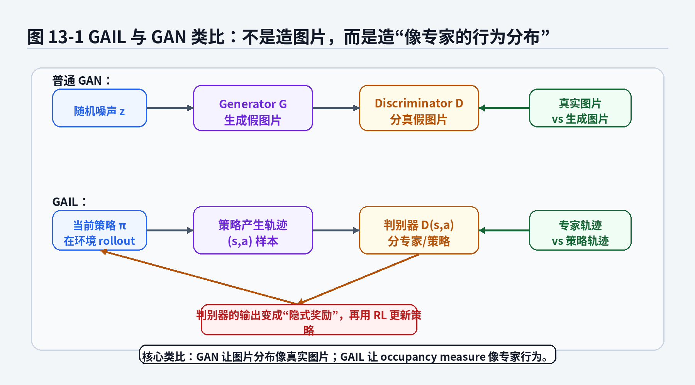

# 第11章：GAIL：从判别器里偷一个奖励函数

> **新版布局位置**：本章属于 **第三篇：经典模仿学习的分布匹配与奖励视角**。

> **本章一句话导读**：第10章说明了 IRL 可以从专家轨迹中学习 reward，但 reward ambiguity 和求解代价让显式恢复 reward 变得困难。本章转向 GAIL：不先恢复 reward，而是直接让学习策略诱导出的状态—动作访问分布接近专家。

---

## 1. 从第10章留下的问题出发

第10章 IRL 试图回答：专家到底在优化什么？

它的基本路线是：

```text
专家轨迹
→ 假设背后存在 reward
→ 学习能解释专家行为的 reward
→ 再用 reward 得到策略
```

这个想法很有解释性，但第10章也指出了两个核心困难。

第一，reward ambiguity。专家轨迹通常不能唯一确定 reward。同一批专家轨迹，可能被多个不同 reward 解释。

第二，求解代价。Maximum Entropy IRL 的梯度里有一项模型特征期望 $\mu_w$，通常需要在当前 reward 下采样、规划或做 RL 才能估计。真实机器人不能随便撞夹具、刮工件、试错几千次。

于是本章换一个问法：

> 既然显式恢复 reward 很难，能不能直接让策略的整体行为分布像专家？

这就是 GAIL，Generative Adversarial Imitation Learning，生成对抗模仿学习。

它不再先问“专家背后的 reward 是什么”，而是问：

> 当前策略 rollout 出来的状态—动作分布，看起来像不像专家？

如果看起来不像，就用判别器指出差异，再把这种差异转化为策略更新信号。

---

## 2. 本章在全书数学主线中的位置

本章承接第10章 IRL，并为第12章 Offline Imitation Learning 铺垫。

```text
第10章 IRL：从专家轨迹反推 reward，但 reward 不唯一且求解昂贵
→ 第11章 GAIL：绕开显式 reward，直接匹配专家与策略的 occupancy measure
→ 第12章 Offline IL：GAIL 通常需要 rollout，但真实机器人 rollout 成本高，于是离线数据覆盖成为核心问题
```

本章要解决的不是“GAIL 长得像不像 GAN”，而是以下四个问题：

1. occupancy measure $\rho_\pi(s,a)$ 到底是什么？
2. 为什么匹配 occupancy measure 比匹配单步动作更接近闭环行为？
3. 判别器 $D_\omega(s,a)$ 为什么能反映专家分布和策略分布的差异？
4. 判别器输出如何变成策略优化时的隐式 reward？

---

## 3. 本章新增数学对象

| 数学对象 | 符号 | 一句话含义 | 工程对应物 | 后续作用 |
|---|---|---|---|---|
| 专家策略 | $\pi_E$ | 产生专家轨迹的策略或人类专家行为 | 遥操作员、老司机、老师傅 | 定义专家行为分布 |
| 学习策略 | $\pi_\theta$ | 当前正在训练的策略 | 当前模型控制器 | rollout 产生策略样本 |
| 轨迹分布 | $p_\pi(\tau)$ | 策略闭环执行诱导出的轨迹概率 | 一批机器人执行日志 | 定义 occupancy measure |
| 占用测度 | $\rho_\pi(s,a)$ | 策略访问状态并执行动作的频率 | 模型实际会走到哪里、做什么 | GAIL 的核心匹配对象 |
| 判别器 | $D_\omega(s,a)$ | 判断状态—动作对是否来自专家 | 行为分布质检器 | 产生隐式 reward |
| 隐式 reward | $\hat r_D(s,a)$ | 由判别器输出构造出的策略更新信号 | 判别器给策略的“像专家程度”反馈 | 策略优化 |
| 策略熵 | $H(\pi)$ | 衡量策略随机性或探索程度 | 不要过早只会一种动作 | 稳定训练、防止坍缩 |

---

## 4. 本章公式主线

本章公式主线如下：

```text
第10章：IRL 试图学习 reward r(s,a)
→ 但 reward 歧义且估计模型特征期望代价高
→ 本章引入 occupancy measure rho_pi(s,a)
→ 直接比较专家 rho_E(s,a) 和策略 rho_pi(s,a)
→ 判别器 D(s,a) 学习区分专家样本和策略样本
→ 固定策略时，最优判别器反映 rho_E 与 rho_pi 的密度比
→ 策略利用判别器反馈更新，使自己的样本更像专家
→ 判别器输出可以被解释为隐式 reward
→ 但 GAIL 需要当前策略 rollout，真实机器人上有安全和成本限制
→ 第12章转向 Offline IL：当 rollout 受限，只能依赖离线数据时，support 和 OOD 风险成为核心问题
```

---

## 5. 从单步动作拟合到 occupancy measure

BC 的训练目标通常可以写成：

$$\min_\theta \mathbb{E}_{(s,a) \sim \mathcal{D}_E}\left[\ell(\pi_\theta(s),a)\right] \tag{11.1}$$

这个目标关注的是：在专家数据出现过的状态 $s$ 上，模型动作 $\pi_\theta(s)$ 是否接近专家动作 $a$。

这当然有用。没有 BC 这个基础，很多机器人模仿学习项目根本跑不起来。

但 BC 主要比较的是专家数据中的单步输入输出关系。它没有直接约束学习策略闭环执行时会访问哪些状态。

第3章已经讲过，一旦策略开始控制系统，它看到的状态分布就可能不再是专家数据中的状态分布。第6章进一步说明，策略会诱导轨迹分布 $p_\pi(\tau)$。

GAIL 要匹配的不是单步动作标签，而是状态—动作访问分布。

这就是 occupancy measure。

---

## 6. occupancy measure：策略真正留下的行为痕迹

### 6.1 定义 11.1：discounted occupancy measure

> **定义 11.1：occupancy measure**
>
> 给定策略 $\pi$，它的折扣状态—动作占用测度可以写成：

$$\rho_\pi(s,a) = (1-\gamma)\sum_{t=0}^{\infty}\gamma^t \Pr(s_t=s,a_t=a \mid \pi) \tag{11.2}$$

如果状态或动作是连续的，可以把 $\rho_\pi(s,a)$ 理解成密度，而不是离散概率。

这个公式可以这样读：

- $\Pr(s_t=s,a_t=a \mid \pi)$ 表示策略 $\pi$ 在第 $t$ 步访问状态 $s$ 并执行动作 $a$ 的概率；
- $\gamma^t$ 表示越远的时间步权重越小；
- $(1-\gamma)$ 是归一化因子，让无限时间累计更稳定；
- $\rho_\pi(s,a)$ 表示策略在闭环执行中有多经常经过某个状态—动作区域。

直觉上，occupancy measure 是策略在环境里留下的“脚印热力图”。

如果一个机械臂策略经常靠近治具边缘、经常高速接近目标、经常在夹取前姿态没对齐，那么这些区域的 $\rho_\pi(s,a)$ 就会很高。

如果专家几乎不访问这些危险区域，而学习策略经常访问，那么它们的 occupancy measure 就不匹配。

### 6.2 命题 11.1：occupancy measure 比单步 action loss 更接近闭环行为

> **命题 11.1：occupancy measure 描述的是闭环行为，而不是单步标签误差**
>
> 单步 imitation loss 主要在专家数据分布上比较动作相似性；occupancy measure 同时包含策略闭环执行时访问哪些状态、以及在这些状态下执行哪些动作。因此它更接近策略的整体行为分布。

**证明思路**：

比较两个对象的定义即可。单步 loss 的期望通常在专家数据分布上；occupancy measure 则由策略自己和环境闭环交互产生。

**证明**：

BC 的目标可以抽象成：

$$\mathcal{L}_{BC}(\theta) = \mathbb{E}_{(s,a) \sim \rho_E}\left[\ell(\pi_\theta(s),a)\right] \tag{11.3}$$

这里的期望主要在专家访问过的状态—动作区域上计算。

但学习策略部署后真正产生的是：

$$\rho_{\pi_\theta}(s,a) \tag{11.4}$$

如果 $\rho_{\pi_\theta}(s,a)$ 和 $\rho_E(s,a)$ 差别很大，说明学习策略闭环执行时经常进入专家不常访问的区域。

这时即使式 (11.3) 很小，也不能保证闭环行为像专家。因为式 (11.3) 没有充分评价学习策略自己诱导出来的状态分布。

因此，匹配 $\rho_{\pi_\theta}(s,a)$ 和 $\rho_E(s,a)$，比只在专家数据上最小化动作误差，更接近“整体行为像专家”。

**这个命题告诉我们什么？**

两个策略单步动作误差接近，不代表闭环轨迹相似。

如果一个策略的 occupancy measure 接近专家，说明它不仅动作像，而且常去的状态、执行动作的习惯、遇到边界时的行为分布也更像专家。

**常见误解**：

occupancy measure 不是一条轨迹，也不是原始数据集。它是策略闭环执行后在状态—动作空间中的分布统计。

---

## 7. GAIL 的核心目标

GAIL 的目标是让学习策略的 occupancy measure 接近专家：

$$\rho_{\pi_\theta}(s,a) \approx \rho_E(s,a) \tag{11.5}$$

但直接计算两个高维分布之间的距离很难。尤其在机器人任务里，状态可能包含图像、本体状态、末端位姿、力传感器信息，动作可能是连续控制量。

GAIL 引入判别器 $D_\omega(s,a)$ 来做这件事。

本章采用如下约定：

> $D_\omega(s,a)$ 表示判别器认为 $(s,a)$ 来自专家的概率。

于是：

- 专家样本希望 $D_\omega(s,a)$ 接近 1；
- 策略样本希望 $D_\omega(s,a)$ 接近 0；
- 策略训练的目标则是让自己的样本越来越像专家，使判别器越来越分不清。

GAIL 的一个常见目标可以写成：

$$\min_\pi \max_D \; \mathbb{E}_{(s,a) \sim \rho_E}[\log D(s,a)] + \mathbb{E}_{(s,a) \sim \rho_\pi}[\log(1-D(s,a))] - \lambda H(\pi) \tag{11.6}$$

这里：

- 判别器 $D$ 想最大化前两项，把专家样本和策略样本分开；
- 策略 $\pi$ 想最小化目标，让自己的样本更难被判别器识别为“非专家”；
- $H(\pi)$ 是策略熵；
- $\lambda$ 控制熵正则强度；
- 熵正则鼓励策略不要过早坍缩成单一动作。

不同论文和代码可能采用相反约定：让 $D(s,a)$ 表示“来自策略”的概率。那样 $\log D$、$\log(1-D)$ 和 reward 写法会对调。读公式时不要死记符号，要先确认 $D$ 到底给谁贴标签。



**图11-1 说明**：

- 普通 GAN 让生成图片的分布越来越像真实图片；
- GAIL 让策略 rollout 产生的状态—动作分布越来越像专家轨迹；
- 判别器不是直接输出动作，而是判断某个 $(s,a)$ 更像来自专家还是当前策略；
- 策略再利用判别器反馈更新自己，好让下一轮 rollout 更难被识别出来。

---

## 8. 判别器最优形式的直觉

判别器为什么能反映专家分布和策略分布的差异？

先固定策略 $\pi$，只优化判别器。式 (11.6) 中和判别器有关的部分是：

$$J_D(D) = \mathbb{E}_{(s,a) \sim \rho_E}[\log D(s,a)] + \mathbb{E}_{(s,a) \sim \rho_\pi}[\log(1-D(s,a))] \tag{11.7}$$

把期望写成对状态—动作空间的求和形式：

$$J_D(D) = \sum_{s,a}\rho_E(s,a)\log D(s,a) + \sum_{s,a}\rho_\pi(s,a)\log(1-D(s,a)) \tag{11.8}$$

对于某个固定的 $(s,a)$，判别器要最大化：

$$\rho_E(s,a)\log D(s,a) + \rho_\pi(s,a)\log(1-D(s,a)) \tag{11.9}$$

对 $D(s,a)$ 求导：

$$\frac{\rho_E(s,a)}{D(s,a)} - \frac{\rho_\pi(s,a)}{1-D(s,a)} = 0 \tag{11.10}$$

整理得到最优判别器：

$$D^*(s,a) = \frac{\rho_E(s,a)}{\rho_E(s,a)+\rho_\pi(s,a)} \tag{11.11}$$

这就是 GAIL 中非常重要的直觉。

如果某个状态—动作区域专家经常出现，而当前策略很少出现，那么 $\rho_E(s,a)$ 大、$\rho_\pi(s,a)$ 小，$D^*(s,a)$ 接近 1。

如果某个区域当前策略经常出现，而专家很少出现，那么 $D^*(s,a)$ 接近 0。

如果专家和策略在某个区域出现频率差不多，那么 $D^*(s,a)$ 接近 0.5，判别器分不清。

进一步看密度比：

$$\frac{D^*(s,a)}{1-D^*(s,a)} = \frac{\rho_E(s,a)}{\rho_\pi(s,a)} \tag{11.12}$$

所以，判别器不是神秘的“奖励 oracle”。它本质上在估计专家分布和策略分布在哪里不一样。

### 命题 11.2：最优判别器反映专家分布和策略分布的密度比

> **命题 11.2：判别器的密度比解释**
>
> 在固定策略 $\pi$ 时，GAIL 判别器的最优形式为 $D^*(s,a)=\rho_E(s,a)/(\rho_E(s,a)+\rho_\pi(s,a))$。因此，判别器输出可以反映专家 occupancy measure 与策略 occupancy measure 的相对大小。

**这个命题告诉我们什么？**

当判别器很容易把策略样本识别出来时，说明策略产生的状态—动作分布和专家差异明显。

当判别器接近随机猜测时，说明策略样本和专家样本在判别器看来已经很接近。

**常见误解**：

判别器分不清不一定代表实机绝对安全。它只代表在当前判别器能力、当前样本覆盖和当前特征表示下难以区分。真实机器人仍然需要安全约束、闭环测试和离线/在线评估。

---

## 9. 判别器如何变成隐式 reward

GAIL 的判别器本身不输出动作。策略要更新，仍然需要一个类似 reward 的信号。

在本章约定中，$D(s,a)$ 表示“来自专家”的概率。一个自然的隐式 reward 是：

$$\hat r_D(s,a) = -\log(1-D(s,a)) \tag{11.13}$$

也可以使用：

$$\hat r_D(s,a) = \log D(s,a) \tag{11.14}$$

不同实现会选择不同形式。核心思想一样：

> 如果判别器认为某个状态—动作更像专家，就给策略更高反馈；如果更像当前策略的坏习惯，就给更低反馈。

为什么式 (11.13) 合理？

- 当 $D(s,a)$ 接近 1，判别器认为样本很像专家，$-\log(1-D(s,a))$ 会变大；
- 当 $D(s,a)$ 接近 0，判别器认为样本不像专家，$-\log(1-D(s,a))$ 接近 0；
- 策略最大化这个信号，就会倾向于产生更像专家的状态—动作对。

于是策略优化可以粗略理解成：

$$\max_\pi \mathbb{E}_{(s,a) \sim \rho_\pi}[\hat r_D(s,a)] + \lambda H(\pi) \tag{11.15}$$

这就是“从判别器里偷一个奖励函数”的含义。

它不是专家显式写出来的 reward，也不是第10章 IRL 中先恢复出来的 reward，而是一个由分布判别器动态产生的训练信号。

### 命题 11.3：GAIL 的隐式 reward 来自分布差异

> **命题 11.3：GAIL reward 的来源**
>
> GAIL 中用于策略更新的 reward 信号来自判别器输出，而判别器输出反映专家 occupancy measure 与策略 occupancy measure 的差异。因此，GAIL 的 reward 本质上是分布匹配信号，而不是手写任务 reward。

**工程含义**：

在机械臂抓取任务中，如果策略经常走到专家不会走的危险接近姿态，判别器会把这些样本判成“不像专家”，隐式 reward 就低。

如果策略产生的接近、对齐、夹取、放置阶段都越来越像专家数据，判别器越来越难分辨，策略就获得更高的训练信号。

**常见误解**：

不要把 GAIL 的隐式 reward 直接当成可解释的人工 reward。它更像训练过程中的分布差异反馈。它能帮助策略学习，但未必能直接解释“为什么这个动作在工程上安全”。

---

## 10. GAIL 的训练流程

GAIL 的训练可以理解为一个循环。

```text
1. 用当前策略 pi_theta 在环境或仿真器中 rollout，收集策略样本。
2. 从专家数据中取专家状态—动作样本。
3. 训练判别器 D_omega，区分专家样本和策略样本。
4. 用判别器输出构造隐式 reward。
5. 用 RL 或策略优化方法更新 pi_theta。
6. 回到第1步，重新 rollout。
```

这和普通监督学习差别很大。

BC 的训练数据通常固定，训练过程像是在已有数据集上反复拟合。

GAIL 必须不断拿当前策略产生的新样本训练判别器，因为策略一变，$\rho_\pi(s,a)$ 就变了。判别器要比较的是专家分布和当前策略分布，而不是专家分布和某个固定数据集。

这也是 GAIL 强大但昂贵的原因。

---

## 11. rollout 成本与真实机器人限制

GAIL 在理论上很优雅，但真实机器人项目里必须非常谨慎。

原因不在于 GAIL 思路错，而在于它通常需要当前策略 rollout。

### 11.1 rollout 在仿真里便宜，在真实世界里很贵

在仿真环境里，策略走歪了可以重置。撞墙、掉物体、夹错位置，最多损失一点计算时间。

真实机器人不一样。

一次错误 rollout 可能带来：

- 夹具撞弯；
- 工件划伤；
- 治具卡死；
- 相机支架震动导致标定失效；
- 机器人进入危险区域需要人工急停；
- 现场节拍被打断；
- 工程师花大量时间恢复设备。

所以，GAIL 的“让当前策略不断 rollout”在真实机器人上不是一个轻量操作。

### 11.2 rollout 数据也不一定覆盖关键风险

即使允许 rollout，也不代表数据自动变好。

如果策略一开始很差，它可能产生大量无意义失败轨迹，判别器很容易区分，策略更新信号也可能不稳定。

如果加入太多安全限制，策略又可能永远到不了真正困难的边界状态。

如果仿真和真实差异很大，仿真 rollout 中学到的 occupancy measure 匹配，可能无法迁移到真实设备。

### 11.3 命题 11.4：GAIL 解决分布匹配问题，但不能绕开交互成本

> **命题 11.4：GAIL 的交互成本限制**
>
> GAIL 通过 rollout 估计当前策略的 occupancy measure，并用判别器推动其接近专家 occupancy measure。因此，只要 rollout 成本高、安全风险大或环境不可频繁重置，GAIL 的工程可用性就会受到限制。

**这个命题告诉我们什么？**

GAIL 的问题不是“数学不漂亮”，而是“它需要不断知道当前策略实际会走到哪里”。

真实机器人上，这件事成本很高。

因此，工程上常常会转向：

```text
更多依赖离线数据；
在仿真中做安全 rollout；
用规则或安全层限制探索；
先用 BC / ACT / Diffusion Policy 得到较强初始策略；
再谨慎做小范围在线改进。
```

这正好引出第12章：如果不能随便 rollout，只能依赖离线数据，那么数据覆盖、support mismatch 和 OOD action 就会成为核心问题。

---

## 12. GAIL 与 IRL、BC 的关系

### 12.1 GAIL 与 BC

BC 关注专家数据里的单步映射：

$$s \mapsto a \tag{11.16}$$

GAIL 关注策略闭环执行后的整体访问分布：

$$\rho_{\pi_\theta}(s,a) \approx \rho_E(s,a) \tag{11.17}$$

因此，BC 像是在做“逐题批改”，GAIL 像是在看“整体行为像不像老师傅”。

但这不意味着 GAIL 一定替代 BC。真实项目里，BC 往往是更稳定、更便宜、更容易调试的 baseline。GAIL 更适合作为理解分布匹配的一条理论路线，或者在仿真环境和可安全 rollout 的任务中发挥作用。

### 12.2 GAIL 与 IRL

第10章 IRL 的路线是：

```text
专家轨迹 → reward → 策略
```

GAIL 的路线更像是：

```text
专家 occupancy measure ↔ 策略 occupancy measure
```

从某种角度看，GAIL 可以被理解为一种绕开显式 reward 学习的 imitation learning 方法。

它仍然会产生类似 reward 的信号，但这个信号来自判别器，而不是先单独恢复一个稳定可解释的 reward 函数。

### 12.3 GAIL 与第四篇现代策略模型

GAIL 主要解决的是“匹配什么分布”的问题。

第四篇 ACT、Diffusion Policy、Flow Matching 主要解决的是“策略如何表达动作”的问题。

这两个问题不同。

一个策略模型可以很强，但如果离线数据没有覆盖关键失败和恢复状态，它仍然可能在部署时出问题。

一个分布匹配目标很漂亮，但如果无法安全 rollout，它也很难直接落地。

---

## 13. 读完本章，你应该能判断什么

| 工程现象 | 应该想到的 GAIL 判断 |
|---|---|
| BC 单步 loss 低，但闭环轨迹不像专家 | 单步动作匹配不等于 occupancy measure 匹配 |
| 策略经常进入专家不会进入的状态 | 学习策略的 $\rho_\pi(s,a)$ 和专家 $\rho_E(s,a)$ 不一致 |
| 判别器很容易区分专家和策略样本 | 两个状态—动作分布差异明显，策略还不像专家 |
| 判别器接近 0.5 | 在当前判别器能力和样本覆盖下，专家与策略样本较难区分 |
| 隐式 reward 很不稳定 | 判别器、rollout 分布和策略更新之间可能相互震荡 |
| 想在真实机器人上直接跑 GAIL | 必须先评估 rollout 成本、安全边界、仿真可信度和设备恢复成本 |
| 仿真里 GAIL 有效，实机上失败 | 可能是 sim-to-real 差异导致 occupancy measure 匹配没有迁移 |
| 准备转向离线训练 | 下一步要关注 support mismatch、OOD action 和恢复数据覆盖 |

---

## 14. 本章常见误解

| 常见误解 | 正确认识 |
|---|---|
| GAIL 就是把 GAN 套到机器人轨迹上 | GAIL 的核心是 occupancy measure matching，GAN 类比只是理解入口 |
| 判别器就是动作预测器 | 判别器判断状态—动作样本来自专家还是策略，不直接输出动作 |
| 判别器输出就是可解释 reward | 它是训练信号，不一定能直接解释工程偏好 |
| 判别器分不清就等于策略安全 | 只能说明当前样本和判别器下难以区分，不代表实机安全 |
| GAIL 不需要 reward，所以没有 RL 成本 | GAIL 仍然需要策略 rollout 和策略优化，成本可能很高 |
| GAIL 一定比 BC 强 | BC 更稳定、更便宜，是很多项目的强 baseline；GAIL 更依赖交互条件 |
| 仿真中学到的 GAIL 策略能直接上实机 | 仍然要面对 sim-to-real、传感器噪声、设备误差和安全约束 |

---

## 15. 本章公式索引

- 公式 (11.1)：BC 的单步 imitation loss。
- 公式 (11.2)：discounted occupancy measure 定义。
- 公式 (11.3)：BC 在专家分布上的训练目标。
- 公式 (11.4)：学习策略自身诱导出的 occupancy measure。
- 公式 (11.5)：GAIL 希望匹配专家和策略的 occupancy measure。
- 公式 (11.6)：GAIL 的 min-max 目标。
- 公式 (11.7)—(11.12)：最优判别器与密度比直觉。
- 公式 (11.13)—(11.15)：判别器输出构造隐式 reward。
- 公式 (11.16)—(11.17)：BC 与 GAIL 的核心对象对比。

---

## 16. 建议阅读的附录条目

- 附录 B：概率论最小生存包。建议复习分布、期望和条件概率。
- 附录 C：最大似然、交叉熵与 KL 散度。建议用于理解判别器目标。
- 附录 F：强化学习与序列决策基础。建议复习策略、轨迹分布、occupancy measure 和策略优化。
- 附录 I：熵、最大熵与 Score Matching。建议用于理解 GAIL 中熵正则的作用。

---

## 17. 本章小结：为什么下一章是 Offline IL

本章完成了四件事。

第一，它把模仿学习目标从单步动作拟合推进到了 occupancy measure matching。

第二，它说明了判别器的作用：判别器不是动作预测器，而是在估计专家状态—动作分布和策略状态—动作分布的差异。

第三，它解释了隐式 reward：GAIL 从判别器输出中构造策略更新信号，让策略产生更像专家的状态—动作样本。

第四，它强调了 rollout 成本：GAIL 往往需要当前策略不断与环境交互，而真实机器人上的 rollout 有安全、设备、节拍和恢复成本。

因此，下一章自然要问：

> 如果我们不能让当前策略随便 rollout，只能依赖已有离线数据训练策略，那么模仿学习的核心风险会变成什么？

答案就是第12章的主题：Offline Imitation Learning、support mismatch、OOD action 与恢复数据覆盖。
