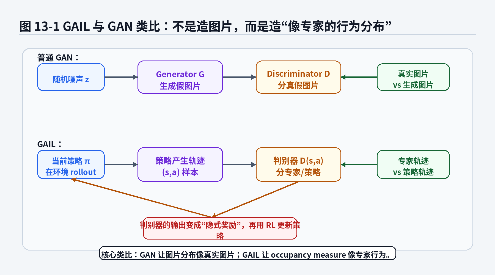
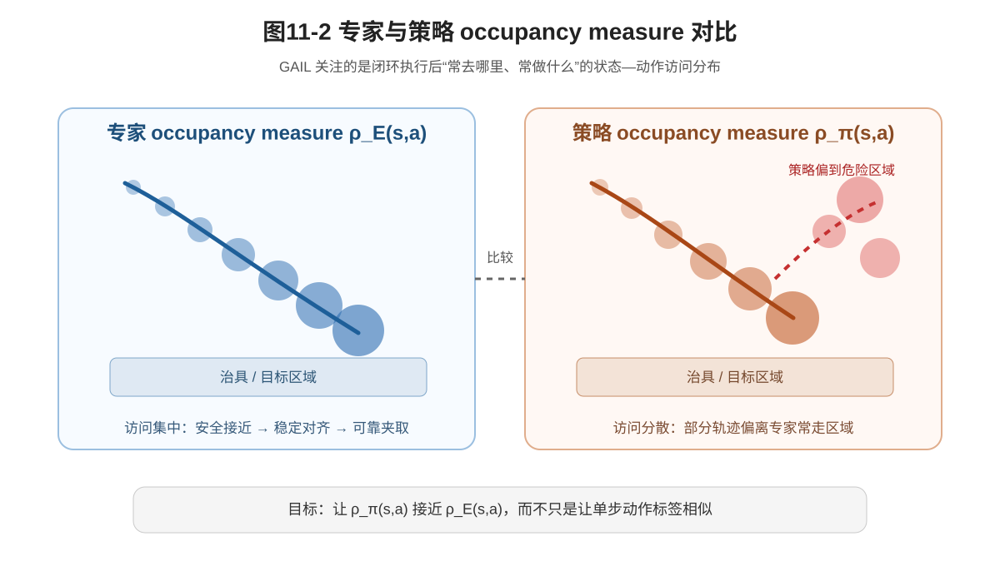
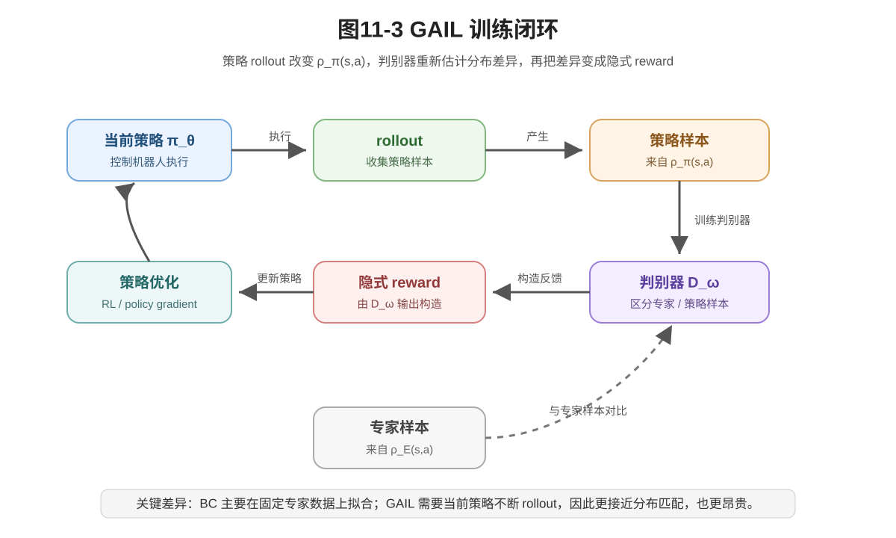

# 第11章：GAIL：从判别器里偷一个奖励函数

> **本章一句话导读**：第10章说明了 IRL 可以从专家轨迹中学习 reward，但 reward ambiguity 和求解代价让显式恢复 reward 变得困难。本章转向 GAIL：不先恢复 reward，而是直接让学习策略诱导出的状态—动作访问分布接近专家。

---

## 1. 本章要解决的核心问题

第10章 IRL 试图回答：专家到底在优化什么？

它的基本路线是：

```text
专家轨迹
→ 假设背后存在 reward
→ 学习能解释专家行为的 reward
→ 再用 reward 得到策略
```

这个想法很有解释性，但第10章也指出了两个核心困难。

第一，reward ambiguity。专家轨迹通常不能唯一确定 reward。同一批专家轨迹，可能被多个不同 reward 解释。

第二，求解代价。MaxEnt IRL 的梯度里有一项模型特征期望 $\mu_w$，通常需要在当前 reward 下采样、规划或做 RL 才能估计。真实机器人不能随便撞夹具、刮工件、试错几千次。

于是本章换一个问法：

> 既然显式恢复 reward 很难，能不能直接让策略的整体行为分布像专家？

这就是 GAIL，Generative Adversarial Imitation Learning，生成对抗模仿学习。

GAIL 不再先问“专家背后的 reward 是什么”，而是问：

> 当前策略 rollout 出来的状态—动作分布，看起来像不像专家？

如果看起来不像，就用判别器指出差异，再把这种差异转化为策略更新信号。

本章主角不是“GAN 类比”，而是 **occupancy measure matching**：让学习策略在闭环执行中留下的状态—动作访问分布接近专家。

---

## 2. 统一贯穿例子：二维机器人绕障的访问分布

继续使用前文的二维机器人例子。

机器人从起点到目标，中间有障碍物。专家可以从左侧绕，也可以从右侧绕。第10章说，这两类轨迹可能共享一些 reward 偏好：避开障碍物、尽快到达目标、动作平滑、不要进入危险区域。

现在从 GAIL 的角度看，不必先把这些偏好显式写成 reward。我们可以直接比较两类轨迹在状态—动作空间里的“脚印”：

```text
专家经常访问哪些状态？
专家在这些状态下通常执行哪些动作？
学习策略经常访问哪些状态？
学习策略是否频繁进入专家不会进入的危险区域？
```

如果学习策略经常从障碍物中间穿过去，即使它在专家数据附近的单步动作 loss 很低，它的整体访问分布也不像专家。

> **直觉框：GAIL 看的是闭环脚印，不是单步答案**
>
> BC 像是在问“这道题的答案是否和老师一样”。GAIL 更像是在看“学生实际走完整张卷子的路径，是否和老师傅的整体习惯相似”。



**图11-1 说明**：

- 普通 GAN 让生成图片的分布越来越像真实图片；
- GAIL 让策略 rollout 产生的状态—动作分布越来越像专家轨迹；
- 判别器不是直接输出动作，而是判断某个 $(s,a)$ 更像来自专家还是当前策略；
- 策略再利用判别器反馈更新自己，好让下一轮 rollout 更难被识别出来。

---

## 3. 本章核心定义

**定义 11.1：occupancy measure**

occupancy measure $\rho_\pi(s,a)$ 描述策略 $\pi$ 在闭环执行中访问状态 $s$ 并执行动作 $a$ 的频率或密度。

直觉上，它是策略在环境里留下的“状态—动作脚印热力图”。如果一个机械臂策略经常靠近治具边缘、经常高速接近目标、经常在夹取前姿态没对齐，那么这些区域的 $\rho_\pi(s,a)$ 就会很高。

**定义 11.2：GAIL 判别器**

GAIL 判别器 $D_\omega(s,a)$ 是一个二分类模型。本章约定 $D_\omega(s,a)$ 表示状态—动作对 $(s,a)$ 来自专家数据，而不是当前策略 rollout 的概率。

这个约定很重要。不同论文或代码可能采用相反约定：让 $D(s,a)$ 表示“来自策略”的概率。读公式时不要死记符号，要先确认 $D$ 到底给谁贴标签。

**定义 11.3：occupancy measure matching**

occupancy measure matching 指让学习策略诱导出的状态—动作访问分布 $\rho_{\pi_\theta}(s,a)$ 接近专家访问分布 $\rho_E(s,a)$。

它不只是让模型在专家见过的状态上动作像专家，而是让模型闭环执行后“常去哪里、常做什么”整体像专家。

**定义 11.4：隐式 reward**

隐式 reward 指由判别器输出构造出来、用于策略优化的训练信号。它不是人工手写任务 reward，也不一定具有稳定可解释的工程语义。

---

## 4. 从单步动作拟合到 occupancy measure

第2章已经给出 BC 的基本训练思想：在专家数据分布上，让模型动作接近专家动作。这个目标很有用，也是很多机器人模仿学习项目的强 baseline。

但 BC 主要比较的是专家数据中的单步输入输出关系。它没有直接约束学习策略闭环执行时会访问哪些状态。

第3章已经讲过，一旦策略开始控制系统，它看到的状态分布就可能不再是专家数据中的状态分布。第10章进一步强调，专家行为背后可能存在轨迹级偏好，而不是单步动作标签。

GAIL 要匹配的不是单步动作标签，而是状态—动作访问分布。

**公式 (11.1)：discounted occupancy measure**

$$
\rho_\pi(s,a)=(1-\gamma)\sum_{t=0}^{\infty}\gamma^t\Pr(s_t=s,a_t=a\mid \pi)
$$

这个公式可以这样读：

- $\Pr(s_t=s,a_t=a\mid \pi)$ 表示策略 $\pi$ 在第 $t$ 步访问状态 $s$ 并执行动作 $a$ 的概率；
- $\gamma^t$ 表示越远的时间步权重越小；
- $(1-\gamma)$ 是归一化因子，让无限时间累计更稳定；
- $\rho_\pi(s,a)$ 表示策略在闭环执行中有多经常经过某个状态—动作区域。

如果状态或动作是连续的，可以把 $\rho_\pi(s,a)$ 理解成密度，而不是离散概率。

> **边界框：occupancy measure 的归一化约定**
>
> 不同文献对 occupancy measure 的归一化约定不完全一样。有的写法会省略 $(1-\gamma)$，此时它更像折扣访问频率，而不是严格归一化后的概率分布。本书在本章采用带 $(1-\gamma)$ 的归一化写法，便于把它理解为状态—动作分布。



**图11-2 说明**：

- 左侧表示专家策略的访问分布，轨迹主要集中在安全接近、稳定对齐和可靠夹取区域；
- 右侧表示学习策略的访问分布，一部分轨迹偏向治具边缘或危险接近区域；
- GAIL 关心的不是某一个动作是否完全一样，而是两类状态—动作访问分布是否整体接近；
- 图中为了便于理解，主要画出状态访问区域；真实 occupancy measure 还包含这些状态下采取的动作。

### 4.1 命题 11.1：occupancy measure 描述闭环行为

> **命题 11.1：occupancy measure 描述的是闭环行为，而不是单步标签误差**
>
> 单步 imitation loss 主要在专家数据分布上比较动作相似性；occupancy measure 同时包含策略闭环执行时访问哪些状态、以及在这些状态下执行哪些动作。因此它更接近策略的整体行为分布。

**证明思路**：

比较两个对象的定义即可。单步 loss 的期望通常在专家数据分布上；occupancy measure 则由策略自己和环境闭环交互产生。

> **推导框：为什么单步 loss 不等于闭环分布匹配**
>
> BC 可以抽象为在专家分布附近最小化动作误差：
>
> $$
> \mathbb{E}_{(s,a)\sim \rho_E}[\ell(\pi_\theta(s),a)]
> $$
>
> 这里的期望主要在专家访问过的状态—动作区域上计算。
>
> 但学习策略部署后真正产生的是 $\rho_{\pi_\theta}(s,a)$。如果 $\rho_{\pi_\theta}(s,a)$ 和 $\rho_E(s,a)$ 差别很大，说明学习策略闭环执行时经常进入专家不常访问的区域。
>
> 因此，即使单步 loss 很小，也不能保证闭环行为像专家。GAIL 的目标是直接缩小这种访问分布差异。

这个命题告诉我们：两个策略单步动作误差接近，不代表闭环轨迹相似。如果一个策略的 occupancy measure 接近专家，说明它不仅动作像，而且常去的状态、执行动作的习惯、遇到边界时的行为分布也更像专家。

---

## 5. GAIL 的核心目标

GAIL 的目标是让学习策略的 occupancy measure 接近专家。

**公式 (11.2)：GAIL 的 occupancy matching 目标**

$$
\rho_{\pi_\theta}(s,a)\approx \rho_E(s,a)
$$

这个公式是本章的核心。它把模仿学习从“动作标签拟合”推进到“闭环行为分布匹配”。

但直接计算两个高维分布之间的距离很难。尤其在机器人任务里，状态可能包含图像、本体状态、末端位姿、力传感器信息，动作可能是连续控制量。

GAIL 引入判别器 $D_\omega(s,a)$ 来做这件事。

判别器看两类样本：

```text
专家样本：(s,a) ~ rho_E
策略样本：(s,a) ~ rho_pi
```

它学习判断一个状态—动作对更像专家还是更像当前策略。策略则反过来更新自己，让自己的 rollout 样本越来越难被判别器区分。

**公式 (11.3)：GAIL 的 min-max 目标**

$$
\min_\pi \max_D \; \mathbb{E}_{(s,a)\sim \rho_E}[\log D(s,a)] + \mathbb{E}_{(s,a)\sim \rho_\pi}[\log(1-D(s,a))] - \lambda H(\pi)
$$

这里：

- 判别器 $D$ 想最大化前两项，把专家样本和策略样本分开；
- 策略 $\pi$ 想最小化目标，让自己的样本更难被判别器识别为“非专家”；
- $H(\pi)$ 是策略熵；
- $\lambda$ 控制熵正则强度；
- 熵正则鼓励策略不要过早坍缩成单一动作。

> **边界框：判别器标签约定会影响公式外观**
>
> 本章约定 $D(s,a)$ 表示“来自专家”的概率。因此专家项是 $\log D(s,a)$，策略项是 $\log(1-D(s,a))$。如果某篇论文或代码把 $D$ 定义为“来自策略”的概率，那么两项会对调。理解 GAIL 时，先看标签约定，再看公式。

---

## 6. 最优判别器与密度比

判别器为什么能反映专家分布和策略分布的差异？

先固定策略 $\pi$，只优化判别器。公式 (11.3) 中和判别器有关的部分是：

$$
J_D(D)=\mathbb{E}_{(s,a)\sim \rho_E}[\log D(s,a)]+\mathbb{E}_{(s,a)\sim \rho_\pi}[\log(1-D(s,a))]
$$

为了便于推导，把状态—动作空间写成离散求和。连续状态或连续动作下，可以把求和换成积分，推导思路不变。

### 6.1 命题 11.2：最优判别器反映专家分布和策略分布的密度比

> **命题 11.2：判别器的密度比解释**
>
> 在固定策略 $\pi$ 时，GAIL 判别器的最优形式为公式 (11.4)。因此，判别器输出可以反映专家 occupancy measure 与策略 occupancy measure 的相对大小。

**公式 (11.4)：最优判别器形式**

$$
D_*(s,a)=\frac{\rho_E(s,a)}{\rho_E(s,a)+\rho_\pi(s,a)}
$$

> **推导框：最优判别器从哪里来**
>
> 固定策略后，$\rho_\pi(s,a)$ 不随判别器变化。判别器目标可以分解到每个状态—动作对 $(s,a)$ 上：
>
> $$
> \rho_E(s,a)\log D(s,a)+\rho_\pi(s,a)\log(1-D(s,a))
> $$
>
> 对 $D(s,a)$ 求导并令其为 0：
>
> $$
> \frac{\rho_E(s,a)}{D(s,a)}-\frac{\rho_\pi(s,a)}{1-D(s,a)}=0
> $$
>
> 整理得到：
>
> $$
> \rho_E(s,a)(1-D(s,a))=\rho_\pi(s,a)D(s,a)
> $$
>
> 因此：
>
> $$
> D_*(s,a)=\frac{\rho_E(s,a)}{\rho_E(s,a)+\rho_\pi(s,a)}
> $$

这就是 GAIL 中非常重要的直觉。

如果某个状态—动作区域专家经常出现，而当前策略很少出现，那么 $\rho_E(s,a)$ 大、$\rho_\pi(s,a)$ 小，$D_*(s,a)$ 接近 1。

如果某个区域当前策略经常出现，而专家很少出现，那么 $D_*(s,a)$ 接近 0。

如果专家和策略在某个区域出现频率差不多，那么 $D_*(s,a)$ 接近 0.5，判别器分不清。

进一步看密度比，可以得到：

$$
\frac{D_*(s,a)}{1-D_*(s,a)}=\frac{\rho_E(s,a)}{\rho_\pi(s,a)}
$$

这个式子不单独编号，因为它只是公式 (11.4) 的直接变形。它说明，判别器不是神秘的“奖励 oracle”。它本质上在估计专家分布和策略分布在哪里不一样。

> **直觉框：判别器不是老师傅本人**
>
> 判别器只是在当前专家样本和当前策略样本之间做区分。它能反映分布差异，但不保证理解工程安全、力控边界或任务语义。因此，判别器信号不能直接等同于可解释 reward。

---

## 7. 判别器输出如何变成隐式 reward

GAIL 的策略更新需要一个训练信号。这个信号来自判别器。

在本章的标签约定下，$D(s,a)$ 越大，说明样本越像专家；$D(s,a)$ 越小，说明样本越像当前策略而不像专家。

因此，策略可以使用下面这种隐式 reward：

**公式 (11.5)：由判别器构造的隐式 reward**

$$
\hat r_D(s,a)=-\log(1-D(s,a))
$$

当 $D(s,a)$ 接近 1 时，样本很像专家，$1-D(s,a)$ 很小，$-\log(1-D(s,a))$ 较大。当 $D(s,a)$ 接近 0 时，样本不像专家，隐式 reward 较小。

> **边界框：隐式 reward 不是人工 reward**
>
> $\hat r_D(s,a)$ 是训练过程中的分布差异反馈。它能帮助策略学习，但未必能直接解释“为什么这个动作在工程上安全”。如果判别器只在有限样本上训练，它也可能在未覆盖区域给出错误信号。

### 7.1 命题 11.3：GAIL reward 来自分布差异

> **命题 11.3：GAIL reward 的来源**
>
> GAIL 中用于策略更新的 reward 信号来自判别器输出，而判别器输出反映专家 occupancy measure 与策略 occupancy measure 的差异。因此，GAIL 的 reward 本质上是分布匹配信号，而不是手写任务 reward。

在机械臂抓取任务中，如果策略经常走到专家不会走的危险接近姿态，判别器会把这些样本判成“不像专家”，隐式 reward 就低。

如果策略产生的接近、对齐、夹取、放置阶段都越来越像专家数据，判别器越来越难分辨，策略就获得更高的训练信号。

---

## 8. GAIL 的训练闭环

GAIL 的训练可以理解为一个循环。

```text
1. 用当前策略 pi_theta 在环境或仿真器中 rollout，收集策略样本。
2. 从专家数据中取专家状态—动作样本。
3. 训练判别器 D_omega，区分专家样本和策略样本。
4. 用判别器输出构造隐式 reward。
5. 用 RL 或策略优化方法更新 pi_theta。
6. 回到第1步，重新 rollout。
```



**图11-3 说明**：

- GAIL 不是在固定数据集上训练一次就结束；
- 当前策略会不断 rollout，产生新的策略样本；
- 判别器根据专家样本和当前策略样本重新学习分布差异；
- 策略再根据判别器构造的隐式 reward 更新自己；
- 策略一变，$\rho_\pi(s,a)$ 也会变，所以训练会进入下一轮循环。

这和普通监督学习差别很大。

BC 的训练数据通常固定，训练过程像是在已有数据集上反复拟合。GAIL 必须不断拿当前策略产生的新样本训练判别器，因为策略一变，$\rho_\pi(s,a)$ 就变了。判别器要比较的是专家分布和当前策略分布，而不是专家分布和某个固定数据集。

> **边界框：GAIL 通常需要 RL 或 policy gradient**
>
> 策略更新通常不能只像监督学习那样对当前样本做普通反向传播。原因是策略动作会影响后续状态，策略变了，未来访问分布 $\rho_\pi(s,a)$ 也会变。因此 GAIL 通常需要 RL 或 policy gradient 类方法，用判别器 reward 通过 rollout 回报来更新策略。

不同实现会采用不同的交替更新频率，例如判别器更新几步、策略更新几步，并没有固定比例。本章强调的是训练逻辑闭环，而不是限定具体实现细节。

---

## 9. 适用边界与工程限制

GAIL 在理论上很优雅，但真实机器人项目里必须非常谨慎。

原因不在于 GAIL 思路错，而在于它通常需要当前策略 rollout。

在仿真环境里，策略走歪了可以重置。撞墙、掉物体、夹错位置，最多损失一点计算时间。

真实机器人不一样。一次错误 rollout 可能带来：

- 夹具撞弯；
- 工件划伤；
- 治具卡死；
- 相机支架震动导致标定失效；
- 机器人进入危险区域需要人工急停；
- 现场节拍被打断；
- 工程师花大量时间恢复设备。

所以，GAIL 的“让当前策略不断 rollout”在真实机器人上不是一个轻量操作。

### 9.1 命题 11.4：GAIL 解决分布匹配问题，但不能绕开交互成本

> **命题 11.4：GAIL 的交互成本限制**
>
> GAIL 通过 rollout 估计当前策略的 occupancy measure，并用判别器推动其接近专家 occupancy measure。因此，只要 rollout 成本高、安全风险大或环境不可频繁重置，GAIL 的工程可用性就会受到限制。

这个命题告诉我们：GAIL 的问题不是“数学不漂亮”，而是“它需要不断知道当前策略实际会走到哪里”。真实机器人上，这件事成本很高。

因此，工程上常常会转向：

```text
更多依赖离线数据；
在仿真中做安全 rollout；
用规则或安全层限制探索；
先用 BC / ACT / Diffusion Policy 得到较强初始策略；
再谨慎做小范围在线改进。
```

这正好引出第12章：如果不能随便 rollout，只能依赖离线数据，那么数据覆盖、support mismatch 和 OOD action 就会成为核心问题。

---

## 10. 与上一章和下一章的关系

### 10.1 GAIL 与 IRL

第10章 IRL 的路线是：

```text
专家轨迹 → reward → 策略
```

GAIL 的路线更像是：

```text
专家 occupancy measure ↔ 策略 occupancy measure
```

从这个角度看，GAIL 不是简单否定 IRL，而是绕开显式 reward 恢复，直接推动策略分布接近专家分布。

它仍然会产生类似 reward 的信号，但这个信号来自判别器，而不是先单独恢复一个稳定可解释的 reward 函数。

### 10.2 GAIL 与 BC

BC 关注专家数据里的单步映射：

```text
s → a
```

GAIL 关注策略闭环执行后的整体访问分布：

```text
rho_pi(s,a) ≈ rho_E(s,a)
```

因此，BC 像是在做“逐题批改”，GAIL 像是在看“整体行为像不像老师傅”。

但这不意味着 GAIL 一定替代 BC。真实项目里，BC 往往是更稳定、更便宜、更容易调试的 baseline。GAIL 更适合作为理解分布匹配的一条理论路线，或者在仿真环境和可安全 rollout 的任务中发挥作用。

### 10.3 GAIL 与第12章 Offline IL

GAIL 需要当前策略 rollout 来估计 $\rho_\pi(s,a)$。但真实机器人 rollout 成本高、风险大、恢复慢。

因此，第12章会继续追问：

> 如果我们不能让当前策略随便 rollout，只能依赖已有离线数据训练策略，那么模仿学习的核心风险会变成什么？

答案就是：support mismatch、OOD action 和恢复数据覆盖。

---

## 11. 读完本章，你应该能判断什么

| 工程现象 | 应该想到的 GAIL 判断 |
|---|---|
| BC 单步 loss 低，但闭环轨迹不像专家 | 单步动作匹配不等于 occupancy measure 匹配 |
| 策略经常进入专家不会进入的状态 | 学习策略的 $\rho_\pi(s,a)$ 和专家 $\rho_E(s,a)$ 不一致 |
| 判别器很容易区分专家和策略样本 | 两个状态—动作分布差异明显，策略还不像专家 |
| 判别器接近 0.5 | 在当前判别器能力和样本覆盖下，专家与策略样本较难区分 |
| 隐式 reward 很不稳定 | 判别器、rollout 分布和策略更新之间可能相互震荡 |
| 想在真实机器人上直接跑 GAIL | 必须先评估 rollout 成本、安全边界、仿真可信度和设备恢复成本 |
| 仿真里 GAIL 有效，实机上失败 | 可能是 sim-to-real 差异导致 occupancy measure 匹配没有迁移 |
| 准备转向离线训练 | 下一步要关注 support mismatch、OOD action 和恢复数据覆盖 |

---

## 12. 实践提示

如果要做一个小实验来理解 GAIL，不建议一开始就上真实机械臂。更合理的路线是：

```text
二维导航或简易机械臂仿真
→ 收集专家轨迹
→ 训练一个 BC baseline
→ rollout 当前策略，观察 rho_pi 和 rho_E 的差异
→ 加入判别器，观察判别器是否能区分专家和策略样本
→ 再看策略是否逐渐减少专家不常访问的危险区域
```

实验重点不是追求复杂网络，而是看清楚三个对象如何循环影响：

```text
策略 pi_theta
→ rollout 分布 rho_pi
→ 判别器 D_omega
→ 隐式 reward
→ 策略更新
```

真实机器人项目中，GAIL 更适合作为仿真研究、理论理解或受控在线改进工具。若没有可靠仿真、安全约束和强初始策略，直接上实机 GAIL 风险很高。

---

## 13. 本章公式索引

### 公式 (11.1)：discounted occupancy measure

$$
\rho_\pi(s,a)=(1-\gamma)\sum_{t=0}^{\infty}\gamma^t\Pr(s_t=s,a_t=a\mid \pi)
$$

- **含义**：描述策略闭环执行中访问状态 $s$ 并执行动作 $a$ 的频率或密度。
- **需要掌握到什么程度**：理解它是 GAIL 的核心匹配对象，比单步 action loss 更接近闭环行为。

### 公式 (11.2)：GAIL 的 occupancy matching 目标

$$
\rho_{\pi_\theta}(s,a)\approx \rho_E(s,a)
$$

- **含义**：让学习策略的状态—动作访问分布接近专家。
- **需要掌握到什么程度**：理解 GAIL 的主目标不是恢复显式 reward，而是匹配 occupancy measure。

### 公式 (11.3)：GAIL 的 min-max 目标

$$
\min_\pi \max_D \; \mathbb{E}_{(s,a)\sim \rho_E}[\log D(s,a)] + \mathbb{E}_{(s,a)\sim \rho_\pi}[\log(1-D(s,a))] - \lambda H(\pi)
$$

- **含义**：判别器区分专家和策略样本，策略让自己的样本更像专家，同时保留一定熵。
- **需要掌握到什么程度**：理解这是一个交替优化的博弈目标，不是普通监督学习目标。

### 公式 (11.4)：最优判别器形式

$$
D_*(s,a)=\frac{\rho_E(s,a)}{\rho_E(s,a)+\rho_\pi(s,a)}
$$

- **含义**：固定策略时，最优判别器反映专家分布和策略分布的相对大小。
- **需要掌握到什么程度**：理解判别器的密度比解释，它不是动作预测器，也不是稳定可解释 reward。

### 公式 (11.5)：由判别器构造的隐式 reward

$$
\hat r_D(s,a)=-\log(1-D(s,a))
$$

- **含义**：把判别器输出转化为策略优化信号。
- **需要掌握到什么程度**：理解它是分布匹配信号，不是人工手写 reward；不同标签约定下 reward 写法可能变化。

---

## 14. 本章定义索引

| 编号 | 概念 | 一句话含义 |
|---|---|---|
| 定义 11.1 | occupancy measure | 策略闭环执行中访问状态并执行动作的频率或密度 |
| 定义 11.2 | GAIL 判别器 | 区分状态—动作样本来自专家还是当前策略的二分类模型 |
| 定义 11.3 | occupancy measure matching | 让学习策略的状态—动作访问分布接近专家访问分布 |
| 定义 11.4 | 隐式 reward | 由判别器输出构造出的策略优化信号 |

---

## 15. 思考题

1. 为什么 BC 单步 loss 很低，仍然可能闭环轨迹不像专家？
2. occupancy measure 和轨迹数据集有什么区别？为什么它不是某一条轨迹？
3. 如果判别器很容易区分专家和策略样本，说明策略可能存在哪些问题？
4. 如果判别器输出接近 0.5，是否一定说明策略已经安全可靠？为什么？
5. 为什么 GAIL 通常需要 rollout？这和普通监督学习有什么本质区别？
6. 在真实机器人任务中，如果要使用 GAIL，你会先设计哪些安全约束或仿真验证？
7. GAIL 绕开了显式 reward 恢复，但是否完全解决了 reward ambiguity？请结合第10章讨论。

---

## 16. 配图清单

| 图号 | 文件 | 作用 |
|---|---|---|
| 图11-1 | `图11-1_GAIL与GAN类比图.png` | 用 GAN 类比帮助理解判别器和策略的对抗关系 |
| 图11-2 | `图11-2_专家与策略occupancy_measure对比.svg` | 展示专家与学习策略在状态—动作访问分布上的差异 |
| 图11-3 | `图11-3_GAIL训练闭环.svg` | 展示 rollout、判别器训练、隐式 reward 和策略更新的循环 |

---

## 17. 推荐阅读：重点看什么

- **Ho and Ermon, Generative Adversarial Imitation Learning**：重点看 GAIL 如何把 imitation learning 写成 occupancy measure matching，以及判别器如何产生策略优化信号。
- **Goodfellow et al., Generative Adversarial Nets**：重点看判别器最优形式和分布匹配直觉，不需要深挖图像生成细节。
- **第10章 IRL：专家到底在优化什么**：复习 reward ambiguity、feature expectation 和 MaxEnt IRL 梯度，理解 GAIL 为什么要绕开显式 reward 恢复。
- **附录 B：概率论最小生存包**：复习分布、期望和条件概率，用来理解 $\rho_\pi$ 和判别器目标。
- **附录 C：最大似然、交叉熵与 KL 散度**：理解判别器二分类目标为什么长成 log 形式。
- **附录 F：强化学习与序列决策基础**：复习策略、轨迹分布、occupancy measure 和策略优化。
- **附录 I：熵、最大熵与 Score Matching**：理解 GAIL 中熵正则的作用。

---

## 18. 本章小结：为什么下一章是 Offline IL

本章完成了四件事。

第一，它把模仿学习目标从单步动作拟合推进到了 occupancy measure matching。

第二，它说明了判别器的作用：判别器不是动作预测器，而是在估计专家状态—动作分布和策略状态—动作分布的差异。

第三，它解释了隐式 reward：GAIL 从判别器输出中构造策略更新信号，让策略产生更像专家的状态—动作样本。

第四，它强调了 rollout 成本：GAIL 往往需要当前策略不断与环境交互，而真实机器人上的 rollout 有安全、设备、节拍和恢复成本。

因此，下一章自然要问：

> 如果我们不能让当前策略随便 rollout，只能依赖已有离线数据训练策略，那么模仿学习的核心风险会变成什么？

答案就是第12章的主题：Offline Imitation Learning、support mismatch、OOD action 与恢复数据覆盖。
