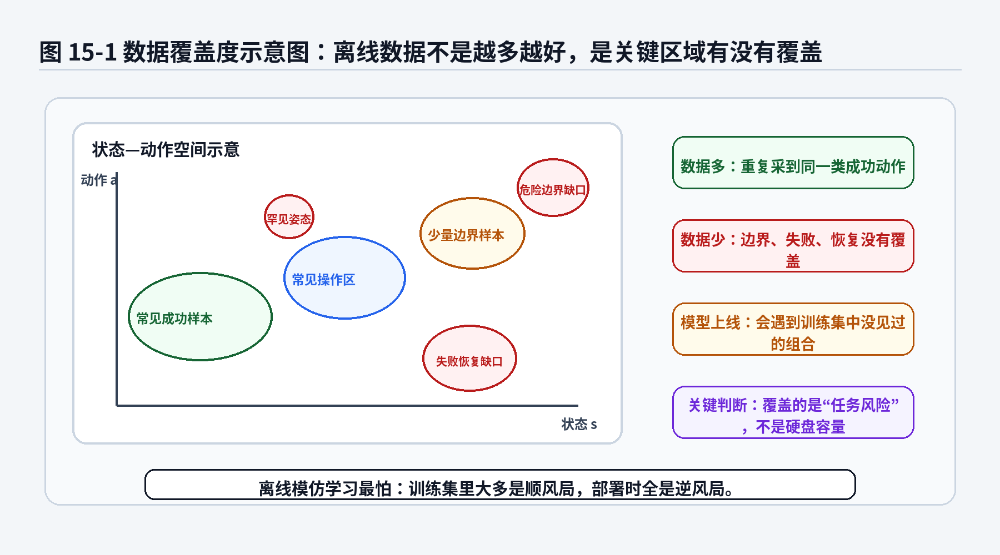
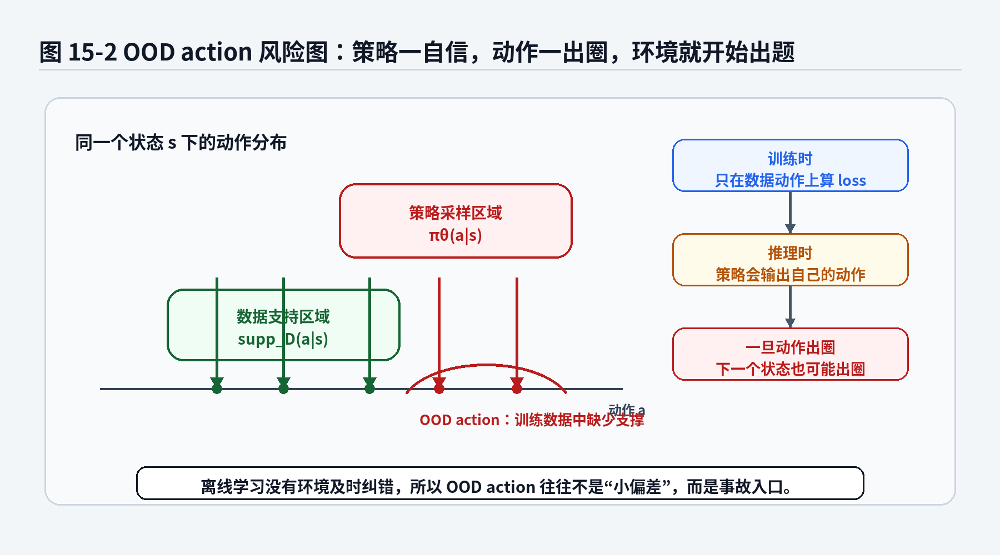
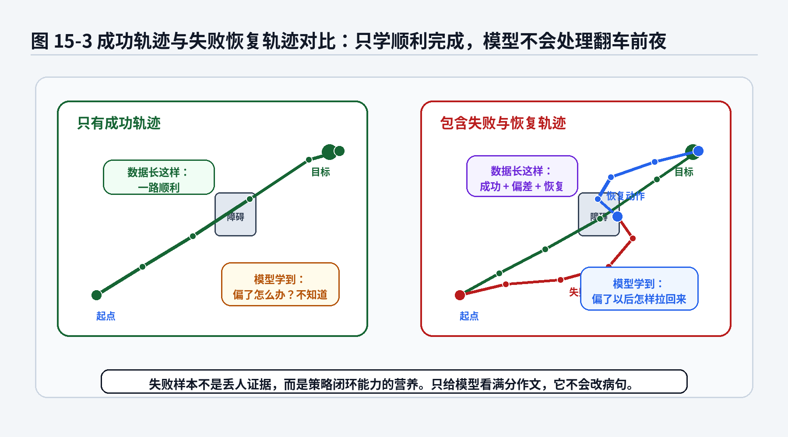
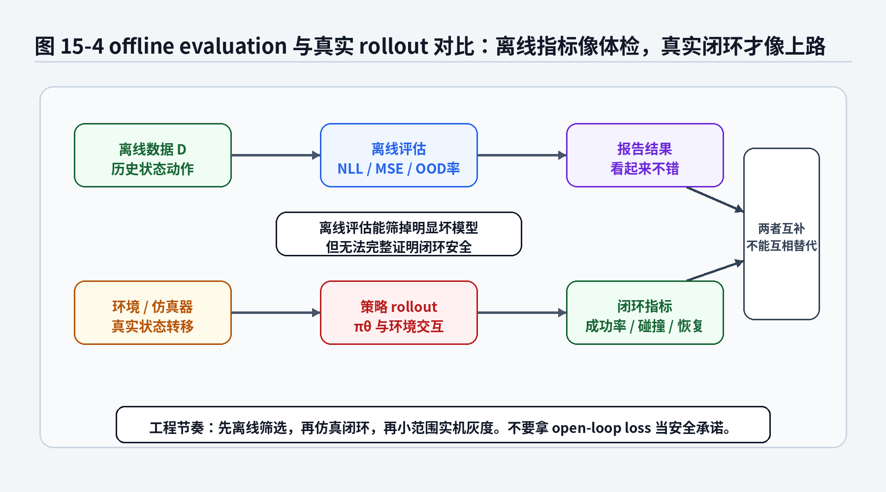

# 第12章：Offline Imitation Learning：离线数据不是越多越好，是坑有没有录进去

> **新版布局位置**：本章属于 **第三篇：经典模仿学习的分布匹配与奖励视角**。本章编号、公式编号与交叉引用已按新版八篇结构统一调整。


> **本章一句话导读**：本章讨论离线模仿学习中的数据覆盖、OOD 动作和失败恢复，提醒读者离线数据不是越多越安全。


> 第10章讲 IRL 时，我们已经看到一个现实问题：很多方法需要让当前策略去环境里 rollout，才能判断它和专家行为差多远，或者它在某个 reward 下表现如何。但真实机器人不是游戏角色，撞坏夹具、刮花工件、蹭到车库柱子，都不是“重开一局”就能解决的事。第12章进入 Offline Imitation Learning：当我们只能拿着已有数据训练策略时，真正要关心的不是数据有多少 TB，而是数据有没有覆盖模型上线后会遇到的坑。

---

## 1. 本章开场：离线数据像监控录像，不像驾驶教练

很多机器人学习项目的第一反应是：

> 先采数据，采得越多越好。

这句话只对了一半。数据确实重要，但“多”不等于“够用”。

想象一个工厂机械臂项目。现场采了 5000 条遥操作轨迹，大多数轨迹都很漂亮：工件摆得标准，相机光照稳定，夹具没有磨损，托盘没有变形，机器人一路顺利完成抓取和放置。训练一个 BC 模型，离线 MSE 很低，视频回放也挺像专家。大家开会时信心满满，像刚做完体检发现所有指标都在正常范围。

结果一上线，问题开始冒出来：

- 工件稍微歪一点，模型没有见过；
- 托盘槽口变形，模型不知道该怎样微调；
- 抓取时夹具轻微打滑，模型没有恢复动作；
- 相机画面抖了一下，模型继续按原动作输出；
- 进入一个训练集中没有覆盖的状态后，后续动作越来越怪。

这时你才发现，训练集更像一堆监控录像。它记录了过去发生过什么，但它不会像驾驶教练一样在你快撞上时踩副刹车。

离线模仿学习的核心矛盾就在这里：

> 我们想只依赖历史数据训练策略，但策略部署后会主动影响自己未来看到的数据分布。

这句话很绕，我们拆开说。

在监督学习里，一张图片不会因为分类器预测错了，就自己变成另一张更难的图片。猫还是猫，狗还是狗，最多是预测标签错了。

机器人不一样。一个动作错了，会改变下一个状态。下一个状态一变，模型又可能更错。于是错误会沿着时间滚雪球。这件事第3章和第6章已经讲过。第12章要进一步追问：

> 如果训练时不允许在线试错，只能看离线数据，这个滚雪球问题会被怎样放大？

本章标题说“离线数据不是越多越好，是坑有没有录进去”。这不是故意说俏皮话，而是离线学习的工程真相。

你有一百万条顺利轨迹，但没有失败恢复轨迹，模型就可能是一个“只见过晴天的新手司机”。它能在阳光明媚的直路上开得像模像样，一遇到雨天、并线、前车急刹，就开始现场创作。



**图12-1 说明**：
- 绿色和蓝色区域表示离线数据覆盖较多的常见状态—动作组合；
- 红色空洞表示失败、恢复、危险边界、罕见姿态等缺口；
- 训练 loss 主要由数据覆盖区域决定；
- 部署风险往往来自这些没有覆盖或覆盖很少的区域；
- 所以离线数据质量不能只看数量，而要看任务风险是否被覆盖。

---

## 2. 本章要解决的核心问题

本章围绕以下 18 个问题展开：

1. 什么是 Offline Imitation Learning？它和普通 BC 有什么关系？
2. 为什么说 BC 本来就是一种离线学习，但离线模仿学习的问题比 BC 更大？
3. offline dataset <span class="math">\\(\mathcal{D}\\)</span> 在数学上怎么表示？
4. behavior policy <span class="math">\\(\beta(a|s)\\)</span> 是什么？为什么数据不是从天上掉下来的？
5. dataset distribution 和 policy-induced distribution 有什么区别？
6. support 是什么？为什么数据分布支撑集很重要？
7. support mismatch 为什么会让模型在部署时自信地干错事？
8. OOD action 是什么？为什么动作出圈会导致状态继续出圈？
9. 为什么“成功轨迹很多”不代表“策略能处理失败”？
10. 失败轨迹、恢复轨迹、边界轨迹为什么很值钱？
11. offline evaluation 能评价什么，不能评价什么？
12. 为什么 open-loop loss 不能直接等价于 closed-loop success rate？
13. conservative learning 在离线模仿学习中解决什么问题？
14. 行为克隆、GAIL、IRL、Offline RL 在离线数据问题上各自有什么限制？
15. 自动驾驶路采数据和机器人遥操作数据在覆盖问题上有什么相似处？
16. 泊车数据应该怎样组织成功、失败、恢复和边界样本？
17. 离线数据如何为第17章 Decision Transformer 铺垫？
18. 工程上怎样建立一个离线模仿学习的数据闭环？

---


### 主线定位与统一例子

为了让本章不变成孤立知识点，读本章时请始终把公式落回两个统一例子：

- **二维点机器人跟随专家轨迹**：状态可写成位置/速度，动作可写成二维控制量，适合观察状态分布、轨迹分布和误差累积。
- **机械臂末端运动/抓取轨迹模仿**：观测包含图像或本体状态，动作包含末端位姿增量或关节控制量，适合理解连续动作、多模态动作、动作块和实机闭环。

- **承接前文**：承接前面对分布、轨迹与 reward 的讨论。
- **本章推进**：说明离线模仿学习的核心风险在 support mismatch 和 OOD action。
- **铺垫后文**：为第17章 Decision Transformer 利用离线轨迹并加入 return 条件做准备。
- **公式阅读抓手**：离线数据不是越多越好，关键是是否覆盖策略部署时可能进入的状态和恢复动作。
- **建议同步回看**：附录 B、F、H。

## 3. 什么是 Offline Imitation Learning

Offline Imitation Learning 可以翻译为“离线模仿学习”。它的基本设定是：

> 给定一批已经采好的轨迹数据，训练一个策略；训练过程中不允许或很少允许当前策略与环境交互。

数学上，我们有一个离线数据集：

<div class="math">\[
\mathcal{D}
=
\{\tau_i\}_{i=1}^{N} \tag{12.1}\]</div>

每条轨迹是：

<div class="math">\[
\tau_i
=
(s_0^i,a_0^i,s_1^i,a_1^i,\dots,s_T^i,a_T^i) \tag{12.2}\]</div>

如果是机器人视觉任务，状态 <span class="math">\\(s\_t\\)</span> 经常换成观测 <span class="math">\\(o\_t\\)</span>：

<div class="math">\[
\tau_i
=
(o_0^i,a_0^i,o_1^i,a_1^i,\dots,o_T^i,a_T^i) \tag{12.3}\]</div>

这里的 <span class="math">\\(o\_t\\)</span> 可以是图像、深度图、机器人关节状态、末端位姿、力传感器读数、任务指令等组合。

离线模仿学习训练出来一个策略：

<div class="math">\[
\pi_\theta(a|s)
\quad \text{或} \quad
\pi_\theta(a|o) \tag{12.4}\]</div>

它在推理时根据当前状态或观测输出动作。

### 公式拆解：离线数据集

公式：

<div class="math">\[
\mathcal{D}
=
\{\tau_i\}_{i=1}^{N} \tag{12.5}\]</div>

它要解决的问题：

把“我们采集到的历史经验”表示成一个可以训练模型的数据集合。

符号解释：

- <span class="math">\\(\mathcal{D}\\)</span>：离线数据集；
- <span class="math">\\(N\\)</span>：轨迹条数；
- <span class="math">\\(\tau\_i\\)</span>：第 <span class="math">\\(i\\)</span> 条轨迹；
- 轨迹中包含一串状态和动作；
- 数据已经固定，训练时不能随便要求环境再补一条新轨迹。

直觉理解：

离线数据集像一批旧行车记录仪、遥操作日志或仿真录屏。你能反复回看，但不能让过去的专家重新帮你演示“刚才那个偏差状态应该怎么救”。

工程含义：

在机械臂项目中，<span class="math">\\(\mathcal{D}\\)</span> 可能来自遥操作；在自动驾驶中，<span class="math">\\(\mathcal{D}\\)</span> 可能来自路采车；在泊车中，<span class="math">\\(\mathcal{D}\\)</span> 可能来自实车泊车日志、仿真轨迹和人工标注的失败案例。

常见误解：

不要把 <span class="math">\\(\mathcal{D}\\)</span> 理解成真实世界的完整百科全书。它只是某些采集策略、某些场景、某些设备、某些操作员在某段时间里留下的有限样本。

---

## 4. BC 本来就是离线的，为什么还要单独讲 Offline Imitation Learning

看到这里，读者可能会问：

> 第2章的 Behavior Cloning 不就是拿离线数据训练吗？为什么第12章还要讲 Offline Imitation Learning？

这个问题很关键。

BC 确实通常是离线训练的。它的目标是：

<div class="math">\[
\min_\theta
\mathbb{E}_{(s,a)\sim\mathcal{D}}
[-\log \pi_\theta(a|s)] \tag{12.6}\]</div>

或者连续动作下用 MSE：

<div class="math">\[
\min_\theta
\mathbb{E}_{(s,a)\sim\mathcal{D}}
\left[
\|a-\pi_\theta(s)\|_2^2
\right] \tag{12.7}\]</div>

但第12章不是简单重复 BC，而是把视角从“怎么拟合数据动作”换成：

> 数据分布能不能支撑策略闭环执行？

BC 的训练目标只在 <span class="math">\\(\mathcal{D}\\)</span> 中出现的样本上算 loss。它不会主动问：

- 这个状态附近有没有失败样本？
- 这个动作是不是训练数据支持的？
- 当前策略输出的动作会不会把系统带到数据集外？
- 模型遇到偏差状态后有没有恢复经验？
- 离线评估指标能不能说明真实闭环安全？

Offline Imitation Learning 关注的是这些问题。

换句话说：

> BC 是离线模仿学习里最朴素的一种训练方法；Offline Imitation Learning 是围绕“只用离线数据训练策略”产生的一整套风险、约束、评估和改进思路。

### 公式拆解：离线 BC 目标

公式：

<div class="math">\[
\mathcal{L}_{\text{BC}}(\theta)
=
\mathbb{E}_{(s,a)\sim\mathcal{D}}
[-\log \pi_\theta(a|s)] \tag{12.8}\]</div>

它要解决的问题：

让策略在数据集中出现过的状态 <span class="math">\\(s\\)</span> 上，提高专家动作 <span class="math">\\(a\\)</span> 的概率。

符号解释：

- <span class="math">\\(\mathcal{L}\_{\text{BC}}(\theta)\\)</span>：行为克隆损失；
- <span class="math">\\(\theta\\)</span>：策略网络参数；
- <span class="math">\\((s,a)\sim\mathcal{D}\\)</span>：训练样本来自离线数据；
- <span class="math">\\(\pi\_\theta(a|s)\\)</span>：策略在状态 <span class="math">\\(s\\)</span> 下输出动作 <span class="math">\\(a\\)</span> 的概率；
- <span class="math">\\(-\log\\)</span>：专家动作概率越低，惩罚越大。

直觉理解：

BC 像让模型背诵专家答案：看到这个状态，专家做了这个动作，你也尽量给这个动作高分。

工程含义：

这个目标很稳定、简单、便宜，是几乎所有机器人模仿学习项目都应该先做的 baseline。问题在于，它只保证“历史样本上像专家”，不保证“闭环执行时能从偏差里救回来”。

常见误解：

离线 BC loss 下降，不等于真实部署风险下降。尤其当训练集主要由成功顺风局组成时，loss 可能很漂亮，但模型对逆风局一无所知。

---

## 5. behavior policy：数据不是从真空里长出来的

离线数据不是宇宙随机生成的。每一条数据背后都有一个“产生它的策略”。这个策略叫 behavior policy，记作：

<div class="math">\[
\beta(a|s) \tag{12.9}\]</div>

它表示：采集数据时，在状态 <span class="math">\\(s\\)</span> 下，采集者采取动作 <span class="math">\\(a\\)</span> 的概率。

这里的 <span class="math">\\(\beta\\)</span> 可以是很多东西：

- 人类遥操作员；
- 老版本机器人策略；
- 规则控制器；
- MPC / 规划器；
- 安全员接管后的混合策略；
- 多个专家和半专家混在一起的策略集合。

所以数据集 <span class="math">\\(\mathcal{D}\\)</span> 并不是“专家真理”。它更像是：

<div class="math">\[
\mathcal{D} \sim p_\beta(\tau) \tag{12.10}\]</div>

这表示轨迹来自 behavior policy <span class="math">\\(\beta\\)</span> 与环境交互产生的轨迹分布。

### 公式拆解：behavior policy 诱导的数据分布

公式：

<div class="math">\[
\mathcal{D} \sim p_\beta(\tau) \tag{12.11}\]</div>

它要解决的问题：

说明离线数据不是无偏的世界全集，而是由某个采集策略 <span class="math">\\(\beta\\)</span> 产生的样本。

符号解释：

- <span class="math">\\(\beta(a|s)\\)</span>：采集数据时使用的行为策略；
- <span class="math">\\(p\_\beta(\tau)\\)</span>：由 <span class="math">\\(\beta\\)</span> 和环境动力学共同诱导出的轨迹分布；
- <span class="math">\\(\mathcal{D}\sim p\_\beta(\tau)\\)</span>：数据集中的轨迹可以看成从这个分布采样得到。

直觉理解：

谁采的数据，数据就带着谁的习惯。老司机数据、保守规则数据、激进测试员数据、半成品模型数据，覆盖的状态和动作会很不一样。

工程含义：

在机器人项目中，采集员水平、遥操作延迟、夹具状态、场景布置、是否允许失败、是否记录接管，都会影响 <span class="math">\\(\beta\\)</span>。如果不理解 <span class="math">\\(\beta\\)</span>，就很难判断数据集支持什么策略。

常见误解：

不要把数据集里的动作都当成专家动作。很多真实日志里混有犹豫、接管、误操作、恢复、失败、设备异常和标注错误。它们需要被区分，而不是一股脑塞进 BC loss。

---

## 6. dataset distribution 与 policy-induced distribution

离线数据来自 <span class="math">\\(\beta\\)</span>，但部署时执行的是新策略 <span class="math">\\(\pi\_\theta\\)</span>。这两个策略会诱导不同的状态—动作分布。

数据分布可以写成：

<div class="math">\[
\rho_\beta(s,a) \tag{12.12}\]</div>

新策略部署后的访问分布可以写成：

<div class="math">\[
\rho_{\pi_\theta}(s,a) \tag{12.13}\]</div>

第11章讲 GAIL 时，我们已经见过 occupancy measure。这里继续用它，因为离线学习最关心的就是：

> <span class="math">\\(\rho\_{\pi\_\theta}\\)</span> 会不会跑到 <span class="math">\\(\rho\_\beta\\)</span> 没覆盖的地方？

如果新策略闭环执行时访问的状态—动作对都在数据分布附近，离线学习还有一定可信度。

如果新策略访问大量数据没覆盖的区域，事情就危险了。模型在这些区域的输出，本质上是神经网络外推。外推有时像老司机凭经验判断，有时像实习生闭眼猜答案。

### 公式拆解：数据分布与部署分布

公式：

<div class="math">\[
\rho_\beta(s,a)
\quad \text{vs} \quad
\rho_{\pi_\theta}(s,a) \tag{12.14}\]</div>

它要解决的问题：

区分“训练数据覆盖了哪里”和“新策略部署后会走到哪里”。

符号解释：

- <span class="math">\\(\rho\_\beta(s,a)\\)</span>：behavior policy 在采集数据时访问状态—动作对的频率；
- <span class="math">\\(\rho\_{\pi\_\theta}(s,a)\\)</span>：学习策略闭环执行时访问状态—动作对的频率；
- 二者都不只是动作分布，而是状态和动作共同组成的访问分布。

直觉理解：

数据集像过去的路线热力图；新策略像即将上路的司机。如果新司机只在热力图亮的地方开，风险较小；如果新司机拐进热力图一片漆黑的小路，导航软件也可能开始沉默。

工程含义：

在泊车任务中，<span class="math">\\(\rho\_\beta\\)</span> 可能覆盖了标准车位、正常光照、规则起始姿态；而 <span class="math">\\(\rho\_{\pi\_\theta}\\)</span> 上线后可能进入偏斜车位、遮挡车位线、轮胎压线、障碍物贴近等区域。真正危险的是二者的差。

常见误解：

不要只比较训练动作和专家动作。更重要的是，策略执行自己的动作后，会不会把未来状态带到数据集没有覆盖的区域。

---

## 7. support：分布真正“托得住”的地方

为了讲 support mismatch，需要先讲 support。

对于一个分布 <span class="math">\\(p(x)\\)</span>，它的 support 可以粗略理解为：

> 这个分布有可能产生样本的区域。

写成符号：

<div class="math">\[
\mathrm{supp}(p)
=
\{x\mid p(x)>0\} \tag{12.15}\]</div>

在离线模仿学习中，我们关心的是状态—动作分布的 support：

<div class="math">\[
\mathrm{supp}(\rho_\beta)
=
\{(s,a)\mid \rho_\beta(s,a)>0\} \tag{12.16}\]</div>

这表示数据采集策略真正覆盖过哪些状态—动作对。

如果某个 <span class="math">\\((s,a)\\)</span> 不在 <span class="math">\\(\mathrm{supp}(\rho\_\beta)\\)</span> 里，数据集没有告诉模型：在这个状态做这个动作会发生什么，也没有告诉模型这个动作是不是安全。

这就是离线学习最核心的恐怖片开头：

> 模型在一个数据没覆盖的状态下，输出了一个数据没覆盖的动作。



**图12-2 说明**：
- 绿色区域表示数据集中支持的动作范围；
- 红色区域表示当前策略可能输出但数据中缺少支撑的动作；
- 训练时 loss 只约束绿色区域里的专家动作；
- 推理时策略输出红色区域动作后，环境会转移到新的状态；
- 新状态也可能继续超出数据覆盖，形成连锁偏移。

### 公式拆解：support 的定义

公式：

<div class="math">\[
\mathrm{supp}(p)
=
\{x\mid p(x)>0\} \tag{12.17}\]</div>

它要解决的问题：

描述一个分布在哪些区域有样本支撑。

符号解释：

- <span class="math">\\(p(x)\\)</span>：变量 <span class="math">\\(x\\)</span> 的概率分布；
- <span class="math">\\(p(x)>0\\)</span>：该区域有可能出现样本；
- <span class="math">\\(\mathrm{supp}(p)\\)</span>：分布的支撑集。

直觉理解：

support 像地图上已经有人走过的路。走过的地方不一定安全，但至少有经验；没走过的地方不是一定危险，但模型没有证据证明它安全。

工程含义：

在连续状态和连续动作空间里，严格的 <span class="math">\\(p(x)>0\\)</span> 很难直接判断。工程上通常用近邻距离、密度估计、embedding 相似度、动作范围、规则边界等方式近似判断“这个样本离数据分布远不远”。

常见误解：

不要把 support 理解成“训练集里完全一模一样的样本”。连续空间中几乎不会遇到完全相同的状态。我们更关心的是：当前状态—动作是否在训练数据覆盖的邻域里。

---

## 8. support mismatch：策略走到了数据托不住的地方

support mismatch 指的是：

> 学习策略可能访问的状态—动作区域，超出了离线数据支持的区域。

理想情况可以写成：

<div class="math">\[
\mathrm{supp}(\rho_{\pi_\theta})
\subseteq
\mathrm{supp}(\rho_\beta) \tag{12.18}\]</div>

意思是，新策略访问的地方都被数据覆盖过。

危险情况是：

<div class="math">\[
\mathrm{supp}(\rho_{\pi_\theta})
\nsubseteq
\mathrm{supp}(\rho_\beta) \tag{12.19}\]</div>

意思是，新策略会走到数据没覆盖的区域。

这两个公式看起来像集合关系，背后却是很朴素的工程问题：

> 你训练模型时给它看的世界，和上线后它自己闯进去的世界，是不是同一个世界？

### 公式拆解：support mismatch

公式：

<div class="math">\[
\mathrm{supp}(\rho_{\pi_\theta})
\nsubseteq
\mathrm{supp}(\rho_\beta) \tag{12.20}\]</div>

它要解决的问题：

表达学习策略部署后可能访问离线数据未覆盖区域的风险。

符号解释：

- <span class="math">\\(\rho\_{\pi\_\theta}\\)</span>：学习策略的闭环访问分布；
- <span class="math">\\(\rho\_\beta\\)</span>：离线数据采集策略的访问分布；
- <span class="math">\\(\mathrm{supp}(\cdot)\\)</span>：分布支撑集；
- <span class="math">\\(\nsubseteq\\)</span>：不是子集，表示存在策略会访问但数据没有覆盖的区域。

直觉理解：

数据像安全垫。support mismatch 就是策略跳出了安全垫，还以为自己在体操馆里。

工程含义：

在自动驾驶中，路采数据可能很少覆盖极端 cut-in、施工绕行、低附着路面；在机械臂中，数据可能很少覆盖夹取失败、托盘变形、工件重叠；在泊车中，数据可能很少覆盖斜坡、暗光、车位线破损和狭窄空间恢复。模型上线后遇到这些区域，就容易依赖外推。

常见误解：

support mismatch 不只是“训练集和测试集不一样”。它更严重，因为策略的动作会改变未来状态。一次出圈动作，可能把后续十几步都带出数据分布。

---

## 9. OOD action：动作一出圈，状态也会跟着出圈

OOD 是 out-of-distribution 的缩写，意思是分布外。

在离线模仿学习里，OOD action 指的是：在某个状态 <span class="math">\\(s\\)</span> 下，策略输出了数据中缺少支撑的动作。

可以用一个距离函数表达：

<div class="math">\[
d\big((s,a),\mathcal{D}\big) > \epsilon \tag{12.21}\]</div>

这里 <span class="math">\\(d((s,a),\mathcal{D})\\)</span> 表示当前状态—动作对到数据集的距离，<span class="math">\\(\epsilon\\)</span> 是一个阈值。

这不是一个唯一标准公式，而是一个工程直觉公式。不同系统会用不同的距离：

- 原始状态和动作的欧氏距离；
- 神经网络 embedding 距离；
- 最近邻距离；
- 动作是否超出历史分位数；
- 状态是否落在已知场景标签之外；
- 规则约束是否被触发。

OOD action 可怕的地方在于，它不是一次性的。

环境状态转移是：

<div class="math">\[
s_{t+1}\sim P(s_{t+1}|s_t,a_t) \tag{12.22}\]</div>

如果 <span class="math">\\(a\_t\\)</span> 是 OOD action，那么 <span class="math">\\(s\_{t+1}\\)</span> 也可能变成 OOD state。接下来模型又在 OOD state 上输出动作，风险继续放大。

这就像开车时错过一个路口。你不是只错了一步，而是进入了一条导航没准备好的支路。接下来每一步都更尴尬。

### 公式拆解：OOD action 距离判断

公式：

<div class="math">\[
d\big((s,a),\mathcal{D}\big) > \epsilon \tag{12.23}\]</div>

它要解决的问题：

用一个可计算的近似指标判断当前状态—动作是否远离离线数据。

符号解释：

- <span class="math">\\(d((s,a),\mathcal{D})\\)</span>：状态—动作对到数据集的距离；
- <span class="math">\\(\epsilon\\)</span>：人为设定或统计估计的阈值；
- 大于 <span class="math">\\(\epsilon\\)</span>：说明当前样本距离已有数据较远，可能属于 OOD 区域。

直觉理解：

如果模型现在做的事，在历史数据里找不到类似案例，那它可能不是“创新”，而是在没有经验的地方瞎走。

工程含义：

可以把 OOD 检测作为部署保护：当状态或动作偏离数据覆盖区域时，降低速度、触发规则控制器、请求人工接管、进入保守模式，或者拒绝执行高风险动作。

常见误解：

OOD 检测不是完美安全证明。距离近不代表安全，距离远也不一定危险。它是风险提示器，不是免死金牌。

### 公式拆解：动作出圈如何影响下一个状态

公式：

<div class="math">\[
s_{t+1}\sim P(s_{t+1}|s_t,a_t) \tag{12.24}\]</div>

它要解决的问题：

说明机器人动作会通过环境动力学影响未来状态。

符号解释：

- <span class="math">\\(s\_t\\)</span>：当前状态；
- <span class="math">\\(a\_t\\)</span>：当前动作；
- <span class="math">\\(P(s\_{t+1}|s\_t,a\_t)\\)</span>：环境状态转移分布；
- <span class="math">\\(s\_{t+1}\\)</span>：下一时刻状态。

直觉理解：

机器人不是在静态试卷上填答案。它每填一个答案，试卷下一题都会变。

工程含义：

机械臂末端偏一点，会改变接触状态；自动驾驶方向盘多打一点，会改变车辆姿态；泊车速度没控住，会改变下一帧障碍距离。离线数据没有覆盖这些后果时，模型无法从数据中学到可靠恢复策略。

常见误解：

不要把 OOD action 只看成动作数值异常。一个动作数值本身可能不大，但在某个特定状态下没有数据支撑，也可能非常危险。

---

## 10. 为什么成功轨迹很多还不够

很多数据集喜欢记录成功轨迹，因为成功轨迹干净、漂亮、容易讲故事。论文视频也喜欢放成功片段，毕竟“机器人连续失败 30 次，最后一次勉强成功”不太适合当宣传封面。

但工程上，失败轨迹和恢复轨迹非常有价值。

成功轨迹告诉模型：

> 标准情况下，任务怎么做。

失败轨迹告诉模型：

> 哪些状态很危险，哪些动作会把系统带沟里。

恢复轨迹告诉模型：

> 偏了以后，怎样把系统拉回来。

如果数据只有成功轨迹，策略可能会学到一条狭窄的“理想路线”。一旦因为感知误差、执行误差、外界扰动进入路线旁边的区域，它就不知道该如何修正。



**图12-3 说明**：
- 左侧只有顺利完成轨迹，模型主要学到理想路径；
- 右侧包含失败接近和恢复动作，模型能看到偏差后的处理方式；
- 失败样本不是“脏数据”的同义词；
- 关键是标注清楚失败原因、风险状态和恢复动作。

在机械臂“抓取 + 精准摆入治具”任务中，尤其需要记录：

- 抓取稍偏但仍可调整的轨迹；
- 工件接触槽口边缘后的微调轨迹；
- 托盘位置偏差导致插入失败的轨迹；
- 夹具轻微打滑后的恢复轨迹；
- 相机抖动或定位异常时的安全停机轨迹。

这些数据不一定都用于普通 BC。它们也可以用于：

- 训练恢复策略；
- 训练失败预测器；
- 训练 OOD 检测器；
- 设计规则 fallback；
- 做离线评估压力测试。

### 公式拆解：成功数据与恢复数据的混合

可以把数据集拆成几类：

<div class="math">\[
\mathcal{D}
=
\mathcal{D}_{\text{success}}
\cup
\mathcal{D}_{\text{failure}}
\cup
\mathcal{D}_{\text{recovery}}
\cup
\mathcal{D}_{\text{boundary}} \tag{12.25}\]</div>

它要解决的问题：

提醒我们不要把所有离线数据都当成同一种“专家演示”。不同数据承担不同训练和评估作用。

符号解释：

- <span class="math">\\(\mathcal{D}\_{\text{success}}\\)</span>：顺利完成任务的数据；
- <span class="math">\\(\mathcal{D}\_{\text{failure}}\\)</span>：失败过程或失败前状态；
- <span class="math">\\(\mathcal{D}\_{\text{recovery}}\\)</span>：从偏差状态恢复的数据；
- <span class="math">\\(\mathcal{D}\_{\text{boundary}}\\)</span>：边界工况、罕见状态、接近风险的数据；
- <span class="math">\\(\cup\\)</span>：集合并集，表示总数据由这些部分组成。

直觉理解：

一个成熟数据集不应该只是“满分作文合集”，还应该有错题本、批改记录、补救过程和高难度模拟题。

工程含义：

数据入库时要打标签：成功、失败、恢复、接管、异常、边界、传感器问题、执行器问题。否则后面训练时很难知道哪些动作该模仿，哪些状态该避开，哪些轨迹该作为风险案例。

常见误解：

失败数据不是直接拿来让策略模仿“失败动作”。失败数据需要按用途处理。错误动作可以作为负样本或风险样本；恢复动作可以作为正样本；失败前状态可以用于预警和保守控制。

---

## 11. conservative learning：让策略别太敢

离线学习最怕模型在数据外过度自信。

所以很多离线方法都会引入保守思想。保守不是让机器人变笨，而是让它承认：

> 数据没覆盖的地方，我没有资格装懂。

在模仿学习里，一个简单的保守目标可以写成：

<div class="math">\[
\mathcal{L}_{\text{offline}}(\theta)
=
\mathcal{L}_{\text{BC}}(\theta)
+
\lambda\mathcal{L}_{\text{cons}}(\theta) \tag{12.26}\]</div>

其中 <span class="math">\\(\mathcal{L}\_{\text{cons}}\\)</span> 是保守惩罚项。

一种直觉写法是：

<div class="math">\[
\mathcal{L}_{\text{cons}}(\theta)
=
\mathbb{E}_{s\sim\mathcal{D},\,a\sim\pi_\theta(\cdot|s)}
\left[c_{\text{ood}}(s,a)\right] \tag{12.27}\]</div>

这里 <span class="math">\\(c\_{\text{ood}}(s,a)\\)</span> 表示动作 <span class="math">\\(a\\)</span> 在状态 <span class="math">\\(s\\)</span> 下离数据支持区域越远，惩罚越大。

这个公式不代表所有离线算法的标准形式，而是帮助理解保守学习的核心精神：

> 模仿专家动作的同时，惩罚离数据太远的动作。

另一种常见思路是让策略不要离估计出来的 behavior policy 太远：

<div class="math">\[
\mathbb{E}_{s\sim\mathcal{D}}
\left[
D_{\mathrm{KL}}
\left(
\pi_\theta(\cdot|s)
\,\|\,
\hat\beta(\cdot|s)
\right)
\right] \tag{12.28}\]</div>

这里 <span class="math">\\(\hat\beta\\)</span> 是从数据中估计的 behavior policy。

这相当于告诉策略：

> 你可以比数据里的行为更好，但不要跳得太远。跳远之前，先证明那里有地板。

### 公式拆解：保守离线目标

公式：

<div class="math">\[
\mathcal{L}_{\text{offline}}(\theta)
=
\mathcal{L}_{\text{BC}}(\theta)
+
\lambda\mathcal{L}_{\text{cons}}(\theta) \tag{12.29}\]</div>

它要解决的问题：

在拟合专家动作的同时，限制策略远离离线数据支持区域。

符号解释：

- <span class="math">\\(\mathcal{L}\_{\text{offline}}\\)</span>：离线训练总损失；
- <span class="math">\\(\mathcal{L}\_{\text{BC}}\\)</span>：行为克隆损失；
- <span class="math">\\(\mathcal{L}\_{\text{cons}}\\)</span>：保守惩罚；
- <span class="math">\\(\lambda\\)</span>：控制保守程度的权重。

直觉理解：

BC 负责“像专家”，保守项负责“别乱来”。二者缺一不可。只有 BC，模型可能自信外推；保守过强，模型可能什么都不敢做。

工程含义：

保守项可以来自动作范围、近邻距离、行为策略 KL、规则约束、模型不确定性、碰撞风险估计等。不同任务的保守机制不一样，但目标都是降低离线分布外决策风险。

常见误解：

保守学习不是万能保险。它能减少出圈动作，但可能牺牲任务成功率。工程上需要在安全、成功率、效率之间调权重。

### 公式拆解：行为策略 KL 约束

公式：

<div class="math">\[
D_{\mathrm{KL}}
\left(
\pi_\theta(\cdot|s)
\,\|\,
\hat\beta(\cdot|s)
\right) \tag{12.30}\]</div>

它要解决的问题：

度量学习策略在状态 <span class="math">\\(s\\)</span> 下的动作分布与数据行为策略的差异。

符号解释：

- <span class="math">\\(D\_{\mathrm{KL}}\\)</span>：KL 散度，用来度量两个分布差异；
- <span class="math">\\(\pi\_\theta(\cdot|s)\\)</span>：当前学习策略的动作分布；
- <span class="math">\\(\hat\beta(\cdot|s)\\)</span>：从数据估计出的 behavior policy；
- <span class="math">\\(\cdot|s\\)</span>：表示固定状态 <span class="math">\\(s\\)</span>，比较整个动作分布。

直觉理解：

这个约束像一根绳子，把新策略拴在数据行为附近。绳子太长，策略乱跑；绳子太短，策略无法改进。

工程含义：

在有多专家、多质量数据时，<span class="math">\\(\hat\beta\\)</span> 本身可能不纯。此时 KL 约束要配合数据分层、质量标签和任务阶段使用，否则可能把模型拴在坏行为附近。

常见误解：

KL 小不代表策略好。它只说明策略像数据采集行为。如果数据采集行为本身保守、低效或混有错误，策略也会继承这些问题。

---

## 12. offline evaluation：离线指标能筛模型，但不能给安全盖章

离线评估很重要。没有离线评估，模型迭代会变成“训练一个，上机撞一下，再训练一个，再上机撞一下”。这种开发方式对预算、设备和同事心态都不友好。

常见离线评估包括：

- 动作 MSE；
- NLL；
- action chunk 误差；
- 轨迹重放误差；
- OOD action rate；
- 最近邻距离；
- 不确定性分数；
- 与规则约束冲突次数；
- 按场景标签统计的分桶指标；
- 在仿真器中的闭环成功率。

但必须记住：

> 离线评估能筛掉很多坏模型，但不能完整证明真实闭环安全。

原因很简单。离线评估通常还是在 <span class="math">\\(\mathcal{D}\\)</span> 的状态上问模型：

> 如果你当时在这个状态，你会输出什么？

真实 rollout 问的是：

> 你输出自己的动作以后，环境会把你带到哪里？然后你还能不能继续处理？

这两个问题不是一回事。



**图12-4 说明**：
- 离线评估基于历史数据，适合快速筛掉动作误差大、明显出圈或违反规则的模型；
- 真实 rollout 评估策略与环境交互后的闭环表现；
- 二者互补，不能互相替代；
- 工程上应采用“离线筛选 → 仿真闭环 → 小范围实机灰度”的节奏。

### 公式拆解：真实策略性能目标

真实闭环性能可以写成：

<div class="math">\[
J(\pi)
=
\mathbb{E}_{\tau\sim p_\pi(\tau)}
\left[
\sum_{t=0}^{T}\gamma^t r(s_t,a_t)
\right] \tag{12.31}\]</div>

它要解决的问题：

描述策略真正上线后，在自己诱导的轨迹分布下能得到多少任务收益。

符号解释：

- <span class="math">\\(J(\pi)\\)</span>：策略真实闭环性能；
- <span class="math">\\(\tau\sim p\_\pi(\tau)\\)</span>：轨迹来自当前策略 <span class="math">\\(\pi\\)</span> 的 rollout；
- <span class="math">\\(r(s\_t,a\_t)\\)</span>：任务奖励或评价函数；
- <span class="math">\\(\gamma^t\\)</span>：折扣权重；
- <span class="math">\\(\mathbb{E}\\)</span>：对可能轨迹求平均。

直觉理解：

最终评判策略的，不是它在历史试卷上填得多像专家，而是它自己开车、自己抓取、自己泊车时，会把任务做成什么样。

工程含义：

离线评估只是在 <span class="math">\\(p\_\beta\\)</span> 相关数据上近似判断；真实部署关心的是 <span class="math">\\(p\_\pi\\)</span>。当 <span class="math">\\(p\_\pi\\)</span> 和 <span class="math">\\(p\_\beta\\)</span> 差距大时，离线指标会变得不可靠。

常见误解：

不要把 open-loop action error 当成最终 KPI。它是必要指标，但不是充分指标。

---

## 13. 离线策略评估为什么难：importance sampling 的警告

离线评估里有一个经典想法：既然不能让新策略在线 rollout，那能不能用旧数据估计新策略的表现？

如果数据来自 behavior policy <span class="math">\\(\beta\\)</span>，理论上可以用 importance sampling 写出：

<div class="math">\[
J(\pi)
=
\mathbb{E}_{\tau\sim p_\beta(\tau)}
\left[
\left(
\prod_{t=0}^{T}
\frac{\pi(a_t|s_t)}{\beta(a_t|s_t)}
\right)
R(\tau)
\right] \tag{12.32}\]</div>

其中：

<div class="math">\[
R(\tau)=\sum_{t=0}^{T}\gamma^t r(s_t,a_t) \tag{12.33}\]</div>

这个公式的意思是：用旧策略采到的轨迹，通过概率比值重新加权，估计新策略的回报。

公式很漂亮，工程上却经常让人头疼。原因有两个。

第一，乘积项可能非常不稳定：

<div class="math">\[
\prod_{t=0}^{T}
\frac{\pi(a_t|s_t)}{\beta(a_t|s_t)} \tag{12.34}\]</div>

只要某些时间步概率比值很大，整体权重就会爆炸。轨迹越长，问题越严重。

第二，如果 <span class="math">\\(\beta(a|s)=0\\)</span>，而 <span class="math">\\(\pi(a|s)>0\\)</span>，那么数据根本没有采到新策略想做的动作。此时旧数据无法告诉你新策略这样做会怎样。

这又回到了 support 问题。

### 公式拆解：importance sampling 离线评估

公式：

<div class="math">\[
J(\pi)
=
\mathbb{E}_{\tau\sim p_\beta(\tau)}
\left[
\left(
\prod_{t=0}^{T}
\frac{\pi(a_t|s_t)}{\beta(a_t|s_t)}
\right)
R(\tau)
\right] \tag{12.35}\]</div>

它要解决的问题：

尝试用 behavior policy 采集的离线轨迹估计新策略 <span class="math">\\(\pi\\)</span> 的期望回报。

符号解释：

- <span class="math">\\(p\_\beta(\tau)\\)</span>：旧数据轨迹分布；
- <span class="math">\\(\pi(a\_t|s\_t)\\)</span>：新策略在该状态下选择历史动作的概率；
- <span class="math">\\(\beta(a\_t|s\_t)\\)</span>：采集策略选择该动作的概率；
- <span class="math">\\(\prod\_t\\)</span>：整条轨迹上所有时间步概率比值相乘；
- <span class="math">\\(R(\tau)\\)</span>：轨迹回报。

直觉理解：

如果某条旧轨迹在新策略下也很可能发生，就给它更大权重；如果新策略不太可能走这条轨迹，就给它更小权重。

工程含义：

这个公式提醒我们：离线评估新策略需要知道或估计 behavior policy，并且要求新策略不要偏离旧数据太远。否则估计方差会很大，甚至没有意义。

常见误解：

不要以为有了离线日志就能可靠评估任意新策略。日志只对与采集策略足够接近的新策略有较强参考价值。

---

## 14. 自动驾驶路采数据：离线学习的典型大坑

自动驾驶是离线学习问题的放大镜。

路采车每天能积累大量数据，视频、雷达、CAN、规划控制、驾驶员接管记录都可以进库。数据量很大，看起来很适合训练模型。

但路采数据的分布由谁决定？由人类司机、测试路线、采集城市、天气、道路类型、车队策略、法规要求、测试安全边界共同决定。

这意味着：

- 数据里常见的是正常驾驶；
- 极端危险场景天然少；
- 人类司机经常提前规避风险，所以真正的临界状态更少；
- 接管动作可能混有驾驶员反应延迟；
- 很多“不能做”的动作没有负样本，因为安全员不会故意去做；
- 城市 A 采到的数据不一定覆盖城市 B 的道路习惯。

如果只用 BC 模仿人类驾驶，模型容易学到常见行为，但对罕见场景不可靠。

这也是为什么自动驾驶系统很少只依赖一个端到端 BC 模型直接闭环上车。工程上通常还会加入：

- 规则安全边界；
- 规划器约束；
- 碰撞检查；
- 场景库回放；
- 仿真评测；
- 闭环 replay；
- 接管分析；
- corner case mining；
- 灰度发布和安全员监督。

离线数据不是没用。相反，它是基础。但它必须被组织成数据闭环，而不是简单堆成硬盘山。

---

## 15. 机器人遥操作数据：不是每条演示都该一视同仁

机器人遥操作数据也有自己的坑。

遥操作员不是完全一致的“专家分布”。不同人会有不同习惯：

- 有的人动作快但容易贴边；
- 有的人动作慢但稳定；
- 有的人喜欢先粗定位再微调；
- 有的人喜欢一路连续修正；
- 有的人遇到异常会停下来观察；
- 有的人会硬把任务做完，留下危险示范。

如果把这些数据全部当成同质量专家数据，策略学到的可能是一个“平均操作员”。平均操作员听起来温和，实际可能是：既没有高手的果断，也没有保守专家的稳。

数据需要分层：

<div class="math">\[
\mathcal{D}
=
\bigcup_{k=1}^{K}\mathcal{D}^{(k)} \tag{12.36}\]</div>

其中 <span class="math">\\(\mathcal{D}^{(k)}\\)</span> 可以表示第 <span class="math">\\(k\\)</span> 类数据：不同操作者、不同任务阶段、不同质量等级、不同场景类型。

然后训练时可以使用权重：

<div class="math">\[
\mathcal{L}(\theta)
=
\sum_{k=1}^{K}w_k
\mathbb{E}_{(s,a)\sim\mathcal{D}^{(k)}}
[-\log \pi_\theta(a|s)] \tag{12.37}\]</div>

### 公式拆解：分层加权训练

公式：

<div class="math">\[
\mathcal{L}(\theta)
=
\sum_{k=1}^{K}w_k
\mathbb{E}_{(s,a)\sim\mathcal{D}^{(k)}}
[-\log \pi_\theta(a|s)] \tag{12.38}\]</div>

它要解决的问题：

让不同质量、不同类型、不同阶段的数据在训练中承担不同权重。

符号解释：

- <span class="math">\\(K\\)</span>：数据分组数量；
- <span class="math">\\(\mathcal{D}^{(k)}\\)</span>：第 <span class="math">\\(k\\)</span> 组数据；
- <span class="math">\\(w\_k\\)</span>：第 <span class="math">\\(k\\)</span> 组数据的训练权重；
- <span class="math">\\(-\log \pi\_\theta(a|s)\\)</span>：行为克隆损失；
- <span class="math">\\(\sum\_k\\)</span>：把各组损失加权汇总。

直觉理解：

不是所有演示都应该在课堂上同等发言。高手示范、恢复动作、失败负例、异常日志，各自有不同用途。

工程含义：

数据平台需要支持标签、分桶、权重、版本管理和回溯。否则训练过程很难回答：“这版模型变好，是因为数据更多，还是因为某类坏数据被放大了？”

常见误解：

加权不是随便拍脑袋。权重应该来自数据质量、场景风险、任务阶段、评估反馈和实际部署错误分析。

---

## 16. 泊车数据怎么组织：成功、失败、恢复和边界

结合泊车任务，可以把离线数据组织得更工程化。

一个泊车策略需要面对的不只是“标准车位 + 标准起点 + 车位线清晰”。更真实的数据结构应该包括：

1. **标准成功数据**
   - 正常车位；
   - 正常起始姿态；
   - 车位线清晰；
   - 周围障碍物稳定；
   - 专家泊车顺利完成。

2. **边界成功数据**
   - 起始角度偏大；
   - 车位较窄；
   - 旁车压线；
   - 地面线破损；
   - 光照差或反光。

3. **失败数据**
   - 感知误检导致目标车位错误；
   - 规划轨迹过于贴边；
   - 控制跟踪误差积累；
   - 车身姿态无法收敛；
   - 安全距离触发停机。

4. **恢复数据**
   - 泊歪后重新调整；
   - 距离障碍过近后回退；
   - 车位角度估计修正；
   - 轨迹中途重新规划；
   - 人类接管后的修正动作。

5. **不可模仿数据**
   - 传感器异常；
   - 人类误操作；
   - 标定错误；
   - 控制器故障；
   - 场景标签不可信。

这些数据不应该简单混在一起。更合理的是建立样本用途字段：

```text
sample_usage:
  - train_positive
  - train_recovery
  - train_negative
  - eval_stress
  - eval_safety
  - exclude
```

对于泊车算法工程来说，这比“又多采了 100 小时数据”更重要。

因为策略真正缺的，往往不是更多标准成功样本，而是那些让系统暴露短板的样本。

---

## 17. Offline Imitation、GAIL、IRL、Offline RL 的关系

第11章讲 GAIL，第10章讲 IRL，第12章讲 Offline Imitation Learning。它们之间的关系容易混。

可以这样理解：

**BC / ACT / Diffusion Policy** 主要问：

> 给定观测，动作怎么生成？

**GAIL** 主要问：

> 当前策略闭环访问的状态—动作分布，像不像专家？

**IRL** 主要问：

> 专家行为背后的 reward 是什么？

**Offline Imitation Learning** 主要问：

> 只靠已有数据训练策略，数据覆盖能不能支撑部署？

**Offline RL** 进一步问：

> 给定离线数据和 reward，能不能在不在线探索的情况下学到比 behavior policy 更好的策略？

Offline RL 经常关注 value function、Q function 和 Bellman backup。这里先不展开复杂算法，只抓住一个核心：

> Offline RL 和 Offline Imitation Learning 都害怕策略选择数据外动作。

区别在于，模仿学习更强调专家动作和示教数据；Offline RL 更强调利用 reward 从离线数据中优化策略。

它们都会遇到 support mismatch。

这也是为什么第12章放在第17章 Decision Transformer 前面。Decision Transformer 使用离线轨迹，把状态、动作、回报组织成序列来训练模型。它看起来像语言建模，但底层仍然绕不开离线数据覆盖问题。

---

## 18. 从离线数据到数据闭环：不要做一次性数据坟场

一个成熟的离线模仿学习项目，不应该只有“采集 → 训练 → 上线”三步。

更合理的流程是：

1. **采集数据**
   - 成功、失败、恢复、边界都要记录；
   - 记录采集策略、操作者、设备版本、场景标签；
   - 记录接管和异常。

2. **数据分层与清洗**
   - 区分专家动作、恢复动作、错误动作；
   - 标注任务阶段；
   - 剔除传感器异常和错误同步样本；
   - 保留失败原因。

3. **训练 baseline**
   - 先做 BC；
   - 再考虑 ACT、Diffusion Policy 或其他序列模型；
   - 不要一上来就把模型堆成论文封面。

4. **离线评估**
   - open-loop loss；
   - 分场景误差；
   - OOD action rate；
   - 规则冲突；
   - 恢复场景专项指标。

5. **仿真闭环评估**
   - 成功率；
   - 碰撞率；
   - 超时率；
   - 恢复成功率；
   - 对扰动的鲁棒性。

6. **小范围实机灰度**
   - 限制场景；
   - 限制速度；
   - 保留人工接管；
   - 记录所有失败。

7. **错误回流**
   - 把失败案例变成新数据；
   - 挖掘相似场景；
   - 更新评估集；
   - 再训练。

这条闭环最重要的思想是：

> 数据不是一次性燃料，而是系统持续改进的血液。

如果失败不上报、接管不记录、边界样本不分层、评估集不更新，离线模仿学习最终会变成“训练集纪念馆”。里面摆满历史样本，但帮不了下一次部署。

---

## 19. 本章工程落地建议

### 19.1 第一条：先建立数据字典，再谈大模型

很多项目会急着问：用 ACT 还是 Diffusion Policy？用多大 Transformer？要不要上 VLA？

这些问题不是不能问，但在离线学习项目里，第一件事应该是数据字典：

```text
trajectory_id
scene_type
task_stage
operator_id
policy_source
success_flag
failure_reason
recovery_flag
intervention_flag
safety_event
sensor_quality
action_validity
sample_usage
```

没有这些字段，后面很难做数据分层、失败分析、专项评估和回流。

### 19.2 第二条：训练集、验证集、压力测试集要分开

普通随机划分不够。

离线模仿学习至少应该有：

- 常规验证集：看基础拟合能力；
- 场景泛化验证集：看新场景、新工况；
- 边界压力测试集：看危险边界；
- 恢复专项集：看偏差后能否拉回来；
- 安全规则集：看是否触发危险动作。

如果验证集和训练集一样顺风顺水，评估就会像给学生提前泄题。

### 19.3 第三条：把 OOD 指标放进模型报告

模型报告不要只写：

```text
val_loss: 0.012
```

还应该写：

```text
OOD_action_rate: 3.4%
near_boundary_error: 2.1x normal
recovery_success_in_sim: 72%
safety_rule_violation: 0.8%
uncertainty_high_case_count: 143
```

这些指标不一定完美，但它们能逼团队关注真实风险。

### 19.4 第四条：失败数据要进入版本管理

失败案例不能只在群里发视频吐槽。它应该进入数据系统：

- 失败原因；
- 对应模型版本；
- 场景标签；
- 是否可复现；
- 是否已进入训练集；
- 是否已进入评估集；
- 是否需要规则 fallback。

这就是从“项目救火”变成“系统改进”的分水岭。

### 19.5 第五条：离线策略永远需要安全外壳

无论模型离线指标多好，都需要安全外壳：

- 动作限幅；
- 速度限制；
- 碰撞检测；
- OOD 检测；
- 规则 fallback；
- 人工接管；
- 任务中止条件；
- 灰度发布策略。

离线模仿学习不是让模型单枪匹马冲进真实世界，而是让模型在可控边界内逐步承担更多决策。

---

## 20. 常见误区

### 20.1 误区一：数据越多，模型越安全

数据多只说明样本数量大，不说明风险覆盖充分。如果数据主要来自重复成功场景，模型会更擅长重复成功场景，但不一定更会处理失败。

### 20.2 误区二：失败数据会污染模型，所以应该删掉

错误动作不能直接当正样本模仿，但失败过程本身很有价值。它可以用于风险识别、恢复策略、负样本建模、评估集构建和安全规则设计。

### 20.3 误区三：离线验证集 loss 低，就可以放心部署

离线 loss 低只说明模型在历史数据状态上输出接近数据动作。闭环部署还需要看策略诱导的新状态分布。

### 20.4 误区四：保守策略一定更安全

过度保守可能导致任务失败。例如泊车时一直不敢动，机械臂一直不敢接触，导航一直不敢穿过狭窄通道。安全不是停止一切动作，而是在风险可控下完成任务。

### 20.5 误区五：离线学习可以替代仿真和实机测试

离线学习可以减少无效实机测试，但不能完全替代闭环验证。真实系统里的延迟、摩擦、接触、标定误差、传感器噪声，都会让离线指标失真。

---

## 21. 核心公式拆解总表

本章已经在正文中拆解了多个公式，这里集中整理，方便复习。

### 21.1 离线数据集

<div class="math">\[
\mathcal{D}
=
\{\tau_i\}_{i=1}^{N} \tag{12.39}\]</div>

含义：由 <span class="math">\\(N\\)</span> 条历史轨迹组成的固定数据集。

### 21.2 轨迹表示

<div class="math">\[
\tau_i
=
(s_0^i,a_0^i,s_1^i,a_1^i,\dots,s_T^i,a_T^i) \tag{12.40}\]</div>

含义：一条轨迹由状态和动作序列组成。

### 21.3 离线 BC 目标

<div class="math">\[
\mathcal{L}_{\text{BC}}(\theta)
=
\mathbb{E}_{(s,a)\sim\mathcal{D}}
[-\log \pi_\theta(a|s)] \tag{12.41}\]</div>

含义：在离线数据状态上提高数据动作的概率。

### 21.4 连续动作 MSE 目标

<div class="math">\[
\mathbb{E}_{(s,a)\sim\mathcal{D}}
\left[
\|a-\pi_\theta(s)\|_2^2
\right] \tag{12.42}\]</div>

含义：用平方误差拟合连续动作。

### 21.5 behavior policy 数据来源

<div class="math">\[
\mathcal{D}\sim p_\beta(\tau) \tag{12.43}\]</div>

含义：离线数据由行为策略 <span class="math">\\(\beta\\)</span> 与环境交互产生。

### 21.6 数据分布与部署分布

<div class="math">\[
\rho_\beta(s,a)
\quad \text{vs} \quad
\rho_{\pi_\theta}(s,a) \tag{12.44}\]</div>

含义：训练数据覆盖区域与学习策略闭环访问区域可能不同。

### 21.7 support 定义

<div class="math">\[
\mathrm{supp}(p)=\{x\mid p(x)>0\} \tag{12.45}\]</div>

含义：分布可能产生样本的区域。

### 21.8 理想 support 覆盖

<div class="math">\[
\mathrm{supp}(\rho_{\pi_\theta})
\subseteq
\mathrm{supp}(\rho_\beta) \tag{12.46}\]</div>

含义：学习策略访问区域被离线数据支撑。

### 21.9 support mismatch

<div class="math">\[
\mathrm{supp}(\rho_{\pi_\theta})
\nsubseteq
\mathrm{supp}(\rho_\beta) \tag{12.47}\]</div>

含义：学习策略会访问离线数据未覆盖区域。

### 21.10 OOD 距离判断

<div class="math">\[
d((s,a),\mathcal{D})>\epsilon \tag{12.48}\]</div>

含义：当前状态—动作对距离数据集较远，可能属于分布外区域。

### 21.11 状态转移

<div class="math">\[
s_{t+1}\sim P(s_{t+1}|s_t,a_t) \tag{12.49}\]</div>

含义：动作会影响下一状态，因此 OOD action 可能诱发后续 OOD state。

### 21.12 数据分层

<div class="math">\[
\mathcal{D}
=
\mathcal{D}_{\text{success}}
\cup
\mathcal{D}_{\text{failure}}
\cup
\mathcal{D}_{\text{recovery}}
\cup
\mathcal{D}_{\text{boundary}} \tag{12.50}\]</div>

含义：成功、失败、恢复和边界数据需要区分用途。

### 21.13 保守离线目标

<div class="math">\[
\mathcal{L}_{\text{offline}}(\theta)
=
\mathcal{L}_{\text{BC}}(\theta)
+
\lambda\mathcal{L}_{\text{cons}}(\theta) \tag{12.51}\]</div>

含义：在拟合专家动作之外加入保守惩罚。

### 21.14 OOD 惩罚直觉

<div class="math">\[
\mathcal{L}_{\text{cons}}(\theta)
=
\mathbb{E}_{s\sim\mathcal{D},\,a\sim\pi_\theta(\cdot|s)}
[c_{\text{ood}}(s,a)] \tag{12.52}\]</div>

含义：惩罚策略在数据状态下采样出分布外动作。

### 21.15 行为策略 KL 约束

<div class="math">\[
D_{\mathrm{KL}}
\left(
\pi_\theta(\cdot|s)
\,\|\,
\hat\beta(\cdot|s)
\right) \tag{12.53}\]</div>

含义：限制学习策略不要过度偏离数据行为策略。

### 21.16 真实闭环性能

<div class="math">\[
J(\pi)
=
\mathbb{E}_{\tau\sim p_\pi(\tau)}
\left[
\sum_{t=0}^{T}\gamma^t r(s_t,a_t)
\right] \tag{12.54}\]</div>

含义：策略真正部署后，在自身诱导轨迹分布下的期望回报。

### 21.17 importance sampling 离线评估

<div class="math">\[
J(\pi)
=
\mathbb{E}_{\tau\sim p_\beta(\tau)}
\left[
\left(
\prod_{t=0}^{T}
\frac{\pi(a_t|s_t)}{\beta(a_t|s_t)}
\right)
R(\tau)
\right] \tag{12.55}\]</div>

含义：用旧数据通过概率比值估计新策略表现，但会遇到高方差和 support 问题。

### 21.18 分层加权训练

<div class="math">\[
\mathcal{L}(\theta)
=
\sum_{k=1}^{K}w_k
\mathbb{E}_{(s,a)\sim\mathcal{D}^{(k)}}
[-\log \pi_\theta(a|s)] \tag{12.56}\]</div>

含义：不同类型、质量和风险的数据用不同权重参与训练。

---

## 22. 本章公式索引

1. <span class="math">\\(\mathcal{D}=\{\tau\_i\}\_{i=1}^{N}\\)</span>
2. <span class="math">\\(\tau\_i=(s\_0^i,a\_0^i,s\_1^i,a\_1^i,\dots,s\_T^i,a\_T^i)\\)</span>
3. <span class="math">\\(\pi\_\theta(a|s)\\)</span>
4. <span class="math">\\(\mathcal{L}\_{\text{BC}}(\theta)=\mathbb{E}\_{(s,a)\sim\mathcal{D}}[-\log \pi\_\theta(a|s)]\\)</span>
5. <span class="math">\\(\mathbb{E}\_{(s,a)\sim\mathcal{D}}[\|a-\pi\_\theta(s)\|\_2^2]\\)</span>
6. <span class="math">\\(\beta(a|s)\\)</span>
7. <span class="math">\\(\mathcal{D}\sim p\_\beta(\tau)\\)</span>
8. <span class="math">\\(\rho\_\beta(s,a)\\)</span>
9. <span class="math">\\(\rho\_{\pi\_\theta}(s,a)\\)</span>
10. <span class="math">\\(\mathrm{supp}(p)=\{x\mid p(x)>0\}\\)</span>
11. <span class="math">\\(\mathrm{supp}(\rho\_{\pi\_\theta})\subseteq\mathrm{supp}(\rho\_\beta)\\)</span>
12. <span class="math">\\(\mathrm{supp}(\rho\_{\pi\_\theta})\nsubseteq\mathrm{supp}(\rho\_\beta)\\)</span>
13. <span class="math">\\(d((s,a),\mathcal{D})>\epsilon\\)</span>
14. <span class="math">\\(s\_{t+1}\sim P(s\_{t+1}|s\_t,a\_t)\\)</span>
15. <span class="math">\\(\mathcal{D}=\mathcal{D}\_{\text{success}}\cup\mathcal{D}\_{\text{failure}}\cup\mathcal{D}\_{\text{recovery}}\cup\mathcal{D}\_{\text{boundary}}\\)</span>
16. <span class="math">\\(\mathcal{L}\_{\text{offline}}=\mathcal{L}\_{\text{BC}}+\lambda\mathcal{L}\_{\text{cons}}\\)</span>
17. <span class="math">\\(\mathcal{L}\_{\text{cons}}=\mathbb{E}[c\_{\text{ood}}(s,a)]\\)</span>
18. <span class="math">\\(D\_{\mathrm{KL}}(\pi\_\theta(\cdot|s)\|\hat\beta(\cdot|s))\\)</span>
19. <span class="math">\\(J(\pi)=\mathbb{E}\_{\tau\sim p\_\pi(\tau)}[\sum\_t\gamma^t r(s\_t,a\_t)]\\)</span>
20. <span class="math">\\(J(\pi)=\mathbb{E}\_{\tau\sim p\_\beta(\tau)}[(\prod\_t\frac{\pi(a\_t|s\_t)}{\beta(a\_t|s\_t)})R(\tau)]\\)</span>
21. <span class="math">\\(\mathcal{L}(\theta)=\sum\_k w\_k\mathbb{E}\_{\mathcal{D}^{(k)}}[-\log\pi\_\theta(a|s)]\\)</span>

---

## 23. 建议阅读的附录条目

本章建议配合以下附录阅读：

1. **附录 B：概率论最小生存包**
   用于复习分布、样本、条件概率、support、期望和“样本来自某个分布”的基础含义。

2. **附录 F：强化学习与序列决策基础**
   用于复习 policy、behavior policy、trajectory distribution、状态转移和 closed-loop rollout。

3. **附录 H：实验与代码基础**
   用于理解 open-loop evaluation、closed-loop evaluation、数据集划分、仿真评测和真实部署评估。

4. **附录 C：最大似然、负对数似然、交叉熵与 KL 散度**
   用于理解 BC 的 NLL 目标，以及为什么可以用 KL 约束学习策略不要离 behavior policy 太远。

5. **附录 E：优化基础**
   用于理解保守损失中的权重 <span class="math">\\(\lambda\\)</span>、多项 loss 加权和训练稳定性。

6. **附录 A：数学符号与公式阅读方法**
   用于复习集合、子集、<span class="math">\\(\subseteq\\)</span>、<span class="math">\\(\nsubseteq\\)</span>、期望和带条件的概率符号。

---

## 24. 本章核心概念回顾

1. **Offline Imitation Learning**：只依赖或主要依赖已有离线数据训练模仿策略。
2. **offline dataset**：固定历史轨迹集合，不能在训练中随时补采当前策略需要的新数据。
3. **behavior policy**：产生离线数据的采集策略，记作 <span class="math">\\(\beta(a|s)\\)</span>。
4. **dataset distribution**：由 behavior policy 和环境共同诱导的数据分布。
5. **policy-induced distribution**：学习策略闭环执行后诱导出的状态—动作访问分布。
6. **support**：一个分布有样本支撑的区域。
7. **support mismatch**：学习策略访问了离线数据没有覆盖的区域。
8. **OOD action**：在某个状态下，策略输出了训练数据缺少支撑的动作。
9. **动作影响未来状态**：机器人动作会通过环境动力学改变下一状态，错误会沿时间传播。
10. **成功轨迹**：告诉模型标准情况下如何完成任务。
11. **失败轨迹**：告诉系统哪些状态和动作可能危险。
12. **恢复轨迹**：告诉模型偏差后怎样回到可控区域。
13. **边界数据**：用于覆盖罕见、高风险、接近约束的场景。
14. **conservative learning**：通过保守惩罚限制策略远离数据支持区域。
15. **behavior KL**：约束学习策略不要过度偏离估计的 behavior policy。
16. **offline evaluation**：基于离线数据筛选模型，但不能完全替代真实闭环评测。
17. **importance sampling**：尝试用旧策略数据估计新策略表现，但受高方差和 support 限制。
18. **数据闭环**：采集、分层、训练、离线评估、闭环测试、失败回流持续迭代。
19. **工程安全外壳**：动作限幅、规则约束、OOD 检测、fallback、人工接管仍然必要。
20. **通往 Decision Transformer**：离线轨迹数据可以被组织成序列建模问题，但数据覆盖风险不会因此消失。

---

## 25. 思考题

1. 请用自己的话解释：为什么 BC 可以看作离线模仿学习的一种，但 Offline Imitation Learning 关注的问题不止 BC loss？

2. 给定 <span class="math">\\(\mathcal{D}\sim p\_\beta(\tau)\\)</span>，请说明 behavior policy <span class="math">\\(\beta\\)</span> 对数据分布有什么影响。

3. 为什么说“谁采的数据，数据就带着谁的习惯”？请结合遥操作或自动驾驶路采举例。

4. 请解释 <span class="math">\\(\rho\_\beta(s,a)\\)</span> 和 <span class="math">\\(\rho\_{\pi\_\theta}(s,a)\\)</span> 的区别。

5. support mismatch 为什么比普通测试集分布偏移更危险？

6. 在连续动作空间中，为什么不能只用“训练集里有没有完全相同动作”判断 support？可以用哪些近似方法？

7. OOD action 如何通过 <span class="math">\\(s\_{t+1}\sim P(s\_{t+1}|s\_t,a\_t)\\)</span> 影响后续状态？

8. 为什么只采成功轨迹会让模型缺少恢复能力？

9. 请为一个机械臂“抓取 + 精准摆入治具”任务设计 <span class="math">\\(\mathcal{D}\_{\text{success}}\\)</span>、<span class="math">\\(\mathcal{D}\_{\text{failure}}\\)</span>、<span class="math">\\(\mathcal{D}\_{\text{recovery}}\\)</span>、<span class="math">\\(\mathcal{D}\_{\text{boundary}}\\)</span> 的具体样本类型。

10. 为什么失败数据不能简单全部删除？为什么又不能直接全部作为正样本模仿？

11. 保守损失中的 <span class="math">\\(\lambda\\)</span> 太大或太小分别会带来什么问题？

12. KL 约束 <span class="math">\\(D\_{\mathrm{KL}}(\pi\_\theta\|\hat\beta)\\)</span> 为什么可以限制策略偏离数据？它有什么局限？

13. 为什么 open-loop action error 不能直接等价于 closed-loop success rate？

14. importance sampling 公式中的概率比值乘积为什么会造成高方差？

15. 如果 <span class="math">\\(\beta(a|s)=0\\)</span>，但 <span class="math">\\(\pi(a|s)>0\\)</span>，离线评估会遇到什么困难？

16. 对自动驾驶路采数据来说，哪些场景天然难以通过普通采集覆盖？

17. 泊车数据中，哪些失败案例应该进入训练集，哪些应该进入评估集，哪些应该直接排除？

18. 请设计一个离线模仿学习模型报告模板，至少包含 8 个指标。

19. 为什么说离线策略仍然需要安全外壳？请列出 5 个必要的安全机制。

20. 第12章如何为第17章 Decision Transformer 做铺垫？

---

## 26. 本章配图清单

1. **图12-1 数据覆盖度示意图**
   展示状态—动作空间中常见成功样本、少量边界样本、失败恢复缺口和危险边界缺口之间的差异。

2. **图12-2 OOD action 风险图**
   解释同一状态下，策略可能输出数据支持区域之外的动作，并进一步导致下一状态出圈。

3. **图12-3 成功轨迹与失败恢复轨迹对比**
   对比只记录顺利完成轨迹和同时记录失败、偏差、恢复轨迹两种数据组织方式。

4. **图12-4 offline evaluation 与真实 rollout 对比图**
   展示离线评估和真实闭环 rollout 的关系，强调二者互补但不能互相替代。

---

## 27. 下一章预告：Decision Transformer，把决策问题伪装成语言建模

第12章讲了一个朴素但很重要的事实：离线数据决定了策略能学到什么，也决定了策略在哪些地方会心虚。

接下来第17章会进入 Decision Transformer。它看起来像一个很聪明的转换：不再显式写 Bellman backup，不再单独训练 value function，而是把轨迹写成序列，把状态、动作、return-to-go 组织起来，用 Transformer 做条件生成。

这听起来像把机器人决策问题伪装成语言建模问题：

<div class="math">\[
P(a_t|s_{\le t},a_{<t},R_{\le t}) \tag{12.57}\]</div>

但第12章的阴影仍然在：

> Transformer 可以更强地建模离线轨迹，却不能凭空补齐离线数据没有覆盖的世界。

下一章我们会看到，Decision Transformer 的优雅之处在于序列建模，麻烦之处也在于序列数据。它把“我要达到多高回报”作为条件输入，让策略像续写文本一样续写动作。问题是，机器人不是写小说。小说写歪了可以删稿，机器人动作写歪了可能会撞桌子。

## 推荐阅读与深入材料

### 阅读目的

本章要让读者理解离线数据的覆盖性、失败数据、恢复数据和 OOD 动作风险。推荐阅读应和 offline RL、离线评估、数据闭环衔接。

### 推荐材料

1. **Levine et al., 2020, “Offline Reinforcement Learning: Tutorial, Review, and Perspectives on Open Problems”**
   - 类型：A/B 类综述。
   - 链接：https://arxiv.org/abs/2005.01643
   - 阅读目的：理解离线策略学习为什么难，尤其是分布外动作估计问题。
   - 对应本章：帮助解释“数据多，但关键失败状态没有录进去”仍然不够。

2. **Kumar et al., 2020, “Conservative Q-Learning for Offline Reinforcement Learning”**
   - 类型：B 类 offline RL 核心论文。
   - 链接：https://arxiv.org/abs/2006.04779
   - 阅读目的：理解保守性如何缓解 OOD action 过估计。
   - 对应本章：虽然本书讲 IL，但 CQL 的保守思想可用于解释离线安全边界。

3. **Kostrikov et al., 2021, “Offline Reinforcement Learning with Implicit Q-Learning”**
   - 类型：B 类深入材料。
   - 链接：https://arxiv.org/abs/2110.06169
   - 阅读目的：理解不显式查询 OOD action 的离线学习思路。

4. **Mandlekar et al., 2021, “What Matters in Learning from Offline Human Demonstrations for Robot Manipulation” / RoboMimic**
   - 类型：C 类机器人实践。
   - 链接：https://arxiv.org/abs/2108.03298
   - 阅读目的：理解离线机器人模仿中数据质量、任务难度、模型选择和评估设置。

### 阅读提示

读第12章对应材料时，建议建立一个表：成功轨迹、失败轨迹、接管轨迹、恢复轨迹分别提供了什么信息。不要只统计 episode 数量。

---
