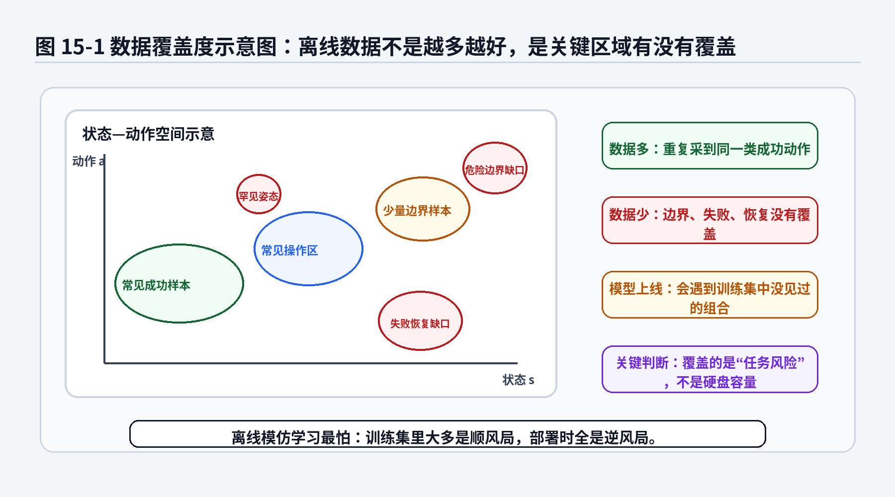
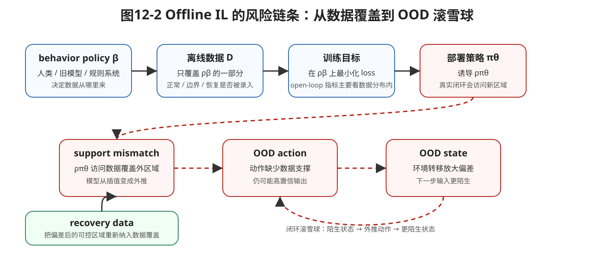

# 第12章：Offline Imitation Learning：离线数据不是越多越好，是坑有没有录进去

> **新版布局位置**：本章属于 **第三篇：经典模仿学习的分布匹配与奖励视角**。
>
> **本章一句话导读**：第11章 GAIL 说明了在线 rollout 可以帮助匹配专家与策略的 occupancy measure，但真实机器人不能随便试错。本章进入 Offline Imitation Learning：当训练主要依赖固定数据集时，核心风险不是数据量不够大，而是 behavior policy 产生的数据是否覆盖了部署策略会遇到的状态、动作、失败和恢复。

---

## 1. 从第11章留下的问题出发

第11章 GAIL 的核心思想是：让当前策略 rollout，得到当前策略的状态—动作样本，再用判别器比较专家样本和策略样本，最后用判别器反馈更新策略，使策略的 occupancy measure 越来越像专家。

这条路线在数学上很漂亮，因为它直接关注策略闭环执行后会访问哪些状态、执行哪些动作。但工程上马上会遇到一个现实问题：

> 如果当前策略还很差，我们敢让它在真实机器人上反复 rollout 吗？

真实机器人不是游戏。机械臂抓取任务中，一次错误 rollout 可能导致夹具撞弯、工件划伤、治具卡死、现场节拍被打断，甚至需要工程师人工恢复设备。

所以，第12章要处理的是第11章之后自然出现的问题：

> 如果我们不能频繁在线 rollout，只能拿已有数据训练策略，那么模仿学习的核心风险会变成什么？

答案是：**离线数据覆盖、support mismatch、OOD action 和 recovery data**。



**图12-1 说明**：绿色和蓝色区域表示离线数据覆盖较多的常见状态—动作组合；红色空洞表示失败、恢复、危险边界、罕见姿态等缺口。训练 loss 主要由数据覆盖区域决定，部署风险往往来自这些没有覆盖或覆盖很少的区域。

---

## 2. 本章在全书数学主线中的位置

本章承接第11章 GAIL，并引出第四篇现代机器人策略模型，尤其是第13章 ACT。

```text
第10章 IRL：从专家轨迹解释 reward，但 reward 不唯一且求解昂贵
→ 第11章 GAIL：绕开显式 reward，直接匹配 occupancy measure，但需要 rollout
→ 第12章 Offline IL：当 rollout 受限时，数据覆盖和 OOD 风险成为核心问题
→ 第13章 ACT：在离线数据基础上，用动作块建模短时连续控制
```

第12章解决“离线数据是否覆盖风险”的问题；第13章开始解决“在这些离线数据上，策略应该如何表达动作序列”的问题。

---

## 3. 本章新增数学对象

| 数学对象 | 符号 | 一句话含义 | 工程对应物 |
|---|---|---|---|
| 离线数据集 | $\mathcal{D}$ | 训练前已经采好的固定轨迹集合 | 遥操作日志、路采数据、仿真录屏 |
| 行为策略 | $\beta(a \mid s)$ | 产生离线数据的策略 | 人类遥操作员、旧模型、规则系统 |
| 数据分布 | $\rho_\beta(s,a)$ | behavior policy 诱导的状态—动作分布 | 历史数据覆盖区域 |
| 部署分布 | $\rho_{\pi_\theta}(s,a)$ | 当前策略部署后诱导的状态—动作分布 | 模型实际会走到哪里、做什么 |
| 近似覆盖区域 | $\mathcal{C}_\epsilon(\mathcal{D})$ | 与离线样本足够相似的区域 | 训练数据附近的可插值区域 |
| support mismatch | - | 训练数据覆盖和部署策略访问区域不一致 | 训练没见过，上线却遇到了 |
| recovery data | $\mathcal{D}_{rec}$ | 从偏差或边界状态恢复到正常任务的轨迹 | 纠偏、接管、重新对齐、重新抓取 |

---

## 4. 本章公式主线

```text
GAIL 需要当前策略 rollout 估计 rho_pi(s,a)
→ 真实机器人 rollout 成本高、风险高
→ Offline IL 只能使用固定数据集 D
→ D 由 behavior policy beta 产生
→ 数据覆盖 rho_beta(s,a)，部署访问 rho_pi_theta(s,a)
→ 训练 loss 只可靠约束数据近似覆盖区域 C_epsilon(D)
→ 部署策略若进入覆盖区域外，就会发生外推
→ OOD action 通过环境转移诱导后续 OOD state
→ recovery data 覆盖偏差后的可控区域
→ ACT 在离线数据约束下，用动作块建模短时连续动作序列
```

---

## 5. 正式定义：Offline IL 与离线数据

### 定义 12.1：Offline Imitation Learning

**Offline Imitation Learning** 指这样一类模仿学习设定：给定一批已经采好的轨迹数据，训练一个策略；训练过程中不允许或很少允许当前策略与环境交互。

**公式 (12.1)：离线数据集**

$$\mathcal{D} = \{\tau_i\}_{i=1}^{N}$$

这个公式读作：离线数据集 $\mathcal{D}$ 由 $N$ 条轨迹组成。其中 $\tau_i$ 是第 $i$ 条轨迹。

**公式 (12.2)：状态—动作轨迹**

$$\tau_i = (s_0^i,a_0^i,s_1^i,a_1^i,\dots,s_T^i,a_T^i)$$

这个公式读作：第 $i$ 条轨迹由一串状态和动作组成。其中 $s_t^i$ 是状态，$a_t^i$ 是动作，$T$ 是轨迹长度。

**公式 (12.3)：观测—动作轨迹**

$$\tau_i = (o_0^i,a_0^i,o_1^i,a_1^i,\dots,o_T^i,a_T^i)$$

这里 $o_t$ 可以包含图像、深度图、关节状态、末端位姿、力传感器读数和语言指令。

**公式 (12.4)：离线训练得到的策略**

$$\pi_\theta(a \mid s) \quad \text{或} \quad \pi_\theta(a \mid o)$$

这个公式读作：策略 $\pi_\theta$ 根据状态 $s$ 或观测 $o$ 输出动作 $a$ 的条件分布。

训练时，策略不能像 GAIL 那样频繁到环境里 rollout。它只能从 $\mathcal{D}$ 中学习。这就是离线学习的基本矛盾：训练时看到的是固定数据集，部署时面对的是策略自己诱导出来的新分布。

---

## 6. behavior policy：数据不是从天上掉下来的

### 定义 12.2：behavior policy

产生离线数据的策略叫 **behavior policy**，记作 $\beta(a \mid s)$。

**公式 (12.5)：behavior policy**

$$\beta(a \mid s)$$

这个公式读作：在状态 $s$ 下，采集数据的行为策略 $\beta$ 选择动作 $a$ 的概率或规则。

它可以是人类遥操作员、旧版本模型、规则控制器、专家和新手混合数据、安全员接管后的恢复策略，或者仿真中加入噪声的数据采集策略。

behavior policy 决定了离线数据会覆盖哪些状态、动作和失败模式。如果 $\beta$ 只在理想条件下采集成功轨迹，那么数据就主要覆盖顺利执行区域；如果 $\beta$ 包含扰动、失败、接管和恢复，那么数据会覆盖更多边界状态。

---

## 7. 数据分布与部署分布

### 定义 12.3：数据分布

类似第11章的 occupancy measure，behavior policy 会诱导一个状态—动作访问分布，记作 $\rho_\beta(s,a)$。

**公式 (12.6)：behavior policy 诱导的数据分布**

$$\rho_\beta(s,a)$$

这个公式读作：采集数据时，系统有多经常访问状态 $s$ 并执行动作 $a$。

其中，$\rho_\beta$ 是由 behavior policy $\beta$ 诱导的状态—动作访问分布；$s$ 是状态；$a$ 是动作。离线数据 $\mathcal{D}$ 可以看成从 $\rho_\beta(s,a)$ 中采样得到的有限样本。

**归一化约定说明**：不同文献中，$\rho_\beta(s,a)$ 可能被写成折扣 occupancy measure、归一化访问频率，或者由离线数据估计出的经验分布。本章不纠结归一化常数，重点关注它覆盖了哪些状态—动作区域。

### 定义 12.4：部署分布

模型部署后，当前策略 $\pi_\theta$ 也会诱导自己的状态—动作访问分布，记作 $\rho_{\pi_\theta}(s,a)$。

**公式 (12.7)：部署策略诱导的状态—动作分布**

$$\rho_{\pi_\theta}(s,a)$$

这个公式读作：策略 $\pi_\theta$ 闭环执行后，有多经常访问状态 $s$ 并执行动作 $a$。

其中，$\rho_{\pi_\theta}$ 是部署策略诱导的分布；$\pi_\theta$ 是离线训练得到、准备部署的策略；$s,a$ 是部署过程中真实访问到的状态和动作。

Offline IL 的核心风险就是：训练数据来自 $\rho_\beta$，部署风险发生在 $\rho_{\pi_\theta}$。

**公式 (12.8)：数据分布与部署分布不一致**

$$\rho_{\pi_\theta}(s,a) \neq \rho_\beta(s,a)$$

这个公式读作：部署策略访问的状态—动作分布，不一定等于采集数据时 behavior policy 访问的分布。

工程含义是：训练数据记录的是过去某个采集策略会遇到什么；部署模型会遇到什么，则由当前模型和环境共同决定。

---

## 8. 核心公式组：训练 loss 和部署风险为什么不一样

**公式 (12.9)：离线 BC 训练目标**

$$\mathcal{L}_{BC}(\theta) = \mathbb{E}_{(s,a) \sim \rho_\beta}\left[\ell(\pi_\theta(s),a)\right]$$

这个公式读作：在 behavior policy 产生的数据分布 $\rho_\beta$ 上，让策略输出 $\pi_\theta(s)$ 尽量接近数据中的动作 $a$。

其中，$\mathcal{L}_{BC}(\theta)$ 是行为克隆训练损失；$\mathbb{E}_{(s,a)\sim \rho_\beta}$ 表示对离线数据分布中的状态—动作对取平均；$\ell(\pi_\theta(s),a)$ 是预测动作与数据动作之间的损失。

直觉上，公式 (12.9) 只回答一个问题：在离线数据覆盖到的样本附近，模型是否能模仿数据里的动作？

**公式 (12.10)：部署风险**

$$\mathcal{R}_{deploy}(\theta) = \mathbb{E}_{(s,a) \sim \rho_{\pi_\theta}}\left[c(s,a)\right]$$

这个公式读作：在部署策略自己诱导出的状态—动作分布 $\rho_{\pi_\theta}$ 上，统计碰撞、失败、越界或动作不稳定等代价。

其中，$\mathcal{R}_{deploy}(\theta)$ 是部署风险；$c(s,a)$ 是状态—动作对上的风险代价；$\rho_{\pi_\theta}$ 是部署策略闭环执行诱导的分布。

公式 (12.9) 和公式 (12.10) 的关键差异不是 loss 形式，而是**期望所在的分布不同**：训练 loss 在 $\rho_\beta$ 上取期望，部署风险在 $\rho_{\pi_\theta}$ 上取期望。

### 命题 12.1：离线数据多，不等于闭环部署安全

> 如果训练数据主要来自 behavior policy $\beta$ 的分布 $\rho_\beta$，而部署策略 $\pi_\theta$ 诱导出的分布 $\rho_{\pi_\theta}$ 与其不一致，那么即使离线数据量很大，也不能保证闭环部署安全。

**证明**：

设离线数据来自 $\rho_\beta$。当样本数 $N$ 变大时，经验训练损失会更接近公式 (12.9) 中的期望：

$$\mathbb{E}_{(s,a) \sim \rho_\beta}\left[\ell(\pi_\theta(s),a)\right]$$

但是部署风险由公式 (12.10) 决定，它是在 $\rho_{\pi_\theta}$ 上取期望。

如果存在一片区域 $\mathcal{A}$，满足 $\rho_\beta$ 在 $\mathcal{A}$ 上几乎没有质量，但 $\rho_{\pi_\theta}$ 在 $\mathcal{A}$ 上可能有明显质量，那么无论 $\rho_\beta$ 内部的数据量有多大，训练目标都无法充分约束策略在 $\mathcal{A}$ 内的行为。

所以，更多同分布样本只能降低已覆盖区域的估计噪声，不能补齐未覆盖区域的监督信号。降低离线 loss 不等于降低部署风险。

**工程含义**：一百万条顺利轨迹，不一定比一万条覆盖边界、失败和恢复的数据更有价值。

---

## 9. support、近似覆盖区域与 support mismatch

在连续空间中，状态和动作往往是连续变量，比如图像、末端位姿、关节角、速度、夹爪开合量。有限数据集 $\mathcal{D}$ 只包含有限个样本。严格地说，部署时几乎不会遇到和训练样本完全相同的点。

所以，本章中的 support 不按严格拓扑意义理解，而是按工程近似理解：

> support 指数据样本及其附近的“可插值区域”，也就是模型有机会从相似样本中学到合理动作的区域。

**公式 (12.11)：数据的近似覆盖区域**

$$\mathcal{C}_\epsilon(\mathcal{D}) = \{(s,a) : d((s,a), \mathcal{D}) \le \epsilon\}$$

这个公式读作：所有距离离线数据集 $\mathcal{D}$ 不超过 $\epsilon$ 的状态—动作对，构成数据的近似覆盖区域。

其中，$\mathcal{C}_\epsilon(\mathcal{D})$ 是近似覆盖区域；$d((s,a),\mathcal{D})$ 是状态—动作对到数据集的距离；$\epsilon$ 是允许被认为“足够接近数据”的阈值。

### 定义 12.5：support mismatch

**support mismatch** 指训练数据近似覆盖区域和部署策略访问区域不一致。

**公式 (12.12)：近似覆盖意义下的 support mismatch**

$$\exists (s,a) \sim \rho_{\pi_\theta}, \quad (s,a) \notin \mathcal{C}_\epsilon(\mathcal{D})$$

这个公式读作：存在某些部署策略会访问的状态—动作对，它们落在离线数据近似覆盖区域之外。

这时模型就会从“插值”变成“外推”。

### 命题 12.2：support mismatch 会让离线策略在部署时自信地外推

> 当部署策略访问到 $\mathcal{C}_\epsilon(\mathcal{D})$ 之外的区域时，离线训练目标无法可靠约束这些区域的动作输出。模型可能仍然输出高置信动作，但该动作缺少数据支持。

**公式 (12.13)：覆盖区域外的状态**

$$s' \notin \mathcal{C}_\epsilon(\mathcal{D})$$

**公式 (12.14)：覆盖区域外的外推动作**

$$a' \sim \pi_\theta(\cdot \mid s')$$

如果某个状态 $s'$ 不在数据近似覆盖区域内，训练集中没有足够样本告诉模型应该输出什么动作。但神经网络在推理时仍会输出动作。这个动作可能看起来数值正常，甚至置信度很高，但它主要来自模型参数的外推。

---

## 10. OOD action 如何滚雪球成 OOD state

support mismatch 不是静态问题。机器人是闭环系统，一个动作会改变未来状态。

**公式 (12.15)：环境状态转移**

$$s_{t+1} \sim P(s_{t+1} \mid s_t,a_t)$$

这个公式读作：环境根据当前状态 $s_t$ 和动作 $a_t$，生成下一步状态 $s_{t+1}$。

如果当前动作不在当前状态附近的数据动作覆盖区域内，可以写成：

**公式 (12.16)：OOD action**

$$a_t \notin \mathcal{C}_\epsilon(\mathcal{D} \mid s_t)$$

这里 $\mathcal{C}_\epsilon(\mathcal{D} \mid s_t)$ 表示在当前状态 $s_t$ 附近，离线数据覆盖过的动作区域。

这个动作可能把系统带到新的陌生状态。

**公式 (12.17)：OOD state**

$$s_{t+1} \notin \mathcal{C}_\epsilon(\mathcal{D})$$

下一步模型又要在更陌生的状态上输出动作。

**公式 (12.18)：OOD state 上的下一步动作**

$$a_{t+1} \sim \pi_\theta(\cdot \mid s_{t+1})$$

于是形成链式放大：

```text
小偏差状态
→ OOD action
→ 环境转移到更偏的状态
→ 更 OOD 的输入
→ 更不可靠的动作
→ 闭环失控
```



**图12-2 说明**：behavior policy $\beta$ 决定离线数据来源；训练目标主要在 $\rho_\beta$ 覆盖的区域内约束策略；部署策略 $\pi_\theta$ 会诱导自己的分布 $\rho_{\pi_\theta}$；一旦 $\rho_{\pi_\theta}$ 访问数据覆盖外区域，就会发生 support mismatch；OOD action 会通过环境转移制造新的 OOD state；recovery data 的价值在于把一部分偏差后的可控区域重新纳入数据覆盖。

### 命题 12.3：OOD action 会通过环境转移放大成 OOD state

> 在闭环控制中，动作不仅是输出结果，也是下一步状态分布的原因。因此，某一步 OOD action 可能通过环境转移诱导后续 OOD state，使策略越来越远离数据近似覆盖区域。

**证明**：

假设在时间 $t$，状态 $s_t$ 仍然接近数据覆盖区域，但模型输出了一个数据中很少出现的动作 $a_t$：

$$a_t \notin \mathcal{C}_\epsilon(\mathcal{D} \mid s_t)$$

环境随后按照公式 (12.15) 转移：

$$s_{t+1} \sim P(s_{t+1} \mid s_t,a_t)$$

由于 $a_t$ 缺少数据支撑，它可能让机械臂末端偏离目标、夹爪提前闭合，或让车辆转向过大。于是下一步状态可能离数据覆盖区域更远：

$$s_{t+1} \notin \mathcal{C}_\epsilon(\mathcal{D})$$

在 $s_{t+1}$ 上，离线数据没有足够样本告诉策略如何恢复。于是 $\pi_\theta$ 再次外推，输出 $a_{t+1}$。

这个过程可以概括为：

```text
状态偏离数据覆盖区域
→ 动作主要依赖外推
→ 环境转移进一步改变状态
→ 下一步状态更陌生
→ 下一步动作继续外推
```

因此，一个小的动作外推可能通过闭环动力学被放大成连续的 OOD state，最终导致任务失败。

---

## 11. recovery data：失败恢复数据为什么值钱

很多数据集偏爱“漂亮轨迹”。漂亮轨迹看起来干净，训练 loss 也容易下降。但真实部署最需要的，往往不是更多完全顺利的轨迹，而是小偏差后如何纠正、夹爪打滑后如何重新抓取、视觉短暂抖动后如何保持稳定、接近危险边界时如何退出、失败后如何安全停止或重新规划。

### 定义 12.6：recovery data

**recovery data** 指从偏差、失败早期或边界状态恢复到正常任务流的数据。

它不是让模型模仿失败本身，而是让模型学习：偏了以后怎么回正，卡住之前怎么退出，失败早期怎么恢复，危险边界附近怎么变安全。

### 命题 12.4：recovery data 覆盖的是偏差后的可控区域

> recovery data 的价值不在于让模型模仿失败，而在于覆盖偏差、边界和失败早期状态下的恢复动作。它可以把一部分原本属于 OOD 的状态重新纳入数据近似覆盖区域。

**证明**：

假设原始数据集 $\mathcal{D}_{success}$ 只包含顺利轨迹。某个偏差状态 $s_{off}$ 不在数据近似覆盖区域内：

**公式 (12.19)：顺利数据缺少偏差状态**

$$s_{off} \notin \mathcal{C}_\epsilon(\mathcal{D}_{success})$$

此时策略在 $s_{off}$ 上输出动作主要依赖外推。

如果加入恢复数据 $\mathcal{D}_{rec}$，其中包含从 $s_{off}$ 或相近状态恢复到正常任务流的动作，那么新数据集为：

**公式 (12.20)：加入 recovery data 后的新数据集**

$$\mathcal{D}_{new} = \mathcal{D}_{success} \cup \mathcal{D}_{rec}$$

此时 $s_{off}$ 附近的状态和对应恢复动作进入数据近似覆盖区域：

**公式 (12.21)：恢复数据扩展近似覆盖区域**

$$s_{off} \in \mathcal{C}_\epsilon(\mathcal{D}_{new})$$

于是模型在这些状态上的输出不再完全依赖外推，而可以从恢复样本中学习。

---

## 12. 离线评估能做什么，不能做什么

Offline IL 很容易让人产生一个错觉：只要验证集 loss 低，模型就能上线。

验证集 loss 有价值，但它主要回答：在和数据集相似的样本上，模型输出是否接近标签？它不能充分回答：模型闭环执行后会不会进入数据集没有覆盖的状态？

| 评估类型 | 能回答什么 | 不能回答什么 |
|---|---|---|
| open-loop loss | 数据分布内动作拟合是否好 | 闭环是否稳定 |
| trajectory replay | 回放轨迹上动作是否合理 | 偏离轨迹后能否恢复 |
| coverage analysis | 数据是否覆盖关键场景 | 策略是否一定安全 |
| OOD detection | 当前输入是否远离训练数据 | OOD 后该怎么恢复 |
| closed-loop simulation | 仿真闭环表现 | sim-to-real 是否成立 |
| small-scale real test | 小范围实机风险 | 长尾场景和长期稳定性 |

离线评估的正确姿势不是“用一个 loss 决定上线”，而是 open-loop 指标、数据覆盖分析、边界场景回放、仿真闭环测试、小范围实机灰度、失败回收与再训练一起看。

---

## 13. 为什么第13章自然是 ACT

本章把问题推进到了一个新的位置：

```text
我们不能随便 rollout；
我们主要依赖离线数据；
离线数据存在 support mismatch 和 OOD 风险；
恢复数据很重要；
open-loop loss 不能直接代表 closed-loop success。
```

在这个前提下，下一个自然问题不是马上跳到 Decision Transformer，而是：

> 在离线数据上训练策略时，策略输出形式本身是不是也有问题？

如果策略每次只输出一步动作，它容易短视，动作前后不连续，难以表达“先靠近、再对齐、再夹取”的短时动作意图，也容易在每一步重新外推。

第13章 ACT 会引入动作块：不是每次只预测一个动作，而是一次预测未来一小段动作序列。

Offline IL 告诉我们：数据覆盖有限，闭环试错昂贵，单步 loss 不等于任务成功。

ACT 接着问：

> 在这样的离线数据上，能不能让策略一次输出更连续、更有短时计划感的动作块，从而减少单步预测带来的抖动、短视和逐步外推风险？

更具体地说，第12章留下了三个问题：

```text
问题一：训练数据只能覆盖有限区域，策略不能随便靠在线试错补数据。
问题二：单步动作预测容易在每一步重新外推，导致动作不连续。
问题三：真实操作常常需要短时动作意图，比如靠近、对齐、夹取、放入。
```

ACT 正是从第三个问题切入：它不先试图解决所有数据覆盖问题，而是先改变策略的动作表达方式，让模型在离线数据上学习“动作块”，从而更好地表达短时连续控制。

---

## 14. 读完本章，你应该能判断什么

| 工程现象 | 应该想到的 Offline IL 判断 |
|---|---|
| 离线数据很多，但上线仍然失败 | 数据量不等于数据覆盖 |
| 全是成功轨迹，验证 loss 很低 | 模型可能不会处理偏差和失败恢复 |
| 模型一旦走偏，后面越来越怪 | OOD action 通过环境转移诱导了 OOD state |
| 训练数据来自不同操作员，模型表现不稳定 | behavior policy 可能是混合策略，数据分布内部不一致 |
| 模型在正常样本上很好，在边界场景崩溃 | support mismatch 或边界数据不足 |
| 想删除失败轨迹让数据更干净 | 需要区分无效脏数据和有价值 recovery data |
| 想直接用 open-loop loss 决定上线 | open-loop loss 不能代表 closed-loop success |
| 想上 ACT / Diffusion Policy | 先检查数据覆盖，否则强模型只会更强地拟合数据偏差 |

---

## 15. 本章常见误解

| 常见误解 | 正确认识 |
|---|---|
| Offline IL 就是普通 BC | BC 是一种离线训练形式，但 Offline IL 更强调数据覆盖、support mismatch 和部署风险 |
| 数据越多越好 | 多只能降低采样噪声，不能自动补齐没有覆盖的风险区域 |
| behavior policy 不重要 | behavior policy 决定数据来自哪里、覆盖什么、缺什么 |
| 验证集 loss 低就可以上线 | 验证集通常仍在数据分布内，不能证明闭环安全 |
| OOD 只是输入图像不一样 | 在机器人中，OOD action 会改变未来状态，造成连锁偏移 |
| 失败轨迹都是脏数据 | 有恢复动作和上下文标注的失败轨迹非常有价值 |
| recovery data 会让模型学坏 | 合理组织的 recovery data 教模型纠偏，不是教模型失败 |
| 第12章直接通向 Decision Transformer | 更自然的下一步是第13章 ACT，因为它先解决离线数据上的动作块建模问题 |

---

## 16. 本章公式索引

- 公式 (12.1)：离线数据集。
- 公式 (12.2)：状态—动作轨迹。
- 公式 (12.3)：观测—动作轨迹。
- 公式 (12.4)：离线训练得到的策略。
- 公式 (12.5)：behavior policy。
- 公式 (12.6)：behavior policy 诱导的数据分布。
- 公式 (12.7)：部署策略诱导的状态—动作分布。
- 公式 (12.8)：数据分布与部署分布不一致。
- 公式 (12.9)：离线 BC 训练目标。
- 公式 (12.10)：部署风险。
- 公式 (12.11)：数据的近似覆盖区域。
- 公式 (12.12)：近似覆盖意义下的 support mismatch。
- 公式 (12.13)：覆盖区域外的状态。
- 公式 (12.14)：覆盖区域外的外推动作。
- 公式 (12.15)：环境状态转移。
- 公式 (12.16)：OOD action。
- 公式 (12.17)：OOD state。
- 公式 (12.18)：OOD state 上的下一步动作。
- 公式 (12.19)：顺利数据缺少偏差状态。
- 公式 (12.20)：加入 recovery data 后的新数据集。
- 公式 (12.21)：恢复数据扩展近似覆盖区域。

---

## 17. 本章定义索引

| 编号 | 概念 | 一句话含义 |
|---|---|---|
| 定义 12.1 | Offline Imitation Learning | 使用已经采好的固定轨迹数据训练策略，训练时不允许或很少允许当前策略与环境交互 |
| 定义 12.2 | behavior policy | 产生离线数据的行为策略，决定数据来自哪里、覆盖什么和缺什么 |
| 定义 12.3 | 数据分布 | behavior policy 诱导出的状态—动作访问分布 |
| 定义 12.4 | 部署分布 | 当前策略部署后闭环执行诱导出的状态—动作访问分布 |
| 定义 12.5 | support mismatch | 训练数据近似覆盖区域和部署策略访问区域不一致 |
| 定义 12.6 | recovery data | 从偏差、失败早期或边界状态恢复到正常任务流的数据 |

---

## 18. 建议阅读的附录条目

- 附录 B：概率论最小生存包。建议复习分布、期望、采样和条件概率。
- 附录 F：强化学习与序列决策基础。建议复习状态转移、策略诱导分布和闭环执行。
- 附录 H：实验与代码基础。建议结合本章理解 train/validation split、open-loop evaluation 和 closed-loop testing 的差异。

---

## 19. 本章小结：从离线数据覆盖走向动作块策略

本章完成了四件事。

第一，它说明了 Offline IL 的根本约束：训练时主要依赖固定数据集，不能像 GAIL 那样频繁用当前策略 rollout。

第二，它强化了 behavior policy $\beta(a \mid s)$ 的作用。数据不是凭空产生的，而是由人类、旧模型、规则系统或混合采集流程留下的分布痕迹。

第三，它推导了 support mismatch 和 OOD action 的风险。离线 loss 只在数据近似覆盖区域内可靠，动作一旦出圈，会通过环境转移继续制造新的 OOD state。

第四，它强调了 recovery data 的工程价值。恢复数据不是脏数据，而是覆盖偏差后可控区域、提升闭环鲁棒性的关键数据。

但本章还没有解决一个问题：

> 在这些固定离线数据上，策略应该怎样表达动作？

如果策略每次只预测一步动作，容易短视、抖动，也很难表达连续操作意图。

因此下一章进入 ACT：一次别只想一步，机器人也需要动作小套餐。
