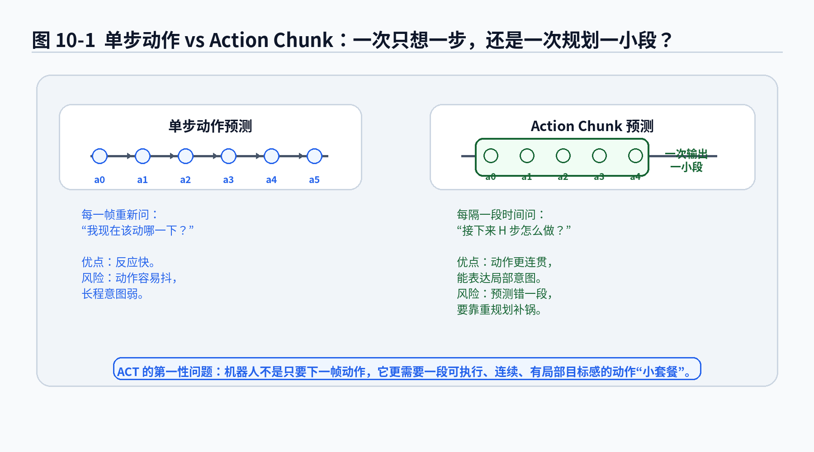
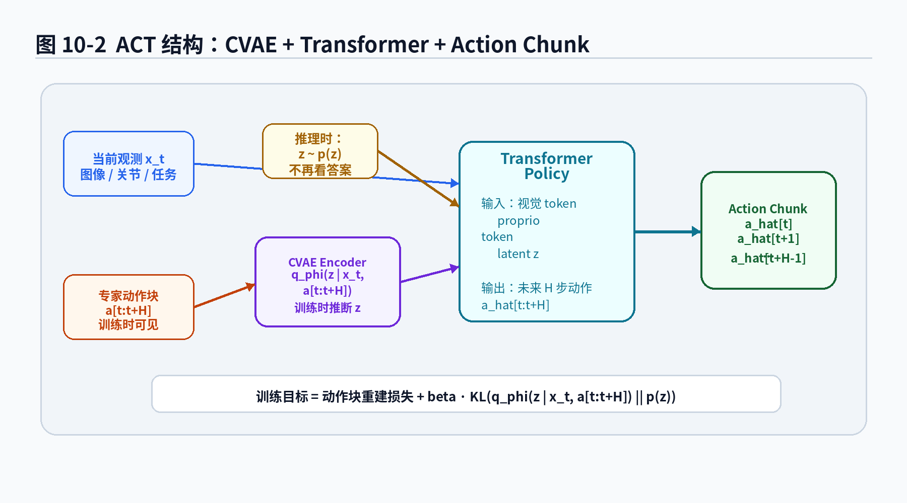
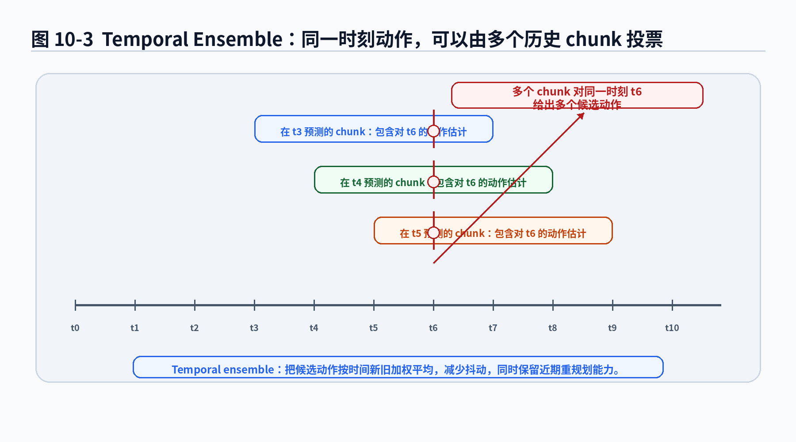
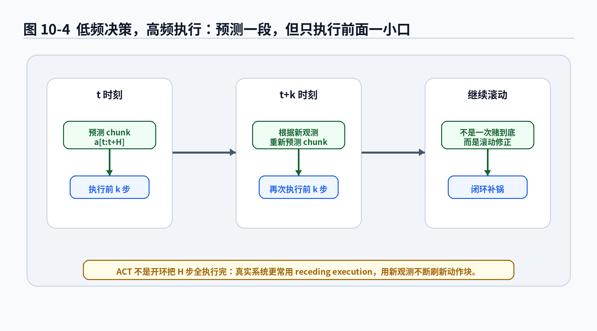

# 第13章：ACT：一次别只想一步，机器人也需要动作小套餐

> **新版布局位置**：本章属于 **第四篇：现代机器人策略模型**。本章编号、公式编号与交叉引用已按新版八篇结构统一调整。
>
> **本章一句话导读**：本章把策略输出从单步动作扩展为 action chunk，解释 ACT 为什么适合机器人局部连续操作，并说明它如何承接第9章 CVAE、铺垫第14章 Diffusion Policy。

第9章讲 CVAE 时，我们已经看到一个核心问题：同一个观测下，合理动作可能不止一个。第13章进入 ACT，Action Chunking with Transformers。ACT 的核心变化不是“把网络换成 Transformer 就会变强”，而是把策略的输出对象从单步动作扩展成一段动作，也就是 action chunk。

单步动作像“下一帧末端往哪动”；action chunk 像“接下来一小段时间如何接近、对准、插入、释放”。对机器人操作来说，这个变化很重要。很多任务不是每一帧都重新纠结，而是需要一段局部连贯、低抖动、有短期意图的动作过程。

---

## 1. 本章要解决的问题

前面几章常见的策略写法是：给定当前输入，只预测当前动作。

**公式 (13.1)：单步动作策略**

$$\pi_\theta(a_t \mid x_t)$$

如果引入隐变量，可以写成：

**公式 (13.2)：带 latent 的单步动作生成**

$$p_\theta(a_t \mid x_t,z)$$

这里的重点是“当前条件下的当前动作”。这对简单控制任务可以工作，但真实机器人操作经常具有明显的局部过程：拉拉链、插线、抓取后精准摆入治具、双臂协作整理物体，都不是孤立动作拼起来就自然成功。

单步预测的问题在于：局部看每一步都可能合理，连起来却可能抖动、迟疑、动作不连续。ACT 想解决的核心问题是：

> 与其每次只预测一个动作，不如一次预测未来一小段动作序列，让策略具备局部时间结构。

这个小段动作序列就是 action chunk。

---

## 2. 本章公式主线

本章推进的数学对象是：

```text
单步动作 a_t
→ 动作块 a_{t:t+H}
→ 条件动作块分布 p_theta(a_{t:t+H} | x_t, z)
→ ACT 的 chunk 重建 + KL 训练目标
→ temporal ensemble 与 receding execution
```

第9章 CVAE 解决的是“同一条件下可能有多个合理动作”的问题，但主要以单步动作为生成对象。本章把生成对象从单步动作扩展为动作块。

**公式 (13.3)：action chunk 定义**

$$a_{t:t+H}=(a_t,a_{t+1},\dots,a_{t+H-1})$$

**公式 (13.4)：ACT 的条件动作块分布**

$$p_\theta(a_{t:t+H} \mid x_t,z)$$

**公式 (13.5)：动作块预测函数**

$$\hat a_{t:t+H}=f_\theta(x_t,z)$$

**公式 (13.6)：ACT encoder / 近似后验**

$$q_\phi(z \mid x_t,a_{t:t+H})$$

**公式 (13.7)：ACT 训练目标的基本形式**

$$\mathcal{L}_{\mathrm{ACT}}=\mathcal{L}_{\mathrm{chunk}}+\beta\mathcal{L}_{\mathrm{KL}}$$

本章解决的问题是：如何让策略输出一段局部连贯的动作，而不是每一帧孤立决策。

本章留下的问题是：ACT 常见实现仍然依赖一次性解码、重建损失和 latent 条件生成。当动作块分布更复杂、更高维、更多峰时，仅靠单次回归或简单 latent 采样可能不够稳定。下一章 Diffusion Policy 会把动作块生成改写为从噪声逐步去噪的过程。

---

## 3. 核心定义

### 定义 13.1：单步动作策略

单步动作策略是指在时间步 $t$，根据当前输入 $x_t$ 输出当前动作 $a_t$ 的策略。它可以是确定性函数，也可以是条件概率分布。

连续动作场景中，常见确定性写法是：

**公式 (13.8)：确定性单步动作预测**

$$\hat a_t=f_\theta(x_t)$$

它适合描述“当前观测下下一步怎么动”，但不直接建模未来一段动作的局部结构。

### 定义 13.2：action chunk

action chunk 是从当前时间步 $t$ 开始、长度为 $H$ 的动作序列。

**公式 (13.9)：action chunk 的左闭右开写法**

$$a_{t:t+H}=(a_t,a_{t+1},\dots,a_{t+H-1})$$

这里不包含 $a_{t+H}$。这个约定和 Python 切片 $[t:t+H]$ 类似：左闭右开。

这个边界非常重要。如果代码里把 $a_{t:t+H}$ 写成包含 $a_{t+H}$，动作长度会多一帧。模型训练可能不报错，但输入输出维度、时间对齐和评测都会悄悄错位。

### 定义 13.3：条件动作块分布

条件动作块分布表示：给定当前输入 $x_t$ 和 latent $z$，模型生成未来长度为 $H$ 的动作块。

**公式 (13.10)：条件动作块分布**

$$p_\theta(a_{t:t+H} \mid x_t,z)$$

其中：

- $x_t$：当前时刻策略可见的信息，可以包含图像、机器人状态、历史观测、任务目标、语言指令等；
- $z$：隐变量，表示动作块背后的风格、模式或短期策略选择；
- $a_{t:t+H}$：未来 $H$ 步动作组成的 action chunk；
- $\theta$：策略网络、Transformer、decoder 等参数。

### 定义 13.4：temporal ensemble

temporal ensemble 是指：多个历史 action chunk 都可能覆盖当前时刻 $t$，于是把它们对当前动作的预测做加权融合，得到最终执行动作。

**公式 (13.11)：temporal ensemble 加权平均**

$$\bar a_t=\frac{\sum_{i=0}^{K-1}w_i\hat a_t^{(t-i)}}{\sum_{i=0}^{K-1}w_i}$$

其中 $\hat a_t^{(t-i)}$ 表示在 $t-i$ 时刻预测出的 chunk 中，对当前时刻 $t$ 的动作估计。

### 定义 13.5：receding execution

receding execution 是指：每次预测一个 action chunk，但实际只执行前面一小段，然后根据新观测重新预测。

**公式 (13.12)：滚动执行的新一轮动作块预测**

$$\hat a_{t+k:t+k+H}=f_\theta(x_{t+k},z')$$

其中 $k\leq H$。如果 $k=1$，每一步都重新预测 chunk；如果 $k$ 较大，决策频率降低，但闭环修正也变慢。

---

## 4. 从单步动作到 action chunk

行为克隆最基础的数据形式通常是：

**公式 (13.13)：单步行为克隆数据集**

$$\mathcal{D}_{\mathrm{step}}=\{(x_t,a_t)\}_{t=1}^{N}$$

对应的连续动作 MSE 损失可以写成：

**公式 (13.14)：单步动作 MSE 损失**

$$\mathcal{L}_{\mathrm{step}}(\theta)=\frac{1}{N}\sum_{t=1}^{N}\lVert a_t-\hat a_t\rVert^2$$

这个形式适合把模仿学习当成监督学习。但第3章到第6章已经反复提醒过：机器人活在时间里。动作不是孤立发生的。一个动作之后，会改变状态、改变观测、改变下一步可行空间。

ACT 把训练目标从单个动作扩展为一段动作：

**公式 (13.15)：动作块作为学习对象**

$$a_{t:t+H}=(a_t,a_{t+1},\dots,a_{t+H-1})$$

如果控制频率是 50Hz，$H=25$ 表示动作块覆盖约 0.5 秒；$H=100$ 表示覆盖约 2 秒。$H$ 不是越大越好。太小，模型仍然缺少局部意图；太大，远期预测更容易过期，也更依赖未来观测。

不要把 action chunk 理解成开环一次执行到底。ACT 常配合滚动执行和 temporal ensemble。它预测一段，但真实系统通常只执行其中一部分，然后根据新观测重新预测。



**图13-1 说明**：

- 单步动作预测每一帧只输出一个动作，灵活但容易抖动；
- action chunk 一次输出未来一段动作，能表达局部时间结构；
- action chunk 不是让机器人“闭眼冲到底”，而是给策略一个短期计划。

---

## 5. ACT 的策略形式：动作块条件生成

第9章 CVAE 的一般 decoder 可以写成：

**公式 (13.16)：CVAE 的单步条件生成**

$$p_\theta(a \mid x,z)$$

ACT 的变化是把单个动作 $a$ 换成动作块 $a_{t:t+H}$：

**公式 (13.17)：ACT 的动作块条件生成**

$$p_\theta(a_{t:t+H} \mid x_t,z)$$

这个公式读作：在当前输入 $x_t$ 和 latent $z$ 给定时，策略生成未来 $H$ 步动作组成的动作块。

实现时，模型通常不会显式输出完整概率密度，而是输出动作块预测：

**公式 (13.18)：动作块预测函数**

$$\hat a_{t:t+H}=f_\theta(x_t,z)$$

如果动作维度是 $d_a$，chunk 长度是 $H$，那么输出形状通常是 $H\times d_a$。例如单臂 7 维动作、$H=50$，输出就是 $50\times 7$；双臂每只手 7 维，输出可能是 $50\times 14$。

这时模型已经不是“小动作回归器”，而是在生成一个短期动作序列。

---

## 6. ACT 为什么还需要 CVAE？

同一个条件下，合理动作可能不止一个。到了 action chunk，这个问题更明显：多模态不只发生在单个动作上，也发生在整段操作方式上。

同一个“打开抽屉”任务，可能有多种 action chunk：

- 先接近把手，再沿水平方向拉；
- 先调整手腕角度，再扣住把手；
- 双臂任务中，一只手固定抽屉，另一只手拉；
- 如果把手位置偏了，先探索接触，再拉动。

如果直接对动作块做 MSE，模型可能把多种动作块平均。单步平均已经很糟糕，动作块平均更像把几个人的操作轨迹逐帧平均，最后得到一种谁也没真正执行过的动作。

所以 ACT 继承 CVAE 的思想：训练时用 encoder 看专家动作块，推断 latent；推理时从 prior 采样 latent，再生成动作块。

训练阶段的 encoder 写成：

**公式 (13.19)：ACT encoder / 近似后验**

$$q_\phi(z \mid x_t,a_{t:t+H})$$

decoder 或 policy 写成：

**公式 (13.20)：ACT decoder / 条件动作块生成**

$$p_\theta(a_{t:t+H} \mid x_t,z)$$

这和第9章 CVAE 结构对应，只是把 $a$ 换成了 $a_{t:t+H}$。

如果 encoder 输出高斯分布，可以写成：

**公式 (13.21)：高斯近似后验**

$$q_\phi(z \mid x_t,a_{t:t+H})=\mathcal{N}\left(z;\mu_\phi(x_t,a_{t:t+H}),\mathrm{diag}(\sigma_\phi^2(x_t,a_{t:t+H}))\right)$$

训练时使用重参数化技巧：

**公式 (13.22)：重参数化采样**

$$z=\mu_\phi(x_t,a_{t:t+H})+\sigma_\phi(x_t,a_{t:t+H})\odot\epsilon,\quad \epsilon\sim\mathcal{N}(0,I)$$

注意：部署时不能把未来专家动作块输入 encoder。部署时没有专家动作块。评测时如果这么做，就相当于考试时把标准答案塞给模型，然后夸它“推理能力很强”。这不是强，这是开卷还装闭卷。



**图13-2 说明**：

- ACT 可以理解为把 CVAE 的动作生成对象从单步动作扩展为 action chunk；
- Transformer 负责处理观测、机器人状态和 latent，输出未来一段动作；
- 训练时 encoder 可以看专家 action chunk，推理时只能从 prior 采样 latent。

---

## 7. ACT 损失：从 CVAE ELBO 到 chunk loss + KL

本节把 ACT 损失从第9章 CVAE 的 ELBO 主线推出来。为避免公式太长，记：

**公式 (13.23)：动作块简写**

$$A_t=a_{t:t+H}$$

ACT 希望最大化条件似然 $p_\theta(A_t \mid x_t)$。由于 latent $z$ 是隐藏变量，直接优化通常不方便，于是引入近似后验 $q_\phi(z \mid x_t,A_t)$。

**命题 13.1：ACT 损失可以看成 CVAE ELBO 在动作块上的负目标**

如果把动作块 $A_t$ 看成条件生成对象，则条件对数似然可以用 ELBO 下界近似优化。

**公式 (13.24)：动作块条件似然的 ELBO**

$$\log p_\theta(A_t \mid x_t)\geq \mathbb{E}_{z\sim q_\phi(z\mid x_t,A_t)}\left[\log p_\theta(A_t \mid x_t,z)\right]-D_{\mathrm{KL}}\left(q_\phi(z\mid x_t,A_t)\,\Vert\,p(z)\right)$$

这个式子有两项：

- 第一项要求 decoder 在给定 $x_t$ 和 $z$ 时，能重建专家动作块 $A_t$；
- 第二项要求 encoder 推出的 latent 分布不要离 prior $p(z)$ 太远。

训练时通常最小化负 ELBO。于是得到：

**公式 (13.25)：ACT 的负 ELBO 目标**

$$\mathcal{L}_{\mathrm{ACT}}=-\mathbb{E}_{z\sim q_\phi(z\mid x_t,A_t)}\left[\log p_\theta(A_t \mid x_t,z)\right]+\beta D_{\mathrm{KL}}\left(q_\phi(z\mid x_t,A_t)\,\Vert\,p(z)\right)$$

如果 decoder 的动作块分布采用固定方差高斯，负对数似然可以对应到动作块重建损失。于是工程中常写成：

**公式 (13.26)：ACT 的 chunk loss + KL 形式**

$$\mathcal{L}_{\mathrm{ACT}}=\mathcal{L}_{\mathrm{chunk}}+\beta\mathcal{L}_{\mathrm{KL}}$$

其中：

**公式 (13.27)：平均动作块重建损失**

$$\mathcal{L}_{\mathrm{chunk}}=\frac{1}{H}\sum_{j=0}^{H-1}\lVert a_{t+j}-\hat a_{t+j}\rVert^2$$

**公式 (13.28)：KL 约束项**

$$\mathcal{L}_{\mathrm{KL}}=D_{\mathrm{KL}}\left(q_\phi(z\mid x_t,a_{t:t+H})\,\Vert\,p(z)\right)$$

$\beta$ 控制重建质量和 latent 规整之间的平衡。

- $\beta$ 太小：encoder 可能把太多细节塞进 $z$，训练重建很好，但推理从 prior 采样时接不上；
- $\beta$ 太大：latent 被压得太狠，decoder 可能忽略 $z$，多模态能力下降；
- $\beta$ 合适：latent 既携带动作风格，又能和 prior 保持可采样关系。

这不是玄学调参，而是在平衡“训练时解释数据”和“推理时可生成”。

---

## 8. Transformer 在 ACT 中做什么？

ACT 名字里的 T 是 Transformer。这里的 Transformer 不应被理解成“把模型换成 Transformer，效果就会自动变好”。它的作用要放在多源输入融合和动作块输出里理解。

现代机器人策略输入常常不是一个向量，而是一组 token：图像特征、关节状态、末端位姿、双臂状态、历史动作、latent、任务条件等。Transformer 用 attention 建模这些 token 之间的关系。

可以写成：

**公式 (13.29)：Transformer 编码多源输入**

$$h_t=\mathrm{Transformer}_\theta(\mathrm{tokens}(x_t),z)$$

再由输出头生成动作块：

**公式 (13.30)：动作预测头输出 action chunk**

$$\hat a_{t:t+H}=g_\theta(h_t)$$

Transformer 像一个信息融合器，把视觉、关节、目标和 latent 放到同一个上下文里。它不是魔法棒。数据质量差、动作标定错、相机外参飘、控制延迟大，Transformer 不会自动替你把工程债还清。

---

## 9. Temporal Ensemble：多个 chunk 对同一动作投票

ACT 中另一个重要技巧是 temporal ensemble。它解决的问题很朴素：如果模型每个时刻都会预测一个未来动作块，那么同一个当前时刻 $t$ 的动作，可能被多个历史 chunk 预测到。应该用哪个？

比如：

- 在 $t-2$ 时刻预测的 chunk 里，包含对 $a_t$ 的预测；
- 在 $t-1$ 时刻预测的 chunk 里，也包含对 $a_t$ 的预测；
- 在 $t$ 时刻重新预测的 chunk 中，也直接给出对 $a_t$ 的预测。

这些预测可能不完全一样。如果每次只用最新预测，动作可能抖动；如果完全相信旧预测，又可能反应迟钝。temporal ensemble 用加权平均在二者之间折中。

**公式 (13.31)：多个历史 chunk 对当前动作的预测**

$$\hat a_t^{(t)},\hat a_t^{(t-1)},\dots,\hat a_t^{(t-K+1)}$$

加权平均写成：

**公式 (13.32)：temporal ensemble 加权融合**

$$\bar a_t=\frac{\sum_{i=0}^{K-1}w_i\hat a_t^{(t-i)}}{\sum_{i=0}^{K-1}w_i}$$

常见权重让新预测权重大、旧预测权重小：

**公式 (13.33)：指数衰减权重**

$$w_i=\exp(-\lambda i),\quad \lambda>0$$

### 命题 13.2：temporal ensemble 可以降低预测抖动，但可能引入滞后

如果多个 chunk 对同一动作的预测误差近似独立、均值接近 0，那么加权平均后的方差会小于单个高噪声预测的方差。因此 temporal ensemble 有平滑动作的效果。

用简化的一维情形说明。设多个预测为：

**公式 (13.34)：预测值分解为真实动作与噪声**

$$\hat a_t^{(t-i)}=a_t+\epsilon_i$$

其中 $\epsilon_i$ 是预测噪声。加权平均误差为：

**公式 (13.35)：temporal ensemble 的融合误差**

$$\bar a_t-a_t=\frac{\sum_{i=0}^{K-1}w_i\epsilon_i}{\sum_{i=0}^{K-1}w_i}$$

如果这些噪声彼此独立，且方差相同为 $\sigma^2$，则融合误差方差为：

**公式 (13.36)：融合误差方差**

$$\mathrm{Var}(\bar a_t-a_t)=\sigma^2\frac{\sum_{i=0}^{K-1}w_i^2}{\left(\sum_{i=0}^{K-1}w_i\right)^2}$$

当多个权重都参与平均时，上式通常小于 $\sigma^2$，所以动作更平滑。

但这只是“降噪”直觉，不是“保证正确”。如果旧 chunk 已经过期，或者环境变化很快，平均旧预测会引入滞后。也就是说，temporal ensemble 能减少抖动，也可能让机器人反应慢半拍。



**图13-3 说明**：

- 多个历史 action chunk 可能都覆盖当前时刻；
- temporal ensemble 将这些候选动作按权重融合；
- 它主要缓解抖动，不直接解决分布偏移或任务理解错误。

---

## 10. Receding Execution：预测一段，但别一口吃完

action chunk 容易带来一个误解：模型预测了未来 $H$ 步动作，是不是就把这 $H$ 步全部执行完？

真实机器人系统中通常不这么做，因为环境会变：物体可能滑动，接触可能提前发生，夹爪可能没完全夹住，人可能进入工作空间，视觉观测可能突然更新，底层控制误差也可能积累。

所以更合理的做法是 receding execution：每次预测一个 action chunk，但只执行前面一小部分，然后根据新观测重新预测。

假设策略每 $k$ 步运行一次，每次输出长度为 $H$ 的动作块：

**公式 (13.37)：当前时刻预测动作块**

$$\hat a_{t:t+H}=f_\theta(x_t,z)$$

系统只执行前 $k$ 步：

**公式 (13.38)：只执行前 k 步**

$$\hat a_{t:t+k}=(\hat a_t,\hat a_{t+1},\dots,\hat a_{t+k-1})$$

到 $t+k$ 时刻，拿到新观测 $x_{t+k}$，再预测：

**公式 (13.39)：下一轮滚动预测**

$$\hat a_{t+k:t+k+H}=f_\theta(x_{t+k},z')$$

$H$ 和 $k$ 的选择很关键：

- $H$ 太短：局部意图弱；
- $H$ 太长：远期预测不可靠；
- $k$ 太小：计算压力大，动作可能频繁变化；
- $k$ 太大：闭环修正慢，接触变化时容易翻车。

ACT 不是替代底层控制器。action chunk 通常仍需要位置控制、速度控制、阻抗控制或安全控制器执行。策略给的是高层动作序列，不是让电机直接听神经网络讲相声。



**图13-4 说明**：

- 每次预测未来一段动作；
- 实际只执行前面一小部分；
- 根据新观测继续滚动预测，避免开环一把梭。

---

## 11. 数据组织：从轨迹中切出 action chunk

ACT 的训练数据来自专家轨迹。为了避免边界歧义，本章采用常见轨迹写法：一条长度为 $T$ 的轨迹有 $T$ 个动作，从 $a_0$ 到 $a_{T-1}$。

**公式 (13.40)：专家轨迹**

$$\tau=(x_0,a_0,x_1,a_1,\dots,x_{T-1},a_{T-1},x_T)$$

从这条轨迹中，可以用滑窗构造训练样本：

**公式 (13.41)：单个动作块训练样本**

$$(x_t,a_{t:t+H})$$

由于 $a_{t:t+H}$ 包含 $a_t$ 到 $a_{t+H-1}$，最后一个合法起点是 $t=T-H$。因此数据集写成：

**公式 (13.42)：动作块数据集**

$$\mathcal{D}_{\mathrm{chunk}}=\{(x_t,a_{t:t+H})\}_{t=0}^{T-H}$$

这个修正避免了一个常见 bug：如果轨迹写成包含 $a_T$，但又用 $t=0$ 到 $T-H$，读者会不清楚到底有 $T$ 个动作还是 $T+1$ 个动作。对 ACT 来说，边界错一帧就可能导致整个 chunk 对齐错位。

数据构造时还必须处理轨迹尾部。如果 $t$ 太靠近终点，后面不够 $H$ 步，可以选择丢弃、padding 或缩短。不同处理方式会影响训练稳定性。

不要把不同 episode 的动作强行拼接成一个 chunk。轨迹边界必须保留。否则模型会学到一种很神奇的动作：上一秒还在拿杯子，下一秒突然开始拉拉链。这不是多任务学习，这是数据集穿越。

---

## 12. 时间对齐、评测与工程边界

### 12.1 时间对齐

ACT 对时间对齐非常敏感。它不是只预测单步，而是预测一段动作。如果图像和动作延迟 3 帧，单步 BC 已经会受影响，ACT 会把这个延迟扩展到整个 chunk。

需要特别检查：相机时间戳、机器人状态时间戳、动作命令时间戳、示教设备延迟、控制器执行延迟、数据保存线程是否丢帧。

很多机器人学习问题最后不是模型结构问题，而是时间戳问题。你以为自己在调 Transformer，其实是在和日志系统斗法。

### 12.2 评测不能只看 open-loop loss

ACT 至少要从三层评测。

第一层是 open-loop chunk loss：

**公式 (13.43)：open-loop 动作块误差**

$$\frac{1}{H}\sum_{j=0}^{H-1}\lVert a_{t+j}-\hat a_{t+j}\rVert^2$$

也可以分不同 horizon 看误差：

**公式 (13.44)：第 j 步预测误差**

$$\ell_j=\lVert a_{t+j}-\hat a_{t+j}\rVert^2$$

如果 $j$ 越大误差越大，说明模型短期预测还行，远期预测不稳。这很常见，也很正常，因为远期动作本来就更依赖未来观测。

第二层是 closed-loop success rate，例如是否成功抓取、插入、打开拉链、放入治具、无碰撞完成、在限定时间内完成。

第三层是动作平滑性和安全指标：

**公式 (13.45)：动作平滑指标**

$$\mathcal{L}_{\mathrm{smooth}}=\sum_t\lVert a_t-a_{t-1}\rVert^2$$

如果动作表示速度或位置增量，还可以看加速度、jerk、关节限位、碰撞距离、接触力等指标。动作块很漂亮，不代表硬件喜欢。硬件喜欢的是可执行、平滑、安全、不过载。

### 12.3 适合与不适合的任务

ACT 尤其适合具有局部连续结构的任务，例如拉链、插线、折叠、推拉抽屉、整理物体、双臂协作、精准摆放和轻接触操作。这些任务中，一段动作通常比单步动作更有意义。

ACT 不适合直接裸奔到所有任务上。以下情况要特别谨慎：

- 环境变化极快：长 chunk 可能过期；
- 接触反馈非常关键但观测不足：模型可能在接触发生后仍按旧计划推进；
- 示范数据动作模式混乱：ACT 会把混乱学进动作块；
- 安全边界很硬：必须加入碰撞检测、关节限位、速度限制、力限制、工作空间限制和 fallback。

### 12.4 自动驾驶、泊车与精准摆入治具视角

ACT 常出现在机器人操作任务中，但它的思想对自动驾驶和泊车也有启发。自动驾驶里，单步控制量预测可以写成 $\hat u_t=f_\theta(x_t)$，但更常见的规划形式其实是输出未来一段轨迹或控制序列。

自动泊车也有类似局部 maneuver：倒车入库第一把、回正、二次调整、贴边微调、停止。如果策略只预测当前控制量，很容易局部抖动；如果预测短期控制序列或轨迹片段，就能表达“这一把要往哪个方向修”。

不过车辆有强运动学约束、碰撞约束、法规和安全边界，不能把机械臂论文里的动作块直接塞进车辆域控。更合理的方式是把 action chunk 思想用于候选轨迹生成、轨迹补全、局部策略辅助，再接入传统规划、安全检查和控制器。

“抓取 + 精准摆入治具”也是理解 ACT 的好例子。传统几何提供粗定位和安全边界，ACT 可以学习“接近—对准—轻放—微调”的局部柔顺操作。没有足够异常数据，ACT 不会自动处理所有变形治具；没有接触反馈，插入阶段容易猜错；没有安全约束，动作块可能把工件硬怼进去。

更像工程的结构是：

> 传统几何提供粗定位和安全边界，ACT 学习局部柔顺操作和短期动作模式，底层控制器保证执行稳定。

---

## 13. 读完本章，你应该能判断什么？

读完本章后，你应该能形成以下判断：

1. ACT 的核心不是 Transformer，而是把动作建模对象从单步动作扩展为 action chunk。
2. action chunk 能表达局部时间结构，但不等于开环执行到底。
3. ACT 继承 CVAE 的 latent 思想，用来表达多种合理动作块。
4. ACT 损失可以看成 CVAE 负 ELBO 在动作块生成上的工程化形式。
5. temporal ensemble 可以减少动作抖动，但可能引入滞后。
6. open-loop chunk loss 低不代表 closed-loop success 高。
7. ACT 是否有效，很大程度取决于数据质量、时间对齐、控制频率、安全约束和任务本身是否具有局部连续结构。
8. 对泊车或工业机械臂任务，action chunk 思想可以借鉴，但必须和传统几何、规划、安全检查、底层控制结合。

---

## 14. 本章小结：从 ACT 到 Diffusion Policy

本章从第9章 CVAE 出发，把动作预测对象从单步动作：

**公式 (13.46)：单步动作对象**

$$a_t$$

扩展成动作块：

**公式 (13.47)：动作块对象**

$$a_{t:t+H}=(a_t,a_{t+1},\dots,a_{t+H-1})$$

ACT 可以写成一个条件动作块生成模型：

**公式 (13.48)：ACT 条件动作块生成**

$$p_\theta(a_{t:t+H} \mid x_t,z)$$

训练时使用 CVAE encoder：

**公式 (13.49)：ACT encoder**

$$q_\phi(z \mid x_t,a_{t:t+H})$$

整体损失包括动作块重建损失和 KL 约束：

**公式 (13.50)：ACT 总损失**

$$\mathcal{L}_{\mathrm{ACT}}=\mathcal{L}_{\mathrm{chunk}}+\beta D_{\mathrm{KL}}\left(q_\phi(z\mid x_t,a_{t:t+H})\,\Vert\,p(z)\right)$$

为了减少动作抖动，ACT 可以使用 temporal ensemble：

**公式 (13.51)：temporal ensemble**

$$\bar a_t=\frac{\sum_{i=0}^{K-1}w_i\hat a_t^{(t-i)}}{\sum_{i=0}^{K-1}w_i}$$

本章最重要的结论是：ACT 将模仿学习的建模单位从“当前动作”推进到“短期动作序列”。这让策略能表达局部时间结构和短期操作意图，但仍然受限于一次性解码、重建损失、latent 表达能力、数据质量和闭环部署风险。

下一章进入 Diffusion Policy。它和 ACT 一样关注动作块，但生成方式不同：ACT 更像通过 Transformer/CVAE 一次生成动作块；Diffusion Policy 则把动作生成看成从噪声中逐步去噪。一个像点套餐，一个像慢慢把菜搓出来。听起来都能吃，但厨房原理不一样。

---

## 15. 本章公式索引

### 公式 (13.1)：单步动作策略

$$\pi_\theta(a_t \mid x_t)$$

- **作用**：描述给定当前输入时预测当前动作的策略形式。
- **需要掌握到什么程度**：理解这是单步动作建模，不直接表达未来动作序列。

### 公式 (13.2)：带 latent 的单步动作生成

$$p_\theta(a_t \mid x_t,z)$$

- **作用**：在单步动作生成中引入隐变量。
- **需要掌握到什么程度**：理解它承接第8章、第9章的隐变量策略主线。

### 公式 (13.3)：action chunk 定义

$$a_{t:t+H}=(a_t,a_{t+1},\dots,a_{t+H-1})$$

- **作用**：定义从当前时间开始的长度为 $H$ 的动作块。
- **需要掌握到什么程度**：必须记住这是左闭右开，不包含 $a_{t+H}$。

### 公式 (13.4)：ACT 的条件动作块分布

$$p_\theta(a_{t:t+H} \mid x_t,z)$$

- **作用**：把 ACT 写成条件动作块生成模型。
- **需要掌握到什么程度**：理解 ACT 的生成对象是一段动作，而不是单个动作。

### 公式 (13.5)：动作块预测函数

$$\hat a_{t:t+H}=f_\theta(x_t,z)$$

- **作用**：描述工程实现中模型直接输出动作块预测。
- **需要掌握到什么程度**：理解输出形状通常是 $H\times d_a$。

### 公式 (13.6)：ACT encoder / 近似后验

$$q_\phi(z \mid x_t,a_{t:t+H})$$

- **作用**：训练时根据当前输入和专家动作块推断 latent。
- **需要掌握到什么程度**：知道部署时不能把专家动作块输入 encoder。

### 公式 (13.7)：ACT 训练目标的基本形式

$$\mathcal{L}_{\mathrm{ACT}}=\mathcal{L}_{\mathrm{chunk}}+\beta\mathcal{L}_{\mathrm{KL}}$$

- **作用**：概括 ACT 的重建项和 KL 约束。
- **需要掌握到什么程度**：理解它来自 CVAE 负 ELBO 的工程化写法。

### 公式 (13.24)：动作块条件似然的 ELBO

$$\log p_\theta(A_t \mid x_t)\geq \mathbb{E}_{z\sim q_\phi(z\mid x_t,A_t)}\left[\log p_\theta(A_t \mid x_t,z)\right]-D_{\mathrm{KL}}\left(q_\phi(z\mid x_t,A_t)\,\Vert\,p(z)\right)$$

- **作用**：说明 ACT 损失可以从 CVAE ELBO 主线推出。
- **需要掌握到什么程度**：理解第一项对应重建，第二项对应 latent 与 prior 对齐。

### 公式 (13.27)：平均动作块重建损失

$$\mathcal{L}_{\mathrm{chunk}}=\frac{1}{H}\sum_{j=0}^{H-1}\lVert a_{t+j}-\hat a_{t+j}\rVert^2$$

- **作用**：衡量预测动作块和专家动作块之间的差异。
- **需要掌握到什么程度**：理解它仍然是 open-loop imitation loss，不保证闭环成功。

### 公式 (13.32)：temporal ensemble 加权融合

$$\bar a_t=\frac{\sum_{i=0}^{K-1}w_i\hat a_t^{(t-i)}}{\sum_{i=0}^{K-1}w_i}$$

- **作用**：融合多个历史 chunk 对当前动作的预测。
- **需要掌握到什么程度**：理解它能平滑动作，也可能引入滞后。

### 公式 (13.39)：下一轮滚动预测

$$\hat a_{t+k:t+k+H}=f_\theta(x_{t+k},z')$$

- **作用**：表示执行一小段后根据新观测重新预测。
- **需要掌握到什么程度**：理解 ACT 通常不是一口气开环执行完整 chunk。

### 公式 (13.40)：专家轨迹

$$\tau=(x_0,a_0,x_1,a_1,\dots,x_{T-1},a_{T-1},x_T)$$

- **作用**：统一轨迹长度和动作数量，避免 chunk 下标边界混乱。
- **需要掌握到什么程度**：知道该写法包含 $T$ 个动作和 $T+1$ 个状态。

### 公式 (13.42)：动作块数据集

$$\mathcal{D}_{\mathrm{chunk}}=\{(x_t,a_{t:t+H})\}_{t=0}^{T-H}$$

- **作用**：说明如何从专家轨迹滑窗构造 ACT 训练样本。
- **需要掌握到什么程度**：理解最后一个合法起点是 $T-H$。

### 公式 (13.45)：动作平滑指标

$$\mathcal{L}_{\mathrm{smooth}}=\sum_t\lVert a_t-a_{t-1}\rVert^2$$

- **作用**：评估执行动作是否抖动。
- **需要掌握到什么程度**：理解平滑性只是部署评测的一部分，还需要安全和成功率。

---

## 16. 本章定义索引

### 定义 13.1：单步动作策略

给定当前输入 $x_t$，输出当前动作 $a_t$ 的策略形式。

### 定义 13.2：action chunk

从时间步 $t$ 开始、长度为 $H$ 的动作序列 $a_{t:t+H}$，包含 $a_t$ 到 $a_{t+H-1}$，不包含 $a_{t+H}$。

### 定义 13.3：条件动作块分布

给定当前输入 $x_t$ 和 latent $z$，生成未来动作块 $a_{t:t+H}$ 的条件分布。

### 定义 13.4：temporal ensemble

融合多个历史 chunk 对当前动作的预测，得到最终执行动作的方法。

### 定义 13.5：receding execution

每次预测一个动作块，但只执行前面一小段，然后根据新观测重新预测的闭环执行方式。

---

## 17. 建议阅读的附录条目

1. **附录 A：数学符号与公式阅读方法**  
   重点复习切片符号、求和符号、下标和序列记号。本章大量使用 $a_{t:t+H}$、$a_{t+j}$、$\hat a_t^{(t-i)}$。

2. **附录 B：概率论最小生存包**  
   重点复习条件概率和采样符号。ACT 中的 $p_\theta(a_{t:t+H}\mid x_t,z)$ 和 $z\sim p(z)$ 都依赖这些基础。

3. **附录 C：最大似然、负对数似然、交叉熵与 KL**  
   重点复习 KL 散度和负对数似然。ACT 的 CVAE 部分继承了第9章的 KL 约束。

4. **附录 D：高斯分布与连续变量基础**  
   重点复习高斯分布、对角协方差、MSE 与高斯 NLL 的关系。动作块重建损失常可从高斯 NLL 角度理解。

5. **附录 G：隐变量、VAE、CVAE 与 ELBO**  
   重点复习 CVAE encoder、decoder、prior、posterior、ELBO 和 KL annealing。ACT 是 CVAE 在动作块生成中的应用。

6. **附录 H：训练、评测与 rollout 基础**  
   重点复习 open-loop loss、closed-loop success rate、rollout、temporal ensemble 和安全评测。本章的训练 loss 与部署成功之间仍有差距。

---

## 18. 思考题

1. 用自己的话解释 action chunk 和单步动作的区别。
2. 如果控制频率是 50Hz，$H=25$ 表示多长时间的动作块？如果改成 $H=100$，会带来什么好处和风险？
3. 为什么 $a_{t:t+H}$ 在本书中表示 $a_t$ 到 $a_{t+H-1}$，而不是包含 $a_{t+H}$？这个边界在代码中为什么重要？
4. 用一个机械臂插线任务解释 $p_\theta(a_{t:t+H}\mid x_t,z)$ 中 $x_t$、$z$、$a_{t:t+H}$ 分别是什么。
5. ACT 为什么仍然需要 CVAE latent？如果不用 latent，直接对动作块做 MSE，可能出现什么问题？
6. 为什么 ACT 损失可以从 CVAE ELBO 推出？重建项和 KL 项分别对应什么？
7. temporal ensemble 为什么可以减少动作抖动？它为什么也可能引入滞后？
8. receding execution 和一次性执行完整 chunk 有什么区别？
9. 在“抓取 + 精准摆入治具”任务中，ACT 适合学习哪一段能力？哪些部分仍应交给传统几何、安全约束和底层控制？
10. 为什么第14章 Diffusion Policy 仍然有必要？它和 ACT 都生成动作块，但生成方式有什么不同？
