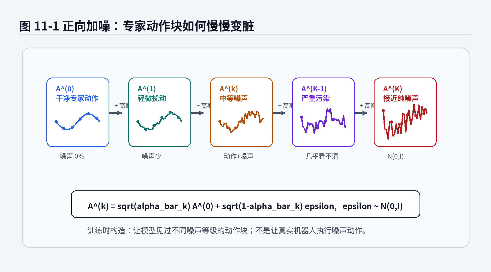
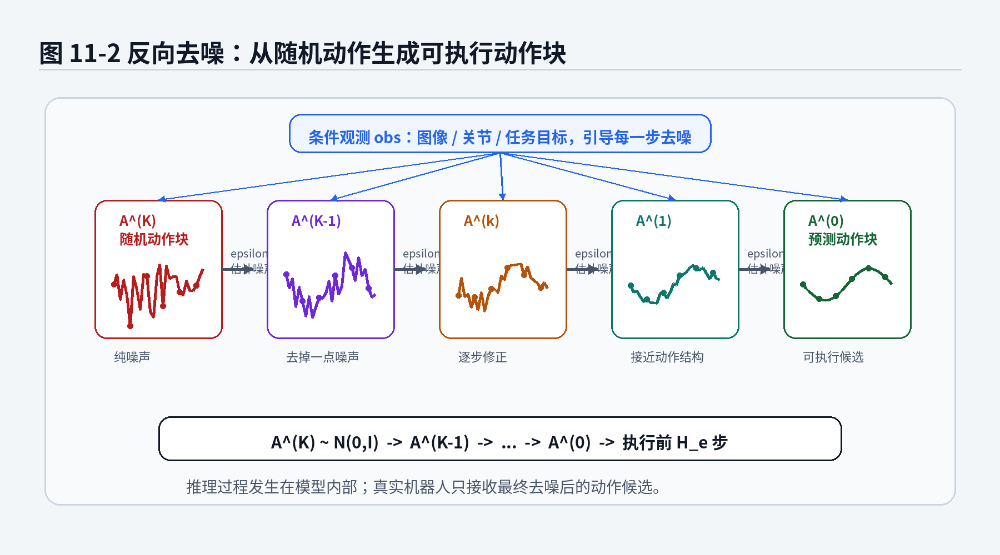
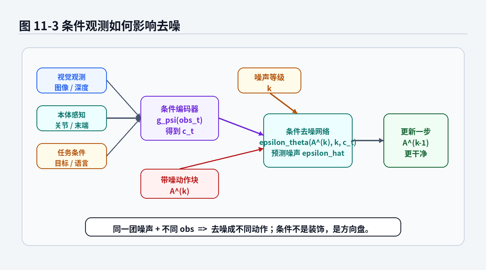
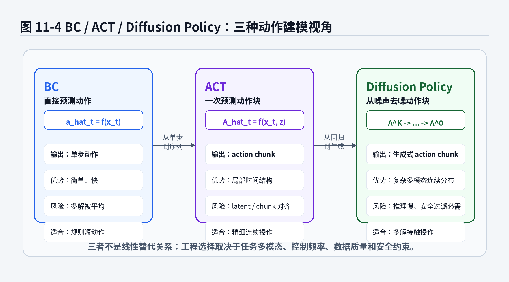

# 第14章：Diffusion Policy：把动作从一团噪声里慢慢搓出来

> **新版布局位置**：本章属于 **第四篇：现代机器人策略模型**。本章编号、公式编号与交叉引用已按新版八篇结构统一调整。


> **本章一句话导读**：本章用扩散去噪视角解释复杂连续动作分布，说明 Diffusion Policy 为什么能处理多峰动作轨迹。


> 本章继续遵守 v2.0 总控文档：先讲动机，再写公式；公式不仅要能看，还要能拆。第13章我们讲了 ACT：把动作从单步预测扩展成 action chunk，让机器人一次想一小段。本章进入 Diffusion Policy。它同样关心动作序列，但生成方式不一样：ACT 更像一次点好一份动作套餐，Diffusion Policy 更像先给一团随机面团，再一步步把它揉成可执行动作。

---

## 1. 本章开场：为什么还要从噪声里生成动作？

如果你已经读完第13章，可能会有一个朴素疑问：

> ACT 已经能预测 action chunk 了，为什么还要 Diffusion Policy？

这个问题非常合理。毕竟从工程师视角看，机器人要的是动作，不是魔术表演。你给我一个动作序列，我拿去控制机械臂就行；你先生成噪声，再慢慢去噪，听起来像是把一件简单事情绕远了。

但问题恰恰出在“给我一个动作序列”这句话上。

在很多机器人任务里，合理动作不止一条：

- 推一个方块到目标区，可以从左边推，也可以从右边推；
- 抓一个物体，可以先绕开障碍，也可以先移动夹爪姿态再接近；
- 打开抽屉，可以从把手左侧接触，也可以从右侧接触；
- 自动泊车时，进入车位的修正轨迹可能有多种，只要最终姿态、安全边界和舒适性满足要求。

如果我们用 MSE 直接回归一个平均动作，模型可能把多条合理路径平均成一条“不太合理但数学上很努力”的路径。第7章讲过这个问题：多模态动作被 MSE 平均后，机器人可能站在所有正确答案的中间，做出一个没有人真正会做的动作。

CVAE 和 ACT 已经试图解决多模态问题。CVAE 用 latent 表示动作风格，ACT 用 action chunk 表示局部时间结构。那么 Diffusion Policy 又增加了什么？

它把动作生成问题写成一个更强的条件生成过程：

> 先从一个随机动作序列开始，在当前观测条件下，逐步去掉“不像专家动作”的噪声，最后得到一段可执行动作。

这句话有三层含义：

1. **动作是连续变量**：不是选一个类别，而是在高维连续空间里生成轨迹；
2. **动作可能多模态**：同一个观测下可以有多条合理动作序列；
3. **生成过程可迭代修正**：不是一次吐出答案，而是多步把粗糙样本变成合理动作。

听起来有点像做饭。BC 像“直接按菜谱给一个成品动作”；ACT 像“一次做出一小份套餐”；Diffusion Policy 像“先有一团乱七八糟的食材，再按当前任务慢慢加工成能吃的菜”。当然，如果厨师手慢，客人也会饿死，所以后面我们还要严肃讨论推理延迟和控制频率。

---

## 2. 本章要解决的核心问题

本章围绕 12 个问题展开：

1. 为什么动作序列可以被看成 diffusion model 的生成对象？
2. Diffusion Policy 中的“图像扩散模型”思想，如何迁移到机器人动作？
3. 正向加噪过程到底在做什么？
4. 为什么可以直接从干净样本写到任意噪声步？
5. 训练目标为什么经常写成预测噪声 <span class="math">\\(\epsilon\\)</span>？
6. 反向去噪时，模型到底在预测什么？
7. 条件观测 <span class="math">\\(obs\\)</span> 如何影响动作去噪？
8. Diffusion Policy 和 ACT 都生成 action chunk，区别在哪里？
9. 为什么 Diffusion Policy 适合多模态连续控制？
10. 为什么 Diffusion Policy 不是“生成模型一上，机器人自动通用”？
11. 工程上最容易在哪些地方翻车？
12. 如何用 Python 风格伪代码理解训练与推理流程？

本章会用到这些核心公式：

<div class="math">\[
q(A^{(k)}\mid A^{(k-1)})
=
\mathcal{N}
(
\sqrt{1-\beta_k}A^{(k-1)},
\beta_k I
) \tag{14.1}\]</div>

<div class="math">\[
q(A^{(k)}\mid A^{(0)})
=
\mathcal{N}
(
\sqrt{\bar\alpha_k}A^{(0)},
(1-\bar\alpha_k)I
) \tag{14.2}\]</div>

<div class="math">\[
A^{(k)}
=
\sqrt{\bar\alpha_k}A^{(0)}
+
\sqrt{1-\bar\alpha_k}\,\epsilon,
\quad
\epsilon\sim\mathcal{N}(0,I) \tag{14.3}\]</div>

<div class="math">\[
\mathcal{L}_{\mathrm{diffusion}}(\theta)
=
\mathbb{E}_{A^{(0)},\epsilon,k,obs}
\left[
\left\|
\epsilon-
\epsilon_\theta(A^{(k)},k,obs)
\right\|^2
\right] \tag{14.4}\]</div>

<div class="math">\[
\mu_\theta(A^{(k)},k,obs)
=
\frac{1}{\sqrt{\alpha_k}}
\left(
A^{(k)}
-
\frac{\beta_k}{\sqrt{1-\bar\alpha_k}}
\epsilon_\theta(A^{(k)},k,obs)
\right) \tag{14.5}\]</div>

这里我先做一个记号约定：

- 机器人真实控制时间仍然用 <span class="math">\\(t\\)</span> 表示；
- diffusion 的加噪 / 去噪步用 <span class="math">\\(k\\)</span> 表示；
- 当前控制时刻要生成的动作块写作 <span class="math">\\(A\_t=a\_{t:t+H}\\)</span>；
- 干净动作块写作 <span class="math">\\(A^{(0)}\\)</span>，加噪到第 <span class="math">\\(k\\)</span> 步的动作块写作 <span class="math">\\(A^{(k)}\\)</span>。

这点非常重要。很多初学者第一次看 diffusion policy 会被两个“时间”绕晕：机器人有物理时间，diffusion 还有去噪步数。一个是机器人真的在动，一个是模型在脑子里反复修草稿。不要把它们混成一锅粥，否则后面的公式会像没对齐时间戳的数据集一样让人头疼。

---


### 主线定位与统一例子

为了让本章不变成孤立知识点，读本章时请始终把公式落回两个统一例子：

- **二维点机器人跟随专家轨迹**：状态可写成位置/速度，动作可写成二维控制量，适合观察状态分布、轨迹分布和误差累积。
- **机械臂末端运动/抓取轨迹模仿**：观测包含图像或本体状态，动作包含末端位姿增量或关节控制量，适合理解连续动作、多模态动作、动作块和实机闭环。

- **承接前文**：承接第13章 action chunk。
- **本章推进**：说明 Diffusion Policy 为什么适合建模复杂、多峰、连续动作块分布。
- **铺垫后文**：为第16章统一比较 BC、ACT、Diffusion Policy 的表达能力与代价做准备。
- **公式阅读抓手**：噪声预测 loss 不是“加噪小游戏”，而是在条件观测下学习动作分布的反向生成过程。
- **建议同步回看**：附录 D、G、I。

## 3. 直觉解释：先不写公式，先看 Diffusion Policy 在干什么

### 3.1 从图像扩散到动作扩散

图像扩散模型的直觉是：

1. 训练时，把一张真实图片逐步加噪，直到它接近纯噪声；
2. 同时训练一个神经网络，让它学会在任意噪声程度下预测噪声；
3. 推理时，从纯噪声开始，反复用网络去掉噪声，最后生成一张图片。

Diffusion Policy 把这个思想搬到动作序列上：

1. 训练时，把专家动作块逐步加噪，直到它接近随机动作；
2. 训练一个条件去噪网络，让它在观测条件下预测动作块里的噪声；
3. 推理时，从随机动作块开始，根据当前观测反复去噪，生成一段动作；
4. 执行其中前几步，然后重新观测，再生成下一段。

如果图像扩散是在问：

> 在文本“猫坐在沙发上”的条件下，这团噪声怎样变成一张猫图？

那么 Diffusion Policy 在问：

> 在当前机器人看到的画面、关节状态和任务条件下，这团随机动作怎样变成一段合理操作轨迹？

### 3.2 动作块是生成对象，不是单个动作

Diffusion Policy 通常不是只生成一个动作 <span class="math">\\(a\_t\\)</span>，而是生成一个动作序列：

<div class="math">\[
A_t=a_{t:t+H}=(a_t,a_{t+1},\dots,a_{t+H-1}) \tag{14.6}\]</div>

这和第13章的 action chunk 一脉相承。

动作序列的好处是：模型能表达短期计划、速度连续性和接触操作节奏。比如推方块时，动作不是某一帧“往右推一下”，而是一段“接近、接触、沿目标方向持续推进、停止”的连续过程。

Diffusion Policy 的不同之处在于，它不是一次性回归这个动作块，而是从随机动作块开始逐步修正。

### 3.3 为什么从噪声开始有意义？

从噪声开始听起来很反常。人类做事不是先乱动一通再慢慢修正，机器人更不能先瞎打一套组合拳。

但注意：Diffusion Policy 的噪声过程发生在模型内部，不是让机器人真的乱动。它是在计算图里生成动作候选，最后只把去噪后的动作发给控制器。

你可以把它理解为：

- BC：模型直接写最终答案；
- ACT：模型直接写一段最终答案；
- Diffusion Policy：模型先写一份乱草稿，然后在观测条件下反复修改，直到草稿像专家动作。

这种“反复修改草稿”的方式适合高维连续动作，因为它不用一口气把复杂分布压成一个均值，而是可以通过多步去噪逐渐靠近数据分布。



**图14-1 说明**：
- 正向过程只发生在训练构造中：把专家动作块 <span class="math">\\(A^{(0)}\\)</span> 逐步加噪；
- 加噪步 <span class="math">\\(k\\)</span> 越大，动作块越接近高斯噪声；
- 模型学习的不是“如何加噪”，而是之后“如何从加噪样本里估计噪声”。

---

## 4. 数学建模：把机器人动作序列写成扩散变量

### 4.1 先定义动作块

当前控制时刻为 <span class="math">\\(t\\)</span>，我们希望策略生成未来长度为 <span class="math">\\(H\\)</span> 的动作块：

<div class="math">\[
A_t
=
a_{t:t+H}
=
(a_t,a_{t+1},\dots,a_{t+H-1}) \tag{14.7}\]</div>

如果每个动作维度为 <span class="math">\\(d\_a\\)</span>，那么动作块可以看成一个矩阵：

<div class="math">\[
A_t\in\mathbb{R}^{H\times d_a} \tag{14.8}\]</div>

比如机械臂末端控制中，动作可能包括 <span class="math">\\((\Delta x,\Delta y,\Delta z,\Delta r\_x,\Delta r\_y,\Delta r\_z, g)\\)</span>，其中 <span class="math">\\(g\\)</span> 是夹爪开合。若 <span class="math">\\(d\_a=7\\)</span>、<span class="math">\\(H=16\\)</span>，那么一个动作块就是 <span class="math">\\(16\times 7\\)</span> 的连续变量。

Diffusion Policy 要学习的是条件分布：

<div class="math">\[
p_\theta(A_t\mid obs_t) \tag{14.9}\]</div>

其中 <span class="math">\\(obs\_t\\)</span> 可以是当前图像、历史图像、机器人关节状态、末端位姿、语言指令或任务条件。为了让符号更轻，本章多数地方写成 <span class="math">\\(obs\\)</span>。

### 公式拆解：<span class="math">\\(p\_\theta(A\_t\mid obs\_t)\\)</span>

**1. 这个公式要解决什么问题？**

它表示：在当前观测条件下，模型要生成一段未来动作，而不是只输出一个平均动作。

**2. 符号解释**

- <span class="math">\\(A\_t\\)</span>：从控制时刻 <span class="math">\\(t\\)</span> 开始的动作块；
- <span class="math">\\(obs\_t\\)</span>：当前条件，可以包括视觉、关节、本体感知和任务信息；
- <span class="math">\\(p\_\theta\\)</span>：由参数 <span class="math">\\(\theta\\)</span> 控制的条件生成分布；
- <span class="math">\\(p\_\theta(A\_t\mid obs\_t)\\)</span>：给定观测后，不同动作块出现的概率分布。

**3. 直觉理解**

同一个观测下，机器人可能有多种合理动作块。这个分布不是在说“只有一个标准答案”，而是在说“合理动作可能形成一个集合，模型要能从这个集合里采样”。

**4. 工程含义**

如果任务多模态明显，比如绕开障碍抓物体、推方块、开门、整理物体，那么 <span class="math">\\(p\_\theta(A\_t\mid obs\_t)\\)</span> 比单点回归更贴近任务本质。

**5. 常见误解**

不要把 <span class="math">\\(p\_\theta(A\_t\mid obs\_t)\\)</span> 理解成“模型会随机乱选动作”。好的条件生成模型不是随便抽彩票，而是在专家动作分布附近采样。随机性如果没有被数据和条件约束，就不是多模态智能，而是高维摇骰子。

---

### 4.2 干净动作、噪声动作和 diffusion step

在 diffusion 里，我们把专家动作块视为干净样本：

<div class="math">\[
A^{(0)} \tag{14.10}\]</div>

第 <span class="math">\\(k\\)</span> 步加噪后的样本写成：

<div class="math">\[
A^{(k)} \tag{14.11}\]</div>

其中：

- <span class="math">\\(k=0\\)</span>：没有加噪，是真实专家动作块；
- <span class="math">\\(k=K\\)</span>：加噪到很严重，接近标准高斯噪声；
- <span class="math">\\(K\\)</span>：总 diffusion 步数。

注意，本章使用 <span class="math">\\(A^{(k)}\\)</span> 而不是 <span class="math">\\(A\_k\\)</span>，就是为了避免和机器人控制时刻 <span class="math">\\(A\_t\\)</span> 混淆。上标 <span class="math">\\(k\\)</span> 表示“噪声等级”，下标 <span class="math">\\(t\\)</span> 表示“真实控制时间”。

---

## 5. 正向加噪：训练时把专家动作慢慢弄脏

### 5.1 一步加噪公式

正向加噪过程从干净动作块开始，每一步往里面加入一点高斯噪声：

<div class="math">\[
q(A^{(k)}\mid A^{(k-1)})
=
\mathcal{N}
(
\sqrt{1-\beta_k}A^{(k-1)},
\beta_k I
) \tag{14.12}\]</div>

这就是 DDPM 中的基本正向过程，搬到动作块上也一样。

### 公式拆解：一步正向加噪

**公式：**

<div class="math">\[
q(A^{(k)}\mid A^{(k-1)})
=
\mathcal{N}
(
\sqrt{1-\beta_k}A^{(k-1)},
\beta_k I
) \tag{14.13}\]</div>

**1. 它要解决的问题**

它定义了如何从上一层噪声动作 <span class="math">\\(A^{(k-1)}\\)</span> 得到更脏一点的动作 <span class="math">\\(A^{(k)}\\)</span>。训练时我们需要人为制造不同噪声程度的样本，让去噪网络学会在各种噪声水平下工作。

**2. 符号解释**

- <span class="math">\\(q\\)</span>：正向加噪分布，不是模型学出来的策略，而是我们人为设定的噪声过程；
- <span class="math">\\(A^{(k-1)}\\)</span>：第 <span class="math">\\(k-1\\)</span> 步的动作块；
- <span class="math">\\(A^{(k)}\\)</span>：第 <span class="math">\\(k\\)</span> 步的动作块；
- <span class="math">\\(\beta\_k\\)</span>：第 <span class="math">\\(k\\)</span> 步加入噪声的强度；
- <span class="math">\\(I\\)</span>：单位矩阵，表示各维度加入独立高斯噪声；
- <span class="math">\\(\mathcal{N}(\mu,\Sigma)\\)</span>：均值为 <span class="math">\\(\mu\\)</span>、协方差为 <span class="math">\\(\Sigma\\)</span> 的高斯分布。

**3. 直觉理解**

这个式子做了两件事：

1. 把原动作缩小一点：<span class="math">\\(\sqrt{1-\beta\_k}A^{(k-1)}\\)</span>；
2. 加入一点噪声：噪声方差为 <span class="math">\\(\beta\_k I\\)</span>。

随着不断重复，动作块里原始专家动作的成分越来越少，噪声成分越来越多。就像一张清晰照片不断被加雪花点，最后只剩电视无信号画面。

**4. 机器人案例**

假设专家动作块是一段平滑的末端轨迹：先接近门把手，再轻轻拉开。加噪后，这段轨迹的每个动作维度都会被扰动。噪声小的时候，轨迹还看得出大致方向；噪声大时，它就像机械臂喝了三杯浓缩咖啡后画出来的线。

**5. 常见误解**

正向加噪不是机器人真实执行过程。机器人不会先执行噪声动作。加噪只用于训练构造，让网络学会从不同噪声等级恢复动作。

---

### 5.2 为什么要定义 <span class="math">\\(\alpha\_k\\)</span> 和 <span class="math">\\(\bar\alpha\_k\\)</span>？

为了让公式更紧凑，通常定义：

<div class="math">\[
\alpha_k=1-\beta_k \tag{14.14}\]</div>

以及：

<div class="math">\[
\bar\alpha_k=\prod_{i=1}^{k}\alpha_i \tag{14.15}\]</div>

这里 <span class="math">\\(\bar\alpha\_k\\)</span> 是从第 1 步到第 <span class="math">\\(k\\)</span> 步所有保留比例的乘积。它表示：经历 <span class="math">\\(k\\)</span> 次加噪后，原始干净动作还保留了多少比例。

如果 <span class="math">\\(\bar\alpha\_k\\)</span> 很接近 1，说明动作还很干净；如果它接近 0，说明原始动作几乎被噪声淹没。

---

### 5.3 直接从干净动作到第 k 步噪声

一步步加噪虽然符合直觉，但训练时如果每次都真的从 0 走到 <span class="math">\\(k\\)</span>，会浪费计算。幸运的是，我们可以直接从干净动作 <span class="math">\\(A^{(0)}\\)</span> 采样出第 <span class="math">\\(k\\)</span> 步噪声动作：

<div class="math">\[
q(A^{(k)}\mid A^{(0)})
=
\mathcal{N}
(
\sqrt{\bar\alpha_k}A^{(0)},
(1-\bar\alpha_k)I
) \tag{14.16}\]</div>

等价地，可以写成重参数化形式：

<div class="math">\[
A^{(k)}
=
\sqrt{\bar\alpha_k}A^{(0)}
+
\sqrt{1-\bar\alpha_k}\,\epsilon,
\quad
\epsilon\sim\mathcal{N}(0,I) \tag{14.17}\]</div>

### 公式拆解：直接采样第 k 步噪声动作

**公式：**

<div class="math">\[
A^{(k)}
=
\sqrt{\bar\alpha_k}A^{(0)}
+
\sqrt{1-\bar\alpha_k}\,\epsilon,
\quad
\epsilon\sim\mathcal{N}(0,I) \tag{14.18}\]</div>

**1. 它要解决的问题**

训练时我们希望随机抽一个噪声等级 <span class="math">\\(k\\)</span>，然后快速得到对应噪声动作 <span class="math">\\(A^{(k)}\\)</span>。这个公式避免了每次从第 1 步慢慢加到第 <span class="math">\\(k\\)</span> 步。

**2. 符号解释**

- <span class="math">\\(A^{(0)}\\)</span>：干净专家动作块；
- <span class="math">\\(A^{(k)}\\)</span>：第 <span class="math">\\(k\\)</span> 步加噪动作块；
- <span class="math">\\(\bar\alpha\_k\\)</span>：原始动作保留比例；
- <span class="math">\\(\epsilon\\)</span>：标准高斯噪声；
- <span class="math">\\(\sqrt{\bar\alpha\_k}A^{(0)}\\)</span>：保留下来的专家动作部分；
- <span class="math">\\(\sqrt{1-\bar\alpha\_k}\epsilon\\)</span>：加入的噪声部分。

**3. 直觉理解**

这个式子像一个调音台：左边旋钮控制专家动作声音多大，右边旋钮控制噪声声音多大。

- <span class="math">\\(k\\)</span> 小：专家动作音量大，噪声音量小；
- <span class="math">\\(k\\)</span> 大：专家动作音量小，噪声音量大。

**4. 工程含义**

这让训练非常方便：每次从数据集中取一个专家动作块，随机选一个 <span class="math">\\(k\\)</span>，随机生成一份噪声 <span class="math">\\(\epsilon\\)</span>，立刻得到训练输入 <span class="math">\\(A^{(k)}\\)</span>。模型目标就是预测这份噪声。

**5. 常见误解**

不要把 <span class="math">\\(\epsilon\\)</span> 理解成传感器噪声。它是训练扩散模型时人为采样的数学噪声，不一定对应真实相机抖动、关节误差或机械臂震动。

---

## 6. 训练目标：为什么模型要预测噪声？

### 6.1 去噪网络的输入输出

Diffusion Policy 的去噪网络通常写成：

<div class="math">\[
\epsilon_\theta(A^{(k)},k,obs) \tag{14.19}\]</div>

它输入三类信息：

1. <span class="math">\\(A^{(k)}\\)</span>：带噪动作块；
2. <span class="math">\\(k\\)</span>：当前噪声等级；
3. <span class="math">\\(obs\\)</span>：当前观测条件。

输出是模型估计的噪声：

<div class="math">\[
\hat\epsilon
=
\epsilon_\theta(A^{(k)},k,obs) \tag{14.20}\]</div>

训练时我们知道真实加入的噪声 <span class="math">\\(\epsilon\\)</span>，所以可以用 MSE 监督：

<div class="math">\[
\mathcal{L}_{\mathrm{diffusion}}(\theta)
=
\mathbb{E}_{A^{(0)},\epsilon,k,obs}
\left[
\left\|
\epsilon-
\epsilon_\theta(A^{(k)},k,obs)
\right\|^2
\right] \tag{14.21}\]</div>

### 公式拆解：Diffusion Policy 的噪声预测损失

**公式：**

<div class="math">\[
\mathcal{L}_{\mathrm{diffusion}}(\theta)
=
\mathbb{E}_{A^{(0)},\epsilon,k,obs}
\left[
\left\|
\epsilon-
\epsilon_\theta(A^{(k)},k,obs)
\right\|^2
\right] \tag{14.22}\]</div>

**1. 它要解决的问题**

我们希望模型看到一个带噪动作块后，能判断其中有多少是噪声。只要能估计噪声，就能把噪声减掉，逐步恢复动作。

**2. 符号解释**

- <span class="math">\\(\mathcal{L}\_{\mathrm{diffusion}}\\)</span>：扩散训练损失；
- <span class="math">\\(\theta\\)</span>：去噪网络参数；
- <span class="math">\\(A^{(0)}\\)</span>：专家动作块；
- <span class="math">\\(\epsilon\\)</span>：真实加入的标准高斯噪声；
- <span class="math">\\(k\\)</span>：随机采样的 diffusion step；
- <span class="math">\\(obs\\)</span>：条件观测；
- <span class="math">\\(A^{(k)}\\)</span>：由 <span class="math">\\(A^{(0)}\\)</span>、<span class="math">\\(\epsilon\\)</span>、<span class="math">\\(k\\)</span> 构造出的带噪动作块；
- <span class="math">\\(\epsilon\_\theta(A^{(k)},k,obs)\\)</span>：网络预测的噪声；
- <span class="math">\\(\|\cdot\|^2\\)</span>：平方误差；
- <span class="math">\\(\mathbb{E}\\)</span>：对数据、噪声和噪声等级取平均。

**3. 直觉理解**

这就像你把一段专家动作录音加上噪声，然后让模型听这段带噪录音，猜“刚才加进去的噪声是什么”。它不是直接预测干净录音，而是预测脏东西。知道脏东西后，就能把它擦掉。

**4. 工程含义**

这个损失看起来仍然是 MSE，但它和第2章的动作 MSE 不一样。BC 的 MSE 是直接把预测动作拉向专家动作；Diffusion 的 MSE 是让模型预测人为加入的噪声。后者训练的是一个条件去噪场，而不是一个单点动作回归器。

**5. 常见误解**

不要看到 MSE 就以为它又退化成了普通行为克隆。损失形式是平方误差，但学习对象变了：BC 预测动作，Diffusion Policy 预测噪声。一个在答案纸上写最终答案，一个在草稿纸上学会擦掉错误笔迹。

---

### 6.2 为什么不直接预测干净动作？

有些 diffusion 模型也可以预测 <span class="math">\\(A^{(0)}\\)</span> 或者预测其他参数化形式。但噪声预测有一个非常实用的优势：训练目标清楚、尺度稳定、实现方便。

从 <span class="math">\\(A^{(k)}=\sqrt{\bar\alpha\_k}A^{(0)}+\sqrt{1-\bar\alpha\_k}\epsilon\\)</span> 看，<span class="math">\\(A^{(k)}\\)</span> 由干净动作和噪声组成。若模型预测 <span class="math">\\(\epsilon\\)</span>，就可以通过公式反推出干净动作的估计。也就是说，预测噪声不是绕远，而是一种方便的参数化方式。

在机器人动作里，这还有一个好处：动作维度通常经过归一化，标准高斯噪声尺度相对稳定。模型学习“噪声长什么样”往往比直接预测不同任务、不同动作维度的原始数值更容易组织。

---

## 7. 反向去噪：推理时从随机动作慢慢变成可执行动作

训练时我们把专家动作弄脏；推理时要反过来，从噪声恢复动作。

推理流程大致是：

1. 采样一个随机动作块：

<div class="math">\[
A^{(K)}\sim\mathcal{N}(0,I) \tag{14.23}\]</div>

2. 对 <span class="math">\\(k=K,K-1,\dots,1\\)</span>，重复：
   - 用去噪网络预测噪声 <span class="math">\\(\epsilon\_\theta(A^{(k)},k,obs)\\)</span>；
   - 根据预测噪声计算下一步均值 <span class="math">\\(\mu\_\theta\\)</span>；
   - 采样或确定性更新得到 <span class="math">\\(A^{(k-1)}\\)</span>。

3. 得到 <span class="math">\\(A^{(0)}\\)</span>，作为预测动作块。



**图14-2 说明**：
- 推理时从随机动作块开始，不是从专家动作开始；
- 每一步都在当前观测条件下估计噪声并更新动作块；
- 最终生成的 <span class="math">\\(A^{(0)}\\)</span> 才会进入机器人控制链路，通常只执行前几步。

### 7.1 反向均值公式

DDPM 中一个常见的反向均值写法是：

<div class="math">\[
\mu_\theta(A^{(k)},k,obs)
=
\frac{1}{\sqrt{\alpha_k}}
\left(
A^{(k)}
-
\frac{\beta_k}{\sqrt{1-\bar\alpha_k}}
\epsilon_\theta(A^{(k)},k,obs)
\right) \tag{14.24}\]</div>

然后反向一步可以写成：

<div class="math">\[
p_\theta(A^{(k-1)}\mid A^{(k)},obs)
=
\mathcal{N}
(
\mu_\theta(A^{(k)},k,obs),
\Sigma_k
) \tag{14.25}\]</div>

其中 <span class="math">\\(\Sigma\_k\\)</span> 可以是固定方差，也可以由具体算法设定。

### 公式拆解：反向去噪均值

**公式：**

<div class="math">\[
\mu_\theta(A^{(k)},k,obs)
=
\frac{1}{\sqrt{\alpha_k}}
\left(
A^{(k)}
-
\frac{\beta_k}{\sqrt{1-\bar\alpha_k}}
\epsilon_\theta(A^{(k)},k,obs)
\right) \tag{14.26}\]</div>

**1. 它要解决的问题**

模型已经预测了当前带噪动作中的噪声。我们需要把这个噪声估计转换成下一步更干净的动作分布中心，也就是 <span class="math">\\(A^{(k-1)}\\)</span> 的均值。

**2. 符号解释**

- <span class="math">\\(\mu\_\theta\\)</span>：反向一步的均值；
- <span class="math">\\(A^{(k)}\\)</span>：当前噪声动作块；
- <span class="math">\\(\alpha\_k=1-\beta\_k\\)</span>：当前步保留比例；
- <span class="math">\\(\beta\_k\\)</span>：当前步噪声强度；
- <span class="math">\\(\bar\alpha\_k\\)</span>：累计保留比例；
- <span class="math">\\(\epsilon\_\theta(A^{(k)},k,obs)\\)</span>：网络预测的噪声；
- <span class="math">\\(obs\\)</span>：条件观测。

**3. 直觉理解**

括号里的核心动作是：

<div class="math">\[
A^{(k)} - \text{一部分预测噪声} \tag{14.27}\]</div>

也就是先把噪声扣掉一点。外面的 <span class="math">\\(1/\sqrt{\alpha\_k}\\)</span> 用来调整尺度，因为正向加噪时每一步也缩放了原始信号。

这就像图片去噪里一边擦雪花点，一边恢复画面亮度。动作去噪里则是一边减掉随机动作成分，一边恢复专家动作的结构。

**4. 工程含义**

反向去噪通常需要多步迭代。步数越多，生成质量可能更好，但推理延迟也越大。机器人控制系统不会因为你在扩散空间里哲学思考而暂停世界运行。真实部署必须权衡去噪步数、控制频率和动作稳定性。

**5. 常见误解**

反向去噪不是物理世界中的反馈控制。它发生在模型内部。生成动作后，真实机器人仍然需要底层控制器、安全约束、碰撞检测、限速、力控或急停机制。

---

## 8. 条件观测：去噪不是闭眼搓动作

如果没有条件观测，扩散模型只能生成“像训练数据”的动作块，但不知道当前任务需要什么。机器人看到杯子在左边还是右边、门把手开着还是关着、车位入口偏了多少，这些都必须进入去噪过程。

所以 Diffusion Policy 的去噪网络通常是条件模型：

<div class="math">\[
\epsilon_\theta(A^{(k)},k,obs) \tag{14.28}\]</div>

其中 <span class="math">\\(obs\\)</span> 可以包括：

1. 当前或历史图像；
2. 机器人关节角、速度、末端位姿；
3. 夹爪状态；
4. 任务目标或语言指令；
5. 环境中的目标位置、障碍物、接触信息。



**图14-3 说明**：
- 条件编码器把图像、本体感知和任务信息压成条件表示 <span class="math">\\(c\_t\\)</span>；
- 去噪网络同时接收带噪动作、diffusion step 和条件表示；
- 条件不是装饰，它决定同一团噪声最终被去噪成哪一类动作。

### 8.1 条件编码器的作用

可以把条件观测先编码成一个向量或 token 序列：

<div class="math">\[
c_t=g_\psi(obs_t) \tag{14.29}\]</div>

然后去噪网络写成：

<div class="math">\[
\epsilon_\theta(A^{(k)},k,c_t) \tag{14.30}\]</div>

### 公式拆解：条件表示 <span class="math">\\(c\_t=g\_\psi(obs\_t)\\)</span>

**1. 这个公式要解决什么问题？**

原始观测可能是图像、深度、关节状态和任务文本的混合体。去噪网络不一定直接处理所有原始数据，所以先用编码器把它们变成条件表示。

**2. 符号解释**

- <span class="math">\\(obs\_t\\)</span>：当前观测信息；
- <span class="math">\\(g\_\psi\\)</span>：条件编码器，参数为 <span class="math">\\(\psi\\)</span>；
- <span class="math">\\(c\_t\\)</span>：条件表示；
- <span class="math">\\(\epsilon\_\theta(A^{(k)},k,c\_t)\\)</span>：条件去噪网络。

**3. 直觉理解**

<span class="math">\\(c\_t\\)</span> 像是给去噪网络的一张任务便签：现在物体在哪里、机器人手在哪里、目标是什么、哪些区域不能碰。没有这张便签，模型只能生成“平均意义上像专家”的动作，不能生成“此时此地应该做”的动作。

**4. 工程含义**

条件编码器质量很关键。视觉特征如果对目标位置不敏感，去噪网络再强也只能在错误条件上努力。就像导航地图标错了位置，司机技术再好也会把车开进奇怪的小路。

**5. 常见误解**

不要以为 diffusion 的强生成能力可以弥补糟糕观测。观测错、时间戳错、相机外参飘、关节状态延迟，都会让条件生成变成“根据错误题干写作文”。文笔再好，答案也跑题。

---

## 9. Receding Horizon：生成一段，但别闭眼执行到底

Diffusion Policy 通常生成一个较长动作块：

<div class="math">\[
A_t=a_{t:t+H} \tag{14.31}\]</div>

但真实执行时，往往只执行前 <span class="math">\\(H\_e\\)</span> 步：

<div class="math">\[
a_{t:t+H_e} \tag{14.32}\]</div>

然后重新获取观测，再生成新的动作块：

<div class="math">\[
A_{t+H_e}=a_{t+H_e:t+H_e+H} \tag{14.33}\]</div>

这叫 receding horizon control，中文可以理解成“滚动时域控制”。第13章讲 ACT 时已经提到类似思想：预测一段，不代表闭眼把整段执行到底。

### 公式拆解：滚动执行

**公式：**

<div class="math">\[
\hat A_t
=
\mathrm{Denoise}_\theta(\xi, obs_t),
\quad
\xi\sim\mathcal{N}(0,I) \tag{14.34}\]</div>

<div class="math">\[
\text{execute }\hat a_{t:t+H_e},
\quad
H_e\le H \tag{14.35}\]</div>

**1. 它要解决的问题**

动作块能表达短期计划，但环境可能变化。滚动执行让策略在执行一小段后重新观测，减少长时间开环带来的风险。

**2. 符号解释**

- <span class="math">\\(\xi\\)</span>：推理时采样的初始随机噪声动作；
- <span class="math">\\(\mathrm{Denoise}\_\theta\\)</span>：多步去噪过程；
- <span class="math">\\(\hat A\_t\\)</span>：模型生成的动作块；
- <span class="math">\\(H\\)</span>：预测动作块长度；
- <span class="math">\\(H\_e\\)</span>：每次实际执行长度。

**3. 直觉理解**

这像开车导航。导航可以规划未来几公里，但司机不会闭眼开完整条路线。每开一小段，要重新看路况、车道线和前车动作。

**4. 工程含义**

<span class="math">\\(H\_e\\)</span> 太小，系统频繁推理，计算压力大；<span class="math">\\(H\_e\\)</span> 太大，开环风险高。真实系统通常要根据模型推理耗时、控制频率、任务动态性和安全要求选择。

**5. 常见误解**

不要把 Diffusion Policy 生成的动作块当成不可修改的圣旨。真实部署中，动作还要经过限幅、平滑、安全检查、底层控制器和异常监控。

---

## 10. Diffusion Policy 和 ACT 的关系：都生成动作块，但厨房不一样

第13章的 ACT 和本章的 Diffusion Policy 都强调动作块。它们的共同点是：

<div class="math">\[
\text{输入当前条件} \rightarrow \text{输出未来动作序列} \tag{14.36}\]</div>

但建模方式不同。

### 10.1 ACT 的生成方式

ACT 通常可以写成：

<div class="math">\[
\hat A_t=f_\theta(x_t,z) \tag{14.37}\]</div>

训练时通过 CVAE encoder 得到 latent，推理时从 prior 采样或使用固定 latent，再由 Transformer 输出动作块。

它更像：

> 给定条件和 latent，一次生成动作块。

### 10.2 Diffusion Policy 的生成方式

Diffusion Policy 可以写成：

<div class="math">\[
A^{(K)}\sim\mathcal{N}(0,I) \tag{14.38}\]</div>

<div class="math">\[
A^{(K)}\rightarrow A^{(K-1)}\rightarrow\dots\rightarrow A^{(0)} \tag{14.39}\]</div>

它更像：

> 给定条件，从噪声开始多步生成动作块。

### 10.3 关键差异

- **ACT**：推理通常更直接，结构上依赖 latent 和序列模型；
- **Diffusion Policy**：推理需要多步去噪，但能用迭代方式表达复杂连续分布；
- **ACT 的多模态**：主要通过 latent 和 action chunk 表达；
- **Diffusion 的多模态**：通过从不同噪声初始点出发、在条件分布中逐步采样表达；
- **工程成本**：Diffusion 常更吃推理时间，需要优化步数、模型大小和控制频率。



**图14-4 说明**：
- BC 偏向直接预测单步动作，结构简单但容易平均多解；
- ACT 预测动作块，能表达局部时间结构；
- Diffusion Policy 通过条件去噪生成动作块，更适合复杂连续多模态动作，但推理成本更高。

---

## 11. 为什么 Diffusion Policy 适合多模态连续控制？

### 11.1 连续动作空间很难“分类”

机器人动作通常是连续的。比如末端速度、关节角增量、夹爪开度、移动机器人速度和角速度，都不是简单类别。

你当然可以把动作离散化，但离散太粗会损失精度，离散太细会让类别数量爆炸。机械臂不是选奶茶口味，动作空间维度一高，离散化就容易变成“菜单厚得像法规汇编”。

Diffusion Policy 直接在连续动作空间里生成动作块，避免了粗暴离散化。

### 11.2 多解任务需要分布，而不是平均值

假设同一个观测下专家有两类策略：

- 从左侧绕过去抓取；
- 从右侧绕过去抓取。

如果用 MSE 做单点回归，模型可能输出中间路线，结果正好撞上障碍。

Diffusion Policy 学的是条件生成分布。不同随机初始噪声可以引导生成不同合理样本。只要训练数据和条件足够支持，模型可以保留多种动作模式，而不是把它们搅成平均糊糊。

### 11.3 去噪过程像在动作流形上找合理点

从几何直觉上看，专家动作并不是填满整个高维动作空间，而是集中在一些低维结构附近。比如“抓杯子”的动作块，不会包含大量毫无意义的抖动、反向拉扯或夹爪乱开乱合。

扩散去噪可以理解成：从随机点出发，在观测条件引导下，逐步移动到专家动作分布附近。

这里的“附近”不是距离某一个动作近，而是像真实专家动作整体。它更关心动作序列是否落在合理行为分布中。

---

## 12. Python 风格伪代码：训练 Diffusion Policy

下面用伪代码把训练流程串起来。为了突出数学过程，这里不展开网络结构细节。

```python
# demonstration batch:
# obs:     当前观测或观测历史
# A0:      专家动作块，shape = [batch, horizon, action_dim]
# K:       diffusion 总步数
# alpha_bar[k]: 累计保留比例

for obs, A0 in dataloader:
    # 1. 随机采样 diffusion step
    k = randint(low=1, high=K, shape=[batch])

    # 2. 采样标准高斯噪声
    eps = randn_like(A0)

    # 3. 直接构造第 k 步噪声动作
    A_k = sqrt(alpha_bar[k]) * A0 + sqrt(1 - alpha_bar[k]) * eps

    # 4. 条件去噪网络预测噪声
    eps_pred = denoise_net(A_k, k, obs)

    # 5. 噪声预测损失
    loss = mean_squared_error(eps_pred, eps)

    # 6. 反向传播更新模型
    optimizer.zero_grad()
    loss.backward()
    optimizer.step()
```

这段伪代码对应的训练目标就是：

<div class="math">\[
\mathcal{L}_{\mathrm{diffusion}}(\theta)
=
\mathbb{E}
\left[
\left\|
\epsilon-
\epsilon_\theta(A^{(k)},k,obs)
\right\|^2
\right] \tag{14.40}\]</div>

从代码角度看，最容易出错的地方有三个：

1. <span class="math">\\(A\_0\\)</span> 的动作归一化没有做好；
2. <span class="math">\\(k\\)</span>、<span class="math">\\(\alpha\_k\\)</span>、<span class="math">\\(\bar\alpha\_k\\)</span> 的索引错位；
3. <span class="math">\\(obs\\)</span> 和动作块时间戳没有对齐。

第三点尤其要命。模仿学习数据里，时间戳错一点，动作就会像一个永远慢半拍的人：目标已经变了，它还在执行上一秒的理解。

---

## 13. Python 风格伪代码：推理 Diffusion Policy

推理时没有专家动作块。我们从随机噪声开始生成动作。

```python
# obs_t: 当前观测
# K: diffusion 总步数
# H: 预测动作块长度
# d_a: 动作维度
# H_exec: 每次实际执行步数

while robot_is_running:
    obs_t = get_observation()

    # 1. 从标准高斯采样随机动作块
    A_k = randn(shape=[H, d_a])

    # 2. 从 K 到 1 逐步去噪
    for k in reversed(range(1, K + 1)):
        eps_pred = denoise_net(A_k, k, obs_t)
        mean = compute_reverse_mean(A_k, eps_pred, k)

        if k > 1:
            noise = randn_like(A_k)
            A_k = mean + sigma[k] * noise
        else:
            A_k = mean

    # 3. 去噪完成，得到预测动作块
    A0_pred = A_k

    # 4. 只执行前 H_exec 步，再重新观测
    for action in A0_pred[:H_exec]:
        safe_action = safety_filter(action)
        low_level_controller.execute(safe_action)
```

这段伪代码里，<span class="math">\\(safety\_filter\\)</span> 不是摆设。真实机器人不能把神经网络输出直接当圣旨。即便模型大多数时候靠谱，偶发异常动作也可能让机械臂把工件、夹具、相机支架和项目经理的血压一起带走。

---

## 14. 工程实践案例

### 14.1 推方块：多解路径很自然

推方块任务常被用来展示 Diffusion Policy 的优势，因为它天然存在多种合理轨迹。只要最终把方块推到目标区域，机器人可以从不同方向接近、接触和推动。

对 BC 来说，如果数据里同时有左推和右推，单点回归可能学到中间接近路线。中间路线看起来很“平均”，但它可能正好不是任何专家真正做过的策略。

Diffusion Policy 更适合把这些路径作为条件分布中的多个模式。推理时，不同随机噪声可能生成不同但合理的推法。

### 14.2 开门和拉抽屉：接触过程要求连续动作

开门不是简单地把末端移动到把手位置。它包括接近、对准、接触、施力、沿约束方向运动。动作序列的局部连续性很重要，力和位姿也要配合。

Diffusion Policy 生成动作块，可以在短时域内表达这一过程。它不像单步 BC 每帧独立做小判断，也不像纯规划器必须拥有完美几何模型。它可以从示范中学习“接触后该怎样继续动”。

但工程上仍然要加限制。比如力过大时停止、关节接近极限时减速、门未打开时回退。Diffusion Policy 不应该替代所有安全逻辑。它负责生成候选动作，控制系统负责让动作别把现场变成事故复盘会。

### 14.3 抓取 + 精准摆入治具：适合学习局部策略，但不该抛弃几何

在抓取后精准摆入治具的场景里，托盘槽口可能变形，定位可能有误差，相机可能有震动。传统视觉 + 机械臂方案会依赖检测精度、标定精度和工装一致性。

Diffusion Policy 有机会学习一些局部操作策略：

- 接近槽口时放慢速度；
- 沿槽口方向微调；
- 遇到轻微偏差时做小幅修正；
- 放不进去时回退再尝试。

但这不意味着可以扔掉几何定位和安全控制。更现实的方案是：

1. 用视觉和几何给出目标区域、粗位姿和安全边界；
2. 用 Diffusion Policy 学习局部接触和微调动作；
3. 用底层控制器、力控和规则约束兜底。

这类任务的核心不是“传统方法 vs 学习方法谁干掉谁”，而是两者如何分工。传统几何负责可解释边界，学习策略负责难以手写的局部操作。

### 14.4 自动泊车类比：动作生成思想可借鉴，但不能照搬

自动泊车里也有动作序列生成问题：转角、速度、挡位、刹停时机都构成控制序列。多条轨迹可能都能进车位，但舒适性、安全边界和车辆动力学约束不同。

Diffusion 的条件生成思想可以借鉴到轨迹候选生成或控制序列生成中。但自动驾驶 / 泊车系统有更强的安全和法规要求，不能简单把机械臂策略学习做法原封不动搬过去。

比如泊车中必须处理：

- 车辆运动学约束；
- 碰撞边界；
- 可解释 fallback；
- 低速控制稳定性；
- 量产部署算力和延迟；
- 传感器误检、漏检和遮挡。

所以，Diffusion Policy 在泊车里的合理位置，更可能是生成候选轨迹、学习局部策略先验，或辅助传统优化，而不是直接端到端接管所有控制。

---

## 15. 方法边界与工程风险

### 15.1 推理延迟：去噪步数不是免费的

Diffusion Policy 推理需要多步去噪。去噪步数越多，计算越重。机器人控制却有实时性要求。

如果策略 10Hz 运行，底层控制 100Hz，推理耗时必须稳定。偶尔一帧推理慢，不只是日志里多一个 warning，可能直接造成动作延迟、接触失败或安全风险。

工程上通常要考虑：

- 减少去噪步数；
- 使用更快采样器；
- 缩小模型；
- 使用动作缓存；
- 只执行前几步并滚动重规划；
- 加入底层轨迹插值和平滑。

### 15.2 动作归一化：尺度错了，噪声就不讲道理

Diffusion 假设噪声是标准高斯，而动作维度可能尺度差异很大。

比如末端平移单位是米，旋转单位是弧度，夹爪开合是 0 到 1，关节角速度又是另一套尺度。如果不做归一化，某些维度会主导损失，某些维度几乎学不到。

动作归一化常见做法是：

<div class="math">\[
\tilde a
=
\frac{a-\mu_a}{\sigma_a} \tag{14.41}\]</div>

推理输出后再反归一化：

<div class="math">\[
a
=
\tilde a\sigma_a+
\mu_a \tag{14.42}\]</div>

这里 <span class="math">\\(\mu\_a\\)</span> 和 <span class="math">\\(\sigma\_a\\)</span> 应从训练集统计得到，并且训练、验证、部署必须一致。别训练时一套归一化，部署时另一套归一化。那不是泛化问题，是把模型送进单位换算地狱。

### 15.3 数据质量：扩散模型不会自动修复烂示范

Diffusion Policy 能表达复杂分布，但它学的仍然来自数据。如果数据里有大量失败示范、时间戳错位、动作延迟、相机外参漂移、任务标签混乱，模型会忠实学习这些混乱。

生成模型有时会让问题更隐蔽：它可以生成看起来很平滑的动作，但任务就是失败。动作好看不等于任务成功，就像 PPT 好看不代表项目能交付。

### 15.4 多模态不是越多越好

多模态能力是优点，但如果没有任务约束，多模态也会带来不稳定。

同一个观测下，模型可能采样出不同策略。如果这些策略都合理，没问题；如果有些策略边缘可行，有些策略危险，系统就需要筛选、重采样或安全过滤。

工程上可以考虑：

- 多次采样候选动作块；
- 用价值函数、约束检查或规则评分；
- 选择最安全、最平滑或最接近目标的候选；
- 对异常动作块直接丢弃。

### 15.5 闭环评测仍然是最终裁判

Diffusion loss 低，不代表机器人任务成功率高。第6章已经讲过：单步或开环指标无法完全替代闭环执行。

Diffusion Policy 也一样。你可以在验证集上得到很低的噪声预测误差，但闭环时仍然可能因为观测偏差、动态变化、接触误差、控制延迟而失败。

所以必须评估：

- closed-loop success rate；
- 完成时间；
- 碰撞率；
- 动作平滑度；
- 接触力峰值；
- 异常恢复能力；
- 多随机种子稳定性；
- sim2real 差距。

---

## 16. 常见误区

### 16.1 误区一：Diffusion Policy 就是把图像扩散模型换成动作

思想相似，但机器人动作有自己的约束。动作会被真实系统执行，会影响下一步观测，还可能撞东西。图像生成错了最多难看，机器人动作错了可能损坏设备。

### 16.2 误区二：Diffusion Policy 一定比 ACT 好

方法没有绝对排序。ACT 可能更快、更简单、更适合某些低延迟精细任务；Diffusion Policy 可能更适合复杂连续多模态动作。选择方法要看任务、多模态程度、算力、数据量、控制频率和安全要求。

### 16.3 误区三：预测噪声 MSE 低就说明策略好

噪声预测损失只是训练目标。真实任务还要看闭环成功率。低 loss 但闭环翻车，说明模型可能学会了开环数据分布，却没有学会在真实反馈下稳定完成任务。

### 16.4 误区四：生成动作块后可以全部执行完

不建议这么做。动作块越长，后半段越容易过期。环境一变、物体一滑、夹爪一偏，后半段动作就可能从计划变成事故前奏。更稳妥的方式是滚动执行。

### 16.5 误区五：有了 diffusion 就不需要传统控制

Diffusion Policy 生成的是高层动作或轨迹候选。真实机器人仍然需要底层控制器、限速、限位、碰撞检测、力控、安全停机和异常处理。没有这些，policy 再聪明也像没有刹车的跑车。

---

## 17. 本章核心概念回顾

本章最重要的概念可以压缩成一条主线：

<div class="math">\[
\text{专家动作块}
\rightarrow
\text{正向加噪}
\rightarrow
\text{训练去噪网络}
\rightarrow
\text{从噪声反向生成动作块}
\rightarrow
\text{滚动执行} \tag{14.43}\]</div>

关键点如下：

1. Diffusion Policy 把动作块 <span class="math">\\(A\_t=a\_{t:t+H}\\)</span> 当成生成对象；
2. 正向过程 <span class="math">\\(q(A^{(k)}\mid A^{(k-1)})\\)</span> 是人为设定的加噪过程；
3. 直接采样公式 <span class="math">\\(A^{(k)}=\sqrt{\bar\alpha\_k}A^{(0)}+\sqrt{1-\bar\alpha\_k}\epsilon\\)</span> 让训练高效；
4. 训练目标通常是让网络预测噪声 <span class="math">\\(\epsilon\\)</span>；
5. 推理时从随机动作块开始，逐步反向去噪；
6. 条件观测 <span class="math">\\(obs\\)</span> 决定去噪方向，没有条件就不知道当前该做什么；
7. Diffusion Policy 适合多模态连续动作，但推理延迟和安全部署是重要风险；
8. 生成动作块后通常只执行前几步，再重新观测和生成。

---

## 18. 本章小结

第13章我们讲 ACT，它用 action chunk 解决单步动作短视问题。本章进一步把动作块看成生成模型的样本，用 diffusion 的正向加噪和反向去噪来建模动作分布。

本章最核心的公式有三个。

第一，正向一步加噪：

<div class="math">\[
q(A^{(k)}\mid A^{(k-1)})
=
\mathcal{N}
(
\sqrt{1-\beta_k}A^{(k-1)},
\beta_k I
) \tag{14.44}\]</div>

第二，直接从干净动作采样第 <span class="math">\\(k\\)</span> 步噪声动作：

<div class="math">\[
A^{(k)}
=
\sqrt{\bar\alpha_k}A^{(0)}
+
\sqrt{1-\bar\alpha_k}\epsilon \tag{14.45}\]</div>

第三，噪声预测训练目标：

<div class="math">\[
\mathcal{L}_{\mathrm{diffusion}}
=
\mathbb{E}
\left[
\|\epsilon-
\epsilon_\theta(A^{(k)},k,obs)\|^2
\right] \tag{14.46}\]</div>

它们合起来讲的是一件事：

> 训练时把专家动作弄脏，让模型学会识别脏东西；推理时从一团脏东西开始，在观测条件下慢慢擦干净，得到可执行动作。

但本章也强调：Diffusion Policy 不是魔法。它解决的是动作分布建模问题，不自动解决数据质量、实时性、安全约束、底层控制和闭环泛化问题。真实机器人不会因为模型名字里有 diffusion 就变得宽容。现场永远比论文图更会挑刺。

下一章将对 BC、ACT 和 Diffusion Policy 做系统对比。我们会回答一个更工程的问题：什么时候简单 BC 就够了？什么时候该用 ACT？什么时候值得付出 diffusion 的推理成本？

---


## 补充公式拆解：噪声预测与 score matching 的关系

Diffusion Policy 的正文已经把训练目标写成噪声预测损失。为了让“数学原理”更完整，这里补上一层常被省略的解释：噪声预测为什么能服务于动作分布建模。

**公式：**
<div class="math">\[
\mathcal{L}_{\mathrm{diff}}(\theta)
=
\mathbb{E}_{A^0,\epsilon,k,obs}
\left[
\left\|\epsilon-\epsilon_\theta(A^k,k,obs)\right\|^2
\right]. \tag{14.47}\]</div>

**它要解决的问题：**
我们希望策略不是只输出一个平均动作，而是能从条件分布 <span class="math">\\(p(A\mid obs)\\)</span> 中生成合理动作块。直接写出这个高维动作块分布很难，所以 diffusion 选择学习“如何把带噪动作一步步拉回数据流形”。

**符号说明：**

- <span class="math">\\(A^0\\)</span>：专家数据中的干净动作块；
- <span class="math">\\(A^k\\)</span>：第 <span class="math">\\(k\\)</span> 个 diffusion step 后的带噪动作块；
- <span class="math">\\(\epsilon\\)</span>：正向加噪时采样的标准高斯噪声；
- <span class="math">\\(\epsilon\_\theta(A^k,k,obs)\\)</span>：去噪网络在观测条件下预测的噪声；
- <span class="math">\\(obs\\)</span>：当前视觉、本体状态或语言等条件信息。

**推导起点：**
正向过程通常可以写成：
<div class="math">\[
A^k=\sqrt{\bar\alpha_k}A^0+\sqrt{1-\bar\alpha_k}\epsilon,
\quad \epsilon\sim\mathcal{N}(0,I). \tag{14.48}\]</div>
给定 <span class="math">\\(A^k\\)</span> 和 <span class="math">\\(k\\)</span>，如果模型能预测出其中混入的噪声 <span class="math">\\(\epsilon\\)</span>，就能反推出一个更接近干净动作块的方向。

**逐步理解：**

1. 正向过程把真实动作块 <span class="math">\\(A^0\\)</span> 逐步推向简单高斯噪声分布。
2. 反向过程需要知道：在当前带噪点 <span class="math">\\(A^k\\)</span> 附近，数据分布更可能往哪个方向变干净。
3. 这个“往高概率数据区域移动”的方向，与 score <span class="math">\\(\nabla\_{A^k}\log p(A^k\mid obs)\\)</span> 有关。
4. 在常用高斯加噪设定下，预测噪声 <span class="math">\\(\epsilon\\)</span> 与估计这个 score 存在等价关系；因此，训练噪声预测网络可以看作在学习一个条件 score 场。

**直觉解释：**
可以把 <span class="math">\\(A^k\\)</span> 看成一条被雨水打乱的专家动作轨迹。噪声预测网络不是直接背答案，而是在每个噪声级别上判断：“这条轨迹偏离专家动作流形的方向是什么？”反向去噪就是反复沿着这些方向修正动作块。

**工程对应：**
实现上通常并不显式计算 score，而是训练 <span class="math">\\(\epsilon\_\theta\\)</span> 做 MSE 噪声预测。部署时从随机动作块开始，经过若干步去噪得到候选动作块，再只执行前几个动作或第一个动作，从而避免长 horizon 误差一次性全部落到机器人上。

这一节的详细概率基础可回看附录 I。


## 19. 本章公式索引

| 公式 | 名称 | 作用 |
|---|---|---|
| <span class="math">\\(A\_t=a\_{t:t+H}=(a\_t,a\_{t+1},\dots,a\_{t+H-1})\\)</span> | 动作块 | 当前控制时刻要生成的未来动作序列 |
| <span class="math">\\(A\_t\in\mathbb{R}^{H\times d\_a}\\)</span> | 动作块形状 | 表示动作块长度和动作维度 |
| <span class="math">\\(p\_\theta(A\_t\mid obs\_t)\\)</span> | 条件动作块分布 | 给定观测生成动作块 |
| <span class="math">\\(A^{(0)}\\)</span> | 干净动作块 | 专家示范中的真实动作序列 |
| <span class="math">\\(A^{(k)}\\)</span> | 第 k 步噪声动作块 | diffusion 正向加噪后的动作 |
| <span class="math">\\(q(A^{(k)}\mid A^{(k-1)})=\mathcal{N}(\sqrt{1-\beta\_k}A^{(k-1)},\beta\_k I)\\)</span> | 一步正向加噪 | 定义如何从上一噪声等级得到下一噪声等级 |
| <span class="math">\\(\alpha\_k=1-\beta\_k\\)</span> | 单步保留比例 | 简化扩散公式 |
| <span class="math">\\(\bar\alpha\_k=\prod\_{i=1}^{k}\alpha\_i\\)</span> | 累计保留比例 | 描述原始动作在第 k 步还保留多少 |
| <span class="math">\\(q(A^{(k)}\mid A^{(0)})=\mathcal{N}(\sqrt{\bar\alpha\_k}A^{(0)},(1-\bar\alpha\_k)I)\\)</span> | 直接加噪分布 | 从干净动作直接采样任意噪声等级 |
| <span class="math">\\(A^{(k)}=\sqrt{\bar\alpha\_k}A^{(0)}+\sqrt{1-\bar\alpha\_k}\epsilon\\)</span> | 重参数化加噪 | 训练时构造带噪动作 |
| <span class="math">\\(\epsilon\sim\mathcal{N}(0,I)\\)</span> | 标准高斯噪声 | 人为加入的训练噪声 |
| <span class="math">\\(\epsilon\_\theta(A^{(k)},k,obs)\\)</span> | 条件去噪网络 | 预测带噪动作中的噪声 |
| <span class="math">\\(\mathcal{L}\_{\mathrm{diffusion}}=\mathbb{E}[\|\epsilon-\epsilon\_\theta(A^{(k)},k,obs)\|^2]\\)</span> | 噪声预测损失 | Diffusion Policy 的核心训练目标 |
| <span class="math">\\(A^{(K)}\sim\mathcal{N}(0,I)\\)</span> | 推理初始噪声 | 生成动作块的起点 |
| <span class="math">\\(\mu\_\theta(A^{(k)},k,obs)=\frac{1}{\sqrt{\alpha\_k}}(A^{(k)}-\frac{\beta\_k}{\sqrt{1-\bar\alpha\_k}}\epsilon\_\theta(A^{(k)},k,obs))\\)</span> | 反向去噪均值 | 根据噪声预测计算下一步更干净动作的均值 |
| <span class="math">\\(p\_\theta(A^{(k-1)}\mid A^{(k)},obs)=\mathcal{N}(\mu\_\theta,\Sigma\_k)\\)</span> | 反向去噪分布 | 从当前噪声等级走向更干净等级 |
| <span class="math">\\(c\_t=g\_\psi(obs\_t)\\)</span> | 条件编码 | 把观测编码成去噪条件 |
| <span class="math">\\(\hat A\_t=\mathrm{Denoise}\_\theta(\xi,obs\_t)\\)</span> | 推理动作生成 | 从随机噪声生成预测动作块 |
| <span class="math">\\(\text{execute }\hat a\_{t:t+H\_e},\ H\_e\le H\\)</span> | 滚动执行 | 只执行动作块前几步后重新观测 |
| <span class="math">\\(\tilde a=(a-\mu\_a)/\sigma\_a\\)</span> | 动作归一化 | 让不同动作维度尺度一致 |
| <span class="math">\\(a=\tilde a\sigma\_a+\mu\_a\\)</span> | 动作反归一化 | 部署时恢复真实动作单位 |

---

## 20. 建议阅读的附录条目

建议配合阅读以下附录：

1. **附录 A：数学符号与公式阅读方法**
   重点复习上标、下标和序列记号。本章同时使用机器人控制时间 <span class="math">\\(t\\)</span> 和 diffusion step <span class="math">\\(k\\)</span>，很容易混淆。

2. **附录 B：概率论最小生存包**
   重点复习随机变量、高斯采样和期望。公式中的 <span class="math">\\(\epsilon\sim\mathcal{N}(0,I)\\)</span>、<span class="math">\\(\mathbb{E}[\cdot]\\)</span> 都依赖这些基础。

3. **附录 C：最大似然、负对数似然、交叉熵与 KL**
   重点理解“训练目标和概率建模之间的关系”。虽然本章核心损失是噪声 MSE，但它背后仍然来自概率生成模型思想。

4. **附录 D：高斯分布、MSE 与连续动作回归**
   重点复习高斯分布、协方差矩阵、单位矩阵和 MSE。正向加噪、反向去噪和噪声预测都离不开高斯分布。

5. **附录 E：优化基础**
   重点复习损失函数、梯度下降和反向传播。<span class="math">\\(\epsilon\_\theta\\)</span> 的训练本质上仍是神经网络参数优化。

6. **附录 F：强化学习与序列决策基础**
   重点复习 rollout、open-loop、closed-loop 和策略诱导分布。Diffusion Policy 生成动作块后仍然处在闭环序列决策中。

7. **附录 G：生成模型基础**
   重点复习 diffusion 的正向加噪、反向去噪、噪声预测目标，以及它和 CVAE 的区别。

8. **附录 H：实验与代码基础**
   重点复习训练循环、rollout 评测、动作归一化、日志记录和成功率统计。本章的伪代码可以和附录 H 对照阅读。

---

## 21. 思考题

1. 用自己的话解释：Diffusion Policy 为什么不是直接回归动作，而是先加噪再去噪？
2. <span class="math">\\(A\_t\\)</span>、<span class="math">\\(A^{(0)}\\)</span>、<span class="math">\\(A^{(k)}\\)</span> 三个符号有什么区别？为什么本章要用 <span class="math">\\(k\\)</span> 表示 diffusion step？
3. 写出一步正向加噪公式，并解释 <span class="math">\\(\beta\_k\\)</span> 的作用。
4. <span class="math">\\(\alpha\_k\\)</span> 和 <span class="math">\\(\bar\alpha\_k\\)</span> 分别表示什么？为什么 <span class="math">\\(\bar\alpha\_k\\)</span> 是乘积？
5. 请解释公式 <span class="math">\\(A^{(k)}=\sqrt{\bar\alpha\_k}A^{(0)}+\sqrt{1-\bar\alpha\_k}\epsilon\\)</span> 中两项的含义。
6. 为什么训练目标可以写成预测噪声 <span class="math">\\(\epsilon\\)</span> 的 MSE？它和 BC 中直接预测动作的 MSE 有什么区别？
7. 反向去噪过程为什么需要多步？如果只去噪一步，可能会有什么问题？
8. 条件观测 <span class="math">\\(obs\\)</span> 在 Diffusion Policy 中起什么作用？没有条件会发生什么？
9. 在机械臂开门任务中，<span class="math">\\(obs\\)</span>、<span class="math">\\(A\_t\\)</span>、<span class="math">\\(H\\)</span>、<span class="math">\\(H\_e\\)</span> 可以分别对应什么？
10. 为什么 Diffusion Policy 生成动作块后通常只执行前几步？请结合动态环境解释。
11. Diffusion Policy 和 ACT 都生成 action chunk，它们的主要区别是什么？
12. 为什么 Diffusion Policy 适合多模态连续控制？请用“从左绕”和“从右绕”的例子解释。
13. 如果 diffusion loss 很低，但闭环成功率很差，你会优先检查哪些问题？列出至少 8 项。
14. 动作归一化为什么对 diffusion policy 特别重要？如果不同动作维度尺度差异很大，会发生什么？
15. 如果推理延迟太高，你会尝试哪些工程优化？
16. 如何判断模型生成的动作虽然平滑但任务不可行？需要哪些闭环指标？
17. 在“抓取 + 精准摆入治具”任务中，Diffusion Policy 适合学习哪些部分？哪些部分仍应交给传统几何或安全控制？
18. 对自动泊车任务，Diffusion Policy 的思想可以如何借鉴？为什么不能简单照搬？
19. 如果多次采样得到多个动作块，如何选择最终执行的一个？可以设计哪些评分或安全过滤规则？
20. 第16章将对 BC、ACT、Diffusion Policy 做系统对比。请先尝试列一个表：三者在建模对象、推理成本、多模态能力和工程风险上分别有什么差异？

---

## 22. 本章配图清单

本章新增 4 张概念讲解图：

1. **图14-1 正向加噪过程图**：解释专家动作块如何逐步变成噪声动作块，以及 <span class="math">\\(\bar\alpha\_k\\)</span> 和噪声比例的直觉；
2. **图14-2 反向去噪生成动作图**：展示推理时从随机动作块开始，通过多步条件去噪得到可执行动作块；
3. **图14-3 条件观测如何影响去噪**：说明图像、本体感知和任务信息如何编码成条件表示，参与噪声预测；
4. **图14-4 Diffusion Policy 与 BC / ACT 对比图**：对比三类方法的动作建模对象、优势和工程风险。

---

## 参考文献与推荐深入阅读

### 参考文献

- Cheng Chi et al., “Diffusion Policy: Visuomotor Policy Learning via Action Diffusion,” RSS 2023 / IJRR 2025. <https://arxiv.org/abs/2303.04137>
- Jonathan Ho, Ajay Jain, and Pieter Abbeel, “Denoising Diffusion Probabilistic Models,” NeurIPS 2020. <https://arxiv.org/abs/2006.11239>
- Calvin Luo, “Understanding Diffusion Models: A Unified Perspective,” arXiv:2208.11970, 2022. <https://arxiv.org/abs/2208.11970>

### 推荐深入阅读

- 先读 DDPM 的正向加噪和反向去噪，再读 Diffusion Policy 如何把图像生成思路迁移到动作序列。
- Diffusion Policy 原文重点看 receding horizon control、action sequence denoising 和视觉条件编码。
- 工程上建议重点测推理延迟、采样步数、动作归一化、安全过滤和闭环成功率。
