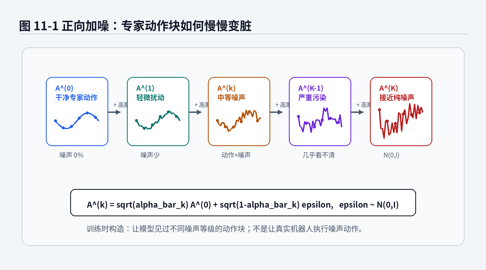
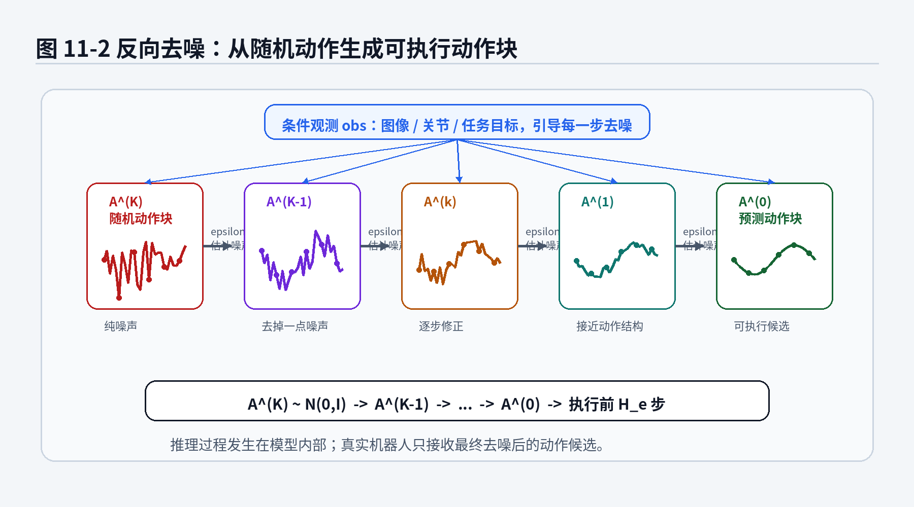
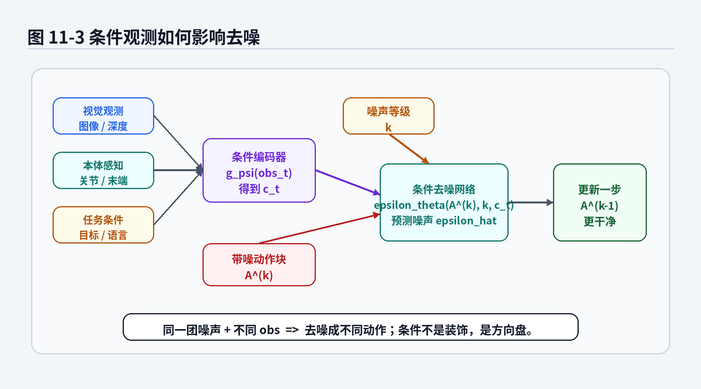
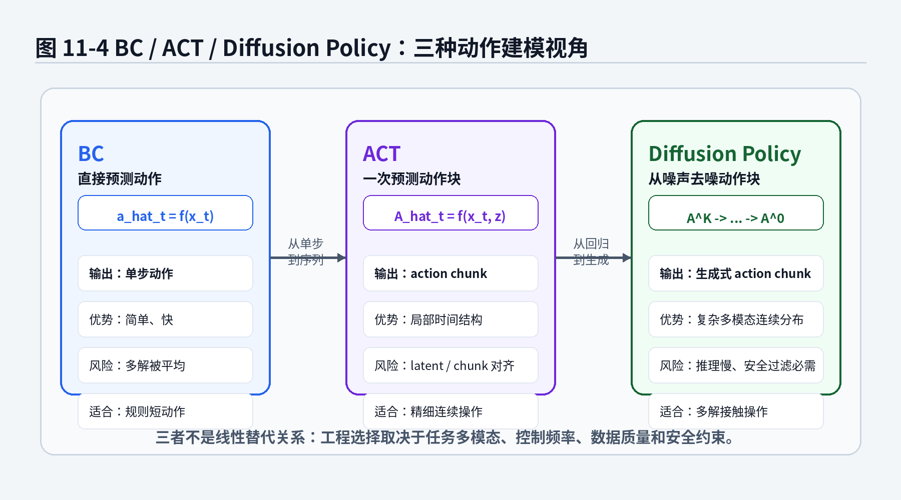

# 第14章：Diffusion Policy：把动作从一团噪声里慢慢搓出来

> **新版布局位置**：本章属于 **第四篇：现代机器人策略模型**。本章承接第13章 ACT，并为第15章 Flow Matching 做铺垫。
>
> **本章一句话导读**：Diffusion Policy 把未来动作块看成条件生成模型中的样本，通过“正向加噪—噪声预测—反向去噪”的过程，从随机动作逐步生成可执行动作序列。

第13章讲了 ACT：机器人不再只预测下一步动作，而是一次预测一个 action chunk。这个思路很重要，因为很多机器人任务不是“一帧一帧做反应”，而是需要短时间内保持动作节奏，比如接近、接触、推动、放置、回退。

本章进入 Diffusion Policy。它同样关心动作块，但生成方式不一样：ACT 更像一次性点好一份动作套餐；Diffusion Policy 更像先拿到一团随机面团，再在当前观测条件下，一步步把它揉成可以执行的动作块。

---

## 1. 本章开场：为什么还要从噪声里生成动作？

如果已经有 ACT，为什么还要 Diffusion Policy？

从工程师视角看，机器人要的是动作，不是魔术表演。你给我一个动作序列，我拿去控制机械臂就行；你先生成噪声，再慢慢去噪，听起来像是把一件简单事情绕远了。

但问题恰恰出在“给我一个动作序列”这句话上。

在很多机器人任务里，合理动作不止一条：

1. 推一个方块到目标区，可以从左边推，也可以从右边推；
2. 抓一个物体，可以先绕开障碍，也可以先调整夹爪姿态再接近；
3. 打开抽屉，可以从把手左侧接触，也可以从右侧接触；
4. 精准摆入治具时，可以直接插入，也可以先轻微探测、贴边、再下压；
5. 自动泊车时，进入车位的修正轨迹可能有多种，只要最终姿态、安全边界和舒适性满足要求。

如果用 MSE 直接回归一个平均动作，模型可能把多条合理路径平均成一条“不太合理但数学上很努力”的路径。第7章讲过这个问题：多模态动作被 MSE 平均后，机器人可能站在所有正确答案的中间，做出一个没有人真正会做的动作。

CVAE 和 ACT 已经试图解决多模态问题。CVAE 用 latent 表示动作风格，ACT 用 action chunk 表示局部时间结构。那么 Diffusion Policy 又增加了什么？

它把动作生成问题写成一个更强的条件生成过程：

> 先从一个随机动作块开始，在当前观测条件下，逐步去掉“不像专家动作”的噪声，最后得到一段可执行动作。

这句话有三层含义：

1. **动作是连续变量**：不是选一个类别，而是在高维连续空间里生成轨迹；
2. **动作可能多模态**：同一个观测下可以有多条合理动作序列；
3. **生成过程可迭代修正**：不是一次吐出答案，而是多步把粗糙样本变成合理动作。

听起来有点像做饭。BC 像“直接按菜谱给一个成品动作”；ACT 像“一次做出一小份套餐”；Diffusion Policy 像“先有一团乱七八糟的食材，再按当前任务慢慢加工成能吃的菜”。当然，如果厨师手慢，客人也会饿死，所以本章后面还要严肃讨论推理延迟和控制频率。

---

## 2. 本章要解决的核心问题

本章围绕 5 个问题展开：

1. 动作块为什么可以被看成生成模型的样本？
2. 正向加噪和直接采样公式从哪里来？
3. 噪声预测损失为什么能训练动作生成模型？
4. 推理时如何从噪声生成可执行动作块？
5. 工程上如何处理延迟、安全、归一化和闭环评测？

读本章时请始终抓住两个统一例子：

1. **二维点机器人跟随专家轨迹**：状态可写成位置和速度，动作可写成二维控制量，适合观察轨迹分布和误差累积；
2. **机械臂末端运动 / 抓取轨迹模仿**：观测包含图像或本体状态，动作包含末端位姿增量或关节控制量，适合理解连续动作、多模态动作、动作块和实机闭环。

---

## 3. 本章公式主线

第13章 ACT 已经把策略输出从单步动作扩展为动作块。本章继续追问：如果同一个观测下存在多条合理动作块，策略应该学习一个点，还是学习一个条件分布？

本章的公式主线如下：

```text
动作块 A_t
→ 条件动作块分布 p_theta(A_t | obs_t)
→ 正向加噪 q(A^(k) | A^(k-1))
→ 直接采样 A^(k)
→ 噪声预测损失 L_diffusion
→ 反向去噪 p_theta(A^(k-1) | A^(k), obs)
→ 滚动时域执行
```

更直白地说：

1. 先把未来一小段动作写成动作块 $A_t$；
2. 再把策略写成条件动作块分布 $p_\theta(A_t \mid obs_t)$；
3. 训练时把专家动作块 $A^{(0)}$ 加噪成 $A^{(k)}$；
4. 让网络预测其中混入的噪声 $\epsilon$；
5. 推理时从随机动作块 $A^{(K)}$ 出发，一步步去噪得到 $A^{(0)}$；
6. 最后只执行前几步，再重新观测和生成。

这条主线解决的是：**如何在条件观测下生成复杂、多峰、连续的动作块分布**。它留下的问题是：多步去噪会带来推理延迟，而且生成的动作仍然需要安全约束、底层控制和闭环评测。

---

## 4. 本章正式定义

> **定义 14.1：动作块**
>
> 在控制时刻 $t$，把未来长度为 $H$ 的动作序列记作动作块 $A_t$。它不是一个单步动作，而是一段短时域计划。

> **定义 14.2：条件动作块分布**
>
> 给定当前观测 $obs_t$，策略不只输出一个动作块，而是描述合理动作块的条件分布 $p_\theta(A_t \mid obs_t)$。

> **定义 14.3：diffusion step**
>
> diffusion step 用 $k$ 表示，它不是机器人真实控制时间，而是模型内部的加噪或去噪步数。机器人真实控制时间仍用 $t$ 表示。

> **定义 14.4：正向加噪过程**
>
> 正向加噪过程是人为设定的训练构造：从专家动作块 $A^{(0)}$ 出发，逐步加入高斯噪声，得到不同噪声等级的动作块 $A^{(k)}$。

> **定义 14.5：条件去噪网络**
>
> 条件去噪网络 $\epsilon_\theta(A^{(k)}, k, obs)$ 接收带噪动作块、噪声等级和观测条件，输出对噪声的估计。

> **定义 14.6：滚动时域执行**
>
> 策略可以生成长度为 $H$ 的动作块，但真实系统通常只执行前 $H_e$ 步，然后重新观测、重新生成，避免长时间开环执行。

---

## 5. 直觉解释：先不写公式，先看 Diffusion Policy 在干什么

### 5.1 从图像扩散到动作扩散

图像扩散模型的直觉是：

1. 训练时，把一张真实图片逐步加噪，直到它接近纯噪声；
2. 同时训练一个神经网络，让它学会在任意噪声程度下预测噪声；
3. 推理时，从纯噪声开始，反复用网络去掉噪声，最后生成一张图片。

Diffusion Policy 把这个思想搬到动作序列上：

1. 训练时，把专家动作块逐步加噪，直到它接近随机动作；
2. 训练一个条件去噪网络，让它在观测条件下预测动作块里的噪声；
3. 推理时，从随机动作块开始，根据当前观测反复去噪，生成一段动作；
4. 执行其中前几步，然后重新观测，再生成下一段。

如果图像扩散是在问：

> 在文本“猫坐在沙发上”的条件下，这团噪声怎样变成一张猫图？

那么 Diffusion Policy 在问：

> 在当前机器人看到的画面、关节状态和任务条件下，这团随机动作怎样变成一段合理操作轨迹？

### 5.2 动作块是生成对象，不是单个动作

Diffusion Policy 通常不是只生成一个动作 $a_t$，而是生成一个动作序列。动作序列的好处是：模型能表达短期计划、速度连续性和接触操作节奏。

比如推方块时，动作不是某一帧“往右推一下”，而是一段“接近、接触、沿目标方向持续推进、停止”的连续过程。

Diffusion Policy 的不同之处在于，它不是一次性回归这个动作块，而是从随机动作块开始逐步修正。

### 5.3 为什么从噪声开始有意义？

从噪声开始听起来很反常。人类做事不是先乱动一通再慢慢修正，机器人更不能先瞎打一套组合拳。

但注意：Diffusion Policy 的噪声过程发生在模型内部，不是让机器人真的乱动。它是在计算图里生成动作候选，最后只把去噪后的动作发给控制器。

可以把它理解为：

1. **BC**：模型直接写最终答案；
2. **ACT**：模型直接写一段最终答案；
3. **Diffusion Policy**：模型先写一份乱草稿，然后在观测条件下反复修改，直到草稿像专家动作。

这种“反复修改草稿”的方式适合高维连续动作，因为它不用一口气把复杂分布压成一个均值，而是可以通过多步去噪逐渐靠近数据分布。



**图14-1 说明**：

1. 正向过程只发生在训练构造中：把专家动作块 $A^{(0)}$ 逐步加噪；
2. 加噪步 $k$ 越大，动作块越接近高斯噪声；
3. 模型学习的不是“如何加噪”，而是之后“如何从加噪样本里估计噪声”。

---

## 6. 数学建模：把机器人动作序列写成扩散变量

### 6.1 动作块

当前控制时刻为 $t$，希望策略生成未来长度为 $H$ 的动作块。

**公式 (14.1)：动作块定义**

$$A_t = a_{t:t+H} = (a_t, a_{t+1}, \dots, a_{t+H-1})$$

如果每个动作维度为 $d_a$，那么动作块可以看成一个矩阵。

**公式 (14.2)：动作块形状**

$$A_t \in \mathbb{R}^{H \times d_a}$$

比如机械臂末端控制中，动作可能包括 $(\Delta x, \Delta y, \Delta z, \Delta r_x, \Delta r_y, \Delta r_z, g)$，其中 $g$ 是夹爪开合。若 $d_a=7$、$H=16$，那么一个动作块就是 $16 \times 7$ 的连续变量。

### 6.2 条件动作块分布

Diffusion Policy 要学习的是条件动作块分布。

**公式 (14.3)：条件动作块分布**

$$p_\theta(A_t \mid obs_t)$$

其中：

1. $A_t$：从控制时刻 $t$ 开始的动作块；
2. $obs_t$：当前条件，可以包括视觉、关节、本体感知和任务信息；
3. $p_\theta$：由参数 $\theta$ 控制的条件生成分布；
4. $p_\theta(A_t \mid obs_t)$：给定观测后，不同动作块出现的概率分布。

直觉上，同一个观测下，机器人可能有多种合理动作块。这个分布不是在说“只有一个标准答案”，而是在说“合理动作可能形成一个集合，模型要能从这个集合里采样”。

工程上，如果任务多模态明显，比如绕开障碍抓物体、推方块、开门、整理物体，那么 $p_\theta(A_t \mid obs_t)$ 比单点回归更贴近任务本质。

常见误解是：不要把 $p_\theta(A_t \mid obs_t)$ 理解成“模型会随机乱选动作”。好的条件生成模型不是随便抽彩票，而是在专家动作分布附近采样。随机性如果没有被数据和条件约束，就不是多模态智能，而是高维摇骰子。

### 6.3 干净动作、噪声动作和 diffusion step

在 diffusion 里，专家动作块记作干净样本 $A^{(0)}$，第 $k$ 步加噪后的样本记作 $A^{(k)}$。

其中：

1. $k=0$：没有加噪，是真实专家动作块；
2. $k=K$：加噪到很严重，接近标准高斯噪声；
3. $K$：总 diffusion 步数。

注意，本章使用 $A^{(k)}$ 而不是 $A_k$，就是为了避免和机器人控制时刻 $A_t$ 混淆。上标 $k$ 表示“噪声等级”，下标 $t$ 表示“真实控制时间”。

---

## 7. 正向加噪：训练时把专家动作慢慢弄脏

### 7.1 一步正向加噪

正向加噪过程从干净动作块开始，每一步往里面加入一点高斯噪声。

**公式 (14.4)：一步正向加噪**

$$q(A^{(k)} \mid A^{(k-1)}) = \mathcal{N}(\sqrt{1-\beta_k}A^{(k-1)}, \beta_k I)$$

这个公式读作：给定上一噪声等级的动作块 $A^{(k-1)}$，第 $k$ 步的动作块 $A^{(k)}$ 服从一个高斯分布。

其中：

1. $q$：正向加噪分布，不是模型学出来的策略，而是人为设定的噪声过程；
2. $A^{(k-1)}$：第 $k-1$ 步的动作块；
3. $A^{(k)}$：第 $k$ 步的动作块；
4. $\beta_k$：第 $k$ 步加入噪声的强度；
5. $I$：单位矩阵，表示各维度加入独立高斯噪声；
6. $\mathcal{N}(\mu, \Sigma)$：均值为 $\mu$、协方差为 $\Sigma$ 的高斯分布。

这个式子做了两件事：

1. 把原动作缩小一点：$\sqrt{1-\beta_k}A^{(k-1)}$；
2. 加入一点噪声：噪声方差为 $\beta_k I$。

随着不断重复，动作块里原始专家动作的成分越来越少，噪声成分越来越多。就像一张清晰照片不断被加雪花点，最后只剩电视无信号画面。

注意，正向加噪不是机器人真实执行过程。机器人不会先执行噪声动作。加噪只用于训练构造，让网络学会从不同噪声等级恢复动作。

### 7.2 定义 $\alpha_k$ 和 $\bar\alpha_k$

为了让公式更紧凑，通常定义单步保留比例。

**公式 (14.5)：单步保留比例**

$$\alpha_k = 1 - \beta_k$$

以及累计保留比例。

**公式 (14.6)：累计保留比例**

$$\bar\alpha_k = \prod_{i=1}^{k}\alpha_i$$

这里 $\bar\alpha_k$ 是从第 1 步到第 $k$ 步所有保留比例的乘积。它表示：经历 $k$ 次加噪后，原始干净动作还保留了多少比例。

如果 $\bar\alpha_k$ 很接近 1，说明动作还很干净；如果它接近 0，说明原始动作几乎被噪声淹没。

### 7.3 直接从干净动作到第 $k$ 步噪声

一步步加噪虽然符合直觉，但训练时如果每次都真的从 0 走到 $k$，会浪费计算。幸运的是，可以直接从干净动作 $A^{(0)}$ 采样出第 $k$ 步噪声动作。

**公式 (14.7)：直接加噪分布**

$$q(A^{(k)} \mid A^{(0)}) = \mathcal{N}(\sqrt{\bar\alpha_k}A^{(0)}, (1-\bar\alpha_k)I)$$

等价地，可以写成重参数化形式。

**公式 (14.8)：重参数化加噪**

$$A^{(k)} = \sqrt{\bar\alpha_k}A^{(0)} + \sqrt{1-\bar\alpha_k}\,\epsilon,\quad \epsilon \sim \mathcal{N}(0,I)$$

这个公式像一个调音台：左边旋钮控制专家动作声音多大，右边旋钮控制噪声声音多大。

1. $k$ 小：专家动作音量大，噪声音量小；
2. $k$ 大：专家动作音量小，噪声音量大。

工程上，这让训练非常方便：每次从数据集中取一个专家动作块，随机选一个 $k$，随机生成一份噪声 $\epsilon$，立刻得到训练输入 $A^{(k)}$。模型目标就是预测这份噪声。

不要把 $\epsilon$ 理解成传感器噪声。它是训练扩散模型时人为采样的数学噪声，不一定对应真实相机抖动、关节误差或机械臂震动。

### 7.4 命题：为什么可以直接采样第 $k$ 步噪声？

> **命题 14.1：逐步加噪可以合并成一次采样**
>
> 若每一步正向加噪满足公式 (14.4)，并令 $\alpha_k=1-\beta_k$、$\bar\alpha_k=\prod_{i=1}^{k}\alpha_i$，则第 $k$ 步带噪动作可以写成公式 (14.8)。

**推导思路**：

先把一步加噪写成采样形式：

$$A^{(k)} = \sqrt{\alpha_k}A^{(k-1)} + \sqrt{1-\alpha_k}\,\epsilon_k,\quad \epsilon_k\sim\mathcal{N}(0,I)$$

看前两步。

第一步：

$$A^{(1)} = \sqrt{\alpha_1}A^{(0)} + \sqrt{1-\alpha_1}\,\epsilon_1$$

第二步：

$$A^{(2)} = \sqrt{\alpha_2}A^{(1)} + \sqrt{1-\alpha_2}\,\epsilon_2$$

把第一步代入第二步：

$$A^{(2)} = \sqrt{\alpha_1\alpha_2}A^{(0)} + \sqrt{\alpha_2(1-\alpha_1)}\,\epsilon_1 + \sqrt{1-\alpha_2}\,\epsilon_2$$

后两项都是独立高斯噪声的线性组合，因此仍然是高斯噪声。它们的总方差为：

$$\alpha_2(1-\alpha_1) + (1-\alpha_2) = 1 - \alpha_1\alpha_2$$

所以可以写成：

$$A^{(2)} = \sqrt{\alpha_1\alpha_2}A^{(0)} + \sqrt{1-\alpha_1\alpha_2}\,\epsilon$$

推广到第 $k$ 步，就得到：

$$A^{(k)} = \sqrt{\bar\alpha_k}A^{(0)} + \sqrt{1-\bar\alpha_k}\,\epsilon$$

其中 $\epsilon\sim\mathcal{N}(0,I)$。

这个推导的核心不是复杂技巧，而是一个基础事实：**独立高斯噪声的线性组合仍然是高斯噪声，方差会按系数平方累加**。

---

## 8. 训练目标：为什么模型要预测噪声？

### 8.1 条件去噪网络

Diffusion Policy 的去噪网络通常写成：

**公式 (14.9)：条件去噪网络**

$$\epsilon_\theta(A^{(k)}, k, obs)$$

它输入三类信息：

1. $A^{(k)}$：带噪动作块；
2. $k$：当前噪声等级；
3. $obs$：当前观测条件。

输出是模型估计的噪声。训练时，我们知道真实加入的噪声 $\epsilon$，所以可以用 MSE 监督。

**公式 (14.10)：Diffusion Policy 的噪声预测损失**

$$\mathcal{L}_{\mathrm{diffusion}}(\theta) = \mathbb{E}_{A^{(0)},\epsilon,k,obs}\left[\lVert \epsilon - \epsilon_\theta(A^{(k)}, k, obs)\rVert^2\right]$$

这个公式要解决的问题是：模型看到一个带噪动作块后，能判断其中有多少是噪声。只要能估计噪声，就能把噪声减掉，逐步恢复动作。

其中：

1. $\mathcal{L}_{\mathrm{diffusion}}$：扩散训练损失；
2. $\theta$：去噪网络参数；
3. $A^{(0)}$：专家动作块；
4. $\epsilon$：真实加入的标准高斯噪声；
5. $k$：随机采样的 diffusion step；
6. $obs$：条件观测；
7. $A^{(k)}$：由 $A^{(0)}$、$\epsilon$、$k$ 构造出的带噪动作块；
8. $\epsilon_\theta(A^{(k)}, k, obs)$：网络预测的噪声；
9. $\lVert\cdot\rVert^2$：平方误差；
10. $\mathbb{E}$：对数据、噪声和噪声等级取平均。

这个损失看起来仍然是 MSE，但它和第2章的动作 MSE 不一样。BC 的 MSE 是直接把预测动作拉向专家动作；Diffusion 的 MSE 是让模型预测人为加入的噪声。后者训练的是一个条件去噪场，而不是一个单点动作回归器。

### 8.2 为什么不直接预测干净动作？

有些 diffusion 模型也可以预测 $A^{(0)}$ 或其他参数化形式。但噪声预测有一个实用优势：训练目标清楚、尺度稳定、实现方便。

从公式 (14.8) 看，$A^{(k)}$ 由干净动作和噪声组成。若模型预测 $\epsilon$，就可以通过公式反推出干净动作的估计。也就是说，预测噪声不是绕远，而是一种方便的参数化方式。

在机器人动作里，这还有一个好处：动作维度通常经过归一化，标准高斯噪声尺度相对稳定。模型学习“噪声长什么样”往往比直接预测不同任务、不同动作维度的原始数值更容易组织。

### 8.3 噪声预测和 score 的关系：先知道到什么程度即可

Diffusion Policy 的正文目标可以先理解为“预测噪声”。但从生成模型角度看，噪声预测还可以理解为学习一个把带噪动作拉回数据分布的方向场。

令 $p_k(A^{(k)} \mid obs)$ 表示在第 $k$ 个噪声等级下、给定观测后的带噪动作分布。score 是这个分布对动作的对数梯度：

$$\nabla_{A^{(k)}} \log p_k(A^{(k)} \mid obs)$$

直觉上，score 指向“让当前带噪动作变得更像高概率动作”的方向。

在常用高斯加噪设定下，噪声预测网络和条件 score 场可以建立近似对应关系。

**公式 (14.11)：噪声预测与条件 score 的关系**

$$s_\theta(A^{(k)}, k, obs) \approx -\frac{1}{\sqrt{1-\bar\alpha_k}}\epsilon_\theta(A^{(k)}, k, obs)$$

其中 $s_\theta$ 可以理解为模型学习到的条件 score 估计。

对普通工程读者来说，这里不需要立刻掌握完整 score matching 推导。你只需要先抓住三点：

1. 噪声预测不是简单“猜随机数”，而是在学习动作分布附近的修正方向；
2. 反向去噪就是反复利用这些方向，把随机动作块推回专家动作分布附近；
3. 实现中通常不显式计算 score，而是直接训练 $\epsilon_\theta$ 做噪声 MSE。

详细概率基础可以回看附录 I。

---

## 9. 反向去噪：推理时从随机动作慢慢变成可执行动作

训练时我们把专家动作弄脏；推理时要反过来，从噪声恢复动作。

推理流程大致是：

1. 采样一个随机动作块；
2. 对 $k=K,K-1,\dots,1$，重复预测噪声并更新动作块；
3. 得到 $A^{(0)}$，作为预测动作块。

**公式 (14.12)：推理初始噪声**

$$A^{(K)} \sim \mathcal{N}(0,I)$$



**图14-2 说明**：

1. 推理时从随机动作块开始，不是从专家动作开始；
2. 每一步都在当前观测条件下估计噪声并更新动作块；
3. 最终生成的 $A^{(0)}$ 才会进入机器人控制链路，通常只执行前几步。

### 9.1 反向均值公式

DDPM 中一个常见的反向均值写法是：

**公式 (14.13)：反向去噪均值**

$$\mu_\theta(A^{(k)}, k, obs) = \frac{1}{\sqrt{\alpha_k}}\left(A^{(k)} - \frac{\beta_k}{\sqrt{1-\bar\alpha_k}}\epsilon_\theta(A^{(k)}, k, obs)\right)$$

然后反向一步可以写成：

**公式 (14.14)：反向去噪分布**

$$p_\theta(A^{(k-1)} \mid A^{(k)}, obs) = \mathcal{N}(\mu_\theta(A^{(k)}, k, obs), \Sigma_k)$$

其中 $\Sigma_k$ 可以是固定方差，也可以由具体算法设定。

公式 (14.13) 要解决的问题是：模型已经预测了当前带噪动作中的噪声，我们需要把这个噪声估计转换成下一步更干净的动作分布中心，也就是 $A^{(k-1)}$ 的均值。

括号里的核心动作是“当前带噪动作减去一部分预测噪声”。外面的 $1/\sqrt{\alpha_k}$ 用来调整尺度，因为正向加噪时每一步也缩放了原始信号。

反向去噪通常需要多步迭代。步数越多，生成质量可能更好，但推理延迟也越大。机器人控制系统不会因为你在扩散空间里哲学思考而暂停世界运行。真实部署必须权衡去噪步数、控制频率和动作稳定性。

反向去噪不是物理世界中的反馈控制。它发生在模型内部。生成动作后，真实机器人仍然需要底层控制器、安全约束、碰撞检测、限速、力控或急停机制。

---

## 10. 条件观测：去噪不是闭眼搓动作

如果没有条件观测，扩散模型只能生成“像训练数据”的动作块，但不知道当前任务需要什么。机器人看到杯子在左边还是右边、门把手开着还是关着、车位入口偏了多少，这些都必须进入去噪过程。

所以 Diffusion Policy 的去噪网络必须是条件模型。

条件观测可以包括：

1. 当前或历史图像；
2. 机器人关节角、速度、末端位姿；
3. 夹爪状态；
4. 任务目标或语言指令；
5. 环境中的目标位置、障碍物、接触信息。



**图14-3 说明**：

1. 条件编码器把图像、本体感知和任务信息压成条件表示 $c_t$；
2. 去噪网络同时接收带噪动作、diffusion step 和条件表示；
3. 条件不是装饰，它决定同一团噪声最终被去噪成哪一类动作。

### 10.1 条件编码器的作用

可以把条件观测先编码成一个向量或 token 序列。

**公式 (14.15)：条件编码器**

$$c_t = g_\psi(obs_t)$$

然后去噪网络可以写成 $\epsilon_\theta(A^{(k)}, k, c_t)$。

其中：

1. $obs_t$：当前观测信息；
2. $g_\psi$：条件编码器，参数为 $\psi$；
3. $c_t$：条件表示；
4. $\epsilon_\theta(A^{(k)}, k, c_t)$：条件去噪网络。

$c_t$ 像是给去噪网络的一张任务便签：现在物体在哪里、机器人手在哪里、目标是什么、哪些区域不能碰。没有这张便签，模型只能生成“平均意义上像专家”的动作，不能生成“此时此地应该做”的动作。

工程上，条件编码器质量很关键。视觉特征如果对目标位置不敏感，去噪网络再强也只能在错误条件上努力。就像导航地图标错了位置，司机技术再好也会把车开进奇怪的小路。

不要以为 diffusion 的强生成能力可以弥补糟糕观测。观测错、时间戳错、相机外参飘、关节状态延迟，都会让条件生成变成“根据错误题干写作文”。文笔再好，答案也跑题。

---

## 11. Receding Horizon：生成一段，但别闭眼执行到底

Diffusion Policy 通常生成一个较长动作块，但真实执行时往往只执行前 $H_e$ 步，然后重新获取观测，再生成新的动作块。

**公式 (14.16)：滚动时域动作生成**

$$\hat A_t = \mathrm{Denoise}_\theta(\xi, obs_t),\quad \xi\sim\mathcal{N}(0,I)$$

**公式 (14.17)：只执行前 $H_e$ 步**

$$\mathrm{execute}\ \hat a_{t:t+H_e},\quad H_e \le H$$

这叫 receding horizon control，中文可以理解成“滚动时域控制”。第13章讲 ACT 时已经提到类似思想：预测一段，不代表闭眼把整段执行到底。

其中：

1. $\xi$：推理时采样的初始随机噪声动作；
2. $\mathrm{Denoise}_\theta$：多步去噪过程；
3. $\hat A_t$：模型生成的动作块；
4. $H$：预测动作块长度；
5. $H_e$：每次实际执行长度。

这像开车导航。导航可以规划未来几公里，但司机不会闭眼开完整条路线。每开一小段，要重新看路况、车道线和前车动作。

工程上，$H_e$ 太小，系统频繁推理，计算压力大；$H_e$ 太大，开环风险高。真实系统通常要根据模型推理耗时、控制频率、任务动态性和安全要求选择。

不要把 Diffusion Policy 生成的动作块当成不可修改的圣旨。真实部署中，动作还要经过限幅、平滑、安全检查、底层控制器和异常监控。

---

## 12. Diffusion Policy 和 ACT 的关系：都生成动作块，但厨房不一样

第13章的 ACT 和本章的 Diffusion Policy 都强调动作块。它们的共同点是：输入当前条件，输出未来动作序列。

但建模方式不同。

### 12.1 ACT 的生成方式

ACT 通常可以理解为：给定条件和 latent，一次生成动作块。训练时通过 CVAE encoder 得到 latent，推理时从 prior 采样或使用固定 latent，再由 Transformer 输出动作块。

它更像：

> 给定条件和 latent，一次写完一段动作。

### 12.2 Diffusion Policy 的生成方式

Diffusion Policy 的生成方式是：先采样随机动作块 $A^{(K)}$，再通过多步去噪得到 $A^{(0)}$。

它更像：

> 给定条件，从噪声开始，多步修改草稿，最后得到动作块。

### 12.3 关键差异

1. **ACT**：推理通常更直接，结构上依赖 latent 和序列模型；
2. **Diffusion Policy**：推理需要多步去噪，但能用迭代方式表达复杂连续分布；
3. **ACT 的多模态**：主要通过 latent 和 action chunk 表达；
4. **Diffusion 的多模态**：通过从不同噪声初始点出发、在条件分布中逐步采样表达；
5. **工程成本**：Diffusion 常更吃推理时间，需要优化步数、模型大小和控制频率。



**图14-4 说明**：

1. BC 偏向直接预测单步动作，结构简单但容易平均多解；
2. ACT 预测动作块，能表达局部时间结构；
3. Diffusion Policy 通过条件去噪生成动作块，更适合复杂连续多模态动作，但推理成本更高。

---

## 13. 为什么 Diffusion Policy 适合多模态连续控制？

### 13.1 连续动作空间很难“分类”

机器人动作通常是连续的。比如末端速度、关节角增量、夹爪开度、移动机器人速度和角速度，都不是简单类别。

你当然可以把动作离散化，但离散太粗会损失精度，离散太细会让类别数量爆炸。机械臂不是选奶茶口味，动作空间维度一高，离散化就容易变成“菜单厚得像法规汇编”。

Diffusion Policy 直接在连续动作空间里生成动作块，避免了粗暴离散化。

### 13.2 多解任务需要分布，而不是平均值

假设同一个观测下专家有两类策略：

1. 从左侧绕过去抓取；
2. 从右侧绕过去抓取。

如果用 MSE 做单点回归，模型可能输出中间路线，结果正好撞上障碍。

Diffusion Policy 学的是条件生成分布。不同随机初始噪声可以引导生成不同合理样本。只要训练数据和条件足够支持，模型可以保留多种动作模式，而不是把它们搅成平均糊糊。

### 13.3 去噪过程像在动作流形上找合理点

从几何直觉上看，专家动作并不是填满整个高维动作空间，而是集中在一些低维结构附近。比如“抓杯子”的动作块，不会包含大量毫无意义的抖动、反向拉扯或夹爪乱开乱合。

扩散去噪可以理解成：从随机点出发，在观测条件引导下，逐步移动到专家动作分布附近。

这里的“附近”不是距离某一个动作近，而是像真实专家动作整体。它更关心动作序列是否落在合理行为分布中。

---

## 14. Python 风格伪代码：训练 Diffusion Policy

下面用伪代码把训练流程串起来。为了突出数学过程，这里不展开网络结构细节。

```python
# demonstration batch:
# obs:     当前观测或观测历史
# A0:      专家动作块，shape = [batch, horizon, action_dim]
# K:       diffusion 总步数
# alpha_bar[k]: 累计保留比例

for obs, A0 in dataloader:
    # 1. 随机采样 diffusion step
    k = randint(low=1, high=K, shape=[batch])

    # 2. 采样标准高斯噪声
    eps = randn_like(A0)

    # 3. 直接构造第 k 步噪声动作
    A_k = sqrt(alpha_bar[k]) * A0 + sqrt(1 - alpha_bar[k]) * eps

    # 4. 条件去噪网络预测噪声
    eps_pred = denoise_net(A_k, k, obs)

    # 5. 噪声预测损失
    loss = mean_squared_error(eps_pred, eps)

    # 6. 反向传播更新模型
    optimizer.zero_grad()
    loss.backward()
    optimizer.step()
```

这段伪代码对应公式 (14.10)。从代码角度看，最容易出错的地方有三个：

1. $A^{(0)}$ 的动作归一化没有做好；
2. $k$、$\alpha_k$、$\bar\alpha_k$ 的索引错位；
3. $obs$ 和动作块时间戳没有对齐。

第三点尤其要命。模仿学习数据里，时间戳错一点，动作就会像一个永远慢半拍的人：目标已经变了，它还在执行上一秒的理解。

---

## 15. Python 风格伪代码：推理 Diffusion Policy

推理时没有专家动作块。我们从随机噪声开始生成动作。

```python
# obs_t: 当前观测
# K: diffusion 总步数
# H: 预测动作块长度
# d_a: 动作维度
# H_exec: 每次实际执行步数

while robot_is_running:
    obs_t = get_observation()

    # 1. 从标准高斯采样随机动作块
    A_k = randn(shape=[H, d_a])

    # 2. 从 K 到 1 逐步去噪
    for k in reversed(range(1, K + 1)):
        eps_pred = denoise_net(A_k, k, obs_t)
        mean = compute_reverse_mean(A_k, eps_pred, k)

        if k > 1:
            noise = randn_like(A_k)
            A_k = mean + sigma[k] * noise
        else:
            A_k = mean

    # 3. 去噪完成，得到预测动作块
    A0_pred = A_k

    # 4. 只执行前 H_exec 步，再重新观测
    for action in A0_pred[:H_exec]:
        safe_action = safety_filter(action)
        low_level_controller.execute(safe_action)
```

这段伪代码里，`safety_filter` 不是摆设。真实机器人不能把神经网络输出直接当圣旨。即便模型大多数时候靠谱，偶发异常动作也可能让机械臂把工件、夹具、相机支架和项目经理的血压一起带走。

---

## 16. 工程实践案例

### 16.1 推方块：多解路径很自然

推方块任务常被用来展示 Diffusion Policy 的优势，因为它天然存在多种合理轨迹。只要最终把方块推到目标区域，机器人可以从不同方向接近、接触和推动。

对 BC 来说，如果数据里同时有左推和右推，单点回归可能学到中间接近路线。中间路线看起来很“平均”，但它可能正好不是任何专家真正做过的策略。

Diffusion Policy 更适合把这些路径作为条件分布中的多个模式。推理时，不同随机噪声可能生成不同但合理的推法。

### 16.2 开门和拉抽屉：接触过程要求连续动作

开门不是简单地把末端移动到把手位置。它包括接近、对准、接触、施力、沿约束方向运动。动作序列的局部连续性很重要，力和位姿也要配合。

Diffusion Policy 生成动作块，可以在短时域内表达这一过程。它不像单步 BC 每帧独立做小判断，也不像纯规划器必须拥有完美几何模型。它可以从示范中学习“接触后该怎样继续动”。

但工程上仍然要加限制。比如力过大时停止、关节接近极限时减速、门未打开时回退。Diffusion Policy 不应该替代所有安全逻辑。它负责生成候选动作，控制系统负责让动作别把现场变成事故复盘会。

### 16.3 抓取 + 精准摆入治具：适合学习局部策略，但不该抛弃几何

在抓取后精准摆入治具的场景里，托盘槽口可能变形，定位可能有误差，相机可能有震动。传统视觉 + 机械臂方案会依赖检测精度、标定精度和工装一致性。

Diffusion Policy 有机会学习一些局部操作策略：

1. 接近槽口时放慢速度；
2. 沿槽口方向微调；
3. 遇到轻微偏差时做小幅修正；
4. 放不进去时回退再尝试。

但这不意味着可以扔掉几何定位和安全控制。更现实的方案是：

1. 用视觉和几何给出目标区域、粗位姿和安全边界；
2. 用 Diffusion Policy 学习局部接触和微调动作；
3. 用底层控制器、力控和规则约束兜底。

这类任务的核心不是“传统方法 vs 学习方法谁干掉谁”，而是两者如何分工。传统几何负责可解释边界，学习策略负责难以手写的局部操作。

### 16.4 自动泊车类比：动作生成思想可借鉴，但不能照搬

自动泊车里也有动作序列生成问题：转角、速度、挡位、刹停时机都构成控制序列。多条轨迹可能都能进车位，但舒适性、安全边界和车辆动力学约束不同。

Diffusion 的条件生成思想可以借鉴到轨迹候选生成或控制序列生成中。但自动驾驶 / 泊车系统有更强的安全和法规要求，不能简单把机械臂策略学习做法原封不动搬过去。

泊车中必须处理：

1. 车辆运动学约束；
2. 碰撞边界；
3. 可解释 fallback；
4. 低速控制稳定性；
5. 量产部署算力和延迟；
6. 传感器误检、漏检和遮挡。

所以，Diffusion Policy 在泊车里的合理位置，更可能是生成候选轨迹、学习局部策略先验，或辅助传统优化，而不是直接端到端接管所有控制。

---

## 17. 方法边界与工程风险

### 17.1 推理延迟：去噪步数不是免费的

Diffusion Policy 推理需要多步去噪。去噪步数越多，计算越重。机器人控制却有实时性要求。

如果策略 10Hz 运行，底层控制 100Hz，推理耗时必须稳定。偶尔一帧推理慢，不只是日志里多一个 warning，可能直接造成动作延迟、接触失败或安全风险。

工程上通常要考虑：

1. 减少去噪步数；
2. 使用更快采样器；
3. 缩小模型；
4. 使用动作缓存；
5. 只执行前几步并滚动重规划；
6. 加入底层轨迹插值和平滑。

### 17.2 动作归一化：尺度错了，噪声就不讲道理

Diffusion 假设噪声是标准高斯，而动作维度可能尺度差异很大。

比如末端平移单位是米，旋转单位是弧度，夹爪开合是 0 到 1，关节角速度又是另一套尺度。如果不做归一化，某些维度会主导损失，某些维度几乎学不到。

动作归一化常见做法是：

**公式 (14.18)：动作归一化**

$$\tilde a = \frac{a-\mu_a}{\sigma_a}$$

推理输出后再反归一化：

**公式 (14.19)：动作反归一化**

$$a = \tilde a\sigma_a + \mu_a$$

这里 $\mu_a$ 和 $\sigma_a$ 应从训练集统计得到，并且训练、验证、部署必须一致。别训练时一套归一化，部署时另一套归一化。那不是泛化问题，是把模型送进单位换算地狱。

### 17.3 数据质量：扩散模型不会自动修复烂示范

Diffusion Policy 能表达复杂分布，但它学的仍然来自数据。如果数据里有大量失败示范、时间戳错位、动作延迟、相机外参漂移、任务标签混乱，模型会忠实学习这些混乱。

生成模型有时会让问题更隐蔽：它可以生成看起来很平滑的动作，但任务就是失败。动作好看不等于任务成功，就像 PPT 好看不代表项目能交付。

### 17.4 多模态不是越多越好

多模态能力是优点，但如果没有任务约束，多模态也会带来不稳定。

同一个观测下，模型可能采样出不同策略。如果这些策略都合理，没问题；如果有些策略边缘可行，有些策略危险，系统就需要筛选、重采样或安全过滤。

工程上可以考虑：

1. 多次采样候选动作块；
2. 用价值函数、约束检查或规则评分；
3. 选择最安全、最平滑或最接近目标的候选；
4. 对异常动作块直接丢弃。

### 17.5 闭环评测仍然是最终裁判

Diffusion loss 低，不代表机器人任务成功率高。第6章已经讲过：单步或开环指标无法完全替代闭环执行。

Diffusion Policy 也一样。你可以在验证集上得到很低的噪声预测误差，但闭环时仍然可能因为观测偏差、动态变化、接触误差、控制延迟而失败。

所以必须评估：

1. closed-loop success rate；
2. 完成时间；
3. 碰撞率；
4. 动作平滑度；
5. 接触力峰值；
6. 异常恢复能力；
7. 多随机种子稳定性；
8. sim2real 差距。

---

## 18. 常见误区

### 18.1 误区一：Diffusion Policy 就是把图像扩散模型换成动作

思想相似，但机器人动作有自己的约束。动作会被真实系统执行，会影响下一步观测，还可能撞东西。图像生成错了最多难看，机器人动作错了可能损坏设备。

### 18.2 误区二：Diffusion Policy 一定比 ACT 好

方法没有绝对排序。ACT 可能更快、更简单、更适合某些低延迟精细任务；Diffusion Policy 可能更适合复杂连续多模态动作。选择方法要看任务、多模态程度、算力、数据量、控制频率和安全要求。

### 18.3 误区三：预测噪声 MSE 低就说明策略好

噪声预测损失只是训练目标。真实任务还要看闭环成功率。低 loss 但闭环翻车，说明模型可能学会了开环数据分布，却没有学会在真实反馈下稳定完成任务。

### 18.4 误区四：生成动作块后可以全部执行完

不建议这么做。动作块越长，后半段越容易过期。环境一变、物体一滑、夹爪一偏，后半段动作就可能从计划变成事故前奏。更稳妥的方式是滚动执行。

### 18.5 误区五：有了 diffusion 就不需要传统控制

Diffusion Policy 生成的是高层动作或轨迹候选。真实机器人仍然需要底层控制器、限速、限位、碰撞检测、力控、安全停机和异常处理。没有这些，policy 再聪明也像没有刹车的跑车。

---

## 19. 读完本章，你应该能判断什么？

读完本章，你应该能判断：

1. 一个任务是否真的需要 Diffusion Policy，而不是简单 BC 或 ACT；
2. 多模态动作是不是任务主要矛盾；
3. 推理步数是否会压垮控制频率；
4. 动作归一化是否可能导致训练失败；
5. diffusion loss 低但闭环失败时，应优先检查数据时间戳、观测条件、动作延迟、归一化和安全过滤；
6. 在抓取 + 精准摆入治具任务中，哪些部分适合学习策略，哪些部分仍应交给几何、力控和安全规则；
7. Diffusion Policy 更适合做动作候选生成或局部策略学习，而不是替代整个机器人控制系统。

---

## 20. 本章小结：从 Diffusion Policy 到 Flow Matching

第13章讲 ACT，它用 action chunk 解决单步动作短视问题。本章进一步把动作块看成生成模型的样本，用 diffusion 的正向加噪和反向去噪来建模动作分布。

本章最核心的公式链条是：

```text
动作块
→ 条件动作块分布
→ 正向加噪
→ 直接采样第 k 步噪声动作
→ 噪声预测损失
→ 反向去噪生成动作块
→ 滚动执行
```

这条链条讲的是一件事：

> 训练时把专家动作弄脏，让模型学会识别脏东西；推理时从一团脏东西开始，在观测条件下慢慢擦干净，得到可执行动作。

但本章也强调：Diffusion Policy 不是魔法。它解决的是动作分布建模问题，不自动解决数据质量、实时性、安全约束、底层控制和闭环泛化问题。真实机器人不会因为模型名字里有 diffusion 就变得宽容。现场永远比论文图更会挑刺。

下一章进入 Flow Matching。我们会看到：如果说 Diffusion Policy 用离散多步去噪生成动作，那么 Flow Matching 更强调学习连续流场，把噪声分布搬运到动作分布。第16章再统一比较 BC、ACT、Diffusion Policy 和 Flow Matching。

---

## 21. 本章公式索引

### 公式 (14.1)：动作块定义

$$A_t = a_{t:t+H} = (a_t, a_{t+1}, \dots, a_{t+H-1})$$

- **含义**：当前控制时刻要生成的未来动作序列。
- **需要掌握到什么程度**：知道 Diffusion Policy 生成的是动作块，而不是单步动作。

### 公式 (14.2)：动作块形状

$$A_t \in \mathbb{R}^{H \times d_a}$$

- **含义**：动作块可以看成长度为 $H$、每步动作为 $d_a$ 维的矩阵。
- **需要掌握到什么程度**：理解 horizon 和 action dimension 会直接影响模型输出维度和推理成本。

### 公式 (14.3)：条件动作块分布

$$p_\theta(A_t \mid obs_t)$$

- **含义**：给定观测后，模型要生成未来动作块的条件分布。
- **需要掌握到什么程度**：理解 Diffusion Policy 不是只学一个平均动作，而是建模动作块分布。

### 公式 (14.4)：一步正向加噪

$$q(A^{(k)} \mid A^{(k-1)}) = \mathcal{N}(\sqrt{1-\beta_k}A^{(k-1)}, \beta_k I)$$

- **含义**：定义如何从上一噪声等级得到下一噪声等级。
- **需要掌握到什么程度**：知道这是训练时人为设定的过程，不是机器人真实执行过程。

### 公式 (14.5)：单步保留比例

$$\alpha_k = 1 - \beta_k$$

- **含义**：表示第 $k$ 步保留下来的信号比例。
- **需要掌握到什么程度**：理解它只是为了简化后续公式。

### 公式 (14.6)：累计保留比例

$$\bar\alpha_k = \prod_{i=1}^{k}\alpha_i$$

- **含义**：表示经过 $k$ 步加噪后，原始动作还保留多少。
- **需要掌握到什么程度**：知道 $\bar\alpha_k$ 越小，动作越接近噪声。

### 公式 (14.7)：直接加噪分布

$$q(A^{(k)} \mid A^{(0)}) = \mathcal{N}(\sqrt{\bar\alpha_k}A^{(0)}, (1-\bar\alpha_k)I)$$

- **含义**：从干净动作直接采样任意噪声等级的动作块。
- **需要掌握到什么程度**：知道它让训练不必一步步加噪到第 $k$ 步。

### 公式 (14.8)：重参数化加噪

$$A^{(k)} = \sqrt{\bar\alpha_k}A^{(0)} + \sqrt{1-\bar\alpha_k}\,\epsilon,\quad \epsilon \sim \mathcal{N}(0,I)$$

- **含义**：训练时用干净动作和标准高斯噪声构造带噪动作。
- **需要掌握到什么程度**：这是训练代码中最常用的构造式，需要理解每一项的含义。

### 公式 (14.9)：条件去噪网络

$$\epsilon_\theta(A^{(k)}, k, obs)$$

- **含义**：输入带噪动作、噪声等级和观测条件，输出预测噪声。
- **需要掌握到什么程度**：知道模型训练的对象是噪声，而不是直接动作。

### 公式 (14.10)：Diffusion Policy 的噪声预测损失

$$\mathcal{L}_{\mathrm{diffusion}}(\theta) = \mathbb{E}_{A^{(0)},\epsilon,k,obs}\left[\lVert \epsilon - \epsilon_\theta(A^{(k)}, k, obs)\rVert^2\right]$$

- **含义**：让模型预测正向过程中加入的噪声。
- **需要掌握到什么程度**：理解它虽然是 MSE，但不是 BC 的动作 MSE。

### 公式 (14.11)：噪声预测与条件 score 的关系

$$s_\theta(A^{(k)}, k, obs) \approx -\frac{1}{\sqrt{1-\bar\alpha_k}}\epsilon_\theta(A^{(k)}, k, obs)$$

- **含义**：噪声预测可以看作在学习把带噪动作推回高概率数据区域的方向。
- **需要掌握到什么程度**：知道这个关系服务于直觉理解，完整概率推导可以放到附录 I。

### 公式 (14.12)：推理初始噪声

$$A^{(K)} \sim \mathcal{N}(0,I)$$

- **含义**：推理时从标准高斯随机动作块开始。
- **需要掌握到什么程度**：知道推理起点不是专家动作，而是一团随机动作。

### 公式 (14.13)：反向去噪均值

$$\mu_\theta(A^{(k)}, k, obs) = \frac{1}{\sqrt{\alpha_k}}\left(A^{(k)} - \frac{\beta_k}{\sqrt{1-\bar\alpha_k}}\epsilon_\theta(A^{(k)}, k, obs)\right)$$

- **含义**：根据预测噪声计算下一步更干净动作分布的中心。
- **需要掌握到什么程度**：理解“减掉预测噪声并调整尺度”的直觉即可。

### 公式 (14.14)：反向去噪分布

$$p_\theta(A^{(k-1)} \mid A^{(k)}, obs) = \mathcal{N}(\mu_\theta(A^{(k)}, k, obs), \Sigma_k)$$

- **含义**：从当前噪声等级走向更干净噪声等级的反向分布。
- **需要掌握到什么程度**：知道推理时会重复这个过程直到得到 $A^{(0)}$。

### 公式 (14.15)：条件编码器

$$c_t = g_\psi(obs_t)$$

- **含义**：把原始观测编码成去噪网络可用的条件表示。
- **需要掌握到什么程度**：知道条件编码质量会直接影响动作生成质量。

### 公式 (14.16)：滚动时域动作生成

$$\hat A_t = \mathrm{Denoise}_\theta(\xi, obs_t),\quad \xi\sim\mathcal{N}(0,I)$$

- **含义**：从随机噪声和当前观测生成预测动作块。
- **需要掌握到什么程度**：理解这是多步去噪过程的简写。

### 公式 (14.17)：只执行前 $H_e$ 步

$$\mathrm{execute}\ \hat a_{t:t+H_e},\quad H_e \le H$$

- **含义**：真实系统只执行动作块前几步，然后重新观测。
- **需要掌握到什么程度**：知道滚动执行用于降低长时间开环风险。

### 公式 (14.18)：动作归一化

$$\tilde a = \frac{a-\mu_a}{\sigma_a}$$

- **含义**：把不同动作维度调整到相近尺度。
- **需要掌握到什么程度**：知道动作归一化是 diffusion policy 工程训练中的关键步骤。

### 公式 (14.19)：动作反归一化

$$a = \tilde a\sigma_a + \mu_a$$

- **含义**：部署时把模型输出恢复到真实动作单位。
- **需要掌握到什么程度**：训练、验证、部署必须使用一致的统计量。

---

## 22. 本章定义索引

### 定义 14.1：动作块

- **位置**：第4节。
- **含义**：未来长度为 $H$ 的动作序列 $A_t$。
- **作用**：把策略输出从单步动作扩展成短时域计划。

### 定义 14.2：条件动作块分布

- **位置**：第4节。
- **含义**：给定观测 $obs_t$ 后，动作块 $A_t$ 的条件分布。
- **作用**：解释 Diffusion Policy 为什么不是单点回归。

### 定义 14.3：diffusion step

- **位置**：第4节。
- **含义**：模型内部的加噪 / 去噪步数 $k$。
- **作用**：区分 diffusion step 和机器人真实控制时间 $t$。

### 定义 14.4：正向加噪过程

- **位置**：第4节。
- **含义**：训练时人为设定的从干净动作到噪声动作的过程。
- **作用**：构造带噪训练样本。

### 定义 14.5：条件去噪网络

- **位置**：第4节。
- **含义**：预测带噪动作中噪声的网络 $\epsilon_\theta$。
- **作用**：支撑 diffusion loss 和反向去噪。

### 定义 14.6：滚动时域执行

- **位置**：第4节。
- **含义**：生成一段动作，但只执行前几步并重新观测。
- **作用**：降低长时间开环执行风险。

---

## 23. 建议阅读的附录条目

建议配合阅读以下附录：

1. **附录 A：数学符号与公式阅读方法**
   - 重点复习上标、下标和序列记号。本章同时使用机器人控制时间 $t$ 和 diffusion step $k$，很容易混淆。

2. **附录 B：概率论最小生存包**
   - 重点复习随机变量、高斯采样和期望。公式中的 $\epsilon\sim\mathcal{N}(0,I)$、$\mathbb{E}[\cdot]$ 都依赖这些基础。

3. **附录 C：最大似然、负对数似然、交叉熵与 KL**
   - 重点理解训练目标和概率建模之间的关系。虽然本章核心损失是噪声 MSE，但它背后仍然来自概率生成模型思想。

4. **附录 D：高斯分布、MSE 与连续动作回归**
   - 重点复习高斯分布、协方差矩阵、单位矩阵和 MSE。正向加噪、反向去噪和噪声预测都离不开高斯分布。

5. **附录 E：优化基础**
   - 重点复习损失函数、梯度下降和反向传播。$\epsilon_\theta$ 的训练本质上仍是神经网络参数优化。

6. **附录 F：强化学习与序列决策基础**
   - 重点复习 rollout、open-loop、closed-loop 和策略诱导分布。Diffusion Policy 生成动作块后仍然处在闭环序列决策中。

7. **附录 G：生成模型基础**
   - 重点复习 diffusion 的正向加噪、反向去噪、噪声预测目标，以及它和 CVAE 的区别。

8. **附录 H：实验与代码基础**
   - 重点复习训练循环、rollout 评测、动作归一化、日志记录和成功率统计。本章的伪代码可以和附录 H 对照阅读。

9. **附录 I：熵、最大熵与 Score Matching**
   - 重点复习 score 的直觉和噪声预测目标之间的关系。

---

## 24. 推荐阅读与深入材料

### 阅读目的

本章要讲清楚 Diffusion Policy 的核心：给定观测条件，通过迭代去噪生成一个动作序列，而不是只回归一个均值动作。

### 推荐材料

1. **Chi et al., 2023/2024, “Diffusion Policy: Visuomotor Policy Learning via Action Diffusion”**
   - 类型：A/C 类本章核心论文。
   - 链接：https://arxiv.org/abs/2303.04137
   - 阅读目的：理解 diffusion 如何用于机器人动作生成。
   - 重点看：action sequence diffusion、receding horizon control、visual conditioning、benchmark 对比。

2. **Ho, Jain, and Abbeel, 2020, “Denoising Diffusion Probabilistic Models”**
   - 类型：A/B 类生成模型基础。
   - 链接：https://arxiv.org/abs/2006.11239
   - 阅读目的：理解正向加噪和反向去噪的基本数学。
   - 对应本章：为公式推导提供 DDPM 原型。

3. **Song et al., 2021, “Score-Based Generative Modeling through Stochastic Differential Equations”**
   - 类型：B 类深入材料。
   - 链接：https://arxiv.org/abs/2011.13456
   - 阅读目的：理解 score、SDE、概率流 ODE 等更统一的生成视角。
   - 对应本章：为第15章 Flow Matching 铺垫。

4. **Karras et al., 2022, “Elucidating the Design Space of Diffusion-Based Generative Models”**
   - 类型：B 类采样与工程材料。
   - 链接：https://arxiv.org/abs/2206.00364
   - 阅读目的：理解采样步数、噪声调度和数值稳定性为什么是工程核心。

### 阅读提示

阅读 Diffusion Policy 时，不要把它只当图像生成模型的迁移。关键问题是：$obs_t$ 如何作为条件？生成的是单步动作还是动作块？采样步数是否能满足控制频率？

---

## 25. 思考题

1. 用自己的话解释：Diffusion Policy 为什么不是直接回归动作，而是先加噪再去噪？
2. $A_t$、$A^{(0)}$、$A^{(k)}$ 三个符号有什么区别？为什么本章要用 $k$ 表示 diffusion step？
3. 写出一步正向加噪公式，并解释 $\beta_k$ 的作用。
4. $\alpha_k$ 和 $\bar\alpha_k$ 分别表示什么？为什么 $\bar\alpha_k$ 是乘积？
5. 请解释公式 $A^{(k)}=\sqrt{\bar\alpha_k}A^{(0)}+\sqrt{1-\bar\alpha_k}\epsilon$ 中两项的含义。
6. 为什么训练目标可以写成预测噪声 $\epsilon$ 的 MSE？它和 BC 中直接预测动作的 MSE 有什么区别？
7. 反向去噪过程为什么需要多步？如果只去噪一步，可能会有什么问题？
8. 条件观测 $obs$ 在 Diffusion Policy 中起什么作用？没有条件会发生什么？
9. 在机械臂开门任务中，$obs$、$A_t$、$H$、$H_e$ 可以分别对应什么？
10. 为什么 Diffusion Policy 生成动作块后通常只执行前几步？请结合动态环境解释。
11. Diffusion Policy 和 ACT 都生成 action chunk，它们的主要区别是什么？
12. 为什么 Diffusion Policy 适合多模态连续控制？请用“从左绕”和“从右绕”的例子解释。
13. 如果 diffusion loss 很低，但闭环成功率很差，你会优先检查哪些问题？列出至少 8 项。
14. 动作归一化为什么对 diffusion policy 特别重要？如果不同动作维度尺度差异很大，会发生什么？
15. 如果推理延迟太高，你会尝试哪些工程优化？
16. 如何判断模型生成的动作虽然平滑但任务不可行？需要哪些闭环指标？
17. 在“抓取 + 精准摆入治具”任务中，Diffusion Policy 适合学习哪些部分？哪些部分仍应交给传统几何或安全控制？
18. 对自动泊车任务，Diffusion Policy 的思想可以如何借鉴？为什么不能简单照搬？
19. 如果多次采样得到多个动作块，如何选择最终执行的一个？可以设计哪些评分或安全过滤规则？
20. 第16章将对 BC、ACT、Diffusion Policy 和 Flow Matching 做系统对比。请先尝试列一个表：四者在建模对象、推理成本、多模态能力和工程风险上分别有什么差异？

---

## 26. 本章配图清单

本章使用 4 张概念讲解图：

1. **图14-1 正向加噪过程图**：解释专家动作块如何逐步变成噪声动作块，以及 $\bar\alpha_k$ 和噪声比例的直觉；
2. **图14-2 反向去噪生成动作图**：展示推理时从随机动作块开始，通过多步条件去噪得到可执行动作块；
3. **图14-3 条件观测如何影响去噪**：说明图像、本体感知和任务信息如何编码成条件表示，参与噪声预测；
4. **图14-4 Diffusion Policy 与 BC / ACT 对比图**：对比三类方法的动作建模对象、优势和工程风险。
