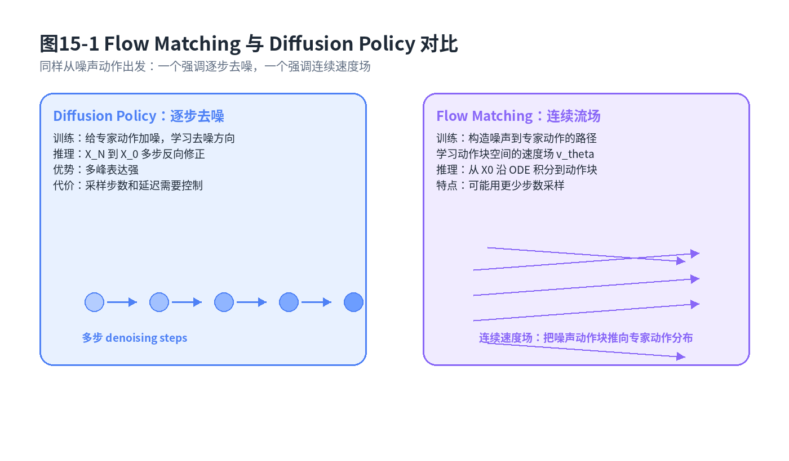
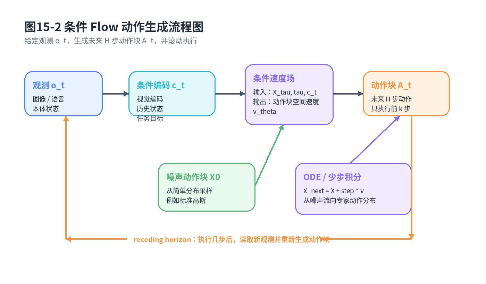

# 第15章：Flow Matching：从扩散去噪到连续流场生成动作

> **新版布局位置**：本章属于 **第四篇：现代机器人策略模型**。本章编号、公式编号与交叉引用已按新版八篇结构统一调整。
>
> **本章一句话导读**：Flow Matching 把“动作从噪声里生成出来”这件事改写成学习一个连续速度场，让给定观测下的动作块沿着一条可积分的路径从简单噪声流向专家动作分布。

---

## 0. 本章要解决的问题

第14章讲 Diffusion Policy 时，我们已经接受了一个重要事实：机器人动作不是只有一个标准答案。二维点机器人从当前位置绕开障碍物走向目标，可以从左边绕，也可以从右边绕；机械臂抓取杯子，可以先抬腕再靠近，也可以先侧向对齐再下探。对于这种多模态动作分布，直接用 MSE 回归一个平均动作，经常会把几条好轨迹平均成一条坏轨迹。

Diffusion Policy 的做法是：先把专家动作加噪声，再训练模型一步步把噪声去掉。这个思路很直观，也很强，但工程上会遇到一个现实问题：如果每次输出动作块都要做很多步去噪，推理延迟、控制频率和部署算力就会互相打架。

Flow Matching 要回答的问题是：

> 给定当前观测 $o_t$，能不能直接学习一个“速度场”，把随机噪声动作块连续地推到专家动作块分布，而不是显式模拟很多步去噪？

本章的重点不是把 Flow Matching 讲成一个抽象生成模型，而是始终落回这一句话：

```text
给定观测 o_t，如何生成动作块 A_t？
```

这里的 $A_t$ 可以是二维点机器人未来 $H$ 步的速度序列，也可以是机械臂未来 $H$ 个控制周期的末端位姿增量、关节位置或夹爪命令。Flow Matching 学的不是“最终动作是什么”的单点回归，而是：从一个简单分布出发，沿着怎样的连续方向移动，才能到达符合专家数据的动作块区域。



**图15-1 说明**：左侧把 Diffusion Policy 理解为“多步去噪”，右侧把 Flow Matching 理解为“学习连续速度场”。两者都从噪声动作出发，都服务于条件动作生成，但训练目标、采样形式和部署成本关注点不同。

---

## 1. 与前后章节的衔接

本章处在第14章和第16章之间：

- 第14章讲 Diffusion Policy，重点是“噪声动作如何逐步变清晰”；
- 本章讲 Flow Matching，重点是“噪声动作如何沿连续速度场流向专家动作”；
- 第16章会把 BC、ACT、Diffusion Policy、Flow Matching 放在一起比较，帮助你做工程选型。

再往后看，第20章 VLA 和第24章 DPO 也会用到本章思想。VLA 中的动作头不一定非要是离散 token，也可以是连续动作生成器；如果动作头采用 flow-based action expert，那么本章的条件 Flow Matching 就是理解它的数学入口。第24章讲偏好后训练时，如果策略是连续动作生成模型，也需要理解“策略概率密度”或“动作生成轨迹”的含义。

---

## 2. 数学对象定义：我们到底在流动什么？

先把机器人策略写成条件动作块分布：

$$
A_t \sim \pi_\theta(A_t \mid o_t), \quad A_t=(a_t,a_{t+1},\ldots,a_{t+H-1})
\tag{15.1}
$$

### 公式拆解

**动机**：单步动作 $a_t$ 太短视，机器人执行时容易抖。ACT、Diffusion Policy 和 Flow Matching 都倾向于一次生成一个动作块 $A_t$，再用 receding horizon 方式只执行前面几步。

**符号**：$o_t$ 是当前观测，可以包含图像、机器人 proprioception、语言指令、历史状态摘要；$A_t$ 是未来 $H$ 步动作；$\pi_\theta$ 是参数为 $\theta$ 的策略模型。

**直觉**：模型不是回答“现在唯一正确动作是什么”，而是回答“在当前观测下，哪些未来动作序列像专家会做的”。

**工程含义**：在机械臂抓取中，$A_t$ 可能是未来 16 步末端速度；在二维点机器人中，$A_t$ 可能是未来 8 步 $(v_x,v_y)$。Flow Matching 的目标是为这个高维动作块分布建模。

为了生成动作块，我们引入两个分布：

$$
X_0 \sim p_0(X), \quad X_1 \sim p_{\mathrm{data}}(A \mid o_t)
\tag{15.2}
$$

其中 $p_0$ 是简单噪声分布，常见选择是标准高斯；$p_{\mathrm{data}}(A\mid o_t)$ 是数据中“给定观测后专家动作块”的经验分布。Flow Matching 要做的事情可以先粗略理解为：把 $X_0$ 搬运到 $X_1$。

注意这里的 $X$ 不是环境状态，而是“动作块空间中的点”。如果一个动作块长度是 $H=16$，每步动作维度是 $d_a=7$，那么 $X\in\mathbb{R}^{112}$。Flow Matching 学的是这个 112 维空间中的流动方向。

---

## 3. 从 Diffusion 的逐步去噪到 Flow 的连续速度场

Diffusion Policy 可以抽象成：先把真实动作块逐步加噪，然后训练模型反向去噪。一个常见写法是：

$$
X_\tau = \alpha_\tau A + \sigma_\tau \epsilon, \quad \epsilon\sim\mathcal{N}(0,I)
\tag{15.3}
$$

这里 $\tau$ 是噪声时间，$A$ 是专家动作块，$X_\tau$ 是被加噪后的动作块。模型要学会从 $X_\tau$、$\tau$、$o_t$ 中恢复去噪方向。

Flow Matching 换了一个问法。它不一定从“加噪/去噪”出发，而是直接构造一条从噪声点到数据点的 probability path。最简单的线性路径可以写成：

$$
X_\tau = (1-\tau)X_0 + \tau X_1, \quad \tau\in[0,1]
\tag{15.4}
$$

这条路径的速度是：

$$
\frac{dX_\tau}{d\tau} = X_1 - X_0
\tag{15.5}
$$

### 公式拆解

**动机**：如果我们知道噪声点 $X_0$ 和目标专家动作 $X_1$，那么从 $X_0$ 走到 $X_1$ 的最简单办法就是直线插值。Flow Matching 用这种可监督的速度目标训练模型。

**符号**：$\tau$ 是从 0 到 1 的连续生成时间；$X_\tau$ 是生成过程中的中间动作块；$X_0$ 是噪声动作块；$X_1$ 是专家动作块。

**公式**：公式 (15.4) 定义路径，公式 (15.5) 定义路径上的真实速度。

**拆解**：当 $\tau=0$ 时，$X_\tau=X_0$，还只是噪声；当 $\tau=1$ 时，$X_\tau=X_1$，已经到达专家动作；中间时刻是两者混合。

**直觉**：Diffusion 像是“把一张模糊图慢慢擦清楚”；Flow Matching 更像是“知道目标方向，训练一个导航场，让任何噪声点都能沿场流到数据分布”。

**工程含义**：在动作块空间里，$X_\tau$ 可能一开始是乱七八糟的关节命令，随着 $\tau$ 增大，逐渐变成可执行的抓取动作序列。

**常见误解**：线性路径不是唯一选择，也不代表真实机器人动作在物理空间里走直线。这里的直线是在“动作块向量空间”中的构造路径，目的是给训练提供速度监督。

---

## 4. Flow Matching 的训练目标

有了路径和速度，训练目标就很自然：让神经网络 $v_\theta$ 在任意中间点 $X_\tau$ 上预测正确速度。

$$
\mathcal{L}_{\mathrm{FM}}(\theta)=
\mathbb{E}_{o_t,X_0,X_1,\tau}
\left[
\left\|v_\theta(X_\tau,\tau,o_t)-u_\tau(X_\tau\mid X_0,X_1)\right\|_2^2
\right]
\tag{15.6}
$$

其中在线性路径下：

$$
u_\tau(X_\tau\mid X_0,X_1)=X_1-X_0
\tag{15.7}
$$

### 公式拆解

**动机**：我们希望模型学到“当前位置应该往哪里流”。如果模型在很多 $\tau$、很多观测、很多专家动作上都学会这个方向，就可以在推理时从随机噪声积分到动作样本。

**符号**：$v_\theta$ 是待学习的速度场；$u_\tau$ 是由训练样本构造出来的目标速度；$\|\cdot\|_2^2$ 是速度预测误差。

**公式**：公式 (15.6) 是一个回归损失，但它回归的不是动作本身，而是生成路径上的速度。

**拆解**：训练时随机采一个观测 $o_t$，随机采一个专家动作块 $X_1$，再采一个噪声动作块 $X_0$，随机选一个 $\tau$，得到中间点 $X_\tau$。模型看到 $(X_\tau,\tau,o_t)$，输出速度，和目标速度比较。

**直觉**：把很多“噪声点到专家点”的小箭头喂给模型，模型最后学成一个条件向量场。

**工程含义**：训练代码上，它常常看起来像一个普通 MSE loss：输入 noisy/interpolated action chunk，输出 velocity target。难点不在 loss 形式，而在数据覆盖、条件编码、动作归一化和采样稳定性。

**常见误解**：Flow Matching 不是“比 Diffusion 永远更快更好”。它可能减少采样步数，但最终效果取决于路径设计、ODE 求解器、网络容量、动作分布复杂度和安全后处理。

---

## 5. 推理：ODE sampling 如何生成动作块

训练完成后，我们不再知道 $X_1$，只知道观测 $o_t$。于是从噪声开始，沿着学到的速度场积分：

$$
\frac{dX_\tau}{d\tau}=v_\theta(X_\tau,\tau,o_t), \quad X_0\sim p_0
\tag{15.8}
$$

积分到 $\tau=1$ 得到动作块：

$$
A_t = X_1^{\theta}=\mathrm{ODESolve}\left(v_\theta, X_0, o_t, 0\rightarrow 1\right)
\tag{15.9}
$$

### 公式拆解

**动机**：训练时我们学到了“中间动作块应该怎么移动”；推理时就把这个速度场当成一个连续动力系统来跑。

**符号**：$\mathrm{ODESolve}$ 表示数值积分器，可以是 Euler、Heun、Runge-Kutta 或工程中简化的少步积分；$X_1^\theta$ 是模型生成的最终动作块。

**直觉**：把噪声动作块放到一个风场里，它会被风吹向专家动作分布。

**工程含义**：采样步数 $N$ 决定延迟。Diffusion Policy 可能需要多个 denoising steps；Flow Matching 也需要 ODE steps，但如果速度场学得平滑，可能用更少步数得到可用动作块。

**常见误解**：Flow Matching 并不是“一步生成”同义词。它是连续流场模型，推理仍然要积分，只是积分步数和稳定性可以通过训练、路径和求解器优化。



**图15-2 说明**：给定观测 $o_t$，模型先编码视觉、语言和机器人状态，再把噪声动作块 $X_0$ 输入条件速度场，经过少步 ODE 积分得到动作块 $A_t$，最后只执行前几步并滚动更新。

---

## 6. 条件 Flow Matching：给定观测生成动作

机器人策略不是无条件生成动作。没有观测条件，模型不知道是在桌面上抓杯子，还是在地面上追踪路径。因此动作生成要写成条件形式：

$$
v_\theta = v_\theta(X_\tau,\tau, c_t), \quad c_t = \mathrm{Enc}_\phi(o_t, h_t, g)
\tag{15.10}
$$

其中 $c_t$ 是条件向量，可以来自图像编码器、语言编码器、proprioception 编码器、历史摘要 $h_t$，也可以包含任务目标 $g$。动作块生成写成：

$$
A_t \sim p_\theta(A\mid c_t), \quad p_\theta \text{由速度场积分隐式定义}
\tag{15.11}
$$

这句话很重要：Flow Matching 生成的是一个分布，但这个分布不一定像高斯策略那样有一个简单闭式概率密度。工程上你更常见到的是“给一个噪声种子，积分出一个动作块样本”。

对于机械臂末端运动，可以把动作块写成：

$$
A_t = [\Delta x_t,\Delta R_t,\Delta q_t, g_t]_{t:t+H-1}
\tag{15.12}
$$

其中 $\Delta x$ 是末端平移增量，$\Delta R$ 是姿态增量，$\Delta q$ 是关节或冗余控制量，$g_t$ 是夹爪开合命令。实际项目中会根据控制接口选择不同动作表示。动作表示选错，Flow Matching 学得再好也可能输出不可控命令。

---

## 7. 统一例子一：二维点机器人动作分布如何从噪声流向专家动作

设二维点机器人当前在障碍物下方，目标在上方。专家示范中，一部分轨迹从障碍物左侧绕过，一部分从右侧绕过。给定观测 $o_t$，未来动作块 $A_t$ 的分布是双峰的。

BC 用 MSE 学时，容易输出左右两种绕行的平均方向，结果正对障碍物。Diffusion Policy 会从噪声动作块逐步去噪成“左绕”或“右绕”。Flow Matching 的解释是：在动作块空间里，噪声样本被速度场推向两个专家模式之一。

训练时，如果 $X_1$ 是一条左绕动作块，那么从 $X_0$ 到 $X_1$ 的速度箭头会指向左绕区域；如果 $X_1$ 是右绕动作块，速度箭头会指向右绕区域。模型在大量样本上学到的是条件速度场，而不是一个平均动作。

推理时，采不同噪声种子可能得到不同绕行方案。这就是 Flow Matching 表达多模态动作的关键：多样性来自初始噪声，条件一致性来自 $o_t$ 编码，动作可执行性来自专家数据和安全约束。

---

## 8. 统一例子二：机械臂抓取中的动作块生成

考虑机械臂抓取桌面上的杯子。观测 $o_t$ 包含 RGB-D 图像、末端位姿、夹爪状态和语言指令“抓起杯子放到托盘里”。未来 $H$ 步动作块既要靠近杯子，又要避免碰撞，还要在夹爪闭合前保持合适姿态。

Flow Matching 的训练样本是：

```text
(o_t, 专家未来 H 步动作块 A_t)
```

每次训练时，采样一个噪声动作块 $X_0$，把它和专家动作块 $X_1=A_t$ 插值成 $X_\tau$，让模型预测速度 $X_1-X_0$。如果专家数据里既有从正前方接近杯子的轨迹，也有从侧面绕开障碍物接近的轨迹，Flow Matching 可以通过不同噪声种子生成不同动作风格。

但工程里不能只看生成效果，还要看三个约束：

1. **控制频率**：如果控制周期是 20Hz，而 ODE 需要 20 步积分，每步网络都很大，延迟可能不可接受；
2. **动作平滑**：速度场输出的动作块需要经过限幅、平滑或低层控制器，否则机械臂可能抖动；
3. **安全仲裁**：生成式策略不能绕过碰撞检测、工作空间限制和急停逻辑。

这也是第25章和第28章会继续强调的事情：生成模型只是策略组件，不是完整机器人系统。

---

## 9. 为什么 Flow Matching 可能减少采样步数？

Diffusion 模型常常把生成过程离散成很多噪声级别，每一步都修正一点。Flow Matching 直接学习连续速度场，如果路径比较平滑、速度场比较好学，那么数值积分可以用较少步数完成。

可以把采样近似写成 Euler 更新：

$$
X_{k+1}=X_k + \Delta \tau\, v_\theta(X_k,\tau_k,o_t), \quad k=0,1,\ldots,N-1
\tag{15.13}
$$

**动机**：工程部署中，$N$ 越小，推理越快。

**符号**：$N$ 是采样步数；$\Delta\tau=1/N$；$X_k$ 是第 $k$ 个积分节点的动作块。

**直觉**：如果速度场像一条平滑高速路，走几大步就能到；如果速度场弯弯绕绕，就必须小步慢走。

**工程含义**：减少采样步数不是白来的。你可能需要更强网络、更好的动作归一化、更稳定的数据覆盖、更合理的 ODE solver。否则步数少会变成动作不准、碰撞风险升高或末端抖动。

---

## 10. 与 π0、flow-based action expert 和 VLA action head 的关系

在 VLA 或机器人基础模型中，前端通常负责理解图像、语言和任务上下文，后端动作头负责输出连续控制命令。动作头有几种常见选择：

- 离散化动作 token：把连续动作量化成 token，像语言建模一样预测；
- 高斯回归头：输出均值和方差；
- diffusion action head：通过去噪生成动作块；
- flow-based action expert：用速度场或流模型生成动作块。

Flow Matching 提供了理解 flow-based action expert 的统一数学语言：

```text
多模态上下文 c_t → 条件速度场 v_θ → ODE/少步积分 → 连续动作块 A_t
```

这和第20章 VLA 的关系是：VLA 不一定自己直接“会控制”。它可以把视觉、语言、任务历史编码成条件向量，再交给一个动作专家生成动作。Flow Matching 正是动作专家的一种候选形式。

与第23章快慢模型的关系是：慢模型可以负责语言理解、任务分解和未来预测；快模型可以用 Flow Matching 或 ACT 生成短 horizon 动作块，并由安全控制层实时仲裁。

---

## 11. 与 ACT、Diffusion Policy 的工程选型对比

**ACT** 更像“条件动作块回归 + 隐变量风格建模”。它结构清晰、推理快、适合低成本硬件，但表达复杂多峰分布时依赖 latent 设计和数据质量。

**Diffusion Policy** 表达多模态动作很强，训练和使用生态成熟，适合复杂操作任务，但多步采样可能带来延迟。

**Flow Matching** 试图在生成能力和采样效率之间做折中。它把训练写成速度回归，把推理写成 ODE 采样。对于需要连续动作、多模态决策、又关心部署延迟的机器人策略，它是值得考虑的路线。

但工程选型不能只看论文指标。你要问：

- 任务是否真的多模态？如果不是，BC 或 ACT 可能更简单；
- 控制频率是多少？10Hz、20Hz 和 100Hz 对采样步数要求完全不同；
- 失败代价多高？高风险场景必须有安全约束；
- 数据是否覆盖关键动作模式？Flow Matching 不能凭空生成没见过的可靠技能；
- 部署端是否能承受多次网络前向？低端域控和机器人边缘计算都要算清楚账。

---

## 12. 局限与适用边界

Flow Matching 的局限可以从五个角度看。

第一，**训练数据要求高**。它学习的是条件动作分布，如果专家数据只覆盖了干净成功轨迹，没有失败恢复、遮挡、接触异常，模型也很难在这些场景中生成可靠动作。

第二，**动作分布覆盖决定上限**。Flow Matching 能表达多峰，但多峰必须在数据里出现过。二维点机器人如果只录了左绕轨迹，就不能期待模型稳定生成右绕方案。

第三，**推理稳定性依赖积分过程**。ODE 步数太少可能动作粗糙，步数太多又带来延迟。速度场局部不稳定时，动作块可能越积分越偏。

第四，**安全约束不能只靠生成模型**。机械臂动作必须经过关节限位、速度限幅、碰撞检测、力控保护和急停逻辑。Flow Matching 负责提出候选动作，不负责替代安全系统。

第五，**与控制频率强相关**。高频控制不一定适合每个周期重新跑完整 flow。常见工程做法是低频生成动作块，高频由底层控制器跟踪，并在 receding horizon 中滚动更新。

---

## 13. 与全书知识地图的一致性说明

本章在全书中的位置可以概括为：

```text
第7章 概率策略：动作可以是分布
第8-9章 隐变量/CVAE：动作风格可以由潜变量控制
第13章 ACT：一次生成动作块
第14章 Diffusion Policy：从噪声逐步去噪生成动作块
第15章 Flow Matching：从噪声沿连续速度场生成动作块
第16章 方法对比：把这些路线放回工程选型表
第20章 VLA：动作头可以采用 flow-based expert
第24章 DPO：连续动作策略后训练需要理解概率密度/生成轨迹
第29章 数据闭环：生成策略还要靠接管、回放、评估持续改进
```

因此，Flow Matching 不是孤立章节。它是“连续动作生成式策略”这条线上的关键节点：既连接 Diffusion Policy，也连接后续 VLA action head 和机器人后训练。

---

## 14. 本章公式索引

- 公式 (15.1)：条件动作块策略 $A_t\sim\pi_\theta(A_t\mid o_t)$
- 公式 (15.2)：噪声分布与专家动作块分布
- 公式 (15.3)：Diffusion 式加噪动作块
- 公式 (15.4)：Flow Matching 的线性 probability path
- 公式 (15.5)：线性路径对应的速度
- 公式 (15.6)：Flow Matching 速度场回归损失
- 公式 (15.7)：线性路径下的目标速度
- 公式 (15.8)：推理时的条件 ODE
- 公式 (15.9)：ODE sampling 生成动作块
- 公式 (15.10)：条件编码后的速度场
- 公式 (15.11)：由速度场隐式定义的条件动作分布
- 公式 (15.12)：机械臂动作块表示
- 公式 (15.13)：Euler 少步积分近似

---

## 15. 建议阅读的附录条目

- **附录A：数学符号与公式阅读方法**：帮助理解 $X_0,X_1,X_\tau$、条件分布和向量场符号。
- **附录C：最大似然、负对数似然、交叉熵与 KL 散度**：理解生成模型为什么要拟合数据分布。
- **附录D：高斯分布、MSE 与连续动作回归**：理解为什么 Flow Matching 的训练目标看起来像 MSE，但语义不是普通动作回归。
- **附录E：优化基础**：理解速度场回归损失如何被梯度下降优化。
- **附录G：生成模型基础**：把 Diffusion、Flow 和隐变量生成放在同一张地图里。
- **附录I：熵、最大熵与 Score Matching**：帮助理解 Diffusion/Flow 与分布建模之间的关系。
