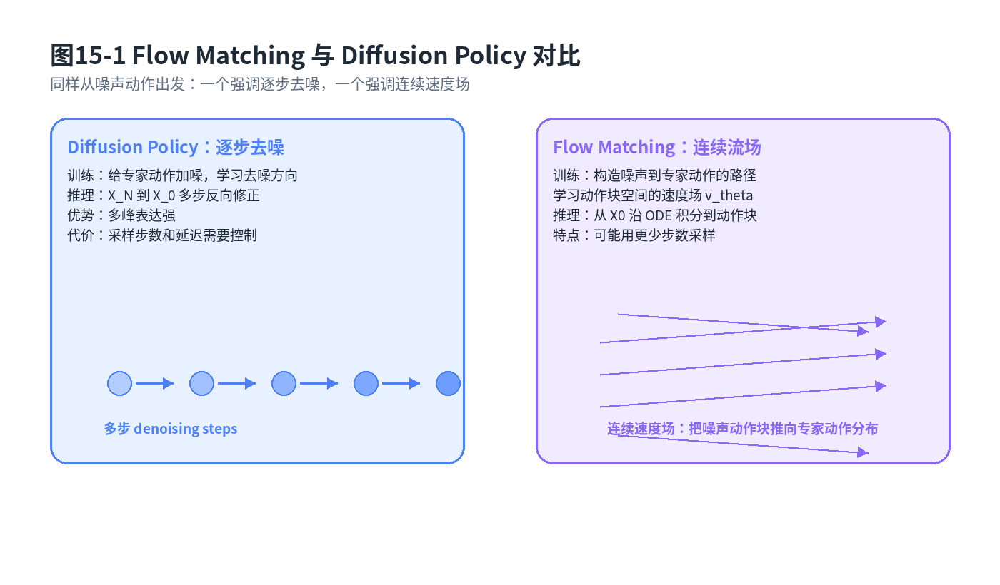
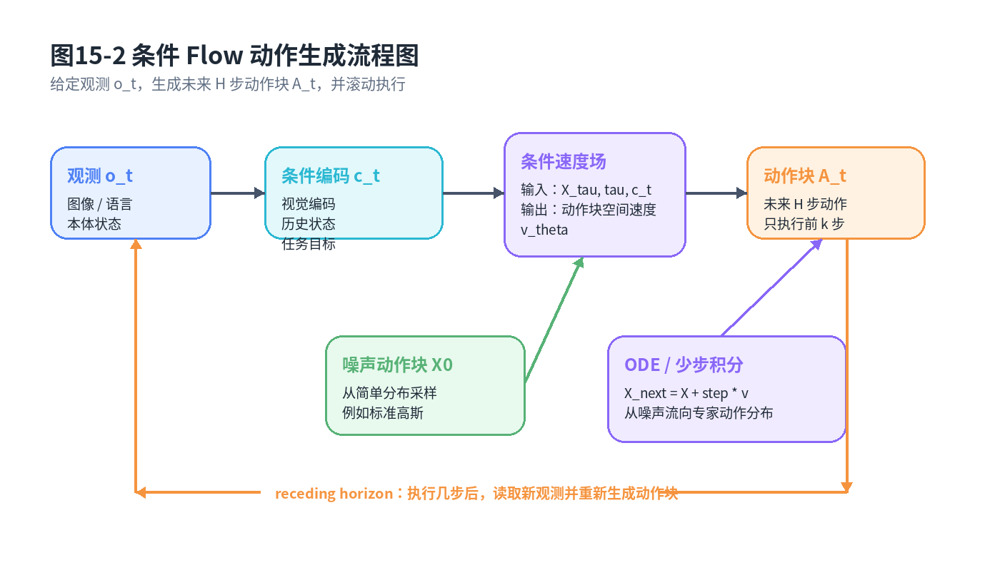

# 第15章：Flow Matching：从扩散去噪到连续流场生成动作

> **本章一句话导读**：Flow Matching 的核心不是再发明一个复杂采样器，而是把“从噪声生成动作块”改写成“学习动作块空间中的连续速度场”。

第14章讲 Diffusion Policy：从随机动作块开始，多步去噪，最后得到一段可执行动作块。这个思路很强，但也留下一个工程问题：如果每次生成动作都需要很多次网络前向，机器人控制频率、边缘算力和推理延迟就会互相打架。

Flow Matching 接着问：

> 能不能直接学习一个速度场，让噪声动作块沿着连续路径流向专家动作块分布？

本章只完成一个对象升级：

> 从“离散多步去噪生成动作块”，升级为“沿连续速度场生成动作块”。

---

## 1. 本章要解决的核心问题

第14章的 Diffusion Policy 可以概括为：

```text
专家动作块
→ 正向加噪
→ 学习噪声预测
→ 推理时反向多步去噪
→ 得到动作块
```

Flow Matching 换了一个问法：

```text
给定噪声动作块 X_0 和专家动作块 X_1，
中间动作块 X_tau 应该沿什么速度方向移动？
```

也就是说，Diffusion Policy 更关注“每个噪声等级应该去掉什么噪声”；Flow Matching 更关注“动作块空间里的点应该往哪里流”。

在机器人策略中，本章要回答的问题是：

> 给定当前条件 $c_t$，如何从随机动作块出发，沿学习到的速度场生成专家风格的动作块？

这里的“速度”不是机械臂末端真实速度，而是动作块向量在生成空间中的速度。

---

## 2. 统一贯穿例子：精准摆入治具

继续使用第13、14章的例子：机械臂已经把工件送到治具附近，接下来要完成“接近—对准—轻触—插入或放下”。

在这个任务中，一个动作块可以表示未来一小段末端位姿增量、关节控制量和夹爪命令。专家示范中可能存在多种合理模式：

```text
直接下压插入；
先贴边微调，再下压；
先轻触探测，再回退一点重新进入；
先调整姿态，再做小幅插入。
```

Flow Matching 的直觉是：随机初始化一个动作块，让它在当前条件引导下，沿速度场流向这些专家动作模式中的一个。

---

## 3. 本章新数学对象

第4章已经定义动作块 $A_t$，第14章已经把 Diffusion Policy 写成从噪声生成动作块。本章不重新定义动作块，而是新增一个对象：

> 条件动作块速度场。

**定义 15.1：噪声动作块**

噪声动作块 $X_0$ 是从简单分布采样得到的生成起点，通常可以理解为一个随机动作块。

**定义 15.2：专家动作块**

专家动作块 $X_1$ 是从示范数据中取出的真实动作块。训练时它来自数据；推理时模型看不到它。

**定义 15.3：中间动作块**

中间动作块 $X_\tau$ 表示从噪声动作块到专家动作块之间的路径点，其中 $\tau\in[0,1]$ 是生成时间，不是机器人真实控制时间。

**定义 15.4：目标速度**

目标速度 $u_\tau$ 是由构造路径求导得到的监督信号，用来告诉模型在中间点应该往哪个方向流。

**定义 15.5：学习速度场**

学习速度场 $v_\theta(X_\tau,\tau,c_t)$ 是神经网络预测的条件流动方向。推理时，模型沿这个速度场积分生成动作块。

本章的对象关系可以写成：

```text
X_0：噪声动作块
X_1：专家动作块
X_tau：中间动作块
u_tau：训练时可计算的目标速度
v_theta：模型学习到的条件速度场
```

---

## 4. 线性路径：从噪声动作块走向专家动作块

Flow Matching 需要先构造一条从噪声到数据的路径。最简单、最容易理解的是线性路径。

**公式 (15.1)：线性 probability path**

$$X_\tau=(1-\tau)X_0+\tau X_1,\quad \tau\in[0,1]$$

这个公式的含义很直接：

```text
当 tau=0 时，X_tau=X_0，是噪声动作块；
当 tau=1 时，X_tau=X_1，是专家动作块；
当 0<tau<1 时，X_tau 是两者之间的中间动作块。
```

注意，这条直线发生在动作块向量空间里，不是说机械臂末端在真实三维空间里走直线。比如 $X_\tau$ 可以包含未来 $H$ 步动作，每一步又包含平移、旋转、关节和夹爪命令。它是高维动作块空间中的点。

> **边界框：线性路径只是训练构造，不是机器人轨迹**
>
> 不要把 $X_\tau$ 理解成真实机器人执行过程。机器人不会先执行噪声动作，再线性移动到专家动作。线性 path 是训练时构造监督速度的一种方式。



**图15-1 说明**：Diffusion Policy 可以理解为从噪声动作块逐步去噪；Flow Matching 可以理解为从噪声动作块沿连续速度场流向专家动作块。

---

## 5. 目标速度：路径一旦确定，速度就能算出来

有了路径，就可以对路径求导，得到训练时的目标速度。

**公式 (15.2)：线性路径上的目标速度**

$$u_\tau=\frac{dX_\tau}{d\tau}=X_1-X_0$$

这里 $X_0$ 和 $X_1$ 在对 $\tau$ 求导时是固定端点，所以线性路径的速度就是终点减起点。

**命题 15.1：线性路径的目标速度等于终点减起点**

若 $X_\tau=(1-\tau)X_0+\tau X_1$，且 $X_0$、$X_1$ 对 $\tau$ 固定，则 $dX_\tau/d\tau=X_1-X_0$。

> **证明思路**
>
> 把 $X_\tau$ 展开为 $X_0+\tau(X_1-X_0)$。对 $\tau$ 求导，常数项 $X_0$ 消失，剩下 $X_1-X_0$。这就是公式 (15.2)。

这个命题的意义不是数学技巧，而是告诉我们：训练时不必知道真实机器人应该“怎么一步步生成动作”。只要构造了噪声端点和数据端点，就能得到一个可监督的生成速度。

---

## 6. Flow Matching 训练目标：回归速度场

Flow Matching 用神经网络学习条件速度场。训练时，我们采样一个噪声动作块 $X_0$，一个专家动作块 $X_1$，再随机采样一个生成时间 $\tau$，通过公式 (15.1) 得到中间动作块 $X_\tau$，再用公式 (15.2) 得到目标速度 $u_\tau$。

模型要做的事情是：看到 $X_\tau$、$\tau$ 和当前条件 $c_t$，预测目标速度。

**公式 (15.3)：Flow Matching 速度场回归损失**

$$\mathcal{L}_{flow}(\theta)=\mathbb{E}_{X_0,X_1,\tau,c_t}\left[\lVert v_\theta(X_\tau,\tau,c_t)-u_\tau\rVert^2\right]$$

这个损失看起来也是 MSE，但它不是第2章的动作 MSE，也不是第14章的噪声预测 MSE。这里回归的是“中间动作块应该往哪里流”的速度。

> **防卡点：为什么 MSE 不一定又把多模态平均坏？**
>
> 普通 BC 的 MSE 是直接回归最终动作，容易把多个动作模式平均成一个中间动作。Flow Matching 的 MSE 回归的是路径上的速度场。多样性仍然可以来自不同初始噪声 $X_0$、不同数据端点 $X_1$、条件编码和路径结构。当然，这并不保证永远不会模式混合；路径设计、网络容量和数据覆盖仍然会影响多峰表达。

训练流程可以概括为：

```text
1. 从简单分布采样噪声动作块 X_0；
2. 从专家数据中取动作块 X_1；
3. 随机采样 tau；
4. 用公式 (15.1) 得到 X_tau；
5. 用公式 (15.2) 得到目标速度 u_tau；
6. 用公式 (15.3) 训练 v_theta。
```

---

## 7. 推理：沿速度场积分生成动作块

训练完成后，推理时没有专家动作块 $X_1$。模型只有当前条件 $c_t$ 和一个随机噪声动作块 $X_0$。

推理过程是：从 $X_0$ 出发，沿学习到的速度场积分到 $\tau=1$。

**公式 (15.4)：推理时的条件 ODE**

$$\frac{dX_\tau}{d\tau}=v_\theta(X_\tau,\tau,c_t),\quad X_0\sim p_0$$

积分到终点后，就得到预测动作块。可以把完整积分过程简写为一个生成器。

**公式 (15.5)：ODE sampling 生成动作块**

$$\hat A_t=\Phi_\theta(\xi,c_t),\quad \xi\sim\mathcal{N}(0,I)$$

这里 $\Phi_\theta$ 表示完整的 ODE 积分生成过程，不是一个新的单步网络。工程上可以用 Euler、Heun 或 Runge-Kutta，也可以使用少步近似。

> **边界框：Flow Matching 不等于一步生成**
>
> Flow Matching 通常仍然需要积分。它可能比很多 diffusion 采样更少步，但这不是无条件保证。路径越弯、速度场越复杂、动作维度越高，积分步数和网络容量要求就越高。



**图15-2 说明**：给定条件 $c_t$，模型从噪声动作块出发，沿条件速度场积分，得到动作块 $\hat A_t$，再交给执行模块和安全模块处理。

---

## 8. 条件 Flow Matching：为什么条件很重要

无条件 Flow Matching 只能学习“总体上像专家”的动作块。机器人策略需要的是“当前场景下该做什么”。因此速度场必须依赖条件 $c_t$。

$c_t$ 可以来自：

```text
当前图像或历史图像；
机器人关节状态、末端位姿、夹爪状态；
语言指令或目标位姿；
治具位置、障碍物、接触状态；
上一段动作执行后的反馈。
```

同一个噪声动作块，在不同条件下应该流向不同动作模式：

```text
治具孔偏左：动作块应流向左侧微调模式；
工件姿态偏斜：动作块应流向先旋转再下压模式；
接触力偏大：动作块应流向回退或减速模式。
```

> **边界框：条件错了，速度场会认真地往错误方向流**
>
> 如果图像和动作时间戳错位，或者相机外参、末端状态、目标位姿不准，模型会在错误条件下预测速度。Flow Matching 不能自动修复错误题干。

---

## 9. 与 Diffusion Policy / ACT 的关系

现在可以把第13、14、15章串起来：

```text
ACT：一次生成动作块；
Diffusion Policy：从噪声开始，离散多步去噪生成动作块；
Flow Matching：从噪声开始，沿连续速度场生成动作块。
```

三者都在处理动作块，但数学对象不同。

| 方法 | 核心对象 | 训练目标直觉 | 推理形式 | 主要工程代价 |
|---|---|---|---|---|
| ACT | 隐变量条件动作块生成 | 重建动作块 + KL | 一次生成或少步生成 | latent 表达、temporal ensemble、闭环执行 |
| Diffusion Policy | 条件去噪过程 | 预测噪声 | 多步反向去噪 | 采样步数、推理延迟、noise schedule |
| Flow Matching | 条件速度场 | 回归生成路径速度 | ODE 积分 | solver 步数、速度场质量、路径设计 |

Flow Matching 的优势通常是采样效率和生成路径可控性；它的风险是速度场学不准时，错误会沿积分过程累积。

---

## 10. 工程边界：快，不等于安全；连续，不等于稳定

Flow Matching 在工程上有吸引力，是因为它可能用较少采样步数生成动作块。但“可能更快”不等于“一定更稳”。

需要重点检查：

1. **动作归一化**：不同动作维度尺度差异大，会让速度场难学；
2. **积分步数**：步数少速度快，但误差可能大；步数多更稳，但延迟上升；
3. **条件对齐**：观测和动作块错位，会让速度场学到慢半拍策略；
4. **控制接口**：模型生成的动作表示必须匹配底层控制器；
5. **安全过滤**：生成动作仍要经过限速、限位、碰撞检测和力控保护。

在精准摆入治具任务中，Flow Matching 适合学习局部动作块候选，但不应越过几何定位、接触检测、力控保护和安全仲裁。

> **边界框：生成模型只是策略组件，不是机器人系统**
>
> Flow Matching 可以生成动作块，但不能替代标定、感知、控制器、安全规则和异常恢复。真实部署中，动作生成只是决策链路的一环。

---

## 11. 滚动执行：生成一段，但仍要闭环

和 ACT、Diffusion Policy 一样，Flow Matching 生成一个长度为 $H$ 的动作块，不代表机器人要完整执行到底。真实系统通常只执行前 $H_e$ 步，然后重新观测、重新生成。

**公式 (15.6)：Flow 动作块的滚动执行**

$$\hat a_{t:t+H_e-1}\subset \hat A_t,\quad H_e\le H$$

这条公式和第14章公式 (14.6) 作用相同：提醒读者动作块生成不是长时间开环执行。

如果环境是静态的、低速的、接触简单，$H_e$ 可以稍大；如果接触变化快、目标可能滑动、视觉反馈重要，$H_e$ 应该更小，闭环更新更频繁。

---

## 12. 读完本章，你应该能判断什么

读完本章后，你应该能判断：

1. Flow Matching 的主角是条件速度场，不是普通动作回归；
2. $X_\tau$ 是动作块空间中的中间点，不是 MDP 环境状态；
3. 线性 path 是训练构造，不是机器人真实运动轨迹；
4. 公式 (15.3) 的 MSE 回归的是速度，不是最终动作；
5. 推理时没有专家动作块，只能从噪声出发沿速度场积分；
6. Flow Matching 可能减少采样步数，但不保证天然快速稳定；
7. 条件编码、动作归一化、控制接口和安全过滤仍然决定部署效果；
8. Flow Matching、Diffusion Policy 和 ACT 的差异主要在生成机制，而不是“谁一定更高级”。

---

## 13. 本章小结：从 Flow Matching 到方法对比

本章完成的对象升级是：

```text
Diffusion Policy 的离散多步去噪
→ Flow Matching 的连续速度场生成
```

Flow Matching 把动作块生成看成一个连续流动问题。训练时，它构造从噪声动作块到专家动作块的路径，并用路径导数作为监督信号训练速度场；推理时，它从噪声动作块出发，沿学到的速度场积分，生成条件动作块。

但本章也强调：Flow Matching 不是“更快更强”的万能替代品。它的效果取决于路径设计、速度场学习、条件编码、动作归一化、积分步数和安全约束。

下一章会把 BC、ACT、Diffusion Policy 和 Flow Matching 放在同一张表里比较：它们到底分别建模什么、训练目标是什么、推理成本在哪里、工程风险是什么。

---

## 14. 本章公式索引

### 公式 (15.1)：线性 probability path

$$X_\tau=(1-\tau)X_0+\tau X_1,\quad \tau\in[0,1]$$

- **作用**：构造从噪声动作块到专家动作块的中间路径。
- **类型**：A 类，Flow Matching 的路径对象。
- **需要掌握到什么程度**：知道这条路径发生在动作块空间，不是机器人真实轨迹。

### 公式 (15.2)：线性路径上的目标速度

$$u_\tau=\frac{dX_\tau}{d\tau}=X_1-X_0$$

- **作用**：由路径求导得到训练速度监督信号。
- **类型**：A 类，连接路径构造和训练目标。
- **需要掌握到什么程度**：理解线性路径下速度就是终点减起点。

### 公式 (15.3)：Flow Matching 速度场回归损失

$$\mathcal{L}_{flow}(\theta)=\mathbb{E}_{X_0,X_1,\tau,c_t}\left[\lVert v_\theta(X_\tau,\tau,c_t)-u_\tau\rVert^2\right]$$

- **作用**：训练条件速度场，使其在中间动作块上预测正确流动方向。
- **类型**：A 类，Flow Matching 核心训练目标。
- **需要掌握到什么程度**：知道这里回归的是速度场，不是直接动作。

### 公式 (15.4)：推理时的条件 ODE

$$\frac{dX_\tau}{d\tau}=v_\theta(X_\tau,\tau,c_t),\quad X_0\sim p_0$$

- **作用**：定义推理时从噪声动作块沿速度场生成动作的动力学。
- **类型**：A 类，连接训练速度场和推理生成。
- **需要掌握到什么程度**：知道推理时没有 $X_1$，只沿 $v_\theta$ 积分。

### 公式 (15.5)：ODE sampling 生成动作块

$$\hat A_t=\Phi_\theta(\xi,c_t),\quad \xi\sim\mathcal{N}(0,I)$$

- **作用**：把完整 ODE 积分过程简写为从随机噪声和条件到动作块的生成器。
- **类型**：B 类，部署接口简写。
- **需要掌握到什么程度**：知道 $\Phi_\theta$ 表示完整积分过程，不是单步动作头。

### 公式 (15.6)：Flow 动作块的滚动执行

$$\hat a_{t:t+H_e-1}\subset \hat A_t,\quad H_e\le H$$

- **作用**：说明生成完整动作块后，真实系统通常只执行前几步。
- **类型**：B 类，连接生成模型与闭环控制。
- **需要掌握到什么程度**：知道 Flow Matching 生成动作块不等于长时间开环执行。

---

## 15. 本章定义索引

### 定义 15.1：噪声动作块

从简单分布采样得到的生成起点，记作 $X_0$。

### 定义 15.2：专家动作块

示范数据中的真实动作块，记作 $X_1$。

### 定义 15.3：中间动作块

从噪声动作块到专家动作块之间的路径点，记作 $X_\tau$。

### 定义 15.4：目标速度

由构造路径求导得到的监督速度，记作 $u_\tau$。

### 定义 15.5：学习速度场

神经网络预测的条件流动方向，记作 $v_\theta(X_\tau,\tau,c_t)$。

---

## 16. 思考题

1. 为什么说 Flow Matching 的主角是速度场，而不是动作点？
2. $X_\tau$ 为什么不是 MDP 里的状态？它表示什么？
3. 公式 (15.1) 中 $\tau=0$、$\tau=1$ 分别对应什么？
4. 为什么线性路径的目标速度是 $X_1-X_0$？
5. 公式 (15.3) 中的 MSE 和普通 BC 的动作 MSE 有什么区别？
6. 推理时为什么不能使用 $X_1$？
7. Flow Matching 为什么可能减少采样步数？为什么又不能保证一定更快？
8. 在精准摆入治具任务中，Flow Matching 适合生成哪一部分动作？哪些部分仍应由传统几何、力控和安全规则负责？
9. 如果生成动作块抖动或不稳定，你会优先检查动作归一化、积分步数、条件对齐还是控制接口？为什么？
10. 第16章比较 BC、ACT、Diffusion Policy 和 Flow Matching 时，你会用哪些维度来比较？

---

## 17. 配图清单

| 图号 | 图名 | 核心关系 | 是否已有文件 | 后续处理 |
|---|---|---|---|---|
| 图15-1 | Flow Matching 与 Diffusion Policy 对比 | 对比离散去噪和连续速度场生成 | 已有 PNG：`../images/图15-1_Flow_Matching与Diffusion_Policy对比.png` | 后续可转 SVG |
| 图15-2 | 条件 Flow 策略生成动作流程图 | 展示从条件编码、噪声动作块到 ODE 采样生成动作块 | 已有 PNG：`../images/图15-2_条件Flow策略生成动作.png` | 后续可转 SVG |

---

## 18. 推荐阅读：重点看什么

- **Flow Matching for Generative Modeling**：重点看 probability path、vector field regression 和 ODE sampling；暂时不用卡在所有最优传输路径细节。
- **Rectified Flow 相关资料**：重点看为什么“更直的路径”可能减少采样步数，以及这个结论为什么不是无条件保证。
- **第14章 Diffusion Policy**：重点比较离散去噪和连续速度场在动作生成中的差异。
- **下一章方法对比**：重点看 BC、ACT、Diffusion Policy 和 Flow Matching 在建模对象、训练目标、推理成本和工程风险上的差异。
