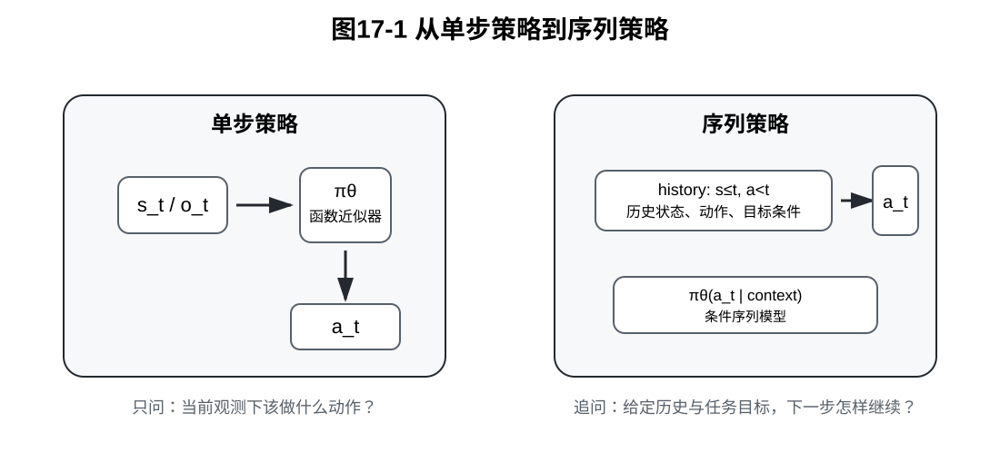
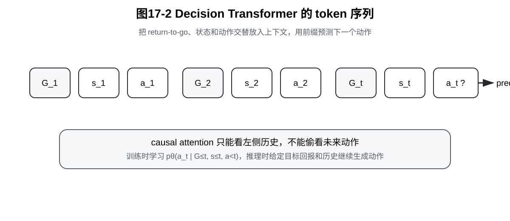

# 第17章：序列策略模型：从 Decision Transformer 到 Transformer Policy

> **新版布局位置**：本章属于 **第五篇：长序列架构与多模态策略**。第五篇不再继续发明新的动作生成目标，而是讨论策略网络如何承载更长的历史、更复杂的条件和更多模态的信息。

> **本章一句话导读**：本章解释策略模型如何从“当前观测到当前动作”的函数近似器，演化为“给定历史上下文、任务条件和目标信号后预测下一步动作”的条件序列模型。

前面第四篇已经讨论了现代机器人策略模型的动作输出方式：BC 可以做点估计，ACT 可以预测动作块，Diffusion Policy 可以从噪声中生成动作序列，Flow Matching 可以用连续速度场生成动作。

但是还有一个问题没有被充分回答：

> 当策略需要参考很长的历史轨迹、任务目标、语言指令、视觉上下文和动作执行阶段时，策略网络应该怎样组织这些信息？

本章从 Decision Transformer 开始讲。它的关键启发不是“Transformer 很厉害”，而是把决策问题重新写成一个序列建模问题：给定历史状态、历史动作和目标回报，预测下一步动作。随后我们把视角扩展到更一般的 Transformer Policy：策略不一定只看当前观测，也可以把历史观测、历史动作、语言目标、任务 token 和视觉 token 放进同一个上下文中，用 attention 聚合条件信息。

本章最后把 SSM / Mamba 作为补充内容简要引入。它们不是本书的独立主线，而是长序列策略建模的一种候选骨架：当 attention 的上下文代价太高时，状态空间递推提供了另一种压缩历史的方式。

---

## 0. 本章一句话导读

本章要建立的核心判断是：

> 现代策略网络正在从单帧观测到单步动作的函数近似器，逐渐变成面向长上下文、多条件输入和动作序列预测的条件序列模型。

这句话里有三个关键词。

第一，**长上下文**。机器人执行任务时，当前动作往往不只由当前图像决定，还和前面发生过什么有关。例如机械臂已经尝试过一次插入、托盘发生了轻微位移、夹爪曾经接触到工件边缘，这些历史信息都可能影响下一步动作。

第二，**多条件输入**。策略可以被状态、图像、语言、目标位置、期望回报、任务阶段等条件共同约束。策略不再只是 $\pi_\theta(a_t \mid o_t)$，而更像 $\pi_\theta(a_t \mid \text{context}_t)$。

第三，**动作序列预测**。动作可以一步一步预测，也可以按动作块预测。无论是 ACT、Decision Transformer、VLA，还是后面的动作 token 模型，本质上都在把策略推向序列建模方向。



---

## 1. 为什么策略可以写成序列模型

最朴素的模仿学习策略通常写成：

**公式 (17.1)：单步策略形式**

$$\pi_\theta(a_t \mid o_t)$$

这个公式的读法是：给定当前观测 $o_t$，策略输出当前动作 $a_t$ 的分布。

这种写法非常适合入门，因为它把模仿学习变成了监督学习：

```text
输入：当前观测
输出：专家动作
```

但真实机器人任务经常不是这么简单。以“机械臂抓取工件并放入治具”为例，当前图像可能并不能完整说明任务阶段：

- 当前是刚开始靠近工件，还是已经抓住工件？
- 夹爪刚才是否接触过工件边缘？
- 前几步是否已经做过一次纠偏？
- 目标是快速完成，还是稳定完成？
- 当前任务是否由语言指令指定了不同物体或不同放置位置？

如果这些信息无法从单帧观测中恢复，那么策略只写成 $\pi_\theta(a_t \mid o_t)$ 就不够了。更一般的写法是：

**公式 (17.2)：上下文条件策略**

$$\pi_\theta(a_t \mid c_t)$$

其中，$c_t$ 表示时刻 $t$ 可用的上下文。它可以包含当前观测，也可以包含历史轨迹、任务目标、语言指令、期望回报和其他条件。

一种常见的上下文写法是：

**公式 (17.3)：历史上下文**

$$c_t = (o_{1:t}, a_{1:t-1}, g)$$

这里的符号含义如下。

- $o_{1:t}$ 表示从第 $1$ 步到第 $t$ 步的观测历史。
- $a_{1:t-1}$ 表示当前动作之前已经执行过的动作历史。
- $g$ 表示任务条件，可以是目标位置、语言指令、期望回报或任务 ID。

于是策略可以写成：

**公式 (17.4)：序列条件策略**

$$\pi_\theta(a_t \mid o_{1:t}, a_{1:t-1}, g)$$

这就是序列策略模型的基本形式。

### 1.1 从函数近似器到条件序列模型

第2章中的 BC 更像一个函数近似器：

```text
当前观测 → 当前动作
```

本章讨论的序列策略模型更像一个条件生成器：

```text
历史观测 + 历史动作 + 任务条件 → 下一步动作
```

这不是文字游戏，而是数学对象发生了变化。

BC 的核心条件变量主要是当前观测 $o_t$。序列策略的核心条件变量变成了上下文 $c_t$。这个变化会影响训练数据构造、模型结构、注意力机制、推理方式和部署风险。

### 1.2 为什么这仍然是模仿学习

把策略写成序列模型，并不意味着它脱离了模仿学习。只要训练目标仍然是让模型在数据轨迹中预测专家动作，它依然可以看成一种条件模仿学习。

也就是说，本章的策略仍然在学习：

**公式 (17.5)：条件动作分布学习目标**

$$p_{\mathrm{data}}(a_t \mid c_t)$$

这里，数据条件动作分布 $p_{\mathrm{data}}(a_t \mid c_t)$ 表示：在离线数据中，当上下文接近 $c_t$ 时，专家或数据策略通常采取什么动作。

这和前面章节的主线是一致的：

```text
BC：学习 p_data(a_t | o_t)
序列策略：学习 p_data(a_t | c_t)
```

区别只是条件信息从单帧观测扩展成了完整上下文。

---

## 2. Decision Transformer：return / state / action 的序列建模

Decision Transformer 的核心想法可以概括为：

> 不先学习 value function，也不做 Bellman backup，而是把离线轨迹重排成 token 序列，并在目标回报条件下预测动作。

这里最关键的对象是 **return-to-go**，也就是从当前时刻往后还能获得的累计回报。

### 2.1 离线轨迹

先考虑一条带奖励的轨迹：

**公式 (17.6)：带奖励轨迹**

$$\tau = (s_1,a_1,r_1,s_2,a_2,r_2,\dots,s_T,a_T,r_T)$$

其中，$s_t$ 是状态，$a_t$ 是动作，$r_t$ 是奖励或任务进展信号，$T$ 是轨迹长度。

在机器人模仿学习中，状态 $s_t$ 经常并不是完整物理状态，而是由多种观测组成。例如图像、本体状态、末端位姿、速度、力传感器读数等。为了保持符号简洁，本节先使用 $s_t$。

离线数据集可以写成多条轨迹的集合：

**公式 (17.7)：离线轨迹数据集**

$$\mathcal{D} = \{\tau_i\}_{i=1}^{N}$$

Decision Transformer 在训练时只使用数据集 $\mathcal{D}$ 中已有的轨迹。它不像在线强化学习那样一边训练一边主动探索环境。

### 2.2 Return-to-go

从时刻 $t$ 开始的 return-to-go 定义为：

**公式 (17.8)：return-to-go**

$$G_t = \sum_{k=t}^{T} r_k$$

如果使用折扣因子，也可以写成：

**公式 (17.9)：折扣 return-to-go**

$$G_t = \sum_{k=t}^{T} \gamma^{k-t} r_k$$

其中，$\gamma \in [0,1]$ 是折扣因子。为了降低理解成本，本章主要使用不折扣形式。

return-to-go 可以被理解为一个“目标条件”。在推理时，如果给模型一个较高的目标回报，就相当于告诉模型：

```text
请按照数据中更接近高回报轨迹的方式继续生成动作。
```

但这句话必须谨慎理解。目标回报不是魔法按钮。模型只能在数据覆盖范围内利用这个条件。如果数据中从来没有成功轨迹，单纯把 $G_t$ 设得很高，并不会凭空创造可靠策略。

### 2.3 轨迹 token 化

Decision Transformer 会把轨迹整理成类似下面的序列：

**公式 (17.10)：Decision Transformer 输入序列**

$$x_{1:3T} = (G_1,s_1,a_1,G_2,s_2,a_2,\dots,G_T,s_T,a_T)$$

这个序列中，每个时刻包含三类 token：

```text
return-to-go token
state token
action token
```

训练时，模型看到当前时刻之前的 token，并预测当前动作。对应的条件动作分布可以写成：

**公式 (17.11)：Decision Transformer 的动作预测分布**

$$p_\theta(a_t \mid G_{1:t}, s_{1:t}, a_{1:t-1})$$

这个公式的含义是：模型预测 $a_t$ 时，可以看见到目前为止的目标回报、状态历史和动作历史，但不能偷看未来动作。



### 2.4 它为什么像语言建模

语言模型常见的自回归形式是：

**公式 (17.12)：语言模型的自回归分解**

$$p(w_{1:T}) = \prod_{t=1}^{T} p(w_t \mid w_{1:t-1})$$

其中，$w_t$ 是第 $t$ 个词或 token。

Decision Transformer 借用了类似思想，只不过它预测的不是下一个词，而是下一个动作。动作序列的条件分解可以写成：

**公式 (17.13)：动作序列的条件分解**

$$p_\theta(a_{1:T} \mid G_{1:T}, s_{1:T}) = \prod_{t=1}^{T} p_\theta(a_t \mid G_{1:t}, s_{1:t}, a_{1:t-1})$$

这就是“把决策问题伪装成语言建模”的数学含义。

但需要注意，机器人动作不是自然语言词语。动作有连续性、动力学约束、执行延迟、安全边界和闭环反馈。因此，Decision Transformer 的语言建模类比只能帮助理解序列形式，不能直接等同于真实控制。

### 2.5 训练目标

如果动作是连续向量，训练时常用均方误差：

**公式 (17.14)：连续动作下的 Decision Transformer 训练目标**

$$\mathcal{L}_{DT}(\theta) = \frac{1}{N}\sum_{i=1}^{N}\sum_{t=1}^{T_i}\lVert f_\theta(G_{1:t}^{(i)},s_{1:t}^{(i)},a_{1:t-1}^{(i)}) - a_t^{(i)}\rVert^2$$

这里，$f_\theta$ 表示 Transformer 输出的动作预测，$a_t^{(i)}$ 是第 $i$ 条轨迹中第 $t$ 步的数据动作。

如果动作被离散化为 action token，也可以使用交叉熵目标：

**公式 (17.15)：离散动作 token 下的训练目标**

$$\mathcal{L}_{DT}(\theta) = -\frac{1}{N}\sum_{i=1}^{N}\sum_{t=1}^{T_i}\log p_\theta(a_t^{(i)} \mid G_{1:t}^{(i)},s_{1:t}^{(i)},a_{1:t-1}^{(i)})$$

这两个目标都说明了一件事：Decision Transformer 的训练形式非常接近监督学习。它不是通过 Bellman backup 反复更新价值估计，而是在离线轨迹上做条件动作预测。

### 2.6 命题 17.1：Decision Transformer 可以看成条件 BC

> **命题 17.1：Decision Transformer 的监督学习视角**
>
> 如果把上下文定义为 $c_t = (G_{1:t},s_{1:t},a_{1:t-1})$，那么 Decision Transformer 的动作预测训练可以看成在扩展上下文上的行为克隆。

证明思路如下。

普通 BC 学习的是：

**公式 (17.16)：普通 BC 的条件动作学习**

$$\pi_\theta(a_t \mid s_t) \approx p_{\mathrm{data}}(a_t \mid s_t)$$

Decision Transformer 学习的是：

**公式 (17.17)：Decision Transformer 的条件动作学习**

$$p_\theta(a_t \mid G_{1:t},s_{1:t},a_{1:t-1}) \approx p_{\mathrm{data}}(a_t \mid G_{1:t},s_{1:t},a_{1:t-1})$$

两者的训练监督信号都是数据中的动作 $a_t$。区别在于，普通 BC 的条件变量是当前状态 $s_t$，而 Decision Transformer 的条件变量是更长的上下文 $c_t$。

因此，Decision Transformer 可以看成一种带有 return 条件和历史上下文的条件 BC。

这个命题很重要，因为它防止读者产生误解：

```text
Decision Transformer 不是因为用了 Transformer 就自动拥有在线探索能力；
它仍然强烈依赖离线数据中已经出现过的轨迹质量和覆盖范围。
```

---

## 3. Transformer Policy：从历史上下文到动作预测

Decision Transformer 是一个非常典型的例子，但它不是序列策略模型的全部。更一般地说，Transformer Policy 指的是用 Transformer 作为策略网络骨架，接收一段上下文，然后输出动作。

一般形式可以写成：

**公式 (17.18)：Transformer Policy 的一般形式**

$$\pi_\theta(a_t \mid z_{1:m})$$

其中，$z_{1:m}$ 是输入 token 序列。它可以包含很多类型的信息。

例如：

```text
图像 patch token
机器人本体状态 token
历史动作 token
语言指令 token
目标位姿 token
任务阶段 token
return-to-go token
```

于是，Transformer Policy 的关键不在于“用了 Transformer”这几个字，而在于：

> 如何把任务中真正有用的条件信息组织成 token 序列，并让模型在预测动作时正确利用这些条件。

### 3.1 三种常见结构

第一种是 **causal Transformer policy**。它像语言模型一样，只能看过去和当前，不能看未来。

```text
历史观测、历史动作、当前观测 → 当前动作
```

第二种是 **encoder-decoder policy**。encoder 先编码观测、语言和任务条件，decoder 再生成动作序列。

```text
观测/语言/目标 → 条件表示 → 动作序列
```

第三种是 **cross-attention policy**。动作 query 通过 cross-attention 去读取图像、语言或历史上下文。

```text
动作查询 token ↔ 视觉/语言/历史 token
```

这些结构不是互斥的。ACT、VLA、动作 token 模型和一些 diffusion policy backbone 都可能使用其中一种或多种结构。

### 3.2 策略输出不一定是一种形式

Transformer 只是上下文建模器，动作头可以有很多种。

**第一种：连续动作回归。**

**公式 (17.19)：连续动作头**

$$\hat{a}_t = f_\theta(z_{1:m})$$

这种形式最直接，适合低维连续控制，但容易遇到多模态动作被平均的问题。

**第二种：离散动作 token。**

**公式 (17.20)：动作 token 分布**

$$p_\theta(q_t \mid z_{1:m})$$

其中，$q_t$ 是离散动作 token。连续动作可以先量化成 token，再由模型预测 token 分布。

**第三种：动作块输出。**

**公式 (17.21)：动作块策略**

$$\pi_\theta(A_t \mid z_{1:m}),\quad A_t = (a_t,a_{t+1},\dots,a_{t+H-1})$$

这和第13章 ACT 的主线相接：一次预测一小段动作，可以提升短时连续性，但也会引入动作重叠、延迟和 temporal ensemble 等问题。

**第四种：生成式动作头。**

Transformer 还可以作为 diffusion 或 flow 的条件编码器。此时它不直接输出动作，而是输出生成模型需要的条件表示。

这说明第17章和第四篇不是割裂的。第四篇讲的是动作如何建模，第17章讲的是上下文如何组织。

---

## 4. Attention 在策略中的作用：不是魔法，是条件信息聚合

很多工程讨论容易把 attention 说成魔法，好像模型只要加了 attention，就自动会理解任务。这个理解是不准确的。

attention 的基本作用是：

> 当前 token 在生成表示时，可以根据相似度从其他 token 中读取信息。

在策略模型中，当前动作预测可能需要读取：

- 当前图像中目标物的位置；
- 历史动作中是否已经做过纠偏；
- 语言指令里指定的是哪个物体；
- return 条件暗示的是高质量轨迹还是低质量轨迹；
- 过去若干帧中工件是否发生滑动。

### 4.1 最小 attention 公式

给定 query、key 和 value，缩放点积 attention 可以写成：

**公式 (17.22)：缩放点积 attention**

$$\mathrm{Attn}(Q,K,V) = \mathrm{softmax}\left(\frac{QK^\top}{\sqrt{d}}\right)V$$

这里，$Q$ 表示查询，$K$ 表示键，$V$ 表示值，$d$ 是特征维度。

为了避免把公式讲成抽象符号，可以用策略预测来理解：

```text
query：当前要预测动作时提出的问题
key：上下文中每个 token 可被匹配的索引
value：真正被读取的信息内容
```

如果当前动作预测需要知道“刚才夹爪是否已经接触过物体”，那么对应的动作 query 应该从历史触觉、历史动作或图像变化 token 中读取相关信息。

### 4.2 Causal mask 的意义

在 Decision Transformer 这类自回归策略里，causal mask 很重要。因为训练时如果模型能看到未来动作，它就会作弊。

自回归策略要求：

**公式 (17.23)：不能偷看未来的动作预测**

$$p_\theta(a_t \mid z_{\le t})$$

而不能写成：

**公式 (17.24)：错误的未来泄漏形式**

$$p_\theta(a_t \mid z_{1:T})$$

如果训练时让模型看到完整未来序列，它可能学到的不是“如何根据当前上下文决策”，而是“如何从未来答案里复制当前动作”。这样的模型离线 loss 可能很好看，但闭环部署会失败。

### 4.3 命题 17.2：上下文更长不必然更安全

> **命题 17.2：长上下文不是免费午餐**
>
> 增加上下文长度可以增加可用信息，但也会增加计算成本、数据需求和过拟合风险。上下文更长，不必然意味着闭环策略更安全。

证明思路可以从三个方面理解。

第一，长上下文增加了输入维度。模型需要从更多 token 中判断哪些信息有用。如果数据规模不足，模型可能记住训练轨迹中的偶然模式。

第二，长上下文增加了推理开销。标准 attention 的计算量与上下文长度近似呈二次关系。

**公式 (17.25)：标准 attention 的长度复杂度**

$$\mathcal{C}_{\mathrm{attn}} = O(L^2 d)$$

其中，$L$ 是 token 数，$d$ 是特征维度。

第三，机器人闭环控制有实时性约束。即使长上下文提升了离线预测精度，如果推理延迟超过控制周期，也可能让系统更不稳定。

因此，长上下文必须和任务需求、数据规模、模型大小、控制频率一起设计。

---

## 5. 长序列问题：上下文长度、计算复杂度与实时性

长序列策略模型在机器人任务中很有吸引力，但它也带来明显工程问题。

### 5.1 上下文窗口有限

Transformer 通常只能处理有限长度的上下文窗口。实际部署时，经常需要截断历史：

**公式 (17.26)：有限历史窗口策略**

$$\pi_\theta(a_t \mid o_{t-K+1:t}, a_{t-K+1:t-1}, g)$$

其中，$K$ 是历史窗口长度。

窗口太短，可能丢失任务阶段信息；窗口太长，计算和显存压力增加。机械臂插入、装配、纠偏等任务尤其容易遇到这个问题，因为关键接触事件可能发生在较早时间。

### 5.2 训练上下文和部署上下文不一致

训练时，历史动作通常来自数据集；部署时，历史动作来自模型自己。这会形成类似 BC 的闭环分布偏移。

训练上下文可以写成：

**公式 (17.27)：训练时的数据上下文**

$$c_t^{\mathrm{train}} = (o_{1:t}^{\mathrm{data}}, a_{1:t-1}^{\mathrm{data}}, g)$$

部署上下文可以写成：

**公式 (17.28)：部署时的模型上下文**

$$c_t^{\mathrm{deploy}} = (o_{1:t}^{\pi_\theta}, a_{1:t-1}^{\pi_\theta}, g)$$

这两个上下文分布不一定一致。模型前几步犯的小错误会进入后续上下文，继续影响后续动作预测。

这就是为什么序列策略模型虽然比单步 BC 更强，但并没有消灭分布偏移问题。

### 5.3 机器人控制频率约束

真实机器人策略必须满足控制频率。假设控制周期为 $\Delta t$，模型推理耗时为 $t_{\mathrm{infer}}$，则基本要求是：

**公式 (17.29)：实时推理约束**

$$t_{\mathrm{infer}} < \Delta t$$

如果一个策略模型需要很长上下文和很大网络才能表现好，但推理时间超过控制周期，那么它在真实系统中就很难直接部署。

这也是为什么小模型、动作块、缓存、低频策略高频控制器、边缘部署优化等工程设计仍然非常重要。

---

## 6. 补充：SSM / Mamba 作为长时域策略骨架

SSM / Mamba 在本书中不单独成章。它们更适合作为本章的补充内容，用来回答一个问题：

> 如果 Transformer 的 attention 在长上下文上太重，有没有另一种序列建模骨架？

答案之一就是状态空间模型。

### 6.1 RNN、Transformer 与 SSM 的位置关系

可以先用一句话区分三类结构：

```text
RNN 用递推 hidden state 保存历史；
Transformer 用 attention 显式读取历史；
SSM 用状态空间递推压缩历史；
Mamba 在 SSM 基础上引入输入相关的选择性更新。
```

基础状态空间递推可以写成：

**公式 (17.30)：基础状态空间递推**

$$h_t = A h_{t-1} + B x_t$$

**公式 (17.31)：状态读出**

$$y_t = C h_t$$

这里，$x_t$ 是当前输入，$h_t$ 是压缩后的历史状态，$y_t$ 是输出，$A$、$B$、$C$ 控制历史如何保留、当前输入如何写入以及状态如何读出。

在策略模型中，可以把 $x_t$ 理解为当前观测、动作或多模态 token，把 $h_t$ 理解为对过去历史的压缩记忆，把 $y_t$ 理解为用于动作预测的表示。

### 6.2 Mamba 的直觉

Mamba 可以粗略理解为：状态更新不再完全固定，而是根据当前输入选择性地保留、写入和遗忘信息。

对于机器人策略，这个直觉很自然。例如：

- 普通运动阶段，很多历史帧可能不重要；
- 接触发生瞬间，历史信息突然变得关键；
- 任务阶段切换时，模型需要更新内部记忆；
- 失败恢复时，过去的失败动作可能需要被保留。

因此，SSM / Mamba 对机器人策略的意义主要在于长时域和低延迟潜力，而不是替代本书前面的所有策略方法。

### 6.3 本书中的定位

本书不把 SSM / Mamba 单独作为完整方法章，原因有三点。

第一，它们主要是序列 backbone，而不是新的模仿学习训练目标。

第二，它们和 Decision Transformer、Transformer Policy 讨论的是同一个大问题：长上下文如何建模。

第三，在机器人策略中，SSM / Mamba 仍更适合作为候选架构或补充视角，而不是已经稳定取代 Transformer 的主线。

因此，本章只保留最小公式和工程定位：

```text
Transformer：显式读取上下文，表达强，但长序列代价高；
SSM / Mamba：递推压缩历史，长序列潜力好，但机器人策略主线仍在发展中。
```

---

## 7. 本章小结：策略从函数近似器走向条件序列模型

本章完成了第五篇的第一步：把策略网络从单步函数近似器，推广为条件序列模型。

最重要的变化是条件变量变了。

BC 常见写法是：

**公式 (17.32)：单步 BC 条件**

$$\pi_\theta(a_t \mid o_t)$$

序列策略模型更一般的写法是：

**公式 (17.33)：序列策略条件**

$$\pi_\theta(a_t \mid o_{1:t},a_{1:t-1},g)$$

Decision Transformer 是这个思想的代表例子。它把 return-to-go、state 和 action 组织成 token 序列，然后学习：

**公式 (17.34)：Decision Transformer 的核心预测形式**

$$p_\theta(a_t \mid G_{1:t},s_{1:t},a_{1:t-1})$$

Transformer Policy 则把这个思想扩展到更一般的机器人策略：图像、语言、状态、目标、历史动作都可以成为上下文 token。Attention 的作用不是魔法，而是条件信息聚合。

SSM / Mamba 作为补充，提供了另一种长序列建模骨架。它们提醒我们：长历史不一定只能靠显式 attention，也可以通过递推状态进行压缩。

---

## 本章公式主线

本章公式主线可以概括为：

```text
单步策略 πθ(a_t | o_t)
→ 上下文条件策略 πθ(a_t | c_t)
→ 历史上下文 c_t = (o_{1:t}, a_{1:t-1}, g)
→ Decision Transformer 条件 pθ(a_t | G_{1:t}, s_{1:t}, a_{1:t-1})
→ Transformer Policy 的一般 token 条件 πθ(a_t | z_{1:m})
→ 长序列复杂度与实时部署约束
→ SSM / Mamba 的递推历史压缩视角
```

它解决的问题是：为什么现代策略网络不再只看当前观测，而要把历史、目标和多模态条件组织成序列。

它留下的问题是：当视觉、语言和动作都进入同一个模型时，动作到底应该如何表示和解码？这会引出后面的 VLA 章节。

---

## 读完本章，你应该能判断什么？

读完本章后，应该能形成以下判断。

第一，Decision Transformer 不是“Transformer 版万能强化学习”，而是把离线轨迹组织成 return 条件下的动作预测问题。

第二，Transformer Policy 的关键不是模型名字，而是上下文设计：哪些观测、历史、目标和任务条件应该进入 token 序列。

第三，attention 不是魔法。它只是让当前动作预测可以从上下文 token 中读取信息；读得是否正确，取决于数据、结构、训练目标和部署分布。

第四，长上下文不一定更安全。上下文越长，计算量、延迟、数据需求和过拟合风险都会增加。

第五，SSM / Mamba 适合作为长时域策略建模的补充视角，但不需要在本书中单独扩展成完整方法主线。

---

## 本章定义索引

### 定义 17.1：单步策略

单步策略指主要根据当前观测 $o_t$ 预测当前动作 $a_t$ 的策略形式，即 $\pi_\theta(a_t \mid o_t)$。

### 定义 17.2：上下文条件策略

上下文条件策略指根据历史观测、历史动作、任务目标或其他条件预测动作的策略形式，即 $\pi_\theta(a_t \mid c_t)$。

### 定义 17.3：return-to-go

return-to-go 指从当前时刻到轨迹结束还能获得的累计回报，记为 $G_t$。

### 定义 17.4：Decision Transformer

Decision Transformer 指把 return-to-go、状态和动作组织成 token 序列，并通过 Transformer 在目标回报和历史上下文条件下预测动作的方法。

### 定义 17.5：Transformer Policy

Transformer Policy 指以 Transformer 作为上下文建模骨架，用 token 序列表示观测、历史、目标、语言或动作，并输出动作或动作分布的策略模型。

### 定义 17.6：SSM / Mamba 补充视角

SSM / Mamba 在本章中指用于长序列建模的递推状态骨架。它们不改变模仿学习训练目标本身，而是提供区别于 attention 的历史压缩方式。

---

## 本章公式索引

### 公式 (17.1)：单步策略形式

$$\pi_\theta(a_t \mid o_t)$$

### 公式 (17.2)：上下文条件策略

$$\pi_\theta(a_t \mid c_t)$$

### 公式 (17.3)：历史上下文

$$c_t = (o_{1:t}, a_{1:t-1}, g)$$

### 公式 (17.4)：序列条件策略

$$\pi_\theta(a_t \mid o_{1:t}, a_{1:t-1}, g)$$

### 公式 (17.5)：条件动作分布学习目标

$$p_{\mathrm{data}}(a_t \mid c_t)$$

### 公式 (17.6)：带奖励轨迹

$$\tau = (s_1,a_1,r_1,s_2,a_2,r_2,\dots,s_T,a_T,r_T)$$

### 公式 (17.7)：离线轨迹数据集

$$\mathcal{D} = \{\tau_i\}_{i=1}^{N}$$

### 公式 (17.8)：return-to-go

$$G_t = \sum_{k=t}^{T} r_k$$

### 公式 (17.9)：折扣 return-to-go

$$G_t = \sum_{k=t}^{T} \gamma^{k-t} r_k$$

### 公式 (17.10)：Decision Transformer 输入序列

$$x_{1:3T} = (G_1,s_1,a_1,G_2,s_2,a_2,\dots,G_T,s_T,a_T)$$

### 公式 (17.11)：Decision Transformer 的动作预测分布

$$p_\theta(a_t \mid G_{1:t}, s_{1:t}, a_{1:t-1})$$

### 公式 (17.12)：语言模型的自回归分解

$$p(w_{1:T}) = \prod_{t=1}^{T} p(w_t \mid w_{1:t-1})$$

### 公式 (17.13)：动作序列的条件分解

$$p_\theta(a_{1:T} \mid G_{1:T}, s_{1:T}) = \prod_{t=1}^{T} p_\theta(a_t \mid G_{1:t}, s_{1:t}, a_{1:t-1})$$

### 公式 (17.14)：连续动作下的 Decision Transformer 训练目标

$$\mathcal{L}_{DT}(\theta) = \frac{1}{N}\sum_{i=1}^{N}\sum_{t=1}^{T_i}\lVert f_\theta(G_{1:t}^{(i)},s_{1:t}^{(i)},a_{1:t-1}^{(i)}) - a_t^{(i)}\rVert^2$$

### 公式 (17.15)：离散动作 token 下的训练目标

$$\mathcal{L}_{DT}(\theta) = -\frac{1}{N}\sum_{i=1}^{N}\sum_{t=1}^{T_i}\log p_\theta(a_t^{(i)} \mid G_{1:t}^{(i)},s_{1:t}^{(i)},a_{1:t-1}^{(i)})$$

### 公式 (17.16)：普通 BC 的条件动作学习

$$\pi_\theta(a_t \mid s_t) \approx p_{\mathrm{data}}(a_t \mid s_t)$$

### 公式 (17.17)：Decision Transformer 的条件动作学习

$$p_\theta(a_t \mid G_{1:t},s_{1:t},a_{1:t-1}) \approx p_{\mathrm{data}}(a_t \mid G_{1:t},s_{1:t},a_{1:t-1})$$

### 公式 (17.18)：Transformer Policy 的一般形式

$$\pi_\theta(a_t \mid z_{1:m})$$

### 公式 (17.19)：连续动作头

$$\hat{a}_t = f_\theta(z_{1:m})$$

### 公式 (17.20)：动作 token 分布

$$p_\theta(q_t \mid z_{1:m})$$

### 公式 (17.21)：动作块策略

$$\pi_\theta(A_t \mid z_{1:m}),\quad A_t = (a_t,a_{t+1},\dots,a_{t+H-1})$$

### 公式 (17.22)：缩放点积 attention

$$\mathrm{Attn}(Q,K,V) = \mathrm{softmax}\left(\frac{QK^\top}{\sqrt{d}}\right)V$$

### 公式 (17.23)：不能偷看未来的动作预测

$$p_\theta(a_t \mid z_{\le t})$$

### 公式 (17.24)：错误的未来泄漏形式

$$p_\theta(a_t \mid z_{1:T})$$

### 公式 (17.25)：标准 attention 的长度复杂度

$$\mathcal{C}_{\mathrm{attn}} = O(L^2 d)$$

### 公式 (17.26)：有限历史窗口策略

$$\pi_\theta(a_t \mid o_{t-K+1:t}, a_{t-K+1:t-1}, g)$$

### 公式 (17.27)：训练时的数据上下文

$$c_t^{\mathrm{train}} = (o_{1:t}^{\mathrm{data}}, a_{1:t-1}^{\mathrm{data}}, g)$$

### 公式 (17.28)：部署时的模型上下文

$$c_t^{\mathrm{deploy}} = (o_{1:t}^{\pi_\theta}, a_{1:t-1}^{\pi_\theta}, g)$$

### 公式 (17.29)：实时推理约束

$$t_{\mathrm{infer}} < \Delta t$$

### 公式 (17.30)：基础状态空间递推

$$h_t = A h_{t-1} + B x_t$$

### 公式 (17.31)：状态读出

$$y_t = C h_t$$

### 公式 (17.32)：单步 BC 条件

$$\pi_\theta(a_t \mid o_t)$$

### 公式 (17.33)：序列策略条件

$$\pi_\theta(a_t \mid o_{1:t},a_{1:t-1},g)$$

### 公式 (17.34)：Decision Transformer 的核心预测形式

$$p_\theta(a_t \mid G_{1:t},s_{1:t},a_{1:t-1})$$

---

## 建议阅读的附录条目

- **附录 C：最大似然、负对数似然、交叉熵与 KL 散度**：用于理解离散动作 token 下的交叉熵训练目标。
- **附录 D：高斯分布、MSE 与连续动作回归**：用于理解连续动作下为什么常用 MSE。
- **附录 F：强化学习与序列决策基础**：用于理解 return、轨迹和序列决策问题。
- **附录 H：实验与代码基础**：用于理解序列数据构造、窗口采样和训练 batch 组织。

---

## 思考题

1. 如果一个机械臂任务的当前图像无法区分“刚开始靠近”和“已经接触失败后正在恢复”，单步 BC 会遇到什么问题？序列策略可以怎样缓解？
2. Decision Transformer 中的目标 return 设置得很高，为什么不一定能得到高质量动作？
3. Transformer Policy 的输入 token 应该越多越好吗？请从数据量、推理延迟和闭环误差三个角度分析。
4. 如果训练时历史动作来自专家数据，部署时历史动作来自模型自己，这会产生什么分布偏移？
5. 在你的机器人任务中，哪些历史信息适合用 attention 显式读取？哪些信息可能更适合用递推状态压缩？
