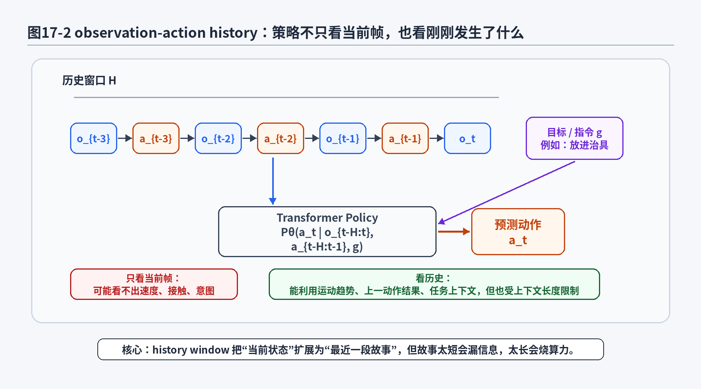
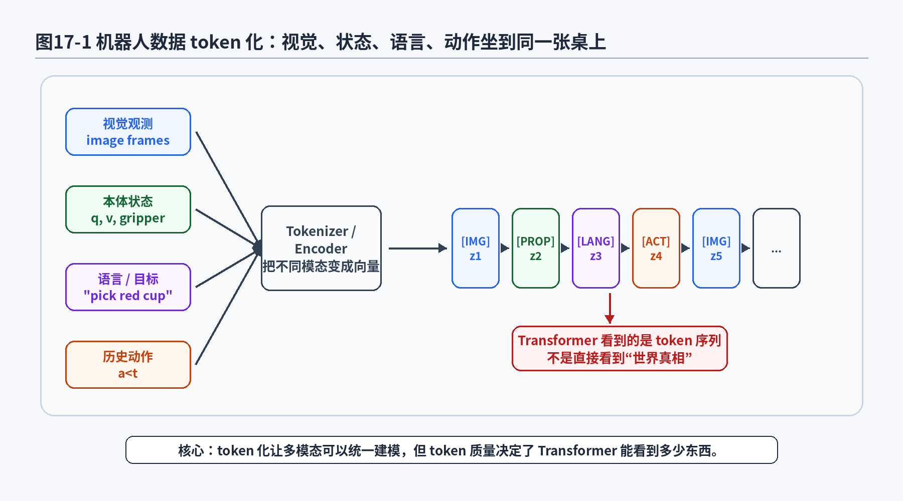
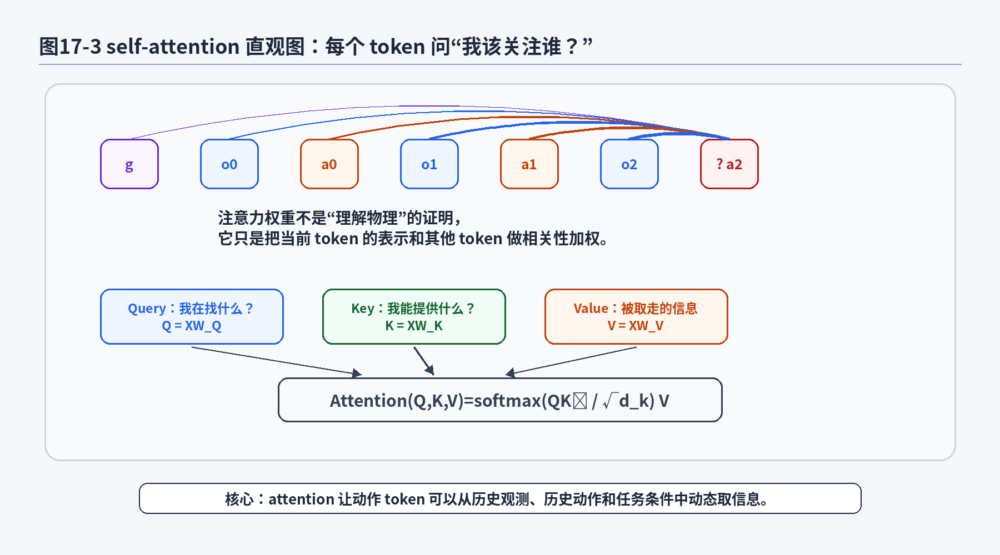
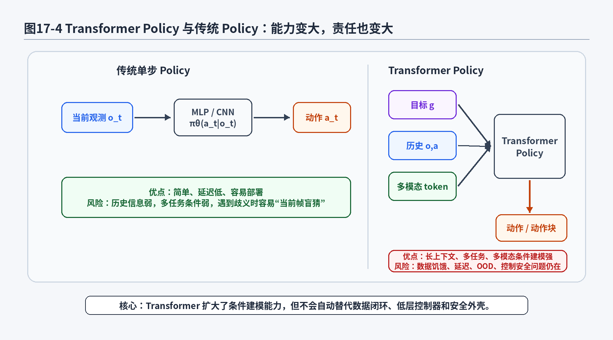

# 第18章：Transformer Policy：它不是魔法棒，是超大号条件建模器

> **新版布局位置**：本章属于 **第五篇：长序列架构与多模态策略**。本章编号、公式编号与交叉引用已按新版八篇结构统一调整。


> **本章一句话导读**：本章说明 Transformer Policy 的价值不在“魔法”，而在用自注意力建模长历史和多源上下文。


> 第17章我们把 Decision Transformer 拆开看了一遍：它把轨迹组织成序列，把动作预测改写成条件语言建模式的问题。第18章继续往前走一步：不只看 Decision Transformer，而是看 Transformer 作为一种通用策略建模骨架，为什么会被机器人学习、自动驾驶轨迹建模、多任务操作、VLA 路线大量采用。先把结论放在桌面上：Transformer 不是机械臂的魔法棒，它不会自动懂夹爪、接触、摩擦和相机标定；它更像一个超大号条件建模器，擅长把视觉、语言、历史、动作和任务条件放进同一个上下文里，然后预测接下来该怎么做。

---

## 1. 本章开场：机器人为什么突然也开始“吃 token”

如果你近几年读机器人学习论文，会发现一个很有意思的现象：

原来大家讨论策略时，常见说法是：

```text
输入图像 → CNN → MLP → 输出动作
```

后来慢慢变成：

```text
图像 token + 语言 token + 状态 token + 历史动作 token → Transformer → 动作 token / 连续动作
```

机器人明明在真实世界里动手动脚，怎么突然也开始像语言模型一样“吃 token”了？

这个变化背后不是因为机器人世界变成了文字游戏，而是因为真实机器人任务里的条件越来越复杂：

- 当前图像很重要，但只看当前图像经常不够；
- 机器人关节状态、末端位姿、夹爪开合、力反馈也很重要；
- 历史动作能告诉模型“刚才我做过什么”；
- 语言指令能告诉模型“这次任务到底要干什么”；
- 多摄像头、多传感器、多任务数据混在一起，已经很难用一个小 MLP 优雅地兜住。

如果说第2章的 Behavior Cloning 像一个学生刷单步选择题，那么 Transformer policy 更像一个学生在读一段长题干：

```text
题干：桌上有红杯子、蓝碗、绿色盘子；用户说把红杯子放进盘子；
历史：机械臂刚刚靠近红杯子，夹爪还没闭合；
当前图像：杯子在夹爪左前方一点点；
问题：下一步动作是什么？
```

这种题目只看最后一张图，很容易答错。因为你不知道任务目标，不知道刚才有没有已经抓住物体，也不知道当前偏差是接近过程中的正常偏差，还是已经失败后的补锅现场。

Transformer 的吸引力就在这里：它提供了一种通用方式，把“长题干”组织起来，让策略在一个统一上下文里建模动作。

但本章会一直强调一个边界：

> Transformer 能扩大条件建模能力，但它不是物理引擎，不是控制器，也不是安全员。它可以帮助策略看更多上下文，却不能保证策略在真实世界里一定可靠。

真实机械臂不会因为你用了 attention 就更懂摩擦。真实自动驾驶系统也不会因为模型上下文长一点，就自动知道旁边电动车下一秒会不会突然变成哲学家，开始思考自己为什么要逆行。

---

## 2. 本章要解决的核心问题

本章围绕以下 20 个问题展开：

1. Transformer 为什么适合机器人策略建模？
2. 机器人数据里的 token 到底是什么？图像、状态、动作、语言都能变成 token 吗？
3. 为什么 observation-action history 很重要？
4. 条件策略

<div class="math">\[
P_\theta(a_t|o_{\le t},a_{<t},g) \tag{18.1}\]</div>

到底在表达什么？
5. history window 和 context length 有什么区别？
6. self-attention 在机器人策略里到底做了什么？
7. attention 权重是不是等于模型“理解了物理因果”？
8. causal attention 为什么仍然重要？
9. Transformer policy 和传统单步 policy 的数学形式有什么区别？
10. 连续动作和离散 action token 在 Transformer 里分别怎么处理？
11. sequence-to-sequence policy 和 action chunk 有什么关系？
12. Transformer 如何处理多摄像头、多模态输入？
13. 语言条件策略和目标条件策略有什么关系？
14. Transformer 是否能解决分布偏移？
15. Transformer 是否能解决多模态动作？
16. Transformer policy 为什么很吃数据？
17. 上下文长度增加为什么会带来计算和延迟问题？
18. 在机械臂、自动驾驶、泊车任务中，Transformer policy 分别有什么价值？
19. 工程部署时，Transformer policy 需要哪些安全外壳？
20. 第18章如何为第20章 VLA 铺垫？

---


### 主线定位与统一例子

为了让本章不变成孤立知识点，读本章时请始终把公式落回两个统一例子：

- **二维点机器人跟随专家轨迹**：状态可写成位置/速度，动作可写成二维控制量，适合观察状态分布、轨迹分布和误差累积。
- **机械臂末端运动/抓取轨迹模仿**：观测包含图像或本体状态，动作包含末端位姿增量或关节控制量，适合理解连续动作、多模态动作、动作块和实机闭环。

- **承接前文**：承接第17章的序列建模。
- **本章推进**：说明 Transformer 在机器人策略中主要是条件建模器，不是自动解决分布偏移的魔法。
- **铺垫后文**：为第20章 VLA 中视觉、语言、动作多模态条件建模做准备。
- **公式阅读抓手**：看 Transformer policy 时，先把 token、context、action head 和 loss 分开。
- **建议同步回看**：附录 E、F、H。

## 3. 直觉解释：Transformer 不是魔法棒，而是“上下文处理器”

先不写公式。我们从一个机械臂抓取任务开始。

假设桌上有一个红色杯子和一个蓝色碗，用户说：

```text
把红色杯子放到盘子里。
```

如果策略只看当前图像，它可能知道桌上有什么，却不知道用户到底要哪个物体。红杯子、蓝碗、盘子都在图像里，模型如果没有任务条件，就像一个实习生站在仓库里，领导只说“干活”，但没说干哪件活。

如果策略只看语言，不看图像，它知道要拿红杯子，却不知道红杯子在哪。它像一个读懂了工单但没进车间的人，说得很有道理，手上一点活干不了。

如果策略只看当前图像和语言，但不看历史，它可能不知道：

- 夹爪是否已经闭合；
- 杯子是否已经被拿起；
- 上一步动作是否导致了接触；
- 当前画面里的杯子是还在桌上，还是已经在夹爪里晃悠；
- 机器人现在是在“接近阶段”“抓取阶段”还是“放置阶段”。

Transformer policy 的基本想法是：

> 把视觉、语言、本体状态、历史动作、任务目标都组织成一个上下文，让策略在这个上下文里预测下一步动作。

这里的关键词是“上下文”。

在语言模型里，上下文是一串词：

```text
我今天想吃 → 火锅
```

在机器人策略里，上下文可以是一串多模态 token：

```text
语言目标 g，图像 o0，本体状态 q0，动作 a0，图像 o1，本体状态 q1，动作 a1，...
```

Transformer 擅长的不是“天生会控制机器人”，而是“从长上下文中提取和当前预测有关的信息”。它可以让当前动作预测同时参考：

- 当前观测；
- 最近几步动作；
- 任务指令；
- 视觉对象关系；
- 历史阶段信息；
- 多摄像头视角；
- 其他模态信号。

这就是为什么它在机器人策略中有吸引力。

但是，别把上下文建模误解成世界理解。一个 Transformer 可以把“刚才夹爪闭合、当前杯子位置变化”关联起来，但这不等于它真的学会了接触力学。它可能只是从数据里学到一个统计规律：类似画面、类似动作历史下，专家通常这么动。

统计规律很有用，但在 OOD 场景中也很脆。第12章讲过，离线数据没覆盖的坑，不会因为模型结构换成 Transformer 就自动填平。最多是模型拿着更大的铲子站在坑边，看起来更有气势。

---

## 4. 数学建模：从单步策略到历史条件策略

前面章节中，最基础的行为克隆策略通常写成：

<div class="math">\[
\pi_\theta(a_t|o_t) \tag{18.2}\]</div>

它表示：给定当前观测 <span class="math">\\(o\_t\\)</span>，策略输出动作 <span class="math">\\(a\_t\\)</span> 的条件分布。

这个形式很干净，但也很“健忘”。它默认当前观测里包含了做决策所需的全部信息。对于很多机器人任务，这个假设并不总成立。

因此，我们把策略扩展成历史条件形式：

<div class="math">\[
P_\theta(a_t|o_{\le t},a_{<t},g) \tag{18.3}\]</div>

其中：

- <span class="math">\\(o\_{\le t}\\)</span> 表示从开始到当前时刻的观测历史；
- <span class="math">\\(a\_{<t}\\)</span> 表示当前时刻之前已经执行过的动作；
- <span class="math">\\(g\\)</span> 表示任务目标，可以是语言指令、目标图像、目标状态、类别标签或 return 条件；
- <span class="math">\\(P\_\theta\\)</span> 表示参数为 <span class="math">\\(\theta\\)</span> 的策略分布；
- <span class="math">\\(a\_t\\)</span> 是当前要预测或采样的动作。

### 公式拆解：历史条件策略

公式：

<div class="math">\[
P_\theta(a_t|o_{\le t},a_{<t},g) \tag{18.4}\]</div>

它要解决的问题：

普通 BC 只看 <span class="math">\\(o\_t\\)</span>，但机器人决策往往依赖历史和目标。本公式把策略从“当前帧动作预测”扩展为“在观测历史、动作历史和任务目标条件下预测当前动作”。

符号解释：

- <span class="math">\\(P\_\theta\\)</span>：由模型参数 <span class="math">\\(\theta\\)</span> 定义的动作条件分布；
- <span class="math">\\(a\_t\\)</span>：第 <span class="math">\\(t\\)</span> 时刻要输出的动作；
- <span class="math">\\(o\_{\le t}\\)</span>：<span class="math">\\(o\_0,o\_1,\dots,o\_t\\)</span>，从过去到当前的观测序列；
- <span class="math">\\(a\_{<t}\\)</span>：<span class="math">\\(a\_0,a\_1,\dots,a\_{t-1}\\)</span>，当前动作之前的历史动作；
- <span class="math">\\(g\\)</span>：任务条件，例如语言指令“把红杯子放进盘子”、目标位姿、目标图像或期望 return。

直觉理解：

这个式子在说：不要只问“当前画面下该做什么”，而要问“在这个任务目标下，结合刚才看到的和刚才做过的，现在该做什么”。

机器人 / 自动驾驶案例：

机械臂装配时，当前图像可能看起来差不多，但如果上一时刻已经发生接触，下一步应该微调插入；如果上一时刻还没有接触，下一步应该继续接近。自动驾驶中，当前车道图像相似，但历史轨迹能告诉模型车辆正在加速、减速还是准备变道。

常见误解：

不要以为把历史全部塞进去就一定更好。历史过短会漏信息，历史过长会带来计算开销、噪声累积和延迟问题。策略需要的是“有用上下文”，不是把整个硬盘都塞进模型嘴里。



**图18-2 说明**：
- 左侧历史窗口包含最近若干步观测和动作；
- 任务目标 <span class="math">\\(g\\)</span> 作为条件输入，告诉策略当前要完成什么；
- Transformer policy 根据历史窗口和任务条件预测当前动作；
- 关键不是机械地增加历史长度，而是让策略看到与当前动作有关的上下文。

---

## 5. 机器人数据 token 化：不是万物皆文字，而是万物先变向量

Transformer 的输入不是原始物理世界，而是一串向量。为了让机器人数据进入 Transformer，我们需要先做 token 化。

语言任务中，token 可以是字、词或子词。机器人任务中，token 的来源更杂：

- 图像 patch token；
- 视觉 encoder 输出的 object token；
- 机器人关节角和速度编码后的 proprioceptive token；
- 夹爪状态 token；
- 历史动作 token；
- 语言指令 token；
- 目标图像 token；
- 时间步位置编码；
- 任务 ID 或机器人 embodiment ID。

我们可以把一段机器人输入抽象写成：

<div class="math">\[
x_{1:n}
=
(x_1,x_2,\dots,x_n) \tag{18.5}\]</div>

每个 <span class="math">\\(x\_i\\)</span> 是某种 token 的嵌入向量。例如：

<div class="math">\[
x_i
=
\mathrm{Embed}(u_i)+p_i+c_i \tag{18.6}\]</div>

其中 <span class="math">\\(u\_i\\)</span> 是原始输入单元，<span class="math">\\(\mathrm{Embed}(u\_i)\\)</span> 是它的内容嵌入，<span class="math">\\(p\_i\\)</span> 是位置编码，<span class="math">\\(c\_i\\)</span> 可以表示模态类型编码，例如“这是图像 token”“这是动作 token”“这是语言 token”。

### 公式拆解：机器人 token 嵌入

公式：

<div class="math">\[
x_i
=
\mathrm{Embed}(u_i)+p_i+c_i \tag{18.7}\]</div>

它要解决的问题：

Transformer 需要处理向量序列，但机器人原始数据包含图像、语言、关节状态和动作。这个公式描述了如何把不同来源的数据统一变成 token 表示。

符号解释：

- <span class="math">\\(u\_i\\)</span>：第 <span class="math">\\(i\\)</span> 个原始输入单元，可能是一块图像 patch、一个语言 token、一个状态向量或一个动作 token；
- <span class="math">\\(\mathrm{Embed}(u\_i)\\)</span>：把原始输入映射到模型隐藏维度的嵌入向量；
- <span class="math">\\(p\_i\\)</span>：位置编码，告诉模型这个 token 在序列中的位置；
- <span class="math">\\(c\_i\\)</span>：类型或模态编码，告诉模型这个 token 属于图像、语言、状态还是动作；
- <span class="math">\\(x\_i\\)</span>：最终送入 Transformer 的 token 表示。

直觉理解：

这一步像给每个输入办一张“身份证”：内容是什么、排在第几个、属于什么模态。没有这些信息，Transformer 看到的只是一些向量，很难区分“红杯子图像特征”和“夹爪动作特征”。

机器人 / 自动驾驶案例：

在多摄像头机械臂任务中，前视相机、腕部相机、关节角和语言指令可以分别编码成不同 token，再送入 Transformer。自动驾驶轨迹建模中，车辆状态、地图元素、周围目标轨迹也可以被组织成 token 序列。

常见误解：

token 化不是把物理世界变成文字。它只是把不同模态的数据转换成统一向量表示。token 质量受 encoder、标定、同步、分辨率、传感器噪声影响很大。前端表示很烂，后面 Transformer 再豪华，也像在泥地上铺红毯。



**图18-1 说明**：
- 视觉、本体状态、语言目标和历史动作都要先经过 tokenizer 或 encoder；
- Transformer 看到的是 token 序列，而不是直接看到真实世界；
- 类型编码和位置编码帮助模型区分不同模态和时间顺序；
- token 化质量是 Transformer policy 能力上限的重要来源。

---

## 6. self-attention：让当前动作从历史里“取资料”

Transformer 的核心机制是 self-attention。它解决的问题可以用一句话概括：

> 当模型要更新某个 token 的表示时，它应该从其他 token 中取哪些信息？

在机器人策略中，当前动作 token 可能需要参考：

- 语言目标：到底抓哪个物体；
- 当前图像：物体在哪里；
- 上一帧图像：物体是否移动；
- 上一个动作：机械臂刚才往哪边动；
- 本体状态：夹爪是否闭合；
- 历史阶段：现在处于接近、抓取、搬运还是放置。

self-attention 通过 Query、Key、Value 三组向量完成这种信息聚合。给定输入矩阵 <span class="math">\\(X\\)</span>，我们先计算：

<div class="math">\[
Q=XW_Q,\quad K=XW_K,\quad V=XW_V \tag{18.8}\]</div>

然后计算 attention：

<div class="math">\[
\mathrm{Attention}(Q,K,V)
=
\mathrm{softmax}\left(\frac{QK^\top}{\sqrt{d_k}}\right)V \tag{18.9}\]</div>

其中 <span class="math">\\(d\_k\\)</span> 是 key 向量的维度。

### 公式拆解：self-attention 基础公式

公式：

<div class="math">\[
\mathrm{Attention}(Q,K,V)
=
\mathrm{softmax}\left(\frac{QK^\top}{\sqrt{d_k}}\right)V \tag{18.10}\]</div>

它要解决的问题：

在一个 token 序列中，不同 token 对当前预测的重要性不同。attention 公式用可学习的相关性权重，把与当前 token 更相关的信息聚合进来。

符号解释：

- <span class="math">\\(X\\)</span>：输入 token 表示组成的矩阵；
- <span class="math">\\(Q\\)</span>：Query，可以理解为“当前 token 想找什么信息”；
- <span class="math">\\(K\\)</span>：Key，可以理解为“每个 token 能被什么问题匹配上”；
- <span class="math">\\(V\\)</span>：Value，可以理解为“真正被加权取走的信息”；
- <span class="math">\\(QK^\top\\)</span>：计算 Query 与 Key 的匹配分数；
- <span class="math">\\(\sqrt{d\_k}\\)</span>：缩放因子，避免点积数值太大导致 softmax 过于尖锐；
- <span class="math">\\(\mathrm{softmax}\\)</span>：把匹配分数变成权重；
- <span class="math">\\(\mathrm{softmax}(\cdot)V\\)</span>：用权重对 Value 做加权求和。

直觉理解：

如果当前要预测“下一步夹爪动作”，模型可能更关注最近的腕部相机 token、夹爪状态 token 和语言目标 token，而不是很久以前某个不相关背景区域。attention 就是在做这种动态取资料。

机器人 / 自动驾驶案例：

在机械臂插孔任务中，当前动作可能强依赖最近几帧末端相机中孔的位置变化，以及上一动作造成的偏移。自动驾驶中，当前控制可能更关注前车轨迹、车道线、导航目标和自车速度历史。

常见误解：

attention 权重不是物理因果证明。某个 token 被高权重关注，只能说明模型当前表示计算中使用了它，不能直接说明模型真的理解了接触、摩擦、碰撞或交通规则。把 attention 热力图当成“模型已经懂了”的证据，是一种很常见的论文读图幻觉。



**图18-3 说明**：
- 每个 token 通过 Query 去匹配其他 token 的 Key；
- 匹配分数经过 softmax 变成 attention 权重；
- 当前动作预测可以动态关注任务目标、历史观测和历史动作；
- attention 是信息聚合机制，不等于模型已经掌握真实物理因果。

---

## 7. causal attention：训练时别偷看未来，部署时也没未来可看

第17章讲 Decision Transformer 时，我们已经见过 causal attention。这里再强调一次，因为机器人策略里未来信息泄漏很容易被忽视。

如果训练时模型预测 <span class="math">\\(a\_t\\)</span>，却能看到未来动作 <span class="math">\\(a\_{t+1},a\_{t+2}\\)</span>，那它会学到一种很舒服但很危险的作弊方式：

```text
既然答案后面已经写了，那我就照着答案猜当前动作。
```

问题是部署时没有未来动作。真实机器人执行时，未来动作还没发生，模型只能根据过去和当前决定下一步。

因此，自回归策略通常需要 causal mask。可以写成：

<div class="math">\[
M_{ij}
=
\begin{cases}
0, & j\le i \\
-\infty, & j>i
\end{cases} \tag{18.11}\]</div>

masked attention 写成：

<div class="math">\[
\mathrm{Attention}(Q,K,V)
=
\mathrm{softmax}\left(\frac{QK^\top}{\sqrt{d_k}}+M\right)V \tag{18.12}\]</div>

这里的 <span class="math">\\(M\\)</span> 会把未来 token 的注意力分数压到 <span class="math">\\(-\infty\\)</span>，softmax 之后对应权重接近 0。

### 公式拆解：causal mask

公式：

<div class="math">\[
M_{ij}
=
\begin{cases}
0, & j\le i \\
-\infty, & j>i
\end{cases} \tag{18.13}\]</div>

它要解决的问题：

预测当前位置时，模型只能看当前位置及之前的信息，不能看未来 token。这个 mask 用数学方式禁止未来信息泄漏。

符号解释：

- <span class="math">\\(M\_{ij}\\)</span>：第 <span class="math">\\(i\\)</span> 个 token 看第 <span class="math">\\(j\\)</span> 个 token 时添加的 mask 值；
- <span class="math">\\(j\le i\\)</span>：第 <span class="math">\\(j\\)</span> 个 token 在当前 token 之前或就是当前 token，可以被看到；
- <span class="math">\\(j>i\\)</span>：第 <span class="math">\\(j\\)</span> 个 token 在未来，不能被看到；
- <span class="math">\\(-\infty\\)</span>：加入 softmax 前让未来 token 权重变成接近 0 的数学写法。

直觉理解：

这就像考试时把后面的标准答案盖住。训练时不许看，推理时也没得看，训练和部署才不会出现严重不一致。

机器人 / 自动驾驶案例：

机械臂动作序列训练时，如果模型看到未来“已经成功抓住”的图像，再预测当前接近动作，就会高估自己的能力。自动驾驶轨迹预测中，如果模型控制当前方向盘时偷看未来车道变化，那离线指标会很好看，实车执行可能当场露馅。

常见误解：

不是所有机器人 Transformer 都必须完全自回归。有些方法会一次预测一个动作块，或者用 encoder-decoder 结构处理完整观测窗口。关键不是形式必须一样，而是训练时可见信息必须和部署时可用信息一致。

---

## 8. history window 与 context length：看多远，不是越远越好

在机器人策略中，我们通常不会真的把从任务开始到当前的所有历史都塞进去，而是使用一个历史窗口：

<div class="math">\[
h_t
=
(o_{t-H+1:t},a_{t-H+1:t-1}) \tag{18.14}\]</div>

这里 <span class="math">\\(H\\)</span> 是历史窗口长度。

策略可以写成：

<div class="math">\[
P_\theta(a_t|h_t,g)
=
P_\theta(a_t|o_{t-H+1:t},a_{t-H+1:t-1},g) \tag{18.15}\]</div>

### 公式拆解：历史窗口

公式：

<div class="math">\[
h_t
=
(o_{t-H+1:t},a_{t-H+1:t-1}) \tag{18.16}\]</div>

它要解决的问题：

无限历史不现实，当前动作通常只需要最近一段关键信息。历史窗口用 <span class="math">\\(H\\)</span> 控制策略能看到多长时间范围。

符号解释：

- <span class="math">\\(h\_t\\)</span>：第 <span class="math">\\(t\\)</span> 时刻可用的历史上下文；
- <span class="math">\\(H\\)</span>：历史窗口长度；
- <span class="math">\\(o\_{t-H+1:t}\\)</span>：从 <span class="math">\\(t-H+1\\)</span> 到 <span class="math">\\(t\\)</span> 的观测；
- <span class="math">\\(a\_{t-H+1:t-1}\\)</span>：从 <span class="math">\\(t-H+1\\)</span> 到 <span class="math">\\(t-1\\)</span> 的历史动作。

直觉理解：

这像开车看后视镜。完全不看后视镜会危险，但一直盯着十分钟前的路口也没必要。策略需要一段足够解释当前状态的历史。

机器人 / 自动驾驶案例：

机械臂抓取中，最近 1—2 秒的历史可能足够判断是否接近物体、是否刚刚接触。泊车中，更长的历史能帮助判断车辆轨迹趋势、转向响应和车位相对位置变化。

常见误解：

上下文越长不代表策略越强。过长上下文会增加计算量和显存占用，也可能引入无关噪声。真实部署中还要考虑控制频率和延迟，不能为了“看得远”把机器人变成慢动作回放。

context length 是模型能容纳的 token 数上限。历史窗口 <span class="math">\\(H\\)</span> 只是时间维度长度，真正的 token 数还取决于每个时间步有多少图像 patch、几个相机、多少状态 token、是否包含语言和动作 token。

粗略写成：

<div class="math">\[
N_{\mathrm{token}}
\approx
H\cdot(N_{\mathrm{vision}}+N_{\mathrm{state}}+N_{\mathrm{action}})+N_{\mathrm{goal}} \tag{18.17}\]</div>

这条式子提醒我们：多摄像头、高分辨率、长历史叠在一起，token 数会涨得很快。attention 的计算量通常和 token 数的平方相关：

<div class="math">\[
\mathcal{O}(N_{\mathrm{token}}^2) \tag{18.18}\]</div>

所以，机器人 Transformer policy 的部署问题，不只是“模型准不准”，还有“算不算得动”“延迟能不能接受”“边缘设备会不会当场热到怀疑人生”。

---

## 9. sequence-to-sequence policy：不只预测一个动作，也可以预测动作块

前面我们写的是单步动作预测：

<div class="math">\[
P_\theta(a_t|o_{\le t},a_{<t},g) \tag{18.19}\]</div>

但第13章讲 ACT 时，我们已经知道：机器人策略常常不只需要一个动作，而是需要一段动作块。Transformer 也可以自然扩展成 sequence-to-sequence policy：

<div class="math">\[
P_\theta(a_{t:t+K-1}|o_{t-H+1:t},a_{t-H+1:t-1},g) \tag{18.20}\]</div>

其中 <span class="math">\\(K\\)</span> 是未来动作块长度。

这个形式在机器人里很常见，因为底层控制频率可能很高，而高层策略不一定每个控制周期都重新规划。模型可以低频预测一个动作块，控制器高频执行或插值。

### 公式拆解：动作块条件生成

公式：

<div class="math">\[
P_\theta(a_{t:t+K-1}|o_{t-H+1:t},a_{t-H+1:t-1},g) \tag{18.21}\]</div>

它要解决的问题：

单步预测容易抖动，也可能缺少短期动作一致性。动作块预测让策略一次生成未来 <span class="math">\\(K\\)</span> 步动作，使动作更连贯，也方便低频推理高频执行。

符号解释：

- <span class="math">\\(a\_{t:t+K-1}\\)</span>：从当前时刻 <span class="math">\\(t\\)</span> 到 <span class="math">\\(t+K-1\\)</span> 的动作块；
- <span class="math">\\(K\\)</span>：动作块长度；
- <span class="math">\\(o\_{t-H+1:t}\\)</span>：历史观测窗口；
- <span class="math">\\(a\_{t-H+1:t-1}\\)</span>：历史动作窗口；
- <span class="math">\\(g\\)</span>：任务目标或语言条件。

直觉理解：

不要每一毫秒都问一次“我下一步该怎么做”，而是让策略先给一小段动作计划。就像老师傅搬零件，不是每移动 1 毫米都重新开会，而是脑子里有一小段连续动作。

机器人 / 自动驾驶案例：

机械臂插入任务中，动作块可以提供短时间内平滑一致的末端位姿增量。泊车中，也可以把未来若干帧转角或速度控制作为一个局部控制序列。

常见误解：

动作块不是越长越好。块太短，策略频繁推理，动作可能抖；块太长，开环执行风险增加，环境稍微变化就可能一条路走到黑。ACT 的 temporal ensemble、Diffusion Policy 的 receding horizon，本质上都在处理这个张力。

---

## 10. Transformer policy 与传统 policy 的对比

我们把传统 policy 和 Transformer policy 放到一起看。

传统单步 policy 常写成：

<div class="math">\[
\pi_\theta(a_t|o_t) \tag{18.22}\]</div>

Transformer policy 常写成：

<div class="math">\[
P_\theta(a_t|o_{t-H+1:t},a_{t-H+1:t-1},g) \tag{18.23}\]</div>

或动作块形式：

<div class="math">\[
P_\theta(a_{t:t+K-1}|o_{t-H+1:t},a_{t-H+1:t-1},g) \tag{18.24}\]</div>

它们的差异不只是网络结构从 CNN/MLP 换成 Transformer，而是条件集合变了。

传统策略问：

```text
当前看到这个，应该做什么？
```

Transformer 策略问：

```text
在这个任务目标下，结合最近看到的、刚才做过的、当前状态，接下来应该怎么做？
```



**图18-4 说明**：
- 传统单步 policy 输入简单、推理快，但历史和任务条件表达能力有限；
- Transformer policy 可以融合目标、历史和多模态 token；
- 能力变强的同时，对数据量、算力、延迟和工程安全提出更高要求；
- Transformer 不是替代全部系统模块，而是策略建模骨架的一种升级。

从工程角度看，传统策略的优势非常实在：

- 模型小；
- 延迟低；
- 部署简单；
- 调试路径短；
- 出问题时比较容易定位。

Transformer policy 的优势也很明显：

- 能处理长历史；
- 能融合多模态；
- 能支持语言或目标条件；
- 能做多任务共享；
- 能利用大规模数据预训练；
- 能自然衔接 VLA 路线。

但它的代价同样真实：

- 数据需求更大；
- 训练成本更高；
- 延迟更难控制；
- 模型行为更难解释；
- 安全边界更难直接验证；
- OOD 场景下仍可能输出高置信错误动作。

所以工程里不要一听 Transformer 就激动得像采购看到新预算。先问四个问题：

1. 我的任务真的需要长历史和多模态条件吗？
2. 我的数据量是否支撑这种模型？
3. 我的部署算力和控制频率能否接受？
4. 我是否有足够的安全外壳和失败回流机制？

如果答案都比较虚，那 Transformer 可能不是升级，而是把一个可调的小问题升级成一个又贵又难解释的大问题。

---

## 11. 训练目标：本质上仍然离不开模仿学习损失

Transformer policy 的外表很现代，但很多训练目标仍然和行为克隆一脉相承。

对于离散动作 token，可以使用负对数似然：

<div class="math">\[
\mathcal{L}_{\mathrm{NLL}}(\theta)
=
-
\mathbb{E}_{\tau\sim\mathcal{D}}
\left[
\sum_t
\log P_\theta(a_t|o_{\le t},a_{<t},g)
\right] \tag{18.25}\]</div>

对于连续动作，可以让模型直接回归动作：

<div class="math">\[
\hat a_t
=
f_\theta(o_{t-H+1:t},a_{t-H+1:t-1},g) \tag{18.26}\]</div>

<div class="math">\[
\mathcal{L}_{\mathrm{MSE}}(\theta)
=
\mathbb{E}_{\tau\sim\mathcal{D}}
\left[
\sum_t
\|a_t-\hat a_t\|_2^2
\right] \tag{18.27}\]</div>

### 公式拆解：Transformer policy 的 NLL 训练目标

公式：

<div class="math">\[
\mathcal{L}_{\mathrm{NLL}}(\theta)
=
-
\mathbb{E}_{\tau\sim\mathcal{D}}
\left[
\sum_t
\log P_\theta(a_t|o_{\le t},a_{<t},g)
\right] \tag{18.28}\]</div>

它要解决的问题：

让模型在给定历史和任务条件时，把高概率分配给专家数据中真实采取的动作。

符号解释：

- <span class="math">\\(\mathcal{L}\_{\mathrm{NLL}}\\)</span>：负对数似然损失；
- <span class="math">\\(\theta\\)</span>：模型参数；
- <span class="math">\\(\tau\sim\mathcal{D}\\)</span>：从离线轨迹数据集中采样轨迹；
- <span class="math">\\(\sum\_t\\)</span>：对轨迹中的时间步求和；
- <span class="math">\\(P\_\theta(a\_t|o\_{\le t},a\_{<t},g)\\)</span>：模型在上下文条件下给专家动作的概率；
- 负号：把“最大化专家动作概率”转成“最小化损失”。

直觉理解：

这仍然是在做模仿，只是模仿时给模型看的条件更多。普通 BC 像只给题目最后一句，Transformer BC 像给完整题干、前文和任务要求。

机器人 / 自动驾驶案例：

语言条件抓取数据中，模型看到指令、历史图像和历史动作后，需要提高专家下一步动作的概率。自动驾驶轨迹数据中，模型看到地图、周围车历史和自车历史后，提高专家控制动作的概率。

常见误解：

不要因为用了 Transformer，就以为训练目标已经变成了强化学习。只要核心目标仍然是在离线数据上提高专家动作概率，它本质上仍然是模仿学习训练。结构升级不等于目标升级。

---

## 12. 连续动作与 action token：两条路，各有坑

机器人动作通常是连续的，例如：

- 末端位姿增量 <span class="math">\\(\Delta x,\Delta y,\Delta z,\Delta \mathrm{roll},\Delta \mathrm{pitch},\Delta \mathrm{yaw}\\)</span>；
- 关节角速度；
- 夹爪开合量；
- 自动驾驶中的转角、加速度、制动。

Transformer 最初在语言中处理离散 token，因此到了机器人动作这里，有两种常见做法。

第一种：直接输出连续动作。

<div class="math">\[
\hat a_t=f_\theta(\mathrm{context}_t) \tag{18.29}\]</div>

然后用 MSE 或高斯负对数似然训练。

第二种：把动作离散化成 action token。

<div class="math">\[
a_t \rightarrow y_t \in \{1,2,\dots,V\} \tag{18.30}\]</div>

其中 <span class="math">\\(V\\)</span> 是动作词表大小。模型预测：

<div class="math">\[
P_\theta(y_t|\mathrm{context}_t) \tag{18.31}\]</div>

再把离散 token 解码回动作。

### 公式拆解：动作离散化

公式：

<div class="math">\[
a_t \rightarrow y_t \in \{1,2,\dots,V\} \tag{18.32}\]</div>

它要解决的问题：

让连续动作可以像语言 token 一样被 Transformer 以分类方式建模，从而使用交叉熵、自回归生成等成熟训练范式。

符号解释：

- <span class="math">\\(a\_t\\)</span>：原始连续动作；
- <span class="math">\\(y\_t\\)</span>：离散化后的动作 token；
- <span class="math">\\(V\\)</span>：动作词表大小；
- <span class="math">\\(P\_\theta(y\_t|\mathrm{context}\_t)\\)</span>：给定上下文时预测动作 token 的概率分布。

直觉理解：

这像把连续方向盘角度分成很多档位。模型不直接输出 <span class="math">\\(3.27^\circ\\)</span>，而是输出“第 137 档”。这样更像语言建模，但精度和离散化方式会影响控制质量。

机器人 / 自动驾驶案例：

机械臂末端位姿增量可以按维度分桶，也可以用向量量化方法生成动作 token。自动驾驶控制也可以把转角和加速度离散成类别，但离散粒度太粗会导致控制抖动或精度不足。

常见误解：

action tokenization 不是免费午餐。离散化太粗，动作不精细；离散化太细，词表很大、训练变难、数据更稀疏。连续控制系统最终还要面对平滑性、限幅、动力学约束和执行器延迟。

---

## 13. 多模态条件：视觉、语言、状态不是简单拼接这么轻松

机器人 Transformer policy 经常要处理多模态输入。一个语言条件机械臂策略可以写成：

<div class="math">\[
P_\theta(a_t|I_{\le t}^{1:m},q_{\le t},a_{<t},l) \tag{18.33}\]</div>

其中：

- <span class="math">\\(I\_{\le t}^{1:m}\\)</span> 表示 <span class="math">\\(m\\)</span> 个摄像头到当前时刻的图像历史；
- <span class="math">\\(q\_{\le t}\\)</span> 表示机器人本体状态历史；
- <span class="math">\\(a\_{<t}\\)</span> 表示历史动作；
- <span class="math">\\(l\\)</span> 表示语言指令。

这个公式看起来只是把条件写多了，但工程上每一项都很麻烦。

多摄像头需要时间同步、外参标定和视角选择。语言指令需要和视觉场景对齐。关节状态需要和图像帧时间对齐。动作日志要和控制周期一致。真实系统里，这些东西稍微错一点，模型就像拿着错误地图开车，越自信越危险。

### 公式拆解：多模态条件策略

公式：

<div class="math">\[
P_\theta(a_t|I_{\le t}^{1:m},q_{\le t},a_{<t},l) \tag{18.34}\]</div>

它要解决的问题：

真实机器人策略往往需要同时依赖视觉、机器人状态、历史动作和语言指令。这个公式把多模态输入统一写成动作预测的条件。

符号解释：

- <span class="math">\\(I\_{\le t}^{1:m}\\)</span>：第 1 到第 <span class="math">\\(m\\)</span> 个摄像头的图像历史；
- <span class="math">\\(q\_{\le t}\\)</span>：机器人关节、本体或末端状态历史；
- <span class="math">\\(a\_{<t}\\)</span>：历史动作；
- <span class="math">\\(l\\)</span>：语言指令；
- <span class="math">\\(a\_t\\)</span>：当前动作。

直觉理解：

策略不仅要“看见”，还要“知道自己在哪”“知道刚才干了什么”“知道用户要什么”。这些条件共同决定下一步动作。

机器人 / 自动驾驶案例：

双臂操作中，左右腕相机、外部相机、两条机械臂关节状态和语言指令都可能重要。自动驾驶中，环视摄像头、地图、导航、速度、历史轨迹共同影响规划动作。

常见误解：

多模态不是简单 concat。不同模态的时间尺度、噪声特性和语义粒度都不同。把它们粗暴拼在一起，模型可能学到伪相关。例如语言里说“红杯子”，视觉 encoder 却没有稳定区分红杯子，最后模型只能靠数据偏置猜。

---

## 14. Transformer 能不能解决分布偏移？能缓解一些，但别指望它包治百病

第3章讲过，分布偏移是行为克隆的核心痛点：训练时模型看到专家状态分布，执行时看到自己诱导出来的状态分布。

Transformer policy 能不能解决这个问题？

冷静回答：不能从根本上解决，但可能缓解一部分。

它可能缓解的原因是：

1. 历史上下文能帮助模型识别自己已经偏离了正常轨迹；
2. 多模态信息能帮助模型更准确判断状态；
3. 大规模数据训练可能覆盖更多恢复场景；
4. 动作块或序列建模能提供更一致的短期行为；
5. 任务条件能减少同一观测下动作意图不明的问题。

但它不能改变一个事实：

<div class="math">\[
\mathcal{D}
\text{ 没有覆盖的状态—动作区域，模型仍然缺少可靠监督。} \tag{18.35}\]</div>

如果训练数据里没有机器人夹偏后如何恢复，Transformer 不会因为 attention 头比较多就自动长出老师傅经验。它可能在历史里发现“我好像偏了”，但不知道怎么救。

这就像一个学生很擅长阅读理解，但教材里没有讲过灭火。真正着火时，他最多能写一篇很好的作文：《论火焰为什么让我紧张》。至于灭火，还是需要数据、反馈、控制和安全流程。

工程上，解决分布偏移仍然需要：

- DAgger 或人类纠错数据；
- 仿真闭环 rollout；
- 失败案例回流；
- recovery demonstration；
- 安全约束和 fallback；
- 真实部署中的低速灰度测试。

Transformer 是更强的函数近似器，不是分布偏移清洁工。

---

## 15. Transformer 能不能解决多模态动作？可以改善表达，但 MSE 的坑还在

第7章我们讲过，多模态动作是模仿学习中的经典坑：同一个状态下可能有多个合理动作，用 MSE 回归平均值可能得到一个谁都不想要的动作。

Transformer 对这个问题有什么帮助？

它有两类帮助。

第一，历史和任务条件减少歧义。

很多看似同一个状态，其实在不同任务目标或不同历史阶段下不是同一个决策问题。加入 <span class="math">\\(g\\)</span>、<span class="math">\\(o\_{\le t}\\)</span>、<span class="math">\\(a\_{<t}\\)</span> 后，原来的多峰分布可能被条件拆开：

<div class="math">\[
P(a_t|o_t)
\quad \rightarrow \quad
P(a_t|o_{\le t},a_{<t},g) \tag{18.36}\]</div>

第二，Transformer 可以和生成式动作头结合。

例如：

- Transformer + CVAE；
- Transformer + Diffusion Policy；
- Transformer + mixture density head；
- Transformer + action token autoregressive head。

这些方法可以表达多峰动作分布，而不是只输出一个平均动作。

但注意：如果 Transformer 最后仍然接一个普通 MSE 连续动作头，那么多模态动作的平均问题仍然存在。网络骨架变强，不代表损失函数的统计假设自动改变。

因此，更准确的说法是：

> Transformer 通过更丰富条件减少歧义，通过与生成式动作建模结合表达多模态，但它本身不是多模态动作问题的万能解药。

这句话听起来不如“Transformer 解决一切”带劲，但更适合真实工程。

---

## 16. 算法流程：一个 Transformer policy 怎样训练和执行

下面给出一个通用流程。不同论文和工程实现会有差异，但主干通常相似。

### 16.1 数据准备

收集离线轨迹：

<div class="math">\[
\mathcal{D}=\{\tau_i\}_{i=1}^{N} \tag{18.37}\]</div>

每条轨迹包含：

<div class="math">\[
\tau_i=(o_0,a_0,o_1,a_1,\dots,o_T,a_T,g) \tag{18.38}\]</div>

如果是语言条件任务，<span class="math">\\(g\\)</span> 是语言指令；如果是目标条件任务，<span class="math">\\(g\\)</span> 可以是目标图像、目标位姿或任务 ID。

### 16.2 切历史窗口

对每条轨迹按时间滑窗采样：

<div class="math">\[
(o_{t-H+1:t},a_{t-H+1:t-1},g) \rightarrow a_t \tag{18.39}\]</div>

或动作块形式：

<div class="math">\[
(o_{t-H+1:t},a_{t-H+1:t-1},g) \rightarrow a_{t:t+K-1} \tag{18.40}\]</div>

### 16.3 token 化

把图像、状态、语言和动作历史编码成 token：

```text
image encoder → image tokens
state encoder → state tokens
language encoder → language tokens
action encoder → action tokens
```

并添加位置编码和模态类型编码。

### 16.4 Transformer 编码上下文

把 token 序列送入 Transformer，通过 self-attention 聚合上下文信息。

### 16.5 动作头输出

根据任务选择动作头：

- 连续动作回归头；
- 离散 action token 分类头；
- CVAE / diffusion 等生成式动作头；
- action chunk 输出头。

### 16.6 训练损失

根据动作形式选择：

- 离散动作：交叉熵或 NLL；
- 连续动作：MSE 或高斯 NLL；
- 多模态动作：CVAE ELBO、diffusion denoising loss 或混合分布损失。

### 16.7 推理执行

部署时循环执行：

1. 读取最新观测；
2. 更新历史窗口；
3. 编码 token；
4. Transformer 输出动作；
5. 经过控制器、安全限幅、碰撞检查；
6. 执行动作；
7. 更新历史。

这里必须强调第5步。模型输出不是直接发给机器人然后祈祷。真实系统里，祈祷不是控制策略的一部分，至少不应该写进架构图。

---

## 17. Python 风格伪代码

下面是一个简化版伪代码，帮助理解数据如何进入 Transformer policy。它不是完整工程代码，而是流程骨架。

```python
class TransformerPolicy:
    def __init__(self, vision_encoder, state_encoder, lang_encoder, transformer, action_head):
        self.vision_encoder = vision_encoder
        self.state_encoder = state_encoder
        self.lang_encoder = lang_encoder
        self.transformer = transformer
        self.action_head = action_head

    def tokenize(self, obs_window, action_history, goal):
        image_tokens = self.vision_encoder(obs_window["images"])
        state_tokens = self.state_encoder(obs_window["robot_state"])
        goal_tokens = self.lang_encoder(goal)
        action_tokens = encode_action_history(action_history)

        tokens = interleave_tokens(
            goal_tokens=goal_tokens,
            image_tokens=image_tokens,
            state_tokens=state_tokens,
            action_tokens=action_tokens,
        )
        tokens = add_position_and_modality_embedding(tokens)
        return tokens

    def forward(self, obs_window, action_history, goal):
        tokens = self.tokenize(obs_window, action_history, goal)
        context = self.transformer(tokens)
        action = self.action_head(context)
        return action


def train_one_batch(policy, batch):
    obs_window = batch["obs_window"]
    action_history = batch["action_history"]
    goal = batch["goal"]
    expert_action = batch["expert_action"]

    pred_action = policy.forward(obs_window, action_history, goal)
    loss = mse_loss(pred_action, expert_action)

    loss.backward()
    optimizer.step()
    optimizer.zero_grad()
    return loss.item()


def rollout(policy, env, goal, H):
    history_obs = []
    history_actions = []

    obs = env.reset(goal)
    for t in range(env.max_steps):
        history_obs.append(obs)
        obs_window = keep_last(history_obs, H)
        action_history = keep_last(history_actions, H - 1)

        raw_action = policy.forward(obs_window, action_history, goal)
        safe_action = safety_filter(raw_action)

        obs, reward, done, info = env.step(safe_action)
        history_actions.append(safe_action)

        if done:
            break
```

这个伪代码里最值得注意的不是 Transformer 那一行，而是几件工程小事：

- history window 如何维护；
- 图像、状态、语言、动作历史如何同步；
- 训练时输入和部署时输入是否一致；
- 动作输出是否经过安全过滤；
- rollout 中失败信息是否记录回流。

如果这些没做好，模型结构再漂亮，也可能在实机上变成一台昂贵的随机动作发生器。

---

## 18. 工程实践案例一：多摄像头机械臂操作

考虑一个机械臂“抓取 + 精准放置”任务。输入包括：

- 顶部相机：看全局布局；
- 腕部相机：看末端附近细节；
- 机器人关节角和夹爪状态；
- 语言或任务 ID：指定要抓哪个物体、放到哪里；
- 历史动作：帮助判断当前阶段。

传统策略可能把顶部图像和关节状态拼起来，直接回归末端动作。这个做法在规则场景下可以工作，但遇到以下情况会吃力：

- 同一画面中多个相似物体；
- 抓取和放置阶段图像相似但动作意图不同；
- 腕部相机局部视角很重要；
- 前一步动作导致物体轻微滑动；
- 任务目标由语言指定。

Transformer policy 的价值在于，它可以把顶部相机 token、腕部相机 token、本体 token、语言 token 和历史动作 token 放在同一上下文中，让当前动作预测动态关注相关信息。

例如：

- 接近物体时，更关注顶部相机和目标语言；
- 抓取瞬间，更关注腕部相机和夹爪状态；
- 放置阶段，更关注目标区域视觉和历史动作；
- 失败恢复时，更关注最近几步视觉变化和动作结果。

但工程风险也很实际：

1. **相机同步问题**：顶部相机和腕部相机时间不同步，模型会学到错位关系。
2. **标定漂移问题**：相机外参变化后，token 表示和动作关系变化。
3. **动作延迟问题**：模型输出动作到机器人执行之间存在延迟，历史窗口若不处理延迟，会把因果关系学歪。
4. **数据阶段不均衡**：数据里接近阶段很多，接触和失败恢复很少，模型容易在关键阶段掉链子。
5. **安全外壳缺失**：模型动作如果不经过限速、限幅、碰撞检查，实机调试会很刺激，刺激到项目经理想亲自断电。

因此，多摄像头 Transformer policy 很有潜力，但它依赖完整数据工程和系统工程，而不是只换一个 backbone。

---

## 19. 工程实践案例二：自动驾驶与泊车历史轨迹建模

自动驾驶和泊车任务天然是序列决策问题。当前控制动作不仅取决于当前图像，还取决于：

- 自车历史速度；
- 历史方向盘角；
- 车辆相对车道线或车位线的变化；
- 周围障碍物轨迹；
- 规划目标；
- 车辆动力学响应延迟。

对于泊车来说，当前车位角点检测结果可能有抖动。只看当前帧，策略可能被抖动带着跳舞。加入历史后，模型可以看到车位相对车辆的连续变化，从而更稳地判断车辆是否在向正确轨迹收敛。

可以把泊车策略写成：

<div class="math">\[
P_\theta(u_t|z_{t-H+1:t},u_{t-H+1:t-1},g_{\mathrm{slot}}) \tag{18.41}\]</div>

其中：

- <span class="math">\\(u\_t\\)</span>：控制量，例如转角、速度或轨迹点；
- <span class="math">\\(z\_t\\)</span>：感知与车辆状态特征，例如车位线、障碍物、自车姿态；
- <span class="math">\\(g\_{\mathrm{slot}}\\)</span>：目标车位或泊车任务条件。

Transformer 可以帮助建模历史趋势，但它仍然不替代车辆控制器。泊车实车系统需要考虑：

- 控制周期稳定性；
- 方向盘执行延迟；
- 车辆模型约束；
- 障碍物安全距离；
- 感知误检和漏检；
- 紧急刹停；
- 人类驾驶员接管。

在低算力域控上，Transformer policy 的部署还要面对算力预算。一个大型多模态 Transformer 如果推理延迟太高，即使离线表现很好，也可能不适合直接上车。工程系统不是论文排行榜，不能只看指标第一名，还要看它能不能按时下班。

---

## 20. 方法边界与工程风险

Transformer policy 的边界可以从五个方面看。

### 20.1 数据边界

Transformer 通常数据需求更大。它的参数多、条件复杂，如果数据量不足，很容易记住训练集里的表面规律。

在机器人任务中，数据不仅要多，还要覆盖：

- 正常成功轨迹；
- 不同初始位姿；
- 不同光照和背景；
- 不同物体形状；
- 接触瞬间；
- 失败恢复；
- 人类纠错；
- 边界安全场景。

只给成功视频，不给失败恢复，模型可能学会“成功时怎么动”，却不会“快失败时怎么救”。

### 20.2 表示边界

Transformer 看到的是 encoder 产生的 token。视觉 encoder 没有识别出关键物体，本体状态不准，语言和视觉没对齐，Transformer 后面只能在错误表示上努力。

这像把甲方需求翻译错了，再让项目组加班。加班很多，但方向已经偏了。

### 20.3 控制边界

Transformer 输出动作，不等于动作可以安全执行。真实机器人还需要：

- 动作限幅；
- 速度和加速度约束；
- 碰撞检测；
- 运动学可达性检查；
- 低层控制器；
- 接触力约束；
- emergency stop。

### 20.4 计算边界

上下文越长、模态越多、分辨率越高，token 数越多，attention 成本越高。实机系统要关心端到端延迟，而不只是 GPU 服务器上的训练吞吐。

### 20.5 泛化边界

Transformer 可能在训练分布内表现很好，但在新物体、新场景、新相机位置、新机器人构型下仍然失败。多任务预训练可以改善泛化，但不是免死金牌。

---

## 21. 常见误区

### 误区一：Transformer 会自动理解物理

不会。它学习的是数据中的统计规律。物理理解需要数据、结构、交互反馈、约束和评测共同支撑。

### 误区二：attention 热力图就是因果解释

不是。attention 表示信息聚合权重，不能直接等同于因果关系。高 attention 不代表模型真的知道“为什么”。

### 误区三：把所有传感器都塞进去就更强

不一定。更多模态也意味着更多同步、标定、噪声、缺失和计算问题。无用 token 会稀释有效信息。

### 误区四：上下文越长越好

不一定。长上下文增加计算量，也可能引入无关历史。关键是选择能解释当前动作的时间窗口。

### 误区五：用了 Transformer 就不用控制器

错误。Transformer policy 是高层动作生成或策略模块，低层控制、安全约束和执行监控仍然必需。

### 误区六：Transformer 可以自动解决分布偏移

不能。它可能利用历史缓解部分偏移，但没有数据覆盖和闭环纠错，分布偏移仍然会出现。

### 误区七：VLA 就是把 LLM 接到机械臂上

这属于第20章要重点拆的误解。VLA 不是简单“语言模型 + 机械臂 API”，而是视觉、语言、动作在统一数据和模型框架下的条件策略建模。

---

## 22. 本章小结

本章从 Decision Transformer 扩展到更一般的 Transformer policy。我们看到，Transformer 在机器人策略中的核心价值不是魔法，而是上下文建模能力。

它可以把视觉、本体状态、语言指令、历史动作、目标条件组织成 token 序列，并通过 self-attention 动态聚合信息。这使它适合处理多模态、多任务、长历史的机器人策略问题。

但它的边界同样清楚：

- token 化质量决定模型看到什么；
- attention 不是物理因果解释；
- 长上下文带来计算和延迟问题；
- 分布偏移不会自动消失；
- 多模态动作仍需要合适的动作分布建模；
- 真实部署仍离不开控制器、安全外壳和失败回流。

如果用一句话概括本章：

> Transformer 让机器人策略从“看一眼就行动”升级为“读一段上下文再行动”，但读懂上下文不等于掌控真实世界。

这句话也正好通向下一章：VLA。VLA 的本质，就是进一步把视觉、语言和动作放进统一条件建模框架里，让机器人策略具备更强的任务理解和动作生成能力。但它同样会面对数据、控制、安全和泛化这些老朋友。老朋友不一定友好，但每次都会准时出现。

---

## 23. 核心公式拆解汇总

### 23.1 单步行为克隆策略

<div class="math">\[
\pi_\theta(a_t|o_t) \tag{18.42}\]</div>

含义：只根据当前观测预测当前动作。

### 23.2 历史条件策略

<div class="math">\[
P_\theta(a_t|o_{\le t},a_{<t},g) \tag{18.43}\]</div>

含义：根据观测历史、动作历史和任务目标预测当前动作。

### 23.3 token 序列

<div class="math">\[
x_{1:n}=(x_1,x_2,\dots,x_n) \tag{18.44}\]</div>

含义：把机器人多模态输入组织成 Transformer 可处理的向量序列。

### 23.4 token 嵌入

<div class="math">\[
x_i=\mathrm{Embed}(u_i)+p_i+c_i \tag{18.45}\]</div>

含义：内容嵌入、位置编码和模态类型编码共同构成输入 token。

### 23.5 Query、Key、Value

<div class="math">\[
Q=XW_Q,\quad K=XW_K,\quad V=XW_V \tag{18.46}\]</div>

含义：把输入 token 映射成用于注意力计算的三组表示。

### 23.6 self-attention

<div class="math">\[
\mathrm{Attention}(Q,K,V)
=
\mathrm{softmax}\left(\frac{QK^\top}{\sqrt{d_k}}\right)V \tag{18.47}\]</div>

含义：根据 token 之间的匹配分数，对 Value 信息加权聚合。

### 23.7 causal mask

<div class="math">\[
M_{ij}
=
\begin{cases}
0, & j\le i \\
-\infty, & j>i
\end{cases} \tag{18.48}\]</div>

含义：禁止当前位置看到未来 token。

### 23.8 masked attention

<div class="math">\[
\mathrm{Attention}(Q,K,V)
=
\mathrm{softmax}\left(\frac{QK^\top}{\sqrt{d_k}}+M\right)V \tag{18.49}\]</div>

含义：在 attention 计算中加入 mask，避免未来信息泄漏。

### 23.9 历史窗口

<div class="math">\[
h_t=(o_{t-H+1:t},a_{t-H+1:t-1}) \tag{18.50}\]</div>

含义：当前时刻可用的最近 <span class="math">\\(H\\)</span> 步上下文。

### 23.10 历史窗口策略

<div class="math">\[
P_\theta(a_t|h_t,g)
=
P_\theta(a_t|o_{t-H+1:t},a_{t-H+1:t-1},g) \tag{18.51}\]</div>

含义：用有限历史窗口近似完整历史条件策略。

### 23.11 token 数估计

<div class="math">\[
N_{\mathrm{token}}
\approx
H\cdot(N_{\mathrm{vision}}+N_{\mathrm{state}}+N_{\mathrm{action}})+N_{\mathrm{goal}} \tag{18.52}\]</div>

含义：历史长度、多模态数量和目标 token 决定输入 token 总数。

### 23.12 attention 计算复杂度

<div class="math">\[
\mathcal{O}(N_{\mathrm{token}}^2) \tag{18.53}\]</div>

含义：标准 attention 计算通常随 token 数平方增长。

### 23.13 动作块策略

<div class="math">\[
P_\theta(a_{t:t+K-1}|o_{t-H+1:t},a_{t-H+1:t-1},g) \tag{18.54}\]</div>

含义：根据历史和目标一次生成未来 <span class="math">\\(K\\)</span> 步动作。

### 23.14 NLL 训练目标

<div class="math">\[
\mathcal{L}_{\mathrm{NLL}}(\theta)
=
-
\mathbb{E}_{\tau\sim\mathcal{D}}
\left[
\sum_t
\log P_\theta(a_t|o_{\le t},a_{<t},g)
\right] \tag{18.55}\]</div>

含义：最大化专家动作在上下文条件下的概率。

### 23.15 连续动作预测

<div class="math">\[
\hat a_t=f_\theta(o_{t-H+1:t},a_{t-H+1:t-1},g) \tag{18.56}\]</div>

含义：模型直接输出连续动作。

### 23.16 MSE 训练目标

<div class="math">\[
\mathcal{L}_{\mathrm{MSE}}(\theta)
=
\mathbb{E}_{\tau\sim\mathcal{D}}
\left[
\sum_t
\|a_t-\hat a_t\|_2^2
\right] \tag{18.57}\]</div>

含义：让预测连续动作接近专家动作。

### 23.17 action tokenization

<div class="math">\[
a_t \rightarrow y_t\in\{1,2,\dots,V\} \tag{18.58}\]</div>

含义：把连续动作离散化成动作 token。

### 23.18 多模态条件策略

<div class="math">\[
P_\theta(a_t|I_{\le t}^{1:m},q_{\le t},a_{<t},l) \tag{18.59}\]</div>

含义：根据多摄像头图像、本体状态、动作历史和语言指令预测动作。

### 23.19 泊车历史策略示例

<div class="math">\[
P_\theta(u_t|z_{t-H+1:t},u_{t-H+1:t-1},g_{\mathrm{slot}}) \tag{18.60}\]</div>

含义：根据泊车感知状态、历史控制和目标车位条件预测当前控制量。

---

## 24. 本章公式索引

1. <span class="math">\\(\pi\_\theta(a\_t|o\_t)\\)</span>
2. <span class="math">\\(P\_\theta(a\_t|o\_{\le t},a\_{<t},g)\\)</span>
3. <span class="math">\\(x\_{1:n}=(x\_1,x\_2,\dots,x\_n)\\)</span>
4. <span class="math">\\(x\_i=\mathrm{Embed}(u\_i)+p\_i+c\_i\\)</span>
5. <span class="math">\\(Q=XW\_Q,\quad K=XW\_K,\quad V=XW\_V\\)</span>
6. <span class="math">\\(\mathrm{Attention}(Q,K,V)=\mathrm{softmax}(QK^\top/\sqrt{d\_k})V\\)</span>
7. <span class="math">\\(M\_{ij}=0\ \text{if}\ j\le i,\ -\infty\ \text{if}\ j>i\\)</span>
8. <span class="math">\\(\mathrm{Attention}(Q,K,V)=\mathrm{softmax}(QK^\top/\sqrt{d\_k}+M)V\\)</span>
9. <span class="math">\\(h\_t=(o\_{t-H+1:t},a\_{t-H+1:t-1})\\)</span>
10. <span class="math">\\(P\_\theta(a\_t|h\_t,g)=P\_\theta(a\_t|o\_{t-H+1:t},a\_{t-H+1:t-1},g)\\)</span>
11. <span class="math">\\(N\_{\mathrm{token}}\approx H\cdot(N\_{\mathrm{vision}}+N\_{\mathrm{state}}+N\_{\mathrm{action}})+N\_{\mathrm{goal}}\\)</span>
12. <span class="math">\\(\mathcal{O}(N\_{\mathrm{token}}^2)\\)</span>
13. <span class="math">\\(P\_\theta(a\_{t:t+K-1}|o\_{t-H+1:t},a\_{t-H+1:t-1},g)\\)</span>
14. <span class="math">\\(\mathcal{L}\_{\mathrm{NLL}}(\theta)=-\mathbb{E}\_{\tau\sim\mathcal{D}}[\sum\_t\log P\_\theta(a\_t|o\_{\le t},a\_{<t},g)]\\)</span>
15. <span class="math">\\(\hat a\_t=f\_\theta(o\_{t-H+1:t},a\_{t-H+1:t-1},g)\\)</span>
16. <span class="math">\\(\mathcal{L}\_{\mathrm{MSE}}(\theta)=\mathbb{E}\_{\tau\sim\mathcal{D}}[\sum\_t\|a\_t-\hat a\_t\|\_2^2]\\)</span>
17. <span class="math">\\(a\_t\rightarrow y\_t\in\{1,2,\dots,V\}\\)</span>
18. <span class="math">\\(P\_\theta(a\_t|I\_{\le t}^{1:m},q\_{\le t},a\_{<t},l)\\)</span>
19. <span class="math">\\(P\_\theta(u\_t|z\_{t-H+1:t},u\_{t-H+1:t-1},g\_{\mathrm{slot}})\\)</span>

---

## 25. 建议阅读的附录条目

本章建议配合以下附录阅读：

1. **附录 A：数学符号与公式阅读方法**
   用于理解 <span class="math">\\(\le t\\)</span>、<span class="math">\\(<t\\)</span>、<span class="math">\\(t-H+1:t\\)</span>、矩阵乘法、复杂度记号等符号。

2. **附录 B：概率论最小生存包**
   用于理解条件概率 <span class="math">\\(P\_\theta(a\_t|o\_{\le t},a\_{<t},g)\\)</span>、期望和从轨迹数据集中采样。

3. **附录 C：最大似然、负对数似然、交叉熵与 KL 散度**
   用于理解离散 action token 下的 NLL 和交叉熵训练目标。

4. **附录 D：高斯分布、MSE 与连续动作回归**
   用于理解连续动作回归、MSE、高斯动作头和多模态动作平均问题。

5. **附录 F：强化学习与序列决策基础**
   用于复习轨迹、策略、rollout、历史状态、闭环执行和分布偏移。

6. **附录 G：生成模型基础**
   用于理解 Transformer 与 CVAE、Diffusion Policy 等生成式动作头结合时的基础概念。

7. **附录 H：实验与代码基础**
   用于理解序列数据切片、history window、训练循环、open-loop evaluation 和 closed-loop rollout。

---

## 26. 本章核心概念回顾

1. **Transformer policy**：用 Transformer 作为策略建模骨架，处理历史、多模态和任务条件。
2. **tokenization**：把图像、语言、状态、动作等机器人数据转换成向量 token。
3. **modality embedding**：告诉模型 token 属于哪种模态。
4. **position embedding**：告诉模型 token 在序列中的位置或时间顺序。
5. **observation-action history**：由过去观测和过去动作组成的上下文。
6. **goal condition**：任务目标，可以是语言、目标图像、目标状态、任务 ID 或 return。
7. **historical conditional policy**：根据历史和目标预测动作的策略形式。
8. **self-attention**：让 token 动态关注其他 token 的信息聚合机制。
9. **Query / Key / Value**：attention 中用于匹配和取信息的三组表示。
10. **causal attention**：禁止模型在预测当前动作时偷看未来。
11. **history window**：控制策略能看到多长历史的时间窗口。
12. **context length**：模型能容纳的 token 数上限。
13. **sequence-to-sequence policy**：根据上下文输出动作序列或动作块。
14. **action tokenization**：把连续动作离散成 token 的方法。
15. **多模态条件策略**：融合视觉、语言、本体状态和动作历史的策略。
16. **分布偏移边界**：Transformer 可缓解部分歧义，但不能根治数据覆盖问题。
17. **控制安全边界**：模型输出动作仍需低层控制器和安全约束。
18. **面向 VLA 的铺垫**：VLA 可以看作 Transformer policy 在视觉—语言—动作统一建模上的进一步扩展。

---

## 27. 思考题

1. 请用自己的话解释：为什么本章说 Transformer 是“超大号条件建模器”，而不是机器人魔法棒？

2. 普通 BC 的 <span class="math">\\(\pi\_\theta(a\_t|o\_t)\\)</span> 和 Transformer policy 的 <span class="math">\\(P\_\theta(a\_t|o\_{\le t},a\_{<t},g)\\)</span> 有什么本质差异？

3. 为什么机器人策略常常需要历史动作 <span class="math">\\(a\_{<t}\\)</span>，而不只需要历史观测 <span class="math">\\(o\_{\le t}\\)</span>？

4. 对一个机械臂抓杯子任务，请列出至少 5 种可以被 token 化的输入。

5. <span class="math">\\(x\_i=\mathrm{Embed}(u\_i)+p\_i+c\_i\\)</span> 中，<span class="math">\\(p\_i\\)</span> 和 <span class="math">\\(c\_i\\)</span> 分别解决什么问题？

6. 请解释 self-attention 公式中 Query、Key、Value 的直觉含义。

7. 为什么不能把 attention 权重直接当成物理因果解释？

8. causal mask 为什么能防止未来信息泄漏？如果训练时允许看未来动作，会发生什么？

9. history window <span class="math">\\(H\\)</span> 太短会有什么问题？太长又会有什么问题？

10. 为什么标准 attention 的计算量和 token 数平方相关？这对机器人实时部署有什么影响？

11. 动作块策略和第13章 ACT 有什么关系？动作块太长和太短分别有什么风险？

12. 连续动作回归和 action tokenization 各自适合什么场景？各自有哪些工程风险？

13. 多摄像头机械臂任务中，为什么时间同步和外参标定会影响 Transformer policy？

14. Transformer policy 能否根治分布偏移？请结合第3章和第12章回答。

15. Transformer 如何缓解多模态动作问题？为什么如果最后仍使用 MSE，平均动作问题可能仍然存在？

16. 设计一个语言条件抓取任务的 Transformer policy 输入序列，包括图像、语言、状态和历史动作。

17. 对泊车任务，写出一个历史条件策略公式，并解释每个变量。

18. 如果部署平台算力有限，你会如何压缩 Transformer policy 的输入 token 数？

19. 请设计 Transformer policy 实机上线前的安全外壳，至少包括动作限幅、碰撞检查、异常检测和人工接管。

20. 第18章如何为第20章 VLA 做铺垫？VLA 相比一般 Transformer policy 主要多了什么？

---

## 28. 本章配图清单

1. **图18-1 机器人数据 token 化图**
   展示视觉观测、本体状态、语言目标和历史动作如何通过 tokenizer / encoder 变成 Transformer token 序列。

2. **图18-2 observation-action history 图**
   展示历史窗口 <span class="math">\\(H\\)</span>、任务目标 <span class="math">\\(g\\)</span> 和当前动作预测之间的关系。

3. **图18-3 self-attention 直观图**
   展示当前动作 token 如何通过 Query、Key、Value 从历史 token 中动态取信息。

4. **图18-4 Transformer policy 与传统 policy 对比图**
   对比传统单步策略和 Transformer policy 在输入条件、表达能力、工程代价和安全风险上的差异。

---

## 29. 下一章预告：VLA，当视觉、语言和动作坐到一张麻将桌上

第18章讲的是 Transformer 在机器人策略中的一般作用：它把历史、多模态和目标条件组织成上下文，让策略从“只看当前帧”升级为“读一段上下文”。

第20章会进入 VLA，也就是 Vision-Language-Action 模型。它把本章的思路继续扩大：视觉不是简单输入图片，语言不是简单任务标签，动作也不只是最后接一个 MLP 输出。三者会被放入统一建模框架中，让机器人能够根据图像和语言生成动作。

但第20章仍然不会把 VLA 写成神话。我们会继续拆：

- VLA 到底建模什么条件分布；
- action tokenization 在 VLA 中为什么重要；
- 语言条件策略和目标条件策略有什么区别；
- 多任务数据混合训练为什么有用又危险；
- VLA 和真实机器人落地之间还隔着哪些工程鸿沟。

一句话预告：

> VLA 不是“把 ChatGPT 接上机械臂”。它更像是把视觉、语言和动作放进同一套条件策略学习框架里。至于能不能干活，还要看数据、控制、安全和部署工程能不能跟上。

## 参考文献与推荐深入阅读

### 参考文献

- Ashish Vaswani et al., “Attention Is All You Need,” NeurIPS 2017. <https://arxiv.org/abs/1706.03762>
- Tom B. Brown et al., “Language Models are Few-Shot Learners,” NeurIPS 2020. <https://arxiv.org/abs/2005.14165>
- Anthony Brohan et al., “RT-1: Robotics Transformer for Real-World Control at Scale,” arXiv:2212.06817, 2022. <https://arxiv.org/abs/2212.06817>

### 推荐深入阅读

- 先掌握 Transformer 的 attention、position encoding、mask 和 tokenization，再讨论机器人策略结构。
- 阅读 RT-1 时重点看动作离散化、数据规模、任务多样性和 real-world rollout 评估。
- 对工程落地，建议把 Transformer Policy 看成条件建模器，不要把它当作自动解决控制、安全和数据覆盖的万能模块。
