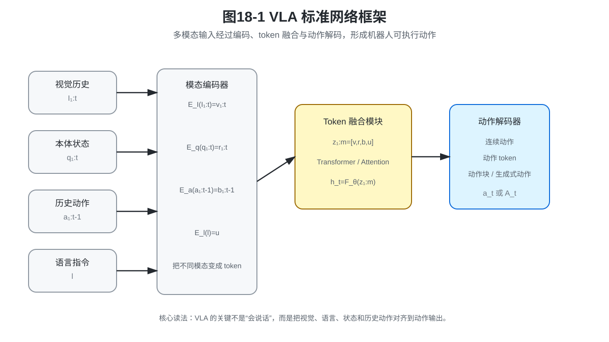
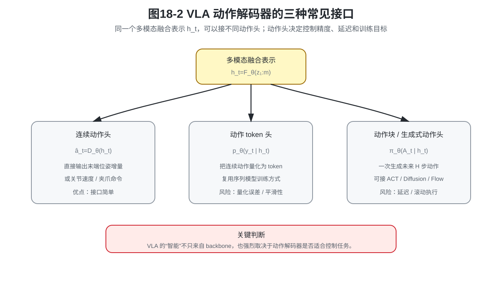
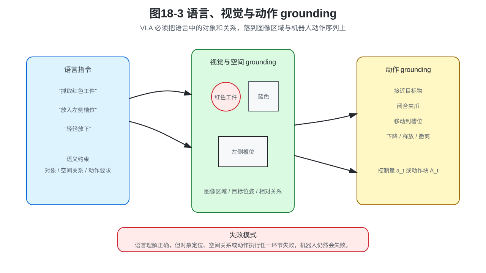
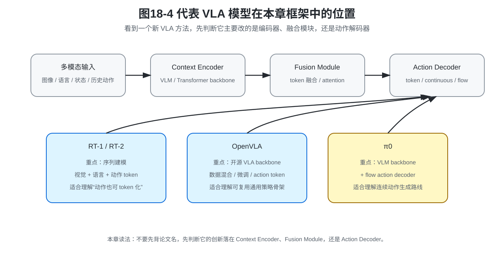
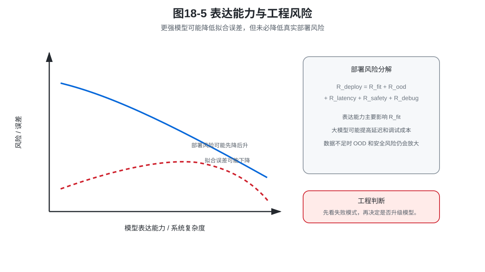

# 第18章：VLA：视觉、语言与动作的统一策略模型

> **本章位置**：本章属于 **第五篇：从历史上下文到多模态条件策略**。第17章已经把策略从“当前观测到动作”推广为“上下文到动作”，本章继续把上下文扩展为视觉、语言、本体状态和历史动作共同组成的多模态条件。

> **本章一句话导读**：VLA 不是“把大语言模型接到机械臂上”，而是把视觉、语言、机器人状态和历史动作组织成统一上下文，并在这个上下文条件下学习可执行动作分布。

第17章的主角是上下文 $c_t$。它回答的是：

```text
模型预测动作之前，允许知道什么？
```

本章继续推进一步：如果上下文里不只有历史观测和历史动作，还包括图像、语言指令、机器人本体状态、任务阶段和目标对象，策略该怎样写？

这就是 VLA，也就是 Vision-Language-Action 模型要解决的问题。

VLA 这个名字容易让人误解，好像它的关键是“模型会说话”。但对机器人策略来说，语言本身不是最终目标。真正的问题是：

```text
看到了什么？
指令要求什么？
机器人当前处在什么状态？
下一步应该怎样动？
```

本章要把这四件事写成一个统一的条件动作分布。

---

## 0. 本章要解决的核心问题

本章要解决的问题是：

> 如何把视觉、语言、本体状态和历史动作统一到一个可训练、可部署、可评估的策略模型中？

这个问题包含三层。

第一，**条件变量升级**。

```text
第17章：上下文 c_t
第18章：多模态上下文 c_t^{VLA}
```

第二，**网络框架升级**。

```text
单一观测编码器
→ 多模态编码器
→ token 融合模块
→ 动作解码器
```

第三，**动作表示升级**。

```text
连续动作
→ 动作 token
→ 动作块
→ 生成式动作分布
```

所以，本章不会把 VLA 写成“大模型万能论”。它仍然沿着本书主线讨论：VLA 到底在学习什么条件分布，它和 BC、ACT、Diffusion Policy、Flow Matching、Transformer Policy 是什么关系，它的边界在哪里。

---

## 1. 统一贯穿例子：语言指定目标的抓取与放置

考虑一个桌面操作任务。桌上有红色工件、蓝色工件、一个治具和一个料盒。机器人收到语言指令：

```text
抓取红色工件，并放入左侧治具槽位。
```

如果只看当前图像，机器人可能知道桌面上有什么，但不一定知道要抓哪个。如果只看语言，机器人知道“红色工件”和“左侧槽位”，但不知道它们在图像里的位置。如果只看本体状态，机器人知道自己关节在哪里，但不知道当前任务目标。

一个 VLA 策略至少要把下面几类信息合在一起：

```text
视觉：红色工件在哪里，左侧槽位在哪里；
语言：任务要求抓红色工件，不是蓝色工件；
本体状态：机械臂和夹爪当前在哪里；
历史动作：刚才是否已经接触、抓取或纠偏；
动作输出：下一步应该移动、闭合夹爪、放置还是恢复。
```

这说明 VLA 的本质不是“多接几个输入”，而是把多种条件对齐到同一个动作决策问题上。

---

## 2. 本章公式主线

本章公式主线可以概括为：

```text
第17章上下文条件策略
→ 多模态上下文 c_t^{VLA}
→ 多模态编码器与 token 融合
→ VLA 条件策略
→ 视觉-语言-动作 grounding
→ 连续动作、动作 token、动作块
→ VLA 监督学习目标
→ 代表 VLA 模型定位
→ 表达能力与工程部署风险
```

其中最关键的公式不是某个复杂网络结构，而是：

```text
在多模态上下文条件下预测动作。
```

---

## 3. 新数学对象定义

**定义 18.1：VLA**

VLA 指 Vision-Language-Action 模型，即在视觉观测、语言指令、机器人状态和历史上下文条件下生成机器人动作的策略模型。

VLA 与普通视觉语言模型的区别在于：它最终必须输出可执行动作，而不是只输出文本答案。

**定义 18.2：多模态上下文**

多模态上下文 $c_t^{VLA}$ 指时刻 $t$ 预测动作时可用的视觉、语言、机器人状态和历史动作信息。

**公式 (18.1)：VLA 多模态上下文**

$$c_t^{VLA}=(I_{1:t},q_{1:t},a_{1:t-1},l)$$

其中，$I_{1:t}$ 表示视觉观测历史，可以是 RGB 图像、深度图、点云或多相机输入；$q_{1:t}$ 表示机器人本体状态历史，例如关节角、末端位姿、夹爪状态；$a_{1:t-1}$ 表示历史动作；$l$ 表示语言指令。

这个定义和第17章的上下文 $c_t$ 是继承关系。第17章讨论一般上下文，本章把它具体化为多模态机器人上下文。

**定义 18.3：语言条件**

语言条件 $l$ 指用自然语言表达的任务目标、对象约束、空间关系或动作要求。语言不是低层控制量，而是告诉策略“当前任务是什么”。

**定义 18.4：动作表示**

动作表示指策略输出动作的形式。它可以是连续控制向量、离散动作 token、动作块，或者生成式动作模型中的随机变量。

**定义 18.5：grounding**

grounding 指把语言中的对象、空间关系和动作约束落实到视觉对象、空间位置和机器人动作空间中。

---

## 4. VLA 的基本数学形式

有了多模态上下文，VLA 策略可以写成：

**公式 (18.2)：VLA 条件策略**

$$\pi_\theta(a_t\mid c_t^{VLA})$$

把公式 (18.1) 展开，就是：

**公式 (18.3)：展开形式的 VLA 条件策略**

$$\pi_\theta(a_t\mid I_{1:t},q_{1:t},a_{1:t-1},l)$$

这个公式是本章的核心表达。它的含义是：策略不是只看图像，也不是只听语言，而是在视觉历史、本体状态历史、历史动作和语言指令共同作为条件时，输出当前动作。

回到桌面操作例子：

```text
I_{1:t}：相机看到红色工件、蓝色工件和治具；
q_{1:t}：机械臂和夹爪当前状态；
a_{1:t-1}：刚才是否已经抓取或纠偏；
l：抓取红色工件并放入左侧槽位；
a_t：下一步末端位姿增量、关节速度或夹爪命令。
```

这个公式也提醒我们：VLA 仍然是策略模型。它不是只做图文理解，而是要在闭环控制中产生动作。

---

## 5. VLA 标准网络框架：从多模态输入到动作输出

如果只写公式 (18.2)，读者容易知道“VLA 在拟合什么”，但不知道“网络大概长什么样”。因此本节把 VLA 拆成四步：

```text
多模态输入
→ 模态编码器
→ token 融合 / Transformer
→ 动作解码器
```



第一步，把视觉观测编码成视觉 token。

**公式 (18.4)：视觉 token 编码**

$$v_{1:t}=E_I(I_{1:t})$$

第二步，把语言指令编码成语言 token 或语言表示。

**公式 (18.5)：语言 token 编码**

$$u=E_l(l)$$

第三步，把本体状态和历史动作也编码成 token。

**公式 (18.6)：状态与动作历史编码**

$$r_{1:t}=E_q(q_{1:t}),\quad b_{1:t-1}=E_a(a_{1:t-1})$$

第四步，把不同模态的 token 拼成统一序列，并交给融合模块处理。

**公式 (18.7)：多模态 token 序列**

$$z_{1:m}=[v_{1:t},r_{1:t},b_{1:t-1},u]$$

**公式 (18.8)：多模态融合表示**

$$h_t=F_\theta(z_{1:m})$$

这里，$E_I$、$E_l$、$E_q$、$E_a$ 分别表示视觉、语言、本体状态和历史动作编码器；$F_\theta$ 表示多模态融合模块，可以是 Transformer，也可以是其他能聚合上下文的结构。

最后，动作解码器根据融合表示 $h_t$ 输出动作。

```text
如果输出连续动作，就是连续动作头；
如果输出动作 token，就是 token 解码头；
如果输出动作块，就是 ACT / Diffusion / Flow 一类动作块解码头。
```

这就是 VLA 的基本网络框架。不同论文的差异，通常体现在三个地方：视觉和语言编码器怎么选，融合模块怎么设计，动作解码器输出什么形式。

---

## 6. 视觉、语言和动作分别承担什么职责

VLA 名字里有三个字母，但三者承担的职责不同。

### 6.1 Vision：不是只识别物体，而是支持动作

视觉输入要解决的不只是“图里有什么”。对机器人来说，更关键的是：

```text
目标物在哪里；
可抓区域在哪里；
目标槽位在哪里；
物体和夹爪的相对关系是什么；
遮挡、反光、深度误差是否会影响动作。
```

如果视觉表示只知道“这是一个红色工件”，但不知道它的姿态、边缘、可抓点和治具槽位相对关系，动作头很难生成稳定控制。

### 6.2 Language：不是低层控制器，而是任务条件

语言解决的是任务表达问题。它让同一个策略可以根据指令切换目标，而不必为每个任务写一个固定 ID。

例如，“抓红色工件”和“抓蓝色工件”在同一张图像下对应不同动作。语言的作用是告诉策略应该关注哪个对象、哪个目标位置、哪类约束。

但语言不能直接替代控制器。“轻轻放下”必须落到速度、力、接触阈值和终止条件上，才可能变成可执行动作。

### 6.3 Action：不是文本答案，而是可执行控制量

VLA 最终必须输出动作。动作可以有不同表示方式：

```text
连续动作：末端位姿增量、关节速度、夹爪开合；
动作 token：把连续动作量化成离散符号；
动作块：一次输出未来 H 步动作；
生成式动作：用 diffusion 或 flow 生成动作块分布。
```

动作表示决定了训练目标、控制精度、部署延迟和安全约束。VLA 的难点不只是理解语言，而是把语言和视觉 grounding 到动作空间。

---

## 7. 动作表示：连续动作、动作 token 与动作块

VLA 可以使用不同动作头。这里保留三种最重要的接口。



### 7.1 连续动作头

最直接的形式是输出连续动作。

**公式 (18.9)：连续动作 VLA**

$$\hat a_t=D_\theta(h_t)$$

这种形式简单、控制接口直接，适合低维连续控制。但它仍然会遇到第5章讨论过的多峰均值问题：如果同一个上下文下有多种合理动作，单一连续回归可能把多种动作平均成一个不合理动作。

### 7.2 动作 token 头

另一种形式是先把动作离散化，再预测动作 token。

**公式 (18.10)：动作 token 条件分布**

$$p_\theta(y_t\mid h_t)$$

其中，$y_t$ 是动作 token，可以表示一个动作维度、一个动作片段，或一组量化后的控制符号。

动作 token 的好处是可以复用语言模型式的序列预测框架；代价是必须处理量化误差、token 词表大小、连续控制精度和安全边界。

### 7.3 动作块头

第三种形式是输出动作块。

**公式 (18.11)：VLA 动作块策略**

$$\pi_\theta(A_t\mid h_t)$$

其中，$A_t$ 沿用第4章的动作块定义。动作块适合短时连续性强的任务，例如抓取后移动、插入前微调、放置前对齐。

这个形式可以和 ACT、Diffusion Policy、Flow Matching 结合。也就是说，VLA 负责提供多模态上下文，动作头负责决定如何生成动作。

---

## 8. 命题 18.1：VLA 仍然是多模态上下文上的条件 BC

> **命题 18.1：VLA 的监督学习视角**
>
> 如果训练数据提供多模态上下文和专家动作对 $(c_t^{VLA},a_t)$，那么 VLA 的监督训练可以看成多模态上下文上的条件行为克隆。

**证明**

第一步，第17章已经把策略写成上下文条件策略。VLA 只是把一般上下文 $c_t$ 具体化为多模态上下文 $c_t^{VLA}$。

第二步，训练数据中的动作 $a_t$ 仍然是监督信号。无论模型内部使用视觉编码器、语言编码器、Transformer、动作 token 还是 diffusion head，训练时仍然是在数据样本上提高专家动作的条件概率，或降低动作预测误差。

第三步，因此可以写成统一的负对数似然目标。

**公式 (18.12)：VLA 监督学习目标**

$$\mathcal{L}_{VLA}(\theta)=-\mathbb{E}_{(c_t^{VLA},a_t)\sim\mathcal{D}}[\log p_\theta(a_t\mid c_t^{VLA})]$$

连续动作时，公式 (18.12) 可以落到第2章和第5章已经讨论过的高斯 NLL 或 MSE；动作 token 时，它可以落到交叉熵；动作块或生成式动作头时，它可以落到第4章和第四篇已经介绍过的动作块分布学习。

所以，VLA 的数学底座并没有脱离模仿学习。它的升级点是条件变量更丰富，网络框架更复杂，动作表示更灵活。

**工程含义**

VLA 不会凭空补足数据里没有的失败模式。如果训练数据没有包含“遮挡后恢复”“抓偏后重试”“放置前接触纠偏”等轨迹，模型即使能理解语言，也未必能在真实环境中可靠恢复。

---

## 9. grounding：语言、视觉和动作必须对齐

VLA 的核心难点之一是 grounding，也就是把语言中的对象、空间关系和动作约束落实到视觉和控制空间。



“把红色工件放入左侧槽位”这句话至少包含三个对齐问题：

```text
对象 grounding：红色工件对应图像中的哪个区域；
空间 grounding：左侧槽位对应哪个目标位置；
动作 grounding：放入意味着接近、对齐、下降、释放和撤离。
```

如果模型只在语言层面知道“红色”和“左侧”，但无法把它们映射到图像中的具体对象和机器人动作，它仍然不是可靠策略。

因此，VLA 的评估不能只看语言理解，也要看闭环动作结果。更具体地说，要看：

```text
是否选对对象；
是否到达目标空间关系；
是否动作平滑且安全；
是否能在轻微偏差后恢复；
是否满足控制频率和约束。
```

---

## 10. 训练上下文和部署上下文仍然不一致

VLA 很容易给人一种错觉：既然模型能看图、听指令、结合历史，就应该不会再出现 BC 式分布偏移。

这个判断不成立。

训练时，模型看到的上下文来自数据轨迹。部署时，模型看到的上下文来自自己闭环执行后的世界。早期动作如果有偏差，后续图像、本体状态和历史动作都会被这个偏差影响。

可以直观写成：

```text
训练时：上下文来自数据轨迹；
部署时：上下文来自模型自己的闭环执行。
```

这说明 VLA 继承了模仿学习的基本风险：离线训练分布和真实部署分布不一致。

放到机械臂抓取任务中，训练数据里的夹爪可能总是准确对准工件；但实机部署时，如果第一步接近角度偏了一点，后续图像里工件、夹爪和目标槽位的相对关系都会变化。VLA 如果没有见过这种恢复轨迹，仍然可能失败。

---

## 11. Policy = Context Encoder + Action Decoder

面对 BC、ACT、Diffusion Policy、Flow Matching、Decision Transformer、Transformer Policy 和 VLA，最容易混乱的地方是：这些名字有的在讲动作生成，有的在讲上下文建模。

为了避免混淆，可以把完整策略拆成两个部分。

**定义 18.6：Context Encoder**

Context Encoder 指负责把视觉、语言、本体状态、历史动作和任务条件编码成上下文表示的模块。它回答的是：

```text
策略依据什么信息判断？
```

**定义 18.7：Action Decoder**

Action Decoder 指负责把上下文表示解码成动作、动作 token、动作块或动作分布的模块。它回答的是：

```text
策略用什么形式生成动作？
```

**公式 (18.13)：策略架构拆解**

$$\pi_\theta=\psi_\theta\circ\phi_\theta$$

其中，$\phi_\theta$ 表示 Context Encoder，$\psi_\theta$ 表示 Action Decoder。

这个拆解非常重要。因为很多方法不是互斥关系：

```text
VLA 可以用 Transformer 做 Context Encoder；
VLA 可以用 ACT 输出动作块；
VLA 可以用 Diffusion 或 Flow 作为生成式动作头；
Transformer Policy 也可以接连续动作头或动作 token 头。
```

因此，选架构时要先区分两个问题：

```text
上下文怎么建模？
动作怎么生成？
```

---

## 12. 代表 VLA 模型在本章框架中的位置

本章不是论文综述，但需要让读者知道：现代 VLA 工作大致落在同一张框架图里，只是选择了不同的编码器、融合方式和动作解码器。



可以粗略分成三条路线。

**第一条路线：Transformer policy + 离散动作 token。**

RT-1 / RT-2 一类工作强调把机器人控制写成序列建模问题，把视觉、语言和动作放入类似 Transformer 的策略框架中。其直觉是：如果动作也可以 token 化，就可以复用大规模序列模型的训练方式。

这条路线的优点是接口统一，和语言模型式训练兼容。代价是动作量化会带来精度、平滑性和控制频率问题。

**第二条路线：开源 VLA backbone + action token。**

OpenVLA 一类工作更强调开源、可微调和跨任务泛化。它可以放在本章框架中的“视觉 / 语言 backbone + action token decoder”位置。

这条路线适合读者理解：VLA 不只是网络结构问题，也是数据规模、开放训练、微调效率和部署成本问题。

**第三条路线：VLM backbone + 连续生成式动作头。**

π0 一类工作更强调把 VLM backbone 和连续动作生成结合起来，用 flow / diffusion 类动作头输出更适合机器人控制的动作序列。

这条路线提醒我们：VLA 的动作头不必局限于离散 token。对于高频连续控制，连续动作块和生成式动作头可能更自然。

所以，本章的统一框架可以这样理解：

```text
RT-1 / RT-2：重点看序列建模和动作 token；
OpenVLA：重点看开源 VLA backbone、数据混合和微调；
π0：重点看 VLM backbone 与 flow action decoder 的结合。
```

这里不要求读者记住每篇论文的细节。更重要的是：看到一个新 VLA 方法时，先判断它改的是 Context Encoder、Fusion Module，还是 Action Decoder。

---

## 13. 工程选型：什么时候值得上 VLA

VLA 适合的问题不是“所有机器人任务”。它更适合下面这些场景：

- 同一环境中存在多个可操作对象；
- 任务目标需要通过语言切换；
- 数据中有足够的视觉、语言、动作配对样本；
- 任务需要一定语义泛化；
- 系统允许更复杂模型，并有安全外壳兜底。

如果任务是固定工件、固定槽位、固定节拍，传统视觉定位加控制器可能更稳定、更便宜、更容易调试。此时 VLA 未必是性价比最高的方案。

一个实用判断表如下。

| 任务特征 | 优先 baseline | 可能升级方向 | 主要风险 |
|---|---|---|---|
| 单峰动作、低维控制 | BC / 小模型策略 | 加历史窗口 | 分布偏移 |
| 短时连续动作强 | ACT / 动作块 | temporal ensemble | 滞后、动作重叠 |
| 多峰动作明显 | Diffusion / Flow | 条件生成式动作块 | 推理延迟、数据需求 |
| 任务阶段依赖历史 | Transformer Policy | causal policy | 上下文过长、未来泄漏 |
| 长历史且低延迟 | RNN / SSM / Mamba | 与动作头组合 | 表达能力和训练稳定性 |
| 语言指定目标 | VLA | action token / diffusion head | grounding、数据混合、安全 |
| 工业高精度固定任务 | 传统视觉 + 控制 | 局部学习残差策略 | 大模型性价比低 |

这张表不是标准答案，而是工程起点。真正选型时，还要看数据量、控制频率、硬件算力、失败成本和团队调试能力。

---

## 14. 命题 18.2：更强表达能力不等于更好工程方案

> **命题 18.2：表达能力与工程可用性不等价**
>
> 一个策略架构能表达更复杂的条件分布，并不意味着它在具体机器人任务中一定更安全、更稳定或更划算。

**证明思路**

设有两个策略模型类 $\Pi_1$ 和 $\Pi_2$，且 $\Pi_1\subset\Pi_2$。这表示复杂模型类 $\Pi_2$ 至少包含简单模型类 $\Pi_1$ 能表达的策略。

如果只看训练集拟合误差，复杂模型类可能达到不差于简单模型类的最优拟合效果。但真实部署风险不只包含拟合误差，还包含分布外风险、延迟风险、安全风险和调试维护风险。

**公式 (18.14)：部署风险分解**

$$R_{deploy}=R_{fit}+R_{ood}+R_{latency}+R_{safety}+R_{debug}$$

复杂模型可能降低 $R_{fit}$，但同时提高 $R_{latency}$、$R_{debug}$ 或 $R_{safety}$。如果数据覆盖不足，复杂模型在分布外状态中的动作甚至可能更难预测。

因此，即使 $\Pi_2$ 表达能力更强，总体部署风险 $R_{deploy}$ 也不一定更低。



**工程含义**

工程选型不能只看模型名词，也不能只看离线 loss。更合理的流程是：先用简单 baseline 证明任务可学，再根据失败模式决定升级 Context Encoder、Action Decoder、动作表示、历史建模或安全外壳。

---

## 15. VLA 的适用边界与常见误区

**误区一：VLA 等于 VLM 加机械臂。**

不准确。VLM 主要输出语言或语义结果，VLA 最终必须输出可执行动作，并在闭环控制中承担后果。

**误区二：语言理解好，动作就一定好。**

不一定。语言理解只是任务条件解析，动作还需要视觉定位、状态估计、控制精度、安全约束和闭环恢复。

**误区三：多任务数据越多越好。**

不一定。不同机器人、不同动作空间、不同相机布局和不同任务节奏混在一起，会造成动作分布冲突。数据混合需要统一标注、动作表示、质量筛选和评测协议。

**误区四：VLA 可以直接裸奔控制电机。**

真实系统通常仍然需要动作限幅、碰撞检测、工作空间约束、低层控制器、fallback 策略、人类接管和日志回放。

**误区五：VLA 自动解决分布偏移。**

不成立。训练时来自数据轨迹，部署时来自模型自己的闭环执行。这个差异仍然存在。

---

## 16. 与上一章和下一篇的关系

与第17章的关系：

```text
第17章：上下文条件策略
第18章：多模态上下文条件策略
```

与第四篇的关系：

```text
第四篇讲动作如何生成；
第18章讲视觉、语言、状态和历史如何成为动作生成条件。
```

与第六篇的关系：

```text
VLA 能根据当前多模态上下文输出动作；
但它未必知道动作之后世界会怎样变化。
```

这会自然引出第六篇：从动作模仿到世界预测。机器人如果只会根据上下文模仿动作，还不够；它还需要预测动作后果、评估风险和处理计划失败。

---

## 17. 读完本章，你应该能判断什么？

读完本章后，应该能判断以下问题。

1. 一个任务是否真的需要语言条件，还是固定任务 ID 已经足够。
2. VLA 的视觉输入是否支持动作，而不只是支持分类或描述。
3. 语言是否已经 grounding 到对象、空间关系和动作约束。
4. 当前 VLA 方法改的是 Context Encoder、Fusion Module，还是 Action Decoder。
5. 动作应该用连续向量、动作 token、动作块，还是生成式动作头表示。
6. 训练上下文和部署上下文是否一致。
7. 当前失败更应该升级 Context Encoder，还是升级 Action Decoder。
8. VLA 的收益是否足以抵消数据、延迟、安全和调试成本。

---

## 18. 实践提示

做 VLA 相关实验时，不建议一开始就把所有复杂组件堆上去。更稳妥的顺序是：

```text
固定任务小模型 baseline；
加入历史窗口；
加入语言条件；
验证语言 grounding；
比较连续动作、动作块和动作 token；
再考虑生成式动作头或大模型 backbone。
```

每一步都要做闭环评估，而不是只看离线 loss。

对工程系统，还要记录：

```text
语言指令是否覆盖训练分布；
图像和动作是否时间对齐；
不同机器人动作空间是否统一；
动作输出是否经过限幅和安全检查；
失败是否能回放成 recovery data；
模型推理是否满足控制周期。
```

---

## 19. 本章公式索引

### 公式 (18.1)：VLA 多模态上下文

$$c_t^{VLA}=(I_{1:t},q_{1:t},a_{1:t-1},l)$$

### 公式 (18.2)：VLA 条件策略

$$\pi_\theta(a_t\mid c_t^{VLA})$$

### 公式 (18.3)：展开形式的 VLA 条件策略

$$\pi_\theta(a_t\mid I_{1:t},q_{1:t},a_{1:t-1},l)$$

### 公式 (18.4)：视觉 token 编码

$$v_{1:t}=E_I(I_{1:t})$$

### 公式 (18.5)：语言 token 编码

$$u=E_l(l)$$

### 公式 (18.6)：状态与动作历史编码

$$r_{1:t}=E_q(q_{1:t}),\quad b_{1:t-1}=E_a(a_{1:t-1})$$

### 公式 (18.7)：多模态 token 序列

$$z_{1:m}=[v_{1:t},r_{1:t},b_{1:t-1},u]$$

### 公式 (18.8)：多模态融合表示

$$h_t=F_\theta(z_{1:m})$$

### 公式 (18.9)：连续动作 VLA

$$\hat a_t=D_\theta(h_t)$$

### 公式 (18.10)：动作 token 条件分布

$$p_\theta(y_t\mid h_t)$$

### 公式 (18.11)：VLA 动作块策略

$$\pi_\theta(A_t\mid h_t)$$

### 公式 (18.12)：VLA 监督学习目标

$$\mathcal{L}_{VLA}(\theta)=-\mathbb{E}_{(c_t^{VLA},a_t)\sim\mathcal{D}}[\log p_\theta(a_t\mid c_t^{VLA})]$$

### 公式 (18.13)：策略架构拆解

$$\pi_\theta=\psi_\theta\circ\phi_\theta$$

### 公式 (18.14)：部署风险分解

$$R_{deploy}=R_{fit}+R_{ood}+R_{latency}+R_{safety}+R_{debug}$$

---

## 20. 本章定义索引

**定义 18.1：VLA**

VLA 指在视觉观测、语言指令、机器人状态和历史上下文条件下生成机器人动作的策略模型。

**定义 18.2：多模态上下文**

多模态上下文 $c_t^{VLA}$ 指预测动作时可用的视觉、语言、机器人状态和历史动作信息。

**定义 18.3：语言条件**

语言条件 $l$ 指用自然语言表达的任务目标、对象约束、空间关系或动作要求。

**定义 18.4：动作表示**

动作表示指策略输出动作的形式，包括连续动作、动作 token、动作块或生成式动作分布。

**定义 18.5：grounding**

grounding 指把语言中的对象、空间关系和动作约束落实到视觉对象、空间位置和机器人动作空间中。

**定义 18.6：Context Encoder**

Context Encoder 指负责把视觉、语言、本体状态、历史动作和任务条件编码成上下文表示的模块。

**定义 18.7：Action Decoder**

Action Decoder 指负责把上下文表示解码成动作、动作 token、动作块或动作分布的模块。

---

## 21. 思考题

1. 为什么说语言是任务条件，而不是低层控制器？
2. 如果 VLA 用动作 token 表示连续动作，量化太粗和太细分别会带来什么问题？
3. 在工业装配或治具放置任务中，VLA 的语义泛化和控制精度分别可能卡在哪里？
4. 如果训练集中从未出现遮挡后的恢复轨迹，VLA 在实机中可能怎样失败？
5. 当前策略失败时，你如何判断应该升级 Context Encoder，还是升级 Action Decoder？
6. 为什么 Transformer Policy 和 Diffusion Policy 可以组合，而不是互相替代？
7. 如果离线 loss 降低但实机失败增多，可能是哪一类部署风险变大了？
8. 看到一个新的 VLA 方法时，你如何判断它主要改进的是编码器、融合模块还是动作头？

---

## 22. 配图清单

- **图18-1 VLA 标准网络框架**：展示视觉、语言、本体状态和历史动作如何经过编码、融合和动作解码，形成机器人动作。
- **图18-2 VLA 动作解码器接口**：对比连续动作头、动作 token 头和动作块 / 生成式动作头。
- **图18-3 语言、视觉与动作 grounding**：展示语言对象、图像区域、空间关系和动作序列之间的对齐关系。
- **图18-4 代表 VLA 模型定位**：把 RT-1 / RT-2、OpenVLA、π0 放到 Context Encoder / Action Decoder 框架里。
- **图18-5 表达能力与工程风险**：说明复杂模型不一定带来更低工程风险。

---

## 23. 推荐阅读：重点看什么

- **RT-1 / RT-2 系列工作**：重点看如何把视觉、语言和动作组织成可训练的机器人策略，以及动作 token 化如何进入序列建模。
- **OpenVLA**：重点看开源 VLA backbone、机器人数据混合、微调效率和 action token 的工程边界。
- **π0**：重点看 VLM backbone 和 flow action decoder 如何结合，以及连续动作生成为什么适合高频机器人控制。
- **Diffusion Policy 与 Flow Matching 相关工作**：重点看 VLA 的动作头如何和生成式动作建模结合。
- **机器人系统部署论文或工程报告**：重点看安全外壳、fallback、控制频率、延迟和日志回放。
- **附录 C、D、F、H**：分别用于复习 NLL / CE、连续动作 MSE、序列决策基础和多模态数据组织。
