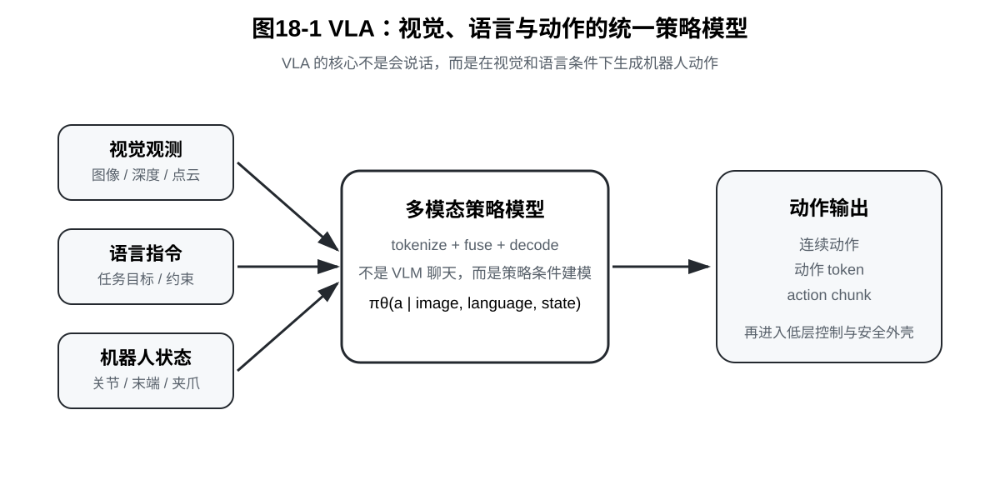
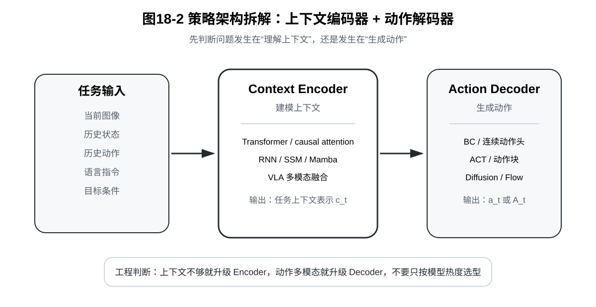
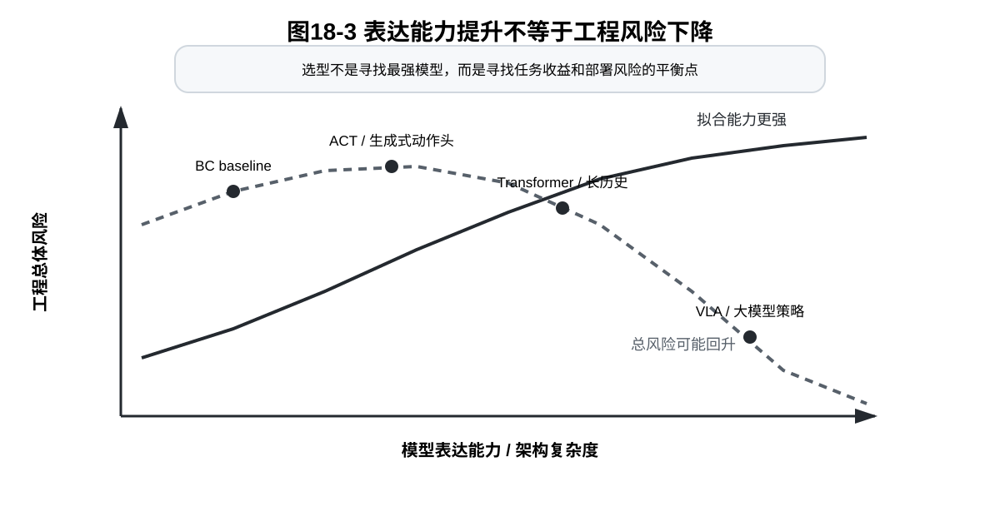

# 第18章：VLA：视觉、语言与动作的统一策略模型

> **新版布局位置**：本章属于 **第五篇：长序列架构与多模态策略**。第17章已经把 Decision Transformer、Transformer Policy 和 SSM / Mamba 收束为“序列策略模型”，本章进一步讨论视觉、语言和动作如何进入统一策略模型，并把原第19章“架构选择总结”的核心内容合并为本章第7节。

> **本章一句话导读**：VLA 不是“把大语言模型接到机械臂上”，而是在视觉观测、语言指令、本体状态和历史上下文条件下学习动作分布的多模态策略模型。

第17章已经回答了一个问题：策略为什么可以写成条件序列模型。

本章继续追问：如果条件不只是历史观测和历史动作，而是同时包含图像、语言、机器人状态和任务上下文，策略应该如何建模？这就是 VLA，也就是 Vision-Language-Action 模型要讨论的问题。

VLA 听起来很像机器人领域的豪华套餐：视觉负责看，语言负责懂，动作负责干。但本章要先把热闹降温：VLA 的核心不是模型会聊天，而是它能否把“看到了什么”“指令要求什么”“机器人下一步该怎么动”这三件事统一进一个可训练、可部署、可评估的策略模型。

---

## 0. 本章一句话导读

本章建立的核心判断是：

> VLA 的数学底座仍然是条件策略，只是条件变量从单一观测扩展为视觉、语言、本体状态和历史动作，动作输出也可能从连续向量扩展为动作 token、动作块或生成式动作分布。

**定义 18.1：VLA**

VLA 指 Vision-Language-Action 模型，即在视觉观测和语言指令条件下生成机器人动作的策略模型。

更具体地说，VLA 不是只输出语言回答的视觉语言模型，而是把视觉、语言、本体状态和历史上下文共同作为条件，最终输出可执行动作、动作块、动作 token 或动作分布。

放到视觉引导机械臂抓取与放置任务中，VLA 对应的是：机器人看到桌面、槽位和工件，接收“抓取红色工件并放入左侧槽位”这类指令，同时结合自身关节状态和历史动作，生成下一步控制量。

因此，本章不会把 VLA 写成玄学，也不会把它写成“大模型万能论”。我们围绕五个问题展开：

1. VLA 到底在建模什么条件分布？
2. 视觉、语言和机器人状态如何进入策略？
3. 动作如何表示和解码？
4. VLA 在真实机器人系统中有哪些边界？
5. 面对 BC、ACT、Diffusion、Flow、Transformer Policy 和 VLA，工程上如何做架构选择？

---

## 本章公式主线

本章公式主线如下：

```text
单观测条件策略 pi_theta(a_t | o_t)
→ 目标条件策略 pi_theta(a_t | o_t, g)
→ 语言条件策略 pi_theta(a_t | o_t, l)
→ VLA 多模态条件策略 pi_theta(a_t | I_{1:t}, q_{1:t}, a_{1:t-1}, l)
→ 动作块、动作 token 与生成式动作头
→ VLA 仍然是条件动作分布学习
→ Policy = Context Encoder + Action Decoder
→ 架构选择不能只看表达能力，还要看数据、延迟、安全和调试成本
```

它解决的问题是：如何把视觉、语言和动作统一到一个策略建模框架中。

它留下的问题是：即使策略能看图、听指令、输出动作，真实机器人仍然需要世界理解、后果预测、慢思考规划和快执行控制。这会自然引出第六篇的世界模型与快慢系统。

---

## 1. 从目标条件策略到语言条件策略

前面章节中，策略最朴素的写法是：给定当前观测，输出当前动作。

**公式 (18.1)：单观测条件策略**

$$\pi_\theta(a_t \mid o_t)$$

这个公式读作：在当前观测 $o_t$ 的条件下，策略 $\pi_\theta$ 产生动作 $a_t$。

其中：

- $o_t$：当前观测，可以是图像、本体状态或它们的组合；
- $a_t$：当前动作，例如末端位姿增量、关节速度或夹爪开合；
- $\theta$：策略模型参数。

但在多任务机器人中，只有观测往往不够。桌面上同样有红杯子、蓝杯子和盘子时，当前图像并不能告诉机器人到底应该“拿红杯子”还是“把蓝杯子放进盘子”。因此需要加入任务条件 $g$。

**公式 (18.2)：目标条件策略**

$$\pi_\theta(a_t \mid o_t, g)$$

这里的目标条件 $g$ 可以有很多形式：任务 ID、目标图像、目标位姿、期望回报，也可以是一句自然语言。

**定义 18.2：语言条件策略**

语言条件策略指把自然语言指令作为任务条件的策略。语言不直接等价于电机控制量，而是告诉策略“当前任务是什么、目标对象是什么、动作约束是什么”。

当目标条件由语言指令 $l$ 表示时，策略可以写成：

**公式 (18.3)：语言条件策略**

$$\pi_\theta(a_t \mid o_t, l)$$

这就是 VLA 的入口：语言不是低层控制器，而是任务条件。

例如语言指令“把红色杯子放到盘子里”至少包含三层信息：

- **对象选择**：红色杯子是哪一个？
- **空间关系**：盘子在哪里？“放到里面”是什么意思？
- **动作约束**：需要抓取、移动、释放，而不是推开或撞开。

如果模型只理解文字，却不能把文字 grounding 到图像和动作，它仍然不能成为可靠机器人策略。

---

## 2. VLA 的基本数学形式

真实 VLA 策略通常不只看当前一帧图像。它可能接收视觉历史、机器人本体状态历史、历史动作和语言指令。

**定义 18.3：多模态上下文**

多模态上下文指由视觉观测、机器人本体状态、历史动作和语言指令组成的条件信息集合。它不是一个新的动作模型，而是把“策略需要依据什么信息做决策”明确写成一个条件变量。

在本章后面，我们会把它记为 $c_t^{\mathrm{VLA}}$。

一种较一般的 VLA 策略写法是：

**公式 (18.4)：VLA 条件策略**

$$\pi_\theta(a_t \mid I_{1:t}, q_{1:t}, a_{1:t-1}, l)$$

这里的符号含义如下。

- $I_{1:t}$ 表示视觉观测历史，可以是 RGB 图像、深度图、点云或多相机输入。
- $q_{1:t}$ 表示机器人本体状态历史，例如关节角、末端位姿、夹爪状态等。
- $a_{1:t-1}$ 表示历史动作。
- $l$ 表示语言指令。
- $a_t$ 表示当前动作。

这个公式读作：在视觉历史、本体状态历史、历史动作和语言指令共同作为条件时，策略输出当前动作。

放到视觉引导机械臂抓取与放置任务中，$I_{1:t}$ 对应相机看到的工件和槽位，$q_{1:t}$ 对应机械臂姿态与夹爪状态，$l$ 对应“抓取红色工件并放入左侧槽位”这类任务描述，$a_t$ 对应下一步控制量。

如果模型一次输出未来一段动作，可以写成：

**公式 (18.5)：VLA 动作块策略**

$$\pi_\theta(A_t \mid I_{1:t}, q_{1:t}, a_{1:t-1}, l),\quad A_t=(a_t,a_{t+1},\dots,a_{t+H-1})$$

这里的 $A_t$ 是长度为 $H$ 的动作块。这个形式和第13章 ACT、第四篇动作块建模直接相连。

如果动作被离散化成 token，则可以写成：

**公式 (18.6)：动作 token 条件分布**

$$p_\theta(y_{t,1:M} \mid I_{1:t}, q_{1:t}, y_{1:t-1}, l)$$

其中，$y_{t,1:M}$ 表示当前时刻动作对应的一串离散 token，$y_{1:t-1}$ 表示当前时刻之前已经生成或已经观测到的动作 token 历史。动作 token 化的好处是可以复用语言模型式的序列预测框架；代价是连续控制精度、量化误差和安全边界都需要额外处理。



---

## 3. 视觉、语言和动作分别解决什么问题

VLA 名字里有三个字母，但它们承担的任务并不一样。

### 3.1 Vision：不是只看见，而是定位可行动对象

视觉输入要解决的是环境感知问题。对于机器人操作，视觉不只是分类“这里有一个杯子”，而是要支持动作：

- 物体在哪里？
- 抓取点在哪里？
- 目标容器在哪里？
- 是否被遮挡？
- 手眼标定、深度误差、光照变化是否影响控制？

因此，VLA 中的视觉表示必须最终服务于动作，而不是只服务于图文匹配。

在机械臂抓取与放置任务中，如果视觉表示只知道“这里有一个轴承套”，但不知道它的姿态、边缘、可抓区域和目标槽位相对关系，那么后续动作头很难生成稳定控制量。

### 3.2 Language：不是控制命令，而是任务条件

语言输入解决的是任务表达问题。它让同一个机器人系统可以通过自然语言切换任务，而不是为每个任务写一个固定 ID。

但语言不能直接替代低层控制。例如“轻轻放下”这句话需要被转化为速度、力、路径和终止条件。语言提供语义约束，动作策略负责把约束落到控制空间。

一个常见误解是：语言模型越强，低层动作就越可靠。实际上，语言强通常提升的是任务表达和语义泛化，不能自动带来毫米级定位、接触稳定性和力控安全性。

### 3.3 Action：不是说出计划，而是能执行的控制量

VLA 最后必须输出动作。动作可以是：

- 末端位姿增量；
- 关节速度或关节位置；
- 夹爪开合；
- 高层 skill；
- 动作 token；
- 未来一段 action chunk。

如果模型只能输出文字计划，而不能输出可执行动作，它更像 VLM 规划器，不是完整 VLA 策略。

---

## 4. 动作表示是 VLA 的核心难点

很多 VLA 讨论容易强调视觉语言预训练，却低估动作表示的重要性。对机器人来说，动作空间不是自然语言词表。

### 4.1 连续动作头

连续动作头直接输出控制向量。

**公式 (18.7)：连续动作 VLA**

$$\hat{a}_t = f_\theta(I_{1:t}, q_{1:t}, a_{1:t-1}, l)$$

这个公式读作：模型 $f_\theta$ 接收视觉、本体状态、历史动作和语言指令，直接回归一个动作预测值 $\hat{a}_t$。

优点是简单直接，适合连续控制。缺点是如果同一语言和视觉条件下存在多种合理动作，MSE 回归可能产生平均动作。

### 4.2 动作 token

**定义 18.4：动作 token**

动作 token 指将连续动作或动作片段离散化后得到的符号表示。它的作用是把连续动作预测改写成序列 token 预测，使动作生成可以复用语言模型式的条件序列建模框架。

动作 token 先把连续动作离散化，再让模型预测 token。

**公式 (18.8)：动作量化**

$$a_t \rightarrow y_t$$

对应训练目标可以写成：

**公式 (18.9)：动作 token 负对数似然**

$$\mathcal{L}_{\mathrm{token}}(\theta) = -\sum_{t=1}^{T}\log p_\theta(y_t \mid I_{1:t}, q_{1:t}, y_{1:t-1}, l)$$

这个公式读作：让模型在多模态上下文和动作 token 历史条件下，最大化专家动作 token 的概率；等价地，最小化专家动作 token 的负对数似然。

这种形式适合和语言模型结构结合，但动作精度依赖量化设计。量化太粗会影响控制精度，量化太细会增加 token 序列长度和学习难度。

### 4.3 动作块

动作块让模型一次输出一段未来动作。

**公式 (18.10)：VLA 动作块预测**

$$\hat{A}_t = f_\theta(I_{1:t}, q_{1:t}, a_{1:t-1}, l)$$

它可以降低高频控制压力，并让模型表达短期意图。但动作块太长会降低闭环反应速度，太短又可能退化成单步控制。

### 4.4 生成式动作头

VLA 也可以和 Diffusion Policy 或 Flow Matching 结合。此时视觉语言模型提供条件表示，动作头通过生成式模型输出动作分布或动作块。

这一点说明：VLA 并不是替代第四篇的动作生成方法，而是把第四篇的动作建模方法放进更强的多模态条件中。

---

## 5. 命题 18.1：VLA 仍然是条件模仿学习

> **命题 18.1：VLA 的条件模仿学习视角**
>
> 如果训练数据由视觉、语言、本体状态和动作组成，那么 VLA 的监督训练可以看成在多模态上下文上的条件动作分布学习。

**假设。**

训练数据由多条专家或高质量机器人轨迹组成。每个时间步包含视觉历史、本体状态历史、历史动作、语言指令和专家动作：

```text
(I_{1:t}, q_{1:t}, a_{1:t-1}, l, a_t)
```

其中，$a_t$ 是数据中记录下来的动作监督信号。

**证明。**

首先，把除当前动作之外的所有条件信息合并成多模态上下文。

**公式 (18.11)：VLA 多模态上下文**

$$c_t^{\mathrm{VLA}} = (I_{1:t}, q_{1:t}, a_{1:t-1}, l)$$

在这个记号下，VLA 策略的学习对象可以写成：

**公式 (18.12)：VLA 条件动作分布**

$$p_\theta(a_t \mid c_t^{\mathrm{VLA}}) \approx p_{\mathrm{data}}(a_t \mid c_t^{\mathrm{VLA}})$$

这句话的含义是：模型不是在无条件生成动作，而是在给定多模态上下文时，拟合数据中动作的条件分布。

如果使用最大似然训练，可以写成：

**公式 (18.13)：VLA 监督学习目标**

$$\mathcal{L}_{\mathrm{VLA}}(\theta) = -\sum_{t=1}^{T}\log p_\theta(a_t \mid c_t^{\mathrm{VLA}})$$

这个目标和普通 BC 的结构相同：普通 BC 在观测 $o_t$ 条件下拟合动作，VLA 则在多模态上下文 $c_t^{\mathrm{VLA}}$ 条件下拟合动作。二者的区别不是“是否仍然是模仿学习”，而是条件变量从单一观测扩展成了视觉、语言、本体状态和历史动作。

当动作是连续向量且假设固定方差高斯输出时，公式 (18.13) 可以退化为动作回归损失；当动作被离散化成 token 时，它就是动作 token 的交叉熵或负对数似然。

因此，VLA 的监督训练仍然是在学习数据分布下的条件动作分布。命题成立。

**工程含义。**

VLA 的强项是把多模态条件组织起来，不是凭空补足训练数据没有覆盖的闭环失败模式。如果训练数据没有包含“红杯子被遮挡后如何恢复”的轨迹，模型未必能在真实环境中可靠处理这种情况。它仍然需要数据覆盖、失败回放、安全外壳和后训练机制。

### 5.1 训练时上下文与推理时上下文并不相同

命题 18.1 还有一个容易被忽略的后果：训练时的上下文和部署时的上下文来源不同。

训练阶段，模型看到的上下文通常来自数据轨迹，可以记作 $c_t^{\mathrm{data}}$。这个上下文中包含的图像、本体状态和历史动作，都是专家或高质量策略在数据采集过程中留下来的。

部署阶段，机器人执行的是当前模型 $\pi_\theta$。此时下一帧图像、下一帧本体状态和后续历史动作，都会被模型自己的动作影响，可以记作 $c_t^{\pi_\theta}$。

于是，训练和部署之间存在如下差别：

```text
训练时：模型在数据轨迹上下文 c_t^{data} 上学习动作。
部署时：模型在自己闭环执行诱导出的上下文 c_t^{pi_theta} 上选择动作。
```

这正是 VLA 仍然会遇到分布偏移的原因。即使语言和视觉条件更丰富，只要早期动作产生偏差，后续图像、本体状态和历史动作都会跟着偏，模型面对的上下文就可能偏离训练数据。

放到机械臂抓取与放置任务中，训练数据里夹爪可能总是准确对准工件；但实机部署时，如果第一步接近角度偏了一点，后续图像中工件、夹爪和目标槽位的相对关系都会发生变化。VLA 如果没有见过这种恢复轨迹，仍然可能失败。

---

## 6. VLA 的工程边界

VLA 很强，但它不是万能方案。尤其在工业机器人和真实部署中，需要明确边界。

### 6.1 语义泛化不等于控制精度

模型理解“把红杯子放进盘子里”，并不等于它能以毫米级精度完成放置。工业任务常常需要高精度定位、力控、碰撞检测和安全外壳。

### 6.2 多任务数据混合会引入冲突

VLA 常依赖多任务数据训练。问题是不同机器人、不同动作空间、不同相机布局、不同任务节奏会让动作分布彼此冲突。数据混合不是简单相加，而需要统一动作表示、任务标注、质量筛选和评测协议。

### 6.3 闭环失败仍然存在

VLA 仍然会遇到分布偏移。训练时看到的是数据轨迹，部署时看到的是自己动作诱导出来的新状态。如果早期动作偏了，后续视觉和状态上下文也会偏。

### 6.4 真实系统需要安全外壳

VLA 输出动作后，通常不能直接裸奔到电机。真实系统仍然需要：

- 动作限幅；
- 碰撞检测；
- 工作空间约束；
- 低层控制器；
- fallback 策略；
- 人类接管和日志回放。

这也是第七篇和第八篇要继续讨论的问题。

---

## 7. 架构选择：从动作生成到多模态策略

原第19章的内容更适合作为本章的收束节，而不是独立成章。原因是：它不再引入新的数学对象，而是在 VLA 之后回答一个工程问题：面对多种策略架构，应该如何选型？

### 7.1 先区分两个问题：动作怎么生成，上下文怎么建模

很多策略架构看起来混在一起，是因为它们其实回答的是两个不同问题。

第一个问题是：**动作怎么生成？**

这对应第四篇：

- BC：直接回归或分类动作；
- ACT：一次预测动作块；
- Diffusion Policy：通过去噪生成动作；
- Flow Matching：通过连续流场生成动作。

第二个问题是：**上下文怎么建模？**

这对应第五篇：

- Decision Transformer：把 return、state、action 写成序列；
- Transformer Policy：用 attention 聚合上下文；
- SSM / Mamba：用递推状态压缩长历史；
- VLA：把视觉、语言和动作放进统一条件模型。

**定义 18.5：Context Encoder**

Context Encoder 指负责把观测、历史、目标和语言指令编码为上下文表示的模块。它回答的是“策略依据什么信息做判断”。

**定义 18.6：Action Decoder**

Action Decoder 指负责把上下文表示解码为动作、动作块、动作 token 或动作分布的模块。它回答的是“策略用什么形式生成动作”。

因此，一个完整策略通常可以拆成：

**公式 (18.14)：策略架构拆解**

$$\mathrm{Policy} = \mathrm{Context\ Encoder} + \mathrm{Action\ Decoder}$$

这里，Context Encoder 负责理解观测、历史、目标和语言；Action Decoder 负责输出动作、动作块、动作 token 或动作分布。

这条拆解非常重要。因为 Transformer、VLA、Diffusion、ACT 不是互斥关系。一个 VLA 可以使用 Transformer 做上下文编码，也可以使用 diffusion head 生成动作块。



### 7.2 动作生成方法怎么选

先看动作分布。

如果任务动作比较确定，同一个观测附近基本只有一种合理动作，BC 是最应该先做的 baseline。

**公式 (18.15)：BC baseline**

$$\pi_\theta(a_t \mid o_t)$$

适用场景包括：

- 规则工件抓取中的粗定位动作；
- 简单轨迹跟随；
- 动作维度低、歧义小的任务；
- 需要快速建立可运行 baseline 的项目。

如果任务要求动作在短时间内平滑连续，例如插入、装配、抓取后移动，可以考虑动作块。如果同一观测和任务条件下存在多种合理动作，例如左侧绕行、右侧绕行、先旋转再抓、先接触再纠偏，那么生成式策略更合适。

### 7.3 上下文建模方法怎么选

再看上下文。

如果当前观测已经包含足够信息，历史信息很少改变动作判断，那么简单策略可能更可靠。简单模型推理快、调试容易、失败模式更可解释。

如果当前观测不能区分任务阶段，就需要历史上下文。

**公式 (18.16)：历史条件策略**

$$\pi_\theta(a_t \mid o_{1:t}, a_{1:t-1}, g)$$

例如机械臂当前在工件旁边，但仅看图像可能不知道它是“准备抓取”还是“抓取失败后正在恢复”。历史动作和状态能提供任务阶段信息。

如果历史很长，标准 attention 可能过重。此时有两条路：裁剪窗口，只保留最近 $K$ 步；或者使用递推状态压缩历史，例如 RNN、SSM / Mamba 类结构。

### 7.4 多模态任务什么时候值得上 VLA

VLA 适合的问题不是“所有机器人任务”，而是：

- 任务目标可以用语言自然描述；
- 同一环境中存在多个可操作对象；
- 策略需要根据语言切换目标；
- 数据中有足够的视觉、语言、动作配对样本；
- 系统允许较复杂模型，并配有安全外壳。

但如果任务只是固定工件、固定槽位、固定节拍，VLA 未必比传统视觉定位加控制器更划算。

### 7.5 一个实用选型表

| 任务特征 | 优先 baseline | 可能升级方向 | 主要风险 |
|---|---|---|---|
| 单峰动作、低维控制 | BC / MLP / CNN policy | 加历史窗口 | 分布偏移 |
| 短时连续动作强 | ACT / action chunk | temporal ensemble | 滞后、动作重叠 |
| 多模态动作明显 | Diffusion Policy / Flow Matching | 条件生成式动作块 | 推理延迟、数据需求 |
| 任务阶段依赖历史 | Transformer Policy | causal policy | 上下文过长、泄漏未来 |
| 长历史且低延迟 | RNN / SSM / Mamba 类骨架 | 与动作头组合 | 表达能力和训练稳定性 |
| 语言指定目标 | VLA | action token / diffusion head | grounding、数据混合、安全 |
| 工业高精度固定任务 | 传统视觉 + 控制 + 小策略增强 | 局部学习策略 | 大模型性价比低 |

这张表不是标准答案，而是工程起点。

真正选型时，还要看数据量、控制频率、硬件算力、可解释性、失败成本和团队调试能力。

---

## 8. 命题 18.2：更强表达能力不等于更好工程方案

> **命题 18.2：策略表达能力与工程可用性不等价**
>
> 一个策略架构能表达更复杂的条件分布，并不意味着它在某个具体机器人任务中一定更安全、更稳定或更划算。

**假设。**

设有两个策略模型类 $\Pi_1$ 和 $\Pi_2$，其中 $\Pi_1 \subset \Pi_2$。这表示复杂模型类 $\Pi_2$ 至少包含简单模型类 $\Pi_1$ 能表达的策略，因此从函数表达能力看，$\Pi_2$ 不弱于 $\Pi_1$。

同时，真实部署时的评价目标不只包含拟合误差，还包含分布外风险、延迟风险、安全风险和调试维护风险。

**证明。**

由于 $\Pi_1 \subset \Pi_2$，如果只看训练集或验证集上的拟合误差，复杂模型类 $\Pi_2$ 理论上可以达到不差于 $\Pi_1$ 的最优拟合效果。也就是说，复杂模型可能降低拟合误差。

但工程部署评价不只取决于训练误差，还取决于：

**公式 (18.17)：工程部署风险的组成**

$$R_{\mathrm{deploy}} = R_{\mathrm{fit}} + R_{\mathrm{ood}} + R_{\mathrm{latency}} + R_{\mathrm{safety}} + R_{\mathrm{debug}}$$

其中：

- $R_{\mathrm{fit}}$ 是拟合误差；
- $R_{\mathrm{ood}}$ 是分布外风险；
- $R_{\mathrm{latency}}$ 是延迟风险；
- $R_{\mathrm{safety}}$ 是安全风险；
- $R_{\mathrm{debug}}$ 是调试和维护风险。

复杂模型可能降低 $R_{\mathrm{fit}}$，但同时提高其他风险项。例如大模型推理更慢，可能提高 $R_{\mathrm{latency}}$；失败模式更难解释，可能提高 $R_{\mathrm{debug}}$；如果数据覆盖不足，复杂模型在分布外状态中可能产生更不可控的动作，从而提高 $R_{\mathrm{ood}}$ 和 $R_{\mathrm{safety}}$。

因此，即使 $\Pi_2$ 的表达能力强于 $\Pi_1$，总体部署风险 $R_{\mathrm{deploy}}$ 也不一定更低。命题成立。

**工程含义。**

工程选型不能只看表达能力，也不能只看离线 loss。更合理的做法是先用简单 baseline 证明任务可学，再根据失败模式决定升级 Context Encoder、Action Decoder、动作表示、历史建模或安全外壳。



---

## 9. 本章小结

本章把第五篇从“长序列策略”推进到“多模态策略”，并在最后完成架构选型收束。

第17章说明，策略可以写成条件序列模型；本章说明，条件可以进一步扩展为视觉、语言、本体状态和历史动作。

VLA 的核心公式可以概括为：

**公式 (18.18)：VLA 核心策略形式**

$$\pi_\theta(a_t \mid I_{1:t}, q_{1:t}, a_{1:t-1}, l)$$

这个公式提醒我们：VLA 仍然是策略模型，不是聊天模型。它的关键在于动作表示、训练数据、闭环控制和安全部署。

本章最后补充的架构选型框架提醒我们：

```text
先用简单 baseline 证明任务可学；
再根据失败模式决定升级方向；
不要为了模型名词而升级模型。
```

---

## 读完本章，你应该能判断什么？

第一，VLA 不是“VLM 加机械臂控制器”这么简单，而是在视觉和语言条件下学习动作分布。

第二，语言是任务条件，不是低层控制器。它必须被 grounding 到视觉对象、空间关系和动作约束。

第三，动作表示是 VLA 的核心难点。连续动作、动作 token、动作块和生成式动作头各有代价。

第四，VLA 没有自动解决分布偏移和数据覆盖问题。它仍然依赖高质量、多样、覆盖关键失败模式的数据。

第五，训练时 VLA 看到的是数据轨迹上下文，部署时 VLA 面对的是自己闭环动作诱导出的上下文，因此它仍然继承了模仿学习的数据覆盖与闭环误差问题。

第六，BC、ACT、Diffusion、Flow 主要回答动作如何生成；Decision Transformer、Transformer Policy、SSM / Mamba、VLA 主要回答上下文如何组织。

第七，如果当前观测已经足够，不必为了“高级”强行使用长序列模型；如果任务没有语言切换目标的需求，VLA 可能不是性价比最高的方案。

第八，真实 VLA 系统必须和低层控制、安全约束、fallback、接管和评测系统一起设计。

---

## 本章定义索引

### 定义 18.1：VLA

VLA 指 Vision-Language-Action 模型，即在视觉观测和语言指令条件下生成机器人动作的策略模型。

### 定义 18.2：语言条件策略

语言条件策略指把自然语言指令作为任务条件的策略，形式为 $\pi_\theta(a_t \mid o_t, l)$。

### 定义 18.3：多模态上下文

多模态上下文指由视觉、本体状态、历史动作和语言指令组成的条件变量，记为 $c_t^{\mathrm{VLA}}$。

### 定义 18.4：动作 token

动作 token 指将连续动作或动作片段离散化后得到的符号表示，用于把动作生成转化为序列预测问题。

### 定义 18.5：Context Encoder

Context Encoder 指负责把观测、历史、目标和语言指令编码为上下文表示的模块。

### 定义 18.6：Action Decoder

Action Decoder 指负责把上下文表示解码为动作、动作块、动作 token 或动作分布的模块。

---

## 本章公式索引

### 公式 (18.1)：单观测条件策略

$$\pi_\theta(a_t \mid o_t)$$

- **含义**：给定当前观测，输出当前动作。

### 公式 (18.2)：目标条件策略

$$\pi_\theta(a_t \mid o_t, g)$$

- **含义**：把任务目标作为策略条件。

### 公式 (18.3)：语言条件策略

$$\pi_\theta(a_t \mid o_t, l)$$

- **含义**：把自然语言指令作为任务条件。

### 公式 (18.4)：VLA 条件策略

$$\pi_\theta(a_t \mid I_{1:t}, q_{1:t}, a_{1:t-1}, l)$$

- **含义**：在视觉历史、本体状态、历史动作和语言条件下输出动作。

### 公式 (18.5)：VLA 动作块策略

$$\pi_\theta(A_t \mid I_{1:t}, q_{1:t}, a_{1:t-1}, l),\quad A_t=(a_t,a_{t+1},\dots,a_{t+H-1})$$

- **含义**：一次输出未来一段动作。

### 公式 (18.6)：动作 token 条件分布

$$p_\theta(y_{t,1:M} \mid I_{1:t}, q_{1:t}, y_{1:t-1}, l)$$

- **含义**：把动作预测改写为 token 序列预测，并显式条件在历史动作 token 上。

### 公式 (18.7)：连续动作 VLA

$$\hat{a}_t = f_\theta(I_{1:t}, q_{1:t}, a_{1:t-1}, l)$$

- **含义**：直接回归连续动作。

### 公式 (18.8)：动作量化

$$a_t \rightarrow y_t$$

- **含义**：把连续动作映射为离散 token。

### 公式 (18.9)：动作 token 负对数似然

$$\mathcal{L}_{\mathrm{token}}(\theta) = -\sum_{t=1}^{T}\log p_\theta(y_t \mid I_{1:t}, q_{1:t}, y_{1:t-1}, l)$$

- **含义**：最大化专家动作 token 的条件概率。

### 公式 (18.10)：VLA 动作块预测

$$\hat{A}_t = f_\theta(I_{1:t}, q_{1:t}, a_{1:t-1}, l)$$

- **含义**：直接预测一段未来动作块。

### 公式 (18.11)：VLA 多模态上下文

$$c_t^{\mathrm{VLA}} = (I_{1:t}, q_{1:t}, a_{1:t-1}, l)$$

- **含义**：把视觉、状态、历史动作和语言合并成条件变量。

### 公式 (18.12)：VLA 条件动作分布

$$p_\theta(a_t \mid c_t^{\mathrm{VLA}}) \approx p_{\mathrm{data}}(a_t \mid c_t^{\mathrm{VLA}})$$

- **含义**：VLA 学习数据中的条件动作分布。

### 公式 (18.13)：VLA 监督学习目标

$$\mathcal{L}_{\mathrm{VLA}}(\theta) = -\sum_{t=1}^{T}\log p_\theta(a_t \mid c_t^{\mathrm{VLA}})$$

- **含义**：用负对数似然训练 VLA 策略。

### 公式 (18.14)：策略架构拆解

$$\mathrm{Policy} = \mathrm{Context\ Encoder} + \mathrm{Action\ Decoder}$$

- **含义**：把策略分解为上下文建模与动作生成两个问题。

### 公式 (18.15)：BC baseline

$$\pi_\theta(a_t \mid o_t)$$

- **含义**：最简单的单步动作预测 baseline。

### 公式 (18.16)：历史条件策略

$$\pi_\theta(a_t \mid o_{1:t}, a_{1:t-1}, g)$$

- **含义**：用观测和动作历史帮助判断任务阶段。

### 公式 (18.17)：工程部署风险的组成

$$R_{\mathrm{deploy}} = R_{\mathrm{fit}} + R_{\mathrm{ood}} + R_{\mathrm{latency}} + R_{\mathrm{safety}} + R_{\mathrm{debug}}$$

- **含义**：部署风险不仅包括拟合误差，也包括 OOD、延迟、安全和调试风险。

### 公式 (18.18)：VLA 核心策略形式

$$\pi_\theta(a_t \mid I_{1:t}, q_{1:t}, a_{1:t-1}, l)$$

- **含义**：本章最终收束的 VLA 策略表达。

---

## 配图清单

- **图18-1 VLA输入输出结构**：说明视觉、语言、本体状态如何进入多模态策略模型，并输出连续动作、动作 token 或动作块。
- **图18-2 动作生成与上下文建模拆解**：说明策略架构可以拆成 Context Encoder 和 Action Decoder。
- **图18-3 表达能力与工程风险**：说明复杂模型不一定带来更低工程风险。

---

## 建议阅读的附录条目

- **附录 C：最大似然、负对数似然、交叉熵与 KL 散度**：用于理解动作 token 的 NLL 训练目标。
- **附录 D：高斯分布、MSE 与连续动作回归**：用于理解连续动作头的回归假设。
- **附录 F：强化学习与序列决策基础**：用于理解语言条件策略仍然处在闭环序列决策中。
- **附录 H：实验与代码基础**：用于理解多模态数据组织、动作序列采样和评测。

---

## 推荐阅读与深入材料

1. **RT-1 / RT-2 系列工作**：重点关注如何把视觉、语言和动作统一成可训练的机器人策略，而不只是看模型规模。
2. **OpenVLA / Octo / π0 等通用机器人策略工作**：重点关注动作表示、数据混合、跨机器人泛化和部署边界。
3. **Diffusion Policy 与 Flow Matching 相关工作**：重点关注 VLA 的动作头可以如何和生成式动作建模结合。
4. **机器人系统部署论文或工程报告**：重点关注安全外壳、fallback、控制频率、延迟和日志回放，而不是只看离线指标。

---

## 思考题

1. 为什么说语言是任务条件，而不是低层控制器？
2. 如果 VLA 用动作 token 表示连续动作，量化太粗和太细分别会带来什么问题？
3. 在工业装配或治具放置任务中，VLA 的语义泛化和控制精度分别可能卡在哪里？
4. 如果一个 VLA 模型在训练集中从未见过遮挡后的恢复轨迹，它在实机中可能出现什么失败？
5. 你会把 VLA 输出直接发送给机械臂吗？为什么还需要安全外壳和低层控制器？
6. 一个 BC baseline 闭环失败后，你如何判断应该升级到动作块、生成式策略，还是长历史策略？
7. 为什么说 Transformer Policy 和 Diffusion Policy 可以组合，而不是互相替代？
8. 如果模型离线 loss 降低，但实机失败增多，可能是哪一类风险项变大了？
