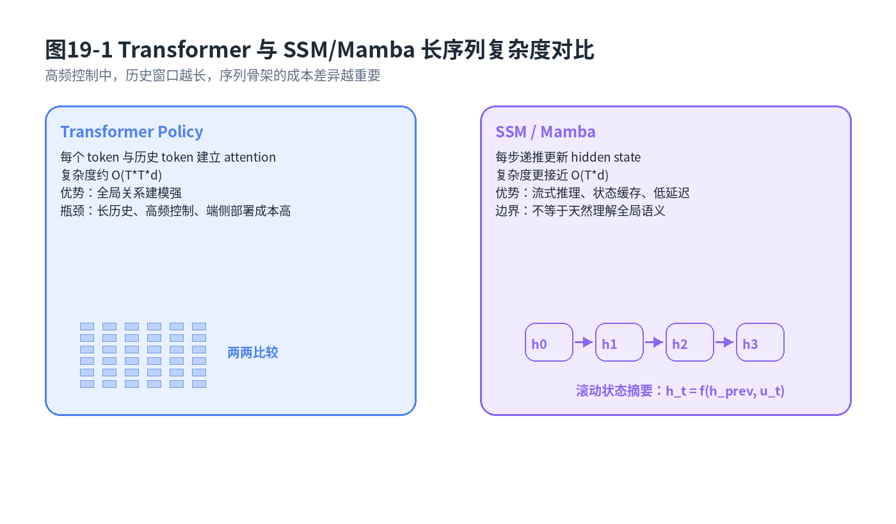
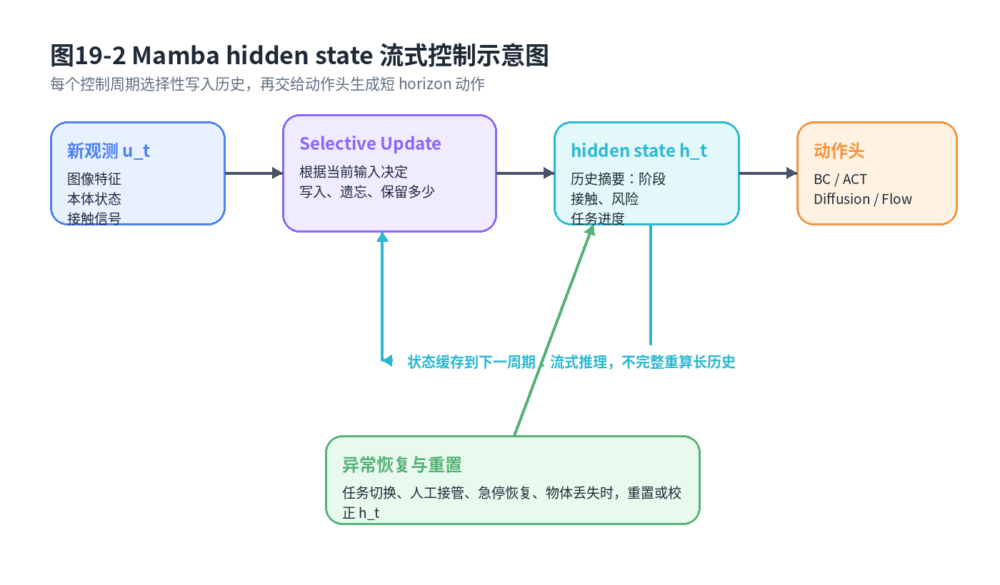

# 第19章：SSM 与 Mamba：长时域机器人控制的线性序列骨架

> **新版布局位置**：本章属于 **第五篇：长序列架构与多模态策略**。本章编号、公式编号与交叉引用已按新版八篇结构统一调整。
>
> **本章一句话导读**：SSM 与 Mamba 不是新的 imitation loss，而是一类适合长历史、流式推理和低延迟控制的序列建模骨架。

---

## 0. 本章要解决的问题

第17章讲 Decision Transformer，第18章讲 Transformer Policy。它们共同说明了一件事：机器人控制可以被写成条件序列建模问题。观测、语言、历史动作、目标和当前状态都可以变成 token，然后让大模型输出下一步动作或动作块。

但真实机器人控制和离线文本生成不一样。机械臂控制频率可能是 20Hz、50Hz 甚至更高；移动机器人需要连续感知地面、障碍物和自身运动；自动驾驶泊车感知/控制也要求实时响应。历史窗口一长，Transformer 自注意力的成本就会变成工程瓶颈。

本章要回答的问题是：

> 如果 Transformer 在长时域高频控制中太重，有没有一种更适合流式推理、线性复杂度、可持续维护历史摘要的序列骨架？

SSM 和 Mamba 正是这个问题下的候选答案。它们不会替代 BC、ACT、Diffusion Policy 或 Flow Matching 的训练目标，而是作为“序列骨架”承载历史信息，再把输出交给动作头。



**图19-1 说明**：Transformer 在长序列上需要显式比较 token 两两关系；SSM/Mamba 通过递推 hidden state 汇总历史，更适合流式控制。图中强调的是部署成本和历史管理差异，不是说 SSM 在所有任务上都比 Transformer 更强。

---

## 1. 与前后章节的衔接

本章承接第18章 Transformer Policy。第18章的重点是“用大号条件建模器把多模态上下文组织起来”，本章则进一步问：如果历史太长、频率太高、端侧算力有限，是否有更轻的序列主干？

本章也连接第13-15章：ACT、Diffusion Policy、Flow Matching 都可以把 SSM/Mamba 的输出当作上下文表示，再生成动作块。它还连接第23章快慢模型：Mamba 这类流式、低延迟、持续维护状态的模型，更像快模型候选；慢模型可以继续由 VLA、World Model 或规划器承担。

---

## 2. Transformer 的长时域瓶颈

Transformer 的核心操作是 self-attention。给定长度为 <span class="math">\\(T\\)</span>、隐藏维度为 <span class="math">\\(d\\)</span> 的序列，它大致需要构造 <span class="math">\\(T\times T\\)</span> 的注意力关系：

<div class="math">\[
\mathrm{Cost}_{\mathrm{attn}} = \mathcal{O}(T^2 d)
\tag{19.1}
\]</div>

### 公式拆解

**动机**：机器人长时域控制中，历史长度 <span class="math">\\(T\\)</span> 很容易变大。比如 50Hz 控制下保留 20 秒历史，就是 1000 个时间步。

**符号**：<span class="math">\\(T\\)</span> 是序列长度；<span class="math">\\(d\\)</span> 是每个 token 的隐藏维度；<span class="math">\\(\mathcal{O}(T^2d)\\)</span> 表示主要计算量随 <span class="math">\\(T^2\\)</span> 增长。

**直觉**：Transformer 很擅长让每个 token 看见所有 token，但代价是“大家彼此都要打招呼”。序列越长，打招呼次数越多。

**工程含义**：在云端离线推理中，这可能能接受；在机器人控制闭环里，它会影响延迟、显存、功耗和实时性。

**常见误解**：这里不是说 Transformer 不能做机器人。第18章已经说明它很强。本章只强调：高频、长历史、端侧部署时，需要考虑替代或混合骨架。

---

## 3. SSM 的连续时间动力系统直觉

状态空间模型 SSM 最容易从连续时间系统理解。假设输入是 <span class="math">\\(u(t)\\)</span>，隐藏状态是 <span class="math">\\(h(t)\\)</span>，输出是 <span class="math">\\(y(t)\\)</span>：

<div class="math">\[
\frac{dh(t)}{dt}=Ah(t)+Bu(t), \quad y(t)=Ch(t)+Du(t)
\tag{19.2}
\]</div>

### 公式拆解

**动机**：我们希望模型用一个隐藏状态 <span class="math">\\(h(t)\\)</span> 记住历史，而不是每次都把所有历史 token 重新拿出来做两两 attention。

**符号**：<span class="math">\\(A\\)</span> 控制隐藏状态自身如何演化；<span class="math">\\(B\\)</span> 控制输入如何写入状态；<span class="math">\\(C\\)</span> 控制如何从状态读出输出；<span class="math">\\(D\\)</span> 是输入到输出的直接通道。

**公式**：第一部分是状态方程，第二部分是输出方程。

**直觉**：SSM 像一个带记忆的滤波器。输入不断进来，隐藏状态不断更新，输出从当前状态读出。

**工程含义**：机器人每来一帧观测，就更新一次 hidden state。历史信息被压缩在 <span class="math">\\(h(t)\\)</span> 里，不需要把所有过去观测都重新参与计算。

**常见误解**：SSM 的 hidden state 不是环境真实状态。它是模型内部的历史摘要，可能包含速度趋势、接触阶段、任务进度、传感器漂移等信息。

---

## 4. 从连续 SSM 到离散 SSM

机器人控制是离散执行的。传感器以帧率到来，控制器以周期运行。把连续 SSM 离散化，可以写成：

<div class="math">\[
h_k=\bar{A}h_{k-1}+\bar{B}u_k, \quad y_k=\bar{C}h_k+\bar{D}u_k
\tag{19.3}
\]</div>

在零阶保持近似下：

<div class="math">\[
\bar{A}=e^{\Delta A}, \quad \bar{B}=\left(\int_0^{\Delta} e^{sA}ds\right)B
\tag{19.4}
\]</div>

其中 <span class="math">\\(\Delta\\)</span> 是采样周期。

### 公式拆解

**动机**：真实系统每隔 <span class="math">\\(\Delta\\)</span> 秒更新一次，连续微分方程必须变成离散递推，才能进工程代码。

**符号**：<span class="math">\\(k\\)</span> 是离散时间步；<span class="math">\\(\bar{A},\bar{B},\bar{C},\bar{D}\\)</span> 是离散化后的参数；<span class="math">\\(\Delta\\)</span> 是时间间隔。

**直觉**：连续系统像水流，离散系统像每隔一小段时间拍一张照片。离散化就是把“连续流动”变成“逐帧更新”。

**工程含义**：如果控制频率变化，<span class="math">\\(\Delta\\)</span> 变化，状态更新也应该考虑频率影响。实际神经网络版本会把这些矩阵参数化、学习化，但这个动力系统直觉非常重要。

---

## 5. hidden state 如何作为历史摘要

SSM 递推可以展开成卷积形式：

<div class="math">\[
y_k=\sum_{i=1}^{k} \bar{C}\bar{A}^{k-i}\bar{B}u_i + \bar{D}u_k
\tag{19.5}
\]</div>

这个公式说明，当前输出 <span class="math">\\(y\_k\\)</span> 仍然受所有历史输入影响，只是影响通过 <span class="math">\\(\bar{A}^{k-i}\\)</span> 被压缩和衰减。

也可以把它写成更工程化的状态更新：

<div class="math">\[
h_k=f_\theta(h_{k-1},u_k), \quad y_k=g_\theta(h_k,u_k)
\tag{19.6}
\]</div>

### 公式拆解

**动机**：我们既想利用长历史，又不想每次把长历史全部送进 self-attention。

**符号**：<span class="math">\\(h\_k\\)</span> 是到当前时刻为止的历史摘要；<span class="math">\\(u\_k\\)</span> 是当前输入 token；<span class="math">\\(y\_k\\)</span> 是输出表示。

**直觉**：hidden state 像一个滚动笔记本。每次新观测来了，模型更新笔记；动作头只看当前笔记和当前观测。

**工程含义**：机械臂末端运动中，<span class="math">\\(h\_k\\)</span> 可以记住“夹爪刚接触物体”“上一阶段发生过滑动”“目标已经接近但姿态还没对齐”。这些信息仅靠当前图像未必能看出来。

**常见误解**：hidden state 不是越大越好。太小记不住历史，太大增加延迟和过拟合风险。工程上要在任务时域、传感器频率和端侧算力之间折中。

---

## 6. Mamba 的 selective state update 直觉

传统 SSM 的参数相对固定，而 Mamba 的关键直觉是：不同输入应该触发不同的状态更新。也就是说，模型应该选择性地决定“当前信息写多少、忘多少、保留多少”。可以抽象写成：

<div class="math">\[
\bar{A}_k,\bar{B}_k,\bar{C}_k,\Delta_k = \mathrm{Select}_\theta(u_k)
\tag{19.7}
\]</div>

然后状态递推变成：

<div class="math">\[
h_k=\bar{A}_k h_{k-1}+\bar{B}_k u_k, \quad y_k=\bar{C}_k h_k
\tag{19.8}
\]</div>

### 公式拆解

**动机**：机器人序列里不是每一帧都同等重要。接触瞬间、目标遮挡、人工接管、碰撞预警都应该被更强地写入历史。

**符号**：<span class="math">\\(\mathrm{Select}\_\theta\\)</span> 表示由当前输入决定 SSM 参数的选择机制；下标 <span class="math">\\(k\\)</span> 表示这些参数随时间变化。

**直觉**：Mamba 不只是一个滤波器，更像一个会判断重点的滤波器。普通帧轻轻写，关键帧重重写，过时信息及时忘。

**工程含义**：在抓取任务中，当视觉看到夹爪已经接近物体边缘，Mamba 可以把“接触前阶段”写入状态；当力传感或图像提示物体滑动时，它可以让后续动作头输出更保守的修正动作。

**常见误解**：selective update 不是显式规则系统。它通常是神经网络学出来的输入依赖更新机制，不等价于人工写 if-else。



**图19-2 说明**：机器人每个控制周期接收新观测，Mamba 根据当前输入选择性更新 hidden state，再把状态摘要交给 ACT、Diffusion 或 Flow 动作头，输出短 horizon 动作块并滚动执行。

---

## 7. SSM / Mamba 与 Transformer Policy 的关系

SSM/Mamba 和 Transformer 不是非黑即白的关系。可以从三个层次理解。

第一，**替代关系**：在高频控制环里，用 Mamba 替代 Transformer 主干，以降低长历史成本。

第二，**混合关系**：低频慢模型用 Transformer/VLA 做任务理解，高频快模型用 Mamba 维护局部历史并输出动作。

第三，**分工关系**：Transformer 负责全局语义和跨模态对齐，SSM/Mamba 负责连续时间执行和状态缓存。

工程上更常见的是混合：

<div class="math">\[
z_k=\mathrm{Mamba}_\theta(u_{1:k}), \quad A_k\sim p_\psi(A\mid z_k,o_k)
\tag{19.9}
\]</div>

这里 <span class="math">\\(z\_k\\)</span> 是序列骨架输出，<span class="math">\\(p\_\psi\\)</span> 可以是 ACT、Diffusion Policy 或 Flow Matching 动作头。

---

## 8. 与 ACT / Diffusion / Flow 的组合方式

SSM/Mamba 不决定 imitation loss。它主要决定“历史如何编码”。动作生成可以有多种头部：

```text
观测序列 → Mamba hidden state → 动作头
```

常见组合如下：

- **Mamba + BC head**：适合动作分布较单峰、要求低延迟的任务；
- **Mamba + ACT head**：适合低频动作块输出，推理快，结构清晰；
- **Mamba + Diffusion head**：适合复杂多模态动作，但要控制采样延迟；
- **Mamba + Flow head**：适合希望用少步积分生成连续动作块的场景；
- **Transformer/VLA + Mamba fast head**：适合快慢模型，慢模型给目标，快模型执行。

这就是为什么本章标题叫“线性序列骨架”，而不是“新的模仿学习算法”。

---

## 9. 统一例子：机械臂为什么需要长历史状态记忆

设机械臂要把一个金属轴套从平面上抓起并放入治具。当前图像能看到轴套位置，但不一定能看到过去发生过什么：夹爪是否刚刚碰过物体？物体是否被推歪？相机是否发生短暂抖动？托盘位置是否在上一秒被校正过？

如果策略只看当前帧，它可能把“被推歪后的轴套”当成正常状态继续执行。Mamba 的 hidden state 可以把过去几秒的重要事件保留下来：

- 视觉定位曾经不稳定；
- 末端接近时出现过滑动；
- 夹爪闭合前目标位置发生过偏移；
- 上一次动作已经触发过安全限幅。

这些历史信息会影响当前动作头：继续抓、重新对齐、减速、放弃还是请求人工接管。对真实机器人而言，这类历史记忆往往比“更大的单帧图像模型”更重要。

二维点机器人也一样。如果它只看当前位置，可能不知道自己刚从障碍物左侧绕行，下一步突然切到右侧路线；如果 hidden state 记录了已经选择的绕行模式，动作会更连贯。

---

## 10. 快慢模型中为什么它适合作为快模型候选

第23章会系统讨论快慢模型。这里先给出直觉：

- 慢模型负责理解任务、预测后果、做高层计划；
- 快模型负责每个控制周期稳定输出动作；
- 快模型必须低延迟、可缓存、可流式、可重置。

Mamba/SSM 满足这些特点。它每步只需要更新 hidden state，不必完整重算长历史。流式策略可以写成：

<div class="math">\[
h_k, A_k = \Pi_{\mathrm{fast}}(h_{k-1},o_k,g_k)
\tag{19.10}
\]</div>

其中 <span class="math">\\(g\_k\\)</span> 是慢模型给出的子目标或阶段指令。这个公式的工程含义是：快模型把上一个隐藏状态、当前观测和高层目标结合起来，输出动作块，并把新状态缓存到下一周期。

---

## 11. 工程部署关注点

### 11.1 延迟预算

机器人控制闭环通常要满足：

<div class="math">\[
T_{\mathrm{sense}} + T_{\mathrm{encode}} + T_{\mathrm{seq}} + T_{\mathrm{head}} + T_{\mathrm{safety}} < T_{\mathrm{cycle}}
\tag{19.11}
\]</div>

**动机**：如果总耗时超过控制周期，策略再聪明也会变成慢半拍。

**工程含义**：Mamba 降低的是 <span class="math">\\(T\_{\mathrm{seq}}\\)</span> 中长序列建模的部分，但图像编码、动作生成头和安全仲裁仍然可能成为瓶颈。

### 11.2 流式推理与历史缓存

SSM/Mamba 的优势来自缓存 hidden state。但缓存也带来风险：如果环境重置、机器人急停、任务切换，旧 hidden state 可能污染新任务。因此需要状态重置机制：

<div class="math">\[
h_k=(1-r_k)\tilde{h}_k + r_k h_{\mathrm{init}}, \quad r_k\in\{0,1\}
\tag{19.12}
\]</div>

其中 <span class="math">\\(r\_k=1\\)</span> 表示重置。

**常见触发条件**包括：任务开始/结束、人工接管、急停恢复、物体丢失、相机重定位、控制器报错、episode 切换。

### 11.3 异常恢复

hidden state 可能记住错误历史。例如相机抖动导致模型误判接触阶段，状态里留下错误信息。工程上要配合：

- 置信度监控；
- 状态健康度检查；
- 接管后重置；
- shadow mode 对比；
- 回放分析 hidden state 漂移。

这些内容会在第25章部署和第29章数据闭环中再次出现。

---

## 12. 常见误解与适用边界

**误解一：Mamba 是新的模仿学习损失。** 不是。它是序列建模骨架，仍然可以用 BC、ACT loss、Diffusion loss、Flow Matching loss 或偏好后训练。

**误解二：线性复杂度一定比 Transformer 好。** 不一定。Transformer 的全局注意力很强，尤其适合跨模态语义和长程依赖显式对齐。Mamba 的优势主要在长序列、流式推理和部署成本。

**误解三：hidden state 会自动解决所有历史问题。** 不会。训练数据必须包含相关历史模式，模型才可能学到该记什么、忘什么。

**误解四：有了 Mamba 就不需要系统状态机。** 不对。机器人系统仍然需要显式任务阶段、安全状态、故障码、急停状态和工程日志。神经 hidden state 不能替代可审查的系统状态。

---

## 13. 与全书知识地图的一致性说明

本章在全书中的位置是：

```text
第17章 Decision Transformer：把轨迹当序列建模
第18章 Transformer Policy：多模态条件建模器
第19章 SSM/Mamba：长历史流式序列骨架
第20章 VLA：视觉语言动作统一建模
第23章 快慢模型：Mamba 更适合快模型候选
第25章 实机部署：流式缓存、延迟和重置会变成系统问题
第29章 数据闭环：hidden state 相关失败要靠回放和接管分析
```

因此，本章不是从主线跳出去讲新架构，而是在补齐“长序列怎么低延迟落地”的关键拼图。

---

## 14. 本章公式索引

- 公式 (19.1)：Transformer attention 长序列计算复杂度
- 公式 (19.2)：连续时间 SSM 状态方程与输出方程
- 公式 (19.3)：离散 SSM 递推形式
- 公式 (19.4)：零阶保持下的离散化参数
- 公式 (19.5)：SSM 的卷积展开形式
- 公式 (19.6)：工程化 hidden state 更新与输出
- 公式 (19.7)：Mamba 的输入选择性参数
- 公式 (19.8)：选择性状态更新递推
- 公式 (19.9)：Mamba 序列骨架连接动作头
- 公式 (19.10)：快模型流式策略形式
- 公式 (19.11)：机器人控制闭环延迟预算
- 公式 (19.12)：hidden state 重置机制

---

## 15. 建议阅读的附录条目

- **附录A：数学符号与公式阅读方法**：理解状态、输入、输出和递推符号。
- **附录E：优化基础**：理解序列模型训练中的梯度传播与稳定性。
- **附录F：强化学习与序列决策基础**：把 hidden state 与部分可观测序列决策联系起来。
- **附录H：实验与代码基础**：帮助设计延迟、吞吐、缓存和回放实验。

## 推荐阅读与深入材料

### 阅读目的

本章要让读者理解 SSM/Mamba 的定位：它是长序列建模骨架，不是新的 imitation loss。重点在连续时间动力系统直觉、离散化、hidden state 摘要和流式推理。

### 推荐材料

1. **Gu et al., 2021, “Efficiently Modeling Long Sequences with Structured State Spaces” / S4**
   - 类型：A/B 类 SSM 核心论文。
   - 链接：https://arxiv.org/abs/2111.00396
   - 阅读目的：理解 structured state space model 如何处理长序列。
   - 重点看：state space、convolution/recurrent duality、long-range dependency。

2. **Gu and Dao, 2023, “Mamba: Linear-Time Sequence Modeling with Selective State Spaces”**
   - 类型：A 类本章核心论文。
   - 链接：https://arxiv.org/abs/2312.00752
   - 阅读目的：理解 selective state update 如何让 SSM 根据输入选择记住/忘记。
   - 重点看：selective scan、linear-time inference、hardware-aware implementation。

3. **Gu et al., 2020, “HiPPO: Recurrent Memory with Optimal Polynomial Projections”**
   - 类型：B 类理论材料。
   - 链接：https://arxiv.org/abs/2008.07669
   - 阅读目的：理解 SSM 背后的“用有限 hidden state 压缩历史”的数学动机。

4. **Ota, 2024, “Decision Mamba: Reinforcement Learning via Sequence Modeling with Selective State Spaces”**
   - 类型：B/C 类决策任务扩展。
   - 链接：https://arxiv.org/abs/2403.19925
   - 阅读目的：理解 Mamba 如何替代 Decision Transformer 中的序列骨架。

5. **Liu et al., 2024, “RoboMamba: Efficient Vision-Language-Action Model for Robotic Reasoning and Manipulation”**
   - 类型：C 类机器人前沿材料。
   - 链接：https://arxiv.org/abs/2406.04339
   - 阅读目的：理解 Mamba 在 VLA/机器人策略中的效率和部署价值。

### 阅读提示

读 Mamba 时不要被公式吓住。先用机械臂例子理解：每一帧观测到来时，模型要把“过去发生过什么”压进 hidden state，并决定哪些历史对当前控制仍然有用。

---
