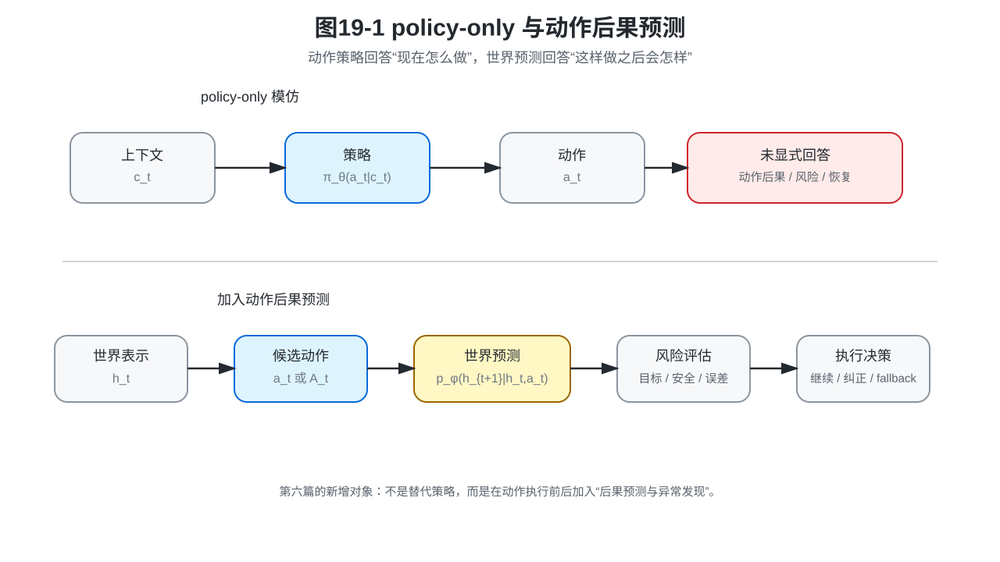
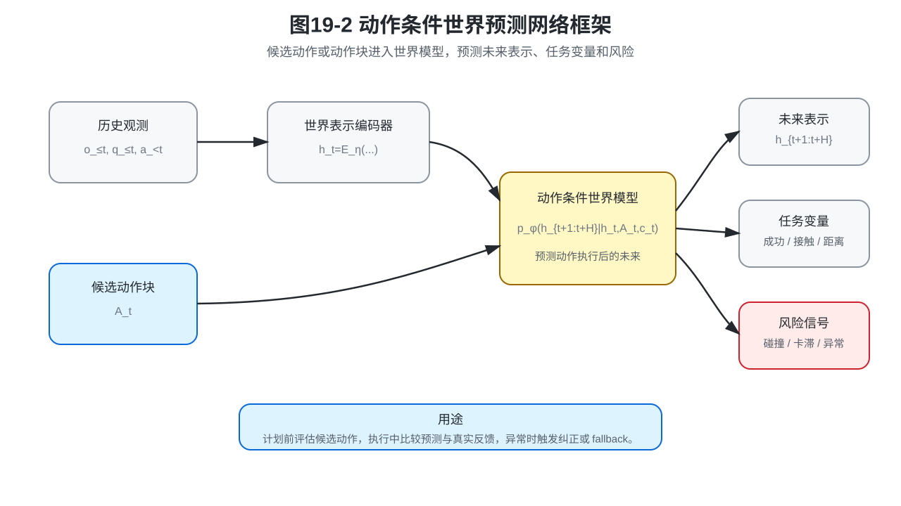
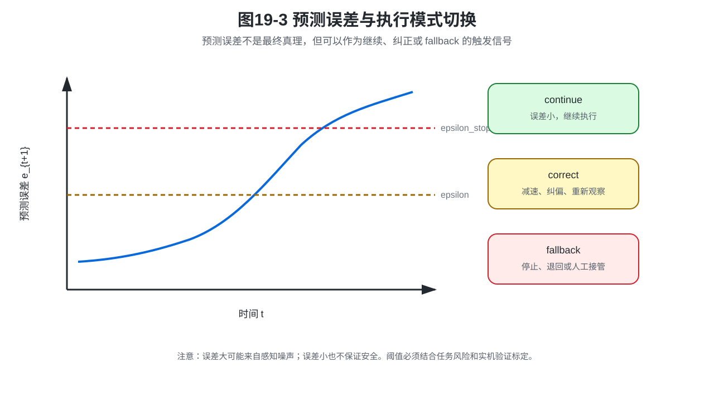

# 第19章：从动作模仿到世界预测：机器人不能只会背动作表

> **新版目录位置**：本章是 **第六篇：从动作模仿到世界预测** 的入口章。当前文件名仍保留“第19章”，但在新版六篇目录中，它承担的是第六篇第一章的作用。

> **本章一句话导读**：前五篇已经说明策略如何在上下文条件下生成动作；本章进一步说明，机器人还需要预测“动作执行之后世界会怎样变化”。

第18章把 VLA 写成多模态上下文条件策略。它的核心问题是：

```text
在视觉、语言、状态和历史动作条件下，下一步该怎么做？
```

这个问题很重要，但它还不是机器人智能的终点。

机械臂执行插入任务时，如果孔位偏了 1 毫米，夹具发生弹性变形，工件边缘有毛刺，单纯复现专家动作可能会让机器人继续往前推，直到卡住、报警甚至损坏夹具。

这时，机器人不能只问：

```text
专家当时怎么动？
```

还必须问：

```text
如果我继续这样动，世界会发生什么？
如果预测和真实反馈不一致，我应该继续、纠正，还是 fallback？
```

这就是第六篇要引入的核心对象：**动作条件的世界预测**。

---

## 0. 本章要解决的问题

本章要解决三个问题。

第一，为什么 policy-only 模仿不能等价于动作后果预测。

第二，动作后果预测在数学上新增了什么对象。

第三，为什么这个对象会自然引出下一章的 World Model、World Action Model 和 JEPA。

本章不是否定模仿学习。相反，它是在前五篇的基础上继续往前走：

```text
动作模仿：在当前上下文下生成动作。
世界预测：在当前世界表示和候选动作下预测后果。
```

二者缺一不可。

---

## 1. 本章公式主线

前五篇已经建立了策略主线。沿用第18章的 VLA 条件策略，策略主要回答：

```text
现在该怎么做？
```

第六篇开始增加一个新的问题：

```text
这样做之后会怎样？
```

因此，本章的公式主线是：

```text
观测历史
→ 当前世界表示 h_t
→ 动作条件后果预测
→ 动作条件未来分布
→ 动作块条件未来预测
→ 任务相关后果预测
→ 预测误差与异常发现
→ 不可识别性反例
```

这条主线的对象升级是：

```text
策略分布 π_θ(a_t | c_t)
→ 动作条件未来分布 p_φ(h_{t+1} | h_t,a_t)
```

前者回答“怎么做”，后者回答“做了之后会怎样”。

---

## 2. 统一贯穿例子：插入任务中的 1 毫米偏差

考虑一个孔轴插入任务。专家示范时，孔位、轴姿态和夹具状态都比较理想。机器人学到一段动作：

```text
靠近孔位；
微调角度；
向下插入；
检测到进入后继续下压；
完成装配。
```

在示范分布中，这段动作看起来很合理。

但部署时可能出现下面情况：

```text
孔位偏了 1 毫米；
轴的初始姿态略微倾斜；
夹具发生弹性变形；
接触力突然升高；
视觉仍然看起来差不多。
```

如果策略只学“专家此时怎么动”，它可能继续下压。如果系统有动作后果预测，它应该在执行前或执行中问：

```text
继续下压是否会卡住？
接触状态是否和预测一致？
当前误差是否已经超过安全阈值？
应该继续、轻微纠偏，还是 fallback？
```

这个例子会贯穿本章：动作模仿让机器人会做，世界预测让机器人在偏离示范时知道可能会发生什么。

---

## 3. 新数学对象定义

**定义 19.1：世界表示**

世界表示 $h_t$ 是模型在时刻 $t$ 对当前环境、机器人状态、对象关系和任务进度的内部表示。

它可以来自图像编码器、状态估计器、Transformer 历史上下文、多传感器融合模块，或者显式的对象关系图。

**公式 (19.1)：世界表示编码**

$$h_t=E_\eta(o_{\le t},q_{\le t},a_{<t})$$

其中，$o_{\le t}$ 表示历史观测，$q_{\le t}$ 表示历史本体状态，$a_{<t}$ 表示当前时刻之前的历史动作，$E_\eta$ 是世界表示编码器。

注意：$h_t$ 不一定是完整三维世界，也不一定是像素级重建。它只需要包含对任务决策有用的信息。

**定义 19.2：动作后果预测**

动作后果预测是指根据当前世界表示和候选动作，预测执行该动作后未来世界表示、任务变量或风险会如何变化。

**公式 (19.2)：确定性动作后果预测**

$$\hat h_{t+1}=F_\phi(h_t,a_t)$$

公式 (19.2) 回答的是：如果在当前世界表示 $h_t$ 下执行动作 $a_t$，下一步世界表示大概会是什么。

**定义 19.3：动作条件未来分布**

动作条件未来分布指在当前世界表示和动作条件下，对未来世界表示的不确定性建模。

**公式 (19.3)：动作条件未来分布**

$$p_\phi(h_{t+1}\mid h_t,a_t)$$

公式 (19.2) 是确定性预测，公式 (19.3) 是概率预测。实际机器人系统中，接触、摩擦、遮挡和外界扰动都会带来不确定性，因此概率形式更一般。

---

## 4. 图解：policy-only 与动作后果预测的区别



policy-only 系统通常只做一件事：

```text
上下文 → 动作
```

加入动作后果预测之后，系统多了一个环节：

```text
上下文 → 候选动作 → 预测后果 → 评估风险 → 执行或修正
```

这不是说世界模型替代策略，而是说策略执行前后多了一层“后果检查”。

对于插入任务，policy-only 策略可能直接输出“继续下压”。动作后果预测会进一步估计：继续下压后接触力是否会异常、轴是否会卡住、目标距离是否会缩小、系统是否进入不可恢复状态。

---

## 5. 从单步动作到动作块：预测一段动作的后果

现代机器人策略通常不是只输出单步动作，而是输出动作块。第4章已经定义动作块 $A_t$，第四篇又讨论了 ACT、Diffusion Policy 和 Flow Matching 等动作块生成方法。

如果策略输出的是候选动作块，世界预测就应该从单步预测扩展到动作块预测。

**公式 (19.4)：动作块条件未来预测**

$$p_\phi(h_{t+1:t+H}\mid h_t,A_t,c_t)$$

其中，$A_t$ 是候选动作块，$c_t$ 是任务、语言或系统上下文，$h_{t+1:t+H}$ 是预测的未来世界表示序列。

这个公式很重要，因为它把前面的动作块策略和第六篇世界预测连接起来：

```text
动作生成模型提出候选动作块；
世界预测模型评估这些动作块的后果；
系统根据目标、风险和约束选择执行哪一段动作。
```



---

## 6. 预测像素不等于预测动作后果

很多人一听到世界模型，就会想到未来视频预测。

未来视频预测当然有价值，但对机器人控制来说，下一帧图像是否清晰并不是唯一目标。机器人真正需要的是任务相关预测，例如：

- 物体是否会滑落；
- 是否会发生碰撞；
- 插入是否会卡住；
- 抓取是否会成功；
- 接触状态是否异常；
- 当前动作是否让系统进入不可恢复状态。

因此，世界模型不一定要输出完整像素图，而可以输出任务相关变量。

**公式 (19.5)：任务相关后果预测**

$$p_\phi(y_{t+1}\mid h_t,a_t)$$

其中，$y_{t+1}$ 可以是成功概率、接触状态、碰撞风险、物体位姿、目标距离或异常标签。

这个公式告诉我们：动作后果预测不是“把未来画出来”，而是“预测对行动有用的后果”。

这也是下一章引入 JEPA 式表示预测的原因：如果像素重建会把模型注意力浪费在纹理、光照和背景细节上，那么预测表示可能更适合机器人控制。

---

## 7. 预测误差：机器人如何发现现实没有按预期发生

世界模型的另一个价值是闭环纠错。

如果模型预测下一世界表示是 $\hat h_{t+1}$，真实观测更新得到的表示是 $h_{t+1}$，可以定义预测误差。

**公式 (19.6)：预测误差**

$$e_{t+1}=d(\hat h_{t+1},h_{t+1})$$

其中，$d(\cdot,\cdot)$ 是距离或差异度量。

当误差较小时，说明世界大致按预期变化；当误差突然变大时，可能说明：

- 物体滑动；
- 接触状态变化；
- 视觉感知错误；
- 外界有人干扰；
- 当前状态超出训练分布；
- 策略把系统带到了未知区域。

工程上可以把预测误差用于执行模式切换：

```text
误差较小：继续执行；
误差中等：减速、纠偏或重新观察；
误差很大：触发 fallback 或人工接管。
```



这个规则不能机械使用。预测误差大不一定说明策略错，也可能是感知噪声或传感器不同步；预测误差小也不一定说明安全，因为 latent 可能没有编码接触力、夹具干涉或微小几何误差。

---

## 8. 命题 19.1：相同专家动作分布不唯一决定世界动力学

> **命题 19.1：动作分布不可识别世界动力学**
>
> 存在两个不同环境动力学，使得专家在观测分布上的动作表现相同，但同一个动作在两个世界中的后果不同。因此，仅靠动作模仿目标无法唯一识别动作后果。

**证明思路**

构造两个世界。它们在当前观测下给专家同样的动作标签，因此行为克隆看到的数据完全一样。但两个世界的转移规则不同，所以同一个动作会导致不同后果。

**证明**

假设当前观测为 $o$，专家在两个世界中都输出同一个动作 $a^*$。

**公式 (19.7)：相同专家动作样本**

$$(o,a^*)$$

现在构造两个不同的环境动力学。

世界 1 中，执行动作 $a^*$ 后进入成功状态 $s^{ok}$。

**公式 (19.8)：世界 1 的动作后果**

$$P_1(s^{ok}\mid s,a^*)=1$$

世界 2 中，执行同样动作 $a^*$ 后进入失败状态 $s^{fail}$。

**公式 (19.9)：世界 2 的动作后果**

$$P_2(s^{fail}\mid s,a^*)=1$$

对行为克隆来说，两个世界提供的专家动作样本完全一样，所以只根据 $(o,a^*)$ 无法判断真实世界到底遵循 $P_1$ 还是 $P_2$。

但是，对机器人执行来说，两个世界的后果完全不同：一个成功，一个失败。

因此，相同专家动作分布不唯一决定世界动力学。仅靠动作模仿目标无法唯一识别动作后果。

**这个命题告诉我们什么？**

行为克隆可以学到“专家在这个观测下做了什么”，但不自动学到“这个动作为什么会成功、换一个世界会不会失败”。如果希望机器人具备计划、验证、安全判断和失败恢复能力，就必须额外引入世界预测、环境交互、回放验证或任务相关反馈。

---

## 9. 与 VLA 的关系：不是否定 VLA，而是补上后果层

VLA 把视觉、语言、本体状态和历史动作放进统一模型中，让策略可以在复杂任务条件下生成动作。第18章已经说明，VLA 的核心是多模态上下文条件策略。

但条件更丰富不等于动作后果已经被显式建模。VLA 可以根据语言和视觉生成动作，却未必能可靠回答：

```text
如果执行这个动作块，物体会不会滑？
如果执行到一半出现偏差，系统能否恢复？
如果两个候选动作都像专家，哪个后果更安全？
```

因此，第六篇不是否定 VLA，而是给 VLA 补上动作后果预测这一层数学对象。

更准确地说：

```text
VLA 负责提出动作；
世界预测负责估计动作后果；
评估器负责根据目标、风险和安全边界选择动作或触发 fallback。
```

---

## 10. 常见误解与适用边界

| 常见误解 | 正确认识 |
|---|---|
| 会输出动作就等于懂世界 | 输出动作只说明学到了条件动作分布，不代表学到了动作后果模型 |
| 世界模型一定要预测像素 | 机器人更需要预测任务相关表示、风险和成功条件 |
| 预测误差大一定说明策略错 | 也可能是感知噪声、遮挡、传感器不同步或 latent 漂移 |
| 预测误差小就一定安全 | latent 可能没编码接触力、夹具干涉或微小几何误差 |
| 专家数据多就自动学到动力学 | 动作标签不能唯一识别环境转移，必须有后果数据或额外假设 |

适用边界也要明确：本章只是说明为什么需要动作后果预测，不等于说世界模型可以替代策略、控制器或实机验证。世界模型只是多了一层“如果这样做会怎样”的预测能力。

---

## 11. 与下一章的衔接

本章只完成一件事：说明为什么要从动作模仿走向世界预测。

下一章会正式回答三个问题：

```text
World Model 预测什么？
World Action Model 的动作条件是什么？
JEPA 式表示预测为什么适合机器人控制？
```

也就是说，本章是动机章和对象升级章；下一章才是世界模型的数学核心章。

---

## 12. 读完本章，你应该能判断什么

读完本章后，你应该能判断：

1. 动作策略回答“现在怎么做”，不等于回答“这样做会怎样”。
2. 动作后果预测需要新的数学对象，例如 $p_\phi(h_{t+1}\mid h_t,a_t)$。
3. 相同专家动作分布不唯一决定世界动力学。
4. 世界模型不一定预测像素，更重要的是预测任务相关后果。
5. 预测误差可以帮助系统发现异常，但不能机械地等同于失败。
6. VLA 可以生成动作，但仍然可能需要动作后果预测来辅助计划、验证和安全判断。
7. 下一章要进一步回答：World Model、World Action Model 和 JEPA 到底预测什么、怎么训练、怎么使用。

---

## 13. 本章公式索引

### 公式 (19.1)：世界表示编码

$$h_t=E_\eta(o_{\le t},q_{\le t},a_{<t})$$

- **含义**：把历史观测、本体状态和历史动作编码成当前世界表示。

### 公式 (19.2)：确定性动作后果预测

$$\hat h_{t+1}=F_\phi(h_t,a_t)$$

- **含义**：根据当前世界表示和动作预测下一步世界表示。

### 公式 (19.3)：动作条件未来分布

$$p_\phi(h_{t+1}\mid h_t,a_t)$$

- **含义**：用概率分布描述动作后果的不确定性。

### 公式 (19.4)：动作块条件未来预测

$$p_\phi(h_{t+1:t+H}\mid h_t,A_t,c_t)$$

- **含义**：预测一段动作块执行后的未来表示序列。

### 公式 (19.5)：任务相关后果预测

$$p_\phi(y_{t+1}\mid h_t,a_t)$$

- **含义**：预测成功率、碰撞风险、接触状态等任务相关变量。

### 公式 (19.6)：预测误差

$$e_{t+1}=d(\hat h_{t+1},h_{t+1})$$

- **含义**：比较预测未来和真实反馈之间的差异。

### 公式 (19.7)：相同专家动作样本

$$(o,a^*)$$

- **含义**：两个不同世界可以给出相同的专家动作样本。

### 公式 (19.8)：世界 1 的动作后果

$$P_1(s^{ok}\mid s,a^*)=1$$

- **含义**：同一个动作在世界 1 中导致成功状态。

### 公式 (19.9)：世界 2 的动作后果

$$P_2(s^{fail}\mid s,a^*)=1$$

- **含义**：同一个动作在世界 2 中导致失败状态。

---

## 14. 本章定义索引

| 编号 | 概念 | 一句话含义 |
|---|---|---|
| 定义 19.1 | 世界表示 | 模型内部用于概括环境、机器人状态、对象关系和任务进度的表示 |
| 定义 19.2 | 动作后果预测 | 根据当前世界表示和候选动作预测未来世界表示、任务变量或风险 |
| 定义 19.3 | 动作条件未来分布 | 在当前世界表示和动作条件下，对未来世界表示的不确定性建模 |

---

## 15. 思考题

1. 为什么策略 $\pi_\theta(a_t\mid c_t)$ 不能自动推出 $p_\phi(h_{t+1}\mid h_t,a_t)$？
2. 请用机械臂插入任务构造一个“相同专家动作、不同动作后果”的多世界反例。
3. 世界模型预测像素清晰，是否一定说明它适合机器人控制？为什么？
4. 预测误差 $e_{t+1}$ 很小，是否一定说明动作安全？请给出反例。
5. 如果你要为插入任务设计动作后果预测变量，你会选择哪些 $y_{t+1}$？
6. VLA 已经能根据视觉和语言输出动作，为什么还可能需要世界预测？

---

## 16. 配图清单

- **图19-1 policy-only 与动作后果预测**：说明策略输出动作和世界模型预测动作后果的区别。
- **图19-2 动作条件世界预测网络框架**：说明候选动作、世界表示、未来预测和风险评估之间的关系。
- **图19-3 预测误差与执行模式切换**：说明预测误差如何用于继续、纠正或 fallback 的工程判断。

---

## 17. 推荐阅读：重点看什么

- **World Models 相关工作**：重点看模型预测的对象是什么，是像素、状态、latent，还是任务相关变量。
- **World Action Model 相关工作**：重点看动作如何进入预测模型，以及动作块如何用于未来预测。
- **JEPA / 表示预测相关工作**：重点看为什么预测表示可能比重建像素更适合控制。
- **机器人安全与 fallback 工程报告**：重点看预测误差、风险阈值和人工接管如何进入真实系统。
- **附录 F 与附录 H**：分别复习状态转移、序列决策、预测误差和评测协议。

---

## 18. 本章小结

本章完成了第六篇的第一步：说明为什么只学动作不够。

动作策略回答“现在怎么做”，动作后果预测回答“这样做之后会怎样”。这两个问题的数学对象不同，不能混为一谈。

命题 19.1 进一步说明：相同专家动作分布不唯一决定世界动力学。仅靠行为克隆数据，不能自动识别动作后果。

因此，下一章将正式展开 World Model、World Action Model 和 JEPA，回答三个问题：预测什么、条件是什么、怎么训练。