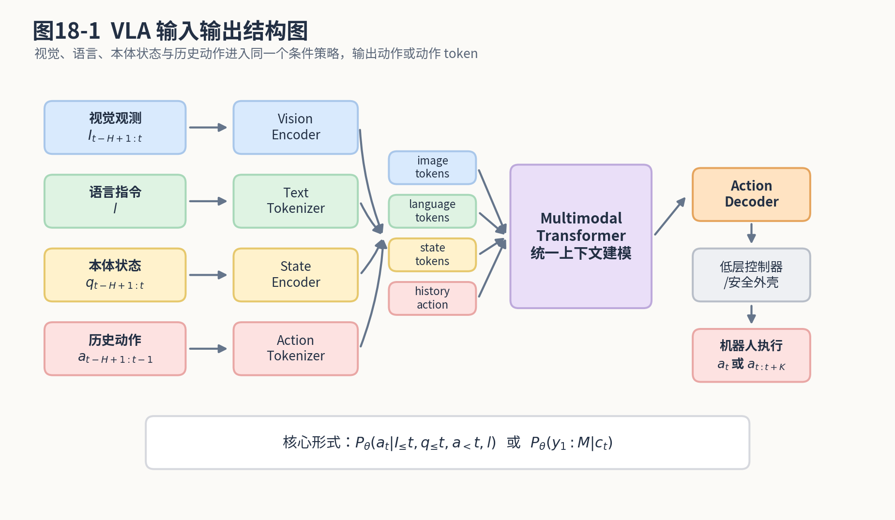
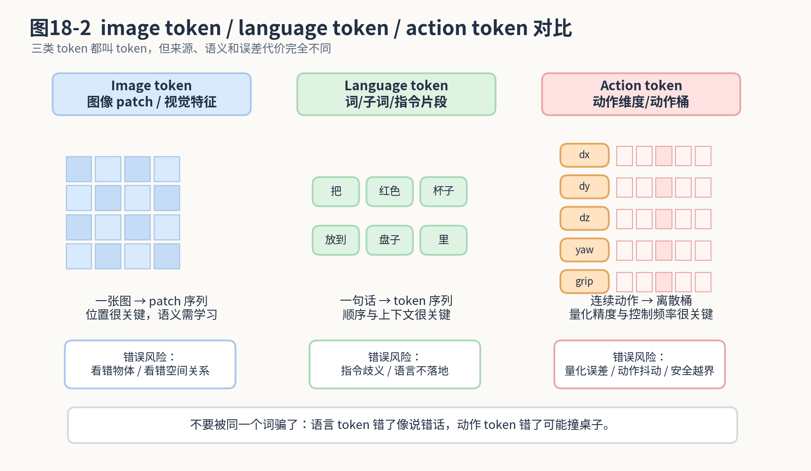
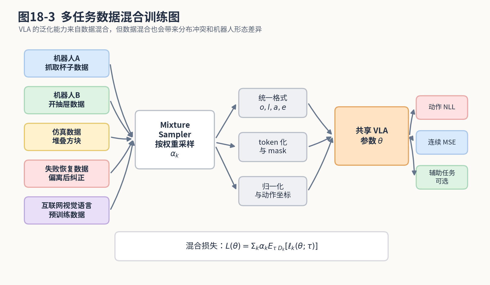
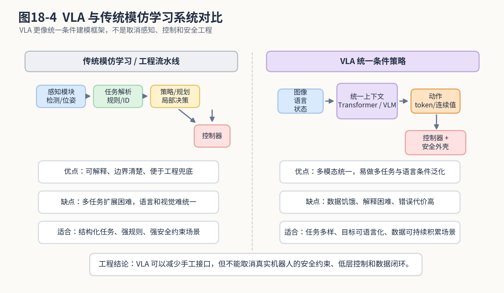

# 第20章：VLA：当视觉、语言和动作坐到一张麻将桌上

> **新版布局位置**：本章属于 **第五篇：长序列架构与多模态策略**。本章编号、公式编号与交叉引用已按新版八篇结构统一调整。


> **本章一句话导读**：本章讨论 VLA 如何把视觉、语言和动作统一起来，并分析它与传统模仿学习策略的关系。


> 第18章我们讲了 Transformer 在机器人策略中的作用：它是一个超大号条件建模器，能把图像、本体状态、历史动作和任务目标放进同一个上下文里。第20章继续往前走：如果任务目标不再只是一个任务 ID，而是一句自然语言；如果视觉不再只是局部图像特征，而是和语言语义绑定；如果动作也被组织成 token 或生成序列，那么就进入了 VLA，也就是 Vision-Language-Action 模型。先把本章结论放在前面：VLA 不是“把大语言模型接上机械臂就完事了”。它更像是把视觉、语言和动作放进同一张麻将桌上，让模型学习“看到了什么、听懂了什么、下一步该怎么动”之间的条件关系。至于能不能真正胡牌，还要看数据、控制、安全和工程闭环。

---

## 1. 本章开场：VLA 为什么听起来像机器人界的“豪华套餐”

过去做机器人模仿学习，我们经常把问题写成：

<div class="math">\[
\pi_\theta(a_t|o_t) \tag{20.1}\]</div>

也就是：给我一个当前观测 <span class="math">\\(o\_t\\)</span>，我输出一个动作 <span class="math">\\(a\_t\\)</span>。

这个公式非常朴素，朴素到有点像在饭店点菜时只说“来点吃的”。服务员确实可以端上一盘东西，但你不能保证那盘东西就是你想吃的。机器人也是一样。只给当前图像，它可以猜动作，但它不知道任务目标到底是什么。

后来我们加入了历史：

<div class="math">\[
P_\theta(a_t|o_{\le t},a_{<t},g) \tag{20.2}\]</div>

这里的 <span class="math">\\(g\\)</span> 是 goal，可以是任务 ID、目标图像、目标状态、return-to-go，也可以是一句语言指令。

VLA 关注的就是其中最有想象力、也最容易被神化的一类情况：

```text
视觉输入：桌面、物体、机器人状态
语言输入：把红色杯子放到盘子里
动作输出：机械臂接下来该怎么移动、夹爪该怎么开合
```

这时模型不再只是“看图回归动作”，而是要同时处理三个问题：

1. **视觉 grounding**：图像里哪个是红色杯子？哪个是盘子？它们在哪里？
2. **语言 grounding**：用户说的“放到盘子里”到底对应什么空间关系和终止条件？
3. **动作 grounding**：为了完成这个目标，机器人下一步该怎么动？

如果把传统 BC 比作“看图写动作”，那么 VLA 更像是“看图、读指令、想任务、出动作”。听起来很厉害，但也更容易翻车。因为每多一个模态，就多一层对齐问题；每多一层对齐问题，就多一个工程师周末加班的理由。

本章要做的事情不是吹 VLA，而是把它拆开：

- VLA 到底建模什么条件分布；
- 语言条件策略和目标条件策略是什么关系；
- action tokenization 为什么重要；
- 多任务数据混合训练为什么有用又危险；
- VLA 和传统模仿学习相比到底强在哪里、弱在哪里；
- 它离真实机器人系统还有哪些距离。

---

## 2. 本章要解决的核心问题

本章围绕以下 20 个问题展开：

1. VLA 的数学对象到底是什么？
2. VLA 是不是“VLM + 机械臂控制器”？
3. 视觉、语言和动作分别如何进入模型？
4. language-conditioned policy 和 goal-conditioned policy 有什么区别？
5. 为什么 VLA 不能只理解语言，还必须理解空间和动作？
6. action tokenization 是什么？为什么连续动作也要离散成 token？
7. action token likelihood 和 BC 的 NLL 有什么关系？
8. 连续动作头和离散动作 token 各有什么优缺点？
9. VLA 如何做多步动作生成或 action chunk？
10. multimodal pretraining 对机器人动作学习有什么帮助？
11. 视觉语言预训练和真实动作学习之间为什么仍有鸿沟？
12. embodied dataset mixture 是什么？
13. 多机器人、多任务数据混合训练为什么容易产生冲突？
14. generalist policy 是什么？它和专用 policy 有什么区别？
15. VLA 能否解决分布偏移？
16. VLA 能否解决多模态动作？
17. VLA 对工业机器人落地到底有什么价值？
18. VLA 的失败模式有哪些？
19. VLA 上线真实系统需要哪些安全外壳？
20. 第20章如何为第21章世界模型与空间理解铺垫？

---


### 主线定位与统一例子

为了让本章不变成孤立知识点，读本章时请始终把公式落回两个统一例子：

- **二维点机器人跟随专家轨迹**：状态可写成位置/速度，动作可写成二维控制量，适合观察状态分布、轨迹分布和误差累积。
- **机械臂末端运动/抓取轨迹模仿**：观测包含图像或本体状态，动作包含末端位姿增量或关节控制量，适合理解连续动作、多模态动作、动作块和实机闭环。

- **承接前文**：承接第18章多模态条件建模。
- **本章推进**：把视觉、语言、动作统一进策略表示，说明语言是条件而不是低层控制器。
- **铺垫后文**：为第21章讨论世界理解、后果预测与闭环纠错做准备。
- **公式阅读抓手**：VLA 仍然要回到条件策略、数据分布、动作表示和闭环评测这些基本对象。
- **建议同步回看**：附录 F、G、H。

## 3. 先给定义：VLA 不是一个模型名字，而是一类建模方式

VLA 是 Vision-Language-Action 的缩写。直译过来就是视觉—语言—动作模型。

但这个名字容易让人误解，好像只要模型输入图片和文字，输出动作，就可以自豪地贴上 VLA 标签。严格一点说，VLA 至少包含三层含义。

第一层：它是一个**视觉条件模型**。机器人必须看见环境，或者至少接收来自相机、深度、点云、状态估计器等观测信息。

第二层：它是一个**语言条件模型**。任务目标可以用自然语言表达，而不是固定任务 ID。比如：

```text
拿起红色杯子。
把海绵放到水槽里。
找一个可以当锤子的东西。
把左边那个没盖好的盒子盖上。
```

第三层：它是一个**动作生成模型**。模型最后不是只输出一句话“我会拿红杯子”，而是要生成机器人能执行的动作，例如末端位姿增量、关节速度、夹爪开合、动作 token 序列，或者未来一段 action chunk。

所以 VLA 的核心不是“模型会说话”，而是：

> 在视觉和语言条件下，学习动作的条件分布。

我们可以把它写成：

<div class="math">\[
\pi_\theta(a_t|I_{\le t},q_{\le t},a_{<t},l) \tag{20.3}\]</div>

这里：

- <span class="math">\\(I\_{\le t}\\)</span>：到当前时刻为止的视觉观测，可以是一帧或多帧图像；
- <span class="math">\\(q\_{\le t}\\)</span>：机器人本体状态历史，例如关节角、末端位姿、夹爪状态；
- <span class="math">\\(a\_{<t}\\)</span>：过去动作；
- <span class="math">\\(l\\)</span>：语言指令；
- <span class="math">\\(a\_t\\)</span>：当前要输出的动作；
- <span class="math">\\(\theta\\)</span>：模型参数。

如果模型一次输出未来一段动作，可以写成：

<div class="math">\[
\pi_\theta(a_{t:t+K-1}|I_{\le t},q_{\le t},a_{<t},l) \tag{20.4}\]</div>

这里的 <span class="math">\\(K\\)</span> 是 action chunk 的长度。第13章讲 ACT 时我们已经知道，一次输出一段动作可以降低高频控制压力，也可以让模型表达更完整的短期意图。

如果动作被离散化成 token，则可以写成：

<div class="math">\[
P_\theta(y_{t,1:M}|I_{\le t},q_{\le t},y_{<t},l) \tag{20.5}\]</div>

这里 <span class="math">\\(y\_{t,1:M}\\)</span> 表示当前动作对应的一串 action token。为什么一个动作会变成一串 token？后面会详细拆。

先记住一句话：

> VLA 的数学核心仍然是条件概率。只是条件里多了视觉、语言、历史和机器人状态，输出里可能是连续动作，也可能是动作 token。

这句话很重要。它可以帮助我们防止把 VLA 看成玄学。VLA 再大，仍然逃不出本书反复强调的主线：

```text
数据分布 → 条件建模 → 动作生成 → 闭环执行
```

模型名字可以变得很酷，公式底座仍然朴素。

---

## 4. VLA 输入输出结构：三种信息坐到一张桌上

先看一张结构图。



**图20-1 说明**：VLA 将视觉观测、语言指令、本体状态和历史动作分别编码为 token，再通过多模态 Transformer 或类似结构进行统一上下文建模，最后通过动作解码器输出动作或动作 token。注意，动作输出后通常还要经过低层控制器和安全外壳，而不是直接裸奔到电机。

从图里可以看到，VLA 的输入通常不止一张图片和一句话。真实系统中常见输入包括：

1. **视觉观测**：RGB 图像、深度图、多摄像头图像、点云或视觉特征；
2. **语言指令**：自然语言任务描述；
3. **本体状态**：关节角、关节速度、末端位姿、夹爪状态；
4. **历史动作**：过去一段时间机器人已经执行过的动作；
5. **机器人形态信息**：不同机器人、不同夹爪、不同坐标系下的 embodiment 信息；
6. **可选任务条件**：目标图像、目标姿态、任务 ID、技能 ID、环境 ID。

为什么本体状态很重要？因为只看外部相机，机器人可能不知道自己的夹爪开到了多大，机械臂是否已经接近奇异位姿，关节是否快到限位。机器人不是一个漂浮在空中的灵魂，它有身体。没有身体状态的 VLA，就像一个只会看监控的调度员，嘴上指挥很积极，自己手脚在哪里完全不知道。

为什么历史动作也重要？因为视觉图像经常不能完整反映动作阶段。

例如“把杯子放进盘子”这个任务，同一张桌面图像可能对应不同阶段：

- 还没抓到杯子；
- 已经抓住杯子但还没抬起；
- 杯子正在移动；
- 杯子已经到盘子上方；
- 杯子已经放下但夹爪还没张开。

如果只看当前图像，模型很容易判断不出阶段。历史动作 <span class="math">\\(a\_{<t}\\)</span> 能告诉模型“刚才我做过什么”，本体状态 <span class="math">\\(q\_{\le t}\\)</span> 能告诉模型“我的身体现在是什么姿态”。

因此，VLA 的条件变量可以合并写成一个上下文：

<div class="math">\[
c_t=(I_{\le t},q_{\le t},a_{<t},l) \tag{20.6}\]</div>

于是策略可以简写为：

<div class="math">\[
\pi_\theta(a_t|c_t) \tag{20.7}\]</div>

这个写法看起来简单，但它把第18章的上下文建模、第7章的概率策略、第13章的动作块、第14章的生成动作和第12章的离线数据覆盖问题全部装进来了。

---

## 5. 不要把 VLA 理解成“LLM 接机械臂”

很多人第一次听到 VLA，会自然想到这样一个系统：

```text
大语言模型负责思考
视觉模型负责看图
机械臂控制器负责执行
中间用 prompt 连起来
```

这种方案当然可以做出 demo，也有工程价值。但它不一定是本章讨论的 VLA 的核心。

为什么？因为“让 LLM 输出一段文字计划”和“让模型输出可执行动作”是两件事。

LLM 可以说：

```text
第一步，移动到红杯子上方。
第二步，闭合夹爪。
第三步，把杯子移动到盘子上方。
第四步，打开夹爪。
```

这段计划看起来很合理。但机器人真正需要的是：

<div class="math">\[
a_t = (\Delta x_t,\Delta y_t,\Delta z_t,\Delta r_t,\Delta p_t,\Delta y_t, g_t) \tag{20.8}\]</div>

或者关节空间动作：

<div class="math">\[
a_t=(\dot q_{1,t},\dot q_{2,t},\dots,\dot q_{n,t},g_t) \tag{20.9}\]</div>

其中每个数字都必须和机器人坐标系、控制频率、速度限制、碰撞约束、夹爪状态相匹配。说“移动到杯子上方”很容易，输出 20Hz 连续稳定的末端速度命令可没那么容易。

因此，VLA 不是简单的：

```text
LLM 输出文字 → 机械臂照做
```

更合理的理解是：

```text
视觉 + 语言 + 状态 + 历史 → 统一表示 → 动作分布 / 动作序列
```

LLM 或 VLM 可以作为其中的视觉语言理解骨干，但动作学习仍然需要模仿学习数据、控制接口和闭环验证。

一句话：

> 会说“抓杯子”和会稳定抓起杯子，中间隔着一座由标定、数据、控制和安全组成的大山。

这也是为什么本书一直强调：不要被模型名字带跑。机器人任务最终是闭环系统，不是纯文本问答。

---

## 6. language-conditioned policy：语言只是条件，不是魔法咒语

VLA 中最常见的数学形式之一是 language-conditioned policy：

<div class="math">\[
\pi_\theta(a_t|o_t,l) \tag{20.10}\]</div>

它表示：在当前观测 <span class="math">\\(o\_t\\)</span> 和语言指令 <span class="math">\\(l\\)</span> 的条件下，输出动作 <span class="math">\\(a\_t\\)</span>。

如果加入历史，可以写成：

<div class="math">\[
\pi_\theta(a_t|o_{\le t},a_{<t},l) \tag{20.11}\]</div>

这里最重要的是理解 <span class="math">\\(l\\)</span> 的角色。

语言不是一个“魔法咒语”。你不能对机器人说一句“优雅地完成任务”，它就突然拥有了老技师的手感。语言只是条件变量。它告诉策略：在同一个环境中，这次应该追求哪个目标。

举个例子，桌上有杯子、碗、海绵、盘子。当前图像相同，但语言不同：

```text
拿起红色杯子。
把海绵放进碗里。
把盘子推到桌子右侧。
找一个可以擦桌子的东西。
```

如果没有语言条件，这四个任务在同一张图像下会对应完全不同的动作。策略看到同一个 <span class="math">\\(o\_t\\)</span>，却要输出不同的 <span class="math">\\(a\_t\\)</span>。这就是第7章讲过的多模态动作问题。

语言条件把这个多模态问题拆开：

<div class="math">\[
\pi_\theta(a_t|o_t)
\quad \text{可能是多峰的} \tag{20.12}\]</div>

加入语言后：

<div class="math">\[
\pi_\theta(a_t|o_t,l=\text{``拿红杯子''}) \tag{20.13}\]</div>

<div class="math">\[
\pi_\theta(a_t|o_t,l=\text{``推盘子''}) \tag{20.14}\]</div>

两个条件分布可以变得更集中。

这就是语言条件的第一个价值：**消除任务歧义**。

第二个价值是：**允许任务组合与泛化**。

如果训练数据中出现过：

```text
拿红色杯子
拿蓝色杯子
把红色碗放进盘子
把黄色杯子放进盒子
```

那么模型可能学到“颜色”“物体类别”“空间关系”“动作模式”之间的组合关系。于是面对“把蓝色杯子放进盘子”时，它有机会泛化，而不是像固定任务 ID 那样完全没见过就傻眼。

但这里要泼一盆冷水：

> 语言泛化不是免费午餐。模型能不能组合泛化，取决于数据里是否真的包含足够的视觉、语言、动作对应关系。

如果训练集中所有“红色”都只和杯子一起出现，所有“盘子”都只在桌子中央出现，那么模型可能根本不是理解了红色和盘子，而是背下了一套数据偏见。到真实桌面上，盘子换个位置，它就开始像第一次进工厂的新人一样：看起来很自信，动作很离谱。

---

## 7. goal-conditioned policy 与 language-conditioned policy

第18章中我们写过一般的 goal-conditioned policy：

<div class="math">\[
\pi_\theta(a_t|o_{\le t},a_{<t},g) \tag{20.15}\]</div>

这里的 <span class="math">\\(g\\)</span> 是目标条件。

语言条件策略可以看成它的一个特例：

<div class="math">\[
g=l \tag{20.16}\]</div>

于是：

<div class="math">\[
\pi_\theta(a_t|o_{\le t},a_{<t},l) \tag{20.17}\]</div>

但 goal 不一定是语言。它还可以是：

1. **目标图像**：希望最终环境变成什么样；
2. **目标状态**：希望物体或机器人达到什么姿态；
3. **任务 ID**：例如 pick、place、push、open；
4. **reward / return 条件**：类似 Decision Transformer 中的 return-to-go；
5. **技能 ID**：例如 grasp、insert、wipe；
6. **人类偏好信号**：例如“更稳一点”“速度慢一点”。

语言条件的优点是自然、灵活、可组合。缺点是模糊、歧义、难以直接验证。

目标状态的优点是精确。比如：

<div class="math">\[
g=s_T^{\mathrm{target}} \tag{20.18}\]</div>

表示目标状态就是一个明确的终点。缺点是人不一定愿意每次都提供精确状态。

目标图像的优点是直观。比如给机器人一张“整理好的桌面”图片，让它把当前桌面变成那样。缺点是目标图像和动作之间仍然隔着空间理解与规划问题。

因此可以写一个统一形式：

<div class="math">\[
\pi_\theta(a_t|o_{\le t},a_{<t},\phi(g)) \tag{20.19}\]</div>

其中 <span class="math">\\(\phi(g)\\)</span> 是目标编码器。它可以把语言、图像、状态或任务 ID 编码成模型可用的目标表示。

如果 <span class="math">\\(g=l\\)</span>，<span class="math">\\(\phi\\)</span> 是文本编码器。

如果 <span class="math">\\(g=I^{\mathrm{goal}}\\)</span>，<span class="math">\\(\phi\\)</span> 是视觉编码器。

如果 <span class="math">\\(g=s^{\mathrm{goal}}\\)</span>，<span class="math">\\(\phi\\)</span> 可能是一个 MLP。

这就是 VLA 和一般 goal-conditioned policy 的关系：

> VLA 把语言和视觉目标条件纳入统一策略建模，使机器人可以通过自然语言和视觉环境共同决定动作。

但别忘了，<span class="math">\\(\phi(g)\\)</span> 编得好不好，直接决定模型是不是真懂目标。目标编码器如果只学会背训练集，后面的策略再大也只是一个大型复读机。

---

## 8. action tokenization：动作也能变成 token 吗？

既然 VLA 常常借用语言模型或 Transformer 的范式，一个自然问题是：图像和语言可以变成 token，动作能不能也变成 token？

答案是：可以，但要小心。

先看图。



**图20-2 说明**：image token、language token 和 action token 都叫 token，但含义不同。语言 token 错了，可能只是说错一个词；动作 token 错了，可能让机械臂撞到桌子。因此 action tokenization 必须考虑量化精度、控制频率和安全边界。

假设连续动作是：

<div class="math">\[
a_t \in \mathbb{R}^d \tag{20.20}\]</div>

例如末端位姿增量加夹爪命令：

<div class="math">\[
a_t=(\Delta x_t,\Delta y_t,\Delta z_t,\Delta \mathrm{roll}_t,\Delta \mathrm{pitch}_t,\Delta \mathrm{yaw}_t,g_t) \tag{20.21}\]</div>

其中 <span class="math">\\(d=7\\)</span>。

action tokenization 的一种简单做法是：对每个动作维度做离散化。

假设第 <span class="math">\\(j\\)</span> 个动作维度 <span class="math">\\(a\_{t,j}\\)</span> 的取值范围是：

<div class="math">\[
a_{t,j}\in [m_j,M_j] \tag{20.22}\]</div>

我们把这个区间分成 <span class="math">\\(B\\)</span> 个 bin。量化函数记为：

<div class="math">\[
y_{t,j}=Q_j(a_{t,j})\in \{1,2,\dots,B\} \tag{20.23}\]</div>

其中 <span class="math">\\(y\_{t,j}\\)</span> 就是第 <span class="math">\\(j\\)</span> 个动作维度的 token。

如果一个动作有 <span class="math">\\(d\\)</span> 个维度，那么一个动作可以变成：

<div class="math">\[
y_t=(y_{t,1},y_{t,2},\dots,y_{t,d}) \tag{20.24}\]</div>

如果一次生成 <span class="math">\\(K\\)</span> 步动作，那就是：

<div class="math">\[
y_{t:t+K-1}
= (y_t,y_{t+1},\dots,y_{t+K-1}) \tag{20.25}\]</div>

这时动作预测可以变成分类问题：

<div class="math">\[
P_\theta(y_{t,j}|c_t) \tag{20.26}\]</div>

训练目标就是最大化专家动作 token 的概率。

对单步动作，可以写成：

<div class="math">\[
\mathcal{L}_{\mathrm{act-token}}(\theta)
=
-
\mathbb{E}_{(c_t,y_t)\sim\mathcal{D}}
\left[
\sum_{j=1}^{d}
\log P_\theta(y_{t,j}|c_t)
\right] \tag{20.27}\]</div>

这就是 action token likelihood 的基本形式。

你会发现它和第2章 BC 的负对数似然非常像。第2章写的是：

<div class="math">\[
\mathcal{L}_{\mathrm{BC}}(\theta)
=
-
\mathbb{E}_{(o,a)\sim\mathcal{D}}
[
\log \pi_\theta(a|o)
] \tag{20.28}\]</div>

现在只是把连续动作 <span class="math">\\(a\\)</span> 变成了离散 token <span class="math">\\(y\\)</span>，把条件 <span class="math">\\(o\\)</span> 扩展成了 VLA 上下文 <span class="math">\\(c\_t\\)</span>。

所以 action tokenization 并不是魔法。它只是把连续动作预测换成离散 token 预测，让模型可以使用类似语言模型的交叉熵训练方式。

---

## 9. action token 的量化误差：把动作切成小格子，别切成豆腐渣

离散化带来的第一个问题是量化误差。

假设某个动作维度 <span class="math">\\(a\_{t,j}\in[m\_j,M\_j]\\)</span>，我们用 <span class="math">\\(B\\)</span> 个 bin 均匀离散化。每个 bin 的宽度是：

<div class="math">\[
\Delta_j=\frac{M_j-m_j}{B} \tag{20.29}\]</div>

如果用 bin 中心反量化，那么最大量化误差大约是半个 bin：

<div class="math">\[
|a_{t,j}-\hat a_{t,j}|
\le
\frac{\Delta_j}{2} \tag{20.30}\]</div>

这个公式很简单，但工程含义非常直接。

如果 <span class="math">\\(B\\)</span> 太小，<span class="math">\\(\Delta\_j\\)</span> 很大，动作就粗糙。机械臂执行起来像一个穿着滑冰鞋拧螺丝的人：方向大概对，但细节全靠命。

如果 <span class="math">\\(B\\)</span> 太大，action vocabulary 很大，分类难度增加，数据需求变高，模型输出也更容易稀疏。

所以 action tokenization 要在三者之间折中：

1. **精度**：bin 够细，动作足够平滑；
2. **学习难度**：类别数不能太夸张；
3. **安全性**：反量化后的动作必须满足速度、加速度、空间约束。

对于一些任务，动作 token 很自然。例如夹爪开合可以离散成：

```text
open / close / keep
```

或者移动方向可以离散成：

```text
left / right / forward / backward / up / down / stop
```

但对于高精度插装、精密装配、接触控制，粗糙离散化可能非常危险。你不能把“插入孔内 0.2mm 调整”离散成“大概往左一点”，然后期待工业现场给你鼓掌。

---

## 10. 自回归动作 token：把动作当成一句短句生成

如果动作被 token 化，VLA 可以像语言模型一样自回归生成动作 token。

设当前上下文是 <span class="math">\\(c\_t\\)</span>，动作 token 序列是：

<div class="math">\[
y_{1:M}=(y_1,y_2,\dots,y_M) \tag{20.31}\]</div>

自回归分解为：

<div class="math">\[
P_\theta(y_{1:M}|c_t)
=
\prod_{m=1}^{M}
P_\theta(y_m|c_t,y_{<m}) \tag{20.32}\]</div>

其中 <span class="math">\\(y\_{<m}=(y\_1,\dots,y\_{m-1})\\)</span>。

这个公式和语言模型非常像。语言模型生成一句话时，一个词一个词生成；VLA 生成动作 token 时，一个动作维度或动作片段一个 token 生成。

训练目标是：

<div class="math">\[
\mathcal{L}_{\mathrm{AR}}(\theta)
=
-
\mathbb{E}_{(c_t,y_{1:M})\sim\mathcal{D}}
\left[
\sum_{m=1}^{M}
\log P_\theta(y_m|c_t,y_{<m})
\right] \tag{20.33}\]</div>

公式拆开看：

- 外层期望表示从数据集中采样上下文和专家动作 token；
- <span class="math">\\(\sum\_{m=1}^M\\)</span> 表示对动作 token 序列中的每个 token 都计算损失；
- <span class="math">\\(\log P\_\theta(y\_m|c\_t,y\_{<m})\\)</span> 表示模型在已经知道上下文和前面动作 token 的条件下，给正确 token 的概率；
- 前面的负号表示最大化概率等价于最小化负对数似然。

自回归动作生成的优点是表达能力强。动作维度之间可以相互依赖。比如 <span class="math">\\(\Delta x\\)</span>、<span class="math">\\(\Delta y\\)</span>、<span class="math">\\(\Delta z\\)</span>、夹爪命令之间不是独立的。模型可以先决定移动方向，再决定高度，再决定夹爪是否闭合。

缺点也很明显：推理慢，误差会在 token 序列中累积，而且每个 token 的小错误都可能影响后续 token。

语言模型说错一个形容词，读者可能还能猜出来。机器人动作 token 说错一个夹爪闭合命令，杯子可能就自由落体了。

---

## 11. 连续动作头：不是所有动作都必须变成 token

VLA 不一定非要使用 action token。另一条路线是：用视觉语言模型或 Transformer 提取上下文表示，然后接连续动作头。

设多模态模型得到上下文表示：

<div class="math">\[
h_t=f_\theta(I_{\le t},q_{\le t},a_{<t},l) \tag{20.34}\]</div>

连续动作头输出：

<div class="math">\[
\hat a_t = W h_t + b \tag{20.35}\]</div>

或者更一般地：

<div class="math">\[
\hat a_t = g_\psi(h_t) \tag{20.36}\]</div>

训练目标可以是 MSE：

<div class="math">\[
\mathcal{L}_{\mathrm{MSE}}(\theta,\psi)
=
\mathbb{E}_{(c_t,a_t)\sim\mathcal{D}}
\left[
\|a_t-g_\psi(f_\theta(c_t))\|_2^2
\right] \tag{20.37}\]</div>

这个形式和第2章、第7章、第18章都保持一致。

连续动作头的优点：

1. 输出精度高，不需要反量化；
2. 推理速度通常更快；
3. 更适合高频低层控制接口；
4. 可以自然加入动作限幅和平滑约束。

缺点：

1. 如果用 MSE，仍然可能平均掉多模态动作；
2. 很难直接复用语言模型的 token 预测训练范式；
3. 动作分布如果复杂，需要额外的概率动作头、混合高斯头或 diffusion head。

所以 VLA 的动作输出大致可以分成三类：

```text
离散 action token：适合统一 token 建模，但有量化误差
连续动作回归：适合精细控制，但多模态表达较弱
生成式动作头：如 diffusion / CVAE / mixture，表达强但推理复杂
```

这和本书前面章节是一条线：

- 第7章讲概率策略，提醒我们动作不止一个答案；
- 第8、9章讲隐变量和 CVAE；
- 第13章讲 ACT 动作块；
- 第14章讲 Diffusion Policy；
- 第18章讲 Transformer policy；
- 第20章把这些动作建模方式放进视觉语言条件里。

VLA 并不是替代这些方法，而是给它们提供更大的多模态条件上下文。

---

## 12. VLA 与 action chunk：别让大模型每 20 毫秒思考人生

真实机器人控制往往有频率要求。低层控制可能需要 100Hz、200Hz 甚至更高。VLA 这种大模型通常不适合每个低层周期都完整推理一次。

因此很多系统会让 VLA 输出较低频的动作块或子目标，再由低层控制器执行。

可以写成：

<div class="math">\[
\pi_\theta(a_{t:t+K-1}|c_t) \tag{20.38}\]</div>

或者输出 action token 序列：

<div class="math">\[
P_\theta(y_{t:t+K-1}|c_t) \tag{20.39}\]</div>

这里的 <span class="math">\\(K\\)</span> 是未来动作长度。

动作块的优势：

1. 降低 VLA 推理频率；
2. 让模型表达短期运动意图；
3. 减少单步动作抖动；
4. 与第13章 ACT、temporally ensembling 思路兼容。

但动作块也有风险。

如果 <span class="math">\\(K\\)</span> 太长，模型提前规划了一段动作，但执行中环境发生变化，它可能还在坚持旧计划。就像导航已经发现前面修路，但司机还在说“我这条路线是五分钟前规划好的，很权威”。

如果 <span class="math">\\(K\\)</span> 太短，大模型调用频率太高，延迟和算力吃不消，动作也可能缺乏连贯性。

因此工程上常见做法是：

```text
VLA 低频输出动作块 / 子目标
低层控制器高频跟踪
视觉伺服或状态反馈实时纠偏
安全模块随时打断
```

这再次说明：VLA 不是完整机器人系统。它是策略大脑的一部分，但不是肌肉、反射神经和安全员的总和。

---

## 13. multimodal pretraining：先学会看图说话，再学会动手？

VLA 的一个重要动机是利用视觉语言预训练。

纯机器人数据通常很贵。遥操作采集、清洗、对齐、标注、回放验证都要成本。相比之下，互联网上有大量图像—文本数据。视觉语言模型可以从这些数据中学到：

- 物体类别；
- 颜色、形状、材质；
- 空间关系；
- 常识语义；
- 语言指令和视觉内容的对应关系。

于是一个直觉路线是：

```text
先用大规模视觉语言数据学会“看懂世界”
再用机器人示范数据学会“在世界中行动”
```

我们可以把预训练阶段写成一个视觉语言目标。例如给定图像 <span class="math">\\(I\\)</span>，预测文本 <span class="math">\\(w\_{1:L}\\)</span>：

<div class="math">\[
P_\theta(w_{1:L}|I)
=
\prod_{i=1}^{L}
P_\theta(w_i|I,w_{<i}) \tag{20.40}\]</div>

训练损失：

<div class="math">\[
\mathcal{L}_{\mathrm{VL}}(\theta)
=
-
\mathbb{E}_{(I,w)\sim\mathcal{D}_{\mathrm{VL}}}
\left[
\sum_{i=1}^{L}
\log P_\theta(w_i|I,w_{<i})
\right] \tag{20.41}\]</div>

这个损失让模型学会图像和语言之间的对应关系。

然后在机器人数据上 fine-tune：

<div class="math">\[
\mathcal{L}_{\mathrm{VLA}}(\theta)
=
-
\mathbb{E}_{(c_t,y_t)\sim\mathcal{D}_{\mathrm{robot}}}
\left[
\log P_\theta(y_t|c_t)
\right] \tag{20.42}\]</div>

如果是连续动作，就可以用：

<div class="math">\[
\mathcal{L}_{\mathrm{VLA-MSE}}(\theta)
=
\mathbb{E}_{(c_t,a_t)\sim\mathcal{D}_{\mathrm{robot}}}
\left[
\|a_t-f_\theta(c_t)\|_2^2
\right] \tag{20.43}\]</div>

预训练的价值在于，它可能让模型已经知道“杯子”“盘子”“红色”“在里面”“靠近”等视觉语言概念。机器人数据不必从零教它什么叫杯子。

但预训练也有边界：

> 看懂一张杯子的照片，不等于知道如何抓起杯子。

视觉语言预训练通常没有真实动作、接触、摩擦、力反馈和控制稳定性。它可能知道杯子是圆柱形，但不知道夹爪太紧会把纸杯捏变形；它可能知道刀很锋利，但不知道机械臂靠近刀刃时应该限制姿态和速度。

因此，multimodal pretraining 是 VLA 的助推器，不是机器人动作能力的替代品。

---

## 14. embodied dataset mixture：机器人数据不是倒进锅里煮一煮就能融合

VLA 想成为 generalist policy，往往需要多任务、多机器人、多场景数据。

可以把数据集写成：

<div class="math">\[
\mathcal{D}
=
\bigcup_{k=1}^{K}
\mathcal{D}_k \tag{20.44}\]</div>

其中 <span class="math">\\(\mathcal{D}\_k\\)</span> 是第 <span class="math">\\(k\\)</span> 个数据源。例如：

- 机械臂 A 的抓取数据；
- 机械臂 B 的开抽屉数据；
- 双臂机器人的折叠毛巾数据；
- 仿真环境中的堆叠方块数据；
- 人类视频或视觉语言预训练数据；
- 自动驾驶或泊车中的轨迹数据。

训练时常用 mixture loss：

<div class="math">\[
\mathcal{L}(\theta)
=
\sum_{k=1}^{K}
\alpha_k
\mathbb{E}_{\tau\sim\mathcal{D}_k}
[
\ell_k(\theta;\tau)
] \tag{20.45}\]</div>

这里：

- <span class="math">\\(\alpha\_k\\)</span>：第 <span class="math">\\(k\\)</span> 个数据源的权重；
- <span class="math">\\(\ell\_k\\)</span>：该数据源对应的损失；
- <span class="math">\\(\tau\\)</span>：数据中的轨迹或片段。

看图理解。



**图20-3 说明**：多任务数据混合训练会把不同机器人、不同任务、不同场景的数据通过采样权重输入共享 VLA。这样可以带来泛化能力，但也会引入坐标系、动作空间、任务分布和数据质量的冲突。

mixture training 的直觉很美：

```text
任务越多，模型越通用；
机器人越多，模型越泛化；
数据越杂，模型越强壮。
```

但工程现实常常是：

```text
任务越多，标签越乱；
机器人越多，坐标越乱；
数据越杂，debug 越像考古。
```

多机器人数据混合至少有四个关键问题。

### 14.1 动作空间不一致

一个机器人输出 7 维末端动作，另一个机器人输出 6 个关节速度，第三个机器人有灵巧手，动作维度直接起飞。

如果把它们硬塞进一个动作空间，模型可能根本不知道每个维度代表什么。

因此需要 embodiment encoding：

<div class="math">\[
e_k = \mathrm{Embed}(\mathrm{robot\ type}=k) \tag{20.46}\]</div>

然后策略写成：

<div class="math">\[
\pi_\theta(a_t|c_t,e_k) \tag{20.47}\]</div>

这里 <span class="math">\\(e\_k\\)</span> 告诉模型当前是哪种机器人。

### 14.2 坐标系不一致

不同数据集可能使用不同坐标系：

- 相机坐标系；
- 机器人基座坐标系；
- 末端坐标系；
- 世界坐标系；
- 图像像素坐标系。

动作如果没有统一坐标规范，模型会学到一堆互相打架的映射。

例如同样是 <span class="math">\\(\Delta x>0\\)</span>，在一个机器人里表示向右，在另一个机器人里可能表示向前。数据没统一，模型不是在学泛化，而是在学精神分裂。

### 14.3 任务语言不一致

同一个动作可能被不同人标注成：

```text
pick up the cup
grasp the mug
拿起杯子
把杯子抓起来
```

语言多样性有助于泛化，但如果没有合理对齐，也会增加噪声。尤其是工业场景中，“取件”“上料”“放入治具”“插装到位”这些词背后都有工艺语义，不是普通视觉语言数据能直接覆盖的。

### 14.4 数据质量不一致

演示数据中可能有：

- 成功轨迹；
- 失败轨迹；
- 半成功轨迹；
- 人类遥操作抖动；
- 自动生成轨迹；
- 仿真转真实偏差；
- 标定错误；
- 时间同步错误。

第12章已经强调过：离线数据不是越多越好，而是坑有没有录进去。VLA 也一样。大模型不怕数据多，但怕坏数据多得很平均。

---

## 15. generalist policy：通用策略不是“一个模型干所有活”的神话

VLA 经常和 generalist policy 放在一起讨论。所谓 generalist policy，就是一个策略可以处理多任务、多物体、多语言指令、多环境，甚至多机器人。

可以写成：

<div class="math">\[
\pi_\theta(a_t|o_{\le t},a_{<t},l,e) \tag{20.48}\]</div>

其中 <span class="math">\\(e\\)</span> 是 embodiment 或环境信息。

相比专用策略：

<div class="math">\[
\pi_{\theta_k}^{(k)}(a_t|o_t) \tag{20.49}\]</div>

通用策略希望用一套参数 <span class="math">\\(\theta\\)</span> 覆盖多个任务：

<div class="math">\[
\pi_\theta(a_t|o_t,l,e)
\quad
\text{for many tasks and embodiments} \tag{20.50}\]</div>

它的优势是明显的：

1. 数据可以共享；
2. 视觉语言知识可以迁移；
3. 新任务可以通过语言指定；
4. 系统维护成本可能降低；
5. 能形成持续数据闭环。

但它也不是免费午餐。

专用策略像一个老工人，只会一道工序，但这道工序做得很稳。通用策略像一个实习生，见多识广，什么都能聊，但一上手拧螺丝可能把螺纹拧花。

通用策略面临三个典型矛盾：

### 15.1 泛化能力 vs 专项精度

模型覆盖任务越多，每个任务上的控制细节可能越难做到极致。尤其是工业精密任务，毫米级误差就可能失败。

### 15.2 统一接口 vs 机器人差异

不同机器人动作空间、工作空间、夹爪能力、相机视角差异很大。统一模型需要额外的 robot-specific adapter 或 embodiment token。

### 15.3 数据规模 vs 数据质量

通用策略非常依赖数据规模，但大规模数据的清洗和质量控制更难。一个数据源里的系统性偏差可能污染整个模型。

所以更务实的理解是：

> generalist policy 不是一个模型无脑替代所有专用策略，而是用统一表示和多任务训练提高迁移效率，再通过任务适配、低层控制和安全约束落到具体场景。

---

## 16. VLA 与传统模仿学习系统对比

看图。



**图20-4 说明**：传统模仿学习系统往往由感知、任务解析、策略/规划、控制器等模块组成，边界清晰但扩展多任务较难。VLA 倾向于把视觉、语言和动作放进统一条件策略中，增强多任务和语言条件泛化能力，但仍然需要低层控制器和安全外壳。

我们可以用一个表格理解两者差异。

| 维度 | 传统模仿学习 / 工程流水线 | VLA 统一条件策略 |
|---|---|---|
| 输入 | 图像、状态、固定任务 ID | 图像、语言、状态、历史、机器人形态 |
| 任务表达 | 规则、任务 ID、手工配置 | 自然语言或多模态目标 |
| 策略形式 | <span class="math">\\(\pi\_\theta(a|o)\\)</span> 或小范围条件策略 | <span class="math">\\(\pi\_\theta(a|I,q,a\_{<t},l,e)\\)</span> |
| 泛化方式 | 任务内泛化为主 | 任务间、语言组合、视觉语义泛化 |
| 优点 | 可解释、可控、工程边界清楚 | 多模态统一、可扩展、多任务潜力大 |
| 风险 | 任务扩展成本高、语义能力弱 | 数据饥饿、错误难解释、安全风险大 |
| 落地要求 | 模块设计、标定、规则、安全 | 数据闭环、算力、低层控制、安全兜底 |

传统系统的核心优势是边界清楚。感知错了就是感知错了，规划错了就是规划错了，控制器超限就是控制器问题。debug 虽然痛苦，但至少能顺着管道查。

VLA 的优势是统一建模。它可能不需要手工定义每个任务的规则接口，语言可以直接作为任务条件，视觉语义可以迁移到动作策略中。

但统一建模也带来一个问题：模型错了时，你很难判断它到底是没看懂图、没理解语言、没学会动作，还是数据里本来就有坑。

所以真实工程中，VLA 更适合作为一个强策略模块，而不是取消所有工程模块。

一个更靠谱的架构是：

```text
VLA：负责多模态理解和动作意图生成
低层控制器：负责连续稳定执行
安全模块：负责限幅、碰撞检查、急停和人工接管
数据闭环：负责失败回收、再训练和评测
```

这和自动驾驶里端到端模型的争论很像。端到端可以减少手工模块，但并不意味着安全、评测、监控、冗余全部消失。机器人更是如此。毕竟自动驾驶撞错一次已经很严重，机械臂在工厂里挥错一下，旁边的人可能会用眼神给你上一节安全教育课。

---

## 17. VLA 是否解决了分布偏移？

答案：不能根治，但可能缓解一部分。

第3章我们讲过，BC 的核心问题是训练分布和执行分布不一致：

<div class="math">\[
\mathbb{E}_{s\sim d^{\pi_E}}
[
\ell(\pi_\theta(s),\pi_E(s))
]
\quad
\text{vs.}
\quad
\mathbb{E}_{s\sim d^{\pi_\theta}}
[
\ell(\pi_\theta(s),\pi_E(s))
] \tag{20.51}\]</div>

VLA 增强了条件建模能力，可能在以下方面缓解分布偏移：

1. 通过视觉语言预训练，提高对新物体、新语义的识别能力；
2. 通过多任务数据混合，覆盖更多状态和任务变化；
3. 通过历史上下文，识别当前处于哪个执行阶段；
4. 通过语言条件，减少同一观测对应多任务动作的歧义；
5. 通过失败恢复数据，让模型见过偏离后的纠正动作。

但它不能违反一个基本事实：

> 如果执行时遇到的数据区域训练中完全没覆盖，模型仍然可能胡猜。

可以写成：

<div class="math">\[
d^{\pi_\theta}_{\mathrm{deploy}}(s,o,l)
\not\subset
\mathrm{support}(\mathcal{D}_{\mathrm{train}}) \tag{20.52}\]</div>

这表示部署时遇到的状态—观测—语言组合不在训练数据覆盖范围内。

在这种情况下，VLA 再大也只是更有文化地胡猜。它可能给出一个看似合理的动作，但真实机器人系统不应该盲信。

因此 VLA 仍然需要：

- closed-loop rollout 评测；
- OOD 检测；
- 动作置信度或不确定性估计；
- 失败恢复数据；
- 人工接管机制；
- 线上数据回收与再训练。

第12章关于离线数据的结论在这里完全适用：

> 数据没有覆盖的坑，模型上线后大概率会用真实设备帮你挖出来。

---

## 18. VLA 是否解决了多模态动作？

答案：也不能自动解决，但比普通 MSE BC 更有工具箱。

多模态动作的典型情况是：同一个观测下，有多个合理动作。例如抓杯子可以从左侧抓，也可以从右侧抓；绕开障碍可以从左绕，也可以从右绕。

语言条件可以消除一部分任务歧义，但不能消除所有动作风格歧义。

例如指令是：

```text
把杯子放到盘子里。
```

这仍然可能有多种合理轨迹。

如果 VLA 最后使用 MSE 连续动作头：

<div class="math">\[
\mathcal{L}_{\mathrm{MSE}}
=
\mathbb{E}[
\|a_t-\hat a_t\|^2
] \tag{20.53}\]</div>

那么多峰动作仍然可能被平均掉。这一点和第7章完全一致。

VLA 可以通过以下方式改善多模态动作建模：

1. **action tokenization**：用分类分布表达多个动作 token 可能性；
2. **自回归动作生成**：让动作维度或动作序列之间建立依赖；
3. **CVAE 动作头**：引入隐变量表示不同动作风格；
4. **Diffusion action head**：用条件去噪生成多模态动作序列；
5. **action chunk**：一次生成更完整的短期轨迹。

例如 diffusion VLA 可以写成：

<div class="math">\[
\epsilon_\theta(a_t^k,k,c_t) \tag{20.54}\]</div>

这里 <span class="math">\\(c\_t\\)</span> 是 VLA 上下文，<span class="math">\\(a\_t^k\\)</span> 是加噪后的动作或动作块，<span class="math">\\(k\\)</span> 是扩散步。这个形式把第14章 Diffusion Policy 的动作生成能力和 VLA 的视觉语言条件结合起来。

因此更准确的说法是：

> VLA 提供了更丰富的条件上下文，但多模态动作是否建模得好，取决于动作头和训练数据，而不只是取决于模型是否叫 VLA。

---

## 19. VLA 的三种典型架构路线

为了不把 VLA 讲成一个模糊大词，我们可以把常见架构抽象成三类。

### 19.1 VLM backbone + continuous action head

结构是：

```text
图像 + 语言 → VLM / Transformer → hidden state → 连续动作头
```

数学上可以写成：

<div class="math">\[
h_t=f_\theta(I_{\le t},l,q_{\le t},a_{<t}) \tag{20.55}\]</div>

<div class="math">\[
\hat a_t=g_\psi(h_t) \tag{20.56}\]</div>

优点是输出连续动作方便，适合和现有控制器衔接。

缺点是如果动作头太简单，多模态动作表达不够；如果 VLM 太大，部署延迟和算力压力很高。

### 19.2 Unified autoregressive model with action tokens

结构是：

```text
image tokens + language tokens + state tokens + action tokens → Transformer → next action token
```

数学形式：

<div class="math">\[
P_\theta(y_{1:M}|x^{I}_{1:N},x^l_{1:L},x^q_{1:R})
=
\prod_{m=1}^{M}
P_\theta(y_m|x^{I}_{1:N},x^l_{1:L},x^q_{1:R},y_{<m}) \tag{20.57}\]</div>

优点是和语言模型范式统一，训练目标清晰。

缺点是 action tokenization 带来量化误差，自回归推理可能较慢。

### 19.3 VLA encoder + generative action head

结构是：

```text
图像 + 语言 + 状态 → 多模态上下文 → CVAE / Diffusion / Flow 动作生成头
```

例如 diffusion action head：

<div class="math">\[
\mathcal{L}_{\mathrm{diff}}
=
\mathbb{E}_{a^0,\epsilon,k,c}
\left[
\|\epsilon-\epsilon_\theta(a^k,k,c)\|_2^2
\right] \tag{20.58}\]</div>

这里 <span class="math">\\(c\\)</span> 是 VLA 上下文。

优点是动作分布表达能力强，适合多模态动作和动作块生成。

缺点是推理复杂度较高，需要多步采样或蒸馏加速。

三类路线没有绝对优劣。选择哪一种，取决于任务、数据、动作精度、控制频率和部署算力。

---

## 20. 工程案例一：“把红色杯子放到盘子里”

我们用一个经典桌面操作任务，把前面公式落地。

任务：

```text
把红色杯子放到盘子里。
```

输入：

- 顶部相机图像 <span class="math">\\(I\_t^{\mathrm{top}}\\)</span>；
- 手眼相机图像 <span class="math">\\(I\_t^{\mathrm{wrist}}\\)</span>；
- 关节角和夹爪状态 <span class="math">\\(q\_t\\)</span>；
- 语言指令 <span class="math">\\(l\\)</span>；
- 历史动作 <span class="math">\\(a\_{t-H:t-1}\\)</span>。

上下文：

<div class="math">\[
c_t=(I_{t-H:t}^{\mathrm{top}}, I_{t-H:t}^{\mathrm{wrist}}, q_{t-H:t}, a_{t-H:t-1}, l) \tag{20.59}\]</div>

策略：

<div class="math">\[
\pi_\theta(a_t|c_t) \tag{20.60}\]</div>

这个任务看似简单，其实包含多个子能力：

1. 识别红色杯子；
2. 区分杯子和其他物体；
3. 定位盘子；
4. 判断抓取阶段和放置阶段；
5. 生成接近、闭合、抬起、移动、放下、张开的动作序列；
6. 处理杯子被遮挡、夹爪没夹稳、盘子位置偏差等情况。

如果模型只会视觉语言理解，它可能知道哪个是红杯子，但不会稳定抓。

如果模型只会动作模仿，它可能会复现训练轨迹，但语言换成“蓝色杯子”就不知道该换目标。

VLA 的价值是把两者连接起来：

```text
语言指定目标
视觉定位对象和环境
状态/历史判断阶段
动作模型生成控制命令
```

但这个任务要真实落地，还需要：

- 相机标定；
- 抓取失败检测；
- 夹爪力或闭合状态判断；
- 低层轨迹平滑；
- 碰撞检查；
- 失败恢复策略。

VLA 可以减少手工任务接口，但不能让杯子自己跳进盘子。

---

## 21. 工程案例二：“拿起可以当锤子的东西”

这个例子比红杯子更有意思。

指令：

```text
拿起可以当锤子的东西。
```

桌上可能有：

- 木槌；
- 扳手；
- 杯子；
- 海绵；
- 螺丝刀；
- 一本书。

这里语言不是直接指定物体类别，而是指定功能属性：可以当锤子。

这要求模型具备一定的 affordance 理解。affordance 可以粗略理解为“物体能被怎样使用”。

我们可以把目标条件写成：

<div class="math">\[
l=\text{``pick up an object that can be used as a hammer''} \tag{20.61}\]</div>

策略：

<div class="math">\[
\pi_\theta(a_t|I_t,q_t,l) \tag{20.62}\]</div>

这个任务中，VLA 的优势可能更明显。传统固定类别检测器如果只训练了“杯子、碗、盘子”，它不一定知道扳手也可以临时当锤子。而视觉语言预训练可能提供一些常识关联。

但风险也更大。

模型可能根据语言常识选择扳手，却不知道当前扳手被压在其他物体下面；模型可能选择螺丝刀，但抓取姿态不适合敲击；模型可能选择书，因为它从语言上觉得书也可以砸东西。听起来有创造力，落地时像事故报告的开头。

这个案例说明：VLA 擅长把语义目标接入策略，但真实任务仍需要空间约束和动作可行性判断。

也就是说，VLA 需要和第21章要讲的世界模型、空间理解、可供性建模联系起来。

---

## 22. 工程案例三：工厂中用语言指定任务目标

工业场景中，VLA 不一定一上来就做完全开放的家庭机器人。更实际的落点可能是半结构化任务中的语言条件操作。

例如：

```text
把左侧料盘中未对齐的轴承套摆正。
把绿色治具中的零件取出放到右侧托盘。
检查第二排第三个工件是否放反。
把没有完全插入的卡扣压到位。
```

这些任务有几个特点：

1. 环境相对固定；
2. 物体类别有限；
3. 操作目标可以语言化；
4. 需要一定视觉理解；
5. 但精度、安全和节拍要求高。

对这种场景，直接让 VLA 控制低层动作可能风险很高。更务实的方式是：

```text
VLA 负责理解任务、识别目标、选择技能
传统视觉/几何模块负责高精度定位
运动规划/控制器负责执行
安全模块负责监控
```

这时 VLA 的输出不一定是连续动作，也可以是结构化技能调用：

<div class="math">\[
z_t = \mathrm{VLA}(I_t,l) \tag{20.63}\]</div>

其中 <span class="math">\\(z\_t\\)</span> 是一个高层技能或参数，例如：

```json
{
  "skill": "pick_and_place",
  "target": "left_tray/bearing_sleeve_03",
  "place": "right_tray/slot_05",
  "constraints": ["avoid_collision", "slow_near_fixture"]
}
```

然后由下游模块执行。

这不一定是狭义的 action-level VLA，但在工程上很有价值。因为它承认了一个现实：

> 工业现场不是论文视频展示区。能稳定赚钱的系统，往往是大模型和传统工程各干擅长的事。

---

## 23. VLA 的失败模式：它会怎么翻车？

VLA 的失败不一定表现为“模型什么都不会”。更常见的是：模型看起来很懂，但关键时刻错得很有迷惑性。

### 23.1 看错目标

语言说“红色杯子”，模型抓了红色碗。

原因可能是视觉 grounding 不稳，或者训练数据中红色物体太少。

### 23.2 理解错空间关系

语言说“放到盘子里”，模型把杯子放到盘子旁边。

原因可能是语言中“in / on / near / left of”等关系和动作终止条件没有充分对齐。

### 23.3 动作可行性不足

模型知道目标，但生成的动作撞到障碍物、超出关节限位或夹爪姿态不合适。

这说明语义理解不等于运动可行。

### 23.4 语言歧义

用户说“拿那个小的”，场景里有多个小物体。模型强行猜一个。

这时系统应该请求澄清，而不是自信开干。

### 23.5 多机器人迁移失败

在机器人 A 上训练的动作模式迁移到机器人 B 上失败，因为夹爪宽度、工作空间、相机视角不同。

### 23.6 长尾状态失败

桌面反光、遮挡、物体堆叠、夹爪打滑、相机模糊等状态训练数据中很少见，模型没有可靠策略。

### 23.7 动作 token 抖动

离散 token 在相邻 bin 之间跳动，反量化后动作不平滑，导致机械臂抖动。

### 23.8 过度依赖语言先验

模型根据语言常识认为“杯子应该在桌上”，但当前杯子其实被人拿在手里。视觉证据和语言先验冲突时，模型处理不好。

总结起来，VLA 的失败可以分成四类：

```text
看错：视觉 grounding 失败
听错：语言 grounding 失败
想错：任务和空间关系推理失败
动错：动作生成和控制执行失败
```

这四类错误需要不同的诊断工具。不能一句“模型泛化不好”就糊过去。那样写复盘报告很轻松，但下一次还会翻同样的车。

---

## 24. VLA 上线真实系统需要什么安全外壳？

真实机器人系统中，VLA 输出不能直接接电机。至少需要以下安全外壳。

### 24.1 动作限幅

对动作进行速度、加速度和空间范围限制：

<div class="math">\[
\tilde a_t = \mathrm{clip}(a_t,a_{\min},a_{\max}) \tag{20.64}\]</div>

这里 <span class="math">\\(\tilde a\_t\\)</span> 是经过限幅后的动作。

### 24.2 平滑滤波

减少动作抖动：

<div class="math">\[
\bar a_t
=
\lambda \bar a_{t-1}+(1-\lambda)\tilde a_t \tag{20.65}\]</div>

其中 <span class="math">\\(\lambda\in[0,1]\\)</span>。<span class="math">\\(\lambda\\)</span> 越大，动作越平滑，但响应越慢。

### 24.3 碰撞检查

在执行前检查轨迹是否与障碍物、桌面、机器人自身碰撞。

可以抽象写成：

<div class="math">\[
\mathrm{Safe}(s_t,a_t)=1 \tag{20.66}\]</div>

如果 <span class="math">\\(\mathrm{Safe}(s\_t,a\_t)=0\\)</span>，动作必须被拒绝或替换。

### 24.4 置信度与不确定性监控

如果模型对动作 token 分布非常不确定，可以触发降级策略。

例如动作 token 熵：

<div class="math">\[
H(Y|c_t)
=
-
\sum_y P_\theta(y|c_t)\log P_\theta(y|c_t) \tag{20.67}\]</div>

熵越大，表示分布越分散，模型越犹豫。

### 24.5 任务阶段监控

对任务阶段建立状态机或监控器：

```text
approach → grasp → lift → move → place → release
```

如果 VLA 输出动作与当前阶段不一致，就触发检查。

### 24.6 人工接管和急停

这是所有真实机器人系统的底线。模型可以很聪明，但不能拥有最终解释权。最终解释权属于安全按钮。

---

## 25. 公式拆解：本章重要公式逐个讲清楚

这一节把本章出现的重要公式集中拆一遍。读者如果前面看得比较顺，可以把这里当作复习；如果前面公式看得脑袋冒烟，可以在这里慢慢降温。

### 25.1 VLA 条件策略

<div class="math">\[
\pi_\theta(a_t|I_{\le t},q_{\le t},a_{<t},l) \tag{20.68}\]</div>

含义：根据视觉历史、本体状态历史、过去动作和语言指令，预测当前动作。

拆解：

- <span class="math">\\(I\_{\le t}\\)</span>：模型看到什么；
- <span class="math">\\(q\_{\le t}\\)</span>：机器人身体状态；
- <span class="math">\\(a\_{<t}\\)</span>：机器人刚才做了什么；
- <span class="math">\\(l\\)</span>：这次任务目标；
- <span class="math">\\(a\_t\\)</span>：下一步怎么动。

工程含义：VLA 不只是图像输入动作输出，而是多模态条件动作生成。

### 25.2 动作块策略

<div class="math">\[
\pi_\theta(a_{t:t+K-1}|I_{\le t},q_{\le t},a_{<t},l) \tag{20.69}\]</div>

含义：一次生成未来 <span class="math">\\(K\\)</span> 步动作。

工程含义：降低大模型推理频率，增强短期动作连贯性，但动作块太长会降低闭环反应速度。

### 25.3 action token 条件分布

<div class="math">\[
P_\theta(y_{t,1:M}|I_{\le t},q_{\le t},y_{<t},l) \tag{20.70}\]</div>

含义：在视觉、状态、历史和语言条件下，生成动作 token 序列。

注意：这里输出的是 token，不是直接连续动作。执行前还需要反量化或解码。

### 25.4 上下文变量

<div class="math">\[
c_t=(I_{\le t},q_{\le t},a_{<t},l) \tag{20.71}\]</div>

含义：把 VLA 所需条件打包成一个上下文。

工程含义：后面公式用 <span class="math">\\(c\_t\\)</span> 简写，可以减少符号爆炸。

### 25.5 简写策略

<div class="math">\[
\pi_\theta(a_t|c_t) \tag{20.72}\]</div>

含义：给定当前上下文，预测动作。

注意：简写不代表模型真的只看一个变量，<span class="math">\\(c\_t\\)</span> 内部包含多模态信息。

### 25.6 language-conditioned policy

<div class="math">\[
\pi_\theta(a_t|o_t,l) \tag{20.73}\]</div>

含义：当前观测和语言指令共同决定动作。

工程含义：同一画面下，不同语言指令对应不同动作。

### 25.7 历史语言条件策略

<div class="math">\[
\pi_\theta(a_t|o_{\le t},a_{<t},l) \tag{20.74}\]</div>

含义：加入历史观测和历史动作，减少阶段歧义。

### 25.8 goal-conditioned policy

<div class="math">\[
\pi_\theta(a_t|o_{\le t},a_{<t},g) \tag{20.75}\]</div>

含义：根据目标条件 <span class="math">\\(g\\)</span> 预测动作。

关系：当 <span class="math">\\(g=l\\)</span> 时，它就是语言条件策略。

### 25.9 目标编码策略

<div class="math">\[
\pi_\theta(a_t|o_{\le t},a_{<t},\phi(g)) \tag{20.76}\]</div>

含义：先把目标 <span class="math">\\(g\\)</span> 编码为向量表示，再作为策略条件。

工程含义：语言、目标图像、目标状态都可以通过不同编码器进入策略。

### 25.10 动作量化函数

<div class="math">\[
y_{t,j}=Q_j(a_{t,j})\in \{1,2,\dots,B\} \tag{20.77}\]</div>

含义：把第 <span class="math">\\(j\\)</span> 个连续动作维度离散成一个 token。

工程含义：把回归问题变成分类问题，但引入量化误差。

### 25.11 动作 token 向量

<div class="math">\[
y_t=(y_{t,1},y_{t,2},\dots,y_{t,d}) \tag{20.78}\]</div>

含义：一个 <span class="math">\\(d\\)</span> 维动作被表示成 <span class="math">\\(d\\)</span> 个 token。

### 25.12 动作 token 块

<div class="math">\[
y_{t:t+K-1}= (y_t,y_{t+1},\dots,y_{t+K-1}) \tag{20.79}\]</div>

含义：未来 <span class="math">\\(K\\)</span> 步动作 token 的序列。

### 25.13 action token likelihood

<div class="math">\[
\mathcal{L}_{\mathrm{act-token}}(\theta)
=
-
\mathbb{E}_{(c_t,y_t)\sim\mathcal{D}}
\left[
\sum_{j=1}^{d}
\log P_\theta(y_{t,j}|c_t)
\right] \tag{20.80}\]</div>

含义：让模型给专家动作 token 更高概率。

与 BC 的关系：这是离散动作 token 版本的负对数似然。

### 25.14 bin 宽度

<div class="math">\[
\Delta_j=\frac{M_j-m_j}{B} \tag{20.81}\]</div>

含义：第 <span class="math">\\(j\\)</span> 个动作维度离散化后每个 bin 的宽度。

工程含义：<span class="math">\\(B\\)</span> 越大，bin 越细，量化误差越小，但分类难度越高。

### 25.15 最大量化误差

<div class="math">\[
|a_{t,j}-\hat a_{t,j}|
\le
\frac{\Delta_j}{2} \tag{20.82}\]</div>

含义：如果使用 bin 中心反量化，最大误差大约不超过半个 bin 宽度。

### 25.16 自回归动作 token 分解

<div class="math">\[
P_\theta(y_{1:M}|c_t)
=
\prod_{m=1}^{M}
P_\theta(y_m|c_t,y_{<m}) \tag{20.83}\]</div>

含义：一个动作 token 接一个动作 token 地生成。

工程含义：表达能力强，但推理延迟和误差累积要关注。

### 25.17 自回归动作 token 损失

<div class="math">\[
\mathcal{L}_{\mathrm{AR}}(\theta)
=
-
\mathbb{E}_{(c_t,y_{1:M})\sim\mathcal{D}}
\left[
\sum_{m=1}^{M}
\log P_\theta(y_m|c_t,y_{<m})
\right] \tag{20.84}\]</div>

含义：最大化专家动作 token 序列的概率。

### 25.18 连续动作表示

<div class="math">\[
h_t=f_\theta(I_{\le t},q_{\le t},a_{<t},l) \tag{20.85}\]</div>

含义：多模态模型先提取上下文表示。

### 25.19 连续动作头

<div class="math">\[
\hat a_t=g_\psi(h_t) \tag{20.86}\]</div>

含义：动作头把上下文表示映射成连续动作。

### 25.20 VLA-MSE 损失

<div class="math">\[
\mathcal{L}_{\mathrm{MSE}}(\theta,\psi)
=
\mathbb{E}_{(c_t,a_t)\sim\mathcal{D}}
\left[
\|a_t-g_\psi(f_\theta(c_t))\|_2^2
\right] \tag{20.87}\]</div>

含义：让连续动作输出接近专家动作。

常见误解：用了 VLA 不代表 MSE 平均动作问题自动消失。

### 25.21 视觉语言预训练分解

<div class="math">\[
P_\theta(w_{1:L}|I)
=
\prod_{i=1}^{L}
P_\theta(w_i|I,w_{<i}) \tag{20.88}\]</div>

含义：给定图像，逐词预测文本。

工程含义：帮助模型学习视觉语义，但不直接教会机器人动作。

### 25.22 视觉语言预训练损失

<div class="math">\[
\mathcal{L}_{\mathrm{VL}}(\theta)
=
-
\mathbb{E}_{(I,w)\sim\mathcal{D}_{\mathrm{VL}}}
\left[
\sum_{i=1}^{L}
\log P_\theta(w_i|I,w_{<i})
\right] \tag{20.89}\]</div>

含义：图像—文本数据上的负对数似然。

### 25.23 VLA token fine-tuning 损失

<div class="math">\[
\mathcal{L}_{\mathrm{VLA}}(\theta)
=
-
\mathbb{E}_{(c_t,y_t)\sim\mathcal{D}_{\mathrm{robot}}}
\left[
\log P_\theta(y_t|c_t)
\right] \tag{20.90}\]</div>

含义：机器人数据上的动作 token 学习目标。

### 25.24 数据集混合

<div class="math">\[
\mathcal{D}
=
\bigcup_{k=1}^{K}
\mathcal{D}_k \tag{20.91}\]</div>

含义：总数据由多个数据源组成。

### 25.25 mixture loss

<div class="math">\[
\mathcal{L}(\theta)
=
\sum_{k=1}^{K}
\alpha_k
\mathbb{E}_{\tau\sim\mathcal{D}_k}
[
\ell_k(\theta;\tau)
] \tag{20.92}\]</div>

含义：不同数据源按权重参与训练。

工程含义：<span class="math">\\(\alpha\_k\\)</span> 决定模型“更听谁的话”。权重设置不当，会导致某些任务被淹没。

### 25.26 embodiment encoding

<div class="math">\[
e_k = \mathrm{Embed}(\mathrm{robot\ type}=k) \tag{20.93}\]</div>

含义：把机器人类型编码成向量。

工程含义：帮助模型区分不同机器人形态和动作空间。

### 25.27 embodiment-conditioned policy

<div class="math">\[
\pi_\theta(a_t|c_t,e_k) \tag{20.94}\]</div>

含义：根据上下文和机器人形态预测动作。

### 25.28 generalist policy

<div class="math">\[
\pi_\theta(a_t|o_{\le t},a_{<t},l,e) \tag{20.95}\]</div>

含义：一个策略覆盖多任务、多语言和多机器人形态。

### 25.29 部署分布覆盖条件

<div class="math">\[
d^{\pi_\theta}_{\mathrm{deploy}}(s,o,l)
\not\subset
\mathrm{support}(\mathcal{D}_{\mathrm{train}}) \tag{20.96}\]</div>

含义：部署时遇到的状态—观测—语言组合不在训练数据覆盖范围内。

工程含义：这是 VLA 仍然会分布外翻车的根本原因。

### 25.30 diffusion action head

<div class="math">\[
\epsilon_\theta(a_t^k,k,c_t) \tag{20.97}\]</div>

含义：在 VLA 上下文条件下预测动作噪声，用于去噪生成动作。

### 25.31 动作限幅

<div class="math">\[
\tilde a_t = \mathrm{clip}(a_t,a_{\min},a_{\max}) \tag{20.98}\]</div>

含义：把模型输出动作限制在安全范围内。

### 25.32 动作平滑

<div class="math">\[
\bar a_t
=
\lambda \bar a_{t-1}+(1-\lambda)\tilde a_t \tag{20.99}\]</div>

含义：用指数平滑减少动作抖动。

### 25.33 安全判断

<div class="math">\[
\mathrm{Safe}(s_t,a_t)=1 \tag{20.100}\]</div>

含义：动作在当前状态下被判定为安全才允许执行。

### 25.34 action token 熵

<div class="math">\[
H(Y|c_t)
=
-
\sum_y P_\theta(y|c_t)\log P_\theta(y|c_t) \tag{20.101}\]</div>

含义：衡量模型对动作 token 选择的不确定性。

工程含义：高熵时可以触发降级、请求人工确认或安全停车。

---

## 26. 本章公式索引

1. <span class="math">\\(\pi\_\theta(a\_t|I\_{\le t},q\_{\le t},a\_{<t},l)\\)</span>
2. <span class="math">\\(\pi\_\theta(a\_{t:t+K-1}|I\_{\le t},q\_{\le t},a\_{<t},l)\\)</span>
3. <span class="math">\\(P\_\theta(y\_{t,1:M}|I\_{\le t},q\_{\le t},y\_{<t},l)\\)</span>
4. <span class="math">\\(c\_t=(I\_{\le t},q\_{\le t},a\_{<t},l)\\)</span>
5. <span class="math">\\(\pi\_\theta(a\_t|c\_t)\\)</span>
6. <span class="math">\\(\pi\_\theta(a\_t|o\_t,l)\\)</span>
7. <span class="math">\\(\pi\_\theta(a\_t|o\_{\le t},a\_{<t},l)\\)</span>
8. <span class="math">\\(\pi\_\theta(a\_t|o\_{\le t},a\_{<t},g)\\)</span>
9. <span class="math">\\(\pi\_\theta(a\_t|o\_{\le t},a\_{<t},\phi(g))\\)</span>
10. <span class="math">\\(y\_{t,j}=Q\_j(a\_{t,j})\in\{1,2,\dots,B\}\\)</span>
11. <span class="math">\\(y\_t=(y\_{t,1},y\_{t,2},\dots,y\_{t,d})\\)</span>
12. <span class="math">\\(y\_{t:t+K-1}= (y\_t,y\_{t+1},\dots,y\_{t+K-1})\\)</span>
13. <span class="math">\\(\mathcal{L}\_{\mathrm{act-token}}\\)</span>
14. <span class="math">\\(\Delta\_j=(M\_j-m\_j)/B\\)</span>
15. <span class="math">\\(|a\_{t,j}-\hat a\_{t,j}|\le \Delta\_j/2\\)</span>
16. <span class="math">\\(P\_\theta(y\_{1:M}|c\_t)=\prod\_{m=1}^{M}P\_\theta(y\_m|c\_t,y\_{<m})\\)</span>
17. <span class="math">\\(\mathcal{L}\_{\mathrm{AR}}\\)</span>
18. <span class="math">\\(h\_t=f\_\theta(I\_{\le t},q\_{\le t},a\_{<t},l)\\)</span>
19. <span class="math">\\(\hat a\_t=g\_\psi(h\_t)\\)</span>
20. <span class="math">\\(\mathcal{L}\_{\mathrm{MSE}}(\theta,\psi)\\)</span>
21. <span class="math">\\(P\_\theta(w\_{1:L}|I)=\prod\_i P\_\theta(w\_i|I,w\_{<i})\\)</span>
22. <span class="math">\\(\mathcal{L}\_{\mathrm{VL}}\\)</span>
23. <span class="math">\\(\mathcal{L}\_{\mathrm{VLA}}\\)</span>
24. <span class="math">\\(\mathcal{D}=\bigcup\_{k=1}^{K}\mathcal{D}\_k\\)</span>
25. <span class="math">\\(\mathcal{L}(\theta)=\sum\_k\alpha\_k\mathbb{E}\_{\tau\sim\mathcal{D}\_k}[\ell\_k(\theta;\tau)]\\)</span>
26. <span class="math">\\(e\_k=\mathrm{Embed}(\mathrm{robot\ type}=k)\\)</span>
27. <span class="math">\\(\pi\_\theta(a\_t|c\_t,e\_k)\\)</span>
28. <span class="math">\\(\pi\_\theta(a\_t|o\_{\le t},a\_{<t},l,e)\\)</span>
29. <span class="math">\\(d^{\pi\_\theta}\_{\mathrm{deploy}}(s,o,l)\not\subset\mathrm{support}(\mathcal{D}\_{\mathrm{train}})\\)</span>
30. <span class="math">\\(\epsilon\_\theta(a\_t^k,k,c\_t)\\)</span>
31. <span class="math">\\(\tilde a\_t=\mathrm{clip}(a\_t,a\_{\min},a\_{\max})\\)</span>
32. <span class="math">\\(\bar a\_t=\lambda \bar a\_{t-1}+(1-\lambda)\tilde a\_t\\)</span>
33. <span class="math">\\(\mathrm{Safe}(s\_t,a\_t)=1\\)</span>
34. <span class="math">\\(H(Y|c\_t)=-\sum\_y P\_\theta(y|c\_t)\log P\_\theta(y|c\_t)\\)</span>

---

## 27. 建议阅读的附录条目

本章建议配合以下附录阅读：

1. **附录 A：数学符号与公式阅读方法**
   用于理解 <span class="math">\\(\le t\\)</span>、<span class="math">\\(<t\\)</span>、<span class="math">\\(t:t+K-1\\)</span>、条件概率和公式简写。

2. **附录 B：概率论最小生存包**
   用于理解条件概率、期望、熵和从数据分布中采样。

3. **附录 C：最大似然、负对数似然、交叉熵与 KL 散度**
   用于理解 action token likelihood、自回归 token 损失和视觉语言预训练损失。

4. **附录 D：高斯分布、MSE 与连续动作回归**
   用于理解连续动作头、MSE 损失和多模态动作平均问题。

5. **附录 F：强化学习与序列决策基础**
   用于理解闭环执行、分布偏移、rollout 和部署状态分布。

6. **附录 G：生成模型基础**
   用于理解 action token、CVAE、Diffusion action head 和生成式动作建模。

7. **附录 H：实验与代码基础**
   用于理解多模态数据格式、序列切片、action chunk、训练循环和部署评测。

---

## 28. 本章核心概念回顾

1. **VLA**：Vision-Language-Action 模型，把视觉、语言和动作放入统一条件策略建模框架。
2. **VLA 不是 LLM 接机械臂**：语言规划和可执行动作之间还有动作学习、控制、安全和数据闭环。
3. **VLA 条件策略**：<span class="math">\\(\pi\_\theta(a\_t|I\_{\le t},q\_{\le t},a\_{<t},l)\\)</span>。
4. **language-conditioned policy**：语言作为任务条件，减少同一观测下的任务歧义。
5. **goal-conditioned policy**：目标可以是语言、图像、状态、任务 ID 或 return。
6. **target encoder**：<span class="math">\\(\phi(g)\\)</span> 把不同类型目标编码为策略可用表示。
7. **action tokenization**：把连续动作维度离散成 token，便于使用分类或语言模型式训练。
8. **量化误差**：动作离散化会引入误差，bin 太粗会影响控制精度。
9. **自回归动作生成**：把动作 token 当成序列逐个生成，表达能力强但推理可能变慢。
10. **连续动作头**：直接输出连续动作，精度高但多模态表达需额外设计。
11. **action chunk**：一次生成未来多步动作，降低推理频率但要注意闭环反应。
12. **multimodal pretraining**：视觉语言预训练能提供语义基础，但不能替代机器人动作数据。
13. **embodied dataset mixture**：多任务多机器人数据混合训练，是 VLA 泛化的重要来源，也是一堆工程坑的来源。
14. **embodiment encoding**：告诉模型当前机器人形态和动作空间。
15. **generalist policy**：用一套参数覆盖多任务、多语言和多机器人，但不是一个模型无脑干所有活。
16. **分布偏移边界**：VLA 不能根治部署分布外问题。
17. **多模态动作边界**：VLA 的多模态表达取决于动作头和数据，而不只是模型规模。
18. **安全外壳**：动作限幅、平滑、碰撞检查、不确定性监控、阶段监控和人工接管不可省。
19. **工业落地方式**：VLA 可做任务理解、技能选择和动作意图生成，但高精度执行仍需传统工程能力。
20. **面向世界模型的铺垫**：VLA 让机器人能看图听话出动作，但要真正理解物理后果，还需要空间理解和世界模型。

---

## 29. 思考题

1. 请用自己的话解释：为什么本章说 VLA 不是“把 LLM 接上机械臂”？

2. 对比 <span class="math">\\(\pi\_\theta(a\_t|o\_t)\\)</span> 和 <span class="math">\\(\pi\_\theta(a\_t|I\_{\le t},q\_{\le t},a\_{<t},l)\\)</span>，后者多出的条件分别解决什么问题？

3. 在“把红色杯子放到盘子里”任务中，语言条件主要消除了哪些歧义？还有哪些歧义没有消除？

4. language-conditioned policy 和 goal-conditioned policy 是什么关系？请举出 3 种非语言目标条件。

5. 为什么 action tokenization 会带来量化误差？请解释 <span class="math">\\(\Delta\_j=(M\_j-m\_j)/B\\)</span> 的工程含义。

6. 如果动作维度为 7，每个维度离散成 256 个 bin，动作 token 分类会面临哪些数据和计算问题？

7. 自回归动作 token 生成为什么可能比连续动作头推理更慢？它的优势又是什么？

8. 如果 VLA 最后仍用 MSE 连续动作头，多模态动作平均问题是否会消失？为什么？

9. multimodal pretraining 能帮助 VLA 学到什么？它为什么不能直接替代机器人示范数据？

10. 多机器人数据混合训练中，动作空间不一致会造成什么问题？embodiment encoding 如何缓解？

11. 请解释 mixture loss 中 <span class="math">\\(\alpha\_k\\)</span> 的作用。如果某个数据集权重过大，会发生什么？

12. generalist policy 和专用 policy 各自适合什么场景？工业高精度装配更偏向哪一种，为什么？

13. VLA 能否根治分布偏移？请结合第3章和第12章回答。

14. 在部署状态不属于训练数据支持集时，为什么大模型也可能胡猜？

15. 请设计一个 VLA 系统的安全外壳，至少包括动作限幅、碰撞检查、不确定性监控和人工接管。

16. 对一个工厂“取件放入治具”任务，你会让 VLA 直接输出连续动作，还是输出高层技能调用？请说明理由。

17. 什么情况下 action tokenization 更合适？什么情况下连续动作头更合适？

18. 设计一个 VLA 数据样本格式，包含图像、语言、本体状态、历史动作和专家动作。

19. 如果 VLA 抓错目标，你会如何判断是视觉 grounding 失败、语言 grounding 失败，还是动作生成失败？

20. 第20章如何为第21章世界模型与空间理解做铺垫？VLA 还缺少什么能力？

---

## 30. 本章配图清单

1. **图20-1 VLA 输入输出结构图**
   展示视觉观测、语言指令、本体状态和历史动作如何进入 VLA，并通过动作解码器输出动作或动作 token。

2. **图20-2 image token / language token / action token 对比**
   对比三类 token 的来源、含义和错误代价，强调 action token 的量化误差与安全风险。

3. **图20-3 多任务数据混合训练图**
   展示不同机器人、不同任务、仿真数据和预训练数据如何通过 mixture sampler 输入共享 VLA。

4. **图20-4 VLA 与传统模仿学习系统对比图**
   对比传统工程流水线和 VLA 统一条件策略在输入、表达能力、优点、风险和落地要求上的差异。

---

## 31. 下一章预告：从动作模仿到世界理解

第20章讲完 VLA，我们已经把模仿学习推进到了大模型时代：视觉、语言、状态、历史动作和机器人形态都可以放进统一条件策略里。机器人不再只是“看图回归动作”，而是开始根据语言目标和视觉上下文生成动作。

但问题并没有结束。

VLA 仍然可能不知道：

- 这个物体被推一下会不会滑走；
- 杯子抓太紧会不会变形；
- 插装任务中孔位偏差会导致什么接触后果；
- 当前动作失败后，下一步应该如何恢复；
- 物体被遮挡时，背后真实世界状态是什么；
- 任务完成的因果条件到底是什么。

这些问题已经超出了“模仿动作”的范围，开始进入世界模型、空间理解、物体中心表示、可供性和闭环纠错。

第21章会讨论：

```text
机器人不能只会背动作表，必须逐步理解世界如何变化。
```

一句话预告：

> VLA 让机器人开始听懂人话、看懂场景并输出动作；世界模型要解决的是，机器人是否知道自己的动作会让世界变成什么样。
