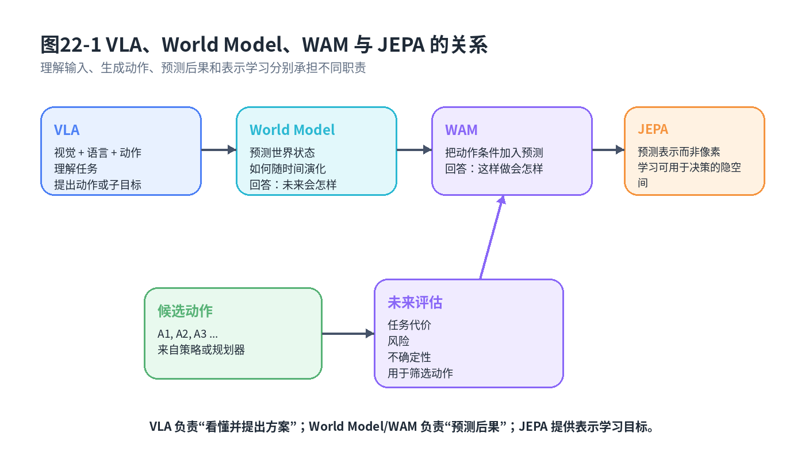

# 第20章：World Models、World Action Models 与 JEPA：机器人要学会预测动作后果

> **本章一句话导读**：本章把“动作后果预测”写成可训练的数学对象，说明 World Model、World Action Model 与 JEPA 的核心区别，并解释为什么预测误差小不必然推出控制效果好。

---

## 0. 本章要解决的问题：预测什么、条件是什么、怎么用

第19章说明了一个关键事实：policy-only 模仿只能告诉机器人“现在做什么”，不能直接告诉机器人“这样做之后世界会怎样变化”。

本章继续往前走一步：

> 如果机器人需要预测动作后果，这件事在数学上应该怎么写？又应该用什么训练目标来学习？

读本章时，只抓住四个问题：

1. **预测什么？** 是预测像素、状态、latent 表示，还是任务相关变量？
2. **条件是什么？** 是只看当前表示，还是显式输入动作、动作块和任务上下文？
3. **怎么训练？** 是最大似然、MSE、表示预测，还是任务相关预测损失？
4. **怎么用？** 预测结果是用于候选动作评估、安全判断、失败恢复，还是数据闭环？

World Model、World Action Model 和 JEPA 都围绕这四个问题展开。它们不是要替代策略，而是补上策略背后的动作后果预测能力。



**图20-1 说明**：VLA 更偏“理解输入并生成动作”，World Model 更偏“预测世界状态演化”，World Action Model 显式把动作条件放进预测过程，JEPA 强调预测隐空间表示而不是逐像素重建。这张图想说明：第20章讨论的重点不是模型名字，而是“预测对象”和“条件变量”的变化。

---

## 1. 与前后章节的衔接

第19章提出从动作模仿走向动作后果预测：机器人不能只会背动作表。本章给出数学接口：从 MDP 转移概率到 latent dynamics，从像素重建到表示预测，从普通 world model 到 action-conditioned world action model。

第21章会继续讨论：世界预测学到之后，真实机器人系统如何使用它。也就是如何把预测结果用于候选动作评估、短期 rollout、风险预测、失败恢复和安全边界。

第22章之后会讲偏好对齐和后训练。World Model 还能帮助我们把失败、接管和风险片段组织成更有用的数据闭环，并在后续部署与评估章节中形成持续改进平台。

---

## 2. 本章公式主线

第19章已经得到动作策略的基本形式。

**公式 (20.1)：条件动作策略**

$$a_t \sim \pi_\theta(a_t \mid o_{\le t},q)$$

它回答“当前应该做什么”。

但机器人还需要预测“做完之后会发生什么”，因此引入 MDP 转移概率。

**公式 (20.2)：MDP 状态转移概率**

$$P(s_{t+1} \mid s_t,a_t)$$

真实机器人通常拿不到完整状态 $s_t$，所以先把观测编码成隐表示。

**公式 (20.3)：观测到 latent state 的编码**

$$h_t=f_\phi(o_{\le t})$$

然后学习隐空间动力学。

**公式 (20.4)：一步 latent dynamics**

$$p_\eta(h_{t+1} \mid h_t,a_t)$$

如果使用确定性预测器，可以写成：

**公式 (20.5)：确定性 latent 后果预测**

$$\hat h_{t+1}=F_\eta(h_t,a_t)$$

如果要预测一段动作块的未来，就得到动作条件世界模型的基本接口。

**公式 (20.6)：动作块条件的未来表示预测**

$$\hat h_{t+1:t+H}=F_\eta(h_t,A_t,c_t)$$

如果不重建像素，而是预测未来表示，就得到 JEPA 式目标。

**公式 (20.7)：JEPA 式表示预测损失**

$$\mathcal{L}_{\mathrm{JEPA}}=\lVert g_\eta(h_t,a_t)-\mathrm{sg}(h_{t+1})\rVert_2^2$$

这条公式链说明：第20章不是介绍几个模型名字，而是在回答“如何把动作后果预测写成可训练目标”。

---

## 3. 只学策略为什么还不够

策略 $\pi_\theta(a_t \mid o_{\le t},q)$ 关注的是观测、历史和任务条件到动作的映射。它回答：

```text
我现在看到了什么 → 我现在该做什么
```

但很多机器人问题还需要回答：

```text
如果我做这个动作 → 物体会不会滑？
如果我从这个角度抓 → 夹爪会不会碰到桌面？
如果我把工件放到这个治具 → 会不会卡住？
如果我继续推进 → 人类会不会接管？
```

这些问题不是纯粹的动作回归，而是后果预测。没有世界模型，策略很容易变成短视的反射弧。

在 MDP 中，世界变化由状态转移概率描述，即公式 (20.2)：

$$P(s_{t+1} \mid s_t,a_t)$$

**符号解释**：

- $s_t$：当前真实环境状态；
- $a_t$：动作；
- $s_{t+1}$：下一时刻真实环境状态；
- $P(s_{t+1} \mid s_t,a_t)$：给定当前状态和动作后，下一状态的概率分布。

**工程含义**：真实状态 $s_t$ 通常不可完全观测，所以工程上不会直接学完整物理状态转移，而是学习观测、隐表示或任务相关变量的转移。

**常见误解**：世界模型不是必须重建高清视频。对机器人控制而言，预测“对决策有用的表示”常常比预测像素更重要。

---

## 4. 定义 20.1 World Model：从 MDP 转移到世界预测

> **定义 20.1：World Model**
>
> World Model 是一个用于预测世界状态、世界表示或任务相关变量如何随时间变化的模型。它回答的不是“现在该做什么”，而是“世界接下来可能会怎样”。

在最基础的 MDP 状态空间里，World Model 的理论起点是状态转移概率：

$$P(s_{t+1} \mid s_t,a_t)$$

但真实机器人通常拿不到完整状态 $s_t$，只能拿到图像、深度、本体状态、力觉、触觉、历史动作和语言任务等观测。因此工程中的 world model 往往预测的是下面几类对象：

| 预测对象 | 例子 | 适合回答的问题 |
|---|---|---|
| 像素 / 图像 | 下一帧 RGB、视频片段 | 未来场景大概长什么样 |
| 显式状态 | 物体位姿、速度、接触状态 | 物体会怎么运动 |
| latent state | 视觉或多模态编码后的表示 | 对控制有用的世界摘要会怎么变 |
| 任务变量 | 成功概率、风险、代价、不确定性 | 这个动作是否值得执行 |

本书更关注机器人控制，所以重点不是“预测画面有多清晰”，而是“预测对象是否对动作选择有用”。

---

## 5. 定义 20.2 Latent dynamics：为什么不一定预测像素

> **定义 20.2：Latent dynamics**
>
> Latent dynamics 是在隐空间中预测未来状态或表示的动力学模型。它先把观测编码成 latent state，再在 latent state 上建模未来变化。

由于真实状态 $s_t$ 难以获得，我们通常先把观测历史编码成隐表示，即公式 (20.3)：

$$h_t=f_\phi(o_{\le t})$$

再学习 latent dynamics，即公式 (20.4)：

$$p_\eta(h_{t+1} \mid h_t,a_t)$$

如果使用确定性预测器，可以写成公式 (20.5)：

$$\hat h_{t+1}=F_\eta(h_t,a_t)$$

如果要预测多步未来，可以写成：

**公式 (20.8)：多步 latent rollout**

$$p_\eta(h_{t+1:t+H} \mid h_t,a_{t:t+H-1})=\prod_{i=0}^{H-1}p_\eta(h_{t+i+1} \mid h_{t+i},a_{t+i})$$

这个公式隐含了三个简化假设：

1. latent state $h_t$ 已经包含预测下一步所需的主要信息；
2. 未来动作序列 $a_{t:t+H-1}$ 已知，或者由候选动作块给定；
3. rollout 过程中使用模型预测的 latent 继续向前推，因此误差可能逐步累积。

**动机**：直接预测像素太难，也不一定有用。我们希望模型在隐空间里预测未来，因为隐空间可以保留与控制相关的信息。

**工程含义**：latent dynamics 可以用于候选动作评估。比如让策略提出多个动作块，world model 预测每个动作块的未来风险，再选择更安全的方案。

---

## 6. 定义 20.3 World Action Model：动作条件的未来预测

> **定义 20.3：World Action Model**
>
> World Action Model 是显式输入动作或动作块，并预测这些动作执行后未来世界表示、任务变量或风险变化的模型。它回答的问题是：“如果执行这个动作，世界会怎样变？”

宽泛地说，World Model 学世界如何演化；World Action Model 更强调动作条件，即“给定动作，世界怎样变”。

普通 world model 可以写成：

**公式 (20.9)：一般世界演化模型**

$$p_\eta(h_{t+1} \mid h_t)$$

它问的是：世界下一步大概会怎样。

动作条件 world action model 可以写成：

**公式 (20.10)：动作条件世界模型**

$$\hat h_{t+1}=F_\eta(h_t,a_t,c_t)$$

其中，$c_t$ 可以包含语言指令、任务阶段、机器人本体状态或对象关系图。

如果预测的是一段动作块的未来，就回到公式 (20.6)：

$$\hat h_{t+1:t+H}=F_\eta(h_t,A_t,c_t)$$

这里，$A_t$ 是动作块。

**关键区别**：

| 模型 | 输入条件 | 预测对象 | 适合回答的问题 |
|---|---|---|---|
| World Model | 当前表示或历史 | 未来状态 / 表示 | 世界会怎样演化 |
| World Action Model | 当前表示 + 动作 / 动作块 | 动作执行后的未来表示 | 如果这样做，会发生什么 |
| JEPA 式模型 | 当前表示 / 局部表示 / 未来表示目标 | 未来表示 | 什么表示对未来预测有用 |

**工程含义**：第15章 Flow Matching 可以生成多个候选动作块；WAM 可以对这些候选动作块做未来评估，筛掉容易碰撞、滑动或失败的方案。

---

## 7. 定义 20.4 JEPA 式表示预测：预测表示而不是重建像素

> **定义 20.4：JEPA 式表示预测**
>
> JEPA 式表示预测是一类自监督预测思想：模型不直接重建像素，而是在隐空间中预测另一个时间、区域或视角的表示。

JEPA 的核心思想可以简化成一句话：不要逼模型还原每个像素，而是让模型预测另一个视角、另一个时间或另一个区域的表示。

一个简化的 JEPA 目标可以写成公式 (20.7)：

$$\mathcal{L}_{\mathrm{JEPA}}=\lVert g_\eta(h_t,a_t)-\mathrm{sg}(h_{t+1})\rVert_2^2$$

其中，$\mathrm{sg}(\cdot)$ 表示 stop-gradient，即目标分支不被当前损失直接更新。

**动机**：像素级重建容易把模型精力浪费在纹理、光照和背景细节上。机器人更关心对象关系、可达性、接触状态和任务进度。

**工程含义**：在机器人里，JEPA 思想可以用于自监督预训练视觉或视频表示，也可以与动作条件结合，形成动作条件的表示预测模型。

---

## 8. 训练目标：从预测分布到预测损失

如果世界模型输出的是概率分布，训练目标可以写成最大似然或负对数似然。

**公式 (20.11)：世界模型负对数似然目标**

$$\mathcal{L}_{\mathrm{NLL}}(\eta)=-\frac{1}{N}\sum_{i=1}^{N}\log p_\eta(h_{i,t+1} \mid h_{i,t},a_{i,t})$$

如果使用确定性预测器，常见训练目标是预测误差 MSE。

**公式 (20.12)：一步 latent 预测 MSE**

$$\mathcal{L}_{\mathrm{pred}}(\eta)=\frac{1}{N}\sum_{i=1}^{N}\lVert F_\eta(h_{i,t},a_{i,t})-h_{i,t+1}\rVert_2^2$$

如果预测的是任务相关变量，例如风险、成功概率或接触状态，可以写成：

**公式 (20.13)：任务相关后果预测目标**

$$\mathcal{L}_{\mathrm{task}}(\eta)=\frac{1}{N}\sum_{i=1}^{N}\ell\left(r_\eta(h_{i,t},a_{i,t}),y_{i,t+1}\right)$$

其中，$r_\eta$ 是任务相关预测头，$y_{i,t+1}$ 是真实任务标签，$\ell$ 是分类、回归或排序损失。

这说明：世界模型不是只能训练一个“预测下一帧”的模型。它可以根据工程需求预测 latent、状态、风险、成功概率或人类接管概率。

---

## 9. 预测未来状态能帮助什么：计划、安全、恢复、数据效率

世界模型至少能帮助四件事。

第一，**候选动作评估**。策略可以提出多个候选动作块，世界模型预测它们的后果，再由任务评分函数选择。

第二，**安全判断**。如果预测结果显示接触风险、碰撞风险或失败概率较高，系统可以提前拒绝动作。

第三，**失败恢复**。如果预测和真实反馈偏差很大，说明世界没有按预期发展，可以触发重规划或 fallback。

第四，**数据效率**。世界模型可以帮助系统从离线回放数据中学习更多“如果这样做会怎样”的结构，而不是只记住专家动作。

---

## 10. 命题 20.1：预测误差小不必然推出控制效果好

> **命题 20.1：预测误差小不必然推出控制效果好**
>
> 即使世界模型在平均预测误差上表现很好，也不一定保证机器人控制效果好。原因是控制成功依赖任务相关变量、安全边界、接触阈值和长期误差累积，而这些因素未必被平均预测误差充分刻画。

**证明思路**：

构造一个预测任务：大部分维度预测很准，但一个对控制至关重要的维度预测错误。平均误差仍然可能很小，但控制结果可能失败。

**证明**：

设真实未来表示为 $h_{t+1}$，预测表示为 $\hat h_{t+1}$。平均预测误差可以写成：

**公式 (20.14)：平均预测误差**

$$E_{\mathrm{pred}}=\mathbb{E}\left[\lVert \hat h_{t+1}-h_{t+1}\rVert_2^2\right]$$

假设 $h_{t+1}$ 包含很多与任务无关的维度，以及一个任务关键变量 $y_{t+1}$。例如，$y_{t+1}$ 表示“是否会碰撞”。

控制成功条件可以简化写成：

**公式 (20.15)：任务成功条件**

$$y_{t+1}<\tau_{\mathrm{risk}}$$

其中，$\tau_{\mathrm{risk}}$ 是风险阈值。

如果模型在大量非关键维度上预测准确，但在 $y_{t+1}$ 上预测错误，那么平均误差 $E_{\mathrm{pred}}$ 仍然可能很小，但系统会把高风险动作误判成安全动作。

因此，平均预测误差小不必然推出控制效果好。

**这个命题告诉我们什么？**

世界模型评估不能只看平均 MSE。必须检查预测对象是否覆盖任务关键变量，尤其是接触、碰撞、失败阈值、不可恢复状态和接管风险。

---

## 11. 与 VLA 的关系

VLA 可以被看作强大的条件策略模型。它回答：

```text
在这个视觉输入和语言任务下，应该输出什么动作？
```

World Model / WAM 则回答：

```text
如果执行这个动作，未来会发生什么？
```

二者不是替代关系，而是互补关系。

一种典型组合是：

```text
VLA / 动作策略提出候选动作
        ↓
WAM 预测候选动作后果
        ↓
风险 / 目标 / 偏好模型进行选择
        ↓
执行动作并比较预测与真实反馈
```

这条链路正是第21章要继续展开的内容。

---

## 12. 局限与适用边界

世界模型很有价值，但边界必须说清楚。

1. **短期预测可用，不代表长期 rollout 可用**。多步 rollout 会累积误差。
2. **表示预测准确，不代表接触状态预测准确**。如果 latent 没有编码接触力，预测再准也可能无法发现卡滞。
3. **视觉预测好，不代表控制安全**。漂亮视频不等于安全动作。
4. **世界模型可以辅助计划，但不能替代实机验证**。真实接触、摩擦、夹具弹性和传感器误差仍需实机闭环验证。
5. **预测误差必须和任务风险绑定**。否则模型可能在无关维度上表现很好，在关键失败变量上表现很差。

---

## 13. 读完本章，你应该能判断什么

读完本章后，你应该能判断：

1. World Model 关注世界如何变化，不只是策略如何输出动作。
2. World Action Model 的关键是显式输入动作或动作块，预测“如果这样做会怎样”。
3. JEPA 式表示预测强调预测未来表示，而不是逐像素重建。
4. 预测对象可以是像素、状态、latent state 或任务相关变量。
5. 世界模型可以用最大似然、MSE、表示预测损失或任务相关损失训练。
6. 预测误差小不必然推出控制效果好。
7. 世界模型更适合辅助候选动作评估、安全判断和失败恢复，而不是替代策略或控制器。
8. 第21章要继续回答：世界预测学到之后，真实机器人系统如何使用它。

---

## 14. 本章公式索引

### 公式 (20.1)：条件动作策略

$$a_t \sim \pi_\theta(a_t \mid o_{\le t},q)$$

- **含义**：策略根据历史观测和任务指令输出动作。
- **需要掌握到什么程度**：理解它回答“现在怎么做”。

### 公式 (20.2)：MDP 状态转移概率

$$P(s_{t+1} \mid s_t,a_t)$$

- **含义**：给定当前状态和动作，下一状态的概率分布。
- **需要掌握到什么程度**：理解它是世界预测的理论起点。

### 公式 (20.3)：观测到 latent state 的编码

$$h_t=f_\phi(o_{\le t})$$

- **含义**：把观测历史编码成世界表示。
- **需要掌握到什么程度**：理解真实机器人通常在隐空间中做预测。

### 公式 (20.4)：一步 latent dynamics

$$p_\eta(h_{t+1} \mid h_t,a_t)$$

- **含义**：在隐空间中预测动作后的下一世界表示。
- **需要掌握到什么程度**：理解它是动作后果预测的核心对象。

### 公式 (20.5)：确定性 latent 后果预测

$$\hat h_{t+1}=F_\eta(h_t,a_t)$$

- **含义**：用确定性预测器预测下一 latent state。
- **需要掌握到什么程度**：理解它常用于 MSE 训练目标。

### 公式 (20.6)：动作块条件的未来表示预测

$$\hat h_{t+1:t+H}=F_\eta(h_t,A_t,c_t)$$

- **含义**：根据候选动作块预测未来一段表示。
- **需要掌握到什么程度**：理解它是 World Action Model 的关键接口。

### 公式 (20.7)：JEPA 式表示预测损失

$$\mathcal{L}_{\mathrm{JEPA}}=\lVert g_\eta(h_t,a_t)-\mathrm{sg}(h_{t+1})\rVert_2^2$$

- **含义**：预测未来表示而不是重建像素。
- **需要掌握到什么程度**：理解 JEPA 的重点是表示预测。

### 公式 (20.8)：多步 latent rollout

$$p_\eta(h_{t+1:t+H} \mid h_t,a_{t:t+H-1})=\prod_{i=0}^{H-1}p_\eta(h_{t+i+1} \mid h_{t+i},a_{t+i})$$

- **含义**：用一步 latent dynamics 递推得到多步未来分布。
- **需要掌握到什么程度**：理解多步 rollout 会累积误差。

### 公式 (20.9)：一般世界演化模型

$$p_\eta(h_{t+1} \mid h_t)$$

- **含义**：不显式输入动作时的世界演化预测。
- **需要掌握到什么程度**：理解它与 action-conditioned WAM 的区别。

### 公式 (20.10)：动作条件世界模型

$$\hat h_{t+1}=F_\eta(h_t,a_t,c_t)$$

- **含义**：显式输入动作和上下文，预测动作后果。
- **需要掌握到什么程度**：理解它回答“如果这样做，会发生什么”。

### 公式 (20.11)：世界模型负对数似然目标

$$\mathcal{L}_{\mathrm{NLL}}(\eta)=-\frac{1}{N}\sum_{i=1}^{N}\log p_\eta(h_{i,t+1} \mid h_{i,t},a_{i,t})$$

- **含义**：用最大似然训练概率式世界模型。
- **需要掌握到什么程度**：理解它适合预测分布。

### 公式 (20.12)：一步 latent 预测 MSE

$$\mathcal{L}_{\mathrm{pred}}(\eta)=\frac{1}{N}\sum_{i=1}^{N}\lVert F_\eta(h_{i,t},a_{i,t})-h_{i,t+1}\rVert_2^2$$

- **含义**：用均方误差训练确定性 latent 预测器。
- **需要掌握到什么程度**：理解预测 loss 小不等于控制一定成功。

### 公式 (20.13)：任务相关后果预测目标

$$\mathcal{L}_{\mathrm{task}}(\eta)=\frac{1}{N}\sum_{i=1}^{N}\ell\left(r_\eta(h_{i,t},a_{i,t}),y_{i,t+1}\right)$$

- **含义**：训练模型预测成功率、风险或接管等任务相关变量。
- **需要掌握到什么程度**：理解任务相关预测比像素预测更贴近机器人控制。

### 公式 (20.14)：平均预测误差

$$E_{\mathrm{pred}}=\mathbb{E}\left[\lVert \hat h_{t+1}-h_{t+1}\rVert_2^2\right]$$

- **含义**：衡量世界模型平均预测误差。
- **需要掌握到什么程度**：理解它不必然等价于控制效果。

### 公式 (20.15)：任务成功条件

$$y_{t+1}<\tau_{\mathrm{risk}}$$

- **含义**：用任务关键变量是否低于风险阈值表示成功条件。
- **需要掌握到什么程度**：理解任务成功取决于关键变量，而不只是平均预测误差。

---

## 15. 本章定义索引

| 编号 | 概念 | 一句话含义 |
|---|---|---|
| 定义 20.1 | World Model | 预测世界状态、表示或任务变量如何随时间变化的模型 |
| 定义 20.2 | Latent dynamics | 在隐空间中预测未来状态或表示的动力学模型 |
| 定义 20.3 | World Action Model | 显式输入动作或动作块，预测动作后果的世界模型 |
| 定义 20.4 | JEPA 式表示预测 | 不重建像素，而是在隐空间预测未来表示的预测思想 |

---

## 16. 思考题

1. 为什么 World Action Model 比普通 World Model 更适合候选动作评估？
2. 如果一个模型能预测未来视频，但无法预测接触状态，它适合用于插入任务安全判断吗？为什么？
3. 请构造一个例子说明“预测误差小但控制失败”。
4. 对机械臂抓取任务，哪些任务变量 $y_{t+1}$ 比像素预测更重要？
5. 如果多步 rollout 误差会累积，工程上应该如何限制 rollout horizon？

---

## 17. 本章配图清单

- **图20-1 VLA、World Model、WAM 与 JEPA 关系图**：说明动作策略、世界预测、动作条件预测和表示预测的区别。

---

## 18. 建议阅读的附录条目

- **附录 A：数学符号与公式阅读方法**：帮助理解条件概率、公式索引和符号读法。
- **附录 B：概率论最小生存包**：帮助理解 $p(h_{t+1}\mid h_t,a_t)$ 这样的条件分布。
- **附录 D：高斯分布、MSE 与连续动作回归**：帮助理解 MSE 预测目标。
- **附录 F：强化学习与序列决策基础**：帮助理解状态转移和多步 rollout。
- **附录 G：生成模型基础**：帮助理解预测分布和隐空间建模。

---

## 19. 推荐阅读与深入材料

1. **Ha and Schmidhuber, 2018, “World Models”**
   - 类型：经典 / 世界模型。
   - 阅读目的：理解用模型学习环境动态，再辅助控制的基本思想。
   - 重点看什么：重点看 latent dynamics 和 controller 的分工。
   - 对应本章：World Model 的基础直觉。

2. **LeCun, 2022, “A Path Towards Autonomous Machine Intelligence”**
   - 类型：观点 / JEPA 思想背景。
   - 阅读目的：理解为什么预测表示可能比重建像素更重要。
   - 重点看什么：重点看 world model、energy-based model 和 JEPA 的整体架构思想。
   - 对应本章：JEPA 式表示预测。

3. **机器人 model-based planning 相关论文**
   - 类型：工程 / 规划与控制。
   - 阅读目的：理解如何用模型 rollout、评估候选动作和规避风险。
   - 重点看什么：重点看预测 horizon、误差累积和安全约束。
   - 对应本章：世界预测如何服务第21章的策略系统。

---

## 20. 本章小结

本章完成了第六篇的数学核心：把“动作后果预测”从直觉变成公式。

动作策略 $\pi_\theta(a_t \mid o_{\le t},q)$ 回答“现在怎么做”。世界模型和 WAM 回答“如果这样做，未来会怎样”。JEPA 式表示预测进一步说明：机器人不一定要重建像素，它可以预测对控制有用的未来表示。

本章最重要的警惕是命题 20.1：预测误差小不必然推出控制效果好。因此，世界模型必须和任务关键变量、安全阈值、接触状态、失败恢复和实机验证绑定起来。

第21章将继续回答：世界预测学到之后，如何真正进入机器人策略系统，服务候选动作评估、短期 rollout、风险预测、失败恢复和安全边界。
