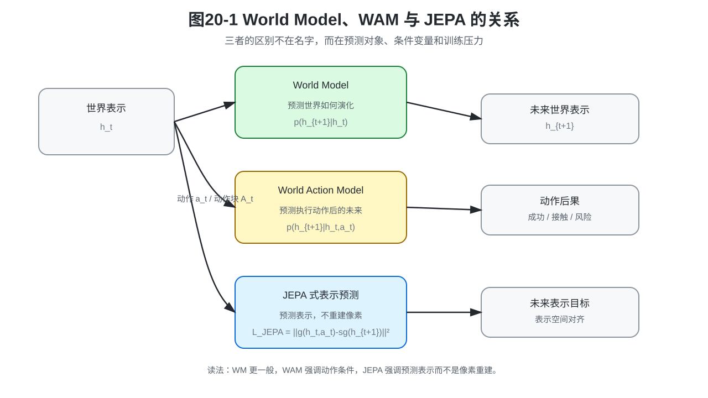
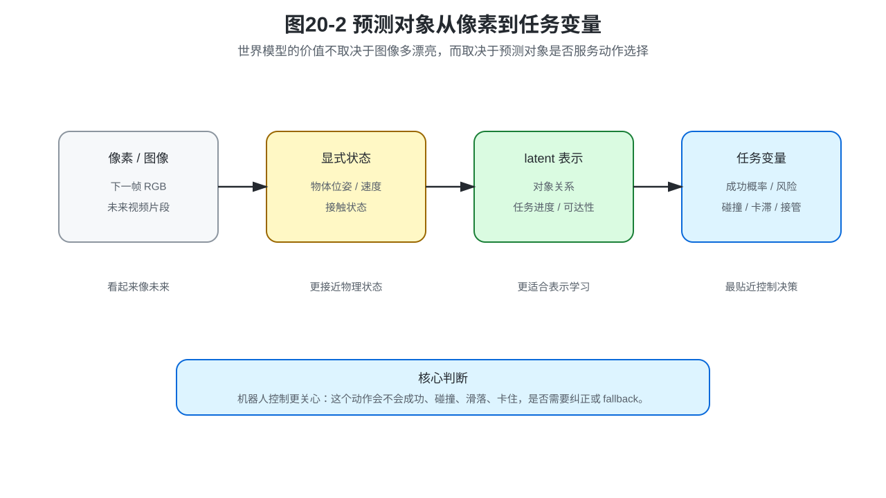
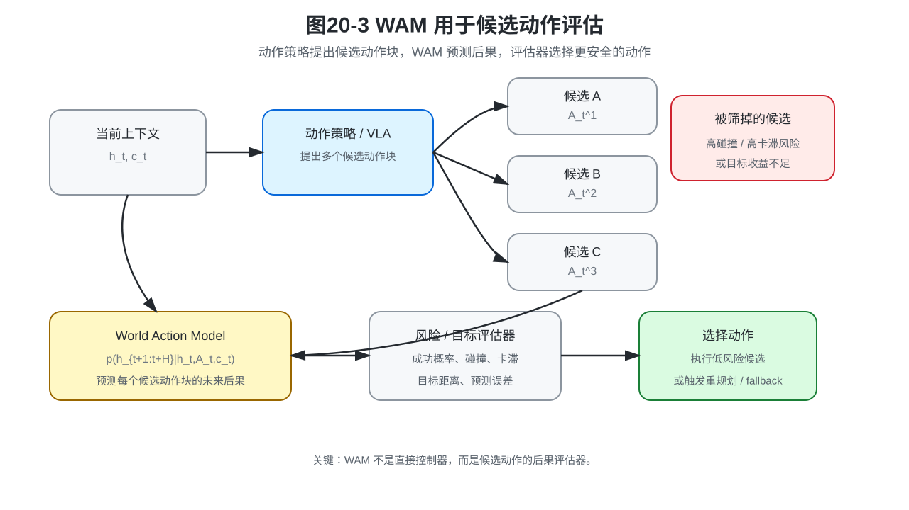
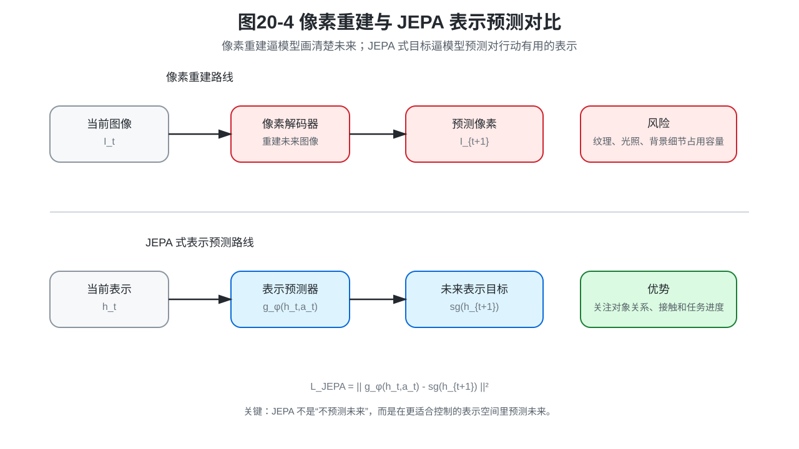

# 第20章：World Models、World Action Models 与 JEPA：机器人要学会预测动作后果

> **新版目录位置**：本章是 **第六篇：从动作模仿到世界预测** 的数学核心章。第19章说明“为什么只学动作不够”，本章回答“动作后果预测到底预测什么、条件是什么、怎么训练”。

> **本章一句话导读**：World Model 预测世界会怎样变，World Action Model 预测执行某个动作后世界会怎样变，JEPA 式方法强调预测表示而不是重建像素。

第19章已经把问题从“动作模仿”推进到“动作后果预测”。它留下了一个更具体的问题：

```text
既然机器人需要预测动作后果，这个预测模型到底长什么样？
```

本章要把这个问题拆开。

```text
预测什么：像素、状态、latent 表示，还是任务相关变量？
条件是什么：只看当前世界表示，还是显式输入动作和动作块？
怎么训练：NLL、MSE、表示预测，还是任务相关损失？
怎么使用：候选动作评估、安全判断、失败恢复，还是数据闭环？
```

World Model、World Action Model 和 JEPA 都围绕这四个问题展开。它们不是要替代策略，而是补上策略背后的动作后果预测能力。

---

## 0. 本章要解决的问题

本章要解决三个问题。

第一，World Model 为什么可以看作从 MDP 状态转移到机器人世界预测的推广。

第二，World Action Model 为什么必须显式把动作或动作块作为条件。

第三，JEPA 式表示预测为什么对机器人控制比逐像素重建更有针对性。

本章的关键不是记住模型名字，而是建立下面这条判断线：

```text
World Model：世界会怎样变？
World Action Model：如果执行这个动作，世界会怎样变？
JEPA：不必画出未来图像，但要预测对行动有用的未来表示。
```

---

## 1. 与第19章和第21章的衔接

第19章给出了动作后果预测的最小接口：

```text
当前世界表示 h_t + 候选动作 a_t → 未来世界表示 h_{t+1}
```

本章把这个接口系统化，说明三类对象的关系。

```text
World Model：预测世界表示或状态如何演化；
World Action Model：显式输入动作，预测动作后果；
JEPA：在表示空间中做预测，避免被像素重建牵着走。
```

第21章会继续回答：世界预测学到之后，真实机器人系统如何使用它。也就是如何把预测结果用于候选动作评估、短期 rollout、风险预测、失败恢复和安全边界。



---

## 2. 本章公式主线

本章公式主线是：

```text
MDP 状态转移
→ 观测历史到世界表示
→ latent dynamics
→ 动作条件未来分布
→ 动作块条件未来预测
→ JEPA 式表示预测
→ 任务相关后果预测
→ 世界模型用于候选动作评估
```

这条主线对应一个对象升级：

```text
第19章：动作后果预测接口
第20章：World Model / WAM / JEPA 的可训练形式
第21章：世界预测如何进入真实策略系统
```

---

## 3. 从 MDP 转移到 World Model

在 MDP 中，世界变化通常写成状态转移概率。

**公式 (20.1)：MDP 状态转移概率**

$$P(s_{t+1}\mid s_t,a_t)$$

这个公式回答：在状态 $s_t$ 执行动作 $a_t$ 后，下一状态 $s_{t+1}$ 的概率分布是什么。

它是世界预测的理论起点。但真实机器人系统中，我们通常拿不到完整状态 $s_t$。机器人看到的是图像、深度、本体状态、力觉、触觉、历史动作和任务指令。

因此工程中的 World Model 往往先把历史观测编码成世界表示。

**公式 (20.2)：观测历史到世界表示**

$$h_t=E_\eta(o_{\le t},q_{\le t},a_{<t})$$

其中，$h_t$ 是世界表示，$o_{\le t}$ 是历史观测，$q_{\le t}$ 是本体状态历史，$a_{<t}$ 是历史动作，$E_\eta$ 是编码器。

**定义 20.1：World Model**

World Model 是用于预测世界状态、世界表示或任务相关变量如何随时间变化的模型。它回答的不是“现在该做什么”，而是“世界接下来可能会怎样”。

World Model 可以预测很多对象。

| 预测对象 | 例子 | 适合回答的问题 |
|---|---|---|
| 像素 / 图像 | 下一帧 RGB、短视频片段 | 未来场景大概长什么样 |
| 显式状态 | 物体位姿、速度、接触状态 | 物体会怎么运动 |
| latent 表示 | 视觉或多模态编码后的表示 | 对控制有用的世界摘要会怎么变 |
| 任务变量 | 成功概率、风险、代价、不确定性 | 这个动作是否值得执行 |

本书更关注机器人控制，所以重点不是“预测画面有多清晰”，而是“预测对象是否对动作选择有用”。

---

## 4. Latent dynamics：为什么不一定预测像素

**定义 20.2：Latent dynamics**

Latent dynamics 是在隐空间中预测未来状态或表示的动力学模型。它先把观测编码成世界表示，再在世界表示上建模未来变化。

最简形式可以写成：

**公式 (20.3)：latent dynamics**

$$p_\phi(h_{t+1}\mid h_t)$$

这个公式没有显式输入动作，只描述世界表示如何从 $h_t$ 演化到 $h_{t+1}$。

但机器人控制通常不能只预测“世界自然会怎样变化”。机器人真正关心的是：

```text
如果我执行这个动作，世界会怎样变化？
```

因此，latent dynamics 对机器人控制有用，但它还不够。下一步必须把动作显式放进条件里。



**边界说明**

latent dynamics 的前提是：$h_t$ 必须包含预测未来所需的主要信息。如果编码器没有把接触力、物体位姿、关键几何关系或任务进度编码进去，那么 latent dynamics 的误差再小，也可能对控制没有用。

---

## 5. World Action Model：动作条件的未来预测

**定义 20.3：World Action Model**

World Action Model，简称 WAM，是显式输入动作或动作块，并预测这些动作执行后未来世界表示、任务变量或风险变化的模型。

它回答的问题是：

```text
如果执行这个动作，世界会怎样变？
```

单步动作条件预测可以写成：

**公式 (20.4)：动作条件未来分布**

$$p_\phi(h_{t+1}\mid h_t,a_t)$$

这正好承接第19章的动作后果预测接口。

如果策略输出的是动作块，则 WAM 应该预测一段未来表示。

**公式 (20.5)：动作块条件未来预测**

$$p_\phi(h_{t+1:t+H}\mid h_t,A_t,c_t)$$

其中，$A_t$ 是候选动作块，$c_t$ 是任务、语言或系统上下文。

这个公式非常适合和第四篇、第五篇连接起来：

```text
ACT / Diffusion / Flow / VLA 提出候选动作块；
WAM 预测候选动作块的后果；
评估器根据目标、风险和安全边界选择动作。
```

| 模型 | 输入条件 | 预测对象 | 适合回答的问题 |
|---|---|---|---|
| World Model | 当前表示或历史表示 | 未来状态 / 表示 | 世界会怎样演化 |
| World Action Model | 当前表示 + 动作 / 动作块 | 动作执行后的未来表示 | 如果这样做，会发生什么 |
| JEPA 式模型 | 当前表示与目标表示 | 未来表示 | 什么表示对未来预测有用 |



---

## 6. JEPA 式表示预测：预测表示，而不是重建像素

**定义 20.4：JEPA 式表示预测**

JEPA 式表示预测是一类自监督预测思想：模型不直接重建像素，而是在隐空间中预测另一个时间、区域或视角的表示。

在机器人控制里，可以把它简化理解为：

```text
不要逼模型把未来图像画清楚，
而是逼模型预测对动作决策有用的未来表示。
```

一种简化的 JEPA 式目标可以写成：

**公式 (20.6)：JEPA 式表示预测损失**

$$L_{JEPA}(\phi)=\lVert g_\phi(h_t,a_t)-sg(h_{t+1})\rVert^2$$

其中，$g_\phi$ 是预测器，$sg(\cdot)$ 表示 stop-gradient，即目标分支只作为预测目标，不直接被这一项反向更新。

这个目标的重点不是“未来图像长得像不像”，而是“当前表示是否包含预测未来表示所需的信息”。



**为什么不总是重建像素？**

像素级重建容易把模型精力浪费在纹理、光照、背景和无关细节上。机器人更关心对象关系、可达性、接触状态、任务进度和风险线索。

所以，对于机器人控制，预测表示通常比预测漂亮图像更贴近动作决策。

---

## 7. 任务相关后果预测：世界模型要服务行动

世界模型不一定只预测 $h_{t+1}$。它还可以预测任务相关变量。

**公式 (20.7)：任务相关后果预测**

$$p_\phi(y_{t+1}\mid h_t,a_t)$$

其中，$y_{t+1}$ 可以是成功概率、碰撞风险、接触状态、是否卡滞、目标距离、异常标签或接管概率。

如果任务变量有监督标签，可以使用任务相关损失。

**公式 (20.8)：任务相关预测目标**

$$L_{task}(\phi)=\frac{1}{N}\sum_{i=1}^{N}\ell(r_\phi(h_{i,t},a_{i,t}),y_{i,t+1})$$

这个目标提醒我们：世界模型的训练目标要和使用方式对齐。

```text
如果用于视频生成，可以看像素误差；
如果用于动作选择，要看任务变量；
如果用于安全判断，要看碰撞、接触、卡滞和不可恢复状态；
如果用于 fallback，要看预测误差和异常检测。
```

---

## 8. 命题 20.1：预测误差小不必然推出控制效果好

> **命题 20.1：预测误差与控制效果不等价**
>
> 即使世界模型在平均预测误差上表现很好，也不一定保证机器人控制效果好。

**证明思路**

构造一个预测任务。模型在大部分与任务无关的维度上预测很准，但在一个控制关键变量上预测错误。平均误差仍然可能很小，但控制结果可能失败。

**证明**

设未来表示 $h_{t+1}$ 由两部分组成：背景表示 $b_{t+1}$ 和任务关键变量 $y_{t+1}$。例如，$y_{t+1}$ 表示是否碰撞、是否卡滞或是否抓取成功。

如果模型在背景表示 $b_{t+1}$ 上预测非常准确，却把高风险状态误判成低风险状态，那么平均表示误差仍然可能很小。

但是控制是否成功，恰恰由任务关键变量决定。因此，平均预测误差小不必然推出控制效果好。

**工程含义**

世界模型评估不能只看平均 MSE。必须检查预测对象是否覆盖任务关键变量，尤其是接触、碰撞、失败阈值、不可恢复状态和接管风险。

---

## 9. 世界模型如何和 VLA / 动作策略配合

VLA 可以被看作强大的条件策略模型。它回答：

```text
在这个视觉输入和语言任务下，应该输出什么动作？
```

World Model / WAM 则回答：

```text
如果执行这个动作，未来会发生什么？
```

二者不是替代关系，而是互补关系。

一种典型组合是：

```text
VLA / 动作策略提出候选动作；
WAM 预测候选动作后果；
风险 / 目标评分进行选择；
执行动作并比较预测与真实反馈；
误差异常时纠正、重规划或 fallback。
```

这条链路正是第21章要继续展开的内容。

---

## 10. 常见误解与适用边界

| 常见误解 | 正确认识 |
|---|---|
| World Model 一定要预测像素 | 机器人更需要预测对行动有用的状态、表示或任务变量 |
| JEPA 只是少重建一点像素 | JEPA 的重点是让表示承担预测未来的压力 |
| WAM 可以替代策略 | WAM 评估候选动作后果，但仍需要策略或规划器提出动作 |
| 平均预测误差低就能控制好 | 控制成功依赖任务关键变量、安全边界和长期误差累积 |
| 多步 rollout 越长越好 | rollout 越长，误差累积和模型偏差越严重 |

适用边界也要说清楚。

第一，短期预测可用，不代表长期 rollout 可用。

第二，表示预测准确，不代表接触状态预测准确。

第三，视觉预测好，不代表控制安全。

第四，世界模型可以辅助计划，但不能替代实机验证。

第五，预测误差必须和任务风险绑定，否则模型可能在无关维度上表现很好，在关键失败变量上表现很差。

---

## 11. 与下一章的衔接

本章建立了世界预测的数学对象。

```text
World Model：预测世界表示如何变化；
World Action Model：预测动作执行后的未来；
JEPA：用表示预测替代像素重建；
任务相关预测：把世界模型和动作决策连接起来。
```

下一章继续讨论：这些预测结果怎样进入真实机器人策略系统。

也就是说，下一章关心的不是“模型怎么训练”，而是：

```text
怎样用它做候选动作评估？
怎样用它做短期 rollout？
怎样用它设置安全边界？
怎样在预测失配时触发恢复？
```

---

## 12. 读完本章，你应该能判断什么

读完本章后，你应该能判断：

1. World Model 关注世界如何变化，不只是策略如何输出动作。
2. World Action Model 的关键是显式输入动作或动作块。
3. JEPA 式表示预测强调预测未来表示，而不是逐像素重建。
4. 预测对象可以是像素、状态、latent 表示或任务相关变量。
5. 世界模型的训练目标必须和使用方式对齐。
6. 预测误差小不必然推出控制效果好。
7. 世界模型更适合辅助候选动作评估、安全判断和失败恢复，而不是替代策略或控制器。
8. 第21章要继续回答：世界预测学到之后，真实机器人系统如何使用它。

---

## 13. 本章公式索引

### 公式 (20.1)：MDP 状态转移概率

$$P(s_{t+1}\mid s_t,a_t)$$

- **含义**：给定当前状态和动作，下一状态的概率分布。

### 公式 (20.2)：观测历史到世界表示

$$h_t=E_\eta(o_{\le t},q_{\le t},a_{<t})$$

- **含义**：把历史观测、本体状态和历史动作编码成当前世界表示。

### 公式 (20.3)：latent dynamics

$$p_\phi(h_{t+1}\mid h_t)$$

- **含义**：在隐空间中预测世界表示如何自然演化。

### 公式 (20.4)：动作条件未来分布

$$p_\phi(h_{t+1}\mid h_t,a_t)$$

- **含义**：在隐空间中预测执行动作后的下一世界表示。

### 公式 (20.5)：动作块条件未来预测

$$p_\phi(h_{t+1:t+H}\mid h_t,A_t,c_t)$$

- **含义**：显式输入动作块和任务条件，预测一段未来表示。

### 公式 (20.6)：JEPA 式表示预测损失

$$L_{JEPA}(\phi)=\lVert g_\phi(h_t,a_t)-sg(h_{t+1})\rVert^2$$

- **含义**：预测未来表示，而不是逐像素重建未来图像。

### 公式 (20.7)：任务相关后果预测

$$p_\phi(y_{t+1}\mid h_t,a_t)$$

- **含义**：预测成功率、碰撞风险、接触状态等任务相关变量。

### 公式 (20.8)：任务相关预测目标

$$L_{task}(\phi)=\frac{1}{N}\sum_{i=1}^{N}\ell(r_\phi(h_{i,t},a_{i,t}),y_{i,t+1})$$

- **含义**：训练模型预测风险、成功概率、接触状态等任务相关变量。

---

## 14. 本章定义索引

| 编号 | 概念 | 一句话含义 |
|---|---|---|
| 定义 20.1 | World Model | 预测世界状态、表示或任务变量如何随时间变化的模型 |
| 定义 20.2 | Latent dynamics | 在隐空间中预测未来状态或表示的动力学模型 |
| 定义 20.3 | World Action Model | 显式输入动作或动作块，预测动作后果的世界模型 |
| 定义 20.4 | JEPA 式表示预测 | 不重建像素，而是在隐空间预测未来表示的预测思想 |

---

## 15. 思考题

1. 为什么 World Action Model 比普通 World Model 更适合候选动作评估？
2. 如果一个模型能预测未来视频，但无法预测接触状态，它适合用于插入任务安全判断吗？为什么？
3. 请构造一个例子说明“预测误差小但控制失败”。
4. 对机械臂抓取任务，哪些任务变量 $y_{t+1}$ 比像素预测更重要？
5. 如果多步 rollout 误差会累积，工程上应该如何限制 rollout horizon？
6. JEPA 式表示预测为什么可能比像素重建更适合机器人控制？

---

## 16. 配图清单

- **图20-1 World Model、WAM 与 JEPA 的关系**：说明三类模型的预测对象和条件变量区别。
- **图20-2 预测对象从像素到任务变量**：说明世界模型不一定预测像素，机器人更关心控制相关变量。
- **图20-3 WAM 用于候选动作评估**：说明动作策略提出候选动作，WAM 预测后果，评估器选择动作。
- **图20-4 像素重建与 JEPA 表示预测对比**：说明重建像素和预测表示的学习压力不同。

---

## 17. 推荐阅读：重点看什么

- **World Models 相关工作**：重点看模型如何学习环境动态，以及 world model 与 controller 如何分工。
- **model-based planning 相关工作**：重点看短期 rollout、候选动作评估和模型误差如何影响控制。
- **JEPA / 表示预测相关工作**：重点看为什么预测表示可能比重建像素更适合控制。
- **机器人安全与 fallback 工程报告**：重点看预测误差、风险阈值和人工接管如何进入真实系统。
- **附录 B、F、G、H**：分别复习条件分布、状态转移、多步 rollout、生成模型和实验评测。

---

## 18. 本章小结

本章把第19章提出的“动作后果预测”写成了可训练的数学对象。

World Model 预测世界会怎样变，World Action Model 预测执行某个动作后世界会怎样变，JEPA 式方法强调预测表示而不是重建像素。

本章最重要的结论是：世界模型不是为了画出漂亮未来，而是为了服务行动。它要帮助机器人评估候选动作、识别风险、发现预测失配，并为第21章的计划、验证和安全边界提供数学接口。