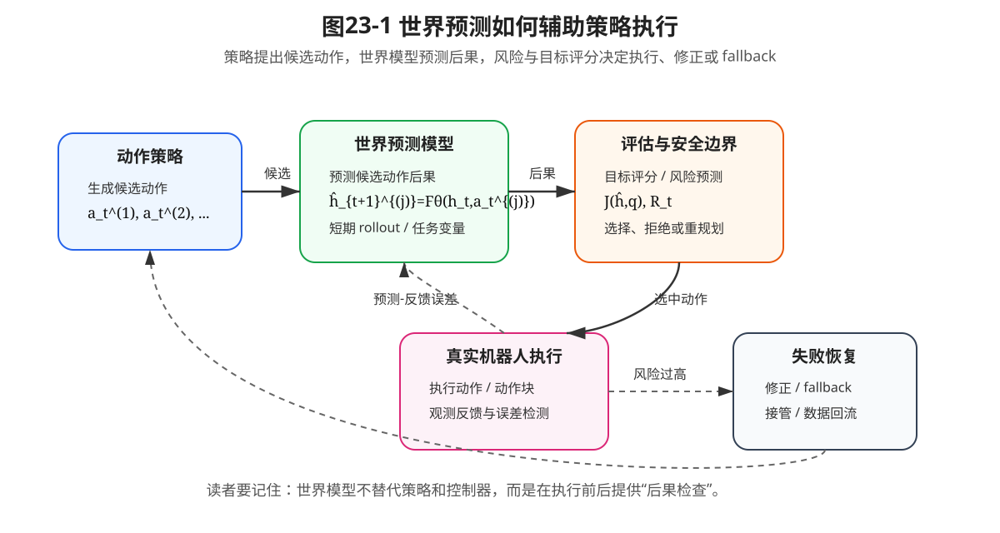

# 第21章：世界预测如何进入机器人策略系统：计划、验证与安全边界

> **本章一句话导读**：本章不再把快慢系统作为主线，而是说明世界模型学到动作后果预测之后，如何服务候选动作评估、短期 rollout、风险预测、失败恢复和安全边界。

---

## 0. 本章要解决的问题：世界预测学到之后怎么用

第19章说明了为什么只学动作不够：动作策略回答“现在怎么做”，不能自动回答“这样做之后会怎样”。

第20章进一步把动作后果预测写成数学对象：

```text
p(h_{t+1} | h_t, a_t)
\hat h_{t+1}=F_\eta(h_t,a_t)
\hat h_{t+1:t+H}=F_\eta(h_t,A_t,c_t)
```

但真实机器人系统还会继续追问：

```text
世界预测学到之后，怎么真正用起来？
```

本章回答这个问题。

世界预测不是为了让模型“想象未来”而想象未来，而是要进入策略执行链路：

```text
候选动作评估
短期 rollout
风险预测
失败恢复
安全边界
数据回流与后训练
```

本章也会保留一个补充小节讨论时间尺度、延迟和异步缓存。但这只是工程实现补充，不是本章主线。

---

## 1. 与第20章和第22章的衔接

第20章解决的是：

```text
如何预测动作后果？
```

本章解决的是：

```text
预测动作后果之后，如何辅助策略执行？
```

第22章将继续解决：

```text
当系统出现人类偏好、接管、失败恢复数据时，如何通过 Preference Alignment / DPO 改进模型？
```

因此，第19章、第20章、第21章和第22章之间的接力是：

```text
第19章：只学动作不够
      ↓
第20章：学习动作后果预测
      ↓
第21章：用世界预测辅助策略执行
      ↓
第22章：用偏好和接管数据继续后训练
```

---

## 2. 本章核心定义

> **定义 21.1：世界预测模块**
>
> 世界预测模块是指根据当前世界表示、候选动作或动作块，预测未来世界表示、任务变量或风险变化的模型。

它可以是第20章中的 World Model、World Action Model，也可以是只预测任务相关变量的轻量模型。

> **定义 21.2：候选动作评估**
>
> 候选动作评估是指先由策略生成多个候选动作或动作块，再用世界预测结果、任务评分和风险评分选择更合适的动作。

候选动作评估的重点不是“生成更多动作”，而是“不要盲目执行第一个看起来像专家的动作”。

> **定义 21.3：短期 rollout**
>
> 短期 rollout 是指用世界模型在有限 horizon 内递推预测动作序列的后果，用于判断动作块是否可行。

这里强调“短期”，因为多步预测误差会累积，长 horizon rollout 容易变成不可靠想象。

> **定义 21.4：风险预测**
>
> 风险预测是指根据世界模型预测结果估计碰撞、滑落、卡滞、接管、失败或不可恢复状态的风险。

> **定义 21.5：失败恢复**
>
> 失败恢复是指当预测风险过高或预测与真实反馈不一致时，系统触发修正、重规划、fallback、人工接管或数据回流。

---

## 3. 本章公式主线

第20章已经给出了动作后果预测：

**公式 (21.1)：一步动作后果预测**

$$\hat h_{t+1}=F_\eta(h_t,a_t)$$

本章把它放进策略执行链路。

策略先生成多个候选动作：

**公式 (21.2)：候选动作集合**

$$\mathcal{A}_t=\{a_t^{(1)},a_t^{(2)},\dots,a_t^{(K)}\}$$

世界模型预测每个候选动作的后果：

**公式 (21.3)：候选动作后果预测**

$$\hat h_{t+1}^{(j)}=F_\eta(h_t,a_t^{(j)})$$

然后用任务评分和风险评分选择动作：

**公式 (21.4)：基于预测后果的动作选择**

$$a_t^*=\arg\max_{a_t^{(j)}\in\mathcal{A}_t} J(\hat h_{t+1}^{(j)},q)-\lambda R(\hat h_{t+1}^{(j)})$$

如果要看一段动作块的后果，可以做短期 rollout：

**公式 (21.5)：短期 latent rollout**

$$\hat h_{t+\ell+1}=F_\eta(\hat h_{t+\ell},a_{t+\ell}),\quad \ell=0,\dots,H-1$$

如果风险超过阈值，就触发 fallback：

**公式 (21.6)：风险触发 fallback**

$$b_t=\mathbf{1}\{R(\hat h_{t+1:t+H})>R_{\max}\}$$

这条公式链说明：世界预测不是独立模块，而是动作选择、安全判断和失败恢复的一部分。



**图21-1 说明**：策略提出候选动作，世界模型预测候选动作后果，风险与目标评分决定执行、修正或 fallback。图中重点不是让世界模型替代策略，而是在执行前后提供“后果检查”。

---

## 4. 用世界模型评估候选动作

策略模型可以提出动作，但不代表第一个动作就一定值得执行。

在多模态策略中，候选动作可能来自：

- Diffusion Policy 的多次采样；
- Flow Matching 的不同初始噪声采样；
- VLA 给出的多个高层动作；
- 传统规划器生成的多个轨迹；
- 人类演示数据中相似状态下的多个动作片段。

如果没有世界预测，系统只能根据策略自身的概率或启发式规则选择动作。引入世界预测后，可以先预测每个候选动作的后果，再根据任务目标和风险选择。

回看公式 (21.2) 和公式 (21.3)：

$$\mathcal{A}_t=\{a_t^{(1)},a_t^{(2)},\dots,a_t^{(K)}\}$$

$$\hat h_{t+1}^{(j)}=F_\eta(h_t,a_t^{(j)})$$

每个候选动作 $a_t^{(j)}$ 都对应一个预测后果 $\hat h_{t+1}^{(j)}$。

然后可以使用公式 (21.4)：

$$a_t^*=\arg\max_{a_t^{(j)}\in\mathcal{A}_t} J(\hat h_{t+1}^{(j)},q)-\lambda R(\hat h_{t+1}^{(j)})$$

其中：

- $J(\hat h_{t+1}^{(j)},q)$：任务评分，表示这个后果是否有利于完成任务；
- $R(\hat h_{t+1}^{(j)})$：风险评分，表示碰撞、滑落、卡滞或失败风险；
- $\lambda$：风险权重。

这个公式的工程含义是：

```text
不是选“看起来最像专家”的动作，
而是选“预测后果更好、风险更低”的动作。
```

---

## 5. 用世界模型做短期 rollout

一步预测只能看到很近的后果。很多机器人任务需要判断一段动作之后会发生什么。

例如：

- 抓取时，当前一步看起来安全，但三步后夹爪会碰桌面；
- 插入时，当前误差很小，但继续推进会逐渐卡住；
- 放置时，当前轨迹可行，但动作块末端会撞到障碍物。

因此，可以用世界模型做短期 rollout，即公式 (21.5)：

$$\hat h_{t+\ell+1}=F_\eta(\hat h_{t+\ell},a_{t+\ell}),\quad \ell=0,\dots,H-1$$

这个公式读作：从当前表示开始，把预测出的下一表示继续作为输入，递推预测 $H$ 步未来。

这里必须强调“短期”。因为每一步预测都有误差，多步 rollout 会把误差带到下一步，导致越滚越偏。

所以工程上通常要限制 horizon：

```text
预测 3～10 步可能有用；
预测很长未来往往不可靠；
接触任务中的有效 horizon 通常更短。
```

第20章已经说明：预测误差小不必然推出控制效果好。本章进一步强调：即使一步预测不错，多步 rollout 也要小心使用。

---

## 6. 用世界模型预测风险和失败边界

世界预测真正有工程价值，往往不是因为它能预测所有细节，而是因为它能预测关键风险。

风险函数可以写成：

**公式 (21.7)：风险评分函数**

$$R_t=r_\psi(\hat h_{t+1:t+H},q)$$

其中：

- $r_\psi$：风险预测头或风险评分器；
- $\hat h_{t+1:t+H}$：预测未来表示序列；
- $q$：任务条件；
- $R_t$：当前候选动作或动作块的风险评分。

风险可以来自很多维度：

- 碰撞风险；
- 物体滑落风险；
- 插入卡滞风险；
- 超出关节限位风险；
- 人类接管风险；
- 不可恢复状态风险。

当风险超过阈值时，可以使用公式 (21.6) 触发 fallback：

$$b_t=\mathbf{1}\{R(\hat h_{t+1:t+H})>R_{\max}\}$$

其中，$b_t=1$ 表示触发安全逻辑。

这个设计比“失败之后再报警”更主动。它希望在执行前或执行早期就发现高风险后果。

---

## 7. 用世界模型辅助失败恢复

世界模型不仅能在执行前评估候选动作，也能在执行中比较“预测”和“现实”。

如果预测未来表示是 $\hat h_{t+1}$，真实反馈得到的表示是 $h_{t+1}$，可以定义预测误差：

**公式 (21.8)：预测反馈误差**

$$e_{t+1}=d(\hat h_{t+1},h_{t+1})$$

当误差变大时，说明现实没有按模型预期发展。此时系统不应该继续自信执行，而应该进入恢复逻辑。

可以定义恢复动作：

**公式 (21.9)：恢复策略接口**

$$u_t^{\mathrm{rec}}=\rho_\omega(h_t,e_t,R_t,q)$$

其中：

- $\rho_\omega$：恢复策略或恢复规划器；
- $h_t$：当前世界表示；
- $e_t$：预测反馈误差；
- $R_t$：风险评分；
- $q$：任务条件；
- $u_t^{\mathrm{rec}}$：恢复动作，可以是修正、重规划、回退、暂停或请求接管。

机械臂抓取中，恢复动作可能是：

- 重新调整抓取姿态；
- 放下物体重新抓；
- 切换到保守轨迹；
- 停止推进，回退一小段距离；
- 请求人工接管。

这说明世界模型不仅服务“计划”，也服务“失败后怎么救”。

---

## 8. 世界预测与策略执行的接口

世界预测要进入策略系统，不能只靠一句“加一个 world model”。它至少要定义清楚接口。

| 接口项 | 符号 | 工程含义 |
|---|---|---|
| 当前世界表示 | $h_t$ | 从观测历史编码得到的当前状态摘要 |
| 候选动作 | $a_t^{(j)}$ 或 $A_t^{(j)}$ | 策略、规划器或采样器生成的候选动作 |
| 预测后果 | $\hat h_{t+1}^{(j)}$ | 每个候选动作对应的未来表示 |
| 任务评分 | $J(\hat h,q)$ | 后果是否有利于完成任务 |
| 风险评分 | $R(\hat h)$ | 后果是否存在碰撞、滑落、卡滞等风险 |
| fallback 信号 | $b_t$ | 是否进入修正、暂停、重规划或接管 |
| 恢复动作 | $u_t^{\mathrm{rec}}$ | 系统发现异常后的恢复动作 |

这个接口表说明：世界模型不是独立炫技模块，而是策略系统的一部分。

---

## 9. 补充：时间尺度、延迟约束与异步缓存

虽然本章不再把快慢系统作为主线，但时间尺度问题仍然重要。

如果世界预测模型很慢，而低层控制频率很高，就不能让控制循环每一步都阻塞等待世界模型。

设快控制频率为 $f_{\mathrm{fast}}$，快控制周期为：

**公式 (21.10)：快控制周期**

$$\Delta t_{\mathrm{fast}}=\frac{1}{f_{\mathrm{fast}}}$$

如果某个模型要同步参与每个低层控制周期，它的推理时间 $T$ 必须满足：

**公式 (21.11)：实时推理约束**

$$T<\Delta t_{\mathrm{fast}}$$

如果世界预测模块或高层规划模块推理时间满足：

**公式 (21.12)：慢预测模块耗时关系**

$$T_{\mathrm{wm}}>\Delta t_{\mathrm{fast}}$$

那么它就不适合同步参与每个低层控制周期。工程上通常要使用异步预测、缓存结果、低频更新或只在候选动作评估阶段调用。

可以用缓存条件表示：

**公式 (21.13)：异步预测缓存**

$$\bar r_t=r_{\kappa(t)}$$

其中，$r_{\kappa(t)}$ 是最近一次世界预测或风险评估结果，$\bar r_t$ 是当前快控制周期可用的缓存结果。

如果缓存过期或风险过高，就触发 fallback。

这个小节的定位是工程补充：它说明世界预测进入系统时会遇到频率和延迟约束，但第六篇的主线仍然是动作后果预测。

---

## 10. 与 Preference Alignment / DPO 的关系

世界预测进入策略系统后，会产生大量可用于后训练的数据。

例如，同一场景下，两个候选动作可能有不同预测后果：

**公式 (21.14)：基于预测后果的偏好对**

$$\left((c_t,a_t^+),(c_t,a_t^-)\right)$$

其中，$a_t^+$ 是预测后果更安全或任务评分更高的动作，$a_t^-$ 是预测后果更差的动作。

也可以把偏好定义在动作块上：

**公式 (21.15)：动作块偏好对**

$$\left((c_t,A_t^+),(c_t,A_t^-)\right)$$

这类数据可以来自三种来源：

1. 世界模型预测结果；
2. 真实执行反馈；
3. 人类接管或人工标注。

第22章要讨论的 Preference Alignment 与 DPO，就可以把这些“哪个后果更好”的比较转化为训练信号。

---

## 11. 统一例子：机械臂抓取与放置

假设任务是：

```text
把桌子上的杯子拿起来，放到水槽旁边。
```

策略可以提出多个候选动作：

- 从杯柄一侧抓；
- 从杯口上方夹；
- 先绕开抹布再抓；
- 先轻推杯子到更稳定位置。

世界预测模型可以预测这些候选动作的后果：

- 杯子是否会滑；
- 夹爪是否会碰桌面；
- 杯子是否会倾斜；
- 水是否可能洒出；
- 放置区域是否被占用。

风险评分器可以拒绝高风险候选动作。恢复策略可以在抓取失败后让机械臂回退、重新定位或请求接管。

这就是本章主线：

```text
不是让世界模型替代策略，
而是让世界模型帮助策略在执行前后多做一次后果检查。
```

---

## 12. 常见误解与适用边界

| 常见误解 | 正确认识 |
|---|---|
| 世界模型学好了就能直接控制机器人 | 世界模型预测后果，策略和控制器仍负责动作生成和执行 |
| rollout 越长越聪明 | rollout 越长越容易误差累积，接触任务尤其明显 |
| 风险函数能覆盖所有失败 | 风险函数只覆盖被建模和被标注的失败类型 |
| 预测风险低就一定安全 | latent 可能缺失关键变量，真实系统仍需安全边界和实机验证 |
| 快慢系统是本篇主线 | 快慢系统只是世界预测进入工程系统时的补充实现问题 |

适用边界：

1. 世界模型适合辅助计划和验证，但不能替代真实控制器。
2. 短期 rollout 可用，不代表长期想象可靠。
3. 风险评分必须和真实失败数据、接管数据和实机验证绑定。
4. 对固定工位、强结构化任务，简单规则和传统控制器可能比复杂世界模型更可靠。

---

## 13. 读完本章，你应该能判断什么

读完本章后，你应该能判断：

1. 世界预测学到之后，应该进入候选动作评估、安全判断和失败恢复，而不是停留在可视化预测。
2. 候选动作评估的核心是比较不同动作的预测后果。
3. 短期 rollout 有价值，但 horizon 不能无限拉长。
4. 风险评分比平均预测误差更贴近机器人安全。
5. 预测与真实反馈的差异可以触发恢复策略。
6. 快慢系统只是世界预测进入工程系统时的补充内容，不是第六篇主线。
7. 第22章的偏好对齐可以利用预测后果、真实反馈和人类接管数据。

---

## 14. 本章公式索引

### 公式 (21.1)：一步动作后果预测

$$\hat h_{t+1}=F_\eta(h_t,a_t)$$

- **含义**：根据当前世界表示和动作预测下一世界表示。
- **需要掌握到什么程度**：理解这是第20章世界预测进入策略系统的入口。

### 公式 (21.2)：候选动作集合

$$\mathcal{A}_t=\{a_t^{(1)},a_t^{(2)},\dots,a_t^{(K)}\}$$

- **含义**：策略或规划器生成多个候选动作。
- **需要掌握到什么程度**：理解世界模型通常用于比较候选方案。

### 公式 (21.3)：候选动作后果预测

$$\hat h_{t+1}^{(j)}=F_\eta(h_t,a_t^{(j)})$$

- **含义**：为每个候选动作预测后果。
- **需要掌握到什么程度**：理解候选动作评估的基础。

### 公式 (21.4)：基于预测后果的动作选择

$$a_t^*=\arg\max_{a_t^{(j)}\in\mathcal{A}_t} J(\hat h_{t+1}^{(j)},q)-\lambda R(\hat h_{t+1}^{(j)})$$

- **含义**：在任务收益和风险之间权衡，选择候选动作。
- **需要掌握到什么程度**：理解世界预测如何影响动作选择。

### 公式 (21.5)：短期 latent rollout

$$\hat h_{t+\ell+1}=F_\eta(\hat h_{t+\ell},a_{t+\ell}),\quad \ell=0,\dots,H-1$$

- **含义**：用世界模型递推预测短期未来。
- **需要掌握到什么程度**：理解 rollout 有用但会累积误差。

### 公式 (21.6)：风险触发 fallback

$$b_t=\mathbf{1}\{R(\hat h_{t+1:t+H})>R_{\max}\}$$

- **含义**：当预测风险超过阈值时触发安全逻辑。
- **需要掌握到什么程度**：理解世界预测如何进入安全边界。

### 公式 (21.7)：风险评分函数

$$R_t=r_\psi(\hat h_{t+1:t+H},q)$$

- **含义**：根据预测未来和任务条件估计风险。
- **需要掌握到什么程度**：理解任务相关风险比平均预测误差更重要。

### 公式 (21.8)：预测反馈误差

$$e_{t+1}=d(\hat h_{t+1},h_{t+1})$$

- **含义**：比较预测未来和真实反馈。
- **需要掌握到什么程度**：理解它可以触发纠错和失败恢复。

### 公式 (21.9)：恢复策略接口

$$u_t^{\mathrm{rec}}=\rho_\omega(h_t,e_t,R_t,q)$$

- **含义**：根据当前状态、预测误差和风险产生恢复动作。
- **需要掌握到什么程度**：理解世界模型也服务失败恢复。

### 公式 (21.10)：快控制周期

$$\Delta t_{\mathrm{fast}}=\frac{1}{f_{\mathrm{fast}}}$$

- **含义**：控制频率越高，单周期可用时间越短。
- **需要掌握到什么程度**：理解这是时间尺度补充内容。

### 公式 (21.11)：实时推理约束

$$T<\Delta t_{\mathrm{fast}}$$

- **含义**：同步参与低层控制的模型必须满足实时推理约束。
- **需要掌握到什么程度**：理解慢预测模块不能阻塞控制循环。

### 公式 (21.12)：慢预测模块耗时关系

$$T_{\mathrm{wm}}>\Delta t_{\mathrm{fast}}$$

- **含义**：世界预测模块可能不适合同步每步参与控制。
- **需要掌握到什么程度**：理解为什么需要异步预测或缓存。

### 公式 (21.13)：异步预测缓存

$$\bar r_t=r_{\kappa(t)}$$

- **含义**：快控制周期使用最近一次可用的预测或风险评估结果。
- **需要掌握到什么程度**：理解异步缓存只是工程补充。

### 公式 (21.14)：基于预测后果的偏好对

$$\left((c_t,a_t^+),(c_t,a_t^-)\right)$$

- **含义**：同一条件下两个候选动作的偏好比较。
- **需要掌握到什么程度**：理解它可以引出第22章偏好对齐。

### 公式 (21.15)：动作块偏好对

$$\left((c_t,A_t^+),(c_t,A_t^-)\right)$$

- **含义**：同一条件下两个动作块的偏好比较。
- **需要掌握到什么程度**：理解动作后果预测、真实反馈和人工接管都能产生偏好数据。

---

## 15. 本章定义索引

| 编号 | 概念 | 一句话含义 |
|---|---|---|
| 定义 21.1 | 世界预测模块 | 根据当前表示和候选动作预测未来表示、任务变量或风险变化的模型 |
| 定义 21.2 | 候选动作评估 | 先生成多个候选动作，再用预测后果和风险评分选择动作 |
| 定义 21.3 | 短期 rollout | 用世界模型在有限 horizon 内递推预测动作序列后果 |
| 定义 21.4 | 风险预测 | 根据预测结果估计碰撞、滑落、卡滞、接管或失败风险 |
| 定义 21.5 | 失败恢复 | 当预测风险过高或反馈不一致时触发修正、重规划、fallback 或接管 |

---

## 16. 思考题

1. 为什么世界模型不应该替代动作策略和控制器？
2. 如果策略生成 10 个候选动作，世界模型如何帮助筛选？
3. 为什么短期 rollout 比长期 rollout 更适合接触任务？
4. 请为机械臂插入任务设计一个风险函数 $R_t$。
5. 预测反馈误差 $e_{t+1}$ 变大时，系统应该继续、修正、fallback 还是接管？如何判断？
6. 为什么快慢系统只是本章的工程补充，而不是第六篇主线？

---

## 17. 本章配图清单

- **图21-1 世界预测如何辅助策略执行**：说明策略、世界模型、风险评估、真实执行和失败恢复之间的关系。
- **图21-2 快慢时间轴与异步条件缓存**：作为补充图，说明慢预测模块和快控制循环的时间尺度差异。
- **图21-3 延迟约束与 fallback 触发**：作为补充图，说明预测模块过慢或风险过高时为什么需要 fallback。

---

## 18. 建议阅读的附录条目

- **附录 A：数学符号与公式阅读方法**：帮助理解本章公式索引和条件变量。
- **附录 F：强化学习与序列决策基础**：帮助理解 rollout、动作选择和风险约束。
- **附录 H：实验与代码基础**：帮助理解阈值标定、fallback、接管和部署监控。

---

## 19. 推荐阅读与深入材料

1. **Model Predictive Control / Model-based Planning 基础材料**
   - 类型：工程 / 规划控制。
   - 阅读目的：理解如何用模型预测候选动作后果并进行选择。
   - 重点看什么：重点看 horizon、代价函数、约束和滚动优化。
   - 对应本章：候选动作评估与短期 rollout。

2. **机器人安全与 fallback 相关工程材料**
   - 类型：工程 / 安全部署。
   - 阅读目的：理解预测风险如何进入安全边界和异常处理。
   - 重点看什么：重点看风险阈值、接管条件、急停和数据回流。
   - 对应本章：风险预测与失败恢复。

3. **Preference Alignment / DPO 相关材料**
   - 类型：后训练 / 对齐。
   - 阅读目的：理解如何把“哪个后果更好”转化成偏好数据。
   - 重点看什么：重点看成对比较数据如何进入训练目标。
   - 对应本章：第10节与第22章的衔接。

---

## 20. 本章小结

第21章完成了第六篇的收束：世界预测学到之后，必须进入策略执行链路。

它可以用于候选动作评估、短期 rollout、风险预测、失败恢复和安全边界。世界模型不是替代策略或控制器，而是帮助系统在执行前后多做一次“后果检查”。

快慢系统、异步缓存和延迟约束仍然重要，但它们只是世界预测进入工程系统时的补充问题，不再是第六篇主线。

第22章将继续讨论：当系统产生预测偏好、真实反馈、人类接管和失败恢复数据之后，如何用 Preference Alignment 与 DPO 进行后训练。
