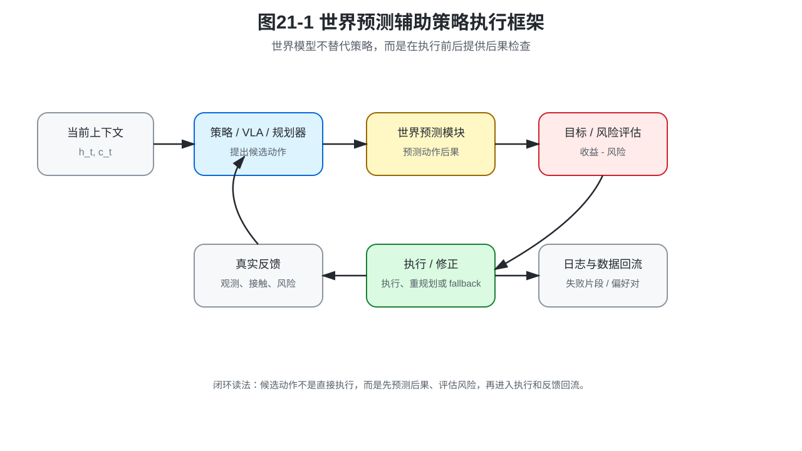
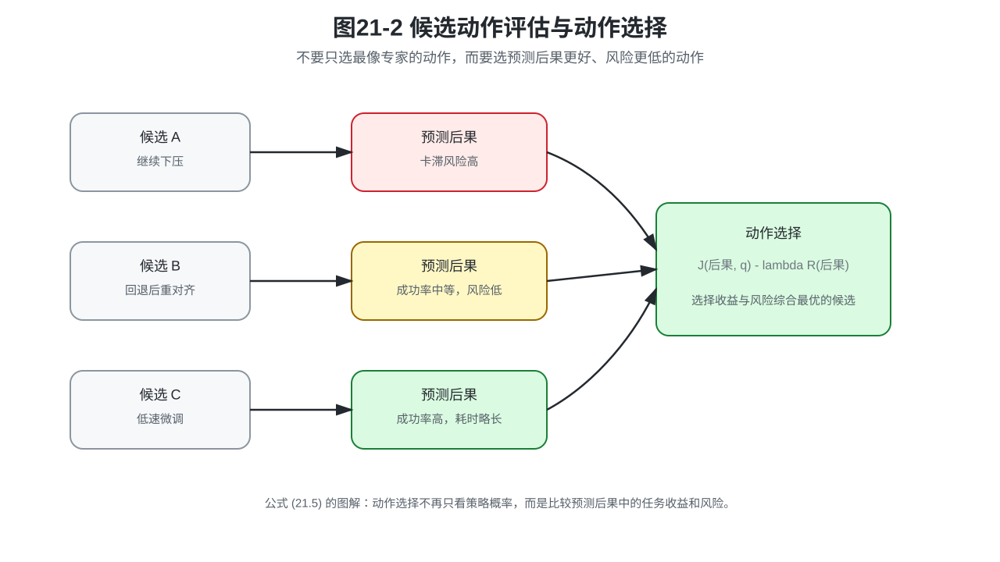
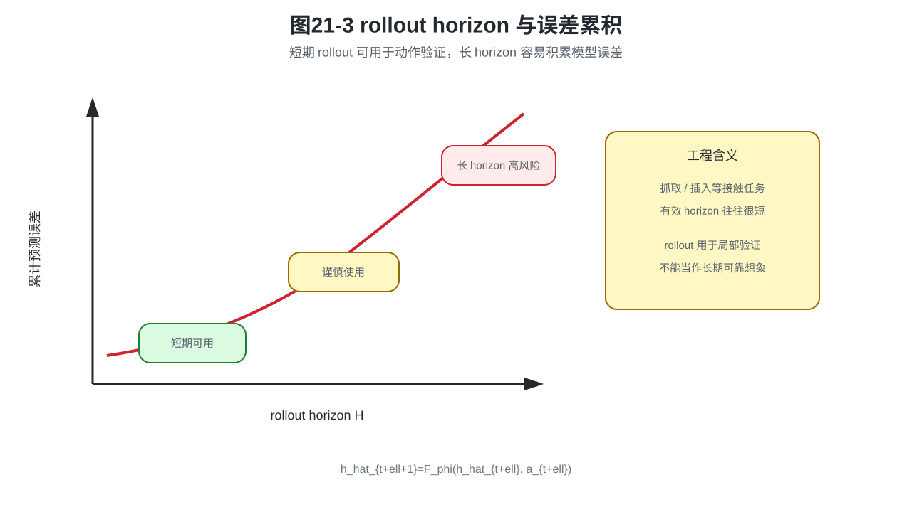
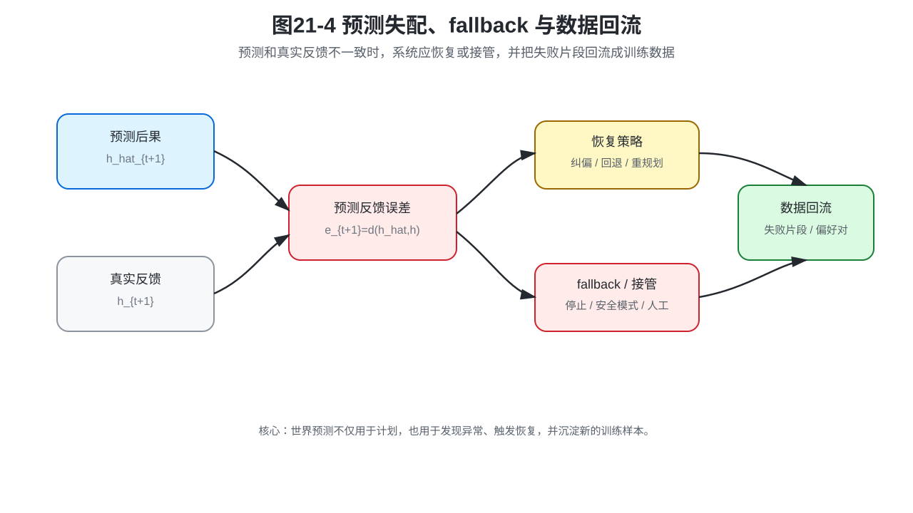

# 第21章：世界预测如何进入机器人策略系统：计划、验证与安全边界

> **新版目录位置**：本章是 **第六篇：从动作模仿到世界预测** 的系统落地章。第19章说明为什么只学动作不够，第20章说明 World Model / WAM / JEPA 如何训练，本章回答“预测结果如何真正进入机器人策略系统”。

> **本章一句话导读**：世界预测不是为了让机器人“想象未来”，而是为了进入候选动作评估、短期 rollout、风险判断、失败恢复和数据闭环。

第20章已经建立了世界预测的数学对象：

```text
World Model：预测世界表示如何变化；
World Action Model：预测执行动作后的未来；
JEPA：在表示空间中预测未来，而不是重建像素。
```

但真实机器人系统还会继续追问：

```text
这些预测结果到底怎么用？
```

本章回答这个问题。

世界预测如果只停留在“我能预测下一帧”或“我能预测 latent”，还没有真正进入机器人策略系统。它必须进入执行链路：

```text
候选动作生成；
候选动作后果预测；
任务收益与风险评分；
短期 rollout；
安全阈值判断；
失败恢复与 fallback；
执行反馈回流成新数据。
```

这就是本章的核心。

---

## 0. 本章要解决的问题

本章要解决三个问题。

第一，世界预测如何参与动作选择。

第二，世界预测如何参与安全边界与失败恢复。

第三，世界预测产生的数据如何回流到后续训练。

本章不再继续堆模型名字，而是把第20章的预测对象接入系统接口。

```text
第20章：模型预测什么？
第21章：预测结果怎么进入策略系统？
```

---

## 1. 本章公式主线

本章公式主线是：

```text
候选动作集合
→ 候选动作后果预测
→ 任务收益与风险评分
→ 基于预测后果的动作选择
→ 短期 rollout
→ 风险阈值与 fallback
→ 预测反馈误差
→ 恢复策略接口
→ 数据回流
```

对象升级可以概括为：

```text
第20章：p_phi(h_{t+1} | h_t, a_t)
第21章：用预测后果选择、验证和恢复动作
```

也就是说，本章不再问“世界模型是否能预测”，而是问“预测结果是否能改变策略系统的行为”。

---

## 2. 统一贯穿例子：插入任务中的安全验证

继续沿用第19章的孔轴插入任务。

策略或 VLA 可能提出多个候选动作块：

```text
候选 A：继续竖直下压；
候选 B：轻微回退后重新对齐；
候选 C：降低速度并沿孔壁微调；
候选 D：停止并请求人工确认。
```

如果只看策略概率，候选 A 可能最像专家示范，因为专家在训练数据中经常顺利下压。

但如果当前接触状态已经异常，世界预测可能判断：

```text
候选 A：卡滞风险高；
候选 B：成功率中等，风险较低；
候选 C：成功率较高，但耗时更长；
候选 D：安全但任务中断。
```

这时机器人不应该盲目执行最高概率动作，而应该根据预测后果、风险阈值和任务收益做选择。

---

## 3. 新数学对象定义

**定义 21.1：世界预测模块**

世界预测模块是指根据当前世界表示、候选动作或动作块，预测未来世界表示、任务变量或风险变化的模型。

它可以是第20章中的 World Model、World Action Model，也可以是只预测任务相关变量的轻量模型。

**定义 21.2：候选动作评估**

候选动作评估是指先由策略、规划器或采样器生成多个候选动作，再用世界预测结果、任务评分和风险评分选择更合适的动作。

候选动作评估的重点不是“生成更多动作”，而是“不要盲目执行第一个看起来像专家的动作”。

**定义 21.3：短期 rollout**

短期 rollout 是指用世界模型在有限 horizon 内递推预测动作序列的后果，用于判断动作块是否可行。

这里强调“短期”，因为多步预测误差会累积，长 horizon rollout 容易变成不可靠想象。

**定义 21.4：风险预测**

风险预测是指根据世界模型预测结果估计碰撞、滑落、卡滞、接管、失败或不可恢复状态的风险。

**定义 21.5：失败恢复**

失败恢复是指当预测风险过高，或者预测与真实反馈不一致时，系统触发修正、重规划、fallback、人工接管或数据回流。

---

## 4. 系统框架：世界预测如何辅助策略执行



世界预测进入机器人系统后，通常不是直接替代策略，而是放在策略和执行之间。

```text
策略 / VLA / 规划器提出候选动作；
世界预测模块预测候选动作后果；
评估器计算任务收益和风险；
系统选择执行、纠正、重规划或 fallback；
真实反馈再反过来检验预测。
```

这条链路让机器人在执行前多问一句：

```text
这个动作看起来像专家，但后果安全吗？
```

---

## 5. 候选动作集合与后果预测

策略、规划器或采样器可以先提出多个候选动作。

**公式 (21.1)：候选动作集合**

$$\mathcal{A}_t=\{a_t^{(1)},a_t^{(2)},\dots,a_t^{(K)}\}$$

如果使用动作块，也可以写成候选动作块集合。

**公式 (21.2)：候选动作块集合**

$$\mathcal{B}_t=\{A_t^{(1)},A_t^{(2)},\dots,A_t^{(K)}\}$$

候选动作可以来自多种来源：

- Diffusion Policy 的多次采样；
- Flow Matching 的不同初始噪声采样；
- VLA 给出的多个动作 token 序列；
- 传统规划器生成的多条轨迹；
- 人类示范数据中相似状态下的多个动作片段。

接下来，世界预测模块为每个候选动作预测后果。

**公式 (21.3)：候选动作后果预测**

$$\hat h_{t+1}^{(j)}=F_\phi(h_t,a_t^{(j)}),\quad j=1,\dots,K$$

动作块版本则是：

**公式 (21.4)：候选动作块后果预测**

$$\hat h_{t+1:t+H}^{(j)}=F_\phi(h_t,A_t^{(j)},c_t),\quad j=1,\dots,K$$

公式 (21.3) 和公式 (21.4) 建立了候选动作和预测后果之间的一一对应关系。

---

## 6. 基于预测后果的动作选择

有了候选动作的预测后果，就可以把动作选择写成“任务收益减风险”的形式。

**公式 (21.5)：基于预测后果的动作选择**

$$a_t^*=\underset{j\in\{1,\dots,K\}}{\arg\max}\,[J(\hat h_{t+1}^{(j)},q)-\lambda R(\hat h_{t+1}^{(j)})]$$

其中，$J$ 表示任务收益，$R$ 表示风险评分，$q$ 表示任务条件，$\lambda$ 表示风险权重。

这个公式的含义是：动作选择不再只看“像不像专家”，也不只看策略概率，而是看预测后果是否更接近目标、风险是否更低。



**工程含义**

如果候选 A 最像专家，但预测会卡滞；候选 B 不那么像专家，但预测风险更低、仍能完成任务，那么系统应该倾向于候选 B。

这正是世界预测进入策略系统的第一个价值：让动作选择从“模仿相似度”升级为“预测后果评估”。

---

## 7. 用世界模型做短期 rollout

一步预测只能看到很近的后果。很多机器人任务需要判断一段动作之后会发生什么。

例如：

- 抓取时，当前一步看起来安全，但三步后夹爪会碰桌面；
- 插入时，当前误差很小，但继续推进会逐渐卡住；
- 放置时，当前轨迹可行，但动作块末端会撞到障碍物。

因此，可以用世界模型做短期 rollout。

**公式 (21.6)：短期 latent rollout**

$$\hat h_{t+\ell+1}=F_\phi(\hat h_{t+\ell},a_{t+\ell}),\quad \ell=0,\dots,H-1$$

这个公式读作：从当前表示开始，把预测出的下一表示继续作为输入，递推预测 $H$ 步未来。

这里必须强调“短期”。因为每一步预测都有误差，多步 rollout 会把误差带到下一步，导致越滚越偏。



工程上通常要限制 horizon：

```text
短 horizon：可用于候选动作评估；
长 horizon：误差累积明显，容易变成不可靠想象；
接触任务：有效 horizon 往往更短。
```

---

## 8. 风险阈值与 fallback

世界预测真正有工程价值，往往不是因为它能预测所有细节，而是因为它能预测关键风险。

风险可以来自很多维度：

- 碰撞风险；
- 物体滑落风险；
- 插入卡滞风险；
- 超出关节限位风险；
- 人类接管风险；
- 不可恢复状态风险。

当预测风险超过阈值时，系统应该触发安全逻辑。

**公式 (21.7)：风险触发 fallback**

$$b_t=I\{R(\hat h_{t+1:t+H})>R_{max}\}$$

其中，$b_t=1$ 表示触发 fallback、重规划、暂停或接管。

这个设计比“失败之后再报警”更主动。它希望在执行前或执行早期就发现高风险后果。

**边界说明**

风险评分只覆盖被建模、被标注、被验证过的失败类型。未见过的接触模式、夹具变形、传感器异常和分布外物体，仍然需要规则安全边界和实机验证。

---

## 9. 预测反馈误差与恢复策略

世界模型不仅能在执行前评估候选动作，也能在执行中比较“预测”和“现实”。

**公式 (21.8)：预测反馈误差**

$$e_{t+1}=d(\hat h_{t+1},h_{t+1})$$

如果误差持续变大，说明真实世界没有按预测变化。此时系统不应该继续自信执行，而应该进入恢复逻辑。

**公式 (21.9)：恢复策略接口**

$$u_t^{rec}=\rho_\omega(h_t,e_t,R_t,q)$$

其中，$u_t^{rec}$ 是恢复动作，$\rho_\omega$ 是恢复策略或恢复规划器，$R_t$ 是当前风险估计，$q$ 是任务条件。

恢复动作可能是：

- 重新调整抓取姿态；
- 放下物体重新抓；
- 切换到保守轨迹；
- 停止推进，回退一小段距离；
- 请求人工接管。

这说明世界模型不仅服务“计划”，也服务“失败后怎么救”。



---

## 10. 世界预测与策略系统的接口表

世界预测要进入策略系统，不能只靠一句“加一个 world model”。它至少要定义清楚接口。

| 接口项 | 符号 | 工程含义 |
|---|---|---|
| 当前世界表示 | $h_t$ | 从观测历史编码得到的当前状态摘要 |
| 候选动作 | $a_t^{(j)}$ 或 $A_t^{(j)}$ | 策略、规划器或采样器生成的候选动作 |
| 预测后果 | $\hat h_{t+1}^{(j)}$ | 每个候选动作对应的未来表示 |
| 任务评分 | $J(\hat h,q)$ | 后果是否有利于完成任务 |
| 风险评分 | $R(\hat h)$ | 后果是否存在碰撞、滑落、卡滞等风险 |
| fallback 信号 | $b_t$ | 是否进入修正、暂停、重规划或接管 |
| 恢复动作 | $u_t^{rec}$ | 系统发现异常后的恢复动作 |

这个接口表说明：世界模型不是独立炫技模块，而是策略系统的一部分。

---

## 11. 补充：时间尺度、延迟约束与异步缓存

虽然本章不再把快慢系统作为主线，但时间尺度问题仍然重要。

如果世界预测模型很慢，而低层控制频率很高，就不能让控制循环每一步都阻塞等待世界模型。

设快控制频率为 $f_{fast}$，对应控制周期为 $\Delta t_{fast}=1/f_{fast}$。如果某个模型要同步参与每个低层控制周期，它的推理时间必须小于这个周期。

**公式 (21.10)：同步预测的延迟约束**

$$T_{pred}<\Delta t_{fast}$$

如果世界预测模块的推理时间超过低层控制周期，它就不适合同步参与每个低层控制周期。工程上通常要使用异步预测、缓存结果、低频更新，或者只在候选动作评估阶段调用。

这个小节的定位是工程补充：它说明世界预测进入系统时会遇到频率和延迟约束，但第六篇的主线仍然是动作后果预测。

---

## 12. 预测后果如何形成后续训练数据

世界预测进入策略系统后，会产生大量可用于后续训练的数据。

例如，同一场景下，两个候选动作可能有不同预测后果。一个动作更安全，另一个动作风险更高；一个动作更接近目标，另一个动作更可能失败。

这类比较数据可以记成偏好对。

**公式 (21.11)：动作偏好对**

$$(c_t,A_t^+,A_t^-)$$

其中，$A_t^+$ 表示较好的动作块，$A_t^-$ 表示较差的动作块，$c_t$ 表示当前任务和上下文条件。

这类数据可以来自三种来源：

1. 世界模型预测结果；
2. 真实执行反馈；
3. 人类接管或人工标注。

本书正文到这里完成第六篇主线。偏好对齐、DPO 和部署后训练更适合放在工程扩展或后续单独成册中讨论。

---

## 13. 常见误解与适用边界

| 常见误解 | 正确认识 |
|---|---|
| 世界模型学好了就能直接控制机器人 | 世界模型预测后果，策略和控制器仍负责动作生成和执行 |
| rollout 越长越聪明 | rollout 越长越容易误差累积，接触任务尤其明显 |
| 风险函数能覆盖所有失败 | 风险函数只覆盖被建模和被标注的失败类型 |
| 预测风险低就一定安全 | latent 可能缺失关键变量，真实系统仍需安全边界和实机验证 |
| 快慢系统是本篇主线 | 快慢系统只是世界预测进入工程系统时的补充实现问题 |

适用边界：

1. 世界模型适合辅助计划和验证，但不能替代真实控制器。
2. 短期 rollout 可用，不代表长期想象可靠。
3. 风险评分必须和真实失败数据、接管数据和实机验证绑定。
4. 对固定工位、强结构化任务，简单规则和传统控制器可能比复杂世界模型更可靠。

---

## 14. 读完本章，你应该能判断什么

读完本章后，你应该能判断：

1. 世界预测学到之后，应该进入候选动作评估、安全判断和失败恢复，而不是停留在可视化预测。
2. 候选动作评估的核心是比较不同动作的预测后果。
3. 短期 rollout 有价值，但 horizon 不能无限拉长。
4. 风险评分比平均预测误差更贴近机器人安全。
5. 预测与真实反馈的差异可以触发恢复策略。
6. 快慢系统只是世界预测进入工程系统时的补充内容，不是第六篇主线。
7. 世界预测产生的偏好对、失败片段和接管数据，可以为后续工程扩展中的后训练提供材料。

---

## 15. 本章公式索引

### 公式 (21.1)：候选动作集合

$$\mathcal{A}_t=\{a_t^{(1)},a_t^{(2)},\dots,a_t^{(K)}\}$$

- **含义**：策略或规划器生成多个候选动作。

### 公式 (21.2)：候选动作块集合

$$\mathcal{B}_t=\{A_t^{(1)},A_t^{(2)},\dots,A_t^{(K)}\}$$

- **含义**：策略或规划器生成多个候选动作块。

### 公式 (21.3)：候选动作后果预测

$$\hat h_{t+1}^{(j)}=F_\phi(h_t,a_t^{(j)}),\quad j=1,\dots,K$$

- **含义**：为每个候选动作预测未来表示。

### 公式 (21.4)：候选动作块后果预测

$$\hat h_{t+1:t+H}^{(j)}=F_\phi(h_t,A_t^{(j)},c_t),\quad j=1,\dots,K$$

- **含义**：为每个候选动作块预测未来表示序列。

### 公式 (21.5)：基于预测后果的动作选择

$$a_t^*=\underset{j\in\{1,\dots,K\}}{\arg\max}\,[J(\hat h_{t+1}^{(j)},q)-\lambda R(\hat h_{t+1}^{(j)})]$$

- **含义**：综合任务收益和风险评分选择动作。

### 公式 (21.6)：短期 latent rollout

$$\hat h_{t+\ell+1}=F_\phi(\hat h_{t+\ell},a_{t+\ell}),\quad \ell=0,\dots,H-1$$

- **含义**：用世界模型递推预测短期未来。

### 公式 (21.7)：风险触发 fallback

$$b_t=I\{R(\hat h_{t+1:t+H})>R_{max}\}$$

- **含义**：预测风险超过阈值时触发安全逻辑。

### 公式 (21.8)：预测反馈误差

$$e_{t+1}=d(\hat h_{t+1},h_{t+1})$$

- **含义**：比较预测未来和真实反馈之间的差异。

### 公式 (21.9)：恢复策略接口

$$u_t^{rec}=\rho_\omega(h_t,e_t,R_t,q)$$

- **含义**：根据当前表示、预测误差、风险和任务条件生成恢复动作。

### 公式 (21.10)：同步预测的延迟约束

$$T_{pred}<\Delta t_{fast}$$

- **含义**：如果世界预测同步参与快控制环，其推理时间必须小于快控制周期。

### 公式 (21.11)：动作偏好对

$$(c_t,A_t^+,A_t^-)$$

- **含义**：把世界预测、真实反馈或人工接管形成的动作优劣比较保存为后续训练数据。

---

## 16. 本章定义索引

| 编号 | 概念 | 一句话含义 |
|---|---|---|
| 定义 21.1 | 世界预测模块 | 根据当前表示和候选动作预测未来表示、任务变量或风险变化的模型 |
| 定义 21.2 | 候选动作评估 | 先生成多个候选动作，再用预测后果和风险评分选择动作 |
| 定义 21.3 | 短期 rollout | 用世界模型在有限 horizon 内递推预测动作序列后果 |
| 定义 21.4 | 风险预测 | 预测碰撞、滑落、卡滞、失败或不可恢复状态风险 |
| 定义 21.5 | 失败恢复 | 在预测风险过高或预测失配时触发修正、重规划、fallback 或接管 |

---

## 17. 思考题

1. 为什么世界模型不能直接替代策略或控制器？
2. 候选动作评估中，策略概率和预测风险发生冲突时，应该如何取舍？
3. 为什么短期 rollout 有价值，但长期 rollout 容易不可靠？
4. 请为孔轴插入任务设计三个风险变量 $R(\hat h)$。
5. 预测误差 $e_{t+1}$ 很大时，可能来自哪些原因？哪些原因应该触发 fallback？
6. 动作偏好对 $(c_t,A_t^+,A_t^-)$ 可以怎样从真实执行日志中构造？

---

## 18. 配图清单

- **图21-1 世界预测辅助策略执行框架**：展示候选动作、世界预测、风险评估、执行与反馈的闭环。
- **图21-2 候选动作评估与动作选择**：展示多个候选动作如何经过世界预测和风险评分后被筛选。
- **图21-3 rollout horizon 与误差累积**：说明短期 rollout 可用，长 horizon 会积累模型误差。
- **图21-4 预测失配、fallback 与数据回流**：说明预测反馈误差如何触发恢复，并形成后续训练数据。

---

## 19. 推荐阅读：重点看什么

- **model-based planning 相关工作**：重点看候选动作生成、短期 rollout 和模型误差如何影响动作选择。
- **机器人安全与 recovery policy 相关工作**：重点看异常检测、fallback、接管和失败数据回流。
- **VLA / Diffusion / Flow 与 world model 组合的系统工作**：重点看策略负责提出动作，世界预测负责验证后果的接口设计。
- **附录 F 与附录 H**：分别复习状态转移、多步 rollout、实验日志、失败样本和评测协议。

---

## 20. 本章小结

本章完成了第六篇的系统落地：世界预测不是停留在可视化预测，而是进入机器人策略执行链路。

候选动作评估让策略不再盲目执行第一个动作；短期 rollout 让系统提前看到局部未来；风险阈值和预测反馈误差让系统有机会触发 fallback；数据回流让失败片段、偏好对和接管记录成为后续训练材料。

到这里，第六篇的主线也完整闭合：

```text
只学动作不够；
需要预测动作后果；
世界预测可以写成可训练对象；
预测结果必须进入计划、验证、安全边界和恢复逻辑。
```