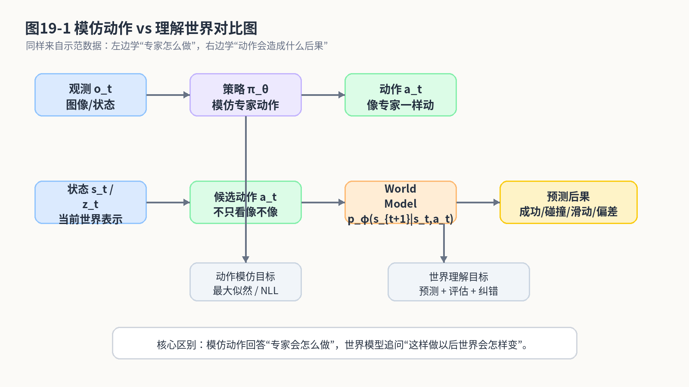
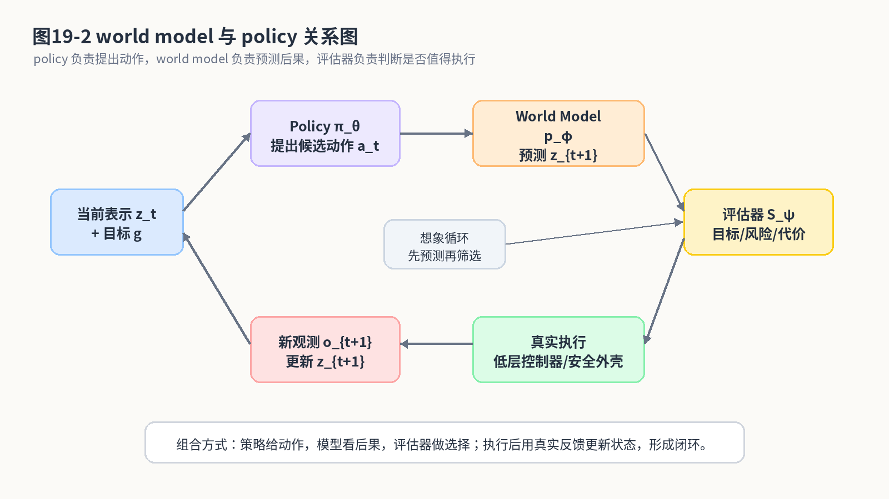
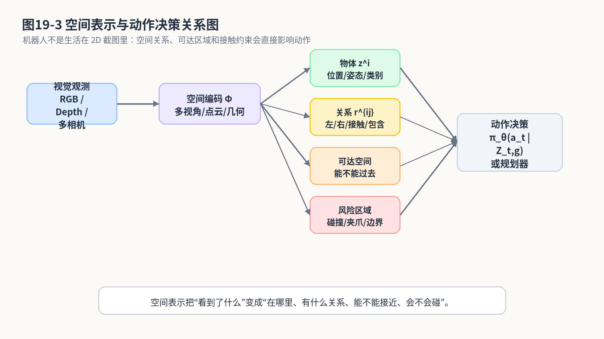
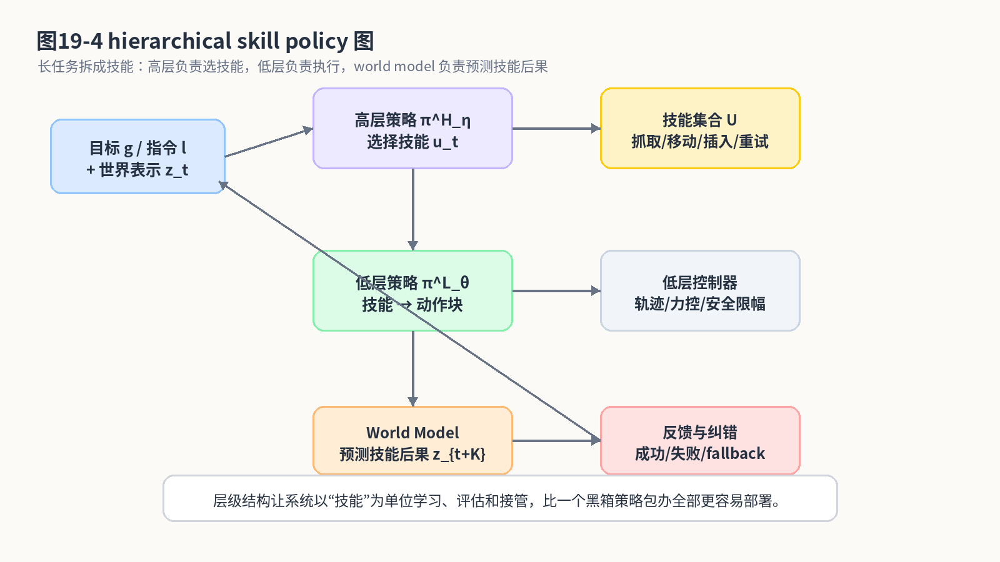

# 第21章：从动作模仿到世界理解：机器人不能只会背动作表

> **新版布局位置**：本章属于 **第六篇：世界模型、快慢系统与认知架构**。本章编号、公式编号与交叉引用已按新版八篇结构统一调整。


> **本章一句话导读**：本章从动作模仿走向世界理解，说明机器人为什么不能只背动作表，还要建立空间与因果直觉。


> 第20章我们讲了 VLA：视觉、语言和动作终于坐到了同一张麻将桌上。模型可以看图、读指令、输出动作，看起来已经很像“机器人基础模型”的样子。可是，机器人真正干活时还会遇到一个更麻烦的问题：它不仅要知道**现在该怎么动**，还要知道**动完以后世界会发生什么**。本章要讨论的就是这件事：从动作模仿走向世界理解。先把结论放在前面：模仿学习可以让机器人学会“像专家那样做”，但如果机器人完全不知道物体会滑、夹爪会碰、孔位会卡、失败后要补救，那么它很容易变成一个只会背动作表的高维复读机。

---

## 1. 本章开场：会背动作，不等于懂世界

在前面的章节里，我们一路从 Behavior Cloning 走到了 VLA。这个过程像是在给机器人不断升级“模仿能力”：

```text
BC：看到观测，回归动作。
ACT：看到观测，输出一段动作块。
Diffusion Policy：在观测条件下生成动作分布。
Decision Transformer：把轨迹当序列建模。
VLA：把视觉、语言、状态、历史动作放进统一上下文里生成动作。
```

这条路线非常重要。没有它，机器人根本学不到复杂操作中的细腻动作。

但只会模仿动作还不够。

想象一个机械臂在做装配。专家示范时，插销刚好对准孔位，轻轻一推就进去了。机器人学到的动作轨迹也很漂亮。可是上线后，孔位偏了 1 毫米，夹具弹性变了，工件表面有毛刺，机械臂一推，卡住了。

这时，机器人如果只会背专家动作，就会继续推。它的内心戏大概是：

```text
专家当时就是这么推的。
我也这么推。
虽然现在好像不太对劲。
但公式让我这么推。
```

然后现场工程师的内心戏是：

```text
别推了，再推夹具要报警了。
```

问题在哪里？

问题在于：专家不只是做动作。专家脑子里还有一个隐含模型：

- 这个物体被推会不会滑；
- 这个杯子抓哪里更稳；
- 插销如果没对准，力会怎么变；
- 如果动作失败，应该退回来重试，还是调整姿态；
- 当前场景和以前示范时有哪些不同。

这些东西很难只从单步动作回归里直接得到。它们更接近我们本章要讨论的对象：**世界模型**、**空间理解**、**物体中心表示**、**技能抽象**和**闭环纠错**。

本章不是要把世界模型讲成一个万能钥匙。世界模型也不是“机器人终于有灵魂了”的营销词。它在数学上更朴素：

> 给定当前状态和动作，预测未来世界会怎样变化。

用最简单的公式写，就是：

$$
p_\phi(s_{t+1}\mid s_t,a_t) \tag{21.1}$$

这个公式看起来短，但它问的问题非常硬：

```text
如果我现在这样动，下一刻世界会变成什么样？
```

会问这个问题，机器人就不再只是“看见什么就做什么”；它开始有一点点“先想后动”的味道。

---

## 2. 本章要解决的核心问题

本章围绕以下 20 个问题展开：

1. 为什么模仿动作不等于理解世界？
2. world model 在数学上到底是什么？
3. 状态转移模型 $p(s_{t+1}\mid s_t,a_t)$ 在说什么？
4. 为什么真实机器人很难直接拿到完整状态 $s_t$？
5. latent dynamics 为什么要引入隐变量 $z_t$？
6. 预测未来观测和预测未来状态有什么区别？
7. world model 和 policy 是什么关系？
8. model-based planning 如何利用预测模型选动作？
9. 空间表示为什么对机器人操作很重要？
10. object-centric representation 为什么比整张图特征更适合某些操作任务？
11. affordance 可供性可以怎样写成概率模型？
12. 为什么 VLA 仍然需要空间理解？
13. hierarchical policy 为什么适合长程任务？
14. skill abstraction 如何缓解动作序列太长的问题？
15. 闭环纠错为什么不能只靠 open-loop 模仿？
16. 预测误差如何帮助发现分布外状态？
17. 世界模型能否替代真实试错？
18. 世界模型在工业机器人、自动驾驶和泊车中分别有什么价值？
19. 它有哪些工程坑和误区？
20. 本章如何为第25章工程部署铺垫？

---


### 主线定位与统一例子

为了让本章不变成孤立知识点，读本章时请始终把公式落回两个统一例子：

- **二维点机器人跟随专家轨迹**：状态可写成位置/速度，动作可写成二维控制量，适合观察状态分布、轨迹分布和误差累积。
- **机械臂末端运动/抓取轨迹模仿**：观测包含图像或本体状态，动作包含末端位姿增量或关节控制量，适合理解连续动作、多模态动作、动作块和实机闭环。

- **承接前文**：承接第20章：模型能听懂任务还不够，执行时还要理解后果。
- **本章推进**：引入 dynamics/world model、belief、affordance 和层级策略。
- **铺垫后文**：为第25章把策略模型接入真实系统、评测、监控和数据闭环做准备。
- **公式阅读抓手**：世界模型的价值不是替代策略，而是帮助预测后果、发现异常和支持闭环修正。
- **建议同步回看**：附录 F、H。

## 3. 先区分两件事：模仿动作 vs 理解后果

行为克隆的核心公式是：

$$
\pi_\theta(a_t\mid o_t) \tag{21.2}$$

它问的是：

```text
在当前观测 o_t 下，专家会做什么动作 a_t？
```

而世界模型的核心公式是：

$$
p_\phi(s_{t+1}\mid s_t,a_t) \tag{21.3}$$

它问的是：

```text
在当前状态 s_t 下，如果执行动作 a_t，下一状态 s_{t+1} 会是什么？
```

这两个问题非常不一样。

第一个问题关心“专家怎么做”。第二个问题关心“世界怎么变”。

这就像学开车。只模仿老司机打方向盘，你可以学到很多经验；但如果你完全不知道车速、摩擦、转向半径、障碍物运动规律，只会在相似场景里复读动作，那遇到雨天、坡道、窄车位、行人横穿时，就会开始露馅。

我们先用一张图建立直觉。



**图21-1 说明**：左侧的动作模仿只学习“观测到动作”的映射，重点是像专家；右侧的世界理解额外学习“动作到后果”的预测，重点是知道动作会让环境如何变化。真实机器人系统通常需要两者结合：没有动作模仿，机器人不会做；没有世界理解，机器人不知道做错了会怎样。

这里有一个容易误解的点：

> 世界模型不是要否定模仿学习，而是补上模仿学习里缺失的“后果建模”。

模仿学习解决的是“经验从哪里来”；世界模型解决的是“经验能不能被推演、检查和纠错”。

如果把机器人策略比作驾驶员，模仿学习像是跟老司机学开车，世界模型像是脑子里有一套对车辆和环境变化的预判。老司机也不是每次都死记动作，他会想：这把方向打下去，车头会怎样；这个距离刹车，能不能停住；这辆车可能会不会突然变道。

机器人也需要类似能力。

---

## 4. 公式拆解一：状态转移模型到底在预测什么？

先看最基础的状态转移模型：

$$
p_\phi(s_{t+1}\mid s_t,a_t) \tag{21.4}$$

这个式子中：

- $s_t$：当前真实状态；
- $a_t$：当前执行的动作；
- $s_{t+1}$：下一时刻真实状态；
- $p_\phi$：参数为 $\phi$ 的预测模型；
- 条件符号 $\mid$：表示“在已知 $s_t$ 和 $a_t$ 的条件下”；
- 整个式子表示一个条件概率分布。

为什么是概率分布，而不是一个确定函数？

因为真实世界不总是完全确定。机械臂夹一个杯子，下一刻杯子可能稳稳抬起，也可能轻微滑动；自动驾驶车辆打一点方向，下一刻位置变化还会受到轮胎、地面、延迟、控制误差影响；泊车时同样的控制量，在坡道和水平地面上的结果可能不同。

所以更合理的写法不是：

$$
s_{t+1}=f_\phi(s_t,a_t) \tag{21.5}$$

而是：

$$
s_{t+1}\sim p_\phi(\cdot\mid s_t,a_t) \tag{21.6}$$

也就是：下一状态是从一个条件分布里“长出来”的。

如果环境足够稳定，分布可能很窄，看起来像确定函数；如果环境不确定性很大，分布就会变宽。工程上，这个“宽不宽”很重要。因为它告诉我们：模型对未来后果是否有把握。

### 4.1 预测模型的训练目标

如果我们有一批交互数据：

$$
\mathcal D=\{(s_t,a_t,s_{t+1})\}_{t=1}^N \tag{21.7}$$

一个自然训练目标是最大似然：

$$
\phi^*=\arg\max_\phi
\sum_{t=1}^N
\log p_\phi(s_{t+1}\mid s_t,a_t) \tag{21.8}$$

它的意思是：调整模型参数 $\phi$，让真实发生的下一状态 $s_{t+1}$ 在模型预测分布下概率尽可能高。

把它改写成最小化负对数似然：

$$
\mathcal L_{\mathrm{dyn}}(\phi)
=
-\mathbb E_{(s_t,a_t,s_{t+1})\sim\mathcal D}
\left[
\log p_\phi(s_{t+1}\mid s_t,a_t)
\right] \tag{21.9}$$

这和第2章行为克隆的负对数似然形式非常像。区别在于：

- BC 学的是 $p(a_t\mid o_t)$，也就是“观测到动作”；
- 动力学模型学的是 $p(s_{t+1}\mid s_t,a_t)$，也就是“状态和动作到下一状态”。

一个学专家怎么动，一个学世界怎么变。

如果我们假设下一状态是高斯分布：

$$
p_\phi(s_{t+1}\mid s_t,a_t)
=
\mathcal N\left(s_{t+1};\mu_\phi(s_t,a_t),\sigma^2 I\right) \tag{21.10}$$

在固定方差 $\sigma^2$ 下，最大似然会退化成 MSE 形式：

$$
\mathcal L_{\mathrm{MSE}}(\phi)
=
\mathbb E_{\mathcal D}
\left[
\left\|s_{t+1}-\mu_\phi(s_t,a_t)\right\|^2
\right] \tag{21.11}$$

这里要特别提醒：

> MSE 不是凭空来的。它隐含了“预测误差服从固定方差高斯分布”的假设。

如果未来状态具有多模态，比如推一个物体可能向左滑也可能向右滑，用单个均值去预测就会遇到第7章讲过的“平均答案”问题。世界模型也会被 MSE 平均掉。

机器人学习里，平均答案经常不是答案，而是事故预告。

---

## 5. 为什么真实机器人很难直接使用 $s_t$

上面的公式写得很干净：给定 $s_t$，预测 $s_{t+1}$。可是真实机器人里，完整状态 $s_t$ 经常拿不到。

什么叫完整状态？

以桌面操作为例，完整状态可能包括：

- 每个物体的 6D 位姿；
- 物体几何形状；
- 材质、摩擦系数、质量；
- 接触点和接触力；
- 机械臂关节状态；
- 夹爪和物体之间的相对关系；
- 被遮挡物体的真实位置；
- 桌面是否有水、油污或轻微倾斜。

你会发现，这些东西大多数相机看不全，传感器也不一定测得到。真实系统里我们更常拿到的是观测 $o_t$：图像、深度、点云、本体状态、力传感器读数等。

所以策略通常写成：

$$
\pi_\theta(a_t\mid o_t) \tag{21.12}$$

而世界模型也可能写成观测预测：

$$
p_\phi(o_{t+1}\mid o_t,a_t) \tag{21.13}$$

但直接预测像素级未来观测很难。因为图像里有很多和任务无关的东西：光照变化、背景纹理、阴影、反光、相机噪声。机器人真正关心的可能只是：杯子有没有滑、夹爪是否接触、孔和销是否对齐。

于是我们引入隐变量表示 $z_t$。

---

## 6. 公式拆解二：latent dynamics 为什么要引入 $z_t$

隐变量动力学通常写成：

$$
z_t = e_\phi(o_{\le t},a_{<t}) \tag{21.14}$$

$$
p_\phi(z_{t+1}\mid z_t,a_t) \tag{21.15}$$

这里：

- $o_{\le t}$：到当前为止的观测历史；
- $a_{<t}$：过去动作；
- $e_\phi$：编码器，把观测历史压缩成 latent state；
- $z_t$：模型内部认为重要的状态表示；
- $p_\phi(z_{t+1}\mid z_t,a_t)$：latent dynamics，也就是隐空间里的状态转移。

为什么要这样做？

因为 $z_t$ 可以过滤掉不重要的细节，只保留对预测和决策有用的信息。比如图像里桌子的木纹不重要，杯子和夹爪的位置重要；背景墙上贴纸不重要，孔位是否对齐重要。

如果还需要从 latent state 生成未来观测，可以加一个解码器：

$$
p_\phi(o_{t+1}\mid z_{t+1}) \tag{21.16}$$

这样整个预测过程变成：

```text
观测历史 → latent state → 动作条件下的 latent 下一状态 → 未来观测或任务相关预测
```

写成一条链就是：

$$
o_{\le t},a_{<t}
\xrightarrow{e_\phi}
z_t
\xrightarrow{p_\phi(z_{t+1}\mid z_t,a_t)}
z_{t+1}
\xrightarrow{d_\phi}
\hat o_{t+1} \tag{21.17}$$

公式 $(19.17)$ 看起来像生成模型，但它的工程目标不是“画出一张漂亮未来图”。对机器人来说，更重要的是预测任务相关后果：

- 抓取是否会成功；
- 物体是否会滑动；
- 是否会碰撞；
- 是否接近目标状态；
- 当前动作是否会让任务进入不可恢复状态。

所以很多时候，我们不必追求像素级重建，而可以预测更低维、更任务相关的变量：

$$
p_\phi(y_{t+1}\mid z_t,a_t) \tag{21.18}$$

这里 $y_{t+1}$ 可以是接触状态、成功概率、物体位姿、风险标签、可达性评分等。

工程上常见的坑是：模型把未来图像预测得很模糊，论文图看起来像近视眼摘了眼镜，但实际任务相关变量未必预测得差。反过来，图像重建很清楚，也不代表控制决策一定可靠。机器人不是摄影比赛选手，预测要服务于行动。

---

## 7. world model 和 policy 的关系：一个负责想后果，一个负责选动作

现在我们把 policy 和 world model 放到一起。

policy 学的是：

$$
a_t\sim \pi_\theta(\cdot\mid z_t,g) \tag{21.19}$$

world model 学的是：

$$
z_{t+1}\sim p_\phi(\cdot\mid z_t,a_t) \tag{21.20}$$

一个负责“怎么动”，一个负责“动完会怎样”。

更完整的关系可以用图表示。



**图21-2 说明**：policy 根据当前表示和目标生成候选动作；world model 预测这些动作的未来后果；评估器根据目标、风险和任务代价选择更合适的动作；真实执行后得到新观测，再更新表示。这不是替代模仿学习，而是在模仿学习策略外增加“后果想象”和“闭环检查”。

这张图里有两个循环。

第一个是**想象循环**：

```text
当前表示 z_t → 候选动作 a_t → 预测未来 z_{t+1} → 评估好不好
```

第二个是真实闭环：

```text
执行动作 → 获得真实观测 → 更新表示 → 继续决策
```

如果只有真实闭环，没有想象循环，机器人可能每一步都靠策略直出动作，出错后再说。如果有世界模型，机器人可以在执行前先做一点预测：这个动作会不会撞？会不会离目标更远？会不会进入危险区域？

这就是 model-based planning 的入口。

---

## 8. 公式拆解三：model-based planning 如何用模型选动作

假设我们有一个代价函数：

$$
c(z_t,a_t,g) \tag{21.21}$$

它表示在 latent state $z_t$、执行动作 $a_t$、目标为 $g$ 时的代价。代价越小越好。比如：离目标越远代价越大，碰撞风险越高代价越大，动作越剧烈代价越大。

如果我们想规划未来 $H$ 步动作，可以写成：

$$
a_{t:t+H-1}^*
=
\arg\min_{a_{t:t+H-1}}
\mathbb E_{p_\phi}
\left[
\sum_{k=0}^{H-1}
\gamma^k c(z_{t+k},a_{t+k},g)
\right] \tag{21.22}$$

这是本章最重要的公式之一。我们慢慢拆。

- $a_{t:t+H-1}$：从当前时刻开始的未来 $H$ 步动作序列；
- $a_{t:t+H-1}^*$：规划出来的最优动作序列；
- $\arg\min$：找一个让后面目标最小的动作序列；
- $c(z_{t+k},a_{t+k},g)$：第 $k$ 步的代价；
- $\gamma^k$：折扣因子，让远期代价可以被折扣；
- $\mathbb E_{p_\phi}$：因为未来状态由世界模型预测，可能是不确定的，所以要对预测分布取期望。

它的直觉是：

> 不要只看当前动作像不像专家，而要看一串动作执行后，预测未来会不会更接近目标、更安全、更稳定。

如果我们用奖励函数而不是代价函数，也可以写成最大化：

$$
a_{t:t+H-1}^*
=
\arg\max_{a_{t:t+H-1}}
\mathbb E_{p_\phi}
\left[
\sum_{k=0}^{H-1}
\gamma^k r(z_{t+k},a_{t+k},g)
\right] \tag{21.23}$$

第10章讲 IRL 时我们讨论过奖励函数不一定容易定义。这里也一样。world model 可以预测未来，但“未来好不好”仍然需要评价标准。

这也是为什么世界模型不是万能的。它至少需要三件东西配合：

1. **状态表示**：知道当前是什么情况；
2. **动力学预测**：知道动作会导致什么变化；
3. **目标/代价/奖励**：知道什么变化是好的，什么变化是坏的。

少一个都不行。

有世界模型但没有目标，就像导航知道所有路况，但不知道你要去哪。知道得越多，迷路得越高级。

---

## 9. planning 不一定要替代 policy：它也可以当安全审查员

一提到 model-based planning，很多人会想到“用规划替代神经策略”。但真实系统中，更实用的方式往往是组合。

例如模仿学习策略先给出动作：

$$
a_t^{\mathrm{IL}}\sim \pi_\theta(\cdot\mid z_t,g) \tag{21.24}$$

世界模型预测执行这个动作后的风险：

$$
\hat z_{t+1}\sim p_\phi(\cdot\mid z_t,a_t^{\mathrm{IL}}) \tag{21.25}$$

风险模型输出：

$$
\rho_t = R_\psi(z_t,a_t^{\mathrm{IL}},\hat z_{t+1},g) \tag{21.26}$$

如果 $\rho_t$ 超过阈值，就触发修正或 fallback：

$$
a_t=
\begin{cases}
a_t^{\mathrm{IL}}, & \rho_t < \delta,\\
a_t^{\mathrm{safe}}, & \rho_t \ge \delta.
\end{cases} \tag{21.27}$$

这个公式很工程。它说的不是“让世界模型统治一切”，而是：

> 模仿学习策略负责提出动作，世界模型和风险模型负责检查这个动作会不会把系统带进坑里。

这特别适合真实机器人部署。因为很多时候，我们并不希望大模型直接自由规划所有动作，而是希望它在一个安全边界内工作。

比如工业抓取：策略可以提出抓取点和放置动作，但碰撞检查、力阈值、速度限制、夹爪保护、治具边界都必须由安全外壳把关。否则模型再聪明，也可能因为一个分布外反光、一张没见过的工件图，把夹爪送到不该去的地方。

---

## 10. 空间理解：机器人不是生活在 2D 截图里

VLA 能看图，Transformer 能建模 token，但机器人最终生活在三维空间里。

人类看到一张桌面图像时，不只是识别“杯子、盘子、桌子”，还会自动理解：

- 杯子在盘子左边；
- 夹爪从上方接近会不会撞；
- 杯子把手朝哪边；
- 盘子边缘有高度；
- 手臂能不能绕开障碍物；
- 物体被遮挡时，可能在哪里。

这就是空间表示的重要性。

我们可以把视觉观测编码成空间表示：

$$
Z_t = \Phi(o_{\le t}) \tag{21.28}$$

这里 $Z_t$ 不一定是一个向量。它可以是：

- 2D feature map；
- 3D voxel grid；
- point cloud features；
- object set；
- scene graph；
- occupancy map；
- neural field；
- 多视角融合后的场景表示。

策略就可以写成：

$$
\pi_\theta(a_t\mid Z_t,g) \tag{21.29}$$

如果 $Z_t$ 包含更好的空间关系，策略就不必把所有几何信息都从原始像素里硬猜出来。



**图21-3 说明**：视觉观测经过空间编码，形成物体、几何关系、可达空间、接触区域和障碍信息，再进入策略或规划模块。空间表示不是为了“看起来高级”，而是为了让动作决策知道物体在哪里、怎么接近、会不会碰、目标关系是否满足。

对于自动驾驶和泊车，空间表示同样关键。感知系统输出障碍物、车位、可行驶区域、地图结构和动态目标预测，规划控制才知道怎么走。一个只看前视图像直接输出方向盘角的模型，在简单道路上可能表现不错，但遇到窄路会车、遮挡行人、非标准车位、路沿高度变化时，缺少空间结构会让风险快速上升。

所以本章的观点是：

> VLA 让机器人更会对齐语言和视觉；空间理解让机器人知道这些视觉对象在真实世界里如何约束动作。

二者不是替代关系，而是互补关系。

---

## 11. object-centric representation：不要把整张图揉成一坨

很多神经网络会把整张图编码成一个大向量：

$$
z_t = f_\theta(o_t) \tag{21.30}$$

这个向量当然有用，但在机器人操作中，有时我们更希望表示成一组物体：

$$
Z_t=\{z_t^1,z_t^2,\dots,z_t^N\} \tag{21.31}$$

其中 $z_t^i$ 表示第 $i$ 个物体或实体的状态，例如位置、朝向、类别、形状、速度、可抓取区域、接触属性等。

为什么这很重要？

因为很多任务本来就是围绕物体关系定义的：

```text
把红杯子放到盘子里。
把螺丝插入孔中。
把 A 放在 B 左侧。
避开障碍 C 抓取目标 D。
```

这些任务不是“整张图到动作”的黑箱映射，而是对象之间关系的变化。

我们可以定义对象关系：

$$
r_t^{ij}=h_\psi(z_t^i,z_t^j) \tag{21.32}$$

这里 $r_t^{ij}$ 表示物体 $i$ 和物体 $j$ 之间的关系，比如相对位置、接触关系、支撑关系、包含关系、遮挡关系。

对象中心的动力学可以写成：

$$
p_\phi(z_{t+1}^i\mid z_t^i,a_t,\{z_t^j\}_{j\ne i}) \tag{21.33}$$

意思是：第 $i$ 个物体下一刻怎么变，不仅取决于它自己和动作，也取决于其他物体。比如推杯子时，杯子会不会碰到盘子；插销时，销和孔的关系决定下一步接触后果。

这种表示的好处是更可解释，也更容易泛化到物体数量变化、物体组合变化的任务。

但它也有难点：

- 物体检测和分割不稳定；
- 遮挡下对象状态不完整；
- 柔性物体、液体、颗粒物很难被简单对象表示；
- 接触、摩擦和形变很难准确预测；
- 对象关系错误会传递到动作决策。

所以 object-centric representation 不是银弹，它只是提醒我们：

> 对很多机器人任务来说，把世界拆成对象和关系，比把整张图揉成一个向量更接近任务结构。

---

## 12. 可供性 affordance：不是物体是什么，而是它能拿来做什么

空间理解还不够。机器人还需要知道物体对当前任务“有什么用”。这就是可供性，英文叫 affordance。

同一个物体，在不同任务下可供性不同。

- 杯子可以被抓取、盛水、放到盘子上；
- 盒子可以被打开、关闭、推动、堆叠；
- 螺丝刀可以拧螺丝，也可能临时当撬棒；
- 海绵可以擦桌子，但不适合当锤子。

我们可以把某个技能 $u$ 在当前观测和目标下的成功概率写成：

$$
A_\psi(o_t,g,u)
=
P(\mathrm{success}=1\mid o_t,g,u) \tag{21.34}$$

这里：

- $A_\psi$：可供性模型；
- $o_t$：当前观测；
- $g$：目标；
- $u$：候选技能或动作类型；
- 输出是该技能成功的概率。

如果目标是“把杯子拿起来”，那么“从杯身侧面抓”可能有高可供性，“从杯口内侧抓”可能有风险，“推杯子”不一定完成目标。

在工程上，可供性模型可以用于技能选择：

$$
u_t^* = \arg\max_{u\in\mathcal U} A_\psi(o_t,g,u) \tag{21.35}$$

它的直觉非常朴素：

> 在当前场景和目标下，选一个最可能成功的技能。

这和 VLA 的关系是什么？

VLA 可以理解语言指令和视觉对象，但如果它不知道“这个物体适合被怎样操作”，仍然容易产生看似合理、实际不行的动作。比如它知道“这是一个袋子”，也知道“把袋子拿起来”，但不知道袋子软、会塌、抓角比抓中间更稳定，它就可能输出很脆弱的动作。

所以世界理解不仅是预测几何位置，也包括对物体功能、接触、可操作性的理解。

---

## 13. 世界模型不只是预测下一帧：还要服务于闭环纠错

很多人提到世界模型，会立刻想到预测未来视频。

预测未来视频当然是一个重要方向，但对机器人来说，下一帧长得像不像并不是唯一目标。真正关键的是：

```text
我执行动作后，是否朝目标前进？
如果没有，如何纠正？
```

我们可以定义预测误差：

$$
e_{t+1}=d(\hat z_{t+1},z_{t+1}) \tag{21.36}$$

其中：

- $\hat z_{t+1}$：world model 预测的下一 latent state；
- $z_{t+1}$：真实观测更新得到的 latent state；
- $d(\cdot,\cdot)$：距离或差异度量；
- $e_{t+1}$：预测误差。

如果误差很小，说明世界大致按模型预期变化；如果误差突然变大，可能说明：

- 物体滑了；
- 接触状态变了；
- 外界有人干扰；
- 感知出错；
- 当前状态是训练数据没覆盖过的；
- 策略把系统带到了未知区域。

这时可以触发纠错：

$$
\mathrm{mode}_{t+1}=
\begin{cases}
\mathrm{continue}, & e_{t+1}<\epsilon,\\
\mathrm{correct}, & \epsilon\le e_{t+1}<\epsilon_{\mathrm{stop}},\\
\mathrm{fallback}, & e_{t+1}\ge \epsilon_{\mathrm{stop}}.
\end{cases} \tag{21.37}$$

这个公式的工程意义很强。

它告诉我们，世界模型可以不只用于“想象未来”，也可以用于“发现现实没有按预期发生”。这对真实机器人非常重要。因为机器人执行失败的关键，不是失败本身，而是失败后还不知道自己失败了。

一个会犯错但能发现错误的系统，还有救。一个犯错后还自信继续执行的系统，才是真正让人血压升高。

---

## 14. belief state：看不见的东西不能假装不存在

真实机器人经常面对部分可观测问题。也就是说，观测 $o_t$ 不等于完整状态 $s_t$。

比如：

- 物体被遮挡；
- 夹爪后方看不到接触点；
- 透明物体深度不准；
- 机械臂遮住目标；
- 自动驾驶中前车遮挡行人；
- 泊车时车身遮挡后方低矮障碍物。

这时，我们可以引入 belief state：

$$
b_t(s)=P(s_t=s\mid o_{\le t},a_{<t}) \tag{21.38}$$

它表示：在已有观测和动作历史下，当前真实状态可能是什么。

这个公式很像机器人在心里维护一个“猜测分布”：

```text
我没完全看见世界，但根据过去看到的、我做过的动作、现在的传感器反馈，我估计真实世界可能是这些状态。
```

belief update 可以写成：

$$
b_{t+1}(s')\propto
p(o_{t+1}\mid s')
\sum_s p(s'\mid s,a_t)b_t(s) \tag{21.39}$$

这个式子看起来比前面复杂，我们拆一下。

- $b_t(s)$：当前对状态 $s$ 的相信程度；
- $p(s'\mid s,a_t)$：从状态 $s$ 执行动作 $a_t$ 转移到 $s'$ 的概率；
- $\sum_s p(s'\mid s,a_t)b_t(s)$：先根据动作预测下一状态的可能性；
- $p(o_{t+1}\mid s')$：如果真实状态是 $s'$，看到新观测 $o_{t+1}$ 的可能性；
- $\propto$：表示还要归一化，让所有状态概率加起来为 1。

这就是“先预测，再用新观测修正”。

在深度学习系统中，我们不一定显式维护一个完整概率表，但 Transformer 的历史上下文、RNN 的 hidden state、latent state estimator、本体状态融合模块，本质上都在做类似事情：把过去的信息压缩成对当前世界的内部估计。

不要小看这个内部估计。没有它，机器人就会变成鱼的记忆：每一帧都像第一次看到世界。

---

## 15. hierarchical policy：长任务不能每一步都从零想

VLA 和 Diffusion Policy 可以输出动作块，但长程任务仍然很难。

比如“整理桌面”可能包含：

```text
识别物体 → 决定分类 → 抓杯子 → 放到杯架 → 抓纸团 → 丢进垃圾桶 → 擦桌面 → 检查是否完成
```

如果直接把整个任务写成单一低层策略：

$$
\pi_\theta(a_t\mid o_{\le t},g) \tag{21.40}$$

模型要同时解决任务分解、阶段判断、动作控制、失败恢复。它会很累，训练数据也会很累，工程师更累。

于是我们引入层级策略。

高层策略选择技能：

$$
u_t\sim \pi_\eta^{H}(u\mid z_t,g) \tag{21.41}$$

低层策略执行技能：

$$
a_t\sim \pi_{\theta}^{L}(a\mid z_t,u_t) \tag{21.42}$$

这里：

- $u_t$：高层技能，比如“抓取目标物”“移动到放置区”“插入”“旋转”“重试”；
- $\pi_\eta^{H}$：高层策略，负责决定当前应该调用哪个技能；
- $\pi_{\theta}^{L}$：低层策略，负责把技能变成连续动作；
- $z_t$：当前世界表示；
- $g$：任务目标。

这样做的好处是：

1. 长任务被拆成短技能；
2. 每个技能的数据更集中；
3. 高层可以结合语言、目标和世界状态做决策；
4. 低层可以专注控制精度；
5. 失败恢复可以以技能为单位设计。

看图更直观。



**图21-4 说明**：高层策略根据目标和世界表示选择技能，低层策略把技能转成连续动作或动作块。世界模型可以在高层用于预测技能后果，也可以在低层用于安全检查和闭环纠错。层级结构不是为了显得复杂，而是为了把长任务拆成可训练、可评估、可接管的模块。

层级策略特别适合工程部署。因为真实系统里，很多功能本来就有技能边界：检测、接近、抓取、抬升、移动、放置、插入、复位、报警。与其让一个黑箱策略包办全部，不如让模型在合适层级发挥作用。

这对工业机器人尤其重要。很多场景不需要模型直接输出每个关节的扭矩，而是需要模型判断：当前应该抓哪里、用哪个技能、失败后怎么恢复。低层动作仍然可以交给传统控制器、轨迹规划器、力控模块或安全 PLC。

---

## 16. 公式拆解四：技能后果预测

如果高层策略选择的是技能 $u_t$，世界模型也可以预测技能执行后的结果：

$$
p_\phi(z_{t+K}\mid z_t,u_t) \tag{21.43}$$

这里 $K$ 表示一个技能持续的时间长度。比如抓取技能可能持续 2 秒，插入技能可能持续 5 秒，移动技能可能持续若干控制周期。

与低层一步动力学相比，技能级预测更粗，但对长程任务更有用。因为高层不关心每 20 毫秒关节怎么动，它关心的是：

```text
执行“抓杯子”后，杯子是否在夹爪里？
执行“放到盘子”后，杯子是否在盘子上？
执行“插入”后，零件是否进入孔位？
```

我们可以定义技能成功模型：

$$
P_\psi(\mathrm{success}=1\mid z_t,u_t,g) \tag{21.44}$$

高层技能选择就可以写成：

$$
u_t^*=
\arg\max_{u\in\mathcal U}
P_\psi(\mathrm{success}=1\mid z_t,u,g)
-
\lambda C(u,z_t) \tag{21.45}$$

这里：

- $\mathcal U$：候选技能集合；
- $P_\psi$：技能成功概率模型；
- $C(u,z_t)$：技能代价，比如时间、风险、能耗、碰撞风险；
- $\lambda$：代价权重。

这个公式说得很直白：选一个成功概率高、代价又别太离谱的技能。

工程里很多“智能”其实就在这里。不是每一步都端到端，而是让模型帮你在多个技能之间做判断。

比如一个取件放入治具任务：

- 如果目标件姿态正常，调用标准抓取；
- 如果目标件偏斜，先调用姿态调整；
- 如果治具位置偏差大，先视觉校正；
- 如果插入受阻，退回、微调角度、再次插入；
- 如果连续失败，报警并请求人工接管。

这比一个策略硬输出连续动作更容易调试，也更容易给老板解释。毕竟“模型选择了错误技能”比“高维向量在 latent space 里发生了不可名状的漂移”更适合写故障报告。

---

## 17. 世界模型和 VLA：一个负责听懂任务，一个负责理解后果

第20章的 VLA 可以写成：

$$
\pi_\theta(a_t\mid I_{\le t},q_{\le t},a_{<t},l) \tag{21.46}$$

它的强项是把视觉、语言、本体状态和历史动作放进同一个条件模型里。

但 VLA 不自动等于世界模型。一个 VLA 可能很会根据语言输出动作，却未必显式预测动作后果。

我们可以把 VLA 和 world model 组合成：

$$
a_t\sim \pi_\theta(\cdot\mid z_t,l) \tag{21.47}$$

$$
\hat z_{t+1}\sim p_\phi(\cdot\mid z_t,a_t) \tag{21.48}$$

$$
\mathrm{score}(a_t)=S_\psi(\hat z_{t+1},g,\mathrm{risk}) \tag{21.49}$$

这里 VLA 负责提出动作，world model 负责预测后果，评分模型负责判断是否值得执行。

也可以反过来，让语言模型或 VLA 选择高层技能：

$$
u_t\sim \pi_\eta^{H}(u\mid z_t,l) \tag{21.50}$$

再由世界模型预测技能后果：

$$
\hat z_{t+K}\sim p_\phi(\cdot\mid z_t,u_t) \tag{21.51}$$

这就是一个更稳健的方向：

```text
语言理解与任务分解 → 技能选择 → 后果预测 → 安全检查 → 低层控制执行
```

它不如“一个模型包打天下”听起来酷，但更像真实系统。

真实工程里，酷不酷通常不是第一指标。能不能稳定干活、失败后能不能收场，才是甲方最关心的。

---

## 18. 世界模型能否替代真实数据？不能，但能提高数据利用率

一个常见幻想是：有了世界模型，就可以在模型里无限仿真，真实机器人不用再采数据。

这想法很美，像“我只要看健身视频就能长肌肉”。

世界模型确实可以帮助我们做模型内 rollout：

$$
z_{t+k+1}\sim p_\phi(\cdot\mid z_{t+k},a_{t+k}),
\quad k=0,1,\dots,H-1 \tag{21.52}$$

然后在想象轨迹上评估动作或训练策略。

但问题是：如果 $p_\phi$ 不准，想象出来的世界就会偏。短期预测误差可能不大，滚动多步以后误差会累积：

$$
\hat z_{t+H} - z_{t+H} \tag{21.53}$$

可能越来越离谱。

这在工程上叫模型误差累积。模型一开始只是小小地错了一点，后面每一步都在错误状态上继续预测，最后想象世界变成平行宇宙。

所以世界模型不能替代真实闭环数据。它更适合做几件事：

1. 在短时间窗口内预测风险；
2. 生成候选动作的后果估计；
3. 帮助做失败检测；
4. 提升离线数据的利用率；
5. 在仿真和真实之间做结构对齐；
6. 辅助学习更好的状态表示；
7. 给高层规划提供粗粒度预测。

一句话：

> 世界模型不是现实世界的免费破解版，而是一个可以帮机器人少踩坑的内部沙盘。

沙盘有用，但不能把沙盘当工厂。

---

## 19. 自动驾驶和泊车视角：世界模型不是机器人专属

虽然本书主要围绕机器人模仿学习，但世界模型思想在自动驾驶和泊车中也非常自然。

自动驾驶中的预测模块本质上就在问：

$$
p(x_{t+1:t+H}^{\mathrm{agents}}\mid x_{\le t}^{\mathrm{scene}},a_{\le t}^{\mathrm{ego}}) \tag{21.54}$$

也就是：给定当前场景和自车行为，其他交通参与者未来会怎么动。

泊车系统中，类似问题包括：

- 自车执行当前轨迹后，车身姿态会如何变化；
- 车位入口线和车辆相对关系会如何变化；
- 障碍物和车身边界距离是否会减小；
- 如果当前感知车位角点有误差，规划轨迹是否仍安全；
- 多帧观测下车位结构是否稳定。

这和本书前面讲的状态分布、轨迹损失、闭环评测都是一条线。

在泊车里，只模仿老司机方向盘转角可能不够。系统还需要知道：这一把方向打完，车辆相对车位会变成什么几何关系；如果车位角点抖动，轨迹是否需要重规划；如果障碍物突然出现，是否必须 fallback。

所以自动驾驶里很多传统模块，如轨迹预测、占据栅格、可行驶区域、车辆运动学模型、碰撞检测，其实都可以看成世界理解的一部分。区别只是它们通常更显式、更工程化，而机器人学习中的世界模型经常更神经网络化、更隐式。

这提醒我们：不要因为 world model 这个词听起来新，就忘了工程系统里早已有很多“世界如何变化”的建模组件。

---

## 20. 工业机器人视角：最有价值的是失败恢复和接触后果

工业机器人中，世界模型最有价值的地方往往不是让机器人“凭空学会所有任务”，而是处理那些传统流程最怕的边界情况。

比如：

### 20.1 抓取任务

抓取前，模型可以预测：

- 哪个抓取点成功概率高；
- 物体会不会滑；
- 夹爪闭合后是否稳定；
- 抓取后抬升是否会碰到邻近物体。

### 20.2 精准放置

放置前，模型可以预测：

- 当前姿态能不能进入治具；
- 放置路径是否会刮碰边缘；
- 工件轻微变形是否影响插入；
- 是否应该先校正治具位置。

### 20.3 装配任务

装配时，世界模型尤其重要，因为接触后果很难只靠视觉判断：

- 当前力反馈是否说明卡住；
- 是否需要退回再插；
- 微小姿态调整会不会缓解接触；
- 继续推进会不会损坏零件。

这些任务都不是简单的“看图输出动作”。它们需要机器人理解动作和物理后果之间的关系。

特别是用户之前关注的“抓取 + 精准摆入治具”类场景，传统视觉校正可以解决一部分问题，但当治具变形、相机震动、工件偏差、接触误差同时出现时，系统就需要更强的闭环判断。世界模型不一定直接替代传统标定和视觉算法，但可以补上：

```text
执行这个动作后，是否真的更接近成功？
如果没有，应该怎样恢复？
```

这才是它在工业场景中最现实的价值。

---

## 21. 常见误区一：世界模型越真实越好

很多人会自然认为，世界模型应该尽可能真实，最好模拟每一个像素、每一粒灰尘、每一次接触。

这个目标当然伟大，但工程上可能不划算。

机器人需要的是**任务相关真实**，不是**宇宙级真实**。

如果任务是判断杯子抓取是否稳定，模型不需要预测桌面木纹下一帧怎么变化。如果任务是插销装配，模型更应该关注孔位、销姿态、接触力和微小偏差，而不是背景灯光。

所以更合理的问题是：

```text
为了让当前任务做得更稳，模型最应该预测哪些变量？
```

这可能包括：

- 成功概率；
- 碰撞风险；
- 接触状态；
- 目标相对位姿；
- 可达性；
- 失败恢复动作；
- 未来短时轨迹。

不是所有任务都需要视频级世界模型。很多工程任务，一个精确的几何模型、一个接触状态分类器、一个风险预测器，就已经很有价值。

别让“宏大世界模型”把自己吓住。先做有用的小世界模型，往往更符合工程实际。

---

## 22. 常见误区二：世界模型学好了，policy 就简单了

世界模型能预测未来，但它不自动告诉你该做什么。

即使模型知道“向左推会让物体向左滑”，它还需要知道：

- 目标是不是要向左滑；
- 滑多少合适；
- 中间是否会碰撞；
- 有没有更安全的动作；
- 失败后如何恢复。

所以世界模型和策略之间还需要目标函数、规划器、价值函数或高层决策器。

数学上，光有：

$$
p_\phi(z_{t+1}\mid z_t,a_t) \tag{21.55}$$

不够。你还需要：

$$
c(z_t,a_t,g)
\quad \text{或} \quad
r(z_t,a_t,g) \tag{21.56}$$

否则模型只会告诉你“世界会这样变”，但不会告诉你“这样变好不好”。

这就像天气预报告诉你明天下雨，但你还得自己决定是带伞、改期，还是躺平。

---

## 23. 常见误区三：世界模型可以无限 rollout

前面已经提到模型误差会累积。这里再强调一次。

如果单步预测误差为 $\epsilon$，在多步 rollout 中，误差可能被动力学放大。我们不必给出复杂证明，直觉上可以写成：

$$
\|\hat z_{t+H}-z_{t+H}\|
\le
\sum_{k=0}^{H-1} L^k \epsilon_{t+k} \tag{21.57}$$

这里 $L$ 可以理解成系统对误差的放大系数。如果 $L>1$，误差可能越滚越大。

这个式子告诉我们：长时间想象不是免费的。

工程上常见做法是：

1. 限制预测 horizon；
2. 每执行一步或几步就重新观测；
3. 用真实反馈修正 latent state；
4. 对高风险预测保持保守；
5. 不把模型想象当成真实数据无脑使用。

这和第6章的轨迹误差累积、第12章的离线数据外推风险是一脉相承的。

机器人学习里很多坑，本质上都是“你以为模型知道，其实模型在猜；你以为猜得还行，其实闭环越猜越偏”。

---

## 24. 从本章看全书主线：模仿学习到底走到了哪里？

到第21章为止，我们可以重新回看全书主线。

最初，模仿学习从一个很朴素的问题开始：

$$
\pi_\theta(a\mid o) \tag{21.58}$$

模型学习专家在某个观测下做什么动作。

然后我们发现：

- 第3章：训练分布和执行分布不一致；
- 第4章：DAgger 要让数据覆盖策略会访问的状态；
- 第7章：正确动作可能不止一个；
- 第8—9章：隐变量和 CVAE 用来表达动作风格；
- 第13章：ACT 用动作块缓解单步决策压力；
- 第14章：Diffusion Policy 把动作生成建模成条件去噪；
- 第13—14章：GAIL 和 IRL 开始问专家到底在优化什么；
- 第12章：离线数据覆盖决定模型能不能可靠外推；
- 第17章：Decision Transformer 把轨迹建模成序列；
- 第18章：Transformer 统一建模上下文；
- 第20章：VLA 把视觉、语言和动作连在一起；
- 第21章：世界模型进一步追问动作后果和空间结构。

所以本章不是突然换题，而是全书自然推进到这里。

模仿学习的核心正在从：

```text
专家在这个观测下做了什么？
```

逐步走向：

```text
为了完成目标，在当前世界状态下，哪些动作可能成功、哪些动作危险、失败后如何恢复？
```

这就是从动作模仿到世界理解。

---

## 25. 工程落地建议：先做“小世界模型”

如果你是工程师，不建议一上来就做“通用世界模型”。那太大，容易从技术路线变成许愿池。

更合理的路径是做小而硬的 world model。

### 25.1 抓取场景

先预测：

$$
P(\mathrm{grasp\ success}=1\mid o_t,g,a_t) \tag{21.59}$$

也就是给定观测、目标和候选抓取动作，预测抓取成功概率。

### 25.2 放置场景

预测放置后目标相对位姿误差：

$$
\hat e_{\mathrm{place}} = f_\phi(o_t,a_t,g) \tag{21.60}$$

如果误差太大，就不执行，或者先校正。

### 25.3 插装场景

预测接触风险：

$$
P(\mathrm{jam}=1\mid z_t,a_t) \tag{21.61}$$

如果卡滞概率高，就切换到微调或退回动作。

### 25.4 自动泊车场景

预测执行当前控制后与车位结构的相对变化：

$$
\hat \xi_{t+1}=f_\phi(\xi_t,u_t) \tag{21.62}$$

其中 $\xi_t$ 可以表示车辆相对车位入口、边界和障碍物的状态，$u_t$ 是控制量或规划轨迹片段。

这些都不是宏大的通用世界模型，但很有用。它们符合一个原则：

> 先预测任务成败最相关的变量，再谈更大规模的世界理解。

这是工程里比较务实的路线。

---

## 26. 本章公式拆解小结

本章公式很多，我们把主线收束一下。

### 26.1 动作模仿

$$
\pi_\theta(a_t\mid o_t) \tag{21.63}$$

学习“观测到动作”的条件分布。

### 26.2 状态转移

$$
p_\phi(s_{t+1}\mid s_t,a_t) \tag{21.64}$$

学习“当前状态和动作到下一状态”的条件分布。

### 26.3 隐空间动力学

$$
p_\phi(z_{t+1}\mid z_t,a_t) \tag{21.65}$$

在低维、任务相关的 latent state 中预测未来。

### 26.4 模型规划

$$
a_{t:t+H-1}^*
=
\arg\min_{a_{t:t+H-1}}
\mathbb E_{p_\phi}
\left[
\sum_{k=0}^{H-1}\gamma^k c(z_{t+k},a_{t+k},g)
\right] \tag{21.66}$$

利用世界模型预测多步后果，选择代价更小的动作序列。

### 26.5 对象中心表示

$$
Z_t=\{z_t^1,z_t^2,\dots,z_t^N\} \tag{21.67}$$

把世界表示为对象集合，而不是一整张图的黑箱向量。

### 26.6 技能层级策略

$$
u_t\sim \pi_\eta^{H}(u\mid z_t,g),
\quad
a_t\sim \pi_\theta^{L}(a\mid z_t,u_t) \tag{21.68}$$

高层选技能，低层执行动作。

### 26.7 闭环纠错

$$
e_{t+1}=d(\hat z_{t+1},z_{t+1}) \tag{21.69}$$

通过预测和真实反馈的差异发现异常，并触发修正或 fallback。

这一组公式共同回答一个问题：

> 机器人怎样从“模仿专家动作”进一步走向“理解动作后果”？

---


## 常见误解与适用边界

### 误解一：有了世界模型，就不需要模仿学习策略

世界模型主要回答“如果这样做，后果可能是什么”，策略主要回答“当前应该怎么做”。在二维点机器人例子里，world model 可以预测下一步位置，但仍需要策略根据目标选择动作；在机械臂任务里，world model 可以预测接触风险或物体位移，但仍需要低层控制器和策略产生可执行动作。

### 误解二：预测下一帧图像就是理解世界

下一帧预测可以提供学习信号，但机器人真正需要的是与动作相关的后果预测，例如是否会碰撞、是否会滑落、是否还能恢复。对模仿学习而言，世界模型只有服务于闭环决策、异常检测或数据筛选时，才真正进入策略系统。

### 误解三：空间理解越复杂越好

工程上并不总是需要完整三维重建。若任务只需要判断“能否抓、能否放、是否偏离安全区域”，轻量的 object-centric 表示、affordance heatmap 或 latent state 可能比昂贵的全量世界模型更有效。

### 误解四：模型想象的数据可以替代真实失败数据

模型生成数据有助于补充长尾和做预演，但它继承了模型偏差。真实机器人中的接触、打滑、遮挡、延迟和机构误差，仍需要通过实机数据闭环校正。


## 27. 本章公式索引

1. $p_\phi(s_{t+1}\mid s_t,a_t)$：状态转移模型；
2. $\pi_\theta(a_t\mid o_t)$：观测条件策略；
3. $s_{t+1}\sim p_\phi(\cdot\mid s_t,a_t)$：概率动力学采样形式；
4. $\mathcal D=\{(s_t,a_t,s_{t+1})\}_{t=1}^N$：动力学学习数据集；
5. $\phi^*=\arg\max_\phi\sum_t\log p_\phi(s_{t+1}\mid s_t,a_t)$：动力学最大似然训练目标；
6. $\mathcal L_{\mathrm{dyn}}$：动力学负对数似然损失；
7. $p_\phi(s_{t+1}\mid s_t,a_t)=\mathcal N(s_{t+1};\mu_\phi(s_t,a_t),\sigma^2I)$：高斯动力学模型；
8. $\mathcal L_{\mathrm{MSE}}=\mathbb E[\|s_{t+1}-\mu_\phi(s_t,a_t)\|^2]$：固定方差高斯假设下的 MSE；
9. $p_\phi(o_{t+1}\mid o_t,a_t)$：观测预测模型；
10. $z_t=e_\phi(o_{\le t},a_{<t})$：从历史观测和动作编码 latent state；
11. $p_\phi(z_{t+1}\mid z_t,a_t)$：latent dynamics；
12. $p_\phi(o_{t+1}\mid z_{t+1})$：latent 到观测的解码模型；
13. $p_\phi(y_{t+1}\mid z_t,a_t)$：任务相关变量预测；
14. $a_t\sim\pi_\theta(\cdot\mid z_t,g)$：latent 条件策略；
15. $c(z_t,a_t,g)$：目标条件代价函数；
16. $a_{t:t+H-1}^*=\arg\min\mathbb E_{p_\phi}[\sum_k\gamma^k c(\cdot)]$：model-based planning；
17. $\rho_t=R_\psi(z_t,a_t,\hat z_{t+1},g)$：风险评分；
18. $Z_t=\Phi(o_{\le t})$：空间表示；
19. $Z_t=\{z_t^1,\dots,z_t^N\}$：对象中心表示；
20. $r_t^{ij}=h_\psi(z_t^i,z_t^j)$：对象关系表示；
21. $A_\psi(o_t,g,u)=P(\mathrm{success}=1\mid o_t,g,u)$：可供性模型；
22. $e_{t+1}=d(\hat z_{t+1},z_{t+1})$：预测误差；
23. $b_t(s)=P(s_t=s\mid o_{\le t},a_{<t})$：belief state；
24. $b_{t+1}(s')\propto p(o_{t+1}\mid s')\sum_s p(s'\mid s,a_t)b_t(s)$：belief update；
25. $u_t\sim\pi_\eta^H(u\mid z_t,g)$：高层技能策略；
26. $a_t\sim\pi_\theta^L(a\mid z_t,u_t)$：低层动作策略；
27. $p_\phi(z_{t+K}\mid z_t,u_t)$：技能级后果预测；
28. $P_\psi(\mathrm{success}=1\mid z_t,u_t,g)$：技能成功概率。

---

## 28. 建议阅读的附录条目

1. **附录 A：数学符号与公式阅读方法**  
   用于复习 $\arg\min$、条件概率、求和、期望、下标区间等符号。

2. **附录 B：条件概率、期望与分布基础**  
   用于理解 $p(s_{t+1}\mid s_t,a_t)$、$\mathbb E_{p_\phi}[\cdot]$ 和 belief state。

3. **附录 C：最大似然、负对数似然、交叉熵与 KL**  
   用于理解动力学模型的最大似然训练目标和 NLL 损失。

4. **附录 D：高斯分布、MSE 与连续变量建模**  
   用于理解固定方差高斯假设下为什么会出现 MSE。

5. **附录 F：MDP、状态转移与 policy-induced distribution**  
   用于理解状态转移、模型 rollout、闭环执行和分布偏移。

6. **附录 G：隐变量模型与生成模型基础**  
   用于理解 latent state、latent dynamics、隐空间预测和多模态未来。

7. **附录 H：实验闭环、序列数据与部署评测基础**  
   用于理解世界模型如何接入真实系统、如何做预测误差监控和 fallback。

---

## 29. 本章核心概念回顾

1. **动作模仿**：学习专家在观测下会做什么动作，核心形式是 $\pi_\theta(a_t\mid o_t)$。
2. **世界理解**：学习动作会让世界如何变化，核心形式是 $p_\phi(s_{t+1}\mid s_t,a_t)$。
3. **world model**：用于预测未来状态、观测、风险、任务变量或技能后果的模型。
4. **状态转移模型**：描述当前状态和动作到下一状态的条件分布。
5. **latent dynamics**：在隐空间中预测未来，避免直接处理完整像素和不可观测状态。
6. **任务相关预测**：机器人不一定要预测整张未来图像，更应该预测成功、碰撞、接触、位姿等任务变量。
7. **model-based planning**：利用世界模型预测多步后果，再选择代价更低或奖励更高的动作序列。
8. **风险审查员**：world model 可以不替代 policy，而是检查策略动作是否危险。
9. **空间表示**：把视觉观测转成几何、物体、关系、可达空间等结构，帮助动作决策。
10. **object-centric representation**：把场景表示为对象集合和对象关系，适合许多操作任务。
11. **affordance**：关注物体在当前目标下“能用来做什么”，而不仅是“它是什么”。
12. **预测误差**：预测结果和真实反馈的差异可以帮助发现异常、分布外状态和执行失败。
13. **belief state**：在部分可观测情况下，用历史观测和动作维护对真实状态的估计。
14. **hierarchical policy**：高层选择技能，低层执行动作，适合长程任务和工程部署。
15. **skill abstraction**：把长动作序列压缩成技能单位，降低规划和学习难度。
16. **技能级世界模型**：预测执行一个技能后的状态或成功概率，而不是只预测下一控制周期。
17. **VLA 与世界模型互补**：VLA 强在多模态条件动作生成，world model 强在后果预测和纠错。
18. **模型误差累积**：world model 长期 rollout 会累积误差，不能无脑替代真实数据。
19. **小世界模型**：工程上应优先预测任务关键变量，而不是一上来追求通用世界模拟器。
20. **第25章铺垫**：世界模型、空间理解和闭环纠错最终要落到工程部署、安全外壳和评测体系上。

---

## 30. 思考题

1. 请用自己的话解释：为什么“模仿专家动作”不等于“理解世界”？

2. 对比 $\pi_\theta(a_t\mid o_t)$ 和 $p_\phi(s_{t+1}\mid s_t,a_t)$，它们分别回答什么问题？

3. 为什么状态转移模型更适合写成概率分布，而不是确定函数？请举一个机器人操作例子。

4. 动力学模型的最大似然目标和行为克隆的最大似然目标有什么相同点和不同点？

5. 为什么固定方差高斯假设会让动力学学习退化成 MSE？这个假设在多模态未来下有什么问题？

6. 真实机器人为什么很难直接拿到完整状态 $s_t$？请列出至少 5 个隐藏变量。

7. latent state $z_t$ 的作用是什么？它为什么不只是“压缩图像”？

8. 预测未来图像和预测任务相关变量有什么区别？工业机器人中你更关心哪一种？

9. 请解释 model-based planning 公式 $(21.22)$ 中 $\arg\min$、$H$、$\gamma$、$c$ 和 $\mathbb E_{p_\phi}$ 的含义。

10. 为什么 world model 可以作为 policy 的安全审查员？请设计一个简单风险阈值机制。

11. 空间表示 $Z_t$ 对机器人动作决策有什么帮助？它和普通图像特征有什么区别？

12. object-centric representation 为什么适合“把 A 放到 B 旁边”这类任务？它有哪些难点？

13. 请用公式 $A_\psi(o_t,g,u)=P(\mathrm{success}=1\mid o_t,g,u)$ 解释可供性。

14. 预测误差 $e_{t+1}=d(\hat z_{t+1},z_{t+1})$ 为什么可以用于异常检测？

15. belief state 解决什么问题？为什么只看当前观测可能不够？

16. hierarchical policy 中高层策略和低层策略分别负责什么？为什么它适合长程任务？

17. 技能级后果预测 $p_\phi(z_{t+K}\mid z_t,u_t)$ 和单步动力学 $p_\phi(z_{t+1}\mid z_t,a_t)$ 有什么区别？

18. 为什么世界模型不能完全替代真实机器人数据？模型误差累积会带来什么风险？

19. 针对“抓取 + 精准放入治具”任务，请设计一个小世界模型，说明输入、输出、训练数据和触发 fallback 的条件。

20. 第21章和第25章之间的关系是什么？为什么工程部署必须关心世界模型的不确定性和失败恢复？

---

## 31. 本章配图清单

1. **图21-1 模仿动作 vs 理解世界对比图**  
   对比“观测到动作”的模仿路径与“动作到后果”的世界理解路径。

2. **图21-2 world model 与 policy 关系图**  
   展示 policy、world model、评估器、真实执行和反馈更新之间的闭环关系。

3. **图21-3 空间表示与动作决策关系图**  
   展示图像观测如何转成物体、关系、可达空间和接触区域，并影响动作决策。

4. **图21-4 hierarchical skill policy 图**  
   展示高层技能策略、低层动作策略、世界模型预测和安全检查的关系。

---

## 32. 下一章预告：从论文到实机，让策略成为可靠打工人

第21章讨论了世界模型和空间理解。到这里，机器人已经不只是模仿动作，而是开始预测动作后果、理解空间关系、选择技能并做闭环纠错。

但最后一个问题还没有解决：

```text
这些方法如何真正进入真实机器人系统？
```

论文里的 policy 可以在视频里表现得很丝滑，但真实部署会遇到：

- 延迟；
- 控制频率；
- 传感器噪声；
- 动作限幅；
- 安全约束；
- fallback；
- 人工接管；
- 灰度上线；
- 分布漂移监控；
- 成功率置信区间。

第25章会把全书收束到工程部署：如何让一个模仿学习策略从论文里的“天才少年”，变成真实系统里能稳定干活、知道边界、失败后能交接的可靠打工人。

一句话预告：

> 训练出 policy 只是上半场；把它安全、稳定、可监控地放进真实系统，才是下半场。
