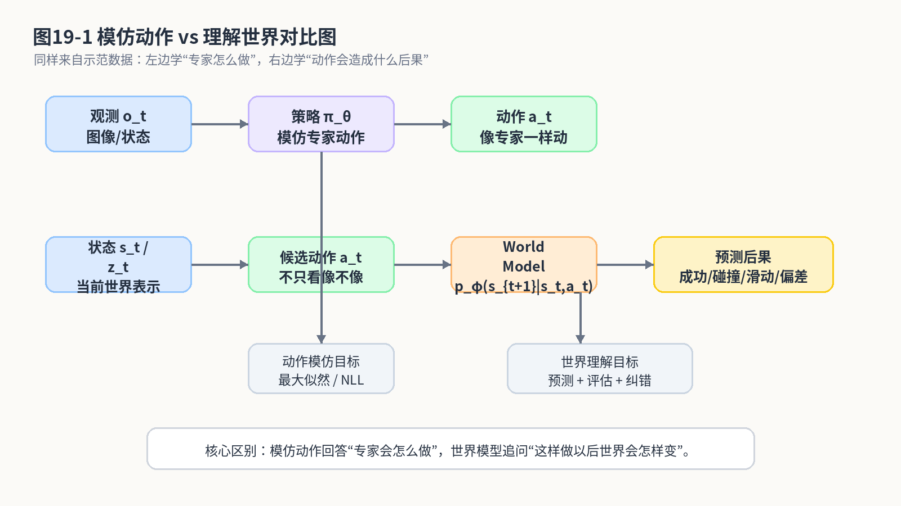
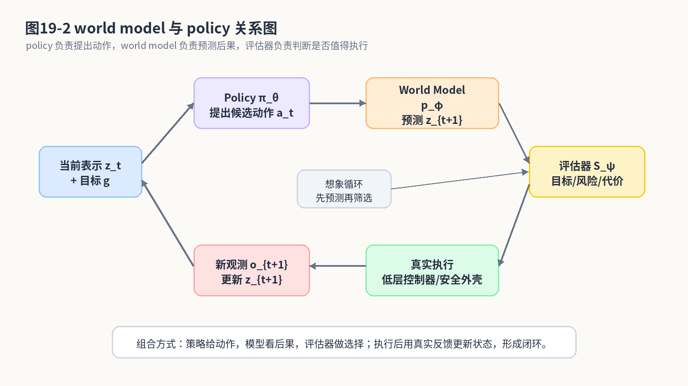

# 第21章：从动作模仿到世界预测：机器人不能只会背动作表

> **本章一句话导读**：本章从 policy-only 的动作模仿出发，说明机器人为什么还需要预测动作后果，并用不可识别性反例说明：只学专家动作分布，不能自动得到世界动力学。

---

## 0. 本章要解决的问题：为什么只学动作不够

前面第17章和第18章已经把策略表达推进到序列模型和 VLA：策略可以利用历史上下文、视觉、语言和动作历史来生成动作或动作块。

这条路线非常重要。没有它，机器人无法从大规模示范数据中学到复杂动作。

但它仍然留下一个问题：

> 会生成动作，不等于能预测动作后果。

比如机械臂做插入任务。专家示范时，孔位刚好对准，动作轨迹很漂亮。上线后，孔位偏了 1 毫米，夹具弹性变化，工件边缘有毛刺。机器人如果只会复现动作，就可能继续往前推，直到卡住、报警甚至损坏夹具。

这时，问题不再只是：

```text
专家当时怎么动？
```

而是：

```text
如果我继续这样动，世界会发生什么？
如果预测和真实反馈不一致，我应该继续、修正，还是 fallback？
```

本章只回答三个核心问题：

1. 为什么 policy-only 模仿不能等价于动作后果预测？
2. 动作后果预测在数学上新增了什么对象？
3. 为什么这个对象会自然引出第22章的 World Model / WAM / JEPA？

---

## 1. 本章公式主线

第五篇之后，我们已经有了多模态条件策略。

**公式 (21.1)：动作策略**

$$a_t \sim \pi_\theta(a_t \mid o_{\le t}, q)$$

这个公式读作：策略根据历史观测 $o_{\le t}$ 和任务指令 $q$，输出当前动作 $a_t$。

它回答的是：

```text
现在该怎么做？
```

但真实机器人还需要另一个对象。

**公式 (21.2)：动作后果预测**

$$\hat h_{t+1}=F_\phi(h_t,a_t)$$

这个公式读作：后果预测模型 $F_\phi$ 根据当前世界表示 $h_t$ 和候选动作 $a_t$，预测下一步世界表示 $\hat h_{t+1}$。

其中：

- $h_t$：当前世界表示或 latent state；
- $a_t$：候选动作；
- $F_\phi$：动作后果预测模型；
- $\hat h_{t+1}$：预测的下一步世界表示。

公式 (21.1) 学的是“怎么做”。公式 (21.2) 学的是“这样做之后会怎样”。

如果从概率角度写，动作后果预测可以写成：

**公式 (21.3)：动作条件的未来分布**

$$p_\phi(h_{t+1} \mid h_t,a_t)$$

如果策略一次输出动作块，后果预测就变成：

**公式 (21.4)：动作块条件的未来预测**

$$p_\phi(h_{t+1:t+H} \mid h_t,A_t,c_t)$$

其中，$A_t$ 是候选动作块，$c_t$ 是任务、语言或系统上下文。

预测未来之后，系统还可以比较预测与真实反馈。

**公式 (21.5)：预测误差**

$$e_{t+1}=d(\hat h_{t+1},h_{t+1})$$

如果误差突然变大，说明世界没有按预期变化，系统就应该触发纠错、重规划或 fallback。

这条公式链说明：本章不是要否定模仿学习，而是把策略从“输出动作”推进到“预测动作后果”。

---

## 2. 模仿动作与预测后果：两个不同问题

动作模仿关心的是：

```text
专家在当前观测下会怎么做？
```

动作后果预测关心的是：

```text
如果我这样做，世界会怎样变？
```

这两个问题看起来接近，但数学对象完全不同。

动作策略学习的是条件动作分布，即公式 (21.1)：

$$a_t \sim \pi_\theta(a_t \mid o_{\le t}, q)$$

动作后果预测学习的是当前世界表示和动作到未来表示的关系，即公式 (21.3)：

$$p_\phi(h_{t+1} \mid h_t,a_t)$$

第一个公式关注“像专家”。第二个公式关注“懂后果”。这里的“懂后果”不是哲学意义上的理解，而是行动意义上的预测能力：模型能够基于当前表示和候选动作，预测与任务决策相关的未来变量、风险或状态变化。

以机械臂抓取为例，动作模仿可以学到夹爪从哪个方向靠近、什么时候闭合、如何抬起。但动作后果预测还要知道：

- 这个抓取点会不会导致物体滑落；
- 夹爪会不会碰到桌面；
- 物体被抬起后是否稳定；
- 如果抓偏了，继续执行会不会造成不可恢复失败；
- 当前状态和示范数据是否已经明显不同。

所以，世界模型不是模仿学习的替代品，而是模仿学习缺失的后果建模层。



**图21-1 说明**：左侧是 policy-only 模仿，只学习从观测到动作的映射；右侧加入动作后果预测，系统不仅问“现在怎么做”，还问“这样做之后会怎样”。这张图想说明：模仿学习让机器人会做，世界预测让机器人知道做错后可能发生什么。

---

## 3. 本章核心定义

> **定义 21.1：动作策略**
>
> 动作策略是根据观测、历史、语言或任务条件生成动作的模型，典型形式是 $\pi_\theta(a_t \mid o_{\le t},q)$。

动作策略回答“现在该怎么做”，但不显式回答“这样做之后会怎样”。

> **定义 21.2：世界表示**
>
> 世界表示 $h_t$ 是模型内部用于概括当前环境、机器人本体状态、对象关系和任务进度的隐变量表示。

它可以来自图像编码器、Transformer 历史上下文、状态估计器、物体关系图或多传感器融合模块。

> **定义 21.3：动作后果预测**
>
> 动作后果预测是指根据当前世界表示和候选动作，预测执行动作后未来世界表示、任务变量或风险会如何变化。

它可以写成公式 (21.2) 的确定性形式，也可以写成公式 (21.3) 的概率形式。

> **定义 21.4：动作条件世界模型**
>
> 动作条件世界模型显式把动作或动作块作为输入，用来预测执行这些动作后未来世界表示、任务变量或风险会如何变化。

它的工程含义很直接：策略可以先生成候选动作块，世界模型再预测这些候选动作块的未来后果，最后由代价、风险或偏好模型筛选动作。

---

## 4. 为什么预测像素不等于预测动作后果

很多人一听到世界模型，就会想到未来视频预测。

未来视频预测当然有价值，但对机器人控制来说，下一帧图像是否清晰并不是唯一目标。机器人真正需要的是任务相关预测，例如：

- 物体是否会滑落；
- 是否会发生碰撞；
- 插入是否会卡住；
- 抓取是否会成功；
- 当前动作是否让系统进入不可恢复状态；
- 人类是否可能接管。

因此，世界模型不一定要输出完整像素图，而可以输出任务相关变量。

**公式 (21.6)：任务相关后果预测**

$$p_\phi(y_{t+1} \mid h_t,a_t)$$

其中，$y_{t+1}$ 可以是成功概率、接触状态、碰撞风险、物体位姿、目标距离或异常标签。

这个公式告诉我们：动作后果预测不是“把未来画出来”，而是“预测对行动有用的后果”。

这也是第22章引入 JEPA 的原因：如果像素重建会把模型注意力浪费在纹理、光照和背景细节上，那么预测表示可能更适合机器人控制。

---

## 5. 预测误差：机器人如何发现现实没有按预期发生

世界模型的另一个价值是闭环纠错。

如果模型预测下一世界表示是 $\hat h_{t+1}$，真实观测更新得到的表示是 $h_{t+1}$，可以用公式 (21.5) 定义预测误差：

$$e_{t+1}=d(\hat h_{t+1},h_{t+1})$$

其中，$d(\cdot,\cdot)$ 是距离或差异度量。

当误差较小时，说明世界大致按预期变化；当误差突然变大时，可能说明：

- 物体滑动；
- 接触状态变化；
- 视觉感知错误；
- 外界有人干扰；
- 当前状态超出训练分布；
- 策略把系统带到了未知区域。

于是可以定义一个简单的执行模式切换规则。

**公式 (21.7)：基于预测误差的执行模式切换**

$$
\mathrm{mode}_{t+1}=
\begin{cases}
\mathrm{continue}, & e_{t+1}<\epsilon,\\
\mathrm{correct}, & \epsilon\le e_{t+1}<\epsilon_{\mathrm{stop}},\\
\mathrm{fallback}, & e_{t+1}\ge \epsilon_{\mathrm{stop}}.
\end{cases}
$$

这个公式的工程意义很强：

> 一个会犯错但能发现错误的系统，还有救；一个犯错后还自信继续执行的系统，才真正危险。

不过，这个切换规则不能机械使用。预测误差大，不一定代表策略一定错，也可能是视觉噪声、遮挡、编码器漂移或传感器同步问题；预测误差小，也不一定代表动作安全，因为 latent 表示 $h_t$ 可能没有编码接触力、夹具干涉或微小几何偏差。

工程上，阈值 $\epsilon$ 和 $\epsilon_{\mathrm{stop}}$ 应该通过回放数据、验证集统计和少量受控实机测试标定，而不是凭经验随手设置。



**图21-2 说明**：策略生成候选动作，世界模型预测动作后果，评估器根据目标、风险和预测误差选择动作或触发纠错。图中重点不是让世界模型替代策略，而是让策略执行前后都多一层“后果检查”。

---

## 6. 命题 21.1：相同专家动作分布不唯一决定世界动力学

> **命题 21.1：相同专家动作分布不唯一决定世界动力学**
>
> 存在两个不同环境动力学 $P_1$ 和 $P_2$，使得专家在观测分布上的动作表现相同，但同一个动作在两个世界中的后果不同。因此，仅靠动作模仿目标无法唯一识别动作后果。

**证明思路**：

我们构造两个世界。它们在当前观测下给专家同样的动作标签，因此行为克隆看到的数据完全一样。但两个世界的转移规则不同，所以同一个动作会导致不同后果。

**证明**：

假设当前观测为 $o$，专家策略在两个世界中都输出同一个动作 $a^*$：

$$\pi_E^{(1)}(a^* \mid o)=\pi_E^{(2)}(a^* \mid o)=1$$

因此，行为克隆数据中看到的是同样的样本：

**公式 (21.8)：相同专家动作样本**

$$(o,a^*)$$

现在构造两个不同的环境动力学。

世界 1 中，执行动作 $a^*$ 后进入成功状态 $s^{\mathrm{ok}}$：

**公式 (21.9)：世界 1 的动作后果**

$$P_1(s^{\mathrm{ok}} \mid s,a^*)=1$$

世界 2 中，执行同样动作 $a^*$ 后进入失败状态 $s^{\mathrm{fail}}$：

**公式 (21.10)：世界 2 的动作后果**

$$P_2(s^{\mathrm{fail}} \mid s,a^*)=1$$

对行为克隆来说，两个世界提供的专家动作样本完全一样，所以只根据 $(o,a^*)$ 无法判断真实世界到底遵循 $P_1$ 还是 $P_2$。

但是，对机器人执行来说，两个世界的后果完全不同：一个成功，一个失败。

因此，相同专家动作分布不唯一决定世界动力学。仅靠动作模仿目标无法唯一识别动作后果。

**这个命题告诉我们什么？**

行为克隆可以学到“专家在这个观测下做了什么”，但不自动学到“这个动作为什么会成功、换一个世界会不会失败”。如果希望机器人具备计划、验证、安全判断和失败恢复能力，就必须额外引入世界预测、环境交互、回放验证或任务相关反馈。

**常见误解**：

不要把“专家动作数据很多”误认为“世界动力学自然被学出来”。如果数据只提供动作标签，而没有足够覆盖动作后果、失败反馈和扰动情形，模型可能仍然不知道动作会让世界如何变化。

---

## 7. 与 VLA 的关系

VLA 把视觉、语言和动作放进统一模型中，让策略可以在复杂任务条件下生成动作。它可以写成：

**公式 (21.11)：VLA 条件动作策略**

$$a_t \sim \pi_\theta(a_t \mid o_{\le t},q)$$

这和公式 (21.1) 形式一致，只是条件更丰富。

但条件更丰富不等于动作后果已经被显式建模。VLA 可以根据语言和视觉生成动作，却未必能可靠回答：

```text
如果执行这个动作块，物体会不会滑？
如果执行到一半出现偏差，系统能否恢复？
如果两个候选动作都像专家，哪个后果更安全？
```

因此，第六篇不是否定 VLA，而是给 VLA 补上动作后果预测这一层数学对象。

---

## 8. 统一例子：机械臂抓取与放置

假设任务是：

```text
把杯子从桌面抓起来，放到水槽旁边。
```

动作策略可以学到：

- 从哪个方向靠近杯子；
- 什么时候闭合夹爪；
- 抬起时末端怎么移动；
- 放置时动作轨迹如何平滑。

动作后果预测还要回答：

- 杯子是否会滑落；
- 杯子里如果有水，倾斜是否危险；
- 夹爪是否会碰到桌面；
- 放置区域是否被其他物体占用；
- 如果抓取失败，应该继续、重试还是放弃。

这就是从“模仿动作”到“预测动作后果”的区别。

---

## 9. 常见误解与适用边界

| 常见误解 | 正确认识 |
|---|---|
| 会输出动作就等于懂世界 | 输出动作只说明学到了条件动作分布，不代表学到了动作后果模型 |
| 世界模型一定要预测像素 | 机器人更需要预测任务相关表示、风险和成功条件 |
| 预测误差大一定说明策略错 | 也可能是感知噪声、遮挡、传感器不同步或 latent 漂移 |
| 预测误差小就一定安全 | latent 可能没编码接触力、夹具干涉或微小几何误差 |
| 专家数据多就自动学到动力学 | 动作标签不能唯一识别环境转移，必须有后果数据或额外假设 |

适用边界也要明确：本章只是说明为什么需要动作后果预测，不等于说世界模型可以替代策略、控制器或实机验证。世界模型只是多了一层“如果这样做会怎样”的预测能力。

---

## 10. 读完本章，你应该能判断什么

读完本章后，你应该能判断：

1. 动作策略 $\pi_\theta(a_t \mid o_{\le t},q)$ 回答“现在怎么做”，不等于回答“这样做会怎样”。
2. 动作后果预测需要新的数学对象，例如 $p_\phi(h_{t+1}\mid h_t,a_t)$。
3. 相同专家动作分布不唯一决定世界动力学。
4. 世界模型不一定预测像素，更重要的是预测任务相关后果。
5. 预测误差可以帮助系统发现异常，但不能机械地等同于失败。
6. VLA 可以生成动作，但仍然可能需要动作后果预测来辅助计划、验证和安全判断。
7. 第22章要进一步回答：World Model、World Action Model 和 JEPA 到底预测什么、怎么训练、怎么使用。

---

## 11. 本章公式索引

### 公式 (21.1)：动作策略

$$a_t \sim \pi_\theta(a_t \mid o_{\le t}, q)$$

- **含义**：策略根据历史观测和任务指令输出当前动作。
- **需要掌握到什么程度**：理解它回答“现在怎么做”。

### 公式 (21.2)：动作后果预测

$$\hat h_{t+1}=F_\phi(h_t,a_t)$$

- **含义**：根据当前世界表示和动作预测下一步世界表示。
- **需要掌握到什么程度**：理解它回答“这样做之后会怎样”。

### 公式 (21.3)：动作条件的未来分布

$$p_\phi(h_{t+1} \mid h_t,a_t)$$

- **含义**：用概率分布描述动作后果的不确定性。
- **需要掌握到什么程度**：理解它是 World Model / WAM 的基础接口。

### 公式 (21.4)：动作块条件的未来预测

$$p_\phi(h_{t+1:t+H} \mid h_t,A_t,c_t)$$

- **含义**：预测一段动作块执行后的未来表示序列。
- **需要掌握到什么程度**：理解它对应现代动作块策略和 WAM 的结合。

### 公式 (21.5)：预测误差

$$e_{t+1}=d(\hat h_{t+1},h_{t+1})$$

- **含义**：比较预测未来和真实反馈之间的差异。
- **需要掌握到什么程度**：理解预测误差可以辅助异常检测和 fallback。

### 公式 (21.6)：任务相关后果预测

$$p_\phi(y_{t+1} \mid h_t,a_t)$$

- **含义**：预测成功率、碰撞风险、接触状态等任务相关变量。
- **需要掌握到什么程度**：理解世界模型不一定要预测像素。

### 公式 (21.7)：基于预测误差的执行模式切换

$$
\mathrm{mode}_{t+1}=
\begin{cases}
\mathrm{continue}, & e_{t+1}<\epsilon,\\
\mathrm{correct}, & \epsilon\le e_{t+1}<\epsilon_{\mathrm{stop}},\\
\mathrm{fallback}, & e_{t+1}\ge \epsilon_{\mathrm{stop}}.
\end{cases}
$$

- **含义**：根据预测误差大小选择继续、纠正或 fallback。
- **需要掌握到什么程度**：理解阈值规则有工程价值，但不能机械使用。

### 公式 (21.8)：相同专家动作样本

$$(o,a^*)$$

- **含义**：两个不同世界可以给出相同的专家动作样本。
- **需要掌握到什么程度**：理解行为克隆看到的监督信号可能不足以区分世界动力学。

### 公式 (21.9)：世界 1 的动作后果

$$P_1(s^{\mathrm{ok}} \mid s,a^*)=1$$

- **含义**：同一个动作在世界 1 中导致成功状态。
- **需要掌握到什么程度**：理解多世界反例的一半。

### 公式 (21.10)：世界 2 的动作后果

$$P_2(s^{\mathrm{fail}} \mid s,a^*)=1$$

- **含义**：同一个动作在世界 2 中导致失败状态。
- **需要掌握到什么程度**：理解相同动作分布不决定后果分布。

### 公式 (21.11)：VLA 条件动作策略

$$a_t \sim \pi_\theta(a_t \mid o_{\le t},q)$$

- **含义**：VLA 在视觉、历史和语言条件下生成动作。
- **需要掌握到什么程度**：理解 VLA 仍然主要回答“现在怎么做”，不必然显式回答“这样做会怎样”。

---

## 12. 本章定义索引

| 编号 | 概念 | 一句话含义 |
|---|---|---|
| 定义 21.1 | 动作策略 | 根据观测、历史和任务条件生成动作的模型 |
| 定义 21.2 | 世界表示 | 模型内部用于概括环境、机器人状态、对象关系和任务进度的 latent state |
| 定义 21.3 | 动作后果预测 | 根据当前世界表示和候选动作预测未来世界表示、任务变量或风险 |
| 定义 21.4 | 动作条件世界模型 | 显式把动作或动作块作为输入，预测动作执行后的未来后果 |

---

## 13. 思考题

1. 为什么策略 $\pi_\theta(a_t \mid o_{\le t},q)$ 不能自动推出 $p(h_{t+1}\mid h_t,a_t)$？
2. 请用机械臂抓取例子构造一个“相同专家动作、不同动作后果”的多世界反例。
3. 世界模型预测像素清晰，是否一定说明它适合机器人控制？为什么？
4. 预测误差 $e_{t+1}$ 很小，是否一定说明动作安全？请给出反例。
5. 如果你要为插入任务设计动作后果预测变量，你会选择哪些 $y_{t+1}$？

---

## 14. 本章配图清单

- **图21-1 模仿动作 vs 理解世界对比图**：说明 policy-only 与动作后果预测的区别。
- **图21-2 world model 与 policy 关系图**：说明策略、世界模型、评估器和 fallback 的关系。

---

## 15. 建议阅读的附录条目

- **附录 A：数学符号与公式阅读方法**：帮助理解条件分布和公式索引。
- **附录 F：强化学习与序列决策基础**：帮助理解状态转移和动作后果。
- **附录 H：实验与代码基础**：帮助理解预测误差、阈值标定和 fallback。

---

## 16. 本章小结

本章完成了第六篇的第一步：说明为什么只学动作不够。

动作策略回答“现在怎么做”，动作后果预测回答“这样做之后会怎样”。这两个问题的数学对象不同，不能混为一谈。

命题 21.1 进一步说明：相同专家动作分布不唯一决定世界动力学。仅靠行为克隆数据，不能自动识别动作后果。

因此，第22章将正式展开 World Model、World Action Model 和 JEPA，回答三个问题：预测什么、条件是什么、怎么训练。
