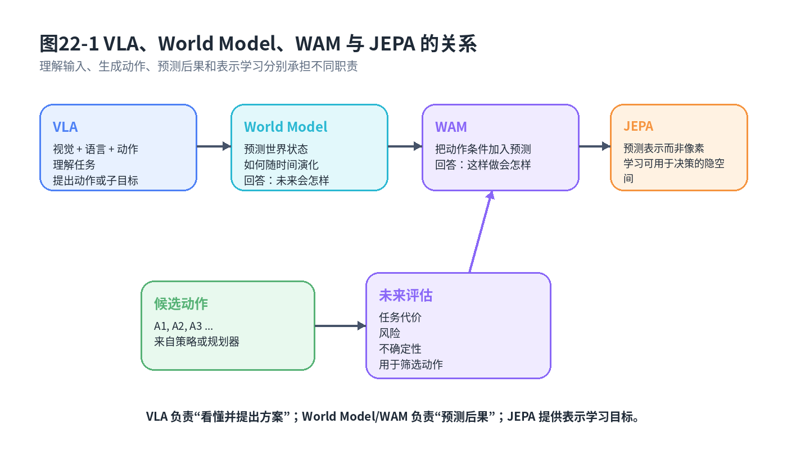
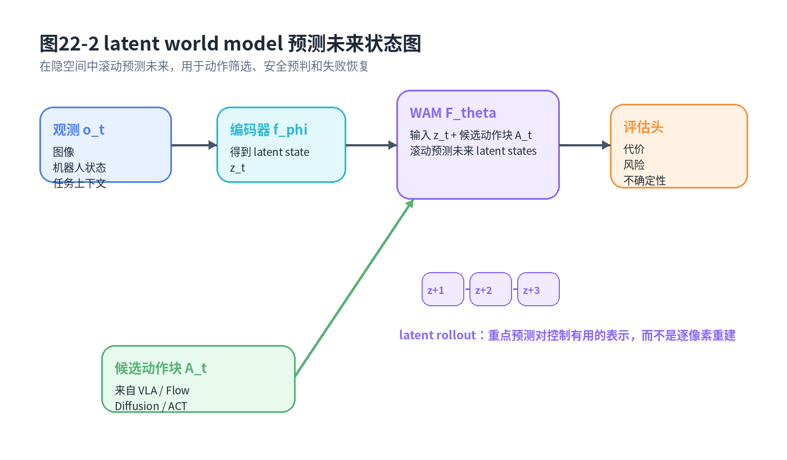

# 第22章：World Models、World Action Models 与 JEPA：机器人要学会预测世界

> **新版布局位置**：本章属于 **第六篇：世界模型、快慢系统与认知架构**。本章编号、公式编号与交叉引用已按新版八篇结构统一调整。
>
> **本章一句话导读**：World Model 让机器人不只回答“现在做什么”，还要预测“如果这样做，世界会怎样变化”。

---

## 0. 本章要解决的问题

前面第20章讲 VLA，把视觉、语言和动作放到同一张桌子上。VLA 能根据图像和指令输出动作，看起来已经很接近通用机器人策略。但如果只学一个端到端策略：

<div class="math">\[
a_t\sim\pi_\theta(a_t\mid o_t)
\tag{22.1}
\]</div>

它仍然可能只是一个很大的条件反射系统。看到杯子，输出抓取动作；看到门把手，输出旋转动作；看到障碍物，输出绕行动作。问题是：它是否真的理解“动作会改变世界”？

本章要回答的问题是：

> 机器人能不能在执行前预测：如果我这样抓、这样推、这样放，未来状态会变成什么样？

World Models、World Action Models 与 JEPA 都围绕这个问题展开。它们不是要替代策略，而是补齐策略背后的世界预测能力。



**图22-1 说明**：VLA 更偏“理解输入并生成动作”，World Model 更偏“预测世界状态演化”，WAM 把动作条件显式放进预测过程，JEPA 强调预测隐空间表示而不是逐像素重建。

---

## 1. 与前后章节的衔接

第21章提出从动作模仿走向世界理解：机器人不能只会背动作表。本章给出数学接口：从 MDP 转移概率到 latent dynamics，从像素重建到表示预测。

第23章会讨论快慢模型。本章的 World Model 很适合放在慢系统中，用来模拟候选动作的后果；快系统负责执行经过筛选的动作块。

第24章之后会讲偏好对齐和后训练。World Model 还能帮助我们把失败、接管和风险片段组织成更有用的数据闭环，并在第29章形成持续改进平台。

---

## 2. 为什么只学 <span class="math">\\(\pi(a\mid o)\\)</span> 不够？

策略 <span class="math">\\(\pi(a\mid o)\\)</span> 关注的是当前观测到动作的映射。它回答：

```text
我现在看到了什么 → 我现在该做什么
```

但很多机器人问题还需要回答：

```text
如果我做这个动作 → 物体会不会滑？
如果我从这个角度抓 → 夹爪会不会碰到桌面？
如果我把工件放到这个治具 → 会不会卡住？
如果我继续推进 → 人类会不会接管？
```

这些问题不是纯粹的动作回归，而是后果预测。没有世界模型，策略很容易变成短视的反射弧。

在 MDP 中，世界变化由转移概率描述：

<div class="math">\[
P(s_{t+1}\mid s_t,a_t)
\tag{22.2}
\]</div>

### 公式拆解

**动机**：策略告诉你“做什么”，转移模型告诉你“做完之后会发生什么”。机器人要想计划、评估和避险，就必须关心后者。

**符号**：<span class="math">\\(s\_t\\)</span> 是真实环境状态；<span class="math">\\(a\_t\\)</span> 是动作；<span class="math">\\(P(s\_{t+1}\mid s\_t,a\_t)\\)</span> 是给定当前状态和动作后，下一状态的概率分布。

**直觉**：如果我推杯子，杯子会移动；如果我夹得太偏，杯子会倾斜；如果我撞到治具边缘，动作会失败。

**工程含义**：真实 <span class="math">\\(s\_t\\)</span> 通常不可完全观测，所以工程上不会直接学完整物理状态转移，而是学观测或隐表示的转移。

**常见误解**：世界模型不是必须重建高清视频。对机器人控制而言，预测“对决策有用的表示”常常比预测像素更重要。

---

## 3. 从 MDP 转移概率到 latent dynamics

由于真实状态 <span class="math">\\(s\_t\\)</span> 难以获得，我们通常先把观测编码成隐表示：

<div class="math">\[
z_t=f_\phi(o_t)
\tag{22.3}
\]</div>

再学习 latent dynamics：

<div class="math">\[
p_\theta(z_{t+1}\mid z_t,a_t)
\tag{22.4}
\]</div>

如果要预测多步未来，可以写成：

<div class="math">\[
p_\theta(z_{t+1:t+H}\mid z_t,a_{t:t+H-1})=
\prod_{i=0}^{H-1} p_\theta(z_{t+i+1}\mid z_{t+i},a_{t+i})
\tag{22.5}
\]</div>

### 公式拆解

**动机**：直接预测像素太难，也不一定有用。我们希望模型在隐空间里预测未来，因为隐空间可以保留与控制相关的信息。

**符号**：<span class="math">\\(f\_\phi\\)</span> 是编码器；<span class="math">\\(z\_t\\)</span> 是观测隐表示；<span class="math">\\(p\_\theta\\)</span> 是隐空间动力学模型；<span class="math">\\(H\\)</span> 是预测 horizon。

**公式**：公式 (22.3) 把观测变成表示，公式 (22.4) 学一步预测，公式 (22.5) 把一步预测滚动成多步预测。

**直觉**：机器人不必在脑子里生成一张完美未来图像，它只需要知道关键关系：杯子会不会离开桌面，夹爪是否对齐，目标区域是否被占用。

**工程含义**：latent dynamics 可以用于候选动作评估。比如让策略提出 5 个动作块，world model 预测每个动作块的未来风险，再选择最安全的。

**常见误解**：latent dynamics 不是万能物理引擎。它只在训练数据覆盖的分布内可靠，接触、碰撞、形变和液体等复杂动力学会显著增加难度。

---

## 4. World Model 与 World Action Model 的区别

宽泛地说，World Model 学世界如何演化；World Action Model 更强调动作条件，即“给定动作，世界怎样变”。可以写成：

<div class="math">\[
\hat{z}_{t+1}=F_\theta(z_t,a_t,c_t)
\tag{22.6}
\]</div>

其中 <span class="math">\\(c\_t\\)</span> 可以包含语言指令、任务阶段、机器人本体状态或对象关系图。如果预测的是一段未来：

<div class="math">\[
\hat{z}_{t+1:t+H}=F_\theta(z_t,A_t,c_t)
\tag{22.7}
\]</div>

这里 <span class="math">\\(A\_t\\)</span> 是动作块。

### 公式拆解

**动机**：只预测“下一帧会怎样”还不够。机器人更需要预测“如果我执行这个动作块，未来会怎样”。

**符号**：<span class="math">\\(F\_\theta\\)</span> 是动作条件的世界预测模型；<span class="math">\\(c\_t\\)</span> 是上下文；<span class="math">\\(A\_t\\)</span> 是候选动作块。

**直觉**：WAM 像一个动作后果模拟器。它不是直接告诉你该做什么，而是告诉你做了之后可能发生什么。

**工程含义**：第15章 Flow Matching 可以生成多个候选动作块；WAM 可以对这些候选动作块做未来评估，筛掉容易碰撞、滑动或失败的方案。

---

## 5. JEPA：预测表示，而不是重建像素

JEPA 的核心思想可以简化成一句话：不要逼模型还原每个像素，而是让模型预测另一个视角、另一个时间或另一个区域的表示。

一个简化的 JEPA 目标可以写成：

<div class="math">\[
\mathcal{L}_{\mathrm{JEPA}}=\left\|g_\theta(z_t,a_t)-\mathrm{sg}(z_{t+1})\right\|_2^2
\tag{22.8}
\]</div>

其中 <span class="math">\\(\mathrm{sg}(\cdot)\\)</span> 表示 stop-gradient，即目标分支不被当前损失直接更新。

### 公式拆解

**动机**：像素级重建容易把模型精力浪费在纹理、光照和背景细节上。机器人更关心对象关系、可达性、接触状态和任务进度。

**符号**：<span class="math">\\(g\_\theta\\)</span> 是预测器；<span class="math">\\(z\_t\\)</span> 和 <span class="math">\\(z\_{t+1}\\)</span> 是前后时刻的隐表示；<span class="math">\\(\mathrm{sg}\\)</span> 用来稳定目标表示。

**公式**：预测当前表示经过动作后的未来表示，并和真实未来表示对齐。

**直觉**：不是问“下一帧每个像素是什么颜色”，而是问“下一时刻对控制有用的世界摘要是什么”。

**工程含义**：在机器人里，JEPA 思想可以用于自监督预训练视觉/视频表示，也可以与动作条件结合，形成 WAM。

**常见误解**：JEPA 不等于不需要图像。它仍然从图像/视频中学习，只是监督目标从像素重建转向表示预测。

为了避免表示塌缩，实际系统常常还会引入方差、协方差、对比或其他正则项。可以抽象写成：

<div class="math">\[
\mathcal{L}=\mathcal{L}_{\mathrm{pred}}+\lambda\mathcal{R}_{\mathrm{repr}}
\tag{22.9}
\]</div>

这里 <span class="math">\\(\mathcal{R}\_{\mathrm{repr}}\\)</span> 用来保证表示不要全部变成常数。

---

## 6. I-JEPA / V-JEPA 思想如何迁移到机器人

I-JEPA 更偏图像表示预测，V-JEPA 更偏视频时空表示预测。迁移到机器人时，需要补上动作条件和任务条件：

```text
图像/视频表示预测 + 动作条件 + 机器人本体状态 + 任务目标
```

也就是说，机器人版本不只预测“下一段视频是什么样”，还要预测“执行这段动作之后，和任务有关的世界表示会怎样”。

比如机械臂抓杯子：

- 无动作的视频预测：杯子大概率还在原地；
- 有动作的 WAM：如果夹爪靠近并闭合，杯子可能被抓起；
- 有错误动作的 WAM：如果夹爪偏左，杯子可能被推倒；
- 有任务条件的 WAM：如果目标是放到托盘，未来表示应体现杯子接近托盘区域。

这就是动作条件的重要性。

---

## 7. 预测未来状态能帮助什么？

### 7.1 计划评估

假设策略提出多个候选动作块 <span class="math">\\(A\_t^{(j)}\\)</span>，World Model 可以预测每个候选的未来，并计算代价：

<div class="math">\[
J(A_t^{(j)})=\sum_{i=1}^{H} c(\hat{z}_{t+i}^{(j)},a_{t+i-1}^{(j)})
\tag{22.10}
\]</div>

选择代价更小的候选：

<div class="math">\[
A_t^*=\arg\min_{A_t^{(j)}} J(A_t^{(j)})
\tag{22.11}
\]</div>

**工程含义**：这让生成式策略不再是“一次采样就执行”，而是“生成候选—预测后果—筛选动作”。

### 7.2 安全预判

可以训练风险头：

<div class="math">\[
r_{t:t+H}=R_\psi(\hat{z}_{t+1:t+H},A_t)
\tag{22.12}
\]</div>

它预测未来碰撞、滑动、越界、夹爪失败或人类接管概率。安全仲裁器可以拒绝高风险动作块。

### 7.3 失败恢复

如果 World Model 预测执行当前动作会偏离目标，策略可以提前修正，而不是等失败发生后再接管。这对机械臂插入、放置、装配等任务尤其重要。

### 7.4 数据效率提升

大量视频和机器人日志都可以用于表示预测预训练。即使没有密集人工标注，模型也能学习“世界怎样随时间变化”。这会降低后续 imitation learning 对高质量专家动作的依赖。

---

## 8. 与 VLA 的关系

VLA 和 World Model 的分工可以这样理解：

```text
VLA：理解当前输入和任务意图，生成候选动作或子目标
World Model/WAM：预测候选动作的后果
安全/控制层：决定是否执行、如何限幅、何时接管
```

VLA 负责“看懂”和“提出方案”，World Model 负责“想一下这样做会怎样”。在复杂任务中，单纯端到端 VLA 可能会输出看起来合理但后果危险的动作；引入 WAM 后，可以在执行前做一层未来预判。

这也解释了为什么第23章会把它们放进快慢模型：慢系统可以用 VLA + World Model 做理解和推演，快系统用 ACT/Flow/Mamba 等模型稳定执行短 horizon 动作。

---

## 9. 统一例子：如果这样抓，会发生什么？

机械臂要从桌面抓一个轴套。当前图像里，轴套略微倾斜，旁边有另一个工件。策略提出两个候选动作块：

- 方案 A：直接从上方夹取；
- 方案 B：先侧向对齐，再下探夹取。

没有 World Model 时，策略可能只根据当前图像输出看起来最像专家的动作。加入 WAM 后，可以预测：方案 A 未来可能碰到旁边工件或把轴套推歪；方案 B 虽然慢一点，但接触姿态更稳定。

在二维点机器人例子中，World Model 可以预测：如果选择左绕，未来路径是否会进入障碍物附近高风险区域；如果选择右绕，是否会偏离目标太远。策略不再只问“专家此刻会怎么走”，还会问“这样走后面会怎样”。



**图22-2 说明**：观测被编码成 latent state，候选动作块进入 WAM，模型滚动预测未来隐状态，并输出任务代价、风险和不确定性，用于动作筛选和安全仲裁。

---

## 10. 局限与适用边界

第一，**表示是否足够可控**。如果 <span class="math">\\(z\_t\\)</span> 只编码视觉语义，却不编码接触、力、几何可达性，那么预测再准也未必能指导控制。

第二，**预测 horizon 有上限**。短期预测可能可靠，长期预测容易误差累积。可以用：

<div class="math">\[
\epsilon_H \leq \sum_{i=1}^{H} \epsilon_i
\tag{22.13}
\]</div>

粗略理解误差会随滚动步数增加。

第三，**接触动力学困难**。抓取、插入、拧紧、柔性物体操作都涉及复杂接触。纯视觉 latent dynamics 可能不够，需要力觉、触觉或显式物理先验。

第四，**评估困难**。World Model 的预测误差不一定等于控制效果。像素误差小，不代表任务判断准；表示距离近，也不代表安全。

第五，**不能替代真实部署验证**。World Model 可以减少盲目上机，但不能完全消除实机测试。第27章 OPE 和第29章数据闭环会继续处理这个问题。

---

## 11. 与全书知识地图的一致性说明

本章在全书中承担“后果预测”节点：

```text
第5章 MDP：转移概率 P(s'|s,a) 是序列决策核心
第20章 VLA：把多模态输入变成动作或子目标
第21章 世界理解：提出不能只背动作表
第22章 World Model/WAM/JEPA：学习未来表示和动作后果
第23章 快慢模型：慢系统用世界模型推演，快系统执行
第24章 DPO：偏好数据可与未来风险/失败预测结合
第27章 OPE：部署前评估策略价值和风险
第29章 数据闭环：失败回放反哺世界模型和后训练
```

---

## 12. 本章公式索引

- 公式 (22.1)：只学策略 <span class="math">\\(\pi(a\mid o)\\)</span> 的形式
- 公式 (22.2)：MDP 转移概率
- 公式 (22.3)：观测到 latent 表示的编码
- 公式 (22.4)：一步 latent dynamics
- 公式 (22.5)：多步 latent rollout
- 公式 (22.6)：动作条件的 World Action Model
- 公式 (22.7)：动作块条件的未来表示预测
- 公式 (22.8)：JEPA 表示预测损失
- 公式 (22.9)：表示预测加正则的目标
- 公式 (22.10)：候选动作块未来代价
- 公式 (22.11)：基于预测代价的动作选择
- 公式 (22.12)：未来风险预测头
- 公式 (22.13)：多步预测误差累积的粗略表达

---

## 13. 建议阅读的附录条目

- **附录A：数学符号与公式阅读方法**：理解 <span class="math">\\(s,z,o,a\\)</span> 的区别。
- **附录F：强化学习与序列决策基础**：理解 MDP 转移概率和 rollout。
- **附录G：生成模型基础**：理解预测未来表示与生成模型的关系。
- **附录H：实验与代码基础**：设计 world model 的预测误差、风险评估和回放实验。
- **附录I：熵、最大熵与 Score Matching**：理解表示学习和分布建模的一些背景概念。

## 参考文献与推荐深入阅读

### 参考文献

- David Ha and Jürgen Schmidhuber, “World Models,” arXiv:1803.10122, 2018. <https://arxiv.org/abs/1803.10122>
- Mathilde Caron et al., “Emerging Properties in Self-Supervised Vision Transformers,” ICCV 2021. <https://arxiv.org/abs/2104.14294>
- Adrien Bardes et al., “Revisiting Feature Prediction for Learning Visual Representations from Video,” arXiv:2404.08471, 2024. <https://arxiv.org/abs/2404.08471>

### 推荐深入阅读

- 对 World Model，重点看 latent dynamics 和 imagination rollout；对 JEPA，重点看 latent prediction 而不是 pixel reconstruction。
- 读 V-JEPA 时关注它为什么预测表征而不是重建图像，以及这对机器人视频理解有什么意义。
- 实机应用中要区分“预测好看视频”和“预测对控制有用的状态变化”。
