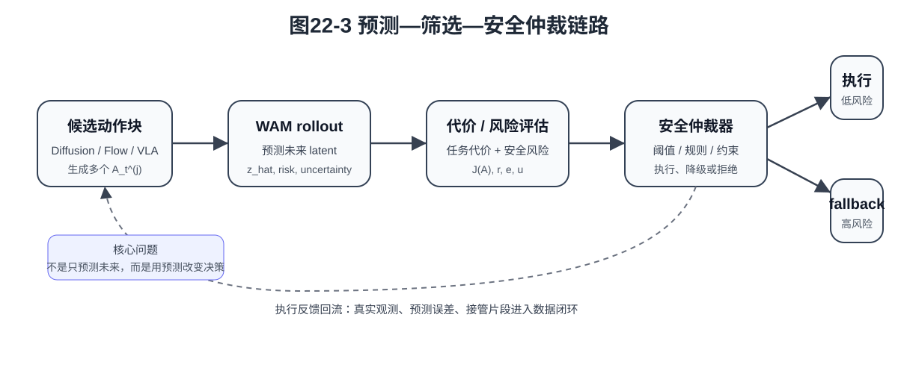
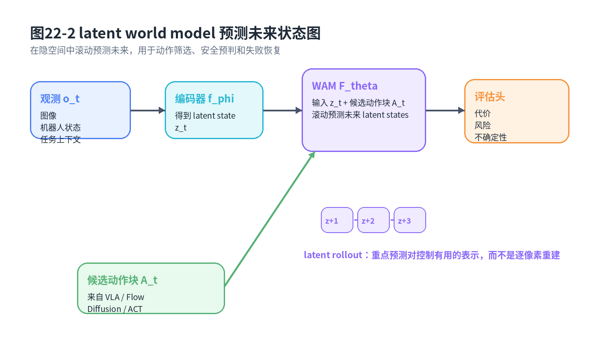

# 第22章：World Models、World Action Models 与 JEPA：机器人要学会预测世界

> **本章一句话导读**：本章把“预测动作后果”写成可训练的数学目标，说明 World Model、World Action Model 与 JEPA 的核心区别，并解释预测结果如何进入动作筛选、安全仲裁和失败恢复链路。

---

## 0. 本章要解决的问题：预测什么、条件是什么、怎么用

第21章说明了一个关键事实：policy-only 模仿只能告诉机器人“现在做什么”，不能直接告诉机器人“这样做之后世界会怎样变化”。

本章继续往前走一步：

> 如果机器人需要预测动作后果，这件事在数学上应该怎么写？又应该用什么训练目标来学习？

读本章时，只抓住三个问题：

1. **预测什么？** 是预测像素、状态、latent 表示，还是任务相关变量？
2. **条件是什么？** 是只看当前表示，还是显式输入动作、动作块和任务上下文？
3. **怎么用？** 预测结果是用于计划评估、安全仲裁、失败恢复，还是数据闭环？

World Model、World Action Model 和 JEPA 都围绕这三个问题展开。它们不是要替代策略，而是补上策略背后的未来预测能力。


**图22-1 说明**：VLA 更偏“理解输入并生成动作”，World Model 更偏“预测世界状态演化”，World Action Model 显式把动作条件放进预测过程，JEPA 强调预测隐空间表示而不是逐像素重建。这张图想说明：第22章讨论的重点不是模型名字，而是“预测对象”和“条件变量”的变化。

---

## 1. 与前后章节的衔接

第21章提出从动作模仿走向世界理解：机器人不能只会背动作表。本章给出数学接口：从 MDP 转移概率到 latent dynamics，从像素重建到表示预测，从普通 world model 到 action-conditioned world action model。

第23章会讨论快慢模型。本章的 World Model 很适合放在慢系统中，用来模拟候选动作的后果；快系统负责执行经过筛选的动作块。

第24章之后会讲偏好对齐和后训练。World Model 还能帮助我们把失败、接管和风险片段组织成更有用的数据闭环，并在后续部署与评估章节中形成持续改进平台。

---

## 2. 本章公式主线

第21章已经得到 policy-only 的基本形式：

**公式 (22.1)：条件动作策略**

$$a_t \sim \pi_\theta(a_t \mid o_t)$$

它回答“当前应该做什么”。

但机器人还需要预测“做完之后会发生什么”，因此引入 MDP 转移概率：

**公式 (22.2)：MDP 状态转移概率**

$$P(s_{t+1} \mid s_t,a_t)$$

真实机器人通常拿不到完整状态 $s_t$，所以先把观测编码成隐表示：

**公式 (22.3)：观测到 latent 表示的编码**

$$z_t=f_\phi(o_t)$$

然后学习隐空间动力学。为避免和策略参数 $\theta$ 混淆，本章把 world model / WAM 的预测器参数记为 $\eta$：

**公式 (22.4)：一步 latent dynamics**

$$p_\eta(z_{t+1} \mid z_t,a_t)$$

如果要预测一段动作块的未来，就得到 World Action Model 的基本接口：

**公式 (22.5)：动作块条件的未来表示预测**

$$\hat z_{t+1:t+H}=F_\eta(z_t,A_t,c_t)$$

如果不重建像素，而是预测未来表示，就得到 JEPA 式目标：

**公式 (22.6)：JEPA 式表示预测损失**

$$\mathcal{L}_{\mathrm{JEPA}}=\lVert g_\eta(z_t,a_t)-\mathrm{sg}(z_{t+1})\rVert_2^2$$

这条公式链说明：第22章不是介绍几个模型名字，而是在回答“如何把动作后果预测写成可训练目标”。

---

## 3. 只学策略为什么还不够

策略 $\pi_\theta(a_t \mid o_t)$ 关注的是当前观测到动作的映射。它回答：

```text
我现在看到了什么 → 我现在该做什么
```

但很多机器人问题还需要回答：

```text
如果我做这个动作 → 物体会不会滑？
如果我从这个角度抓 → 夹爪会不会碰到桌面？
如果我把工件放到这个治具 → 会不会卡住？
如果我继续推进 → 人类会不会接管？
```

这些问题不是纯粹的动作回归，而是后果预测。没有世界模型，策略很容易变成短视的反射弧。

在 MDP 中，世界变化由状态转移概率描述，即公式 (22.2)：

$$P(s_{t+1} \mid s_t,a_t)$$

**符号解释**：

- $s_t$：当前真实环境状态；
- $a_t$：动作；
- $s_{t+1}$：下一时刻真实环境状态；
- $P(s_{t+1} \mid s_t,a_t)$：给定当前状态和动作后，下一状态的概率分布。

**工程含义**：真实状态 $s_t$ 通常不可完全观测，所以工程上不会直接学完整物理状态转移，而是学习观测、隐表示或任务相关变量的转移。

**常见误解**：世界模型不是必须重建高清视频。对机器人控制而言，预测“对决策有用的表示”常常比预测像素更重要。

---

## 4. 定义 22.1 World Model：从 MDP 转移到世界预测

> **定义 22.1：World Model**
>
> World Model 是一个用于预测世界状态、世界表示或任务相关变量如何随时间变化的模型。它回答的不是“现在该做什么”，而是“世界接下来可能会怎样”。

在最基础的 MDP 状态空间里，World Model 的理论起点是状态转移概率：

$$P(s_{t+1} \mid s_t,a_t)$$

但真实机器人通常拿不到完整状态 $s_t$，只能拿到图像、深度、本体状态、力觉、触觉、历史动作和语言任务等观测。因此工程中的 world model 往往预测的是下面几类对象：

| 预测对象 | 例子 | 适合回答的问题 |
|---|---|---|
| 像素 / 图像 | 下一帧 RGB、视频片段 | 未来场景大概长什么样 |
| 显式状态 | 物体位姿、速度、接触状态 | 物体会怎么运动 |
| latent 表示 | 视觉或多模态编码后的表示 | 对控制有用的世界摘要会怎么变 |
| 任务变量 | 成功概率、风险、代价、不确定性 | 这个动作是否值得执行 |

本书更关注机器人控制，所以重点不是“预测画面有多清晰”，而是“预测对象是否对动作选择有用”。

---

## 5. 定义 22.2 Latent dynamics：为什么不一定预测像素

> **定义 22.2：Latent dynamics**
>
> Latent dynamics 是在隐空间中预测未来状态或表示的动力学模型。它先把观测编码成 latent state，再在 latent state 上建模未来变化。

由于真实状态 $s_t$ 难以获得，我们通常先把观测编码成隐表示：

$$z_t=f_\phi(o_t)$$

再学习 latent dynamics：

$$p_\eta(z_{t+1} \mid z_t,a_t)$$

如果要预测多步未来，可以写成：

**公式 (22.7)：多步 latent rollout**

$$p_\eta(z_{t+1:t+H} \mid z_t,a_{t:t+H-1})=\prod_{i=0}^{H-1}p_\eta(z_{t+i+1} \mid z_{t+i},a_{t+i})$$

这个公式隐含了三个简化假设：

1. latent state $z_t$ 已经包含预测下一步所需的主要信息；
2. 未来动作序列 $a_{t:t+H-1}$ 已知，或者由候选动作块给定；
3. rollout 过程中使用模型预测的 latent 继续向前推，因此误差可能逐步累积。

**动机**：直接预测像素太难，也不一定有用。我们希望模型在隐空间里预测未来，因为隐空间可以保留与控制相关的信息。

**符号解释**：

- $f_\phi$：观测编码器；
- $z_t$：观测隐表示；
- $p_\eta$：隐空间动力学模型；
- $H$：预测 horizon。

**直觉**：机器人不必在脑子里生成一张完美未来图像，它只需要知道关键关系：杯子会不会离开桌面，夹爪是否对齐，目标区域是否被占用。

**工程含义**：latent dynamics 可以用于候选动作评估。比如让策略提出多个动作块，world model 预测每个动作块的未来风险，再选择更安全的方案。

---

## 6. 定义 22.3 World Action Model：动作条件的未来预测

> **定义 22.3：World Action Model**
>
> World Action Model 是显式输入动作或动作块，并预测这些动作执行后未来世界表示、任务变量或风险变化的模型。它回答的问题是：“如果执行这个动作，世界会怎样变？”

宽泛地说，World Model 学世界如何演化；World Action Model 更强调动作条件，即“给定动作，世界怎样变”。

需要注意：很多文献中的 world model 本身也可以是 action-conditioned。本章为了突出机器人系统接口，把“是否显式输入动作 / 动作块，并用于候选动作后果评估”作为 World Action Model 的重点。

普通 world model 可以写成：

**公式 (22.8)：一般世界演化模型**

$$p_\eta(z_{t+1} \mid z_t)$$

它问的是：世界下一步大概会怎样。

动作条件 world action model 可以写成：

**公式 (22.9)：动作条件世界模型**

$$\hat z_{t+1}=F_\eta(z_t,a_t,c_t)$$

其中，$c_t$ 可以包含语言指令、任务阶段、机器人本体状态或对象关系图。

如果预测的是一段动作块的未来，就回到公式 (22.5)：

$$\hat z_{t+1:t+H}=F_\eta(z_t,A_t,c_t)$$

这里，$A_t$ 是动作块。

**关键区别**：

| 模型 | 输入条件 | 预测对象 | 适合回答的问题 |
|---|---|---|---|
| World Model | 当前表示或历史 | 未来状态 / 表示 | 世界会怎样演化 |
| World Action Model | 当前表示 + 动作 / 动作块 | 动作执行后的未来表示 | 如果这样做，会发生什么 |
| JEPA 式模型 | 当前表示 / 局部表示 / 未来表示目标 | 未来表示 | 什么表示对未来预测有用 |

**工程含义**：第15章 Flow Matching 可以生成多个候选动作块；WAM 可以对这些候选动作块做未来评估，筛掉容易碰撞、滑动或失败的方案。

---

## 7. 定义 22.4 JEPA 式表示预测：预测表示而不是重建像素

> **定义 22.4：JEPA 式表示预测**
>
> JEPA 式表示预测是一类自监督预测思想：模型不直接重建像素，而是在隐空间中预测另一个时间、区域或视角的表示。

JEPA 的核心思想可以简化成一句话：不要逼模型还原每个像素，而是让模型预测另一个视角、另一个时间或另一个区域的表示。

一个简化的 JEPA 目标可以写成公式 (22.6)：

$$\mathcal{L}_{\mathrm{JEPA}}=\lVert g_\eta(z_t,a_t)-\mathrm{sg}(z_{t+1})\rVert_2^2$$

其中，$\mathrm{sg}(\cdot)$ 表示 stop-gradient，即目标分支不被当前损失直接更新。

**动机**：像素级重建容易把模型精力浪费在纹理、光照和背景细节上。机器人更关心对象关系、可达性、接触状态和任务进度。

**符号解释**：

- $g_\eta$：表示预测器；
- $z_t$：当前表示；
- $z_{t+1}$：未来表示；
- $\mathrm{sg}$：stop-gradient 操作，用来稳定目标表示。

**直觉**：不是问“下一帧每个像素是什么颜色”，而是问“下一时刻对控制有用的世界摘要是什么”。

**工程含义**：在机器人里，JEPA 思想可以用于自监督预训练视觉或视频表示，也可以与动作条件结合，形成动作条件的表示预测模型。

为了避免表示塌缩，实际系统常常还会引入方差、协方差、对比或其他正则项。可以抽象写成：

**公式 (22.10)：表示预测加正则的目标**

$$\mathcal{L}=\mathcal{L}_{\mathrm{pred}}+\lambda\mathcal{R}_{\mathrm{repr}}$$

其中，$\mathcal{R}_{\mathrm{repr}}$ 用来约束表示不要全部变成常数或无信息表示。

---

## 8. 预测未来状态能帮助什么：计划、安全、恢复、数据效率

### 8.1 计划评估

假设策略提出多个候选动作块 $A_t^{(j)}$，World Model 可以预测每个候选的未来，并计算代价：

**公式 (22.11)：候选动作块未来代价**

$$J(A_t^{(j)})=\sum_{i=1}^{H}c(\hat z_{t+i}^{(j)},a_{t+i-1}^{(j)})$$

选择代价更小的候选：

**公式 (22.12)：基于预测代价的动作选择**

$$A_t^*=\arg\min_{A_t^{(j)}}J(A_t^{(j)})$$

**工程含义**：这让生成式策略不再是“一次采样就执行”，而是“生成候选—预测后果—筛选动作”。

### 8.2 安全预判

可以训练风险头：

**公式 (22.13)：未来风险预测头**

$$r_{t:t+H}=R_\psi(\hat z_{t+1:t+H},A_t)$$

它预测未来碰撞、滑动、越界、夹爪失败或人类接管概率。安全仲裁器可以拒绝高风险动作块。

### 8.3 失败恢复

如果 World Model 预测执行当前动作会偏离目标，策略可以提前修正，而不是等失败发生后再接管。这对机械臂插入、放置、装配等任务尤其重要。

### 8.4 数据效率提升

大量视频和机器人日志都可以用于表示预测预训练。即使没有密集人工标注，模型也能学习“世界怎样随时间变化”。这会降低后续 imitation learning 对高质量专家动作的依赖。



**图22-3 说明**：策略或生成模型先提出多个候选动作块，WAM 预测这些动作块的未来 latent、风险和不确定性，安全仲裁器再根据代价、风险和预测误差决定执行、降级、拒绝或触发 fallback。这张图想说明：world model 的价值不在于孤立预测未来，而在于把预测结果接入动作筛选与安全闭环。

---

## 9. 命题 22.1：预测误差小不必然推出控制效果好

> **命题 22.1：预测误差小不必然推出控制效果好**
>
> 如果世界模型的训练目标只约束某种表示或像素上的预测误差，那么该误差变小并不必然保证机器人任务成功率提高。只有当预测对象与任务决策相关时，预测误差才可能转化为有效的控制收益。

**证明思路**：构造一个反例。让预测误差主要度量与任务无关的变量，而任务成功由另一个没有被充分度量的变量决定。此时预测误差可以很小，但动作选择仍然可能失败。

**证明**：

考虑一个简化 latent state：

$$z_t=(u_t,v_t)$$

其中，$u_t$ 表示背景、纹理、光照等容易预测但与任务无关的变量；$v_t$ 表示接触状态、几何间隙、是否卡住等任务关键变量。

设世界模型训练目标为：

**公式 (22.14)：预测误差训练目标**

$$\mathcal{L}_{\mathrm{pred}}=\mathbb{E}\left[\lVert \hat u_{t+1}-u_{t+1}\rVert_2^2+\alpha\lVert \hat v_{t+1}-v_{t+1}\rVert_2^2\right]$$

其中，$\alpha$ 是任务关键变量在预测误差中的权重。

如果 $\alpha$ 很小，模型只要把 $u_{t+1}$ 预测得很准，就可以得到很小的预测误差。也就是说，训练损失主要奖励模型预测背景、纹理和光照，而不是预测接触是否稳定。

但机械臂任务成功可能主要由 $v_{t+1}$ 决定：

**公式 (22.15)：任务成功条件**

$$\mathrm{success}=1 \Longleftrightarrow v_{t+1}\in\mathcal{V}_{\mathrm{safe}}$$

于是可以存在两个候选动作块 $A_t^{(1)}$ 和 $A_t^{(2)}$：

```text
A_t^{(1)}：背景和外观预测误差很小，但接触状态进入危险区域；
A_t^{(2)}：背景和外观预测误差也很小，但接触状态保持安全。
```

由于训练误差主要看 $u$，两个动作块对应的预测误差可能几乎一样小。但任务成功依赖 $v$，所以它们的控制价值完全不同。

因此，预测误差小只能说明模型在当前预测空间和当前度量下拟合得好，不能推出它对任务决策一定有用。

**这个命题告诉我们什么？**

训练 world model 时，不能只看像素误差或通用表示距离，还要检查预测结果是否能改善动作筛选、风险判断、失败恢复或数据闭环。

**常见误解**：

不要把“未来图像预测清晰”直接等同于“机器人理解世界”。机器人需要的是可行动的未来预测，不是摄影比赛。

---

## 10. 与 VLA 的关系

VLA 和 World Model 的分工可以这样理解：

```text
VLA：理解当前输入和任务意图，生成候选动作或子目标
World Model / WAM：预测候选动作的后果
安全 / 控制层：决定是否执行、如何限幅、何时接管
```

VLA 负责“看懂”和“提出方案”，World Model 负责“想一下这样做会怎样”。在复杂任务中，单纯端到端 VLA 可能会输出看起来合理但后果危险的动作；引入 WAM 后，可以在执行前做一层未来预判。

这也解释了为什么第23章会把它们放进快慢模型：慢系统可以用 VLA + World Model 做理解和推演，快系统用 ACT、Diffusion Policy、Flow Matching 或 SSM 类策略稳定执行短 horizon 动作。

---

## 11. 统一例子：如果这样抓，会发生什么

机械臂要从桌面抓一个轴套。当前图像里，轴套略微倾斜，旁边有另一个工件。策略提出两个候选动作块：

- 方案 A：直接从上方夹取；
- 方案 B：先侧向对齐，再下探夹取。

没有 World Model 时，策略可能只根据当前图像输出看起来最像专家的动作。加入 WAM 后，可以预测：方案 A 未来可能碰到旁边工件或把轴套推歪；方案 B 虽然慢一点，但接触姿态更稳定。

在二维点机器人例子中，World Model 可以预测：如果选择左绕，未来路径是否会进入障碍物附近高风险区域；如果选择右绕，是否会偏离目标太远。策略不再只问“专家此刻会怎么走”，还会问“这样走后面会怎样”。



**图22-2 说明**：观测被编码成 latent state，候选动作块进入 WAM，模型滚动预测未来隐状态，并输出任务代价、风险和不确定性，用于动作筛选和安全仲裁。这张图想说明：world model 的价值在于进入“候选动作评估”链路，而不是孤立地预测未来。

---

## 12. 局限与适用边界：horizon、接触、阈值、不可替代实机验证

第一，**表示是否足够可控**。如果 $z_t$ 只编码视觉语义，却不编码接触、力、几何可达性，那么预测再准也未必能指导控制。

第二，**预测 horizon 有上限**。短期预测可能可靠，长期预测容易误差累积。可以粗略写成：

**公式 (22.16)：多步预测误差累积的粗略表达**

$$\epsilon_H \leq \sum_{i=1}^{H}\epsilon_i$$

这个公式只是提醒：rollout 越长，误差越容易累积。它不是严格的实机误差上界。

第三，**接触动力学困难**。抓取、插入、拧紧、柔性物体操作都涉及复杂接触。纯视觉 latent dynamics 可能不够，需要力觉、触觉或显式物理先验。

第四，**评估困难**。World Model 的预测误差不一定等于控制效果。像素误差小，不代表任务判断准；表示距离近，也不代表安全。

第五，**预测误差阈值只能作为工程保护线，不是理论保证**。可以在验证集或回放日志上统计正常执行片段的单步预测误差：

**公式 (22.17)：单步预测误差**

$$e_{t+1}=d(\hat z_{t+1},z_{t+1})$$

再取高分位阈值：

**公式 (22.18)：预测误差阈值**

$$\tau_{\mathrm{pred}}=Q_{0.95}(e)$$

当单步误差超过阈值时，说明模型正在进入不熟悉或不可信区域：

**公式 (22.19)：单步预测异常触发条件**

$$e_{t+1}>\tau_{\mathrm{pred}}$$

如果多步误差持续升高，也可以触发 fallback：

**公式 (22.20)：rollout 误差触发条件**

$$\sum_{i=1}^{H}e_{t+i}>\tau_{\mathrm{rollout}}$$

工程上，这些条件可以触发低速执行、重新感知、重新规划、请求接管或回退到保守策略。但要注意：阈值来自历史数据分布，只能作为保护线，不能替代真实部署验证。

第六，**不能替代真实部署验证**。World Model 可以减少盲目上机，但不能完全消除实机测试。后续 OPE 和数据闭环章节会继续处理这个问题。

---

## 13. 读完本章，你应该能判断什么

读完本章后，你应该能判断：

1. World Model、World Action Model 和 JEPA 的差别主要在“条件变量”和“预测对象”。
2. 机器人控制里，预测未来表示常常比重建未来像素更有价值。
3. WAM 的关键是动作条件：它回答“如果执行这个动作块，未来会怎样”。
4. world model 的预测误差小，不等于任务成功率一定高。
5. 只有当预测对象和任务决策相关时，世界模型才真正帮助策略系统。
6. 预测误差阈值可以作为 fallback 触发条件，但不是控制安全的理论保证。

---

## 14. 本章公式索引

### 公式 (22.1)：条件动作策略

$$a_t \sim \pi_\theta(a_t \mid o_t)$$

- **含义**：策略根据当前观测输出动作。
- **需要掌握到什么程度**：理解它回答“现在做什么”。

### 公式 (22.2)：MDP 状态转移概率

$$P(s_{t+1} \mid s_t,a_t)$$

- **含义**：状态和动作决定下一状态的概率分布。
- **需要掌握到什么程度**：理解这是世界模型的理论起点。

### 公式 (22.3)：观测到 latent 表示的编码

$$z_t=f_\phi(o_t)$$

- **含义**：把观测压缩成隐空间世界表示。
- **需要掌握到什么程度**：理解真实系统常常在 latent 中预测未来。

### 公式 (22.4)：一步 latent dynamics

$$p_\eta(z_{t+1} \mid z_t,a_t)$$

- **含义**：给定当前 latent state 和动作，预测下一 latent state。
- **需要掌握到什么程度**：理解 latent world model 的基本形式。

### 公式 (22.5)：动作块条件的未来表示预测

$$\hat z_{t+1:t+H}=F_\eta(z_t,A_t,c_t)$$

- **含义**：预测动作块执行后的未来表示序列。
- **需要掌握到什么程度**：理解它是 WAM 的核心接口。

### 公式 (22.6)：JEPA 式表示预测损失

$$\mathcal{L}_{\mathrm{JEPA}}=\lVert g_\eta(z_t,a_t)-\mathrm{sg}(z_{t+1})\rVert_2^2$$

- **含义**：预测未来表示，而不是重建完整像素。
- **需要掌握到什么程度**：理解 JEPA 的核心是表示预测。

### 公式 (22.7)：多步 latent rollout

$$p_\eta(z_{t+1:t+H} \mid z_t,a_{t:t+H-1})=\prod_{i=0}^{H-1}p_\eta(z_{t+i+1} \mid z_{t+i},a_{t+i})$$

- **含义**：把一步 latent dynamics 连乘成多步 rollout。
- **需要掌握到什么程度**：理解它依赖 Markov 式简化，并会产生误差累积。

### 公式 (22.8)：一般世界演化模型

$$p_\eta(z_{t+1} \mid z_t)$$

- **含义**：不显式输入动作时，预测世界表示的自然演化。
- **需要掌握到什么程度**：理解它和动作条件模型的区别。

### 公式 (22.9)：动作条件世界模型

$$\hat z_{t+1}=F_\eta(z_t,a_t,c_t)$$

- **含义**：显式输入动作和上下文，预测动作执行后的下一表示。
- **需要掌握到什么程度**：理解 WAM 的动作条件性。

### 公式 (22.10)：表示预测加正则的目标

$$\mathcal{L}=\mathcal{L}_{\mathrm{pred}}+\lambda\mathcal{R}_{\mathrm{repr}}$$

- **含义**：在表示预测损失之外加入防塌缩或表示约束。
- **需要掌握到什么程度**：理解 JEPA 类方法通常不能只靠一个裸 MSE。

### 公式 (22.11)：候选动作块未来代价

$$J(A_t^{(j)})=\sum_{i=1}^{H}c(\hat z_{t+i}^{(j)},a_{t+i-1}^{(j)})$$

- **含义**：用预测未来计算候选动作块代价。
- **需要掌握到什么程度**：理解 world model 如何进入动作筛选。

### 公式 (22.12)：基于预测代价的动作选择

$$A_t^*=\arg\min_{A_t^{(j)}}J(A_t^{(j)})$$

- **含义**：从多个候选动作块中选择预测代价最低的一个。
- **需要掌握到什么程度**：理解 world model 可以作为动作选择前的评估器。

### 公式 (22.13)：未来风险预测头

$$r_{t:t+H}=R_\psi(\hat z_{t+1:t+H},A_t)$$

- **含义**：预测未来风险。
- **需要掌握到什么程度**：理解它可以服务于安全仲裁和 fallback。

### 公式 (22.14)：预测误差训练目标

$$\mathcal{L}_{\mathrm{pred}}=\mathbb{E}\left[\lVert \hat u_{t+1}-u_{t+1}\rVert_2^2+\alpha\lVert \hat v_{t+1}-v_{t+1}\rVert_2^2\right]$$

- **含义**：预测误差可能对不同变量赋予不同权重。
- **需要掌握到什么程度**：理解预测误差小不代表任务变量预测准。

### 公式 (22.15)：任务成功条件

$$\mathrm{success}=1 \Longleftrightarrow v_{t+1}\in\mathcal{V}_{\mathrm{safe}}$$

- **含义**：任务成功可能由预测空间中的某个关键变量决定。
- **需要掌握到什么程度**：理解任务价值依赖任务相关变量，而不一定依赖整体预测误差。

### 公式 (22.16)：多步预测误差累积的粗略表达

$$\epsilon_H \leq \sum_{i=1}^{H}\epsilon_i$$

- **含义**：rollout 越长，误差越可能累积。
- **需要掌握到什么程度**：理解它是工程提醒，不是严格理论上界。

### 公式 (22.17)：单步预测误差

$$e_{t+1}=d(\hat z_{t+1},z_{t+1})$$

- **含义**：度量模型预测的未来表示和真实未来表示之间的差异。
- **需要掌握到什么程度**：理解它可以作为模型可信度监控信号。

### 公式 (22.18)：预测误差阈值

$$\tau_{\mathrm{pred}}=Q_{0.95}(e)$$

- **含义**：用正常执行片段的预测误差高分位数作为阈值。
- **需要掌握到什么程度**：理解阈值是经验保护线，不是理论安全证明。

### 公式 (22.19)：单步预测异常触发条件

$$e_{t+1}>\tau_{\mathrm{pred}}$$

- **含义**：当单步预测误差超过阈值时，认为模型可能进入不可信区域。
- **需要掌握到什么程度**：理解它可以触发低速、重新感知或 fallback。

### 公式 (22.20)：rollout 误差触发条件

$$\sum_{i=1}^{H}e_{t+i}>\tau_{\mathrm{rollout}}$$

- **含义**：当多步累计预测误差过大时，拒绝继续盲信 rollout。
- **需要掌握到什么程度**：理解它可以服务于多步动作块的安全仲裁。

---

## 15. 本章定义索引

| 编号 | 概念 | 一句话含义 |
|---|---|---|
| 定义 22.1 | World Model | 预测世界状态、世界表示或任务变量随时间变化的模型 |
| 定义 22.2 | Latent dynamics | 在隐空间中预测未来状态或表示的动力学模型 |
| 定义 22.3 | World Action Model | 显式输入动作或动作块，并预测执行后未来表示的模型 |
| 定义 22.4 | JEPA 式表示预测 | 预测未来表示而不是逐像素重建的自监督预测思想 |

---

## 16. 建议阅读的附录条目

- **附录 A：数学符号与公式阅读方法**：理解 $s$、$z$、$o$、$a$ 的区别。
- **附录 B：概率论最小生存包**：理解条件概率和条件分布。
- **附录 F：强化学习与序列决策基础**：理解 MDP 转移概率和 rollout。
- **附录 G：生成模型基础**：理解预测未来表示与生成模型的关系。
- **附录 H：实验与代码基础**：设计 world model 的预测误差、风险评估和回放实验。
- **附录 I：熵、最大熵与 Score Matching**：理解表示学习和分布建模的一些背景概念。

---

## 17. 推荐阅读与深入材料

### 阅读目的

本章要解释从 MDP 转移概率到 latent dynamics、从像素重建到表示预测、从 world model 到 action-conditioned world action model 的过渡。

### 推荐材料

1. **Ha and Schmidhuber, 2018, “World Models”**
   - 类型：基础 / 经典。
   - 阅读目的：理解把环境压缩成 latent representation，再在 latent 中预测未来的基本框架。
   - 重点看：VAE 表示、MDN-RNN 动力学、controller 如何利用 world model。

2. **Hafner et al., 2018, “Learning Latent Dynamics for Planning from Pixels” / PlaNet**
   - 类型：经典 / latent dynamics。
   - 阅读目的：理解从像素观测学习隐空间动力学，并用于在线规划。
   - 重点看：RSSM、latent overshooting、planning in latent space。

3. **Hafner et al., 2023, “Mastering Diverse Domains through World Models” / DreamerV3**
   - 类型：经典 / 系统材料。
   - 阅读目的：理解 world model 如何在多任务控制中稳定训练。
   - 重点看：world model 如何服务于想象 rollout 和策略学习。

4. **Assran et al., 2023, “Self-Supervised Learning from Images with a Joint-Embedding Predictive Architecture” / I-JEPA**
   - 类型：基础 / 表示学习。
   - 阅读目的：理解“预测表征而不是重建像素”的核心思想。
   - 重点看：context encoder、target encoder、predictor 和 stop-gradient。

5. **Bardes et al., 2024, “Revisiting Feature Prediction for Learning Visual Representations from Video” / V-JEPA**
   - 类型：前沿 / 视频表示预测。
   - 阅读目的：理解 JEPA 思想如何从图像扩展到视频未来表征预测。
   - 重点看：视频时空表示和未来预测目标。

6. **Wang et al., 2026, “World Action Models: The Next Frontier in Embodied AI”**
   - 类型：前沿 / 新近综述 / 概念框架。
   - 阅读目的：理解 WAM 如何把动作条件加入世界预测，以及它与具身智能、VLA、机器人数据生态的关系。
   - 重点看：WAM 与普通 world model 的区别，以及动作条件预测如何用于计划、安全和数据生成。
   - 阅读提醒：该方向仍在快速变化，重点看问题定义和 taxonomy，不要把具体系统形态视为定论。

### 阅读提示

读第22章材料时，建议建立四列：预测对象是像素还是 latent？是否显式输入动作？预测 horizon 多长？预测结果如何用于计划、安全或恢复？这四列能帮助区分 World Model、WAM 和 JEPA。
