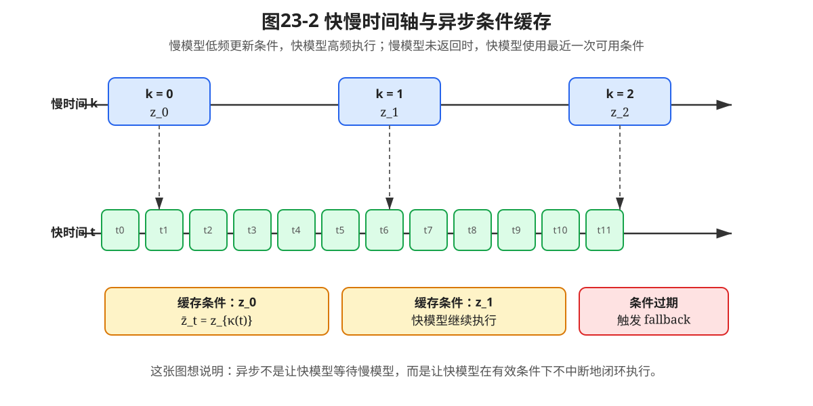
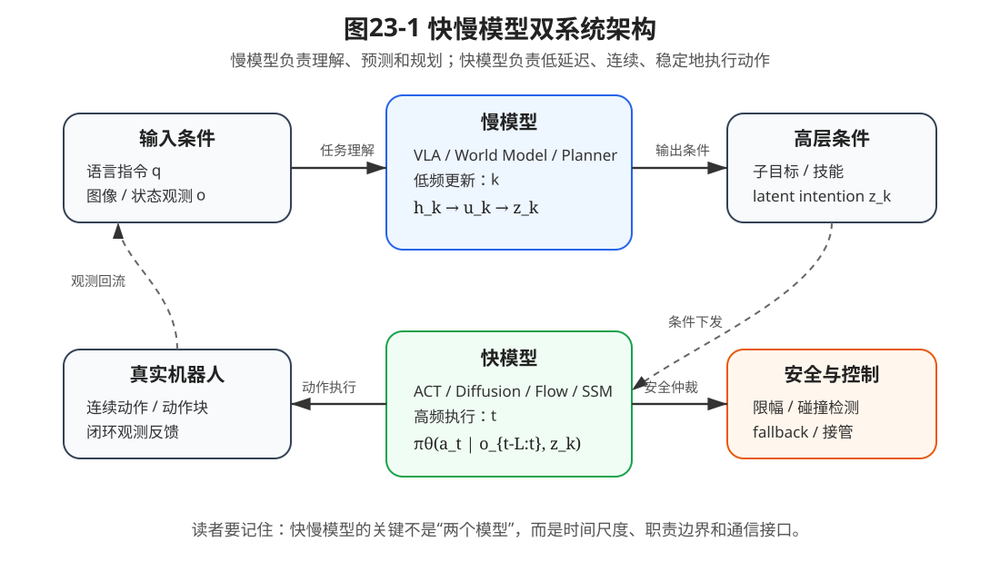
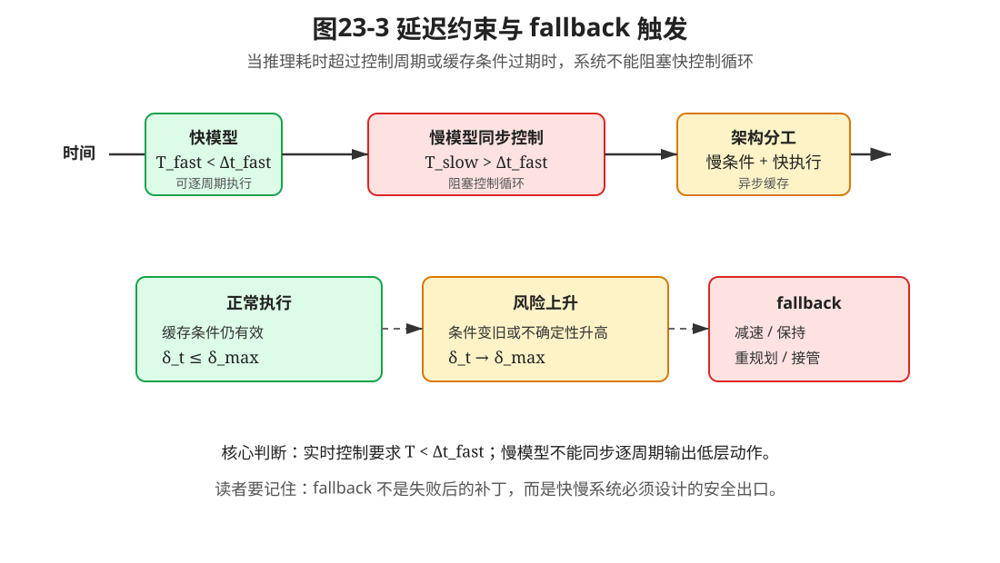

# 第23章：快慢模型：通用机器人为什么需要双系统架构

> **本章一句话导读**：本章用时间尺度、推理延迟和控制频率解释快慢模型，说明慢模型负责理解、预测和规划，快模型负责低延迟、连续、稳定地执行动作。

---

## 0. 本章要解决的问题：为什么单一大模型不够

前面几章已经把现代机器人策略的主要技术拼图展开了：

- 第13章 ACT 说明了为什么机器人可以一次预测一小段动作；
- 第14章 Diffusion Policy 说明了为什么复杂动作分布需要生成式策略；
- 第15章 Flow Matching 说明了动作生成也可以写成连续流场；
- 第17章序列策略模型说明了历史上下文如何进入策略；
- 第18章 VLA 说明了视觉、语言和动作可以进入统一条件策略；
- 第22章 World Models / WAM / JEPA 说明了机器人不能只看当前输入，还要预测未来世界。

但是，这里还缺一个非常重要的架构问题：

> 一个通用机器人系统，能不能只靠一个大模型从图像和语言直接输出所有高频控制动作？

直觉上，这很诱人。

**公式 (23.1)：单模型低层动作策略**

$$a_t \sim \pi_\theta(a_t \mid o_t,q)$$

这个公式读作：在时刻 $t$，单个策略模型根据当前观测 $o_t$ 和语言指令 $q$，直接采样或输出低层动作 $a_t$。

其中：

- $o_t$：当前观测，可以是图像、机器人状态、触觉或多模态输入；
- $q$：语言指令或任务描述；
- $a_t$：低层动作，可以是末端速度、关节位置、关节速度或控制命令；
- $\pi_\theta$：端到端策略模型。

这个式子的问题不是“数学上不能写”，而是“工程上很难直接成立”。在真实机器人系统中，它会遇到三个问题：

1. **慢推理问题**：大 VLM / VLA 擅长语义理解，但推理延迟通常较高；
2. **高频控制问题**：机械臂、灵巧手、双臂协调需要稳定、低延迟、连续动作；
3. **层级抽象问题**：任务理解、子目标规划、世界预测和动作控制不应该都压在同一个时间尺度上。

快慢模型要解决的正是这个问题。

本章的核心观点是：

> 通用机器人策略很可能不是一个单一频率、单一模块的端到端模型，而是由“慢模型”和“快模型”组成的双系统架构。

---

## 1. 与第22章和第24章的衔接

第22章讲的是世界模型、World Action Model 和 JEPA。它回答的问题是：

```text
机器人如何预测“如果这样做，世界会发生什么”？
```

但预测未来还不等于能稳定控制机器人。世界模型可以帮助慢系统理解后果、比较计划、评估风险，却不一定适合每 10ms 或 20ms 直接输出一个控制命令。

第24章将进入 Preference Alignment 与 DPO。它回答的问题是：

```text
当机器人有多个计划、多个动作轨迹或多种失败模式时，如何利用人类偏好进行后训练？
```

因此，第23章处在两者之间：

```text
第22章：机器人需要预测世界
      ↓
第23章：预测、规划和控制需要分到不同时间尺度上
      ↓
第24章：快慢两层都可以用偏好数据继续对齐
```

本章不是引入一个新的单点算法，而是把前面学过的策略模型、世界模型和后训练方法组织成一个更像真实机器人的系统架构。

---

## 2. 本章核心定义

在进入公式之前，先把本章最重要的五个概念固定下来。

> **定义 23.1：慢模型**
>
> 慢模型是指以较低频率运行，负责理解任务、维护抽象状态、预测未来、选择子目标、评估风险或生成高层条件的模型或模块。

慢模型不一定是大语言模型。它可以是 VLM、VLA、World Model、planner、价值模型、偏好模型，甚至是传统任务规划模块。

在机械臂抓取与放置任务中，慢模型负责回答的问题类似：

```text
先抓哪个物体？
从哪一侧接近？
是否需要绕开障碍物？
抓取失败后是否换一个姿态？
```

> **定义 23.2：快模型**
>
> 快模型是指以较高频率运行，在高层条件约束下输出连续动作、动作块或低层控制命令的模型或模块。

快模型的核心不是参数量一定小，而是必须满足低延迟、连续性和闭环稳定性要求。

在机械臂抓取与放置任务中，快模型负责回答的问题类似：

```text
下一步末端速度是多少？
夹爪什么时候闭合？
接触时如何微调？
动作块如何平滑执行？
```

> **定义 23.3：快慢时间尺度**
>
> 快慢时间尺度是指一个慢决策周期覆盖多个快控制周期的系统时间组织方式。

直观地说，慢模型可以几百毫秒甚至几秒更新一次，但快模型可能需要 10Hz、20Hz、50Hz 甚至更高频率运行。

> **定义 23.4：异步条件缓存**
>
> 异步条件缓存是指快模型不阻塞等待慢模型每一步返回，而是使用最近一次可用的高层条件继续执行。

这不是偷懒，而是真实机器人系统中非常常见的工程需求：控制循环不能停下来等大模型思考。

> **定义 23.5：快慢接口**
>
> 快慢接口是指慢模型输出的高层条件与快模型输入条件之间的通信约定，包括条件表示、更新频率、有效期、置信度、终止条件和 fallback 信号。

本章统一使用三类符号：

```text
h_k：慢系统内部 latent state；
u_k：慢系统候选高层动作、技能、子目标或计划动作；
z_k：慢模型传给快模型的高层条件。
```

这三个符号要分清楚。$h_k$ 是慢系统“心里怎么看世界”，$u_k$ 是慢系统“打算做什么”，$z_k$ 是慢系统“交给快模型执行的条件”。

---

## 3. 本章公式主线

第22章已经说明：机器人不能只根据当前输入背动作表，而要预测未来世界。

但第22章留下一个问题：

```text
预测未来的模型，能不能直接拿来做高频低层控制？
```

本章的公式主线就是从这个问题出发。

首先，如果单一模型直接从当前观测和语言指令输出低层动作，可以写成公式 (23.1)。这个写法简单，但把语义理解、世界预测、任务规划和低层控制都压在同一个时间尺度上。

接着，本章引入快慢时间尺度：慢时间 $k$ 和快时间 $t$。一个慢周期覆盖多个快控制步。

**公式 (23.2)：快慢时间尺度关系**

$$t \in \{kM,kM+1,\dots,(k+1)M-1\}$$

其中，$M$ 表示一个慢模型决策周期覆盖多少个快控制步。

在慢时间尺度上，慢模型先维护内部状态并评估候选高层动作：

```text
观测历史和任务指令 → 慢状态 h_k → 候选高层动作 u_k → 快模型条件 z_k
```

在快时间尺度上，快模型不重新理解完整任务，而是在条件 $z_k$ 下输出动作或动作块。

真实系统中，慢模型和快模型往往异步执行。快模型使用最近一次可用的慢模型条件，并根据条件是否过期决定继续执行还是触发 fallback。

这条公式链最终服务于一个工程判断：

> 慢模型负责“想清楚”，快模型负责“做得稳”，异步缓存和 fallback 负责让二者在真实机器人系统中安全连接。

---

## 4. 快慢时间尺度的数学抽象

慢时间尺度记为 $k$，快时间尺度记为 $t$。通常一个慢周期会覆盖多个快控制周期，即公式 (23.2)：

$$t \in \{kM,kM+1,\dots,(k+1)M-1\}$$

这个公式读作：当慢系统处在第 $k$ 个决策周期时，快系统会经历从 $kM$ 到 $(k+1)M-1$ 的多个控制步。

其中：

- $k$：慢模型的决策编号；
- $t$：快模型的控制编号；
- $M$：一个慢周期包含的快控制步数。

举一个机械臂例子。如果快控制频率是 50Hz，快控制周期是 20ms；如果慢模型每 1 秒更新一次条件，那么一个慢周期大约覆盖 50 个快控制步，此时 $M=50$。

这说明：慢模型的一次决策，不能被理解成“一个动作”。它更像是在一段时间内为快模型提供执行背景。



这张图想说明的问题是：慢模型低频更新条件，快模型高频执行动作；当慢模型还没有返回新条件时，快模型不能停下来等，而要使用最近一次仍然有效的条件继续闭环执行。

---

## 5. 慢模型：从观测历史到高层条件

慢模型首先根据观测历史和任务指令形成内部抽象状态。

**公式 (23.3)：慢系统内部状态**

$$h_k=e_\phi(o_{\le kM},q)$$

这个公式读作：慢模型编码器 $e_\phi$ 根据到当前慢周期为止的观测历史 $o_{\le kM}$ 和语言指令 $q$，得到慢系统内部状态 $h_k$。

其中：

- $o_{\le kM}$：到第 $k$ 个慢周期为止的观测历史；
- $q$：语言指令或任务描述；
- $e_\phi$：慢系统中的编码器、VLM、VLA、World Model encoder 或状态估计模块；
- $h_k$：慢系统内部 latent state。

内部状态 $h_k$ 不是直接发给电机的动作。它更像慢系统对当前任务、场景、物体关系、风险和进度的压缩理解。

接着，慢模型可以在抽象状态上预测候选高层动作的后果。

**公式 (23.4)：高层动作后果预测**

$$\hat h_{k+1}=F_\psi(h_k,u_k)$$

其中：

- $u_k$：候选高层动作，可以是技能、子目标、waypoint、抓取姿态或计划动作；
- $F_\psi$：慢系统中的世界预测模型或高层动力学模型；
- $\hat h_{k+1}$：执行候选高层动作后预测得到的下一慢状态。

这个公式承接第22章：世界模型不一定要预测像素，它也可以预测抽象状态或表示空间中的未来。

如果慢模型要从多个候选高层动作中选择一个，可以写成：

**公式 (23.5)：慢模型计划选择**

$$u_k^*=\arg\max_{u_k} J(\hat h_{k+1},q)$$

其中，$J$ 可以表示任务进度、安全性、偏好分数、价值估计或综合评分。

注意，这里的 $u_k^*$ 仍然不一定是低层关节动作。它更可能是“从左侧接近杯子”“先把遮挡物推开”“移动到某个中间 waypoint”这类高层计划。

最后，慢模型把选出的高层计划转换成快模型能使用的条件。

**公式 (23.6)：高层计划到快模型条件**

$$z_k=r_\eta(u_k^*,\hat h_{k+1},q)$$

其中：

- $r_\eta$：把高层计划、预测后果和任务指令编码成快模型条件的接口模块；
- $z_k$：传给快模型的高层条件，可以是子目标、latent instruction、goal image、技能编号或目标位姿。

到这里，慢模型的职责就清楚了：

```text
不是直接控制电机，
而是把复杂任务压缩成快模型可执行的条件。
```

---

## 6. 快模型：在高层条件下输出动作或动作块

快模型不需要每个周期重新理解完整语言任务，而是在最近观测和慢模型条件下输出低层动作。

**公式 (23.7)：快模型单步条件策略**

$$a_t \sim \pi_\theta(a_t \mid o_{t-L:t},z_k)$$

这个公式读作：快模型根据最近一段短历史观测 $o_{t-L:t}$ 和慢模型条件 $z_k$，输出当前快控制步的动作 $a_t$。

其中：

- $o_{t-L:t}$：最近 $L$ 个快控制步的观测历史；
- $z_k$：慢模型在第 $k$ 个慢周期给出的高层条件；
- $\pi_\theta$：快动作策略；
- $a_t$：当前低层动作。

如果快模型一次输出动作块，可以写成：

**公式 (23.8)：快模型动作块条件策略**

$$A_t \sim \pi_\theta(A_t \mid o_{t-L:t},z_k)$$

其中，动作块 $A_t$ 可以表示从当前时刻开始的一段动作序列。

这个接口可以容纳前文多种策略模型：

- ACT：快模型直接输出 action chunk $A_t$；
- Diffusion Policy：快模型通过反向去噪生成动作块 $A_t$；
- Flow Matching：快模型通过速度场积分生成动作块 $A_t$；
- SSM / Mamba 类策略：快模型用较低推理开销处理长历史；
- 传统控制器：快模型在明确子目标下做轨迹跟踪或阻抗控制。

关键点是：快模型不是“不智能”，而是智能分工不同。它的主要目标不是重新想清楚整个任务，而是在当前条件下做出低延迟、连续、稳定的动作。



这张图想说明的问题是：慢模型输出的不是电机命令，而是高层条件；快模型不是孤立动作回归器，而是在慢模型条件下进行闭环执行。

---

## 7. 命题23.1：实时约束排除了同步逐周期低层控制

快慢模型不是为了好听，而是由控制频率和推理延迟共同逼出来的。

假设快控制频率为 $f_{\mathrm{fast}}$，那么快控制周期是：

**公式 (23.9)：快控制周期**

$$\Delta t_{\mathrm{fast}}=\frac{1}{f_{\mathrm{fast}}}$$

慢模型推理耗时记为 $T_{\mathrm{slow}}$，快模型推理耗时记为 $T_{\mathrm{fast}}$。

如果一个模型要同步参与每个快控制周期的低层动作输出，它至少需要满足：

**公式 (23.10)：实时推理约束**

$$T < \Delta t_{\mathrm{fast}}$$

对于快模型，我们希望：

**公式 (23.11)：快模型延迟约束**

$$T_{\mathrm{fast}} < \Delta t_{\mathrm{fast}}$$

但大模型或慢模型经常满足的是另一种关系：

**公式 (23.12)：慢模型耗时关系**

$$T_{\mathrm{slow}} > \Delta t_{\mathrm{fast}}$$

> **命题 23.1：实时约束排除了慢模型的同步逐周期低层控制**
>
> 假设低层控制循环每个快周期都需要在 $\Delta t_{\mathrm{fast}}$ 内得到动作，并且控制循环不能阻塞等待模型推理。如果慢模型单次推理耗时满足 $T_{\mathrm{slow}}>\Delta t_{\mathrm{fast}}$，那么慢模型不适合同步、逐周期、基于当前观测直接输出低层动作。

**证明思路**：

逐周期低层控制要求每个控制周期内都得到可执行动作。若模型推理耗时超过控制周期，则动作返回时已经错过当前控制窗口，控制循环要么阻塞，要么使用过期动作，因此不能形成稳定同步闭环。

**证明**：

快控制周期为公式 (23.9)：

$$\Delta t_{\mathrm{fast}}=\frac{1}{f_{\mathrm{fast}}}$$

若某个模型要在每个快周期同步输出低层动作，则它的推理耗时 $T$ 必须满足公式 (23.10)：

$$T < \Delta t_{\mathrm{fast}}$$

现在慢模型满足公式 (23.12)：

$$T_{\mathrm{slow}} > \Delta t_{\mathrm{fast}}$$

把慢模型代入同步逐周期控制要求，就得到矛盾：慢模型无法在当前快周期结束前返回当前周期需要的动作。

因此，在这些假设下，慢模型不适合同步参与每一个快控制周期的低层动作输出。它更适合低频地产生子目标、计划、风险判断、世界预测结果或高层条件，再由快模型在高频控制周期内执行。

**这个命题告诉我们什么？**

快慢模型不是拍脑袋分层，而是由控制周期、推理延迟和闭环稳定性共同决定的工程约束。

**常见误解**：

不要把“慢模型能力强”误认为“它可以直接控制一切”。如果推理延迟不满足控制周期，它越聪明也越可能拖慢闭环。

**适用边界**：

这个命题排除的是“同步、逐周期、直接输出低层动作”的用法。它不排除慢模型低频输出动作块、提前生成计划、异步更新条件或参与离线重规划。



这张图想说明的问题是：慢模型不是不能参与机器人控制，而是不能阻塞高频控制循环；当条件过期或风险升高时，系统必须有 fallback 出口。

---

## 8. 异步执行：缓存、过期检测与 fallback

真实系统里，慢模型和快模型通常不是严格同步执行，而是异步通信。

快模型在时刻 $t$ 使用最近一次已经完成的慢模型条件。令 $\kappa(t)$ 表示在快时间 $t$ 时最近一次已经完成的慢模型决策编号，则有：

**公式 (23.13)：异步条件缓存**

$$\bar z_t=z_{\kappa(t)}$$

其中：

- $\kappa(t)$：快时间 $t$ 时最近一次已经完成的慢模型决策编号；
- $z_{\kappa(t)}$：该慢周期输出的高层条件；
- $\bar z_t$：快模型当前实际可用的缓存条件。

于是，快模型实际执行的是：

**公式 (23.14)：异步快策略**

$$a_t \sim \pi_\theta(a_t \mid o_{t-L:t},\bar z_t)$$

这说明：

- 慢模型可以晚一点更新；
- 快模型不能停下来等；
- 如果慢模型还没返回，快模型就使用最近一次有效条件继续执行；
- 当条件过期或风险上升时，系统应该触发 fallback。

为了判断缓存条件是否过期，可以定义缓存年龄。

**公式 (23.15)：缓存条件年龄**

$$\delta_t=t-\kappa(t)M$$

其中，$\delta_t$ 表示当前快时间距离最近一次可用慢模型条件已经过去多少个快控制步。

再给定一个最大允许缓存年龄 $\delta_{\max}$，可以定义条件是否有效：

**公式 (23.16)：缓存有效性门控**

$$\mathrm{valid}_t=\mathbf{1}\{\delta_t \le \delta_{\max}\}$$

这个公式读作：如果缓存年龄没有超过阈值，则当前高层条件仍然有效；否则条件过期。

工程上，条件过期不意味着机器人立刻失败，而是意味着系统不能继续盲目执行旧条件。它应该进入某种安全逻辑：

```text
减速、保持当前位置、切换传统控制器、请求慢模型重规划、触发人工接管或进入安全停止。
```

这就是快慢系统的关键工程点：慢模型可以异步，但快控制不能失去安全出口。

---

## 9. 快慢模型与 ACT / Diffusion / Flow / SSM 的关系

第13章到第15章讨论的现代动作策略，很多都可以放进快模型位置。

从快慢接口看，快模型统一接收两个东西：

```text
短历史观测 o_{t-L:t}
慢模型条件 z_k 或缓存条件 \bar z_t
```

然后输出动作或动作块。

**公式 (23.17)：高层条件下的快动作块策略**

$$\pi_\theta(A_t \mid o_{t-L:t},\bar z_t)$$

把不同方法放进这个接口中，可以这样理解：

| 方法 | 快模型输出 | 本章中的角色 |
|---|---|---|
| BC | 单步动作或短动作 | 简单规则任务中的低延迟动作回归 |
| ACT | 动作块 $A_t$ | 用 action chunk 降低逐步预测抖动 |
| Diffusion Policy | 多峰动作块分布 | 在复杂接触和多解动作中生成动作块 |
| Flow Matching | 连续流场生成动作 | 用 ODE 采样生成连续动作轨迹 |
| SSM / Mamba | 历史条件策略 | 用较低推理开销处理长历史上下文 |
| 传统控制器 | 轨迹跟踪命令 | 在明确目标下保证稳定性和安全边界 |

这说明：快模型不是某一个固定算法，而是一个系统位置。凡是能在高层条件下低延迟、稳定地产生动作的模块，都可以作为快模型。

---

## 10. 快慢模型与 World Model / WAM / JEPA 的关系

第22章的 World Model、World Action Model 和 JEPA，更自然地出现在慢模型内部。

原因很简单：世界预测通常服务于“想清楚接下来该怎么做”，而不是每个快控制周期都直接输出关节命令。

在本章符号下，世界模型对应公式 (23.4)：

$$\hat h_{k+1}=F_\psi(h_k,u_k)$$

其中，候选高层动作 $u_k$ 可以是：

- 选择一个抓取姿态；
- 移动到一个中间 waypoint；
- 先推开遮挡物；
- 把物体放到某个区域；
- 切换到另一个技能。

World Action Model 的作用是预测候选 $u_k$ 会造成什么后果。JEPA 式表示预测的作用是让这种预测发生在表示空间，而不是必须重建像素。

所以，第22章和第23章的关系可以写成：

```text
第22章：给慢模型预测未来的能力；
第23章：规定慢模型预测和快模型执行之间的接口；
第24章：用偏好数据继续调整慢计划和快动作。
```

---

## 11. 快慢模型与 Preference Alignment / DPO 的关系

后续 Preference Alignment 与 DPO 可以分别作用在快慢两层。

慢模型偏好数据可以是：

**公式 (23.18)：慢模型偏好对**

$$(u_k^+,u_k^-)$$

它表示在同一个场景条件下，人类更偏好某个高层计划，而不是另一个高层计划。

例如：

```text
偏好：先从杯柄一侧接近杯子
不偏好：直接从杯口上方压下去
```

快模型偏好数据可以是：

**公式 (23.19)：快模型动作偏好对**

$$(A_t^+,A_t^-)$$

它表示在同一个高层条件下，人类更偏好某段安全、平滑、成功的动作轨迹，而不是失败、碰撞或不稳定的动作轨迹。

因此，机器人后训练并不只是在“语言输出”上做偏好对齐，而是可以扩展为：

**公式 (23.20)：机器人偏好数据集**

$$\mathcal{D}_{\mathrm{pref}}=\{(c_i,y_i^+,y_i^-)\}_{i=1}^{N}$$

其中：

- $c_i$：场景条件，可以包含观测、任务、慢状态或快模型条件；
- $y_i^+$：更被偏好的计划或动作轨迹；
- $y_i^-$：较差的计划或动作轨迹。

这正是第24章要接着展开的问题：偏好数据如何变成训练目标，DPO 如何把“更喜欢哪个结果”转化为模型更新。

---

## 12. 工程实现形态：接口契约、频率、延迟与安全仲裁

一个实际快慢系统可以写成如下结构：

```text
语言指令 + 图像观测 + 机器人状态
        ↓
慢模型：VLM / VLA / World Model / Planner
        ↓
慢状态 h_k、高层候选 u_k、快模型条件 z_k
        ↓
异步条件缓存 z̄_t
        ↓
快模型：ACT / Diffusion / Flow / SSM Policy / Controller
        ↓
连续动作 / action chunk
        ↓
安全约束 / fallback / controller
        ↓
真实机器人
```

为了让这个系统真正可实现，快慢接口不能只写一句“传一个 latent”。至少要约定下面几类信息：

| 接口项 | 符号 | 工程含义 |
|---|---|---|
| 慢状态 | $h_k$ | 慢系统对场景、任务和风险的内部理解 |
| 高层候选 | $u_k$ | 子目标、技能、waypoint、抓取姿态或计划动作 |
| 快模型条件 | $z_k$ | 传给快模型的可执行条件 |
| 缓存条件 | $\bar z_t$ | 快模型当前实际使用的最近条件 |
| 缓存年龄 | $\delta_t$ | 条件已经被使用了多少个快控制步 |
| 有效性门控 | $\mathrm{valid}_t$ | 条件是否仍可继续执行 |
| fallback 信号 | $b_t$ | 是否进入减速、保持、重规划或接管 |

这里最容易被低估的是 fallback。很多论文图里只画“慢模型 → 快模型 → 机器人”，但真实系统还必须有安全仲裁层。

原因是：

```text
慢模型可能返回太慢；
慢模型可能理解错任务；
快模型可能在旧条件下继续执行；
环境可能在执行中发生变化；
接触任务可能出现不可预测的滑动、卡滞或碰撞。
```

因此，快慢系统不是“有慢有快就安全”，而是必须同时设计：

```text
频率预算、延迟预算、缓存有效期、风险检测、fallback 策略和人工接管入口。
```

---

## 13. 统一例子：机械臂抓取与放置

回到本书统一的视觉引导机械臂抓取与放置任务。

假设机器人接收到指令：

> 把桌子上的杯子拿起来，放到水槽旁边，顺手把旁边的抹布叠好。

慢模型适合决定：

- 哪个物体是杯子，哪个物体是抹布；
- 先处理杯子还是先处理抹布；
- 从哪一侧接近杯子；
- 杯子里是否可能有水；
- 是否需要先推开遮挡物；
- 抓取失败后是否换一个抓取姿态；
- 当前计划是否存在碰撞风险。

这些决策对应的是慢状态 $h_k$、高层候选 $u_k$ 和快模型条件 $z_k$。

快模型适合负责：

- 在当前 $z_k$ 下输出末端速度；
- 执行动作块 $A_t$；
- 控制夹爪闭合时机；
- 在接触过程中做微调；
- 保持轨迹平滑，减少抖动；
- 在条件过期时切换到安全控制。

如果使用单一大模型逐步输出每一个低层动作，那么它需要同时完成“理解杯子”“判断水槽位置”“规划顺序”“预测物理后果”“输出连续控制”“处理接触扰动”。这不仅推理慢，也会让每个模块的失败边界变得模糊。

快慢模型把问题拆开：

```text
慢模型负责决定“接下来要做什么”；
快模型负责把“要做什么”稳定地执行出来；
安全层负责判断“还能不能继续这样做”。
```

这就是本章对真实机器人系统最重要的工程含义。

---

## 14. 常见误解与适用边界

| 常见误解 | 正确认识 |
|---|---|
| 快慢模型就是两个模型随便串起来 | 关键不是数量，而是时间尺度、职责边界和通信接口 |
| 慢模型一定是大语言模型 | 慢模型可以是 VLM、VLA、World Model、planner、价值模型或传统任务规划模块 |
| 快模型一定是小模型 | 快模型的核心要求是低延迟和稳定控制，不是参数量一定小 |
| 快慢模型能自动解决安全问题 | 它只是提供架构分工，安全仍需要限幅、碰撞检测、fallback、异常检测和人工接管 |
| 慢模型越聪明越适合直接控制 | 如果延迟不满足控制周期，它就不适合同步逐周期输出低层动作 |
| 异步缓存只是工程细节 | 异步缓存决定快模型是否会被慢模型阻塞，是系统能否稳定运行的关键接口 |
| Preference Alignment 只适合语言输出 | 在机器人中，高层计划和低层动作轨迹都可以构造偏好数据 |

本章也有适用边界。

第一，快慢模型不是说所有任务都必须上大模型。对于固定工位、规则物体、明确轨迹的工业任务，传统规划和控制器可能已经足够。

第二，快慢模型不是替代控制理论。低层稳定性、限幅、碰撞检测、接触控制和急停逻辑仍然需要严肃设计。

第三，慢模型的预测和计划不一定可靠。世界模型预测误差、语言理解错误、视觉误检都会通过 $z_k$ 影响快模型。

第四，快模型也不是万能执行器。如果 $z_k$ 给错了目标，快模型可能把错误目标执行得很稳定。

所以，快慢模型的正确理解是：

```text
它提供系统分工，不保证系统必然安全；
它降低架构耦合，不消除模型误差；
它让后训练更有层次，不替代真实机器人验证。
```

---

## 15. 读完本章，你应该能判断什么

读完本章后，你应该能判断：

1. 快慢模型不是“两个模型拼接”，而是时间尺度和控制频率驱动的架构分工。
2. 慢模型适合理解任务、维护抽象状态、预测未来、选择子目标和判断风险。
3. 快模型适合低延迟、连续、稳定地输出动作或动作块。
4. 如果慢模型推理耗时大于快控制周期，它就不适合同步逐周期控制低层动作。
5. 异步条件缓存可以避免慢模型阻塞快控制，但必须配合过期检测、fallback 和安全仲裁。
6. $h_k$、$u_k$、$z_k$ 的含义不同：慢状态、候选高层动作、快模型条件不能混用。
7. ACT、Diffusion Policy、Flow Matching、SSM 和传统控制器都可以作为快模型候选。
8. World Model / WAM / JEPA 更适合放在慢模型内部，用于预测和计划比较。
9. Preference Alignment 和 DPO 不只可以作用在语言输出，也可以作用在高层计划和低层动作轨迹上。
10. 一个真实机器人系统不仅要有模型，还要有频率预算、延迟预算、缓存有效期、fallback 和接管机制。

---

## 16. 本章公式索引

### 公式 (23.1)：单模型低层动作策略

$$a_t \sim \pi_\theta(a_t \mid o_t,q)$$

- **含义**：单模型直接从当前观测和语言指令输出低层动作。
- **需要掌握到什么程度**：理解它是一个诱人的简化，但会遇到频率、延迟和层级抽象问题。

### 公式 (23.2)：快慢时间尺度关系

$$t \in \{kM,kM+1,\dots,(k+1)M-1\}$$

- **含义**：一个慢周期覆盖多个快控制周期。
- **需要掌握到什么程度**：理解快慢系统首先是时间尺度分工。

### 公式 (23.3)：慢系统内部状态

$$h_k=e_\phi(o_{\le kM},q)$$

- **含义**：慢模型从观测历史和任务指令生成内部抽象状态。
- **需要掌握到什么程度**：理解 $h_k$ 是慢模型对世界和任务的内部理解，不是低层动作。

### 公式 (23.4)：高层动作后果预测

$$\hat h_{k+1}=F_\psi(h_k,u_k)$$

- **含义**：慢模型预测候选高层动作会导致怎样的未来抽象状态。
- **需要掌握到什么程度**：理解它承接第22章的世界模型思想。

### 公式 (23.5)：慢模型计划选择

$$u_k^*=\arg\max_{u_k} J(\hat h_{k+1},q)$$

- **含义**：慢模型根据预测结果和任务目标选择高层动作。
- **需要掌握到什么程度**：理解 $u_k^*$ 是高层计划，不一定是低层控制命令。

### 公式 (23.6)：高层计划到快模型条件

$$z_k=r_\eta(u_k^*,\hat h_{k+1},q)$$

- **含义**：慢模型把选出的高层计划转换为快模型可执行的条件。
- **需要掌握到什么程度**：理解 $z_k$ 是快慢接口的核心变量。

### 公式 (23.7)：快模型单步条件策略

$$a_t \sim \pi_\theta(a_t \mid o_{t-L:t},z_k)$$

- **含义**：快模型在高层条件下输出当前低层动作。
- **需要掌握到什么程度**：理解快模型负责低延迟闭环执行。

### 公式 (23.8)：快模型动作块条件策略

$$A_t \sim \pi_\theta(A_t \mid o_{t-L:t},z_k)$$

- **含义**：快模型在高层条件下输出一段动作块。
- **需要掌握到什么程度**：理解 ACT、Diffusion Policy、Flow Matching 都可以放入该接口。

### 公式 (23.9)：快控制周期

$$\Delta t_{\mathrm{fast}}=\frac{1}{f_{\mathrm{fast}}}$$

- **含义**：控制频率越高，单周期可用时间越短。
- **需要掌握到什么程度**：理解实时控制对推理延迟的硬约束。

### 公式 (23.10)：实时推理约束

$$T < \Delta t_{\mathrm{fast}}$$

- **含义**：同步逐周期控制要求模型推理时间小于快控制周期。
- **需要掌握到什么程度**：理解命题 23.1 的基本约束。

### 公式 (23.11)：快模型延迟约束

$$T_{\mathrm{fast}} < \Delta t_{\mathrm{fast}}$$

- **含义**：快模型必须能在快控制周期内完成推理。
- **需要掌握到什么程度**：理解为什么低延迟是快模型核心要求。

### 公式 (23.12)：慢模型耗时关系

$$T_{\mathrm{slow}} > \Delta t_{\mathrm{fast}}$$

- **含义**：慢模型推理时间超过快控制周期时，不适合同步逐周期输出低层动作。
- **需要掌握到什么程度**：理解快慢分工的工程根源。

### 公式 (23.13)：异步条件缓存

$$\bar z_t=z_{\kappa(t)}$$

- **含义**：快模型使用最近一次已经完成的慢模型条件。
- **需要掌握到什么程度**：理解异步执行不是等待慢模型，而是使用可用条件继续闭环。

### 公式 (23.14)：异步快策略

$$a_t \sim \pi_\theta(a_t \mid o_{t-L:t},\bar z_t)$$

- **含义**：快模型基于缓存条件输出动作。
- **需要掌握到什么程度**：理解真实系统中快模型常常用的是 $\bar z_t$，不是理想同步的 $z_k$。

### 公式 (23.15)：缓存条件年龄

$$\delta_t=t-\kappa(t)M$$

- **含义**：度量缓存条件已经被使用了多少个快控制步。
- **需要掌握到什么程度**：理解为什么异步缓存需要过期检测。

### 公式 (23.16)：缓存有效性门控

$$\mathrm{valid}_t=\mathbf{1}\{\delta_t \le \delta_{\max}\}$$

- **含义**：判断当前缓存条件是否仍然有效。
- **需要掌握到什么程度**：理解 fallback 可以由明确的门控条件触发。

### 公式 (23.17)：高层条件下的快动作块策略

$$\pi_\theta(A_t \mid o_{t-L:t},\bar z_t)$$

- **含义**：真实异步系统中，动作块策略通常使用缓存后的高层条件。
- **需要掌握到什么程度**：理解各种快模型都可以统一到条件动作块策略接口。

### 公式 (23.18)：慢模型偏好对

$$(u_k^+,u_k^-)$$

- **含义**：同一场景下对两个高层计划的偏好比较。
- **需要掌握到什么程度**：理解偏好对齐可以作用在慢计划层。

### 公式 (23.19)：快模型动作偏好对

$$(A_t^+,A_t^-)$$

- **含义**：同一条件下对两段动作轨迹的偏好比较。
- **需要掌握到什么程度**：理解偏好对齐也可以作用在快动作层。

### 公式 (23.20)：机器人偏好数据集

$$\mathcal{D}_{\mathrm{pref}}=\{(c_i,y_i^+,y_i^-)\}_{i=1}^{N}$$

- **含义**：偏好数据可以作用于高层计划或低层动作轨迹。
- **需要掌握到什么程度**：理解本章如何自然引出第24章 Preference Alignment 与 DPO。

---

## 17. 本章定义索引

| 编号 | 概念 | 一句话含义 |
|---|---|---|
| 定义 23.1 | 慢模型 | 低频运行、负责理解任务、预测未来、选择子目标或输出高层条件的模型 |
| 定义 23.2 | 快模型 | 高频运行、负责在高层条件下输出连续动作或动作块的模型 |
| 定义 23.3 | 快慢时间尺度 | 一个慢周期覆盖多个快控制周期的系统时间组织方式 |
| 定义 23.4 | 异步条件缓存 | 快模型使用最近一次可用慢模型条件，避免等待慢模型阻塞控制 |
| 定义 23.5 | 快慢接口 | 慢模型输出条件与快模型输入条件之间的通信约定 |

---

## 18. 思考题

1. 如果一个 VLA 模型推理耗时为 300ms，而机械臂快控制频率是 50Hz，它能否同步逐周期输出低层动作？请用公式 (23.9) 到公式 (23.12) 解释。
2. 在什么情况下，慢模型可以输出 action chunk 或高层轨迹，而不必每个快周期输出动作？
3. 异步缓存 $\bar z_t$ 过期后，系统应该继续执行、减速、重规划还是接管？不同选择适用于哪些场景？
4. 对机械臂抓取与放置任务来说，哪些决策适合慢模型，哪些动作必须交给快模型？
5. 如果 $z_k$ 给错了目标，快模型执行得越稳定是否越危险？为什么？
6. Preference Alignment 更适合先作用在慢计划层，还是快动作层？请分别给出一个例子。

---

## 19. 本章配图清单

- **图23-1 快慢模型双系统架构**：说明慢模型如何从语言和观测生成高层条件，快模型如何在条件下输出动作块。
- **图23-2 快慢时间轴与异步条件缓存**：说明一个慢周期覆盖多个快周期，快模型如何使用最近一次可用条件。
- **图23-3 延迟约束与 fallback 触发**：说明当推理耗时超过控制周期或缓存条件过期时，为什么必须触发安全逻辑。

---

## 20. 建议阅读的附录条目

- **附录 A：数学符号与公式阅读方法**：帮助理解快慢时间尺度、条件变量和公式索引。
- **附录 F：强化学习与序列决策基础**：帮助理解高层计划、低层策略与闭环执行。
- **附录 G：生成模型基础**：帮助理解快模型中的生成式动作策略。
- **附录 H：实验与代码基础**：帮助理解延迟、控制频率、fallback 和部署监控。
- **附录 I：熵、最大熵与 Score Matching**：帮助理解 Diffusion / Flow 类快模型的分布建模基础。

---

## 21. 推荐阅读与深入材料

### 阅读目的

本章要解释为什么通用机器人需要慢系统做理解、规划、反思和预测，快系统做低延迟动作执行。推荐阅读要覆盖认知启发、层级控制、语言规划和机器人执行接口。

### 推荐材料

1. **Kahneman, 2011, “Thinking, Fast and Slow”**
   - 类型：认知启发 / 背景材料。
   - 阅读目的：理解快系统 / 慢系统的直觉来源。
   - 重点看什么：只看“快思考”和“慢思考”的直觉差异，不要把心理学结论机械套用到机器人架构。
   - 对应本章：帮助理解为什么“快”和“慢”是分工类比，而不是严格心理学模型。

2. **Sutton, Precup, and Singh, 1999, “Between MDPs and Semi-MDPs: A Framework for Temporal Abstraction in Reinforcement Learning”**
   - 类型：经典 / 层级决策基础。
   - 阅读目的：理解 options、temporal abstraction 和高低层策略。
   - 重点看什么：重点看 temporal abstraction 如何把多个底层时间步合成一个高层动作。
   - 对应本章：理解为什么长任务需要时间抽象，而不是每一步都重新规划。

3. **Ahn et al., 2022, “Do As I Can, Not As I Say: Grounding Language in Robotic Affordances” / SayCan**
   - 类型：经典 / 机器人认知架构。
   - 阅读目的：理解语言模型给候选计划，机器人 affordance / value 判断可执行性。
   - 重点看什么：重点看语言模型提出候选动作、价值或可行性模型筛选动作的组合方式。
   - 对应本章：慢系统提出方案，执行可行性模型筛选方案。

4. **Liang et al., 2023, “Code as Policies”**
   - 类型：前沿 / 语言到控制程序。
   - 阅读目的：理解慢系统如何生成可组合的控制代码。
   - 重点看什么：重点看语言模型如何把自然语言任务转化为可执行程序结构。
   - 对应本章：高层语言或程序如何作为快系统条件。

5. **Huang et al., 2022, “Inner Monologue: Embodied Reasoning through Planning with Language Models”**
   - 类型：前沿 / 反馈闭环。
   - 阅读目的：理解语言反馈、环境反馈和重新规划如何结合。
   - 重点看什么：重点看系统如何利用环境反馈更新计划，而不是只生成一次性动作序列。
   - 对应本章：慢系统如何利用反馈更新计划。

### 阅读提示

读快慢系统材料时，建议标注每个模块的控制频率：语言规划是秒级还是分钟级？低层控制是 10Hz、50Hz 还是更高？频率错配是工程落地的核心问题。

---

## 22. 本章小结

快慢模型不是一个孤立算法，而是一种组织机器人智能系统的架构原则。

它把全书前面的内容重新串成一条系统链路：

```text
慢模型：VLA / World Model / JEPA / Planner
    ↓
慢状态 h_k、高层候选 u_k、快模型条件 z_k
    ↓
异步缓存 z̄_t、过期检测 valid_t、fallback
    ↓
快模型：ACT / Diffusion Policy / Flow Matching / SSM-Mamba / Controller
    ↓
动作执行：连续控制 / 安全约束 / 接管
    ↓
后训练：Preference Alignment / DPO / 接管纠偏
```

本章最重要的结论是：通用机器人系统不能只问“模型够不够大”，还要问“模型运行在哪个时间尺度上”。慢模型可以越来越聪明，快模型可以越来越稳，但二者必须通过清晰的接口、频率预算、缓存机制和安全仲裁连接起来。

这也是为什么本章放在 World Models / WAM / JEPA 之后、Preference Alignment / DPO 之前：它一方面承接“机器人要理解和预测世界”，另一方面为“如何后训练和部署一个真正可用的机器人策略系统”搭桥。
