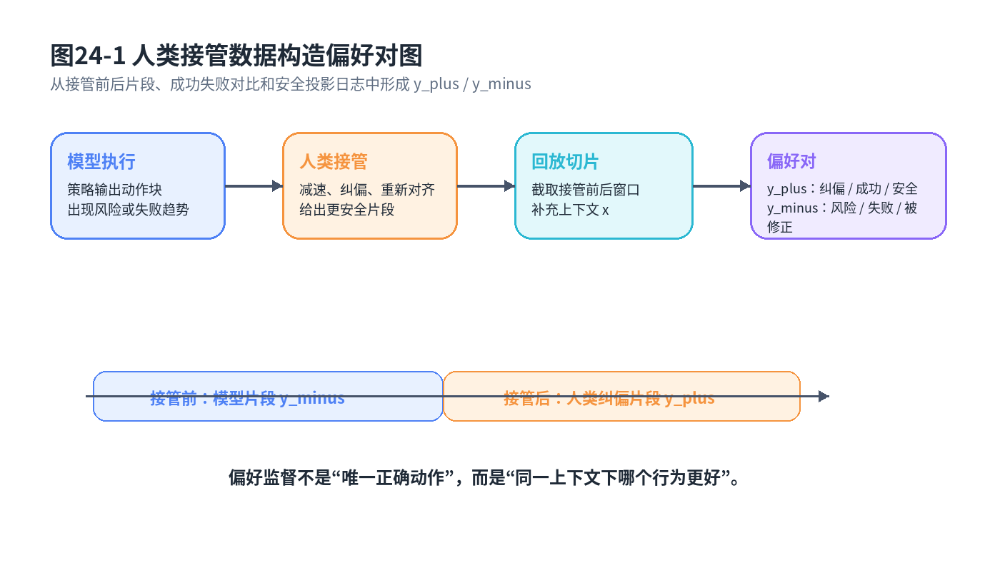
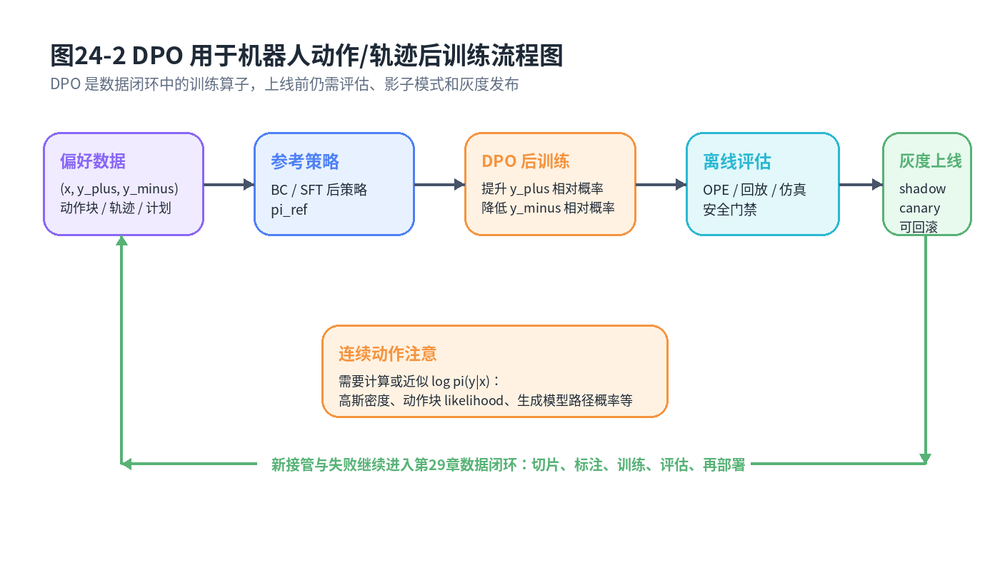

# 第24章：Preference Alignment 与 DPO：从人类接管纠偏到机器人后训练

> **新版布局位置**：本章属于 **第七篇：后训练、对齐与实机部署**。本章编号、公式编号与交叉引用已按新版八篇结构统一调整。
>
> **本章一句话导读**：机器人后训练的关键不是再模仿一遍专家，而是把人类接管、纠偏和成功/失败对比组织成偏好信号，让策略更安全、更稳、更符合任务意图。

---

## 0. 本章要解决的问题

到第23章为止，我们已经见过很多策略学习路线：BC、DAgger、IRL、GAIL、ACT、Diffusion Policy、Flow Matching、VLA、World Model 和快慢模型。它们大多围绕“如何从示范或数据中学到策略”。

但真实机器人上线后，最有价值的数据往往不是干净专家示范，而是：

- 操作员什么时候接管；
- 接管前模型做错了什么；
- 人类纠偏后轨迹为什么更好；
- 两个候选动作块哪个更安全；
- 同一任务中成功轨迹和失败轨迹差在哪里。

这些数据不一定给出唯一正确动作，却能给出偏好关系：

```text
轨迹 A 比轨迹 B 更好
动作块 A 比动作块 B 更安全
接管后的片段优于接管前的片段
```

本章要回答的问题是：

> 如何把机器人接管纠偏数据变成偏好对，并用 DPO 这类方法做后训练？



**图24-1 说明**：机器人执行中出现风险或失败趋势，人类接管并给出纠偏轨迹。系统把接管前片段、接管后片段、成功/失败对比和安全投影结果整理成偏好对，为后训练提供监督。

---

## 1. 与前后章节的衔接

第10章 IRL 和第11章 GAIL 讨论“能不能从专家行为中反推奖励或分布匹配”。第12章 Offline IL 讨论离线数据质量。第22章和第23章把世界预测、快慢系统引入机器人策略。到了本章，问题变成：策略已经部署，数据闭环已经开始，如何利用人类反馈继续优化？

第29章会把本章方法放进平台闭环：接管事件发现、回放切片、偏好标注、DPO 后训练、离线评估、shadow mode、灰度发布和回滚。

---

## 2. 为什么机器人后训练不能只靠 BC？

BC 的基本目标是模仿专家动作：

<div class="math">\[
\mathcal{L}_{\mathrm{BC}}(\theta)=-\mathbb{E}_{(o,a)\sim\mathcal{D}}\left[\log \pi_\theta(a\mid o)\right]
\tag{24.1}
\]</div>

### 公式拆解

**动机**：如果数据里有专家动作，最大化专家动作概率是最直接的学习方式。

**符号**：<span class="math">\\(\mathcal{D}\\)</span> 是示范数据；<span class="math">\\(o\\)</span> 是观测；<span class="math">\\(a\\)</span> 是专家动作；<span class="math">\\(\pi\_\theta\\)</span> 是策略。

**直觉**：专家怎么做，模型就尽量怎么做。

**工程含义**：BC 适合冷启动策略，但部署后会遇到新场景、新错误和安全边界问题，仅靠继续堆示范数据不够高效。

**常见误解**：后训练不是简单“再收一点专家轨迹做 BC”。接管数据里包含对比信息：模型原来怎样做、人类为什么纠正、纠正后更好在哪里。

偏好学习要用的数据不是单点动作，而是成对比较：

<div class="math">\[
\mathcal{D}_{\mathrm{pref}}=\{(x,y^+,y^-)\}
\tag{24.2}
\]</div>

其中 <span class="math">\\(x\\)</span> 是上下文，<span class="math">\\(y^+\\)</span> 是更偏好的行为，<span class="math">\\(y^-\\)</span> 是较差行为。

---

## 3. 人类接管数据如何形成偏好对

机器人中偏好对象可以有多个粒度：

1. **高层计划**：先抓哪个物体、走哪条路线、是否先清理障碍；
2. **子目标**：末端先对齐到哪里、目标放置点选在哪里；
3. **动作块**：未来 <span class="math">\\(H\\)</span> 步动作序列；
4. **完整轨迹**：一次任务从开始到结束的行为；
5. **安全投影后的执行动作**：策略原始动作和安全层修正动作之间的比较。

可以把机器人偏好对写成：

<div class="math">\[
x=(o_t,h_t,g_t), \quad y=A_{t:t+H-1}\ \text{或}\ \tau_{t:t+H}
\tag{24.3}
\]</div>

其中 <span class="math">\\(h\_t\\)</span> 是历史摘要，<span class="math">\\(g\_t\\)</span> 是任务目标，<span class="math">\\(y\\)</span> 可以是动作块或轨迹片段。

举例：机械臂抓取中，模型原始动作块让夹爪从偏左位置闭合，导致物体被推歪；人类接管后先重新对齐，再慢速下探。于是可以构造：

```text
x：接管前观测和任务上下文
 y+：人类纠偏后的动作片段
 y-：模型接管前的动作片段
```

二维点机器人中，如果模型走向障碍物，人类接管让它绕开障碍物，也可以构成偏好对。

---

## 4. 从偏好概率到 DPO

偏好学习常用 Bradley-Terry 形式描述两段行为的相对好坏：

<div class="math">\[
P(y^+\succ y^-\mid x)=\sigma\left(r(x,y^+)-r(x,y^-)\right)
\tag{24.4}
\]</div>

其中 <span class="math">\\(r(x,y)\\)</span> 是行为 <span class="math">\\(y\\)</span> 在上下文 <span class="math">\\(x\\)</span> 下的奖励或偏好分数，<span class="math">\\(\sigma\\)</span> 是 sigmoid。

传统 RLHF 会先学奖励模型，再优化策略：

<div class="math">\[
\max_{\pi}\ \mathbb{E}_{y\sim\pi(\cdot\mid x)}[r(x,y)]-\beta D_{\mathrm{KL}}(\pi(\cdot\mid x)\|\pi_{\mathrm{ref}}(\cdot\mid x))
\tag{24.5}
\]</div>

这个目标说：策略既要拿高奖励，又不能偏离参考策略太远。DPO 的关键是把奖励模型和策略优化合并，直接用偏好对优化策略。由 KL 正则化最优解可以得到一个关系：

<div class="math">\[
r(x,y)=\beta\log\frac{\pi^*(y\mid x)}{\pi_{\mathrm{ref}}(y\mid x)} + \beta\log Z(x)
\tag{24.6}
\]</div>

把这个关系代回偏好概率，归一化项 <span class="math">\\(Z(x)\\)</span> 在成对差分中抵消，得到 DPO 损失：

<div class="math">\[
\mathcal{L}_{\mathrm{DPO}}(\theta)=
-\mathbb{E}_{(x,y^+,y^-)\sim\mathcal{D}_{\mathrm{pref}}}
\log\sigma\left(\beta\left[
\log\frac{\pi_\theta(y^+\mid x)}{\pi_{\mathrm{ref}}(y^+\mid x)}-
\log\frac{\pi_\theta(y^-\mid x)}{\pi_{\mathrm{ref}}(y^-\mid x)}
\right]\right)
\tag{24.7}
\]</div>

### 公式拆解

**动机**：我们希望偏好行为 <span class="math">\\(y^+\\)</span> 在当前策略下相对参考策略的概率提升，差行为 <span class="math">\\(y^-\\)</span> 的相对概率降低。

**符号**：<span class="math">\\(\pi\_\theta\\)</span> 是待训练策略；<span class="math">\\(\pi\_{\mathrm{ref}}\\)</span> 是参考策略，通常是 SFT/BC 后的模型；<span class="math">\\(\beta\\)</span> 控制偏离参考策略的强度；<span class="math">\\(y^+\\)</span> 是被偏好的行为，<span class="math">\\(y^-\\)</span> 是较差行为。

**公式**：方括号里是“当前策略相对参考策略，对好行为和坏行为的偏移差”。如果好行为提升更多、坏行为提升更少，loss 就小。

**直觉**：DPO 不直接学一个奖励函数，而是直接告诉策略：在这个上下文下，把好片段排到坏片段前面。

**工程含义**：机器人后训练时，<span class="math">\\(y\\)</span> 可以是动作块、轨迹片段或高层计划。只要能计算 <span class="math">\\(\log\pi(y\mid x)\\)</span>，就可以尝试 DPO 类目标。

**常见误解**：DPO 不是万能奖励学习。它依赖偏好对质量，也依赖策略概率建模是否合理。

---

## 5. 从语言 token 到机器人连续动作：对象发生了什么变化？

语言模型中，<span class="math">\\(y\\)</span> 是 token 序列，<span class="math">\\(\log\pi(y\mid x)\\)</span> 是每个 token 概率的和。机器人中，<span class="math">\\(y\\)</span> 往往是连续动作轨迹，因此更准确地说是概率密度：

<div class="math">\[
\log \pi_\theta(y\mid x)=\sum_{i=0}^{H-1}\log p_\theta(a_{t+i}\mid x,a_{t:t+i-1})
\tag{24.8}
\]</div>

如果动作头是高斯分布：

<div class="math">\[
\log p_\theta(a\mid x)=
-\frac{1}{2}(a-\mu_\theta(x))^T\Sigma_\theta(x)^{-1}(a-\mu_\theta(x))
-\frac{1}{2}\log |2\pi\Sigma_\theta(x)|
\tag{24.9}
\]</div>

### 公式拆解

**动机**：DPO 需要比较好行为和坏行为的 log probability。连续动作没有离散 token 概率，必须用概率密度或生成过程 likelihood 的近似。

**符号**：<span class="math">\\(p\_\theta\\)</span> 是连续动作密度；<span class="math">\\(\mu\_\theta\\)</span> 是均值；<span class="math">\\(\Sigma\_\theta\\)</span> 是协方差。

**直觉**：离散 token 是“选哪个词”，连续动作是“在连续空间里落在哪个位置”。概率密度数值会受动作尺度影响，所以动作归一化非常重要。

**工程含义**：如果策略是 ACT 的 CVAE、Diffusion Policy 或 Flow Matching，<span class="math">\\(\log\pi(y\mid x)\\)</span> 可能没有简单闭式，需要使用变分下界、噪声预测路径概率、flow likelihood 或替代打分。不能生搬硬套语言 DPO。

**常见误解**：连续动作 DPO 不是把动作离散成几个 bin 就完事。离散化会引入分辨率、安全和控制精度问题，需要谨慎设计。

---

## 6. DPO 用于动作块与轨迹片段

对于动作块策略，可以写成：

<div class="math">\[
\log\pi_\theta(A_t\mid x_t)=\log p_\theta(a_t,\ldots,a_{t+H-1}\mid x_t)
\tag{24.10}
\]</div>

对于完整轨迹：

<div class="math">\[
\log\pi_\theta(\tau\mid x)=\sum_{t=0}^{T-1}\log\pi_\theta(a_t\mid o_t,h_t,g_t)
\tag{24.11}
\]</div>

这两个公式看起来简单，但工程含义不同：

- 动作块偏好更接近局部纠偏，适合接管前后片段；
- 轨迹偏好更接近任务级成败，适合成功/失败 episode 对比；
- 高层计划偏好适合 VLA 或慢模型；
- 安全投影动作偏好适合训练模型远离安全边界。

如果动作经过安全层投影：

<div class="math">\[
\tilde{a}_t=\Pi_{\mathcal{S}}(a_t)
\tag{24.12}
\]</div>

那么偏好对象可以是原始动作 <span class="math">\\(a\_t\\)</span>、投影动作 <span class="math">\\(\tilde{a}\_t\\)</span>，也可以是“被投影幅度”。如果某个动作经常被安全层大幅修正，它本身就是后训练的重要负样本。

---

## 7. Robot-DPO / preference-based robot policy 的工程闭环

一个可落地闭环通常是：

```text
实机执行 → 监控风险 → 人类接管/纠偏 → 回放切片 → 构造偏好对
→ DPO/偏好后训练 → OPE/仿真/影子模式 → 灰度部署 → 继续记录
```

可以把数据构造写成：

<div class="math">\[
\mathcal{D}_{\mathrm{pref}}=\mathrm{PairBuilder}(\mathcal{D}_{\mathrm{takeover}},\mathcal{D}_{\mathrm{success}},\mathcal{D}_{\mathrm{safety}})
\tag{24.13}
\]</div>

其中 <span class="math">\\(\mathcal{D}\_{\mathrm{takeover}}\\)</span> 是接管数据，<span class="math">\\(\mathcal{D}\_{\mathrm{success}}\\)</span> 是成功/失败对比，<span class="math">\\(\mathcal{D}\_{\mathrm{safety}}\\)</span> 是安全层日志。

为了防止后训练破坏基础能力，常常加入 supervised anchor：

<div class="math">\[
\mathcal{L}=\mathcal{L}_{\mathrm{DPO}}+\lambda\mathcal{L}_{\mathrm{BC-anchor}}
\tag{24.14}
\]</div>

**工程含义**：DPO 让模型向偏好方向移动，BC anchor 防止模型忘掉原本会做的基本技能。对机器人来说，这比语言模型更关键，因为动作策略一旦偏离太远，可能直接造成硬件风险。



**图24-2 说明**：偏好数据进入 DPO 后训练，但训练结果不会直接全量上线，而是要经过离线评估、回放、仿真、影子模式、灰度发布和回滚机制，这与第29章数据闭环直接相连。

---

## 8. DPO 与 IRL / GAIL / Offline IL 的关系

**与 IRL 的关系**：IRL 试图从专家行为中反推出奖励函数；DPO 不一定显式学习奖励，而是直接利用偏好差分优化策略。它们都关心“什么行为更好”，但建模路径不同。

**与 GAIL 的关系**：GAIL 通过判别器让策略分布接近专家分布；DPO 通过偏好对让好行为相对坏行为概率更高。GAIL 更像分布匹配，DPO 更像成对排序。

**与 Offline IL 的关系**：DPO 非常依赖离线数据质量。偏好对如果标错、粒度不合适、上下文不完整，就会把策略推向错误方向。第12章讲过“离线数据不是越多越好”，这里同样成立。

**与第29章数据闭环的关系**：DPO 是闭环中的训练算子之一，不是闭环本身。真正决定效果的是接管事件发现、数据切片、标注规范、评估门禁和灰度发布。

---

## 9. 常见误解与适用边界

第一，**DPO 不是万能奖励学习**。它不需要显式奖励模型，但并不意味着它理解了所有任务目标。偏好对覆盖不到的场景，模型仍然可能失败。

第二，**偏好数据质量决定上限**。如果人类接管动作本身不稳定，或者偏好标签只是事后拍脑袋，DPO 会放大这些噪声。

第三，**安全不能只靠偏好优化**。碰撞检测、速度限幅、工作空间约束、力控保护、急停和传统控制器仍然必须存在。

第四，**连续动作 DPO 需要额外建模注意事项**。动作尺度、概率密度、协方差、动作块 likelihood、生成模型隐变量都会影响 <span class="math">\\(\log\pi(y\mid x)\\)</span>。

第五，**后训练要防止能力遗忘**。偏好数据往往集中在失败场景，如果只用这些数据训练，模型可能在正常场景变差。因此需要 anchor loss、混合数据和严格评估。

---

## 10. 统一例子：人类接管轨迹如何变成偏好对

二维点机器人例子中，模型在靠近障碍物时仍然向前走，人类接管让它右转绕行。可以构造：

```text
x：当前位置、目标、障碍物观测、历史方向
 y-：模型接管前继续向前的动作块
 y+：人类接管后右转绕行的动作块
```

机械臂抓取例子中，模型在视觉定位不稳定时仍然快速下探，导致夹爪碰到工件边缘。人类接管后先减速、重新对齐、再闭合夹爪。偏好对是：

```text
x：接管前图像、末端位姿、任务目标、历史状态
 y-：快速下探并偏心闭合
 y+：减速、对齐、稳定闭合
```

DPO 的作用不是让模型“记住这一条轨迹”，而是提高类似上下文下纠偏动作的相对概率，降低危险动作的相对概率。

---

## 11. 与全书知识地图的一致性说明

本章在全书中承担“后训练与偏好对齐”节点：

```text
第2章 BC：从专家动作学习初始策略
第4章 DAgger：用交互纠偏缓解分布偏移
第10-11章 IRL/GAIL：从奖励和分布匹配理解专家行为
第12章 Offline IL：强调离线数据质量和覆盖
第22-23章 World Model/快慢模型：提供未来评估和系统分工
第24章 DPO：把接管、纠偏和偏好对变成后训练信号
第27章 OPE：后训练策略上线前必须离线评估
第29章 数据闭环：把本章方法平台化、持续化
```

---

## 12. 本章公式索引

- 公式 (24.1)：BC 负对数似然损失
- 公式 (24.2)：偏好数据集形式
- 公式 (24.3)：机器人偏好上下文与行为对象
- 公式 (24.4)：Bradley-Terry 偏好概率
- 公式 (24.5)：KL 正则化 RLHF 目标
- 公式 (24.6)：奖励与策略/参考策略 log-ratio 的关系
- 公式 (24.7)：DPO 损失
- 公式 (24.8)：连续动作轨迹 log probability
- 公式 (24.9)：高斯连续动作 log density
- 公式 (24.10)：动作块 log probability
- 公式 (24.11)：完整轨迹 log probability
- 公式 (24.12)：安全集合上的动作投影
- 公式 (24.13)：接管/成功/安全日志构造偏好数据
- 公式 (24.14)：DPO 与 BC anchor 的混合目标

---

## 13. 建议阅读的附录条目

- **附录B：概率论最小生存包**：理解偏好概率和 sigmoid。
- **附录C：最大似然、负对数似然、交叉熵与 KL 散度**：理解 DPO 中 log probability 与 KL 正则。
- **附录D：高斯分布、MSE 与连续动作回归**：理解连续动作 probability density。
- **附录F：强化学习与序列决策基础**：理解轨迹概率和策略优化背景。
- **附录H：实验与代码基础**：设计偏好数据切片、评估和灰度实验。

## 推荐阅读与深入材料

### 阅读目的

本章要把语言模型偏好优化迁移到机器人控制：偏好对象从文本回答变成高层计划、子目标、动作块、轨迹或安全投影后的执行动作。

### 推荐材料

1. **Ouyang et al., 2022, “Training Language Models to Follow Instructions with Human Feedback” / InstructGPT**
   - 类型：A 类 RLHF 背景材料。
   - 链接：https://arxiv.org/abs/2203.02155
   - 阅读目的：理解 SFT、reward model、PPO/RLHF 的标准流程。
   - 对应本章：作为 DPO 出现前的对齐流程背景。

2. **Rafailov et al., 2023, “Direct Preference Optimization: Your Language Model is Secretly a Reward Model”**
   - 类型：A 类本章核心论文。
   - 链接：https://arxiv.org/abs/2305.18290
   - 阅读目的：理解 DPO 如何用偏好对直接优化策略，而不显式训练 reward model。
   - 重点看：chosen/rejected、reference policy、KL 约束、DPO loss。

3. **Christiano et al., 2017, “Deep Reinforcement Learning from Human Preferences”**
   - 类型：B 类偏好学习基础。
   - 链接：https://arxiv.org/abs/1706.03741
   - 阅读目的：理解人类偏好如何作为奖励信号训练策略。
   - 对应本章：帮助机器人读者理解偏好数据不只是语言模型问题。

4. **Liu et al., 2023, “Efficient Preference-Based Reinforcement Learning Using Learned Dynamics Models”**
   - 类型：B/C 类机器人偏好学习材料。
   - 链接：https://arxiv.org/abs/2301.04741
   - 阅读目的：理解机器人场景中如何利用偏好反馈和动力学模型提高样本效率。

5. **HAPO / Human-assisted Action Preference Optimization, 2025 相关工作**
   - 类型：C 类前沿工程材料。
   - 链接：https://arxiv.org/abs/2506.07127
   - 阅读目的：理解人类接管、失败纠正和动作偏好优化如何组成机器人后训练闭环。

6. **Liu et al., 2024/2025, DPO Survey**
   - 类型：B 类综述材料。
   - 链接：https://arxiv.org/abs/2410.15595
   - 阅读目的：了解 DPO 变体、数据策略、约束机制和理论问题。

### 阅读提示

读 DPO 时必须注意：语言模型中 `\pi(y|x)` 是 token 序列概率，机器人连续动作中往往是 probability density 或隐式生成模型概率。不要把离散 token 的 log probability 直接照搬到连续动作，不然公式形式看似一样，工程含义可能完全不同。

---
