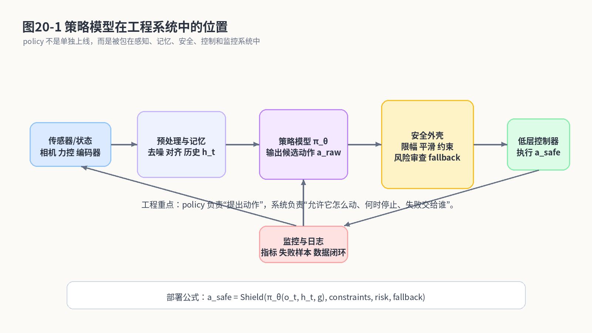
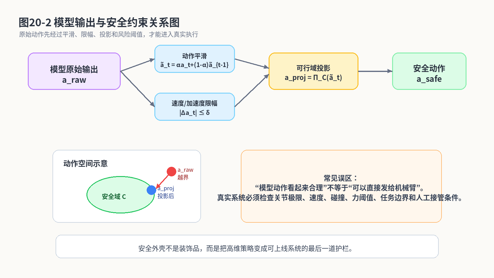
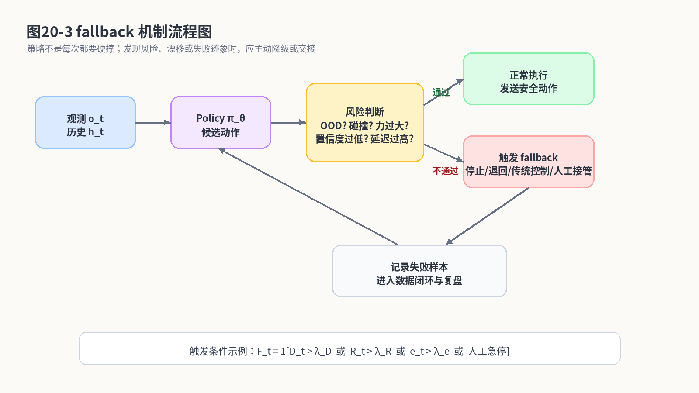
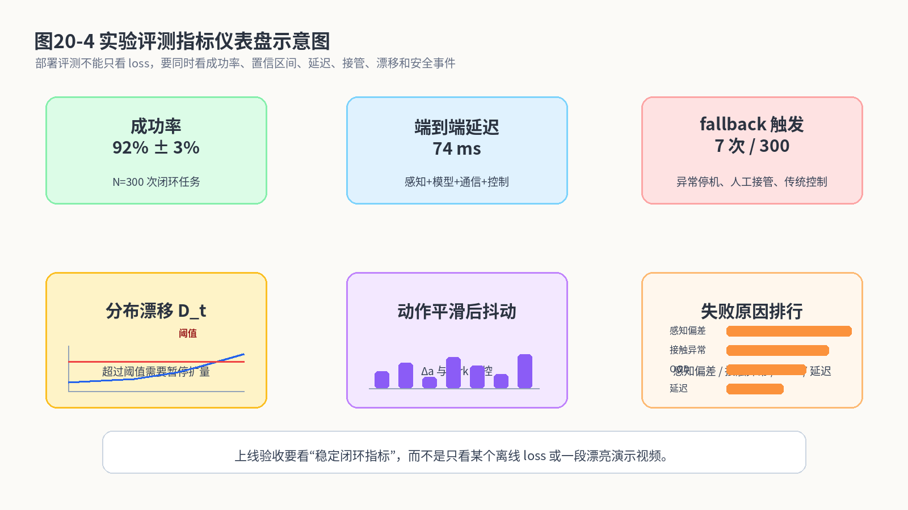

# 第25章：从论文到实机：让策略模型成为一个可靠打工人

> **新版布局位置**：本章属于 **第七篇：后训练、对齐与实机部署**。本章编号、公式编号与交叉引用已按新版八篇结构统一调整。


> **本章一句话导读**：本章把策略模型放入真实工程部署系统，讨论评测、安全、fallback 和监控如何保证实机可靠性。


> 第21章我们把视角从“模仿动作”推进到“理解世界”：policy 不仅要知道现在该怎么动，还要知道动完会发生什么。到第25章，全书终于来到最后一个很现实的问题：这些模型到底怎样进真实系统？论文里的 policy 往往像天才少年，视频里动作丝滑、目标明确、背景音乐还很燃；一进真实产线，它可能立刻变成第一天上班的实习生：传感器有噪声，机械臂有延迟，夹具会磨损，工件会变形，甲方还会临时改需求。本章的目标不是再发明一个新模型，而是讲清楚：如何让模仿学习策略从“会表演”变成“能上班”。

---

## 1. 本章开场：训练出 policy 只是上半场

到现在为止，我们已经讲过了很多“怎么学动作”的方法：

```text
Behavior Cloning：把专家动作当监督学习标签。
DAgger：让专家补标模型跑偏后的状态。
概率策略：承认正确动作不止一个。
CVAE / ACT：用隐变量和动作块处理多模态、长动作。
Diffusion Policy：把动作生成变成条件去噪。
GAIL / IRL：不只学动作，也试图理解目标和奖励。
Decision Transformer / VLA：把轨迹、视觉、语言、动作放进大模型上下文。
World Model：预测动作后果，支持纠错和风险判断。
```

这些内容很重要，但它们大多回答的是一个问题：

```text
如何训练出一个更像专家、更会生成动作的 policy？
```

而工程部署要回答的是另一个问题：

```text
如何让这个 policy 在真实系统里安全、稳定、可监控、可回滚、可复盘地工作？
```

这两个问题之间隔着一条很宽的河。河里漂着很多东西：延迟、抖动、传感器标定漂移、机械臂控制频率、异常工况、人工接管、产线节拍、日志系统、版本管理、安全责任和甲方现场工程师的眼神。

论文里常见的写法是：

```text
given observation, output action.
```

工程里真实发生的是：

```text
传感器采集 → 时间同步 → 图像/状态预处理 → 历史缓存 → policy 推理
→ 动作后处理 → 安全约束 → 低层控制 → 执行反馈 → 监控报警 → 日志回流 → 数据闭环
```

这说明一件事：**policy 不是一个孤零零的神经网络，它是工程系统中的一个模块**。

我们先用一张图建立整体结构。



**图25-1 说明**：真实部署时，策略模型 <span class="math">\\(\pi\_\theta\\)</span> 通常只负责提出候选动作。候选动作必须经过动作平滑、限幅、安全约束、风险审查和 fallback 机制后，才可以交给低层控制器执行。执行后的反馈还要进入监控、日志和数据闭环。简单说：policy 是“会干活的人”，但工程系统要像“班组长 + 安全员 + 质检员 + 记录员”。

本章的核心观点是：

> 模仿学习模型上线的关键，不是相信它每次都对，而是设计一个系统，让它对的时候能高效工作，错的时候能被发现、被限制、被接管、被复盘。

---

## 2. 本章要解决的核心问题

本章围绕以下问题展开：

1. 为什么 open-loop loss 不能代表真实系统能力？
2. closed-loop evaluation 应该怎么定义？
3. success rate 为什么要配置信区间，而不是只报一个百分比？
4. latency 为什么会让 policy 看到“过期世界”？
5. control frequency 和 policy 推理频率有什么区别？
6. action smoothing 为什么是部署里的常规操作？
7. 动作限幅、加速度约束和安全投影如何写成数学形式？
8. safety constraint 为什么不能只靠模型自己学？
9. fallback policy 应该在什么条件下触发？
10. human-in-the-loop 在工程系统中到底放在哪里？
11. online monitoring 应该监控哪些指标？
12. distribution drift 如何检测？
13. 评测仪表盘应该包含哪些内容？
14. 灰度上线和版本回滚为什么是机器人策略部署的底线？
15. 数据闭环如何把失败案例重新变成训练资产？
16. 机械臂抓取、双臂操作、自动泊车等场景中部署重点有何不同？
17. 第1–19章学到的数学对象如何在部署系统中各司其职？
18. 最后，怎样判断一个 policy 已经从“论文模型”变成“可靠打工人”？

---


### 主线定位与统一例子

为了让本章不变成孤立知识点，读本章时请始终把公式落回两个统一例子：

- **二维点机器人跟随专家轨迹**：状态可写成位置/速度，动作可写成二维控制量，适合观察状态分布、轨迹分布和误差累积。
- **机械臂末端运动/抓取轨迹模仿**：观测包含图像或本体状态，动作包含末端位姿增量或关节控制量，适合理解连续动作、多模态动作、动作块和实机闭环。

- **承接前文**：承接前19章的数学对象与模型形式。
- **本章推进**：把策略、评测、安全约束、fallback、监控和数据闭环组织成可上线系统。
- **铺垫后文**：作为全书收束：读者应能从公式理解走到实验设计与实机风险控制。
- **公式阅读抓手**：实机部署时，任何 loss 都要最终接受 closed-loop 成功率、安全边界和数据闭环的检验。
- **建议同步回看**：附录 E、F、H。

## 3. 从一个最小部署公式开始

在训练阶段，我们常写：

<div class="math">\[
a_t \sim \pi_\theta(\cdot \mid o_t) \tag{25.1}\]</div>

意思是：给定当前观测 <span class="math">\\(o\_t\\)</span>，策略 <span class="math">\\(\pi\_\theta\\)</span> 输出动作 <span class="math">\\(a\_t\\)</span>。

但部署阶段，这个式子太单薄。真实系统里，policy 往往还需要历史、目标和工程状态：

<div class="math">\[
a_t^{\mathrm{raw}}
\sim
\pi_\theta(\cdot \mid o_t,h_t,g,m_t) \tag{25.2}\]</div>

这里：

- <span class="math">\\(o\_t\\)</span>：当前观测，比如图像、点云、关节状态、力传感器；
- <span class="math">\\(h\_t\\)</span>：历史信息，比如过去几帧观测和动作；
- <span class="math">\\(g\\)</span>：任务目标，比如“把杯子放到盘子里”；
- <span class="math">\\(m\_t\\)</span>：工程模式，比如正常执行、低速模式、恢复模式、人工确认模式；
- <span class="math">\\(a\_t^{\mathrm{raw}}\\)</span>：模型原始动作输出。

注意这里特意写成 <span class="math">\\(a\_t^{\mathrm{raw}}\\)</span>，而不是直接写 <span class="math">\\(a\_t\\)</span>。因为模型输出的动作还不能直接发给执行器。

工程系统真正执行的动作更接近：

<div class="math">\[
a_t^{\mathrm{safe}}
=
\mathrm{Shield}\left(
    a_t^{\mathrm{raw}},
    c_t,
    r_t,
    b_t
\right) \tag{25.3}\]</div>

其中：

- <span class="math">\\(\mathrm{Shield}(\cdot)\\)</span>：安全外壳；
- <span class="math">\\(c\_t\\)</span>：硬约束，比如关节限位、速度限幅、碰撞区域、力阈值；
- <span class="math">\\(r\_t\\)</span>：风险评分，比如模型置信度、world model 预测风险、OOD 分数；
- <span class="math">\\(b\_t\\)</span>：fallback 状态，比如是否允许人工接管、是否进入传统控制器、是否需要急停；
- <span class="math">\\(a\_t^{\mathrm{safe}}\\)</span>：真正进入低层控制器的安全动作。

这个公式很重要。它把“策略学习”和“工程上线”分开了：

```text
policy 负责提出动作；
安全外壳负责决定这个动作能不能执行、怎么执行、何时不执行。
```

常见误区是：

> 模型已经学得很好了，为什么还要加安全外壳？

答案很简单：因为真实机器人不是在 Jupyter Notebook 里动。它有质量、有惯性、有夹爪、有电机、有工件、有现场人员。一个错误动作不是 loss 多一点，而可能是夹具撞坏、工件报废、设备停线。

---

## 4. 公式拆解一：open-loop loss 为什么不够

行为克隆训练时，我们通常最小化：

<div class="math">\[
\mathcal{L}_{\mathrm{BC}}(\theta)
=
-\mathbb{E}_{(o,a)\sim\mathcal{D}}
\left[
\log \pi_\theta(a\mid o)
\right] \tag{25.4}\]</div>

或者在连续动作回归中使用：

<div class="math">\[
\mathcal{L}_{\mathrm{MSE}}(\theta)
=
\mathbb{E}_{(o,a)\sim\mathcal{D}}
\left[
\|a-\hat a_\theta(o)\|^2
\right] \tag{25.5}\]</div>

这两个 loss 衡量的是：在数据集中的观测上，模型预测动作和专家动作有多接近。

但部署时我们关心的是：

<div class="math">\[
J_{\mathrm{deploy}}(\pi_\theta)
=
\mathbb{E}_{\tau\sim p(\tau\mid \pi_\theta)}
\left[
M(\tau)
\right] \tag{25.6}\]</div>

这里：

- <span class="math">\\(\tau\\)</span>：模型闭环执行生成的轨迹；
- <span class="math">\\(p(\tau\mid \pi\_\theta)\\)</span>：策略 <span class="math">\\(\pi\_\theta\\)</span> 与真实环境交互后诱导出的轨迹分布；
- <span class="math">\\(M(\tau)\\)</span>：任务指标，比如成功、耗时、碰撞、接管次数、产线节拍；
- <span class="math">\\(J\_{\mathrm{deploy}}\\)</span>：部署性能。

注意 <span class="math">\\(\mathcal{L}\_{\mathrm{BC}}\\)</span> 和 <span class="math">\\(J\_{\mathrm{deploy}}\\)</span> 不是同一个东西。

训练 loss 看的是：

```text
专家走过的路上，我预测专家动作准不准？
```

部署指标看的是：

```text
我自己闭环走出来的路，最终事情办成没有？有没有撞？有没有超时？有没有需要人工救场？
```

这就是为什么一个模型可以在验证集上 loss 很好，但实机执行像喝了假机油。它不是在同一个分布上考试。

这一点和第3章的分布偏移完全呼应：

<div class="math">\[
d^{\pi_E}(s) \neq d^{\pi_\theta}(s) \tag{25.7}\]</div>

训练时看的是专家状态分布，执行时看的是模型自己诱导的状态分布。部署评测必须在 <span class="math">\\(d^{\pi\_\theta}\\)</span> 下进行，而不是只在 <span class="math">\\(d^{\pi\_E}\\)</span> 下看离线 loss。

---

## 5. closed-loop evaluation：让模型真的出去跑一圈

closed-loop evaluation 的基本思想很朴素：

> 不要只问模型“这张图应该输出什么动作”，而要让它真正闭环执行完整任务。

假设我们做 <span class="math">\\(N\\)</span> 次实机或高保真仿真实验，每次任务结果为：

<div class="math">\[
Y_i=
\begin{cases}
1, & \text{第 } i \text{ 次任务成功},\\
0, & \text{第 } i \text{ 次任务失败}.
\end{cases} \tag{25.8}\]</div>

那么经验成功率为：

<div class="math">\[
\hat p
=
\frac{1}{N}\sum_{i=1}^{N}Y_i \tag{25.9}\]</div>

这个公式非常简单，但工程含义很强：

- 只看一次 demo 没意义；
- 只看成功视频没意义；
- 只看平均 loss 没意义；
- 至少要多次闭环任务，统计成功和失败。

举个机械臂抓取例子：

```text
模型在验证集上动作误差很小。
实机抓取 100 次，成功 82 次。
则经验成功率为 0.82。
```

但还不能只说“成功率 82%”。因为样本数有限，真实成功率可能不是正好 82%。这就引出了置信区间。

---

## 6. 公式拆解二：成功率置信区间，不要被一个百分比骗了

对于二值成功/失败实验，如果成功率估计为 <span class="math">\\(\hat p\\)</span>，样本数为 <span class="math">\\(N\\)</span>，一个常用近似置信区间为：

<div class="math">\[
\hat p
\pm
1.96
\sqrt{
\frac{\hat p(1-\hat p)}{N}
} \tag{25.10}\]</div>

这个公式看起来像统计课考试题，但它在工程里非常实用。

逐项拆开：

- <span class="math">\\(\hat p\\)</span>：我们测到的成功率；
- <span class="math">\\(\hat p(1-\hat p)\\)</span>：二值实验的方差估计，成功率接近 0.5 时不确定性更大；
- <span class="math">\\(N\\)</span>：实验次数，次数越多，不确定性越小；
- 根号项：标准误差；
- <span class="math">\\(1.96\\)</span>：在近似正态假设下，对应约 95% 置信水平的系数。

如果 <span class="math">\\(N=20\\)</span>，测到成功率 <span class="math">\\(\hat p=0.9\\)</span>，标准误差约为：

<div class="math">\[
\sqrt{\frac{0.9\times 0.1}{20}}
\approx 0.067 \tag{25.11}\]</div>

95% 置信区间半宽约为：

<div class="math">\[
1.96\times 0.067\approx 0.131 \tag{25.12}\]</div>

也就是说，报告大概是：

<div class="math">\[
0.9\pm 0.131 \tag{25.13}\]</div>

换成人话：

```text
你看起来是 90% 成功率，但只测了 20 次，真实水平可能还很不稳。
```

如果 <span class="math">\\(N=300\\)</span>，同样 <span class="math">\\(\hat p=0.9\\)</span>，标准误差约为：

<div class="math">\[
\sqrt{\frac{0.9\times 0.1}{300}}
\approx 0.017 \tag{25.14}\]</div>

置信区间半宽约为：

<div class="math">\[
1.96\times 0.017\approx 0.034 \tag{25.15}\]</div>

这时报告变成：

<div class="math">\[
0.9\pm 0.034 \tag{25.16}\]</div>

这就稳多了。

所以，工程汇报里最好不要只说：

```text
成功率 90%。
```

而应该说：

```text
在 300 次闭环任务中，成功 270 次，成功率 90%，近似 95% 置信区间为 90% ± 3.4%。
```

这不是学术洁癖，而是防止被小样本好成绩骗了。机器人部署里，“测了 10 次全成功”经常只是运气很好，像抽卡十连出了金，但不代表你是欧皇。

---

## 7. 延迟：policy 看到的可能是过期世界

模仿学习公式里，我们常默认 <span class="math">\\(o\_t\\)</span> 是当前观测，模型输出 <span class="math">\\(a\_t\\)</span> 后立刻执行。但真实系统有延迟。

端到端延迟可以写成：

<div class="math">\[
\Delta t_{\mathrm{total}}
=
\Delta t_{\mathrm{sensor}}
+
\Delta t_{\mathrm{pre}}
+
\Delta t_{\mathrm{model}}
+
\Delta t_{\mathrm{post}}
+
\Delta t_{\mathrm{comm}}
+
\Delta t_{\mathrm{act}} \tag{25.17}\]</div>

各项含义是：

- <span class="math">\\(\Delta t\_{\mathrm{sensor}}\\)</span>：传感器采集和曝光延迟；
- <span class="math">\\(\Delta t\_{\mathrm{pre}}\\)</span>：预处理、同步、裁剪、特征提取延迟；
- <span class="math">\\(\Delta t\_{\mathrm{model}}\\)</span>：模型推理延迟；
- <span class="math">\\(\Delta t\_{\mathrm{post}}\\)</span>：动作后处理、安全检查延迟；
- <span class="math">\\(\Delta t\_{\mathrm{comm}}\\)</span>：通信延迟；
- <span class="math">\\(\Delta t\_{\mathrm{act}}\\)</span>：执行器响应延迟。

模型实际使用的观测更接近：

<div class="math">\[
a_t
=
\pi_\theta(o_{t-\Delta t_{\mathrm{total}}}) \tag{25.18}\]</div>

也就是：当前执行动作时，模型看到的是一段时间之前的世界。

如果环境变化慢，这个问题不大；如果环境变化快，延迟会很致命。

例如移动机器人速度为 <span class="math">\\(v\\)</span>，总延迟为 <span class="math">\\(\Delta t\\)</span>，那么由于延迟造成的位置误差粗略为：

<div class="math">\[
\Delta x \approx v\Delta t \tag{25.19}\]</div>

这只是一个很简单的一阶近似，但工程直觉很强：

- 速度越高，同样延迟造成的位置误差越大；
- 延迟越大，模型越像在看旧照片开车；
- 对高速自动驾驶、动态抓取、移动机械臂，延迟不是小问题。

泊车任务速度低，所以延迟容忍度比高速 NOA 大；但泊车空间很窄，误差尺度可能只有厘米级，因此延迟仍然会影响车位角点对齐、障碍物避让和控制稳定性。

---

## 8. control frequency：模型频率和控制频率不是一回事

低层控制器可能以 100Hz、500Hz 甚至更高频率运行，而大模型 policy 可能只能 5Hz、10Hz、20Hz 推理。

设：

<div class="math">\[
f_{\mathrm{policy}}=\frac{1}{\Delta t_{\mathrm{policy}}},
\quad
f_{\mathrm{ctrl}}=\frac{1}{\Delta t_{\mathrm{ctrl}}} \tag{25.20}\]</div>

通常有：

<div class="math">\[
f_{\mathrm{ctrl}} \gg f_{\mathrm{policy}} \tag{25.21}\]</div>

这意味着 policy 不是每一个控制周期都输出新动作。工程上常见做法是：

1. policy 低频输出目标动作、目标位姿或动作块；
2. 中间控制器插值、跟踪或执行动作块；
3. 安全模块高频监控异常；
4. 必要时直接打断 policy。

ACT 的动作块思想在这里很自然：

<div class="math">\[
A_t=(a_t,a_{t+1},\dots,a_{t+K-1}) \tag{25.22}\]</div>

policy 低频输出一段动作块，执行器按高频逐步执行。这样可以缓解模型推理频率不足的问题。

但动作块也有风险：

```text
如果环境在动作块执行过程中发生变化，后面的动作可能已经不适合。
```

所以工程上通常需要 temporal ensemble、receding horizon 或中途重规划：

<div class="math">\[
A_t^{\mathrm{exec}}
=
(a_t,a_{t+1},\dots,a_{t+k})
\quad k<K \tag{25.23}\]</div>

意思是：模型虽然预测 <span class="math">\\(K\\)</span> 步，但系统可能只执行前 <span class="math">\\(k\\)</span> 步，然后重新观察、重新推理。机器人不应该像订了 20 年健身计划一样，从第一天开始就死磕到底。

---

## 9. action smoothing：让动作别像心电图

模型输出动作可能有抖动，尤其在视觉噪声、观测边界、分布外状态附近。直接执行抖动动作，会造成机械臂震动、夹爪不稳、车辆控制不舒适。

最简单的动作平滑是指数滑动平均：

<div class="math">\[
\tilde a_t
=
\alpha a_t^{\mathrm{raw}}
+
(1-\alpha)\tilde a_{t-1} \tag{25.24}\]</div>

其中：

- <span class="math">\\(a\_t^{\mathrm{raw}}\\)</span>：模型当前输出；
- <span class="math">\\(\tilde a\_{t-1}\\)</span>：上一时刻平滑后的动作；
- <span class="math">\\(\tilde a\_t\\)</span>：当前平滑后的动作；
- <span class="math">\\(\alpha\in[0,1]\\)</span>：平滑系数。

当 <span class="math">\\(\alpha\\)</span> 接近 1 时，更相信当前模型输出，响应快，但抖动可能大；当 <span class="math">\\(\alpha\\)</span> 接近 0 时，更相信历史动作，动作更平滑，但响应慢。

这就是平滑的核心矛盾：

```text
平滑会让动作舒服，但也会让系统迟钝。
```

所以不能无脑把 <span class="math">\\(\alpha\\)</span> 调小。机械臂装配时，如果接触状态变化很快，过度平滑可能错过纠偏时机；自动泊车时，过度平滑方向盘角速度可能导致入库轨迹变钝，压线或擦碰风险增加。

除了一阶平滑，还常见速度和加速度约束：

<div class="math">\[
\|a_t-a_{t-1}\| \le \delta_a \tag{25.25}\]</div>

<div class="math">\[
\|a_t-2a_{t-1}+a_{t-2}\| \le \delta_{\mathrm{acc}} \tag{25.26}\]</div>

第一个约束限制动作变化速度，第二个约束限制动作变化的二阶差分，可以粗略理解为限制“动作加速度”或“jerk 相关量”。

---

## 10. 公式拆解三：安全约束与动作投影

假设模型输出动作 <span class="math">\\(a\_t^{\mathrm{raw}}\\)</span>，但可执行动作必须属于安全集合：

<div class="math">\[
\mathcal{C}_t
=
\{a: g_j(a,o_t,h_t)\le 0,\ j=1,2,\dots,J\} \tag{25.27}\]</div>

这里：

- <span class="math">\\(\mathcal{C}\_t\\)</span>：当前时刻的安全可行动作集合；
- <span class="math">\\(g\_j\\)</span>：第 <span class="math">\\(j\\)</span> 个约束函数；
- <span class="math">\\(g\_j(a,o\_t,h\_t)\le 0\\)</span>：表示动作 <span class="math">\\(a\\)</span> 满足该约束；
- <span class="math">\\(J\\)</span>：约束数量。

约束可以包括：

- 关节角度不超过极限；
- 速度、加速度不超过阈值；
- 末端执行器不进入禁区；
- 与障碍物距离大于安全距离；
- 力或力矩不超过安全阈值；
- 车辆轨迹不越过边界。

如果原始动作不在安全集合里，可以做投影：

<div class="math">\[
a_t^{\mathrm{safe}}
=
\Pi_{\mathcal{C}_t}(a_t^{\mathrm{raw}})
=
\arg\min_{a\in\mathcal{C}_t}
\|a-a_t^{\mathrm{raw}}\|^2 \tag{25.28}\]</div>

这个式子的含义是：

```text
在所有安全动作里，找一个离模型原始动作最近的动作。
```

这不是在否定模型，而是在帮模型“体面地犯错”。如果模型动作略微越界，投影可以把它拉回可执行区域；如果模型动作离安全集合太远，则说明当前状态可能已经不适合继续由策略执行。

我们用图25-2看这个过程。



**图25-2 说明**：模型原始输出 <span class="math">\\(a\_{\mathrm{raw}}\\)</span> 需要经过平滑、速度/加速度限幅、可行域投影，最终得到 <span class="math">\\(a\_{\mathrm{safe}}\\)</span>。安全域 <span class="math">\\(\mathcal{C}\_t\\)</span> 可以由几何碰撞、运动学限制、控制器能力和任务边界共同定义。工程上绝不能把 policy 的输出直接当圣旨。

投影公式也有局限：

1. 如果约束集合很复杂，投影求解可能很慢；
2. 如果投影后动作与原始动作差异太大，策略意图可能被破坏；
3. 如果模型频繁越界，说明训练数据、策略结构或任务定义有问题；
4. 安全约束只能防一些明确风险，不能替代完整的异常检测。

因此，安全外壳不仅要修正动作，还要记录：

<div class="math">\[
d_t^{\mathrm{proj}}
=
\|a_t^{\mathrm{safe}}-a_t^{\mathrm{raw}}\| \tag{25.29}\]</div>

如果 <span class="math">\\(d\_t^{\mathrm{proj}}\\)</span> 长期很大，就说明模型经常提出不靠谱动作。一个员工总被安全员拦住，不一定是安全员太严格，也可能是员工真的不适合这个岗位。

---

## 11. fallback policy：不会退场的模型不是好模型

很多人一提机器人智能，就想让模型从头干到尾。工程上更成熟的思路是：

> 策略模型应该知道什么时候继续，什么时候降级，什么时候停，什么时候交给人。

fallback 可以有很多种：

1. 急停；
2. 退回安全位姿；
3. 切换到传统控制器；
4. 降低速度继续执行；
5. 请求人工确认；
6. 重新感知并重规划；
7. 标记失败样本并退出任务。

我们可以定义一个触发变量：

<div class="math">\[
F_t
=
\mathbb{I}
\left[
D_t>\lambda_D
\vee
R_t>\lambda_R
\vee
e_t>\lambda_e
\vee
H_t=1
\right] \tag{25.30}\]</div>

逐项解释：

- <span class="math">\\(F\_t=1\\)</span>：触发 fallback；
- <span class="math">\\(\mathbb{I}[\cdot]\\)</span>：指示函数，条件成立为 1，否则为 0；
- <span class="math">\\(D\_t\\)</span>：分布漂移或 OOD 分数；
- <span class="math">\\(\lambda\_D\\)</span>：漂移阈值；
- <span class="math">\\(R\_t\\)</span>：风险分数，比如碰撞概率、失败概率；
- <span class="math">\\(\lambda\_R\\)</span>：风险阈值；
- <span class="math">\\(e\_t\\)</span>：预测误差或执行误差；
- <span class="math">\\(\lambda\_e\\)</span>：误差阈值；
- <span class="math">\\(H\_t=1\\)</span>：人工急停或人工接管信号；
- <span class="math">\\(\vee\\)</span>：逻辑“或”。

这条公式的工程含义非常直接：

```text
只要漂移、风险、误差或人工信号中任意一个超过边界，就不要继续硬跑。
```

fallback 流程如图25-3。



**图25-3 说明**：policy 输出动作后，系统先做风险判断。如果通过，则正常执行；如果不通过，则触发 fallback，包括停机、退回、传统控制、人工接管或重新规划。fallback 的结果必须记录到日志中，进入失败样本库，后续用于数据闭环。

这里有一个非常重要的观念：

> fallback 不是失败，而是系统成熟的表现。

真正危险的不是策略触发 fallback，而是策略明明不确定还硬撑。真实工程里，“会怂”是一种美德。机器人不是武侠小说主角，不需要每次都硬刚。

---

## 12. distribution drift detection：世界变了，模型要知道

部署初期模型可能表现很好，但一段时间后环境会变化：

- 光照改变；
- 相机位置轻微偏移；
- 工件批次变化；
- 夹具磨损；
- 背景杂物增加；
- 操作员摆放习惯变化；
- 自动驾驶场景进入新城市、新天气、新道路；
- 泊车车位线磨损、地面反光、障碍物形态变化。

这就是 distribution drift。

一种简单做法是，在训练集特征空间中估计均值和协方差：

<div class="math">\[
\mu_{\mathcal{D}}
=
\frac{1}{N}\sum_{i=1}^N f(o_i) \tag{25.31}\]</div>

<div class="math">\[
\Sigma_{\mathcal{D}}
=
\frac{1}{N-1}\sum_{i=1}^N
(f(o_i)-\mu_{\mathcal{D}})(f(o_i)-\mu_{\mathcal{D}})^\top \tag{25.32}\]</div>

其中 <span class="math">\\(f(o)\\)</span> 是观测特征，可以来自视觉 encoder、中间特征、任务状态向量等。

上线时，对当前观测计算 Mahalanobis 距离：

<div class="math">\[
D_t
=
(f(o_t)-\mu_{\mathcal{D}})^\top
\Sigma_{\mathcal{D}}^{-1}
(f(o_t)-\mu_{\mathcal{D}}) \tag{25.33}\]</div>

这个距离衡量当前特征离训练分布中心有多远，并且考虑了不同方向的方差。

如果：

<div class="math">\[
D_t>\lambda_D \tag{25.34}\]</div>

就说明当前观测可能偏离训练分布，需要降速、触发人工确认或进入 fallback。

当然，这只是一个基础方法。真实系统还可以使用：

- ensemble 不确定性；
- density model；
- reconstruction error；
- world model prediction error；
- contrastive embedding distance；
- 任务关键变量漂移；
- 规则指标，如亮度、遮挡比例、检测置信度。

但无论方法复杂与否，核心思想都是：

```text
不要假设训练集永远代表未来。
```

训练集不是护身符。它只是过去世界的一段快照。

---

## 13. prediction error：用世界模型当异常探测器

第21章讲过世界模型可以预测未来状态或任务变量。部署时，它还可以用来做异常检测。

假设世界模型预测：

<div class="math">\[
\hat z_{t+1}
=
\mu_\phi(z_t,a_t) \tag{25.35}\]</div>

真实执行后，我们得到新状态表示 <span class="math">\\(z\_{t+1}\\)</span>。预测误差为：

<div class="math">\[
e_{t+1}
=
d(\hat z_{t+1},z_{t+1}) \tag{25.36}\]</div>

如果 <span class="math">\\(e\_{t+1}\\)</span> 很大，可能说明：

- 动作没有按预期执行；
- 物体滑动或碰撞；
- 夹爪没夹住；
- 相机观测异常；
- 环境进入了模型没见过的状态；
- 低层控制器或机械结构出现问题。

在部署系统中可以定义：

<div class="math">\[
F_{t+1}^{\mathrm{wm}}
=
\mathbb{I}[e_{t+1}>\lambda_e] \tag{25.37}\]</div>

如果世界模型预测误差超过阈值，就触发风险处理。

这里要避免一个误区：

> 世界模型不是必须预测整张未来图像才有用。

在工业场景中，更实用的是预测任务关键变量，比如：

- 物体位姿是否变化到目标附近；
- 接触力是否进入异常区间；
- 夹爪闭合后是否真的夹住；
- 插入深度是否增加；
- 车辆下一步是否更接近车位中心线；
- 与障碍物距离是否缩小到危险范围。

这些小世界模型比“模拟整个宇宙”更容易落地。工程上不要一上来就追求通用世界模型，否则容易把项目做成科幻片预告。

---

## 14. online monitoring：上线以后，模型每天都在考试

一个部署系统至少应该监控以下指标：

1. 成功率；
2. 失败率；
3. 任务耗时；
4. fallback 触发率；
5. 人工接管次数；
6. 急停次数；
7. 安全约束投影距离；
8. 模型推理延迟；
9. 端到端延迟；
10. 动作抖动；
11. OOD / drift 分数；
12. world model 预测误差；
13. 传感器异常率；
14. 低层控制跟踪误差；
15. 按场景、工件、时间、设备编号分组后的指标。

可以把一次任务的监控向量写成：

<div class="math">\[
m_i
=
\left[
Y_i,
T_i,
C_i,
F_i,
H_i,
\bar D_i,
\bar e_i,
\bar \Delta t_i
\right] \tag{25.38}\]</div>

其中：

- <span class="math">\\(Y\_i\\)</span>：是否成功；
- <span class="math">\\(T\_i\\)</span>：任务耗时；
- <span class="math">\\(C\_i\\)</span>：碰撞或安全事件次数；
- <span class="math">\\(F\_i\\)</span>：fallback 次数；
- <span class="math">\\(H\_i\\)</span>：人工接管次数；
- <span class="math">\\(\bar D\_i\\)</span>：平均漂移分数；
- <span class="math">\\(\bar e\_i\\)</span>：平均预测误差；
- <span class="math">\\(\bar \Delta t\_i\\)</span>：平均延迟。

然后按时间窗口统计：

<div class="math">\[
\bar m_{w}
=
\frac{1}{|\mathcal{W}|}
\sum_{i\in\mathcal{W}}m_i \tag{25.39}\]</div>

这里 <span class="math">\\(\mathcal{W}\\)</span> 是某个时间窗口内的任务集合，比如最近 1 小时、最近 1 天或最近 100 次任务。

如果某个指标突然变差，就要报警。比如：

<div class="math">\[
\bar F_w > \lambda_F \tag{25.40}\]</div>

表示最近窗口 fallback 率超过阈值。

这时不要急着说“模型坏了”，而要继续分解：

- 是某个工件类型失败？
- 是某台设备失败？
- 是某个时间段光照变化？
- 是某个相机脏了？
- 是某个版本上线后变差？
- 是任务分布变了？

部署不是只把模型扔出去，而是让模型在可观测、可诊断、可回滚的环境里工作。

---

## 15. 评测仪表盘：别只放一段成功视频

论文视频通常展示最漂亮的结果。工程仪表盘要展示最真实的结果。

一个合格的模仿学习部署仪表盘至少应该包含：

```text
成功率 + 置信区间
任务耗时分布
失败原因分布
fallback 触发率
人工接管率
安全事件数
端到端延迟分布
模型推理耗时
动作抖动指标
分布漂移曲线
预测误差曲线
不同场景/工件/设备/版本的分组对比
```

我们用图25-4示意。



**图25-4 说明**：部署评测不应只看离线 loss，也不应只看一段成功演示。仪表盘需要同时显示成功率、置信区间、延迟、fallback、分布漂移、动作抖动和失败原因。这样才能判断模型是在稳定工作，还是靠运气撑场面。

工程汇报中建议使用这样的表达：

```text
版本 v1.3 在 300 次闭环抓取任务中，成功率 92% ± 3%，平均耗时 8.4s，
fallback 触发率 2.3%，人工接管 1 次，P95 端到端延迟 86ms。
失败主要集中在透明件和反光件，漂移分数在夜班光照下显著升高。
```

这比“模型效果很好”强太多。后者像朋友圈文案，前者像工程系统。

---

## 16. human-in-the-loop：人不是摆设，而是系统边界的一部分

模仿学习本来就依赖专家示范。部署后，人依然很重要，只是角色变了。

训练前，人提供示范；训练中，人帮助标注和筛选；部署后，人负责：

- 处理高风险状态；
- 确认低置信度动作；
- 接管异常任务；
- 标注失败原因；
- 判断是否允许扩量；
- 决定是否回滚版本；
- 给数据闭环提供高质量反馈。

可以把人工接管写成一个门控变量：

<div class="math">\[
u_t
=
\begin{cases}
a_t^{\mathrm{safe}}, & q_t \ge \lambda_q \text{ 且 } F_t=0,\\
a_t^{\mathrm{human}}, & q_t < \lambda_q \text{ 或 } F_t=1.
\end{cases} \tag{25.41}\]</div>

其中：

- <span class="math">\\(u\_t\\)</span>：最终执行命令；
- <span class="math">\\(q\_t\\)</span>：模型置信度或系统健康评分；
- <span class="math">\\(\lambda\_q\\)</span>：置信度阈值；
- <span class="math">\\(F\_t\\)</span>：fallback 触发变量；
- <span class="math">\\(a\_t^{\mathrm{human}}\\)</span>：人工接管动作或人工确认后的动作。

这个公式表达的是：

```text
当模型足够确定且没有触发风险时，系统让模型执行；
当模型不确定或触发风险时，系统把控制权交给人或更保守的模块。
```

human-in-the-loop 不是“不够智能”的羞耻标志，而是复杂系统上线的常规配置。飞机有自动驾驶也有飞行员，工厂有自动化也有操作员，机器人策略当然也需要明确的人机边界。

---

## 17. 灰度上线：不要一上来就让模型接管全世界

机器人策略上线通常不应该一步到位，而应该灰度扩量。

可以把上线范围看成一个比例：

<div class="math">\[
\rho_k\in[0,1] \tag{25.42}\]</div>

表示第 <span class="math">\\(k\\)</span> 个阶段中，由新策略处理的任务比例。

例如：

```text
阶段0：离线回放，不控制真实设备。
阶段1：影子模式，只输出建议，不执行。
阶段2：低速空跑，现场人员旁站。
阶段3：小批量真实任务，人工可随时接管。
阶段4：限定工况自动执行。
阶段5：扩大任务范围，但保留监控和回滚。
```

如果窗口指标满足要求：

<div class="math">\[
\bar Y_w \ge \lambda_Y,
\quad
\bar F_w \le \lambda_F,
\quad
\bar C_w \le \lambda_C,
\quad
\bar \Delta t_w \le \lambda_{\Delta} \tag{25.43}\]</div>

则允许扩量：

<div class="math">\[
\rho_{k+1}=\min(\rho_k+\eta,1) \tag{25.44}\]</div>

如果指标恶化，则回滚：

<div class="math">\[
\rho_{k+1}=0
\quad \text{or switch to previous stable version} \tag{25.45}\]</div>

这里：

- <span class="math">\\(\bar Y\_w\\)</span>：窗口成功率；
- <span class="math">\\(\bar F\_w\\)</span>：窗口 fallback 率；
- <span class="math">\\(\bar C\_w\\)</span>：窗口安全事件率；
- <span class="math">\\(\bar \Delta t\_w\\)</span>：窗口延迟指标；
- <span class="math">\\(\eta\\)</span>：扩量步长。

灰度上线的本质是：

```text
用受控风险换取真实反馈，而不是用全量上线赌模型人品。
```

---

## 18. 数据闭环：失败不是垃圾，是下一轮训练的金矿

部署中最有价值的数据往往不是成功样本，而是失败样本。

一次失败任务可以记录为：

<div class="math">\[
\xi_i
=
(o_{0:T},a_{0:T},s_{0:T},m_{0:T},r_i,y_i,\ell_i) \tag{25.46}\]</div>

其中：

- <span class="math">\\(o\_{0:T}\\)</span>：观测序列；
- <span class="math">\\(a\_{0:T}\\)</span>：动作序列；
- <span class="math">\\(s\_{0:T}\\)</span>：可用状态序列；
- <span class="math">\\(m\_{0:T}\\)</span>：监控指标序列；
- <span class="math">\\(r\_i\\)</span>：失败原因；
- <span class="math">\\(y\_i\\)</span>：成功/失败标签；
- <span class="math">\\(\ell\_i\\)</span>：人工标注或复盘结论。

然后把失败样本按原因分桶：

<div class="math">\[
\mathcal{B}_c
=
\{\xi_i: r_i=c\} \tag{25.47}\]</div>

例如：

```text
感知失败桶：遮挡、反光、光照、定位漂移。
策略失败桶：动作犹豫、越界、没有恢复动作。
控制失败桶：跟踪误差、延迟、低层控制饱和。
接触失败桶：滑动、卡滞、插入失败、力异常。
分布外桶：新工件、新背景、新摆放方式。
```

接下来要做的不是把所有失败样本一股脑塞回训练集，而是判断：

1. 这是数据覆盖问题吗？
2. 是标签质量问题吗？
3. 是模型表达能力问题吗？
4. 是安全约束太宽或太窄吗？
5. 是低层控制器问题吗？
6. 是任务定义不清吗？

如果是数据覆盖问题，可以补采示范；如果是策略没有恢复动作，就要采集失败恢复数据；如果是感知定位偏差，就不要指望 policy 靠玄学自己修好。

数据闭环的目标不是“数据越多越好”，而是：

<div class="math">\[
\mathcal{D}_{k+1}
=
\mathcal{D}_k
\cup
\mathrm{Select}(\mathcal{B}_{\mathrm{fail}},\mathrm{coverage},\mathrm{risk},\mathrm{value}) \tag{25.48}\]</div>

也就是从失败样本中选择有覆盖价值、有风险价值、有训练价值的数据加入下一轮数据集。

---

## 19. 工程案例一：机械臂抓取产线部署

以机械臂抓取为例，模仿学习 policy 可能输入图像和机器人状态，输出末端位姿增量或夹爪动作。

部署时，至少要考虑：

1. 相机标定是否稳定；
2. 工件是否反光、遮挡、堆叠；
3. 抓取动作是否满足碰撞约束；
4. 夹爪闭合后是否真实夹住；
5. 抓起后是否滑落；
6. 放置位置是否允许微调；
7. 失败后如何退回；
8. 是否允许人工清理异常件。

一个小型部署公式可以写成：

<div class="math">\[
a_t^{\mathrm{raw}}
=
\pi_\theta(o_t,q_t,g) \tag{25.49}\]</div>

<div class="math">\[
a_t^{\mathrm{safe}}
=
\Pi_{\mathcal{C}_t}
\left(
\alpha a_t^{\mathrm{raw}}+(1-\alpha)a_{t-1}^{\mathrm{safe}}
\right) \tag{25.50}\]</div>

<div class="math">\[
F_t
=
\mathbb{I}[
P_{\mathrm{grasp}}(o_t,a_t)<\lambda_g
\vee
D_t>\lambda_D
\vee
f_t>\lambda_f
] \tag{25.51}\]</div>

这里：

- <span class="math">\\(q\_t\\)</span>：机械臂关节状态；
- <span class="math">\\(P\_{\mathrm{grasp}}\\)</span>：抓取成功概率估计；
- <span class="math">\\(f\_t\\)</span>：接触力或夹爪反馈；
- <span class="math">\\(\lambda\_g,\lambda\_D,\lambda\_f\\)</span>：对应阈值。

工程上要特别关注“抓取后验证”。很多抓取失败不是发生在接近阶段，而是发生在夹爪闭合、抬起、移动途中。只看抓取点预测准确率不够，必须看完整任务成功率。

---

## 20. 工程案例二：抓取 + 精准摆入治具

这个场景很典型：物体可以抓起来，但要精准放入托盘、槽口、治具或孔位中。传统视觉能给一个位姿修正量，但现场会有相机震动、托盘变形、工件公差、光照和接触误差。

模仿学习可以学习专家的接近、微调和插入动作，但部署时必须加上接触反馈和失败恢复。

任务状态可以定义为：

<div class="math">\[
z_t=[\Delta x_t,\Delta y_t,\Delta \theta_t,f_t,d_t] \tag{25.52}\]</div>

其中：

- <span class="math">\\(\Delta x\_t,\Delta y\_t,\Delta \theta\_t\\)</span>：相对位姿误差；
- <span class="math">\\(f\_t\\)</span>：接触力或力矩特征；
- <span class="math">\\(d\_t\\)</span>：插入深度或放置进度。

策略输出：

<div class="math">\[
a_t=[\Delta p_t,\Delta R_t, v_t, g_t] \tag{25.53}\]</div>

表示位置增量、姿态增量、速度和夹爪控制。

插入任务的 fallback 条件可以写成：

<div class="math">\[
F_t=\mathbb{I}[
\|f_t\|>\lambda_f
\vee
 d_t-d_{t-k}<\lambda_d
\vee
 \|\Delta p_t\|>\lambda_p
] \tag{25.54}\]</div>

含义是：

- 力太大：可能卡住；
- 插入深度长时间没有增加：可能顶住；
- 相对位置误差太大：可能对不准。

fallback 动作可以不是急停，而是：

```text
后退 2mm → 小角度摆动 → 重新估计位姿 → 低速再插入。
```

这类恢复动作非常适合通过示范数据采集。如果训练数据只有“完美成功轨迹”，模型学不到失败恢复。真实产线最值钱的数据，往往就是老师傅如何处理“卡了一下”的瞬间。

---

## 21. 工程案例三：自动泊车策略灰度上线

自动泊车和机械臂操作有相似之处：都在低速、狭窄空间中执行闭环动作；也有不同之处：车辆动力学、乘坐舒适性、法规安全、驾驶员接管都更重要。

泊车策略可能输出：

<div class="math">\[
a_t=[\delta_t, v_t, b_t] \tag{25.55}\]</div>

其中：

- <span class="math">\\(\delta\_t\\)</span>：转角或转角速度；
- <span class="math">\\(v\_t\\)</span>：目标速度；
- <span class="math">\\(b\_t\\)</span>：制动或档位相关控制。

部署时必须监控：

- 与车位线的相对位置；
- 与障碍物的距离；
- 轨迹是否压线；
- 控制量是否抖动；
- 驾驶员是否接管；
- 泊车总时长；
- 中途修正次数；
- 传感器误检和漏检。

安全约束可写为：

<div class="math">\[
\mathcal{C}_t=\{a_t:
 d_{\mathrm{obs}}(a_t)\ge d_{\min},
 |\delta_t-\delta_{t-1}|\le \delta_{\max},
 |v_t|\le v_{\max}
\} \tag{25.56}\]</div>

即：动作必须保证预测轨迹与障碍物保持最小距离，转角变化不能太剧烈，速度不能超过低速泊车上限。

泊车灰度上线尤其要注意场景分层：

```text
垂直车位 / 平行车位 / 斜列车位；
白天 / 夜晚 / 地库 / 反光地面；
宽车位 / 窄车位 / 车位线磨损；
有无旁车 / 有无行人 / 有无低矮障碍物。
```

如果只报一个总成功率，很容易掩盖某类场景的风险。工程上应统计条件成功率：

<div class="math">\[
\hat p(c)
=
\frac{1}{N_c}
\sum_{i: c_i=c}Y_i \tag{25.57}\]</div>

这里 <span class="math">\\(c\\)</span> 是场景类别，<span class="math">\\(N\_c\\)</span> 是该类别下实验次数。一个总成功率 95% 的系统，如果在“地库反光窄车位”只有 60%，那就不能假装没看见。

---

## 22. 工程案例四：低成本双臂机器人

低成本双臂机器人通常硬件精度、刚度、传感器质量都有限。ACT 这类方法能从遥操作示范中学习动作块，但部署时会遇到：

- 左右臂同步误差；
- 夹爪回差；
- 摄像头延迟；
- 桌面物体轻微移动；
- 标定不准；
- 动作块执行中途环境变化；
- 模型输出抖动。

双臂系统可以把动作写成：

<div class="math">\[
a_t=[a_t^{L},a_t^{R}] \tag{25.58}\]</div>

其中 <span class="math">\\(L\\)</span> 和 <span class="math">\\(R\\)</span> 分别表示左臂和右臂。

双臂协同约束可以写成：

<div class="math">\[
g_{\mathrm{sync}}(a_t^L,a_t^R,o_t)\le 0 \tag{25.59}\]</div>

例如双手搬一个物体时，两只手的相对位姿不能突然变化太大：

<div class="math">\[
\|T_t^L(T_t^R)^{-1}-\bar T^{LR}\|\le \epsilon \tag{25.60}\]</div>

这里：

- <span class="math">\\(T\_t^L,T\_t^R\\)</span>：左右末端位姿；
- <span class="math">\\(\bar T^{LR}\\)</span>：期望相对位姿；
- <span class="math">\\(\epsilon\\)</span>：允许误差。

低成本硬件上，策略模型更不能裸奔。因为硬件误差会把模型的小偏差放大，最后变成“看起来会干活，实际总要人扶一把”。

---

## 23. 从第1章到第25章：所有数学对象终于落地

我们现在回头看全书主线，会发现前面每一章都在为部署服务。

第1章讲轨迹、观测、动作、策略。部署中它们变成日志、传感器输入、控制命令和策略模块。

第2章讲 Behavior Cloning。部署中它是最基础的动作预测器。

第3章讲分布偏移。部署中它变成 drift detection、closed-loop evaluation 和 failure mining。

第4章讲 DAgger。部署中它变成“模型跑到没见过的状态后，让专家或人工接管补数据”。

第5章讲 MDP。部署中它提醒我们机器人活在时间里，动作会改变未来状态。

第6章讲轨迹损失。部署中它变成任务成功率、碰撞率、接管率，而不是单步 loss。

第7章讲概率策略。部署中它对应置信度、不确定性和多种可行动作。

第8、9章讲隐变量和 CVAE。部署中它们帮助表达不同动作风格，但也需要约束采样风险。

第13章讲 ACT。部署中它解决低频推理和高频执行之间的矛盾，但要配合重规划和安全打断。

第14章讲 Diffusion Policy。部署中它可以生成复杂动作分布，但推理延迟、采样稳定性和后处理更重要。

第11、10章讲 GAIL 和 IRL。部署中它们提醒我们：有时动作只是表象，目标和代价才是关键。

第12章讲 offline imitation。部署中它告诉我们：离线数据覆盖不了的地方，真实系统迟早会替你发现。

第17章讲 Decision Transformer。部署中它把轨迹上下文和目标条件引入策略，但也需要实时性与安全外壳。

第18、20章讲 Transformer 和 VLA。部署中它们增强多模态条件建模能力，但不自动解决控制、安全和闭环稳定性。

第21章讲 world model。部署中它可以用于预测后果、风险审查和异常检测。

第25章把它们收束为一句话：

> 训练 policy 是模型问题；上线 policy 是系统问题。

---

## 24. 常见误区：这些坑最好别等到现场再踩

### 24.1 误区一：验证集 loss 低，所以可以上线

验证集 loss 低只能说明模型在离线数据上拟合得不错。上线前必须做闭环评测、异常场景评测和压力测试。

### 24.2 误区二：模型越大，安全越不需要规则

模型越大，不代表越可控。大模型可能更强，也可能以更复杂的方式犯错。安全约束、fallback 和监控不能省。

### 24.3 误区三：失败样本越多越好，全部塞回训练

失败样本要分类、筛选、去重、标注原因。没有复盘的数据闭环，只是把垃圾桶搬进训练集。

### 24.4 误区四：仿真成功率高，实机就没问题

仿真缺少真实摩擦、变形、光照、接触、延迟和随机故障。仿真是筛选工具，不是免死金牌。

### 24.5 误区五：fallback 越少越好

在同等成功率下，fallback 少可能说明系统更稳；但如果系统从不 fallback，也可能说明风险检测失效。关键不是 fallback 数量越少越好，而是该触发时必须触发。

### 24.6 误区六：只看平均指标

平均成功率会掩盖长尾风险。必须看分场景、分设备、分时间、分工件、分版本指标。

### 24.7 误区七：上线后不再采数据

上线后真实环境会持续变化。没有持续数据闭环，模型迟早会老化。策略模型不是一次性设备，更像一个需要体检和复训的员工。

---

## 25. 一个可执行的部署检查清单

在把模仿学习 policy 放到真实系统前，至少检查以下问题。

### 25.1 数据检查

1. 训练数据是否覆盖目标场景？
2. 是否包含失败恢复示范？
3. 是否包含边界条件？
4. 数据时间戳是否同步？
5. 动作标签是否与观测严格对齐？
6. 是否区分不同工件、任务、设备和环境？

### 25.2 模型检查

1. open-loop loss 是否稳定？
2. 是否存在动作抖动？
3. 推理延迟是否满足控制周期？
4. 不确定性或置信度是否可用？
5. 是否支持低速模式或保守模式？
6. 是否记录模型输入输出用于复盘？

### 25.3 安全检查

1. 关节/速度/加速度/力阈值是否明确？
2. 是否有碰撞检测或禁区约束？
3. 动作是否经过平滑和限幅？
4. 是否有 fallback 条件？
5. fallback 动作是否经过实测？
6. 是否支持人工急停和接管？

### 25.4 评测检查

1. 是否有 closed-loop 成功率？
2. 是否报告样本数和置信区间？
3. 是否有分场景指标？
4. 是否统计延迟和 P95/P99？
5. 是否统计失败原因？
6. 是否经过灰度上线？

### 25.5 运维检查

1. 是否有监控仪表盘？
2. 是否有日志回放工具？
3. 是否能快速定位失败轨迹？
4. 是否支持版本回滚？
5. 是否有数据闭环流程？
6. 是否明确模型适用边界？

这个清单不花哨，但很管用。它的作用是把“模型效果不错”翻译成“系统能不能放心运行”。

---

## 26. 公式拆解总表：部署章的几个核心公式

### 26.1 原始策略输出

<div class="math">\[
a_t^{\mathrm{raw}}
\sim
\pi_\theta(\cdot \mid o_t,h_t,g,m_t) \tag{25.61}\]</div>

表示策略根据观测、历史、目标和工程模式输出候选动作。

### 26.2 安全外壳

<div class="math">\[
a_t^{\mathrm{safe}}
=
\mathrm{Shield}(a_t^{\mathrm{raw}},c_t,r_t,b_t) \tag{25.62}\]</div>

表示模型动作必须经过约束、风险和 fallback 状态处理后才能执行。

### 26.3 部署性能

<div class="math">\[
J_{\mathrm{deploy}}(\pi_\theta)
=
\mathbb{E}_{\tau\sim p(\tau\mid\pi_\theta)}[M(\tau)] \tag{25.63}\]</div>

表示真实闭环轨迹上的任务指标，而不是离线 loss。

### 26.4 成功率估计

<div class="math">\[
\hat p=\frac{1}{N}\sum_{i=1}^NY_i \tag{25.64}\]</div>

表示 <span class="math">\\(N\\)</span> 次闭环任务中的平均成功率。

### 26.5 成功率置信区间

<div class="math">\[
\hat p\pm 1.96\sqrt{\frac{\hat p(1-\hat p)}{N}} \tag{25.65}\]</div>

表示有限样本下成功率估计的不确定性。

### 26.6 延迟分解

<div class="math">\[
\Delta t_{\mathrm{total}}
=
\Delta t_{\mathrm{sensor}}
+
\Delta t_{\mathrm{pre}}
+
\Delta t_{\mathrm{model}}
+
\Delta t_{\mathrm{post}}
+
\Delta t_{\mathrm{comm}}
+
\Delta t_{\mathrm{act}} \tag{25.66}\]</div>

表示端到端延迟由多个环节累加而来。

### 26.7 动作平滑

<div class="math">\[
\tilde a_t
=
\alpha a_t^{\mathrm{raw}}
+(1-\alpha)\tilde a_{t-1} \tag{25.67}\]</div>

表示用当前动作和历史动作加权平均，降低抖动。

### 26.8 安全集合与投影

<div class="math">\[
\mathcal{C}_t=\{a:g_j(a,o_t,h_t)\le0\} \tag{25.68}\]</div>

<div class="math">\[
a_t^{\mathrm{safe}}
=
\arg\min_{a\in\mathcal{C}_t}
\|a-a_t^{\mathrm{raw}}\|^2 \tag{25.69}\]</div>

表示在所有安全动作中选择离模型输出最近的动作。

### 26.9 fallback 触发

<div class="math">\[
F_t
=
\mathbb{I}[D_t>\lambda_D\vee R_t>\lambda_R\vee e_t>\lambda_e\vee H_t=1] \tag{25.70}\]</div>

表示只要漂移、风险、误差或人工信号越界，就触发 fallback。

### 26.10 漂移检测

<div class="math">\[
D_t
=(f(o_t)-\mu_{\mathcal{D}})^\top
\Sigma_{\mathcal{D}}^{-1}
(f(o_t)-\mu_{\mathcal{D}}) \tag{25.71}\]</div>

表示当前观测特征离训练分布的距离。

### 26.11 预测误差

<div class="math">\[
e_{t+1}=d(\hat z_{t+1},z_{t+1}) \tag{25.72}\]</div>

表示 world model 预测和真实反馈之间的差异。

### 26.12 灰度扩量

<div class="math">\[
\rho_{k+1}=\min(\rho_k+\eta,1) \tag{25.73}\]</div>

表示在监控指标满足要求时逐步扩大新策略覆盖范围。

---


## 实机部署的适用边界

### 边界一：策略模型不能替代安全系统

无论 BC、ACT、Diffusion Policy 还是 VLA，本质上都只能在训练分布和可泛化范围内给出动作建议。真实系统必须保留动作限幅、碰撞检测、急停、fallback policy 和人工接管机制。

### 边界二：闭环指标不能被单一成功率概括

成功率很重要，但它不能单独解释失败类型、恢复能力、动作平滑、安全裕度和数据覆盖度。实机部署需要把 open-loop loss、closed-loop success、失败分桶、人工接管率和安全约束触发率放在同一张仪表盘里看。

### 边界三：数据闭环不是把失败样本全部回灌

失败样本需要先分桶、去噪、标注原因和判断是否可恢复。错误标签、不可恢复场景和硬件异常数据如果直接回灌，反而会让策略学到错误模式。


## 27. 本章公式索引

1. <span class="math">\\(a\_t\sim\pi\_\theta(\cdot\mid o\_t)\\)</span>：基础策略输出；
2. <span class="math">\\(a\_t^{\mathrm{raw}}\sim\pi\_\theta(\cdot\mid o\_t,h\_t,g,m\_t)\\)</span>：部署中的原始策略输出；
3. <span class="math">\\(a\_t^{\mathrm{safe}}=\mathrm{Shield}(a\_t^{\mathrm{raw}},c\_t,r\_t,b\_t)\\)</span>：安全外壳；
4. <span class="math">\\(\mathcal{L}\_{\mathrm{BC}}\\)</span>：行为克隆负对数似然损失；
5. <span class="math">\\(\mathcal{L}\_{\mathrm{MSE}}\\)</span>：连续动作 MSE 损失；
6. <span class="math">\\(J\_{\mathrm{deploy}}(\pi\_\theta)=\mathbb{E}\_{\tau\sim p(\tau\mid\pi\_\theta)}[M(\tau)]\\)</span>：部署性能指标；
7. <span class="math">\\(d^{\pi\_E}(s)\neq d^{\pi\_\theta}(s)\\)</span>：专家分布与策略分布不一致；
8. <span class="math">\\(Y\_i\in\{0,1\}\\)</span>：单次任务成功/失败变量；
9. <span class="math">\\(\hat p=\frac{1}{N}\sum\_iY\_i\\)</span>：经验成功率；
10. <span class="math">\\(\hat p\pm1.96\sqrt{\hat p(1-\hat p)/N}\\)</span>：成功率近似置信区间；
11. <span class="math">\\(\Delta t\_{\mathrm{total}}\\)</span>：端到端延迟；
12. <span class="math">\\(a\_t=\pi\_\theta(o\_{t-\Delta t\_{\mathrm{total}}})\\)</span>：延迟下的过期观测策略；
13. <span class="math">\\(\Delta x\approx v\Delta t\\)</span>：延迟导致的位置误差近似；
14. <span class="math">\\(f\_{\mathrm{ctrl}}\gg f\_{\mathrm{policy}}\\)</span>：控制频率高于策略推理频率；
15. <span class="math">\\(A\_t=(a\_t,\dots,a\_{t+K-1})\\)</span>：动作块；
16. <span class="math">\\(\tilde a\_t=\alpha a\_t^{\mathrm{raw}}+(1-\alpha)\tilde a\_{t-1}\\)</span>：动作平滑；
17. <span class="math">\\(\|a\_t-a\_{t-1}\|\le\delta\_a\\)</span>：动作变化限幅；
18. <span class="math">\\(\|a\_t-2a\_{t-1}+a\_{t-2}\|\le\delta\_{\mathrm{acc}}\\)</span>：二阶变化约束；
19. <span class="math">\\(\mathcal{C}\_t=\{a:g\_j(a,o\_t,h\_t)\le0\}\\)</span>：安全可行动作集合；
20. <span class="math">\\(a\_t^{\mathrm{safe}}=\Pi\_{\mathcal{C}\_t}(a\_t^{\mathrm{raw}})\\)</span>：安全投影；
21. <span class="math">\\(d\_t^{\mathrm{proj}}=\|a\_t^{\mathrm{safe}}-a\_t^{\mathrm{raw}}\|\\)</span>：投影修正距离；
22. <span class="math">\\(F\_t=\mathbb{I}[D\_t>\lambda\_D\vee R\_t>\lambda\_R\vee e\_t>\lambda\_e\vee H\_t=1]\\)</span>：fallback 触发；
23. <span class="math">\\(\mu\_{\mathcal{D}}\\)</span>、<span class="math">\\(\Sigma\_{\mathcal{D}}\\)</span>：训练分布特征均值和协方差；
24. <span class="math">\\(D\_t=(f(o\_t)-\mu\_{\mathcal{D}})^\top\Sigma\_{\mathcal{D}}^{-1}(f(o\_t)-\mu\_{\mathcal{D}})\\)</span>：漂移分数；
25. <span class="math">\\(\hat z\_{t+1}=\mu\_\phi(z\_t,a\_t)\\)</span>：world model 预测；
26. <span class="math">\\(e\_{t+1}=d(\hat z\_{t+1},z\_{t+1})\\)</span>：预测误差；
27. <span class="math">\\(m\_i=[Y\_i,T\_i,C\_i,F\_i,H\_i,\bar D\_i,\bar e\_i,\bar\Delta t\_i]\\)</span>：任务监控向量；
28. <span class="math">\\(\bar m\_w=\frac1{|\mathcal{W}|}\sum\_{i\in\mathcal{W}}m\_i\\)</span>：窗口监控统计；
29. <span class="math">\\(u\_t=a\_t^{\mathrm{safe}}\\)</span> 或 <span class="math">\\(a\_t^{\mathrm{human}}\\)</span>：人工接管门控；
30. <span class="math">\\(\rho\_k\\)</span>：灰度上线比例；
31. <span class="math">\\(\rho\_{k+1}=\min(\rho\_k+\eta,1)\\)</span>：灰度扩量；
32. <span class="math">\\(\xi\_i=(o\_{0:T},a\_{0:T},s\_{0:T},m\_{0:T},r\_i,y\_i,\ell\_i)\\)</span>：失败样本记录；
33. <span class="math">\\(\mathcal{B}\_c=\{\xi\_i:r\_i=c\}\\)</span>：失败原因分桶；
34. <span class="math">\\(\mathcal{D}\_{k+1}=\mathcal{D}\_k\cup\mathrm{Select}(\mathcal{B}\_{\mathrm{fail}},\cdot)\\)</span>：数据闭环更新；
35. <span class="math">\\(\hat p(c)=\frac1{N\_c}\sum\_{i:c\_i=c}Y\_i\\)</span>：分场景成功率。

---

## 28. 建议阅读的附录条目

1. **附录 A：数学符号与公式阅读方法**
   用于复习 <span class="math">\\(\arg\min\\)</span>、指示函数、集合约束、下标、时间窗口等符号。

2. **附录 B：概率论最小生存包**
   用于理解成功率、二值随机变量、期望、条件分布和采样不确定性。

3. **附录 C：最大似然、负对数似然、交叉熵与 KL**
   用于回顾 open-loop loss 与概率策略训练目标。

4. **附录 D：高斯分布、MSE 与连续动作回归**
   用于理解连续动作误差、动作平滑和高斯近似。

5. **附录 E：优化基础**
   用于理解安全投影 <span class="math">\\(\arg\min\\)</span>、约束优化和动作后处理。

6. **附录 F：MDP、状态转移与 rollout**
   用于理解 closed-loop evaluation、策略诱导轨迹分布和分布偏移。

7. **附录 G：隐变量模型与生成模型基础**
   用于理解 feature embedding、latent state、world model prediction error 和不确定性。

8. **附录 H：实验闭环、序列数据与部署评测基础**
   用于理解成功率置信区间、灰度上线、fallback、日志系统和数据闭环。

---

## 29. 本章核心概念回顾

1. **policy 不是完整系统**：策略模型只负责提出候选动作，真实执行需要安全外壳、控制器、监控和 fallback。
2. **open-loop loss 不等于部署性能**：离线数据上的动作误差不能替代闭环任务成功率。
3. **closed-loop evaluation**：让模型真正执行完整任务，统计成功、失败、耗时和安全事件。
4. **成功率需要置信区间**：小样本高成功率不可靠，必须报告实验次数和不确定性。
5. **延迟会让观测过期**：端到端延迟越大，模型看到的世界越旧。
6. **控制频率和策略频率不同**：低层控制通常高频运行，policy 可能低频输出动作块或目标。
7. **动作平滑是双刃剑**：可以降低抖动，但会带来响应滞后。
8. **安全集合**：工程系统应明确定义可执行动作范围，而不是完全依赖模型自觉。
9. **动作投影**：在安全集合内寻找离模型原始输出最近的动作。
10. **fallback 机制**：当漂移、风险、预测误差或人工信号越界时，系统应主动降级或接管。
11. **distribution drift**：上线环境会变化，训练集不能代表永远。
12. **Mahalanobis 距离**：一种基础的特征分布漂移检测方法。
13. **world model 预测误差**：预测和真实反馈差异可用于异常检测。
14. **online monitoring**：上线后模型每天都在考试，必须监控成功率、延迟、fallback、漂移等指标。
15. **human-in-the-loop**：人是系统边界的一部分，不是智能不足的遮羞布。
16. **灰度上线**：用受控风险逐步扩大策略覆盖范围，必须支持回滚。
17. **失败样本是资产**：经过分类和复盘的失败数据是下一轮训练的重要来源。
18. **分场景指标**：平均成功率会掩盖长尾风险，必须按场景、设备、工件、版本分组统计。
19. **工程部署是系统问题**：模型、控制、安全、数据、运维、人工流程必须共同设计。
20. **可靠打工人的标准**：能干活、知道边界、会停手、可监控、可复盘、可升级。

---

## 30. 思考题

1. 为什么说训练出 policy 只是上半场？部署阶段还需要解决哪些问题？

2. 对比 <span class="math">\\(\mathcal{L}\_{\mathrm{BC}}\\)</span> 和 <span class="math">\\(J\_{\mathrm{deploy}}\\)</span>，它们分别衡量什么？为什么不能互相替代？

3. 请解释 <span class="math">\\(d^{\pi\_E}(s)\neq d^{\pi\_\theta}(s)\\)</span> 在部署评测中的含义。

4. 如果一个抓取模型离线验证 loss 很低，但实机成功率只有 70%，你会从哪些方向排查？

5. 为什么成功率需要报告样本数和置信区间？“10 次全成功”和“300 次成功率 95%”哪个更可信？

6. 端到端延迟由哪些部分组成？在机械臂抓取、自动泊车和高速自动驾驶中，延迟的影响有什么不同？

7. 动作平滑公式中 <span class="math">\\(\alpha\\)</span> 过大或过小分别会带来什么问题？

8. 请用自己的话解释安全集合 <span class="math">\\(\mathcal{C}\_t\\)</span> 和动作投影 <span class="math">\\(\Pi\_{\mathcal{C}\_t}\\)</span>。

9. 如果模型原始动作频繁被投影修正，说明什么问题？应该如何复盘？

10. 设计一个机械臂抓取任务的 fallback 触发条件，至少包括感知、力反馈和 OOD 三类信号。

11. 为什么 fallback 不是失败，而是成熟系统的一部分？

12. Mahalanobis 距离 <span class="math">\\(D\_t\\)</span> 为什么可以用于漂移检测？它有哪些局限？

13. world model prediction error <span class="math">\\(e\_{t+1}\\)</span> 在部署中可以发现哪些异常？

14. 一个机器人策略上线监控仪表盘至少应包含哪些指标？请按“任务结果、系统性能、安全风险、数据漂移”四类整理。

15. human-in-the-loop 在部署系统中有哪些角色？什么时候应该由人接管？

16. 请设计一个灰度上线流程，从离线回放到小规模实机，再到扩大任务范围。

17. 为什么失败样本不能全部无脑加入训练集？失败样本应该如何分桶？

18. 针对“抓取 + 精准摆入治具”任务，设计一个部署系统，包括 policy、视觉修正、安全约束、力反馈和 fallback。

19. 针对自动泊车策略，为什么要统计分场景成功率 <span class="math">\\(\hat p(c)\\)</span>？请列出至少 5 个场景维度。

20. 请用一句话总结：从第1章到第25章，模仿学习从数学原理走向工程部署，最重要的认知变化是什么？

---

## 31. 本章配图清单

1. **图25-1 策略模型在工程系统中的位置**
   展示 policy、传感器、预处理、安全外壳、低层控制器、监控和数据闭环之间的关系。

2. **图25-2 模型输出与安全约束关系图**
   展示模型原始动作如何经过平滑、限幅、可行域投影后变成安全动作。

3. **图25-3 fallback 机制流程图**
   展示策略输出后的风险判断、正常执行、fallback、日志记录和数据闭环。

4. **图25-4 实验评测指标仪表盘示意图**
   展示部署评测中应同时关注成功率、延迟、fallback、漂移、动作抖动和失败原因。

---

## 32. 全书收束：让机器人既会学，也会认怂

这本书从一个最朴素的问题开始：机器人到底在模仿什么？

一路走到这里，我们已经看到：

- 模仿学习不只是监督学习；
- 动作不是唯一答案；
- 轨迹比单步动作更重要；
- 分布偏移会让模型闭环翻车；
- 概率策略、隐变量、CVAE、ACT 和 Diffusion Policy 都在处理动作多样性和序列结构；
- GAIL、IRL、Offline RL 试图从动作背后理解目标、奖励和数据覆盖；
- Decision Transformer 和 VLA 把策略学习推向大模型条件建模；
- world model 和空间理解补上了动作后果预测；
- 工程部署则要求策略安全、稳定、可监控、可回滚。

如果把全书压缩成一句话，那就是：

> 模仿学习的核心不是让机器人死记专家动作，而是让机器人在数据、模型、闭环和安全约束之间，学会可靠地完成任务。

一个真正能用的机器人策略，不应该只是视频里动作很帅。它应该：

```text
知道自己擅长什么；
知道自己不擅长什么；
在常规场景里高效执行；
在异常场景里主动降级；
失败后留下可复盘的数据；
下次训练变得更好。
```

这才是我们说的“可靠打工人”。

它不一定每次都像天才，但它要稳定、诚实、可交接、可成长。

在真实工程里，这比一次炫酷 demo 更值钱。

---

## 13. 与进阶补充篇的关系

本章完成的是“论文方法进入实机系统”的第一层闭环：数据、训练、评测、安全约束、fallback 和部署监控。

但如果把视角再向前推进一步，真实机器人系统还会继续遇到四类更高级的问题：

1. **动作生成效率问题**：Diffusion Policy 能表达复杂动作分布，但多步采样可能成为高频控制瓶颈，这引出第15章的 Flow Matching。
2. **世界预测问题**：VLA 能把视觉、语言和动作接起来，但未必显式理解动作如何改变世界，这引出第22章的 World Models、World Action Models 与 JEPA。
3. **长时域实时控制问题**：Transformer 善于建模上下文，但长序列自注意力成本高，这引出第19章的 SSM 与 Mamba。
4. **部署后持续对齐问题**：初始模仿策略上线后会产生接管、失败和人类偏好数据，这引出第24章的 Preference Alignment 与 DPO。

因此，第25章不是全书技术演进的终点，而是把前文方法放入工程系统后的第一个收束点；第21–24章则进一步讨论这个系统未来如何演进。

## 推荐阅读与深入材料

### 阅读目的

本章关注工程可靠性：数据采集、训练、评估、部署、监控、回滚和安全边界。推荐阅读要服务于“论文方法如何变成可运行系统”。

### 推荐材料

1. **Mandlekar et al., 2021, “RoboMimic: A Benchmark for Robot Imitation Learning”**
   - 类型：A/C 类工程基准。
   - 链接：https://arxiv.org/abs/2108.03298
   - 阅读目的：理解离线示教数据、算法训练和统一评估如何组织。

2. **Zhu et al., 2020, “RoboSuite: A Modular Simulation Framework and Benchmark for Robot Learning”**
   - 类型：C 类仿真工具材料。
   - 链接：https://arxiv.org/abs/2009.12293
   - 阅读目的：理解机器人学习实验环境如何工程化。

3. **Khazatsky et al., 2024, “DROID: A Large-Scale In-the-Wild Robot Manipulation Dataset”**
   - 类型：C 类数据规模材料。
   - 链接：https://arxiv.org/abs/2403.12945
   - 阅读目的：理解真实世界大规模机器人数据采集、异构任务和质量控制。

4. **Open X-Embodiment Collaboration, 2023, “Open X-Embodiment”**
   - 类型：C 类跨机器人数据材料。
   - 链接：https://arxiv.org/abs/2310.08864
   - 阅读目的：理解跨形态数据对通用策略的意义和困难。

5. **Sculley et al., 2015, “Hidden Technical Debt in Machine Learning Systems”**
   - 类型：A/C 类 ML 工程必读。
   - 阅读目的：理解模型只是系统的一小部分，数据依赖、配置、监控和回滚才是长期维护成本。

### 阅读提示

读第25章相关材料时，建议把“训练成功率”和“部署可靠性”分开记录。论文成功率通常不等于产线可用性，尤其在传感器漂移、夹具磨损、标定变化和异常输入下。

---
