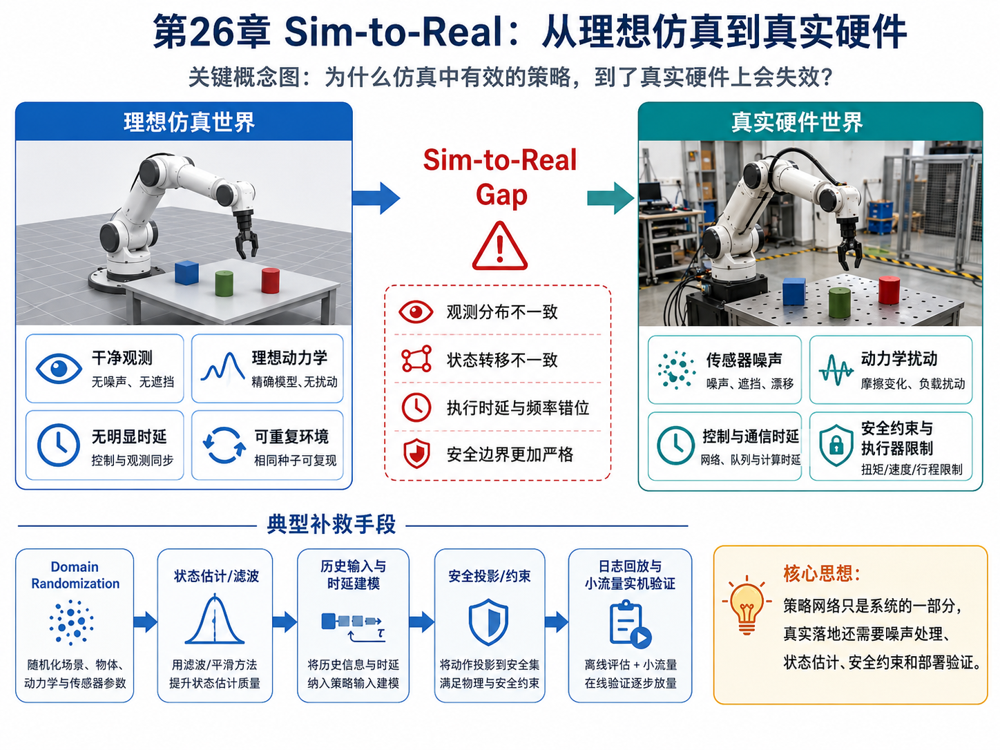
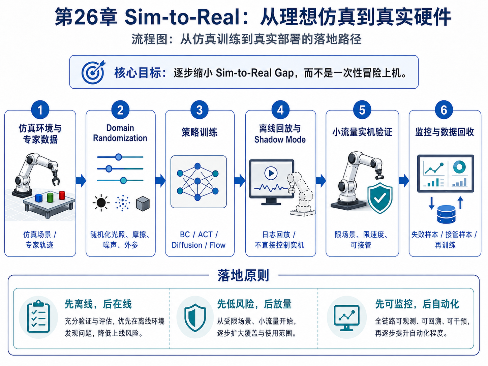

# 第26章：Sim-to-Real：从理想仿真到真实硬件

> **新版布局位置**：本章属于 **第八篇：工程落地与可信评估**。前面章节主要回答“策略怎样学习”，本章开始回答“策略为什么在真实硬件上会变差，以及如何用数学和工程机制降低这种落差”。


> **本章一句话导读**：本章补齐 Sim-to-Real 数学接口，解释噪声、扰动、时延和安全集如何影响真实硬件执行。

---

## 0. 本章要解决的问题



**图26-1 说明**：这张图把“理想仿真世界”和“真实硬件世界”并排对照，突出观测分布、状态转移、时延频率和安全边界四类差异。它对应本章开头提出的核心问题：为什么同一个策略在仿真里有效，到了真实硬件上却会失效。


在仿真环境里，一个模仿学习策略可能表现很好：

$$
a_t \sim \pi_\theta(a_t \mid o_t)
\tag{26.1}
$$

但一旦放到真实机械臂、移动机器人或自动驾驶域控上，效果可能突然下降。原因不是公式错了，而是训练时的世界和执行时的世界不一样。

本章关注的问题是：

> 如何把“理想数据上的模仿学习”推进到“真实硬件上的鲁棒闭环执行”？

这里的核心不是重新发明一个策略网络，而是补上四类工程数学对象：

1. 观测噪声；
2. 动力学扰动；
3. 时延与频率不匹配；
4. 安全集与鲁棒约束。

---

## 1. 从理想状态到真实观测

前文为了讲清模仿学习，常常把状态 $s_t$ 或观测 $o_t$ 当成干净输入。但真实系统中，策略拿到的不是 $s_t$，而是带噪观测：

$$
o_t = h(s_t) + \epsilon_t
\tag{26.2}
$$

其中：

- $s_t$：真实物理状态；
- $h(\cdot)$：传感器观测函数；
- $\epsilon_t$：观测噪声；
- $o_t$：策略真正看到的输入。

如果 $\epsilon_t$ 是小的高斯噪声，策略可能还能靠数据增强扛住；如果是遮挡、反光、油污、标定漂移造成的重尾噪声，策略就可能进入训练集中从未覆盖的区域。

因此，真实部署时要区分：

```text
策略学到的输入分布
≠
真实传感器产生的输入分布
```

这本质上仍然是分布偏移，只不过它来自硬件和环境，而不是来自策略自己跑偏。

---

## 2. 动力学扰动：真实机器人不是仿真器

在理想 MDP 中，状态转移可以写成：

$$
s_{t+1} \sim P(s_{t+1}\mid s_t,a_t)
\tag{26.3}
$$

但真实硬件里，更接近下面的形式：

$$
s_{t+1} = f(s_t,a_t;\xi) + w_t
\tag{26.4}
$$

其中：

- $f$：真实动力学；
- $\xi$：环境和硬件参数，例如摩擦、质量、关节阻尼、相机外参；
- $w_t$：未建模扰动。

仿真到现实的困难在于，训练时使用的是：

$$
s_{t+1}^{sim} = f_{sim}(s_t,a_t;\xi_{sim})
\tag{26.5}
$$

而真实执行时遇到的是：

$$
s_{t+1}^{real} = f_{real}(s_t,a_t;\xi_{real}) + w_t
\tag{26.6}
$$

当 $f_{sim}$ 和 $f_{real}$ 差距很大时，策略即使在仿真中模仿得很好，也可能在真实系统中失败。

---

## 3. Domain Randomization：把仿真变得没那么理想

一种常见做法是 domain randomization。其思想是：不要只在一个干净仿真环境中训练，而是在一族随机参数下训练：

$$
\xi \sim p(\xi)
\tag{26.7}
$$

训练目标变为：

$$
\min_\theta
\mathbb E_{\xi \sim p(\xi)}
\mathbb E_{(o,a)\sim \mathcal D_\xi}
\left[
\ell(\pi_\theta(o),a)
\right]
\tag{26.8}
$$

这意味着策略不是只适配一个仿真器，而是要在一组动力学、光照、噪声、摩擦和标定扰动下都能工作。

但 domain randomization 不是魔法。它的关键问题是：

> 随机化范围如果太窄，真实世界仍然出圈；随机化范围如果太宽，策略可能学得过于保守。

---

## 4. 时延：动作不是立刻生效的

很多模仿学习公式默认动作 $a_t$ 作用于当前状态 $s_t$。但真实系统中，动作可能在延迟 $d$ 个周期后才真正生效：

$$
s_{t+1} = f(s_t, a_{t-d})
\tag{26.9}
$$

这对高频控制非常致命。一个策略可能以为自己在根据当前图像控制机械臂，实际上机械臂执行的是几个周期之前的动作。

如果延迟不建模，策略会出现：

- 过冲；
- 振荡；
- 抓取位置偏移；
- 接触过程不稳定；
- 安全距离被吃掉。

因此，真实系统中应该把历史动作和状态纳入策略输入：

$$
a_t \sim \pi_\theta(a_t\mid o_{t-L:t}, a_{t-L:t-1})
\tag{26.10}
$$

这也是第18章 Transformer Policy、第19章 SSM / Mamba 和第23章快慢模型在工程上重要的原因。

---

## 5. 状态估计：不要把传感器读数当真相

如果真实状态不可直接观测，我们需要估计一个 belief 或状态估计：

$$
\hat s_t = \mathbb E[s_t \mid o_{1:t}, a_{1:t-1}]
\tag{26.11}
$$

在最简单的线性高斯系统中，可以写成：

$$
s_{t+1} = A s_t + B a_t + w_t
\tag{26.12}
$$

$$
o_t = C s_t + v_t
\tag{26.13}
$$

其中 $w_t$ 和 $v_t$ 分别是过程噪声和观测噪声。

卡尔曼滤波做的事情，就是在“模型预测”和“传感器观测”之间做加权融合。对模仿学习来说，关键不是要求策略自己学会所有滤波，而是要明确：

> 策略输入最好是经过状态估计和时间同步处理后的可靠观测，而不是未经治理的原始传感器流。

---

## 6. 安全集与安全流形

真实机器人部署不能只优化任务成功率，还必须满足安全约束。

定义安全集合：

$$
\mathcal S_{safe} = \{s \mid g_i(s) \le 0,\ i=1,\dots,m\}
\tag{26.14}
$$

安全执行要求：

$$
s_t \in \mathcal S_{safe},\quad \forall t
\tag{26.15}
$$

对于策略输出动作 $a_t^{raw}$，实际送到底层控制器之前，常常需要经过安全投影：

$$
a_t^{safe}
=
\arg\min_a \|a-a_t^{raw}\|^2
\quad
\text{s.t.}
\quad
f(s_t,a)\in \mathcal S_{safe}
\tag{26.16}
$$

这个公式表达的是：

> 尽量保留模型想做的动作，但如果它会把系统推向危险状态，就把它投影回安全可行域。

---

## 7. 鲁棒目标：不要只在平均情况下表现好

普通训练目标关注平均性能：

$$
\max_\pi \mathbb E_{\tau\sim p_\pi(\tau)}[R(\tau)]
\tag{26.17}
$$

但工程落地更关心 worst-case 或风险敏感性能：

$$
\max_\pi \min_{\delta\in\Delta}
\mathbb E_{\tau\sim p_{\pi,\delta}(\tau)}
[R(\tau)]
\tag{26.18}
$$

其中 $\delta$ 表示扰动，例如延迟、噪声、摩擦变化、传感器异常。

这说明：真实部署不是问“平均成功率多少”，还要问：

```text
最差工况下是否仍然安全？
罕见扰动下是否会失控？
失败时是否可恢复？
```

---

## 8. Sim-to-Real 检查清单



**图26-2 说明**：这张流程图给出从仿真环境、domain randomization、策略训练，到日志回放、shadow mode、小流量实机验证和监控回收的完整路径。它强调“先离线、后在线；先低风险、后放量；先可监控、后自动化”的真实部署原则。


在把模仿学习策略上实机之前，至少应该检查：

| 检查项 | 问题 | 推荐处理 |
|---|---|---|
| 观测噪声 | 视觉/本体输入是否稳定？ | 去噪、滤波、置信度评估 |
| 标定误差 | 相机与机器人坐标是否一致？ | 外参校验、在线校正 |
| 动力学差异 | 仿真和真实摩擦/质量是否一致？ | domain randomization、系统辨识 |
| 时延 | 推理和执行是否错位？ | 时间戳、同步、历史输入 |
| 执行器限制 | 动作是否超出速度/力矩限制？ | 动作限幅、安全投影 |
| 接触不确定性 | 接触任务是否稳定？ | 力控、阻抗控制、fallback |
| 失败恢复 | 偏离轨迹后能否回到可控区？ | recovery policy、人工接管 |

---

## 9. 与前文的关系

本章不是推翻前文，而是给前文补真实硬件接口：

- 第3章分布偏移：硬件噪声也是分布偏移来源；
- 第4章 DAgger：实机接管数据可以作为数据聚合来源；
- 第14章 Diffusion Policy：生成动作仍需安全投影；
- 第19章 SSM / Mamba：长历史有助于处理时延与噪声；
- 第23章快慢模型：快模型必须满足实时性，慢模型不能阻塞控制；
- 第24章 DPO：人类接管可以转化为偏好数据；
- 第25章部署：安全、fallback 和监控需要数学约束支撑。

---

## 10. 本章公式索引

| 公式编号 | 名称 | 用途 |
|---|---|---|
| (26.1) | 策略基本形式 | 引出真实部署问题 |
| (26.2) | 带噪观测 | 说明传感器不等于真实状态 |
| (26.3)–(26.6) | 理想与真实动力学 | 描述 Sim-to-Real 差异 |
| (26.7)–(26.8) | Domain Randomization | 通过随机化提升鲁棒性 |
| (26.9)–(26.10) | 时延建模 | 解释历史输入必要性 |
| (26.11)–(26.13) | 状态估计 | 连接滤波与策略输入 |
| (26.14)–(26.16) | 安全集与安全投影 | 描述动作安全约束 |
| (26.17)–(26.18) | 鲁棒目标 | 从平均性能转向 worst-case 性能 |

---

## 11. 建议阅读的附录条目

- 附录 B：概率论基础；
- 附录 D：高斯分布、MSE 与连续动作回归；
- 附录 E：优化基础；
- 附录 F：强化学习与序列决策基础；
- 附录 H：实验与代码基础。

---

## 12. 本章小结

Sim-to-Real 不是一个“最后调参数”的小问题，而是模仿学习策略能否真正落地的硬件鸿沟。

本章给出的核心观点是：

> 真实部署时，策略网络只是系统的一部分。观测治理、状态估计、时延处理、安全约束、鲁棒目标和 fallback，才共同决定一个模仿学习策略能不能变成可靠的机器人能力。
