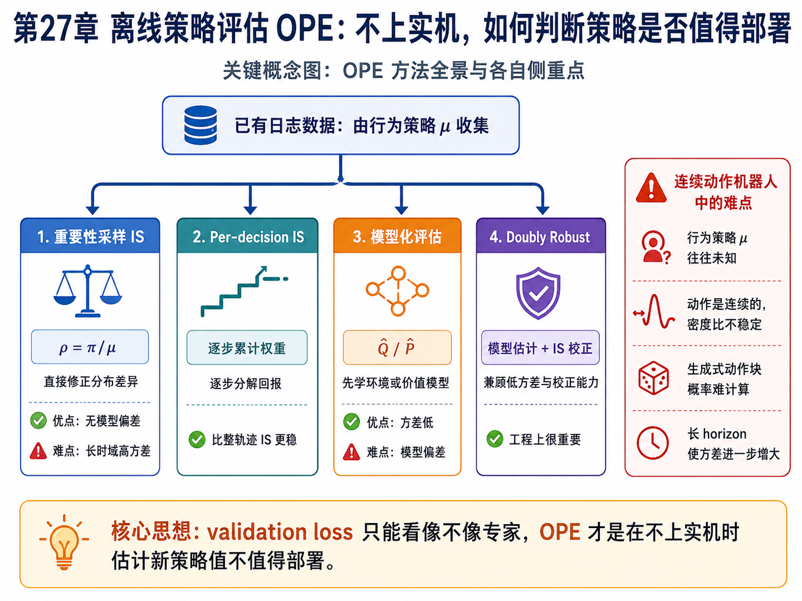
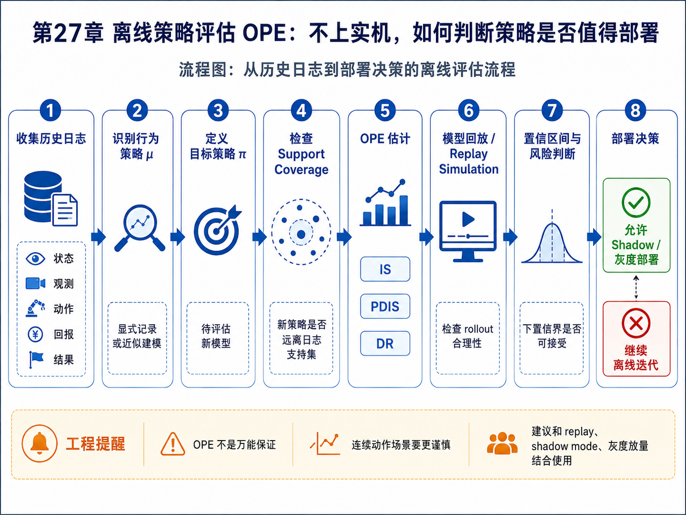

# 第27章：离线策略评估 OPE：不上实机，如何判断策略是否值得部署

> **新版布局位置**：本章属于 **第八篇：工程落地与可信评估**。第12章讲 Offline IL 的训练风险，本章进一步讨论一个工程上更尖锐的问题：不上实机，如何评估一个新策略是否真的更好？


> **本章一句话导读**：本章介绍 OPE，说明如何利用历史日志在不上实机的情况下评估新策略是否值得部署。

---

## 0. 本章要解决的问题



**图27-1 说明**：这张图把 OPE 的四条主线方法——IS、Per-decision IS、模型化评估和 Doubly Robust——放在同一视图下，并总结连续动作机器人场景中的典型难点。它可以作为阅读本章数学推导前的总览图。


在真实机器人项目中，最危险的迭代方式是：

```text
训练一个新策略
→ 直接上实机
→ 看它会不会撞、会不会失败
```

这种方式既昂贵又危险。更合理的问题是：

> 能不能利用已有日志数据，在部署前估计新策略的表现？

这就是离线策略评估：

<div class="math">\[
\text{OPE: evaluate } V^\pi \text{ using data collected by } \mu
\tag{27.1}
\]</div>

其中：

- <span class="math">\\(\mu\\)</span>：采集数据时使用的行为策略；
- <span class="math">\\(\pi\\)</span>：要评估的新策略；
- <span class="math">\\(V^\pi\\)</span>：新策略的期望回报或成功率。

---

## 1. 为什么普通 validation loss 不够？

行为克隆常用验证集损失：

<div class="math">\[
\hat L_{val}(\pi)
=
\frac{1}{N}\sum_{i=1}^{N}
\ell(\pi(o_i),a_i)
\tag{27.2}
\]</div>

但这个指标只回答：

> 新策略在专家数据上像不像专家？

它不能回答：

> 新策略闭环执行后会不会进入新状态？
> 新策略的动作误差会不会累积？
> 新策略是否在关键风险场景中更安全？
> 新策略是否比旧策略更值得部署？

所以，OPE 关注的是策略价值：

<div class="math">\[
V^\pi
=
\mathbb{E}_{\tau\sim p_\pi(\tau)}
[R(\tau)]
\tag{27.3}
\]</div>

而不是单步预测误差。

---

## 2. 行为策略与目标策略

离线数据来自行为策略 <span class="math">\\(\mu\\)</span>：

<div class="math">\[
\tau_i \sim p_\mu(\tau)
\tag{27.4}
\]</div>

但我们想评估的是目标策略 <span class="math">\\(\pi\\)</span>：

<div class="math">\[
V^\pi =
\mathbb{E}_{\tau\sim p_\pi(\tau)}
[R(\tau)]
\tag{27.5}
\]</div>

这就出现了核心困难：

```text
数据来自 μ
评估对象是 π
```

如果 <span class="math">\\(\pi\\)</span> 经常选择 <span class="math">\\(\mu\\)</span> 从未尝试过的动作，那么离线数据根本没有证据支持评估。

---

## 3. 重要性采样：用密度比修正分布差异

重要性采样的基本思想是：

<div class="math">\[
\mathbb{E}_{x\sim p}[f(x)]
=
\mathbb{E}_{x\sim q}
\left[
\frac{p(x)}{q(x)}f(x)
\right]
\tag{27.6}
\]</div>

应用到轨迹上：

<div class="math">\[
V^\pi
=
\mathbb{E}_{\tau\sim p_\mu}
\left[
\frac{p_\pi(\tau)}{p_\mu(\tau)}
R(\tau)
\right]
\tag{27.7}
\]</div>

在相同环境动力学下，轨迹密度比可写成策略概率比的乘积：

<div class="math">\[
\frac{p_\pi(\tau)}{p_\mu(\tau)}
=
\prod_{t=0}^{T}
\frac{\pi(a_t\mid s_t)}
{\mu(a_t\mid s_t)}
\tag{27.8}
\]</div>

于是得到 IS 估计：

<div class="math">\[
\hat V_{IS}
=
\frac{1}{N}\sum_{i=1}^{N}
\left(
\prod_{t=0}^{T}
\frac{\pi(a_t^i\mid s_t^i)}
{\mu(a_t^i\mid s_t^i)}
\right)
R(\tau_i)
\tag{27.9}
\]</div>

这个公式非常直观：如果某条轨迹在目标策略下更可能出现，就给它更大权重。

但问题也很明显：

> 长 horizon 下，很多概率比相乘会导致方差爆炸。

---

## 4. Per-decision IS：不要把整条轨迹压成一个权重

如果回报可写成逐步奖励：

<div class="math">\[
R(\tau)=\sum_{t=0}^{T}\gamma^t r_t
\tag{27.10}
\]</div>

可以使用 per-decision importance sampling：

<div class="math">\[
\hat V_{PDIS}
=
\frac{1}{N}\sum_{i=1}^{N}
\sum_{t=0}^{T}
\gamma^t
\left(
\prod_{k=0}^{t}
\frac{\pi(a_k^i\mid s_k^i)}
{\mu(a_k^i\mid s_k^i)}
\right)
r_t^i
\tag{27.11}
\]</div>

它只用到当前奖励之前的密度比，通常比整轨迹 IS 稳定一些。

但在长时域机器人任务中，仍然可能高方差。

---

## 5. 模型化评估：学习一个环境模型或价值模型

另一类思路是先学习一个模型：

<div class="math">\[
\hat P(s_{t+1}\mid s_t,a_t)
\tag{27.12}
\]</div>

或学习价值函数：

<div class="math">\[
\hat Q(s,a)
\approx
\mathbb{E}[R(\tau)\mid s_0=s,a_0=a,\pi]
\tag{27.13}
\]</div>

然后用它估计：

<div class="math">\[
\hat V_{model}^{\pi}
=
\frac{1}{N}\sum_{i=1}^{N}
\sum_a
\pi(a\mid s_i)
\hat Q(s_i,a)
\tag{27.14}
\]</div>

模型化评估的优点是方差低；缺点是如果模型错了，偏差会很大。

---

## 6. Doubly Robust：把 IS 和模型估计结合起来

Doubly Robust 的思想是：

> 用模型估计提供低方差基线，再用重要性采样修正模型误差。

简化写法如下：

<div class="math">\[
\hat V_{DR}
=
\frac{1}{N}\sum_{i=1}^{N}
\left[
\hat V(s_0^i)
+
\sum_{t=0}^{T}
\rho_{0:t}^i
\left(
r_t^i
+
\gamma \hat V(s_{t+1}^i)
-
\hat Q(s_t^i,a_t^i)
\right)
\right]
\tag{27.15}
\]</div>

其中：

<div class="math">\[
\rho_{0:t}^i
=
\prod_{k=0}^{t}
\frac{\pi(a_k^i\mid s_k^i)}
{\mu(a_k^i\mid s_k^i)}
\tag{27.16}
\]</div>

括号里的项：

<div class="math">\[
r_t^i+\gamma\hat V(s_{t+1}^i)-\hat Q(s_t^i,a_t^i)
\tag{27.17}
\]</div>

可以理解为模型预测误差的校正量。

如果模型很好，校正项小；如果模型有偏，IS 校正能部分修回来。这就是 doubly robust 的直觉。

---

## 7. 连续动作机器人中的困难

机器人策略常常是连续动作：

<div class="math">\[
a_t \in \mathbb{R}^d
\tag{27.18}
\]</div>

这会让 OPE 更困难。

如果目标策略是确定性策略：

<div class="math">\[
a_t = f_\theta(s_t)
\tag{27.19}
\]</div>

而行为策略 <span class="math">\\(\mu\\)</span> 是连续分布，那么普通密度比可能不稳定，甚至无法直接使用。原因是确定性策略在连续空间中对应狄拉克分布，而日志数据几乎不可能刚好采到同一个动作。

因此，连续控制 OPE 往往需要：

- 动作核平滑；
- 行为策略建模；
- learned density ratio；
- model-based rollouts；
- conservative uncertainty bound；
- 实机小流量灰度验证。

---

## 8. 对生成式策略的 OPE：Diffusion / Flow / ACT 怎么评估？

对于 ACT、Diffusion Policy、Flow Matching，一次输出可能是动作块：

<div class="math">\[
A_t = a_{t:t+H-1}
\tag{27.20}
\]</div>

目标策略是：

<div class="math">\[
\pi_\theta(A_t\mid o_t)
\tag{27.21}
\]</div>

这时评估难点包括：

1. 动作块概率密度难以准确计算；
2. 行为策略 <span class="math">\\(\mu(A\_t\mid o\_t)\\)</span> 往往未知；
3. 动作块重叠执行导致独立性假设不成立；
4. 实际控制器可能对动作做安全投影，导致日志动作不等于模型动作。

因此，对生成式机器人策略，OPE 不应该只依赖单一估计器，而应该形成评估组合：

| 评估层 | 指标 |
|---|---|
| 模仿层 | validation loss、action error、mode coverage |
| 分布层 | support coverage、OOD score、density ratio |
| 动力学层 | world model rollout score |
| 安全层 | constraint violation rate |
| 价值层 | IS / DR / model-based value estimate |
| 实机前 | shadow mode、replay simulation、灰度部署 |

---

## 9. 置信区间：不要只给一个分数

部署决策不能只看点估计：

<div class="math">\[
\hat V^\pi
\tag{27.22}
\]</div>

还应该给出置信区间：

<div class="math">\[
\Pr
\left(
V^\pi \in [L,U]
\right)
\ge 1-\delta
\tag{27.23}
\]</div>

工程上更常用的判断是：

```text
新策略的下置信界是否仍然优于旧策略？
```

也就是检查：

<div class="math">\[
L(\pi_{new}) > U(\pi_{old}) - \epsilon
\tag{27.24}
\]</div>

如果不满足，就不应该直接大规模部署。

---

## 10. OPE 在机器人项目中的落地流程



**图27-2 说明**：这张流程图从历史日志、行为策略识别、目标策略定义、support coverage 检查，一直走到 OPE 估计、replay 验证、置信区间判断和部署决策，展示了“不上实机”时一个更完整的评估闭环。


一个实用的 OPE 流程可以是：

```text
1. 明确 target policy 和 behavior policy
2. 估计或记录 behavior policy likelihood
3. 检查 support coverage
4. 用模型化方法评估 rollout
5. 用 IS / PDIS / DR 做价值估计
6. 计算置信区间
7. shadow mode 跑日志回放
8. 小流量实机灰度
9. 再决定是否扩大部署
```

---

## 11. 与前文关系

- 第12章 Offline IL 关注“如何训练不出圈”，本章关注“如何离线评估新策略”；
- 第14章 Diffusion Policy 和第15章 Flow Matching 给出生成式策略，本章提醒：生成能力强不等于离线可评估；
- 第23章快慢模型中，快慢两层都可以做 OPE；
- 第24章 DPO 中，偏好数据可以成为评估信号；
- 第25章实机部署中，OPE 是进入灰度部署之前的安全门槛。

---

## 12. 本章公式索引

| 公式编号 | 名称 | 用途 |
|---|---|---|
| (27.1) | OPE 定义 | 用行为策略数据评估目标策略 |
| (27.2) | 验证集损失 | 说明 validation loss 的局限 |
| (27.3)–(27.5) | 策略价值 | 定义 OPE 真正评估目标 |
| (27.6)–(27.9) | 重要性采样 | 用密度比修正分布差异 |
| (27.10)–(27.11) | Per-decision IS | 降低整轨迹权重方差 |
| (27.12)–(27.14) | 模型化评估 | 通过模型或价值函数评估 |
| (27.15)–(27.17) | Doubly Robust | 结合模型估计和 IS 校正 |
| (27.18)–(27.21) | 连续动作与动作块 | 说明机器人策略评估困难 |
| (27.22)–(27.24) | 置信区间 | 支持部署决策 |

---

## 13. 建议阅读的附录条目

- 附录 B：概率论基础；
- 附录 C：最大似然、负对数似然、交叉熵与 KL；
- 附录 E：优化基础；
- 附录 F：强化学习与序列决策基础；
- 附录 H：实验与代码基础。

---

## 14. 本章小结

OPE 的核心价值是把机器人策略迭代从“盲目上机试错”推进到“有置信度的离线评估”。

但本章也要提醒：OPE 不是万能保证。连续动作、长时域、生成式策略、未知行为策略都会让估计变难。工程上最稳妥的方式，是把 OPE、日志回放、shadow mode、小流量灰度和实机安全监控组合起来。

## 推荐阅读与深入材料

### 阅读目的

本章要解释 OPE 的价值和边界：不上实机评估新策略很诱人，但离线估计可能有高方差、模型偏差和分布外风险。

### 推荐材料

1. **Thomas, Theocharous, and Ghavamzadeh, 2015, “High Confidence Off-Policy Evaluation”**
   - 类型：A/B 类 OPE 基础论文。
   - 阅读目的：理解为什么只给一个平均估计不够，还需要置信度。

2. **Jiang and Li, 2016, “Doubly Robust Off-policy Value Evaluation for Reinforcement Learning”**
   - 类型：A/B 类核心方法。
   - 链接：https://arxiv.org/abs/1511.03722
   - 阅读目的：理解重要性采样和模型估计如何结合降低误差。

3. **Le, Voloshin, and Yue, 2019, “Batch Policy Learning under Constraints” / Fitted Q Evaluation 相关材料**
   - 类型：B 类方法材料。
   - 阅读目的：理解 FQE 如何用离线数据训练 Q 函数估计策略价值。

4. **Nachum et al., 2019, “DualDICE: Behavior-Agnostic Estimation of Discounted Stationary Distribution Corrections”**
   - 类型：B 类深入材料。
   - 链接：https://arxiv.org/abs/1906.04733
   - 阅读目的：理解通过分布校正做 OPE 的思路。

5. **Fu et al., 2020, “D4RL: Datasets for Deep Data-Driven Reinforcement Learning”**
   - 类型：C 类 benchmark 材料。
   - 链接：https://arxiv.org/abs/2004.07219
   - 阅读目的：理解离线 RL/OPE benchmark 中数据质量和覆盖性的重要性。

### 阅读提示

读 OPE 论文时，建议始终问：行为策略是否已知？目标策略和数据策略差多远？估计的是单步指标、轨迹成功率还是长期价值？这些问题决定 OPE 是否可信。

---
