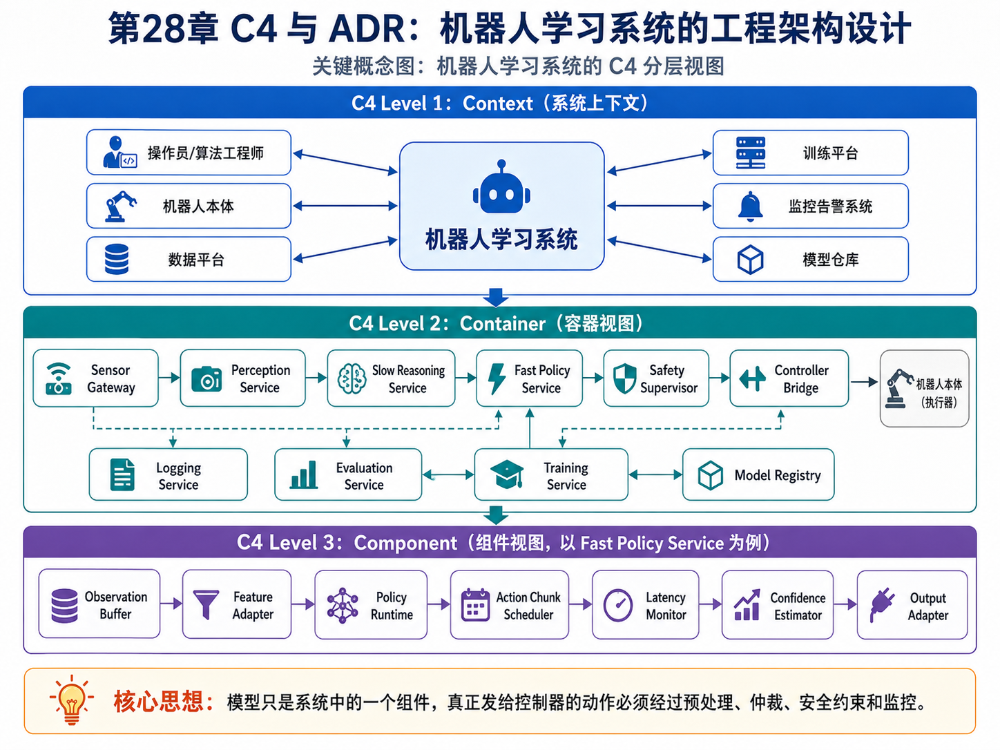
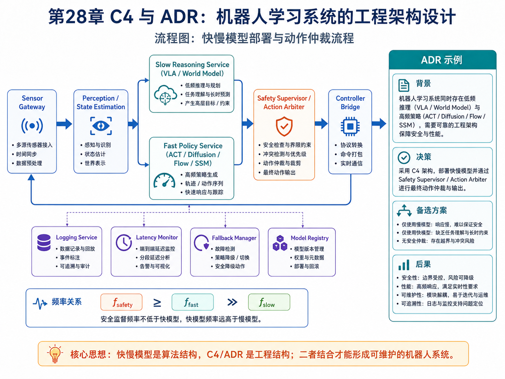

# 第28章：C4 与 ADR：机器人学习系统的工程架构设计

> **新版布局位置**：本章属于 **第八篇：工程落地与可信评估**。前面章节讨论策略模型，本章讨论这些模型如何进入真实机器人软件系统。


> **本章一句话导读**：本章用 C4 与 ADR 把算法模型放进可维护的软件架构，明确容器、组件、频率和仲裁边界。

---

## 0. 本章要解决的问题

很多算法书讲到“部署”时，常常只说：

```text
把模型导出
→ 放到机器人上推理
→ 输出动作
```

但真实机器人系统远比这复杂。一个模仿学习模型通常只是系统中的一个组件，周围还有：

- 传感器驱动；
- 时间同步；
- 感知预处理；
- VLA / world model 推理服务；
- 快动作模型；
- 安全仲裁器；
- 传统控制器；
- fallback；
- 数据记录；
- 回放与后训练平台。

本章的核心问题是：

> 如何把模仿学习算法放进一个可解释、可维护、可审查、可迭代的机器人软件架构中？

---

## 1. 为什么算法不是系统？

策略模型可以写成：

<div class="math">\[
a_t = \pi_\theta(o_t)
\tag{28.1}
\]</div>

但系统实际执行的是：

<div class="math">\[
a_t^{cmd}
=
\mathcal{A}
\left(
\pi_\theta(
\mathcal{P}(o_t)
),
\mathcal{C}(s_t),
\mathcal{M}_t
\right)
\tag{28.2}
\]</div>

其中：

- <span class="math">\\(\mathcal{P}\\)</span>：预处理、同步、滤波；
- <span class="math">\\(\mathcal{C}\\)</span>：安全约束；
- <span class="math">\\(\mathcal{M}\_t\\)</span>：系统运行状态，例如延迟、置信度、硬件状态；
- <span class="math">\\(\mathcal{A}\\)</span>：动作仲裁器；
- <span class="math">\\(a\_t^{cmd}\\)</span>：真正发给控制器的命令。

这说明：模型输出不是最终动作。真正进入电机的是经过系统加工、约束和仲裁之后的命令。

---

## 2. C4 Level 1：系统上下文图



**图28-1 说明**：这张图把 C4 的 Context、Container 和 Component 三层合在一起展示。它帮助读者把“算法模型”放回“软件系统”中理解，也对应本章关于“模型只是系统一个组件”的核心观点。


C4 的第一层是 Context。对机器人学习系统来说，应该先回答：

```text
这个系统服务谁？
依赖哪些外部系统？
它和机器人硬件、数据平台、人工标注、训练平台如何交互？
```

一个简化上下文可以写成：

```text
操作员 / 算法工程师
        ↓
机器人学习系统
        ↔ 机器人本体
        ↔ 数据采集平台
        ↔ 训练平台
        ↔ 模型仓库
        ↔ 评测平台
        ↔ 监控告警系统
```

这一步的目标不是画得复杂，而是防止把“模型”误当成“系统”。

---

## 3. C4 Level 2：容器视图

容器层回答：

> 系统由哪些可独立运行或部署的服务组成？

一个机器人模仿学习系统可以拆成：

| 容器 | 职责 |
|---|---|
| Sensor Gateway | 传感器接入、时间戳、缓存 |
| Perception Service | 图像编码、目标检测、状态估计 |
| Slow Reasoning Service | VLA、world model、任务理解 |
| Fast Policy Service | ACT / Diffusion / Flow / SSM 动作生成 |
| Safety Supervisor | 动作限幅、碰撞检查、fallback |
| Controller Bridge | 与底层控制器通信 |
| Logging Service | 记录观测、动作、状态、异常 |
| Evaluation Service | 离线回放、OPE、指标计算 |
| Training Service | 数据清洗、训练、后训练 |
| Model Registry | 模型版本、配置、签名、回滚 |

容器之间不是随便互调，而应该有明确的数据流和频率边界。

---

## 4. C4 Level 3：组件视图

以 Fast Policy Service 为例，内部可以拆成：

```text
Fast Policy Service
├── Observation Buffer
├── Feature Adapter
├── Policy Runtime
├── Action Chunk Scheduler
├── Latency Monitor
├── Confidence Estimator
└── Output Adapter
```

其输入输出可以写成：

<div class="math">\[
A_t^{raw}
=
\text{PolicyRuntime}_\theta
(
\text{FeatureAdapter}(o_{t-L:t}, z_k)
)
\tag{28.3}
\]</div>

然后由动作调度器取出当前要执行的动作：

<div class="math">\[
a_t^{raw}
=
\text{Schedule}(A_t^{raw}, t)
\tag{28.4}
\]</div>

再交给 Safety Supervisor。

---

## 5. 高频控制 loop 与低频推理 loop

第23章讲过快慢模型。系统架构里要把频率写清楚。

慢模型低频运行：

<div class="math">\[
z_k = g_\phi(o_{\le kM}, q)
\tag{28.5}
\]</div>

快模型高频运行：

<div class="math">\[
a_t = \pi_\theta(a_t\mid o_{t-L:t}, z_k)
\tag{28.6}
\]</div>

安全控制器更高优先级运行：

<div class="math">\[
a_t^{cmd}
=
\text{SafetyFilter}(a_t, s_t)
\tag{28.7}
\]</div>

频率关系可以写成：

<div class="math">\[
f_{safety} \ge f_{fast} \gg f_{slow}
\tag{28.8}
\]</div>

这条公式非常工程化：安全监督频率必须不低于动作输出频率，而慢模型不能卡住快模型。

---

## 6. 推理延迟与超时预算

对于每个控制周期，必须满足：

<div class="math">\[
T_{preprocess}+T_{inference}+T_{postprocess}+T_{comm}
<
\Delta t_{control}
\tag{28.9}
\]</div>

如果超时，就不能继续假装系统正常。需要触发：

<div class="math">\[
mode_t =
\begin{cases}
normal, & T_t < \Delta t_{control}\\
degraded, & T_t \ge \Delta t_{control}\\
fallback, & T_t \ge \Delta t_{max}
\end{cases}
\tag{28.10}
\]</div>

这就是为什么工程系统必须有 fallback，而不是只相信模型。

---

## 7. ADR：架构决策记录

ADR 不是长篇论文，而是记录关键架构选择的短文档。一个 ADR 至少包括：

```text
标题
背景
决策
备选方案
后果
状态
```

例如：

```text
ADR-001：VLA 作为慢模型，Diffusion Policy 作为快模型

背景：
VLA 具备视觉语言理解能力，但推理延迟高，无法满足 50Hz 控制。

决策：
VLA 低频输出子目标；Diffusion Policy 高频生成动作块；安全仲裁器最终输出命令。

备选：
1. VLA 直接输出动作
2. 纯 ACT 快模型
3. 传统规划 + 学习策略

后果：
优点是语义能力与实时控制解耦；
缺点是需要设计子目标接口和异步缓存机制。
```

---

## 8. 架构质量属性

做机器人学习系统时，不能只问“效果好不好”，还要问：

| 质量属性 | 关键问题 |
|---|---|
| 实时性 | 是否满足控制频率？ |
| 鲁棒性 | 传感器异常时是否退化？ |
| 可观测性 | 出错时能否定位原因？ |
| 可回滚性 | 新模型失败时能否切回旧模型？ |
| 安全性 | 模型输出是否经过约束？ |
| 可测试性 | 能否离线回放和仿真验证？ |
| 可演进性 | 模型和系统能否独立升级？ |

可以把部署风险写成一个加权评分：

<div class="math">\[
Risk =
\sum_{i=1}^{m}
w_i \cdot r_i
\tag{28.11}
\]</div>

其中 <span class="math">\\(r\_i\\)</span> 是某类风险评分，<span class="math">\\(w\_i\\)</span> 是权重。

只有当：

<div class="math">\[
Risk < \tau_{deploy}
\tag{28.12}
\]</div>

才允许进入下一阶段部署。

---

## 9. 一个推荐的机器人学习系统 C4 结构



**图28-2 说明**：这张图展示了 slow reasoning service、fast policy service、安全仲裁器、controller bridge 与监控/回滚组件之间的关系，同时给出 ADR 示例。它把第23章的快慢模型结构与本章的 C4/ADR 工程结构连接起来。


### Context

```text
算法团队 / 现场操作员 / 业务系统
        ↓
机器人学习系统
        ↔ 机器人硬件
        ↔ 数据平台
        ↔ 训练平台
        ↔ 监控平台
```

### Container

```text
Sensor Gateway
Perception Service
Slow Reasoning Service
Fast Policy Service
Safety Supervisor
Controller Bridge
Logging Service
Evaluation Service
Training Service
Model Registry
```

### Component

以 Safety Supervisor 为例：

```text
Safety Supervisor
├── State Validator
├── Action Limit Checker
├── Collision Checker
├── Latency Watchdog
├── Confidence Gate
├── Fallback Manager
└── Emergency Stop Interface
```

---

## 10. 与前文关系

- 第23章快慢模型给出算法架构，本章把它落到软件系统架构；
- 第24章 DPO 需要数据闭环，本章定义日志和训练平台接口；
- 第25章部署讲策略可靠性，本章给出容器、组件、超时和 ADR 方法；
- 第26章 Sim-to-Real 需要状态估计和安全约束，本章定义其在系统中的位置；
- 第27章 OPE 需要日志和评估平台，本章定义评估服务。

---

## 11. 本章公式索引

| 公式编号 | 名称 | 用途 |
|---|---|---|
| (28.1) | 策略模型 | 单模型视角 |
| (28.2) | 系统动作命令 | 展示预处理、安全和仲裁 |
| (28.3)–(28.4) | 快策略服务内部流程 | 连接模型和动作调度 |
| (28.5)–(28.8) | 快慢频率关系 | 定义系统频率边界 |
| (28.9)–(28.10) | 延迟预算与降级模式 | 指导实时系统设计 |
| (28.11)–(28.12) | 风险评分与部署门槛 | 支持工程决策 |

---

## 12. 建议阅读的附录条目

- 附录 A：数学符号与公式阅读方法；
- 附录 E：优化基础；
- 附录 F：强化学习与序列决策基础；
- 附录 H：实验与代码基础。

---

## 13. 本章小结

C4 和 ADR 的作用，是把“算法模型”放回“系统架构”中。

一个真实机器人系统不是：

```text
模型 → 动作
```

而是：

```text
传感器 → 状态估计 → 慢模型 → 快模型 → 安全仲裁 → 控制器 → 日志 → 评估 → 后训练
```

如果没有 C4 和 ADR，团队很容易在模型效果、实时性、安全性、可观测性和可回滚性之间做隐性权衡，最后变成不可维护的工程泥潭。

## 参考文献与推荐深入阅读

### 参考文献

- Simon Brown, “The C4 model for visualising software architecture.” <https://c4model.com/>
- Michael Nygard, “Documenting Architecture Decisions,” 2011. <https://cognitect.com/blog/2011/11/15/documenting-architecture-decisions>
- Len Bass, Paul Clements, and Rick Kazman, *Software Architecture in Practice*, Addison-Wesley.

### 推荐深入阅读

- 先用 C4 的 Context / Container / Component 三层画出现有机器人学习系统，而不是从工具或模板开始。
- ADR 建议记录“为什么选择这个方案”和“放弃了什么方案”，不要只写最终结论。
- 对策略系统，架构图必须画出数据闭环、模型注册、评估门禁、部署回滚和安全监控。
