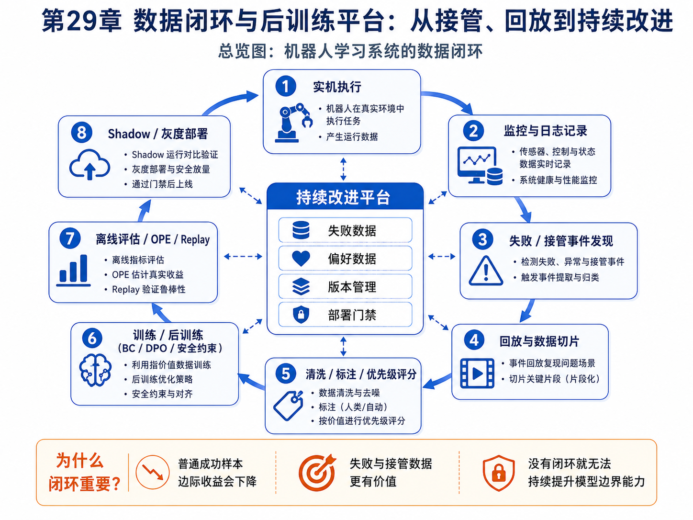
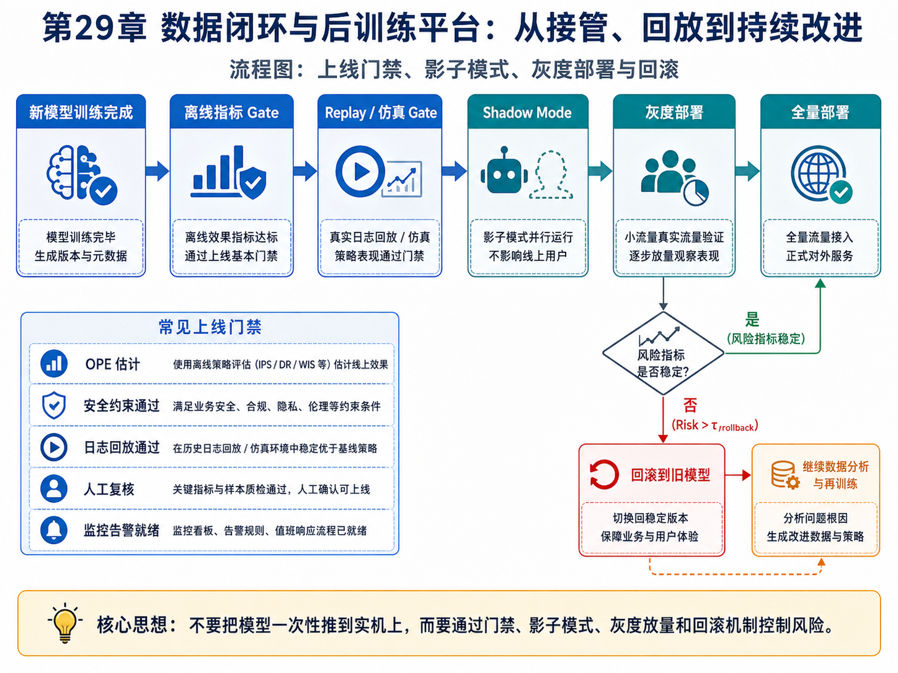

# 第29章：数据闭环与后训练平台：从接管、回放到持续改进

> **新版布局位置**：本章属于 **第八篇：工程落地与可信评估**。第24章讲 DPO，第25章讲部署，第26–28章讲硬件、评估和系统架构，本章把这些内容收束为一个持续改进平台。


> **本章一句话导读**：本章把失败、接管、回放、评估、后训练和灰度部署组织成持续改进的数据闭环。

---

## 0. 本章要解决的问题



**图29-1 说明**：这张总览图把实机执行、监控记录、失败/接管事件发现、回放切片、清洗标注、训练/后训练、离线评估、shadow/灰度部署串成一个闭环。它对应本章的总主线：模型上线后，真正重要的是持续改进平台。


模仿学习项目真正落地后，模型不会一次训练就结束。它会不断遇到：

- 新场景；
- 新物体；
- 新光照；
- 新失败模式；
- 新操作员；
- 新硬件版本；
- 新安全边界。

因此工程闭环不是：

```text
采一次数据 → 训练一次模型 → 部署结束
```

而是：

```text
采集 → 训练 → 评估 → 部署 → 监控 → 接管 → 回放 → 标注 → 后训练 → 再部署
```

本章讨论如何把这个循环系统化。

---

## 1. 数据闭环的基本对象

定义一次机器人执行日志：

$$
\mathcal E_i
=
(o_{0:T}, a_{0:T}, s_{0:T}, m_{0:T}, y)
\tag{29.1}
$$

其中：

- $o_{0:T}$：观测序列；
- $a_{0:T}$：动作序列；
- $s_{0:T}$：状态或估计状态；
- $m_{0:T}$：系统元数据，例如延迟、置信度、模式切换；
- $y$：结果标签，例如成功、失败、接管、碰撞、超时。

数据闭环的目标不是简单存数据，而是把日志变成训练资产：

$$
\mathcal D_{train}^{new}
=
\mathcal D_{train}^{old}
\cup
\mathcal D_{failure}
\cup
\mathcal D_{intervention}
\cup
\mathcal D_{preference}
\tag{29.2}
$$

---

## 2. 失败数据为什么比成功数据更值钱？

如果模型已经能完成 90% 的普通场景，那么继续大量采普通成功轨迹，边际收益会下降。

更有价值的是失败边界：

$$
\mathcal D_{failure}
=
\{ \tau_i \mid y_i = failure \}
\tag{29.3}
$$

以及接管纠偏数据：

$$
\mathcal D_{intervention}
=
\{(\tau_i^{before}, \tau_i^{human})\}
\tag{29.4}
$$

它们告诉模型：

```text
什么地方会失败？
人类在失败前如何修正？
哪些动作虽然能做但不安全？
哪些计划看似合理但最终失败？
```

---

## 3. 从接管到偏好数据

人类接管可以自然构造成偏好对。

如果机器人原始动作片段是 $A^{-}$，人类接管后的动作片段是 $A^{+}$，则得到：

$$
(c, A^{+}, A^{-})
\tag{29.5}
$$

其中 $c$ 是场景条件。

这正好对应第24章 DPO 中的偏好数据：

$$
\mathcal D_{pref}
=
\{(c_i, y_i^+, y_i^-)\}_{i=1}^{N}
\tag{29.6}
$$

这里的 $y_i$ 可以是语言回答，也可以是高层计划、动作块或完整轨迹。

---

## 4. 数据优先级：不是所有数据都同等重要

工程数据闭环里，要给样本打优先级。

一种简单评分可以写成：

$$
Score(\tau)
=
\alpha \cdot Failure(\tau)
+
\beta \cdot Novelty(\tau)
+
\gamma \cdot Uncertainty(\tau)
+
\eta \cdot Risk(\tau)
\tag{29.7}
$$

其中：

- $Failure(\tau)$：是否失败；
- $Novelty(\tau)$：是否新颖；
- $Uncertainty(\tau)$：模型是否不确定；
- $Risk(\tau)$：是否接近危险边界。

采样训练时，可以按优先级分布：

$$
p(\tau_i)
=
\frac{\exp(Score(\tau_i)/T)}
{\sum_j \exp(Score(\tau_j)/T)}
\tag{29.8}
$$

这能让训练更关注高价值样本，而不是被大量普通成功数据淹没。

---

## 5. 版本管理：数据、模型、配置必须一起记录

一次训练结果至少应该记录：

$$
Version =
(\mathcal D,\theta,Config,Code,Eval)
\tag{29.9}
$$

其中：

- $\mathcal D$：训练数据版本；
- $\theta$：模型权重版本；
- $Config$：训练与部署配置；
- $Code$：代码 commit；
- $Eval$：评估报告。

如果只保存模型权重，不保存数据和配置，后续就很难回答：

```text
这个模型为什么变好？
为什么某个场景变差？
能不能回滚？
这个问题是数据导致还是代码导致？
```

---

## 6. 从训练到部署的门禁

模型进入实机部署前，应该通过多级 gate：

$$
Gate =
G_{offline}
\land
G_{sim}
\land
G_{replay}
\land
G_{shadow}
\land
G_{safety}
\tag{29.10}
$$

其中：

- $G_{offline}$：离线指标是否达标；
- $G_{sim}$：仿真测试是否达标；
- $G_{replay}$：日志回放是否达标；
- $G_{shadow}$：影子模式是否稳定；
- $G_{safety}$：安全约束是否通过。

只有当所有 gate 通过，才允许进入灰度部署：

$$
Deploy(\pi_\theta)=1
\iff
Gate=1
\tag{29.11}
$$

---

## 7. 影子模式：先看模型想做什么

影子模式下，新模型不控制机器人，只记录它会输出什么：

$$
a_t^{shadow} = \pi_{\theta_{new}}(o_t)
\tag{29.12}
$$

真实执行仍然由旧策略或人工控制：

$$
a_t^{exec} = a_t^{old}
\tag{29.13}
$$

然后比较：

$$
d_t = \|a_t^{shadow}-a_t^{exec}\|
\tag{29.14}
$$

如果新模型在高风险状态下频繁给出大偏差动作，就不能直接部署。

---

## 8. 灰度部署与回滚



**图29-2 说明**：这张流程图展示了新模型从离线 gate、replay / 仿真 gate，到 shadow mode、灰度部署、全量部署以及触发回滚的标准路径。它强调风险控制与再训练回路是工程闭环的一部分，而不是上线后的补丁。


灰度部署可以用混合策略表示：

$$
\pi_{deploy}
=
(1-\lambda)\pi_{old}
+
\lambda \pi_{new}
\tag{29.15}
$$

其中 $\lambda$ 表示新策略流量比例。

随着指标稳定，可以逐步增加：

$$
\lambda_0 < \lambda_1 < \dots < 1
\tag{29.16}
$$

但如果风险指标超过阈值：

$$
Risk_t > \tau_{rollback}
\tag{29.17}
$$

则触发回滚：

$$
\pi_{deploy} \leftarrow \pi_{old}
\tag{29.18}
$$

---

## 9. 持续后训练

数据闭环的最后一步是后训练。

对于行为克隆数据：

$$
\mathcal L_{BC}
=
-\mathbb E_{(o,a)\sim \mathcal D}
[\log \pi_\theta(a\mid o)]
\tag{29.19}
$$

对于偏好数据，可以使用 DPO 类目标：

$$
\mathcal L_{pref}
=
-
\mathbb E_{(c,y^+,y^-)\sim\mathcal D_{pref}}
\left[
\log \sigma
\left(
\beta
\log
\frac{\pi_\theta(y^+\mid c)\pi_{ref}(y^-\mid c)}
{\pi_\theta(y^-\mid c)\pi_{ref}(y^+\mid c)}
\right)
\right]
\tag{29.20}
$$

最终训练目标可以组合为：

$$
\mathcal L
=
\lambda_{BC}\mathcal L_{BC}
+
\lambda_{pref}\mathcal L_{pref}
+
\lambda_{safe}\mathcal L_{safe}
\tag{29.21}
$$

其中 $\mathcal L_{safe}$ 可以来自安全约束、碰撞惩罚、动作平滑或规则违反。

---

## 10. 平台化架构

一个完整平台可以拆成：

```text
数据采集层
  ├── 实机日志
  ├── 仿真日志
  ├── 人类接管
  └── 失败回放

数据治理层
  ├── 清洗
  ├── 切片
  ├── 标注
  ├── 去重
  └── 优先级评分

训练层
  ├── BC
  ├── Diffusion / Flow
  ├── DPO
  └── 安全约束微调

评估层
  ├── OPE
  ├── 仿真测试
  ├── 日志回放
  ├── shadow mode
  └── 灰度指标

部署层
  ├── 模型仓库
  ├── 配置发布
  ├── fallback
  ├── 监控告警
  └── 回滚
```

---

## 11. 与前文关系

本章把前面内容串成平台闭环：

- 第24章 DPO：偏好数据如何训练；
- 第25章部署：部署需要 gate、监控和回滚；
- 第26章 Sim-to-Real：真实硬件数据是闭环核心；
- 第27章 OPE：部署前评估；
- 第28章 C4 / ADR：平台架构设计；
- 第23章快慢模型：快慢两层都需要日志、评估和后训练。

---

## 12. 本章公式索引

| 公式编号 | 名称 | 用途 |
|---|---|---|
| (29.1) | 执行日志 | 定义闭环数据基本单元 |
| (29.2) | 训练数据扩展 | 将失败、接管和偏好数据纳入训练 |
| (29.3)–(29.6) | 失败与偏好数据 | 从接管构造偏好对 |
| (29.7)–(29.8) | 数据优先级 | 高价值样本采样 |
| (29.9) | 版本管理 | 绑定数据、模型、配置和代码 |
| (29.10)–(29.11) | 部署门禁 | 控制模型进入实机 |
| (29.12)–(29.14) | 影子模式 | 部署前记录新模型行为 |
| (29.15)–(29.18) | 灰度与回滚 | 控制上线风险 |
| (29.19)–(29.21) | 持续后训练目标 | 组合 BC、偏好和安全损失 |

---

## 13. 建议阅读的附录条目

- 附录 C：最大似然、负对数似然、交叉熵与 KL；
- 附录 E：优化基础；
- 附录 F：强化学习与序列决策基础；
- 附录 H：实验与代码基础；
- 附录 I：熵、最大熵与 Score Matching。

---

## 14. 本章小结

数据闭环的本质，是把机器人系统从“一次性训练模型”升级为“持续学习和持续评估的平台”。

它不是单纯多收数据，而是要把：

```text
失败
接管
偏好
日志
评估
部署
回滚
后训练
```

组织成可追踪、可复现、可审查、可持续迭代的工程闭环。

至此，全书的最终主线也完整闭合：

```text
模仿专家动作
→ 理解分布偏移
→ 建模轨迹与行为分布
→ 生成复杂动作
→ 引入长序列和多模态策略
→ 建立世界模型与快慢系统
→ 通过偏好和数据闭环持续改进
→ 在真实硬件中可信部署
```
