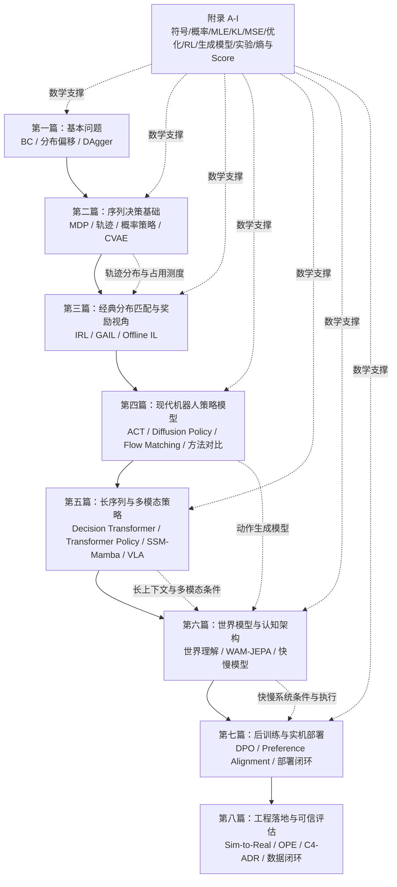

# 全书数学知识地图（新版布局）


> 本知识地图对应新版 **八篇、二十九章、九个附录** 的布局。它的作用是帮助读者看到：每一组章节新增了什么数学对象，解决了什么问题，又如何连接到下一组方法。

## 1. 总体关联图



## 2. 七篇之间的数学递进

| 篇章 | 新增数学对象 | 解决的问题 | 铺垫后文 |
|---|---|---|---|
| 第一篇 | <span class="math">\\((o\_t,a\_t)\\)</span>、<span class="math">\\(\pi\_\theta(a\mid o)\\)</span>、训练分布/执行分布 | 行为克隆为什么简单但会翻车 | MDP、轨迹分布 |
| 第二篇 | <span class="math">\\(p(\tau)\\)</span>、<span class="math">\\(d\_\pi(s)\\)</span>、概率策略、隐变量 <span class="math">\\(z\\)</span>、ELBO | 模仿学习为什么是序列决策问题 | IRL、GAIL、生成式策略 |
| 第三篇 | reward、occupancy measure、OOD 支持集 | 如何从动作拟合走向行为分布匹配 | 现代策略模型 |
| 第四篇 | action chunk、去噪模型、速度场、生成式动作分布 | 如何表达复杂连续动作 | 长序列架构与 VLA |
| 第五篇 | token 序列、attention state、SSM hidden state、多模态 token | 如何处理长历史、高频控制和视觉语言动作 | 世界模型与快慢系统 |
| 第六篇 | latent world state、forward dynamics、slow/fast timescale | 如何从动作模仿走向世界预测与双系统架构 | DPO 与部署 |
| 第七篇 | preference pair、DPO log-ratio、安全约束、fallback | 如何后训练并部署可靠机器人策略 | 工程闭环 |
| 第八篇 | 噪声/扰动/时延、安全集、OPE、DR、C4/ADR、数据闭环 | 如何评估、架构化并持续改进真实机器人系统 | 可信落地体系 |

## 3. 新版章节依赖表

| 新章节 | 标题 | 主要依赖 | 主要输出 |
|---|---|---|---|
| 第1–4章 | 基本问题 | 基础监督学习直觉 | BC、分布偏移、DAgger |
| 第5–9章 | 序列决策与轨迹基础 | 概率、MDP、优化 | 轨迹分布、概率策略、CVAE |
| 第10–12章 | IRL/GAIL/Offline IL | 轨迹分布、occupancy measure | 奖励视角、分布匹配、OOD |
| 第13–16章 | ACT/Diffusion/Flow/对比 | 概率策略、隐变量、生成模型 | 现代动作分布建模 |
| 第17–20章 | DT/Transformer/SSM/VLA | 序列建模、多模态建模 | 长上下文与 VLA 策略 |
| 第21–23章 | 世界模型/JEPA/快慢系统 | MDP、latent state、生成式策略 | 认知架构闭环 |
| 第24–25章 | DPO/部署 | 偏好数据、策略分布、安全约束 | 后训练与实机闭环 |

## 4. 读者如何使用这张图？

1. 读基础章节时，先问：这里新增的是哪个数学对象？
2. 读现代方法时，先问：它在表达什么分布？
3. 读世界模型和快慢模型时，先问：它解决的是“预测未来”“长时域规划”还是“实时控制”？
4. 读后训练和部署时，先问：这个模型怎样在失败数据和人类偏好中继续变好？

## 5. 一句话地图

> 新版全书的数学主线，是从 <span class="math">\\(\pi\_\theta(a\mid o)\\)</span> 的单步模仿开始，逐步扩展到轨迹分布、行为分布匹配、生成式动作模型、长序列多模态策略、世界预测、快慢系统，以及偏好对齐和实机部署闭环。


## 6. 第八篇补充后的工程闭环

第八篇将全书从“可部署”进一步推进到“可信可评估”：

```text
真实硬件扰动
→ Sim-to-Real 鲁棒接口
→ OPE 离线策略评估
→ C4 / ADR 系统架构
→ 数据闭环与后训练平台
```

它补齐了四类工程数学对象：

| 对象 | 对应章节 | 作用 |
|---|---|---|
| 噪声、扰动、时延、安全集 | 第26章 | 描述真实硬件和理想仿真的差异 |
| 重要性采样、Doubly Robust、置信区间 | 第27章 | 支持不上实机的部署前评估 |
| 延迟预算、风险评分、架构决策 | 第28章 | 把算法放入可维护系统 |
| 数据优先级、部署门禁、影子模式、灰度回滚 | 第29章 | 形成持续改进闭环 |
