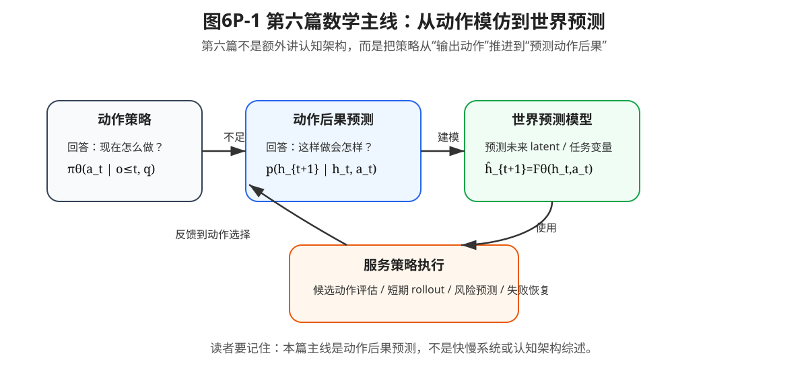

# 第六篇导读：从动作模仿到世界预测

这一篇从“策略如何生成动作”推进到“机器人如何预测动作后果”。

前五篇主要回答一个问题：如何从专家数据中学习动作策略。到第五篇为止，现代策略模型已经可以把视觉、语言、状态历史和动作历史放进统一上下文中，让策略根据复杂条件生成动作或动作块。

这个进展很重要，但它仍然留下一个关键问题：

> 策略能输出动作，并不等于它知道动作执行之后世界会怎样变化。

真实机器人不能只背专家动作表。它还需要预测物体会不会滑、夹爪会不会碰、插入会不会卡、动作失败后还能不能恢复。第六篇讨论的就是这层能力：**从动作模仿走向动作后果预测**。

本篇不把“快慢系统”作为主线，也不展开泛泛的认知架构综述。快慢系统只作为工程补充出现：当世界预测和任务规划无法满足低层控制频率时，系统通常需要时间尺度分工、异步缓存和 fallback。

---

## 1. 本篇为什么出现

前面章节的核心对象主要是条件策略，例如视觉、语言和历史上下文条件下的动作生成。

**公式 (6P.1)：多模态条件策略**

$$\pi_\theta(A_t \mid o_{\le t}, q)$$

这个公式读作：策略根据到当前时刻为止的观测历史 $o_{\le t}$ 和任务指令 $q$，生成一段动作块 $A_t$。

它回答的是：

```text
在当前观测和任务条件下，策略应该输出什么动作？
```

但真实机器人还需要回答另一个问题：

```text
如果执行这段动作，未来世界会怎样变化？
```

因此，本篇新增的核心对象是动作条件的世界预测。

**公式 (6P.2)：动作条件的未来预测**

$$p_\phi(h_{t+1:t+H} \mid h_t, A_t, c_t)$$

其中：

- $h_t$：当前世界表示或 latent state；
- $A_t$：候选动作块；
- $c_t$：任务、语言、历史或本体状态等上下文；
- $h_{t+1:t+H}$：未来一段时间的世界表示；
- $p_\phi$：世界预测模型或动作条件世界模型。

这就是第六篇的主线：

```text
策略生成动作
→ 世界模型预测动作后果
→ 风险、目标和偏好模型筛选动作
→ 用预测辅助计划、验证、安全判断和失败恢复
```



**图6P-1 说明**：这张图想说明第六篇的数学主线不是“认知架构综述”，而是从动作策略 $\pi_\theta(a_t \mid o_{\le t},q)$ 推进到动作后果预测 $p(h_{t+1}\mid h_t,a_t)$，再把预测结果用于计划、验证、安全判断和失败恢复。

---

## 2. 本篇新增数学对象

第六篇会引入以下对象。

1. **动作后果预测**：从“输出什么动作”推进到“执行动作后会发生什么”。
2. **世界模型**：预测世界状态、世界表示或任务相关变量如何随时间变化。
3. **动作条件世界模型**：显式把动作或动作块作为条件，预测“如果这样做会怎样”。
4. **JEPA 式表示预测**：不强求重建像素，而是预测对决策有用的未来表示。
5. **预测误差**：比较预测未来和真实反馈，用于异常检测、纠错和 fallback。
6. **候选动作评估**：让策略提出多个候选动作，再用世界预测结果辅助选择。
7. **短期 rollout**：用世界模型预测短 horizon 后果，判断动作块是否可行。
8. **风险预测与失败恢复**：根据预测风险决定继续、修正、重规划、fallback 或接管。

这些对象共同回答一个问题：

> 模仿学习策略如何从“像专家那样做”，进一步走向“知道这样做之后可能发生什么”。

---

## 3. 本篇三章关系

### 第21章：从动作模仿到世界预测

第21章是问题引出章。它不急着介绍复杂模型，而是先说明 policy-only 的局限：只学习动作条件分布，无法直接回答动作后果问题。

它的核心问题是：

```text
为什么会输出动作，还不等于能预测动作后果？
```

### 第22章：World Models、World Action Models 与 JEPA

第22章是本篇数学核心章。它正式展开世界模型、动作条件世界模型和 JEPA 式表示预测。

它的核心问题是：

```text
如何把“预测动作后果”写成可训练的数学目标？
```

### 第23章：世界预测如何进入机器人策略系统

第23章是使用方式章。它不再把快慢系统作为主线，而是讨论世界预测学到之后，如何进入真实机器人策略系统。

它的核心问题是：

```text
世界预测如何服务候选动作评估、短期 rollout、风险预测、失败恢复和安全边界？
```

快慢系统只在本章作为补充内容出现，用来说明：如果世界预测模块较慢而低层控制频率较高，工程上通常需要时间尺度分工、异步缓存和 fallback。

---

## 4. 本篇与前后篇的接力

第五篇解决的是策略表达问题：历史、多模态和语言条件如何进入动作生成。

第六篇继续追问：动作生成之后，机器人如何预测动作后果、发现异常、比较候选方案并辅助失败恢复。

第七篇会继续处理：如果系统执行失败、人类接管、偏好数据出现，如何通过后训练和对齐改进策略。

第八篇会继续处理：这些模型如何进入真实工程系统，如何评估、部署、监控和持续迭代。

所以第六篇不是脱离主线的“认知架构综述”，而是从动作策略走向动作后果预测的中间桥梁。

---

## 5. 读完本篇，你应该能判断什么

读完第六篇后，你应该能形成以下判断。

1. VLA 能生成动作，但不等于能预测动作后果。
2. 世界模型的重点不是生成漂亮视频，而是预测对决策有用的未来表示。
3. World Action Model 比一般 world model 更强调动作条件，即“如果执行这个动作块，世界会怎样变化”。
4. JEPA 式预测强调表示预测，而不是逐像素重建。
5. 世界预测可以用于候选动作评估、短期 rollout、风险预测和失败恢复。
6. 世界模型预测误差小，不等于机器人控制一定成功。
7. 世界预测不能替代真实控制器、安全边界和实机验证。
8. 快慢系统只是工程补充，不是第六篇数学主线。

---

## 6. 阅读提醒

阅读本篇时，不要只关注模型名字，而要始终追问四个问题：

```text
本章新增了什么数学对象？
它解决了前一篇留下的什么问题？
它是否帮助机器人预测动作后果？
它又为后一篇的后训练、部署和评估铺垫了什么能力？
```

如果一个概念不能帮助机器人更好地预测后果、选择动作、发现异常或进入部署闭环，它就只是一个漂亮名词，而不是本书主线中的关键对象。
